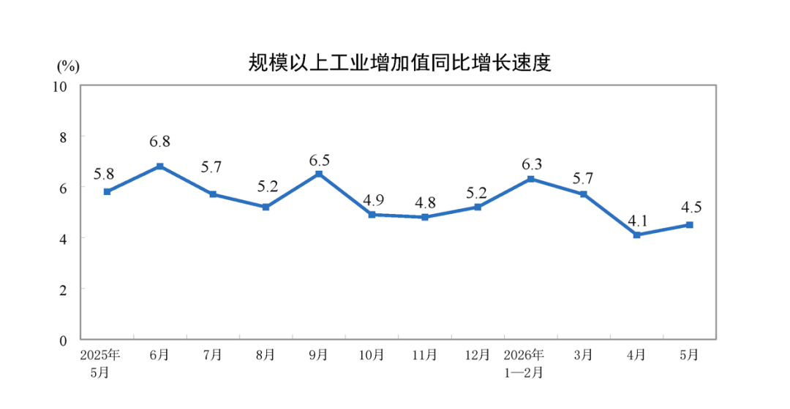
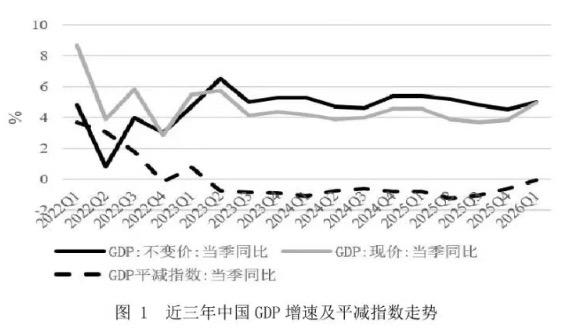
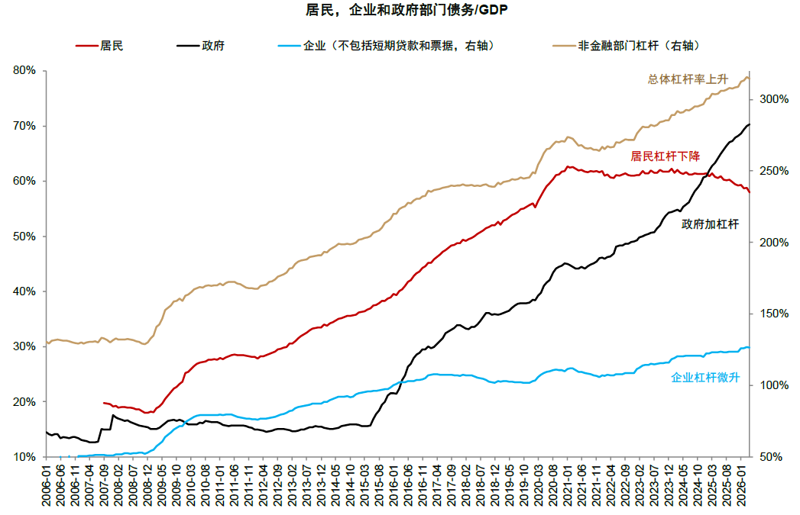
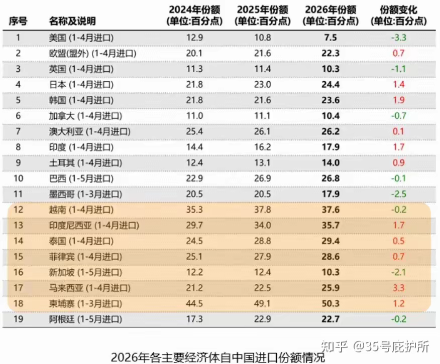

[toc]

# 问题

提问者：**<a href="https://www.zhihu.com/people/zhong-guo-wang-25">中国网</a>**
提问时间: 2026-7-15 10:1:49
总回答数: 227
总访问量: 836904

7月15日，国家统计局发布数据：初步核算，上半年国内生产总值695704亿元，按不变价格计算，同比增长4.7%。分季度看，今年一季度国内生产总值同比增长5.0%，二季度增长4.3%。从环比看，二季度国内生产总值增长0.9%。

[国家统计局：2026年上半年GDP同比增长4.7%](https://www.peopleapp.com/column/30052661650-500007598037)

# 回答

回答者： **<a href="https://www.zhihu.com/people/huan-le-ying-xiong-8-20">35号庇护所</a>**
回答时间: 2026-7-15 10:49:2
点赞总数: 50
评论总数: 6
收藏总数: 5
喜欢总数：11

这个增幅正好是部分机构对上半年预测值的“上限”，也是年度增速目标4.5%-5.0%的中间档位，完美。

1).时代周报梳理了8家机构预测显示：

4家机构预计二季度GDP同比增长4.5%，2家预计增长4.4%，1家(未名宏观)预计增长4.7%，1家预计增长4.2%。

2).二季度的GDP增长动能较1季度放缓，和历年的趋势基本一致(但自2011以来也有4年Q2比Q1增速高)。

2023年‌Q1 4.7%、Q2 6.5%；‌

2024年‌Q1 5.3%、Q2 4.7%；‌

2025年‌Q1 5.4%、Q2 5.2%；

2026年‌Q1 5.0%、Q2 4.3%。

其实截止5月份的宏观投资数据、特别是固定投资走势上体现的很明显，毕竟投资(债务&杠杆)依然是总量增长的绝对主力驱动因素，只是在2024年下半年开始，出口的贡献度大幅上升。

传导到制造业上就是工业增加值增速继续放缓：

制造业固定资产投资1季度增速4.1%、1-4月“向好”至1.2%，1-5月为-0.4%。

另一面则是高歌猛进的AI/高端制造板块持续高达两位数的投资增速(不过AI板块投资热度已经开始下降了)、以及所谓的K型分化，表现在指标上就是上下游行业的盈利能力分化和上游成本无法向下游传导(CPI/PPI)。

需求-供给、居民收入/企业利润-物价/成本在zhai务-桶锁螺旋下，依然是“待改善”状态，GDP平减指数的长期走势上体现的很直接：

自然的，下半年能够对总量增长快速形成拉动作用的就是资产价格(房地产)和出口了。

稍微看一下这两方面的情况。

1.房地产

1-5月全国商品房销售面积累计同比-10.8%，住宅销售额累计同比-13.5%，销售降幅较2025年末扩大；5月70个城市新房价格同比-3.6%，跌幅较2025年末扩大0.6个百分点；二手房价格同比-5.9%，跌幅较2025年末收窄0.2个百分点。

2026年上半年全国法拍房累计挂拍46.3万套‌，较去年同期的37.6万套增长‌23.1%。总成交金额约‌1515亿/同比+17.6%‌；而清仓率22.2%‌仅同比+1.1个百分点；同时成交均价下降8.9%。

居民中长期贷款存量和杠杆率还在持续“向好”。

2.出口，这也是目前总量增速最好看的。

1).实际上，各国或者起码可以说承接转口贸易的那几个关税战中获益较大的国家，都是如此、出口增速都在两位数以上。但是，观察1-5月等时间段这些国家自华进口的增速绝对值变化就是另一回事了。

其实反映出的情况就是东盟(包括非洲)能提供的增量空间很有限了，考虑到欧洲目前的贸易立场，那么美国市场就非常重要了。但从上半年的对美出口特别是来自美国的投资规模看，依然处于“修复”阶段。

2).所以，接下来的国际贸易环境很重要。

今年肯定能完成GDP增速目标，甚至可以说100%能完成；“向好预期”还会增强，但上下游、供需两侧、不同经济部门体感的K型分化也会持续下去。

  

原文地址：[(35号庇护所)2026 年上半年 GDP 695704 亿元，同比增长 4.7%，如何解读这一数据...](https://www.zhihu.com/question/2060665371351331817/answer/2060677252036178917) 

# 评论

1. <a href="https://www.zhihu.com/people/a-cheng-77-4">小麻包学日语</a> (<small title="安徽">2026-7-15 12:50:33</small>): 这说明这些机构很有水平，预测的很准。
   - <a href="https://www.zhihu.com/people/r5zdb1">喀什噶尔的思念</a> (<small title="江苏">2026-7-15 13:59:5</small>): 预判了自己的预判［doge］
2. <a href="https://www.zhihu.com/people/zhan-yu-peng-79">zzzzz</a> (<small title="北京">2026-7-15 13:29:35</small>): 这哪是预测值上限了，是预测下限，二季度增速4.3
3. <a href="https://www.zhihu.com/people/forchina-98">无极</a> (<small title="浙江">2026-7-15 12:3:43</small>): 先画靶子再射箭
4. <a href="https://www.zhihu.com/people/jin1458545420">jin1458545420</a> (<small title="上海">2026-7-15 11:9:18</small>): 说是前几天又买了几船美国大豆，政冷经热名不虚传
5. <a href="https://www.zhihu.com/people/edenlive-70">Edenlive</a> (<small title="河南">2026-7-15 15:25:57</small>): 又一次躺赢

=[评论](./attachments/comments.json)

