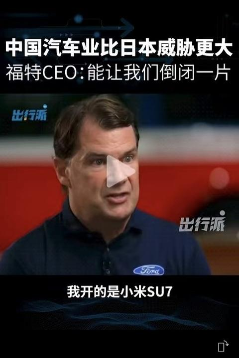

[toc]

# 问题

提问者：**<a href="https://www.zhihu.com/people/21-35-70-25">御魂封神</a>**
提问时间: 2026-8-4 21:39:25
总回答数: 262
总访问量: 1474666

[中新网](https://www.zhihu.com/)8月4日电 据路透社4日报道，知情人士透露，美国政府正起草一项禁令，拟禁止进口中国新型号的数据中心组件，以保护支撑人工智能(AI)发展的关键基础设施。

  

  

　　四名知情人士称，负责监管美国电信行业的联邦通信委员会(FCC)正在制定相关措施，计划禁止进口中国新型号的光收发模块。光收发模块主要用于数据中心内部的高速光纤数据传输。

  

  

　　美国官员希望2026年内公布并实施禁令。

  

  

　　不过，知情人士称，FCC仍可能修改或搁置有关限制。

  

  

　　对此，中国驻美国大使馆回应称，北京敦促美国“倾听两国工商界客观、理性的声音”，停止抹黑中国企业并以制裁相威胁。使馆还说：“对于任何严重损害中方利益的行动，中国都将采取一切必要措施予以回应。”

  

  

　　若禁令落地，可能冲击全球主要光收发模块供应商中际旭创。Counterpoint Research的数据显示，中际旭创占全球数据中心光收发模块市场约27%，居行业领先地位。

  

  

[外媒：美国拟禁止进口中国新型数据中心设备](https://www.chinanews.com.cn/gj/2026/08-04/10671959.shtml)

# 回答

回答者： **<a href="https://www.zhihu.com/people/ferrarizrw">AI解码师</a>**
回答时间: 2026-8-5 0:14:8
点赞总数: 1662
评论总数: 196
收藏总数: 460
喜欢总数：71

光收发模块是一个可以插拔的小盒子，插在交换机的前面板上，作用是把交换芯片吐出来的电信号转成光，塞进光纤跑到另一头，再转回电。在一个AI数据中心里，一个GB200的576卡集群，光是800G的光模块就要塞进去一万八千多个，一个机架的光模块价值超过十万美元。

中国厂商在这个领域，良率、产能弹性、成本控制，市场占有率做到了七成。旭创的800G良率能压到95%以上，毛利率能维持，英伟达追加订单，旭创加新易盛一口气吃掉了六成。

___

不过，英伟达正打算拆掉这个“小盒子”。

今年6月，英伟达在台北发布了全球第一款用CPO（共封装光学）的Spectrum-X以太网交换机，下半年就要量产交付。CPO就没要这个盒子了，直接把光引擎，负责光电转换的硅光器件和交换芯片封装在同一块基板上。

因为到了800G、1.6T这个速率，电信号从交换芯片跑到前面板那15到30厘米的电路板走线，损耗大到快撑不住了。CPO把这段电气距离从300毫米压到50毫米以内，功耗可以砍掉六成多。黄仁勋在GTC上也说了：Rubin Ultra那代给铜缆或铜缆+CPO的混合方案，到Feynman那代（2028年）就能整个切到CPO。

也就是说，整个行业的技术重心，要从“做一个更好的可插拔光模块”，转移到“把光直接塞进芯片封装里”了，往硅光芯片、往先进封装、往台积电的COUPE平台迁移。

___

FCC的这份禁令，锁定的恰恰是中国目前占尽优势、但技术上正在被超越的那个环节——可插拔光模块。

还好，中国厂商还有腾挪空间。可插拔模块的绝大部分需求仍在海外云厂商手里，禁令即便落地，也只是“新型号”入不了关，存量和已认证的型号短期动不了，加上豁免非中国供应商那套操作，冲击是渐进的，没有一刀切。旭创90%收入来自海外，短期难受，但也不至于伤筋动骨。

CPO时代游戏规则彻底换了。核心从“谁能把模块组装得又便宜又好”，变成了“谁掌握硅光芯片设计、谁能拿到台积电COUPE的先进封装产能、谁进得了英伟达和博通的CPO验证链”。英伟达今年3月给Lumentum和Coherent各砸20亿美元、签下巨额采购承诺——注意这两家公司正是FCC禁令下“有望受益”的美国替代供应商。台积电COUPE平台2026到2027年的量产客户，就锁死在英伟达、博通、AMD三家。

看明白了吧，一边FCC用国家安全的名义，把中国厂商从美国数据中心的“存量入口”往外推；另一边是英伟达用资本和产能承诺，把CPO的“增量高地”提前分配给了美国的激光器和硅光玩家。

趁数据中心还在大规模铺设、供应链还没定型，就是要从一开始“锁干净”。老美心里最怕的是重演华为那种设备一旦嵌进基础设施深处，再想拔出来就慢、贵、还拔不干净，要在CPO这个还没固化的新供应链里，抢在中国厂商嵌进去之前先动手。

___

我们这边，其实1.6T CPO产品已经进了英伟达Spectrum-X CPO交换机的验证链，紫光股份的51.2T CPO硅光交换机2025年就在客户侧批量交付了。天孚通信这种做FAU（光纤阵列单元）的，在CPO这个新架构里是最直接受益的核心器件环节之一。中国产业界并没有在CPO这条新曲线上缺席，只是位置和话语权还没到光模块时代那种统治级。

FCC这套“受管制清单”的玩法，本质是“准入监管”，管能不能卖进美国市场，着眼到全世界，全球AI算力的建设不只在北美。中东在英伟达帮助下第一年就上完整方案，东南亚、欧洲的数据中心都在铺。可插拔模块的存量市场足够大、生命周期足够长，中国厂商完全有时间一边守住非美市场的现金流，一边往硅光芯片、往CPO器件这些真正的价值高地上爬。

禁令的杀伤更多是政治性和预期性的。旭创6月被五角大楼放进所谓涉军企业名单，这类清单往往是更狠动作的前奏，对股价、对客户信心的打击。反过来，这种“卡未来”的打法，恰恰说明对方已经默认在“卡现在”这件事上占不到便宜。肯定不会去费劲封锁一个自己能轻松替代的东西。

___

中国光模块产业这十几年的成功，是一种非常典型的“工程制造型胜利”，把一个明确的东西，做到全世界最便宜、良率最高、交付最快。却存在一个隐藏的代价：容易让人沉迷在优化存量上，而对“这个东西本身要不要被替换掉”这种问题反应迟钝。

FCC的禁令，如果只是让我们更用力地去守可插拔光模块那七成份额、打关税豁免的口水仗，那才是真正中了圈套。因为老美压根没打算在光模块上分胜负，主战场在硅光芯片、先进封装和CPO验证链上，而这些环节的国产化率，光芯片高端产品还不到5%，还在从0到1的阶段。上游的替代空间远比下游大，同时，上游的差距也远比下游大。

所以，当我们在一个环节强到统治级的时候，是最该警惕的，往往不是明面上的封锁，而是这个环节本身正在被技术演进悄悄抽掉价值。

  

原文地址：[(AI解码师)外媒称美国拟禁止进口中国新型号的光收发模块，此举将对中美科技竞争及全球数据产业带来哪些...](https://www.zhihu.com/question/2068088684528791862/answer/2068127619686709186) 

# 评论

1. <a href="https://www.zhihu.com/people/mo-dao-ying-xu-42">莫道盈虚</a> (<small title="江苏">2026-8-5 7:20:19</small>): 写了这么多不容易，但是连基础逻辑都是错的。FCC这项新规是4月30日投票结果被媒体扩大。FCC要求的是进入美国的产品不能再使用中国境内的实验室检测认证，只能选择美国及其盟友的实验室认证。而且不局限于光模块这一项产品。当前美国缺光缺的多严重，心里没数吗？中际旭创全球唯一量产1.6T，限制中际旭创等于自己把自己手脚束缚住了。
   - <a href="https://www.zhihu.com/people/xing-chen-da-hai-53-3">星辰大海</a> (<small title="河南">2026-8-5 8:12:2</small>): 哈哈，你看大使馆发的了吗？
   - <a href="https://www.zhihu.com/people/a-le-78-91">阿乐</a> (<small title="浙江">2026-8-5 8:40:58</small>): 杀完多头再杀空头! 你解释的再多都没用。
   - <a href="https://www.zhihu.com/people/cherish-40-3-9">Cherish</a> (<small title="浙江">2026-8-5 9:4:50</small>): 真正做硬件链的都知道，但是市场不会像我们这样［尴尬］。已经吃过好几次亏了
   - <a href="https://www.zhihu.com/people/zhigykaowih">zhigYKAoWih</a> (<small title="湖北">2026-8-5 9:9:31</small>): 只要股票涨就行
   - <a href="https://www.zhihu.com/people/18557902435">那我关月亮了啊</a> (<small title="湖北">2026-8-5 9:18:31</small>): 扎心了［飙泪笑］
   - <a href="https://www.zhihu.com/people/freesia-2-38">天命牛马人</a> (<small title="山东">2026-8-5 9:27:38</small>): 老实交代，旭创买了多少？［看看你］
   - <a href="https://www.zhihu.com/people/yoyo-30-30">yoyo</a> (<small title="海南">2026-8-5 9:31:31</small>): 第一，偷换概念：国外有1.6T样品≠具备量产商用能力，“全球唯一量产”不是虚假叙事  
 
这段说辞最大的破绽，就是把研发送样、实验室公布技术和规模化稳定量产、商用交付混为一谈。文中提到的Coherent、Broadcom、Eoptolink、Lumentum等美台日企业，确实都官宣过1.6T技术方案，但全部停留在样品、验证、小批量试产阶段，没有一家实现大规模、高良率、稳定交付的商用量产。  
 
而国内厂商是全球唯一实现大规模商业化量产、批量供货头部AI算力厂商的主体。行业公开数据显示，仅中际旭创一家就占据全球1.6T光模块55%—70%的市场份额，稳定供货英伟达、谷歌、Meta等顶级客户，订单直接排到2027—2028年；新易盛、华工科技等企业也已实现规模化交付，牢牢占据全球1.6T商用市场绝对主导地位。  
 
技术圈的常识从来不是“谁能做出来样品”，而是“谁能稳定、高良率、低成本大规模交付”。国外企业能出原型机，不叫打破国产量产优势，更不能证明国产“全球唯一量产”是虚假叙事，这是典型的外行混淆技术研发和工业量产的区别。  
 
第二，矮化国产竞争力：国产优势绝不只是“便宜”，是技术+良率+产能+迭代速度的综合碾压  
 
通篇最致命的认知偏差，就是把中国光通信、高端制造的核心竞争力，粗暴归结为“便宜”。如果只是低价，国产不可能拿下英伟达、谷歌、微软这类极致追求性能、对价格不敏感的顶级AI客户。  
 
国产1.6T的核心优势，是硅光集成技术领先、90%以上超高良率、稳定供货能力、快速迭代优化的综合壁垒。海外巨头卡在良率低、成本高、产能不足，看似有技术图纸，却无法落地商用。所谓“国产只有便宜”，是刻意忽略中国工业制造能力、规模化量产壁垒、工程化落地能力的无知偏见。  
 
更关键的是：现在的低价，是技术领先+产能饱和带来的性价比优势，不是低端低价倾销。脱钩打压的从来不是“廉价产品”，是中国掌握核心技术、卡住全球AI算力供应链的主动权。  
 
第三，曲解美国脱钩逻辑：脱钩不是为了“产业回流降依赖”，是牺牲效率成本，强行技术断代锁死中国  
 
文中认为“美国不用中国货，是为了摆脱依赖、加速制造业回流，不在乎短期成本”，完全搞错了脱钩的核心本质。  
 
首先，美国弃用华为核心网设备，确实实现了供应链替换，但没有技术超越、没有效率提升、没有产业升级，唯一的变化就是基建成本暴涨、建设周期拉长、性价比大幅倒退。所谓“5G没有落后”，只是基数持平的假象，美国5G长期停留在中低频段，速率、时延、算力融合能力，始终落后中国主流商用水平，只是差距没有被夸张拉大而已。  
 
其次，脱钩的终极目标从来不是“产业回流”，而是阻断中国高端技术迭代路径。过去全球供应链是：中国负责高端量产落地，西方负责技术研发设计。美国强行脱钩，本质是宁愿让自己企业成本飙升、效率下降，也要切断中国高端制造的全球市场，用自身经济代价，换中国技术迭代减速，绝非所谓的“主动去依赖、优化供应链”。  
 
最打脸的事实：哪怕美国层层加码制裁、限购、脱钩，全球云厂商、AI巨头依然抢订国产1.6T光模块。足以证明：中国产品不是靠低价内卷，是全球刚需，无可替代。不用中国货，不是美国赢了，是全球算力产业集体承受低效高价的代价。  
 
第四，颠倒经济因果：消费疲软不是华为增长导致内卷，是外部脱钩倒逼内循环、外部市场被锁死  
 
这套论调最荒谬的一点，是把国内消费疲软、中小企业内卷，甩锅给华为国内营收增长，完全颠倒因果、本末倒置。  
 
真实逻辑非常清晰：正是因为美国脱钩制裁，彻底锁死了中国高端企业的海外市场。华为海外通信业务被强制清零、国产高端科技产品出海受阻，原本可以赚全球利润的头部企业，被迫全部退守国内市场。  
 
不是华为抢了中小企业的蛋糕，是外部大门被堵死，所有高端产能、产业竞争全部挤回国内，才形成了被动内卷的格局。出口数据大涨，是低端制造、劳动密集型产品在撑场面，高端科技出口持续承压；而头部科技企业只能深耕国内，看似“一家增长、多家下滑”，本质是外部制裁下的被动自救，不是企业主动内卷。  
 
把制裁带来的结构性困境，歪曲成国产企业内卷的问题，属于典型的倒果为因，完全看不清外部脱钩的核心伤害。  
 
第五，历史认知错位：不是中国抄作业班门弄斧，是西方守旧停滞、被中国工业迭代反超  
 
结尾所谓“抄作业卖弄、班门弄斧”的比喻，更是完全搞反了行业发展史。  
 
改革开放初期，西方确实垄断通信、光模块核心技术，我们是追赶者、学习者。但科技行业的核心逻辑是迭代超越、工业落地为王。西方掌握基础理论、图纸专利，却止步于实验室，无法实现工程化、规模化落地；中国凭借完整工业体系、超强量产能力、持续技术迭代，把实验室技术做成了全球商用主流，实现弯道超车。  
 
现在的局面，不是中国班门弄斧，是西方手握理论基础，却丢掉了工业落地和量产迭代的能力。所谓“美国没东大产品也能行”，只是短期的供应链妥协，代价是长期失去高端算力供应链的主导权和性价比优势。  
 
最后总结核心真相  
 
1. 1.6T国产唯一规模化量产商用是事实，国外仅有样品无产能，并非虚假叙事；  
 
2. 国产优势是技术+良率+产能+性价比的综合壁垒，绝非单纯低价；  
 
3. 美国脱钩是牺牲自身效率，锁死中国高端技术，不是优化供应链；  
 
4. 国内内卷、消费疲软是外部制裁锁死海外市场导致，并非国产企业内卷；  
 
5. 中国是从学习者迭代为行业领跑者，绝非抄作业卖弄。  
 
真正的误区从来不是“国产需要西方才能发展”，而是很多人看不到：西方早已失去高端科技规模化落地的工业能力，脱钩只会加速西方产业低效化，倒逼中国完成全产业链自主可控。
   - <a href="https://www.zhihu.com/people/di-si-ren-cheng-92-27">royster</a> (<small title="回复于 2026-8-5 9:38:9/北京"> ✉️:yoyo</small>): ai味太浓 了-［大笑］
   - <a href="https://www.zhihu.com/people/jia-you-you-you-tu">家有悠悠兔</a> (<small title="回复于 2026-8-5 9:39:37/河北"> ✉️:yoyo</small>): 有理有据［爱］
   - <a href="https://www.zhihu.com/people/mo-dao-ying-xu-42">莫道盈虚</a> (<small title="江苏">2026-8-5 9:48:7</small>): 事实胜于雄辩。
   - <a href="https://www.zhihu.com/people/zhiwkyty">阿涛</a> (<small title="广东">2026-8-5 9:48:48</small>): 但是中国的质量堪忧啊。
   - <a href="https://www.zhihu.com/people/mo-dao-ying-xu-42">莫道盈虚</a> (<small title="江苏">2026-8-5 9:50:4</small>): 可以生产和能生产是一回事，能生产和量产是另外一回事，能量产和采用更是另一回事。华工还全球首发3.2T呢，有用吗？良率和成本才是下游厂商采购的核心。
   - <a href="https://www.zhihu.com/people/pinkie-zen">Pinkie Zen</a> (<small title="回复于 2026-8-5 9:58:20/广东"> ✉️:royster</small>): 姚启胜也是ai写的［捂嘴］
   - <a href="https://www.zhihu.com/people/catrkmhh">小看山CatrKMHh</a> (<small title="安徽">2026-8-5 10:1:27</small>): 以前我在西南一带结识一位很怪但很有趣的老朋友，是有名的天文学家，是四川人，如果活着，应该有百把岁多一点了，他学天文，中 国文学也好！  
 
  
 
自从我们中 国文化接触到科学，这一百年来真学天文科学的人没有几个，一般都是学实用科学的多，所以我们一听学天文的，觉得非常了不起，而且他学天文，不但懂得西洋的天文，对中 国的传统天文也非常有研究！  
 
  
 
所以我们都笑他，昨天夜里又没有睡觉吗，他夜里经常不睡的，夜里研究天文，以前没有天文台，没有现在的科学设备，那是几十年前，他穿着很厚的皮袄，戴很厚的帽子披风，站在房子高楼的顶上，仰观天象，问他国 家有什么变化，他讲得很准，比说寓言还要准，那里面有很深的科学原理！  
 
  
 
某一个星座变了，世界上会怎么样变乱了，抗·战时期我们问他，打·仗还要打多久，他说不止三年五载的，掐指一算，他不是算什么子丑卯酉，他是算数学的，说总有十来年吧，八九年免不了的！  
 
  
 
这个老友看起来怪里怪气的，因为我们大概太熟了，看他倒很自然，就是庄子所讲子桑、子舆这一流的，他走起路来眼睛都看着天，目中无人，好像非常傲慢，他说我很尊重每一个人，不过我看天文看惯了，看看人啊，非常渺小！  
 
  
 
他坐在茶馆里，跟大家一起吃饭，也是这样往上看的，因为他是学天文的，看这个世界，看这个地球，像汤圆一样，况且我们这些人类，活在这个地球上，像汤圆上的蚂蚁，他说一点意思都没有，所以懒得看人，就看天！  
 
  
 
他晚年的时候，最欣赏《庄子》，好像庄子的道已经传给他了，就那个味道，这种人做朋友很有意思，办起事来是一塌糊涂，人情世故什么都不懂，家里又有钱，穿衣服怎么穿都不管，扣子也乱扣，朋友看到又扣错了，把他解开重扣上，他觉得这些都无所谓，还说你们怎么不读《庄子》，这个扣子，那个扣子，扣到就可以了嘛，这个人非常自然！  
 
  
 
像这样一个朋友，他在《庄子》解脱逍遥的方面，顺其自然，研究得很透彻，他的生活就在天文的境界，宇宙的境界，我们都称他是活在《庄子》境界里的奇才！  
 
  
 
不过这个很有趣的老朋友已经仙逝了，不晓得是不是去见庄子了，他的.为人处世倒是非常有自己的风格特色，还真的是和庄子有的一拼，都是潇洒不羁的人物！！！
   - <a href="https://www.zhihu.com/people/dr3xgfk">online友善发言</a> (<small title="回复于 2026-8-5 10:12:1/上海"> ✉️:royster</small>): 就是AI对答啊，他的对手也是AI.
   - <a href="https://www.zhihu.com/people/teddy-ren">Teddy Ren</a> (<small title="回复于 2026-8-5 10:25:43/浙江"> ✉️:yoyo</small>): "西方早已失去高端科技规模化落地的工业能力"［尴尬］
   - <a href="https://www.zhihu.com/people/shaq34">大鲨鱼奥尼尔</a> (<small title="回复于 2026-8-5 10:34:1/上海"> ✉️:royster</small>): Ai VS Ai，无非就是看谁论据更充分了，确实完胜姚启胜
   - <a href="https://www.zhihu.com/people/yuan-shi-48-19">原轼</a> (<small title="山东">2026-8-5 10:35:0</small>): AI中美对决拼的是进度，现在为了三瓜两枣的辛苦钱，拖慢老美自己的铺建速度，蠢到家了吗
   - <a href="https://www.zhihu.com/people/lonebone">小火咕嘟</a> (<small title="北京">2026-8-5 10:40:26</small>): 奇怪了，“他一家增长，就是其他家下降，甚至很多中小企业破产。”这个结论是怎么来的？华为2C领域做手机汽车的，他造成哪些中小企业破产了？中小企业哪个有能力做手机汽车？为了个怪异结论，不停的打补丁，你看看这玩意有逻辑吗？
   - <a href="https://www.zhihu.com/people/z9dkd">言叶</a> (<small title="回复于 2026-8-5 10:46:53/广东"> ✉️:royster</small>): 两边都是AI写，都什么年代了，上知乎你都不用AI对轰，你怎么在知乎混啊［捂嘴］
   - <a href="https://www.zhihu.com/people/reseted1718361014000">如何取名</a> (<small title="宁夏">2026-8-5 10:47:41</small>): 华为增长无数家中小企业就要破产［笑哭］  
 
你为了“输”无所不用其极［赞］
   - <a href="https://www.zhihu.com/people/gu-zi-37-12">客家广府人</a> (<small title="回复于 2026-8-5 11:4:25/广东"> ✉️:yoyo</small>): 精彩，双方辨论都有理有据。这才是知乎评论区的样板。
   - <a href="https://www.zhihu.com/people/yanghaoqing">hqyanga</a> (<small title="江苏">2026-8-5 11:8:22</small>): 真像你说的 没有影响 为什么今天的股价又双叒叕跌了10个点？
 
合着投资者都是外行 看不出门道是吧？
   - <a href="https://www.zhihu.com/people/gu-dao-xi-feng-3">古道西风</a> (<small title="河南">2026-8-5 11:9:30</small>): ‘’他一家增长，就是其他家下降，甚至很多中小企业破产。这种内卷式发展，消费当然不振了。‘’好厉害的认知，国内市场自有定数？不存在做大蛋糕这个说法？宽折叠，三折叠这些抢了谁的饭碗？
 
  
 
‘’今天美国的5G覆盖、速率依然属于全球先进水平。‘’。全民全域覆盖、普通人日常平均网速、农村 / 室内深度覆盖、SA 独立组网普及有数据支持全球先进，棒子同意吗？
   - <a href="https://www.zhihu.com/people/mo-dao-ying-xu-42">莫道盈虚</a> (<small title="回复于 2026-8-5 11:18:25/江苏"> ✉️:hqyanga</small>): 你需不需要看一下走势？
   - <a href="https://www.zhihu.com/people/bie-jiao-wo-qi-chuang-ti">别叫我起床ti</a> (<small title="回复于 2026-8-5 11:25:55/江苏"> ✉️:hqyanga</small>): 多看看趋势
   - <a href="https://www.zhihu.com/people/lao-pan-89-36">老潘</a> (<small title="上海">2026-8-5 11:28:36</small>): 辛苦写了这么长，这么长一段就看到三个字：破防了。［捂脸］
   - <a href="https://www.zhihu.com/people/yanghaoqing">hqyanga</a> (<small title="回复于 2026-8-5 11:32:21/江苏"> ✉️:莫道盈虚</small>): 从一千四百块跌到九百块的走势？
   - <a href="https://www.zhihu.com/people/yanghaoqing">hqyanga</a> (<small title="回复于 2026-8-5 11:32:30/江苏"> ✉️:别叫我起床ti</small>): 从一千四百块跌到九百块的趋势？
   - <a href="https://www.zhihu.com/people/mo-dao-ying-xu-42">莫道盈虚</a> (<small title="回复于 2026-8-5 11:37:6/江苏"> ✉️:hqyanga</small>): 只看跌不看涨，中际涨了多少？要不要看看科技股暴跌的时候，中际跌幅是多少？
   - <a href="https://www.zhihu.com/people/da-z-42-36">大Z</a> (<small title="回复于 2026-8-5 11:42:12/浙江"> ✉️:royster</small>): 看着就像个机器人
   - <a href="https://www.zhihu.com/people/pulse-nova">玩雪的猫猫</a> (<small title="上海">2026-8-5 11:52:32</small>): 说这些没用呀，美国在中国追上前进行封锁抵制，这行为真的 low 爆了
   - <a href="https://www.zhihu.com/people/15-30-64-77-18">哈哈来了</a> (<small title="回复于 2026-8-5 11:56:31/江苏"> ✉️:客家广府人</small>): ［飙泪笑］AI生成的评论，还知乎样板［捂脸］
   - <a href="https://www.zhihu.com/people/bie-jiao-wo-qi-chuang-ti">别叫我起床ti</a> (<small title="回复于 2026-8-5 11:58:31/江苏"> ✉️:hqyanga</small>): 多看看，100涨到1400，回调到900不很正常吗，拉长时间多看看
   - <a href="https://www.zhihu.com/people/zhou-yu-meng-45">周晨晓</a> (<small title="四川">2026-8-5 12:2:41</small>): 这么牛逼那封锁华为干什么？［飙泪笑］
   - <a href="https://www.zhihu.com/people/orion-16">orion</a> (<small title="回复于 2026-8-5 12:13:0/陕西"> ✉️:yoyo</small>): 写的好！建议你把回复转成回答，
   - <a href="https://www.zhihu.com/people/han-wei-jia-5">韩玮佳</a> (<small title="回复于 2026-8-5 12:18:5/山西"> ✉️:royster</small>): 这肯定是ai生成的，但有道理啊
   - <a href="https://www.zhihu.com/people/68-12-48-66-83">我就看看</a> (<small title="回复于 2026-8-5 12:32:58/江苏"> ✉️:yoyo</small>): ai互怼
   - <a href="https://www.zhihu.com/people/smartvalue">smartvalue</a> (<small title="回复于 2026-8-5 12:46:40/广东"> ✉️:家有悠悠兔</small>): 还想听吗，ai使劲给你编，啥风格啥立场都行［doge］
   - <a href="https://www.zhihu.com/people/fang-hong-jian-94-65">方鸿渐</a> (<small title="回复于 2026-8-5 12:55:32/河南"> ✉️:royster</small>): 你连AI都反驳不了［doge］
   - <a href="https://www.zhihu.com/people/fang-hong-jian-94-65">方鸿渐</a> (<small title="回复于 2026-8-5 12:56:5/河南"> ✉️:阿涛</small>): 英伟达告诉你的吗［doge］
   - <a href="https://www.zhihu.com/people/CWWTVXGG">梗塞维系</a> (<small title="上海">2026-8-5 12:56:45</small>): 他AI写的也不是很费劲
   - <a href="https://www.zhihu.com/people/si-shui-liu-yun-53">似火流云</a> (<small title="北京">2026-8-5 13:1:36</small>): 怎样摆脱对磷化铟的依赖？
   - <a href="https://www.zhihu.com/people/si-shui-liu-yun-53">似火流云</a> (<small title="回复于 2026-8-5 13:12:11/北京"> ✉️:yoyo</small>): 爱了爱了，你这是ai写的还是自己完成的？要是自己创作的也太牛了。如果是ai完成的也是鞭辟入里，完成度非常高了，我对中国科技更有信心了。
   - <a href="https://www.zhihu.com/people/meng-meng-de-xiao-da-shu-38">代码哥聊投资</a> (<small title="上海">2026-8-5 13:53:43</small>): 是ai写的。ai味太重了
   - <a href="https://www.zhihu.com/people/wei-shao-chen">韭菜</a> (<small title="北京">2026-8-5 15:49:8</small>): 建议你卖房梭哈
   - <a href="https://www.zhihu.com/people/dz-xt">dz xt</a> (<small title="回复于 2026-8-5 16:27:55/上海"> ✉️:yoyo</small>): 你这数据都明显自相矛盾了，一会儿1.6T唯一量产，一会儿只占比55%-70%，差距太大了。
   - <a href="https://www.zhihu.com/people/alvinnote1">alvinnote1</a> (<small title="回复于 2026-8-5 18:43:29/上海"> ✉️:yoyo</small>): 又是赢学那套说辞，你连国外在干什么都不知道，人家就是要跟你脱钩，以后你自己去找亚非拉做生意去
2. <a href="https://www.zhihu.com/people/llllll-sh">llllll sh</a> (<small title="广东">2026-8-5 8:30:26</small>): 封装一体化，嗯，坏一个就得换整个设备。看看除了现在疯狂烧钱的ai，还有多少场景。
   - <a href="https://www.zhihu.com/people/liu-ying-32-70">流莹</a> (<small title="北京">2026-8-5 10:31:15</small>): 这是真的懂行的，光模块这玩意故障率高的吓人，而且运行一段时间自己就能坏，数据中心动不动一天就得更换几个，这要是集成到转发板卡上故障率时间长了会变成啥样运维工程师都不敢想
   - <a href="https://www.zhihu.com/people/cheng-yang-chi-yu">鲸落于溏</a> (<small title="广东">2026-8-5 10:56:47</small>): 而且良率也不高
   - <a href="https://www.zhihu.com/people/gu-dao-xi-feng-3">古道西风</a> (<small title="回复于 2026-8-5 10:58:58/河南"> ✉️:流莹</small>): 文章直接跳过了NPO。
   - <a href="https://www.zhihu.com/people/f1pfz">知乎用户F1pFZ</a> (<small title="黑龙江">2026-8-5 11:4:56</small>): 现在的手机一体化程度这么高也没有动不动就坏吧，有没有可能是只有美国才能做到高集成度的设计，顺便实现国产化
   - <a href="https://www.zhihu.com/people/momo-33-72-74-87">momo</a> (<small title="回复于 2026-8-5 11:24:28/北京"> ✉️:流莹</small>): 你这是预设集成之后的的故障率和独立模块儿一样啊，你自己觉得合理吗
   - <a href="https://www.zhihu.com/people/yin-he-tie-dao-you-ji-dui">一种观赏植物</a> (<small title="回复于 2026-8-5 11:26:58/江苏"> ✉️:momo</small>): 那也是应该集成更容易坏啊
   - <a href="https://www.zhihu.com/people/showway-10">一颜半语</a> (<small title="广东">2026-8-5 11:28:25</small>): 这是趋势和方向，现在是成本可能更高，但是为了不被中国卡脖子，做好退路是很有必要的，而且这个操作还能当做谈判筹码！  
 
所以别以为美国这些大厂不明白！人家也会看长远的！而且有的是钱去试错！
   - <a href="https://www.zhihu.com/people/you-ren-a-34-56">友人A</a> (<small title="回复于 2026-8-5 11:36:53/安徽"> ✉️:知乎用户F1pFZ</small>): 手机工作强度低呀。5G速度工作的手机都属于高性能了，光通信几十上百G的刷新速度，放在手机上当场烧掉
   - <a href="https://www.zhihu.com/people/tian-nan-xing-22">鬼箭羽</a> (<small title="上海">2026-8-5 11:54:13</small>): 换整个设备？那不就对了嘛，要的就是这个烧钱的效果，不然怎么赚投资人的钱［doge］
   - <a href="https://www.zhihu.com/people/tian-kong-73-55">天空</a> (<small title="回复于 2026-8-5 12:5:53/河北"> ✉️:流莹</small>): 工程师哪有网友懂技术
   - <a href="https://www.zhihu.com/people/carl-90-60-45">Carl</a> (<small title="回复于 2026-8-5 12:6:4/广东"> ✉️:知乎用户F1pFZ</small>): 你拿个人设备跟这种工业设备比［吃瓜］
   - <a href="https://www.zhihu.com/people/51-44-86-36-2">垃圾清理师</a> (<small title="回复于 2026-8-5 12:8:0/广东"> ✉️:知乎用户F1pFZ</small>): 逆天春竹［尴尬］
   - <a href="https://www.zhihu.com/people/ai-a-28-49">伊斯坦勃尔</a> (<small title="回复于 2026-8-5 12:11:1/广西"> ✉️:momo</small>): 那包是集成的，没经验的新品更容易坏
   - <a href="https://www.zhihu.com/people/ka-ka-43-30">提桶跑路</a> (<small title="回复于 2026-8-5 13:9:38/江苏"> ✉️:momo</small>): 这玩意故障和集成不集成没关系，还是那个技术原理，硬件故障不可避免的，发光一定时间必然故障
   - <a href="https://www.zhihu.com/people/lee-23-26-80">LEE</a> (<small title="浙江">2026-8-5 13:40:59</small>): 感觉ai现在的实质不是占领未来科技高地，而是下一个房利美……
   - <a href="https://www.zhihu.com/people/66-9-19-79">哈马斯</a> (<small title="回复于 2026-8-5 14:4:39/山西"> ✉️:知乎用户F1pFZ</small>): 不当类比。
   - <a href="https://www.zhihu.com/people/snowyhj">余生在呈现</a> (<small title="回复于 2026-8-5 14:38:11/广西"> ✉️:知乎用户F1pFZ</small>): ［为难］个人和数据中心要求可不一样，手机你一天到晚开着，卡机黑屏重启就行了，但数据中心也行就是损失大啊
   - <a href="https://www.zhihu.com/people/wei-ke-duo-er">维克多尔</a> (<small title="回复于 2026-8-5 14:39:55/江苏"> ✉️:知乎用户F1pFZ</small>): 爪机不是7\*24小时工作，你总不能睡着了还在梦游刷手机？
   - <a href="https://www.zhihu.com/people/mang-dian-27">懒到天荒地老</a> (<small title="回复于 2026-8-5 14:48:26/重庆"> ✉️:知乎用户F1pFZ</small>): 你7x24小时疯狂玩大型游戏看看你手机能撑几天［大笑］
   - <a href="https://www.zhihu.com/people/lv-pi-cheng">绿皮橙</a> (<small title="回复于 2026-8-5 15:19:59/江苏"> ✉️:流莹</small>): 这属于罐子里有点水但不多。CPO说白了是实打实的技术进步，短期内普通机房不会普及，但大型云厂商和大规模数据中心肯定会逐渐规模化部署的。相比底层物理问题解决带来的好处，运维成本不算啥，更何况架构设计逐步优化
   - <a href="https://www.zhihu.com/people/momo-33-72-74-87">momo</a> (<small title="回复于 2026-8-5 15:57:13/北京"> ✉️:伊斯坦勃尔</small>): 居然还有bobo的头像［大哭］  
 
  
 
高度集成的只要是良品就很难坏啊…
   - <a href="https://www.zhihu.com/people/cao-jian-dao">Maonewer</a> (<small title="法国">2026-8-5 16:25:40</small>): 不一定，而且我认为不了解这里讲的cpo封装一体化，那是将光信号处理和电信号处理放一块，可以做到显卡大小。也就是说，如果出故障了，应该可以直接换卡就行。硅光集成绝对是未来路线，你这属于固步自封，光模块大，而且无法与电处理单位直接沟通，信号带宽小和损耗大，是比不上硅光集成的cpo路线
3. <a href="https://www.zhihu.com/people/wu-yi-52-92">吴易</a> (<small title="陕西">2026-8-5 7:9:21</small>): 意思是美国也要搞国产化替代了？［捂脸］
   - <a href="https://www.zhihu.com/people/mwjx-44">mwjx</a> (<small title="上海">2026-8-5 8:1:57</small>): 一直在薅兔子羊毛。我们说中华民族伟大复兴，他们就搞让美国再次伟大。我们说要搞中国2025。他们现在就搞国产替代
   - <a href="https://www.zhihu.com/people/du-wen-jie-38">ajkx</a> (<small title="广东">2026-8-5 8:42:53</small>): 搞得起来就不用脱钩这么多年还这鸟样了，话放这里，美国现在想搞啥大规模制造，起码大半的产品或者原料都得从中国进口。当然，不影响表面赢赢赢还是股市长虹。
   - <a href="https://www.zhihu.com/people/bei-fu-shang-qiang-de-xian-yu">被扶上墙的咸鱼</a> (<small title="四川">2026-8-5 9:28:7</small>): 是想搞，但是没那个工业能力
   - <a href="https://www.zhihu.com/people/cm2652-45">人类和他们的天空</a> (<small title="回复于 2026-8-5 9:39:6/河北"> ✉️:mwjx</small>): 我们搞新能源，他们如何应对
   - <a href="https://www.zhihu.com/people/e-er-duo-si-9">那个谁是谁的的谁</a> (<small title="江苏">2026-8-5 10:30:40</small>): 你的反射弧太长了，从2018年就开始这么做了，都快十年了。你才反应过来？
   - <a href="https://www.zhihu.com/people/shaq34">大鲨鱼奥尼尔</a> (<small title="上海">2026-8-5 10:36:5</small>): 除非让美国人民工资暴跌到我国的水平，否则美国制造业起不来。问题是一旦这一情况出现，美国会先自爆
   - <a href="https://www.zhihu.com/people/feng-zhi-zhu-43-85">塔斯丁狗</a> (<small title="四川">2026-8-5 10:56:9</small>): 美国最好的工人在50-90年代，这些工人离开后，美国工业至此衰落，其实我们国家工人也要开始短缺了，年轻人不愿意从事制造业，也不知道未来会不会对老美一比一复刻
   - <a href="https://www.zhihu.com/people/57-20-15-87">那个谁</a> (<small title="安徽">2026-8-5 10:59:3</small>): 芯片不行，里面的处理器还是进口美国的，跟车企一模一样，卖的车不少，一看只有宁德在赚钱
   - <a href="https://www.zhihu.com/people/yanghaoqing">hqyanga</a> (<small title="回复于 2026-8-5 11:9:53/江苏"> ✉️:人类和他们的天空</small>): 护城河连天然气都烧不起
 
新能源跟你们有什么关系？
   - <a href="https://www.zhihu.com/people/li-yang-69-57-39">韩无盐</a> (<small title="回复于 2026-8-5 11:54:48/天津"> ✉️:大鲨鱼奥尼尔</small>): 什么意思，你是在说我国的人民收入非常低，生活过得不如美国人民吗[［查看表情］](https://picx.zhimg.com/v2-9def5675f5e7389446bf08f319c6cc88.jpg?source=1d2f5c51)
   - <a href="https://www.zhihu.com/people/xiong-xing-jiao-pei-sheng-chan-de-hu">知乎之爷</a> (<small title="河北">2026-8-5 12:1:5</small>): 意思是美国打不过要闭关锁国了。
   - <a href="https://www.zhihu.com/people/miao-miao-38-93-72">喵喵</a> (<small title="回复于 2026-8-5 12:16:2/北京"> ✉️:那个谁</small>): ［匿了］［匿了］［匿了］［捂脸］
   - <a href="https://www.zhihu.com/people/wu-yi-52-92">吴易</a> (<small title="回复于 2026-8-5 12:44:12/陕西"> ✉️:那个谁</small>): 就是要将产业优势转化为价值优势
   - <a href="https://www.zhihu.com/people/wu-yi-52-92">吴易</a> (<small title="回复于 2026-8-5 12:45:49/陕西"> ✉️:那个谁是谁的的谁</small>): 攻守形势比较长的时期内在不知不觉中转换，18年还不算
   - <a href="https://www.zhihu.com/people/wu-yi-52-92">吴易</a> (<small title="回复于 2026-8-5 12:46:25/陕西"> ✉️:大鲨鱼奥尼尔</small>): 根源之一，但不是主要问题
   - <a href="https://www.zhihu.com/people/wu-yi-52-92">吴易</a> (<small title="回复于 2026-8-5 12:48:1/陕西"> ✉️:知乎之爷</small>): 美国也是以中国史为鉴
   - <a href="https://www.zhihu.com/people/xiao-nan-hai-lo">小男孩lo</a> (<small title="回复于 2026-8-5 13:38:5/江苏"> ✉️:塔斯丁狗</small>): 现在年轻人不愿意进工厂，但是又赶上机器人这个风口了，人和机器人大概率能无缝切换［doge］
   - <a href="https://www.zhihu.com/people/snowyhj">余生在呈现</a> (<small title="广西">2026-8-5 14:38:39</small>): 搞最好，现在就是压榨我们，占便宜还卖乖
   - <a href="https://www.zhihu.com/people/shuang-sheng-35-68">故梦</a> (<small title="回复于 2026-8-5 15:21:51/上海"> ✉️:mwjx</small>): 那能一样吗！我们想买芯片买光刻机它们不卖才搞得国产替代，
   - <a href="https://www.zhihu.com/people/xiong-xing-jiao-pei-sheng-chan-de-hu">知乎之爷</a> (<small title="回复于 2026-8-5 16:32:18/河北"> ✉️:吴易</small>): 哦，原来中国是对的，自由主义是骗人的。
4. <a href="https://www.zhihu.com/people/boman-tu-92">懵懂的眼睛</a> (<small title="北京">2026-8-5 7:39:57</small>): 答主分析的很透彻，也很深入。  
 
  
 
中美现在因为核战不敢打，热战不愿打，经济战不能打，只剩下科技战这一个双方看准的主战场。  
 
  
 
中美几乎都是倾国所有，抢占科技制高点，力争掌握未来科技的主导权，也就是未来市场的定价权。  
 
  
 
这场战争，虽不见血，但远比真实的战场更残酷，代价更大，因为输掉的不是一代人的荣耀，而是国家前途和命运。
   - <a href="https://www.zhihu.com/people/wu-xun-ai-mei">唔荀嗳昧</a> (<small title="陕西">2026-8-5 8:35:37</small>): 看看你说的啥，科技战输了国家就完蛋了？比二战的时候小日本入侵还危险？要亡国灭种了？［捂脸］
   - <a href="https://www.zhihu.com/people/bian-bian-yuan-yuan-fang-fang">扁扁圆圆方方</a> (<small title="广东">2026-8-5 8:49:19</small>): 组装厂有什么科技
   - <a href="https://www.zhihu.com/people/pi-pa-88-91">KCZ-48</a> (<small title="回复于 2026-8-5 8:55:26/北京"> ✉️:扁扁圆圆方方</small>): 北伏：确实［大哭］
   - <a href="https://www.zhihu.com/people/xiao-ke-ai-28-46-56">小巨人张飞</a> (<small title="广东">2026-8-5 9:46:53</small>): 怎么比较的？
   - <a href="https://www.zhihu.com/people/tong-gu-xiao-jin-bai-xiao-sheng">落地冰霜TMC</a> (<small title="回复于 2026-8-5 14:6:47/北京"> ✉️:唔荀嗳昧</small>): 不是谁都相当万年老二啊。
 
科技战输了，确实不行
   - <a href="https://www.zhihu.com/people/jian-chi-bu-xie-62-93">坚持不懈</a> (<small title="回复于 2026-8-5 14:43:30/上海"> ✉️:唔荀嗳昧</small>): 你太小看ai时代的话语权了，未来就是智能时代，一旦落后，后果比你想的严重。如果不是近几十年飞速发展，中国早就被周围的国家吃干净了。都不需要等美国来，周边几个小国都敢天天搞你。去看看清朝老百姓的日子。
   - <a href="https://www.zhihu.com/people/boman-tu-92">懵懂的眼睛</a> (<small title="回复于 2026-8-5 17:34:37/北京"> ✉️:唔荀嗳昧</small>): 陈毅元帅说过一句话，“当了裤子也要造出原子弹！”‌  
 
  
 
一穷二白，满目疮痍的新中国为什么要造原子弹？  
 
  
 
当时朝鲜战争刚刚结束，成功地把联合国军打回三八线。  
 
  
 
现在以AI技术为代表的先进科技，对未来的影响力不亚于原子弹。
   - <a href="https://www.zhihu.com/people/boman-tu-92">懵懂的眼睛</a> (<small title="回复于 2026-8-5 17:37:37/北京"> ✉️:扁扁圆圆方方</small>): 中国的科技确实是从组装厂开始起步的，正如中国高铁的引进，但你现在看看，中国高铁已经拥有了自主知识产权，可以到国际上去竞争了。
   - <a href="https://www.zhihu.com/people/boman-tu-92">懵懂的眼睛</a> (<small title="回复于 2026-8-5 17:41:10/北京"> ✉️:小巨人张飞</small>): 你说的是比较什么？
5. <a href="https://www.zhihu.com/people/22-51-97-51-66">飞行吧潜水兵</a> (<small title="四川">2026-8-5 5:23:8</small>): 美国最近又是拉黑 48 家企业，又是禁止这禁止那，来了北京还这样？
   - <a href="https://www.zhihu.com/people/gan-gan-mei-yitian">乾乾每一天</a> (<small title="上海">2026-8-5 5:48:8</small>): 美债40万亿，急了，打秋风来了［捂脸］
   - <a href="https://www.zhihu.com/people/zhuan-shi-ling-tong-san">转世灵童叁</a> (<small title="河南">2026-8-5 7:33:13</small>): 那只是确认下共识，你我都有刀子互捅只会让老三得利。但打拳还得打，该骂还得骂。
   - <a href="https://www.zhihu.com/people/freepiao-99">free飘</a> (<small title="江苏">2026-8-5 7:37:27</small>): 就是因为没达成协议，或者说我们没听，才导致禁止的
   - <a href="https://www.zhihu.com/people/jin-di-ao">惊掉</a> (<small title="新加坡">2026-8-5 8:23:10</small>): 下个月不是说要去吗，也有可能在先造牌。
   - <a href="https://www.zhihu.com/people/ops.54ops.net">momo</a> (<small title="重庆">2026-8-5 8:26:35</small>): 放弃幻想，准备斗争，你是一句也没听进去是吧？
   - <a href="https://www.zhihu.com/people/leng-mou-43-15">冷眸</a> (<small title="回复于 2026-8-5 8:41:52/洪都拉斯"> ✉️:free飘</small>): 是因为他事实上已经是小弟，但心里还不服气，想再打
   - <a href="https://www.zhihu.com/people/bb-james">糖醋大熊猫</a> (<small title="四川">2026-8-5 9:25:49</small>): 瓜子、汤圆企业都禁了，我看到的是一只急得跳脚的大金毛。
   - <a href="https://www.zhihu.com/people/bei-fu-shang-qiang-de-xian-yu">被扶上墙的咸鱼</a> (<small title="四川">2026-8-5 9:27:46</small>): 来北京是为了达成共识，无论双方怎么急头白脸的，无论美国说什么，都不要发动热战。
   - <a href="https://www.zhihu.com/people/yimei-ying-bi-77">一枚硬币</a> (<small title="广东">2026-8-5 10:0:55</small>): 你是真一点挨打都不记啊，特朗普第一次任期2017年就访问过北京，回去就开始各种制裁了，对我们开始打贸易战，你怎么就觉得访北京就等于示好了，按经验来说，这些制裁不都是意料之中的事
   - <a href="https://www.zhihu.com/people/wkkk">wkkk</a> (<small title="北京">2026-8-5 10:22:44</small>): 你可能不理解什么叫竞合…脑子里只有谁跪谁啊
   - <a href="https://www.zhihu.com/people/86-98-79-75">不畏浮云遮望眼</a> (<small title="回复于 2026-8-5 10:48:31/湖北"> ✉️:乾乾每一天</small>): 把胡小伟榨干可以出来一万亿美元，包括官员出去的钱。
   - <a href="https://www.zhihu.com/people/hu-lu-wa-51-1">葫芦娃</a> (<small title="福建">2026-8-5 10:52:3</small>): 国家间木得感情，中美早就不是20年前的利益共同体了
   - <a href="https://www.zhihu.com/people/zhioqgm5ps">jojo</a> (<small title="山东">2026-8-5 11:55:29</small>): ［吃瓜］［吃瓜］［吃瓜］［吃瓜］不做他生意
6. <a href="https://www.zhihu.com/people/yiqie-jie-wei-yuan">一切皆为缘</a> (<small title="福建">2026-8-5 7:39:28</small>): 国内也有新一代的技术！这丑国难怪有点绷不住
7. <a href="https://www.zhihu.com/people/xin-leng-liao-yue-se">独酌先生</a> (<small title="上海">2026-8-5 8:45:19</small>): 解释那么多没用，参考阳光电源，最终靴子落地，这个区间内股价起码跌20个点
   - <a href="https://www.zhihu.com/people/yang-hua-12-30">花花</a> (<small title="北京">2026-8-5 9:14:47</small>): 阳光电源那两天加一起跌了20个点，也是草案
8. <a href="https://www.zhihu.com/people/xu-da-95-42">徐大</a> (<small title="浙江">2026-8-5 8:13:45</small>): 收入暂时不会收到影响。
 
  
 
但你要知道，估值才是影响股价的那个因素，你收入不变，我给你估值打折，现在fwd pe10对吧？这么大风险，fwd pe 按到5，行不行？［调皮］
   - <a href="https://www.zhihu.com/people/ping-fang-li-mi-86">平方厘米</a> (<small title="山东">2026-8-5 8:22:14</small>): 你看看请两天华为科学家访谈，就知道中旭这个泡沫早晚得破
   - <a href="https://www.zhihu.com/people/gong-ji-50-21">公鸡</a> (<small title="回复于 2026-8-5 8:50:34/江苏"> ✉️:平方厘米</small>): 知了猴
   - <a href="https://www.zhihu.com/people/zhigykaowih">zhigYKAoWih</a> (<small title="回复于 2026-8-5 9:14:6/湖北"> ✉️:公鸡</small>): 人云亦云的鹦鹉学舌
9. <a href="https://www.zhihu.com/people/lkb-56">lkb</a> (<small title="四川">2026-8-5 7:40:8</small>): 生死操于人生
   - <a href="https://www.zhihu.com/people/64-93-97-54">江流无声03</a> (<small title="山东">2026-8-5 9:7:55</small>): 也只是某些企业吧？华为这类企业就没事啊，还有联想啥的。
   - <a href="https://www.zhihu.com/people/zhang-yong-99-30">LessMore</a> (<small title="回复于 2026-8-5 9:32:12/四川"> ✉️:江流无声03</small>): 真没事吗？我看看中国能养活多少这种“爱国”企业
   - <a href="https://www.zhihu.com/people/reseted1718361014000">如何取名</a> (<small title="回复于 2026-8-5 10:52:9/宁夏"> ✉️:LessMore</small>): 已家访［捂嘴］
10. <a href="https://www.zhihu.com/people/haha-69-4">haha</a> (<small title="北京">2026-8-5 10:54:11</small>): 这玩意2012年左右,100G光模块都得用美国进口的, 没想到现在都是咱们出口
11. <a href="https://www.zhihu.com/people/chinaidc">chinaidcnet</a> (<small title="中国香港">2026-8-5 8:59:51</small>): 其实不是拆掉这个“小盒子”，基本原理还是不可能颠覆的，光电转换的活总要有人干，只是把这个“小盒子”一定程度整合集成到交换机内部了。
    - <a href="https://www.zhihu.com/people/di-zhong-wei-46">翟中巍</a> (<small title="河北">2026-8-5 13:41:12</small>): 技术不升级，故障率不降低，只是变得更难换了，反而成本会升高。。
12. <a href="https://www.zhihu.com/people/fan-lin-jie-62">凤兮凤兮</a> (<small title="美国">2026-8-5 12:12:42</small>): 落后就应该市场淘汰，立法禁止算什么落后，难绷。。。
13. <a href="https://www.zhihu.com/people/scarlet-red-45">知乐猫</a> (<small title="辽宁">2026-8-5 10:55:31</small>): 提问，CPO链接的时候是不需要那个小盒吗？就是说搞CPO这套流程就可以完全不需要链接链路了吗？然后咱们优势项目就out了？
    - <a href="https://www.zhihu.com/people/shuang-sheng-35-68">故梦</a> (<small title="上海">2026-8-5 15:23:45</small>): 但还需要光芯片
14. <a href="https://www.zhihu.com/people/hua-yu-ke-huan-wang">华语科幻网</a> (<small title="广东">2026-8-5 8:39:56</small>): 算便宜了吧？家用ONU的不可拔插光模块都要十几元一个，你插一万个，就要十万美金了，更何况800G光模块。。。另外很好奇，800G光模块要这么多吗？一万多个
15. <a href="https://www.zhihu.com/people/cai-jue-18-50">电竞茶馆</a> (<small title="河北">2026-8-5 9:30:20</small>): 可以看看之前的药明康德，被制裁之后的走势，基本从高点下来跌了70%。这个政策就是一个悬在头上的剑，说不定什么时候来个消息就弄你一下，资本讨厌不确定性。其实光模块的技术含量还没有药明康德高呢我觉得，光芯片，DSP芯片等技术含量最好的部分全部要买美国厂商的，说白了就是来料组装，有点技术，但是不高。［思考］［思考］［思考］
16. <a href="https://www.zhihu.com/people/6-41-72-68-52">精神病院学外语</a> (<small title="上海">2026-8-5 11:30:22</small>): 新疆种甜菜的企业都被拉清单了，难绷
17. <a href="https://www.zhihu.com/people/tok-kamui">kamui</a> (<small title="北京">2026-8-5 10:41:36</small>): 封装进显卡里，坏了怎么办？还是说英伟达已经做到了光电模块和显卡寿命一样？
18. <a href="https://www.zhihu.com/people/2021581282">思砚</a> (<small title="贵州">2026-8-5 12:27:55</small>): 就像历史书上对清朝的评价一样，封建主义的巅峰。但即便是巅峰的封建主义还是一样被资本主义压着打
19. <a href="https://www.zhihu.com/people/lu-sheng-shen">汪汪</a> (<small title="广东">2026-8-5 12:10:13</small>): CPO的故事我没记错的话2022年就开始讲了，目前有形成主流方案了么？
20. <a href="https://www.zhihu.com/people/lu-qian-ze-52">所谓的永恒</a> (<small title="浙江">2026-8-5 12:18:12</small>): ［尴尬］ 给看不太懂的哥们用人话翻译一下 本来是个可插拔u盘 现在他们想集成到主板上去 问题是这个u盘很容易坏 正常坏了换一个就行 你要是集成上去嘛 哈哈哈 你最好能别坏［感谢］［感谢］
21. <a href="https://www.zhihu.com/people/li-kang-da-59">栗子猫</a> (<small title="北京">2026-8-5 10:47:45</small>): 这玩意不是中国造就是贴牌的中国造
22. <a href="https://www.zhihu.com/people/liu-zhao-dong-27">阿东</a> (<small title="广东">2026-8-5 11:57:3</small>): 它现在其实已经制裁不了了，只不过是极少数议员和背后的利益集团搞鬼罢了，国家利益早就被欧美日等政客和议员放之脑后了。
23. <a href="https://www.zhihu.com/people/play-75-44">goooooooooo</a> (<small title="陕西">2026-8-5 11:59:3</small>): 国内其实也有在做集成化光模块的研究
24. <a href="https://www.zhihu.com/people/wan-wo-86">哒哒嘟哒到</a> (<small title="湖北">2026-8-5 11:27:54</small>): 就和日本氢能源汽车一样，他以为自己遥遥领先，技术全球没有对手，结果中美直接玩电车，直接釜底抽薪
25. <a href="https://www.zhihu.com/people/zhao-wu-71-88">潮潮暮暮</a> (<small title="陕西">2026-8-5 9:11:48</small>): 挖槽，这才是真正的国产化替代啊。昏招里面含了真正的招数
26. <a href="https://www.zhihu.com/people/yzwz-55">yzwz</a> (<small title="北京">2026-8-5 8:17:44</small>): 再加上上海特斯拉要拆的传闻。  
 
我纳闷，咱什么时候主动把上海特斯拉，苹果禁了？不是对等制裁吗？
    - <a href="https://www.zhihu.com/people/ops.54ops.net">momo</a> (<small title="重庆">2026-8-5 8:28:36</small>): 要禁当然是直接禁美国国内准备进行替代的厂商了.，你要说那几个厂没进行游说，那是不可能的
    - <a href="https://www.zhihu.com/people/ops.54ops.net">momo</a> (<small title="重庆">2026-8-5 8:29:13</small>): 直接禁那几个厂的稀土，并且长臂管辖 美国国内也必须遵守.
    - <a href="https://www.zhihu.com/people/v5-72-95">V5估摸着</a> (<small title="浙江">2026-8-5 8:31:13</small>): 特斯拉拆我真的想不到，特斯拉说句难听，现在国产新能源技术发展速度早就超过特斯拉的那些技术，谁看得上？［大笑］
    - <a href="https://www.zhihu.com/people/xin-zhou-6-64">心洲</a> (<small title="上海">2026-8-5 8:49:49</small>): 本来就不是对等制裁啊，否则制裁华为的时候我们就该制裁苹果了，美国封锁比亚迪的时候我们就该让特斯拉滚了［打招呼］
    - <a href="https://www.zhihu.com/people/22333-90-51">22333</a> (<small title="山东">2026-8-5 9:23:19</small>): 苹果特斯拉都还属于对华友好企业，算是半个朋友，为什么要制裁朋友？制裁那群反华的企业不好吗？
    - <a href="https://www.zhihu.com/people/Hongssd">Hongssd</a> (<small title="广东">2026-8-5 9:31:10</small>): 那你这是七伤拳，失业大军维稳成本比你封禁的收益高一百倍［捂脸］
    - <a href="https://www.zhihu.com/people/f1pfz">知乎用户F1pFZ</a> (<small title="回复于 2026-8-5 10:57:23/黑龙江"> ✉️:V5估摸着</small>): 你看不上的特斯拉单就model y卖的比吉利星愿老头乐还多［飙泪笑］
    - <a href="https://www.zhihu.com/people/xiao-xiao-yu-xie-76">丿流口水的猫丶</a> (<small title="回复于 2026-8-5 11:53:22/广东"> ✉️:知乎用户F1pFZ</small>): 所以呢？特斯拉的销售额，占整个中国市场的百分之多少？剩余的百分比是特斯拉不想要吗？
    - <a href="https://www.zhihu.com/people/14-8-73-65-30">夕阳之歌</a> (<small title="回复于 2026-8-5 13:28:27/上海"> ✉️:心洲</small>): 中国特斯拉工厂使用的基本都是国产零部件，也有大量出口汽车到其他国家，没有制裁是权衡利弊的选择，苹果也同理
    - <a href="https://www.zhihu.com/people/xin-zhou-6-64">心洲</a> (<small title="回复于 2026-8-5 17:9:52/上海"> ✉️:夕阳之歌</small>): 出口没问题可以继续出口，只是国内限制销售而已，苹果也一样，总之，目前为止并没有对等制裁
    - <a href="https://www.zhihu.com/people/xin-zhou-6-64">心洲</a> (<small title="回复于 2026-8-5 17:10:22/上海"> ✉️:22333</small>): 华为比亚迪什么时候对美国不友好了？
    - <a href="https://www.zhihu.com/people/xin-zhou-6-64">心洲</a> (<small title="回复于 2026-8-5 17:11:19/上海"> ✉️:知乎用户F1pFZ</small>): 人家说的是技术 你说的是信仰
    - <a href="https://www.zhihu.com/people/22333-90-51">22333</a> (<small title="回复于 2026-8-5 17:46:1/山东"> ✉️:心洲</small>): 毛选第一篇建议你好好读读，别回复了，不想和你白扯
27. <a href="https://www.zhihu.com/people/onenormalcoward">一凡诺夫</a> (<small title="广东">2026-8-5 9:0:8</small>): 美国禁中国的模块是因为这个模块落后，连美国政府都不敢这样说，只敢说因为国家安全。
    - <a href="https://www.zhihu.com/people/zhou-fu-18-11">周福</a> (<small title="浙江">2026-8-5 11:31:25</small>): 落后就该靠市场淘汰。它现在还存在就说明有价值
    - <a href="https://www.zhihu.com/people/onenormalcoward">一凡诺夫</a> (<small title="回复于 2026-8-5 11:32:50/广东"> ✉️:周福</small>): 需要立法强行让它落后也算落后吗？
    - <a href="https://www.zhihu.com/people/zhou-fu-18-11">周福</a> (<small title="回复于 2026-8-5 12:27:49/浙江"> ✉️:一凡诺夫</small>): 说的不是一回事吗？
    - <a href="https://www.zhihu.com/people/14-8-73-65-30">夕阳之歌</a> (<small title="上海">2026-8-5 13:25:24</small>): 话都说不明白
28. <a href="https://www.zhihu.com/people/caesar-20-95">赶着马车去火星</a> (<small title="广东">2026-8-5 10:31:55</small>): 光模块这个环节值得补一个产业侧的细节：真正难替代的不是模块组装，而是里面的高速光芯片、DSP 和电芯片。国内在 400G/800G 的封装和交付上已经有规模优势，海外客户短期换供应商的切换成本很高，要重新做长周期可靠性验证。所以限制进口的实际影响，更可能体现在验证周期和库存节奏上，而不是立刻换掉。
29. <a href="https://www.zhihu.com/people/shen-qian-fei-qian">深潜非浅</a> (<small title="山东">2026-8-5 9:42:47</small>): 怎么说的好像只有算力集群在用光模块似的
30. <a href="https://www.zhihu.com/people/eric-qiang">Eric Qiang</a> (<small title="北京">2026-8-5 15:35:0</small>): 完蛋了
31. <a href="https://www.zhihu.com/people/junxiangchen123">安静祥和</a> (<small title="上海">2026-8-5 13:3:52</small>): 不会吧，我老家铜陵的旭创还在扩厂，从一期扩到了4期，厂房都动工了，这样一来千万个家庭的生机就没了，怎么办？对小城的打击不小。
32. <a href="https://www.zhihu.com/people/qing-qing-zi-jin-3-36">青青子衿</a> (<small title="河南">2026-8-5 12:40:32</small>): 别人越是封锁什么，越代表害怕什么，就代表我们什么技术已经触及对方的软肋。
33. <a href="https://www.zhihu.com/people/why0423">为啥呢</a> (<small title="安徽">2026-8-5 12:4:3</small>): 不太懂，所以这个光模块技术是可以被替换升级的吗？
34. <a href="https://www.zhihu.com/people/chen-min-kai-66">Teles</a> (<small title="福建">2026-8-5 14:21:43</small>): 最好真的禁止进口
35. <a href="https://www.zhihu.com/people/zhang-heng-cheng-12">金睛鸬鹚</a> (<small title="浙江">2026-8-5 16:50:54</small>): 当年的主板南桥芯片
36. <a href="https://www.zhihu.com/people/long-xing-tian-xia-64-13">chat man</a> (<small title="广东">2026-8-5 14:46:0</small>): 感觉是在为9月的美国会谈铺垫筹码
37. <a href="https://www.zhihu.com/people/64-74-90-8-27">没完没了</a> (<small title="浙江">2026-8-5 13:2:13</small>): 好，买入天孚通信
38. <a href="https://www.zhihu.com/people/chen-wen-98-55">沉稳</a> (<small title="浙江">2026-8-5 10:4:43</small>): 来一个没有股票账户的中立砖家士讲一讲吧［doge］
39. <a href="https://www.zhihu.com/people/wang-jun-jie-16-98">生活一起奔跑</a> (<small title="四川">2026-8-5 10:19:40</small>): 新易盛和中际的股票要跌了嘛
40. <a href="https://www.zhihu.com/people/clwwwww">clwwwww</a> (<small title="山东">2026-8-5 7:14:49</small>): ［吃瓜］现在科技炒作的不就是未来，涨幅透支了未来，新型号限制，就是限制了未来。
41. <a href="https://www.zhihu.com/people/ye-hui-zhen-57">IT老兵</a> (<small title="浙江">2026-8-5 10:11:44</small>): 美国版的信创潜移默化地进行，在美国去中化成为趋势。对美国企业而言，与其等着美国政府一张一张的禁令，不如一开始从源头上就不依赖老钟。
42. <a href="https://www.zhihu.com/people/66-7-97-62-28">momo</a> (<small title="广东">2026-8-5 12:1:57</small>): [［哈哈］](https://pica.zhimg.com/v2-6eeb544aa5ce6be1e6a6add75e436746.gif?source=1d2f5c51)
43. <a href="https://www.zhihu.com/people/ha-ha-98-78-33">哈哈</a> (<small title="上海">2026-8-5 11:26:19</small>): 写的还不错。fact check 找不到太多事实错误 主要有两个地方：  
 
一是把1.6T CPO的良率张冠李戴给了800G可插拔光模块。中文资料显示旭创"1.6T CPO良率95%+"和"自研硅光芯片良率95%"，但找不到"800G可插拔光模块良率95%"的依据。  
 
二是576卡集群的18000个光模块数量站不住脚。中文产业测算最激进的情况（全800G、三层网络）也就约10000个，公开资料里找不到18000这个数字的来源，大概率是作者把更大规模集群的数据误植了。
44. <a href="https://www.zhihu.com/people/meng-li-qian-xun-98">梦里仟寻</a> (<small title="湖南">2026-8-5 10:17:2</small>): 可是高意和老馒头的工厂大部分都在中国啊！
45. <a href="https://www.zhihu.com/people/northwind2008">northwind2008</a> (<small title="北京">2026-8-5 11:27:56</small>): 看看华为韬定律论文，其中一项也是把光模块从500毫米缩小50毫米。估计和英伟达思维一样，不过这个应该是华为的强项，英伟达应该还是找国内供应商做的。
46. <a href="https://www.zhihu.com/people/gu-dao-xi-feng-3">古道西风</a> (<small title="河南">2026-8-5 10:58:15</small>): 煞有其事的分析CPO，深度比较下NPO和CPO近三年产业落地情况，可以完善你的观点。
47. <a href="https://www.zhihu.com/people/han-ya-chun-xue-95">寒鸦春雪</a> (<small title="浙江">2026-8-5 6:41:12</small>): 只禁用光模块吗？天孚的光引擎、无源光器件不禁吗？没搞懂范围
48. <a href="https://www.zhihu.com/people/qing-shan-75-55">青山</a> (<small title="天津">2026-8-5 9:52:6</small>): 不看新闻不知道中国有这么多优秀的研商。
49. <a href="https://www.zhihu.com/people/zhang-jun-62-35">乖乖的萌妹子</a> (<small title="山东">2026-8-5 9:28:33</small>): 这个世界又不止美国一个国家
50. <a href="https://www.zhihu.com/people/qia-xi-mo-duo-50">卡西莫多</a> (<small title="广东">2026-8-5 9:14:52</small>): 你猜当初为啥要设计成模块？
51. <a href="https://www.zhihu.com/people/andyliu8899">andyliu8899</a> (<small title="广东">2026-8-5 8:49:30</small>): 哎呀，赶紧脱钩，一次性脱干净，别抠抠索索的 ［飙泪笑］［飙泪笑］［飙泪笑］
52. <a href="https://www.zhihu.com/people/yin-shi-de-zhai">黎明卿</a> (<small title="广东">2026-8-5 11:26:50</small>): 把InP供应中断掉，我们也卡美国人脖子，让他们回到铜连接时代吧［酷］
53. <a href="https://www.zhihu.com/people/apple-63-58">jshurbxbsha</a> (<small title="广东">2026-8-5 13:39:31</small>): abc
54. <a href="https://www.zhihu.com/people/lei-song-82-85">DDG052D</a> (<small title="海南">2026-8-5 9:12:22</small>): 写一大堆，连基本应用都弄错［惊讶］
55. <a href="https://www.zhihu.com/people/man---37">Man. 忧伤</a> (<small title="广东">2026-8-5 9:14:48</small>): 基本逻辑错了［飙泪笑］［飙泪笑］［飙泪笑］

=[评论](./attachments/comments.json)

