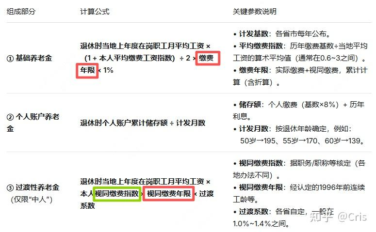

[toc]

# 问题

提问者：**<a href="https://www.zhihu.com/people/xiao-guo-dong-73">小果冻</a>**
提问时间: 2026-4-30 17:33:49
总回答数: 464
总访问量: 631251

农民的养老金太低了，很多七八十的老人还要在村里干点杂活，比如捡鸡蛋，拔蒜苔才能生活，为什么不能提高农民养老金呢？

# 回答

回答者： **<a href="https://www.zhihu.com/people/59-73-72-88-74">Cris</a>**
回答时间: 2026-8-10 14:3:42
点赞总数: 78
评论总数: 63
收藏总数: 32
喜欢总数：0

不需要这么做，这样显得好像帮助农民一样。

养老保险的退休金，有国际通用原则，即“精算公平”；以“精算公平”原则重新核算养老金，多退少补，你信不信视同缴纳的得倒给国家钱。

## 一、精算公平的概念

什么是“精算公平”？就是：

 **缴纳金额+投资收益=预期赔付金额** 

具体体现到不同的保险品种，有所不同：

### 1、延误险

我100买延误险，赔付1000，延误概率6%，那这个保险的 **精算公平价格就是1000乘以6%=60元** ，我花100买这个保险，40元是保险公司的预期毛利。就算我的航班延误了，保险公司赔我钱，本质上他也是赚的，因为预期上我就是获得60元。 **我花100买价值60的预期赔付，本质是我的风险交易** 。

### 2、车险

这个更复杂，我花5000买了车险，投保期1年。我剐蹭理赔2000，我撞坏门赔付1万，我出大事故赔付10万；但本质上讲，这些事件的概率\*赔付金额的汇总，肯定是低于5000元的，因为保险公司要赚钱。

当然，这5000元在1年内的投资收益，也是保险公司利润的来源。

### 3、新农合

新农合的精算公平价值多少？大概是1100元。农民花400买新农合，本质上就是占了700元的便宜。不管你家人看病报销了2万还是5万，你这个保险的价值就是1100元。

 **4、养老保险** 

养老保险的精算价值公式更简单，大体如下：

 **累计交付额+退休前投资收益=预期领取月数\*每月养老金** 

假设预期寿命78岁，60岁退休，那么公式就是：

 **月养老金=（累计缴纳金额+投资收益）/（18年\*12月）** 

同时退休后按社保投资收益率每年增长养老金，瑞典的养老金就是这么计算的

再换句话说，如果养老金符合“精算公平”， **那么1950年出生的人，交的社保+投资收益，够给1950年的人发退休金的，因为1000多万1950生人，不可能都活100岁** 。

## 二、我们的养老金怎么算的？

我们的养老金计算，完全抛弃“精算公平”原则， **由zf强行定义了一个公式来核算养老金** 。

这个公式，对于体制内、体制外是统一的，但是体制内退休金远远高于体制外。原因如下：

假设一个人1964出生、1984工作、2024退休，那么：

算第1部分的时候，无论体制内外，都是按40年算，因为“视同缴纳”。

算第3部分的时候，按体制内外区分：

体制外：视同缴纳年限，就是12年（1996年之前的体制外是视同缴纳）

体制内：视同缴纳年限，就是30年（2014年之前的体制内是视同缴纳）

也就是说，体制内的人，不仅以“视同缴纳”原则领取基础养老金，再以“视同缴纳”多领取一份过渡养老金。所谓 **“越不交、领的越多”** 。 **我爸就是1984工作、2024退休，他之前在国企后来是公务员，他退休金7000多，低于他的低级别同事，就是因为他在国企期间是交社保的，所以第3部分“视同缴纳年限”更少，所以过渡性养老金少** 。

我们的养老金，符合“精算公平”么？肯定不符合：

1、首先，公式设计就完全没体现缴纳金额，而是强行定义了一个公式，把养老金和社平工资挂钩，无视当年交了多少、比例多少；

2、再次，如果真的符合“精算公平”，那么根本不需要：

（1）把下一代社保转给上一代；

（2）财政补贴社保；

（3）划转国有股权给社保。

另外，关于“视同缴纳”。就算我们认可“视同缴纳”，那把视同缴纳金额也按“精算公平”原则算一遍，也算不出1万多的数字，2000撑死。

## 三、应该怎么做？

废除现有的公式，按“精算公平”原则重新算；当然， **认同视同缴纳的部分，也按照“精算公平”算，而不是用一套复杂的系数、视同缴纳年限，强行算3-6倍的权益** 。

真这样算一遍，你会发现：

1、体制内拿1万多的，也许只配拿1000（算上视同缴纳部分）；

2、体制外拿3000的，也是只配拿1000；

3、体制外高薪交的多拿8000的，也许只配拿4000。

大致是这个比例，当然我要列出来具体计算方法，估计答案就没了。

核算完毕后，多退少补。

 **农民呢？我把我奶奶每月120，累计领的2万块，全部退给国家。**

  

原文地址：[(Cris)如果把养老金合并，超过5000的一律降到5000元以下，不足1000的一律提升到1000...](https://www.zhihu.com/question/2033237641349572139/answer/2070148325953819207) 

# 评论

1. <a href="https://www.zhihu.com/people/tian-xian-xiao-chen">刘梦得</a> (<small title="辽宁">2026-8-11 16:34:34</small>): 有没有可能，这个东西叫保险但不是保险，其实是税收和福利呢［思考］
   - <a href="https://www.zhihu.com/people/xiao-yu-52-24-54">鱼公移山</a> (<small title="山西">2026-8-11 21:16:29</small>): 本来就是啊
   - <a href="https://www.zhihu.com/people/710247429">互联网乐子人</a> (<small title="重庆">2026-8-12 13:23:15</small>): 本来就包含福利属性， 可惜精资和社达不认， 只会复读多缴多得［大笑］
   - **Cris** (<small title="湖北">2026-8-12 15:22:38</small>): 既然叫福利，为啥有人1万有人100
   - <a href="https://www.zhihu.com/people/liu-zhao-yang-88-60">髀里肉生</a> (<small title="回复于 2026-8-13 8:27:5/广东"> ✉️:互联网乐子人</small>): ？
   - <a href="https://www.zhihu.com/people/87-7-55-34-28">邢维斯</a> (<small title="回复于 2026-8-13 9:4:38/江苏"> ✉️:Cris</small>): 特定人群的福利
   - <a href="https://www.zhihu.com/people/wu-ming-32-9-74">伍明</a> (<small title="回复于 2026-8-13 12:10:47/江苏"> ✉️:Cris</small>): 福利本来就不公平啊，又不是UBI，在上海的福利和在山里的福利能一样么
2. <a href="https://www.zhihu.com/people/jia-yue-68-13">星河璀璨</a> (<small title="浙江">2026-8-11 17:24:53</small>): 既然吃财政这口大锅饭，那就要一碗水端平
3. <a href="https://www.zhihu.com/people/dc-wei-87">阿尔卑斯狠</a> (<small title="贵州">2026-8-11 13:25:29</small>): 这不是够不够的问题，因为成立社保时很多国企经营困难，经常欠缴，有些破产清算了哪怕没有什么净资产，国家也得管到底，所以国资委作为最后托底的，只要社保没有钱，就一直划拔，要么划利润，要么划股权。
   - **Cris** (<small title="湖北">2026-8-11 14:30:47</small>): 社保为啥没钱？因为发的太多了
   - <a href="https://www.zhihu.com/people/bull-26-35">bull</a> (<small title="北京">2026-8-13 11:18:47</small>): 成立社保的时候是九三年
4. <a href="https://www.zhihu.com/people/dc-wei-87">阿尔卑斯狠</a> (<small title="贵州">2026-8-11 12:54:42</small>): 国资委划股权给社保，就是填补国企职工视同缴纳这部份。原来的国企没有交统筹这部份，都沉淀在资产里，这些资产现在都归了国资委，社保给老职工发社保，不足部分岁然由国资委划拔补齐。如果国企改制，也要在资产里划划走这一部分的！
   - <a href="https://www.zhihu.com/people/qnwang-68">qnwang</a> (<small title="北京">2026-8-11 13:16:57</small>): 那点收益根本不够
   - <a href="https://www.zhihu.com/people/shao-lin-si-47">邵林寺</a> (<small title="浙江">2026-8-11 13:49:53</small>): 国企是什么性质的，如果是全民所有，那凭什么只填补一部分人的利益?
 
如果不是全民所有，它又凭什么靠行政垄断来和政策倾斜，把持国家水电网络及经济命脉！
   - <a href="https://www.zhihu.com/people/yi-shui-han-feng-93">赵客吴钩</a> (<small title="回复于 2026-8-12 18:7:47/辽宁"> ✉️:邵林寺</small>): 你。都可以自己建设电网啊，没人拦着。你也可以自己建卷烟厂，没人拦着你，你也可以自己开银行，没人拦着你。
   - <a href="https://www.zhihu.com/people/shao-lin-si-47">邵林寺</a> (<small title="回复于 2026-8-12 18:32:41/浙江"> ✉️:赵客吴钩</small>): 更何况，我指出国有企业全民所有的性质，是希望国企的利润能更多的覆盖和保障更多的国民，否则，名为全民所有，分配时只划到某一阶层人碗里，那它与其说是国民企业，倒不如说是官僚企业或官有企业，不是么？
   - <a href="https://www.zhihu.com/people/yi-shui-han-feng-93">赵客吴钩</a> (<small title="回复于 2026-8-12 18:59:40/辽宁"> ✉️:邵林寺</small>): 可是国企上班大都亏损啊，没有多少利润！
   - <a href="https://www.zhihu.com/people/wei-ceng-fang-qi-36">utopian</a> (<small title="回复于 2026-8-13 8:41:18/福建"> ✉️:赵客吴钩</small>): 水电 烟草 银行 哪个不要牌照？
   - <a href="https://www.zhihu.com/people/zft-sir-24">zft sir</a> (<small title="回复于 2026-8-13 9:2:21/浙江"> ✉️:邵林寺</small>): 不管企业什么所有制，员工的工资和福利支出肯定也要企业付，填这部分缺口是有理由的。难道给国企工作反而不配拿到企业交的社保了吗？
   - <a href="https://www.zhihu.com/people/zft-sir-24">zft sir</a> (<small title="回复于 2026-8-13 9:3:37/浙江"> ✉️:邵林寺</small>): 当然如果国企的钱超过了自身员工的社保支出，变成给gwy的高额养老金填坑，那肯定是不合理的
   - <a href="https://www.zhihu.com/people/nick-67-67">nick</a> (<small title="回复于 2026-8-13 9:13:15/浙江"> ✉️:赵客吴钩</small>): 你去申请一下营业执照就知道了，看有没有人拦你
   - <a href="https://www.zhihu.com/people/bull-26-35">bull</a> (<small title="回复于 2026-8-13 11:17:21/北京"> ✉️:赵客吴钩</small>): 你帮我批个烟厂并且允许我卖能办到吗？
5. <a href="https://www.zhihu.com/people/zsea-51">zsea</a> (<small title="四川">2026-8-13 9:24:14</small>): 你提到了延误险，车险，这些都有一个前提，你得先买。那为什么到最后养老保险你不谈这个前提？
 
还有，我从来没在任何一个文件上看到过视同缴费这个说法，反而是自媒体在乱吹。正式说法是视同缴费年限。这两者肯定是有区别的。
 
视同缴费：没缴费视同缴费。
 
视同缴费年限：以前没缴费，后来补了，也视做那些年的缴的。
 
居民社保退休前有一个一次性补缴，这就是视同缴费年限。
6. <a href="https://www.zhihu.com/people/hu-shuo-68-87">好日子还在后头呢</a> (<small title="北京">2026-8-13 8:1:28</small>): 我就说新农合价格低了，一堆人还不信
7. <a href="https://www.zhihu.com/people/43-42-87-22-68">四句话</a> (<small title="北京">2026-8-12 17:54:1</small>): 他们有这觉悟［尴尬］［尴尬］［尴尬］［尴尬］
8. <a href="https://www.zhihu.com/people/nkgisc">尔东</a> (<small title="北京">2026-8-11 7:39:31</small>): 你按2014年10月核算的结果给我发养老金，然后把2014年10月之后缴纳的养老保险连本带利还给我……
   - **Cris** (<small title="湖北">2026-8-11 8:42:14</small>): 我没听懂你在讲什么
   - <a href="https://www.zhihu.com/people/huo-xing-39-84">江洋</a> (<small title="河南">2026-8-11 13:48:15</small>): 体制外就算3倍缴满也拿不到这么多。这才是不公平的地方。
   - <a href="https://www.zhihu.com/people/nkgisc">尔东</a> (<small title="北京">2026-8-11 16:4:24</small>): 一般算下来，你妈2014年退应该是1.2万左右，如果不交养老保险，2021年退应该在1.4万元左右，现在多出的3000千，是每月缴纳5000养老保险+1500元职业年金而多出来的
   - <a href="https://www.zhihu.com/people/bull-26-35">bull</a> (<small title="回复于 2026-8-13 11:20:20/北京"> ✉️:江洋</small>): 对头，他们按照2014年基数计算过渡性养老金，这部分至少翻倍，而且连续计算工龄
   - <a href="https://www.zhihu.com/people/bull-26-35">bull</a> (<small title="回复于 2026-8-13 11:21:30/北京"> ✉️:尔东</small>): 谁能缴五千养老保险？
9. <a href="https://www.zhihu.com/people/ysaraz74">卡拉迦迪斯</a> (<small title="北京">2026-8-12 10:17:54</small>): 视同缴纳不是这么算的……
   - <a href="https://www.zhihu.com/people/bull-26-35">bull</a> (<small title="北京">2026-8-13 11:21:57</small>): 答主说的没问题
10. <a href="https://www.zhihu.com/people/jia-fei-dou-6">加菲豆</a> (<small title="广东">2026-8-11 11:11:22</small>): 人家另外搞出几个项目，你不能交或者老板不会帮你交的，很公平嘛！［捂脸］
11. <a href="https://www.zhihu.com/people/xu-yiding-90">Momo</a> (<small title="山东">2026-8-11 19:11:12</small>): 问题是中国2000年之前太穷了，那时候积累的本金和投资收益太低，这样会导致所有人2000年前交和没交一个样
12. <a href="https://www.zhihu.com/people/han-feng-45-21">寒枫</a> (<small title="四川">2026-8-11 9:44:56</small>): 那税收是不是也应该精算公平？
    - **Cris** (<small title="湖北">2026-8-11 9:54:44</small>): 税收是义务
    - <a href="https://www.zhihu.com/people/westin-27">westin</a> (<small title="回复于 2026-8-11 10:17:31/上海"> ✉️:Cris</small>): 这才涉及本质，社保是福利或也是义务。只是强制储蓄或保险。
    - <a href="https://www.zhihu.com/people/huo-xing-39-84">江洋</a> (<small title="回复于 2026-8-11 13:46:26/河南"> ✉️:Cris</small>): 义务对应的权利是什么？这也是要精算公平的
    - **Cris** (<small title="湖北">2026-8-11 14:31:21</small>): 你deepseek一下精算公平是啥，再来讲吧。精算公平，和税收狗屁关系都没
    - <a href="https://www.zhihu.com/people/han-feng-45-21">寒枫</a> (<small title="回复于 2026-8-11 15:1:0/四川"> ✉️:Cris</small>): 你确实应该deepseek一下精算公平是啥了 精算公平跟缴纳金额+投资收益=预期赔付金额有什么关系？谁跟你说保险的核心是精算公平了？
    - <a href="https://www.zhihu.com/people/60-10-83-41-72">知乎用户不</a> (<small title="回复于 2026-8-12 14:23:28/河南"> ✉️:Cris</small>): 税收义务应不应该公平？
    - <a href="https://www.zhihu.com/people/fan-xue-cheng-21">momo</a> (<small title="回复于 2026-8-12 16:12:55/浙江"> ✉️:Cris</small>): 很多人说社保是税，看起来不是了
13. <a href="https://www.zhihu.com/people/zong-guo-xin">人生是梦</a> (<small title="黑龙江">2026-8-11 2:38:40</small>): 社会主义国家，谈什么资本逻辑。社会主义，还是共产党领导。社保就应该是福利性质的社会大兜底，作为老人们的统一最低生活保障，这本来就是社会主义和共产党该做的。而不应该资本叙事什么多缴多得还有你的什么精算。
    - **Cris** (<small title="湖北">2026-8-12 15:23:41</small>): 讲精算，有利于穷人
14. <a href="https://www.zhihu.com/people/zhang-san-6-72-56">福尔马林</a> (<small title="四川">2026-8-11 10:42:8</small>): 说得那么好,养老金上个税不就好了,个税回收的部分直接返回到池子不更有利嘛?而且上税符合国际通行做法
15. <a href="https://www.zhihu.com/people/jiang-yang-13-65">江洋</a> (<small title="湖北">2026-8-11 8:3:36</small>): 视同缴费发退休金，缴费时间发养老金，两部分合起来就是一个人在不同阶段所得的养老待遇？这样一来你还有什么话说？还有什么可PP的！
    - **Cris** (<small title="湖北">2026-8-11 8:41:43</small>): 所以为啥不给农民视同缴纳？
    - <a href="https://www.zhihu.com/people/han-feng-45-21">寒枫</a> (<small title="回复于 2026-8-11 9:46:8/四川"> ✉️:Cris</small>): 因为农民在任何时候都没有养老金，体制内在养老保险制度建立之前就有养老金。
    - <a href="https://www.zhihu.com/people/wo-shi-shen-jing-zhong-er-bing">我是神经中二病</a> (<small title="回复于 2026-8-11 11:8:54/河南"> ✉️:寒枫</small>): 养老保险制度建立之前就有养老金。你交的，够你发的吗？
    - **Cris** (<small title="回复于 2026-8-11 11:19:46/湖北"> ✉️:寒枫</small>): 建立之前就有，那建立社保之后就按新制度来不就行了，交多少领多少
    - <a href="https://www.zhihu.com/people/da-pi-mei-you-dan">啦啦啦啦</a> (<small title="回复于 2026-8-11 14:0:43/陕西"> ✉️:Cris</small>): 你发的工资为什么不给农民？
    - <a href="https://www.zhihu.com/people/han-feng-45-21">寒枫</a> (<small title="回复于 2026-8-11 15:4:27/四川"> ✉️:Cris</small>): 那为什么叫并轨呢？
    - <a href="https://www.zhihu.com/people/han-feng-45-21">寒枫</a> (<small title="回复于 2026-8-11 15:4:58/四川"> ✉️:我是神经中二病</small>): 啥玩意儿？养老保险制度建立前根本不需要交钱啊
    - <a href="https://www.zhihu.com/people/cloudsafe-15">cloudsafe</a> (<small title="回复于 2026-8-12 10:9:6/广东"> ✉️:Cris</small>): 按新制度，那就是可以有视同缴纳的。
    - <a href="https://www.zhihu.com/people/cloudsafe-15">cloudsafe</a> (<small title="回复于 2026-8-12 10:10:20/广东"> ✉️:Cris</small>): 因为农民按血书要当个体户啊，没有单位给他们交金的。
    - **Cris** (<small title="回复于 2026-8-12 10:18:3/湖北"> ✉️:啦啦啦啦</small>): 可以给啊，我每月交的4000社保，你给就行啊
    - **Cris** (<small title="回复于 2026-8-12 10:19:2/湖北"> ✉️:寒枫</small>): 并轨没问题啊，并轨前的账户里有多少钱，挪到社保体系就行，以这个钱为上限，发视同缴纳养老金就行
    - <a href="https://www.zhihu.com/people/da-pi-mei-you-dan">啦啦啦啦</a> (<small title="回复于 2026-8-12 10:26:41/陕西"> ✉️:Cris</small>): 那不行，你知道国家不会给，所以你口骇一下。你直接把自己的到手工资捐给农民不就行了
    - <a href="https://www.zhihu.com/people/xiao-lao-hu-36">来了个敲山震虎</a> (<small title="回复于 2026-8-12 10:29:25/广东"> ✉️:Cris</small>): 他也没钱挪给你啊哈哈，他说他破产了
16. <a href="https://www.zhihu.com/people/newstar-86">newstar</a> (<small title="湖北">2026-8-12 22:42:37</small>): 萌萌哒，完全没搞懂社保和商保的本质区别，此精算非彼精算也。［飙泪笑］［飙泪笑］［飙泪笑］
17. <a href="https://www.zhihu.com/people/yang-shan-lin-dong-da-tu-mu">猫猫头</a> (<small title="江苏">2026-8-11 11:11:32</small>): 过渡性养老金目的是啥都搞不清楚，就来比比？
 
过渡性养老金是为了补偿个人账户亏欠的钱，如果国家把个人账户亏欠补齐，不需要过渡性养老金呀？
 
为啥设置这个？不就是便于普通百姓？体制内的有单位，社保改革追索20年、30年补齐个人账户很轻松，体制外的你去找原单位补？［飙泪笑］
    - <a href="https://www.zhihu.com/people/710247429">互联网乐子人</a> (<small title="重庆">2026-8-12 13:28:40</small>): 这可不兴乱说体制内补齐很轻松哦［捂脸］，这话说了大家就要问问为什么体制内补齐很轻松、以及钱从哪来、标准如何确定了。

=[评论](./attachments/comments.json)

