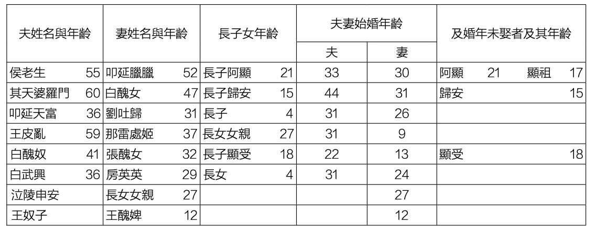
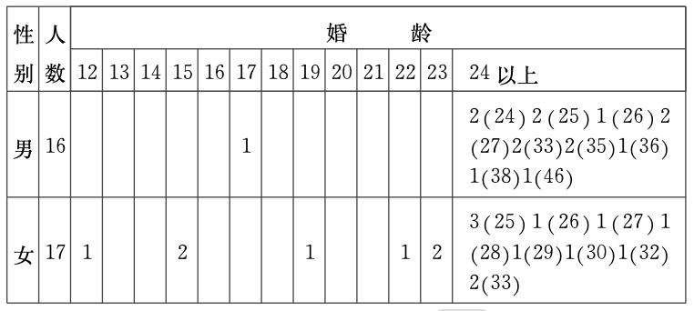

[toc]

# 问题

提问者：**<a href="https://www.zhihu.com/people/xiao-lin-86-9-37">知乎用户eV0RXi</a>**
提问时间: 2025-3-30 14:24:47
总回答数: 585
总访问量: 4299733

如题

# 回答

回答者： **<a href="https://www.zhihu.com/people/Pseudocirrus">Pseudocirrus</a>**
回答时间: 2026-8-16 1:20:1
点赞总数: 399
评论总数: 25
收藏总数: 220
喜欢总数：19

聊聊刻板印象之外的东西。《北朝民众婚姻状况的历史考察》指出，南北朝期间，北方平民阶层存在明显的晚婚晚育甚至不婚失婚现象。

出土的敦煌籍帐文书中包含十六国晚期的户籍档案，也验证了晚婚晚育现象^[由敦煌籍帐文书引发的对魏晋南北朝时期婚龄问题的探讨]。

我们印象中的【不管不顾猛猛生孩子】其实是明清时期才形成的现象。南北朝是贵族社会，贵族十几岁生孩子是因为有家产要继承，平民生太多孩子纯纯跟着吃苦。

魏晋南北朝期间，朝廷把结婚年龄定的很低，甚至还恐吓性地说不婚要受到处罚。

但有一个道理是古今通用的：假如国家要逼着年轻人结婚，那一定是社会中存在某些因素阻碍了年轻人结婚。

对于魏晋南北朝来说，有婚嫁成本和徭役制度两大因素的影响。

微观上看，很多家庭晚婚的直接原因就是男方在攒聘礼，不少女方家庭也在攒嫁妆。

高欢娶娄昭君的时候也出不起聘礼，是娄昭君偷偷给他塞了一笔钱。

> 乃使婢通意，又数致私财，使以聘己

按照颜之推的说法，结婚就是做买卖：

> 近世嫁娶，遂有卖女纳财，买妇输绢，比量父祖，计较锱铢，责多还少，市井无异。或蝟婿在门，或傲妇擅室，贪荣求利，反招羞耻，可不慎欤！

南朝也一个样，婚嫁成本非常高，徐孝嗣对此是痛心疾首：

> 依古以卺酌终酳之酒，并除金银连锁，自余杂器悉用埏陶。堂人执足克燎，牢烛华侈，亦宜停省

这种奢侈的婚姻风气就是从上层的士族社会传播开来的。

士族社会讲究一个【婚与宦】，人们普遍生活在阶级跌落的恐惧中，在选择结婚对象时十分谨慎；为了体现两大家族强强联手、门当户对，人们把婚姻搞得非常奢侈。

《文心雕龙》的作者刘勰就是因为家里没钱结婚，索性当了和尚。

> 勰早孤，笃志好学。家贫不婚娶，依沙门僧佑，与之居处积十余年

刘勰作为官宦后人，肯定不至于一点钱也没有，但是他娶不起同阶层的女孩，而下娶也意味着下一代阶层滑落，所以就干脆不娶了。

正经高门士族是数代人、上百口聚居在一起，由家族操办婚事，不至于出现这样的烦恼。过往研究认为魏晋南北朝存在早婚风气，就是对这些高门大姓来说的。

对于平民小家庭来说，置办聘礼那就是不小的负担了，家贫无法结婚的情况是普遍存在的。

冯太后统治期间，数次释放宫女，把宫女嫁给未能娶妻的平民。

> 太和二年二月丁亥，行幸代之汤泉。所过问民疾苦，以宫人赐贫民无妻者。太和三年，复以宫女妻贫民。又诏汰其老病者。

比平民更低的是奴婢。

南北朝当时都存在奴隶制度，灾荒年代平民走到了卖儿卖女的地步，谁心里都不会好受。

对奴隶来说，是否能婚配，那就真的和牲畜一样，取决于主人的想法了。

___

从宏观上看，平民结婚难生子难，主要是因为徭役和赋税太重。

明清时代多生个孩子，也就是多添一双筷子的事情。农村一家生七八个孩子那也是常态。

魏晋南北朝时期可是有高额的人头税的。你生了孩子，十三岁开始就要为国家交税了。

作为一对没有免税特权的平民夫妇，必须得仔细权衡生这一个孩子是赚还是亏。

北魏均田制改革之后，会按人口数授田，这理论上是一个鼓励生育的政策，多生孩子多分田嘛。

随着北朝国家治理能力的下降，北齐出现了即使真结了婚也故意隐瞒的情况。

> 旧制，未娶者输半床租调有妻者输一床，无者输半床。阳翟一郡，户至数万，籍多无妻

如果国民算了账，发现扣除税赋徭役之后，结婚是亏的，那就会选择不婚，或者假装不婚。

如果说，明清时代的早婚是经济、文化等角度的自发行为。

汉魏六朝时代的早婚令是政府为了滋生人口、扩大税基，推行的一种违反经济规律的政策。《汉书》中明确提到：

> 世俗嫁娶太早，未知为人父母之道而有子，是以教化不明而民多夭。聘妻送女亡节，则贫人不及，故不举子。

政府通过惩罚性措施，强迫平民早婚。但政府可不会掏钱给平民补贴婚嫁费用，聘礼要自己攒。

所以当时很多平民不小心生了儿子之后会选择弃婴（杀婴），称之为【不举子】。

等到攒了一些家底之后才敢把儿子生下来。

早婚只是为了应付政府的指标而已，很多少年夫妻要到婚后十年才生孩子。

在早婚令执行得不严格的地区，就会出现本文开头提到的那种晚婚晚育现象。

  

原文地址：[(Pseudocirrus)现在的人都摆烂不生孩子，那魏晋南北朝、五代十国和近代史这种乱世都是谁在生...](https://www.zhihu.com/question/1889684473383199846/answer/2072130466963105401) 

# 评论

1. <a href="https://www.zhihu.com/people/bai-fu-chang-50-70">百夫长</a> (<small title="山东">2026-8-16 10:27:12</small>): 那时候没有低成本的避孕工具［飙泪笑］［飙泪笑］［飙泪笑］
   - <a href="https://www.zhihu.com/people/tai-zai-cheng-tai-lang">太宰·承太郎</a> (<small title="宁夏">2026-8-17 11:38:12</small>): 所以溺婴的现象无数  
 
甚至到了清朝，也屡见不鲜，让当地的封疆大吏感慨万千  
 
要知道生产力已经提升很多了，理论上社会福利也增强了不少
2. <a href="https://www.zhihu.com/people/bao-shu-78-30">宝树</a> (<small title="湖北">2026-8-16 23:23:43</small>): 古今一致，穷人都是一样苦［捂脸］
3. <a href="https://www.zhihu.com/people/shui-tian-gong-ming">水天共鸣</a> (<small title="广东">2026-8-16 23:24:0</small>): 这玩意历来都是有赏有罚，才推行得下去。《国语》里勾践一方面宣布不按时结婚生育有罪，另一方面对按时婚育的奖了酒、猪狗、乳母等当时不错的物品/待遇，因此真就造了一堆人出来。要是光赏不罚，则或有混水摸鱼之考量；小赏大罚甚至光罚不赏，那越人大概率就把他扭送给夫差了［飙泪笑］
4. <a href="https://www.zhihu.com/people/80-10-30-90-45">机器卫兵扫大街</a> (<small title="上海">2026-8-17 0:28:22</small>): 架不住人上人生的多到阶层下降［思考］
5. <a href="https://www.zhihu.com/people/yuan-er-31">退行性赛博精神病</a> (<small title="陕西">2026-8-17 7:26:23</small>): 所以天塌不下来的
   - <a href="https://www.zhihu.com/people/AllThingIsWorthless">一切不值得</a> (<small title="浙江">2026-8-17 10:47:27</small>): 南北朝足够算“天塌了”吧，南北朝是跟五代十国，明末，清末并列古代史最抽象时代的
6. <a href="https://www.zhihu.com/people/meng-san-chen">张三丰</a> (<small title="安徽">2026-8-17 10:25:26</small>): “早婚只是为了应付政府的指标而已，很多少年夫妻要到婚后十年才生孩子”这个有史料支撑吗？
   - **Pseudocirrus** (<small title="广东">2026-8-17 12:48:8</small>): 这个是对长沙走马楼吴简中育龄数据的一种解释[孫吳時期長沙郡吏民婚育狀况考察-三國晉簡-武漢大學簡帛研究中心-](https://m.bsm.org.cn/?sglj/5514.html)
7. <a href="https://www.zhihu.com/people/28-67-23-20-83">淡定哥</a> (<small title="上海">2026-8-17 7:37:43</small>): 唉，现在依然是呀，我同事今年过年的时候结婚，安徽三四线城市彩礼18.8，黄金20个，然后办婚礼十几个，然后又有一些其他仪式，娘家来人，不算车子，不算房子，花了70个，他还有家里人帮助县城的老房子让给他们住，后来又买了辆宝马，我呢，家里头啥都没有父母没有退休金，1块钱都掏不出给我，我呢也没学历，只能出来干电子厂真的挺绝望的，我这种条件放到古代我也结不了婚还好去年去第三世界旅游，当地人月收入300~500人民币，物价是国内两倍，不要彩礼，不要房子，我在那里跟人家交谈，人家长辈听说我月收入5000人民币，大概是当地收入水平的20倍左右，连忙问我有没有结婚，当地女孩我送给人家一个10块，20块钱的小东西，他们都高兴的跟什么样相当于你掏200块钱送给一个女性朋友，一个小礼物一样，非常高兴，从那回来之后，我再也不用担心结婚的问题了
   - <a href="https://www.zhihu.com/people/shui-jing-yue-73">水镜月</a> (<small title="上海">2026-8-17 8:14:11</small>): 哪个第三世界国家啊？孟加拉？
8. <a href="https://www.zhihu.com/people/lu-lei-shi">三沟型花粉</a> (<small title="江西">2026-8-16 15:23:34</small>): 那他们结了婚十多年干什么
   - <a href="https://www.zhihu.com/people/zhivfqug4l">zhivFQUg4l</a> (<small title="浙江">2026-8-16 15:32:53</small>): 参考惠州女结婚后还要继续给娘家种地三年，有可能婚后各自给原生家庭干活十年
   - <a href="https://www.zhihu.com/people/goodlucky-64">娇玉盐</a> (<small title="回复于 2026-8-17 9:59:20/山东"> ✉️:zhivFQUg4l</small>): 家庭奴隶制啊。
   - <a href="https://www.zhihu.com/people/meng-san-chen">张三丰</a> (<small title="安徽">2026-8-17 10:11:40</small>): 应该是国家硬性要求到一定年龄后必须结婚，不结婚会有处罚，底层通过名义上结婚应付官府，实际还是在娘家生活。正好跟现在先结婚后领证反过来
   - <a href="https://www.zhihu.com/people/Meermo">芫荽</a> (<small title="回复于 2026-8-17 10:44:22/安徽"> ✉️:娇玉盐</small>): 没田地你想怎么活［好奇］
9. <a href="https://www.zhihu.com/people/yu-xi-70-94">丰明礼</a> (<small title="上海">2026-8-17 8:18:8</small>): 推行早婚早育增加人口→派人查户口编户齐民提高税收→农民负担加重，徭役战争频繁导致破产→流民依附门阀地主成为流民军→朝廷无力控制只能继续要求增加人口扩大军队对抗，这是恶性循环啊
10. <a href="https://www.zhihu.com/people/shuang27">秋爽</a> (<small title="美国">2026-8-17 1:47:49</small>): 好有意思，而且那些人的名字也好有意思啊
11. <a href="https://www.zhihu.com/people/an-fjin-ru-tan-ke-65">名字有什么用</a> (<small title="河南">2026-8-17 8:21:59</small>): 我居然发现有十岁生孩子的，吓人［惊讶］
12. <a href="https://www.zhihu.com/people/da-zai-gan-yuan-61">人形动物研究中心</a> (<small title="四川">2026-8-17 4:29:4</small>): 平民生孩子就是作孽。。。如果生子是好事，早禁止平民生了。。。
    - <a href="https://www.zhihu.com/people/xie-tian-gua">叶恬适</a> (<small title="四川">2026-8-17 6:48:8</small>): 社达都没你们疯狂
    - <a href="https://www.zhihu.com/people/ccya-62-98">cc呀</a> (<small title="四川">2026-8-17 8:41:51</small>): 最讨厌你这种评论一棒子打死，人各有命，自己过得不好怎么就能保证下一代过得不好，历史经济都是有周期的，穷人的孩子也不是完全没有机会阶级跃迁，按你这么说现在所有的富豪、权贵祖上都是有钱有势的人咯？即使是穷人的孩子，如果父母给与足够的关心和爱护，沟通和陪伴，一样能有幸福的童年，只是不能托举。
    - <a href="https://www.zhihu.com/people/80-10-30-90-45">机器卫兵扫大街</a> (<small title="回复于 2026-8-17 8:45:26/上海"> ✉️:cc呀</small>): 阁下把那个时代想太好了［思考］
    - <a href="https://www.zhihu.com/people/5-62-67-22">笔贴式</a> (<small title="回复于 2026-8-17 9:48:49/山东"> ✉️:cc呀</small>): 别说现在的富豪，就是现在的普通人，大部分祖上也得有混得好的，真要是世代佃农流民的话根本不可能有后代到现在，乱世的各种风险都扛不住。
13. <a href="https://www.zhihu.com/people/xiao-xiao-xiao-qie-bu">小小小切布</a> (<small title="广东">2026-8-17 8:18:22</small>): 你这个研究水分太大了，这也是社会科学之所以垃圾的原因，你是现有结果，然后找了个冷门的论文来验证［飙泪笑］，当然，自然科学领域也一堆你这样的

=[评论](./attachments/comments.json)

