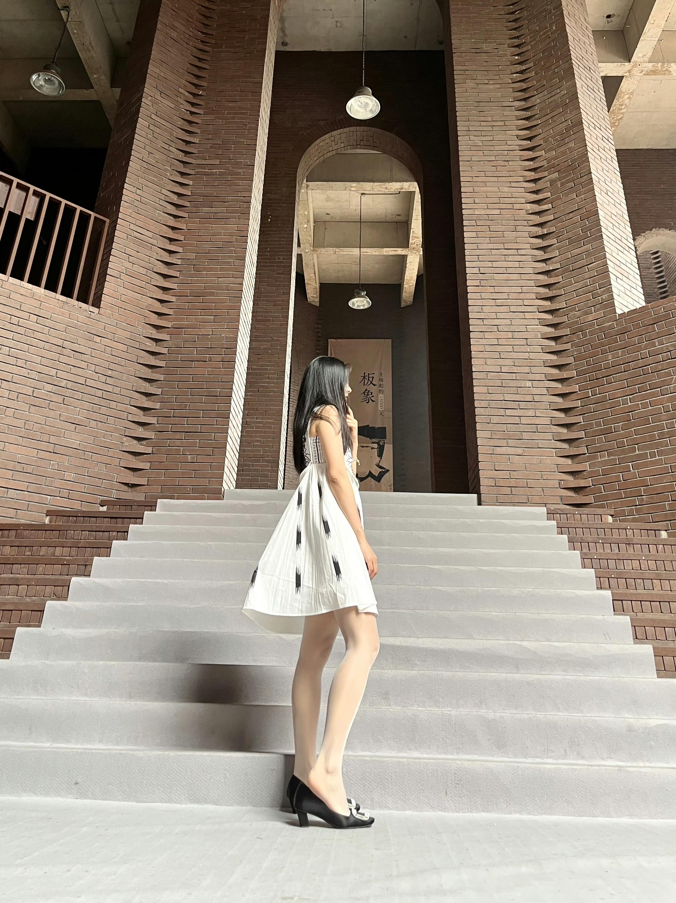
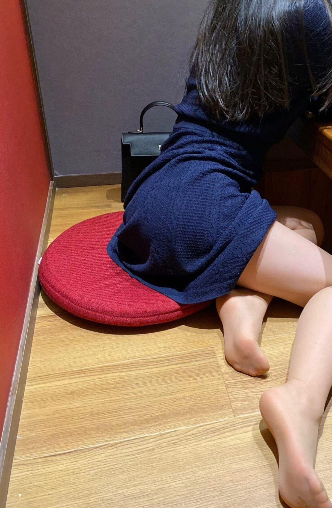

[toc]

# 问题

提问者：**<a href="https://www.zhihu.com/people/le-le-xian-sheng-66">樂樂先生</a>**
提问时间: 2025-7-10 22:23:26
总回答数: 170
总访问量: 513920

请问为什么女的喜欢穿性感的衣服？

# 回答

回答者： **<a href="https://www.zhihu.com/people/cherry-68-98-12">Shirly</a>**
回答时间: 2026-7-18 18:15:58
点赞总数: 109
评论总数: 1
收藏总数: 103
喜欢总数：8

因为女生都是喜欢漂亮的衣服的呢，自己穿着喜欢就好了

  

  

  

原文地址：[(Shirly)请问为什么女的喜欢穿性感的衣服？](https://www.zhihu.com/question/1926768495309324940/answer/2061876892362347801) 

# 评论

1. <a href="https://www.zhihu.com/people/nuo-wei-sen-lin-61">挪威森林</a> (<small title="安徽">2026-7-25 16:28:5</small>): 太哇塞啦［赞］［酷］

=[评论](./attachments/comments.json)

