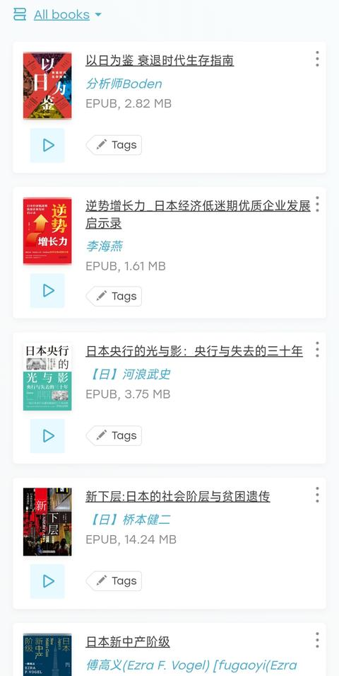

[toc]

# 问题

提问者：**<a href="https://www.zhihu.com/people/77-83-26-54-81">沉默的大壮</a>**
提问时间: 2025-11-7 23:37:35
总回答数: 219
总访问量: 1886593

面对这些似曾相识的困境，你有什么看法吗？

# 回答

回答者： **<a href="https://www.zhihu.com/people/sunny-69-50-53">Sunny</a>**
回答时间: 2025-11-26 16:0:33
点赞总数: 3515
评论总数: 131
收藏总数: 8097
喜欢总数：171

看过，但只看这本没用，需要多看几本。

1、下流社会

2、饱食穷民

3、东京贫困女子

4、低智商社会

5、新型日本阶级社会

6、新下层：日本社会阶层贫困与遗传

7、日本新中产阶级

8、日本央行的光与影：央行与失去的三十年

9、逆势增长力:日本经济低迷期优质企业发展启示录

之类的。

把日本宏观、中观、微观，长期、中期、短期都搞清楚，还是有不少机会的。

怕就怕在很多人脑子里，日本只不过是一个刺激的符号，就像一个欺负过自己却又比自己厉害的孩子，无可奈何却又义愤填膺，这些人是没救的。

它在很多方面跑在我们前边，做的也比我们要好，却跌入了我们不愿跌入的陷阱，这中间有很多机会值得挖掘～

  

原文地址：[(Sunny)有人看过《以日为鉴》吗？](https://www.zhihu.com/question/1970273698889052512/answer/1977044050973570109) 

# 评论

1. <a href="https://www.zhihu.com/people/stone-21-12-71">stone</a> (<small title="广东">2025-11-27 8:30:13</small>): 不用看日本历史，看错书了，要看苏联末期的社会纪实
   - **Sunny** (<small title="上海">2025-11-27 8:33:44</small>): 看那能发现机会吗［大笑］
   - <a href="https://www.zhihu.com/people/fx-hades">FX Hades</a> (<small title="山西">2025-11-27 9:43:56</small>): 推荐几本
   - <a href="https://www.zhihu.com/people/szabcd">崭新的德彪</a> (<small title="广东">2025-11-27 9:51:3</small>): ［捂脸］［大哭］
   - <a href="https://www.zhihu.com/people/ni-gu-la-si-yang-dao">尼古拉斯羊刀</a> (<small title="回复于 2025-11-27 11:7:31/北京"> ✉️:FX Hades</small>): 《二手时间》
   - **Sunny** (<small title="上海">2025-11-27 11:21:24</small>): 你没发现我是做什么的［大笑］
   - <a href="https://www.zhihu.com/people/man-bu-ren-jian-lu">漫步人间路</a> (<small title="辽宁">2025-11-27 12:6:59</small>): 以苏联解体三十年来的历史看，苏联末期人民其实只有武装保卫苏布一条出路，别的出路经过历史考验，都没有。
   - <a href="https://www.zhihu.com/people/peng-zi-xu">彭子虚</a> (<small title="四川">2025-11-27 12:23:38</small>): 乐观主义者看日本史 悲观主义看苏联史［捂脸］
   - <a href="https://www.zhihu.com/people/80-10-30-90-45">机器卫兵扫大街</a> (<small title="上海">2025-11-27 13:25:51</small>): 南斯拉夫内战如何［思考］
   - <a href="https://www.zhihu.com/people/sven-8-60">Sven</a> (<small title="回复于 2025-11-27 14:53:30/海南"> ✉️:Sunny</small>): 做倒爷啊
   - <a href="https://www.zhihu.com/people/guoer-94">骑上电驴去拉萨</a> (<small title="湖南">2025-11-27 15:35:23</small>): 哈哈哈哈哈哈天秀
   - <a href="https://www.zhihu.com/people/si-zhai-84">死宅</a> (<small title="回复于 2025-11-28 9:13:12/北京"> ✉️:漫步人间路</small>): 怕就怕，人民没有被武装的能力。而人民有。
   - <a href="https://www.zhihu.com/people/qi-wen-jie-20">知乎用户Lzfhrz</a> (<small title="回复于 2025-11-28 15:45:43/河南"> ✉️:漫步人间路</small>): ［大笑］滑稽了，
   - <a href="https://www.zhihu.com/people/mao-cai-59">毛菜</a> (<small title="回复于 2025-11-28 17:58:51/浙江"> ✉️:机器卫兵扫大街</small>): 南斯拉夫还有美帝空投救济，中国这体量谁能救济，看看丧尸片得了［捂脸］
   - <a href="https://www.zhihu.com/people/80-10-30-90-45">机器卫兵扫大街</a> (<small title="回复于 2025-11-28 18:15:54/上海"> ✉️:毛菜</small>): 关内也就地理边缘能被输入到［思考］
   - <a href="https://www.zhihu.com/people/12316-68">阳光下的土地</a> (<small title="回复于 2025-11-28 21:49:43/北京"> ✉️:漫步人间路</small>): ［大笑］被先锋队再图一遍是吧
   - <a href="https://www.zhihu.com/people/ping-liu-22-63">平流</a> (<small title="回复于 2025-11-28 22:7:30/北京"> ✉️:FX Hades</small>): 克格勃主席写过一本［匿了］
   - <a href="https://www.zhihu.com/people/man-bu-ren-jian-lu">漫步人间路</a> (<small title="回复于 2025-11-29 14:36:53/辽宁"> ✉️:阳光下的土地</small>): 旧政权是没有图人能力的，苏联在阿富汗伤亡五万人，就动摇国本了，俄乌战争两国伤亡上百万照样运行。不被图的只能当维系旧政权的老保，宁要辽国不要金国。
   - <a href="https://www.zhihu.com/people/woodshy">莫里芬</a> (<small title="广东">2025-11-29 15:44:19</small>): 综合着看，毕竟搞了特色，下场不可能比日本好，也不至于比苏联差
   - <a href="https://www.zhihu.com/people/82-45-25-44-78">发现需求</a> (<small title="回复于 2025-11-30 10:10:53/北京"> ✉️:Sunny</small>): 你看日本也发现不了机会，或者应该这么说：发现了机会就能做得到吗？  
 
快消品要极致性价比，甚至价性比，价格优先。都看明白了就能做出一个优衣库来吗？
   - **Sunny** (<small title="回复于 2025-11-30 10:13:14/上海"> ✉️:发现需求</small>): 你不是我［大笑］
   - <a href="https://www.zhihu.com/people/47-94-16-51">鸽爪</a> (<small title="美国">2025-11-30 11:17:50</small>): 又幻想了［飙泪笑］
   - <a href="https://www.zhihu.com/people/wei-jing-du-wu-yu-74">伪京都物语</a> (<small title="回复于 2025-11-30 11:46:46/四川"> ✉️:FX Hades</small>): 勃列日涅夫十八年
   - <a href="https://www.zhihu.com/people/047-27">Renimartzruweg</a> (<small title="云南">2025-11-30 15:55:52</small>): 尬
   - <a href="https://www.zhihu.com/people/2345-28-60">2345</a> (<small title="回复于 2025-12-13 6:19:12/江苏"> ✉️:漫步人间路</small>): 苏联要是真好，会崩溃？
2. <a href="https://www.zhihu.com/people/xu-jie-44-48">别慌跟我冲</a> (<small title="辽宁">2025-11-27 10:1:17</small>): 说的真好，最近刚看完 给人一种射箭画靶的感觉 。
   - <a href="https://www.zhihu.com/people/6363036">知乎用户fUg7tK</a> (<small title="广东">2025-11-27 11:18:27</small>): 答主推荐的书单的电子版我整理好了：ht答tps://pa主n.qu书ark.c单n/s/2728356d374a （麻烦知友删除“答主书单”四个中文就能打开了）
   - <a href="https://www.zhihu.com/people/62-45-11-85-31">结果集</a> (<small title="回复于 2025-11-27 11:25:9/江苏"> ✉️:知乎用户fUg7tK</small>): 没有这本——逆势增长力:日本经济低迷期优质企业发展启示录，我现在也缺这个。
   - <a href="https://www.zhihu.com/people/johnson-31-58-56">Johnson</a> (<small title="回复于 2025-11-27 12:10:28/中国澳门"> ✉️:结果集</small>): 有的是記錄片吧 mark
   - <a href="https://www.zhihu.com/people/xue-ni-hong-zhua-de-bai-ri-meng">雪泥鸿爪的白日梦</a> (<small title="回复于 2025-11-27 12:23:39/内蒙古"> ✉️:知乎用户fUg7tK</small>): ［赞］［赞］［拜托］［拜托］感谢
   - **Sunny** (<small title="回复于 2025-11-27 12:27:4/上海"> ✉️:Johnson</small>): 是书［大笑］
   - <a href="https://www.zhihu.com/people/ye-lang-71-12">耶郎</a> (<small title="回复于 2025-11-29 21:15:37/安徽"> ✉️:Sunny</small>): 哪本书？
3. <a href="https://www.zhihu.com/people/feng-su-nan-34">一蓑烟雨</a> (<small title="安徽">2025-11-27 15:35:59</small>): 我完整的看过这本书。  
 
这本书现在挺火的。原因就是他的很多已经发生的事情和我们国家现在正在发生的事情产生了共鸣。  
 
比如说失业潮，比如说考公热。比如说出海热，比如说学历贬值。  
 
这些恰恰戳中了现在中国老百姓的痛点。读起来总觉得这就是我曾经过过或者现在正在过的生活。总希望在其中找出一点经验和需要应对的方法。  
 
可是这本书最大的缺点，也是他的优点。就是他没有写应对这些普通人应该怎么做。和具体缓解这些现象的方法。  
 
所以这本书读起来很过瘾。但是对自己的帮助也不是特别大。但是有一个好处就是他把你领进了喜欢经济学的大门，那你觉得经济学原来并不是原先我们以为的那种枯燥无味的学科。  
 
他是最有用的对自己的人生以及生活有指导意义的学科。  
 
所以读了这本书之后有兴趣的可以读读其他相关的书籍。
   - <a href="https://www.zhihu.com/people/91-49-70-20-89">风泽中孚</a> (<small title="海南">2025-11-27 23:11:6</small>): 他给了方法，就是出海。
   - <a href="https://www.zhihu.com/people/jin-wei-mao-36">御前近卫昴</a> (<small title="回复于 2025-11-28 9:28:40/北京"> ✉️:风泽中孚</small>): 世界第一工业国要出海，出给谁啊［飙泪笑］世界上哪有那么大的市场。
   - <a href="https://www.zhihu.com/people/xfft-96">xfft</a> (<small title="回复于 2025-11-28 14:3:51/浙江"> ✉️:风泽中孚</small>): 难说，上世纪泡沫破裂后日本虽然在衰弱，在世界总体上还是处在经济上行期，中国韩国都在快速崛起，现在可不好说了。
   - <a href="https://www.zhihu.com/people/feng-su-nan-34">一蓑烟雨</a> (<small title="回复于 2025-11-29 6:58:36/安徽"> ✉️:风泽中孚</small>): 现在中国就是出海热。但是他的那种出海，我们能借鉴的不多［大笑］
   - <a href="https://www.zhihu.com/people/feng-su-nan-34">一蓑烟雨</a> (<small title="回复于 2025-11-29 7:1:2/安徽"> ✉️:御前近卫昴</small>): 有，出到发展中国家，哪些正在经历我们曾经经历的，把自己都经验带过去 或者卖过去，其实就是主打一个信息差［思考］
   - <a href="https://www.zhihu.com/people/feng-su-nan-34">一蓑烟雨</a> (<small title="回复于 2025-11-29 7:2:36/安徽"> ✉️:xfft</small>): 总体也是在前进的，现在的经济是全球化下行，不仅仅是我们
   - <a href="https://www.zhihu.com/people/j1wm6i">圆头老耄小哆啦</a> (<small title="回复于 2025-11-29 17:16:59/山东"> ✉️:xfft</small>): 一鲸落，万物生［酷］
4. <a href="https://www.zhihu.com/people/pu-jia-64">弦而舞之</a> (<small title="四川">2025-11-28 23:22:55</small>): 我不认为日本有太大借鉴意义是因为像日本那就是美梦了。
5. <a href="https://www.zhihu.com/people/80-10-30-90-45">机器卫兵扫大街</a> (<small title="上海">2025-11-27 13:25:14</small>): 再加一本《南斯拉夫的兴亡》［思考］
6. <a href="https://www.zhihu.com/people/zong-jie-59-32">冰山麟角</a> (<small title="四川">2025-11-27 13:39:15</small>): 还有一本《资治通鉴》
   - <a href="https://www.zhihu.com/people/83-92-33-39">胖胖鱼</a> (<small title="湖南">2025-11-28 7:35:21</small>): 17遍一辈子都读不完
   - <a href="https://www.zhihu.com/people/mrziwen">7k7k</a> (<small title="广西">2025-11-28 11:20:28</small>): 笑喷了
   - <a href="https://www.zhihu.com/people/zhipeng-liu-49">Sruta</a> (<small title="广东">2025-11-28 16:48:23</small>): 看懂你了。
   - <a href="https://www.zhihu.com/people/feng-su-nan-34">一蓑烟雨</a> (<small title="安徽">2025-11-29 7:3:21</small>): 其实就可以理解成轮回
   - <a href="https://www.zhihu.com/people/zhou-zhi-fan-85-24">玄牝</a> (<small title="辽宁">2025-11-30 14:0:27</small>): 曾老师［赞］
7. <a href="https://www.zhihu.com/people/feng-tu-zi-94-3">况难段</a> (<small title="河南">2025-11-28 0:10:34</small>): 补充一本，手机废人，苏联的最后一天，
8. <a href="https://www.zhihu.com/people/11-46-28-20-52">知乎用户KFviRu</a> (<small title="广东">2025-11-30 16:1:57</small>): 其实国内全面脱贫还没几年，和日本比啥啊［捂脸］，根本没得比
9. <a href="https://www.zhihu.com/people/kellertt">kellerTT</a> (<small title="广东">2025-11-27 20:29:57</small>): 还有大前研一的《低欲望社会》
10. <a href="https://www.zhihu.com/people/ryan_yunhao">一往无前</a> (<small title="四川">2025-11-27 10:57:20</small>): 可谓是留日学生必看书籍了，哈哈哈哈
11. <a href="https://www.zhihu.com/people/sucan2020">成长导航苏老师</a> (<small title="湖北">2025-11-28 5:17:41</small>): 经济有周期，社会有周期，时代有周期，其实一切都有迹可循。我们将以史为鉴，但我们一直都觉得自己可以例外，从不会吸取教训。未来的人口问题将是大问题。
    - <a href="https://www.zhihu.com/people/80-10-30-90-45">机器卫兵扫大街</a> (<small title="上海">2026-1-6 9:6:45</small>): 原本人口过剩算什么［思考］
12. <a href="https://www.zhihu.com/people/gou-li-guo-63-75">Rinne</a> (<small title="重庆">2025-11-27 12:8:51</small>): 宏观可以再补上一本辜朝明的《大衰退》［惊喜］
13. <a href="https://www.zhihu.com/people/chang-kai-sen-98">cksen</a> (<small title="四川">2025-11-28 9:29:17</small>): NHK《老后破产》［思考］
14. <a href="https://www.zhihu.com/people/wo-bu-shi-diao-yu-ren">古柏</a> (<small title="内蒙古">2025-11-27 12:32:51</small>): 感谢的话不多说了，仔细看看这些书。［赞］
15. <a href="https://www.zhihu.com/people/si-shi-gu-ren-lai-1989">似是故人来1989</a> (<small title="湖北">2025-11-29 4:5:9</small>): 我认为可能还要叠加一些英国第一次工业革命期间的书籍……
16. <a href="https://www.zhihu.com/people/keepingpassion">keepingpassion</a> (<small title="云南">2025-11-28 14:29:35</small>): 只看过以日为鉴和东京贫困女子，[以日为鉴](https://pan.quark.cn/s/a94e54f9b67f)，[东京贫困女子](https://pan.baidu.com/s/16Qkia11p_QvEeEWcXC1fvA?pwd=6666) ，其他没看过，日本经济史也可以
17. <a href="https://www.zhihu.com/people/ai-guo-you-zhi-qing-nian">方昭未</a> (<small title="广西">2025-11-29 1:45:54</small>): 不如直接看明末［生气］
18. <a href="https://www.zhihu.com/people/da-mo-ke-li-si-zhi-jian-3">激流归大海</a> (<small title="湖南">2025-11-27 16:55:20</small>): 逆势增长力:日本经济低迷期优质企业发展启示录，请问有这本书吗
    - <a href="https://www.zhihu.com/people/da-mo-ke-li-si-zhi-jian-3">激流归大海</a> (<small title="湖南">2025-11-27 16:55:37</small>): 没找到，麻烦好心人帮下
19. <a href="https://www.zhihu.com/people/feng-huang-lu-17">最后的叹息</a> (<small title="江苏">2025-11-30 15:38:12</small>): 看日本的没用，没有那种家底撑那么久。
20. <a href="https://www.zhihu.com/people/98-1-1-28-39">李济源</a> (<small title="安徽">2025-11-27 13:25:39</small>): 新建书单了，至于什么时候能看完，只有天知道［捂脸］
    - <a href="https://www.zhihu.com/people/98-1-1-28-39">李济源</a> (<small title="回复于 2025-11-27 23:25:59/安徽"> ✉️:天友</small>): zlibrary，免费也很好用，站内有教程
    - <a href="https://www.zhihu.com/people/re-xie-zai-ran-shao-77">天友</a> (<small title="浙江">2025-11-27 19:45:51</small>): 请问这是什么app
21. <a href="https://www.zhihu.com/people/xiao-ming-ai-hua-hua-39">小明爱花花</a> (<small title="上海">2025-11-27 15:37:57</small>): 有没有能做到日企的
22. <a href="https://www.zhihu.com/people/jiang-hai-chen-28">Jiason</a> (<small title="日本">2025-11-27 11:32:55</small>): 加一本《负动产时代》
    - **Sunny** (<small title="上海">2025-11-27 11:43:21</small>): 这本书也很值得读［赞］
    - <a href="https://www.zhihu.com/people/xiao-ji-de-tian-shi-64-10">萬事勝意</a> (<small title="江苏">2025-11-28 8:2:2</small>): 大学我就看过这本，我当时就和家里说了卖房子不如买黄金，不听我的南京的房子缩水一半了
    - <a href="https://www.zhihu.com/people/huang-hao-77-23-71">阿浩0508</a> (<small title="回复于 2025-11-28 15:22:7/湖南"> ✉️:萬事勝意</small>): 锁了3/4，黄金涨了［大笑］
    - <a href="https://www.zhihu.com/people/jiang-hai-chen-28">Jiason</a> (<small title="回复于 2025-11-28 15:34:29/日本"> ✉️:萬事勝意</small>): 想半天蹦出一句安慰话 只要把话语权多过来的话 也算没白读了…
    - <a href="https://www.zhihu.com/people/2025-20-47">知乎用户YirkMw</a> (<small title="北京">2025-11-30 10:34:40</small>): 请问一下有电子版吗，谁有麻烦发一下谢谢
23. <a href="https://www.zhihu.com/people/hcf">碳基大模型</a> (<small title="北京">2025-11-27 19:30:19</small>): 日本有陷阱是因为，第一，他被美国驻军。第二，他的体量比中国加韩国小太多。没有参考意义
    - **Sunny** (<small title="上海">2025-11-27 19:37:17</small>): 你的认知很高［大笑］
    - <a href="https://www.zhihu.com/people/80-10-30-90-45">机器卫兵扫大街</a> (<small title="上海">2025-11-27 23:29:18</small>): 关内如果没有日本大概是另一种［思考］
    - <a href="https://www.zhihu.com/people/ji-mo-de-kong-chao-lao-ren">波鸽</a> (<small title="北京">2025-11-28 8:30:44</small>): 嗯嗯，是的，一亿总中流体量太小了，中国中产我估计五千万都费劲
    - <a href="https://www.zhihu.com/people/er-fei-feng">赞加沼泽</a> (<small title="回复于 2025-11-28 16:31:59/湖南"> ✉️:波鸽</small>): 现在房价一路走低，有些地方暴跌，招行报告显示2.85％客户占有81％的存款理财基金等财富。招行客户只有1.9亿，因为它只开在一线二线或者强县城市。按这个比例，够呛有5000万中产。。。。
    - <a href="https://www.zhihu.com/people/teng-hao-nan-79">巴啦啦克</a> (<small title="回复于 2025-11-29 8:15:44/重庆"> ✉️:波鸽</small>): 体制内都不止了
    - <a href="https://www.zhihu.com/people/onlyweast">Onlyweast</a> (<small title="回复于 2025-11-30 12:16:12/北京"> ✉️:Sunny</small>): 它都这样了，只能顺从它了
24. <a href="https://www.zhihu.com/people/e-e-e-e-e-97-28">鹅鹅鹅鹅鹅</a> (<small title="北京">2025-11-28 2:29:14</small>): 通往奴役之路
25. <a href="https://www.zhihu.com/people/good-6-2-16">impressive.xy</a> (<small title="山西">2025-11-27 23:14:38</small>): 牛逼，大佬
26. <a href="https://www.zhihu.com/people/ni-yiding-yao-hao-hao-de-43">好好啊</a> (<small title="浙江">2025-11-27 15:18:53</small>): 唉
27. <a href="https://www.zhihu.com/people/60-59-14-55">史拿奇</a> (<small title="上海">2025-11-28 6:42:36</small>): 卖掉东京买下纽约
28. <a href="https://www.zhihu.com/people/shui-zi-67">水子</a> (<small title="广东">2025-11-27 12:50:51</small>): 感谢！
29. <a href="https://www.zhihu.com/people/li-yu-xuan-20-65">任窗听雨丶凭栏处</a> (<small title="江苏">2025-11-27 16:45:45</small>): 谢谢推荐书单
30. <a href="https://www.zhihu.com/people/huai-gan-67">小不</a> (<small title="北京">2025-11-27 12:2:17</small>): 这些都是书名吗？？？认真拜读一下
31. <a href="https://www.zhihu.com/people/devil-71-29-71">凌霜雪</a> (<small title="辽宁">2025-11-27 9:59:17</small>): 正好最近有空，先看看
32. <a href="https://www.zhihu.com/people/tie-zhu-24-27">世民说听力</a> (<small title="上海">2025-11-27 12:18:4</small>): 好好好
33. <a href="https://www.zhihu.com/people/xiao-yao-xiao-fei">小飞</a> (<small title="北京">2025-11-27 10:26:20</small>): 书单拿走了
34. <a href="https://www.zhihu.com/people/52-27-68-12-39">糊涂</a> (<small title="广东">2025-11-27 10:46:16</small>): 书单截图走了，有空看看，谢谢

=[评论](./attachments/comments.json)

