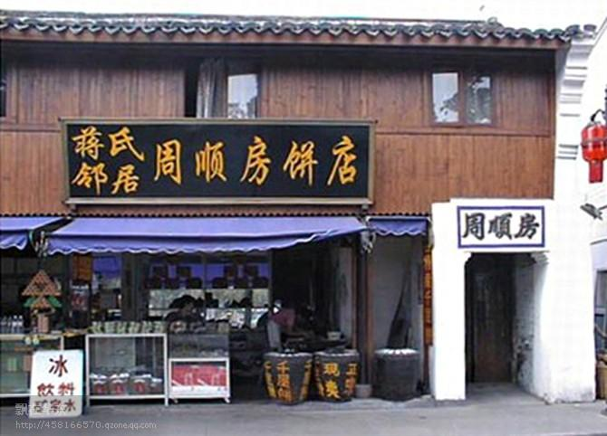

[toc]

# 问题

提问者：**<a href="https://www.zhihu.com/people/wang-lin-tao-77">王天天道</a>**
提问时间: 2026-3-10 11:0:12
总回答数: 28
总访问量: 82828

不做亏心事，不怕鬼敲门，民怕的原因是不是心里有鬼？

# 回答

回答者： **<a href="https://www.zhihu.com/people/71-24-75-57">Weithoug</a>**
回答时间: 2026-8-7 10:5:49
点赞总数: 1112
评论总数: 143
收藏总数: 352
喜欢总数：42

1.1946年，民国政府以《新华日报》刊登《驳蒋介石》一文为由，声称其“侮辱了元首”，意图借此查封报馆。

他们先在柳州、开封等地法院提起诉讼，随后将案件转至重庆，试图对《新华日报》施加压力。

然而，在律师朋友的鼎力帮助下，《新华日报》成功打赢了官司。

重庆法院最终裁定：“我国现行法律并无侮辱元首之相关条款，若属毁谤性质，则需当事人本人亲自提起诉讼。”

蒋介石本人显然不想提起诉讼，因此此事只得作罢，案件被搁置下来。

2..蒋介石发迹以后，成为了民国话事人，决定把祖屋好好修一修，弄得气派点。

周围邻居接到通知，拿了拆迁费，都搬家了。

蒋家的邻居周云生（周顺房）就是不肯搬迁，负责拆迁的人前去劝说，周云生直接说：“要我拆迁可以，你让瑞元（蒋介石小名）本人直接来和我讲道理。他要能说服我，我立马搬！”

对方一听这话，当时就懵了，这时蒋介石已经是民国话事人，民国最伟大的人了，谁还敢叫他小名呢？ 拆迁的人陪着笑脸说：“您也知道，这是蒋委员长的意思，我们也不过是奉命行事，您就高抬贵手，给我们个面子吧。”

周云生却毫不退让：“奉命行事也不能不讲道理。我在这住了几十年，祖祖辈辈都是在这儿，凭什么说搬就搬？”

没过几天，蒋介石的侍从们坐不住了，觉得周云生太嚣张，就给蒋介石出主意，想弄个罪名把周云生抓起来。

蒋介石听了以后大怒，拍着桌子骂道：“胡闹！这种事你们也敢干？”

没办法，负责拆迁的人和蒋家只能再去和周家沟通，每次都好话说尽，可周云生就是不松口。

他也不闹，也不骂，就一句话：“让瑞元自己来求我。” 那态度，既不卑躬屈膝，也不惹事生非，就是不搬。

最后，蒋介石拿他没办法，只能作罢，苦笑着说：“他不搬就不搬吧，不要伤了邻里和气。”

最终蒋介石的祖屋扩建了，但是周家的老屋就这么一直留了下来，孤零零地杵在蒋家祖屋的东南角。 乡

亲们都说，周云生这人厉害，没用拳头，没惹麻烦，就靠一张嘴，竟然把蒋家给治住了， 周云生却笑着说：“我也没干啥，就是不想搬，让他们自己想想道理。”

现在大家去浙江宁波奉化溪口蒋介石的祖屋旅游，导游也会说这个故事。 周云生的做法就是非暴力不合作，用道理说话，结果取得了成功，真是让人佩服啊。

这家人现在还住在那里，开了一个饼店，每年收入不菲，幸亏没搬走，现在靠蹭蒋家，全家世世代代生活无忧。

  

原文地址：[(Weithoug)自古以来民怕官的现象在什么情况下可以改变？](https://www.zhihu.com/question/2014656802164323976/answer/2069001298154935519) 

# 评论

1. <a href="https://www.zhihu.com/people/a-haller">非牛顿流体</a> (<small title="江苏">2026-8-7 10:58:0</small>): 不输没道理
   - <a href="https://www.zhihu.com/people/xiao-xiao-zhou-96-74">小小周</a> (<small title="湖南">2026-8-7 11:51:5</small>): 都这样了，民国不亡，真没天理了
   - <a href="https://www.zhihu.com/people/feng-ge-84-95">枫哥</a> (<small title="安徽">2026-8-7 12:2:45</small>): 资产阶级软弱性［吃瓜］
   - <a href="https://www.zhihu.com/people/14-33-57-1-62">我妈给我买的被子</a> (<small title="回复于 2026-8-7 13:25:34/江苏"> ✉️:枫哥</small>): 辩证法太好用了［捂嘴］
   - <a href="https://www.zhihu.com/people/feng-cai-98-46">风采</a> (<small title="回复于 2026-8-7 13:50:27/广东"> ✉️:枫哥</small>): 现在确实不软弱了，直接扣帽子抓就行了哈哈［飙泪笑］
   - <a href="https://www.zhihu.com/people/cassin-57">momo</a> (<small title="广东">2026-8-7 14:24:59</small>): 太文明了
   - <a href="https://www.zhihu.com/people/evan-hu-73">名字没想好</a> (<small title="湖北">2026-8-7 14:33:48</small>): 谁赢了？谁输了？
   - <a href="https://www.zhihu.com/people/na-lan-79-56">纳兰</a> (<small title="山西">2026-8-7 15:26:2</small>): 软的就怕讲道理的就怕没钱没脸不讲道理的［捂脸］
   - <a href="https://www.zhihu.com/people/ai-xia-88-85">艾夏</a> (<small title="云南">2026-8-7 16:14:54</small>): 无毒非丈夫
2. <a href="https://www.zhihu.com/people/ljcxing-xing">水抱屈原</a> (<small title="贵州">2026-8-7 12:18:8</small>): 非暴力不合作的前提是你的对手是文明人［捂脸］
   - <a href="https://www.zhihu.com/people/tao-tao-97-91">布奇</a> (<small title="江苏">2026-8-7 12:46:17</small>): 甘地在苏联就蒸发了
   - <a href="https://www.zhihu.com/people/ni-cai-cai-wo-shi-shui-2017">你猜猜我是谁2017</a> (<small title="回复于 2026-8-7 14:13:7/日本"> ✉️:布奇</small>): 还是要脸［打招呼］
   - <a href="https://www.zhihu.com/people/73-81-43-92-50">任我行</a> (<small title="回复于 2026-8-7 15:27:9/广东"> ✉️:布奇</small>): 物理意义的蒸发吗［捂脸］
   - <a href="https://www.zhihu.com/people/mak-mak-69">祖安精卫</a> (<small title="回复于 2026-8-7 15:30:37/陕西"> ✉️:布奇</small>): 绝对不会蒸发，甘地要成为保尔式的英雄
   - <a href="https://www.zhihu.com/people/shaypatrickcomrac">ShayPatrickComrac</a> (<small title="四川">2026-8-7 16:16:27</small>): 甘地遇到波波就好玩了［飙泪笑］
   - <a href="https://www.zhihu.com/people/nihility-9">非非</a> (<small title="回复于 2026-8-7 16:36:17/河北"> ✉️:任我行</small>): 那叫干馏
3. <a href="https://www.zhihu.com/people/juweisheng">Chackie Ho</a> (<small title="美国">2026-8-7 11:56:41</small>): 这个就是资产阶级软弱性。
   - <a href="https://www.zhihu.com/people/gao-hong-tao-49">ght740808</a> (<small title="吉林">2026-8-7 12:0:34</small>): 哈哈哈哈
   - <a href="https://www.zhihu.com/people/hao-ku-30tcc">二凤</a> (<small title="湖北">2026-8-7 14:6:55</small>): 哈哈哈哈哈哈哈哈哈
4. <a href="https://www.zhihu.com/people/feng-man-lou-51-23">风满楼</a> (<small title="河南">2026-8-7 12:10:29</small>): 曾短暂的到达过未来
   - <a href="https://www.zhihu.com/people/pancahg">pancahg</a> (<small title="四川">2026-8-7 14:14:23</small>): 您这回复有水平［赞］
   - <a href="https://www.zhihu.com/people/80-90-74-44">南浦</a> (<small title="北京">2026-8-7 15:32:34</small>): 你这Ip不应该啊。
   - <a href="https://www.zhihu.com/people/old-programmer">麦田里的程序员</a> (<small title="回复于 2026-8-7 15:46:30/天津"> ✉️:南浦</small>): 您
5. <a href="https://www.zhihu.com/people/a-bai-14-5-36">阿白</a> (<small title="河北">2026-8-7 12:13:9</small>): 找当地黑帮分子，每天往周云生他们家扔砖头，涂粪便，时间长他们就同意搬走了
   - <a href="https://www.zhihu.com/people/li-xia-lu-54">东吉斯蒙德</a> (<small title="湖北">2026-8-7 12:50:27</small>): 查查他亲戚也没有有公职的和在上学的，让他们去做工作［生气］
   - <a href="https://www.zhihu.com/people/jiang-nan-xue-15">牛力大仙</a> (<small title="北京">2026-8-7 13:30:28</small>): 他们又不是李达康祁同伟
   - <a href="https://www.zhihu.com/people/jia-jun-heng-21">贾不假</a> (<small title="山西">2026-8-7 13:58:51</small>): 办法这么多，老蒋还是不动脑子［大笑］
   - <a href="https://www.zhihu.com/people/44-79-50-33-17">黑猪来了</a> (<small title="回复于 2026-8-7 14:6:44/福建"> ✉️:东吉斯蒙德</small>): 软肋是吧
   - <a href="https://www.zhihu.com/people/team-arch">钳子</a> (<small title="回复于 2026-8-7 14:19:23/上海"> ✉️:东吉斯蒙德</small>): 《软肋》
   - <a href="https://www.zhihu.com/people/dang-zhen-jiu-hao-87">当真就好</a> (<small title="河北">2026-8-7 14:35:34</small>): 找个小黑屋把他儿子关几天就行
   - <a href="https://www.zhihu.com/people/liu-qian-54-73">Stay foolish</a> (<small title="山东">2026-8-7 14:40:47</small>): 涂大粪得单加钱啊，毕竟摸砖头和摸粪手感不一样
   - <a href="https://www.zhihu.com/people/mu-you-jiawen">草台班草</a> (<small title="江苏">2026-8-7 14:47:34</small>): 毕竟是他自己从小长大的邻居，不好意思的，他明显看重自己在老家的名声
   - <a href="https://www.zhihu.com/people/19-19-20-6">诺大尊</a> (<small title="浙江">2026-8-7 14:48:54</small>): 直接找解放军不就得了
   - <a href="https://www.zhihu.com/people/xi-xi-xi-xi-34-14">我的楼兰尾了</a> (<small title="四川">2026-8-7 15:0:29</small>): 不是同意，是自愿
   - <a href="https://www.zhihu.com/people/73-81-43-92-50">任我行</a> (<small title="广东">2026-8-7 15:28:51</small>): 哪用这么麻烦，直接按现行反革命论处，房屋没收，屋主绑起来游街，枪毙示众。
   - <a href="https://www.zhihu.com/people/zhi-zheng-ming-56">momo</a> (<small title="回复于 2026-8-7 15:42:20/江苏"> ✉️:东吉斯蒙德</small>): 软肋［感谢］
   - <a href="https://www.zhihu.com/people/li-xiang-de-tian-kong-72">nono</a> (<small title="回复于 2026-8-7 16:0:25/上海"> ✉️:贾不假</small>): 老蒋每天一堆屁事哪有空想这个［滑稽］，主要是手下太菜了，使点黑招不就行了
   - <a href="https://www.zhihu.com/people/50-72-81-59-29">只是近黄昏</a> (<small title="回复于 2026-8-7 16:7:7/广东"> ✉️:东吉斯蒙德</small>): 还有做生意的
   - <a href="https://www.zhihu.com/people/a-bai-14-5-36">阿白</a> (<small title="回复于 2026-8-7 16:9:37/河北"> ✉️:草台班草</small>): 邻居不懂事，就帮他懂事
   - <a href="https://www.zhihu.com/people/gan-chuan-tong">方丈</a> (<small title="广东">2026-8-7 16:10:49</small>): 有100种办法治他［酷］
   - <a href="https://www.zhihu.com/people/dao-shi-lao-ba-66-83">豪尔赫</a> (<small title="浙江">2026-8-7 16:31:14</small>): 他儿子是他的软肋，找个黑屋关他几天就老实了
6. <a href="https://www.zhihu.com/people/huang-hui-dan-80-97">黄惠儋</a> (<small title="上海">2026-8-7 10:33:55</small>): 违反该内容涉嫌违反豆包使用规范，若有误判，请长按本条消息后点击“不喜欢”进行反馈。
   - <a href="https://www.zhihu.com/people/85-60-49-88">momo</a> (<small title="上海">2026-8-7 14:6:37</small>): 豆包为了活命很有一套［大笑］
7. <a href="https://www.zhihu.com/people/10-39-28-96-13">一扶就趴趴</a> (<small title="辽宁">2026-8-7 13:26:5</small>): 周云生，他那是没遇见对手。不过话说回来，周家后人仍然靠祖屋生活，也是赖蒋氏的统战价值。
8. <a href="https://www.zhihu.com/people/33-27-2-20">东方白</a> (<small title="吉林">2026-8-7 12:11:7</small>): 提现了资产阶级的软弱性
9. <a href="https://www.zhihu.com/people/34-7-13-10-92">路过</a> (<small title="广东">2026-8-7 13:28:23</small>): 讲道理≈软弱，以宽失天下［生气］
10. <a href="https://www.zhihu.com/people/wu-shi-ren-fei-10-30">Luna</a> (<small title="甘肃">2026-8-7 13:1:51</small>): 就像南宋对波蒙古人，不输确实不可能［大笑］
    - <a href="https://www.zhihu.com/people/xiao-qi-er-20">小其儿</a> (<small title="浙江">2026-8-7 16:6:3</small>): 对付高峰期的蒙古人，只能靠重机枪。那得是千年之后的事了
11. <a href="https://www.zhihu.com/people/yi-deng-da-shi-5-40">Ada Byron</a> (<small title="上海">2026-8-7 14:14:50</small>): 他们是真的想不到，对手的底线居然低到发指。
12. <a href="https://www.zhihu.com/people/xing-zou-zai-yuan-fang-67">巴拉巴拉小魔仙</a> (<small title="安徽">2026-8-7 12:40:0</small>): 充分说明了资产阶级的软弱性［打招呼］
13. <a href="https://www.zhihu.com/people/xie-luo-fen-fen-77">旭旭梧桐寒露凌</a> (<small title="江苏">2026-8-7 11:59:54</small>): 评论区是彻底让我见识了何谓畏威不畏德［思考］
14. <a href="https://www.zhihu.com/people/wang-lin-tao-77">王天天道</a> (<small title="河南">2026-8-7 13:52:4</small>): 不应该啊［机智］周家的祖宅为啥没捐给国家？
    - <a href="https://www.zhihu.com/people/pancahg">pancahg</a> (<small title="四川">2026-8-7 14:16:41</small>): 统战价值在
    - <a href="https://www.zhihu.com/people/wang-lin-tao-77">王天天道</a> (<small title="回复于 2026-8-7 16:4:43/河南"> ✉️:pancahg</small>): ［赞］［赞］
15. <a href="https://www.zhihu.com/people/86-83-3-16-84">蓝天</a> (<small title="广东">2026-8-7 13:11:13</small>): 遇到不明事理的就完蛋了
16. <a href="https://www.zhihu.com/people/86-70-9-79">左手东风右手民兵</a> (<small title="江苏">2026-8-7 11:33:42</small>): 真的假的。真有点天方夜谭，意林的感觉
    - <a href="https://www.zhihu.com/people/li-shi-min-89-71">李世民</a> (<small title="江苏">2026-8-7 11:56:29</small>): 刘文典总该听说过吧？［吃瓜］
    - <a href="https://www.zhihu.com/people/wu-shi-ren-fei-10-30">Luna</a> (<small title="甘肃">2026-8-7 13:1:6</small>): 意林咋了，你对长春共产党宣传部有什么不满吗
    - <a href="https://www.zhihu.com/people/jim-z-73">Kim Ming</a> (<small title="陕西">2026-8-7 13:57:40</small>): 意林背后是宣传部。是官媒报的报纸
17. <a href="https://www.zhihu.com/people/jon-41-71">澹台敏明</a> (<small title="上海">2026-8-7 13:29:36</small>): 资产阶级的软弱性体现得淋漓尽致
18. <a href="https://www.zhihu.com/people/xu-yan-bin-19">许广斌</a> (<small title="山西">2026-8-7 13:59:35</small>): 到了今天却把不拆迁的侮辱为钉子户。
19. <a href="https://www.zhihu.com/people/zheng-da-tou-zi-guan-li">证大投资管理</a> (<small title="河南">2026-8-7 13:53:19</small>): 他不输没天理
20. <a href="https://www.zhihu.com/people/li-xiao-yao-27-82">武英殿小学生</a> (<small title="上海">2026-8-7 14:43:5</small>): 这玩意吩咐戴笠，让他找几个编外人员不是分分钟搞定的事情？［捂嘴］
21. <a href="https://www.zhihu.com/people/1-7-28-39">老王</a> (<small title="北京">2026-8-7 13:52:10</small>): 难怪跑到台湾去了，不冤！
22. <a href="https://www.zhihu.com/people/zhang-cheng-47-79">橙子</a> (<small title="北京">2026-8-7 12:28:20</small>): 寻衅滋事
23. <a href="https://www.zhihu.com/people/lan-yi-qing-liu">知乎用户StTRbd1</a> (<small title="江西">2026-8-7 14:37:35</small>): 可以再加个刘文典的故事
24. <a href="https://www.zhihu.com/people/noino-49">Noino</a> (<small title="浙江">2026-8-7 16:2:57</small>): 云生这个人也真顽固，我们托很多人带话给他，劝他搬走，也不知道他到底贪恋什么
25. <a href="https://www.zhihu.com/people/deng-shui-shui-huai-yun-48-17">瞪谁谁怀孕</a> (<small title="湖南">2026-8-7 14:47:17</small>): 慈不掌兵啊，老将这都不懂。
26. <a href="https://www.zhihu.com/people/john-paul-29">小面包发发</a> (<small title="上海">2026-8-7 12:34:34</small>): 慈不掌兵
    - <a href="https://www.zhihu.com/people/85-60-49-88">momo</a> (<small title="上海">2026-8-7 14:9:2</small>): 周家不是他的兵。
    - <a href="https://www.zhihu.com/people/hu-xiang-zi-di-99">湖湘子弟</a> (<small title="江苏">2026-8-7 16:33:12</small>): 民国后期已经在实行军队国家化了。
27. <a href="https://www.zhihu.com/people/yumg-008">yumg_008</a> (<small title="北京">2026-8-7 14:53:16</small>): 民主的曙光
28. <a href="https://www.zhihu.com/people/26-34-19-67">快乐一族</a> (<small title="山西">2026-8-7 13:29:16</small>): 这是为蒋洗白。
    - <a href="https://www.zhihu.com/people/yang-yao-xiang-42">Arvin</a> (<small title="湖南">2026-8-7 13:40:23</small>): 第一个故事出自时任中共四川省委书记吴玉章在《回忆〈新华日报〉》中的记述。《向继东：读〈新华日报的回忆〉》里面也有
    - <a href="https://www.zhihu.com/people/wu-shi-ren-fei-10-30">Luna</a> (<small title="甘肃">2026-8-7 14:14:59</small>): 他怎么洗白老蒋的？  
 
他把老蒋做的事重复了一遍［捂嘴］［捂嘴］［捂嘴］  
 
按你的思路，别人陈述老蒋干的坏事我能不能称为抹黑［飙泪笑］［飙泪笑］［飙泪笑］
    - <a href="https://www.zhihu.com/people/71-94-60-87-67">双子座流星雨</a> (<small title="上海">2026-8-7 14:43:6</small>): 欢迎你来给蒋抹黑，黑白抵消一下。
29. <a href="https://www.zhihu.com/people/suzu1110">队长别开枪</a> (<small title="山东">2026-8-7 12:37:8</small>): 输得不冤
30. <a href="https://www.zhihu.com/people/yong-yuan-bu-yao-shi-qu-meng-xiang-ya">永远不要失去梦想鸭</a> (<small title="江苏">2026-8-7 13:56:28</small>): 蒋介石这个人就不是干大事的。他糊涂之处体现在对待一个群体的时候冷酷无情残忍无比，但是具体到一个人的时候又优柔寡断心慈手软
    - <a href="https://www.zhihu.com/people/71-94-60-87-67">双子座流星雨</a> (<small title="上海">2026-8-7 14:44:32</small>): 群体不是由一个个个体组成的？死在夹边沟的是一个个体还是一个群体？
31. <a href="https://www.zhihu.com/people/vhaoqi">vhaoqi</a> (<small title="重庆">2026-8-7 12:36:31</small>): 而且那个时候，中国法律就知道名誉权是自诉案，需要被损害者（或家属）自己提诉，否则公权力不能介入。现在，所谓“诽谤英烈”入了刑事罪……
    - <a href="https://www.zhihu.com/people/88-58-18-74-70">过客</a> (<small title="上海">2026-8-7 13:17:38</small>): 英烈都没个名单，也不知道会不会不小心就诽谤哪个英烈了。
    - <a href="https://www.zhihu.com/people/annn-60-18">annn</a> (<small title="回复于 2026-8-7 13:37:33/未知"> ✉️:过客</small>): 教科书上的都是
    - <a href="https://www.zhihu.com/people/cang-er-81-39">苍耳</a> (<small title="回复于 2026-8-7 13:40:25/河北"> ✉️:annn</small>): 以哪一版本的教材为准？全国各地好几个版本，还过几年就新标又新标。
    - <a href="https://www.zhihu.com/people/vhaoqi">vhaoqi</a> (<small title="回复于 2026-8-7 13:50:1/重庆"> ✉️:annn</small>): 如果以教材作标准，或者哪怕专门拉个名单，这些人说不得、碰不得，那么这样的法治岂不是太儿戏了。  
 
还是端正法治精神，世界上所有文明国家，名誉侵权都是自诉案。法律是要保护公民名誉，但名誉有没受损害只有本人才知道，外人怎么评判？所以需要本人提诉。
    - <a href="https://www.zhihu.com/people/85-30-51-10-55">捂嘴</a> (<small title="回复于 2026-8-7 13:54:28/陕西"> ✉️:苍耳</small>): 主打一个灵活，根据需要随时增减［感谢］
    - <a href="https://www.zhihu.com/people/bao-lian-nu-8">保连奴8</a> (<small title="广西">2026-8-7 13:57:40</small>): kmt的英烈受保护吗［滑稽］
    - <a href="https://www.zhihu.com/people/95-88-31-22">火化奇士可利</a> (<small title="上海">2026-8-7 14:3:48</small>): 幽默外行
    - <a href="https://www.zhihu.com/people/42-67-64-58">小小唐</a> (<small title="上海">2026-8-7 14:26:52</small>): 现在网上哇哇哇叫一叫都能损害企业声誉了
    - <a href="https://www.zhihu.com/people/han-dong-bing-35">HDB2</a> (<small title="北京">2026-8-7 15:27:59</small>): 照你这么说诽谤英烈还有了道理了？
    - <a href="https://www.zhihu.com/people/han-dong-bing-35">HDB2</a> (<small title="回复于 2026-8-7 15:28:23/北京"> ✉️:HDB2</small>): 现在互联网上真是什么人都有
    - <a href="https://www.zhihu.com/people/89-49-94-37">速回复寄</a> (<small title="回复于 2026-8-7 15:59:51/陕西"> ✉️:HDB2</small>): 谁是英烈？
    - <a href="https://www.zhihu.com/people/37-49-21-42">无心伤害</a> (<small title="回复于 2026-8-7 16:6:50/广东"> ✉️:HDB2</small>): 关键是谁是英烈，好歹有个名单
32. <a href="https://www.zhihu.com/people/slamdunk-36-87">鲟鳗鲩鲤鲫鲍</a> (<small title="广东">2026-8-7 11:12:3</small>): 不够心狠手辣，太过妇人之仁，输得不冤
    - **Weithoug** (<small title="湖北">2026-8-7 12:9:29</small>): 妇人之仁这个词是刘邦对项羽的评价
    - **Weithoug** (<small title="湖北">2026-8-7 12:10:8</small>): 出自司马迁《史记》
    - <a href="https://www.zhihu.com/people/chen-hai-cheng-75">行走江湖</a> (<small title="云南">2026-8-7 13:17:30</small>): 地位上去了，名声很重要，不是你干的，世人都觉得是你干的。
    - <a href="https://www.zhihu.com/people/ni-lin-27-94">张明2</a> (<small title="湖南">2026-8-7 13:30:56</small>): 他居然讲法律
    - <a href="https://www.zhihu.com/people/zhszyhmhmm">豆汁</a> (<small title="回复于 2026-8-7 13:33:46/新疆"> ✉️:Weithoug</small>): 确切的说是是韩信对项羽的评价，刘邦采纳了。
    - <a href="https://www.zhihu.com/people/72-26-58-28-4">知乎用户</a> (<small title="北京">2026-8-7 13:35:57</small>): 够心狠手辣了，就是不懂什么时候心狠手辣
    - <a href="https://www.zhihu.com/people/71-94-60-87-67">双子座流星雨</a> (<small title="回复于 2026-8-7 14:42:10/上海"> ✉️:Weithoug</small>): 光史记就记录了项羽的六次屠城，如果这还是妇人之仁，那不仁的得成啥样啊？
33. <a href="https://www.zhihu.com/people/a-79-28-67">知乎用户A</a> (<small title="重庆">2026-8-7 13:23:53</small>): 当时的医疗水平不行，连周云生是精神病都不能确诊。
34. <a href="https://www.zhihu.com/people/tony-79-33">沧海一粟</a> (<small title="福建">2026-8-7 16:23:15</small>): 老蒋难怪会输
35. <a href="https://www.zhihu.com/people/28-85-86-13">宇宙耀变龙</a> (<small title="福建">2026-8-7 16:27:34</small>): 妇人之仁
36. <a href="https://www.zhihu.com/people/zhang-duo-27-86">砚台脂</a> (<small title="山东">2026-8-7 14:51:27</small>): 不应该趁着月黑风高，直接拉上几台推土机直接推平了事吗
37. <a href="https://www.zhihu.com/people/d4c-22">d4c</a> (<small title="广东">2026-8-7 16:12:5</small>): 老蒋现在在哪发财呢？［飙泪笑］
38. <a href="https://www.zhihu.com/people/zhi-9hcblmr4">浴剑而立</a> (<small title="浙江">2026-8-7 14:50:31</small>): 参见徐继畲的《瀛寰志略》［大笑］
39. <a href="https://www.zhihu.com/people/upknow">Upknow</a> (<small title="浙江">2026-8-7 14:14:10</small>): 这就是好日子。
40. <a href="https://www.zhihu.com/people/10-75-95-49">天下兴亡无匹夫</a> (<small title="北京">2026-8-7 16:34:52</small>): 因为那是他邻居，知根知底，在老家都是一个派系的；你看看当时兴建南京，强拆了多少［害羞］
41. <a href="https://www.zhihu.com/people/li-xiang-de-tian-kong-72">nono</a> (<small title="上海">2026-8-7 15:59:21</small>): 老蒋手下就是菜
42. <a href="https://www.zhihu.com/people/yi-luo-21">永远</a> (<small title="上海">2026-8-7 14:59:46</small>): 唉，唉。
43. <a href="https://www.zhihu.com/people/88-29-30-25-14">冻脲清溥凉</a> (<small title="浙江">2026-8-7 15:57:59</small>): 君子输小人，很正常
44. <a href="https://www.zhihu.com/people/nowaterworld-52">Nowaterworld</a> (<small title="广东">2026-8-7 15:38:44</small>): 我也好奇，当年这些报纸怎么一直存在，现在看个明报大公报都要掌握科学技术［飙泪笑］。
45. <a href="https://www.zhihu.com/people/--94-87-39-10">momo</a> (<small title="湖北">2026-8-7 13:38:43</small>): 那我问你［大笑］
46. <a href="https://www.zhihu.com/people/ying-zuo-ru-shi-guan-36">麻花焰</a> (<small title="安徽">2026-8-7 14:27:52</small>): 文明
47. <a href="https://www.zhihu.com/people/jiang-han-55">蒋涵</a> (<small title="北京">2026-8-7 11:44:25</small>): 幸亏
48. <a href="https://www.zhihu.com/people/zhang-zhao-ce">张照册</a> (<small title="重庆">2026-8-7 16:11:18</small>): 等会，周云生这祖屋当年没被没收？
49. <a href="https://www.zhihu.com/people/he-he-xiao-hui-hui">呵呵小灰灰</a> (<small title="北京">2026-8-7 13:53:0</small>): 光头还是个忠厚人呐
50. <a href="https://www.zhihu.com/people/ai-ma-cheng-xu-yuan">妖魔鬼怪快离开</a> (<small title="日本">2026-8-7 14:3:4</small>): 遥遥领先
51. <a href="https://www.zhihu.com/people/yangl4001-59">斗战神狒</a> (<small title="安徽">2026-8-7 11:41:24</small>): 我不明白，优势在我
52. <a href="https://www.zhihu.com/people/404.not.found">咕鸽北度</a> (<small title="山东">2026-8-7 15:0:42</small>): 我有一万种办法让他 自愿 搬走［doge］
53. <a href="https://www.zhihu.com/people/54-63-50-25-39">常满</a> (<small title="广东">2026-8-7 14:54:20</small>): 拳头不够硬只能躲岛上了
54. <a href="https://www.zhihu.com/people/cang-lao-shi-79">科科</a> (<small title="广东">2026-8-7 14:42:13</small>): 不好意思打扰一下，1946年老蒋跟新华日报打官司输了，那请问1947年老蒋对新华日报做了什么？
55. <a href="https://www.zhihu.com/people/yan-shu-77-7">妍姝</a> (<small title="河南">2026-8-7 14:14:51</small>): 资产阶级软弱性
    - <a href="https://www.zhihu.com/people/pancahg">pancahg</a> (<small title="四川">2026-8-7 14:25:56</small>): 不懂得革命
56. <a href="https://www.zhihu.com/people/64-40-67">西乡塘-原匿名</a> (<small title="重庆">2026-8-7 14:51:30</small>): 输的不怨
57. <a href="https://www.zhihu.com/people/alex-lu-yi">Alex 路以3号</a> (<small title="北京">2026-8-7 14:7:14</small>): 果然是课本上写的：资产阶级的软弱性
58. <a href="https://www.zhihu.com/people/zi-xian-37-16">一笑看漫</a> (<small title="江苏">2026-8-7 14:35:0</small>): 文明
59. <a href="https://www.zhihu.com/people/zvbb9">哈梅内伊</a> (<small title="江苏">2026-8-7 14:15:55</small>): 怪不得打不过啊，这不束手束脚嘛
60. <a href="https://www.zhihu.com/people/chi-shang-shou-xie-ti">离殇</a> (<small title="河南">2026-8-7 11:45:40</small>): ［大笑］
61. <a href="https://www.zhihu.com/people/13-79-60-57-64">陶白白</a> (<small title="云南">2026-8-7 14:55:24</small>): 很多粉红和往左用这种嘲讽国民政府懦弱无能 妇人之仁
62. <a href="https://www.zhihu.com/people/lulu-45">lulu</a> (<small title="重庆">2026-8-7 11:45:4</small>): 都46年了，敌对报纸居然没有查封，人也没活埋，对敌人都这么仁慈。
    - <a href="https://www.zhihu.com/people/xiao-you-35-50">富愁者联盟</a> (<small title="重庆">2026-8-7 12:41:16</small>): 看看张学良的待遇就是蒋成不了大事
    - <a href="https://www.zhihu.com/people/9-33-47-57">镇山都总帅</a> (<small title="重庆">2026-8-7 12:44:15</small>): 红岩看过吧？挺进报1948年还在发行，根本没人管，是自己作死写信给西南公署主任朱绍良进行人身威胁，才被查封的［捂脸］
    - <a href="https://www.zhihu.com/people/17-20-15-17-32">朗朗</a> (<small title="北京">2026-8-7 13:45:41</small>): 【档案揭秘】"务令各部烧杀勿论为要"--1933年蒋介石对苏区的大烧杀手令  
 
[https://zhuanlan.zhihu.com/p/56759905?utm\_psn=1911050191835989242](https://zhuanlan.zhihu.com/p/56759905?utm_psn=1911050191835989242)
    - <a href="https://www.zhihu.com/people/53-3-45-62">河伯跳劈</a> (<small title="回复于 2026-8-7 14:16:48/北京"> ✉️:镇山都总帅</small>): 人不作就不会死［捂嘴］
63. <a href="https://www.zhihu.com/people/yang-zhen-19-90">自然选择前进四</a> (<small title="湖北">2026-8-7 12:16:27</small>): 民国不亡，天理难容
64. <a href="https://www.zhihu.com/people/er-san-57-52-2">着力即差</a> (<small title="重庆">2026-8-7 11:54:39</small>): 太文明了，干不过泥腿子
    - <a href="https://www.zhihu.com/people/chen-hai-cheng-75">行走江湖</a> (<small title="云南">2026-8-7 13:20:36</small>): 不是文明不文明的问题，大多数人连他邻居一样的房子都没有。
65. <a href="https://www.zhihu.com/people/international-4">卡牌马斯特</a> (<small title="安徽">2026-8-7 14:8:5</small>): 说明欺软怕硬［飙泪笑］
66. <a href="https://www.zhihu.com/people/huang-gui-min-4-37">犹大的狮子</a> (<small title="山东">2026-8-7 12:43:30</small>): 苏联不亡，天理难容

=[评论](./attachments/comments.json)

