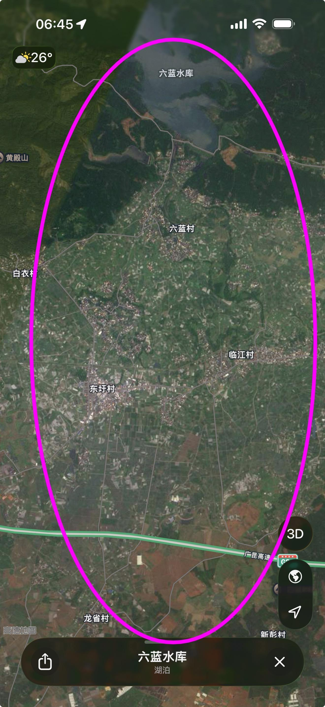

[toc]

# 问题

提问者：**<a href="https://www.zhihu.com/people/27-51-66-19">南弋</a>**
提问时间: 2026-7-11 11:18:13
总回答数: 610
总访问量: 8085758

看到新闻，看着昔日的光景化为泡影，满目疮痍的现场让人揪心的疼，心生怜悯是我，无能为力的也是我。其中，一个镜头让我思绪翻涌，多年前的往事猝不及防闯入脑海，细碎的过往清晰浮现。我记得，视频里一个妇女对着镜头说“什么都没了”，眼神里全是对灾情的无奈，对生活的一种无望。我想起多年前，我的家乡也是遭遇天灾-冰雹，农作物全军覆没，那是我和弟弟的学费来源，我的母亲也曾在田间歇斯底里的痛哭，控诉着天灾的无情，希望破灭的绝望。当时我们都是自己承担了损失，毕竟那会信息、政策都没有现在完善，现在一方有难八方支援的场景，让人不禁热泪盈眶，感动于消防员的艰苦奋战，感动于社会各界人士的爱心支援，感动于国家的强大，人民的团结.......愿洪水早日退去，一切安好

# 回答

回答者： **<a href="https://www.zhihu.com/people/lovelc881101">lovelc881101</a>**
回答时间: 2026-8-4 7:2:55
点赞总数: 63
评论总数: 48
收藏总数: 13
喜欢总数：1

上面的那两个村子 溃坝瞬间 一秒清空 水到高速公路那了 高速公路一般都是高于当地两米三米的 也就是北上大片一片汪洋的 不幸中的万幸死亡才30多个

  

原文地址：[(lovelc881101)最近广西的洪水，让你感触最深的是什么？](https://www.zhihu.com/question/2059235046595225021/answer/2067868104009454889) 

# 评论

1. <a href="https://www.zhihu.com/people/mei-zi-11-54-21">梅子</a> (<small title="美国">2026-8-4 13:13:27</small>): 我知乎上发了一条质疑这个数字，10秒以后荒原了，我就知道稳了....［捂脸］
2. <a href="https://www.zhihu.com/people/yuan-guang-gui">滋水涵木</a> (<small title="广东">2026-8-4 12:59:11</small>): 30个你也信？用脚趾头想想也知道一眼假
   - <a href="https://www.zhihu.com/people/44-25-24-67-85">黄雅丽</a> (<small title="内蒙古">2026-8-4 15:17:52</small>): 洪水来之前早就预警了，村子都搬空了，但总有少数人死不信邪藏起来不肯走的
   - <a href="https://www.zhihu.com/people/fei-chi-zhong-wu-22">尘中堙灭</a> (<small title="回复于 2026-8-4 16:27:56/广东"> ✉️:黄雅丽</small>): 我广西的。没有预警，很多人都冲走了
   - <a href="https://www.zhihu.com/people/44-25-24-67-85">黄雅丽</a> (<small title="回复于 2026-8-4 16:36:23/内蒙古"> ✉️:尘中堙灭</small>): 有的，下雨的事情提前好几天就能预报了。你和你周围的人不注意看预警，还真是物以类聚。
   - <a href="https://www.zhihu.com/people/qiang-qi-bing-15">TOMCAT</a> (<small title="回复于 2026-8-4 16:37:17/山东"> ✉️:尘中堙灭</small>): 冲走是失联吧，是不是不算死亡
   - <a href="https://www.zhihu.com/people/fei-chi-zhong-wu-22">尘中堙灭</a> (<small title="回复于 2026-8-4 16:49:46/广东"> ✉️:TOMCAT</small>): 找不到尸体就算失联
   - <a href="https://www.zhihu.com/people/35-92-93-8">无话可说</a> (<small title="回复于 2026-8-4 16:51:3/陕西"> ✉️:尘中堙灭</small>): 广西哪的了，广西大着呢。
   - <a href="https://www.zhihu.com/people/gu-niang-kuai-song-shou">叆叇</a> (<small title="回复于 2026-8-4 17:9:55/广东"> ✉️:黄雅丽</small>): 老坛儿
   - <a href="https://www.zhihu.com/people/fei-chi-zhong-wu-22">尘中堙灭</a> (<small title="回复于 2026-8-4 17:22:20/广东"> ✉️:无话可说</small>): 云表，去搜吧
   - <a href="https://www.zhihu.com/people/fang-xiang-li">Jasmine的文史馆</a> (<small title="回复于 2026-8-4 17:40:9/广西"> ✉️:黄雅丽</small>): 我在南宁，你说的是台风预警，台风年年有好几个，都会预报的，而且次次台风预警都是防风为主这次也不例外，而且这次洪灾是水库溃坝引发的灾害，根本没有提前预警提前撤离，只有事后救援，你不了解情况还指责那些受灾群众是自己原因不撤离的，太不负责任了！
   - <a href="https://www.zhihu.com/people/44-25-24-67-85">黄雅丽</a> (<small title="回复于 2026-8-4 17:56:45/内蒙古"> ✉️:Jasmine的文史馆</small>): 洪灾也是有预警的，上游降雨多少水位多少都是提前知道的。这里几千居民，为什么就那么几个死了，人家99％的居民都看到预警了
   - <a href="https://www.zhihu.com/people/fang-xiang-li">Jasmine的文史馆</a> (<small title="回复于 2026-8-4 18:4:44/广西"> ✉️:黄雅丽</small>): 你去问问广西自治区各级领导，南宁的横州的各级领导，还有南宁市气象局，防灾减灾的领导们，为什么横州没有预警不提前撤离村民？
   - <a href="https://www.zhihu.com/people/fang-xiang-li">Jasmine的文史馆</a> (<small title="回复于 2026-8-4 18:5:29/广西"> ✉️:黄雅丽</small>): 你把预警晒出来！
   - <a href="https://www.zhihu.com/people/fang-xiang-li">Jasmine的文史馆</a> (<small title="回复于 2026-8-4 18:9:1/广西"> ✉️:黄雅丽</small>): 你们内蒙古的人家都收到预警了，怎么我们在南宁的不知道，那些横州村民都不知道？
3. <a href="https://www.zhihu.com/people/xiongbee">算不准的算命先生</a> (<small title="广东">2026-8-4 7:8:47</small>): 培基啊？……
   - <a href="https://www.zhihu.com/people/oas33">知乎用户oAS33</a> (<small title="浙江">2026-8-4 13:57:15</small>): 吃个鸡蛋培基［飙泪笑］
   - <a href="https://www.zhihu.com/people/yang-yan-da-18">北巴拉特爱国兔</a> (<small title="河北">2026-8-4 14:5:3</small>): 鲤鱼焙面［惊讶］
   - <a href="https://www.zhihu.com/people/chen-yi-jiang-55-81">兔牙小恶魔</a> (<small title="回复于 2026-8-4 15:21:40/浙江"> ✉️:北巴拉特爱国兔</small>): 盐津做法
   - <a href="https://www.zhihu.com/people/luo-yi-83-42">SCV09序</a> (<small title="广东">2026-8-4 16:51:45</small>): 政府统计［思考］
4. <a href="https://www.zhihu.com/people/zhao-hai-peng-55">牧马人</a> (<small title="江苏">2026-8-4 9:38:43</small>): 百度第一个村人口3000多，其他村还没查到
5. <a href="https://www.zhihu.com/people/peggyfunny">一路向北</a> (<small title="湖北">2026-8-4 9:35:4</small>): 或许可以加2个0
6. <a href="https://www.zhihu.com/people/peng-jian-hua-96-91">momo</a> (<small title="广东">2026-8-4 14:40:29</small>): : 政府划定的灾区是豫北和豫南。你现在到洛阳了，你就不是灾民了。  
 
：那我怎么才能算是灾民？  
 
：你再走几百里，到豫北和豫南，你就是灾民了。
   - <a href="https://www.zhihu.com/people/qi-guai-de-kuai-di">奇怪的快递</a> (<small title="广西">2026-8-4 16:31:46</small>): 你来过当地吗你
   - <a href="https://www.zhihu.com/people/wang-de-wei-30">嘎嘎叫的鸭子</a> (<small title="回复于 2026-8-4 16:49:2/四川"> ✉️:奇怪的快递</small>): 1942的台词
7. <a href="https://www.zhihu.com/people/29-43-61-75-9">不会倒下的自由民</a> (<small title="重庆">2026-8-4 17:20:7</small>): “不管你信不信，反正我是信了！”---我一直觉得这句话是让我们用很多年的金句！
8. <a href="https://www.zhihu.com/people/6-55-63-92-88">等你下钟</a> (<small title="湖南">2026-8-4 16:42:47</small>): 应该是28个［doge］
9. <a href="https://www.zhihu.com/people/mr-goorit-70">Mr.Goorit</a> (<small title="广东">2026-8-4 15:33:29</small>): 延津做法
10. <a href="https://www.zhihu.com/people/41-18-2-34-18">褪色者</a> (<small title="广东">2026-8-4 15:14:53</small>): 我的回答，一开始冲到1000多点赞，后面就石沉大海。
    - <a href="https://www.zhihu.com/people/qi-guai-de-kuai-di">奇怪的快递</a> (<small title="广西">2026-8-4 16:32:14</small>): 你来过当地吗？我26号才去，你呢？
11. <a href="https://www.zhihu.com/people/bu-zhi-wei-bu-zhi-13-79">不知为不知</a> (<small title="江苏">2026-8-4 14:13:50</small>): 这圆圈处还真是损失人少的，泄洪道几百个流量有三、四个小时了，三十米长的小溃口又催促了一把，然后才是110米长的大溃口。哪像云表水库啊［大哭］［大哭］［大哭］
12. <a href="https://www.zhihu.com/people/biggod-3-11">BigGod</a> (<small title="广东">2026-8-4 16:46:1</small>): 这么快吗？水流的这么快吗？1秒就满了！
13. <a href="https://www.zhihu.com/people/9-31-91-40-40">迷途仿徨</a> (<small title="广西">2026-8-4 14:35:32</small>): 300都算少了
14. <a href="https://www.zhihu.com/people/laosu-76">化随风</a> (<small title="海南">2026-8-4 16:28:22</small>): 政府统计30个［尴尬］
15. <a href="https://www.zhihu.com/people/zuo-ye-xing-chen-zuo-ye-feng-4-65">昨夜星辰昨夜风</a> (<small title="浙江">2026-8-4 17:12:22</small>): 据传应该是17000
    - <a href="https://www.zhihu.com/people/chen-xiao-pang-85-55">陈小胖</a> (<small title="福建">2026-8-4 17:55:24</small>): 这几个村加起来有这么多人吗？
16. <a href="https://www.zhihu.com/people/98-32-84-4">十月秋枫</a> (<small title="江苏">2026-8-4 14:3:18</small>): 除非都是赛亚人或者比克大魔王！
17. <a href="https://www.zhihu.com/people/san-qiu-55-75">三秋</a> (<small title="河南">2026-8-4 14:9:23</small>): 鲤鱼培面
18. <a href="https://www.zhihu.com/people/omcm4a">魔鬼筋肉人肉嘟嘟</a> (<small title="四川">2026-8-4 13:20:31</small>): 搞不懂这么个小不点水库水流出来咋能淹拉磨多地方［尴尬］［尴尬］［尴尬］［尴尬］［尴尬］［尴尬］
    - <a href="https://www.zhihu.com/people/fei-chi-zhong-wu-22">尘中堙灭</a> (<small title="广东">2026-8-4 16:29:34</small>): 不只一个水库决堤，六蓝旁边还有甘道水库也决堤了
    - <a href="https://www.zhihu.com/people/omcm4a">魔鬼筋肉人肉嘟嘟</a> (<small title="回复于 2026-8-4 17:55:21/四川"> ✉️:尘中堙灭</small>): 可是那水不是朝四面八方到处流吗［飙泪笑］［飙泪笑］
    - <a href="https://www.zhihu.com/people/lan-zhou-shao-bing-zhu">兰州烧饼丶</a> (<small title="回复于 2026-8-4 18:37:4/广西"> ✉️:魔鬼筋肉人肉嘟嘟</small>): 确实是四面八方流的，但是你可以看一下那个地方的卫星图，看看地势，那相当于一个盆了，几座水库崩了，水本应该流到小河然后大河，但是水太多了大河也没那么快排出去，所以水位就会涨啊
19. <a href="https://www.zhihu.com/people/de-zhi-wo-xing-72-31">凡王之血</a> (<small title="山东">2026-8-4 9:19:55</small>): 才30多个？？？？？你是觉得还不够吗
    - <a href="https://www.zhihu.com/people/dreamofxh">dreamofxh</a> (<small title="重庆">2026-8-4 9:21:42</small>): 你是觉得这个数据对吗？
    - <a href="https://www.zhihu.com/people/de-zhi-wo-xing-72-31">凡王之血</a> (<small title="回复于 2026-8-4 9:22:22/山东"> ✉️:dreamofxh</small>): 不该问的别问
    - <a href="https://www.zhihu.com/people/86-70-9-79">左手东风右手民兵</a> (<small title="回复于 2026-8-4 10:12:24/江苏"> ✉️:dreamofxh</small>): 我们也希望他们有奇迹，但现实太残酷了
    - <a href="https://www.zhihu.com/people/reseted1782215900782">网络养殖研究</a> (<small title="回复于 2026-8-4 13:40:6/上海"> ✉️:dreamofxh</small>): 说不对的有证据么？［好奇］
    - <a href="https://www.zhihu.com/people/mo-fa-shao-nu-guo-de-gang-99-90">尢馮飞飞</a> (<small title="回复于 2026-8-4 14:4:42/陕西"> ✉️:网络养殖研究</small>): 证据就是正常人的智商和大脑。

=[评论](./attachments/comments.json)

