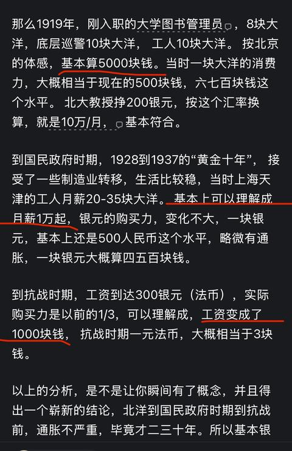
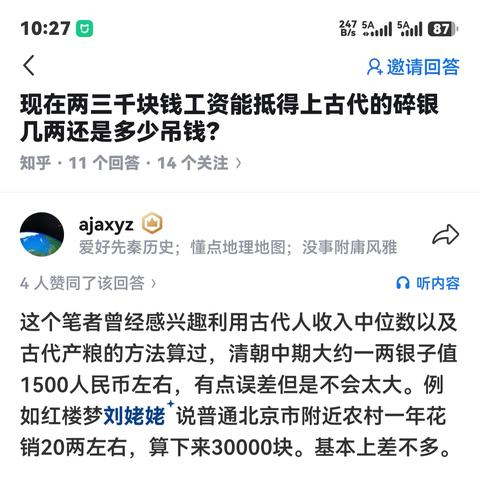
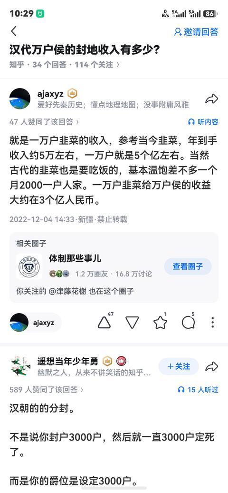
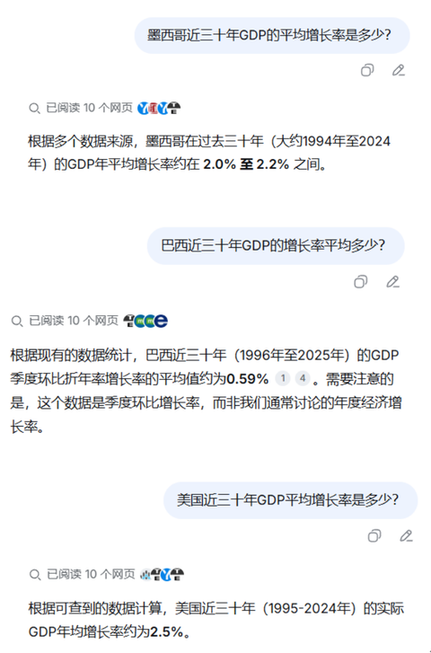

[toc]

# 问题

提问者：**<a href="https://www.zhihu.com/people/zheng-bei-bei-38">嘟嘟观察员</a>**
提问时间: 2014-11-3 16:0:54
总回答数: 0
总访问量: 0

中华民国以前的一块大洋相当于现在人民币多少啊？

# 回答

回答者： **<a href="https://www.zhihu.com/people/li-de-sheng-4-77">nmamtf</a>**
回答时间: 2026-2-4 16:41:26
点赞总数: 9799
评论总数: 848
收藏总数: 3615
喜欢总数：657

用米价，猪肉，折算白银购买力的，是极为愚蠢的！

因为现代的米变成了超级便宜的玩意，现代产量翻了上百倍，而且现代食品丰富大米消费占比低，米价更低。拿古代的米价，和现代米价折算，实在是太过于愚蠢。大大低估过去银元的购买力。猪肉粮食等等，都不适合古今对比。因为猪肉粮食在现代社会产量高，重要性大大降低。。

所以高赞说什么一块银元100块钱真是荒谬到笑吐了。大学图书管理员，一个月挣800块？

那么什么更能反映真实换算呢？

老百姓的工资。

这个是最准的。因为给老百姓发工资逻辑，古今中外差不多，基本就是让人刚刚能维持生活的状态，少了老百姓不来，多了老板不干。别的物品，都存在古代和现代的重要性区别，以人为参考，最能能反应人的真实体感。其他一切生活用品的价格，其实都锚定的是人的工资水平。

那么1919年，刚入职的大学图书管理员，8块大洋，底层巡警10块大洋， 工人10块大洋。 按北京的体感，基本算5000块钱。当时一块大洋的消费力，大概相当于现在的500块钱，六七百块钱这个水平。 北大教授挣200银元，按这个汇率换算，就是10万/月，基本符合。

到国民政府时期，1928到1937的“黄金十年”， 接受了一些制造业转移，生活比较稳，当时上海天津的工人月薪20-35块大洋。 基本上可以理解成月薪1万起，银元的购买力，变化不大，一块银元，基本上还是500人民币这个水平，略微有通胀，一块银元大概算四五百块钱。

到抗战时期，工资到达300银元（法币），实际购买力是以前的1/3，可以理解成，工资变成了1000块钱， 抗战时期一元法币，大概相当于3块钱。

以上的分析，是不是让你瞬间有了概念，并且得出一个崭新的结论，北洋到国民政府时期到抗战前，通胀不严重，毕竟才二三十年。所以基本银元汇率可以一致看待，一块银元等于400-600人民币。

那么接下来看看民国的物品多少钱：

一斤米（533g）0.034-0.06元，就是15到25块钱左右一斤米。

你觉得贵的夸张是吧？

那么请问你一顿外卖，吃多少钱？

二三十吧？ 民国人一顿饭吃饱，吃半斤米，不吃菜，花个十块钱，夸张吗？ 这种计算方法使人对物品的古代价格有了概念，比如你就会意识到，古代民国吃饱饭是多么贵的一件事。

所以再次强调，用米价换算，极为愚蠢，不能反映生活体感。

再说别的物价，一块大洋，可以三个人吃顿西餐，四个人吃顿涮羊肉，到今天，也是500块钱干这点事。

电影票0.1元一张 = 50块钱一张。

北京普通单间公寓房租3-6元 = 1500到3000元一个月。

一件平民粗布长衫 5毛钱 = 一身衣服 250块钱

一件普通棉衣 1块钱 = 一件羽绒服 500块钱。

（从这你可以看出来，由于现代纺织业发展，现代人穿衣还是便宜了。）

一块国产普通肥皂 0.08-0.15元 = 40-75元

（这里你是不是觉得肥皂贵的夸张了？）

（ 没错，这就是这种“一般工资等价换算法”的好处，让你意识到，民国的肥皂是地道的奢侈品，一家人一块肥皂可以用好几个月，理解了为什么古代洗衣服是麻烦事，为什么老百姓会蹲在河边那木棒一遍遍敲打衣服。因为没肥皂，要用草木灰/皂角/猪胰子。 一块肥皂相当于今天你买了一套施华蔻洗发洗浴大礼包）

北京普通四合院，1000元 = 小户型 50万（也许这就是合理价格？）

骆驼祥子的二手洋车 100元，攒了三年 = 5万块钱人民币。 也差不多吧？好的二手车5万块钱，需要底层打工人一年省吃俭用攒2万块钱。 骆驼祥子被匪兵一次抢5万人民币，是不是很肉疼，但也不至于寻死觅活，还能鼓鼓劲再攒一辆？

骆驼祥子一天拉车流水5毛-1块钱（250-500块钱）（的哥正常收入），小福子被卖给军官200块当妾（10万块彩礼），白房子一次价格50铜子到1块大洋（250-500）。 虎妞给了祥子80块（4万），给虎妞办丧事花了80块（4万）。

下面看一下历史大数，你就有概念了，不准确，但是可以和你的生活体感有了参考：（一两银子算1.5块大洋）

西原大借款，相当于1.2亿大洋。 大概相当于借了500亿。

庚子赔款大概算6.8亿大洋， 大概算3500亿赔款。（4亿人3500亿，相当于13亿人的一万亿水平） 打个仗赔一万亿，可以想象其惨烈程度。）

北洋水师主力定远舰，折合200万大洋，就是10亿一艘。相当于一万个工薪干一年。1000个家庭毕生资产。

民国永丰舰（中山舰），800吨炮艇=70万大洋 3亿5000万

庚子赔款美国退了3500万大洋，大概是150亿。

民国一把进口毛瑟枪，20大洋，就是1000块钱。（勘误 10000元）

一门榴弹炮3-5万大洋，就是1500万-2500万。

一架主力战机1-3万大洋，就是500-1500万（当时的飞机用处还不大，比炮便宜）

北洋时期军费3亿大洋= 1500亿

抗战初期，1937年军费，汇率还没崩，10亿大洋 = 5000亿。

抗战前十年时间，总共花了10亿军费买东西做准备： 5000亿。

抗战前国民生产总值，中国46亿，日本都是205亿： GDP 2000亿 vs 一万亿。

抗战直接加间接损失，5000亿大洋（ 250万亿人民币） ，相当于当时中国二十五年的gdp（这里引用的别人的统计，并不是完全换算的来）。

  

原文地址：[(nmamtf)中华民国以前的一块大洋相当于现在人民币多少啊？](https://www.zhihu.com/question/26462128/answer/2002421491954885765) 

# 评论

1. <a href="https://www.zhihu.com/people/zhang-wei-guo-49">洛丹伦的夏雨天</a> (<small title="上海">2026-2-5 8:40:18</small>): 就是马克思提出的无差别劳动时间。
   - <a href="https://www.zhihu.com/people/li-xiao-67-4">李潇</a> (<small title="山西">2026-2-5 11:10:45</small>): 其实亚当斯密时期就有这个概念了
   - <a href="https://www.zhihu.com/people/ming-nian-shang-ge-bi">明年上隔壁</a> (<small title="日本">2026-2-5 19:37:37</small>): 完全不是一个出发点，低工资不反应所谓的“无差别劳动”，反应人最低的生存标准
   - <a href="https://www.zhihu.com/people/wen-dao-er-xiao">闻道而笑</a> (<small title="回复于 2026-2-6 11:19:56/江西"> ✉️:明年上隔壁</small>): 劳动力再生产成本
   - <a href="https://www.zhihu.com/people/mo-zhe-wu-wei-3">墨者无畏</a> (<small title="回复于 2026-2-6 11:26:39/山东"> ✉️:闻道而笑</small>): 这个是对的，马哲学明白了
   - <a href="https://www.zhihu.com/people/qin-lao-de-guo-wang">勤劳的国王</a> (<small title="上海">2026-2-6 16:1:28</small>): 落后经济体里人的价值更廉价。
   - <a href="https://www.zhihu.com/people/a-yang-18-48">魔法师</a> (<small title="上海">2026-2-6 20:31:6</small>): 对、这个最精准
   - <a href="https://www.zhihu.com/people/thehuangyaoshi">黄药师</a> (<small title="陕西">2026-2-7 23:29:24</small>): 社会必要劳动时间
   - <a href="https://www.zhihu.com/people/alex-92-58-22">cfmt-bia</a> (<small title="新加坡">2026-2-9 17:34:19</small>): “劳动力”的再生产成本［酷］
   - <a href="https://www.zhihu.com/people/liz8966">liz8966</a> (<small title="河南">2026-2-9 18:39:0</small>): 劳动力再生产的成本
   - <a href="https://www.zhihu.com/people/ying-nan-yuan">应南渊</a> (<small title="回复于 2026-2-9 18:59:14/贵州"> ✉️:明年上隔壁</small>): 马克思已说过，维持生产力再生产的最低限度。
   - <a href="https://www.zhihu.com/people/hahaha-31-42">hahaha</a> (<small title="吉林">2026-2-9 22:0:7</small>): 不完全见得吧，随着工农业生产进步，回答中提出的最低生活标准其实都是不断进步的。不用拿民国，就用四十年前和今天同样的技术水平岗位带来的消费水平不是一个量级的。
   - <a href="https://www.zhihu.com/people/xiao-er-bu-yu-52-93">笑而不语</a> (<small title="浙江">2026-2-11 23:41:43</small>): 这么看来，日本欠我们的还真不少
   - <a href="https://www.zhihu.com/people/tiao-tiao-hu-54-82">十年老六</a> (<small title="江苏">2026-2-26 9:3:37</small>): 剩余价值也是
   - <a href="https://www.zhihu.com/people/kan-de-wo-du-xiang-tou">朔野遊</a> (<small title="回复于 2026-3-13 6:44:31/山东"> ✉️:墨者无畏</small>): 这是政经 不是马哲
   - <a href="https://www.zhihu.com/people/bu-xu-da-ma-gu-ke">纸老虎</a> (<small title="回复于 2026-8-9 22:32:55/甘肃"> ✉️:hahaha</small>): 这里的意思是，任何时代，人的数量是固定的，社会上的货币和物质也是固定的，那么通过一个普通人的收入，就能推推算出工资的实际购买力。就好比，旧社会的最底层是衣不裹体、食不果腹的，吃了上顿没下顿，要么沦为乞丐，要么化为饿殍。那么到了新时代的最底层呢？领着低保过活，要么种着两亩地，要么干着一份苦力工。今天的低保户总不至于缺衣少穿，还有个破手机刷抖音，四五十岁出头的甚至还读过书。出门不会受欺负，他们不去碰瓷、下害就阿弥陀佛了。比起封建社会的大部分人，这些低保户、低收入者简直就是神仙生活，但不能否定，这些都是时代发展的成果。所以要讨论购买力，首先就要考虑到社会进步这个前提。
   - <a href="https://www.zhihu.com/people/68-45-30-29-79">貂裘相邦</a> (<small title="吉林">2026-8-9 22:54:11</small>): 无差别劳动时间，撒尿和泥放屁嘣坑算不算劳动？
   - <a href="https://www.zhihu.com/people/zou-sai-pa-shan-qu">卷王</a> (<small title="四川">2026-8-9 23:22:2</small>): 黄包车夫 码头工人的工资最合适。古代的话，可以参考撑船的 或是抬轿子的。
2. <a href="https://www.zhihu.com/people/lin-sheng-hao-35">德高</a> (<small title="北京">2026-2-5 10:6:19</small>): 答主的换算口径是无差别劳动时间，之前拿大米换算是生存成本换算。如果拉黄包车对应开网约车的话，那大米对应的应该是一顿很不错的饭了（近代或者古代吃到大米也不太容易）。直接切换成今天的米价肯定是不合适的。
   - <a href="https://www.zhihu.com/people/kong-ming-2-74">空明</a> (<small title="陕西">2026-2-10 9:45:4</small>): 是的，他的本质类似于社会必要劳动时间。
 
用米面肉来换算，反而是无视了科技进步。很多东西两者的社会必要劳动时间进步程度是不一样的。
 
比如小麦，过去一亩地一年300斤是极限，现在一亩地基本能做到900斤。人的工作时间没变，但是土地产出翻了3倍。
 
他用人为主体，其实就是把人的必需品进行换算，确实不够严谨，但是已经相当准确了，至少不会产生数量级的偏差。
 
这是个很好的文章，收藏了。
   - <a href="https://www.zhihu.com/people/98-26-4-81-2">苞米</a> (<small title="中国台湾">2026-2-19 14:32:18</small>): 也得考虑当时产业结构吧，说当时工人工资人民币月薪过万没考虑到当时中国是农业国，产业工人很少，技术工人奇缺，可能月薪两万也不夸张。
   - <a href="https://www.zhihu.com/people/he-niu-nai-de-niu-zi-30">60岁能做20个引体</a> (<small title="回复于 2026-2-24 15:8:24/广东"> ✉️:苞米</small>): 是的，很好笑，一个农业社会，居然说随便一个工人工资随便过万人民币［大笑］
   - <a href="https://www.zhihu.com/people/85-13-31-40">路途</a> (<small title="回复于 2026-3-31 12:54:4/西藏"> ✉️:空明</small>): 工作时间缩减80％
   - <a href="https://www.zhihu.com/people/zou-sai-pa-shan-qu">卷王</a> (<small title="四川">2026-8-9 23:22:48</small>): 古代的大米对应今天的麦当劳差不多
   - <a href="https://www.zhihu.com/people/xinho999">xinho999</a> (<small title="回复于 2026-8-9 23:54:39/四川"> ✉️:空明</small>): 记得以前看过一个资料，清朝到民国时期，全国耕地的平均亩产只有150-170斤。现在900斤没问题，相差了6倍。 现在米价2-3元，放在民国那个时候倒翻6倍，15元-18左右，和这个答主估算的基本一致。
   - <a href="https://www.zhihu.com/people/xinho999">xinho999</a> (<small title="回复于 2026-8-9 23:55:9/四川"> ✉️:空明</small>): 记得以前看过一个资料，清朝到民国时期，全国耕地的平均亩产只有140-170斤。现在800-900斤没问题，相差了6倍。 现在米价2-3元，放在民国那个时候倒翻6倍，15元-18左右，和这个答主估算的基本一致。
3. <a href="https://www.zhihu.com/people/li-yun-jing-12">李云靖</a> (<small title="北京">2026-2-5 7:2:43</small>): 前面用老百姓工资的计算方法很好，没什么问题。  
 
后面的历史大数还拿老百姓工资为标准计算就感觉有点问题了，因为这些几乎都是和外国的关系更大，和老百姓的工资关系并不大。  
 
当时还是金本位制，个人认为这些历史大数拿当时和现在的金价或者银价折算更为准确。
   - <a href="https://www.zhihu.com/people/vert-92">Vert</a> (<small title="北京">2026-2-5 11:27:46</small>): 金银的功能一直在变，银退出货币后变成工业原料，价值经历了骤降，之后再高也是炒作，实际价值回不去了。金在退出美元后也受炒作影响大了。
   - <a href="https://www.zhihu.com/people/nullha-si-te-er">空军之父方虎山</a> (<small title="回复于 2026-2-5 16:57:45/北京"> ✉️:Vert</small>): “金在退出美元后“。。。［笑哭］［笑哭］［笑哭］［笑哭］
   - <a href="https://www.zhihu.com/people/vert-92">Vert</a> (<small title="回复于 2026-2-5 17:27:19/北京"> ✉️:空军之父方虎山</small>): 布雷顿森林解体嘛，金和美元脱钩了
   - <a href="https://www.zhihu.com/people/nullha-si-te-er">空军之父方虎山</a> (<small title="回复于 2026-2-5 17:58:59/北京"> ✉️:Vert</small>): 把美国因为兑现不了美金称之为“美元和黄金脱钩”，之后美元一路下跌称之为黄金炒作。。。脑子里已经是美宣的形状了
   - <a href="https://www.zhihu.com/people/70-10-94-80-29">司机斯基</a> (<small title="浙江">2026-2-6 15:27:36</small>): 金价这几年都翻了三番了，取22年的金价还是26年的金价折算？这都能差出三倍来
   - <a href="https://www.zhihu.com/people/www-greta">wwwGreta</a> (<small title="中国台湾">2026-2-6 23:48:43</small>): 关系不小吧，上层可以获取的财富是依凭百姓的生产力的
   - <a href="https://www.zhihu.com/people/146-7">dertaaaaa</a> (<small title="回复于 2026-2-7 22:7:33/浙江"> ✉️:Vert</small>): 金银的价格挺稳定的，但波动太大了
   - <a href="https://www.zhihu.com/people/98-26-4-81-2">苞米</a> (<small title="回复于 2026-2-19 14:33:15/中国台湾"> ✉️:司机斯基</small>): 取这些年的平均值或者众数。
   - <a href="https://www.zhihu.com/people/70-10-94-80-29">司机斯基</a> (<small title="回复于 2026-2-20 19:1:13/江西"> ✉️:苞米</small>): 不好取，取三年，还是五年，还是十年，怎么说也会有三四十个点的偏差，还是取社会平均工资的中位数合适，这个非常稳定
4. <a href="https://www.zhihu.com/people/wang-fang-lao-shi-2">何律</a> (<small title="四川">2026-2-5 22:22:13</small>): 这是我这么多年看到银元换算最合理的说法，很多所谓的专业大家换算的我真的想笑。稍微有点常识就知道用古代的银元换算今天的米价格或者单纯的每月收入不对等不合理，原因是古今生产米的时间精力不一样，古今工资也不一样。
5. <a href="https://www.zhihu.com/people/777-40-1-32">白雨</a> (<small title="黑龙江">2026-2-5 13:6:8</small>): 用粮食计算的确不准确，但是你的算法更是错的离谱。社会生产力的提升会带来人均收入的提高。按照你的算法从上古时代到现在因为付出的都是人的劳动所以就都赚一样的钱。可是这些钱能买到的东西可是完全不同的。
   - <a href="https://www.zhihu.com/people/fyzhx">fyzhx</a> (<small title="安徽">2026-2-5 15:28:31</small>): 赞同👍👍👍👍  
 
  
 
这篇文章荒唐。
   - <a href="https://www.zhihu.com/people/huai-ting-rong-yuan">垣根操祈</a> (<small title="北京">2026-2-5 16:46:58</small>): 商品价值就是社会必要劳动时间，货币作为一般等价物这种特殊的商品，货币所代表的价值用社会必要劳动时间作为中介换算没有问题。生产力提升从总体上看降低了原有商品的价值，单位数量的货币可以买到的商品变多，给人以收入提升的错觉
   - <a href="https://www.zhihu.com/people/zhang-hao-87-47">书琴伞雪</a> (<small title="上海">2026-2-5 17:6:26</small>): 他算的是人的感受，可以作为参考。购买力本来就应该从不同纬度来描述。
   - <a href="https://www.zhihu.com/people/jsuser">IQTester</a> (<small title="山东">2026-2-5 17:6:46</small>): 换算的目的就是体现当时的一银元相当于现代社会的多少钱，这里“相当于”就是一种整体评估，生产力提高了，社会进步了，但是对一个人一个家庭的意义是不变，这样算才有对比意义。所以答主的算法已经非常合理的了。
 
  
 
但是实际上，还应该高估，比如骆驼祥子买的那辆车，对当时的人来说，相当于一个人省吃俭用拼了3年，买了辆50万的车。因为当时能自己有辆车的意义，绝对和今天的人有一辆普通车的意义不一样，现在人人狠下心差不多都能买辆车，当时不行，所以应该类比现在好点的车，普通人咬牙也买不起的那种。
   - <a href="https://www.zhihu.com/people/tu-bo-shu-45-58">土拨鼠</a> (<small title="广东">2026-2-5 17:17:38</small>): 我们对比的不是钱，不是东西，而是亘古一惯的人的劳动价值。体现就是一个人在不同时代的月收入，然后将这个收入等价。这样我们才能建立可衡量的坐标系，用来对比两个不同时代同一活动的经济价值。比如现在普通人月收入6000，民国普通人月收入2块大洋。那如果民国人吃一顿大餐花了1块大洋，那就要等价于现在3000块吃一顿大餐，然后我们可以知道社会在哪些方面进步了。对比后我们显然可以看出，在吃的方面，现在的人优势很大，恩格尔系数下降很多。
   - <a href="https://www.zhihu.com/people/sun-lu-hao-21">亚得里亚海猪猪侠</a> (<small title="回复于 2026-2-5 17:42:49/云南"> ✉️:IQTester</small>): 祥子那个是黄包车，确实有点不准，也就相当于现在滴滴司机省吃俭用3年攒10万元买了辆比亚迪秦的电车跑滴滴？
   - <a href="https://www.zhihu.com/people/he-gan-ming-44">枭枭</a> (<small title="山东">2026-2-5 18:12:46</small>): 我认为是合理的，这个方法结合了人口变动和社会科技发展因素，让现代人更容易理解，把一两银子换算带入对人的时间占用成本非常合理，比单纯某种粮食对比更有效。
   - <a href="https://www.zhihu.com/people/777-40-1-32">白雨</a> (<small title="回复于 2026-2-5 18:28:41/黑龙江"> ✉️:垣根操祈</small>): 按照你的说法的确说得通，但是于这个题目来说却没有意义。当人们问起一块大洋值多少钱的时候本质上是想探寻那个时候人们的生活经济水平，和一块大洋能换多少物资。而不是一块大洋要多久能赚到。而且通过研究那时期的经济发展得到的是我们现代相比近代能得到多少进步。可是只比较时间就是把进步完全无视了。
   - <a href="https://www.zhihu.com/people/777-40-1-32">白雨</a> (<small title="回复于 2026-2-5 18:31:31/黑龙江"> ✉️:土拨鼠</small>): 劳动价值从来不是亘古一贯的，在深圳刷盘子能赚6000元一个月，在乡镇刷盘子能拿到2000一个月，而在美国刷盘子能拿到2000美元也就是14000人民币一个月。可见在同一时间不同地区因为生产力和社会诸多因素劳动的价值都不相等。你怎么能默认在漫长的历史中人们劳动价值亘古一贯呢？
   - <a href="https://www.zhihu.com/people/tu-bo-shu-45-58">土拨鼠</a> (<small title="回复于 2026-2-5 18:48:10/广东"> ✉️:白雨</small>): 我才发现，我们相互之间误解了一个问题，我们说的不是一个全球统一标准的购买力平价GDP数据体系。要查这个数据，那去文库找就行了，那里有过去2000年世界各国的经济数据。我们说的是建立一个参考系，让现在的人可以切身的体会到过去某个时代的物价水平，生活状态。这个参考系就是以两个时代的工资进行联系的。所以中国人就用中国人的工资，刚果人就用刚果人的工资，美国人就用美国人的工资。
   - <a href="https://www.zhihu.com/people/xiao-feng-a-xiao-feng-52">小风啊小风</a> (<small title="回复于 2026-2-5 19:18:39/浙江"> ✉️:白雨</small>): 生活经济水平，本质上不就是工作报酬能对应多少消费品类数量吗？大城市收入高消费也高，小镇收入低但消费也低，只是在一些价格统一的大件（比如车，比如家用电器）上小镇生活就要多攒
   - <a href="https://www.zhihu.com/people/9527-81-17">9527</a> (<small title="北京">2026-2-5 19:35:30</small>): 说的是相当于，我觉得答主说的换算还是挺靠谱的，比如八十年代一百肯定跟现在的一百不一样了吧，人们经常会说八十年代一百顶现在一千，这不就是考虑了通货膨胀物质丰富的结果吗，就是表达出了那一百块在当时处于一个什么位置。
   - <a href="https://www.zhihu.com/people/hai-ling-tai-shou">平台大元帅</a> (<small title="江苏">2026-2-5 22:53:22</small>): 看到民国工人月收入一万就笑了
   - <a href="https://www.zhihu.com/people/long-zhu-60-47">龙主</a> (<small title="河北">2026-2-6 9:59:25</small>): 不同时期，工资收入怎么可能相同？［飙泪笑］  
 
  
 
你说的是劳动价值相同，人家说的是工资，完全不是一个概念  
 
你这是被码咗误导了［飙泪笑］  
 
  
 
八十年代收入跟现在收入，能是一回事？  
 
你现在万元户敢跟八十年代万元户比？［飙泪笑］
   - <a href="https://www.zhihu.com/people/mayidiyi">马尔卡龙</a> (<small title="上海">2026-2-6 10:4:1</small>): 对，他这个算法更荒诞
   - <a href="https://www.zhihu.com/people/1433223-40-88">1433223</a> (<small title="回复于 2026-2-6 12:29:29/四川"> ✉️:土拨鼠</small>): 黄包车相当于现代的专车［捂脸］，比出租车高级点
   - <a href="https://www.zhihu.com/people/1433223-40-88">1433223</a> (<small title="回复于 2026-2-6 12:29:46/四川"> ✉️:亚得里亚海猪猪侠</small>): 应该是专车
   - <a href="https://www.zhihu.com/people/jsuser">IQTester</a> (<small title="回复于 2026-2-6 13:44:49/山东"> ✉️:亚得里亚海猪猪侠</small>): 我说了，现在的随便一个人想跑滴滴，即使自己拿不出买车的钱，借借或者贷点款，几乎都能买。但是祥子的时代，能自己买辆新黄包车的车夫，凤毛麟角，祥子属于行业里的翘楚，攒了三年，买了一辆车。现在跑滴滴，跑的好的，3年赚个50万也不过分，这就是我把一辆黄包车换算成50万的原因。
 
  
 
换句话说，你不能把那个时代顿顿吃饱饭的人，和现代顿顿都能吃饱，衣食无忧的人等同。现在一个人不挨饿，是任何人都能达到的，再穷，就是欠着债，也不至于饿肚子，但是祥子的时代，普通人饿肚子是普遍现象，能衣食无忧，那就是富足之家了，10户里没有一户，祥子跑的最好的那几年，他也不敢说顿顿吃的饱，都是舍不得吃。
   - <a href="https://www.zhihu.com/people/shen-shuo-8-58">人说</a> (<small title="江西">2026-2-6 16:10:28</small>): 用米价定出来的实际货币是学术耍赖皮，因为它假装古今大米同质，回避了生产力鸿沟这个根本问题。真正的换算必须承认：货币购买力稳定，但购买力能兑换的福利爆炸性增长
   - <a href="https://www.zhihu.com/people/hen-ji-64-22">痕迹</a> (<small title="回复于 2026-2-7 0:2:45/广东"> ✉️:亚得里亚海猪猪侠</small>): 现实中多少人3年能攒下10万？
   - <a href="https://www.zhihu.com/people/yi-ban-ban-65">一般般</a> (<small title="北京">2026-2-7 0:21:36</small>): 答主开始就明确了“老板发工资就是按不让你饿死的最低标准给的”
 
这和工资能卖多少东西无关［doge］
   - <a href="https://www.zhihu.com/people/yi-ban-ban-65">一般般</a> (<small title="回复于 2026-2-7 0:23:56/北京"> ✉️:白雨</small>): 深圳挣6000是勉强不饿死，美国挣2000刀也是勉强不饿死。等价的是这个“勉强不饿死”
   - <a href="https://www.zhihu.com/people/ji-pi-dong-wu-69">棘皮动物</a> (<small title="回复于 2026-2-7 15:14:0/浙江"> ✉️:亚得里亚海猪猪侠</small>): 很好的比喻［捂脸］
   - <a href="https://www.zhihu.com/people/chun-li-98-43">沈三三</a> (<small title="浙江">2026-2-7 19:3:40</small>): 用人均收入来衡量已经是目前最靠谱的折算了，比粮食什么的靠谱多了。
   - <a href="https://www.zhihu.com/people/shen-wei-tai-hu-zhi-guang-78">苍生何咕</a> (<small title="浙江">2026-2-7 23:26:15</small>): 在答主这个参照体系下，社会的进步、个人生活水平的提高是以物价下跌而非工资上涨的形式来体现的。你觉得几万年下来工资完全不变，无法表现出社会的进步，但是其实也可以通过几乎所有生活所需物资的价格都显著降低来体现，虽然工资不变，但是能买的东西变多了。
   - <a href="https://www.zhihu.com/people/shen-wei-tai-hu-zhi-guang-78">苍生何咕</a> (<small title="浙江">2026-2-7 23:31:56</small>): 答主这个参照体系适合用于辅助判断一定数量的钱在当时的社会地位，而不适合在不同时代进行跨时代比较。比如说可以用来辅助回答“有xx银元在当时能不能算富豪”“一个地主在当时想要掏出xx钱很难吗？”这些问题
   - <a href="https://www.zhihu.com/people/zhu-ya-feng-14">单身大菠萝</a> (<small title="江苏">2026-2-8 5:38:4</small>): 应该用普通人养活一家三口的必须费用来算，这是最准确的［思考］
   - <a href="https://www.zhihu.com/people/zhu-ya-feng-14">单身大菠萝</a> (<small title="江苏">2026-2-8 5:41:30</small>): 就像红楼梦中，刘姥姥在《红楼梦》第六回从王熙凤处获得20两银子及一吊钱，用于解决家庭冬衣和生计问题，这笔钱对贾府微不足道，但相当于普通农户数年收入（约合现代人民币12000元）。
   - <a href="https://www.zhihu.com/people/zhu-ya-feng-14">单身大菠萝</a> (<small title="回复于 2026-2-8 5:43:41/江苏"> ✉️:土拨鼠</small>): 人家吃的可不是科技狠活［思考］
   - <a href="https://www.zhihu.com/people/zhu-ya-feng-14">单身大菠萝</a> (<small title="回复于 2026-2-8 5:46:19/江苏"> ✉️:9527</small>): 那时候出个人情，只要2元钱［飙泪笑］
   - <a href="https://www.zhihu.com/people/ba-jiang-shui-43">巴江水</a> (<small title="重庆">2026-2-9 15:3:10</small>): 所以基本没有变才是本质
   - <a href="https://www.zhihu.com/people/allan-69-37">爱咬人的牛马</a> (<small title="回复于 2026-2-10 11:50:30/河南"> ✉️:白雨</small>): 在深圳刷盘子和在乡镇刷盘子真不可能是2000和6000的差别。底层工作在小地方和大城市的差别真没那么大，更可能是三千和四千出头的差别。
   - <a href="https://www.zhihu.com/people/peng-ge-22-96">星辰之主</a> (<small title="四川">2026-2-10 13:52:11</small>): 钱是一样，是买的不一样啊，拿上面肥皂举例，你现在买肥皂要花80？
   - <a href="https://www.zhihu.com/people/xu-xiao-cheng-33">徐小程</a> (<small title="浙江">2026-2-10 14:31:34</small>): 买的东西不一样是因为生产力的提高，本质还是把人的劳动时间作为一般等价物
   - <a href="https://www.zhihu.com/people/fei-ying-tgai-shi">飞鹰T盖世</a> (<small title="安徽">2026-2-10 15:2:9</small>): 社会生产力的提升是把种田改变成打工，把放牛改成敲键盘，把拉马车变成开网约车。相同时间精力下产出的东西变多了，但是劳动者一天消耗的时间精力差别并不大
   - <a href="https://www.zhihu.com/people/777-40-1-32">白雨</a> (<small title="回复于 2026-2-10 17:49:48/黑龙江"> ✉️:爱咬人的牛马</small>): 我在黑D，这里的刷盘子就两千多，到不了三千，不过我没去过深圳，不知道深圳刷个盘子多少钱
   - <a href="https://www.zhihu.com/people/da-qing-tian-83-16">大晴天王子</a> (<small title="回复于 2026-2-13 17:26:21/上海"> ✉️:白雨</small>): 劳动价值还真就是这样
   - <a href="https://www.zhihu.com/people/abc-abc-11-99">abc abc</a> (<small title="回复于 2026-2-21 10:53:51/浙江"> ✉️:垣根操祈</small>): 你都没懂这个逻辑，如果按这个算法，社会从未进步，已经根本没必要去算了，因为他的算法规定了收入永远是定值
   - <a href="https://www.zhihu.com/people/abc-abc-11-99">abc abc</a> (<small title="回复于 2026-2-21 10:59:43/浙江"> ✉️:9527</small>): 通胀应该根据实际的通胀去换算，而不能直接把收入当成不变量。如果把收入当成不变量了，算下来社会就必然没有发展了，收入提高生活水平改善都被强行抹平了。打个比方中国人均7万人民币，美国人均6万美元，南苏丹人均251美元，按答主这个算法直接说中国人、美国人、南苏丹人收入相等，你觉得对吗？
   - <a href="https://www.zhihu.com/people/huai-ting-rong-yuan">垣根操祈</a> (<small title="回复于 2026-2-21 17:15:3/云南"> ✉️:abc abc</small>): 收入确实相对恒定，但商品价值和价格在下降啊，付出同样多的劳动所能换来的生活资料更多了，怎么能说社会没有进步呢
   - <a href="https://www.zhihu.com/people/chenan-69">hexa</a> (<small title="回复于 2026-2-23 9:35:59/河北"> ✉️:书琴伞雪</small>): 论人的感受，天天吃大白米饭感受不比古代吃顿白面馍都要高兴半个月好吗？
   - <a href="https://www.zhihu.com/people/zhang-hao-87-47">书琴伞雪</a> (<small title="回复于 2026-2-23 15:59:42/上海"> ✉️:hexa</small>): 天天吃白米饭当然比难得一顿白面馍要好，这还用说吗，不明白你想说什么
   - <a href="https://www.zhihu.com/people/tiao-tiao-hu-54-82">十年老六</a> (<small title="回复于 2026-2-26 9:6:32/江苏"> ✉️:fyzhx</small>): 感觉有合理之处，价值是凝结的无差别的人类劳动，分配制度不变的情况下，工业化规模生产改变了部分商品价格（米、猪头、肥皂等）所以他们不能做锚，但是人类劳动的价格不变可以做锚，所以最后很多东西的价格换算后和今天也差不多。
   - <a href="https://www.zhihu.com/people/xin-jiang-de-mao">新疆的猫</a> (<small title="回复于 2026-2-26 15:33:56/新疆"> ✉️:一般般</small>): 没错。料肉比最优。
   - <a href="https://www.zhihu.com/people/yi-yi-yi-yi-3-1-14">一一一一</a> (<small title="安徽">2026-3-3 19:50:48</small>): 身居高位？
   - <a href="https://www.zhihu.com/people/zhou-kimi-67">kimi</a> (<small title="浙江">2026-3-5 15:20:24</small>): 人家说了按底层只够混个温饱的工资等价，相当于现在月薪3000，普通人生存的最低线在任何时代都可以通用
   - <a href="https://www.zhihu.com/people/feng-shao-lai-de-xiao-xi">风捎来的消息</a> (<small title="回复于 2026-3-8 17:2:46/广东"> ✉️:IQTester</small>): ？？？？如果黄包车算50万，汽车算多少？5000万
   - <a href="https://www.zhihu.com/people/jsuser">IQTester</a> (<small title="回复于 2026-3-8 17:38:3/山东"> ✉️:风捎来的消息</small>): 1000万吧，那个年代，整个北京城有几辆汽车
   - <a href="https://www.zhihu.com/people/big-big-money">随风上青云</a> (<small title="天津">2026-3-24 16:29:3</small>): 社会生产力的提升会带来人均收入的提高？
 
社会生产力的提升会带来人均收入的提高？
 
社会生产力的提升会带来人均收入的提高？
 
你听说过有个东西叫贫富差距么？
 
你才离谱。
   - <a href="https://www.zhihu.com/people/777-40-1-32">白雨</a> (<small title="回复于 2026-3-24 20:6:56/黑龙江"> ✉️:随风上青云</small>): 你总不能说现代最底层的农民工生活和封建时期的农奴一个层级吧。
   - <a href="https://www.zhihu.com/people/chun-li-98-43">沈三三</a> (<small title="浙江">2026-3-26 22:40:8</small>): 你也真是离谱，现代人一天收入能买到的东西比古人多那么多，恰恰就是生产力进步的体现，所谓收入提高在不同生产力背景下是没有意义的。
   - <a href="https://www.zhihu.com/people/777-40-1-32">白雨</a> (<small title="回复于 2026-3-27 9:52:17/黑龙江"> ✉️:沈三三</small>): 收入就是收入，你可以在专门探讨分配时用另一个指标，但是收入无疑是受生产力影响的
   - <a href="https://www.zhihu.com/people/5-47-51-56-82">随风而去</a> (<small title="广西">2026-6-28 18:31:44</small>): 按照现在工资比对银元购买力，他就没有考虑生产力巨大增长和百姓购买力增加：比如冥国初年钢铁产量2万吨，当时需要100万块银元，现在10亿吨了，增长了5万倍，他还用100万块银元来换算现在钢铁价值一样荒唐；另外，普通老百姓购买的物品增加几倍、几十倍甚至上百倍了，还把冥国银元能够购买的东西（数量）跟今天对比，真的天差地别，所以得出冥国工资相当于今天上万人民币的结论-就有人怀疑，冥国的收入真的有那么高吗？
   - <a href="https://www.zhihu.com/people/ceng-ling-yang-90">人海天涯</a> (<small title="回复于 2026-8-1 8:11:56/湖北"> ✉️:书琴伞雪</small>): 要是人的感受可以参考的话，那还发展什么科学和教育？直接学不丹全民啃土，然后声称自己是幸福感最强的国家吗？
   - <a href="https://www.zhihu.com/people/ceng-ling-yang-90">人海天涯</a> (<small title="回复于 2026-8-1 8:16:54/湖北"> ✉️:平台大元帅</small>): 要是真能月入过万民国早就一统地球了
   - <a href="https://www.zhihu.com/people/ceng-ling-yang-90">人海天涯</a> (<small title="回复于 2026-8-1 8:18:22/湖北"> ✉️:1433223</small>): 黄包车夫平均寿命38，职业寿命大多五年左右，怎么，现在专车司机大多活不过四十吗？
   - <a href="https://www.zhihu.com/people/westwall">水云生</a> (<small title="回复于 2026-8-8 13:48:9/江苏"> ✉️:亚得里亚海猪猪侠</small>): 也不能这么比，现在比亚迪能白菜价卖你，是因为产业链完善，各个环节都能掌控，而当年国内根本没有能力造黄包车。
   - <a href="https://www.zhihu.com/people/di-huang-de-da-tian-shi">拉格纳的渡鸦</a> (<small title="回复于 2026-8-9 21:11:51/山东"> ✉️:风捎来的消息</small>): 1927年全国汽车保有量仅有一万八千辆，其中一万辆在上海，这一万辆车里有6000辆是在租界，所以当时在中国，汽车这种东西甚至都不是单纯能用价格衡量的，除了上海外其他地方就是5000万也没有路子买车
   - <a href="https://www.zhihu.com/people/jie-mo-26-18-34">芥末</a> (<small title="河南">2026-8-10 7:26:1</small>): 首先，你付出的劳动力得能够流通成商品。
6. <a href="https://www.zhihu.com/people/bian-zhou-zi-61-6">扁舟子</a> (<small title="河北">2026-2-5 10:20:4</small>): 你这样计算，有两个致命问题: 1. 完全把社会发展和经济进步给抹杀了。2. 不考虑社会经济结构的变化是相当荒谬的。旧社会劳动力廉价，底层人数多，经济水平被压得非常低。现在则趋于中产化。
   - <a href="https://www.zhihu.com/people/zhou-feng-6-45">00711</a> (<small title="江苏">2026-2-5 11:7:9</small>): 是的，你说的有道理
   - <a href="https://www.zhihu.com/people/vert-92">Vert</a> (<small title="北京">2026-2-5 11:29:39</small>): 用米肉算的是生产力，现代社会生产力大幅提高，可以算社会富裕度，但不能算个人。收入比衡量的是你在这个社会中的地位，这才是个人的。
   - <a href="https://www.zhihu.com/people/yeffcc">苹果三星</a> (<small title="江苏">2026-2-5 11:31:21</small>): 中产化是指房贷一大堆消费不振吗
   - <a href="https://www.zhihu.com/people/eric-lin-32">林暗山明</a> (<small title="浙江">2026-2-5 11:55:39</small>): 所谓的趋于中产化，不是资本家剥削少了，劳动力贵了，而是科技进步提高了普通人的生活水平。
   - <a href="https://www.zhihu.com/people/emptysea">空海</a> (<small title="上海">2026-2-5 12:0:10</small>): 中产？孩子生不起的所谓中产，（4000/10000之间根据城市），在族群传承基本等同于古代底层佃农。4000以下非体制等同临界流民，因为手停口停。
   - <a href="https://www.zhihu.com/people/nan-he-san-78">五车二</a> (<small title="北京">2026-2-5 13:27:44</small>): 不矛盾，这里账面工资等效的是劳动时间，经济发展体现为了物价降低，比如一斤米从20块到2块，实际上是从干1小时活挣1斤米变成了干6分钟挣一斤
   - <a href="https://www.zhihu.com/people/qing-jiao-wo-xing-kong-jun">专治勇双全</a> (<small title="广东">2026-2-6 10:26:7</small>): 没啥问题啊，黄包车和现在网约车有区别么
   - <a href="https://www.zhihu.com/people/bian-zhou-zi-61-6">扁舟子</a> (<small title="回复于 2026-2-6 10:37:45/河北"> ✉️:专治勇双全</small>): 有区别。车夫是中产不屑的社会底层。而司机过着跟广大知乎er们一样的生活。
   - <a href="https://www.zhihu.com/people/duo-yu-ren-81-45">多余人</a> (<small title="安徽">2026-2-6 15:4:44</small>): 首先，无论社会生产率如何变化，一定量的社会劳动代表相同的价值。虽然你一定量劳动生产出的物质财富肯定是比古人多得多的，但是你们劳动力的耗费却相差无几。
 
其次，“得益于”当代的生产力的发展，财富是惊人得集中的。低生产率下，维系一个人生存所需的物质资料总归是有下限的，但劳动剩余很少甚至没有，财富更为分散。当今社会上产率之下，一个劳动力足以生产数倍于维系自己生活的物质资料，这部分劳动剩余被金融资本体系集中于极少数有产者手中，贫富差距高于历史上任何一个时代。
   - <a href="https://www.zhihu.com/people/jiu-nian-49-66-70">玖年</a> (<small title="回复于 2026-2-7 16:16:5/四川"> ✉️:苹果三星</small>): 你懂不懂什么叫趋于［尴尬］
   - <a href="https://www.zhihu.com/people/yinxiong-67">北府都尉优直</a> (<small title="上海">2026-2-9 16:13:53</small>): 有问题是正常的，不可能有完美的方法。现在和旧中国纵比，科学技术及生产力大背景、社会社会生产关系和分配制度、国家的相对地位、人口情况等等，都完全不一样，肯定会有纰漏，无论用什么办法都会有大问题。
 
不要说中国的纵比了，就算是现在横比，中国和欧洲国家的人民生活水平对比、人民币/美元实际购买力，乃至上海和四川普通人物质生活水平对比，这些大背景差异小得多的对比，都有各种方法和结论，B站任何一个关注度稍高的分析视频下面都有赞同有反对。甚至连中国算不算超级大国都有争论。
 
说到底，经济学不是数学，本来就很复杂，不少问题本来就无法得出所有人都认可的结论。甚至连“实践是真理的唯一标准”都有反对的声音。我们努力的从多个角度去辩证的观察、论证事物，做到一定角度上的有效，仅此而已。
   - <a href="https://www.zhihu.com/people/hahaha-31-42">hahaha</a> (<small title="回复于 2026-2-9 22:6:15/吉林"> ✉️:苹果三星</small>): 不能这么比较。房价是因为前几年杠杆玩的太狠都到历史高点了，目前基本都是下行的趋势。或许跟同时代第三世界国家比较更能说明差异？民国在当时的经济生态位比现在二流工业国都差一档。。。吃了少数几个通商口岸城市，大部分地区感觉更类似目前的不发达农业国家
   - <a href="https://www.zhihu.com/people/allan-69-37">爱咬人的牛马</a> (<small title="回复于 2026-2-10 11:54:23/河南"> ✉️:hahaha</small>): 民国时中国的人均购买力平价GDP也就跟现在几个黑非最穷的国家比了。
   - <a href="https://www.zhihu.com/people/rc1988">瘦巴巴的老爷们儿</a> (<small title="四川">2026-2-10 23:36:22</small>): 其实都考虑到了，只是没有量化，但是混沌的都考虑在内了，因为人，工作的人会凝合体现这些差别，也就是全要素生产效率的差别通过人力资源体现出来了
   - <a href="https://www.zhihu.com/people/63-70-60-25">你谁</a> (<small title="回复于 2026-2-21 15:59:32/河南"> ✉️:空海</small>): 10000以下不是贫民？30000以上才配叫中产
   - <a href="https://www.zhihu.com/people/emptysea">空海</a> (<small title="回复于 2026-2-21 17:6:24/上海"> ✉️:你谁</small>): 直觉上，确实是要要求更高，但数据上很难强行说踩到发达城市平均线的人是'贫'
   - <a href="https://www.zhihu.com/people/63-70-60-25">你谁</a> (<small title="回复于 2026-2-21 18:34:45/河南"> ✉️:空海</small>): 发达城市平均线就叫中产吗？这条件放的也太宽了吧
   - <a href="https://www.zhihu.com/people/63-70-60-25">你谁</a> (<small title="回复于 2026-2-21 18:36:38/河南"> ✉️:空海</small>): 说贫确实有点过分，但是一万过起来确实拮据，普遍意义上的中产返贫三件套都不是月入10k能碰得到的，买个房都拼尽全力无法战胜了
   - <a href="https://www.zhihu.com/people/cheng-zhen-22-48">成真</a> (<small title="四川">2026-2-25 16:19:39</small>): 用位次折算法就没有这个问题
   - <a href="https://www.zhihu.com/people/ruobook">秋风萧瑟</a> (<small title="山西">2026-3-1 15:44:57</small>): 更具体些，直接以古代和现代都有的一个岗位，教师工资来标定物价
   - <a href="https://www.zhihu.com/people/yi-yi-yi-yi-3-1-14">一一一一</a> (<small title="安徽">2026-3-3 19:53:5</small>): 政治正确就不要玩了，普通人别玩这种东西，害死人
   - <a href="https://www.zhihu.com/people/chen-chun-yan-86-5">东山闲云</a> (<small title="回复于 2026-8-7 12:42:54/湖北"> ✉️:秋风萧瑟</small>): 民国教师社会地位比现在高，经济水平也高。
   - <a href="https://www.zhihu.com/people/chen-chun-yan-86-5">东山闲云</a> (<small title="湖北">2026-8-7 12:54:4</small>): 有个差不多就可以了，当代平均水平都是巨大的差别 。题主都考虑到了北京和上海的区别，已经很到位了。前几天去了一趟胖东来，超市内跟超市外感觉完全就是两个世界，无论珠宝首饰，茶叶等高端产品还是牛奶牛肉干月饼等生活物资，都像不要钱一般，出了超市，隔壁小巷子里的苍蝇馆子，满地跑的三轮电动车，体现了一个正常地级市的经济水平，不得不说的对面小满仓超市3毛钱的西瓜真是性价比高到天上去了。你说算许昌人均工资，我拿个超市员工对比不过分吧，可胖胖的员工远超许昌平均水平啊。
   - <a href="https://www.zhihu.com/people/sun-yu-76-3">蘑菇丰收</a> (<small title="河北">2026-8-10 8:46:32</small>): 中产化的逻辑是错误的。
 
所谓鼓吹的中产化本质是对其他国家的剥削，并不是社会的整体进步。
 
当一个国家无法对其他国家持续剥削，所谓的中产化会急速降落。
 
正常国家的模型都是供养型，而且哪怕维持这种模型都非常费劲。因为更多的会迅速跌落成堆砌型。
7. <a href="https://www.zhihu.com/people/zhou-li-43-17">Artemis</a> (<small title="广东">2026-2-4 18:3:34</small>): ［赞］这个好，用人作为一般等价物来换算
   - <a href="https://www.zhihu.com/people/luo-yue-97-44">云云云</a> (<small title="湖北">2026-2-5 8:16:39</small>): 穷人就是财产
   - <a href="https://www.zhihu.com/people/78-35-58-69-83">素月流天</a> (<small title="回复于 2026-2-5 9:45:31/辽宁"> ✉️:云云云</small>): 100多年前穷人的生活水平和现在一样？
   - <a href="https://www.zhihu.com/people/luo-yue-97-44">云云云</a> (<small title="回复于 2026-2-5 10:1:11/湖北"> ✉️:素月流天</small>): 现在什么东西和100年前一样，有吗
   - <a href="https://www.zhihu.com/people/hb-li-39">hb li</a> (<small title="回复于 2026-2-5 10:1:20/辽宁"> ✉️:素月流天</small>): 不是用生活水平做定价，是用人本身的社会价值做定价
   - <a href="https://www.zhihu.com/people/c-9-58-9">知乎用户c</a> (<small title="回复于 2026-2-5 10:3:52/河南"> ✉️:素月流天</small>): 那牵扯到的是科技造成的生产力发展，不是分配的问题
   - <a href="https://www.zhihu.com/people/qiu-qiu-jiao-zhu">球球教主</a> (<small title="安徽">2026-2-5 12:24:10</small>): 确实，用人的精力作为一般等价物挺合理的。  
 
因为年代不同，人的生产力会有很大区别，但一个人的精力是固定100%，消耗相同精力换取的工资，可以在不同时代等价。
   - <a href="https://www.zhihu.com/people/ren-zhao-tian-20">智商余额测不准</a> (<small title="四川">2026-2-5 14:47:15</small>): 劳动力，劳动力。。。
   - <a href="https://www.zhihu.com/people/jin-ri-he-ri-xi-64">今日何日兮</a> (<small title="回复于 2026-2-5 17:14:41/广东"> ✉️:球球教主</small>): 等价工时，按普通工人一天的劳动当做1为基数算，如果古代底层工人月薪X两银子那就应该≈现在底层牛马月薪三千。
   - <a href="https://www.zhihu.com/people/qin-lao-de-guo-wang">勤劳的国王</a> (<small title="回复于 2026-2-6 16:0:11/上海"> ✉️:hb li</small>): 发达经济体的人社会价值和落后经济体一样吗？中国洗一个小时碗10块人民币，澳洲洗一个小时碗30澳币，3000人民币相当于5000澳币？ 100年前的落后经济体的人价值就理应不如现代的人，落后经济体的社会价值就理应更廉价。
   - <a href="https://www.zhihu.com/people/hb-li-39">hb li</a> (<small title="回复于 2026-2-6 16:52:33/辽宁"> ✉️:勤劳的国王</small>): 能掌控多少人的社会价值，代表着在这个社会中所处的地位，这是可以过滤掉经济发展水平差异影响的对比方式，比较适合用于相距较久的历史时期间的比较。
   - <a href="https://www.zhihu.com/people/qin-lao-de-guo-wang">勤劳的国王</a> (<small title="回复于 2026-2-6 17:25:14/上海"> ✉️:hb li</small>): 货币价值能脱离经济水平衡量吗？落后经济体从穷到富可能是1-10k，发达经济体是1000-100k。现在你非要建立一个映射说1和1000强行相等，因为地位相同，你觉得合理吗。落后经济体就是人连带人的社会地位一起都不值钱。
   - <a href="https://www.zhihu.com/people/bi-zi-mou-yan">鼻子冒烟</a> (<small title="湖北">2026-2-7 0:38:34</small>): 这就是马克思主义精妙之处了，用劳动力作为判断价值的方式是非常生动有趣的［惊喜］
   - <a href="https://www.zhihu.com/people/wang-zi-hao-61-10">我们图文社</a> (<small title="回复于 2026-2-7 8:23:47/吉林"> ✉️:球球教主</small>): 但是用人来做等价物 那岂不是美国购买力比中国低？［捂脸］
   - <a href="https://www.zhihu.com/people/guan-feng-48-42">KevinG</a> (<small title="回复于 2026-2-7 8:57:11/山东"> ✉️:我们图文社</small>): 美国购买力早就比中国低了好吗，那个叫什么来着，一般购买力平价好像是
   - <a href="https://www.zhihu.com/people/qiu-qiu-jiao-zhu">球球教主</a> (<small title="回复于 2026-2-7 10:58:26/安徽"> ✉️:我们图文社</small>): 经济学上有个术语叫“购买力平价指标”，比方说牙膏这个日用品，中国买5元，美国买3美元，虽然中国的牙膏比美国便宜，但美国人显然不可能千里迢迢来中国买牙膏，那么5人民币=3美元（21人民币）是成立的。
   - <a href="https://www.zhihu.com/people/wang-zi-hao-61-10">我们图文社</a> (<small title="回复于 2026-2-7 12:31:0/吉林"> ✉️:球球教主</small>): 但是美国人作为世界第一金融国国民可以选择拼命攒钱 然后来中国这种世界第一工业国养老［思考］
   - <a href="https://www.zhihu.com/people/wang-zi-hao-61-10">我们图文社</a> (<small title="回复于 2026-2-7 12:31:25/吉林"> ✉️:KevinG</small>): 中美收入差六倍，物价还没差到六倍［捂脸］
   - <a href="https://www.zhihu.com/people/guan-feng-48-42">KevinG</a> (<small title="回复于 2026-2-7 13:28:57/山东"> ✉️:我们图文社</small>): 然而美国普通人攒不下钱，来中国也养不了老
   - <a href="https://www.zhihu.com/people/wang-zi-hao-61-10">我们图文社</a> (<small title="回复于 2026-2-7 14:15:47/吉林"> ✉️:KevinG</small>): 所以要做人上人啊［捂脸］
   - <a href="https://www.zhihu.com/people/guan-feng-48-42">KevinG</a> (<small title="回复于 2026-2-7 14:16:28/山东"> ✉️:我们图文社</small>): 那为什么美国普通人攒不下钱呢？
   - <a href="https://www.zhihu.com/people/qiu-qiu-jiao-zhu">球球教主</a> (<small title="回复于 2026-2-7 16:2:39/安徽"> ✉️:我们图文社</small>): 来中国养老并不容易，光是长期居住的手续就没那么好办。来了还要适应陌生的语言和社会规则。我个人估计，外国人想要在二三线城市养老，起码得有500万人民币财产，才能过得相对舒适，这在外国也算一笔大钱啦。  
 
不过我有个点子，外国人可以撸一笔贷款，然后跑路到东大，再也不回国，这样起步资金就有了［捂嘴］
   - <a href="https://www.zhihu.com/people/wang-zi-hao-61-10">我们图文社</a> (<small title="回复于 2026-2-7 17:56:44/吉林"> ✉️:球球教主</small>): 全世界东亚人种很多 华人华裔也很多 这部分人来养老语言文化方面 相对不难［捂脸］
   - <a href="https://www.zhihu.com/people/wang-zi-hao-61-10">我们图文社</a> (<small title="回复于 2026-2-7 18:12:39/吉林"> ✉️:KevinG</small>): 通胀和人种
   - <a href="https://www.zhihu.com/people/wang-zi-hao-61-10">我们图文社</a> (<small title="回复于 2026-2-7 18:15:23/吉林"> ✉️:球球教主</small>): 语言限制 大部分华裔可以来闽粤生活，汉语专业的可以来东北生活，韩国人可以来吉林和胶东生活…中亚人可以来西部生活，中南半岛人可以来滇桂生活…
   - <a href="https://www.zhihu.com/people/guan-feng-48-42">KevinG</a> (<small title="回复于 2026-2-7 18:15:31/山东"> ✉️:我们图文社</small>): 你看，你找了两个客观原因，就是不愿意承认他们主观的制度上有问题［吃瓜］
   - <a href="https://www.zhihu.com/people/you-an-30-41">呱呱</a> (<small title="回复于 2026-2-8 0:10:31/重庆"> ✉️:今日何日兮</small>): 扫地大妈、看门大爷月薪三千，称得上牛马的可不止三千，一般在1万左右含社保。
   - <a href="https://www.zhihu.com/people/hao-ming-zi-du-rang-ren-qu-re">捷尔任斯基</a> (<small title="吉林">2026-2-8 22:16:2</small>): 最底层的工资就是维持劳动力再生产的最低底线
   - <a href="https://www.zhihu.com/people/kong-ming-2-74">空明</a> (<small title="回复于 2026-2-10 9:48:5/陕西"> ✉️:素月流天</small>): 100年前的穷人，肚皮也是那么大，体型也是那么大，衣服也用那些布料，也需要理发，也要喝水，也要住房，也要吃药，也要挣钱。
   - <a href="https://www.zhihu.com/people/hun-hun-jiang-zheng-zhi">混混讲政治</a> (<small title="四川">2026-2-10 21:6:8</small>): 完全忽视了社会进步的因素。
 
祥子的人力洋车能和现代的小汽车一样么？
   - <a href="https://www.zhihu.com/people/tun-tun-33-20">豚豚</a> (<small title="上海">2026-2-11 13:18:39</small>): 什么叫以人为本（战术后仰
   - <a href="https://www.zhihu.com/people/ke-qi-feng-29">非洲劳模奥德彪</a> (<small title="回复于 2026-2-12 3:6:10/广东"> ✉️:hb li</small>): 那也不对，农业社会和工业社会人的价值也跟答主说的大米一样根本没法用来划等号，答主左右脑互搏了属于是。
   - <a href="https://www.zhihu.com/people/ju-hao-90-99">句号</a> (<small title="江苏">2026-2-17 8:54:11</small>): 用的是劳动作为一般等价物吧，一般等价物首先应该是商品，奴隶制早废除了
   - <a href="https://www.zhihu.com/people/98-26-4-81-2">苞米</a> (<small title="回复于 2026-2-19 15:22:4/中国台湾"> ✉️:素月流天</small>): 20世纪二三十年代的美国人也是进黑厂。
   - <a href="https://www.zhihu.com/people/98-26-4-81-2">苞米</a> (<small title="回复于 2026-2-19 15:22:57/中国台湾"> ✉️:素月流天</small>): 当时是金本位，没有主权信用货币带来的货币超发，没有全球化，也就没有现在极大的贫富差距。
   - <a href="https://www.zhihu.com/people/98-26-4-81-2">苞米</a> (<small title="回复于 2026-2-19 15:23:33/中国台湾"> ✉️:知乎用户c</small>): 当时没有主权信用货币啊
   - <a href="https://www.zhihu.com/people/98-26-4-81-2">苞米</a> (<small title="回复于 2026-2-19 15:24:4/中国台湾"> ✉️:勤劳的国王</small>): 人均资本存量压根不一样，发达国家的工人资本品更多。
   - <a href="https://www.zhihu.com/people/98-26-4-81-2">苞米</a> (<small title="回复于 2026-2-19 15:25:5/中国台湾"> ✉️:我们图文社</small>): 没错啊，同样的钱当然是人民币购买的劳动更多，美国的护工和外卖员比中国还贵。［捂脸］
   - <a href="https://www.zhihu.com/people/98-26-4-81-2">苞米</a> (<small title="回复于 2026-2-19 15:26:5/中国台湾"> ✉️:混混讲政治</small>): 世纪初出租车司机还是高收入群体只有白领能打车，祥子应该类比成那时候的出租车司机而不是现在的网约车司机。
   - <a href="https://www.zhihu.com/people/98-26-4-81-2">苞米</a> (<small title="回复于 2026-2-19 15:27:0/中国台湾"> ✉️:句号</small>): 当时很多企业的人力成本压根就没有货币化，直接不发工资给点实物就行了，基本是免费的。［捂脸］
   - <a href="https://www.zhihu.com/people/98-26-4-81-2">苞米</a> (<small title="中国台湾">2026-2-19 15:27:19</small>): 民国产业结构和现在也不一样啊，当年中国是农业国没有多少产业工人，技术工人奇缺，工资应该比现在高好几倍，月薪两万我觉得也不夸张，看《大染坊》里的工人挣银元是可以攒钱在乡下买地置业的。当时满大街要饭的大部分人口是农民相当于现在失业率百分之八九十大部分人没有正规就业了吧，我记得电视剧里面说当时布店的伙计们是没有工资的，过年扯块布回村就能炫耀了，当时农村一个丫头好像几块大洋忘了。  
 
  
 
服务业价格以前和现在也不一样，九十年代你雇一个农村小保姆花不了多少钱［捂脸］，2008奥运会时北京服务员月薪我记得八百块钱吧，现在女大学生可不愿意伺候人当保姆护工［捂脸］，你看现在男大挣得有技师姐姐和保姆多吗？［捂脸］
   - <a href="https://www.zhihu.com/people/tian-kong-yi-ran-yin-mai">廊桥梦遗</a> (<small title="回复于 2026-2-27 16:55:18/黑龙江"> ✉️:hb li</small>): 这个要比那些单纯用物质价格甚至黄金做锚定物的 感觉合理的多［思考］
   - <a href="https://www.zhihu.com/people/zhui-zhu-12-15-40">追逐</a> (<small title="回复于 2026-3-3 20:25:48/河南"> ✉️:素月流天</small>): 当时学徒工包吃包住一个月一两块大洋，刚够洗澡 剃头用［飙泪笑］他说的都是大师父才有工资
   - <a href="https://www.zhihu.com/people/zhou-kimi-67">kimi</a> (<small title="回复于 2026-3-5 15:17:15/浙江"> ✉️:素月流天</small>): 按普通人的最低工资等价，毕竟资本家企业主只会让你活在温饱线上
   - <a href="https://www.zhihu.com/people/jing-ji-19-48">世界颠倒</a> (<small title="回复于 2026-3-7 21:1:38/江苏"> ✉️:hb li</small>): 生产力落后，价值就低下，凭啥拿那时平均收入等同现在的平均收入
   - <a href="https://www.zhihu.com/people/jing-ji-19-48">世界颠倒</a> (<small title="回复于 2026-3-7 21:6:17/江苏"> ✉️:球球教主</small>): 按这个逻辑，美国人干一天和中国人干一天应该等价，那为啥工资不一样，购买力不一样
   - <a href="https://www.zhihu.com/people/qiu-qiu-jiao-zhu">球球教主</a> (<small title="回复于 2026-3-7 21:26:50/安徽"> ✉️:世界颠倒</small>): 剥削程度不一样。
   - <a href="https://www.zhihu.com/people/77-35-38-59">袖钉与袖扣</a> (<small title="上海">2026-3-12 17:59:39</small>): 规则是好的，但他并没有遵循这个规则，而是用独断论代替了寻找可比基准 
   - <a href="https://www.zhihu.com/people/61-88-41-20-28">桃子姐姐</a> (<small title="北京">2026-8-10 1:57:0</small>): 确实 现在拿大米换算严重低估了米的价值 人类最早的k线图就是日本人拿来看米票画出来的🤣🤣🤣
8. <a href="https://www.zhihu.com/people/huang-ying-13-91">一切都是瞬息</a> (<small title="江苏">2026-2-5 13:43:42</small>): 你这个换算和我思路一样
 
很早之前讨论金瓶梅红楼梦水浒传也是一样，好多S说一两银子300元人民币，我问怎么算的，都回答大米换算。
 
我说西门庆的掌柜（经理）一个月也就二两银子，我给你600一个月，你跟我干吗？不要求你有学历。
 
  
 
现在的大米，和以前的大米，完全不是一个概念。现在的大米，你一个普通人没有菜都不吃。古时候的大米，小地主还不能敞开吃，要加杂粮。怎么可能是一样的东西？
 
怀孕的补品，有一种就是大白米粥。
 
所以说用月收入换算，是科学的。
 
一两银子约等于3000-5000人民币。
 
  
 
只有这样，很多事情才能说得通：
 
西门庆身家20万两白银，大约10亿人民币，作为一个地级市富豪，说得过去。也只有这样的身家，才能和中央搭上关系。否则按照300元来算，你身家6000万说认识中央领导这不是吹牛么。
 
  
 
包个小网红，一个月20两银子。如果按照300元算，你给一个小网红6000跟你一个月，现实吗。。。。。。
 
还有应伯爵生日时，十个结拜兄弟聚餐，一整天的酒菜加上两位艺人的打赏，共花费五两四钱银子。如果按照人均500餐标（含酒水），加有偿陪侍，一晚上几万块很正常。但是按照300算，十个人潇洒一天花一千多，那是在搞笑。。。。。都不够开一瓶茅台［飙泪笑］
   - <a href="https://www.zhihu.com/people/cheng-bei-tao-gong">城北陶公</a> (<small title="辽宁">2026-2-5 16:41:52</small>): 你这3000-5000挺靠谱，就像刘姥姥家全年的生活费是20两，也就是6000，根本不靠谱。
   - <a href="https://www.zhihu.com/people/zhu-meng-zhi-ren-75">头孢他啶阿维巴坦</a> (<small title="江苏">2026-2-5 16:43:31</small>): 你不考虑时代？八十年代万元户就是名人，换算到现在百万元户算名人吗？
   - <a href="https://www.zhihu.com/people/tu-bo-shu-45-58">土拨鼠</a> (<small title="回复于 2026-2-5 17:9:27/广东"> ✉️:头孢他啶阿维巴坦</small>): 这里的300显然是现在的钱嘛，要是八十年代的钱也要按收入进行转换呀，那时候一个月才挣多少钱？
   - <a href="https://www.zhihu.com/people/lu-xing-96-93-97">知乎用户XN8oav</a> (<small title="回复于 2026-2-5 17:26:0/广东"> ✉️:头孢他啶阿维巴坦</small>): 这么简单的事看不懂？那帮人说一两银子等于300块，也是按现在的物价算的，一两银子买100-200斤米，米按2元一斤，算150×2等于300，你要是拿八十年代比，80年代一斤大米0.2元，150×0.2等于30元，一个掌柜2两银子一个月，相当于60元，八十年代工资在30-200之间，特别是80年代中期开始，谁跟你干60一个月的经理，一个西门庆这种人手下的大经理收入这个数很明显不合理，
   - <a href="https://www.zhihu.com/people/hu-yi-du-47">小白兔白又白</a> (<small title="回复于 2026-2-5 17:51:43/广东"> ✉️:头孢他啶阿维巴坦</small>): 他是按现代人体感算的
   - <a href="https://www.zhihu.com/people/christse-80">位卑亦不忘忧国</a> (<small title="福建">2026-2-5 18:16:54</small>): 你说的大致上是对的，但还要有所修正一下，主要是现在中国的发展水平很高，而且是社会主义市场经济，大家的收入都提高了。
 
  
 
隔壁缅甸、老挝、柬埔寨这些地方，米价和国内相近，但人均收入还真是600-800元这水平的。
 
我因为工作关系，认识不少菲律宾的小学老师。都是大学学历，会菲律宾语和英语，月薪差不多900-1200元。
   - <a href="https://www.zhihu.com/people/christse-80">位卑亦不忘忧国</a> (<small title="回复于 2026-2-5 18:18:0/福建"> ✉️:土拨鼠</small>): 他的意思是中国现在的发展水平很高。
 
隔壁缅甸老挝柬埔寨印尼的米价和我们差不多，月薪差不多只有600-1200元啊！
   - <a href="https://www.zhihu.com/people/zhu-meng-zhi-ren-75">头孢他啶阿维巴坦</a> (<small title="回复于 2026-2-5 18:25:7/江苏"> ✉️:小白兔白又白</small>): 古代人怎么和现代人体感对比？环境不一样，满足感获得感幸福感都不一样
   - <a href="https://www.zhihu.com/people/zhu-meng-zhi-ren-75">头孢他啶阿维巴坦</a> (<small title="回复于 2026-2-5 18:26:1/江苏"> ✉️:知乎用户XN8oav</small>): 这个事情就没法子合理，古今物质文明不同，找不到标定物
   - <a href="https://www.zhihu.com/people/zhu-meng-zhi-ren-75">头孢他啶阿维巴坦</a> (<small title="回复于 2026-2-5 18:26:43/江苏"> ✉️:土拨鼠</small>): 同一岗位的收入也随时代变化而变化啊，无法标定
   - <a href="https://www.zhihu.com/people/tu-bo-shu-45-58">土拨鼠</a> (<small title="回复于 2026-2-5 18:38:21/广东"> ✉️:位卑亦不忘忧国</small>): 这正说明拿米价进行机械转换是不合理的呀，现在的米价具有全球一致性，但地区经济水平的不同对钱的体感是不一样的，如果机械折米，落后地区会出问题，先进地区比如台湾香港地区研究历史，同样会出问题。比如民国人力车夫月赚6块大洋，你要是机械折米，那就是1800块，这个工资和东南亚倒是差不多了，但香港台湾人怎么才能体会到人力车夫在民国是什么地位呢？这和他们的收入水平差太多了。所以要以差不多社会阶层的的工资水平进行折算，这样他们才知道，原来民国生活是这样的。
   - <a href="https://www.zhihu.com/people/dong-hai-zhou-35">东海舟</a> (<small title="浙江">2026-2-5 19:5:34</small>): 你这换算，默认西门庆谢谢的地级市，古今的财富绝对值相等，其实现在的首富财富值比古代的多太多了。
   - <a href="https://www.zhihu.com/people/luo-si-fu-79">阿译长官</a> (<small title="回复于 2026-2-5 19:43:58/福建"> ✉️:城北陶公</small>): 如果是1990年的6000，那是很合理的。中国这30年发展实在太快了。
   - <a href="https://www.zhihu.com/people/lcc-29-28">惊鸟</a> (<small title="回复于 2026-2-5 20:58:39/贵州"> ✉️:位卑亦不忘忧国</small>): 那你怎么不对比埃及大饼呢
   - <a href="https://www.zhihu.com/people/cheng-bei-tao-gong">城北陶公</a> (<small title="回复于 2026-2-6 8:32:16/辽宁"> ✉️:阿译长官</small>): 1990年我爸工资好像才不到200［捂脸］，99年能涨到快1000了，这玩意还是得根据收入来算
   - <a href="https://www.zhihu.com/people/mayidiyi">马尔卡龙</a> (<small title="上海">2026-2-6 10:3:20</small>): 古代的一两银子和北洋的一个银元是不一样的，底层工人月薪10两银子那不扯淡吗
   - <a href="https://www.zhihu.com/people/djskdhs">djskdhs</a> (<small title="回复于 2026-2-6 10:35:48/北京"> ✉️:位卑亦不忘忧国</small>): 你举的例子正好支撑了答主的观点，基于每个时代或国家生产力水平的不同，更不应该用某种特定的标的物去对标货币的价值，而是应该用无差别的劳动时间。
   - <a href="https://www.zhihu.com/people/qin-lao-de-guo-wang">勤劳的国王</a> (<small title="上海">2026-2-6 15:41:56</small>): 有没有可能以前所有人都穷？你这只是相当于现在多少钱的地位，和相当于现代多少钱的购买力是有区别的。非洲可能月入250w乌干达先令（不到5k人民币）的地位就和国内收入1w5一样的地位了，所以250w乌干达先令=1.5w人民币？合理吗？3000人民币=3000美元呗？
   - <a href="https://www.zhihu.com/people/mu-yi-59-29-74">木易</a> (<small title="回复于 2026-2-7 2:11:17/意大利"> ✉️:头孢他啶阿维巴坦</small>): 单位用字不同的时候知道换算，字相同就不用换了？日元用的也是元呢，你怎么不说五千元就一顿饭？
   - <a href="https://www.zhihu.com/people/31-93-57-79">momo</a> (<small title="江苏">2026-2-7 8:17:27</small>): 那现代的工业品都不是一个概念
   - <a href="https://www.zhihu.com/people/han-can-96-48">biefanme</a> (<small title="回复于 2026-2-7 8:36:57/四川"> ✉️:东海舟</small>): 是相对值好么。马云身家四千亿，一般底层人打工4千块也正常，那么就是一亿底层打工人才抵得上前几位的财富。换个时代，不是战乱不是国家刚建立的时候，可能差不太多。
   - <a href="https://www.zhihu.com/people/harold202">Dr.ShawH</a> (<small title="回复于 2026-2-7 9:41:30/上海"> ✉️:东海舟</small>): 你知道土地兼并么？和珅有多少钱你知道么？［捂脸］
   - <a href="https://www.zhihu.com/people/zhu-meng-zhi-ren-75">头孢他啶阿维巴坦</a> (<small title="回复于 2026-2-7 16:45:14/江苏"> ✉️:木易</small>): 我明明说的是人民币万元、百万元，你扯什么
   - <a href="https://www.zhihu.com/people/liu-qun-77-87">夕又</a> (<small title="山东">2026-2-7 16:46:39</small>): 大官人包的可不是小网红，地级市的一等牌面了，大约相当于现代的三四线演员吧［捂嘴］
   - <a href="https://www.zhihu.com/people/zheng-xu-86-6">02138</a> (<small title="回复于 2026-2-7 17:35:35/内蒙古"> ✉️:头孢他啶阿维巴坦</small>): 啥逻辑，楼主这不是在说清和现在的换算比例大概是多少更合理？没懂你扯80年代啥意思，那你再出一个80年代和清的换算比例就行呗。为啥说他没考虑时代呢？答主楼主不都是考虑了时代所以才不用大米换算的吗
   - <a href="https://www.zhihu.com/people/wang-zhi-hu-89-74">啦啦啦</a> (<small title="江苏">2026-2-8 9:21:29</small>): 思而不学则殆，这个思维方式还停留在宋朝，而且是阻碍时代发展的那批顽固派［大笑］社会是不发展吗？为什么地级市富豪就得是10亿？2000的地级市富豪和2025年的地级市富豪身价能一样？
 
用月收入换算只能说辅助理解，作为粮价换算的补充。因为社会结构改变了，统治阶级改变了，人变成人了，工资是高于自身劳动力价值但是剩余价值又要被资本家剥削，因为社会发展了，生产力水平提高了，剩余价值变多了，剥削少了，显得你工资高了，结果你来论证钱不值钱了，简直滑稽。
 
粮价换算为什么合理？因为100年前人维持生存繁衍需要摄入的热量和100年后人摄入的热量没有什么区别，100年前的粮食和100年后的粮食富含的能量也差不了多少，所以这才可以作为一个常量去对比。工资是一连串的变量得出的一个误差范围极大的变量， 又怎么能作为常量去带入分析呢？
   - <a href="https://www.zhihu.com/people/ha-ya-65-87">光阴迫</a> (<small title="回复于 2026-2-8 20:25:58/江西"> ✉️:头孢他啶阿维巴坦</small>): 八十年代就按八十年代的工人工资水平去算啊，这完全没有问题
   - <a href="https://www.zhihu.com/people/1095-48-71">1095</a> (<small title="湖北">2026-2-9 0:37:24</small>): 在没有出口的情况下，大米多了能干什么？喂牲口，储存起来制作副食品比如说年糕  
 
总不至于当柴火吧［发呆］
   - <a href="https://www.zhihu.com/people/xing-qing-83-19">星晴</a> (<small title="江苏">2026-2-9 9:25:47</small>): 体感上，我感觉一两白银可以接近于1万
   - <a href="https://www.zhihu.com/people/zhu-meng-zhi-ren-75">头孢他啶阿维巴坦</a> (<small title="回复于 2026-2-9 15:31:12/江苏"> ✉️:光阴迫</small>): 八十年代的省长市长呢？
   - <a href="https://www.zhihu.com/people/christse-80">位卑亦不忘忧国</a> (<small title="回复于 2026-2-10 19:13:52/福建"> ✉️:惊鸟</small>): 我的意思就是古今很难对比啊！慈禧太后夏天还没法体验空调呢！
 
北方政权还好，你说南越王赵佗，番禺那地方，夏天没空调哦［飙泪笑］
   - <a href="https://www.zhihu.com/people/cheenmu">陈慕</a> (<small title="回复于 2026-2-14 20:45:56/陕西"> ✉️:知乎用户XN8oav</small>): 不能按米面价格直接换算的。国内米面这么便宜，是因为长期在行使行政手段干预，不能高于多少钱。这可以算是基本国策了。
   - <a href="https://www.zhihu.com/people/lu-xing-96-93-97">知乎用户XN8oav</a> (<small title="回复于 2026-2-14 21:35:39/广东"> ✉️:陈慕</small>): 那你回复个啥，我和楼主都在说明用米价为基准去计算不合理啊［捂脸］
   - <a href="https://www.zhihu.com/people/lu-xing-96-93-97">知乎用户XN8oav</a> (<small title="回复于 2026-2-14 21:38:38/广东"> ✉️:头孢他啶阿维巴坦</small>): 你要非常合理，那是做不到的，但是起码我们这些人算法证明了如果用米价为基准去算，是非常不合理的，和工资基准或者衣食住行为基准算，相比之下米价计算法更加不合理
   - <a href="https://www.zhihu.com/people/zhu-meng-zhi-ren-75">头孢他啶阿维巴坦</a> (<small title="回复于 2026-2-15 1:24:34/江苏"> ✉️:知乎用户XN8oav</small>): 非常合理做不到，那就不换算了，农业时代和工业时代怎么换算，古代达官贵人夏天才能吃到冰镇饮品。现在人人都能吃到冰镇饮品，还能吹空调，你拿什么换算
   - <a href="https://www.zhihu.com/people/lu-xing-96-93-97">知乎用户XN8oav</a> (<small title="回复于 2026-2-15 1:50:27/广东"> ✉️:头孢他啶阿维巴坦</small>): 首先你要是觉得不合理，别来这抬杠，去吊这个提问的人和其他一百多个回答  
 
第二、我们的答复能够反驳米价论非常离谱，这就有意义  
 
第三、最重要的一点，人活着，古代现代穷鬼还是达官贵人，都离不开衣食住行，这是人类所必须面对的，这些地方，有没有，比好不好重要，你举例的什么空调冷饮，全是好不好的范围。根据工资收入衣食住行去估，起码有个底，哪怕误差大，也是个相对合理范围，就好比你问我迎面走来的张三多高，身高这种事没准确到厘米级别是不够，我说回答一米多，起码比那帮人张嘴就来20cm靠谱吧？人不可能有20厘米的身高，一米多这种答案你只是嫌不够准没问题，怎么就没有必要了？我知道张三一米多起码可以猜测他平时吃两个馒头还是20个，而不是200个，体质是50斤还是200斤，而不是一吨
   - <a href="https://www.zhihu.com/people/cheenmu">陈慕</a> (<small title="回复于 2026-2-15 12:8:8/陕西"> ✉️:知乎用户XN8oav</small>): 那你激动个啥？你回答的核心问题不说，补充一下踩着你脚了？
   - <a href="https://www.zhihu.com/people/98-26-4-81-2">苞米</a> (<small title="中国台湾">2026-2-19 14:34:22</small>): 我记得有人算过陈圆圆一千两赎身费相当于60到80万人民币［捂脸］［捂脸］
   - <a href="https://www.zhihu.com/people/li-yu-5213">ajaxyz</a> (<small title="新疆">2026-8-5 10:26:47</small>): 不是抄袭的我的回答吗？［doge］
   - <a href="https://www.zhihu.com/people/li-yu-5213">ajaxyz</a> (<small title="新疆">2026-8-5 10:28:50</small>): ［doge］［doge］
 

   - <a href="https://www.zhihu.com/people/li-yu-5213">ajaxyz</a> (<small title="新疆">2026-8-5 10:30:37</small>): ［doge］
 

   - <a href="https://www.zhihu.com/people/huang-ying-13-91">一切都是瞬息</a> (<small title="回复于 2026-8-5 15:31:23/江苏"> ✉️:位卑亦不忘忧国</small>): 问题是，人民币白银兑换问题，就是我们国家的人讨论啊
 
  
 
缅甸老挝柬埔寨，他们关心古时候一两银子多少钱吗？他们连历史书都没有，更没有金瓶梅水浒传这些小说。
   - <a href="https://www.zhihu.com/people/huang-ying-13-91">一切都是瞬息</a> (<small title="回复于 2026-8-5 15:33:9/江苏"> ✉️:东海舟</small>): 我只是大概换算，肯定做不到一一对应
 
现在因为有股权，财富数量级是放大了很多
 
但是绝大部分人：打工的，小老板，军队的，开小店的，就是这个范围内
 
  
 
你不能拿全国前十或者前一百的富豪和以前比，那时候以实物为准，的确和现在差了数量级
   - <a href="https://www.zhihu.com/people/huang-ying-13-91">一切都是瞬息</a> (<small title="回复于 2026-8-5 15:37:59/江苏"> ✉️:勤劳的国王</small>): 你不能把科技提升加到货币里面去
 
  
 
按照你的说法，你一个手机几千块，皇帝也买不到，所以皇帝的财富也不过几千块？
 
其余老百姓一年花几分钱？或者忽略不计？
 
  
 
不是你这样算的
 
有些东西科技改变了很多，有些东西改变不大
 
比如雇佣人，比如PC
 
  
 
你可以说古时候人平均比现在人穷，但是无论古今还是乌干达，社会是由排序的。
 
如果乌干达250w先令在本地消费和人民币1.5w差不多，那他就是这个数
 
不是按照汇率来算的
 
3000人民币不等于3000美元，但是肯定不是1比7
 
因为综合对比过
   - <a href="https://www.zhihu.com/people/huang-ying-13-91">一切都是瞬息</a> (<small title="回复于 2026-8-5 15:47:18/江苏"> ✉️:啦啦啦</small>): 你知道你吃的粮食和古时候粮食不是一个东西吗？
 
现在粮食是在工业化巨大的氮磷钾肥供应下的低成本工业品，和古时候一亩几百斤的粮食根本就是两回事。
 
古时候从北京去广州要大几十辆银子吃和顾马车，现在一张机票又舒服才几百块
 
按照你的对比，直接一两银子10元算了
 
古时候人穷，一天吃0.05两银子，几毛钱也够了
 
你把古人描述的那么穷有什么意义呢
 
哦，古时候富翁也就几万两银子，还不够买我的鸽子笼呢
 
古时候名妓一晚上100两，也就几千块，不算什么
 
县令一年几十两，还没有我一个月工资高
 
你这种YY有意义吗？
 
  
 
我们谈换算，就是要代入感，你倒好，古时候都是穷鬼一句话打发了
 
反正他们都没有手机玩，也买不起飞机票对吧
   - <a href="https://www.zhihu.com/people/huang-ying-13-91">一切都是瞬息</a> (<small title="回复于 2026-8-5 15:48:57/江苏"> ✉️:苞米</small>): 算低了，你现在买个三线小网红，这个钱也不够
 
别说买了，可能就一两个晚上
   - <a href="https://www.zhihu.com/people/98-26-4-81-2">苞米</a> (<small title="回复于 2026-8-7 11:39:4/美国"> ✉️:一切都是瞬息</small>): 外围女一般也就几万吧
   - <a href="https://www.zhihu.com/people/yue-mi-li-15">月迷離</a> (<small title="回复于 2026-8-9 20:59:55/广西"> ✉️:头孢他啶阿维巴坦</small>): 80年代初普通工人每月40块钱工资……粤语地区有句老话“做又36，不做又36”（大锅饭时代36块钱月薪），就是那时候的写照
   - <a href="https://www.zhihu.com/people/zhouzhou-48-52">Zhouzhou</a> (<small title="回复于 2026-8-9 21:34:49/江苏"> ✉️:位卑亦不忘忧国</small>): 所以按照答主的算法，只能看出不同社会阶层人之间的收入差距有多大，但是没办法反映古代人生活状况。假设民国月入十块大洋等于现代人月入三千，现代中国人可以顿顿有肉吃，在家吹空调，拼多多上买的衣服随便换，民国老百姓能做到吗？
   - <a href="https://www.zhihu.com/people/nan-yuan-bei-che-83-55">深蓝</a> (<small title="河南">2026-8-10 1:49:13</small>): 大家可以再补充一点细节吗？我已经有很长时间去思考古代1两白银对比现在货币的价格，之前查的明代资料，基本上都是按米价锚定法得出1两白银约合500-1100，但是就像大家说的，感觉体感上还是不太合理，除了西门庆还有红楼梦贾家，贾家大丫鬟月工资1两，按之前的算就是1100的月钱，按楼主说的就是1两＝3000-5000月钱，感觉这样算就合理多了。但总觉得1两在明代小说里的都像是现在1万块钱的大额存款的感觉了（大丫鬟1万块钱工资对贾家也可以吧），但是这样其他物价该怎么锚定呢？各算各的吗？比如工资和社会水平1两就按3千-1万，但是落到粮食布匹的购买力就得再换个坐标系？因为我看古代卖小吃的也有七八文的，如果按1两＝5000/1万，七八文就是30/60块钱，对于小吃价格是不是就有点贵了，毕竟我看明代宋代社会稳定的时候市民天天买小吃也不少，要都是七八文，天天吃30或者60块钱对普通市民也承受不住吧［思考］
   - <a href="https://www.zhihu.com/people/zhu-sai-53">镜花水月罢了</a> (<small title="回复于 2026-8-10 9:52:17/湖北"> ✉️:头孢他啶阿维巴坦</small>): 还是一样，按工资转换
9. <a href="https://www.zhihu.com/people/18-33-25-34-94">顺其自然</a> (<small title="辽宁">2026-2-5 20:47:35</small>): 同意你的观点，我当时也是用祥子对应今天出租车司机的，祥子一天流水1个大洋，今天出租车司机一天差不多400多。
   - <a href="https://www.zhihu.com/people/1433223-40-88">1433223</a> (<small title="四川">2026-2-6 12:31:44</small>): 黄包车应该是高级点的专车，比出租车好点。
   - <a href="https://www.zhihu.com/people/fei-chi-65-64">废弛</a> (<small title="四川">2026-2-7 13:15:37</small>): 网约车是老百姓坐的，黄包车是老爷们坐的［doge］
   - <a href="https://www.zhihu.com/people/qian-qian-59-36-7">潇潇</a> (<small title="回复于 2026-2-10 1:39:54/河北"> ✉️:1433223</small>): 有一说一，我买了专车会员，85折，我总打车去附近2公里的地方，出租车是8/8.5元起步价，专车才7.3元。
   - <a href="https://www.zhihu.com/people/98-26-4-81-2">苞米</a> (<small title="中国台湾">2026-2-19 14:35:14</small>): 那时候的工人应该比现在的工资高好几倍才对，毕竟产业结构不同中国那时候是农业国，技术工人奇缺。
   - <a href="https://www.zhihu.com/people/feng-shao-lai-de-xiao-xi">风捎来的消息</a> (<small title="回复于 2026-3-8 17:6:10/广东"> ✉️:1433223</small>): 那个时候是有汽车的，1500大洋一辆车，
   - <a href="https://www.zhihu.com/people/feng-shao-lai-de-xiao-xi">风捎来的消息</a> (<small title="回复于 2026-3-8 17:6:31/广东"> ✉️:1433223</small>): 黄包车顶多算摩的
   - <a href="https://www.zhihu.com/people/28-9-27-40">隔壁老王</a> (<small title="北京">2026-8-9 10:28:15</small>): 买个车100块大洋，祥子一天流水一个大洋？
   - <a href="https://www.zhihu.com/people/18-33-25-34-94">顺其自然</a> (<small title="回复于 2026-8-9 22:1:28/辽宁"> ✉️:隔壁老王</small>): 有什么问题吗？现在出租车司机白班有三四百块流水，一台车用不上十万块。
   - <a href="https://www.zhihu.com/people/ya-qing-3-92">雅青</a> (<small title="广东">2026-8-10 0:49:34</small>): 所以我买了电车，换算下来除去成本也就赚个中等工资，因为车损保险充电保养需要4-5千一个月，大城市一天跑十几个小时，就一万多流水，还没有休息，大多数还超不过一万五，就几千块盈余，小城市更少了，如果跑300左右一天流水，就剩下三四千一个月
   - <a href="https://www.zhihu.com/people/ya-qing-3-92">雅青</a> (<small title="回复于 2026-8-10 0:51:23/广东"> ✉️:顺其自然</small>): 基本没有低于十万的，你看一下专用车，要求15万以上，保险车证都两三万，再便宜也要十万出头
10. <a href="https://www.zhihu.com/people/ma-xiao-dong-41-96">马晓东</a> (<small title="陕西">2026-2-5 9:3:48</small>): 对头，之前老感觉按米折价不合适，毕竟化肥的利用，让粮食产量大增。  
 
作者这么一说就相对合理多了，起码比用米价更合理。
    - <a href="https://www.zhihu.com/people/zuo-dao-san-qian-81">左道三千</a> (<small title="江苏">2026-2-5 10:1:15</small>): 他说的是粮食增产了上百倍 ，民国就算亩产百斤，现在也没有上万斤 。应该这么算，粮食这个东西在全世界范围内只要总供应数大于需求，那它就必然便宜，反之如果出现了缺口 那它就会奇贵无比 。
    - <a href="https://www.zhihu.com/people/wendell-92-91">wendell</a> (<small title="上海">2026-2-5 10:3:28</small>): 民国工业品更贵他怎么不对比
    - <a href="https://www.zhihu.com/people/98-26-4-81-2">苞米</a> (<small title="回复于 2026-2-19 14:38:41/中国台湾"> ✉️:左道三千</small>): 民国化肥还没有普及也就亩产一百来斤，现在技术也就翻了几倍，技术上一千斤就到头了。
11. <a href="https://www.zhihu.com/people/null-pointer">Cybrex Alpha</a> (<small title="浙江">2026-2-6 16:55:27</small>): 劳动力计价可以很好得反映出一个商品在当时的人心目中的贵重程度，也就是一个普通人为了买下这个商品需要付出多少时间和精力。
12. <a href="https://www.zhihu.com/people/zhang-hao-87-47">书琴伞雪</a> (<small title="上海">2026-2-5 13:59:40</small>): 毛瑟枪算错了
    - <a href="https://www.zhihu.com/people/niao-ren-peng">朱罗曼古</a> (<small title="广东">2026-2-5 17:53:26</small>): 榴弹炮也没那么贵，德150榴15000-18000银元，美105榴5000
13. <a href="https://www.zhihu.com/people/qu-wu-fei">曲舞飞</a> (<small title="山东">2026-2-4 19:48:28</small>): 100元按照购买力算没问题，收入涨了说明科技发达了，人值钱了。同期美国工资比中国高很多。
    - **nmamtf** (<small title="江苏">2026-2-5 5:31:3</small>): 你这里逻辑有错误。这么换算，对标的就是现在，目的就是感受当时的物价。 你刻意说挣得少，物价也低，相当于把对标的时代往前移动了。
    - <a href="https://www.zhihu.com/people/qu-wu-fei">曲舞飞</a> (<small title="回复于 2026-2-5 7:25:53/山东"> ✉️:nmamtf</small>): 谁告诉你物价低了？购买力平价就是俺现在物价折算的。
    - <a href="https://www.zhihu.com/people/qu-wu-fei">曲舞飞</a> (<small title="回复于 2026-2-5 7:29:30/山东"> ✉️:nmamtf</small>): 感受当时的物价，你应该去孟加拉干力弓，骆驼祥子对应孟加拉的三轮车夫。真以为这100年中国白发展了？
    - <a href="https://www.zhihu.com/people/qu-wu-fei">曲舞飞</a> (<small title="回复于 2026-2-5 7:48:1/山东"> ✉️:nmamtf</small>): [https://www.zhihu.com/question/26462128/answer/2002303860417521496?utm\_psn=2002649578214818944](https://www.zhihu.com/question/26462128/answer/2002303860417521496?utm_psn=2002649578214818944)，自己看
    - <a href="https://www.zhihu.com/people/ding-li-jin-gang-jing">金刚经如是我闻</a> (<small title="回复于 2026-2-5 10:42:30/北京"> ✉️:nmamtf</small>): 答主，前面不好用食物衡量的话认可，但关于工资，有没有可能，因为我国当时贫穷落后，所以普遍工资偏低，这个貌似是正常现象吧，打个比方，80年代一个著名经济学家去法国出差，发现他的工资还不如法国最低工资的1/10
    - <a href="https://www.zhihu.com/people/huang-ying-13-91">一切都是瞬息</a> (<small title="江苏">2026-2-5 13:52:7</small>): 生产力是发展了，所以大家用的东西都好了，好多以前没有的东西，高铁手机电视飞机都有了。
 
但是既然是换算，肯定贴近生活，不能瞎换算。
 
古时候一两银子能弄一桌酒席，你不能说摆一桌三百元吧。
 
  
 
阮小二买20斤熟牛肉，两只大鸡，一瓮酒花了一两银子，你跟我说300元能买这个？？？？
    - <a href="https://www.zhihu.com/people/qu-wu-fei">曲舞飞</a> (<small title="回复于 2026-2-5 14:16:17/山东"> ✉️:一切都是瞬息</small>): 古代一两银子一桌酒席的时候，银子买粮食也值钱。
    - <a href="https://www.zhihu.com/people/qu-wu-fei">曲舞飞</a> (<small title="回复于 2026-2-5 14:19:55/山东"> ✉️:一切都是瞬息</small>): 购买力平价就是解决这个问题，粮食价格和衣服价格，肉类价格，有个大致的比例。
    - <a href="https://www.zhihu.com/people/yi-li-duo-60-67">益力多</a> (<small title="回复于 2026-2-5 16:57:40/广东"> ✉️:一切都是瞬息</small>): 真实购买力，就是要评价当时能买到什么，那就应该当时1块大洋能买的东西，拿到现在买要多少钱，所有东西根据生活中的比重取个综合值。
    - <a href="https://www.zhihu.com/people/xue-xi-98-80-33">雪曦</a> (<small title="江苏">2026-2-5 21:48:17</small>): 那时候没有良种，没有化肥，没有农药，也没有农机，亩产很低，而且没有重型卡车，米粮运输成本很高，匪盗横行，兵荒马乱，粮价是很高的
    - <a href="https://www.zhihu.com/people/qu-wu-fei">曲舞飞</a> (<small title="回复于 2026-2-5 21:56:42/山东"> ✉️:雪曦</small>): 不是亩产低，是人太多。
    - <a href="https://www.zhihu.com/people/xue-xi-98-80-33">雪曦</a> (<small title="回复于 2026-2-6 11:24:56/江苏"> ✉️:曲舞飞</small>): 古代亩产两百斤左右，而且还有水旱蝗灾，不一定能全收，现代亩产800多斤，而且粮比水还便宜
    - <a href="https://www.zhihu.com/people/qu-wu-fei">曲舞飞</a> (<small title="回复于 2026-2-6 11:40:50/山东"> ✉️:雪曦</small>): 人均耕地30亩的时候，亩产200斤也够了。欧洲亩产长期低于中国
    - <a href="https://www.zhihu.com/people/xue-xi-98-80-33">雪曦</a> (<small title="回复于 2026-2-6 11:46:39/江苏"> ✉️:曲舞飞</small>): 古代要交皇粮和乱七八糟的税，真正流通到市场上的一亩能留存的估计也就几十斤，米在古代很值钱的，而且运输没有拖拉机，路上损耗也得一半
    - <a href="https://www.zhihu.com/people/qu-wu-fei">曲舞飞</a> (<small title="回复于 2026-2-6 12:13:46/山东"> ✉️:雪曦</small>): 欧洲不交皇粮
    - <a href="https://www.zhihu.com/people/47-82-64-81">张虹</a> (<small title="回复于 2026-2-6 12:44:58/广东"> ✉️:nmamtf</small>): 按工种和时代劳动时长收入计算是否合理一些［大笑］
    - <a href="https://www.zhihu.com/people/tian-kong-shuo-zui">应是天命</a> (<small title="江苏">2026-2-6 15:42:37</small>): 温饱标准改变了，不是你值钱了。
    - <a href="https://www.zhihu.com/people/98-26-4-81-2">苞米</a> (<small title="回复于 2026-2-19 15:16:8/中国台湾"> ✉️:雪曦</small>): 古代有时候交实物，有时候是货币化的，大清那时候是铜钱到官号那里换成白银忍受汇率剪刀差，大清体制内有时候是直接给汇票采购物资，但是不认你民间用汇票。后来大清发生国际收支平衡危机，满清帝国货币超发财政赤字货币化以后主权信用破产，民间干脆用墨西哥银元也就是鹰洋直接丧失货币主权，军阀们就自筹军阀割碎统一大市场要交厘金。
    - <a href="https://www.zhihu.com/people/98-26-4-81-2">苞米</a> (<small title="回复于 2026-2-19 15:17:18/中国台湾"> ✉️:雪曦</small>): 大米也就满城的八旗吃，基本不会有企业跨省邮寄。
    - <a href="https://www.zhihu.com/people/98-26-4-81-2">苞米</a> (<small title="回复于 2026-2-19 15:18:45/中国台湾"> ✉️:一切都是瞬息</small>): 中国人解决吃肉问题是2007年引进现代化养殖场技术和淡水鱼白羽鸡以后的事情了，我04年山东农村的，小时候依然很匮乏，感觉17年18年那时候才好点。
    - <a href="https://www.zhihu.com/people/98-26-4-81-2">苞米</a> (<small title="回复于 2026-2-19 15:20:57/中国台湾"> ✉️:一切都是瞬息</small>): 当时的豆腐类比成现在的肉食感觉可以，不过那时候也没有进口美国大豆。
    - <a href="https://www.zhihu.com/people/5-47-51-56-82">随风而去</a> (<small title="回复于 2026-3-22 13:1:55/广西"> ✉️:一切都是瞬息</small>): 冥国跟宋代能一样吗？唐代一两银子3000，宋代1500，明代800-1000，康喜600-800，清末200-300，冥国100-200
    - <a href="https://www.zhihu.com/people/5-47-51-56-82">随风而去</a> (<small title="回复于 2026-3-22 13:10:26/广西"> ✉️:随风而去</small>): 多收了三五斗：谷三块，糙米五块，袁大头也不是多值钱
    - <a href="https://www.zhihu.com/people/nan-yuan-bei-che-83-55">深蓝</a> (<small title="回复于 2026-8-10 1:30:0/河南"> ✉️:nmamtf</small>): 博主能再写一篇关于古代白银黄金价格的吗？［感谢］我一直很想用现在货币锚定古代一两白银的价格，但是总感觉不太对，自己又掰扯得不清楚。之前查过资料，基本上都是按米价锚定法得出1两白银约合500-1100（以明万历年间计算的，这还是往高的算了），但是看资料还是觉得不对，白银古代小康之家拿出来估计也不容易，所以还是感觉1两和1100不对等，还有红楼梦贾家也是贵族，王夫人和赵姨娘的月例银子是20两和2两，这算下来2万和2千，大丫鬟也是1两＝1100的月钱，我感觉是不符合古代贵族的工资的，贾家丫鬟也算好工作了，我之前看有答主说1两＝3000-5000，我感觉还是合理的，只能说古代吃饭穿衣是个大问题，就这两样都要花去日常收入的7成了
14. <a href="https://www.zhihu.com/people/hww-78-58">hww</a> (<small title="湖北">2026-2-9 11:34:43</small>): 非常同意［飙泪笑］这方面，也有好多人动不动用现在米价说古代银子的价值，完全忽略国家稳定和农业现代化带来的粮食大幅度增产导致粮食价格下降到一个离谱的地步，建国初期基层干部里一个月发200多斤小米的人混的算不错了。古代哪怕是只发粮食都能雇用人给你卖命，现在花粮食肯定不行。
15. <a href="https://www.zhihu.com/people/wang-dong-21-10">深圳赛博小韭</a> (<small title="广东">2026-2-6 22:43:50</small>): 我看过一些地方县志，乾隆年间普通老百姓给衙门看门（类似保安）的话一年是六两银子，厨师八两，骑兵十三两，县教谕45两，县丞60两。你试着给换算换算。
    - <a href="https://www.zhihu.com/people/98-26-4-81-2">苞米</a> (<small title="中国台湾">2026-2-19 14:42:16</small>): 当年能找到这种差事吃皇粮的很少，和现在的保安也不一样。
    - <a href="https://www.zhihu.com/people/yu-jian-55-26-90">遇见</a> (<small title="山东">2026-2-26 12:38:8</small>): 这些人是有额外收入的
    - <a href="https://www.zhihu.com/people/wang-chuan-84-21">卵弦子给你薅下来</a> (<small title="河北">2026-3-26 7:19:35</small>): 一两银子相当于现在的大几千块钱，5000~10000块钱的区间里，而不是按大米换算的一两银子大概等于1000块钱。
    - <a href="https://www.zhihu.com/people/wang-dong-21-10">深圳赛博小韭</a> (<small title="回复于 2026-3-26 9:50:10/广东"> ✉️:卵弦子给你薅下来</small>): 我就是好奇这类收入相当于现代人什么水平
    - <a href="https://www.zhihu.com/people/li-xiang-zong-si-ling">丽享总司令</a> (<small title="回复于 2026-4-21 16:27:29/安徽"> ✉️:卵弦子给你薅下来</small>): 要考虑银子和铜钱有兑换比例的问题（通常在800-1200范围内波动），你给银子购买力估值过高会连带着铜钱的购买力一块起飞，而古代除个别时期与地区还有铁钱这种更小的单位外，一个制钱就是最小的流通货币了，需要找零直接用琐碎实物（“投钱饮马还余半,抛得槟榔取亦廉”嘛），换句话说一个钱的购买力不可能太高，相当于5-10元显然过高了，一定会催生更小的流通单位。
    - <a href="https://www.zhihu.com/people/wang-chuan-84-21">卵弦子给你薅下来</a> (<small title="回复于 2026-4-21 21:17:14/北京"> ✉️:丽享总司令</small>): 不会的，因为商品经济越不发达，小型商品的相对价格越高，那个时候需要花钱的地方本来就比现在少，这就必然导致每次花的钱比现在要多，不需要更小的流通单位，因为商品经济不够发达不需要那么高的流通性
    - <a href="https://www.zhihu.com/people/mi-shi-de-jie-7">阿杰</a> (<small title="河南">2026-5-14 7:9:24</small>): 县志，县城辅警、政府厨子，高级警察，  
 
工资60000/80000/130000，或者打个8折  
 
而教育局局长、副县长，一年45万-60万也合理。  
 
  
 
如果非要强调不合理，大概就是副县长工资大概是辅警的10倍
16. <a href="https://www.zhihu.com/people/wu-hen-24-57">无痕</a> (<small title="江苏">2026-2-6 19:28:43</small>): 法国的托马斯·皮凯蒂的《二十一世纪资本论》，给出的古今换算的一般等价物是巴黎普通理发师的月收入。
    - <a href="https://www.zhihu.com/people/wu-hen-24-57">无痕</a> (<small title="江苏">2026-2-6 19:37:55</small>): 当然中国历来人力成本偏低，用这个来算会略有出入，但是思路问题不大。2000年左右有款网络游戏，叫《魔力宝贝》，他的经济系统就非常合理，里面几乎所有的装备道具等都是玩家生产并交易的，那时候一张点卡人民币30元，大约可以交换9万~11万游戏币，任何游戏里面的职业在一张点卡的游戏时间内，大约能赚15万左右游戏币（特殊职业运气爆棚除外），还要扣掉自己的生存需要，这个经济体系一直很稳定。
    - <a href="https://www.zhihu.com/people/98-26-4-81-2">苞米</a> (<small title="中国台湾">2026-2-19 14:44:54</small>): 问题是当时产业结构和现在也不一样啊，当年中国是农业国没有多少产业工人，技术工人奇缺，工资应该比现在高好几倍，月薪两万我觉得也不夸张，看《大染坊》里的工人挣银元是可以攒钱在乡下买地的，当时农村一个丫头好像几块大洋忘了。  
 
  
 
服务业价格以前和现在也不一样，九十年代你雇一个农村小保姆花不了多少钱，2008奥运会时北京服务员月薪我记得八百块钱吧，现在女大学生可不愿意伺候人当保姆护工，你看现在男大挣得有技师姐姐和保姆多吗？
    - <a href="https://www.zhihu.com/people/98-26-4-81-2">苞米</a> (<small title="中国台湾">2026-2-19 14:45:48</small>): 现在这种蓝领和小吃店老板收入比当年高，年轻一代都想当体面白领了。
17. <a href="https://www.zhihu.com/people/li-yan-13-37-26">历岩</a> (<small title="美国">2026-4-24 11:50:59</small>): 确实。金钱的根本价值是对人的支配权。
18. <a href="https://www.zhihu.com/people/nie-chao-76-46">Leon</a> (<small title="福建">2026-2-5 22:20:26</small>): 我觉得这些都有点乱，应该有一个标准，按照当时人的平均生活水准，一个人每天要工作多久养活自己
    - <a href="https://www.zhihu.com/people/xiao-hei-pang-zi-14">小黑胖子</a> (<small title="北京">2026-2-9 16:44:42</small>): 人的要求提高了，不能按养活自己算了，现在很多地方吃低保也能吃的不错了
    - <a href="https://www.zhihu.com/people/li-yan-13-37-26">历岩</a> (<small title="回复于 2026-4-24 11:54:31/美国"> ✉️:小黑胖子</small>): 要从市价的角度看。市价即成交价，因为有的人卖的贵，有的人出价低，要看的是市场撮合后的市价，对应的就是看基层劳动力市场，多少钱可以雇佣一个人。
    - <a href="https://www.zhihu.com/people/liu-zhe-67-84">用头撞钟</a> (<small title="湖北">2026-8-9 20:17:7</small>): 古代乱世干到累死都养不活，现在一天一个时都能最低生存标准活着，甚至有的游手好闲灰产干一单中介，都能最低限度躺大半年
19. <a href="https://www.zhihu.com/people/wang-jian-min-76-87">二民</a> (<small title="黑龙江">2026-2-5 16:57:4</small>): 就跟古代一两银子买多少大米一个道理。
20. <a href="https://www.zhihu.com/people/91-64-61-92">跟着阳光走</a> (<small title="云南">2026-3-5 15:4:48</small>): 这个算法好，有参考价值。能收集到这些数据，不容易呀［感谢］
21. <a href="https://www.zhihu.com/people/la-la-la-la-68-67-58">啦什么啦</a> (<small title="甘肃">2026-2-6 19:42:21</small>): 很多年前看过一个说法，西门庆逛一次窑子花的碎银换算成现在的钱差不多是二百元
    - <a href="https://www.zhihu.com/people/98-26-4-81-2">苞米</a> (<small title="中国台湾">2026-2-19 14:46:10</small>): 陈圆圆一千两赎身费相当于60到80万人民币［捂脸］
22. <a href="https://www.zhihu.com/people/roocompany">roocompany</a> (<small title="美国">2026-2-14 2:56:49</small>): 现代肥皂和大米便宜的背后是同一个原因，化学工业提供了极其便宜的化工产品，肥皂，化肥，化学纤维
    - <a href="https://www.zhihu.com/people/98-26-4-81-2">苞米</a> (<small title="中国台湾">2026-2-19 14:47:0</small>): 化纤做衣服是战后第三次工业革命的乙烯工业出现以后了吧
23. <a href="https://www.zhihu.com/people/zhou-yan-jie-50">杰克</a> (<small title="辽宁">2026-2-5 20:7:37</small>): 最后一句 损失GDP100年
24. <a href="https://www.zhihu.com/people/80-7-74-67-90">爱运动的老白</a> (<small title="天津">2026-3-26 20:57:9</small>): 感谢现代工业和科技的进步，让我们过上了富足的生活，不再为之川发愁了。在过去，想吃饱饭也是一件很难的事情！
25. <a href="https://www.zhihu.com/people/rc1988">瘦巴巴的老爷们儿</a> (<small title="四川">2026-2-10 23:34:28</small>): 这个换算有理有据，用这个方法换算一下中国和美国的真实购买力对比估计也很有意思
26. <a href="https://www.zhihu.com/people/tai-zi-98-22">太子</a> (<small title="河南">2026-2-5 16:51:28</small>): 罗列的数据还是很有参考意义的。
27. <a href="https://www.zhihu.com/people/xing-jing-46">阿Sir</a> (<small title="山西">2026-3-26 17:28:13</small>): 还真是严丝合缝。。。
28. <a href="https://www.zhihu.com/people/bei-yi-wang-de-xuan-lu-86">精神科 陆医师</a> (<small title="上海">2026-2-8 23:20:0</small>): 有个问题，当年的北大教授，应该对比现在的学术带头人起步。
    - <a href="https://www.zhihu.com/people/yu-tian-27-24">大宝</a> (<small title="广西">2026-2-25 17:53:4</small>): 那时候的文化人比例低
29. <a href="https://www.zhihu.com/people/wang-chuan-84-21">卵弦子给你薅下来</a> (<small title="河北">2026-3-26 7:15:58</small>): 和历史纵向对比，生活水平当然提高了，但是和同时代的其他人横向对比，并没有比其他人提得更高。  
 
所谓的经济发展，社会进步，那就是可以让既得利益集团吃饱肉的同时，普通人也能顺带喝点汤了。
30. <a href="https://www.zhihu.com/people/sherlock-27-64-35">Sherlock</a> (<small title="云南">2026-2-5 16:1:57</small>): 进口毛瑟枪20块大洋，应该是10000元。
31. <a href="https://www.zhihu.com/people/duo-qi-lai-de-xiao-hao-jun">澹台木双</a> (<small title="江苏">2026-2-9 0:29:11</small>): 一通百通，以人为本，拿当年的人和现在的人对物价的体感做衡量标准，思路不错，以后是我的了［赞］［赞］
32. <a href="https://www.zhihu.com/people/dou-long-xiu">斗龙绣</a> (<small title="江苏">2026-2-6 17:17:37</small>): 看完了，这个观点新颖，也确实很有说服力，相当客观。
33. <a href="https://www.zhihu.com/people/yin-yue-61">朴珞</a> (<small title="中国香港">2026-2-6 16:54:10</small>): 人本位［赞］
34. <a href="https://www.zhihu.com/people/deux-9-7">cosmiccn</a> (<small title="上海">2026-2-5 16:51:28</small>): 别的不说，一把毛瑟枪，20大洋，是1000块钱？那是10000块好不好？！
    - <a href="https://www.zhihu.com/people/71-79-4-69">埋头苦干的老王</a> (<small title="回复于 2026-3-23 16:54:22/陕西"> ✉️:苞米</small>): 现在的榴弹炮之所以便宜，是因为工业化的结果
    - <a href="https://www.zhihu.com/people/98-26-4-81-2">苞米</a> (<small title="中国台湾">2026-2-19 14:47:43</small>): 那个榴弹炮价格太贵了，现在的榴弹炮哪有那么贵。
35. <a href="https://www.zhihu.com/people/shi-tou-69-31">随机数</a> (<small title="江苏">2026-2-8 10:17:9</small>): 按照百姓基本生存成本来算。
36. <a href="https://www.zhihu.com/people/cao-ni-ma-55-32">猴利泄·王德发</a> (<small title="重庆">2026-2-6 17:17:53</small>): 憋说了。憋说了，原来我在民国也是拉车［捂脸］［捂脸］［捂脸］
    - <a href="https://www.zhihu.com/people/fei-chi-65-64">废弛</a> (<small title="四川">2026-2-7 13:18:17</small>): 你太乐观了，有可能你在民国是被饿死的［doge］
37. <a href="https://www.zhihu.com/people/huang-cheng-yun-10">黄诚赟</a> (<small title="上海">2026-3-5 12:24:34</small>): 价格归根结底锚定的是商品所需要的劳动时间，现代生产力大大发展，认为单位时间内创造的价值恒定也不合理。哪怕现在月薪三千的，天天白米饭带肉那也是古代大地主才能享受的饮食。  
 
当然，答主的回答也不是没有价值，用来标定劳动者在古代相信的社会阶层是有可以的。
38. <a href="https://www.zhihu.com/people/fan-xing-man-tian-64">繁星满天</a> (<small title="湖南">2026-2-5 16:27:57</small>): 有道理！  
 
我也一直觉得拿现在的物价去理解过去的物价（银元），没有说服力。  
 
拿基层工作的薪水待遇来参考，才是正解。［赞］［赞］［赞］  
 
多了，老板（地主）不会给。少了，养不活自己（和家人），自然就提桶跑路不干了。
    - <a href="https://www.zhihu.com/people/98-26-4-81-2">苞米</a> (<small title="中国台湾">2026-2-19 14:48:33</small>): 古代能给县衙门看大门就是吃皇粮了，现在的保安不能比的。
    - <a href="https://www.zhihu.com/people/98-26-4-81-2">苞米</a> (<small title="中国台湾">2026-2-19 14:49:3</small>): 那时候大部分人是农民啊，相当于大部分人没有正规就业。
    - <a href="https://www.zhihu.com/people/98-26-4-81-2">苞米</a> (<small title="中国台湾">2026-2-19 14:49:32</small>): 问题是产业结构也不一样啊，当年中国是农业国没有多少产业工人，技术工人奇缺，工资应该比现在高好几倍，月薪两万我觉得也不夸张，看《大染坊》里的工人挣银元是可以攒钱在乡下买地的，当时农村一个丫头好像几块大洋忘了。  
 
  
 
服务业价格以前和现在也不一样，九十年代你雇一个农村小保姆花不了多少钱，2008奥运会时北京服务员月薪我记得八百块钱吧，现在女大学生可不愿意伺候人当保姆护工，你看现在男大挣得有技师姐姐和保姆多吗？
39. <a href="https://www.zhihu.com/people/yan-shu-77-7">妍姝</a> (<small title="江苏">2026-2-5 20:31:7</small>): 硬核［感谢］［感谢］
40. <a href="https://www.zhihu.com/people/yi-li-duo-60-67">益力多</a> (<small title="广东">2026-2-5 16:51:39</small>): 不能说对错，参照物不同。
 
你这算法，是相当于按基础劳力为恒定值去计算的，把现在雇佣人的价格和民国雇佣人的价格划等号计算。这种算法是忽略了民众收入的提高的。
 
更广泛使用算法是按当年能购买的物品现在值多少钱来综合计算购买力的。大部分人用粮食、肉类等大宗商品价格来折算，会有偏少，但也不离谱。
    - <a href="https://www.zhihu.com/people/meng-zi-nan-82">孟子楠</a> (<small title="四川">2026-3-26 0:24:53</small>): 粮食那可太离谱了,54年一吨小麦合64克黄金,现在大概2g黄金
    - <a href="https://www.zhihu.com/people/yi-li-duo-60-67">益力多</a> (<small title="回复于 2026-3-26 13:36:14/广东"> ✉️:孟子楠</small>): 粮食是必需品，黄金不是。而且当时人民的最主要支出就是粮食。
    - <a href="https://www.zhihu.com/people/meng-zi-nan-82">孟子楠</a> (<small title="回复于 2026-3-26 14:7:27/四川"> ✉️:益力多</small>): 666，战乱年代黄金不是硬通货？
    - <a href="https://www.zhihu.com/people/yi-li-duo-60-67">益力多</a> (<small title="回复于 2026-3-26 16:50:37/广东"> ✉️:孟子楠</small>): 呃。。。末世文里怎么就不见黄金是硬通货？
41. <a href="https://www.zhihu.com/people/shi-jing-song-95">石劲松</a> (<small title="湖北">2026-2-5 12:50:51</small>): 你这个算法似是而非。很简单，现在拿工资五千的人，生活水平会和以前拿10个大洋的人一样吗？生活水平都不一样，你这样比较有意义吗？
    - <a href="https://www.zhihu.com/people/lovely-14-65">lovely</a> (<small title="福建">2026-2-6 18:42:1</small>): 生活水平比较的话，根本无法比较，现在的普通人完全比周天子生活水平高。只能按照社会中人的相对地位价值来算
    - <a href="https://www.zhihu.com/people/li-ying-biao-65">至简至易</a> (<small title="广东">2026-2-6 19:5:41</small>): 你要按生活水平算，你现在的生活水平大多数方面都远超过古代的皇帝，所以你应该对标古代的皇帝是吗？生活水平多高取决于当时的生产力，而答主的算法算的是人在社会结构中的相对位置，得到一个相对能够跨时代比较的生存体感，这对于理解不同时代的情况更直观吧？
    - <a href="https://www.zhihu.com/people/li-ying-biao-65">至简至易</a> (<small title="广东">2026-2-6 19:9:29</small>): 再比如你现在的生活水平和十几年前相比，是不是差距也挺大的？普通人工资也并没有大幅提升，但所处的社会位置并无差距，按照答主的算法换算有问题吗？这算法不是能够更直观的感知生产力的变化吗？［为难］
    - <a href="https://www.zhihu.com/people/hui-ji-22-40-34">虾扯蛋</a> (<small title="重庆">2026-8-9 21:48:23</small>): 生活水平是因为科技进步，如果要算一个物价在当时人的心理地位，还真的以人为本好算一点
    - <a href="https://www.zhihu.com/people/4-13-58-37-20">北落</a> (<small title="四川">2026-8-10 9:1:51</small>): 该去工地抬杠
42. <a href="https://www.zhihu.com/people/yan17">yan17</a> (<small title="福建">2026-2-5 22:39:51</small>): 上世纪20年代，美国普通工人的收入大概是民国工人的100倍左右，按你这算法，美国人只100年倒退了十几倍了，美国人认可你吗？
    - <a href="https://www.zhihu.com/people/98-26-4-81-2">苞米</a> (<small title="中国台湾">2026-2-19 14:59:33</small>): 美国工业化的早很早就物质极大丰富极度过剩了，发达国家GDP增长率常年百分之一二基本不增长。
    - <a href="https://www.zhihu.com/people/yan17">yan17</a> (<small title="回复于 2026-2-19 15:54:17/江苏"> ✉️:苞米</small>): 虽然不知道你的回复和回答有啥关系，但是人口过亿的非发达国家还有印度、印尼、巴基斯坦、尼日利亚、巴西、孟加拉、埃塞俄比亚、墨西哥、埃及、菲律宾，他们近50年的的GDP增长率还不如同样人口过亿的美国［捂脸］
    - <a href="https://www.zhihu.com/people/98-26-4-81-2">苞米</a> (<small title="回复于 2026-2-19 17:53:27/中国台湾"> ✉️:yan17</small>): 四小虎在98年金融危机之前还可以，巴西墨西哥还是可以的，能和印度巴基斯坦尼日利亚这种放在一起吗？［捂脸］
    - <a href="https://www.zhihu.com/people/yan17">yan17</a> (<small title="回复于 2026-2-19 21:52:20/江苏"> ✉️:苞米</small>): 不知道您多大年纪了，我只是指出美国并没有因为所谓工业化、物质丰富等原因降低GDP增长率，其GDP增长率不几乎超过了所有不发达国家，下图是您觉得还可以的巴西、墨西哥和美国的对比，要学会使用AI哦：
 
  
 

43. <a href="https://www.zhihu.com/people/sousuke-82">Sousuke</a> (<small title="美国">2026-2-5 9:23:11</small>): 按这个算法 那确实1美刀约等于1软妹币了
    - <a href="https://www.zhihu.com/people/16-6-72-97">甄选加浓冰美式</a> (<small title="湖南">2026-2-5 10:33:26</small>): 差距大的是生产力。以神神最爱说的“一千块钱在中国买不到iPhone”来算，一千块钱在中国你也可以买到红米，也能用，差距大的是科技含量。
 
民国时期你20块钱吃顿饭，现在20块钱也是吃顿饭，你现在吃得比以前好，也是生产力提高了。
 
你在民国一毛钱看的电影，和现在50块钱看的电影比起来，50块钱的电影科技含量更高，那也是生产力发展的结果。
    - <a href="https://www.zhihu.com/people/gu-ling-jing-zong">古灵井鯮</a> (<small title="河北">2026-2-5 13:31:35</small>): 以中下层工资作为标杆是最靠谱的，这批人属于少了不干多了老板肉疼，人数又足够多具有普遍性
    - <a href="https://www.zhihu.com/people/98-26-4-81-2">苞米</a> (<small title="回复于 2026-2-19 14:54:19/中国台湾"> ✉️:古灵井鯮</small>): 社会中位数工资
    - <a href="https://www.zhihu.com/people/98-26-4-81-2">苞米</a> (<small title="回复于 2026-2-19 14:55:39/中国台湾"> ✉️:古灵井鯮</small>): 劳动力供需关系也不一样，当年大部分人是农民，到处乞丐和无业游民混帮派敲竹杠扒地皮，相当于现在大部分人没有正规就业。
    - <a href="https://www.zhihu.com/people/98-26-4-81-2">苞米</a> (<small title="回复于 2026-2-19 14:55:55/中国台湾"> ✉️:古灵井鯮</small>): 那时候大部分人没有工资吧。［捂脸］
    - <a href="https://www.zhihu.com/people/98-26-4-81-2">苞米</a> (<small title="回复于 2026-2-19 14:56:34/中国台湾"> ✉️:古灵井鯮</small>): 当时很多企业的人力成本开支并没有货币化，管饭给点布什么的实物就行了吧。
    - <a href="https://www.zhihu.com/people/98-26-4-81-2">苞米</a> (<small title="回复于 2026-2-19 14:56:54/中国台湾"> ✉️:古灵井鯮</small>): 民国产业结构和现在也不一样啊，当年中国是农业国没有多少产业工人，技术工人奇缺，工资应该比现在高好几倍，月薪两万我觉得也不夸张，看《大染坊》里的工人挣银元是可以攒钱在乡下买地置业的。当时满大街要饭的大部分人口是农民相当于现在失业率百分之八九十大部分人没有正规就业了吧，我记得电视剧里面说当时布店的伙计们是没有工资的，过年扯块布回村就能炫耀了，当时农村一个丫头好像几块大洋忘了。  
 
  
 
服务业价格以前和现在也不一样，九十年代你雇一个农村小保姆花不了多少钱［捂脸］，2008奥运会时北京服务员月薪我记得八百块钱吧，现在女大学生可不愿意伺候人当保姆护工［捂脸］，你看现在男大挣得有技师姐姐和保姆多吗？［捂脸］
44. <a href="https://www.zhihu.com/people/xie-le-an">法里仁</a> (<small title="北京">2026-2-5 8:36:58</small>): 很好的角度［赞］
45. <a href="https://www.zhihu.com/people/odin-18">Odin</a> (<small title="天津">2026-2-6 17:36:55</small>): 一看第一句就特别赞同
46. <a href="https://www.zhihu.com/people/li-xiao-yu-42-90">李晓宇</a> (<small title="北京">2026-2-5 3:0:32</small>): 其实应该用盐价来计算。盐的消耗是相对固定的，且其提升有规律可循。
    - <a href="https://www.zhihu.com/people/yiwan-nian-yi-hou-57">一万年以后</a> (<small title="河南">2026-2-5 4:3:53</small>): 盐根本不准，因为是专营商品，哪怕现在涨10倍，做菜也不会少放一粒盐
    - <a href="https://www.zhihu.com/people/li-xiao-yu-42-90">李晓宇</a> (<small title="回复于 2026-2-5 8:31:26/北京"> ✉️:一万年以后</small>): 就因为是专营商品，所以其负担大体可以计算吧？而且国家专营只到分销一层，还没到零售。
 
比如清朝如果一年盐税收入多少，那就说明全国人民吃盐平均没人负担若干。现在的盐不也可以查么？就算有少数私盐，肩引，为数极少，误差不会太大。
    - <a href="https://www.zhihu.com/people/sadasd-sdsad">冷白衣</a> (<small title="湖北">2026-2-5 9:19:30</small>): 盐价更不准，因为以前盐税是主要税收，盐的价格是远比现在高的，一个家庭一个月撑死了用两三斤盐，在现代也就三五块钱，一个人收入的千分之一，在古时根本不可能。
    - <a href="https://www.zhihu.com/people/78-35-58-69-83">素月流天</a> (<small title="回复于 2026-2-5 9:49:15/辽宁"> ✉️:一万年以后</small>): 涨很多的话确实会影响人们的饮食习惯吧
    - <a href="https://www.zhihu.com/people/peng-cheng-yan-yu">鹏城言语</a> (<small title="广东">2026-2-5 10:11:27</small>): 以前普通人家吃盐都困难，现在就是最穷的低保户会吃不起盐么？
    - <a href="https://www.zhihu.com/people/you-ge-ben-dan">童童言蹊</a> (<small title="回复于 2026-2-5 11:0:38/重庆"> ✉️:素月流天</small>): 涨10倍才到食用油的水平，你会因为现在的食用油价格每个菜少放一点？而且盐的用量还远远到不了油的水平
    - <a href="https://www.zhihu.com/people/he-he-chi-fan-qu-shui-jue">呵呵吃饭去睡觉</a> (<small title="四川">2026-2-5 11:2:49</small>): 盐占开支收入中太少了
    - <a href="https://www.zhihu.com/people/lzhalzx">lzhalzx</a> (<small title="浙江">2026-2-5 11:6:5</small>): 完全错误
 
盐的特点是消耗相对固定没错，但是盐的供应不固定啊，进入近现代的食盐，生产能力相对于消耗水平来说约等于是无限的，所以盐价几乎只取决于生产成本，贵一点就没人吃你家盐了。而古代完全不是这一回事
    - <a href="https://www.zhihu.com/people/chou-jiu-du-dian-shu">一直在路上</a> (<small title="浙江">2026-2-5 13:16:34</small>): 生产力差距太大
    - <a href="https://www.zhihu.com/people/yi-li-duo-60-67">益力多</a> (<small title="回复于 2026-2-5 16:59:45/广东"> ✉️:lzhalzx</small>): 古代盐实际是另一种人头税。
    - <a href="https://www.zhihu.com/people/yiwan-nian-yi-hou-57">一万年以后</a> (<small title="回复于 2026-2-7 0:20:0/河南"> ✉️:素月流天</small>): 10倍也不会有影响啊，除非100倍，200块钱一包盐，那确实影响饮食了
47. <a href="https://www.zhihu.com/people/hei-zi-xian-xing-48">黑子先行</a> (<small title="广东">2026-2-9 16:25:35</small>): 之前别人用馒头衡量古代铜钱的水平，我就觉得怪怪的，原来是差了获取难度
48. <a href="https://www.zhihu.com/people/you-xian-de-yu-52">沐霖</a> (<small title="四川">2026-2-5 19:27:11</small>): 依萍杜飞他们吃一顿饭1块多钱，答主的估算差不多［吃瓜］
49. <a href="https://www.zhihu.com/people/showonder">Showonder</a> (<small title="北京">2026-2-25 14:39:8</small>): 👍这个思路太好了，我大概换算了一下，秦朝1钱大概相当3元；唐代1文大概是10元，1贯钱大概1万左右；宋代1文钱大概1元，一贯钱1000左右；明清1两银子大概相当于5、6000元。再回顾历史，很多东西一下就豁然开朗了
50. <a href="https://www.zhihu.com/people/black-51-21">black</a> (<small title="上海">2026-2-25 14:57:43</small>): 一块大洋含银子二十几克，现价20+元每克，一块大洋还真差不多500元［感谢］
    - <a href="https://www.zhihu.com/people/fu-bu-si-18-87">北天玄武大帝</a> (<small title="山东">2026-3-18 15:39:36</small>): 这个价格是100年来的高点了，实际上这一轮上涨之前，银价只有4-6元每克左右
51. <a href="https://www.zhihu.com/people/peter-18-82">Peter</a> (<small title="广东">2026-6-19 20:36:40</small>): 这才是知乎
52. <a href="https://www.zhihu.com/people/gan-sha-3">白云团</a> (<small title="江苏">2026-3-8 14:21:19</small>): 有道理，真是聪明，我怎么没想到。劳动力是最基本的生产要素，所以劳动力价格，是最有可比性的。而且，说到底，钱是给人用的，要看体感的。［赞］［飙泪笑］［飙泪笑］［飙泪笑］［赞］［赞］［赞］［赞］
53. <a href="https://www.zhihu.com/people/lei-shen-43-2">雷神</a> (<small title="北京">2026-3-5 16:41:59</small>): 赞同，我一直都是这么折算的，尤其是黄金白银这些也不准，因为无论是产量还是货币地位早就不可同日而语
54. <a href="https://www.zhihu.com/people/qian-yi-70-11">何时间</a> (<small title="湖南">2026-2-10 8:45:37</small>): 说的在理，请再谈谈一两银子在各朝代的购买力换算如今价格，当然这个史料就比较难寻找，看看金瓶梅里有大量花钱的端子
    - **nmamtf** (<small title="江苏">2026-2-10 16:4:13</small>): 民国北京市民社会好算，农业社会和现代社会相比不太好算
    - <a href="https://www.zhihu.com/people/98-26-4-81-2">苞米</a> (<small title="回复于 2026-2-19 14:52:53/中国台湾"> ✉️:nmamtf</small>): 民国产业结构和现在也不一样啊，当年中国是农业国没有多少产业工人，技术工人奇缺，工资应该比现在高好几倍，月薪两万我觉得也不夸张，看《大染坊》里的工人挣银元是可以攒钱在乡下买地置业的。当时满大街要饭的大部分人口是农民相当于现在失业率百分之八九十大部分人没有正规就业了吧，我记得电视剧里面说当时布店的伙计们是没有工资的，过年扯块布回村就能炫耀了，当时农村一个丫头好像几块大洋忘了。  
 
  
 
服务业价格以前和现在也不一样，九十年代你雇一个农村小保姆花不了多少钱［捂脸］，2008奥运会时北京服务员月薪我记得八百块钱吧，现在女大学生可不愿意伺候人当保姆护工［捂脸］，你看现在男大挣得有技师姐姐和保姆多吗？［捂脸］
    - <a href="https://www.zhihu.com/people/98-26-4-81-2">苞米</a> (<small title="回复于 2026-2-19 14:53:27/中国台湾"> ✉️:nmamtf</small>): 九十年代的城市居民是人上人，当年更是吧。
55. <a href="https://www.zhihu.com/people/dao-li-de-miao-9">倒立的喵</a> (<small title="北京">2026-2-7 0:39:26</small>): 是的，过去的粮食很值钱，据说我太爷爷用八百斤小米买了一亩地。
56. <a href="https://www.zhihu.com/people/wang-xin-81-69-72">王昕</a> (<small title="北京">2026-2-6 13:1:50</small>): 估算的比较靠谱！赞一个。
57. <a href="https://www.zhihu.com/people/jian-die-26">鹣鲽</a> (<small title="甘肃">2026-2-5 19:17:56</small>): 全聚德一只烤鸭也要一个大洋，后来为了让普通人也能吃得起烤鸭就不断降低工艺标准和质量了。
    - <a href="https://www.zhihu.com/people/kuangru52">李刀</a> (<small title="河南">2026-2-5 21:51:53</small>): 以前地主也不敢常常吃鸭子，现在鸭肉可以说是制衣厂的废料
    - <a href="https://www.zhihu.com/people/jian-die-26">鹣鲽</a> (<small title="回复于 2026-2-5 21:56:15/甘肃"> ✉️:李刀</small>): 全聚德的鸭子格外的贵，以前出现过一只烤鸭的钱能听一场梅兰芳的戏。刚解放的时候全聚德一直是中餐第一品牌，经常上国宴，为新中国的外交事业做出了巨大贡献。
58. <a href="https://www.zhihu.com/people/he-lian-xing-jian">赫连行健</a> (<small title="陕西">2026-2-7 14:35:40</small>): 你逻辑错了，好像一类比，民国的生活水平就和现在画等号一样。不论米便宜还是贵，都是生存的必需品，一块大洋能买多少米，能很好地衡量它在当时的购买力。民国购买少，就说明生活水平低，只不过大家都低。
59. <a href="https://www.zhihu.com/people/1142185372">ych-srr</a> (<small title="浙江">2026-2-8 14:43:43</small>): ［调皮］看到祥子的洋车=五万块就豁然开朗了  
 
也就是说祥子在那个年代的地位相当于现在的出租车司机
60. <a href="https://www.zhihu.com/people/zaddik-96">zaddik</a> (<small title="山东">2026-2-5 11:22:29</small>): 这样算可以得出一个结论，美国跟索马里一样。
61. <a href="https://www.zhihu.com/people/reddeer">青衫磊落险峰行</a> (<small title="河南">2026-2-26 22:2:7</small>): 这个无语了。  
 
人家用猪肉大米这种跨越时代都要用的基本物资换算出来的，那才叫购买力。  
 
你这算得，其实是按民国时的社会地位，某些人比如教授，该拿多少钱。  
 
比如你说的拿200大洋的教授，其实在今天教授类似课程的教授，拿不到20000块工资的比比皆是，而今天的滴滴司机每月挣10000多的也不罕见。  
 
在今天的印度和孟加拉，类似“图书馆管理员”的普通职员，工资合人民币几百块钱的难道还少？你觉得以当时的生产力发展程度，普通职员拿不到相当于今天的800块钱很奇怪吗？  
 
那些物质对比就更让人无力吐槽了。那时吃一碗没菜的米饭，相当于今天吃一顿有菜有肉说不定还米饭任吃的工作餐？就算你同意，你的嘴巴和肚子同意吗？一套四合院等于一套小居室？那时的北京市民有几个能独占一套四合院的？能在四合院里有个小倒座房就不错了啊，好多得在龙须沟边上住窝棚啊！  
 
再放大点的数据我都想不出你是怎么才能信心满满说出口的了。北洋政府1500亿军费？这和如今以色列或者加拿大的军费差不多了。抗战前夕5000亿军费？这在如今已经仅次于中美俄，和印度日本差不多水平了。这么高军费是怎么让个帝国主义守门员的日本给打成那副模样的？  
 
更何况按你的数据，抗战前夕GDP才2000亿，你让民国政府怎么出这笔钱？别说当裤子了，蒋公卖沟子也凑不出那么多钱啊［捂脸］［捂脸］［捂脸］［捂脸］［捂脸］［捂脸］［捂脸］
    - <a href="https://www.zhihu.com/people/shen-shui-8-17">甚谁</a> (<small title="浙江">2026-4-4 11:2:21</small>): 你们家的历史上猪肉大米能跨时代哈，汉朝人都不怎么吃猪肉大米。
62. <a href="https://www.zhihu.com/people/Bee-dog-chin">生命之外还有生命</a> (<small title="河北">2026-2-5 13:31:3</small>): 应该按生产资料价格来计算。［赞］
    - <a href="https://www.zhihu.com/people/98-26-4-81-2">苞米</a> (<small title="中国台湾">2026-2-19 14:57:51</small>): 比较资本品也不合适的，现在的数控机床和当时的一台机床可能价格差远了。
63. <a href="https://www.zhihu.com/people/yang-zhu-ju-tou-ding-san-shi">老祖宗的智慧</a> (<small title="广东">2026-2-7 9:36:4</small>): 按你这个算法，清末人工资和今天的美国人工资都没啥区别［飙泪笑］
64. <a href="https://www.zhihu.com/people/li-jing-ye-47">RealMagic</a> (<small title="广东">2026-2-7 12:46:29</small>): 太扯了 你既然知道以前的米比现在的米产量低 值钱 那你也应该想到现在的物质条件比一百年前极大丰富了 普通工薪阶层的购买力也远超当时 所以怎么能用现在的基础工资等价当时的基础工资？？
65. <a href="https://www.zhihu.com/people/yue-liang-99-7">月亮</a> (<small title="湖北">2026-2-5 10:34:59</small>): 这样算也有问题，那时普通工人一个月工资相当现在普通工人一个月工资，那将近100年白发展了吗？
66. <a href="https://www.zhihu.com/people/68-45-30-29-79">貂裘相邦</a> (<small title="吉林">2026-8-9 22:53:29</small>): 你忽略了米不是一种价格，大米价格相差不止十倍
67. <a href="https://www.zhihu.com/people/feng-da-67-58">风大　可稍息否</a> (<small title="山东">2026-2-7 22:44:41</small>): 好角度
68. <a href="https://www.zhihu.com/people/senyan-guo">那个谁谁谁</a> (<small title="山东">2026-2-5 7:54:37</small>): 这种比较只能做群体内部相对比较，算是根据分配倒推的币值。这样做很容易让人误解，让人认为当时和之后几十年间中国人物质条件和美国是一样的。  
 
所以必须同时列出根据生产消费的另一个角度上的币值。
    - **nmamtf** (<small title="江苏">2026-2-5 8:49:31</small>): 消费项目基本差不多，只不过就是全部降档，现在人坐出租，当时人坐人力车。现代人一顿饭20块钱有肉有菜，当时人20块钱只够吃米饭白菜。 现在人住单间有水电，当时人无。
    - <a href="https://www.zhihu.com/people/senyan-guo">那个谁谁谁</a> (<small title="回复于 2026-2-5 9:6:54/山东"> ✉️:nmamtf</small>): 其实差很多。比如上学，医疗，旅行……  
 
另外，按1930年算，全国人均大米（原粮）消费估计在（70公斤上下），北方基本上可以忽略。  
 
估计这也是江浙地区的中位数（算数平均值的一半，分布的相当相当好了。），一天4两（大米原粮，需要再次加工）。  
 
如果按美元估值，美国人均GDP相当于100多个民国公民。
    - <a href="https://www.zhihu.com/people/ceng-ling-yang-90">人海天涯</a> (<small title="回复于 2026-2-5 18:35:25/湖北"> ✉️:nmamtf</small>): 当时有几个人坐得起人力车？当时城镇化率不到百分之二十，并且不是每个城镇都有人力车服务，仅限京津沪汉穗等几个大城市才有的。再说吃的，在鸡蛋和白糖都算奢侈品的旧时代谈生活水平也是逆天
    - <a href="https://www.zhihu.com/people/shen-shuo-8-58">人说</a> (<small title="江西">2026-2-6 15:49:5</small>): 我觉得这挺合适的，因为衡量一个社会的发展本身看得就是物质的丰富程度，你发展好物质不丰富也白搭就好像如果你的工资是1000而买菜就只花几毛吃饭只需要花一两块，但是因为你生活的地方物质不丰富所以这钱你也没地方花去，民国时期也是类似的大洋在实际中的购买力换算和现在差不多，但因为发展不好物质不丰富所以一般情况下你生活也不见得就能好，这种的直接坏处就是除非特别有钱也就是能有个物质丰富的地区去给你消费，但能够去那里的人往往非富即贵所以就造成了一个巨大的贫富差距，而因为一个国家内部城市之间的差距所以同样的职位，不同地区下的工资也可能有所不同
    - <a href="https://www.zhihu.com/people/98-26-4-81-2">苞米</a> (<small title="回复于 2026-2-19 15:20:6/中国台湾"> ✉️:nmamtf</small>): 中国人解决吃肉问题是2007年以后了，当时的肉和现在的不一样，应该把豆腐类比成肉食计算，当然那时候也没有进口美国大豆。
69. <a href="https://www.zhihu.com/people/li-wen-cheng">懂点面试的李文城</a> (<small title="山东">2026-2-7 8:25:58</small>): 按这个算法，我们和原始人生活水平一样。
70. <a href="https://www.zhihu.com/people/kun-jin-kao-21">锟斤拷</a> (<small title="陕西">2026-2-5 8:37:31</small>): 拿人工比也是错的，按这个逻辑非洲穷国和欧洲发达国家比较购买力岂不是也要把两边的普通人工资视为相同，但是非洲老百姓的生活水平远低于欧洲。
    - <a href="https://www.zhihu.com/people/98-26-4-81-2">苞米</a> (<small title="中国台湾">2026-2-19 14:58:30</small>): 两边人均资本存量不一样，发达国家劳动者有更多资本品，全要素生产率更高。
71. <a href="https://www.zhihu.com/people/11-45-10-7-39">打倒汉贱</a> (<small title="四川">2026-8-9 21:3:9</small>): 对啊。还有很多无耻文人用米价对比古代米价，换算一两银子等于多少人民币，更不公平，你咋不直接用古代雇一个仆人的银子价格换算现在请一个保姆价格？
72. <a href="https://www.zhihu.com/people/kan-xia-71">侃侠</a> (<small title="北京">2026-2-5 13:57:46</small>): 法币和银元现大洋不能划等号啊
73. <a href="https://www.zhihu.com/people/hao-xiang-yitiao-gou-15">酱油</a> (<small title="广东">2026-2-8 16:17:40</small>): 有道理，“底层”的逻辑是不变的，对应一下就知道实际的比例了
74. <a href="https://www.zhihu.com/people/xin-qi-de-xiao-jin-mao">爱吃菠菜的皮卡丘</a> (<small title="北京">2026-2-25 16:16:51</small>): 过去和现在比本就是比一个大概，你这种算法也没解决一个问题啊，同样的钱，不同的购买力，本身就代表着价值不同，现在社会物资丰富，同样的钱能买的东西更多、质量更高、种类更多，意味着购买力的提升，从民国到现在，居民收入水平难道不变吗？现在的5000块钱，远远超过当年10个大洋所拥有的购买力，因此彼此画等号是不正确的。这个问题本来就没有答案，要想找到答案，就得让两个平行时空交错在一起，通过大量贸易实现物价稳定，到时候就知道一个大洋能换多少物资，进而得出人民币与大洋的价值比。
75. <a href="https://www.zhihu.com/people/lqdshdk">法拉弟笼</a> (<small title="湖南">2026-2-5 10:42:43</small>): 你这也没高明到哪里去，你这相当于假定普通人的工资实际购买力是不变的
76. <a href="https://www.zhihu.com/people/xiao-xiong-gui-lai-3">小熊归来</a> (<small title="陕西">2026-2-5 12:39:8</small>): 你说反了，粮食才是最核心的价值基准
    - <a href="https://www.zhihu.com/people/bu-ding-61-44">布丁</a> (<small title="广东">2026-2-5 13:56:0</small>): 以前饿死都是以万计，现在还有几个饿死的？
    - <a href="https://www.zhihu.com/people/xiao-xiong-gui-lai-3">小熊归来</a> (<small title="回复于 2026-2-6 14:25:35/陕西"> ✉️:布丁</small>): 生产力提升的主要标志之一
77. <a href="https://www.zhihu.com/people/ben-pao-de-tian-e">生活热爱者</a> (<small title="海南">2026-2-5 12:10:39</small>): 这思路就错了。食品是最基本的民生物资。不用这个比较，用什么比较？至于大学（虽然是最好的大学之一）临时的图书管理员月薪8块银元，也很正常。
78. <a href="https://www.zhihu.com/people/da-ge-36-77-14">精神病院主任医师</a> (<small title="浙江">2026-2-5 14:58:12</small>): 我个人算通胀，都是用洗一次脚来衡量，不过建国前法律条文不同，不具备参考价值。
    - <a href="https://www.zhihu.com/people/98-26-4-81-2">苞米</a> (<small title="中国台湾">2026-2-19 15:0:0</small>): 对比结婚成本也不合适。
79. <a href="https://www.zhihu.com/people/kejiyuan-dalao">科技园小弟</a> (<small title="广东">2026-8-8 22:23:58</small>): ［思考］你得用一致的东西才能对比
80. <a href="https://www.zhihu.com/people/wwwhhh-45">wwwhhh</a> (<small title="山东">2026-2-7 8:48:41</small>): 看时薪购买力
81. <a href="https://www.zhihu.com/people/luo-yijue">罗一觉</a> (<small title="上海">2026-2-9 15:42:11</small>): 你别说，银价这一轮之后，还正好就是一个大洋25克差不多五六百
82. <a href="https://www.zhihu.com/people/woxiangmodamimi">兰博</a> (<small title="山东">2026-3-2 21:33:20</small>): 日本：现代的米变成了超级便宜的玩意？［好奇］
    - <a href="https://www.zhihu.com/people/wo-shi-da-niu-bi">我是大牛逼</a> (<small title="江苏">2026-8-9 23:48:30</small>): 现代米本来就是便宜东西，日本米贵是因为日本有农协控制太高价格，就像古代的盐和现代的房产一样，有人把其他价值藏在里面了
83. <a href="https://www.zhihu.com/people/ya-qing-3-92">雅青</a> (<small title="广东">2026-8-10 0:52:47</small>): 民国十万一架飞机，折现在五千万，也算合理，三代机基本这个价格
84. <a href="https://www.zhihu.com/people/21-78-49-20">巨浪工业</a> (<small title="江西">2026-8-9 20:38:24</small>): 民国的书巨贵，1934年黎明书局的mine奋斗卖一元一角［捂脸］
85. <a href="https://www.zhihu.com/people/yi-ge-di-shang-ti">苯酸铵酰糖化物</a> (<small title="上海">2026-5-19 8:39:35</small>): 非洲800块就够活，中国3000块够活，所以非洲800块=中国3000块，你是这意思吗？
86. <a href="https://www.zhihu.com/people/wu-yue-zhu-8">五月竹</a> (<small title="山东">2026-2-6 14:36:52</small>): 美国不是良心发现退了3500万大洋，是做手脚被发现了，不得不退，但是还是想用这笔钱培养支持美国的知识分子，不要把帝国主义想象得那么美好
87. <a href="https://www.zhihu.com/people/qwer-20-51">QWER</a> (<small title="浙江">2026-2-5 0:48:32</small>): 也许用黄金更合适
    - <a href="https://www.zhihu.com/people/qiang-dao-bu-xing">Yayayaxxx</a> (<small title="广东">2026-2-5 1:18:45</small>): 用黄金，难道说明26年的5000块钱相较于23年贬值了三倍吗［捂脸］
    - <a href="https://www.zhihu.com/people/xu-yiding-90">Momo</a> (<small title="上海">2026-2-5 2:21:11</small>): 黄金的问题是，忽略了生产力的提高，随着农业革命和工业革命开展，农产品和工业产品的产量翻了几十上百倍
    - <a href="https://www.zhihu.com/people/02040441">松林碧波</a> (<small title="吉林">2026-2-5 8:2:17</small>): 如果黄金仍然是法定货币是合适的，但现在的黄金显然是价值不稳定的
    - <a href="https://www.zhihu.com/people/qwer-20-51">QWER</a> (<small title="回复于 2026-2-5 8:51:19/浙江"> ✉️:松林碧波</small>): 金元券：我觉得你说反了捏
    - <a href="https://www.zhihu.com/people/qwer-20-51">QWER</a> (<small title="回复于 2026-2-5 8:53:49/浙江"> ✉️:Momo</small>): 你这个只能说明农产品和工业品不能作为等价物，话说你知道为啥黄金是一般等价物吗
    - <a href="https://www.zhihu.com/people/dong-yun-tao-45">Amenty</a> (<small title="回复于 2026-2-5 9:17:35/天津"> ✉️:Yayayaxxx</small>): 也许黄金的价值没变，是货币贬值了呢
    - <a href="https://www.zhihu.com/people/qwer-20-51">QWER</a> (<small title="回复于 2026-2-5 9:31:57/浙江"> ✉️:Yayayaxxx</small>): 货币有泡沫，黄金没有
    - <a href="https://www.zhihu.com/people/mp5678">mp5678</a> (<small title="回复于 2026-2-5 9:58:56/四川"> ✉️:Yayayaxxx</small>): ［吃瓜］相较黄金而言那不就是贬值了吗
    - <a href="https://www.zhihu.com/people/zhi-hu-xiao-v-59">toxic 回头</a> (<small title="回复于 2026-2-5 11:6:6/山西"> ✉️:Yayayaxxx</small>): 想起来黄金曾有十年没长起来
    - <a href="https://www.zhihu.com/people/li-xing-33-84">里行</a> (<small title="回复于 2026-2-6 21:16:37/山东"> ✉️:Yayayaxxx</small>): 1.5倍是有的
    - <a href="https://www.zhihu.com/people/98-26-4-81-2">苞米</a> (<small title="回复于 2026-2-19 15:0:27/中国台湾"> ✉️:Yayayaxxx</small>): 黄金价值还算稳定吧
88. <a href="https://www.zhihu.com/people/jzwsvic">JZWSVIC</a> (<small title="广东">2026-2-5 9:14:6</small>): 你这相当于默认现代社会的生产力等同于古代的生产力，换算相当于图书管理员800元一个月并没有什么问题，换句话就是在民国一个月8块银元，基本上生活水平就和现代人拿800块钱一个月差不多（有自己住的地方的情况下）
89. <a href="https://www.zhihu.com/people/sxytangshan">唐山大兄</a> (<small title="江苏">2026-2-5 10:30:7</small>): 这个说的太对了，现在的大米白面，鸡鸭鱼肉和过去的大米、白面，鸡鸭鱼肉，压根不是一个东西
90. <a href="https://www.zhihu.com/people/59-49-59-54-85">老谭</a> (<small title="浙江">2026-2-6 22:2:37</small>): 中日国民生产总值比较肯定有问题。1936年日本财政收入5亿多美元而已，哪来这么高生产总值。
    - <a href="https://www.zhihu.com/people/98-26-4-81-2">苞米</a> (<small title="中国台湾">2026-2-19 15:4:51</small>): 当年的美元比现在值钱，那时候还没有主权信用货币，没有货币超发，也没有这些年全球化一样的资本自由流动。
91. <a href="https://www.zhihu.com/people/xiao-li-36-15">一棵大树</a> (<small title="中国香港">2026-2-5 18:6:3</small>): 楼主是个明白人
92. <a href="https://www.zhihu.com/people/gao-yan-25">高岩</a> (<small title="北京">2026-2-5 9:13:38</small>): 你这么算的话，北京普通人经历了解放和改开发展，生活水平没变？
    - <a href="https://www.zhihu.com/people/16-6-72-97">甄选加浓冰美式</a> (<small title="湖南">2026-2-5 10:25:3</small>): 有变化啊，那时候你吃一顿饭20块钱只能吃米，现在你吃一顿饭20块钱能荤素搭配。那时候你200块钱买件破布衣服，现在200块钱能买件羽绒服了
    - <a href="https://www.zhihu.com/people/mo-fei-47-53">一块</a> (<small title="上海">2026-2-5 10:34:26</small>): 这个肯定不是算现在的生活水平，而是为了让现代人感受到当年这个钱在当年是什么概念，在当时的社会里是什么水平
    - <a href="https://www.zhihu.com/people/88-17-97-69-53">一条咸鱼</a> (<small title="广东">2026-2-5 10:46:22</small>): 你随便去个路边餐馆，小超市问问，是不是月薪3500.
 
10年前也是这个价呀。。。。。
 
你不能说物价没涨吧，那会一个木桶饭最便宜8块，现在最便宜13了。
    - <a href="https://www.zhihu.com/people/gao-yan-25">高岩</a> (<small title="回复于 2026-2-5 10:55:0/北京"> ✉️:一条咸鱼</small>): 20年前呢？30年前呢？20年前家电企业招应届生都给不到3500。这种情况下，你觉得民国收入高还是2000年收入高？
    - <a href="https://www.zhihu.com/people/e-e-e-93-80">呃呃呃</a> (<small title="回复于 2026-2-5 13:33:32/四川"> ✉️:甄选加浓冰美式</small>): 所以还是要致力于生产力发展
    - <a href="https://www.zhihu.com/people/16-6-72-97">甄选加浓冰美式</a> (<small title="回复于 2026-2-5 13:39:26/湖南"> ✉️:一条咸鱼</small>): 10年前路边餐馆哪有月薪3500，
    - <a href="https://www.zhihu.com/people/16-6-72-97">甄选加浓冰美式</a> (<small title="回复于 2026-2-5 13:43:3/湖南"> ✉️:一条咸鱼</small>): 2015年城镇私营单位人员住宿和餐饮行业年均工资31889，2024年这个数据是60240，翻了一倍。
 
这是全行业价格，就是包括了酒店高管和厨师之类的平均价。
 
2025年路边餐馆平均工资3500，那2015年顶多2000
    - <a href="https://www.zhihu.com/people/huang-ying-13-91">一切都是瞬息</a> (<small title="江苏">2026-2-5 13:54:6</small>): 以前工人一个月三五十，现在工人一个月三五千
 
  
 
社会在发展，生活水平在提高
 
  
 
但是你现在三五千，还真就等于过去的三五十块。你不能说现在你一个月拿三五千，等于八十年代100个工人的收入。没人有这个脸讲这个话。
    - <a href="https://www.zhihu.com/people/gao-yan-25">高岩</a> (<small title="回复于 2026-2-5 14:2:4/北京"> ✉️:一切都是瞬息</small>): 但是现在工人的生活水平远超六、七十年代工人的生活水平。虽然有通胀，不会一个人相当于上百人收入，但也至少是数倍于以前。
    - <a href="https://www.zhihu.com/people/huang-ying-13-91">一切都是瞬息</a> (<small title="回复于 2026-2-5 14:13:28/江苏"> ✉️:高岩</small>): 是啊，现在人生活水平是提高了啊，这个没错啊
 
但是现在你三五千，也就养一两个孩子
 
过去三五十，也能三四个孩子
 
  
 
你可以说现在水平高，但是你说是以前数倍，很难。
 
比如你爷爷奶奶那一辈，能养三四个孩子。
 
你要真的2倍于以前，你养七八个孩子试试看？
    - <a href="https://www.zhihu.com/people/16-6-72-97">甄选加浓冰美式</a> (<small title="回复于 2026-2-5 14:22:31/湖南"> ✉️:一切都是瞬息</small>): 我爷爷60年代一个工人养了4个孩子。按照他的养法我能养20个。每个月买一次肉吃，其余的时间只吃米和蔬菜，蔬菜靠自己种。
 
孩子养到五六岁就去下地干活，或者采猪草放牛贴补家用。我妈昨天还在跟我说她小时候的故事，我妈家附近有一条河，小时候他们村里半夜有人会在河里洒农药，毒死很多很多鱼。每次毒死鱼了，村里就会有人喊，河里有人毒鱼了！我妈就跑到河边上去，去捞人家毒死的鱼，回家放点酸菜炒了吃。我说那是毒死的，鱼肉里也有毒。我妈说那时候吃一次肉多难啊，有鱼吃谁还管有没有毒？
 
按这个标准我工资养20个孩子都轻轻松松。
    - <a href="https://www.zhihu.com/people/16-6-72-97">甄选加浓冰美式</a> (<small title="回复于 2026-2-5 14:34:59/湖南"> ✉️:一切都是瞬息</small>): 论住，我外公的房子原来是瓦片的土房子，就一层，四个房间一个厅屋一个灶间，已经十多年没住人了。前几年村里通知已经是危房了，如果不整修就要拆掉，于是家里就把房子拆了重新修了一套四层小楼，通电通网有空调，住宿条件绝对超过60年代。
 
论穿衣，我妈小时候都是一件衣服姐姐穿坏了给妹妹穿，传N代。现在拼多多衣服十几二十块钱一件绝对比我妈小时候穿的好。
 
论吃饭，我妈小时候吃的饭是掺着红薯的，炒菜油都没有。我可以保证20个孩子都能吃上白饭，一个星期尝一点肉末。
 
上学就上农村小学。我现在要是这么养孩子你会说我虐童，但是放到你口中的“过去”那就是“爷爷奶奶轻松养活4个孩子”
    - <a href="https://www.zhihu.com/people/ni-hei-67">薛薛我老婆</a> (<small title="回复于 2026-2-5 15:45:59/内蒙古"> ✉️:甄选加浓冰美式</small>): 2016年一般的工作工资不比现在低
    - <a href="https://www.zhihu.com/people/qiao-qiang-79">篝火</a> (<small title="北京">2026-2-5 19:12:18</small>): 简单说就是普通人的收入排名没变［思考］［思考］
    - <a href="https://www.zhihu.com/people/yang-liu-an-21-29">天行者健</a> (<small title="回复于 2026-2-5 19:21:56/陕西"> ✉️:甄选加浓冰美式</small>): 那北京一场雪过后，动辄要冻死上百人，这个社会还有这种吗，那时候不是每个人一天都能固定挣这些钱，也压根没有什么国家托底政策
    - <a href="https://www.zhihu.com/people/gao-yan-25">高岩</a> (<small title="回复于 2026-2-5 20:55:39/北京"> ✉️:篝火</small>): 那还往现在换算干嘛，直接用大洋就行了
    - <a href="https://www.zhihu.com/people/shen-shuo-8-58">人说</a> (<small title="江西">2026-2-6 15:42:20</small>): 你不能光看收入得看具体的支出，以前和现在是一回事嘛？现在是物质丰富而以前是你有钱都没地方花，除非特别有钱
    - <a href="https://www.zhihu.com/people/gao-yan-25">高岩</a> (<small title="回复于 2026-2-6 15:45:5/北京"> ✉️:人说</small>): 什么时代有钱没地方花？民国吗？吃饱了都费劲，有钱试试顿顿吃馒头。
    - <a href="https://www.zhihu.com/people/yu-jian-55-26-90">遇见</a> (<small title="回复于 2026-2-26 12:41:44/山东"> ✉️:一条咸鱼</small>): 青岛的餐馆服务员和超市收银基本都是4000-5000/月，管吃管住，每天工作时长10到12小时，月休两天三天四天。  
 
你们广东的才3500吗？
    - <a href="https://www.zhihu.com/people/yi-yi-yi-yi-3-1-14">一一一一</a> (<small title="安徽">2026-3-3 19:55:54</small>): 不是很正常，这有什么奇怪的，你自己用北京普通人的工资算一下水电费伙食费房租费，不是差不多？有区别吗［好奇］
    - <a href="https://www.zhihu.com/people/yi-yi-yi-yi-3-1-14">一一一一</a> (<small title="回复于 2026-3-3 19:56:50/安徽"> ✉️:高岩</small>): 大洋是民国信用货币，你国用大洋？
    - <a href="https://www.zhihu.com/people/yi-yi-yi-yi-3-1-14">一一一一</a> (<small title="回复于 2026-3-3 19:58:11/安徽"> ✉️:高岩</small>): 用北京的普通工人除去房租水电伙食费，这些必要的花费，你会发现剩不了多少，跟33两白银没区别，多去民间看看，少在云上呆着
    - <a href="https://www.zhihu.com/people/gao-yan-25">高岩</a> (<small title="回复于 2026-3-3 21:24:47/北京"> ✉️:一一一一</small>): 全国有房家庭无贷比例约60%。也就是说，至少这60%的人不考虑房租。水电能花多少钱？北京收入中位数6900，这种情况下为什么剩不下多少？  
 
非得月薪3千租2千的房？
    - <a href="https://www.zhihu.com/people/yi-yi-yi-yi-3-1-14">一一一一</a> (<small title="回复于 2026-3-3 21:59:32/安徽"> ✉️:高岩</small>): 北京房租有便宜的吗？几百块有吗［好奇］
    - <a href="https://www.zhihu.com/people/yi-yi-yi-yi-3-1-14">一一一一</a> (<small title="回复于 2026-3-3 22:1:26/安徽"> ✉️:高岩</small>): 有房无贷百分之六十？怎么算的？如果真的多？那怎么每年失信人员新增这么厉害？把农村房子算进去了？农村附近有工作？
    - <a href="https://www.zhihu.com/people/yi-yi-yi-yi-3-1-14">一一一一</a> (<small title="回复于 2026-3-3 22:2:1/安徽"> ✉️:高岩</small>): 全国有房有贷百分之六十差不多，不然你解释不了现在的经济体感
    - <a href="https://www.zhihu.com/people/gao-yan-25">高岩</a> (<small title="回复于 2026-3-3 22:33:12/北京"> ✉️:一一一一</small>): 我国城镇居民家庭的住房拥有率为96.0%。有负债的家庭占比为56.5%。有负债的居民家庭中，76.8%的家庭有住房贷款。56.5%\*76.8%=43.4%，也就是只有这个比例的人有贷款。  
 
原文见[https://news.cctv.com/2020/04/25/ARTIX0VU9ejT4LPl7dAZDENX200425.shtml?f\_link\_type=f\_linkinlinenote&flow\_extra=eyJpbmxpbmVfZGlzcGxheV9wb3NpdGlvbiI6MCwiZG9jX3Bvc2l0aW9uIjowLCJkb2NfaWQiOiIzOTc4Nzg3YzQzZTljY2M5LTJjZDg3Njk1NDE0NzNhNDAifQ%3D%3D&enable\_bottom\_share\_style=1&hybrid\_event\_param=HybridEventParams(enterMethod%3Dmessage\_markdown\_url%2C%20localPage%3Dchat%2C%20chatType%3Ddefault%2C%20duration%3D0%2C%20isRichMediaPictureLink%3Dfalse%2C%20mobMap%3D%7Bmessage\_id%3D39542057355507714%2C%20previous\_page%3Dlanding%2C%20is\_immersive\_background%3D0%2C%20chat\_type%3Ddefault%2C%20reply\_id%3D39542057355506178%2C%20enter\_method%3Dlanding%2C%20conversation\_id%3D22360808534356482%2C%20enter\_chat\_method%3Dlanding%2C%20bot\_id%3D7234781073513644036%2C%20current\_page%3Dchat%7D%2C%20extra%3Dnull)](https://news.cctv.com/2020/04/25/ARTIX0VU9ejT4LPl7dAZDENX200425.shtml?f_link_type=f_linkinlinenote&flow_extra=eyJpbmxpbmVfZGlzcGxheV9wb3NpdGlvbiI6MCwiZG9jX3Bvc2l0aW9uIjowLCJkb2NfaWQiOiIzOTc4Nzg3YzQzZTljY2M5LTJjZDg3Njk1NDE0NzNhNDAifQ%3D%3D&enable_bottom_share_style=1&hybrid_event_param=HybridEventParams(enterMethod%3Dmessage_markdown_url%2C%20localPage%3Dchat%2C%20chatType%3Ddefault%2C%20duration%3D0%2C%20isRichMediaPictureLink%3Dfalse%2C%20mobMap%3D%7Bmessage_id%3D39542057355507714%2C%20previous_page%3Dlanding%2C%20is_immersive_background%3D0%2C%20chat_type%3Ddefault%2C%20reply_id%3D39542057355506178%2C%20enter_method%3Dlanding%2C%20conversation_id%3D22360808534356482%2C%20enter_chat_method%3Dlanding%2C%20bot_id%3D7234781073513644036%2C%20current_page%3Dchat%7D%2C%20extra%3Dnull))&use\_xbridge3=true&loader\_name=forest&need\_sec\_link=1&sec\_link\_scene=im&theme=light
    - <a href="https://www.zhihu.com/people/yi-yi-yi-yi-3-1-14">一一一一</a> (<small title="回复于 2026-3-3 23:16:8/安徽"> ✉️:高岩</small>): 你也知道是城镇居民啊？
    - <a href="https://www.zhihu.com/people/yi-yi-yi-yi-3-1-14">一一一一</a> (<small title="回复于 2026-3-3 23:16:30/安徽"> ✉️:高岩</small>): 全国农村人口占比多少，自己算吧
    - <a href="https://www.zhihu.com/people/gao-yan-25">高岩</a> (<small title="回复于 2026-3-3 23:27:19/北京"> ✉️:一一一一</small>): 你的意思是农村自建房还贷款呗？
    - <a href="https://www.zhihu.com/people/yi-yi-yi-yi-3-1-14">一一一一</a> (<small title="回复于 2026-3-3 23:42:23/安徽"> ✉️:高岩</small>): 你的意思是农村有工作呗？
    - <a href="https://www.zhihu.com/people/gao-yan-25">高岩</a> (<small title="回复于 2026-3-4 8:40:5/北京"> ✉️:一一一一</small>): 不提60%的人要还房贷了？
    - <a href="https://www.zhihu.com/people/wang-chuan-84-21">卵弦子给你薅下来</a> (<small title="河北">2026-3-26 7:14:52</small>): 和历史纵向对比，生活水平当然提高了，但是同时代的其他人横向对比，并没有比其他人提得更高。  
 
所谓的经济发展，社会进步，那就是可以让既得利益集团吃饱肉的同时，普通人也能顺带喝点汤了。
    - <a href="https://www.zhihu.com/people/gao-yan-25">高岩</a> (<small title="回复于 2026-3-26 9:24:1/湖北"> ✉️:卵弦子给你薅下来</small>): 什么叫“其他人”？
    - <a href="https://www.zhihu.com/people/wang-chuan-84-21">卵弦子给你薅下来</a> (<small title="回复于 2026-3-26 10:25:30/河北"> ✉️:高岩</small>): 这里的其他人就是其他阶层的人。低收入群体、中等收入群体、高收入群体之间互为其他人。大家都在享受着生产力发展，经济发展带来的整体进步，但是水涨船高，不同阶层之间的收入水平差异和历史对比没什么太大差别，这就是我说的没有比其他人提得更高。
    - <a href="https://www.zhihu.com/people/gao-yan-25">高岩</a> (<small title="回复于 2026-3-26 10:40:17/北京"> ✉️:卵弦子给你薅下来</small>): 你觉得比民国时期贫富差距大了？民国时期有钱人可以随便弄死贫民，现在试试？民国时期穷人易子而食，现在有吗？
93. <a href="https://www.zhihu.com/people/68-37-37-38">弗兰肯斯坦</a> (<small title="山东">2026-2-4 22:43:44</small>): 虽然不够精确 也不可能 但逻辑清晰 有说服力
    - <a href="https://www.zhihu.com/people/fen-nu-de-bao-ba">愤怒的豹爸</a> (<small title="山东">2026-2-5 7:29:49</small>): 你不说一句憋得慌吗？
    - <a href="https://www.zhihu.com/people/lan-mao-80-98-20">我要和吴妈困觉</a> (<small title="回复于 2026-2-5 14:30:30/江苏"> ✉️:愤怒的豹爸</small>): 我也觉得，每一句对的，存在自有存在的理由
94. <a href="https://www.zhihu.com/people/31-61-96-79-11">灭灯停琴</a> (<small title="黑龙江">2026-2-5 16:56:18</small>): 工资也不准，你京师大学堂的图书管理员跟现在随便哪个三本大专的图书管理员能一样么。用米进行对比的好处是至少从古至今人的饭量没有多大变化，但不能用米换钱，而应该用钱换米，以米为基准：
 
一张电影票值两斤米
 
一身长衫值十斤米
 
一月房租值一百多斤米
 
一个巡警月薪二百斤米
 
一个小福子值一千斤米，一晚十斤米
    - <a href="https://www.zhihu.com/people/ceng-ling-yang-90">人海天涯</a> (<small title="湖北">2026-2-5 18:59:46</small>): 这才是正论，大米才是普通人的硬通货，古今中外都不例外，至今大米贸易在亚洲地区都占有非常重要的地位
    - <a href="https://www.zhihu.com/people/98-26-4-81-2">苞米</a> (<small title="中国台湾">2026-2-19 15:1:18</small>): 当时的人不怎么下馆子，都是自己做饭，也没有点外卖的。
    - <a href="https://www.zhihu.com/people/98-26-4-81-2">苞米</a> (<small title="中国台湾">2026-2-19 15:1:47</small>): 那时候很多生活成本并没有货币化啊，企业甚至不发工资给实物。
    - <a href="https://www.zhihu.com/people/98-26-4-81-2">苞米</a> (<small title="中国台湾">2026-2-19 15:3:12</small>): 现在一个辅警两三千块钱和当时的巡警也不一样，古代你给县衙门看大门就是吃皇粮，现在你做保安那是社会最底层。而且当时并没有扫黄，现在政府完成供给侧改革了，对比皮肉业消费也不合适。
    - <a href="https://www.zhihu.com/people/98-26-4-81-2">苞米</a> (<small title="中国台湾">2026-2-19 15:3:27</small>): 民国产业结构和现在也不一样啊，当年中国是农业国没有多少产业工人，技术工人奇缺，工资应该比现在高好几倍，月薪两万我觉得也不夸张，看《大染坊》里的工人挣银元是可以攒钱在乡下买地置业的。当时满大街要饭的大部分人口是农民相当于现在失业率百分之八九十大部分人没有正规就业了吧，我记得电视剧里面说当时布店的伙计们是没有工资的，过年扯块布回村就能炫耀了，当时农村一个丫头好像几块大洋忘了。  
 
  
 
服务业价格以前和现在也不一样，九十年代你雇一个农村小保姆花不了多少钱［捂脸］，2008奥运会时北京服务员月薪我记得八百块钱吧，现在女大学生可不愿意伺候人当保姆护工［捂脸］，你看现在男大挣得有技师姐姐和保姆多吗？［捂脸］
95. <a href="https://www.zhihu.com/people/91-49-29-48-42">塞白</a> (<small title="广东">2026-2-5 6:51:5</small>): 买不了这么多物资，你换算有什么意义。
96. <a href="https://www.zhihu.com/people/80-20-14-88">大川</a> (<small title="江苏">2026-2-5 7:56:20</small>): 生活水平完全不一样，这样的话，就不用比了。答主完全不理解题主问话的意思。
    - <a href="https://www.zhihu.com/people/yuan-jun-jie-32">你袁老师我</a> (<small title="江苏">2026-2-5 8:20:18</small>): 绝对生活水平，你五保户比古代皇帝还舒服，皇帝都没空调吹，也没手机玩
    - <a href="https://www.zhihu.com/people/liu-shang-meng-48">烤箱的蛋挞</a> (<small title="浙江">2026-2-5 8:47:58</small>): 你才是没理解，答主最起码思路是对的，锚定的是一般劳动者劳动的社会价值，这个在每一个时代都是相对固定的，因为如果定高或定低了，它就配不上“一般”两个字了。但物价会随着生产力的变化而变化，比如铝刚出来价比黄金，现在扔地上都没人要，如果锚定铝价，那银元可能只能换到现在的几毛钱了，那不成笑话了。现在比较流行的做法锚定米价也是无奈之举，也只是考虑大米是硬通货，价格变化不大，但其实随着增产和新大陆的粮仓，米价估计也有十几到几十倍的变化，虽然比起其他工业品变化不大，但用来作锚定物也不准了
    - <a href="https://www.zhihu.com/people/liu-shang-meng-48">烤箱的蛋挞</a> (<small title="浙江">2026-2-5 8:49:51</small>): 本身答主也说了是生活体感，不是真得购买对应的东西，毕竟当时也买不到智能手机，就算相同的钱生活水平当然也是天差地别
    - <a href="https://www.zhihu.com/people/78-35-58-69-83">素月流天</a> (<small title="回复于 2026-2-5 9:48:22/辽宁"> ✉️:烤箱的蛋挞</small>): 随着时代变化，每个劳动者的生产力大大增加了。至于所谓的生活体感，如果指的是“和别人攀比带来的感受”，那答主说的基本是对的，但如果是“衣食住行等真实生活水平”，那显然是不合理的
    - <a href="https://www.zhihu.com/people/80-20-14-88">大川</a> (<small title="回复于 2026-2-5 13:1:11/江苏"> ✉️:烤箱的蛋挞</small>): 所以应该比买大米，而不是买空调。
    - <a href="https://www.zhihu.com/people/tu-bo-shu-45-58">土拨鼠</a> (<small title="回复于 2026-2-5 17:22:41/广东"> ✉️:大川</small>): 还是劳动报酬更具有一般性，所有的商品包括金银的价值都和社会发展密切相关。只有人的价值是一贯的。
    - <a href="https://www.zhihu.com/people/queradsw">queradsw</a> (<small title="回复于 2026-2-5 18:22:29/上海"> ✉️:土拨鼠</small>): 那刚果金的人均收入也就每月100美元，他们也在劳动，为啥不对标刚果金的收入水平？  
 
而且刚果金人均gdp排名跟当时民国差不多，不是更能体现民国时期人均收入的体感？
    - <a href="https://www.zhihu.com/people/tu-bo-shu-45-58">土拨鼠</a> (<small title="回复于 2026-2-5 18:47:19/广东"> ✉️:queradsw</small>): 我才发现，我们相互之间误解了一个问题，我们说的不是一个全球统一标准的购买力平价GDP数据体系。要查这个数据，那去文库找就行了，那里有过去2000年世界各国的经济数据。我们说的是建立一个参考系，让现在的人可以切身的体会到过去某个时代的物价水平，生活状态。这个参考系就是以两个时代的工资进行联系的。所以中国人就用中国人的工资，刚果人就用刚果人的工资，美国人就用美国人的工资。
    - <a href="https://www.zhihu.com/people/liu-shang-meng-48">烤箱的蛋挞</a> (<small title="回复于 2026-2-5 19:37:54/浙江"> ✉️:素月流天</small>): 所以你还是没理解全，你后面说的攀比感觉是有点对上答主的意思了，但前面的生产力不就是我说的意思嘛，时代进步了，以前的一般劳动者只能手搓个草鞋卖赚取一般的生活钱财，现在的一般劳动者能在流水线上造电视手机也是领现在社会一般的工资，但是放在几十年前上百年前你这个手搓电视的本事是手搓草鞋能比的吗？两个生产力差别巨大，虽然工资绝对值也不一样，到在同一时代跟别人的相对值是一样的
    - <a href="https://www.zhihu.com/people/queradsw">queradsw</a> (<small title="回复于 2026-2-5 19:54:32/上海"> ✉️:土拨鼠</small>): 你中国人也不妨碍你跑去刚果体验100美元的收入感觉啊。不然你拿物资非常丰富的现代中国比，你体感上怎么感受到当时那种收入微薄的紧迫感？如果今天中国人均跟美国一样，难道能说明民国时期一银元顶现在一台电脑？
    - <a href="https://www.zhihu.com/people/tu-bo-shu-45-58">土拨鼠</a> (<small title="回复于 2026-2-5 20:11:4/广东"> ✉️:queradsw</small>): 我说了，你要看全球统一标准的公元元年以来各国购买力平价GDP就去文库看数据。要是讨论居民物价体感对比，要有美国的人均GDP，那确实是1两银子就是几万美元。
    - <a href="https://www.zhihu.com/people/f1yfish">f1yfish</a> (<small title="回复于 2026-2-5 22:13:59/广东"> ✉️:烤箱的蛋挞</small>): 您说的对，补充/优化一下⺀“锚定的是一般劳动者劳动的社会价值，这个在每一个时代都是相对固定的，因为如果定高或定低了，它就配不上“一般”两个字了。”修订为″锚定的是一般劳动者的社会价值，这个在每一个时代都是相对固定的，因为如果定高或定低了，它就配不上“一般”两个字了。”  
 
“劳动者的价值″可理解为″劳动(价格)定额”，是一般劳动者维持″可接受的生活水平″所需的投入，也是资本家愿意接受的社会平均水平。
    - <a href="https://www.zhihu.com/people/78-35-58-69-83">素月流天</a> (<small title="回复于 2026-2-5 23:37:45/辽宁"> ✉️:烤箱的蛋挞</small>): 我的意思是说，至少对我个人的生活体感而言，衣食住行上实打实的提升要比和周围人的攀比重要很多。举个例子，现代实现基本财富自由的中产和古代的皇帝比起来我都会选择前者，首先穿越到古代没手机电脑我就受不了［doge］
    - <a href="https://www.zhihu.com/people/98-26-4-81-2">苞米</a> (<small title="回复于 2026-2-19 14:43:56/中国台湾"> ✉️:烤箱的蛋挞</small>): 问题是产业结构也不一样啊，当年中国是农业国没有多少产业工人，技术工人奇缺，工资应该比现在高好几倍，月薪两万我觉得也不夸张，看《大染坊》里的工人挣银元是可以攒钱在乡下买地的，当时农村一个丫头好像几块大洋忘了。
 
服务业价格以前和现在也不一样，九十年代你雇一个农村小保姆花不了多少钱，2008奥运会时北京服务员月薪我记得八百块钱吧，现在女大学生可不愿意伺候人当保姆护工，你看现在男大挣得有技师姐姐和保姆多吗？
    - <a href="https://www.zhihu.com/people/liu-shang-meng-48">烤箱的蛋挞</a> (<small title="回复于 2026-2-22 15:48:46/浙江"> ✉️:苞米</small>): 所以细节还要优化，这个都可以讨论，到底以各个时代的哪行哪业哪些人为一般劳动者和一般劳动价值的标准。不是说任何时代工人都是一般劳动者，我的意思你理解错了，我只是举了工人的例子，不然又是犯了所有时代都拿大米当一般锚定物一样的错误。放几十年前工人身份那就是金饭碗，可不是一般劳动者。
97. <a href="https://www.zhihu.com/people/luo-la-lolet">Lolet</a> (<small title="北京">2026-2-5 19:54:10</small>): 太合理了。现在也是五万块左右买辆车（二手）能拉滴滴。
    - <a href="https://www.zhihu.com/people/xu-shi-lei-95">StoneXu</a> (<small title="黑龙江">2026-2-7 9:30:29</small>): 未必，民国时候工业落后，车的价值应该高于现在
    - <a href="https://www.zhihu.com/people/wei-lai-kan-xian-zai">王玨</a> (<small title="北京">2026-2-9 9:8:31</small>): 不管是黄包车还是现在的汽车，都属于工业品，而科技的进步导致工业品价格相对降低了很多。毕竟现在小汽车要比之前黄包车多很多倍了。
    - <a href="https://www.zhihu.com/people/bigboy-54-3">Cartman</a> (<small title="回复于 2026-2-9 11:58:16/湖北"> ✉️:王玨</small>): 所以，黄包车等于飞机［酷］
    - <a href="https://www.zhihu.com/people/yu-tian-27-24">大宝</a> (<small title="广西">2026-2-25 17:51:17</small>): 77年一辆上海轿4万元，和您说的现在5万元二手车没有可比性。但是我说不清原理
    - <a href="https://www.zhihu.com/people/hzqtkllkt">hzqtkllkt</a> (<small title="浙江">2026-3-24 11:32:30</small>): 用工业品去等值也是错的离谱的，因为技术进步对工业品的影响远比农业大
    - <a href="https://www.zhihu.com/people/hzqtkllkt">hzqtkllkt</a> (<small title="回复于 2026-3-24 11:33:38/浙江"> ✉️:Cartman</small>): 那倒不至于，但是起步也得是个沃尔沃
    - <a href="https://www.zhihu.com/people/liu-cong-82-66">无为而为</a> (<small title="回复于 2026-4-2 13:0:42/上海"> ✉️:StoneXu</small>): 祥子买的人力车又不是汽车，汽车他拉一辈子也买不起啊
    - <a href="https://www.zhihu.com/people/xu-shi-lei-95">StoneXu</a> (<small title="回复于 2026-4-2 21:57:12/黑龙江"> ✉️:无为而为</small>): 解放前人力车这种工业品对中国来说也是很贵，那时候车轱辘橡胶和车身的钢材铝材，包括辐条，都是要进口的，你为是现在中国的工业能力啊！
98. <a href="https://www.zhihu.com/people/qu-wu-fei">曲舞飞</a> (<small title="山东">2026-2-4 18:28:51</small>): 毛是个临时工，巡警当时地位很低，相当于保安。老舍当劝学员，工资是100块，一个纺织女工可以拿到20元，商务印书馆男工是50元，骆驼祥子一天挣5毛到6毛。
    - **nmamtf** (<small title="江苏">2026-2-4 21:37:3</small>): 劝学员相当于当时首都教育局的副局长
    - <a href="https://www.zhihu.com/people/li-ming-zhi-43">八乙光熊</a> (<small title="河北">2026-2-4 21:37:46</small>): 图书管理员是大学里面劳务派遣，至少也有1万多，地位可以的  
 
巡警相当于现在的辅警，钱少但是油水多
    - <a href="https://www.zhihu.com/people/qu-wu-fei">曲舞飞</a> (<small title="回复于 2026-2-4 22:27:13/山东"> ✉️:八乙光熊</small>): ［大笑］那么骆驼祥子挣几万？
    - <a href="https://www.zhihu.com/people/qu-wu-fei">曲舞飞</a> (<small title="回复于 2026-2-4 22:27:48/山东"> ✉️:nmamtf</small>): 一个科员哪来的副局长
    - **nmamtf** (<small title="回复于 2026-2-4 22:54:0/江苏"> ✉️:曲舞飞</small>): 老舍当劝学员之前，是国立小学的校长
    - **nmamtf** (<small title="回复于 2026-2-4 22:55:8/江苏"> ✉️:曲舞飞</small>): 去掉份子钱，到手两毛钱，一天只能挣100， 一个月挣3000
    - <a href="https://www.zhihu.com/people/qu-wu-fei">曲舞飞</a> (<small title="回复于 2026-2-4 23:37:2/山东"> ✉️:nmamtf</small>): 祥子有自己的车，一天6毛
    - <a href="https://www.zhihu.com/people/luo-yu-71-75">罗羽</a> (<small title="回复于 2026-2-5 1:36:27/福建"> ✉️:曲舞飞</small>): 类比自己有车的网约车司机的话，一线城市一个月一万并不夸张。［思考］［思考］
    - <a href="https://www.zhihu.com/people/qu-wu-fei">曲舞飞</a> (<small title="回复于 2026-2-5 7:24:5/山东"> ✉️:nmamtf</small>): 官等等级范围月俸标准（银元）代表性职位及月俸特任1级800国民政府委员长、五院院长、各部部长25简任8级（1-8级）430 - 680省主席：680银元45；厅长：500-580银元5荐任12级（9-20级）180 - 400县长：一等县340-430元，二等县320-400元，三等县300-380元4；市长：薪资范围较广，例如广州市长560银元，南昌市长150银元5委任16级（21-37级）55 - 200基层科员：起薪55银元23；三等科员：约60银元23
    - <a href="https://www.zhihu.com/people/qu-wu-fei">曲舞飞</a> (<small title="回复于 2026-2-5 7:24:35/山东"> ✉️:nmamtf</small>): 一个中等科员，民国高级科员是200元。
    - <a href="https://www.zhihu.com/people/qu-wu-fei">曲舞飞</a> (<small title="回复于 2026-2-5 7:25:10/山东"> ✉️:罗羽</small>): 民国有出租车司机，一个人力车凭什么和出租车比？
    - **nmamtf** (<small title="回复于 2026-2-5 7:37:6/江苏"> ✉️:曲舞飞</small>): 这是哪年的？
    - <a href="https://www.zhihu.com/people/luo-yu-71-75">罗羽</a> (<small title="回复于 2026-2-5 12:6:54/福建"> ✉️:曲舞飞</small>): 那时候自行车保有率还没现在四轮乘用车多，你这么比那不是刻舟求剑吗
    - <a href="https://www.zhihu.com/people/qu-wu-fei">曲舞飞</a> (<small title="回复于 2026-2-5 12:8:45/山东"> ✉️:nmamtf</small>): 骆驼祥子年代
    - <a href="https://www.zhihu.com/people/qu-wu-fei">曲舞飞</a> (<small title="回复于 2026-2-5 12:9:36/山东"> ✉️:罗羽</small>): 汽车少是中国落后。现在孟加拉汽车也少
    - <a href="https://www.zhihu.com/people/luo-yu-71-75">罗羽</a> (<small title="回复于 2026-2-5 12:14:11/福建"> ✉️:曲舞飞</small>): 那个年代就算是美国，人均汽车保有量也是远不如现在的中国，你这说法那时候没有发达的国家了［飙泪笑］［飙泪笑］
    - <a href="https://www.zhihu.com/people/98-26-4-81-2">苞米</a> (<small title="中国台湾">2026-2-19 15:6:55</small>): 清华北大的劳务派遣和大专三本的劳务派遣也不一样的。现在的辅警两三千，古代你给县衙门看大门就是吃皇粮的人上人。
    - <a href="https://www.zhihu.com/people/98-26-4-81-2">苞米</a> (<small title="回复于 2026-2-19 15:10:12/中国台湾"> ✉️:nmamtf</small>): 以前的出租车司机是高收入人群，白领才能打车，现在不一样了。
    - <a href="https://www.zhihu.com/people/98-26-4-81-2">苞米</a> (<small title="回复于 2026-2-19 15:11:14/中国台湾"> ✉️:罗羽</small>): 世纪初出租车司机是高收入人群，只有白领打车，祥子应该类比成这个，黄包车夫还能去茶馆类似于现在的白领可以去星巴克？
99. <a href="https://www.zhihu.com/people/seres-58">Seres</a> (<small title="江苏">2026-2-5 19:53:12</small>): 用米价，猪肉，折算白银购买力的，是极为愚蠢的！  
 
这话非常正确。  
 
就像80年代二三十元买一个收音机，那时候咱的工业水平低，二三十的收音机都可能要托人去外地带回来。如果仅按粮食大米价格大概不到2毛一斤，也就是100多斤大米左右。  
 
  
 
现在普通大米大概3块多一斤，100多斤也就三四百。  
 
  
 
你不能说80年代的二三十相当于现在的二三百。  
 
  
 
购买力完全不同，那时候的收音机普通农村家庭可能要省吃俭用才舍得买一个。  
 
那么那时候的收音机至少相当于现在的一个高档手机，起码万把块那种。
    - <a href="https://www.zhihu.com/people/777-40-1-32">白雨</a> (<small title="黑龙江">2026-2-6 12:52:31</small>): 为什么不能说二三十等于现在的三四百，这正证明了那时候的贫困状态。就是苦哈哈干一天只能挣几块钱十几块钱。
    - <a href="https://www.zhihu.com/people/shou-wang-hua-shu">守望花树</a> (<small title="回复于 2026-2-7 6:6:52/山东"> ✉️:白雨</small>): 八十年代我爷爷是国营厂长，工资一个月才不到三十，哪来的一天几十块［doge］
    - <a href="https://www.zhihu.com/people/yin-ni-wu-di">银你无敌</a> (<small title="回复于 2026-2-8 4:23:47/广西"> ✉️:守望花树</small>): 你爷爷应该40多吧 我父亲才32元［酷］［酷］［酷］
    - <a href="https://www.zhihu.com/people/allan-69-37">爱咬人的牛马</a> (<small title="河南">2026-2-10 11:55:59</small>): 但是按对同样质量产品和服务的购买力来算，八十年代一块钱也就相当于现在几块钱，那时的收音机放现在都没人要 。
    - <a href="https://www.zhihu.com/people/98-26-4-81-2">苞米</a> (<small title="回复于 2026-2-19 14:37:25/中国台湾"> ✉️:爱咬人的牛马</small>): 算服务业价格也没法对比，九十年代一个农村小保姆花不了几个钱，2008年奥运会时北京一个服务员也就八九百块钱吧我记得，现在女大学生可不愿意给人做保姆做护工，男大挣得没有保姆和技师姐姐多。
    - <a href="https://www.zhihu.com/people/allan-69-37">爱咬人的牛马</a> (<small title="回复于 2026-2-19 17:0:37/河南"> ✉️:苞米</small>): 是的，那时就是人便宜，但是东西可不便宜。同等规格性能的工业品可能比现在都贵。
    - <a href="https://www.zhihu.com/people/98-26-4-81-2">苞米</a> (<small title="回复于 2026-2-19 17:51:37/中国台湾"> ✉️:爱咬人的牛马</small>): 感觉答主说的榴弹炮那么贵不至于。
    - <a href="https://www.zhihu.com/people/allan-69-37">爱咬人的牛马</a> (<small title="回复于 2026-2-19 18:6:24/河南"> ✉️:苞米</small>): 我在评论区有一个评论讨论古代收入和购买力的，按时间排序在前十，你感兴趣可以看下。
    - <a href="https://www.zhihu.com/people/98-26-4-81-2">苞米</a> (<small title="回复于 2026-2-19 20:0:14/中国台湾"> ✉️:爱咬人的牛马</small>): 记得之前有答主结论是民国恩格尔系数相当于八十年代。
    - <a href="https://www.zhihu.com/people/allan-69-37">爱咬人的牛马</a> (<small title="回复于 2026-2-19 20:22:58/河南"> ✉️:苞米</small>): 单纯恩格尔系数价值有限。同一发展水平的地区恩格尔系数差异很大，现在一些发达地区的恩格尔系数比一些低收入地区还高。
    - <a href="https://www.zhihu.com/people/chuan-yue-18-65">川越</a> (<small title="广东">2026-3-11 15:39:58</small>): 80年待收音机算是大件了吧，对应现在普通工人一个月工资买手机，5-6仟水平吧。
100. <a href="https://www.zhihu.com/people/kai-xin-long-yi">开心龙衣</a> (<small title="山东">2026-2-5 17:11:5</small>): 你这么换算，国家在教育上投的钱全部没了。  
 
主力战机，哈哈。完全不同的东西。甚至生态位都变了。
     - <a href="https://www.zhihu.com/people/98-26-4-81-2">苞米</a> (<small title="中国台湾">2026-2-19 15:5:53</small>): 当时有军费没有教育开支。［捂脸］
101. <a href="https://www.zhihu.com/people/wang-xiao-zhu-75-88">太阳能搅拌机</a> (<small title="浙江">2026-2-5 14:38:9</small>): 计算法币的价值自古以来就有天然且统一的标准，根本不用费心思另找。那就是黄金。一块大洋当年在市面上能换多少黄金，同量黄金折算今天市场能换多少法币即可。
     - <a href="https://www.zhihu.com/people/yun-duo-18-4-17">云朵</a> (<small title="广东">2026-3-18 19:32:31</small>): 你用黄金做标的物的话，2年前到现在，法币已经贬值一半了
102. <a href="https://www.zhihu.com/people/20-14-46-8">榛子</a> (<small title="北京">2026-2-4 20:53:35</small>): 50万的四合院
     - **nmamtf** (<small title="江苏">2026-2-4 21:34:51</small>): 泡沫之前，50万买个北京大杂院不难
     - <a href="https://www.zhihu.com/people/jin-qiu-die">黎明静悄悄</a> (<small title="河南">2026-2-4 21:43:58</small>): 第一个，当时北京不是首都，北京当时只是全国第8大城市，不如隔壁天津。第二个，民国还没有现代土地财政，民国主要还是农业税为主，一个农业为主的国家，城市里房子能有多贵?
     - <a href="https://www.zhihu.com/people/83-20-2-77">粉嫩萝莉郭德纲</a> (<small title="回复于 2026-2-4 22:55:40/北京"> ✉️:黎明静悄悄</small>): 当时北京貌似只有教育是顶流，人口能排前三，其它都是第一梯队垫底了
     - <a href="https://www.zhihu.com/people/fang-zhou-93-41">小周周</a> (<small title="上海">2026-2-5 7:47:1</small>): 50万人民币你去和中国差不多水平的泰国马来西亚能买独栋房子的
     - <a href="https://www.zhihu.com/people/hu-sheng-65-70">烧船自退曹孟德</a> (<small title="回复于 2026-2-5 9:4:27/广东"> ✉️:小周周</small>): 马来西亚买不了，低于150万的房子不卖给外国人，可以卖给你的又明显贵（我指单价），别问我怎么知道的［飙泪笑］
     - <a href="https://www.zhihu.com/people/tong-chu-liang-20">保密</a> (<small title="湖北">2026-2-5 9:19:14</small>): 你不能按首都算啊，北平当年只能算二线城市。
     - <a href="https://www.zhihu.com/people/yong-heng-dong-feng">永恒东风</a> (<small title="回复于 2026-2-5 9:30:49/安徽"> ✉️:保密</small>): 南京也买不到
     - <a href="https://www.zhihu.com/people/tong-chu-liang-20">保密</a> (<small title="回复于 2026-2-5 9:37:31/湖北"> ✉️:永恒东风</small>): 南京房价还是太贵了，武汉三环外已经能买了。
     - <a href="https://www.zhihu.com/people/hb-li-39">hb li</a> (<small title="辽宁">2026-2-5 10:15:25</small>): 民国的四合院不能对比如今的四合院，民国时城市化率很低，北京地多人少，人口密度远低于现在，房价基本相当于现在四五线城市的水平，50万买套房子就比较合理了。
     - <a href="https://www.zhihu.com/people/yong-heng-dong-feng">永恒东风</a> (<small title="回复于 2026-2-5 12:19:9/安徽"> ✉️:保密</small>): 北平对应的不就应该是南京？
     - <a href="https://www.zhihu.com/people/fang-zhou-93-41">小周周</a> (<small title="回复于 2026-2-5 15:51:24/上海"> ✉️:烧船自退曹孟德</small>): 当然算本国人啊
103. <a href="https://www.zhihu.com/people/zhi-xing-ke-da">直行可达</a> (<small title="广西">2026-8-10 9:2:17</small>): 相对购买了，用老百姓的工资。很合理。
104. <a href="https://www.zhihu.com/people/li-jing-42-19-76">尘封</a> (<small title="四川">2026-8-10 9:43:46</small>): 我也觉得那些拿米和猪肉来换算的，真的不知道这个社会是动态发展的这一逻辑， 这两个的产量和以前简直是天差地别。
105. <a href="https://www.zhihu.com/people/po-po-90-79">巨无霸痞老板</a> (<small title="广东">2026-8-10 7:57:50</small>): 李宗仁读军校时学校每月还给优秀学生发钱学生用来吃三餐还有月余
106. <a href="https://www.zhihu.com/people/dayunliaoyule">顾无言</a> (<small title="陕西">2026-8-10 9:54:33</small>): 大体上对的，但是还是有一点要考虑进去，古代的工资保障的是一个人的生存底线，但是现代由于工业化和人权的进步，工资在生存之外还是有一定溢出的。
107. <a href="https://www.zhihu.com/people/mu-wei-er-20">木卫二</a> (<small title="宁夏">2026-8-9 23:25:15</small>): 不错不错，我就一直觉得用米价来换算非常扯，你这一说，唉，是这么回事！［赞］［赞］［赞］
108. <a href="https://www.zhihu.com/people/xiang-jie-he-59">相结合</a> (<small title="浙江">2026-8-10 5:15:34</small>): 楼主说：“用米价，猪肉，折算白银购买力的，是极为愚蠢的！”
 
其实用工业品来比较的话更加悬，
 
如果用打火机的价格来计算的话，1大洋=1人民币
109. <a href="https://www.zhihu.com/people/zheng-long-92">循环黑屋</a> (<small title="上海">2026-4-12 19:14:23</small>): 也不算，那时候有工作的人很少，这种能拿到薪水的人比例很小，购买力比这个还要高一点呢
110. <a href="https://www.zhihu.com/people/55-82-50-31-62">哀莫心死</a> (<small title="湖南">2026-8-10 0:46:58</small>): 大哥，你算社会必要劳动时间时没考虑一百年来人均劳动时间大幅增加吗……
111. <a href="https://www.zhihu.com/people/felike">flying</a> (<small title="上海">2026-8-10 9:38:10</small>): 按你这种算法，社会永远都不会进步了，现在普通人的生活和民国普通人的生活水平是一样的么？
112. <a href="https://www.zhihu.com/people/86-79-56-59">纸盒勇者</a> (<small title="江西">2026-8-10 8:52:9</small>): 老舍说招募警的工资是一个月六块，还得扣各种杂费，也就是说约等于月薪三千。  
 
折算一下一块银元等于五百人民币换
113. <a href="https://www.zhihu.com/people/yue-mu-xin-36">至乐</a> (<small title="北京">2026-8-9 22:45:32</small>): 用米价肉价肯定不合适，用你这个算法其实也不合适，当然我认同你这个算法比用米价合理多了。  
 
实际上一个农业社会和现代的工商业社会就没法换算……
114. <a href="https://www.zhihu.com/people/re-xin-shi-min-chen-xian-sheng-84-76">热心市民陈先生</a> (<small title="中国香港">2026-8-10 8:26:38</small>): 应该不止，让四个人吃涮羊肉吃饱一般要800到1200，大洋的购买力应该更高
115. <a href="https://www.zhihu.com/people/long-meng-zang-shen">惑矣</a> (<small title="安徽">2026-8-10 1:49:9</small>): 有理有据［赞］［赞］［赞］［赞］
116. <a href="https://www.zhihu.com/people/zjy-89-21">QAQ emmm</a> (<small title="江苏">2026-8-10 9:34:54</small>): 为啥不算黄金了。
117. <a href="https://www.zhihu.com/people/yiqu-gan-chang-duan-55">五彩斑斓的黑</a> (<small title="广东">2026-8-10 4:56:37</small>): 工薪，一般劳动时薪
118. <a href="https://www.zhihu.com/people/hei-hu-zi-59-16">黑胡子</a> (<small title="重庆">2026-8-10 0:40:55</small>): 说得有理，但我就是不认
119. <a href="https://www.zhihu.com/people/howard-72-47-75">我全都要</a> (<small title="山东">2026-8-9 17:3:40</small>): 那大染坊就是瞎编了，说上海的印染高级技工一个月才5，6块大洋。
120. <a href="https://www.zhihu.com/people/zhao-ming-7-42">呓语</a> (<small title="江苏">2026-8-9 23:29:3</small>): 有没有人用理发价格套算一下，应该能对上
121. <a href="https://www.zhihu.com/people/yue-mu-xin-36">至乐</a> (<small title="北京">2026-8-9 22:45:32</small>): 用米价肉价肯定不合适，用你这个算法其实也不合适，当然我认同你这个算法比用米价合理多了。  
 
实际上一个农业社会和现代的工商业社会就没法换算……
122. <a href="https://www.zhihu.com/people/re-xin-shi-min-chen-xian-sheng-84-76">热心市民陈先生</a> (<small title="中国香港">2026-8-10 8:26:38</small>): 应该不止，让四个人吃涮羊肉吃饱一般要800到1200，大洋的购买力应该更高
123. <a href="https://www.zhihu.com/people/long-meng-zang-shen">惑矣</a> (<small title="安徽">2026-8-10 1:49:9</small>): 有理有据［赞］［赞］［赞］［赞］
124. <a href="https://www.zhihu.com/people/zjy-89-21">QAQ emmm</a> (<small title="江苏">2026-8-10 9:34:54</small>): 为啥不算黄金了。
125. <a href="https://www.zhihu.com/people/yiqu-gan-chang-duan-55">五彩斑斓的黑</a> (<small title="广东">2026-8-10 4:56:37</small>): 工薪，一般劳动时薪
126. <a href="https://www.zhihu.com/people/hei-hu-zi-59-16">黑胡子</a> (<small title="重庆">2026-8-10 0:40:55</small>): 说得有理，但我就是不认
127. <a href="https://www.zhihu.com/people/howard-72-47-75">我全都要</a> (<small title="山东">2026-8-9 17:3:40</small>): 那大染坊就是瞎编了，说上海的印染高级技工一个月才5，6块大洋。
128. <a href="https://www.zhihu.com/people/zhao-ming-7-42">呓语</a> (<small title="江苏">2026-8-9 23:29:3</small>): 有没有人用理发价格套算一下，应该能对上
129. <a href="https://www.zhihu.com/people/za-jia-di-zi">杂家弟子</a> (<small title="天津">2026-8-10 9:4:4</small>): 这个工人20-35块大洋是哪来的数据？工人分很多种，普工和技术工人的工资是不一样的。从没有记得民国期间普工能有这么高的收入的。
130. <a href="https://www.zhihu.com/people/huan-shi-na-ge-luo-bu-26">还是那个萝卜</a> (<small title="安徽">2026-8-10 9:5:30</small>): 当时算年GDP十万亿。你竟然算出清末GDP十万亿［发呆］［发呆］［发呆］
131. <a href="https://www.zhihu.com/people/yue-mu-xin-36">至乐</a> (<small title="北京">2026-8-9 22:45:32</small>): 用米价肉价肯定不合适，用你这个算法其实也不合适，当然我认同你这个算法比用米价合理多了。  
 
实际上一个农业社会和现代的工商业社会就没法换算……
132. <a href="https://www.zhihu.com/people/re-xin-shi-min-chen-xian-sheng-84-76">热心市民陈先生</a> (<small title="中国香港">2026-8-10 8:26:38</small>): 应该不止，让四个人吃涮羊肉吃饱一般要800到1200，大洋的购买力应该更高
133. <a href="https://www.zhihu.com/people/long-meng-zang-shen">惑矣</a> (<small title="安徽">2026-8-10 1:49:9</small>): 有理有据［赞］［赞］［赞］［赞］
134. <a href="https://www.zhihu.com/people/zjy-89-21">QAQ emmm</a> (<small title="江苏">2026-8-10 9:34:54</small>): 为啥不算黄金了。
135. <a href="https://www.zhihu.com/people/yiqu-gan-chang-duan-55">五彩斑斓的黑</a> (<small title="广东">2026-8-10 4:56:37</small>): 工薪，一般劳动时薪
136. <a href="https://www.zhihu.com/people/hei-hu-zi-59-16">黑胡子</a> (<small title="重庆">2026-8-10 0:40:55</small>): 说得有理，但我就是不认
137. <a href="https://www.zhihu.com/people/howard-72-47-75">我全都要</a> (<small title="山东">2026-8-9 17:3:40</small>): 那大染坊就是瞎编了，说上海的印染高级技工一个月才5，6块大洋。
138. <a href="https://www.zhihu.com/people/zhao-ming-7-42">呓语</a> (<small title="江苏">2026-8-9 23:29:3</small>): 有没有人用理发价格套算一下，应该能对上
139. <a href="https://www.zhihu.com/people/za-jia-di-zi">杂家弟子</a> (<small title="天津">2026-8-10 9:4:4</small>): 这个工人20-35块大洋是哪来的数据？工人分很多种，普工和技术工人的工资是不一样的。从没有记得民国期间普工能有这么高的收入的。
140. <a href="https://www.zhihu.com/people/huan-shi-na-ge-luo-bu-26">还是那个萝卜</a> (<small title="安徽">2026-8-10 9:5:30</small>): 当时算年GDP十万亿。你竟然算出清末GDP十万亿［发呆］［发呆］［发呆］

=[评论](./attachments/comments.json)

