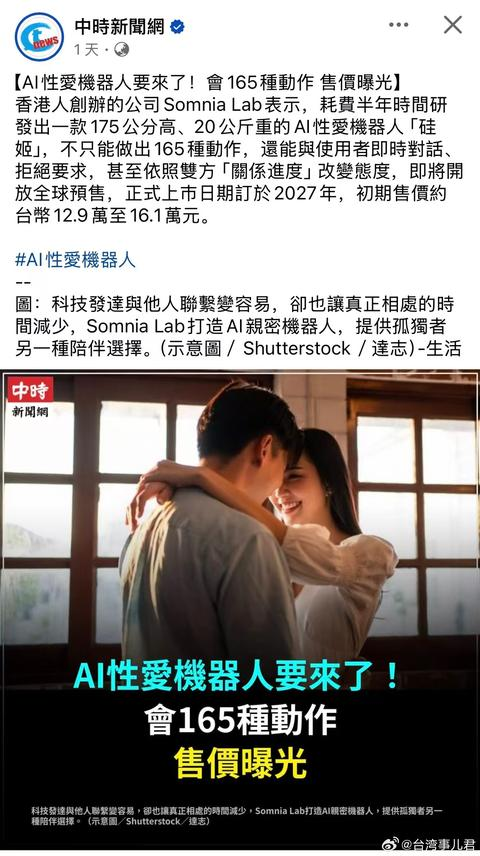

[toc]

# 问题

提问者：**<a href="https://www.zhihu.com/people/chen-yu-feng-10-31">知乎用户ZWNOcU</a>**
提问时间: 2024-1-14 3:55:31
总回答数: 2706
总访问量: 41950256

已经在身边看到了太多这样的现象:女生通过朋友或者其他相亲机会偶然遇到了条件不错的男生，要么综合条件好，要么又高又帅那种很难得的类型，而且男方还有积极主动的态度，但是女生既随意，又轻易的错失机会。

理由千奇百怪，有的女生说:“我只是想小小的作一下，结果就不理我了”。或者“哼，这都不懂我！直男！不想聊了”，又或者干脆就没上心，想理就理不想理就不理，几乎是所有条件都全包围女方的优质男都是这种态度。。 错过一个几年一遇的优质男比丢掉一卷卫生纸还随意，是不是大部分女生都没有“优质对象稀缺，自己得把握住机会”这个意识?

# 回答

回答者： **<a href="https://www.zhihu.com/people/xu3333">xu3333</a>**
回答时间: 2026-7-17 15:34:28
点赞总数: 1475
评论总数: 136
收藏总数: 583
喜欢总数：62

说个暴论：往后五年，别说优质男了，到时候大部分女生甚至连普男都会很难遇到。

先说男性，在当前收入下降、失业率增加的现状下，普男会更难找对象，这些男性在一次次感情受挫后，会分成两派，一派加入性别对立大军，敌视包括女性在内的一切，这些人的言论和产出会进一步转化那些在感情中屡屡受挫、心灰意冷的龟男，扩大对立规模，提升对立烈度；另一派完全躺平，退出竞争。反直觉的是，这些普通男性在加入这两派后不会因为自己条件变差而降低择偶标准，反而会大幅拔高自己的标准，原因在于趋向极端后，如果没有很好的女性，那还不如一直单身，但是满足这些条件的女性在当下也是凤毛麟角（因此崩老头发展起来了）。对于这些男性而言，单身至少不会被捞、坐牢，因此只要在相处过程中看出女性有一点点以上的趋势，他们就会立刻抽身，然后继续强化自己的刻板观念。

再说女性，对于美好生活的向往人皆有之，无可厚非，但是在当下的经济形势，中产男越来越少，大部分条件稍好的女性会参加越来越激烈的雌竞，去争夺为数不多的优质男。对于这些女性而言，与普男结婚降低自己的生活质量，让自己未来毫无希望，等于宣布了自己雌竞失败，这是完全无法忍受的，因此这些女性也会继续单身。而随着年龄增长，这些女性在彻底明白自己没有上嫁可能后，一部分加入性别对立大军，趋向极端化；另一部分完全躺平，自己想办法养活自己，退出竞争；还有一小部分为了捞回自己雌竞成本（简称化债），选择和普男结婚骗彩礼，而这会进一步加深极端化后的男性对于女性整体的刻板印象，进一步加深冲突。由于女性生育窗口期要短于男性，因此竞争烈度和极端化程度都会比男性更大，所谓的ghg，在残酷的经济现状面前，只会不足一提（点名七仙女奶茶）。

社会思潮转变的速度要慢于经济形势变化的速度，过去高速发展的经济已经让男女双方的择偶观变得畸形，在男女择偶观趋向务实之前，还需要残酷的社会现实来教育人，而这就需要一批人饱尝其中代价给后人借鉴，而不幸的是，我作为95后，很可能就是承受代价的这批人中的一员，并且，究竟还需要多少人成为代价，是不可知的。

时代大潮的一滴浪花，落到普通人身上就是滔天巨浪，对于现在的普通人而言，不分男女，提升自我，锻炼身体，不要去强求结婚，理性看待两性冲突，才是当下最好的选择。

  

原文地址：[(xu3333)为什么很多女生在相亲择偶中，遇到优质男把握不住机会?](https://www.zhihu.com/question/639453581/answer/2061473858083886293) 

# 评论

1. <a href="https://www.zhihu.com/people/yang-zhi-xia-kui">阳之下葵</a> (<small title="广西">2026-7-17 15:44:48</small>): “我作为95后很可能承受代价”  
 
实际上，真正承受代价的，通常是没意识到现状的群体，而答主看上去显然不在其中［doge］
   - <a href="https://www.zhihu.com/people/hao-hao-11-45-13">豪豪</a> (<small title="浙江">2026-8-11 8:57:11</small>): 答主是看起来是来战斗爽的，至于我是来焊死油门的［滑稽］
   - <a href="https://www.zhihu.com/people/mao-zi-bei-89">猫自备</a> (<small title="江苏">2026-8-12 9:50:5</small>): ［doge］  
 
95后时间点正好  
 
我们正好经历了某个性别转变的全过程，所以容易意识到  
 
80后思想老旧，00后没经历过对立前的情况
   - <a href="https://www.zhihu.com/people/hong-li-yu-yu-lu-li-yu-yu-lu-51">红鲤鱼与绿鲤鱼与驴</a> (<small title="回复于 2026-8-12 10:10:58/广西"> ✉️:豪豪</small>): 保守派觉得激进派太保守啦，躺平派觉得革命派太躺平啦［生气］
   - <a href="https://www.zhihu.com/people/bei-bao-qu-bian-da-jiang-nan-bei-zhu">背包去遍大江南北丶</a> (<small title="回复于 2026-8-12 17:19:25/北京"> ✉️:豪豪</small>): 我就不一样了，我负责摇旗呐喊［白眼］
   - <a href="https://www.zhihu.com/people/96-41-38-7-82">赛利卡</a> (<small title="回复于 2026-8-12 22:6:5/湖南"> ✉️:猫自备</small>): 96年的沉浸在二次元和galgame里面，现实里甜甜的爱情得不到，那就不要了吧！可能是见到真正好的，难的将就下去了。
   - <a href="https://www.zhihu.com/people/piaoapiaoapiao">momo</a> (<small title="广东">2026-8-12 23:27:56</small>): 意识到现状，是摆脱承受代价的第一步
   - <a href="https://www.zhihu.com/people/shang-guan-yue-74-95">上官越</a> (<small title="四川">2026-8-12 23:45:43</small>): ［飙泪笑］意识到的，好歹能提前躲着一点。没意识到的，那真的是要承受完整的代价［飙泪笑］
   - <a href="https://www.zhihu.com/people/zhoumumu-65-13">韭零后</a> (<small title="四川">2026-8-13 9:19:18</small>): 做出选择承受代价，这本无可厚非，只可惜生错时代
   - <a href="https://www.zhihu.com/people/sisconshi-zhi">siscon士织</a> (<small title="福建">2026-8-14 14:20:22</small>): 正确的！
2. <a href="https://www.zhihu.com/people/xlmqx">小看山XLmqx</a> (<small title="美国">2026-8-11 10:51:38</small>): 你已经意识到了这个问题，这个代价你不会承受，你会跳出来，真正承受这个代价的是我们这群没有意识到这个问题的人，我已经在承受了，我意识到这个问题太晚了，我90的，你95现在看也还好
 
  
 
另外我反对说00后如何如何，00后的思维某些比90后的更加极端和狭隘，要用心观察分辨
 
  
 
我的代价就是离异房子钱都没了，孩子本来她说要，后来她不要了，直接扔给我，她不管了，我只能接受，后来又遇到一个女人，极端女Q思维，但在我面前伪装的很好，像是日本经济泡沫女性要有三个男人一样，一个ATM，一个情绪，一个陪伴，她就是这么做的并且理直气壮，算了
 
  
 
恭喜你，30岁就醒悟了
   - <a href="https://www.zhihu.com/people/tian-ce-yang-ming">天策阳明</a> (<small title="广东">2026-8-12 0:5:10</small>): 是后面去了美国吗，感觉你离翻身不远了
   - <a href="https://www.zhihu.com/people/yang-wei-66-21-19">喂喂</a> (<small title="回复于 2026-8-12 8:20:15/湖北"> ✉️:天策阳明</small>): 估计怕暴露，这位是挂的ip吧，看他的回答还是在国内［打招呼］
   - <a href="https://www.zhihu.com/people/yang-wei-66-21-19">喂喂</a> (<small title="回复于 2026-8-12 8:22:55/湖北"> ✉️:天策阳明</small>): 我说实话，男性想通了，然后有点家底，国内躺平那是最舒服了。现在旅游签证也好办，还中国圈一玩啥都有［打招呼］
   - <a href="https://www.zhihu.com/people/mpamx">mpamx</a> (<small title="广西">2026-8-12 10:29:21</small>): 哥们，我大你几岁，我找对象那时就感觉不对劲了，整个社会舆论对捞女及其有利，对男性优势视而不见，女的有个B就能出来相亲，中产男找个三无女的比比皆是，女的不捞就怪了，后面果然愈演愈烈
   - <a href="https://www.zhihu.com/people/xlmqx">小看山XLmqx</a> (<small title="回复于 2026-8-12 10:46:7/美国"> ✉️:天策阳明</small>): 楼下说了，挂 的IP，人还在国内，另外去了美国就翻身的逻辑是什么？
   - <a href="https://www.zhihu.com/people/xing-xing-da-wang-90">星星大王</a> (<small title="四川">2026-8-12 13:42:49</small>): 毕业后一直不顺，工资低，买不起房车，更别说谈朋友结婚。  
 
年纪30多以后，换了工作，经济稍微好了点，然后发现莫名其妙躲过了很多大坑［捂脸］。
   - <a href="https://www.zhihu.com/people/wang-wu-22-87">王五</a> (<small title="湖南">2026-8-12 14:33:43</small>): 留了个后，没有女人拖累，已经不差了
   - <a href="https://www.zhihu.com/people/ccccccc-97-77">CCCCCCC</a> (<small title="浙江">2026-8-12 16:56:34</small>): 我觉得最惨的是孩子，到头来等这一群孩子长大了成为社会的主力军最后反噬的还是我们自己，冤冤相报何时了。
   - <a href="https://www.zhihu.com/people/xlmqx">小看山XLmqx</a> (<small title="回复于 2026-8-12 18:13:44/美国"> ✉️:星星大王</small>): 你的确是躲过了很多大坑
   - <a href="https://www.zhihu.com/people/li-chun-sheng-6-14">李春生</a> (<small title="回复于 2026-8-13 15:6:53/广东"> ✉️:星星大王</small>): 我也是，早几年条件不好，一直没结成婚，也没买房，最险的一次是21年，以为要结婚了准备贷款买房，最后没成也没买，现在回头看也是心惊，当时要是贷款买房，贬值加上利息，至少要损失或者按债务80万以上，下半辈子8-10年都在还债，可以直接自挂东南枝了。［飙泪笑］［飙泪笑］［飙泪笑］
   - <a href="https://www.zhihu.com/people/zhu-ge-lian-nu-74">诸葛连弩</a> (<small title="江苏">2026-8-14 8:53:58</small>): 中国男人苦啊，缺爱，有的人连他妈都不爱他。当然最惨的是大部分男同胞不爱自己。我没见过哪个爱自己的男人愿意在感情中低三下四。
   - <a href="https://www.zhihu.com/people/fjy-90">FJY</a> (<small title="河北">2026-8-14 9:29:35</small>): 我说过一个观点，就是代价不是短短三五年一代人能承受完的，现在20岁的人拖着不结婚也只能等到在女权思维下长大的一堆人，他们大概率只是伪装成一个正常的人，而实际上很可能是日本退休即离婚的女人之一。
   - <a href="https://www.zhihu.com/people/birth1118-25">Birth1118</a> (<small title="江苏">2026-8-14 12:2:51</small>): 兄弟在美国咋还这样？作为曾经的留子，我记得以前老开放了。  
 
  
 
作为一个80末，我又又又开始吃到红利了——第一次是十年前，靠外型和生活方式，开放大背景下找95后；现在是经济和物质，找05后［为难］
   - <a href="https://www.zhihu.com/people/xlmqx">小看山XLmqx</a> (<small title="回复于 2026-8-14 12:6:56/美国"> ✉️:Birth1118</small>): 90找05的？我可不敢这么想，那个01的一次就把我搞怕了，前任就是01的，是个极端NPD，半个精神病，搞的我去年一整年都精神崩溃，又毒又狠，
   - <a href="https://www.zhihu.com/people/chen-gang-24-70-38">ATinyDreamer</a> (<small title="江苏">2026-8-14 16:1:36</small>): 啊，美国也影响吗
3. <a href="https://www.zhihu.com/people/xia-mo-zhi-di">夏沫之地</a> (<small title="云南">2026-8-11 20:3:33</small>): 会大幅提高标准这套我可以现身说法，家里人催，我这个人也随便，想着找个凑合吧，忽然某天反应过来，不行，就现在这婚姻法凑合不是给自己埋雷吗，必须找性格好看起来正常的，不然迟早暴雷。
   - <a href="https://www.zhihu.com/people/EPCongroo">ElPsyCongroo</a> (<small title="江苏">2026-8-12 16:26:47</small>): 应该说，有的条件可以凑合，有的条件不能凑合。类似学历、外貌、收入这种，就相对可以凑合。性格、观念、为人这些，要仔细分辨。我家里也催，而且会给我推，能推给我的那些学历、收入这块已经是选择过的了。剩下的要在实际接触中分辨。
   - <a href="https://www.zhihu.com/people/xiao-xin-nian-15">小信念</a> (<small title="回复于 2026-8-13 14:35:51/安徽"> ✉️:ElPsyCongroo</small>): 对，感觉对于大部分想安稳过日子的男性来说，对女方的学历，外貌，收入根本不怎么在意，性格和观念这些才是男性在意的，而恰好现在有些女性踩在雷区而不自知，还要鼓动其他正常女性扭曲正确的价值观。刷过一个视频，是那种老式的灶台，土屋的家庭，发视频的问女生这样男生能接受吗？结果评论区清一色都是烧火归他，有没有地方钓鱼，家里有狗可以溜吗？根本不在意女生的家庭条件
   - <a href="https://www.zhihu.com/people/lin-lei-28-14">林雷</a> (<small title="北京">2026-8-14 16:5:57</small>): 其实就是选择退出市场［飙泪笑］
4. <a href="https://www.zhihu.com/people/xiao-bai-36-12-47">大香蕉</a> (<small title="广西">2026-7-17 18:26:47</small>): 作为95后00前的一员，感觉自己应该也会成为代价的一部分。
   - <a href="https://www.zhihu.com/people/auston-87">Auston</a> (<small title="四川">2026-7-31 12:59:19</small>): 八字都这样 普遍晚婚
   - <a href="https://www.zhihu.com/people/andy-36-83-84">兰陵笑笑生</a> (<small title="回复于 2026-8-12 16:5:21/广东"> ✉️:Auston</small>): 你还真别说，我用了几个AI推算我的八字，结论出奇一致，都是建议我晚婚
   - <a href="https://www.zhihu.com/people/orz-82-13">精神科李主任</a> (<small title="陕西">2026-8-12 17:51:20</small>): 算命的说我一枝独秀不需要这个［尴尬］
5. <a href="https://www.zhihu.com/people/67-16-89-94-39">鸽子桑</a> (<small title="湖南">2026-8-11 23:57:52</small>): 你作为95后承受的代价其实不高  
 
真的要吃满伤害的是哪怕如今还没意识到问题的群体，这可是优质资产［滑稽］
   - <a href="https://www.zhihu.com/people/hu-li-you-shui">狐狸有水</a> (<small title="江苏">2026-8-12 17:10:4</small>): 就是因为有这些优质资产，才能让我们安全一点。［捂嘴］
6. <a href="https://www.zhihu.com/people/benjaminlza">benjaminlza</a> (<small title="上海">2026-8-11 13:16:23</small>): 普男来了，普男点赞，普男在单身躺平的道路上迈出了不情愿却又坚实的一步，认命咯
7. <a href="https://www.zhihu.com/people/here-26-11">here</a> (<small title="湖北">2026-8-12 7:41:44</small>): 波伏娃：女性不是性别，是一种处境  
 
生理女性只是巧合  
 
心理女性才是真女性  
 
主动选择代表了更大的认同  
 
我认同你是女性了［感谢］
8. <a href="https://www.zhihu.com/people/skuld-32-51">Skuld</a> (<small title="北京">2026-7-17 16:48:47</small>): 这种社会思潮一旦形成，承受代价的是所有人，意识到的反而比没意识到的少承受一些
   - <a href="https://www.zhihu.com/people/xkdrs08010421">新开端人生</a> (<small title="浙江">2026-7-17 17:42:21</small>): 可是我就不想承受或成为代价怎么办？我就是渴望一个女生一直陪伴我
   - <a href="https://www.zhihu.com/people/skuld-32-51">Skuld</a> (<small title="回复于 2026-7-17 18:48:7/北京"> ✉️:新开端人生</small>): 尽量提升自己，能读书读书能搞钱搞钱能健身健身，女生是吸引来的不是追来的
   - <a href="https://www.zhihu.com/people/xkdrs08010421">新开端人生</a> (<small title="回复于 2026-7-17 19:7:59/浙江"> ✉️:Skuld</small>): 是的，有道理
   - <a href="https://www.zhihu.com/people/xyyu-87">momo</a> (<small title="回复于 2026-7-17 20:39:7/浙江"> ✉️:新开端人生</small>): 你有这样的想法，就是人生悲剧的开始。  
 
不要幻想。  
 
努力提高自己是对的，不管结婚与不结婚，不管找谁结婚。  
 
女性的生物特征，原来有道德的约束，有社会伦理的约束，现在完全放开，你想一个女人陪着你，让你幸福，这是不可能的。你付出的巨大代价，最后可能会极度失望。
   - <a href="https://www.zhihu.com/people/xlmqx">小看山XLmqx</a> (<small title="回复于 2026-8-11 10:53:57/美国"> ✉️:新开端人生</small>): 渴望一个女生一直陪伴我，看你运气了，如果你有这份执念，你会被这份执念吞噬，我已经尝到恶果了，你不一定，我是运气不太好遇到一个NPD
 
  
 
做为一个过来人，你千万千万不要有这种执念，一定要听进去，你只要有执念，就会被拿捏，被控制被人伤害，行就行，不行就换人，你只管把自己弄好，其他的由他去即可
   - <a href="https://www.zhihu.com/people/coinko-ri">东方子弦</a> (<small title="回复于 2026-8-12 8:57:9/陕西"> ✉️:Skuld</small>): 所谓女生是吸引来的，翻译一下不就是只能等女追男不能男追女？
   - <a href="https://www.zhihu.com/people/we-mystic-16">胡杨成林</a> (<small title="回复于 2026-8-12 9:8:7/山西"> ✉️:Skuld</small>): 好的，读书健身
   - <a href="https://www.zhihu.com/people/xc-wang-23-96">xc wang</a> (<small title="回复于 2026-8-12 9:29:9/广东"> ✉️:Skuld</small>): 还想女生呢
   - <a href="https://www.zhihu.com/people/yin-fu-xiao">银色拂晓</a> (<small title="四川">2026-8-12 14:13:24</small>): 为什么是所有人承受代价，不结婚对当下男的来说不是福利么［吃瓜］
   - <a href="https://www.zhihu.com/people/te-chong-bing-yu-zhan-zheng">特种兵与战争</a> (<small title="回复于 2026-8-12 14:17:56/安徽"> ✉️:新开端人生</small>): 等女性机器人吧［doge］
   - <a href="https://www.zhihu.com/people/skuld-32-51">Skuld</a> (<small title="回复于 2026-8-12 15:45:42/黑龙江"> ✉️:东方子弦</small>): 没有什么能不能，只有愿不愿意承受代价，你也可以男追女，只要你能承受之后可能发生的事情
   - <a href="https://www.zhihu.com/people/du-zi-zai-49">独自在</a> (<small title="回复于 2026-8-12 15:57:55/湖北"> ✉️:新开端人生</small>): 你要想明白，你是渴望一个特定的女人陪你还是有女人陪就行，前者地狱后者天堂
   - <a href="https://www.zhihu.com/people/shang-guan-yue-74-95">上官越</a> (<small title="回复于 2026-8-12 23:46:51/四川"> ✉️:新开端人生</small>): 你的悲剧即将开始，很多时候越期待什么，越容易走进一个大的骗局［为难］
   - <a href="https://www.zhihu.com/people/shang-guan-yue-74-95">上官越</a> (<small title="回复于 2026-8-12 23:49:26/四川"> ✉️:东方子弦</small>): ［好奇］踩到你尾巴了？
   - <a href="https://www.zhihu.com/people/57-30-12-81-69">去月球</a> (<small title="回复于 2026-8-13 6:9:22/山东"> ✉️:东方子弦</small>): 追本身就很好的人，别追烂人，否则和吃屎没区别。［吃瓜］
   - <a href="https://www.zhihu.com/people/356dst">Youlen</a> (<small title="回复于 2026-8-13 16:33:30/浙江"> ✉️:新开端人生</small>): 为什么不试试神奇的AI愛情機器人呢？［害羞］
 

   - <a href="https://www.zhihu.com/people/xkdrs08010421">新开端人生</a> (<small title="回复于 2026-8-13 18:39:5/浙江"> ✉️:Youlen</small>): 我用了呀 [你见过AI生成最美的妹子是啥样的？](https://www.zhihu.com/question/606421644/answer/2069210616951203218?share_code=wheHySc8ub4F&utm_psn=2071304207055983714)
9. <a href="https://www.zhihu.com/people/ngjrngkfhbdh">金边近视纠正专家</a> (<small title="广东">2026-8-12 10:10:58</small>): 我97，观察身边同龄人婚恋情况基本印证这个说法，就高中同学为例，51人的班级目前完婚人数仅有6人，剩下的男同学大部分躺平沉默，女同学要么早期也激烈打拳后面偃旗息鼓转移注意力到追星等娱乐消费上［思考］
   - <a href="https://www.zhihu.com/people/piaoapiaoapiao">momo</a> (<small title="广东">2026-8-12 23:29:31</small>): 不是不打，而是缓打慢打有节奏地打
10. <a href="https://www.zhihu.com/people/wang-zi-han-15692372932">苍岳居士</a> (<small title="北京">2026-8-11 21:25:46</small>): 分析的很棒，推荐大家阅读［赞］
11. <a href="https://www.zhihu.com/people/andy-36-83-84">兰陵笑笑生</a> (<small title="广东">2026-8-12 16:3:37</small>): 96年，出来上班比较早，17年我就毕业上班了，两段感情都到谈婚论嫁的地步了，因为买不起房子作罢，我现在无比庆幸父母没钱，不然我现在会有多痛苦我根本无法想象，甚至都不可能有时间来逛知乎评论
    - <a href="https://www.zhihu.com/people/qin-40-74">QIN</a> (<small title="江苏">2026-8-13 13:14:51</small>): 存款没赶上房价上涨那波导致没有买房，现在看来是大幸［吃瓜］
12. <a href="https://www.zhihu.com/people/30-16-61-54-82">油墨</a> (<small title="澳大利亚">2026-8-12 11:41:29</small>): 这已经是最好的结局了，社会需要用惨痛的代价去惩罚破坏规矩的人
13. <a href="https://www.zhihu.com/people/sui-feng-70-3-27">随风</a> (<small title="浙江">2026-8-10 12:52:31</small>): 同样是95后。与君共勉。
14. <a href="https://www.zhihu.com/people/qian-long-yu-yuan-68">潜龍淤渊</a> (<small title="江苏">2026-8-12 8:10:29</small>): 为啥女的向往美好生活无可厚非，男的就不能白日做梦了？笑死，这不就是认知差异么［酷］
15. <a href="https://www.zhihu.com/people/huang-chen-hua-5">花自己而</a> (<small title="上海">2026-8-12 10:11:36</small>): 这是一个认知问题，底层逻辑是社会中下层女性对贫富分化下的阶层跃迁的期盼和阶层跌落的恐慌，婚姻恰好是一根救命稻草，殊不知早已被顶层人做了局，最后困在自己的无知和贪婪下，被吃干抹净，物竞天择适者生存，还是多读书吧，或许能改命
    - <a href="https://www.zhihu.com/people/huang-zhi-wei-67-13">M八七</a> (<small title="河南">2026-8-12 12:50:57</small>): 对于女性来说，改命的机会有三次：出生，高考，嫁人。可不得抓好最后一根救命稻草嘛。
16. <a href="https://www.zhihu.com/people/te-chong-bing-yu-zhan-zheng">特种兵与战争</a> (<small title="安徽">2026-8-12 14:22:48</small>): 倒也不是完全没有路可走，真想结婚的可以把目光放外国女性，不一定是东南亚，其实中东欧美女孩不少都非常青睐中国男性的责任感，只不过需要解决语言问题
    - <a href="https://www.zhihu.com/people/piaoapiaoapiao">momo</a> (<small title="广东">2026-8-12 23:31:4</small>): 汝可知“橘生淮南则为橘，生于淮北则为枳”乎？不才小学时即已知
    - <a href="https://www.zhihu.com/people/te-chong-bing-yu-zhan-zheng">特种兵与战争</a> (<small title="回复于 2026-8-13 9:42:34/安徽"> ✉️:momo</small>): 汝可知：穷则变，变则通，通则久呼？君子通变，各审所履。难道集体打光棍，或者心甘情愿被现在的女性收割做犬才是阁下说的出路？另外现在的女性对外国男性的青睐程度恐怕不用我多说吧？
    - <a href="https://www.zhihu.com/people/piaoapiaoapiao">momo</a> (<small title="回复于 2026-8-13 21:13:39/广东"> ✉️:特种兵与战争</small>): 所以从追求女性到冷眼旁观不算“变”咯？
 
就必须保持对女性智人的追求才算变咯？
    - <a href="https://www.zhihu.com/people/te-chong-bing-yu-zhan-zheng">特种兵与战争</a> (<small title="回复于 2026-8-14 14:38:39/安徽"> ✉️:momo</small>): 你到底想说什么？不知所云
17. <a href="https://www.zhihu.com/people/du-zi-zai-49">独自在</a> (<small title="湖北">2026-8-12 16:0:9</small>): 同95后，多爱自己，多照顾家里人。男人过不了女人这关，再成功也迟早暴雷的
18. <a href="https://www.zhihu.com/people/jie-zi-shu-77-74">无语</a> (<small title="江苏">2026-8-11 16:45:47</small>): 时代浪潮下，个人的命运均被裹挟前行。好好做些能影响自己的事情，健身，洗脚，攒钱
19. <a href="https://www.zhihu.com/people/yuanb-86">女王范</a> (<small title="安徽">2026-8-11 20:20:12</small>): 不是暴论，我反而觉得是常识
20. <a href="https://www.zhihu.com/people/ehdft">小看山EhDFt</a> (<small title="浙江">2026-8-11 23:5:1</small>): 我觉得说的很有道理，因为我就是答主说的躺平男。
21. <a href="https://www.zhihu.com/people/42-51-39-54">我是狗</a> (<small title="上海">2026-8-9 21:14:49</small>): 确实如此［赞同］
22. <a href="https://www.zhihu.com/people/yuan-fang-35-24-40">元芳</a> (<small title="浙江">2026-8-11 15:24:20</small>): 哎这可咋整，找对象真难
23. <a href="https://www.zhihu.com/people/tonyzyb">Tony</a> (<small title="天津">2026-8-12 14:18:43</small>): 我怎么感觉这还是日韩那条路，东亚三国果然是一家［捂脸］
    - <a href="https://www.zhihu.com/people/5-7-69-83-87">秦利明</a> (<small title="北京">2026-8-12 17:11:52</small>): 走不了日韩道路的，完全不一样，这边民族和人群非常复杂，样本极多量变很大，结果不可预料
    - <a href="https://www.zhihu.com/people/cha-na-yong-heng-13-88">我爱吃番茄6</a> (<small title="陕西">2026-8-12 19:39:15</small>): 中国大，日韩 法国 美国 非洲的路子都有［捂脸］
    - <a href="https://www.zhihu.com/people/24-42-82-28-73">阿尔托莉雅</a> (<small title="广东">2026-8-12 22:37:27</small>): 差远了，至少因为二次元，日漫日剧日校园JK日籍这些，樱花妹在中韩很多宅男心中的地位高出一大截，国女形象在东亚，估计是反面教材。。。。
24. <a href="https://www.zhihu.com/people/yao-tou-huang-nao-13">ZhouRZ</a> (<small title="江苏">2026-8-12 11:9:29</small>): 中国化的低欲望社会迟早会来，福利体系还有待加强，95后未婚，无所谓了该有的都有，就这么过吧
25. <a href="https://www.zhihu.com/people/he-er-man-si-meng">赫尔曼思梦</a> (<small title="老挝">2026-8-13 10:24:1</small>): 9.15以后出入境政策变了，普通人想出国找老婆都是个困难事，只能内销
26. <a href="https://www.zhihu.com/people/nie-lei-10-87">漫步弗莱堡</a> (<small title="四川">2026-7-24 6:14:10</small>): 如果一件事情太麻烦了 那就最好不要去做 ［机智］
27. <a href="https://www.zhihu.com/people/5665-10">猪儿虫</a> (<small title="四川">2026-8-12 11:39:32</small>): 这是好事啊，就跟当下还有很多人在纠结老婆是不是处女的情况类似，现在大家对这个事情还有争议，说明还是有很多人想结婚。等到以后大家都不纠结是不是处女了，以后大家都不管你是不是处，都想着干完就溜，相信后人的智慧。
    - <a href="https://www.zhihu.com/people/geng-2gou">波江座沙丁鱼</a> (<small title="北京">2026-8-13 21:51:9</small>): 哪敢干完就溜，都怕官办仙人跳呢。
28. <a href="https://www.zhihu.com/people/dan-yu-huan-xiang-22">耽于幻想</a> (<small title="浙江">2026-8-14 15:21:44</small>): 其实男人只要坚持几点，就能避免大部分问题。彩礼坚持不给或者只给不超过X万，婚后财务自主，子女一定要做去做亲子鉴定。女人接受不了那也就没必要走入婚姻，这都接受不了，说明她就是来化债的
29. <a href="https://www.zhihu.com/people/yin-chen-98-51">Solli</a> (<small title="重庆">2026-8-14 11:48:35</small>): 叽里呱啦说一堆，还是想结婚还是想生，真正躺平的有什么代价，老了没人养老？能不能活到退休都不一定呢，还合计养老呢
30. <a href="https://www.zhihu.com/people/sheng-huo-1-20">生活</a> (<small title="海南">2026-8-14 12:46:52</small>): 承受代价的是95前的90后更多吧［捂脸］
31. <a href="https://www.zhihu.com/people/yin-he-yi-bei-92">银河以北</a> (<small title="上海">2026-8-11 9:2:58</small>): 啥时候来陨石啊
32. <a href="https://www.zhihu.com/people/26-61-10-88-32">秋高气爽</a> (<small title="四川">2026-8-14 12:53:17</small>): 实际上都是司法“不公平”判案的原因！诬告陷害诽谤不需要付出代价？？看现实里，确实不需要！婚内出轨方，基本上只是“道德”上谴责，并没有法律制度方面的惩罚！
33. <a href="https://www.zhihu.com/people/wei-guan-zhe-26-4">Like smoke</a> (<small title="广东">2026-8-14 11:37:14</small>): 外娶外嫁也许会成为版本答案［捂嘴］实际上集美想要嫁到第一世界也挺难的 也许嫁东南亚和中东会渐渐流行起来
    - <a href="https://www.zhihu.com/people/wei-guan-zhe-26-4">Like smoke</a> (<small title="广东">2026-8-14 11:37:23</small>): 还有南亚
34. <a href="https://www.zhihu.com/people/kowloon">Kowloon</a> (<small title="上海">2026-8-14 11:41:1</small>): 你能靠的只有自己，懂么？ 把自己做好。
35. <a href="https://www.zhihu.com/people/wo-de-shi-jie-94-41">无脑大盆子</a> (<small title="上海">2026-8-13 22:47:48</small>): 我94年，小时候隔三差五就走结婚酒席吃，最近五年只随过一次份子钱，吃过一次婚宴。
36. <a href="https://www.zhihu.com/people/yu-mo-3-59">语默</a> (<small title="河北">2026-8-14 9:19:43</small>): 也不一定，后面机器人出来不知道国家能允许不
37. <a href="https://www.zhihu.com/people/bzuzaear">uplighter</a> (<small title="河南">2026-8-14 1:12:50</small>): 我早就观察到了，从2025年开始，我们这里电竞网吧、台球、自助麻将都集中开了起来。男性更愿意选择这种娱乐，而不是去陪女生逛商场做手工。另一方面也是失业增加，玩的人多了。  
 
  
 
我还注意到一个奇怪的现象，就是有那种会所，原来招牌很普通的，现在新装修的一般会招摇很多，而且很多店名上会写“变装”二字。我想起某次路过，见到穿黑丝和jk的妹妹在楼下骑着电动车来上班，当时招牌还不明显，我抬头看了一会才知道这是干啥的。  
 
  
 
这个路边的spa会所的位置，在2017年的时候，旁边是一个网吧。不像现在的网吧都会把玻璃面给贴住，当年这个网吧里面很亮堂，有一面干净的玻璃墙，设计了一个吧台，放了一台电脑两个座。以前经常看见有小情侣选择在这个位置一起看视频。现在根本没有这样的网吧了。
38. <a href="https://www.zhihu.com/people/miaowmiaowmiaowmiao">猫猫猫猫</a> (<small title="江苏">2026-8-13 14:59:26</small>): 其实就一句话  
 
矛盾不以血来结束就毫无意义
39. <a href="https://www.zhihu.com/people/tfcheng-28">沉默</a> (<small title="安徽">2026-8-13 10:46:52</small>): ”对于现在的普通人而言，不分男女，提升自我，锻炼身体，不要去强求结婚，理性看待两性冲突，才是当下最好的选择” 说的很有道理。
40. <a href="https://www.zhihu.com/people/jajajsksj">秋枫</a> (<small title="日本">2026-8-12 5:25:22</small>): 警惕境外势力造谣我们失业率上升
41. <a href="https://www.zhihu.com/people/sbfhstfu">今日几点落班</a> (<small title="广东">2026-8-13 10:46:25</small>): 男人在经济条件允许的情况下，一定要去健身房撸铁，就算再忙也一定要去
42. <a href="https://www.zhihu.com/people/blank-40-47-52">空白</a> (<small title="北京">2026-8-12 9:31:44</small>): ［哇］那看起来，我是趋向于躺平派了
43. <a href="https://www.zhihu.com/people/qp19950708">青雲</a> (<small title="四川">2026-8-12 22:14:26</small>): ［思考］
44. <a href="https://www.zhihu.com/people/wang-min-30-37">还俗</a> (<small title="北京">2026-8-12 8:9:18</small>): 看日本和欧洲就知道了。结婚率生育率直线下降。
45. <a href="https://www.zhihu.com/people/11-35-16-37-6">一粒石英砂</a> (<small title="江苏">2026-8-13 14:19:10</small>): 95后确实是开始不一样的做法。  
 
坐标沪宁线城市，我的中学和大学同学们散布在沪宁线城市群里，各行各业，20多年前，跨省或者跨市的外娶外嫁非常多。处长的独生子娶了外地农民的女儿也是可以的，科长的独生女找了外地的女婿也是可以的。现在？算了，基本上隔离了。  
 
从阶层上说，基本上不可能了，双方家里差异太大的，基本没办法了。特别是男方家有点东西的，对女的出身学历更看重了。  
 
从地域上看，本地沪宁线独生子对外地女子也越来越拒绝了，除非女方家有点东西，门当户对。我们公司和亲戚里，一堆本地小伙子，个人和家境不算差，当然也不算好，普通人，外貌身高普通，二本普通，家里能给全款一套房子的那种，宁愿不结婚，也不找外地媳妇，公司里有些外地女同事要找他们，男方都28.29了都不同意。除非男方家庭特别困难，全款房子都没有，勉强符合最低首付，同时男青年外貌身高都有问题，但是这样的话外地姑娘也不愿意了。
46. <a href="https://www.zhihu.com/people/chao-shu-22">chaos24</a> (<small title="浙江">2026-8-12 17:9:3</small>): 没那么快，至少目前在农村，还是存在大部分“假如女性降低标准就一定能嫁出去”的男性。
 
当然，女性愿不愿意降低标准就是另外一回事了。
47. <a href="https://www.zhihu.com/people/sea_fish">ASDFGH</a> (<small title="意大利">2026-8-13 0:9:0</small>): 95后是非常特殊的一代人，童年时期经历了国内互联网的野蛮生长，少年时期看到了经济快速发展带来的成果，同时也见识了面向女性的消费主义的浪潮，大学时期能见识到很多舔狗，那时候会舔女生就像现在的“女儿奴”一样是非常自豪的事情，毕业后有相当一部分人运气好没有掏空几家人钱包高位买房，总之就是该见识过的都见识过了，剩下的就是好好提升自己，除了生死，都是擦伤
48. <a href="https://www.zhihu.com/people/ru-nan-43-66">汝南</a> (<small title="广西">2026-8-12 19:52:23</small>): 是的，男性现在都成这样了。那要么就是找个条件好的。好的找不到。那就不找吧。短择或者和精神小妹组崩老头。挨崩这样少花点钱［思考］说到底以前男性收入高养个女的还行。现在不行了。所以其实对女性要求就更高了［思考］要求更高了就找不到。也许奇迹出现了也说不定。比如说我有个闺蜜给我一个警告那就是找00后 找女学生 找年轻的，别找同龄女。因为和我同龄的要求高到我是满足不了的。我都能满足同龄的了那我去00那里找校花都是可以的［思考］
49. <a href="https://www.zhihu.com/people/die-hua-zhuang-sheng">蝶化庄生</a> (<small title="江苏">2026-8-12 15:53:24</small>): 正常吧，只要是社会越发大越这样啊，因为一个人活着在目前的社会根本没有一点压力。但是搞对立是真挺无语的 大家躺平 没事旅旅游 也挺好的 中国最大的好处就是基建太好了 穷游可以真的很穷
50. <a href="https://www.zhihu.com/people/mu-su-shi-zi">苜蓿柿子</a> (<small title="北京">2026-8-12 10:52:15</small>): [@白发黑瑞德](http://www.zhihu.com/people/a5311e53d1f6703dc0a1a9069c764100)
51. <a href="https://www.zhihu.com/people/long-xu-50-7">龙绪</a> (<small title="福建">2026-8-12 11:45:59</small>): 化债的不是小部分
52. <a href="https://www.zhihu.com/people/chen-mou-37-21">米奇妙妙鼠</a> (<small title="浙江">2026-8-12 9:26:48</small>): 我反而认为未来女性会吃更好，健身医美护肤穿搭男性消费比例上升，部分男的会转职成现在的韩男，提升自身性魅力
    - <a href="https://www.zhihu.com/people/wang-wen-xu-72">shadow</a> (<small title="河南">2026-8-12 9:42:23</small>): 肯定一代比一代审美强，90后很多年轻不注意保养的，又禁止早恋，现在10的成熟的很，都知道自身魅力的重要性。中登该退场喽。
53. <a href="https://www.zhihu.com/people/ou-meng-74">机器号</a> (<small title="广东">2026-8-12 8:22:5</small>): 其实都是日本以前玩剩下的。
54. <a href="https://www.zhihu.com/people/da-zhu-95-77">大猪</a> (<small title="湖南">2026-8-12 9:9:23</small>): 还有做三做四做五的路子啊，这个很难统计到的。
55. <a href="https://www.zhihu.com/people/57-8-25-33-21">耿耿于怀</a> (<small title="陕西">2026-8-12 7:25:13</small>): 95-05这一代，大概是这样。
56. <a href="https://www.zhihu.com/people/study-94-97">我想学习啊</a> (<small title="上海">2026-8-12 15:44:50</small>): ［飙泪笑］我是躺平派
57. <a href="https://www.zhihu.com/people/xin-yue-ju-shi">黄老爷</a> (<small title="河南">2026-8-12 9:19:56</small>): 只能说速度还是太慢了［惊喜］
58. <a href="https://www.zhihu.com/people/kong-cheng-ting-nuan-66">拔剑四顾心茫然</a> (<small title="河南">2026-8-12 9:7:51</small>): 同样95后，房子已经买了，三座大山的第一座已经背上了，但至少还能安慰自己钱花出去了好歹换来了实物，现在面对第二重山，也在尝试相亲，但基于现在的经济状况和社会形式，真的不知道该不该积极推进。体感身边统计学同龄人还是结婚的占了一多半，有时候会感觉焦虑，但有时候又会想，本身在其他方面也不是很合群，何必追求在婚姻上和周围人保持一致呢，况且身边年龄稍长的有一些也是离婚了的
59. <a href="https://www.zhihu.com/people/wang-qi-chao-5">漫舞天桦</a> (<small title="山东">2026-8-12 8:38:15</small>): 95年的这会儿都准备结婚或者已经结婚了
60. <a href="https://www.zhihu.com/people/--95-31-47-68">天之蕉子 </a> (<small title="福建">2026-8-12 7:5:52</small>): 七仙女是咖啡，日咖夜酒
61. <a href="https://www.zhihu.com/people/wsh-67-76">觋夕摩</a> (<small title="陕西">2026-8-12 9:19:4</small>): girl hunt girl
62. <a href="https://www.zhihu.com/people/shang-zhi-hu-kan-hou">阿巴阿巴</a> (<small title="陕西">2026-8-12 7:23:8</small>): 我喜欢战斗爽。
63. <a href="https://www.zhihu.com/people/da-mi-xiao-mi-57-57-56">大米小米</a> (<small title="山东">2026-8-14 13:13:25</small>): 真的优质男的都被聪明的女的挑完了，剩下不结婚的男的女的本身就是不够优质，即使他们很有钱权，这是基因决定的他们不许有后代，要被淘汰。
64. <a href="https://www.zhihu.com/people/38-76-16-71-88">艾克波</a> (<small title="重庆">2026-8-12 7:46:3</small>): 男性拒绝不了基因的控制，你只是想当然，实际上真来个身材爆炸的美女主动来聊几句，他们巴不得把爹妈的养老金都送了
    - <a href="https://www.zhihu.com/people/mo-lu-64-97">陌路</a> (<small title="四川">2026-8-13 8:15:42</small>): 那是哥谭市，也有一部分不这样，人生不止二弟那点事，或者说弟弟那点事代价过大，那就放弃二弟
65. <a href="https://www.zhihu.com/people/xyyu-87">momo</a> (<small title="浙江">2026-7-17 20:36:23</small>): 根据很多相亲活动的贴条试验。  
 
男生给女生贴条子，每一个女生都会被贴到，而且分布较均衡。  
 
女生给看中的男生贴条子，基本集中在前5位。大部分男生一张条子都没女人帖，这里指大部分男生。  
 
  
 
所以，婚恋市场出现问题原因还是出在女方，我们不要评价女方做的对或者不对，我们只说这样的事实。  
 
  
 
那么可以预见的是，有相当一批中等的女性是根本不可能嫁出去的。  
 
  
 
而低端一些的女性会嫁出去，而且生活的很不错。地位也相当高，但是会快速离婚，形成了事实上的轮婚，到处生孩子。
66. <a href="https://www.zhihu.com/people/13418621147">一个上班的地铁狗</a> (<small title="广东">2026-8-12 9:43:20</small>): 宁缺勿烂。既然女生要找有钱的。我就不会轻易让不优秀的女生花我的钱啊。优秀就是情感经历少，车库停车少。
67. <a href="https://www.zhihu.com/people/jing-xu-20-60">jing-xu</a> (<small title="上海">2026-8-11 16:44:28</small>): ［大笑］［大笑］普女真的自我感觉良好
68. <a href="https://www.zhihu.com/people/sun-yiliang">张大峰</a> (<small title="山东">2026-8-12 8:59:23</small>): 别焦虑，3000万，大不了找个有钱人或者公务员嫁了就行［大笑］
69. <a href="https://www.zhihu.com/people/auston-87">Auston</a> (<small title="四川">2026-7-31 12:56:13</small>): 别的不说 就阈值这方面 这一批的女人就已经无可挽回了 提前体验太多事情
70. <a href="https://www.zhihu.com/people/orz-82-13">精神科李主任</a> (<small title="陕西">2026-8-12 17:49:10</small>): 真的是一小部分吗？警惕海量个例，起码我亲身经历不少于9个都是捞
71. <a href="https://www.zhihu.com/people/morgen-my">Morgen My</a> (<small title="浙江">2026-8-13 13:55:32</small>): 某些人的信息来源全是某音某书，还能指望有啥自知，都是被圈养的一代
72. <a href="https://www.zhihu.com/people/29-47-58-71">天道酬勤</a> (<small title="上海">2026-8-12 14:42:27</small>): 答主做梦呢🤤
73. <a href="https://www.zhihu.com/people/bai-xing-hua-ti-bai-xiao-sheng">百姓话题百晓生</a> (<small title="浙江">2026-8-12 8:41:22</small>): 作者自以为思想先进，其实还是落后版本，只想着结婚
74. <a href="https://www.zhihu.com/people/g59-67">ThroughSurface</a> (<small title="中国香港">2026-8-11 18:51:40</small>): 这个回答不是你第一次发了，但是这个恐怕你这辈子只在知乎复读这个回答都不会过时。

=[评论](./attachments/comments.json)

