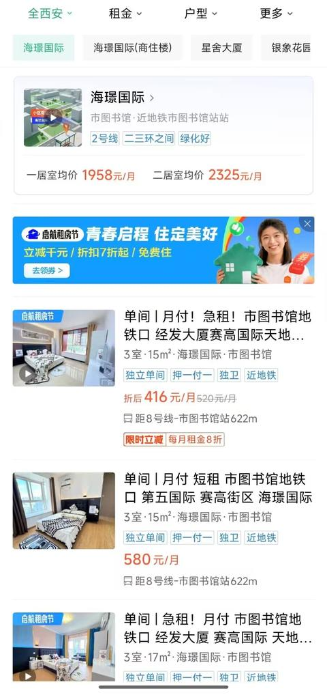
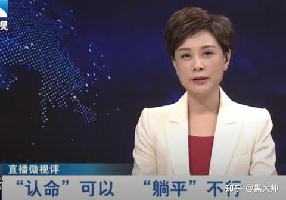
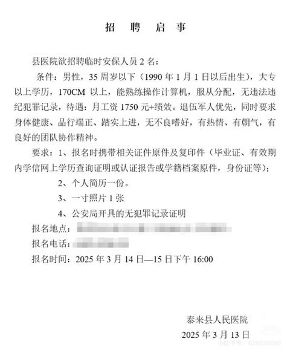

[toc]

# 问题

提问者：**<a href="https://www.zhihu.com/people/lai-xi-xian-sen">一笔书尽长安雪</a>**
提问时间: 2026-7-11 10:42:14
总回答数: 0
总访问量: 0

十年前大家口中的时代红利，是买房、进厂、电商、短视频，所有人都在往一条赛道里挤，不敢掉队；父辈祖辈更是没有选择权，种地、上班是活下去的唯一出路，只能跟着规则拼命往前跑。

但 2026 年的当下完全变了：雪糕刺客泡沫破裂，高价消费集体遇冷，年轻人主动拒绝内卷、晚婚晚育、逃离一线城市，几千块就能满足基础生存需求，不用再被 “必须买房、升职、30 岁成家” 的标准绑架。

到处都有人说现在没有红利、阶层固化、赚钱越来越难，可最近刷到一种完全相反的观点： **当下真正的时代红利，根本不是新风口、搞钱副业，而是普通人拥有了「主动退出内卷游戏」的选择权** 。

不用透支身体拼酒争职级，不用掏空六个钱包硬扛一线城市房贷，不用跟风追逐所有人都说好的 “人生模板”，哪怕降低欲望、躺平慢生活，也能安稳吃饱穿暖，不会落到衣食无着的地步。

想问问大家，抛开自媒体贩卖的暴富焦虑、资本制造的消费陷阱，站在普通人真实生活的角度，现阶段属于我们这代人的时代红利，到底是什么？这种 “不想做就能不做” 的选择权，真的是普通人最大的机遇吗？

# 回答

回答者： **<a href="https://www.zhihu.com/people/lai-xi-xian-sen">一笔书尽长安雪</a>**
回答时间: 2026-7-11 11:11:28
点赞总数: 1024
评论总数: 229
收藏总数: 475
喜欢总数：51

其实答案简单到你不敢相信。

就是你可以不玩了。

你没听错。不是短视频，不是 AI，不是什么搞钱的野路子。那些都是术。真正的红利，是你可以选择退出这个游戏了。

你看你爷爷那辈，不玩行吗？不行，田在那儿，你不种就饿死。你爸那辈，不玩行吗？也不行，单位在那儿，你不干就没房没粮票。那个年代，你是被绑在战车上的，你不往前跑，车轮就从你身上碾过去。

但现在不一样了。

现在的时代红利是什么？是基本生存已经被干到白菜价了。一个月一千五，你能吃饱。一个月三千，你能活得不错。有网，有电，有个小房间，你就能过一个周末。这在人类历史上，是从来没有过的事儿。

你去翻翻史书，哪朝哪代的老百姓，能用这么低的成本，获得这么高的生存质量？没有。

所以现在的红利，就是选择权。

我问你，什么叫红利？红利就是别人还没有意识到可以这么干的时候，你先这么干了。

所有人都在告诉你，你必须买房，必须结婚，必须升职加薪，必须在三十岁前拥有什么什么。这套游戏规则，已经运行了几十年了。但你仔细想想，这规则谁定的？

是社会。是资本。是你身边那群怕被落下的同龄人。

他们说，你不买房就是失败者。你不结婚就是另类。你不往上爬就是废物。

纯TM扯淡。

真正的红利，是你看穿了这个游戏之后，可以选择不玩。你可以不用在北上广深当一辈子房奴，你可以去个小城市，做点自己喜欢的事儿。你可以不用为了一个经理的头衔，把自己喝到胃出血。你可以在别人都在卷的时候，睡到自然醒，然后慢悠悠地喝一杯咖啡。

这就是这个时代最牛逼的地方。

以前的自由，是你想去哪儿就去哪儿。现在的自由，是你不想干什么，就不干什么。

而且最关键的是，这个选择，不会让你饿死。你退出了，天塌不下来。你依然可以活得很好，甚至比那些在里面卷的人，活得更久，更快乐。

所以别再问红利在哪里了。红利就在你放下手机，决定不跟他们玩的那一刻。

你已经站在红利的中心了。只是你自己还不知道而已。

  

原文地址：[(一笔书尽长安雪)现阶段的时代红利到底是什么？](https://www.zhihu.com/question/2059225990199501174/answer/2059233348153880972) 

# 评论

1. <a href="https://www.zhihu.com/people/qian-zhi-xiu-66">静守一隅</a> (<small title="上海">2026-7-12 5:41:22</small>): 99年毕业时就决定18年开始躺平。当下确实更适合躺平，因为时代的红利少了、而且很难靠卷得到了。
   - <a href="https://www.zhihu.com/people/tian-sheng-li-zhi-nan-zi-qi-64-30">希望人没事</a> (<small title="上海">2026-7-13 9:6:21</small>): 干半年歇半年，  
 
光干不歇享晚年，光歇不干享百年［酷］
   - <a href="https://www.zhihu.com/people/lu-ren-jia-98-69">碌人甲</a> (<small title="回复于 2026-7-13 9:31:14/广东"> ✉️:希望人没事</small>): 我有过两年不上班的生活，其实平摊下来，干半年玩半年这样能过四年呢，拿出每年的那半年可以去很多地方了，对于个人的阅历来说是很大的滋养，并且逼迫着自己执行计划。很充实的度过
   - <a href="https://www.zhihu.com/people/shi-jian-xiao-shi-zhu">Nature</a> (<small title="回复于 2026-7-13 11:30:14/四川"> ✉️:希望人没事</small>): 光干不歇不见得享晚年
2. <a href="https://www.zhihu.com/people/chen-si-tong-9-9">miao</a> (<small title="江苏">2026-7-12 19:46:28</small>): 问题的关键是，一个月三千从哪来？小城市超过35岁一个月三千多的工作都找不到。一旦开始工作，一个月三千是根本打不住的。想要稳定有一个月三千，至少有一百万的存款或者资产。别说小城市了，我们在南京，上市公司五千的薪资就能收到211的简历。大家并不是不想退出，是你以为的退路上人满为患，压根没资格挤进去
   - <a href="https://www.zhihu.com/people/feng-jing-yuan-29">新一代的开山怪</a> (<small title="北京">2026-7-12 19:50:31</small>): 3000为啥打不住？我月入3000的时候，单位管吃管住，我能攒2500，现在月入2w，不管吃不管住，我租500一个月的合租房，月消费2500，猛猛攒钱就为了提前退休
   - <a href="https://www.zhihu.com/people/chen-si-tong-9-9">miao</a> (<small title="回复于 2026-7-12 19:56:55/江苏"> ✉️:新一代的开山怪</small>): 上网当然随便吹。我压根不信北京月入两万住500一个月的房子［为难］月入两万和五百一个月肯定有一个不准。除非你收入不稳定，把最高收入两万或者拿到过最多的月收入算进来装x了。真的能拿到两万一个月，这个时候的时间是很值钱的，会投入更多的钱在减少时间消耗上
   - <a href="https://www.zhihu.com/people/feng-jing-yuan-29">新一代的开山怪</a> (<small title="回复于 2026-7-12 19:59:24/北京"> ✉️:miao</small>): 我在北京是出差，我是西安人，租房在西安，日常海外出差［好奇］
   - <a href="https://www.zhihu.com/people/feng-jing-yuan-29">新一代的开山怪</a> (<small title="回复于 2026-7-12 20:0:40/北京"> ✉️:miao</small>): 我在国外就更不花钱了，所有衣食住行公司报销，一分钱都花不出去［酷］
   - <a href="https://www.zhihu.com/people/huang-wei-jie-18-57">night</a> (<small title="回复于 2026-7-12 20:4:5/浙江"> ✉️:新一代的开山怪</small>): 西安什么行业赚这么多 羡慕
   - <a href="https://www.zhihu.com/people/feng-jing-yuan-29">新一代的开山怪</a> (<small title="回复于 2026-7-12 20:4:30/北京"> ✉️:night</small>): 石油，大头是海外差补
   - <a href="https://www.zhihu.com/people/huang-wei-jie-18-57">night</a> (<small title="回复于 2026-7-12 20:8:51/浙江"> ✉️:新一代的开山怪</small>): ［赞］
   - <a href="https://www.zhihu.com/people/feng-jing-yuan-29">新一代的开山怪</a> (<small title="回复于 2026-7-12 20:37:49/北京"> ✉️:miao</small>): 至于你说的时间值钱？我出去不管是干一天还是休息一天，都是一天1000+的补助，出去三个月强制回来拿着基本工资休息一个月，平均下来2w一个月，我的时间确实值钱，但是不以我的意志去增值或者贬值，我干啥或者不干啥都是这么多，而且你应该也理解不了32岁还在穿高中买的衣服的人的消费观［打招呼］
   - <a href="https://www.zhihu.com/people/chen-si-tong-9-9">miao</a> (<small title="回复于 2026-7-12 21:49:17/美国"> ✉️:新一代的开山怪</small>): 纯杠真的心累。西安北京都不是小城市。你开心就好了
   - <a href="https://www.zhihu.com/people/fei-wu-de-wu-hua-rou">大耳朵图图</a> (<small title="回复于 2026-7-13 9:18:1/黑龙江"> ✉️:miao</small>): 你说的对，我家这干保险做销售都是3000起步，而且躺平不了，总拿底薪人家还劝退折磨你，3000的工资也要卷［尴尬］
   - <a href="https://www.zhihu.com/people/feng-jing-yuan-29">新一代的开山怪</a> (<small title="回复于 2026-7-13 9:25:13/北京"> ✉️:miao</small>): 杠的是你吧？自己搜搜西安北边长庆油田附近的合租房是不是500一个月很难吗［好奇］
   - <a href="https://www.zhihu.com/people/shan-shen-chuan-shan-jia">出其东门</a> (<small title="回复于 2026-7-13 9:36:23/北京"> ✉️:miao</small>): 不是只有租2室1厅才叫租房的
   - <a href="https://www.zhihu.com/people/fhzzwz">HZZWZF</a> (<small title="广东">2026-7-13 9:42:30</small>): 我亲戚在老家县城送快递一个月7500，而且因为送了很多年了，熟门熟路的，一天不用8个小时就送完了。他说力气大的送大件的话，一个月能到一万五。
   - <a href="https://www.zhihu.com/people/tao-pao-de-shuang-yu">逃跑的双鱼</a> (<small title="回复于 2026-7-13 10:41:36/湖北"> ✉️:新一代的开山怪</small>): 关键是你这工作也不具备普遍性啊，大部分普通人也找不到这样的工作啊
   - <a href="https://www.zhihu.com/people/feng-jing-yuan-29">新一代的开山怪</a> (<small title="回复于 2026-7-13 10:51:27/北京"> ✉️:逃跑的双鱼</small>): 我反驳的点就一个，她说存不下钱，我不是也举了例子吗，我刚毕业不是这行，月入3000的时候也能攒下钱，在我转行收入高了之后，也没有因为收入高，就去高消费，我十年买的衣服就只有内衣袜子和鞋这种磨损消耗的，T恤外套这种根本穿不烂的根本不会换。不爱旅游不爱出门，休息就是在家打游戏，不结婚不生孩子，猛猛攒，怎么可能攒不到钱，攒的多与少的问题罢了
   - <a href="https://www.zhihu.com/people/zhumudao-33">zhumudao</a> (<small title="回复于 2026-7-13 11:12:10/浙江"> ✉️:新一代的开山怪</small>): 我42了，衣柜里也有几件高中时买的衣服［握手］［握手］
   - <a href="https://www.zhihu.com/people/feng-jing-yuan-29">新一代的开山怪</a> (<small title="回复于 2026-7-13 11:20:31/北京"> ✉️:zhumudao</small>): 🤝衣服是真的耐穿，而且我的观念是保暖舒适就行，花保暖舒适遮体需求以上的溢价，追求好看，就属于花自己的钱满足别人的眼睛了。我没这么大方［感谢］
   - <a href="https://www.zhihu.com/people/momo-61-11-98">momo</a> (<small title="回复于 2026-7-13 11:31:42/北京"> ✉️:miao</small>): 我帮你搜了一下，他说的西安长庆周围的合租一间卧室的租房价格，很好奇你是啥条件，租啥房？打工人租个这个有啥问题吗［好奇］
 

   - <a href="https://www.zhihu.com/people/chen-si-tong-9-9">miao</a> (<small title="回复于 2026-7-13 12:24:0/美国"> ✉️:出其东门</small>): ［为难］我16年在北京租的床位房。那种上下铺床位。七百多一个月
   - <a href="https://www.zhihu.com/people/chen-si-tong-9-9">miao</a> (<small title="回复于 2026-7-13 12:27:0/美国"> ✉️:momo</small>): 想杠怎么都能杠。月入两万和五百房租在北京必有一个掺水。换西安你觉得西安这种城市两万五月薪的工作有普适性吗？这个问题下面，不再纠结这些问题了。你们爱怎么杠就怎么杠
   - <a href="https://www.zhihu.com/people/rain-22-25">越王勾拳他爸</a> (<small title="回复于 2026-7-13 13:6:49/湖北"> ✉️:miao</small>): 我说实话 在西安收入2w 其实算高收入 不太可能之花500租房，500的房子 其实有点没法做 除非是实在没办法
   - <a href="https://www.zhihu.com/people/you-kiss">热心市民小王</a> (<small title="回复于 2026-7-13 13:9:4/福建"> ✉️:新一代的开山怪</small>): 你都说了是单位，而且管吃住。
   - <a href="https://www.zhihu.com/people/changgx">长弓侠</a> (<small title="回复于 2026-7-13 14:33:32/江苏"> ✉️:新一代的开山怪</small>): 我20年前的衣服还在。很多人不理解我们这种生活方式，其实这种生活方式才是最安全的。
   - <a href="https://www.zhihu.com/people/meng-he-35-24">梦何</a> (<small title="回复于 2026-7-13 14:45:22/河北"> ✉️:出其东门</small>): 我这五线城市，两室一厅要小一千的［捂嘴］
   - <a href="https://www.zhihu.com/people/feng-jing-yuan-29">新一代的开山怪</a> (<small title="回复于 2026-7-13 15:2:17/北京"> ✉️:长弓侠</small>): 他们好像真的不理解一个想攒钱的单身男人对住有多无所谓，有网有床有洗衣机空调，就这些就完事［捂脸］
3. <a href="https://www.zhihu.com/people/97-68-43-15-16">一汪清水</a> (<small title="浙江">2026-7-12 17:5:23</small>): 看透这个规则，需要一定的年纪，但是上了年纪，又被各种枷锁套住了，这个无解的阳谋，只有少数幸运儿能够跳出
   - <a href="https://www.zhihu.com/people/3-21-97-51">沃野布吉岛</a> (<small title="湖南">2026-7-13 9:43:35</small>): 这个规则，年轻人看不破。年纪大了结婚了，又退不出了。我现在的枷锁是父母还在，我忍不下心抛弃他们，让他们一把年纪还在为我操心。别的牵挂倒是没有。
4. <a href="https://www.zhihu.com/people/ray-wang-90">步行鸟</a> (<small title="四川">2026-7-12 10:19:0</small>): "一个月三千，你能活得不错。" 我真的不是杠, 但是就算你在小县城, 社保总得交吧, 医保和灵活就业, 就得1500了, 社保不要了? 生病怎么办? 房子呢? 租房1000 ? 其它各种水电气网络通讯费? 所以说, 3000真的活不下去, 至少是不能持续的, 更何况, 不上班你这3000哪里来? 钱和房子都找父母要? 可以说, 这就是没法退出的原因, 你这个不玩了其实假定了很多前置基础.［捂脸］
   - <a href="https://www.zhihu.com/people/wu-yu-lun-bi-kuai-le-bai">无与伦比快乐白</a> (<small title="河南">2026-7-12 17:59:11</small>): 体制外交什么灵活，一年几百块的新农合够了，750g的面条十块钱三包，一道菜成本3-5块，当然你要是只点外卖或者出去吃那没办法了，日常吃饭自己做一个月也就四五百块，电费倒是大头，空调24h开一个月差不多得三百，然后我嘴馋，加餐得吃个七八百哈哈哈哈哈。我刚失业两个月，住的是前几年攒钱买的城郊新农村那种房子，便宜的要命，失业前这几年我攒的钱就干了两件事，把父母的社保补齐了（前几年政策允许一次性补齐），然后就是这套房子。给父母补我是完全愿意的，但是给自己交就算了吧，这种事自己拿社保计算器算一算就行了。
   - <a href="https://www.zhihu.com/people/leng-ku-long-shu">冷酷珑叔</a> (<small title="回复于 2026-7-12 18:45:57/浙江"> ✉️:无与伦比快乐白</small>): 这就是何不食肉糜
   - <a href="https://www.zhihu.com/people/shou-chi-da-bao-jian-de-yuan-ye">手持大保剑的园爷</a> (<small title="安徽">2026-7-13 8:0:35</small>): 老家宅基地是存在的，农村基本可以极低成本躺平
   - <a href="https://www.zhihu.com/people/chi-yan-92-1">赤琰</a> (<small title="内蒙古">2026-7-13 8:19:49</small>): 相信我，如果你真的退出所有社会体系比如你说的医保啊社保啊之类的时候你才是真正加入整个社会保障体系的时候。
   - <a href="https://www.zhihu.com/people/zou-yun-gang">邹云刚</a> (<small title="回复于 2026-7-13 9:28:46/重庆"> ✉️:无与伦比快乐白</small>): 一个人老了就是五保户，医院检查出来有问题，就可以申请低保，低保就医不需要缴费。
   - <a href="https://www.zhihu.com/people/lishu2333">皮皮虾2号在此</a> (<small title="回复于 2026-7-13 9:34:34/广东"> ✉️:手持大保剑的园爷</small>): 去责任化确实可以躺平。这玩意儿就适合那种混不吝的人，但凡父母在，你就躺不了。父母年龄增大病痛基本无法避免，这一部分的开支是要预留的
   - <a href="https://www.zhihu.com/people/haobug">haobug</a> (<small title="浙江">2026-7-13 9:34:40</small>): 一看你就没过过苦日子，对于真正的穷人来说，小病诊所大病等死，不存在什么买社保医保的，房租1000？县城300都组的到老破小
   - <a href="https://www.zhihu.com/people/276533">276533</a> (<small title="回复于 2026-7-13 9:35:58/江西"> ✉️:邹云刚</small>): 那是现在，因为之前没有不婚不育的问题，五保户相对来说是个小概率的事情，后面这样的越来越多，孩子越来越少就未必能有这个政策了，所以不要把希望寄托在五保上面
   - <a href="https://www.zhihu.com/people/ray-wang-90">步行鸟</a> (<small title="回复于 2026-7-13 10:21:12/四川"> ✉️:haobug</small>): 哎, 是讨论躺平和享受时代红利啊, 怎么变成了吃苦了啊, 苦日子谁愿意过啊［大哭］
   - <a href="https://www.zhihu.com/people/wo-jiu-shi-ba-ye">我就是八爷</a> (<small title="回复于 2026-7-13 10:31:39/广东"> ✉️:haobug</small>): 东莞都大把200多的单间了， 何况县城［滑稽］［滑稽］
   - <a href="https://www.zhihu.com/people/shou-chi-da-bao-jian-de-yuan-ye">手持大保剑的园爷</a> (<small title="回复于 2026-7-13 10:46:49/安徽"> ✉️:皮皮虾2号在此</small>): 预留部分就好了，随便找个闲散的活干着，一年存个3万块钱，30年也有90万了，90万救不活的，我感觉也没必要救了［发呆］
   - <a href="https://www.zhihu.com/people/lishu2333">皮皮虾2号在此</a> (<small title="回复于 2026-7-13 10:58:41/广东"> ✉️:手持大保剑的园爷</small>): 对绝大部分人来说，一年能存3万，干30年的活，那就躺不平了。
 
后面一句对，90万救不活确实没必要了
   - <a href="https://www.zhihu.com/people/chong-zhu-pei-qi-23">种猪佩奇</a> (<small title="北京">2026-7-13 11:20:7</small>): 小县城几百块一个月你甚至能租到一套两居室，吃饭自己做一个月一千都不一定用的了
   - <a href="https://www.zhihu.com/people/34fdkslr3fewsf32wef">阿兰Na</a> (<small title="北京">2026-7-13 11:23:24</small>): 都这样了，你还买社保？？？
   - <a href="https://www.zhihu.com/people/wei-lan-gease">蔚蓝</a> (<small title="江苏">2026-7-13 12:43:18</small>): 社保？现在就想几十年后的事还享受什么时代红利？医保年轻的时候选择那种一年几百的就行。房租我这边的二线城市近市中心非城中村也就500［微笑］
   - <a href="https://www.zhihu.com/people/hua-dou-duo-duo-77">窗边的大花豆</a> (<small title="云南">2026-7-13 12:50:56</small>): 城乡居民医保一年400了解一下
   - <a href="https://www.zhihu.com/people/shou-chi-da-bao-jian-de-yuan-ye">手持大保剑的园爷</a> (<small title="回复于 2026-7-13 13:41:21/安徽"> ✉️:皮皮虾2号在此</small>): 其实老家有许多这样的工作的，我们这边许多老财务、会计、出纳、采购，工作都是慢慢做的，工作也很悠闲［大笑］
   - <a href="https://www.zhihu.com/people/eva-wrs">0597号老鼠人</a> (<small title="广东">2026-7-13 14:31:39</small>): 社保就是税，公司不得不交罢了，你都不用上班还交鸡毛，上赶着送钱呢
   - <a href="https://www.zhihu.com/people/wu-yu-lun-bi-kuai-le-bai">无与伦比快乐白</a> (<small title="回复于 2026-7-13 15:9:25/河南"> ✉️:冷酷珑叔</small>): 我失业了自己做饭一个月一千来块开销是何不食肉糜，你跟灵活就业的人说要去交灵活社保，到底是谁何不食肉糜啊？你说话之前要不要打打草稿？
   - <a href="https://www.zhihu.com/people/wu-yu-lun-bi-kuai-le-bai">无与伦比快乐白</a> (<small title="回复于 2026-7-13 15:13:26/河南"> ✉️:邹云刚</small>): 时代不一样了，父母那一辈，女55就能退休，特种职业50就可以，我给我父母交是完全不亏的。但我这一代70岁退休感觉没跑了。你说的五保户也是一样的，8090这两代人应该非常清楚老人老办法，新人新办法这一套。
   - <a href="https://www.zhihu.com/people/sheng-ming-zhong-de-xiu-xian">生命中的休闲</a> (<small title="江苏">2026-7-13 15:21:28</small>): 思维惯性啊，都彻底躺平的，首先不交保险，其次哪里便宜到哪里生活，为什么要县城？大城市更好躺平，有人郑州租房，一个月300元（城中村那种），找个餐馆宾馆超市，干点小时工，就可以养活自己，还可以享受图书馆等公共场所免费的电和空调，商场地铁里面的空调也可以享受嘛。
 
眼光放长远，不要局限自己。
5. <a href="https://www.zhihu.com/people/qe-68-91-84">知行合一</a> (<small title="山东">2026-7-12 10:25:51</small>): 其实不玩了只是逃避而已，逃避痛苦也没多大快乐。以出世的心态入世才是正道。
   - <a href="https://www.zhihu.com/people/feng-jing-yuan-29">新一代的开山怪</a> (<small title="北京">2026-7-12 19:47:0</small>): 痛苦啥啊？我隔壁小伙在大厂干了七八年，克制消费欲望攒了300w，就直接退休了，现在天天在家自己做饭吃香喝辣想爬山爬山想钓鱼钓鱼，我羡慕的要死，恨自己年轻时候怎么就没这么目标清晰，现在再向着这个目标努力还得再干十几年，我现在的目标是45岁达到他现在的状态
   - <a href="https://www.zhihu.com/people/yume-10">爱生活的小楂</a> (<small title="回复于 2026-7-12 19:56:42/辽宁"> ✉️:新一代的开山怪</small>): 如果年化2，一年六万也确实够了
   - <a href="https://www.zhihu.com/people/feng-jing-yuan-29">新一代的开山怪</a> (<small title="回复于 2026-7-12 20:13:42/北京"> ✉️:爱生活的小楂</small>): 这小伙从毕业就在计划退休，期间自学理财，现在靠各种投资组合的收益已经覆盖日常花费了，我22岁的时候脑子要是有这么清楚就好了［大哭］
   - <a href="https://www.zhihu.com/people/yume-10">爱生活的小楂</a> (<small title="回复于 2026-7-12 20:32:41/辽宁"> ✉️:新一代的开山怪</small>): 我也很羡慕
   - <a href="https://www.zhihu.com/people/huang-fei-hong-16-75">明心见性</a> (<small title="回复于 2026-7-13 10:31:38/福建"> ✉️:新一代的开山怪</small>): 一年存40 50万，这是普通人？
   - <a href="https://www.zhihu.com/people/wo-jiu-shi-ba-ye">我就是八爷</a> (<small title="回复于 2026-7-13 10:39:16/广东"> ✉️:明心见性</small>): 从互联网勃发的14年到现在的26年开始算起，每年毕业的985/211/本硕博，一年百万差不多，毕竟每年差不多900~1000万高考生，百分之十左右的一本线以上的概率。如果正常上班，这些年下来，是有可能有千万级年入40~50w万的人的，，注意是可能（毕竟国企，事业单位，公务员或者出国，继续深造又是一大批人）但只要进去互联网相关行业，且学历拿的出手，，这么多年是有可能的。。。。千万级还真大概算是普通人把，我大专毕业，14年就入行互联网，一直在小厂，年入20万也差不多有个7,8年了［尴尬］［尴尬］［尴尬］。当然也有可能是幸存者偏差，毕竟年入和年存差别也很大。。。但是大概率普通人是没问题的，二代不可能一年才存40 50万，天才也是。
   - <a href="https://www.zhihu.com/people/feng-jing-yuan-29">新一代的开山怪</a> (<small title="回复于 2026-7-13 11:11:42/北京"> ✉️:明心见性</small>): 不是普通人是啥呢？很多风口上的普通人。而且就算你没有赶上这个风口，收入不高存款不多，也有收入不高存款不多的不玩法。
   - <a href="https://www.zhihu.com/people/man-chuan-feng-yu-kan-chao-sheng-94">满川风雨看潮生</a> (<small title="安徽">2026-7-13 13:0:42</small>): 性价比问题，现在经济环境不好，打工真不划算了。累死累活的，一个月的工资交完各项开支也没几个钱
6. <a href="https://www.zhihu.com/people/ba-ji-ba-ji-87-75">爱空想的卷心菜</a> (<small title="广东">2026-7-12 14:42:30</small>): 如今的生活成本是很低，这个是事实，但是说的不太严谨，我反正是能活着不把自己累着，仅此。至于躺，我家没这条件。
   - <a href="https://www.zhihu.com/people/zhang-sai-46-43">永不言败FIGHTER</a> (<small title="河北">2026-7-13 11:50:45</small>): 是这个意思，只能说看透生存成本不高这个事实，降低欲望，节省不必要开支，从而让自己和家人活得没那么累。
7. <a href="https://www.zhihu.com/people/libra-8-45">知子</a> (<small title="广西">2026-7-12 20:57:6</small>): 這對大部分人來說是不得已而為之，有點阿Q 精神，說成時代紅利多少有點自欺欺人了。
   - <a href="https://www.zhihu.com/people/raphael-thefool">维天有漢</a> (<small title="广东">2026-7-13 9:43:29</small>): 只能对自己好点了，不然抑郁自闭甚至早逝那就亏大发了哦
   - <a href="https://www.zhihu.com/people/24-25-36-7">春又生</a> (<small title="山东">2026-7-13 15:25:38</small>): 确实，说自己不想上进，原因是感觉没意思，很容易让别人用屌丝没见过世面来反驳，就感觉是自我精神胜利，哈哈。
   - <a href="https://www.zhihu.com/people/libra-8-45">知子</a> (<small title="回复于 2026-7-13 15:39:56/广西"> ✉️:春又生</small>): 少數不代表多數［大笑］
8. <a href="https://www.zhihu.com/people/zight">湯尼君</a> (<small title="中国香港">2026-7-12 23:18:12</small>): 替答主算了下, 這個紅利還是要花10-20年努力的。
 
  
 
以較保守的理財方式例如國債基金, 年化收益4%, 有得有50萬儲蓄才有每年2萬收入。
9. <a href="https://www.zhihu.com/people/bu-jia-ban-53">不加班</a> (<small title="湖南">2026-7-11 23:36:25</small>): 鼓吹躺平不好吧［大笑］
   - **一笔书尽长安雪** (<small title="广东">2026-7-11 23:52:31</small>): 好像我鼓吹你就真能躺平一样［看看你］
   - <a href="https://www.zhihu.com/people/70-30-27-55-40">小满</a> (<small title="广东">2026-7-12 6:21:37</small>): 那不是，方面封路封出口，管制进出，不上班一星期，真的爽。
   - <a href="https://www.zhihu.com/people/hx-sui">苏一</a> (<small title="孟加拉">2026-7-12 12:8:16</small>): 不鼓吹躺平，难不成鼓吹卷？
   - <a href="https://www.zhihu.com/people/cao-mei-fu-45">草莓乀</a> (<small title="新疆">2026-7-12 23:25:38</small>): 笑死 还用得着鼓吹［大笑］
10. <a href="https://www.zhihu.com/people/toty-88">昕宇心愿</a> (<small title="浙江">2026-7-13 11:6:25</small>): 卷肯定是性价比最低的那种，还是要不断学习新的知识，从中找不一样的才有出路，但这个也挺难的［流泪］
11. <a href="https://www.zhihu.com/people/he-bi-23-18">杨小无邪</a> (<small title="云南">2026-7-13 10:38:34</small>): 个人以为：以斗争求和平，则和平存。
12. <a href="https://www.zhihu.com/people/baobeihua">咖啡拿铁</a> (<small title="浙江">2026-7-13 8:29:37</small>): 过于乐观。水电气网，以后可以涨价，房子可以收房产税和维修基金，想躺平？没门！你依然在那台战车上！［害羞］
13. <a href="https://www.zhihu.com/people/jane-61-41-67">蜜汁微笑</a> (<small title="福建">2026-7-13 8:16:23</small>): 一个月三千能活的不错吗？没房没地，住城市还得交房租，城市里房租一个月就不止3000了。还得有物业费，这些都是即便没工作，也要刚性的支出。前提还得是不结婚，无娃。一旦有娃，那真是....
    - <a href="https://www.zhihu.com/people/hei-dong-zhi-xin-37">黑洞之心</a> (<small title="河北">2026-7-13 14:37:38</small>): 而且养老大概率会出问题，养老金本质上就是现在的年轻人创造价值供养之前的老人，但是假如生产力不突破的话，随着生育率下降，这种模式早晚会出大问题
    - <a href="https://www.zhihu.com/people/allan-69-37">爱咬人的牛马</a> (<small title="河南">2026-7-13 8:28:30</small>): 我朋友前一段在珠三角租的房子带洗手间和阳台，一个月150，楼下就是生活区，很热闹
14. <a href="https://www.zhihu.com/people/xurui.1863">徐瑞</a> (<small title="江苏">2026-7-13 9:5:53</small>): 你不玩了的 每月固定收入从哪来 失业补贴一个月两百？
15. <a href="https://www.zhihu.com/people/4-57-28-73">小亮</a> (<small title="上海">2026-7-13 9:31:6</small>): 别得瑟，马上物价就给你提上来［捂脸］。鸡蛋已经涨价了。
16. <a href="https://www.zhihu.com/people/xdzxuf">周树人</a> (<small title="爱尔兰">2026-7-13 7:12:48</small>): 这点钱生个小病都扛不住，更别说有点风险的病了［捂脸］
17. <a href="https://www.zhihu.com/people/kkbu-ai-chi-yu">不知所畏</a> (<small title="上海">2026-7-13 10:7:53</small>): 只能说，有家底的随便试，没家底的看看爽文就得了［吃瓜］
18. <a href="https://www.zhihu.com/people/37-46-61-93">名辰</a> (<small title="山东">2026-7-13 7:59:34</small>): 退出，你一个月一千五从哪里来？
19. <a href="https://www.zhihu.com/people/srghhhh">山东老司</a> (<small title="河南">2026-7-11 11:28:39</small>): 如果说这个算红利的话，其实就是之前两代人的积蓄你这一代人花了
    - <a href="https://www.zhihu.com/people/bin-wu-59">天天向上</a> (<small title="河北">2026-7-12 11:24:28</small>): 不是吧。主要是生产力的极度发达，而这，是伺候洋大人好吃好喝好用练出来的技能，洋大人也用不完，开厂的总得活着，挣少比不挣强。物质成本低，绝不是国家积累了财富发善心给百姓用，这是生产消费平衡的结果。
    - <a href="https://www.zhihu.com/people/gao-gui-de-xiao-shi-zi">晓燕籽</a> (<small title="四川">2026-7-12 18:32:47</small>): 他说的是人家祖上几代人奋斗，早就不缺吃穿的那种。真正的底层，工薪阶层，买个车要干几年，想有个房子住还得干十来年，娃儿需要读书钱，要干20来年。
    - <a href="https://www.zhihu.com/people/qq-2-23-28">QQ阿白</a> (<small title="回复于 2026-7-12 19:30:8/江苏"> ✉️:晓燕籽</small>): 你没明白，他说的红利是不买房不买车不生孩子，要钱就去打打零工，平时躺着就行
    - <a href="https://www.zhihu.com/people/wang-wen-xu-72">shadow</a> (<small title="回复于 2026-7-12 20:24:6/河南"> ✉️:天天向上</small>): 行了吧，家里没人给你兜底，你试试过过那种躺平生活，焦虑的很。很多人说躺平都是家里还在赚钱，有个几十万存款能给他留着［尴尬］
    - <a href="https://www.zhihu.com/people/bin-wu-59">天天向上</a> (<small title="回复于 2026-7-12 20:52:42/河北"> ✉️:shadow</small>): 你说对了，我躺过，一个月紧紧巴巴带租房子不会少于一千，就算啥额外花销也没有，一年还得一万二，夏天开空调电费几百，冬天如果开暖气，又得一笔钱。我也不知道网上说的这些活得容易咋来的。不过我上面说的是日用物品之类，确实很廉价。
    - <a href="https://www.zhihu.com/people/xi-wang-cheng-wei-man-hua-jia">张好古</a> (<small title="河北">2026-7-13 5:10:22</small>): 不然呢？你以为人变成今天这样是自愿的？如果能正常上班谁愿意啃老。
    - <a href="https://www.zhihu.com/people/bai-shui-da">夏天的大瓜</a> (<small title="回复于 2026-7-13 6:39:14/辽宁"> ✉️:QQ阿白</small>): 都是嘴上说说。晚上睡觉翻个身醒了，想到手里一个子儿积蓄没有，手停口停，都睡不着觉。
    - <a href="https://www.zhihu.com/people/xiao-tian-shi-62-14">笑天豕</a> (<small title="回复于 2026-7-13 7:48:50/辽宁"> ✉️:shadow</small>): 首先你得有躺平不焦虑的心态，然后，你不能真的纯躺平，你只是不去用力卷了，找个舒服的姿势半躺平
    - <a href="https://www.zhihu.com/people/chen-xiang-3-9">汀水若溪</a> (<small title="回复于 2026-7-13 9:7:53/广东"> ✉️:天天向上</small>): 你来南方，四季如春的地方，房租便宜，冬暖夏凉，不开空调不开暖气，天朗气清，惠风和畅，日子还是很巴适的吧
    - <a href="https://www.zhihu.com/people/bin-wu-59">天天向上</a> (<small title="回复于 2026-7-13 9:14:58/河北"> ✉️:汀水若溪</small>): 广东怎么可能不开空调啊兄弟，那不得从凉席上起来的时候像撕胶带一样？［大笑］
    - <a href="https://www.zhihu.com/people/su-su-28-18-25">再上路</a> (<small title="山东">2026-7-13 9:16:29</small>): 关键生产力。前两代人别从现在人身上拿钱就不错了，还积蓄［飙泪笑］
    - <a href="https://www.zhihu.com/people/qq-2-23-28">QQ阿白</a> (<small title="回复于 2026-7-13 9:20:3/江苏"> ✉️:夏天的大瓜</small>): 你说的也对，不过有些人还是天生心大，可能父母还能兜底，我认识几个这样的朋友。不过大多数人还是好好上班的。
    - <a href="https://www.zhihu.com/people/61-28-66-40-44">看直互看的</a> (<small title="江苏">2026-7-13 11:34:0</small>): 说反了吧，是前两代人把后两代到三代人的东西都赚走了屯着了，现在这些红利只能算是他们抽完大头后的残羹剩饭
    - <a href="https://www.zhihu.com/people/chen-xiang-3-9">汀水若溪</a> (<small title="回复于 2026-7-13 16:6:32/广东"> ✉️:天天向上</small>): 我没说广东哦，南方很大，可以看看其他地方嘛，比如贵州，云南
20. <a href="https://www.zhihu.com/people/10jqka-91-50">10JQKA</a> (<small title="上海">2026-7-13 15:46:35</small>): 只是不饿死这也叫红利吗［飙泪笑］
21. <a href="https://www.zhihu.com/people/jojo-49-64-18">JOJO</a> (<small title="广东">2026-7-13 16:14:23</small>): 爱好太花钱，平时喜欢海钓，国内外大部分地方都去过，一年花费差不多20万，加上平时花钱也大手大脚，虽然我工作是混日子躺平，但是爱好需要钱来支持，就是那种欲躺平而不得。
22. <a href="https://www.zhihu.com/people/bi-gu-bi-gu-88">超级加贝</a> (<small title="上海">2026-7-13 14:22:40</small>): 前提是选择躺平［笑哭］［笑哭］
23. <a href="https://www.zhihu.com/people/xie-shao-lin-76">林子</a> (<small title="广东">2026-7-13 16:5:12</small>): 背上了房贷车贷和后代的我，已经没得选择了［酷］［酷］
24. <a href="https://www.zhihu.com/people/wang-jia-ming-49-11">来子</a> (<small title="上海">2026-7-13 14:51:47</small>): 居然还这么多赞同。。你以为一个月3000都是即时到账吗？
25. <a href="https://www.zhihu.com/people/kamisama-26">翠花大摆锤</a> (<small title="福建">2026-7-13 14:2:17</small>): 国产聚聚v小车车环境那边v承炫大太阳健康宁波粗心大意局相当于很抽象炖先打一局成都银行鼻息肉已经变成椭圆机
26. <a href="https://www.zhihu.com/people/yuan-yi-an-34-65">敬予</a> (<small title="陕西">2026-7-13 14:35:8</small>): 同行一直不举报你，真相其实很现实，只是你不愿意承认。  
 
只是因为现阶段的你实力太弱。  
 
你的流量还触碰不到同行的客源，  
 
你的客户不会分流走他们的生源，  
 
你的存在感太低，根本不值得对方花费精力针对。  
 
一旦某天你频繁遭遇举报，  
 
评论区凭空多出莫名负面评价，  
 
多条作品接连被恶意投诉，  
 
先别气愤，反而暗自开心。  
 
这代表你已经做出成绩、脱颖而出，你的存在已经让同行感受到竞争压力。
27. <a href="https://www.zhihu.com/people/37-36-84-74-28">绿绮</a> (<small title="江苏">2026-7-13 13:9:23</small>): 可惜我最近这两年才醒悟，要是一毕业就看到这点，不买房，我现在已经可以退休了
28. <a href="https://www.zhihu.com/people/bai-ni-ma-za-gang">司马缸砸光</a> (<small title="山东">2026-7-13 11:16:7</small>): 这不是选择，这是拿生育换的
29. <a href="https://www.zhihu.com/people/su-zhen-98-95">学术辅导</a> (<small title="陕西">2026-7-13 11:27:3</small>): 那已经结婚 生了两个娃的，怎么办
30. <a href="https://www.zhihu.com/people/albertgbj">觉悟道</a> (<small title="辽宁">2026-7-13 10:38:51</small>): 好好活着，享受生活，发现小确幸，比瞎折腾强多了！
31. <a href="https://www.zhihu.com/people/mao-jun-fei">猫之舞</a> (<small title="河南">2026-7-13 14:31:4</small>): 也对也不对。不工作连那1500都没、一旦工作了、受了工作的苦那还不要多拿一些？然后就把自己给绑上了。如果不能提供的更多、辛苦一天也就拿100。还不如实实在在工作。一周能休2天呢。
32. <a href="https://www.zhihu.com/people/cui-sheng-sheng">翆生生</a> (<small title="浙江">2026-7-13 13:26:32</small>): 要开始玩自己的游戏
33. <a href="https://www.zhihu.com/people/wang-nu-li-29">王努力</a> (<small title="河南">2026-7-13 12:2:29</small>): 都这么想的话马上就不是红利了
    - <a href="https://www.zhihu.com/people/chlying">喵内特</a> (<small title="上海">2026-7-13 13:50:29</small>): 有道理
34. <a href="https://www.zhihu.com/people/zhuang-you-qi-de-mi-guan">装油漆的蜜罐</a> (<small title="重庆">2026-7-13 15:17:46</small>): 你这个角度太好了［赞］
35. <a href="https://www.zhihu.com/people/51-67-87-27-26">瓶盖</a> (<small title="吉林">2026-7-13 13:38:31</small>): 如果你把这个说成红利的话，那么美国人早已经吃干抹净了，因为他们1896年，他们就实现了
36. <a href="https://www.zhihu.com/people/xiao-ou-73-5">麟卓</a> (<small title="山东">2026-7-13 11:7:35</small>): 咋过不是过啊，尊重各人命运吧
37. <a href="https://www.zhihu.com/people/mu-su-shi-zi">苜蓿柿子</a> (<small title="北京">2026-7-13 9:43:49</small>): 简而言之——鸡爪流！
 
[夯](https://picx.zhimg.com/v2-66a664480ffb789609c04ee15849f357.gif?source=1d2f5c51)
38. <a href="https://www.zhihu.com/people/mo-mo-de-wen-sen-te">默默的文森特</a> (<small title="山东">2026-7-13 15:34:35</small>): 每个月至少3000元的被动收入才能安稳躺平，实现第一步就需要付出很大的努力
39. <a href="https://www.zhihu.com/people/ng-xiao-teng">快雪时晴</a> (<small title="河北">2026-7-13 9:10:25</small>): 只有一个女儿，房车无贷款，目前存款130万，正在说服媳妇45岁一起辞职回乡下躺平，目标攒够300万
40. <a href="https://www.zhihu.com/people/sui-xin-yuan-xing-22">随心远行</a> (<small title="黑龙江">2026-7-13 8:31:1</small>): 其它都同意。
 
但过去可不是想去哪去哪啊。古代离乡需要官府开路引，几十年前出门需要单位开介绍信。
41. <a href="https://www.zhihu.com/people/ji-xiao-de-liao">寂晓得了</a> (<small title="广东">2026-7-13 16:6:9</small>): 那是因为老钟有防斩杀托底机制，低成本低物欲也能很好生存下去。老镁那边不管是不是自主躺下，结果都差不多，进入斩杀线。老欧福利好的比社会主义还社会主义，养了很多懒汉，整体社会发展速度较前两个慢了一大截。
42. <a href="https://www.zhihu.com/people/rom-15-75">Rom</a> (<small title="广东">2026-7-13 14:40:17</small>): 不工作一个月三千够花，工作了一个月三千就不够花了
43. <a href="https://www.zhihu.com/people/qiaotoubao">qiaotoubao</a> (<small title="湖南">2026-7-13 14:15:26</small>): 更准确地说，不是躺平，而是当基本生活要求满足之后，可以选择去做自己觉得有意思的、符合自己天性的、让自己变得更好更复杂的事情
44. <a href="https://www.zhihu.com/people/lin-feng-da-da-3">林峰大大3</a> (<small title="新疆">2026-7-13 13:30:26</small>): 我觉得如果这些都能算作红利的话，那真的很难进步了，至少目前是这样的
45. <a href="https://www.zhihu.com/people/60-81-2-22">一二三四</a> (<small title="河北">2026-7-13 13:27:7</small>): 和千年前比，怎么都能吃饱，确实算红利。但仅限于此［匿了］
46. <a href="https://www.zhihu.com/people/fen-dou-shi-wei-liao-ming-tian">Abondon</a> (<small title="浙江">2026-7-13 11:39:11</small>): 是这样的
47. <a href="https://www.zhihu.com/people/shi-le-zhi-de-ct">石乐志的CT</a> (<small title="浙江">2026-7-13 11:25:59</small>): 所有的前提是你没结婚，没生孩子，不然你选择的权利会被极致的压缩，你会有时候被动的去选择。上有老人，你得注重医疗，下有小孩，你得注重教育，中间还有伴侣，你得给她一个安稳的家，这些就牢牢的套住你了。自由和选择的权利，只限于你一个人的时候。
48. <a href="https://www.zhihu.com/people/wang-bo-lan">阿lan</a> (<small title="澳大利亚">2026-7-13 14:0:7</small>): 是的 拥有选择权不是为了选择更多 而是为了不选什么
49. <a href="https://www.zhihu.com/people/bu-jian-tao-tao">不见滔滔</a> (<small title="浙江">2026-7-13 13:54:9</small>): 极端点就是三和大神，其实这“赛道”已经挤满了人，你去农村看看哪些四五十没结婚拿补助的，你羡慕他逍遥自在，但扪心自问你想成为他吗
50. <a href="https://www.zhihu.com/people/guidon">小艺笑嘻嘻</a> (<small title="安徽">2026-7-13 10:39:2</small>): 这不就是躺平吗
51. <a href="https://www.zhihu.com/people/chong-chong-84-99">虫虫</a> (<small title="浙江">2026-7-13 15:15:31</small>): 以前的红利是只要你努力工作就能拥有不错的生活；
 
现在的红利是你不努力工作也能生活，
 
真的挺有趣的～
 
要是不工作也能活着，是不是代表这个国家已经发达到一定的程度了？是不是也要依仗努力工作的人提供的纳税？
52. <a href="https://www.zhihu.com/people/an-di-95-61">安迪</a> (<small title="山西">2026-7-13 8:46:4</small>): 你退出了，天塌不下来。
53. <a href="https://www.zhihu.com/people/anna-35-95">是奥黛丽呀</a> (<small title="湖北">2026-7-13 13:49:11</small>): 重新定义“人生”这场游戏［赞］
54. <a href="https://www.zhihu.com/people/garfield-80-98">加菲</a> (<small title="福建">2026-7-12 22:56:24</small>): 这还是人口红利，你能这么做是因为还有底层劳动力在工厂为你生产廉价商品，那些中小老板还在卷，那些人不卷了就完蛋了
55. <a href="https://www.zhihu.com/people/wang-yue-zhou-26">我们都是科幻迷</a> (<small title="北京">2026-7-13 15:14:45</small>): 现在这种情况，应该持续不了那么久。后面就没那么容易躺了
56. <a href="https://www.zhihu.com/people/lily-16-66-72">lily</a> (<small title="甘肃">2026-7-13 13:49:33</small>): 那3000是从哪里来的?
57. <a href="https://www.zhihu.com/people/zhizfrxb8">JOJO的奇妙冒险</a> (<small title="四川">2026-7-13 12:20:42</small>): 确实，我就是躺平多年了，现在上班主要是混个社保。
58. <a href="https://www.zhihu.com/people/peng-jun-bin-14">葱爆猪肝</a> (<small title="广东">2026-7-13 8:34:11</small>): 你这篇要是推给邹市明看，他不得emo 死
59. <a href="https://www.zhihu.com/people/qinshuchen">none</a> (<small title="陕西">2026-7-13 1:23:31</small>): 前提是你有很强大自洽的内心，有独立人格，不然一样会挣扎内耗，人就是这么拧巴的动物
60. <a href="https://www.zhihu.com/people/20-71-9-19">小蝌蚪</a> (<small title="江苏">2026-7-12 23:29:9</small>): 
61. <a href="https://www.zhihu.com/people/ha-ha-ha-78-63">等天黑</a> (<small title="山东">2026-7-13 13:28:17</small>): 一个月的一千块哪里来
62. <a href="https://www.zhihu.com/people/o0cd5w5">小看山o0Cd5w5</a> (<small title="广东">2026-7-13 12:13:39</small>): 元宇宙时代， 我提前站那里去了。 哈哈，加油， 我在元宇宙等你们。  
 
做元宇宙的先行者，境内区块链信息服务备案第十九批次。
 
《元宇宙 参考架构》GB/T45993-2025国家标准首批试点单位13家之一，
 
[BlockCity区块城市-来做元宇宙的先行者](https://www.blockcity.biz/?mkkw)
63. <a href="https://www.zhihu.com/people/32-58-12-90">第三代工人</a> (<small title="广东">2026-7-13 11:36:51</small>): 我们花了40年，就走完印度100年的不合作，再赢一次。［爱］
64. <a href="https://www.zhihu.com/people/wei-xin-yong-hu-42-63-85-26">无名用户</a> (<small title="上海">2026-7-12 20:55:18</small>): 不是因为朝代的福利，而是人类社会发展到这个阶段了
65. <a href="https://www.zhihu.com/people/you-san-ke-ji-26">有伞科技</a> (<small title="广东">2026-7-13 11:21:16</small>): AI吧
66. <a href="https://www.zhihu.com/people/zhang-xin-shui-21">波特曼</a> (<small title="广东">2026-7-13 10:17:18</small>): 没娃啥都好，我现在半躺平，上着班带着娃，不上进了
67. <a href="https://www.zhihu.com/people/yunhanfantuo">安邑生</a> (<small title="加拿大">2026-7-12 20:4:11</small>): 提醒一下。灵活就业一个月1000多。
68. <a href="https://www.zhihu.com/people/mei-you-chi-bang-de-hou-zi">没有翅膀的猴子</a> (<small title="广东">2026-7-13 16:3:0</small>): 要是有几百万的存款就可以不玩了，但是很多人都没有
69. <a href="https://www.zhihu.com/people/dittochao-y">Ditto超Y</a> (<small title="辽宁">2026-7-13 15:27:51</small>): 不行呀，现在买个游戏账号就得好几万了
70. <a href="https://www.zhihu.com/people/hu-lu-lu-l-91">呼噜噜l</a> (<small title="上海">2026-7-13 13:52:39</small>): 确实，只有自由才会激发创造
71. <a href="https://www.zhihu.com/people/zhao-hui-jian-96">凌云飞跃</a> (<small title="河南">2026-7-13 12:47:1</small>): 这也就只是普通人无奈的自嘲而已，但生活还得继续，我们总得要活下去。再难也得坚持下去，多想想阿Q。时代的洪流总会按他的发展规律往前走，并不会因为我们普通人的艰难而停下来等等我们。每人时代都会有他特有的特色，顺应时代发展，努力往前走吧。
72. <a href="https://www.zhihu.com/people/mpgp3ad">小看山MpGP3Ad</a> (<small title="广东">2026-7-13 1:16:55</small>): 算八线城市，房租水电500，廉价碳水500，医保电子产品网等杂项500，500娱乐，二千左右，搬砖半天外卖够了。
73. <a href="https://www.zhihu.com/people/98-81-16-1-14">淼淼</a> (<small title="山东">2026-7-12 21:20:21</small>): 我是真躺了，迫于无奈，怀才不遇，命理上就是这个样子，所以我学着看开一点。回村了，一个月五百块就够花
74. <a href="https://www.zhihu.com/people/yu-zai-71-64-3">鱼微微</a> (<small title="安徽">2026-7-13 13:46:25</small>): “你说可以不玩了”，意思是你可以从买房、结婚、鸡娃、升职这条主流赛道上退出来，不用非要跟别人挤独木桥。  
 
  
 
你躺平了，天不会塌，你也不会饿死。  
 
  
 
但我说句实话——这个“红利”，是有门槛的。  
 
  
 
你得有地方住，家里不指着你养，或者你有点存款能兜底。  
 
  
 
但对那些上有老下有小、房租靠工资、手停嘴就停的打工人来说，“不玩了”就是一句正确的废话。  
 
  
 
他不是不想玩，是玩不起。  
 
  
 
保洁阿姨能说不干就不干吗？工厂流水线能说退就退吗？外卖骑手能有底气躺平吗？  
 
  
 
不能。停下来比硬扛更可怕。  
 
  
 
所以这轮红利的真相是：生存成本确实低了，但风险成本还是很高。  
 
  
 
你可以躺平一个月，但生一场病呢？父母突然需要照顾呢？  
 
  
 
孩子在老家要交学费呢？这些事一来，你还是得爬起来接着跑。  
 
  
 
我对这个答主的观点，一半赞同，一半保留。  
 
  
 
赞同的是——人确实可以不用把所有筹码都押在工作上。 减少欲望，降低开支，给自己留点喘息空间，这个意识本身就是一种解放。以前没得选，现在至少可以想一想：我必须过这种生活吗？  
 
  
 
保留的是——“不玩了”不该是终点，该是一个缓冲。 你可以不跟别人卷，但不能彻底放弃自己。哪怕打零工、做点小生意、学个手艺，都比彻底躺平强。区别在于：彻底躺平是被动的、无力的；而“选择一种更简单的方式活着”是主动的、清醒的。  
 
  
 
我不觉得这个红利是“你可以不玩了”，我觉得更准确的说法是：这个时代的红利，是你终于可以按照自己的节奏来活了。  
 
  
 
节奏慢一点也好，不跟别人比也好，先把眼前的日子过踏实也好——只要是你自己选的，不是被环境裹挟着跑的，那你已经比很多人活得清醒了。  
 
  
 
红利不在别处，在你有选择权的那一刻。哪怕只是一个很小的选择——比如今天决定少焦虑一点、少比较一点、少为难自己一点——那也算是吃到了这个时代的红利。  
 
  
 
能“不玩”是一种幸运，但不是所有人的答案。对于还需要继续“玩”下去的人，我的建议是：降低期望，攒点底气，保重身体，别把命搭进去。 这轮游戏，慢慢玩的人比跑得快的，往往能笑到最后。
75. <a href="https://www.zhihu.com/people/fight_jiang">与非花</a> (<small title="湖北">2026-7-13 9:0:46</small>): 泄露天机 目测文章活不过三天［撇嘴］
76. <a href="https://www.zhihu.com/people/hu-yang-76-44-44">胡杨</a> (<small title="安徽">2026-7-13 4:39:20</small>): 你把马斯洛的个人需求放哪里？有人的地方就有江湖，你这回答以为没人尝试过？北大毕业的那对夫妇都帮你试过了。
77. <a href="https://www.zhihu.com/people/xing-chen-18-94-39">星辰</a> (<small title="山东">2026-7-12 18:43:6</small>): 说的太对了
78. <a href="https://www.zhihu.com/people/mei-ao-wei-86">南城以南</a> (<small title="湖北">2026-7-13 9:39:50</small>): 我试过躺平，感觉就是焦虑并不会消失反而会转移，后来我发现最好的状态，其实既不是卷也不是躺平，而是平衡
79. <a href="https://www.zhihu.com/people/zhou-da-tong-2">需尽欢</a> (<small title="上海">2026-7-13 9:33:45</small>): 我心想不对啊，不像是友军啊，把躺平说成红利，把红利说成是选择权，那我可以选择不上班不交社保，但是要退休金么［doge］
80. <a href="https://www.zhihu.com/people/tian-ya-ai-jie-er">当阳光洒满肩头</a> (<small title="北京">2026-7-13 9:8:3</small>): 自由而安稳的活下去
81. <a href="https://www.zhihu.com/people/yang-chong-62-33">恩施xuanen</a> (<small title="浙江">2026-7-12 22:46:8</small>): 李克强:国内有六亿人月收入不足一千
82. <a href="https://www.zhihu.com/people/52-71-16-85">先天</a> (<small title="山东">2026-7-12 19:2:48</small>): 仅限中国，你在欧美试试。［笑哭］
    - <a href="https://www.zhihu.com/people/zzy-63-81">whereas</a> (<small title="江苏">2026-7-12 19:10:41</small>): 讲师饿死了？柬埔寨人饿死了？
    - <a href="https://www.zhihu.com/people/52-71-16-85">先天</a> (<small title="回复于 2026-7-12 19:19:49/山东"> ✉️:whereas</small>): 柬埔寨不是欧美［捂脸］
    - <a href="https://www.zhihu.com/people/52-71-16-85">先天</a> (<small title="回复于 2026-7-13 10:24:53/山东"> ✉️:whereas</small>): 知道欧美流浪汉普遍寿命多少吗［尴尬］
83. <a href="https://www.zhihu.com/people/yuan-fang-feng-jing-76">远方风景</a> (<small title="北京">2026-7-13 13:40:4</small>): 答主所说的，在北欧基本上实现了。但在东大，3000元一个月躺着也能有，能达到这个目标的人并不多。
84. <a href="https://www.zhihu.com/people/833670">833670</a> (<small title="四川">2026-7-13 10:19:3</small>): 万一家里有人生病了咋办
85. <a href="https://www.zhihu.com/people/mo-mo-41-60-9">温水</a> (<small title="广东">2026-7-13 8:0:20</small>): 已经房价最高点买了房，而且生了三胎怎么办［捂脸］［捂脸］［捂脸］
86. <a href="https://www.zhihu.com/people/zhi-hui-chi-you-zi-de-hu-li-i">只会吃柚子的狐狸I</a> (<small title="陕西">2026-7-13 14:20:0</small>): 成也网络，败也网络！你要想领悟作者所说，给你个方案（但大概率你坚持不住）你手机里面把所有和互联网相关的软件全部删除，手机回归打电话发短信的属性，天天早睡早起，选一个你喜欢的健身运动去自律；三个月后你会回来感谢我的！
87. <a href="https://www.zhihu.com/people/ban-cheng-su">半城涑</a> (<small title="福建">2026-7-13 14:5:5</small>): 6和我想法一样，但是不能和父母聊这个，他们思想固化了，说人这样没出息。［大笑］
88. <a href="https://www.zhihu.com/people/he-yan-ming-53">tutor</a> (<small title="辽宁">2026-7-13 11:45:9</small>): 不认同。这三千从哪里来才是关键。
 
月薪不到三千的人非常多，难道他们都是“不玩了”——不，他们都是非常辛苦的“玩家”，勉强才能跟上“游戏进度”不掉队。
 
如果是按每月三千的额度消耗存款，那么从什么年纪开始攒钱、攒钱的效率如何、攒钱到什么年纪后可以“不玩了”、维持预期生活质量到什么年纪……
89. <a href="https://www.zhihu.com/people/wang-andy-15-5">十八路猪猴</a> (<small title="广东">2026-7-13 10:16:34</small>): 我奶奶做到了，他有低保一年好像有3800块钱，然后有独生子女证一年好像是4000，养老金一年2000左右，然后自己种菜养鸡，捡些材做饭，因为年纪大辈分大基本不需要过多人情往来。只需要买点米和菜，水电费都非常低。主要是房子就在县城周边交通非常便利，有约半亩的小院子，属于农村。周围的邻居还让她蹭wifi，网费都免了。
90. <a href="https://www.zhihu.com/people/bu-wan-99-28">不挽</a> (<small title="广东">2026-7-13 3:57:16</small>): ［酷］我仅花十万，就实现全国游！而且不是穷游的那种！成本是相当低
91. <a href="https://www.zhihu.com/people/tian-tian-tian-lan-1-24">帝释天</a> (<small title="江苏">2026-7-13 15:26:28</small>): 想当然了，父母义务不尽了，生病不想了
92. <a href="https://www.zhihu.com/people/vi3b87g4">乘风破浪</a> (<small title="河南">2026-7-13 13:41:9</small>): 别扯那些 AI、新能源的高大上红利了，咱普通人根本摸不着，凑上去多半是当韭菜。真要说能落地的红利，还得是不起眼的信息差小门路。我自己是做自营职业，搞游戏搬砖的，每天就花几小时盯下挂机的号，不用打卡内卷，收益稳当够花，闲了打球遛狗，踏实赚点小钱比啥都强
93. <a href="https://www.zhihu.com/people/Ofeet">专注瞬间</a> (<small title="上海">2026-7-12 23:46:53</small>): 我怎么看过类似的内容呢？  
 
  
 
现阶段的时代红利是什么？ - 于同学轻创的回答 - 知乎
 
[现阶段的时代红利是什么？](https://www.zhihu.com/question/423780782/answer/2038728100700230382)
94. <a href="https://www.zhihu.com/people/bu-wang-chu-xin-zhu-fang-de-shi-zhong-23">KKKKK丶</a> (<small title="河南">2026-7-12 22:5:5</small>): 有参考价值
95. <a href="https://www.zhihu.com/people/chui-lu-tiao-yin-tui">noway</a> (<small title="上海">2026-7-13 12:57:10</small>): 现阶段的时代红利是什么？ - 于同学轻创的回答 - 知乎
 
[现阶段的时代红利是什么？](https://www.zhihu.com/question/423780782/answer/2038728100700230382)  
 
来，问问你俩谁抄谁的
96. <a href="https://www.zhihu.com/people/xhawk18">陈厚来</a> (<small title="江苏">2026-7-13 13:36:28</small>): A股吗？［害羞］［害羞］
97. <a href="https://www.zhihu.com/people/lalala-60-50">lalala</a> (<small title="江西">2026-7-13 8:59:11</small>): 话是这样讲
 
可是活着很难真正做到免于世俗
 
爹娘不要 老婆孩子不要
 
反正就顾着每天拿个桶去河边钓鱼
 
很多东西早就给你设计好了的
 
上了桌子 不玩也得玩
 
现在躺平那么些人 我看了那么多 就没有几个真躺平的
 
要么吸眼球博流量 要么就是被迫躺平(物理意义上的没软用）
 
当然已经实现财富自由的那真的是躺了
 
没有后顾之忧 砍掉不必要的高消费一家人其乐融融一起躺
 
这他喵的才叫躺平
98. <a href="https://www.zhihu.com/people/harmless">harmless</a> (<small title="江苏">2026-7-12 19:11:32</small>): 如果没有一个月1500，你是得继续玩
99. <a href="https://www.zhihu.com/people/shen-peng-87-50">有梦想的拖延症</a> (<small title="浙江">2026-7-13 10:50:29</small>): 一个月三千活得不错都是父母兜底的，无非就是实在混不下去也有父母，不一定是问父母要钱，只是他知道，父母在他永远又饭吃 有屋住
100. <a href="https://www.zhihu.com/people/xiao-xiao-xiao-9-81-13">局外人</a> (<small title="上海">2026-7-13 7:0:18</small>): 你感受到的红利背后是很多人的内卷和辛苦付出，如果全都躺下也就没有什么红利可言，但这是不可能的，因为你不干的一定会有人干
101. <a href="https://www.zhihu.com/people/buliao666">猫不了</a> (<small title="上海">2026-7-13 1:1:32</small>): 首先要是身体健康，家里没有负担，有房无贷［思考］［思考］［思考］［思考］［思考］［思考］［思考］［思考］
102. <a href="https://www.zhihu.com/people/80-26-55-66">清风</a> (<small title="山东">2026-7-12 23:14:7</small>): 一轮红利的核心驱动力是技术，尤其是AI，正从“虚拟大脑”演变为能直接作用于物理世界的“手脚”。世界经济论坛也指出，技术优势正从软件转向对基础设施、材料和工业数据的掌控。
103. <a href="https://www.zhihu.com/people/ma-jun-14-47">咕咕嘎嘎</a> (<small title="江苏">2026-7-12 20:43:37</small>): 防止规模性返乡滞乡［惊讶］
104. <a href="https://www.zhihu.com/people/55-86-83-2-73">厌离</a> (<small title="陕西">2026-7-13 10:49:2</small>): 是这个道理
105. <a href="https://www.zhihu.com/people/han-ma-44-34">悍马</a> (<small title="北京">2026-7-13 10:22:53</small>): 新的话术而已。定体问-赢麻了-躺平好-不玩了。从不屑到否认到挑拨到声嘶力竭。
 
问题是，人家欧美老爷的心路里程，中国人跟着喊什么号子。
106. <a href="https://www.zhihu.com/people/yao-yuan-de-qing-cha">远方</a> (<small title="山东">2026-7-13 9:25:15</small>): 以前我觉得周末在家平躺是浪费时间，直到昨天，我洗了衣服擦了地，然后开车和我女儿逛大悦城，找车位时就有点烦了，还是老样子都是些丑衣服，于是回家打开空调，冰箱有西瓜，俩人歪在沙发上玩手机，我看的是“精英律师爱上手里卖房有450万的带孙的把儿子儿媳送进监狱的我”，别说 一两分钟一集还挺上头，爽啊。
107. <a href="https://www.zhihu.com/people/qi-shui-bing">汽水冰</a> (<small title="上海">2026-7-13 8:24:11</small>): 是的，所以我对那些宣传各种焦虑的表示嗤之以鼻。
 
牢峰活着那会儿整天在叫嚣什么“穷人家孩子首先应该想的是活下去”，我就想问问当今社会你学啥专业会活不下去？你哪怕就是学个哲学专业，出来端盘子进厂会活不下去吗？［doge］
 
所以其实根本不是活不下去的问题，这个口号纯扯淡
108. <a href="https://www.zhihu.com/people/lv-liang-35">枢密守夜人</a> (<small title="北京">2026-7-13 6:47:6</small>): 鳌烨：这是最公平的时代！
109. <a href="https://www.zhihu.com/people/chen-gang-qing-80">肥渡</a> (<small title="浙江">2026-7-12 22:3:10</small>): 先不说别的，没有积蓄病了老了咋整［捂脸］
110. <a href="https://www.zhihu.com/people/wu-tian-lao-shi-33">天蓬原帅</a> (<small title="北京">2026-7-13 9:45:11</small>): 首先感谢电商呗
 
没有电商之前，养着大概几亿 不产生价值的中间环节，包括并不限于 一二三级代理，实体店老板，房东，店员等等等等，所以当时著名的 商铺 百货大楼的售价一般是出厂价的两三倍 起步。
 
现在ai来临，其实 电商也可以被革掉了。商本身 不产生任何价值。
 
未来所有的人都有价值，那物价肯定很低了
 
不要信犹太人搞出来的，通胀 养着垃圾 解决就业这套
 
其实我研究蒸汽时代 电气时代前夕，都是生产力提高 引起的 通缩。当然通缩还能淘汰上一代的
111. <a href="https://www.zhihu.com/people/itorch-33">itorch</a> (<small title="浙江">2026-7-13 9:25:0</small>): 答主这是理想主义
112. <a href="https://www.zhihu.com/people/hatsunefan">陌路miku</a> (<small title="广东">2026-7-13 8:46:21</small>): 躺平不是说你直接不干了，而是找到你最舒适的姿势去生存
113. <a href="https://www.zhihu.com/people/71-19-28-65-88">卫英姿</a> (<small title="黑龙江">2026-7-12 16:44:51</small>): 咱妈说了，社会主义不养懒人。
114. <a href="https://www.zhihu.com/people/chang-chang-nao-dong-bu-da">我的楠儿呀</a> (<small title="广东">2026-7-13 9:0:43</small>): 可以接受低物欲活着，但请问，一个月三千的工去哪里找，如果回到老家的小县城的话。
115. <a href="https://www.zhihu.com/people/yun-yang-10-74">雲陽</a> (<small title="上海">2026-7-12 16:54:9</small>): 我既同情他们也不同情他们。
116. <a href="https://www.zhihu.com/people/niu-zi-zen-yao-xie">小舟渡小洲</a> (<small title="浙江">2026-7-13 8:22:33</small>): 骆驼祥子也是这么想的啊，攒点然后躺平……
117. <a href="https://www.zhihu.com/people/hei-bai-kuang-xue">花自飘零</a> (<small title="福建">2026-7-13 7:46:15</small>): 需要低物欲，强大的精神力，但凡有一点欲望就很容易被收割。工资3000-5000月光族也大有人在，有时候心力不足、身弱，会导致抗压能力差
118. <a href="https://www.zhihu.com/people/qin-ai-de-bu-er-5-24">不爱吃酸</a> (<small title="北京">2026-7-13 7:5:42</small>): 我觉得这三千块是未婚未育单身，父母不需要自己养老，有点存款，有房有车，才能过得还可以
119. <a href="https://www.zhihu.com/people/117-Alan">Alan</a> (<small title="北京">2026-7-12 16:43:51</small>): 1. 物欲不太高 2. 智力足够高 ，满足这两点稍微有点积蓄就能高质量躺平了（指健康程度超过90%国人），对我来说200万就够了，那些说躺不平的人，给他1000万、一个亿他也躺不平。当你的资质追不上你的欲望的时候，这个缺口就得拿钱填喽。
120. <a href="https://www.zhihu.com/people/lao-mao-31-95">老猫</a> (<small title="河南">2026-7-12 17:33:14</small>): ［doge］甚至可以学一手制造小球藻
     - <a href="https://www.zhihu.com/people/lan-guang-xiao-song-shu">蓝光小松鼠</a> (<small title="山东">2026-7-12 19:22:17</small>): 别乱学，吃进医院就不好了。［doge］
 
鸡蛋、鸡胸肉、去皮鸡腿肉、鱼肉、牛奶都不贵，复合维生素片也不贵，没必要折腾自己。
121. <a href="https://www.zhihu.com/people/jiang-zhen-hua-64-69">图变</a> (<small title="广东">2026-7-12 17:51:12</small>): 不知道你们天天在那白菜价白菜价指的是什么 那么多人工资就三四千五千 一个月全用完 这叫白菜价？
122. <a href="https://www.zhihu.com/people/viking_hu">Viking</a> (<small title="北京">2026-7-12 11:23:55</small>): 以前只要决定“败家”那一样能躺平。无非是“慢性败家”，把几代人的积蓄慢慢花完
123. <a href="https://www.zhihu.com/people/lakefavour">lakefavour</a> (<small title="江苏">2026-7-12 15:15:38</small>): 现在的人气不服老年人拿退休金，这是多么愚蠢啊，他们甚至认为现在打开煤气就能烧饭，一键外卖就送饭到嘴边都是很自然的事
124. <a href="https://www.zhihu.com/people/yimu-liao-ran-89">一目了然</a> (<small title="北京">2026-7-13 11:55:53</small>): 赶紧封杀这家伙［大笑］
     - **一笔书尽长安雪** (<small title="广东">2026-7-13 12:2:4</small>): 洗洗睡吧你
125. <a href="https://www.zhihu.com/people/xu-jing-32-77">发发</a> (<small title="天津">2026-7-13 14:36:24</small>): 忽悠别人躺平自己偷偷卷［惊喜］
126. <a href="https://www.zhihu.com/people/55-86-83-2-73">厌离</a> (<small title="陕西">2026-7-13 10:49:31</small>): 不过我已经被绑住了 我脑残 买了房了
127. <a href="https://www.zhihu.com/people/15-56-85-98">圆载飘窗</a> (<small title="广东">2026-7-13 9:4:3</small>): 好一个你已经站在红利的中心了。只是你自己还不知道而已。
128. <a href="https://www.zhihu.com/people/dui-dui-19-61-77">对对</a> (<small title="上海">2026-7-13 11:34:52</small>): ai写的文案吧
129. <a href="https://www.zhihu.com/people/hu-bin-39-53">原来你也在这里</a> (<small title="四川">2026-7-12 13:54:39</small>): 再说什么玩意？
130. <a href="https://www.zhihu.com/people/man-man-22-85-42">小呆</a> (<small title="广东">2026-7-12 9:13:27</small>): 笑而不语，你以为他们会让你去小县城三四五线城市躺平吗？等你去小县城躺几年后，保证你会赶紧离开
     - <a href="https://www.zhihu.com/people/bin-wu-59">天天向上</a> (<small title="河北">2026-7-12 11:24:50</small>): 为什么？
     - <a href="https://www.zhihu.com/people/leng-nuan-bu-xu-hedy-wu-xu-zi-zhi">你喜欢的未来的你</a> (<small title="回复于 2026-7-12 17:20:58/湖南"> ✉️:天天向上</small>): 因为大城市是麻木，而小县城是憎恶。
     - <a href="https://www.zhihu.com/people/chen-si-tong-9-9">miao</a> (<small title="回复于 2026-7-12 19:48:6/江苏"> ✉️:天天向上</small>): 因为一个非常现实的问题，小县城没有工作岗位
     - <a href="https://www.zhihu.com/people/bai-peng-yao-34">白哼哼</a> (<small title="回复于 2026-7-13 5:54:30/重庆"> ✉️:miao</small>): 老是想着工作工作哈哈
     - <a href="https://www.zhihu.com/people/aikida-mo-wang">AiKi大魔王</a> (<small title="回复于 2026-7-13 8:36:39/山东"> ✉️:miao</small>): 如果你选择躺平了，那么小县城是有岗位的，最简单的就是当保安，一个月两三千天天玩手机就行，三四线校区保安就是看大门的，不需要站岗啥的，而且大多数都是老大爷，你去相当于降维打击
     - <a href="https://www.zhihu.com/people/fei-wu-de-wu-hua-rou">大耳朵图图</a> (<small title="回复于 2026-7-13 9:19:36/黑龙江"> ✉️:AiKi大魔王</small>): 我家这保安2500
     - <a href="https://www.zhihu.com/people/xiao-xiao-lu-84-36">北极一冰块</a> (<small title="重庆">2026-7-13 9:32:23</small>): 躺平需要资金，就是累计足够的资金并且能够学会理财，理财收益能够大致覆盖支出的时候躺平才不会焦虑。否则坐吃山空或者过段时间还是会出去打工，躺不平
     - <a href="https://www.zhihu.com/people/lai-shuai-77">爱你是天责</a> (<small title="回复于 2026-7-13 9:44:54/江西"> ✉️:AiKi大魔王</small>): 现在小县城里面很难找到保安的工作，都要卷关系
     - <a href="https://www.zhihu.com/people/rui-yun-yier-xing">momo</a> (<small title="回复于 2026-7-13 10:16:29/广东"> ✉️:天天向上</small>): 小地方的泛血缘宗族更加排外，更看人下菜，外人说不定会被吃光抹净不吐骨头
     - <a href="https://www.zhihu.com/people/chen-si-tong-9-9">miao</a> (<small title="回复于 2026-7-13 14:53:33/江苏"> ✉️:AiKi大魔王</small>): 1750的保安卡35岁以下…你以为的退路早就卷起来了 
     - <a href="https://www.zhihu.com/people/chen-si-tong-9-9">miao</a> (<small title="回复于 2026-7-13 14:54:32/江苏"> ✉️:白哼哼</small>): 当然可以不工作。但是不工作没有存款，你上哪搞到一个月三千多的收入？

=[评论](./attachments/comments.json)

