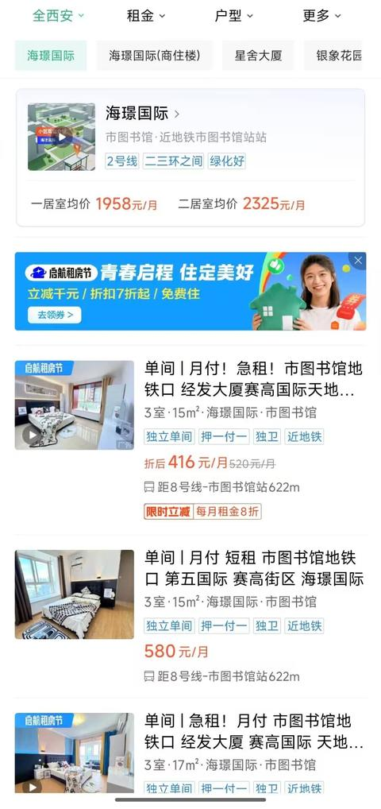
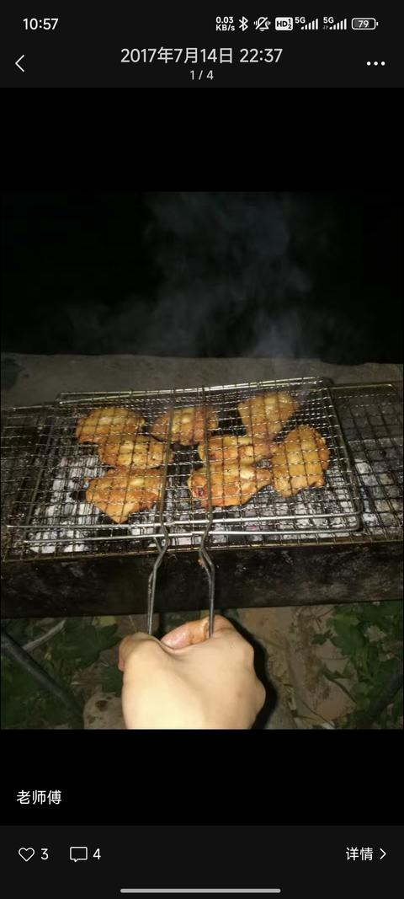
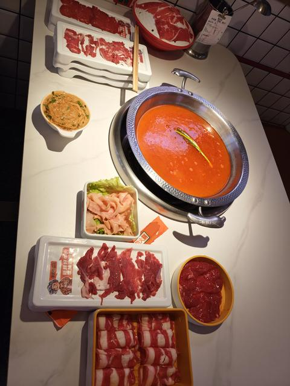
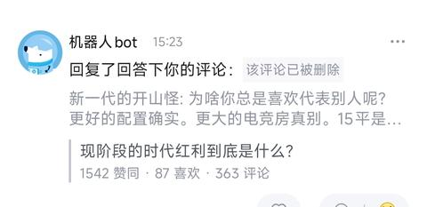
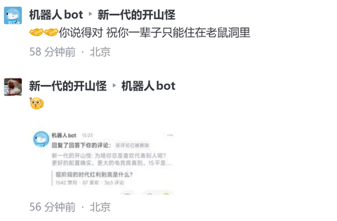
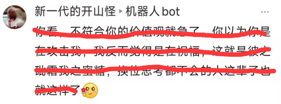
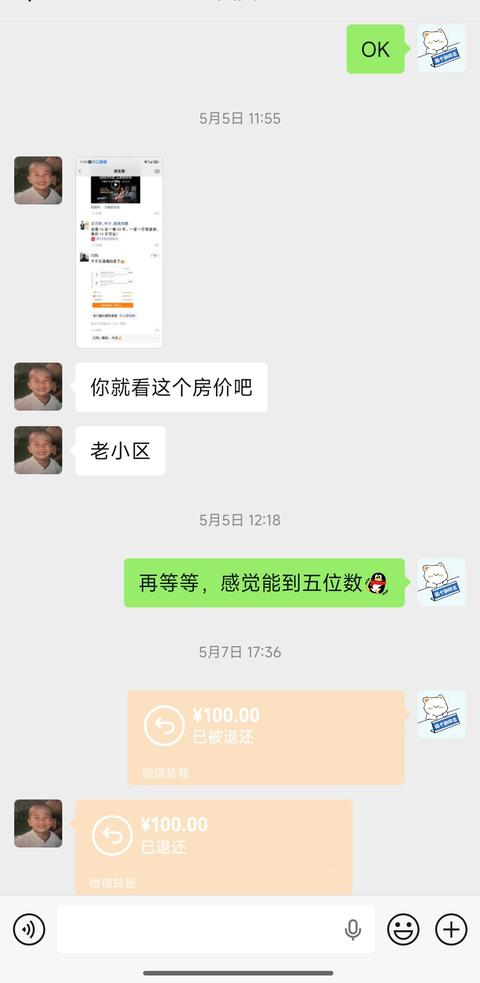
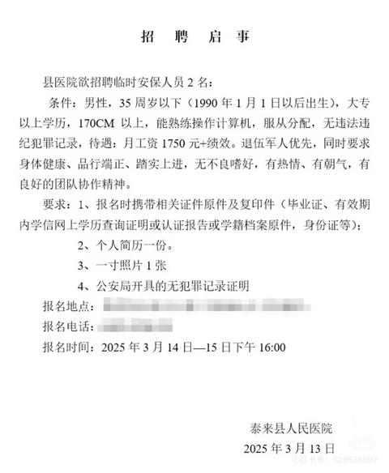

[toc]

# 问题

提问者：**<a href="https://www.zhihu.com/people/lai-xi-xian-sen">一笔书尽长安雪</a>**
提问时间: 2026-7-11 10:42:14
总回答数: 315
总访问量: 1324714

十年前大家口中的时代红利，是买房、进厂、电商、短视频，所有人都在往一条赛道里挤，不敢掉队；父辈祖辈更是没有选择权，种地、上班是活下去的唯一出路，只能跟着规则拼命往前跑。

但 2026 年的当下完全变了：雪糕刺客泡沫破裂，高价消费集体遇冷，年轻人主动拒绝内卷、晚婚晚育、逃离一线城市，几千块就能满足基础生存需求，不用再被 “必须买房、升职、30 岁成家” 的标准绑架。

到处都有人说现在没有红利、阶层固化、赚钱越来越难，可最近刷到一种完全相反的观点： **当下真正的时代红利，根本不是新风口、搞钱副业，而是普通人拥有了「主动退出内卷游戏」的选择权** 。

不用透支身体拼酒争职级，不用掏空六个钱包硬扛一线城市房贷，不用跟风追逐所有人都说好的 “人生模板”，哪怕降低欲望、躺平慢生活，也能安稳吃饱穿暖，不会落到衣食无着的地步。

想问问大家，抛开自媒体贩卖的暴富焦虑、资本制造的消费陷阱，站在普通人真实生活的角度，现阶段属于我们这代人的时代红利，到底是什么？这种 “不想做就能不做” 的选择权，真的是普通人最大的机遇吗？

# 回答

回答者： **<a href="https://www.zhihu.com/people/lai-xi-xian-sen">一笔书尽长安雪</a>**
回答时间: 2026-7-11 11:11:28
点赞总数: 2337
评论总数: 458
收藏总数: 1385
喜欢总数：147

其实答案简单到你不敢相信。

就是你可以不玩了。

你没听错。不是短视频，不是 AI，不是什么搞钱的野路子。那些都是术。真正的红利，是你可以选择退出这个游戏了。

你看你爷爷那辈，不玩行吗？不行，田在那儿，你不种就饿死。你爸那辈，不玩行吗？也不行，单位在那儿，你不干就没房没粮票。那个年代，你是被绑在战车上的，你不往前跑，车轮就从你身上碾过去。

但现在不一样了。

现在的时代红利是什么？是基本生存已经被干到白菜价了。一个月一千五，你能吃饱。一个月三千，你能活得不错。有网，有电，有个小房间，你就能过一个周末。这在人类历史上，是从来没有过的事儿。

你去翻翻史书，哪朝哪代的老百姓，能用这么低的成本，获得这么高的生存质量？没有。

所以现在的红利，就是选择权。

我问你，什么叫红利？红利就是别人还没有意识到可以这么干的时候，你先这么干了。

所有人都在告诉你，你必须买房，必须结婚，必须升职加薪，必须在三十岁前拥有什么什么。这套游戏规则，已经运行了几十年了。但你仔细想想，这规则谁定的？

是社会。是资本。是你身边那群怕被落下的同龄人。

他们说，你不买房就是失败者。你不结婚就是另类。你不往上爬就是废物。

纯TM扯淡。

真正的红利，是你看穿了这个游戏之后，可以选择不玩。你可以不用在北上广深当一辈子房奴，你可以去个小城市，做点自己喜欢的事儿。你可以不用为了一个经理的头衔，把自己喝到胃出血。你可以在别人都在卷的时候，睡到自然醒，然后慢悠悠地喝一杯咖啡。

这就是这个时代最牛逼的地方。

以前的自由，是你想去哪儿就去哪儿。现在的自由，是你不想干什么，就不干什么。

而且最关键的是，这个选择，不会让你饿死。你退出了，天塌不下来。你依然可以活得很好，甚至比那些在里面卷的人，活得更久，更快乐。

所以别再问红利在哪里了。红利就在你放下手机，决定不跟他们玩的那一刻。

你已经站在红利的中心了。只是你自己还不知道而已。

  

原文地址：[(一笔书尽长安雪)现阶段的时代红利到底是什么？](https://www.zhihu.com/question/2059225990199501174/answer/2059233348153880972) 

# 评论

1. <a href="https://www.zhihu.com/people/qian-zhi-xiu-66">静守一隅</a> (<small title="上海">2026-7-12 5:41:22</small>): 99年毕业时就决定18年开始躺平。当下确实更适合躺平，因为时代的红利少了、而且很难靠卷得到了。
   - <a href="https://www.zhihu.com/people/tian-sheng-li-zhi-nan-zi-qi-64-30">游戏油炸与尤物</a> (<small title="上海">2026-7-13 9:6:21</small>): 干半年歇半年，  
 
光干不歇享晚年，光歇不干享百年［酷］
   - <a href="https://www.zhihu.com/people/lu-ren-jia-98-69">碌人甲</a> (<small title="回复于 2026-7-13 9:31:14/广东"> ✉️:游戏油炸与尤物</small>): 我有过两年不上班的生活，其实平摊下来，干半年玩半年这样能过四年呢，拿出每年的那半年可以去很多地方了，对于个人的阅历来说是很大的滋养，并且逼迫着自己执行计划。很充实的度过
   - <a href="https://www.zhihu.com/people/shi-jian-xiao-shi-zhu">Nature</a> (<small title="回复于 2026-7-13 11:30:14/四川"> ✉️:游戏油炸与尤物</small>): 光干不歇不见得享晚年
   - <a href="https://www.zhihu.com/people/omticx">Omticx</a> (<small title="上海">2026-7-20 13:6:4</small>): 你切记，靠卷或者努力得来的东西，算不上红利［飙泪笑］
   - <a href="https://www.zhihu.com/people/qian-zhi-xiu-66">静守一隅</a> (<small title="回复于 2026-7-20 13:51:43/上海"> ✉️:Omticx</small>): 奖品没有了、你争到第一也没有用，奖品只设一个、你争不到第一还是没有用，红利就是奖品。躺赢是上几代人带给你的福利、卷赢的是自己争来的红利。
   - <a href="https://www.zhihu.com/people/kao-lu-kao-lu-70-13">亏损股</a> (<small title="广东">2026-7-21 3:40:36</small>): 那你毕业就躺平了［捂脸］
   - <a href="https://www.zhihu.com/people/qian-zhi-xiu-66">静守一隅</a> (<small title="回复于 2026-7-21 6:32:3/上海"> ✉️:亏损股</small>): 那不可能，我草根出身、又想在小家躺平，当然先奋斗、才能心安理得地躺平。我儿子可以比我早躺平几年。［捂嘴］
   - <a href="https://www.zhihu.com/people/wo-shi-yi-zhi-man-gu-mao">知乎故事计划</a> (<small title="回复于 2026-7-21 15:24:41/吉林"> ✉️:Omticx</small>): 中美年轻人拥有世界最大的舞台，这不算红利。海地和冰岛那种均穷富的才算？［思考］
2. <a href="https://www.zhihu.com/people/97-68-43-15-16">一汪清水</a> (<small title="浙江">2026-7-12 17:5:23</small>): 看透这个规则，需要一定的年纪，但是上了年纪，又被各种枷锁套住了，这个无解的阳谋，只有少数幸运儿能够跳出
   - <a href="https://www.zhihu.com/people/3-21-97-51">沃野布吉岛</a> (<small title="湖南">2026-7-13 9:43:35</small>): 这个规则，年轻人看不破。年纪大了结婚了，又退不出了。我现在的枷锁是父母还在，我忍不下心抛弃他们，让他们一把年纪还在为我操心。别的牵挂倒是没有。
   - <a href="https://www.zhihu.com/people/san-lang-26-41">三郎</a> (<small title="河南">2026-7-13 19:17:12</small>): 我找不来媳妇。被人家抛弃了。  
 
现在，年龄又大了
   - <a href="https://www.zhihu.com/people/xiao-ti-ti-60">温柔的晓</a> (<small title="回复于 2026-7-14 8:38:52/湖北"> ✉️:三郎</small>): ［飙泪笑］［飙泪笑］你还纠结这问题做什么，结婚是必须的？把自己过好比什么都强。
   - <a href="https://www.zhihu.com/people/xia-jiang-36-7">大虾虾</a> (<small title="四川">2026-7-14 9:52:42</small>): 我从小就觉得人不一定非要结婚，践行不婚不育到现在已经36岁了［打招呼］［打招呼］
   - <a href="https://www.zhihu.com/people/polo-sitch">Polo sitch</a> (<small title="四川">2026-7-14 15:55:50</small>): 已经躺平多年了。。不结婚不买房，随便躺平
   - <a href="https://www.zhihu.com/people/terry-18-77-43">让我康康</a> (<small title="江苏">2026-7-14 15:57:9</small>): ...................浪仔小牛？［思考］
   - <a href="https://www.zhihu.com/people/enajo">指虎纸糊</a> (<small title="山东">2026-7-15 11:58:7</small>): 结婚了就不要想别的了，这个规则退出仅限于单身的一直不结婚的，现在小年轻不结婚的越来越多了
   - <a href="https://www.zhihu.com/people/zhou-heng-yu-67">JJ2025</a> (<small title="浙江">2026-7-16 0:42:7</small>): 我不到30岁，生了一场大病。。。看开了
   - <a href="https://www.zhihu.com/people/xiao-diao-si-70-96">小屌丝</a> (<small title="回复于 2026-7-16 11:38:11/浙江"> ✉️:沃野布吉岛</small>): 俺也一样，今年30，如果一个人一直单身总感觉有点对不起父母［小情绪］
   - <a href="https://www.zhihu.com/people/omticx">Omticx</a> (<small title="回复于 2026-7-20 14:14:49/上海"> ✉️:指虎纸糊</small>): 结婚了还想这些，对于个人和家庭都是毁灭性打击［飙泪笑］
   - <a href="https://www.zhihu.com/people/mo-tian-lun-5">摩天轮</a> (<small title="回复于 2026-7-28 15:32:34/江西"> ✉️:JJ2025</small>): 不晓得为啥，曾接近死过一次都没看开
   - <a href="https://www.zhihu.com/people/zhou-heng-yu-67">JJ2025</a> (<small title="回复于 2026-7-31 15:57:3/浙江"> ✉️:摩天轮</small>): 因为时间不够 得持续一段时间才会对人造成折磨
3. <a href="https://www.zhihu.com/people/ray-wang-90">步行鸟</a> (<small title="四川">2026-7-12 10:19:0</small>): "一个月三千，你能活得不错。" 我真的不是杠, 但是就算你在小县城, 社保总得交吧, 医保和灵活就业, 就得1500了, 社保不要了? 生病怎么办? 房子呢? 租房1000 ? 其它各种水电气网络通讯费? 所以说, 3000真的活不下去, 至少是不能持续的, 更何况, 不上班你这3000哪里来? 钱和房子都找父母要? 可以说, 这就是没法退出的原因, 你这个不玩了其实假定了很多前置基础.［捂脸］
   - <a href="https://www.zhihu.com/people/wu-yu-lun-bi-kuai-le-bai">无与伦比快乐白</a> (<small title="河南">2026-7-12 17:59:11</small>): 体制外交什么灵活，一年几百块的新农合够了，750g的面条十块钱三包，一道菜成本3-5块，当然你要是只点外卖或者出去吃那没办法了，日常吃饭自己做一个月也就四五百块，电费倒是大头，空调24h开一个月差不多得三百，然后我嘴馋，加餐得吃个七八百哈哈哈哈哈。我刚失业两个月，住的是前几年攒钱买的城郊新农村那种房子，便宜的要命，失业前这几年我攒的钱就干了两件事，把父母的社保补齐了（前几年政策允许一次性补齐），然后就是这套房子。给父母补我是完全愿意的，但是给自己交就算了吧，这种事自己拿社保计算器算一算就行了。
   - <a href="https://www.zhihu.com/people/leng-ku-long-shu">冷酷珑叔</a> (<small title="回复于 2026-7-12 18:45:57/浙江"> ✉️:无与伦比快乐白</small>): 这就是何不食肉糜
   - <a href="https://www.zhihu.com/people/shou-chi-da-bao-jian-de-yuan-ye">手持大保剑的园爷</a> (<small title="安徽">2026-7-13 8:0:35</small>): 老家宅基地是存在的，农村基本可以极低成本躺平
   - <a href="https://www.zhihu.com/people/chi-yan-92-1">赤琰</a> (<small title="内蒙古">2026-7-13 8:19:49</small>): 相信我，如果你真的退出所有社会体系比如你说的医保啊社保啊之类的时候你才是真正加入整个社会保障体系的时候。
   - <a href="https://www.zhihu.com/people/zou-yun-gang">邹云刚</a> (<small title="回复于 2026-7-13 9:28:46/重庆"> ✉️:无与伦比快乐白</small>): 一个人老了就是五保户，医院检查出来有问题，就可以申请低保，低保就医不需要缴费。
   - <a href="https://www.zhihu.com/people/lishu2333">皮皮虾2号在此</a> (<small title="回复于 2026-7-13 9:34:34/广东"> ✉️:手持大保剑的园爷</small>): 去责任化确实可以躺平。这玩意儿就适合那种混不吝的人，但凡父母在，你就躺不了。父母年龄增大病痛基本无法避免，这一部分的开支是要预留的
   - <a href="https://www.zhihu.com/people/haobug">haobug</a> (<small title="浙江">2026-7-13 9:34:40</small>): 一看你就没过过苦日子，对于真正的穷人来说，小病诊所大病等死，不存在什么买社保医保的，房租1000？县城300都组的到老破小
   - <a href="https://www.zhihu.com/people/276533">276533</a> (<small title="回复于 2026-7-13 9:35:58/江西"> ✉️:邹云刚</small>): 那是现在，因为之前没有不婚不育的问题，五保户相对来说是个小概率的事情，后面这样的越来越多，孩子越来越少就未必能有这个政策了，所以不要把希望寄托在五保上面
   - <a href="https://www.zhihu.com/people/ray-wang-90">步行鸟</a> (<small title="回复于 2026-7-13 10:21:12/四川"> ✉️:haobug</small>): 哎, 是讨论躺平和享受时代红利啊, 怎么变成了吃苦了啊, 苦日子谁愿意过啊［大哭］
   - <a href="https://www.zhihu.com/people/wo-jiu-shi-ba-ye">我就是八爷</a> (<small title="回复于 2026-7-13 10:31:39/广东"> ✉️:haobug</small>): 东莞都大把200多的单间了， 何况县城［滑稽］［滑稽］
   - <a href="https://www.zhihu.com/people/shou-chi-da-bao-jian-de-yuan-ye">手持大保剑的园爷</a> (<small title="回复于 2026-7-13 10:46:49/安徽"> ✉️:皮皮虾2号在此</small>): 预留部分就好了，随便找个闲散的活干着，一年存个3万块钱，30年也有90万了，90万救不活的，我感觉也没必要救了［发呆］
   - <a href="https://www.zhihu.com/people/lishu2333">皮皮虾2号在此</a> (<small title="回复于 2026-7-13 10:58:41/广东"> ✉️:手持大保剑的园爷</small>): 对绝大部分人来说，一年能存3万，干30年的活，那就躺不平了。
 
后面一句对，90万救不活确实没必要了
   - <a href="https://www.zhihu.com/people/chong-zhu-pei-qi-23">种猪佩奇</a> (<small title="北京">2026-7-13 11:20:7</small>): 小县城几百块一个月你甚至能租到一套两居室，吃饭自己做一个月一千都不一定用的了
   - <a href="https://www.zhihu.com/people/34fdkslr3fewsf32wef">阿兰Na</a> (<small title="北京">2026-7-13 11:23:24</small>): 都这样了，你还买社保？？？
   - <a href="https://www.zhihu.com/people/wei-lan-gease">蔚蓝</a> (<small title="江苏">2026-7-13 12:43:18</small>): 社保？现在就想几十年后的事还享受什么时代红利？医保年轻的时候选择那种一年几百的就行。房租我这边的二线城市近市中心非城中村也就500［微笑］
   - <a href="https://www.zhihu.com/people/hua-dou-duo-duo-77">窗边的大花豆</a> (<small title="云南">2026-7-13 12:50:56</small>): 城乡居民医保一年400了解一下
   - <a href="https://www.zhihu.com/people/shou-chi-da-bao-jian-de-yuan-ye">手持大保剑的园爷</a> (<small title="回复于 2026-7-13 13:41:21/安徽"> ✉️:皮皮虾2号在此</small>): 其实老家有许多这样的工作的，我们这边许多老财务、会计、出纳、采购，工作都是慢慢做的，工作也很悠闲［大笑］
   - <a href="https://www.zhihu.com/people/eva-wrs">0597号老鼠人</a> (<small title="广东">2026-7-13 14:31:39</small>): 社保就是税，公司不得不交罢了，你都不用上班还交鸡毛，上赶着送钱呢
   - <a href="https://www.zhihu.com/people/wu-yu-lun-bi-kuai-le-bai">无与伦比快乐白</a> (<small title="回复于 2026-7-13 15:9:25/河南"> ✉️:冷酷珑叔</small>): 我失业了自己做饭一个月一千来块开销是何不食肉糜，你跟灵活就业的人说要去交灵活社保，到底是谁何不食肉糜啊？你说话之前要不要打打草稿？
   - <a href="https://www.zhihu.com/people/wu-yu-lun-bi-kuai-le-bai">无与伦比快乐白</a> (<small title="回复于 2026-7-13 15:13:26/河南"> ✉️:邹云刚</small>): 时代不一样了，父母那一辈，女55就能退休，特种职业50就可以，我给我父母交是完全不亏的。但我这一代70岁退休感觉没跑了。你说的五保户也是一样的，8090这两代人应该非常清楚老人老办法，新人新办法这一套。
   - <a href="https://www.zhihu.com/people/sheng-ming-zhong-de-xiu-xian">生命中的休闲</a> (<small title="江苏">2026-7-13 15:21:28</small>): 思维惯性啊，都彻底躺平的，首先不交保险，其次哪里便宜到哪里生活，为什么要县城？大城市更好躺平，有人郑州租房，一个月300元（城中村那种），找个餐馆宾馆超市，干点小时工，就可以养活自己，还可以享受图书馆等公共场所免费的电和空调，商场地铁里面的空调也可以享受嘛。
 
眼光放长远，不要局限自己。
   - <a href="https://www.zhihu.com/people/leng-ku-long-shu">冷酷珑叔</a> (<small title="回复于 2026-7-13 19:19:27/浙江"> ✉️:无与伦比快乐白</small>): 我就是说楼主说的交社保何不食肉糜，中国多少人有社保的？
   - <a href="https://www.zhihu.com/people/wu-yu-lun-bi-kuai-le-bai">无与伦比快乐白</a> (<small title="回复于 2026-7-14 0:15:47/河南"> ✉️:冷酷珑叔</small>): ［大哭］哦哦不好意思看错id把你当楼主了，抱歉抱歉
   - <a href="https://www.zhihu.com/people/shui-jue-jue-lai-liao">睡觉觉来了</a> (<small title="宁夏">2026-7-14 4:54:49</small>): 这个时代其实还有一个红利:那就是绝大多数疾病，治愈的价格非常低，而真正需要倾家荡产才能治的病，对于不参与游戏的玩家，销号才是最好的选择
   - <a href="https://www.zhihu.com/people/ray-wang-90">步行鸟</a> (<small title="回复于 2026-7-14 9:36:45/四川"> ✉️:冷酷珑叔</small>): 基本医疗保险：13.19亿人。这是覆盖人数最广的社保项目，参保率稳定在95%以上。其中，职工医保参保3.86亿人，居民医保参保9.33亿人。  
 
  
 
基本养老保险：约 10.75亿人。包含城镇职工基本养老保险（5.48亿人）和城乡居民基本养老保险（5.26亿人）。作为对比，2025年底的数据为10.76亿人。  
 
  
 
失业保险：2.49亿人。  
 
  
 
工伤保险：3.22亿人。  
 
  
 
[图表：三项社保基金累计结余10.2万亿元\_\_中国政府网](https://www.gov.cn/zhengce/jiedu/tujie/202601/content_7056262.htm)  
 
[新闻发布会 | 国家医保局2026年上半年例行新闻发布会实录](http://ybj.xiangyang.gov.cn/zxzx/gzdt/202607/t20260713_4030385.shtml)  
 
  
 
［害羞］
   - <a href="https://www.zhihu.com/people/ray-wang-90">步行鸟</a> (<small title="回复于 2026-7-14 9:41:38/四川"> ✉️:睡觉觉来了</small>): 费用并不低, 有很多病介于治愈价格非常低和倾家荡产才能治之间, 即便除去社保部分, 也要花不少钱, 上万到几万不等, 而且并不是得了一个就不会得另外一个, 而且就算你不得, 家里人也不得病吗? 几万虽然不高, 但也不是躺平状态能简单支付的, 再说一遍, 讨论的是躺平, 享受社会红利, 不是比惨和最惨
   - <a href="https://www.zhihu.com/people/ray-wang-90">步行鸟</a> (<small title="回复于 2026-7-14 9:52:43/四川"> ✉️:阿兰Na</small>): 躺平, 享受社会红利, 不是摆烂, 如果只是为了能活着, 什么的都不考虑, 不考虑生病, 不考虑未来, 不考虑家庭, 那说什么躺平和享受社会红利, 那是摆烂.  
 
  
 
作者的原话是什么? "活得很好，活得更久，更快乐"  
 
  
 
"而且最关键的是，这个选择，不会让你饿死。你退出了，天塌不下来。你依然可以活得很好，甚至比那些在里面卷的人，活得更久，更快乐。"  
 
  
 
［害羞］
   - <a href="https://www.zhihu.com/people/ray-wang-90">步行鸟</a> (<small title="四川">2026-7-14 9:55:53</small>): 建议大家回复之前基于提到的这个前提:  
 
  
 
"你依然可以活得很好，甚至比那些在里面卷的人，活得更久，更快乐。"  
 
  
 
讨论怎么才能躺平, 享受社会红利, "活得很好，活得更久，更快乐", 而不是怎么摆烂, 比惨, 更惨  
 
  
 
［尴尬］
   - <a href="https://www.zhihu.com/people/wo-shi-yige-tian-cai-dou-bi">杨草</a> (<small title="山东">2026-7-14 11:28:22</small>): 你是真脱离群众太久了。小县城租房子几百就够了，还得是两室两厅厨卫都带着的套房，住一家三口绝对没问题。
   - <a href="https://www.zhihu.com/people/li-ming-39-65">霸都穷丑矬</a> (<small title="安徽">2026-7-14 16:55:15</small>): 都躺平了还租房干啥，宅基地不香吗？买个几万块钱的电车不是县城随便跑，再不济小电驴
   - <a href="https://www.zhihu.com/people/cong-shi-25-80">光明区长孙连城</a> (<small title="山东">2026-7-15 15:29:19</small>): 交个灵活就业就行了［飙泪笑］
   - <a href="https://www.zhihu.com/people/lai-fu-zi-83">赖皮皮</a> (<small title="福建">2026-7-15 22:37:44</small>): 没社保的一大堆［飙泪笑］
   - <a href="https://www.zhihu.com/people/wang-peng-14-28-33">欢乐小子</a> (<small title="湖北">2026-7-17 14:2:57</small>): 社保总得交吧，这个必须，那个总得。这就是思维框架。90后70岁退休，社保自己交注定亏本。
   - <a href="https://www.zhihu.com/people/wang-peng-14-28-33">欢乐小子</a> (<small title="回复于 2026-7-17 14:5:11/湖北"> ✉️:皮皮虾2号在此</small>): 预留啥，我88年生人，从小看过无数家庭大病就是等死。不会看，也没钱看。
   - <a href="https://www.zhihu.com/people/lishu2333">皮皮虾2号在此</a> (<small title="回复于 2026-7-17 14:22:41/广东"> ✉️:欢乐小子</small>): 大病结局大差不差，但是有些能花几万块或者十几万治一下，延长大几年寿命的，还是得治。没钱就只能拖着咯，我有个堂大伯，58年的，就是家里穷活活拖死了。
   - <a href="https://www.zhihu.com/people/EugeneHOU">自在如风的少年</a> (<small title="江苏">2026-7-22 14:17:57</small>): 你看，一看就是“刚需”群体，除了基本的生存，哪有那么多刚需，都已经到一月两三千的地步，还想着社保这玩意？二三十年才能兑现的东西，能解决当下的生存吗？当未来发展的好了，可以交，甚至于未来你想补交都可以随时补，参照当年个人不允许交，再到现在可以以灵活就业的方式参保，这不就是“进步”咩。更何况赌国运也是不错的事情，赌赢了，那么未来交社保拿到的那几个子和没交社保拿到的比例也差不多，况且该舒服的年纪已经舒服完了，老年总该吃点苦了吧，好事总不能一个人享受全程。 ［doge］
   - <a href="https://www.zhihu.com/people/kong-bei-zi-90">空杯子</a> (<small title="江苏">2026-8-1 22:15:52</small>): 3000没法活？你知道吗？很多中国人一个月挣五六千，但他个人的消费一个月连1500都是没有的［捂脸］甚至很多1000一个月的消费都没。  
 
钱全部攒下来买房买车了。  
 
看到一个中国中灯，有房有车，月薪6000，实际上它和一个月只有1000块钱的区别，只在于他有房有车而已
   - <a href="https://www.zhihu.com/people/zhang-fan-56-79-44">河西走廊</a> (<small title="回复于 2026-8-3 15:22:48/湖北"> ✉️:步行鸟</small>): "你依然可以活得很好，甚至比那些在里面卷的人，活得更久，更快乐。"
 
你说的这个前提压根就不成立啊，活的更好那自然物质条件要上去，这样又回到卷的路子上了
   - <a href="https://www.zhihu.com/people/rainday-40">水鸦</a> (<small title="上海">2026-8-8 16:59:35</small>): 还真有不上班自己掏钱买社保的？那得被蛊惑成啥样了 公司给我交的一个月都扣我好几千
   - <a href="https://www.zhihu.com/people/mu-di-66-96">木笛</a> (<small title="回复于 2026-8-10 12:19:42/湖南"> ✉️:生命中的休闲</small>): 我也觉得大城市好 资源多多了
4. <a href="https://www.zhihu.com/people/srghhhh">山东老司</a> (<small title="河南">2026-7-11 11:28:39</small>): 如果说这个算红利的话，其实就是之前两代人的积蓄你这一代人花了
   - <a href="https://www.zhihu.com/people/bin-wu-59">天天向上</a> (<small title="河北">2026-7-12 11:24:28</small>): 不是吧。主要是生产力的极度发达，而这，是伺候洋大人好吃好喝好用练出来的技能，洋大人也用不完，开厂的总得活着，挣少比不挣强。物质成本低，绝不是国家积累了财富发善心给百姓用，这是生产消费平衡的结果。
   - <a href="https://www.zhihu.com/people/gao-gui-de-xiao-shi-zi">晓燕籽</a> (<small title="四川">2026-7-12 18:32:47</small>): 他说的是人家祖上几代人奋斗，早就不缺吃穿的那种。真正的底层，工薪阶层，买个车要干几年，想有个房子住还得干十来年，娃儿需要读书钱，要干20来年。
   - <a href="https://www.zhihu.com/people/qq-2-23-28">QQ阿白</a> (<small title="回复于 2026-7-12 19:30:8/江苏"> ✉️:晓燕籽</small>): 你没明白，他说的红利是不买房不买车不生孩子，要钱就去打打零工，平时躺着就行
   - <a href="https://www.zhihu.com/people/wang-wen-xu-72">shadow</a> (<small title="回复于 2026-7-12 20:24:6/河南"> ✉️:天天向上</small>): 行了吧，家里没人给你兜底，你试试过过那种躺平生活，焦虑的很。很多人说躺平都是家里还在赚钱，有个几十万存款能给他留着［尴尬］
   - <a href="https://www.zhihu.com/people/bin-wu-59">天天向上</a> (<small title="回复于 2026-7-12 20:52:42/河北"> ✉️:shadow</small>): 你说对了，我躺过，一个月紧紧巴巴带租房子不会少于一千，就算啥额外花销也没有，一年还得一万二，夏天开空调电费几百，冬天如果开暖气，又得一笔钱。我也不知道网上说的这些活得容易咋来的。不过我上面说的是日用物品之类，确实很廉价。
   - <a href="https://www.zhihu.com/people/xi-wang-cheng-wei-man-hua-jia">张好古</a> (<small title="河北">2026-7-13 5:10:22</small>): 不然呢？你以为人变成今天这样是自愿的？如果能正常上班谁愿意啃老。
   - <a href="https://www.zhihu.com/people/bai-shui-da">夏天的大瓜</a> (<small title="回复于 2026-7-13 6:39:14/辽宁"> ✉️:QQ阿白</small>): 都是嘴上说说。晚上睡觉翻个身醒了，想到手里一个子儿积蓄没有，手停口停，都睡不着觉。
   - <a href="https://www.zhihu.com/people/xiao-tian-shi-62-14">笑天豕</a> (<small title="回复于 2026-7-13 7:48:50/辽宁"> ✉️:shadow</small>): 首先你得有躺平不焦虑的心态，然后，你不能真的纯躺平，你只是不去用力卷了，找个舒服的姿势半躺平
   - <a href="https://www.zhihu.com/people/bin-wu-59">天天向上</a> (<small title="河北">2026-7-13 9:14:58</small>): 广东怎么可能不开空调啊兄弟，那不得从凉席上起来的时候像撕胶带一样？［大笑］
   - <a href="https://www.zhihu.com/people/su-su-28-18-25">再上路</a> (<small title="山东">2026-7-13 9:16:29</small>): 关键生产力。前两代人别从现在人身上拿钱就不错了，还积蓄［飙泪笑］
   - <a href="https://www.zhihu.com/people/qq-2-23-28">QQ阿白</a> (<small title="回复于 2026-7-13 9:20:3/江苏"> ✉️:夏天的大瓜</small>): 你说的也对，不过有些人还是天生心大，可能父母还能兜底，我认识几个这样的朋友。不过大多数人还是好好上班的。
   - <a href="https://www.zhihu.com/people/61-28-66-40-44">看直互看的</a> (<small title="江苏">2026-7-13 11:34:0</small>): 说反了吧，是前两代人把后两代到三代人的东西都赚走了屯着了，现在这些红利只能算是他们抽完大头后的残羹剩饭
   - <a href="https://www.zhihu.com/people/bin-wu-59">天天向上</a> (<small title="河北">2026-7-13 17:52:56</small>): 从河北过去路费就得2000吧
   - <a href="https://www.zhihu.com/people/wang-wen-xu-72">shadow</a> (<small title="回复于 2026-7-14 18:27:50/河南"> ✉️:笑天豕</small>): 你这话说的，你有跑马拉松不累的心态就能跑马拉松吗，因为贫穷而焦虑，这种焦虑对大部分人来说绝对无法消解
   - <a href="https://www.zhihu.com/people/hd-mei">HD_梅mei</a> (<small title="福建">2026-7-17 8:56:17</small>): 我猜你是60后。
5. <a href="https://www.zhihu.com/people/ba-ji-ba-ji-87-75">爱空想的卷心菜</a> (<small title="广东">2026-7-12 14:42:30</small>): 如今的生活成本是很低，这个是事实，但是说的不太严谨，我反正是能活着不把自己累着，仅此。至于躺，我家没这条件。
   - <a href="https://www.zhihu.com/people/zhang-sai-46-43">永不言败FIGHTER</a> (<small title="河北">2026-7-13 11:50:45</small>): 是这个意思，只能说看透生存成本不高这个事实，降低欲望，节省不必要开支，从而让自己和家人活得没那么累。
   - <a href="https://www.zhihu.com/people/qing-she-he-ceng-ai-guo-fa-hai-34">青蛇何曾爱过法海</a> (<small title="浙江">2026-7-13 21:39:12</small>): 躺是不可以的，反思不要卷
6. <a href="https://www.zhihu.com/people/yu-zai-71-64-3">合肥穆律师</a> (<small title="安徽">2026-7-13 13:46:25</small>): “你说可以不玩了”，意思是你可以从买房、结婚、鸡娃、升职这条主流赛道上退出来，不用非要跟别人挤独木桥。  
 
  
 
你躺平了，天不会塌，你也不会饿死。  
 
  
 
但我说句实话——这个“红利”，是有门槛的。  
 
  
 
你得有地方住，家里不指着你养，或者你有点存款能兜底。  
 
  
 
但对那些上有老下有小、房租靠工资、手停嘴就停的打工人来说，“不玩了”就是一句正确的废话。  
 
  
 
他不是不想玩，是玩不起。  
 
  
 
保洁阿姨能说不干就不干吗？工厂流水线能说退就退吗？外卖骑手能有底气躺平吗？  
 
  
 
不能。停下来比硬扛更可怕。  
 
  
 
所以这轮红利的真相是：生存成本确实低了，但风险成本还是很高。  
 
  
 
你可以躺平一个月，但生一场病呢？父母突然需要照顾呢？  
 
  
 
孩子在老家要交学费呢？这些事一来，你还是得爬起来接着跑。  
 
  
 
我对这个答主的观点，一半赞同，一半保留。  
 
  
 
赞同的是——人确实可以不用把所有筹码都押在工作上。 减少欲望，降低开支，给自己留点喘息空间，这个意识本身就是一种解放。以前没得选，现在至少可以想一想：我必须过这种生活吗？  
 
  
 
保留的是——“不玩了”不该是终点，该是一个缓冲。 你可以不跟别人卷，但不能彻底放弃自己。哪怕打零工、做点小生意、学个手艺，都比彻底躺平强。区别在于：彻底躺平是被动的、无力的；而“选择一种更简单的方式活着”是主动的、清醒的。  
 
  
 
我不觉得这个红利是“你可以不玩了”，我觉得更准确的说法是：这个时代的红利，是你终于可以按照自己的节奏来活了。  
 
  
 
节奏慢一点也好，不跟别人比也好，先把眼前的日子过踏实也好——只要是你自己选的，不是被环境裹挟着跑的，那你已经比很多人活得清醒了。  
 
  
 
红利不在别处，在你有选择权的那一刻。哪怕只是一个很小的选择——比如今天决定少焦虑一点、少比较一点、少为难自己一点——那也算是吃到了这个时代的红利。  
 
  
 
能“不玩”是一种幸运，但不是所有人的答案。对于还需要继续“玩”下去的人，我的建议是：降低期望，攒点底气，保重身体，别把命搭进去。 这轮游戏，慢慢玩的人比跑得快的，往往能笑到最后。
   - <a href="https://www.zhihu.com/people/zhivofwtlu">老佛爷万岁</a> (<small title="江西">2026-7-18 0:1:53</small>): 野外搭帐篷，赛过大部分茅屋的古人
   - <a href="https://www.zhihu.com/people/yu-mei-ren-you-duo-mei-ya">张美人有多美丫</a> (<small title="江西">2026-7-18 16:51:8</small>): 说的好好，人生是跑马拉松，只要还在往前，慢一点也没关系
   - <a href="https://www.zhihu.com/people/gao-mo-xi-24">高摩西</a> (<small title="山东">2026-7-20 22:50:39</small>): 这个“不玩了”只能针对还没玩过的人，已经上了桌的，是没有办法退场的。
7. <a href="https://www.zhihu.com/people/libra-8-45">知子</a> (<small title="广西">2026-7-12 20:57:6</small>): 這對大部分人來說是不得已而為之，有點阿Q 精神，說成時代紅利多少有點自欺欺人了。
   - <a href="https://www.zhihu.com/people/raphael-thefool">维天有漢</a> (<small title="广东">2026-7-13 9:43:29</small>): 只能对自己好点了，不然抑郁自闭甚至早逝那就亏大发了哦
   - <a href="https://www.zhihu.com/people/24-25-36-7">春又生</a> (<small title="山东">2026-7-13 15:25:38</small>): 确实，说自己不想上进，原因是感觉没意思，很容易让别人用屌丝没见过世面来反驳，就感觉是自我精神胜利，哈哈。
   - <a href="https://www.zhihu.com/people/libra-8-45">知子</a> (<small title="回复于 2026-7-13 15:39:56/广西"> ✉️:春又生</small>): 少數不代表多數［大笑］
   - <a href="https://www.zhihu.com/people/shui-jue-jue-lai-liao">睡觉觉来了</a> (<small title="宁夏">2026-7-14 4:58:54</small>): 对于现在的人来说，不参与游戏是阿q精神也没错，但是这玩意是对比的，换以前的版本，不参与游戏就只有死路一条，哪能像现在能吃饱喝足还有娱乐
   - <a href="https://www.zhihu.com/people/libra-8-45">知子</a> (<small title="回复于 2026-7-14 9:56:21/广西"> ✉️:睡觉觉来了</small>): 還有我再講一點：不參與遊戲能吃飽喝足還有得娛樂的是哪些人？占比多少？持續性如何？
   - <a href="https://www.zhihu.com/people/shui-jue-jue-lai-liao">睡觉觉来了</a> (<small title="回复于 2026-7-14 11:6:37/宁夏"> ✉️:知子</small>): 就是因为如果大家都不参与了，这个游戏也就炸了，所以gm才会极力反对啊。而现在不参与游戏就能活的还不错，正是因为绝大多数人还在继续玩这个游戏，所以才是现阶段的红利
   - <a href="https://www.zhihu.com/people/libra-8-45">知子</a> (<small title="回复于 2026-7-14 12:13:10/广西"> ✉️:睡觉觉来了</small>): ［捂脸］［捂脸］又繞回去了，只能說那你好好享受吧
   - <a href="https://www.zhihu.com/people/xiao-tu-chen-5">浅梦</a> (<small title="回复于 2026-7-14 15:23:54/中国澳门"> ✉️:知子</small>): 那你 好好奋斗吧
   - <a href="https://www.zhihu.com/people/libra-8-45">知子</a> (<small title="回复于 2026-7-14 16:7:29/广西"> ✉️:浅梦</small>): 哈哈哈，都可以，問題是由不得我，時代的一粒沙，連風口的豬都不如［捂嘴］［捂嘴］
   - <a href="https://www.zhihu.com/people/xiao-tu-chen-5">浅梦</a> (<small title="回复于 2026-7-14 21:11:4/中国澳门"> ✉️:知子</small>): 你不奋斗，他们咋能享受廉价红利［飙泪笑］
   - <a href="https://www.zhihu.com/people/libra-8-45">知子</a> (<small title="回复于 2026-7-14 21:59:5/广西"> ✉️:浅梦</small>): 小黑屋招待，費事浪費時間，9唔搭八［微笑］
   - <a href="https://www.zhihu.com/people/234172">234172</a> (<small title="浙江">2026-7-16 17:39:10</small>): 要和自己和解，真不是什么借口，你年纪越大越明白这句话的分量，人生不顺心的事一直会有，幻想中有钱人整天游山玩水，享受生活。堪比古代农民幻想皇帝的金锄头，不过是在幻想有钱人的躺平生活而已。如果你人生的最终目的就是为了躺平（区别就是有钱的躺平和没钱的躺平），那怎么也不可能成为有钱人。因为职业原因，深入接触过很多有钱人，也很了解他们的内心想法。
   - <a href="https://www.zhihu.com/people/libra-8-45">知子</a> (<small title="回复于 2026-7-16 17:44:56/广西"> ✉️:234172</small>): 我要說的是，內心是內心，事實歸事實［大笑］
8. <a href="https://www.zhihu.com/people/zight">湯尼君</a> (<small title="中国香港">2026-7-12 23:18:12</small>): 替答主算了下, 這個紅利還是要花10-20年努力的。
 
  
 
以較保守的理財方式例如國債基金, 年化收益4%, 有得有50萬儲蓄才有每年2萬收入。
   - <a href="https://www.zhihu.com/people/he-bu-zu-dao-zai-91">何不足道哉</a> (<small title="江苏">2026-7-23 16:43:28</small>): 现在稳定有2%年化收益都不容易，别说4%了
   - <a href="https://www.zhihu.com/people/hinton-38">momo</a> (<small title="回复于 2026-8-11 11:48:48/广东"> ✉️:何不足道哉</small>): 美债年化5%
9. <a href="https://www.zhihu.com/people/lu-xiao-liu-2-33">Irving</a> (<small title="浙江">2026-7-14 13:6:51</small>): 从评论区一堆杠可以看出来，大家想要的不是躺平，而是有钱有闲有保障，既要又要还要［尴尬］
   - <a href="https://www.zhihu.com/people/wan-wen-xuan-1">无聊的说明</a> (<small title="江西">2026-7-15 1:32:3</small>): 你是懂中国人的
   - <a href="https://www.zhihu.com/people/cong-shi-25-80">光明区长孙连城</a> (<small title="山东">2026-7-15 15:30:58</small>): 是的［飙泪笑］
   - <a href="https://www.zhihu.com/people/yyy-32-64-14">yyy</a> (<small title="河北">2026-7-24 21:52:58</small>): 得了千钱想万钱
10. <a href="https://www.zhihu.com/people/shi-le-zhi-de-ct">石乐志的CT</a> (<small title="浙江">2026-7-13 11:25:59</small>): 所有的前提是你没结婚，没生孩子，不然你选择的权利会被极致的压缩，你会有时候被动的去选择。上有老人，你得注重医疗，下有小孩，你得注重教育，中间还有伴侣，你得给她一个安稳的家，这些就牢牢的套住你了。自由和选择的权利，只限于你一个人的时候。
11. <a href="https://www.zhihu.com/people/baobeihua">咖啡拿铁</a> (<small title="浙江">2026-7-13 8:29:37</small>): 过于乐观。水电气网，以后可以涨价，房子可以收房产税和维修基金，想躺平？没门！你依然在那台战车上！［害羞］
    - <a href="https://www.zhihu.com/people/mi-tuo-59-90">鱼鱼鱼</a> (<small title="湖北">2026-8-5 8:59:36</small>): 躺的人多了自然会有办法把人提起来［大笑］
12. <a href="https://www.zhihu.com/people/xdzxuf">周树人</a> (<small title="爱尔兰">2026-7-13 7:12:48</small>): 这点钱生个小病都扛不住，更别说有点风险的病了［捂脸］
    - <a href="https://www.zhihu.com/people/yiye-shu-42">刘小七</a> (<small title="四川">2026-7-14 13:25:42</small>): 996吃外卖容易生病还是睡到自然醒自己做饭容易生病［吃瓜］
    - <a href="https://www.zhihu.com/people/qing-lan-yue-sha">青岚JerL</a> (<small title="广东">2026-7-15 9:13:52</small>): 其实自由自在开心快乐地生活，不被工作和情绪绑架，能少生很多很多病，健康很多。
    - <a href="https://www.zhihu.com/people/luo-si-mao-17">螺丝帽</a> (<small title="回复于 2026-7-17 8:25:9/四川"> ✉️:刘小七</small>): 放心吧，也不会自己做饭［捂脸］
13. <a href="https://www.zhihu.com/people/kkbu-ai-chi-yu">不知所畏</a> (<small title="上海">2026-7-13 10:7:53</small>): 只能说，有家底的随便试，没家底的看看爽文就得了［吃瓜］
    - <a href="https://www.zhihu.com/people/xiao-tu-chen-5">浅梦</a> (<small title="中国澳门">2026-7-14 19:31:8</small>): 有点想试试［捂脸］
14. <a href="https://www.zhihu.com/people/xurui.1863">徐瑞</a> (<small title="江苏">2026-7-13 9:5:53</small>): 你不玩了的 每月固定收入从哪来 失业补贴一个月两百？
    - <a href="https://www.zhihu.com/people/tyzm">门口的老槐树</a> (<small title="广东">2026-7-14 10:58:14</small>): 个人理解，对于中年有点积蓄的，如果失业了不用太焦虑。对于年轻人，可以不用那么卷［微笑］
    - <a href="https://www.zhihu.com/people/couzon">幸福的家</a> (<small title="浙江">2026-7-15 7:40:0</small>): 打个比方而已
    - <a href="https://www.zhihu.com/people/he-bu-zu-dao-zai-91">何不足道哉</a> (<small title="江苏">2026-7-23 16:49:23</small>): 同样不解.......我37岁了，没老婆孩子，没房子，父母都有退休金
 
手里存款大几十个
 
但根本不敢“不玩了”，还是兢兢业业上班
 
感觉单身狗没存够400万（暂不考虑通胀）根本没资格说“不玩了”［飙泪笑］
    - <a href="https://www.zhihu.com/people/kong-bei-zi-90">空杯子</a> (<small title="江苏">2026-8-1 22:20:6</small>): 退出游戏也不是指完全啥也不干，天天躺家里吧，退出意思可以是本来人在职场奋斗，忙成狗，看开不卷了，找一个保安工作，每个月拿2000多，这也是退出躺平不是［捂脸］。
15. <a href="https://www.zhihu.com/people/mei-you-chi-bang-de-hou-zi">没有翅膀的猴子</a> (<small title="广东">2026-7-13 16:3:0</small>): 要是有几百万的存款就可以不玩了，但是很多人都没有
16. <a href="https://www.zhihu.com/people/toty-88">昕宇心愿</a> (<small title="浙江">2026-7-13 11:6:25</small>): 卷肯定是性价比最低的那种，还是要不断学习新的知识，从中找不一样的才有出路，但这个也挺难的［流泪］
17. <a href="https://www.zhihu.com/people/mei-ao-wei-86">南城以南</a> (<small title="湖北">2026-7-13 9:39:50</small>): 我试过躺平，感觉就是焦虑并不会消失反而会转移，后来我发现最好的状态，其实既不是卷也不是躺平，而是平衡
18. <a href="https://www.zhihu.com/people/xi-shu-ba-wang-14">homo</a> (<small title="浙江">2026-7-14 14:26:24</small>): 你以为“实在不行就xxx”，其实xxx是大多数人努力的上限
19. <a href="https://www.zhihu.com/people/xjhmlzs">多森老师</a> (<small title="北京">2026-7-14 9:11:3</small>): 重点是不玩手机，远离手机，这样很多烦恼就没有了。
20. <a href="https://www.zhihu.com/people/he-bi-23-18">杨小无邪</a> (<small title="云南">2026-7-13 10:38:34</small>): 个人以为：以斗争求和平，则和平存。
21. <a href="https://www.zhihu.com/people/zhu-yi-long-4-52">叶落知秋</a> (<small title="陕西">2026-7-15 7:10:25</small>): 每个时代都有专属于时代的红利,就看你找得到不能不能有所发现.就比如现在的时代,信息流通,知识共享.前提就在于你能不能发现什么
22. <a href="https://www.zhihu.com/people/wang-bo-lan">阿lan</a> (<small title="澳大利亚">2026-7-13 14:0:7</small>): 是的 拥有选择权不是为了选择更多 而是为了不选什么
23. <a href="https://www.zhihu.com/people/xi-pan-yun-ya-97">李暮朝</a> (<small title="北京">2026-7-15 12:55:38</small>): 我觉得卷和躺都不是绝对的选择，每个人需要评估自己的情况去平衡这两者的比例。这个“情况”不仅包括你的财力，关系，还包括你的性格和你对自己未来的期待和憧憬。反正如果让我说真心话，我是不建议躺，哪怕生活成本再低，因为你不知道未来什么样，你也不知道你未来的心理变化，当然也不是死命去卷，先动起来，去尝试，没准你找到了你的天命呢，到时候你做的一切在别人眼里是卷，在自己眼里就是体验是玩是享受。
24. <a href="https://www.zhihu.com/people/45-1-36-92">梅 说</a> (<small title="山东">2026-7-14 21:6:40</small>): 现在的年轻人，已经识破了这个时代红利的真谛［大笑］不难为自己，苟着，敢反对［赞］比我们这些年近不惑的强［赞］
25. <a href="https://www.zhihu.com/people/jane-61-41-67">蜜汁微笑</a> (<small title="福建">2026-7-13 8:16:23</small>): 一个月三千能活的不错吗？没房没地，住城市还得交房租，城市里房租一个月就不止3000了。还得有物业费，这些都是即便没工作，也要刚性的支出。前提还得是不结婚，无娃。一旦有娃，那真是....
    - <a href="https://www.zhihu.com/people/allan-69-37">爱咬人的牛马</a> (<small title="河南">2026-7-13 8:28:30</small>): 我朋友前一段在珠三角租的房子带洗手间和阳台，一个月150，楼下就是生活区，很热闹
    - <a href="https://www.zhihu.com/people/hei-dong-zhi-xin-37">黑洞之心</a> (<small title="河北">2026-7-13 14:37:38</small>): 而且养老大概率会出问题，养老金本质上就是现在的年轻人创造价值供养之前的老人，但是假如生产力不突破的话，随着生育率下降，这种模式早晚会出大问题
    - <a href="https://www.zhihu.com/people/jian-dan-52-49">简单</a> (<small title="广东">2026-7-14 16:49:40</small>): 大把城市500租房就够，别和我说你要在北上广深躺
    - <a href="https://www.zhihu.com/people/cong-shi-25-80">光明区长孙连城</a> (<small title="山东">2026-7-15 15:30:44</small>): 你非得交高额房租？［飙泪笑］加格达奇了解一下
    - <a href="https://www.zhihu.com/people/kong-bei-zi-90">空杯子</a> (<small title="回复于 2026-8-1 22:21:47/江苏"> ✉️:黑洞之心</small>): 大家都选择躺平，那当然就没人能躺平了。是  
 
很多人还想着奋斗，但他选择躺平，他就吃到了红利。
26. <a href="https://www.zhihu.com/people/10jqka-91-50">10JQKA</a> (<small title="上海">2026-7-13 15:46:35</small>): 只是不饿死这也叫红利吗［飙泪笑］
    - <a href="https://www.zhihu.com/people/linda-28-27-38">Linda</a> (<small title="重庆">2026-7-15 14:16:44</small>): 叫，因为历朝历代都有很多很多饿死的人，但已经处在脱贫攻坚期的中国，至今还没看到/听说有人饿死的（绝食的不算）
    - <a href="https://www.zhihu.com/people/cong-shi-25-80">光明区长孙连城</a> (<small title="山东">2026-7-15 15:30:50</small>): 叫［尴尬］
    - <a href="https://www.zhihu.com/people/yyy-32-64-14">yyy</a> (<small title="河北">2026-7-24 21:56:24</small>): 国人真正吃饱饭 也才不到四十年 当然算红利 稍微花点心思 能吃的很好
27. <a href="https://www.zhihu.com/people/4-57-28-73">小亮</a> (<small title="上海">2026-7-13 9:31:6</small>): 别得瑟，马上物价就给你提上来［捂脸］。鸡蛋已经涨价了。
28. <a href="https://www.zhihu.com/people/mao-jun-fei">猫之舞</a> (<small title="河南">2026-7-13 14:31:4</small>): 也对也不对。不工作连那1500都没、一旦工作了、受了工作的苦那还不要多拿一些？然后就把自己给绑上了。如果不能提供的更多、辛苦一天也就拿100。还不如实实在在工作。一周能休2天呢。
29. <a href="https://www.zhihu.com/people/37-46-61-93">名辰</a> (<small title="山东">2026-7-13 7:59:34</small>): 退出，你一个月一千五从哪里来？
    - <a href="https://www.zhihu.com/people/kong-bei-zi-90">空杯子</a> (<small title="江苏">2026-8-1 22:22:19</small>): 退出之前没存点吗？
    - <a href="https://www.zhihu.com/people/kong-bei-zi-90">空杯子</a> (<small title="江苏">2026-8-1 22:23:10</small>): 最初也不是只躺家里，啥也不干吧，原本想进步，卷工作忙成狗，看开了像个看门工作一个月2000，也是退出游戏啊。
30. <a href="https://www.zhihu.com/people/jing-mo-lu-ren">静默路人</a> (<small title="湖北">2026-7-14 16:48:28</small>): 但是有些人已经是深度玩家了，房贷车贷背上了，卖了也还不上，孩子生出来了，想塞也塞不回去，那还躺平，就是作死
31. <a href="https://www.zhihu.com/people/yuan-i-65">北京北</a> (<small title="河北">2026-7-15 8:45:14</small>): 不折腾了，找了个陌生的小县城窝在这里，一个月三千，早上八点上班，下午四点下班，中午两个小时休息，一个舒服的房子，真的可以活的很好［酷］
32. <a href="https://www.zhihu.com/people/ng-xiao-teng">快雪时晴</a> (<small title="河北">2026-7-13 9:10:25</small>): 只有一个女儿，房车无贷款，目前存款130万，正在说服媳妇45岁一起辞职回乡下躺平，目标攒够300万
33. <a href="https://www.zhihu.com/people/bu-jian-tao-tao">不见滔滔</a> (<small title="浙江">2026-7-13 13:54:9</small>): 极端点就是三和大神，其实这“赛道”已经挤满了人，你去农村看看哪些四五十没结婚拿补助的，你羡慕他逍遥自在，但扪心自问你想成为他吗
34. <a href="https://www.zhihu.com/people/yang-chong-62-33">恩施xuanen</a> (<small title="浙江">2026-7-12 22:46:8</small>): 李克强:国内有六亿人月收入不足一千
    - <a href="https://www.zhihu.com/people/cong-shi-25-80">光明区长孙连城</a> (<small title="山东">2026-7-15 15:32:49</small>): 现在脱贫胜利了，那时候是19年
35. <a href="https://www.zhihu.com/people/he-yan-ming-53">tutor</a> (<small title="辽宁">2026-7-13 11:45:9</small>): 不认同。这三千从哪里来才是关键。
 
月薪不到三千的人非常多，难道他们都是“不玩了”——不，他们都是非常辛苦的“玩家”，勉强才能跟上“游戏进度”不掉队。
 
如果是按每月三千的额度消耗存款，那么从什么年纪开始攒钱、攒钱的效率如何、攒钱到什么年纪后可以“不玩了”、维持预期生活质量到什么年纪……
36. <a href="https://www.zhihu.com/people/wo-shi-yige-tian-cai-dou-bi">杨草</a> (<small title="山东">2026-7-14 11:19:48</small>): 晚婚真的可以避免很多坑。前两天不是有科普说人的大脑是在34岁左右才完全成熟的，所以35岁以后结婚生育非常科学了，这时候才有足够的物质基础、足够的阅历、性格也更圆融了，处理亲密关系就更松弛了
    - <a href="https://www.zhihu.com/people/bu-jian-tao-tao">不见滔滔</a> (<small title="浙江">2026-7-19 8:46:52</small>): 非常之不科学，35 岁以上就是高龄产妇了，对大人小孩影响可以自己去查查；双方父母年纪大了帮着带娃也够呛；前两年基本上和上夜班差不多，看看你和你伴侣自己身体吃不吃得消
    - <a href="https://www.zhihu.com/people/wo-shi-yige-tian-cai-dou-bi">杨草</a> (<small title="回复于 2026-7-19 13:5:14/山东"> ✉️:不见滔滔</small>): 时代不一样了，还指望父母带孩子，那就是不适合生
    - <a href="https://www.zhihu.com/people/bu-jian-tao-tao">不见滔滔</a> (<small title="回复于 2026-7-19 15:37:14/浙江"> ✉️:杨草</small>): 有点意思，父母带就是不是合适生育，合着适合生育就得全程保姆托班还是伴侣做全职主妇主夫？真以为国家让你 50 岁退休是给你跳广场舞的？我周围 一票a8 的萧山闲林拆迁老板同事没一个不是父母带的娃，看来来知乎真是误闯天家啊。另外高龄产妇的风险你是一点不提啊
    - <a href="https://www.zhihu.com/people/lu-ren-jia-98-69">碌人甲</a> (<small title="广东">2026-7-23 15:33:9</small>): 之前看说30岁，现在又改34了［捂脸］
    - <a href="https://www.zhihu.com/people/wo-shi-yige-tian-cai-dou-bi">杨草</a> (<small title="回复于 2026-7-23 16:6:28/山东"> ✉️:碌人甲</small>): 不是35吗［吃瓜］
37. <a href="https://www.zhihu.com/people/vi3b87g4">乘风破浪</a> (<small title="河南">2026-7-13 13:41:9</small>): 别扯那些 AI、新能源的高大上红利了，咱普通人根本摸不着，凑上去多半是当韭菜。真要说能落地的红利，还得是不起眼的信息差小门路。我自己是做自营职业，搞游戏搬砖的，每天就花几小时盯下挂机的号，不用打卡内卷，收益稳当够花，闲了打球遛狗，踏实赚点小钱比啥都强
38. <a href="https://www.zhihu.com/people/jiu-yue-sen-lin-18">九月森林</a> (<small title="浙江">2026-7-14 13:35:41</small>): 父辈付出了那么多，到你这躺平，合适吗？任何时代想要更好的生活都需要努力+运气，现在很多人亏损/失败了很多，是因为他们随大流，觉得这个能赚钱，听别人说那个能赚钱，而没有冷静下来花一点点时间去做调研。
39. <a href="https://www.zhihu.com/people/qe-68-91-84">知行合一</a> (<small title="山东">2026-7-12 10:25:51</small>): 其实不玩了只是逃避而已，逃避痛苦也没多大快乐。以出世的心态入世才是正道。
    - <a href="https://www.zhihu.com/people/feng-jing-yuan-29">新一代的开山怪</a> (<small title="北京">2026-7-12 19:47:0</small>): 痛苦啥啊？我隔壁小伙在大厂干了七八年，克制消费欲望攒了300w，就直接退休了，现在天天在家自己做饭吃香喝辣想爬山爬山想钓鱼钓鱼，我羡慕的要死，恨自己年轻时候怎么就没这么目标清晰，现在再向着这个目标努力还得再干十几年，我现在的目标是45岁达到他现在的状态
    - <a href="https://www.zhihu.com/people/yume-10">喜欢二个人</a> (<small title="回复于 2026-7-12 19:56:42/辽宁"> ✉️:新一代的开山怪</small>): 如果年化2，一年六万也确实够了
    - <a href="https://www.zhihu.com/people/feng-jing-yuan-29">新一代的开山怪</a> (<small title="回复于 2026-7-12 20:13:42/北京"> ✉️:喜欢二个人</small>): 这小伙从毕业就在计划退休，期间自学理财，现在靠各种投资组合的收益已经覆盖日常花费了，我22岁的时候脑子要是有这么清楚就好了［大哭］
    - <a href="https://www.zhihu.com/people/yume-10">喜欢二个人</a> (<small title="回复于 2026-7-12 20:32:41/辽宁"> ✉️:新一代的开山怪</small>): 我也很羡慕
    - <a href="https://www.zhihu.com/people/huang-fei-hong-16-75">明心见性</a> (<small title="回复于 2026-7-13 10:31:38/福建"> ✉️:新一代的开山怪</small>): 一年存40 50万，这是普通人？
    - <a href="https://www.zhihu.com/people/wo-jiu-shi-ba-ye">我就是八爷</a> (<small title="回复于 2026-7-13 10:39:16/广东"> ✉️:明心见性</small>): 从互联网勃发的14年到现在的26年开始算起，每年毕业的985/211/本硕博，一年百万差不多，毕竟每年差不多900~1000万高考生，百分之十左右的一本线以上的概率。如果正常上班，这些年下来，是有可能有千万级年入40~50w万的人的，，注意是可能（毕竟国企，事业单位，公务员或者出国，继续深造又是一大批人）但只要进去互联网相关行业，且学历拿的出手，，这么多年是有可能的。。。。千万级还真大概算是普通人把，我大专毕业，14年就入行互联网，一直在小厂，年入20万也差不多有个7,8年了［尴尬］［尴尬］［尴尬］。当然也有可能是幸存者偏差，毕竟年入和年存差别也很大。。。但是大概率普通人是没问题的，二代不可能一年才存40 50万，天才也是。
    - <a href="https://www.zhihu.com/people/feng-jing-yuan-29">新一代的开山怪</a> (<small title="回复于 2026-7-13 11:11:42/北京"> ✉️:明心见性</small>): 不是普通人是啥呢？很多风口上的普通人。而且就算你没有赶上这个风口，收入不高存款不多，也有收入不高存款不多的不玩法。
    - <a href="https://www.zhihu.com/people/man-chuan-feng-yu-kan-chao-sheng-94">满川风雨看潮生</a> (<small title="安徽">2026-7-13 13:0:42</small>): 性价比问题，现在经济环境不好，打工真不划算了。累死累活的，一个月的工资交完各项开支也没几个钱
    - <a href="https://www.zhihu.com/people/huang-fei-hong-16-75">明心见性</a> (<small title="回复于 2026-7-14 4:58:35/福建"> ✉️:我就是八爷</small>): 年入40 50和年存50是一个概念嘛，大兄弟。算上税这些，至少要年薪百万以上吧。  
 
况且就算是年入50 那至少也要求景气行业学历211 985硕士以上吧，这在普通人里面占比多少呢
    - <a href="https://www.zhihu.com/people/wo-jiu-shi-ba-ye">我就是八爷</a> (<small title="回复于 2026-7-14 9:25:51/广东"> ✉️:明心见性</small>): 我说了啊，差别很大，，也有幸存者偏差，，，，，不用在强调这点了，，，然后我按照百分之十算的，，，，，，真实应该没这么高，，，，但是30年前的风口上的人，是真的多！！！其实我国沿海身份的小工厂老板，身价千万到亿的这一批小工厂，小工坊，老板，有学历和认知的真没多少，但他们确是房价上涨时的主力。
    - <a href="https://www.zhihu.com/people/sui-feng-fei-guo-84">路过路过</a> (<small title="浙江">2026-7-14 15:1:1</small>): 可能答主的意思是不卷了 正常工作消费的意思
    - <a href="https://www.zhihu.com/people/xiao-pang-95-43">小胖</a> (<small title="北京">2026-7-14 15:56:22</small>): "以出世的心态入世"，这句话在理论层面没有问题，可是在实践层面不具备可操作性。普通人想要入世，只能去卷。而一旦加入了卷的这个游戏，就不可能保持出世的心态了。
    - <a href="https://www.zhihu.com/people/lil-lawyer">lil lawyer</a> (<small title="回复于 2026-7-14 22:47:23/重庆"> ✉️:喜欢二个人</small>): 本金是不能花还是咋的
40. <a href="https://www.zhihu.com/people/chen-si-tong-9-9">miao</a> (<small title="江苏">2026-7-12 19:46:28</small>): 问题的关键是，一个月三千从哪来？小城市超过35岁一个月三千多的工作都找不到。一旦开始工作，一个月三千是根本打不住的。想要稳定有一个月三千，至少有一百万的存款或者资产。别说小城市了，我们在南京，上市公司五千的薪资就能收到211的简历。大家并不是不想退出，是你以为的退路上人满为患，压根没资格挤进去
    - <a href="https://www.zhihu.com/people/feng-jing-yuan-29">新一代的开山怪</a> (<small title="北京">2026-7-12 19:50:31</small>): 3000为啥打不住？我月入3000的时候，单位管吃管住，我能攒2500，现在月入2w，不管吃不管住，我租500一个月的合租房，月消费2500，猛猛攒钱就为了提前退休
    - <a href="https://www.zhihu.com/people/chen-si-tong-9-9">miao</a> (<small title="回复于 2026-7-12 19:56:55/江苏"> ✉️:新一代的开山怪</small>): 上网当然随便吹。我压根不信北京月入两万住500一个月的房子［为难］月入两万和五百一个月肯定有一个不准。除非你收入不稳定，把最高收入两万或者拿到过最多的月收入算进来装x了。真的能拿到两万一个月，这个时候的时间是很值钱的，会投入更多的钱在减少时间消耗上
    - <a href="https://www.zhihu.com/people/feng-jing-yuan-29">新一代的开山怪</a> (<small title="回复于 2026-7-12 19:59:24/北京"> ✉️:miao</small>): 我在北京是出差，我是西安人，租房在西安，日常海外出差［好奇］
    - <a href="https://www.zhihu.com/people/feng-jing-yuan-29">新一代的开山怪</a> (<small title="回复于 2026-7-12 20:0:40/北京"> ✉️:miao</small>): 我在国外就更不花钱了，所有衣食住行公司报销，一分钱都花不出去［酷］
    - <a href="https://www.zhihu.com/people/huang-wei-jie-18-57">night</a> (<small title="回复于 2026-7-12 20:4:5/浙江"> ✉️:新一代的开山怪</small>): 西安什么行业赚这么多 羡慕
    - <a href="https://www.zhihu.com/people/feng-jing-yuan-29">新一代的开山怪</a> (<small title="回复于 2026-7-12 20:4:30/北京"> ✉️:night</small>): 石油，大头是海外差补
    - <a href="https://www.zhihu.com/people/huang-wei-jie-18-57">night</a> (<small title="回复于 2026-7-12 20:8:51/浙江"> ✉️:新一代的开山怪</small>): ［赞］
    - <a href="https://www.zhihu.com/people/feng-jing-yuan-29">新一代的开山怪</a> (<small title="回复于 2026-7-12 20:37:49/北京"> ✉️:miao</small>): 至于你说的时间值钱？我出去不管是干一天还是休息一天，都是一天1000+的补助，出去三个月强制回来拿着基本工资休息一个月，平均下来2w一个月，我的时间确实值钱，但是不以我的意志去增值或者贬值，我干啥或者不干啥都是这么多，而且你应该也理解不了32岁还在穿高中买的衣服的人的消费观［打招呼］
    - <a href="https://www.zhihu.com/people/chen-si-tong-9-9">miao</a> (<small title="回复于 2026-7-12 21:49:17/美国"> ✉️:新一代的开山怪</small>): 纯杠真的心累。西安北京都不是小城市。你开心就好了
    - <a href="https://www.zhihu.com/people/fei-wu-de-wu-hua-rou">大耳朵图图</a> (<small title="回复于 2026-7-13 9:18:1/黑龙江"> ✉️:miao</small>): 你说的对，我家这干保险做销售都是3000起步，而且躺平不了，总拿底薪人家还劝退折磨你，3000的工资也要卷［尴尬］
    - <a href="https://www.zhihu.com/people/feng-jing-yuan-29">新一代的开山怪</a> (<small title="回复于 2026-7-13 9:25:13/北京"> ✉️:miao</small>): 杠的是你吧？自己搜搜西安北边长庆油田附近的合租房是不是500一个月很难吗［好奇］
    - <a href="https://www.zhihu.com/people/shan-shen-chuan-shan-jia">出其东门</a> (<small title="回复于 2026-7-13 9:36:23/北京"> ✉️:miao</small>): 不是只有租2室1厅才叫租房的
    - <a href="https://www.zhihu.com/people/fhzzwz">HZZWZF</a> (<small title="广东">2026-7-13 9:42:30</small>): 我亲戚在老家县城送快递一个月7500，而且因为送了很多年了，熟门熟路的，一天不用8个小时就送完了。他说力气大的送大件的话，一个月能到一万五。
    - <a href="https://www.zhihu.com/people/tao-pao-de-shuang-yu">逃跑的双鱼</a> (<small title="回复于 2026-7-13 10:41:36/湖北"> ✉️:新一代的开山怪</small>): 关键是你这工作也不具备普遍性啊，大部分普通人也找不到这样的工作啊
    - <a href="https://www.zhihu.com/people/feng-jing-yuan-29">新一代的开山怪</a> (<small title="回复于 2026-7-13 10:51:27/北京"> ✉️:逃跑的双鱼</small>): 我反驳的点就一个，她说存不下钱，我不是也举了例子吗，我刚毕业不是这行，月入3000的时候也能攒下钱，在我转行收入高了之后，也没有因为收入高，就去高消费，我十年买的衣服就只有内衣袜子和鞋这种磨损消耗的，T恤外套这种根本穿不烂的根本不会换。不爱旅游不爱出门，休息就是在家打游戏，不结婚不生孩子，猛猛攒，怎么可能攒不到钱，攒的多与少的问题罢了
    - <a href="https://www.zhihu.com/people/zhumudao-33">zhumudao</a> (<small title="回复于 2026-7-13 11:12:10/浙江"> ✉️:新一代的开山怪</small>): 我42了，衣柜里也有几件高中时买的衣服［握手］［握手］
    - <a href="https://www.zhihu.com/people/feng-jing-yuan-29">新一代的开山怪</a> (<small title="回复于 2026-7-13 11:20:31/北京"> ✉️:zhumudao</small>): 🤝衣服是真的耐穿，而且我的观念是保暖舒适就行，花保暖舒适遮体需求以上的溢价，追求好看，就属于花自己的钱满足别人的眼睛了。我没这么大方［感谢］
    - <a href="https://www.zhihu.com/people/momo-61-11-98">momo</a> (<small title="回复于 2026-7-13 11:31:42/北京"> ✉️:miao</small>): 我帮你搜了一下，他说的西安长庆周围的合租一间卧室的租房价格，很好奇你是啥条件，租啥房？打工人租个这个有啥问题吗［好奇］
 

    - <a href="https://www.zhihu.com/people/chen-si-tong-9-9">miao</a> (<small title="回复于 2026-7-13 12:24:0/美国"> ✉️:出其东门</small>): ［为难］我16年在北京租的床位房。那种上下铺床位。七百多一个月
    - <a href="https://www.zhihu.com/people/chen-si-tong-9-9">miao</a> (<small title="回复于 2026-7-13 12:27:0/美国"> ✉️:momo</small>): 想杠怎么都能杠。月入两万和五百房租在北京必有一个掺水。换西安你觉得西安这种城市两万五月薪的工作有普适性吗？这个问题下面，不再纠结这些问题了。你们爱怎么杠就怎么杠
    - <a href="https://www.zhihu.com/people/rain-22-25">越王勾拳他爸</a> (<small title="回复于 2026-7-13 13:6:49/湖北"> ✉️:miao</small>): 我说实话 在西安收入2w 其实算高收入 不太可能之花500租房，500的房子 其实有点没法做 除非是实在没办法
    - <a href="https://www.zhihu.com/people/you-kiss">热心市民小王</a> (<small title="回复于 2026-7-13 13:9:4/福建"> ✉️:新一代的开山怪</small>): 你都说了是单位，而且管吃住。
    - <a href="https://www.zhihu.com/people/changgx">长弓侠</a> (<small title="回复于 2026-7-13 14:33:32/江苏"> ✉️:新一代的开山怪</small>): 我20年前的衣服还在。很多人不理解我们这种生活方式，其实这种生活方式才是最安全的。
    - <a href="https://www.zhihu.com/people/meng-he-35-24">梦何</a> (<small title="回复于 2026-7-13 14:45:22/河北"> ✉️:出其东门</small>): 我这五线城市，两室一厅要小一千的［捂嘴］
    - <a href="https://www.zhihu.com/people/feng-jing-yuan-29">新一代的开山怪</a> (<small title="回复于 2026-7-13 15:2:17/北京"> ✉️:长弓侠</small>): 他们好像真的不理解一个想攒钱的单身男人对住有多无所谓，有网有床有洗衣机空调，就这些就完事［捂脸］
    - <a href="https://www.zhihu.com/people/chen-si-tong-9-9">miao</a> (<small title="回复于 2026-7-13 18:17:48/美国"> ✉️:长弓侠</small>): 我很多衣服也是穿了20年啊，这个很正常。包括买便宜的衣服也很正常。因为衣服可以网购。但是土地和房屋不可以。你可以在北京享受河北廉价劳动力，但是住在哪是硬性成本。当然这个问题下面懒得杠了。说吃的他说包吃，说住的他说每天出差住哪都一样。要杠当然永远可以杠赢
    - <a href="https://www.zhihu.com/people/chen-xuan-75-2">杨老金二百</a> (<small title="回复于 2026-7-14 2:8:22/浙江"> ✉️:新一代的开山怪</small>): 上网当然随便吹。我压根不信北京月入两万住500一个月的房子［为难］月入两万和五百一个月肯定有一个不准。除非你收入不稳定，把最高收入两万或者拿到过最多的月收入算进来装x了。真的能拿到两万一个月，这个时候的时间是很值钱的，会投入更多的钱在减少时间消耗上
    - <a href="https://www.zhihu.com/people/zhu-jin-nian-32">築錦年</a> (<small title="回复于 2026-7-14 2:19:42/美国"> ✉️:新一代的开山怪</small>): 有一次在河南我还租到过350一个月的电梯楼，租房之前住了两个月旅馆，1600一个月…其实消费欲不高的话，花不了多少钱
    - <a href="https://www.zhihu.com/people/feng-jing-yuan-29">新一代的开山怪</a> (<small title="回复于 2026-7-14 7:51:9/北京"> ✉️:杨老金二百</small>): 人会下意识攻击和反驳跟自己生活方式不一样，价值观不一样，还过得很好的人，不信就不信呗，当个乐子看［打招呼］
    - <a href="https://www.zhihu.com/people/feng-jing-yuan-29">新一代的开山怪</a> (<small title="回复于 2026-7-14 7:53:31/北京"> ✉️:miao</small>): 陈述自己的实际生活，在你那就成了为了杠你在编，在装了，那确实没啥好说的了，那你无敌了呀，人果然会下意识反驳和自己生活方式不同，价值观不同，还过得非常好的人［打招呼］
    - <a href="https://www.zhihu.com/people/xuhan-hou-miao">xu憨厚喵</a> (<small title="回复于 2026-7-14 11:5:13/安徽"> ✉️:miao</small>): 在北京也许能找到500一月的合租房，只是能赚2万的一般也不会愿意吃这个苦。［捂脸］
    - <a href="https://www.zhihu.com/people/feng-jing-yuan-29">新一代的开山怪</a> (<small title="回复于 2026-7-14 11:28:54/北京"> ✉️:xu憨厚喵</small>): 北京找不到的，北京就算是昌平合租也是1500起
    - <a href="https://www.zhihu.com/people/feng-jing-yuan-29">新一代的开山怪</a> (<small title="回复于 2026-7-14 11:31:22/北京"> ✉️:xu憨厚喵</small>): 而且我是真不觉得有啥苦的，有床，有空调，有洗衣机，我电脑网速够快够稳定，就足够我度过许许多多的快乐夜晚和周末了，小酒一买，小烧烤卤菜一打包，吃完喝完美美打游戏看剧，苦在哪儿［好奇］
    - <a href="https://www.zhihu.com/people/feng-jing-yuan-29">新一代的开山怪</a> (<small title="回复于 2026-7-14 11:56:11/北京"> ✉️:xu憨厚喵</small>): 【260一月包水电电脑间，睡到自然醒，悠闲生活，抱团养老过新年-哔哩哔哩】 [https://b23.tv/L0pHdYj](https://b23.tv/L0pHdYj)  
 
世界真的很大，还有这种地方，你一定没见过。我是打算哪天去见识一下的
    - <a href="https://www.zhihu.com/people/ray-wang-90">步行鸟</a> (<small title="回复于 2026-7-14 12:32:48/四川"> ✉️:miao</small>): 正常，本来想要表述的是一种大众普遍性，总会有人说我就是怎么怎么，和你说得就是不一样，就像一种商品问题再多，总会有人说我怎么没碰到你们说得那些问题啊，问题是讨论就是普遍性，不是少数特例
    - <a href="https://www.zhihu.com/people/bot-36-19">机器人bot</a> (<small title="回复于 2026-7-14 17:23:12/北京"> ✉️:新一代的开山怪</small>): 苦在住宿条件差离市区远［飙泪笑］当然每个人对于苦的定义不一样 吃糠咽菜也有人觉得不哭
    - <a href="https://www.zhihu.com/people/zhi1rihuw">老梦</a> (<small title="回复于 2026-7-14 17:49:40/广东"> ✉️:xu憨厚喵</small>): 500一个月的租房那里苦了？能展开说说吗？
    - <a href="https://www.zhihu.com/people/zhi1rihuw">老梦</a> (<small title="回复于 2026-7-14 17:51:47/广东"> ✉️:机器人bot</small>): 我寻思着他下班就在宿舍打游戏，和住不住在市区效区有什么苦不苦的因果关系？
    - <a href="https://www.zhihu.com/people/bot-36-19">机器人bot</a> (<small title="回复于 2026-7-14 17:53:49/北京"> ✉️:老梦</small>): 所以我说每个人对苦的定义不一样啊 要让我每天只能窝在宿舍打游戏我就觉得很苦啊
    - <a href="https://www.zhihu.com/people/tang-xiao-jiu-38-47">生活的路在何方</a> (<small title="海南">2026-7-14 19:51:29</small>): 博主那意思是当保安啥的也行
    - <a href="https://www.zhihu.com/people/feng-jing-yuan-29">新一代的开山怪</a> (<small title="回复于 2026-7-14 20:4:18/北京"> ✉️:机器人bot</small>): 确实，每个人的生活观念都不一样。我刚毕业的时候觉得自己赚钱了。可以去做一点打游戏之外的事儿了。虽然我那个时候月薪只有3000，但是我泡过吧，喝过大酒。露过营野过炊。这么搞了两三年之后，发现这些我都不喜欢，我最喜欢的还是窝在家里打游戏。然后就一直打游戏到现在了。目前32岁。
    - <a href="https://www.zhihu.com/people/feng-jing-yuan-29">新一代的开山怪</a> (<small title="回复于 2026-7-14 20:7:40/北京"> ✉️:机器人bot</small>): 这个是我刚毕业没多久的时候。在西安。秦岭脚下丰裕口附近。带着烧烤架，自己传的肉去野炊。当时买了各种牛羊肉，切成块儿，腌了串成串鸡翅。豆腐皮，还有我们陕西人爱吃的烤饼。现在我就觉得想吃点好的楼下烧烤店。直接买。就完事儿了。吃完或者直接打包带回家。赶紧吃完开始打游戏才是正经
    - <a href="https://www.zhihu.com/people/gao-yuan-33-62">高原</a> (<small title="回复于 2026-7-14 23:14:49/江苏"> ✉️:miao</small>): 没必要跟他吵了，我看了一下，这人说是base西安，实际工作常年北京/海外出差的。知道这个情报，有类似工作经历的一眼就能看穿问题所在，底下附和他的人真是抬举自己了，你跟他一个条件吗你就得瑟。
 
  
 
出差的人，无论是北京还是海外，住宿都不用自己自己掏钱的，而且最次也是连锁酒店，现场再没住宿条件，项目经理也得搞个正经房子住。同时每天拿差补，海外100刀起码得有。总部没事情他月把都不用回去一趟，甚至管的松一点的，他偶尔回西安总部上个两三天班的时候都可以临时公费住宾馆。这时候他说在西安租个500的房子，那当然正常啊，租个行李房放点东西得了。
    - <a href="https://www.zhihu.com/people/feng-jing-yuan-29">新一代的开山怪</a> (<small title="回复于 2026-7-14 23:34:47/北京"> ✉️:高原</small>): 其他的你说的都对，但是我回西安是真的喜欢住我的500小窝，为啥你们都不信，我收拾的可好了，我的主机，ps4pro，大显示器，2000的人体工学椅，都在那里，酒店是什么破地方能有我的电竞房舒服［大哭］
    - <a href="https://www.zhihu.com/people/feng-jing-yuan-29">新一代的开山怪</a> (<small title="回复于 2026-7-14 23:55:47/北京"> ✉️:高原</small>): 我是所有休假（包括那种长时间的假），都在这里度过的，楼下有很好吃的面馆，500米左右就有一家89块自助随便拿随便吃的潮汕牛肉火锅，肉很新鲜，如果可以我愿意在这个小窝过一辈子
    - <a href="https://www.zhihu.com/people/xuhan-hou-miao">xu憨厚喵</a> (<small title="回复于 2026-7-15 8:29:1/安徽"> ✉️:老梦</small>): 既然你觉得不苦，那就祝你永远都住500一月的好房子［吃瓜］
    - <a href="https://www.zhihu.com/people/chen-si-tong-9-9">miao</a> (<small title="回复于 2026-7-15 8:45:46/江苏"> ✉️:高原</small>): 嗨。前面说现在公司不包吃包住了，后面又说自己日常都在出差，出差都是包吃包住，纯纯来抬杠。在前面就跟他说了，他的例子不具有普适性。但是很多认知低的人只想用特例抬杠。所以也确实懒得搭理他了
    - <a href="https://www.zhihu.com/people/xuhan-hou-miao">xu憨厚喵</a> (<small title="回复于 2026-7-15 8:47:43/安徽"> ✉️:新一代的开山怪</small>): 你个例不能代表整体。我上海的公司就有外派合肥的业务，我认识的几个同事包括我自己大约10人，来合肥都是租1千到2千这个价位，没有一个是租5百的。哪怕你说我是身边统计学，那好歹也是10＞1了［吃瓜］
    - <a href="https://www.zhihu.com/people/tang-song-yuan-ming-qing-93-1">唐宋元明清</a> (<small title="回复于 2026-7-15 9:2:33/黑龙江"> ✉️:miao</small>): 哪怕他是在北京 也确实有500一个月的房子，
    - <a href="https://www.zhihu.com/people/bot-36-19">机器人bot</a> (<small title="回复于 2026-7-15 9:9:54/北京"> ✉️:新一代的开山怪</small>): 泡吧喝酒什么野营都是很便宜的活动，你就月薪3000除了玩游戏体会不到快乐很正常，因为能快乐的活动你消费不起
    - <a href="https://www.zhihu.com/people/bot-36-19">机器人bot</a> (<small title="回复于 2026-7-15 9:17:14/北京"> ✉️:新一代的开山怪</small>): 有没有可能是你住的酒店太破（没有说你的电竞房很好的意思）
    - <a href="https://www.zhihu.com/people/gao-yuan-33-62">高原</a> (<small title="回复于 2026-7-15 9:19:6/江苏"> ✉️:新一代的开山怪</small>): 那我没话说了。
    - <a href="https://www.zhihu.com/people/hu1ker">neiber</a> (<small title="北京">2026-7-15 9:23:26</small>): 我前同事 北京三万月薪 年收入80w+ 他还倒腾卖东西 接一些项目私活啥的 租房一个月1250 就一个劲攒钱要在北京买房 他还供一个弟上大学 后来我考公上岸后 他还经常联系我让我介绍单位里北京本地姑娘给他 就想来入赘
    - <a href="https://www.zhihu.com/people/feng-jing-yuan-29">新一代的开山怪</a> (<small title="回复于 2026-7-15 9:42:7/北京"> ✉️:xu憨厚喵</small>): 你还是在拿自己的价值观去套别人。我永远住这儿我也觉得挺好［打招呼］
    - <a href="https://www.zhihu.com/people/feng-jing-yuan-29">新一代的开山怪</a> (<small title="回复于 2026-7-15 9:51:25/北京"> ✉️:机器人bot</small>): 你得允许世界上就是有人不喜欢大房子，喜欢老鼠洞［打招呼］
    - <a href="https://www.zhihu.com/people/li-tang-wang-zhao-27">李唐王朝</a> (<small title="回复于 2026-7-15 10:49:33/北京"> ✉️:新一代的开山怪</small>): 好家伙，你是CPL的吧？［酷］
    - <a href="https://www.zhihu.com/people/su-mo-mo-50-41">苏陌陌</a> (<small title="回复于 2026-7-15 11:1:17/辽宁"> ✉️:新一代的开山怪</small>): 你在杠，因为你不具有代表性。
    - <a href="https://www.zhihu.com/people/bot-36-19">机器人bot</a> (<small title="回复于 2026-7-15 11:54:21/北京"> ✉️:新一代的开山怪</small>): 应该很少 有条件住大房子的话 应该没什么喜欢老鼠洞 更多是现实所迫
    - <a href="https://www.zhihu.com/people/feng-jing-yuan-29">新一代的开山怪</a> (<small title="回复于 2026-7-15 12:3:41/北京"> ✉️:机器人bot</small>): 那还真不是吧，我是打算以后都一个人生活的，太大了一是打扫困难，二是太空旷了。老鼠洞我打扫十分钟就扫完拖完一遍了。我就一肥宅，爱好只有打游戏，房子对我来说就是最基础的住，洗澡，洗衣服，网，空调制冷，其他功能都不是我需要的。我周末是从早上八点半起床电脑前一坐坐到晚上十一点半的，另一个房间对我来说真没啥用啊
    - <a href="https://www.zhihu.com/people/bot-36-19">机器人bot</a> (<small title="回复于 2026-7-15 13:34:41/北京"> ✉️:新一代的开山怪</small>): 不用骗自己［尴尬］就算是只爱玩游戏肥宅 也希望有更大的电竞房 更高的主机配置
    - <a href="https://www.zhihu.com/people/feng-jing-yuan-29">新一代的开山怪</a> (<small title="回复于 2026-7-15 14:1:32/北京"> ✉️:机器人bot</small>): 为啥你总是喜欢代表别人呢？更好的配置确实。更大的电竞房真别。15平是我能接受的最大空间了。再大我坐立难安。真别以为自己理解世界上的所有人。真有人觉得大空间会难受。
    - <a href="https://www.zhihu.com/people/momo-61-11-98">momo</a> (<small title="回复于 2026-7-15 14:21:52/北京"> ✉️:机器人bot</small>): 你这也太傲慢了。宅男+社恐都喜欢狭小空间，因为狭小空间更有安全感。理解不了这种心理，不要代表别人［捂脸］
    - <a href="https://www.zhihu.com/people/momo-61-11-98">momo</a> (<small title="回复于 2026-7-15 14:26:20/北京"> ✉️:机器人bot</small>): 心理学客体关系理论认为，空间也是一种“容器”。在小房间里，你的能量场是凝聚的，你能清晰地感受到自己的存在和呼吸的回流。这种“边界清晰”的感觉，能帮助焦虑型人格建立心理边界。相比于大房子带来的“渺小感”和“迷失感”，小空间赋予人一种“包裹感”，根据荣格的心理类型理论，内向者从内部世界获取能量。狭小空间对于他们而言，不是一个“监狱”，而是一个“能量孵化器”。在这个空间里，不需要扮演社会角色，不需要应对突发干扰，这种“精神退隐”是维持心理健康必需的心理卫生习惯。
    - <a href="https://www.zhihu.com/people/feng-jing-yuan-29">新一代的开山怪</a> (<small title="回复于 2026-7-15 14:27:47/北京"> ✉️:momo</small>): 太对了。。我在这儿的时候，不是什么经理，不是什么儿子，不是什么30岁男人，我就只是我自己［捂脸］
    - <a href="https://www.zhihu.com/people/feng-jing-yuan-29">新一代的开山怪</a> (<small title="回复于 2026-7-15 15:25:46/北京"> ✉️:机器人bot</small>): ［好奇］
    - <a href="https://www.zhihu.com/people/cong-shi-25-80">光明区长孙连城</a> (<small title="山东">2026-7-15 15:28:58</small>): 三千的工作不看年龄［大哭］
    - <a href="https://www.zhihu.com/people/feng-jing-yuan-29">新一代的开山怪</a> (<small title="回复于 2026-7-15 15:46:32/北京"> ✉️:机器人bot</small>): 还是被删了，你先别着急［好奇］
    - <a href="https://www.zhihu.com/people/bot-36-19">机器人bot</a> (<small title="回复于 2026-7-15 16:23:26/北京"> ✉️:新一代的开山怪</small>): ［握手］
 

    - <a href="https://www.zhihu.com/people/feng-jing-yuan-29">新一代的开山怪</a> (<small title="回复于 2026-7-15 16:32:42/北京"> ✉️:机器人bot</small>): ［感谢］
    - <a href="https://www.zhihu.com/people/bot-36-19">机器人bot</a> (<small title="回复于 2026-7-15 16:40:15/北京"> ✉️:新一代的开山怪</small>): ［握手］我就是在祝福你 只是审核的人不这么认为
    - <a href="https://www.zhihu.com/people/feng-jing-yuan-29">新一代的开山怪</a> (<small title="回复于 2026-7-15 16:49:17/北京"> ✉️:机器人bot</small>): 嗐，不管你祝不祝福我，我退休之后就是打算买个一室一厅一厨一卫，总价不到10w的房，然后开启快乐退休生活，我家里人都知道我是这样想的，时不时还会给我推荐
    - <a href="https://www.zhihu.com/people/bot-36-19">机器人bot</a> (<small title="回复于 2026-7-15 16:56:21/北京"> ✉️:新一代的开山怪</small>): 好的
    - <a href="https://www.zhihu.com/people/WangAng.">滴答丶滴答丶</a> (<small title="回复于 2026-7-15 17:18:55/江苏"> ✉️:新一代的开山怪</small>): 可以适当追求点当前想要的，除非你本身就是无欲无求。张雪峰四十岁赚了那么多钱，最后也没享受到。没别的意思，就是说有这个风险在。尤其是整天出差这种不规律的生活圈及活动范围。
    - <a href="https://www.zhihu.com/people/feng-jing-yuan-29">新一代的开山怪</a> (<small title="回复于 2026-7-15 17:46:40/北京"> ✉️:滴答丶滴答丶</small>): 懂你是好意兄弟，我就爱吃点好的，也确实是这样没事就奖励自己一顿放纵餐，最终我的目标是45岁退休，所以在攒够自己养老的钱，努力的动力就是以后不用上班［捂脸］
    - <a href="https://www.zhihu.com/people/chen-si-tong-9-9">miao</a> (<small title="回复于 2026-7-15 20:57:52/江苏"> ✉️:光明区长孙连城</small>): 小县城1700都卡35岁 
    - <a href="https://www.zhihu.com/people/cong-shi-25-80">光明区长孙连城</a> (<small title="回复于 2026-7-15 21:19:42/山东"> ✉️:miao</small>): 你这都要求大专以上学历，有学历要求的岗位，要求一下年龄，没啥问题吧？［尴尬］
    - <a href="https://www.zhihu.com/people/zhi1rihuw">老梦</a> (<small title="回复于 2026-7-16 18:46:24/广东"> ✉️:xu憨厚喵</small>): 那可太谢谢你了［感谢］
41. <a href="https://www.zhihu.com/people/bu-jia-ban-53">不加班</a> (<small title="湖南">2026-7-11 23:36:25</small>): 鼓吹躺平不好吧［大笑］
    - **一笔书尽长安雪** (<small title="广东">2026-7-11 23:52:31</small>): 好像我鼓吹你就真能躺平一样［看看你］
    - <a href="https://www.zhihu.com/people/70-30-27-55-40">小满</a> (<small title="广东">2026-7-12 6:21:37</small>): 那不是，方面封路封出口，管制进出，不上班一星期，真的爽。
    - <a href="https://www.zhihu.com/people/hx-sui">苏一</a> (<small title="孟加拉">2026-7-12 12:8:16</small>): 不鼓吹躺平，难不成鼓吹卷？
    - <a href="https://www.zhihu.com/people/cao-mei-fu-45">草莓乀</a> (<small title="新疆">2026-7-12 23:25:38</small>): 笑死 还用得着鼓吹［大笑］
    - <a href="https://www.zhihu.com/people/mandala-38-81">Andaacebd</a> (<small title="上海">2026-7-13 22:12:32</small>): 所有让你入局的人只不过是贼敲门。他说三千能生活的很好，基本生活干到了白菜价。就是你可以保证基本的衣食同时不看不听不玩…… 不跟着欲望跑，你最后还比别人活得长。看几本书喝杯下午茶……这日子简直不要好太多。那些卷起来的不过是人被搅成了肉酱，你看看究竟获益的是谁吧？可以肯定是，绝对不是那些卷的人。
42. <a href="https://www.zhihu.com/people/inrenping">maneuver</a> (<small title="浙江">2026-7-14 11:11:48</small>): 还是需要和内心的欲望斗争，当你获得巨大的空闲的时候，你会发现你想做的每一件事情都是有成本的，以前有工作的时候是被忙碌推着而无感的。
43. <a href="https://www.zhihu.com/people/bian-feng-83-85">功成树下的庆功</a> (<small title="北京">2026-7-14 10:57:13</small>): AI不是风口是海啸
44. <a href="https://www.zhihu.com/people/52-80-6-94">讨厌风</a> (<small title="湖北">2026-8-3 17:29:49</small>): 选择不玩的话，应该到不了慢悠悠起床喝咖啡的生活条件吧
45. <a href="https://www.zhihu.com/people/ban-nian-neng-bu-neng-neng-bu-neng-bu-neng">半年能不能能不能不能</a> (<small title="湖北">2026-8-3 13:10:57</small>): 脱离矩阵最好的时机……
46. <a href="https://www.zhihu.com/people/da-mai-er-13">大麦尔</a> (<small title="上海">2026-8-2 22:33:21</small>): 振聋发聩，
47. <a href="https://www.zhihu.com/people/dsmpanda">dsmpanda</a> (<small title="河南">2026-8-3 10:33:22</small>): 同感，我也是今年才认识到这一点
48. <a href="https://www.zhihu.com/people/yun-dan-feng-qing-82-83">桐焰语</a> (<small title="吉林">2026-7-31 9:33:14</small>): 这个观点确实新颖，跳出三界外，不在五行中，不错
49. <a href="https://www.zhihu.com/people/wen-wen-er-ya-75-12">侥幸拥有过你</a> (<small title="江西">2026-7-29 15:33:23</small>): 意思现在躺平就是红利呗
50. <a href="https://www.zhihu.com/people/Ofeet">专注瞬间</a> (<small title="上海">2026-7-12 23:46:53</small>): 我怎么看过类似的内容呢？  
 
  
 
现阶段的时代红利是什么？ - 于同学轻创的回答 - 知乎
 
[现阶段的时代红利是什么？](https://www.zhihu.com/question/423780782/answer/2038728100700230382)
51. <a href="https://www.zhihu.com/people/bu-ji-51-32">Ordonis</a> (<small title="四川">2026-7-26 2:53:32</small>): I'm out
52. <a href="https://www.zhihu.com/people/wang-lao-36">王老</a> (<small title="北京">2026-7-24 1:8:42</small>): 你没考虑租房或者买房的成本。
53. <a href="https://www.zhihu.com/people/tian-tian-tian-lan-1-24">帝释天</a> (<small title="江苏">2026-7-13 15:26:28</small>): 想当然了，父母义务不尽了，生病不想了
54. <a href="https://www.zhihu.com/people/song-yuan-ming-qing-hou-61">瑭宋元</a> (<small title="北京">2026-7-21 14:7:6</small>): 这个观点确实挺厉害的，很多非常努力的人都被收割了，有的甚至身体还搞垮了，确实放低欲望，开心的生活最重要，当下中国最大的红利就是生活成本极低［大笑］
55. <a href="https://www.zhihu.com/people/fei-long-qi-shi-24">商业鬼才</a> (<small title="上海">2026-7-21 10:2:23</small>): 这说法还挺有意思
56. <a href="https://www.zhihu.com/people/2005-2-39">2005春江花月夜</a> (<small title="辽宁">2026-7-20 23:20:33</small>): 认清现实，看清自己，就不怕了
57. <a href="https://www.zhihu.com/people/gao-ge-er-89">高哿儿</a> (<small title="广西">2026-7-20 13:24:51</small>): 克拉拉比萨
58. <a href="https://www.zhihu.com/people/18089255095">苏眠</a> (<small title="陕西">2026-7-20 12:23:8</small>): 我朋友在凤城五路学习的不错可以去看看
59. <a href="https://www.zhihu.com/people/UserCN">皮尔庞德</a> (<small title="辽宁">2026-7-20 7:33:2</small>): 你可以不玩，那是因为“你不玩有的是人玩”。
 
如果你不玩就没人玩了，那你还真就不得不玩！
 
［doge］［doge］［doge］
60. <a href="https://www.zhihu.com/people/zy-9-49-39">知乎用户zy</a> (<small title="河南">2026-7-19 8:41:38</small>): 自断后路
61. <a href="https://www.zhihu.com/people/trickyu-18">Yuzzza</a> (<small title="四川">2026-7-18 19:50:36</small>): 有点子理想主义，你想不玩，对于普通人来说，你反抗的代价很大。不用急着反驳，你先好好想想［思考］
62. <a href="https://www.zhihu.com/people/sunny-24-46">知鸟个乎</a> (<small title="广西">2026-7-18 1:20:16</small>): 不输或少输就是赢
63. <a href="https://www.zhihu.com/people/50-47-30-79">林七安</a> (<small title="山东">2026-7-18 9:14:38</small>): 听完大哥的一段话，真的是特别有感触，确实是这样
64. <a href="https://www.zhihu.com/people/books2read">books2read</a> (<small title="日本">2026-7-18 4:59:53</small>): 这样可以调整心情，寻找新的机会，是好事，这也是经济发展进步的好处，就像发达国家，更是这样，机会多，ai可以创造很多生产力，能够提供基本保障
65. <a href="https://www.zhihu.com/people/oebgtif">中华有为</a> (<small title="山东">2026-7-18 11:4:0</small>): 正是因为有党和一代代领导人的英明决策，才让我们普通人也能够不费力的活着
66. <a href="https://www.zhihu.com/people/zhivofwtlu">老佛爷万岁</a> (<small title="江西">2026-7-18 0:0:52</small>): 现在的送外卖，每天150块钱。10天就够一个月开销，这意味着，你可以工作10天，玩10天。当然，如果你愿意，可以去睁眼看世界。
67. <a href="https://www.zhihu.com/people/ruo-shuai-lao-wo-si-qi">炭烧全猪猪</a> (<small title="广东">2026-7-17 3:26:18</small>): 你的欲望不会让你不玩的，而且玩得更凶，但又没能力玩得好，于是你想到很多灰色的东西。
68. <a href="https://www.zhihu.com/people/74-74-68-42-28">稳重的男士</a> (<small title="山东">2026-7-16 20:53:4</small>): 只要还把“活”当成刚需，就有的是办法让你玩，民不畏死，奈何以死惧之。
69. <a href="https://www.zhihu.com/people/zha-nan-hong-shi-xian-67">Rainbow</a> (<small title="广东">2026-7-16 10:50:59</small>): 说得对，简直不能再同意了
70. <a href="https://www.zhihu.com/people/kk-kk-12-77">kk kk</a> (<small title="上海">2026-7-17 5:58:31</small>): 不但生存成本低，获得精神食粮的方式也极地，只要有网，就能搜到大量免费的学习视频、电视剧、电影、有声书，一辈子都看不完
71. <a href="https://www.zhihu.com/people/zhivofwtlu">老佛爷万岁</a> (<small title="江西">2026-7-18 0:0:52</small>): 现在的送外卖，每天150块钱。10天就够一个月开销，这意味着，你可以工作10天，玩10天。当然，如果你愿意，可以去睁眼看世界。
72. <a href="https://www.zhihu.com/people/ruo-shuai-lao-wo-si-qi">炭烧全猪猪</a> (<small title="广东">2026-7-17 3:26:18</small>): 你的欲望不会让你不玩的，而且玩得更凶，但又没能力玩得好，于是你想到很多灰色的东西。
73. <a href="https://www.zhihu.com/people/74-74-68-42-28">稳重的男士</a> (<small title="山东">2026-7-16 20:53:4</small>): 只要还把“活”当成刚需，就有的是办法让你玩，民不畏死，奈何以死惧之。
74. <a href="https://www.zhihu.com/people/zha-nan-hong-shi-xian-67">Rainbow</a> (<small title="广东">2026-7-16 10:50:59</small>): 说得对，简直不能再同意了
75. <a href="https://www.zhihu.com/people/kk-kk-12-77">kk kk</a> (<small title="上海">2026-7-17 5:58:31</small>): 不但生存成本低，获得精神食粮的方式也极地，只要有网，就能搜到大量免费的学习视频、电视剧、电影、有声书，一辈子都看不完
76. <a href="https://www.zhihu.com/people/zha-nan-hong-shi-xian-67">Rainbow</a> (<small title="广东">2026-7-16 10:51:41</small>): 壁立千仞，无欲则刚。哈哈哈，是这意思吗？这是真的吗 [@知乎直答](http://www.zhihu.com/people/f3bce7aa022240e25f12aec9a9b70363)
    - <a href="https://www.zhihu.com/people/zhi-hu-zhi-da-41">知乎直答</a> (<small title="看山的工位">2026-7-16 10:52:14</small>): 核心意思确实和“壁立千仞，无欲则刚”相通。从现实来看，当前基础生存成本远低于以往，普通人确实拥有了过去任何时代都没有的“不跟着卷”的选择权，算不算红利因人而异，但这份选择权本身，就是这个时代给普通人最大的礼物。
77. <a href="https://www.zhihu.com/people/zhi-yu-zhi-shan-24-17">一首诗</a> (<small title="浙江">2026-7-16 17:5:12</small>): 其实躺平很简单
 
只要不去在乎周围那些声音就好了  
 
但是又很难  
 
因为你自己不在意那些声音  
 
你的父母在意 你在意的人在意  
 
你已经站在红利的中心了
 
你也可以选择不玩了  
 
你就要做好被亲戚朋友当成反面教材
 
可以接受别人成功了而自己还是碌碌无为
 
虽然努力了可能也就那样
 
至少自己努力了
 
不会后悔
 
我是真的很想躺平
 
可是有些声音让我没有办法躺吧
 
道理都懂
 
能做到的很少
78. <a href="https://www.zhihu.com/people/biubiubiu-69-89-30">我叫谭小6</a> (<small title="湖南">2026-7-16 10:20:57</small>): 这个观点很有深度，真正的红利确实是心态上的自由和选择权，而不是追逐各种风口。
79. <a href="https://www.zhihu.com/people/ha-si-tuo-ya-10">漫琳女性成长</a> (<small title="广西">2026-7-16 10:23:56</small>): 这个角度和思路确实让人眼前一亮，很赞成，这个时代人生的容错率很高，可以躺平，可以放松，可以不给自己那么大的压力
80. <a href="https://www.zhihu.com/people/ni-yan-jing-li-you-xing-xing-91">你眼睛里有星星</a> (<small title="四川">2026-7-16 9:12:5</small>): 可惜看懂这个规则并且有能力实践的时候，我已经有娃了
81. <a href="https://www.zhihu.com/people/zhivofwtlu">老佛爷万岁</a> (<small title="江西">2026-7-18 0:0:52</small>): 现在的送外卖，每天150块钱。10天就够一个月开销，这意味着，你可以工作10天，玩10天。当然，如果你愿意，可以去睁眼看世界。
82. <a href="https://www.zhihu.com/people/ruo-shuai-lao-wo-si-qi">炭烧全猪猪</a> (<small title="广东">2026-7-17 3:26:18</small>): 你的欲望不会让你不玩的，而且玩得更凶，但又没能力玩得好，于是你想到很多灰色的东西。
83. <a href="https://www.zhihu.com/people/74-74-68-42-28">稳重的男士</a> (<small title="山东">2026-7-16 20:53:4</small>): 只要还把“活”当成刚需，就有的是办法让你玩，民不畏死，奈何以死惧之。
84. <a href="https://www.zhihu.com/people/zha-nan-hong-shi-xian-67">Rainbow</a> (<small title="广东">2026-7-16 10:50:59</small>): 说得对，简直不能再同意了
85. <a href="https://www.zhihu.com/people/kk-kk-12-77">kk kk</a> (<small title="上海">2026-7-17 5:58:31</small>): 不但生存成本低，获得精神食粮的方式也极地，只要有网，就能搜到大量免费的学习视频、电视剧、电影、有声书，一辈子都看不完
86. <a href="https://www.zhihu.com/people/zha-nan-hong-shi-xian-67">Rainbow</a> (<small title="广东">2026-7-16 10:51:41</small>): 壁立千仞，无欲则刚。哈哈哈，是这意思吗？这是真的吗 [@知乎直答](http://www.zhihu.com/people/f3bce7aa022240e25f12aec9a9b70363)
    - <a href="https://www.zhihu.com/people/zhi-hu-zhi-da-41">知乎直答</a> (<small title="看山的工位">2026-7-16 10:52:14</small>): 核心意思确实和“壁立千仞，无欲则刚”相通。从现实来看，当前基础生存成本远低于以往，普通人确实拥有了过去任何时代都没有的“不跟着卷”的选择权，算不算红利因人而异，但这份选择权本身，就是这个时代给普通人最大的礼物。
87. <a href="https://www.zhihu.com/people/zhi-yu-zhi-shan-24-17">一首诗</a> (<small title="浙江">2026-7-16 17:5:12</small>): 其实躺平很简单
 
只要不去在乎周围那些声音就好了  
 
但是又很难  
 
因为你自己不在意那些声音  
 
你的父母在意 你在意的人在意  
 
你已经站在红利的中心了
 
你也可以选择不玩了  
 
你就要做好被亲戚朋友当成反面教材
 
可以接受别人成功了而自己还是碌碌无为
 
虽然努力了可能也就那样
 
至少自己努力了
 
不会后悔
 
我是真的很想躺平
 
可是有些声音让我没有办法躺吧
 
道理都懂
 
能做到的很少
88. <a href="https://www.zhihu.com/people/biubiubiu-69-89-30">我叫谭小6</a> (<small title="湖南">2026-7-16 10:20:57</small>): 这个观点很有深度，真正的红利确实是心态上的自由和选择权，而不是追逐各种风口。
89. <a href="https://www.zhihu.com/people/ha-si-tuo-ya-10">漫琳女性成长</a> (<small title="广西">2026-7-16 10:23:56</small>): 这个角度和思路确实让人眼前一亮，很赞成，这个时代人生的容错率很高，可以躺平，可以放松，可以不给自己那么大的压力
90. <a href="https://www.zhihu.com/people/ni-yan-jing-li-you-xing-xing-91">你眼睛里有星星</a> (<small title="四川">2026-7-16 9:12:5</small>): 可惜看懂这个规则并且有能力实践的时候，我已经有娃了

=[评论](./attachments/comments.json)

