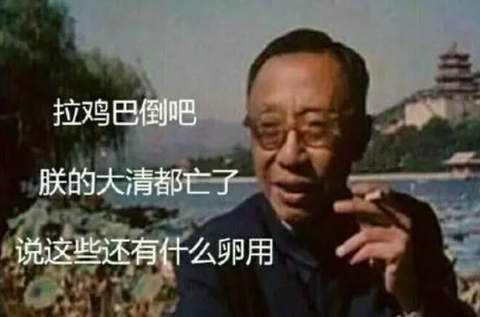
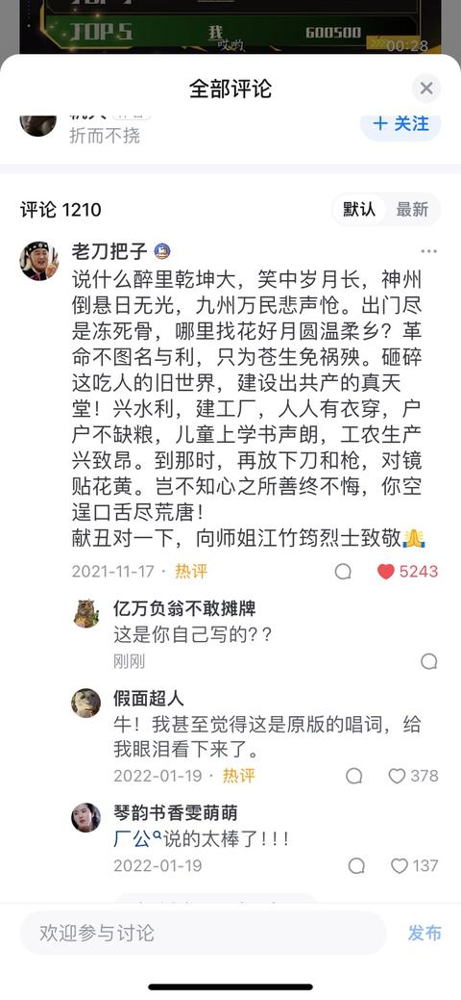

[toc]

# 问题

提问者：**<a href="https://www.zhihu.com/people/yan-yu-yisuo-25">烟雨一蓑</a>**
提问时间: 2018-6-1 7:33:29
总回答数: 89
总访问量: 2640415

如题。阎肃老师的作词水平到底是怎么的水平，怎么感觉好像水平一般（不懂勿喷），还是因为歌曲题材的限制？能否有专业大神分析一下？谢谢

# 回答

回答者： **<a href="https://www.zhihu.com/people/ma-chao-53-23">一等人二等臣</a>**
回答时间: 2025-1-6 16:23:5
点赞总数: 1281
评论总数: 90
收藏总数: 655
喜欢总数：53

多少年政治圈里较短长，到头来为谁辛苦为谁忙？武装革命是空流血，共产主义太渺茫。常言道英雄豪杰识时务，何苦再出生入死弄刀枪？倒不如抛开名利锁，逃出是非乡。醉里乾坤大，笑中岁月长，莫管他成者王侯败者寇，再休为他人去做嫁衣裳！这是原作……

你如今一叶扁舟过大江，怎敌他风波险恶浪涛狂；你如今身陷牢狱披枷锁，细思量何日才能出铁窗。常言说活着总比死了好，何苦再宁死不屈逞刚强？倒不如，激流猛转舵，悬崖紧勒缰，干戈化玉帛，委屈求安康，人逢绝路当回首，退后一步道路更宽广。这是改作……

原作作为反动派诱降的话语可谓直抵人心，无奈怕影响不好遂有改作。然而改作依然牛逼

  

原文地址：[(一等人二等臣)如何评价阎肃的作词水平？](https://www.zhihu.com/question/279418825/answer/72907467205) 

# 评论

1. <a href="https://www.zhihu.com/people/chj-82-15">chj</a> (<small title="北京">2025-10-20 11:41:39</small>): 叛徒上强度了，主角应该加力压回去，才能凸现真正革命者的精神。
   - <a href="https://www.zhihu.com/people/yu-suo-song-jiang">舒克和蛋挞</a> (<small title="黑龙江">2026-4-27 21:32:23</small>): 以我们现在这种不坚定的心态，听了第一段唱词已经被迷惑了［doge］［doge］
   - <a href="https://www.zhihu.com/people/ai-shui-shui-7-87">爱谁谁</a> (<small title="北京">2025-10-21 15:43:2</small>): +1［赞同］
2. <a href="https://www.zhihu.com/people/32-94-55-61-6">红尘好修行</a> (<small title="北京">2026-6-19 19:0:57</small>): 为什么谍战剧爱拍军统，不爱拍中统？只是因为中统的TG叛徒里宣传家、笔杆子多，真跟你辩经啊。
   - <a href="https://www.zhihu.com/people/bi-an-50-27-63">彼岸</a> (<small title="黑龙江">2026-7-10 21:5:31</small>): 想多了，单纯的，沈醉写了公开发行的《回忆录》。把军统破事，都公开了。还让人家后代，告法院了，《潜伏》里吴敬中原型，吴景中的后代
3. <a href="https://www.zhihu.com/people/dong-yu-heng-94">薛定谔的木天蓼</a> (<small title="北京">2026-5-13 13:6:53</small>): 这纯粹是借口，因为真实历史上比第一段更有说服力的诱降宣传多了去了，看看教员和鲁迅是怎么批驳的，阎肃没那个笔力和思想觉悟塑造江姐，所以偷懒改词而已。
   - <a href="https://www.zhihu.com/people/kennedy-23-1">Kennedy</a> (<small title="上海">2026-5-14 22:23:36</small>): 如果阎老爷子能看到你把他和教员/鲁迅相提并论，他应该也会很欣慰吧
   - <a href="https://www.zhihu.com/people/36-95-21-89">Tianyan</a> (<small title="江苏">2026-5-20 13:4:25</small>): 没有别的意思哈，想请教下教员和鲁迅是怎么批驳的
   - <a href="https://www.zhihu.com/people/themooninthesky">天上月心上人</a> (<small title="山东">2026-7-5 18:36:27</small>): 同意，他根本没那个觉悟，还政治圈里咋样咋样，当时老百姓都活不下去了，万人坑一个接一个，不革命能行吗
   - <a href="https://www.zhihu.com/people/bladestorm-34">知乎用户90FNUZ</a> (<small title="北京">2026-7-5 23:23:3</small>): 你即没有论据 也没有论证过程 然后甩出来这句话，只能代表 基本盘的本色都是只会喊口号；脑子只有结论
   - <a href="https://www.zhihu.com/people/dong-yu-heng-94">薛定谔的木天蓼</a> (<small title="回复于 2026-7-6 16:5:37/北京"> ✉️:知乎用户90FNUZ</small>): 我放的这几篇文章都是冰山一角，只是我拍脑袋马上能想起来的或者书就在我手边的例子。你要是对近代史和近代社论文本有基本的了解，就会发现那个所谓的第一版唱词全是几十年来嚼烂了的陈词滥调，早就被驳穿了。如果你还对此感到惊讶，需要别人给你找具体的论据把饭喂嘴里，那你需要反省的是你自己的常识和文化水平有待提高。
   - <a href="https://www.zhihu.com/people/dong-yu-heng-94">薛定谔的木天蓼</a> (<small title="回复于 2026-7-6 16:14:49/北京"> ✉️:Tianyan</small>): 主席对这些问题的看法可以看一下“湖南农民调查报告”、“在延安文艺座谈会上的讲话”、“反对自由主义”、“论联合政府”等。鲁迅可以主要关注一下他对于“第三种人”的论战。因为在二三十年代文艺界有一个很鲜明的左右派矛盾，其中偏右翼的一个核心观点就是“艺术纯粹论”、“超脱政治论”，本质上也就是这段唱词的思想来源。其实这全都不是什么新东西，早就已经被讨论烂了。
   - <a href="https://www.zhihu.com/people/yue-man-xuan-ni-shi-99">月满轩尼诗</a> (<small title="回复于 2026-7-6 16:51:55/上海"> ✉️:薛定谔的木天蓼</small>): 我觉得别人有疑问还是尽量直接回答为好，否则绕到最后都变成情绪的发泄。
   - <a href="https://www.zhihu.com/people/12-84-32-85">绫华</a> (<small title="回复于 2026-7-10 14:56:26/江苏"> ✉️:知乎用户90FNUZ</small>): 是的，我见过最多的就是“早就批烂了”、“驳穿了”，跟念“阿弥陀佛”似的。
   - <a href="https://www.zhihu.com/people/dong-yu-heng-94">薛定谔的木天蓼</a> (<small title="回复于 2026-7-22 11:10:39/北京"> ✉️:绫华</small>): 那你可以把我上面列的书单都看一遍再说有没有驳穿
   - <a href="https://www.zhihu.com/people/12-84-32-85">绫华</a> (<small title="回复于 2026-7-22 13:48:26/江苏"> ✉️:薛定谔的木天蓼</small>): 那你说说《湖南农民调查报告》，与这个问题有哪些关联？
   - <a href="https://www.zhihu.com/people/dong-yu-heng-94">薛定谔的木天蓼</a> (<small title="回复于 2026-7-22 15:7:59/北京"> ✉️:绫华</small>): 我在上面已经讲得很清楚了，湖南农民运动调查报告揭示的是旧社会的痼疾、革命行动的本质必要性、农民群体对革命行动的热情、农会的组织结构与影响，以及探讨农民运动中常出现的问题和解决方法。这里反驳的就是革命虚无主义的言论，证明革命1）是必要的2）是行之有效的。
   - <a href="https://www.zhihu.com/people/ming-tian-jiu-du-jie">春田花花</a> (<small title="回复于 2026-7-28 16:21:58/湖南"> ✉️:薛定谔的木天蓼</small>): 还是没有针对性的批驳啊
   - <a href="https://www.zhihu.com/people/dong-yu-heng-94">薛定谔的木天蓼</a> (<small title="回复于 2026-7-28 16:33:54/北京"> ✉️:春田花花</small>): 所以我说你要把书单看完
   - <a href="https://www.zhihu.com/people/ming-tian-jiu-du-jie">春田花花</a> (<small title="回复于 2026-7-31 10:23:0/湖南"> ✉️:薛定谔的木天蓼</small>): 那我也回复你一百本书 也反驳你了 那你看完呗
   - <a href="https://www.zhihu.com/people/dong-yu-heng-94">薛定谔的木天蓼</a> (<small title="回复于 2026-7-31 15:7:17/北京"> ✉️:春田花花</small>): 我给了明确的反驳思路和每个思路对应的具体资料和书单，你也和我的评论一样开一个详细的那我就去看
   - <a href="https://www.zhihu.com/people/dong-yu-heng-94">薛定谔的木天蓼</a> (<small title="回复于 2026-7-31 15:11:27/北京"> ✉️:春田花花</small>): 另外，这里面有好几个都是有直接的针对性批驳的，比如《论第三种人》和《在延安文艺座谈会上的讲话》。你觉得这段劝降台词的内容新颖有说服力，只可能有一个原因，就是你对近代史和近代文坛根本不熟悉。你但凡多读点书，这种套话真的太常见了，关于它的反驳，以及反驳之反驳的各种套娃论战也都是比路边野狗还多。所以你问出这个问题，我就知道你不读书。
   - <a href="https://www.zhihu.com/people/rong-rong-xie-xie-17">冬泳好手钱谦益</a> (<small title="回复于 2026-8-10 15:38:34/北京"> ✉️:薛定谔的木天蓼</small>): 幽默
   - <a href="https://www.zhihu.com/people/dong-yu-heng-94">薛定谔的木天蓼</a> (<small title="回复于 2026-8-10 15:43:13/北京"> ✉️:冬泳好手钱谦益</small>): 不读书的现身说法来了
4. <a href="https://www.zhihu.com/people/cheng-guang-yuan-71">草民</a> (<small title="安徽">2026-5-11 13:8:11</small>): 还是第一段深入人心，
   - <a href="https://www.zhihu.com/people/sui-meng-29-56">碎梦</a> (<small title="河南">2026-7-9 8:36:19</small>): 对，这第1段迷惑性太强了，恐怕一般人真的投了。［捂脸］
   - <a href="https://www.zhihu.com/people/yue-wen-thule">遥岑远目</a> (<small title="海南">2026-7-11 16:21:56</small>): 这不是抄袭桃花扇吗？有啥？
   - <a href="https://www.zhihu.com/people/19-79-59-65">墨痕犹锁壁间尘</a> (<small title="回复于 2026-7-16 6:45:3/宁夏"> ✉️:遥岑远目</small>): 
5. <a href="https://www.zhihu.com/people/bo-bo-an-93-47">Asia外贸说</a> (<small title="山东">2026-5-11 12:9:12</small>): 休言世事论兴亡，志士丹心赴八荒。  
 
热血倾身酬正道，鸿鹄高志不迷茫。  
 
岂因安逸颓筋骨，愿舍身躯护四方。  
 
斩断凡庸名利网，扎根家国守故疆。  
 
胸藏浩气天地广，心抱忠魂日月长。  
 
生作人间凌云客，千秋青史自流芳。
   - <a href="https://www.zhihu.com/people/lw1010-90">lw1010</a> (<small title="山东">2026-7-4 10:40:34</small>): 都是大话口号虚词没一点意义。
   - <a href="https://www.zhihu.com/people/wo-ai-xue-xi-21-55-66">賣藥郎</a> (<small title="回复于 2026-7-8 11:29:15/四川"> ✉️:lw1010</small>): 确实
   - <a href="https://www.zhihu.com/people/krrrhv">知乎用户KRRrHV</a> (<small title="河北">2026-7-13 2:45:4</small>): 说的好👌🏻
   - <a href="https://www.zhihu.com/people/robin-97-45">Robin</a> (<small title="江苏">2026-7-18 12:18:31</small>): 啥叫空话？这就是。
   - <a href="https://www.zhihu.com/people/bo-bo-an-93-47">Asia外贸说</a> (<small title="回复于 2026-7-19 23:13:3/北京"> ✉️:lw1010</small>): 管你什么事，我喜欢
6. <a href="https://www.zhihu.com/people/slz-66">srrk</a> (<small title="上海">2025-10-23 20:18:29</small>): 第一段听的我都想叛变了
   - <a href="https://www.zhihu.com/people/bo-bo-an-93-47">Asia外贸说</a> (<small title="山东">2026-5-11 12:7:25</small>): 我已经坦然叛变了，还觉得自己志向高洁，无欲无求呢
   - <a href="https://www.zhihu.com/people/ding-xiang-jing-74">定向井</a> (<small title="重庆">2026-5-12 1:50:12</small>): 叛变？不还是没有逃出是非乡吗？
 
得出家，而不是叛变。
   - <a href="https://www.zhihu.com/people/zhong-zhen-43">修真钟汉良</a> (<small title="湖北">2026-7-24 17:15:51</small>): 哥，听我的，熬到美人计［尴尬］
   - <a href="https://www.zhihu.com/people/53-74-75-2-73">东湖牌照相机</a> (<small title="湖北">2026-7-25 21:39:43</small>): 这段时间可能是1947或者1948年，你叛变要在2年之内出去
 
  
 
否则……
   - <a href="https://www.zhihu.com/people/da-ma-lan-dao">大马兰刀</a> (<small title="河北">2026-8-8 14:0:27</small>): 所以说速胜论和投降论，粉粉和神神，都是同一种人的一体两面，特定情形下可以无缝衔接丝滑转换。
   - <a href="https://www.zhihu.com/people/kong-leo-71">582726</a> (<small title="山东">2026-8-26 17:6:23</small>): 倒不如抛开名利锁，逃出是非乡，那还给国民党忙活个der?第一段太空，倒不如第二段更贴合叛徒的实际，说服力更强
7. <a href="https://www.zhihu.com/people/dmslxc">dmslxc</a> (<small title="浙江">2026-7-9 0:5:20</small>): 那时的共产党人不是为了自己的利益加入共产党的，他们是为了天下受苦人不再受苦，而自觉自愿的选择的这条革命的道路。他们自己的利益，荣辱在这个面前都是不值一提的。所以甫志高的劝降词对他们毫无说服力。只让他们更看清和鄙视甫志高，反而更会坚持他们的革命理想和意志。  
 
今天的人为什么会觉得甫志高的说辞有蛊惑性，是因为今人自己就不是为了革命，为了天下人，也就是别人的利益而加入革命的。
   - <a href="https://www.zhihu.com/people/55-42-10-22-46">Prontosil</a> (<small title="江苏">2026-7-21 9:8:33</small>): 甫志高也是那时的共产党人的一员
   - <a href="https://www.zhihu.com/people/69-61-39-30">南飞乌鹊</a> (<small title="上海">2026-8-9 23:41:11</small>): ［尴尬］
   - <a href="https://www.zhihu.com/people/windowsljl">windowsljl</a> (<small title="山西">2026-8-14 13:2:21</small>): 这种说辞有蛊惑性是因为不相信人性，理想主义者不是100年前才诞生出来的，历史上重复的事情太多了。
   - <a href="https://www.zhihu.com/people/yan-wu-xiang-xin">永夷</a> (<small title="日本">2026-8-16 1:20:39</small>): 天真
8. <a href="https://www.zhihu.com/people/xuan-yuan-shi-song-15">轩辕诗颂</a> (<small title="江苏">2025-10-23 19:22:52</small>): 比现在那些新编剧目的编剧强一万倍
9. <a href="https://www.zhihu.com/people/cheng-guan-55-96">清泉子</a> (<small title="山东">2026-5-13 6:56:2</small>): 对，这其实就是佛道劝人修行看破的话，用在这个场景严重不符。纯属炫技。不谈政治，但从艺术方面来说，这词也得毙掉
10. <a href="https://www.zhihu.com/people/an-ai-ma">安艾玛</a> (<small title="福建">2026-5-20 0:49:9</small>): 第一段有滚滚长江东逝水的味道，确实牛
    - <a href="https://www.zhihu.com/people/gan-yuan-shan-jin-guang-dong-tai-yi-zhen-ren-22">兔共</a> (<small title="河南">2026-7-16 9:38:47</small>): 虚无主义
11. <a href="https://www.zhihu.com/people/shi-gao-zhi-23-66">史高治</a> (<small title="浙江">2025-10-21 14:19:21</small>): 第一段真是恶魔低语，强如老共也不敢拿这个考验干部。
    - <a href="https://www.zhihu.com/people/sui-meng-29-56">碎梦</a> (<small title="河南">2026-7-9 8:36:40</small>): 第1段话讲的真是太真实，当年很多人要是扛不住，真投了。［捂脸］
12. <a href="https://www.zhihu.com/people/17-15-39-67">萍水相逢</a> (<small title="内蒙古">2025-10-26 13:8:9</small>): 太牛了。［感谢］
13. <a href="https://www.zhihu.com/people/jin-ji-de-lao-wang-20">进击的老王</a> (<small title="辽宁">2026-7-6 10:32:50</small>): ［赞］
14. <a href="https://www.zhihu.com/people/e-ni-97-94-88">Mulsdty</a> (<small title="河北">2026-8-9 19:25:11</small>): 为什么观众觉得有强度呢，因为这是历史观众是全知视角。我看到第一句在结合作者的遭遇就觉得强度太大了。
15. <a href="https://www.zhihu.com/people/zhi-jian-ren-5">执剑人</a> (<small title="湖北">2026-8-8 2:53:52</small>): 抛开名利锁，逃出是非乡，那应该跟国共都没关系，直接回乡隐居或者出家，还劝个什么降呢？直接把人家江姐放了就行……
16. <a href="https://www.zhihu.com/people/wen-shi-hao-86">南天</a> (<small title="北京">2026-5-12 17:36:1</small>): 阎肃要是叛变了还了得？
    - **一等人二等臣** (<small title="陕西">2026-5-12 21:47:58</small>): 还得是京爷
17. <a href="https://www.zhihu.com/people/bu-chi-xia-wen-43">亿万负翁不敢摊牌</a> (<small title="河南">2026-7-16 10:8:10</small>): 这张截图我一直保存着
    - <a href="https://www.zhihu.com/people/lao-liu-ta-men-du-shi-zhe-yang">柳鹏飞</a> (<small title="山东">2026-7-24 17:55:5</small>): 这截图看得我感觉死了也值了
    - <a href="https://www.zhihu.com/people/he-jin-37-89">玖渚伊</a> (<small title="四川">2026-7-30 21:41:59</small>): 厂公说得好啊，当浮一大白［哇］
18. <a href="https://www.zhihu.com/people/5-80-75-88-65">明塔</a> (<small title="江苏">2026-7-6 21:53:27</small>): 对于有血债的而言，这就是挑衅
    - <a href="https://www.zhihu.com/people/yin-wu-zhe-9">隐武者</a> (<small title="广东">2026-7-15 9:30:55</small>): 革命的目的是报私仇？仇家死了之后就躺平了？如果是抱这种想法的，那就不是革命者，也不配为共产党员
    - <a href="https://www.zhihu.com/people/zhu-ta-lan-22">祝踏岚</a> (<small title="回复于 2026-8-11 14:20:34/河南"> ✉️:隐武者</small>): 有些人恨的是整个旧世界
19. <a href="https://www.zhihu.com/people/yuan-yuan-liu-chang-85-45">峻极于天</a> (<small title="山东">2026-7-11 13:16:49</small>): 改词的原因，还是对自己的信仰抵抗力不自信，对群众的免疫力不相信［捂脸］
20. <a href="https://www.zhihu.com/people/bai-yun-cang-gou-21-18">我剑也未尝不利</a> (<small title="河北">2026-8-25 9:30:14</small>): 要是我真动摇
21. <a href="https://www.zhihu.com/people/kong-leo-71">582726</a> (<small title="山东">2026-8-26 17:1:25</small>): 那都1948年了，三大战役都开打了，还抛开名利锁呢？抛开名利锁，你给国民党打什么工？
22. <a href="https://www.zhihu.com/people/zhu-ge-liang-99-65">打酱油的人</a> (<small title="日本">2026-8-11 19:6:21</small>): ［doge］这强度加的不是一点点的厉害
23. <a href="https://www.zhihu.com/people/xia-jia-xuan-38">玉米地强生</a> (<small title="广东">2026-8-7 23:1:48</small>): 建议用《日升之屋》唱出来，显得更绝望一些［吃瓜］
24. <a href="https://www.zhihu.com/people/zhang-fu-gui-31">党卫军雨衣反穿</a> (<small title="天津">2026-8-6 12:47:12</small>): 唱出了真理
25. <a href="https://www.zhihu.com/people/liu-tao-60-3-62">观沧海</a> (<small title="山东">2026-7-13 10:2:54</small>): 这是汪曾祺写的台词吧［思考］
26. <a href="https://www.zhihu.com/people/bo-luo-su-da">菠萝苏打</a> (<small title="安徽">2026-7-7 13:52:27</small>): ［思考］说得对呀
27. <a href="https://www.zhihu.com/people/ping-du-zhen-lu-da-bo-bo-79">大明香火孙传庭</a> (<small title="浙江">2026-7-6 14:36:29</small>): 原词好
28. <a href="https://www.zhihu.com/people/ding-xiang-jing-74">定向井</a> (<small title="重庆">2026-5-12 1:48:49</small>): 这词的逻辑不是劝江姐投降。
 
是劝江姐出家。
29. <a href="https://www.zhihu.com/people/4iwghur">小看山4Iwghur</a> (<small title="浙江">2026-7-12 17:18:4</small>): 大毒草啊
30. <a href="https://www.zhihu.com/people/98-96-74-95-9">长崎素世</a> (<small title="福建">2026-5-10 2:10:13</small>): 没笔力写江姐就直说，不能拿迷惑性强来找借口
    - <a href="https://www.zhihu.com/people/kennedy-23-1">Kennedy</a> (<small title="上海">2026-5-14 21:20:46</small>): 并不是笔力的问题，这段唱词实际上对江姐杀伤力不大，对那些意志不坚定的观众其实杀伤力最大。而在这些人眼里，江姐不管怎么回答，都只是像在喊革命口号而已。
    - <a href="https://www.zhihu.com/people/98-96-74-95-9">长崎素世</a> (<small title="回复于 2026-5-14 22:9:5/福建"> ✉️:Kennedy</small>): 你这个“不管怎么回答”正是要用笔力把不可能转化成可能的点啊。江姐的丈夫是怎么牺牲的，江姐年少时究竟是经历了怎样的磨难才坚定了革命信念，国民党又是怎样对白区实行白色统治的，这些都可以讲啊［为难］
    - <a href="https://www.zhihu.com/people/98-96-74-95-9">长崎素世</a> (<small title="回复于 2026-5-14 22:9:54/福建"> ✉️:Kennedy</small>): 看过红岩原著的话，应该都对江姐经历印象挺深刻的吧
    - <a href="https://www.zhihu.com/people/kennedy-23-1">Kennedy</a> (<small title="回复于 2026-5-14 22:21:31/上海"> ✉️:长崎素世</small>): 这就不是靠戏文解决的问题。愿意看的人早就自己去看红岩原著了。甫志高那段戏文为什么有杀伤力，就是因为他用很短的文字消解了革命斗争的意义。而江姐对答甫志高的那段戏文，如果以同样的或者接近的文字体量，完全没有办法覆盖你这条回答里的信息量。你这几条回应的方向必须组合起来，才是完整的答案，无论单拎哪一条出来，写成戏文作为江姐的回应，看起来都很像革命口号。
    - <a href="https://www.zhihu.com/people/98-96-74-95-9">长崎素世</a> (<small title="回复于 2026-5-14 23:6:33/福建"> ✉️:Kennedy</small>): 那就把白色恐怖这一条单拎出来，gmd出了名的言而无信喜欢玩暗杀，甫志高如果想花力气反驳，就不得不说出更多的台词，江姐趁机就能把我刚才说的那一大段轰出来  
 
总有办法的，笔力不够就认
    - <a href="https://www.zhihu.com/people/xiao-dian-dian-29-52">我是你的小钿钿</a> (<small title="回复于 2026-5-29 22:59:50/广东"> ✉️:长崎素世</small>): 哥们来一段吧，执笔为先
    - <a href="https://www.zhihu.com/people/98-96-74-95-9">长崎素世</a> (<small title="回复于 2026-5-29 23:9:17/福建"> ✉️:我是你的小钿钿</small>): 你文科生你上，我特么是学生物的你让我来？［为难］
    - <a href="https://www.zhihu.com/people/xiao-dian-dian-29-52">我是你的小钿钿</a> (<small title="回复于 2026-5-30 20:1:58/广东"> ✉️:长崎素世</small>): 我可没这个本事，你说得挺容易
    - <a href="https://www.zhihu.com/people/helvetica-bq">生生世世轮回种花</a> (<small title="吉林">2026-7-8 13:9:4</small>): 李韶九：［思考］
    - <a href="https://www.zhihu.com/people/kennedy-23-1">Kennedy</a> (<small title="回复于 2026-7-11 9:38:9/上海"> ✉️:长崎素世</small>): 你始终没理清楚一个边界，阎老爷子的任务是把红岩改编成歌剧，他写的是歌剧台词，这就意味着要精炼，观众没有心思长时间听两个人扯闲篇。你说出这个“一大段”，我就知道你是个纯纯的外行，写这个一大段，是罗广斌的任务，不是阎肃的任务。
    - <a href="https://www.zhihu.com/people/kennedy-23-1">Kennedy</a> (<small title="回复于 2026-7-11 12:18:33/上海"> ✉️:我是你的小钿钿</small>): 我不理解这个学生物的人是怎么敢评价中国当代最优秀的词作家/剧作家之一笔力不够的［飙泪笑］
    - <a href="https://www.zhihu.com/people/xi-di-ling-hun-41">遥看瀑布挂前川</a> (<small title="回复于 2026-7-12 6:20:53/山东"> ✉️:长崎素世</small>): 红岩作者都没有扛过去
31. <a href="https://www.zhihu.com/people/xu-xin-you-zhu-2020">野黯</a> (<small title="山东">2026-8-2 2:41:38</small>): 很多人觉得自己抵挡不住，这很正常，革命家和普通人不同，是随时做好牺牲准备的、意志坚定的先锋队  
 
敌人说的很简单，就是革命一场空。不谈虚的，对症下药：分析形势，革命必然胜利（暗含牺牲是值得之意，注意不要说牺牲以免气势弱了），后面反将一军，醉里乾坤笑中岁月是泡影，有将来有清算你的一天  
 
  
 
多少年枪林弹雨较短长，到今日不争一时争久长。  
 
我图的是亿万人翻身路，你守的是光头一家坟头山。  
 
亿万人要翻身，你拿什么挡？  
 
你那里官刮地皮，我这里穷人分田；  
 
你那里将吃空饷，我这里送粮送鞋送儿上战场；  
 
你那里票子成山买不来半碗粮，我这里刨土也种出新天地  
 
方才劝降词，唱得不害臊。  
 
且由你醉里乾坤笑中岁月——民心已在变，你那好日子，快到头了！  
 
到那时红旗插满城楼，金陵王气黯然收。  
 
绑上法庭挨枪子，跪地求饶也休想逃！
32. <a href="https://www.zhihu.com/people/yan-ming-li-ge">雁鸣骊歌</a> (<small title="陕西">2026-7-31 21:7:17</small>): 你自己看着抵达人心而已，招笑

=[评论](./attachments/comments.json)

