[toc]

# 问题

提问者：**<a href="https://www.zhihu.com/people/zhang-li-72-32-26">张李</a>**
提问时间: 2024-7-8 16:30:57
总回答数: 479
总访问量: 11384657

你是什么时候意识到自己身材好的？

# 回答

回答者： **<a href="https://www.zhihu.com/people/xiao-qing-cai-67-31">一颗西兰花</a>**
回答时间: 2026-5-12 15:20:44
点赞总数: 445
评论总数: 174
收藏总数: 438
喜欢总数：44

163，120斤，但是别人都说看着不像，哈哈，一直有运动习惯，游泳，跑步，跑步，一周三四次，比较佛系

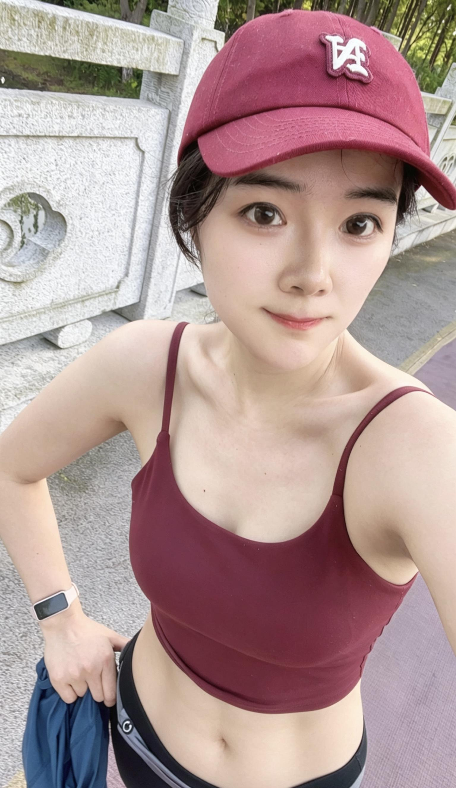

哈哈，最近注意饮食，瘦了一些，现在114斤，别人也不信

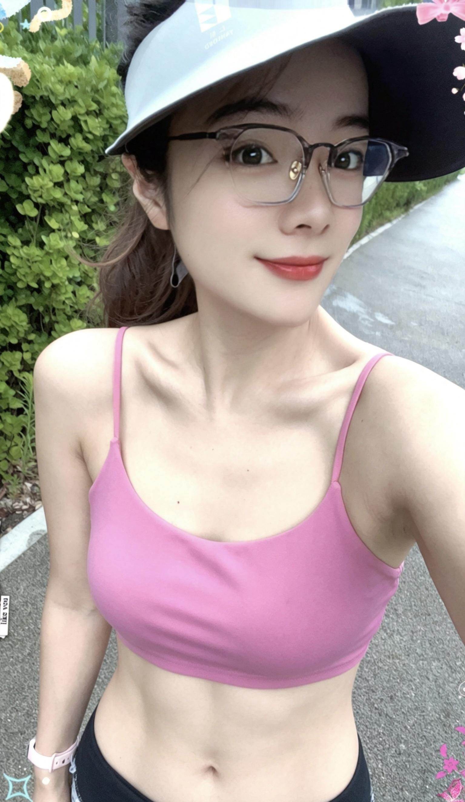

蛙泳2000米，55分钟。跑步配速610。😄

  

原文地址：[(一颗西兰花)你是什么时候意识到自己身材好的？](https://www.zhihu.com/question/661062680/answer/2037552805586654117) 

# 评论

1. <a href="https://www.zhihu.com/people/aiai-40">aiai</a> (<small title="上海">2026-5-18 20:2:2</small>): 有健身痕迹，身高163的话，这上身看起来在105左右，下身估计是肌肉腿…要不然撑不起120的体重
   - **一颗西兰花** (<small title="江苏">2026-5-19 10:18:55</small>): 不算是肌肉腿，就是全身比较紧致，我是沙漏身材，身材比较均匀
   - **一颗西兰花** (<small title="江苏">2026-5-19 10:23:40</small>): 算粗嘛［思考］ 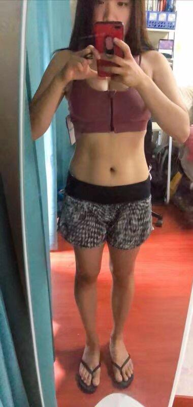
   - <a href="https://www.zhihu.com/people/aiai-40">aiai</a> (<small title="回复于 2026-5-19 21:48:31/上海"> ✉️:一颗西兰花</small>): 不粗［捂脸］［捂脸］［捂脸］  
 
这体型完全看不出是120斤啊…难道真健身给健浓缩了…  
 
我前女友165，120斤，看起来比你壮了一圈  
 
你这体型反而像163，100了，下身比上身看起来更瘦
   - **一颗西兰花** (<small title="回复于 2026-5-19 22:40:21/江苏"> ✉️:aiai</small>): 我比较紧致，她们都不敢相信我120斤，但是是真的［思考］
   - <a href="https://www.zhihu.com/people/aiai-40">aiai</a> (<small title="回复于 2026-5-19 23:19:43/上海"> ✉️:一颗西兰花</small>): 那你厉害，练出效果了［捂脸］
   - <a href="https://www.zhihu.com/people/xiao-shou-bing-liang-888">小手冰凉</a> (<small title="回复于 2026-6-26 14:13:0/四川"> ✉️:一颗西兰花</small>): 喜欢这张图
   - <a href="https://www.zhihu.com/people/chen-er-chen-68">yi知意</a> (<small title="回复于 2026-6-26 16:35:42/广东"> ✉️:一颗西兰花</small>): 看起来很美很紧致
   - <a href="https://www.zhihu.com/people/53-71-78-46">梅有道理可盐</a> (<small title="回复于 2026-6-27 14:19:49/福建"> ✉️:一颗西兰花</small>): 你说120斤，那是相当紧实的
   - **一颗西兰花** (<small title="回复于 2026-6-27 14:35:59/江苏"> ✉️:梅有道理可盐</small>): 瘦点了114，今天早上跑完10公里拍的 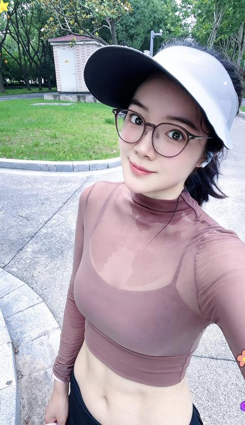
   - <a href="https://www.zhihu.com/people/hui-fei-de-niu-38-18">会飞的牛</a> (<small title="回复于 2026-7-5 8:44:1/四川"> ✉️:一颗西兰花</small>): 不像110以上的样子
   - <a href="https://www.zhihu.com/people/chui-liao-ge-feng-20">吹了个风</a> (<small title="回复于 2026-7-8 13:4:21/上海"> ✉️:一颗西兰花</small>): 很漂亮了，真的不能看体重，我175/160斤，一般人都是大胖子了，但是我就是正常身材
   - <a href="https://www.zhihu.com/people/wo-wen-wen-94">一针见红</a> (<small title="回复于 2026-7-8 13:46:40/河北"> ✉️:aiai</small>): 买个好称吧
   - <a href="https://www.zhihu.com/people/zhen-xi-gan-ren">爱在公园前</a> (<small title="回复于 2026-7-9 15:51:0/广东"> ✉️:一颗西兰花</small>): 哦，这就好解释了，体重主要集中在腹部以上颈部以下部位
   - <a href="https://www.zhihu.com/people/zhen-xi-gan-ren">爱在公园前</a> (<small title="回复于 2026-7-9 15:51:54/广东"> ✉️:一颗西兰花</small>): 全身都紧致吗
   - <a href="https://www.zhihu.com/people/zhen-xi-gan-ren">爱在公园前</a> (<small title="回复于 2026-7-9 15:53:7/广东"> ✉️:吹了个风</small>): 有没有可能你就是壮？
   - <a href="https://www.zhihu.com/people/bi-sheng-fa-zhan">毕生发展</a> (<small title="回复于 2026-7-11 3:32:34/刚果共和国"> ✉️:一颗西兰花</small>): 密度大了［飙泪笑］
   - <a href="https://www.zhihu.com/people/wangchong-39">猪肉大葱牛肉大葱</a> (<small title="回复于 2026-7-11 4:6:18/北京"> ✉️:一颗西兰花</small>): 不算，你是合金骨骼吧，密度太大了
   - <a href="https://www.zhihu.com/people/z-82-18-56">鲫巴输的软趴趴的</a> (<small title="回复于 2026-7-11 12:1:21/浙江"> ✉️:一颗西兰花</small>): 这种玩起来最狠了
   - <a href="https://www.zhihu.com/people/xia-yi-ze-82-3">铱泽大叔</a> (<small title="回复于 2026-7-11 17:28:45/浙江"> ✉️:一颗西兰花</small>): 这身材怎么看也不像120斤的呀，反而还有一种小短腿的即视感，可能是视角问题吧
   - **一颗西兰花** (<small title="回复于 2026-7-11 18:7:6/江苏"> ✉️:铱泽大叔</small>): 昨天拍游泳视频录的截图，已经瘦了，现在106［思考］ 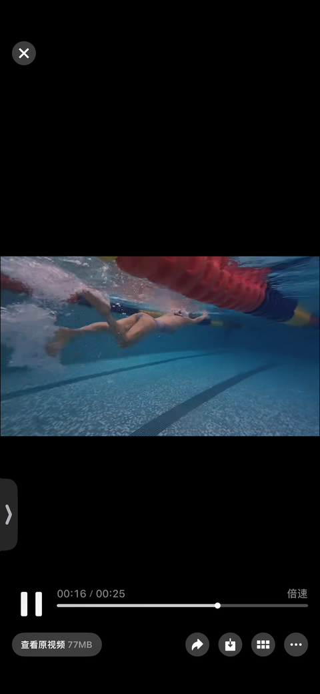
   - <a href="https://www.zhihu.com/people/zou-tian-xia-76-87">走天下</a> (<small title="回复于 2026-7-16 21:27:18/江苏"> ✉️:一颗西兰花</small>): 不怎么细［捂嘴］
   - <a href="https://www.zhihu.com/people/zou-tian-xia-76-87">走天下</a> (<small title="回复于 2026-7-16 21:28:10/江苏"> ✉️:一颗西兰花</small>): 优秀［赞同］
   - <a href="https://www.zhihu.com/people/69-16-53-11-75">叶子</a> (<small title="回复于 2026-7-18 21:27:26/广东"> ✉️:一颗西兰花</small>): 这不是沙漏，你百度一下沙漏是怎样的
   - **一颗西兰花** (<small title="回复于 2026-7-19 21:18:20/江苏"> ✉️:叶子</small>): 我三围93，60，94，不是沙漏，是啥？你自己去百度
   - **一颗西兰花** (<small title="回复于 2026-7-19 21:19:16/江苏"> ✉️:叶子</small>): 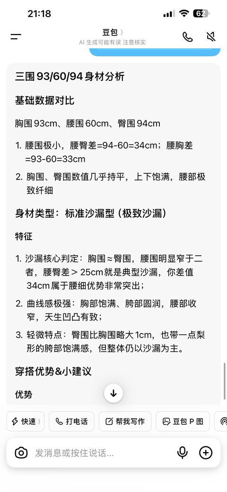
   - <a href="https://www.zhihu.com/people/94-56-3-30">青青子衿</a> (<small title="回复于 2026-8-16 11:20:28/山东"> ✉️:一颗西兰花</small>): 不错。沙漏型身材很协调肌肉群
2. <a href="https://www.zhihu.com/people/ji-da-wang-36">史儿同学</a> (<small title="河南">2026-5-22 16:32:49</small>): 你别发了,他们说的身材好是奶巨大,不一个赛道
   - **一颗西兰花** (<small title="江苏">2026-5-22 16:57:21</small>): 好呢
3. <a href="https://www.zhihu.com/people/dian-ke-dong">岳不群</a> (<small title="上海">2026-6-25 23:26:7</small>): [［图片］](https://pic1.zhimg.com/v2-325e080fd76f695e3f7226f5390b023c_qhd.gif?source=1d2f5c51)
   - <a href="https://www.zhihu.com/people/henghenghahei-98">哒哒哒·咚呲哒呲</a> (<small title="北京">2026-7-18 22:28:45</small>): 蝌蚪勇士，慷慨赴死［可怜］
4. <a href="https://www.zhihu.com/people/wang-jun-shan-64">铭健</a> (<small title="海南">2026-5-22 15:14:35</small>): 喜欢的身材，有荤有素，营养均衡
5. <a href="https://www.zhihu.com/people/liang-jin-ping-guo-92">两斤苹果</a> (<small title="广西">2026-7-6 23:58:15</small>): 163，120斤，但是别人都说看着不像，哈哈，一直有运动习惯，游泳，跑步，跑步，一周三四次，比较佛系
6. <a href="https://www.zhihu.com/people/qia-wa-ge-bo-21">树哥</a> (<small title="浙江">2026-6-22 15:51:24</small>): 有点瘦了，整点力量
7. <a href="https://www.zhihu.com/people/WHO-AM-I">吞吞吐吐天天</a> (<small title="浙江">2026-5-22 14:50:16</small>): 等等这有120?
8. <a href="https://www.zhihu.com/people/liang-liang-35-22-9">supermoon</a> (<small title="广东">2026-6-23 6:12:36</small>): 你说有114，平时运动多，我是信的。肌肉紧致，看起来瘦，其实体重不轻。
 
皮肤挺好的，经常流汗起了挺大作用吧［捂嘴］
   - **一颗西兰花** (<small title="江苏">2026-6-23 22:9:2</small>): 是的！
9. <a href="https://www.zhihu.com/people/zai-ma-peng-you">钱钱钱钱钱</a> (<small title="四川">2026-5-24 14:41:3</small>): 这是骨架偏大吧
10. <a href="https://www.zhihu.com/people/a-mu-10-70">啊木</a> (<small title="广东">2026-7-9 12:24:29</small>): 傻瓜认为自己是特殊的，别人都是普遍的；聪明人认为自己是普遍的，别人都是特殊的。
11. <a href="https://www.zhihu.com/people/gao-xiao-xin-95-34">土豆三世</a> (<small title="天津">2026-7-7 23:57:1</small>): 不算是肌肉腿，就是全身比较紧致，我是沙漏身材，身材比较均匀
12. <a href="https://www.zhihu.com/people/xu-sheng-chao-35-30">破魔小黑</a> (<small title="天津">2026-7-10 9:43:30</small>): 身材好，长得也漂亮，这个身材114的话，那应该是有肌肉的
13. <a href="https://www.zhihu.com/people/deng-lei-31">坚强的石头</a> (<small title="湖北">2026-7-9 19:12:57</small>): 加油加油，［赞同］不算是肌肉腿，就是全身比较紧致，我是沙漏身材，身材比较均匀，我觉得你还是很厉害的
    - **一颗西兰花** (<small title="江苏">2026-7-11 20:19:24</small>): 一起进步，一起加油
14. <a href="https://www.zhihu.com/people/wu-da-qi-56-38">吴大器</a> (<small title="浙江">2026-5-16 13:38:47</small>): 那肌肉含量真的很大
15. <a href="https://www.zhihu.com/people/wangchong-39">猪肉大葱牛肉大葱</a> (<small title="北京">2026-7-11 4:5:49</small>): 这体重完全不合理，除非骨架很大
16. <a href="https://www.zhihu.com/people/shan-zhong-zhi-ren">尘封</a> (<small title="新疆">2026-7-12 11:47:27</small>): 这个身高体重，看照片我也不信
17. <a href="https://www.zhihu.com/people/86-4-90-63">月寒</a> (<small title="北京">2026-6-22 23:20:23</small>): 哇，这腹肌真的可以
18. <a href="https://www.zhihu.com/people/jayalian">jayalian</a> (<small title="泰国">2026-6-23 9:5:37</small>): 身材很好啊，不是那种瘦巴巴的
    - **一颗西兰花** (<small title="江苏">2026-6-23 22:8:53</small>): 是的，毕竟体重摆在这儿
    - <a href="https://www.zhihu.com/people/jayalian">jayalian</a> (<small title="回复于 2026-6-23 22:17:16/泰国"> ✉️:一颗西兰花</small>): 体重已经不重要了［感谢］
19. <a href="https://www.zhihu.com/people/zhe-cheng-88">哲成</a> (<small title="广东">2026-7-15 12:19:38</small>): 好看的女人，多看，爱看
20. <a href="https://www.zhihu.com/people/hu-duan-mei">虎断眉</a> (<small title="四川">2026-7-9 21:17:47</small>): 昨天有个170高的看起来起码120斤非说自己只有106，这还可以理解。  
 
今天又有个163高的，看起来100斤非说自己120斤。你这个逻辑真的就不懂了。［思考］
21. <a href="https://www.zhihu.com/people/er-dao-huang">耳刀皇</a> (<small title="辽宁">2026-6-27 17:17:12</small>): 你说你吧，不戴眼镜戴帽子，我觉得你身材就不好；戴帽子戴眼镜，我觉得你身材特好。
22. <a href="https://www.zhihu.com/people/qiao-bian-hong-yao-miss">桥边红药miss</a> (<small title="江苏">2026-7-9 21:13:28</small>): 我平静的，平静的望着，山覆盖了山，水淹没了水，下个路口的，不再是我，亦或是我。
23. <a href="https://www.zhihu.com/people/ben-pao-ti-yu">享受生活</a> (<small title="江苏">2026-7-11 9:48:19</small>): 感谢大家分享 路过留个脚印
24. <a href="https://www.zhihu.com/people/67438-46">金融李先生</a> (<small title="湖北">2026-7-17 10:32:44</small>): 哇撒，锁骨［大笑］［大笑］［思考］
25. <a href="https://www.zhihu.com/people/ur9b3s">有梦同学</a> (<small title="广东">2026-7-15 12:22:7</small>): 儿子开启人生第一段正式恋情，心中百感交集。欣喜孩子遇到心动之人，慢慢学会奔赴与喜欢。希望他对待感情心怀真诚，懂得尊重、包容与担当。相处时多换位思考，遇事好好沟通。认真去爱，但不必盲目付出。愿真心不被辜负，好好善待对方，也别忘了好好爱自己，坦然享受相遇，从容接纳所有结局。
26. <a href="https://www.zhihu.com/people/93-29-37-36">新品特价</a> (<small title="上海">2026-6-27 11:1:16</small>): 这身材一个字：绝
27. <a href="https://www.zhihu.com/people/xu-rui-8-79">徐子钦</a> (<small title="江苏">2026-7-12 15:16:17</small>): 怎么才能瘦下来？我现在肚子好大［捂脸］
    - **一颗西兰花** (<small title="江苏">2026-7-13 7:22:43</small>): 饮食干净，体重大就快走，游泳，体重不大就慢跑，跳绳
28. <a href="https://www.zhihu.com/people/sir-32-68-35">超越自我</a> (<small title="河南">2026-7-15 7:33:47</small>): 对着镜子自己着的时候，自然就知道自己身材好了呗！
29. <a href="https://www.zhihu.com/people/dj-20-42">不爱睡觉的DJ</a> (<small title="中国台湾">2026-7-15 23:37:20</small>): 60公斤？真不像
30. <a href="https://www.zhihu.com/people/yi-yang-50-85-86">小强不坚强</a> (<small title="广东">2026-7-5 11:33:33</small>): 的确都很好，我隔着屏幕都流口水羡慕啊
31. <a href="https://www.zhihu.com/people/xiao-qi-23-22-90">小齐</a> (<small title="辽宁">2026-6-27 7:23:5</small>): 120和114看不出任何区别，肉少在看不到的地方了？
    - **一颗西兰花** (<small title="江苏">2026-6-27 7:24:36</small>): 脸小了，腹部马甲线更清晰，胳膊也瘦了。维度在降
32. <a href="https://www.zhihu.com/people/7lysh">江山如画</a> (<small title="浙江">2026-7-15 4:51:47</small>): 确实好看，棒！
33. <a href="https://www.zhihu.com/people/ycz2q">梅山旺仔</a> (<small title="上海">2026-7-17 2:53:18</small>): 跟朋友在一起，经常长时间游戏，甚至于经常熬通宵而不知疲倦，才知道自己的体力胜过周围很多人。
34. <a href="https://www.zhihu.com/people/15iuv">钱千万</a> (<small title="西藏">2026-7-12 22:25:25</small>): 这个确实身材不错，确实身材不错。这种姑娘做女朋友真的挺好的啊，反正我是遇不到这种了，不可能没这个命。
35. <a href="https://www.zhihu.com/people/34-35-20-68-95">欣欣向莹</a> (<small title="吉林">2026-7-12 19:8:45</small>): 健身的时候，确实，身材很棒呀！［思考］［思考］［思考］
36. <a href="https://www.zhihu.com/people/One-Word-101">Dollar言</a> (<small title="浙江">2026-7-11 14:13:35</small>): 骨架大，有腹肌，也是难为120了
    - **一颗西兰花** (<small title="江苏">2026-7-11 14:38:5</small>): 现在106了
    - <a href="https://www.zhihu.com/people/One-Word-101">Dollar言</a> (<small title="回复于 2026-7-11 23:13:27/浙江"> ✉️:一颗西兰花</small>): 掉了肌肉么［飙泪笑］
    - **一颗西兰花** (<small title="回复于 2026-7-12 4:33:6/江苏"> ✉️:Dollar言</small>): 没有，基本都是脂肪。我饮食和运动都做了合理的配置。
    - <a href="https://www.zhihu.com/people/One-Word-101">Dollar言</a> (<small title="回复于 2026-7-12 11:48:10/浙江"> ✉️:一颗西兰花</small>): 太厉害了吧，只掉脂肪结果可能肌肉含量可能还增加了
    - **一颗西兰花** (<small title="回复于 2026-7-12 11:50:23/江苏"> ✉️:Dollar言</small>): 肌肉比例增加了，哈哈［思考］
    - <a href="https://www.zhihu.com/people/One-Word-101">Dollar言</a> (<small title="回复于 2026-7-12 11:51:46/浙江"> ✉️:一颗西兰花</small>): 厉害厉害真是梦寐以求的锻炼
    - **一颗西兰花** (<small title="回复于 2026-7-12 11:58:4/江苏"> ✉️:Dollar言</small>): 吃够碳蛋脂，配合运动，就会达到你想要的妆台，就是时间比较久。
37. <a href="https://www.zhihu.com/people/wei-xin-yong-hu-64-30-66-38">笛爱儿</a> (<small title="江苏">2026-7-16 21:11:46</small>): 生命在于运动，健美的身材人人都爱也都羡慕
38. <a href="https://www.zhihu.com/people/li-rui-xin-22-1">玉瑶</a> (<small title="北京">2026-6-27 10:58:2</small>): 好不好自己欣赏是一方面，在别人眼里没有真正的好和坏，有人喜欢瘦的有人喜欢胖的，没法说
39. <a href="https://www.zhihu.com/people/hai-kuo-tian-kong-37-90-58">我心飞翔哦嘞哦嘞</a> (<small title="河南">2026-7-9 21:10:37</small>): 对a要不起［大笑］
40. <a href="https://www.zhihu.com/people/nfauyc0">小看山NfAuyc0</a> (<small title="湖北">2026-7-4 15:4:12</small>): 真好看［爱］
41. <a href="https://www.zhihu.com/people/guan-shan-du-ruo-fei-86">夏日清风</a> (<small title="四川">2026-7-5 6:12:1</small>): 这能有120斤？
42. <a href="https://www.zhihu.com/people/chui-liao-ge-feng-20">吹了个风</a> (<small title="上海">2026-7-8 13:2:55</small>): 肌肉含量高，目视已经很瘦了
43. <a href="https://www.zhihu.com/people/zsl-98-91">zsl</a> (<small title="广东">2026-7-6 0:56:12</small>): 这么瘦还有胸真难得
44. <a href="https://www.zhihu.com/people/xi-huan-ren-wen-de-ke-xue-jia">喜欢人文的科学家</a> (<small title="内蒙古">2026-7-13 7:19:44</small>): 个人认为健康是排在第一位的。过犹不及，健身也要适量，就像古代讲求的内外兼修，内外也要平衡，和阴阳平衡是一个道理，不然就会出大岔子
    - **一颗西兰花** (<small title="江苏">2026-7-13 7:21:17</small>): 我身体挺健康的，谢谢你。
45. <a href="https://www.zhihu.com/people/pou-tu">抔土</a> (<small title="安徽">2026-7-9 16:53:46</small>): 卧槽，来晚了
46. <a href="https://www.zhihu.com/people/bei-ji-xing-67-81">北方的白杨</a> (<small title="山东">2026-6-24 22:55:4</small>): 我同事也163
47. <a href="https://www.zhihu.com/people/zhang-xiao-yi-51-15">张小乙</a> (<small title="天津">2026-7-10 8:50:3</small>): 颜值身材都挺好的 同性百分之二百会嫉妒
    - **一颗西兰花** (<small title="江苏">2026-7-10 9:6:28</small>): 我女性朋友挺多，别把女生想那么狭隘。
48. <a href="https://www.zhihu.com/people/xiang-li-shan-he">冷眼旁观</a> (<small title="四川">2026-7-4 16:52:11</small>): 120斤不可能这么瘦，102斤差不多
49. <a href="https://www.zhihu.com/people/zou-tian-xia-76-87">走天下</a> (<small title="江苏">2026-7-16 21:26:52</small>): 优秀［赞同］
50. <a href="https://www.zhihu.com/people/xiao-zu-8-8">小卒</a> (<small title="广东">2026-7-9 16:43:2</small>): 爱了爱了［爱］
51. <a href="https://www.zhihu.com/people/rainman-75-45">rainman</a> (<small title="上海">2026-7-10 22:17:32</small>): 最多105
52. <a href="https://www.zhihu.com/people/arthur-5-89">戏命师</a> (<small title="上海">2026-7-13 6:1:23</small>): 牛
53. <a href="https://www.zhihu.com/people/zheng-fei-27-73">郑非</a> (<small title="浙江">2026-6-27 7:18:54</small>): 运动后大汗淋漓 特别爽 容易上瘾
54. <a href="https://www.zhihu.com/people/he-dong-lang-zi-94">微冷</a> (<small title="上海">2026-6-23 15:22:47</small>): 好身材［赞］
    - **一颗西兰花** (<small title="江苏">2026-6-23 22:8:44</small>): 谢谢［思考］
55. <a href="https://www.zhihu.com/people/hai-dong-xian-sheng-59">海东先生</a> (<small title="江苏">2026-7-9 21:22:58</small>): 练家子［赞］
56. <a href="https://www.zhihu.com/people/vivian-2-65-53">ViVian</a> (<small title="广东">2026-7-11 10:36:26</small>): 身材真好［赞］
57. <a href="https://www.zhihu.com/people/2-70-97-40-37">我问问嗯二人</a> (<small title="四川">2026-7-17 0:5:10</small>): 这状态跟18岁应该没啥区别
    - **一颗西兰花** (<small title="江苏">2026-7-17 11:26:22</small>): 谢谢，哈哈😆
58. <a href="https://www.zhihu.com/people/dan-xia-yi-42">丹霞衣</a> (<small title="湖南">2026-7-12 12:25:47</small>): ［吃瓜］
59. <a href="https://www.zhihu.com/people/fran-67">弗朗科</a> (<small title="四川">2026-6-27 14:6:14</small>): 我也不信有120，感觉是不是骨密度大
    - <a href="https://www.zhihu.com/people/xiao-xiao-5-40-37">小小</a> (<small title="河南">2026-6-27 17:50:22</small>): 你是不信120怎么这么小［生气］
60. <a href="https://www.zhihu.com/people/bai-chuan-4-22">忘我</a> (<small title="湖南">2026-7-9 20:29:40</small>): 这个我是真的喜欢
61. <a href="https://www.zhihu.com/people/ming-zi-hao-nan-xiang-a">名字好难想啊</a> (<small title="广东">2026-7-9 14:42:36</small>): 健康的美［惊喜］
62. <a href="https://www.zhihu.com/people/64-32-33-50">帅到掉渣</a> (<small title="新疆">2026-7-9 15:40:30</small>): 好美呀，醉了
63. <a href="https://www.zhihu.com/people/jin-tong-xue-51-86">金同学</a> (<small title="北京">2026-7-8 21:40:54</small>): 不可能，顶多顶多115
    - **一颗西兰花** (<small title="江苏">2026-7-8 22:2:4</small>): 瘦了，现在108 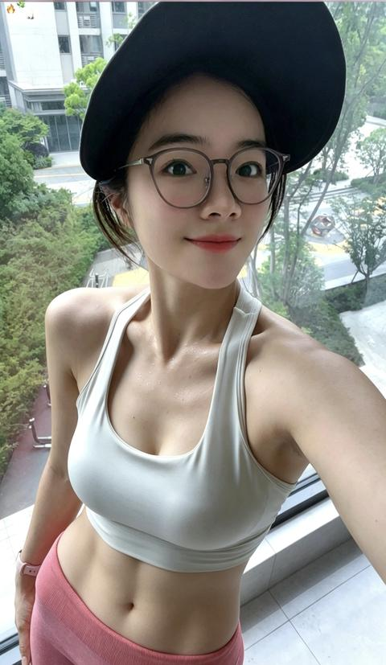
    - <a href="https://www.zhihu.com/people/jin-tong-xue-51-86">金同学</a> (<small title="北京">2026-7-8 22:8:57</small>): 真不错啊，没有一点赘肉。还有腹肌［赞］［赞］
    - <a href="https://www.zhihu.com/people/zhen-xi-gan-ren">爱在公园前</a> (<small title="回复于 2026-7-9 15:54:38/广东"> ✉️:一颗西兰花</small>): 几天瘦几斤，难道是卖减肥药？［捂脸］
    - **一颗西兰花** (<small title="回复于 2026-7-9 22:11:45/江苏"> ✉️:爱在公园前</small>): 自己看日期，我一周4次10公里，加游泳，和饮食控制，一个多月瘦10斤左右，也算快？
64. <a href="https://www.zhihu.com/people/ye-xue-xia-de-gu-ying">匿名1984</a> (<small title="广西">2026-7-5 12:38:26</small>): ［赞］［赞］
65. <a href="https://www.zhihu.com/people/ben-pao-de-lu-49-14">半生缘</a> (<small title="广东">2026-7-5 12:57:59</small>): 主要是年轻，看up应该年纪不大
66. <a href="https://www.zhihu.com/people/2-5-44-13-31">一般一般</a> (<small title="广西">2026-7-4 12:40:22</small>): 163有120斤？［赞］
    - <a href="https://www.zhihu.com/people/2-5-44-13-31">一般一般</a> (<small title="广西">2026-7-4 12:40:32</small>): 体型还这么瘦
67. <a href="https://www.zhihu.com/people/momo-63-61-90-74-67">momo</a> (<small title="河南">2026-7-4 11:6:48</small>): ママ［抱抱］
68. <a href="https://www.zhihu.com/people/jun-mo-xiao-yu-tian">君莫笑于天</a> (<small title="未知">2026-6-27 9:3:7</small>): ［赞］［赞］
69. <a href="https://www.zhihu.com/people/zxian-sheng-15-62">Z先生</a> (<small title="广东">2026-6-27 12:29:38</small>): 这身材看起来体脂率很平衡，日常体能肯定好好
    - <a href="https://www.zhihu.com/people/zxian-sheng-15-62">Z先生</a> (<small title="回复于 2026-6-27 20:21:32/广东"> ✉️:一颗西兰花</small>): 天啦噜，实在是精力充沛让人羡慕，我现在爬个山回去都得躺两天
    - **一颗西兰花** (<small title="江苏">2026-6-27 13:6:54</small>): 嗯！昨天9点半睡，今天5点起来跑了10公里，回来忙了一会工作，吃完晚饭，把家里大扫除了一下，花了1个半小时，结束之后去蛙泳2000米，然后回来做了两菜一汤，我朋友都说我是高精力人群，永远活力满满［思考］
70. <a href="https://www.zhihu.com/people/wkh4j8">天黑不闭眼</a> (<small title="上海">2026-7-25 19:18:31</small>): 好奇怪，这个帖子怎么不火呢？
71. <a href="https://www.zhihu.com/people/yisheng-he-qiu-2018">一生何求2018</a> (<small title="辽宁">2026-6-26 17:35:24</small>): 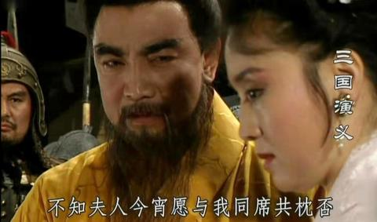
72. <a href="https://www.zhihu.com/people/xiao-ai-tong-xue-31-99">花神雅尔</a> (<small title="浙江">2026-8-11 12:50:55</small>): 瘦得不成样子［潜水］
73. <a href="https://www.zhihu.com/people/19-52-98-69">人随心走随遇而安</a> (<small title="吉林">2026-7-28 16:14:56</small>): 你有100斤嘛
    - **一颗西兰花** (<small title="江苏">2026-7-29 18:59:1</small>): 有的，就是体脂低163，103了现在，体脂率10［思考］ 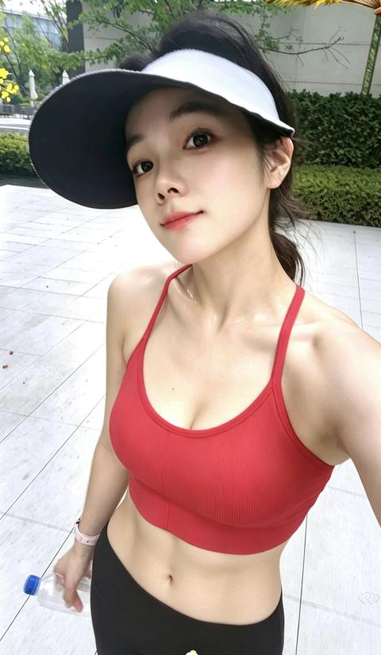
    - <a href="https://www.zhihu.com/people/19-52-98-69">人随心走随遇而安</a> (<small title="回复于 2026-7-29 19:33:3/吉林"> ✉️:一颗西兰花</small>): 一点都不像103斤，像是90斤
    - **一颗西兰花** (<small title="回复于 2026-7-29 19:35:26/江苏"> ✉️:人随心走随遇而安</small>): 体脂率低，我的体脂率18左右［思考］
    - <a href="https://www.zhihu.com/people/19-52-98-69">人随心走随遇而安</a> (<small title="回复于 2026-7-29 19:37:11/吉林"> ✉️:一颗西兰花</small>): 确实不高
74. <a href="https://www.zhihu.com/people/jia-zhuang-you-ming-zi-32-62">假装有名字</a> (<small title="山东">2026-7-25 10:24:13</small>): 16年毕业进工地，一群男的个个都大腹便便的，我那会衣服一脱，6块腹肌清晰可见
75. <a href="https://www.zhihu.com/people/86-90-84-29-70">洗耳恭听的神父</a> (<small title="广东">2026-5-12 15:31:34</small>): 确实不像
76. <a href="https://www.zhihu.com/people/zhu-ge-jian-guo-34">大林修泰姆</a> (<small title="江西">2026-7-23 0:10:21</small>): 一直有运动习惯，游泳，跑步，跑步，一周三四次，比较佛系［感谢］［感谢］［感谢］
77. <a href="https://www.zhihu.com/people/xiao-wei-92-76-89">晓一诺</a> (<small title="湖南">2026-7-21 15:35:43</small>): 身材一般，没肉
78. <a href="https://www.zhihu.com/people/jin-wo-zhe-fu-48-13">近我者富</a> (<small title="广东">2026-7-20 20:47:17</small>): 我喜欢
79. <a href="https://www.zhihu.com/people/dianelivs">dianelivs</a> (<small title="湖南">2026-7-20 16:27:47</small>): 挺好的呀
80. <a href="https://www.zhihu.com/people/kao-pan-zai-jian-96">考盘在涧</a> (<small title="天津">2026-7-18 10:3:33</small>): 好漂亮的腰！
    - **一颗西兰花** (<small title="江苏">2026-7-18 13:32:44</small>): 58公分［思考］ 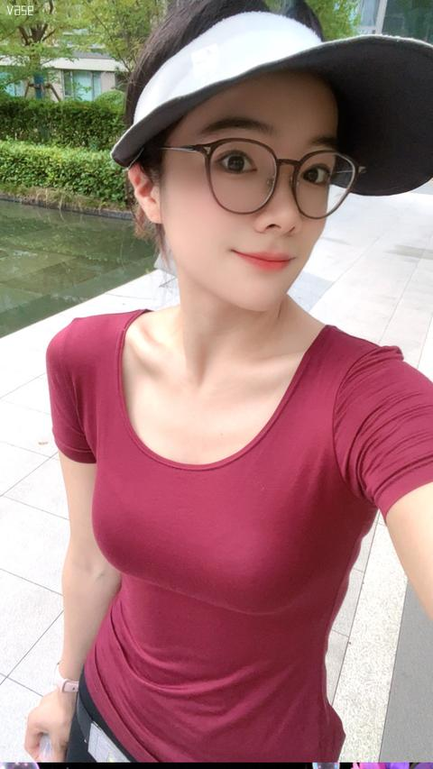
81. <a href="https://www.zhihu.com/people/zhong-yi-83-8-83">钟意</a> (<small title="山东">2026-7-9 9:0:14</small>): 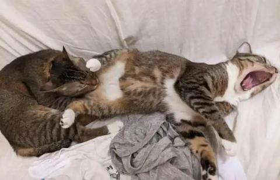
82. <a href="https://www.zhihu.com/people/xiao-shi-de-feng-shen">演员的自我修养</a> (<small title="河北">2026-6-27 13:13:14</small>): 啧啧啧，这马甲线，这精气神，太健康了。［捂脸］
83. <a href="https://www.zhihu.com/people/roubingbing">再见肉饼饼</a> (<small title="湖南">2026-6-27 15:6:34</small>): 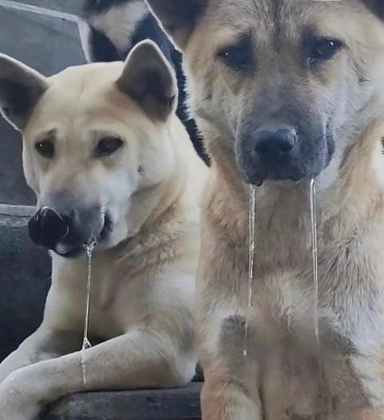
84. <a href="https://www.zhihu.com/people/cqo0nz">麯終朲</a> (<small title="北京">2026-8-15 14:40:26</small>): 真美女神
85. <a href="https://www.zhihu.com/people/i3rsn5">墨子</a> (<small title="广西">2026-6-26 21:3:34</small>): 我也觉得不象，结实型！
86. <a href="https://www.zhihu.com/people/xiao-shi-de-feng-shen">演员的自我修养</a> (<small title="河北">2026-6-26 14:18:14</small>): 皮肤真的这么白吗？正常女的120斤看起来已经很胖了。
    - **一颗西兰花** (<small title="江苏">2026-6-26 15:39:48</small>): 体脂率低，最近晒黑了，户外跑步，穿的多，太热，穿的少太晒我5点50开始跑，一个小时，女结束，还是被晒黑，今天拍的 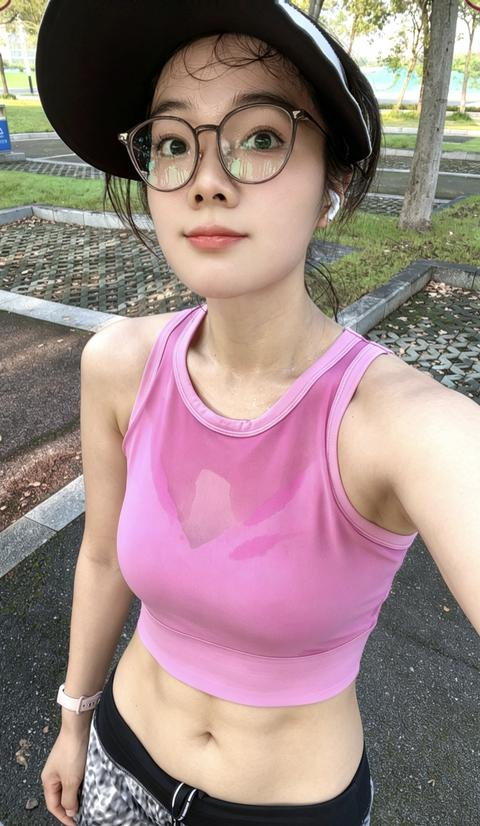
87. <a href="https://www.zhihu.com/people/da-fei-21-67-88">大飞</a> (<small title="浙江">2026-5-18 14:7:6</small>): 腿肯定粗
    - **一颗西兰花** (<small title="江苏">2026-5-19 10:23:10</small>): 算粗嘛？ 
    - <a href="https://www.zhihu.com/people/chang-ya-57">社畜小张</a> (<small title="回复于 2026-5-27 23:53:18/安徽"> ✉️:一颗西兰花</small>): 不是，姐妹，你真有120？
    - **一颗西兰花** (<small title="回复于 2026-5-28 12:14:56/江苏"> ✉️:社畜小张</small>): 真的，而且我腰围66，［捂脸］
    - <a href="https://www.zhihu.com/people/feng-ming-chu-ge-xing">萧楚</a> (<small title="回复于 2026-6-18 1:53:49/海南"> ✉️:一颗西兰花</small>): 100斤的身材［捂脸］
    - <a href="https://www.zhihu.com/people/da-fei-21-67-88">大飞</a> (<small title="回复于 2026-7-30 15:24:38/浙江"> ✉️:一颗西兰花</small>): 你最多110斤
    - **一颗西兰花** (<small title="回复于 2026-7-30 16:6:30/江苏"> ✉️:大飞</small>): 现在100斤了 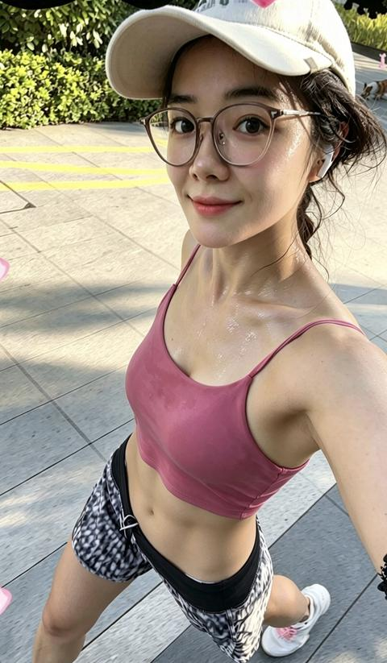
88. <a href="https://www.zhihu.com/people/loveever">天下</a> (<small title="北京">2026-6-23 10:3:31</small>): 这身材真不错［赞］，好看爱看
89. <a href="https://www.zhihu.com/people/zai-lu-shang-13-88-31">平安</a> (<small title="江苏">2026-6-23 16:43:20</small>): 排骨
    - **一颗西兰花** (<small title="江苏">2026-6-23 22:8:38</small>): 我不是排骨，［思考］
    - <a href="https://www.zhihu.com/people/zai-lu-shang-13-88-31">平安</a> (<small title="回复于 2026-6-23 22:24:16/江苏"> ✉️:一颗西兰花</small>): 看着像，哈哈
    - **一颗西兰花** (<small title="回复于 2026-6-23 22:25:14/江苏"> ✉️:平安</small>): 不算吧［捂脸］ 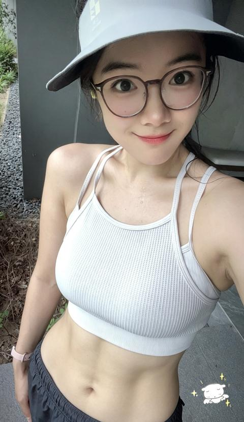
    - <a href="https://www.zhihu.com/people/zai-lu-shang-13-88-31">平安</a> (<small title="回复于 2026-6-24 5:57:8/江苏"> ✉️:一颗西兰花</small>): 两件内衣？
    - **一颗西兰花** (<small title="回复于 2026-6-24 7:56:16/江苏"> ✉️:平安</small>): 一件，就这种款式［捂脸］
90. <a href="https://www.zhihu.com/people/jian-jian-dan-dan-68-14-43">简简单单</a> (<small title="河北">2026-6-23 21:18:50</small>): 锁骨菩萨
    - <a href="https://www.zhihu.com/people/jian-jian-dan-dan-68-14-43">简简单单</a> (<small title="回复于 2026-6-27 21:56:27/河北"> ✉️:一颗西兰花</small>): 这个菩萨是男人的拯救者
    - **一颗西兰花** (<small title="江苏">2026-6-23 22:8:21</small>): 第一次听说这个菩萨［捂脸］
91. <a href="https://www.zhihu.com/people/18850309986">失眠已久</a> (<small title="湖北">2026-6-25 13:7:21</small>): 再养点肉 好吧［捂脸］
92. <a href="https://www.zhihu.com/people/71-38-68-69-49">一塔湖图</a> (<small title="北京">2026-6-25 7:4:43</small>): 长期运动导致体脂率低，浑身瘦肉，看着确实不胖，但架不住肌肉密度高……由此看来，女性的玲珑曲线，多数是靠脂肪来维持的。
    - **一颗西兰花** (<small title="江苏">2026-6-25 8:43:48</small>): 我的曲线还可以，天赋比较高，瘦的话也不熟胸和屁股，我三围93，63，94。今天早上跑完步拍的 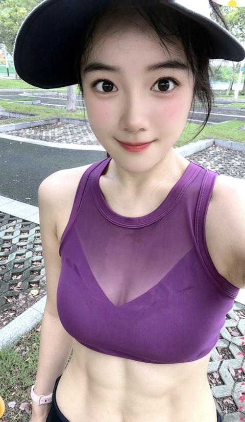
93. <a href="https://www.zhihu.com/people/1103964545">嫌春晚</a> (<small title="江苏">2026-6-25 13:38:36</small>): 看不出有这个体重［赞］能坚持健身的人都挺厉害
    - <a href="https://www.zhihu.com/people/startnow-42">startnow</a> (<small title="江苏">2026-6-27 16:32:15</small>): 不错的 身材很棒［赞］
94. <a href="https://www.zhihu.com/people/ren-wei-hao-56">大学老师爱健身S</a> (<small title="河北">2026-6-25 10:41:27</small>): 只跑步，不做力量训练么
95. <a href="https://www.zhihu.com/people/jiu-dai-yi-ren">久待伊人</a> (<small title="贵州">2026-6-25 1:9:5</small>): 太强了［感谢］
96. <a href="https://www.zhihu.com/people/shu-guang-nu-shen-zhi-kuan-shu-94">曙光女神之宽恕</a> (<small title="河北">2026-6-26 18:9:12</small>): 只看🐻的话，你说你不到100我也信
97. <a href="https://www.zhihu.com/people/75-75-74-1">日下见闻</a> (<small title="北京">2026-7-9 16:39:15</small>): 蛙泳2000m 55分钟？
 
请受菜鸡一拜［小情绪］［小情绪］
98. <a href="https://www.zhihu.com/people/88-37-17-48">ncjcjcncidbdjfbc</a> (<small title="湖北">2026-7-8 22:13:57</small>): 舔狗上，渣男，去撩
99. <a href="https://www.zhihu.com/people/nan-fang-21-3-91">往后还剩多少</a> (<small title="湖南">2026-7-14 19:20:57</small>): 就喜欢那种锻炼的女人，姿势随便摆

=[评论](./attachments/comments.json)

