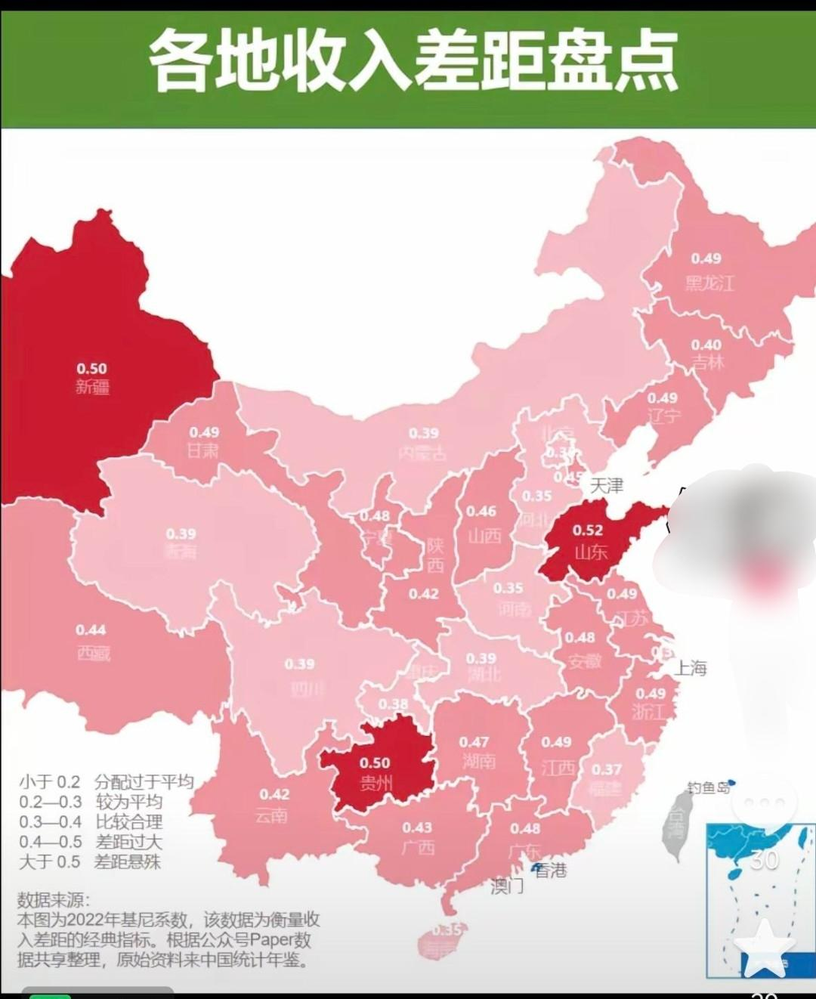
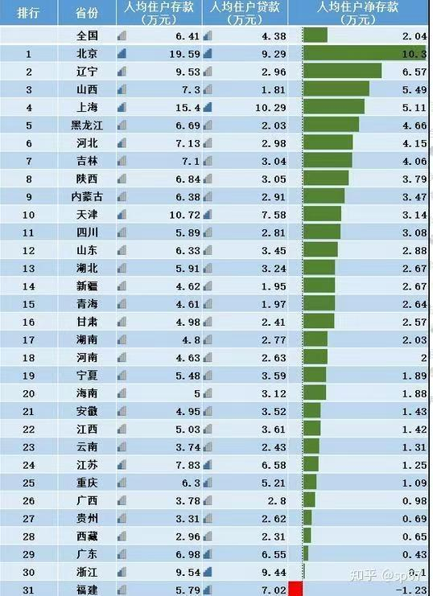
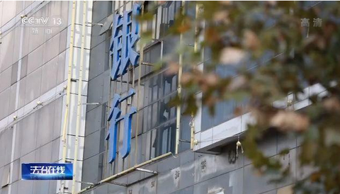

[toc]

# 问题

提问者：**<a href="https://www.zhihu.com/people/da-li-41-2">同道莫须道</a>**
提问时间: 2025-6-1 8:17:29
总回答数: 65
总访问量: 272964

这些年我们贫富差距到底是在变好还是在变好？

# 回答

回答者： **<a href="https://www.zhihu.com/people/chen-mo-de-xi-yang">三天打鱼两天晒网</a>**
回答时间: 2025-7-25 12:26:46
点赞总数: 272
评论总数: 103
收藏总数: 132
喜欢总数：15

2022统计局做过一次，后面因为种种原因就把它删掉了，只保留全国的基尼系数。

这张图也能证明北京人很富裕，浙江贫富差距不小。存款高，但是负债也高，证明一部分人的负债变成了另外一部分人的存款。

  

原文地址：[(三天打鱼两天晒网)我们的贫富差距是怎么样的？](https://www.zhihu.com/question/1912422477369414918/answer/1932054154701939717) 

# 评论

1. <a href="https://www.zhihu.com/people/yu-yun-cang-fei-58">st枫林听雨</a> (<small title="福建">2025-7-30 8:39:55</small>): 福建为啥是负的［惊喜］
   - <a href="https://www.zhihu.com/people/cai-yun-peng-27-63">Scanf</a> (<small title="贵州">2025-7-30 20:51:49</small>): 都撸到国外去啦
   - <a href="https://www.zhihu.com/people/ma-chi-wen-66">Domokun</a> (<small title="广东">2025-7-31 15:34:35</small>): 福建很多人以不会撸贷为耻你不知道吗
   - <a href="https://www.zhihu.com/people/yi-qi-hui-81">一起回</a> (<small title="宁夏">2025-7-31 15:58:16</small>): 我也想说［捂脸］
   - <a href="https://www.zhihu.com/people/liou-33">liou</a> (<small title="回复于 2025-7-31 16:56:13/上海"> ✉️:Domokun</small>): 果然思路不一样
   - <a href="https://www.zhihu.com/people/xia-er-90-46">夏尔</a> (<small title="福建">2025-7-31 21:0:44</small>): 周围人都在讨论盖新房，买新车，做什么赚钱？你家不会没动作？不去争口气？特别是下南洋，出省赚到钱，回家盖房，向街坊邻居炫耀［doge］
   - <a href="https://www.zhihu.com/people/jjgemshen-xian-da-jia">luana</a> (<small title="重庆">2025-7-31 22:42:50</small>): money长腿飞到国外了
2. <a href="https://www.zhihu.com/people/21-2-6-10">胡涂牛</a> (<small title="河北">2025-7-25 14:59:46</small>): “一部分人的负债变成了另外一部分人的存款”。
 
这句话合乎逻辑的推演就是：
 
当一部分人的债务链断裂时，
 
另一部分人的存款也将化为乌有［尴尬］
   - **三天打鱼两天晒网** (<small title="湖北">2025-7-25 15:59:11</small>): 不会，而是留下一个债务黑洞，全民承担。
   - <a href="https://www.zhihu.com/people/dong-feng-17-1">知乎用户3byogB</a> (<small title="北京">2025-7-30 10:25:30</small>): 这句话太扯了，有的人自己懒惰靠网贷度日，有的人辛辛苦苦工作，做生意靠自己挣的钱。他这说得好像负债都是别人带来的一样，实际上相当多的一部分人负债都是因为自己懒惰、赌博之类的造成的
   - <a href="https://www.zhihu.com/people/21-2-6-10">胡涂牛</a> (<small title="回复于 2025-7-30 10:38:2/河北"> ✉️:知乎用户3byogB</small>): 你说的的确有这样的例证。
 
但是，靠贷款（负债）来赌博似乎“难度挺大”。
 
另外，看许家印的2.48万亿债务窟窿（占全年GDP的+2%），有银行贷款，也有拖欠供货商的货款，还有烂尾楼购房者的预付款（交了钱，得不到房子）。
 
最终要堵上这个窟窿，要平摊给社会的。［尴尬］
   - <a href="https://www.zhihu.com/people/dong-feng-17-1">知乎用户3byogB</a> (<small title="回复于 2025-7-30 10:56:35/北京"> ✉️:胡涂牛</small>): 所以改变不了社会只能改变自己，或者直接润出去
   - <a href="https://www.zhihu.com/people/21-2-6-10">胡涂牛</a> (<small title="回复于 2025-7-31 11:59:40/河北"> ✉️:知乎用户3byogB</small>): “直接润出去”不是大家想象的那样滴。
 
现在即便是在大漂亮读到博士毕业，大部分人也留不下来。
 
不要问我为什么这么说。但我说的话肯定是真实的。［尴尬］［捂脸］
   - <a href="https://www.zhihu.com/people/aaaa-97-13-68">aaaa</a> (<small title="福建">2025-7-31 19:24:31</small>): 不会 捡起这些带血的筹码才能暴富 房价翻番的时候 富豪榜上前几名全是地产商
   - <a href="https://www.zhihu.com/people/lu-bo-wen-56-37">澜痕</a> (<small title="新疆">2025-7-31 21:5:44</small>): 你这逻辑推演并不是很符合实际，我在镇法庭干过，那个镇同时接收本镇和另外一个镇的诉状，其他诉状都得去县法院提交，
 
~~本镇看起来贫穷，但一年到头几乎没几个诉状，另外一个镇，开车过去一看就比本镇繁华，但诉状压倒性的多余本镇，而且好多被告，我去送诉状的时候，一看都是还不起那种，
 
~~这些人并没有导致另一部分收益人群的存款化为乌有，那个镇子一看就是献祭了相当多的镇子里的人民，才发展起来的［捂脸］
   - <a href="https://www.zhihu.com/people/otsptd">知乎用户OTSptd</a> (<small title="江西">2025-8-1 0:2:33</small>): 债务链断裂时，化为乌有的大致先后顺序是：普通股股权、优先股股权、永续债债权、二级资本债债权、无担保债权、优先无担保债权、担保债权、储蓄存款。一般情况下，威胁到储蓄存款很费劲［doge］
   - <a href="https://www.zhihu.com/people/21-2-6-10">胡涂牛</a> (<small title="回复于 2025-8-1 17:9:34/河北"> ✉️:知乎用户OTSptd</small>): 这事情还不是我主观想象，央视曾经报道过此事。
 
2022年，河南四家村镇银行发生无法取款的事件，涉及金额可能高达400亿元，叠加着“赋红码”。该事件隐匿持续时间长、涉及面广、受害人民群众众多，影响深远。
 

3. <a href="https://www.zhihu.com/people/8-57-21-9">吃瓜群众</a> (<small title="山东">2025-7-31 8:44:9</small>): 这图做的不好，0.48和0.49颜色差别不大，0.49到0.50就突然变红
   - <a href="https://www.zhihu.com/people/le-zheng-meng-yu">逐梦焚天</a> (<small title="江苏">2025-8-1 9:5:37</small>): 诶，这是给上面看的，就是不能突出，主打一个掩耳盗铃一眼看过去都差不多，实际上都很烂。［惊喜］
4. <a href="https://www.zhihu.com/people/hui-jin-31-10">灰烬</a> (<small title="福建">2025-7-30 13:31:46</small>): 福建就是个神奇的地方，比如福州，二线城市的工资水平，但是全国前十的房价水平，厦门也是全国前十房价水平。这负债不高就怪了
   - <a href="https://www.zhihu.com/people/bu-kai-xin-he-mei-tou-nao-85">做多中国</a> (<small title="上海">2025-7-31 8:36:26</small>): 全民炒房［大笑］
   - <a href="https://www.zhihu.com/people/qian-yun-sheng-33">Lucky Price</a> (<small title="江苏">2025-7-31 10:7:10</small>): 因为福建本地富人少，都是在外面赚钱回家买房，导致本地的打工人就很痛苦。
   - <a href="https://www.zhihu.com/people/hui-jin-31-10">灰烬</a> (<small title="回复于 2025-7-31 11:38:2/福建"> ✉️:Lucky Price</small>): 是这样，有路子的都出去赚钱，比在本地赚的多。赚几年回家花，花完了再出去赚，挺多这样的。
5. <a href="https://www.zhihu.com/people/da-li-41-2">同道莫须道</a> (<small title="山东">2025-7-25 15:16:53</small>): 山东是差距最大的有点出乎意料。以为发达地区会大一些
   - <a href="https://www.zhihu.com/people/tian-ya-he-chu-wu-fang-cao-28">熊孩子们</a> (<small title="广东">2025-7-28 13:26:41</small>): 山东就是发达地区
   - <a href="https://www.zhihu.com/people/da-li-41-2">同道莫须道</a> (<small title="回复于 2025-7-28 14:13:8/山东"> ✉️:熊孩子们</small>): 我真没意识到原来也是
   - <a href="https://www.zhihu.com/people/nam-19-58">NAM</a> (<small title="山东">2025-7-31 7:20:37</small>): 山东西边是内陆中原地区，东边是东部沿海地区，屁股想也知道差距会很大，实际上胶东人也基于经济因素歧视鲁西南，鲁西南人会大量到胶东打工
   - <a href="https://www.zhihu.com/people/da-li-41-2">同道莫须道</a> (<small title="回复于 2025-7-31 8:51:2/山东"> ✉️:NAM</small>): 真没想到你屁股还能思考
   - <a href="https://www.zhihu.com/people/franz-josef-i">Franz Josef I</a> (<small title="回复于 2025-7-31 9:1:52/重庆"> ✉️:NAM</small>): 我比较同意，2015年在山东读了4年书，烟台青岛那一块沿海真的挺发达，呆着很舒服，然后内陆就济南那一块不错，不过夏天真的难受，我感觉有钱人还是很多的，不过看起来比较低调，看起来不富。我现在每年都回烟台威海玩，真的好爽［捂脸］
   - <a href="https://www.zhihu.com/people/franz-josef-i">Franz Josef I</a> (<small title="重庆">2025-7-31 9:4:18</small>): 个人感觉哈，差距挺大的，体制内，国企都比较有钱，然后私企仗着山东是教育大省狠狠压榨，人才多的是，4年前研究生给5000都给的出［大笑］
   - <a href="https://www.zhihu.com/people/litost">Litost</a> (<small title="贵州">2025-7-31 10:24:15</small>): 胶东半岛和苏南都是全国县级市最密集的地方，当然苏南人口流入更多
   - <a href="https://www.zhihu.com/people/xiao-qiao-liu-shui-ren-jia-28-32">宾夕法尼亚熊猫</a> (<small title="回复于 2025-7-31 13:27:39/山东"> ✉️:Franz Josef I</small>): 现在3500了［白眼］
   - <a href="https://www.zhihu.com/people/kong-yong-jun-51">plasma</a> (<small title="回复于 2025-7-31 14:15:14/山东"> ✉️:NAM</small>): 扯犊子，胶东外来务工人口主要是潍坊银、东百银和沂蒙山区人
   - <a href="https://www.zhihu.com/people/franz-josef-i">Franz Josef I</a> (<small title="回复于 2025-7-31 15:22:55/重庆"> ✉️:宾夕法尼亚熊猫</small>): ［捂脸］别太夸张了，应该不至于。山东沿海还是很发达的
   - <a href="https://www.zhihu.com/people/jin-ji-de-mi-gua-bao">空想</a> (<small title="回复于 2025-7-31 17:52:14/上海"> ✉️:Franz Josef I</small>): 山东工业很厉害的，只是没啥名气，有钱人当然多
   - <a href="https://www.zhihu.com/people/xiao-qiao-liu-shui-ren-jia-28-32">宾夕法尼亚熊猫</a> (<small title="回复于 2025-7-31 21:43:36/山东"> ✉️:Franz Josef I</small>): 没有，自己来看，内陆地区就这价格。胶东高，其他地方一般般，尤其是四线城市和小县城。大城市还好点，小城市不好评价。
   - <a href="https://www.zhihu.com/people/franz-josef-i">Franz Josef I</a> (<small title="回复于 2025-8-1 9:34:5/重庆"> ✉️:宾夕法尼亚熊猫</small>): ［思考］这么一说有可能，当时我同学是聊城的，他们那里工资是稍微低一点，没办法，山东人才太多了，而且不太愿意出远门，当时研究生在北京上海能拿7000多，留在聊城就只能拿5000了
   - <a href="https://www.zhihu.com/people/47-33-91-50-89">坎瑞亚</a> (<small title="回复于 2025-8-1 10:14:50/北京"> ✉️:Franz Josef I</small>): 北上涨的这点也覆盖不了房租啊，还是聊城高
6. <a href="https://www.zhihu.com/people/qing-chun-zheng-dang-nian-34">埋木舍闲人</a> (<small title="河南">2025-7-31 18:25:1</small>): 河南河北属于普遍贫穷这一档的
   - <a href="https://www.zhihu.com/people/ge-li-hua-de">格里华德</a> (<small title="河北">2025-8-1 10:4:20</small>): 穷的很平等［捂脸］
7. <a href="https://www.zhihu.com/people/jiang-yi-86-60">冇耶</a> (<small title="广东">2025-7-31 22:0:18</small>): 北方这人均存款，不愧是比南方先工业化的old money，南方内陆省份还是土里刨食太久了兜里都没俩子［可怜］［可怜］
   - <a href="https://www.zhihu.com/people/forget-80-55">圆蛤好市民</a> (<small title="河北">2025-8-1 9:50:12</small>): 北方有些地区早年重工业太多污染严重，很多人存钱是为了防病的［捂脸］［捂脸］［捂脸］
8. <a href="https://www.zhihu.com/people/guo-jun-wei-27-11">鹰目婲盗</a> (<small title="辽宁">2025-7-31 17:58:43</small>): 人均没啥用啊，有用的看不到啊
9. <a href="https://www.zhihu.com/people/uiv30427h">uiv30427h</a> (<small title="辽宁">2025-7-31 12:13:23</small>): 而福建……都在建设海外园区［doge］
10. <a href="https://www.zhihu.com/people/18-54-64-98">不第剑仙</a> (<small title="山东">2025-7-31 17:22:37</small>): 本质是资源分配出了问题。一边是产能过剩，一边却是很多中国学生的宿舍没有空调；一边是出口创汇，一边却是外国人拿着美元就能跑来轻松收割中国人的劳动成果，还美其名曰“免签旅游促进经济”。
11. <a href="https://www.zhihu.com/people/mai-liao-ge-meng-mei-zi">买了个萌妹子</a> (<small title="新疆">2025-7-25 12:43:52</small>): 福建负的1.23w？［发呆］
    - <a href="https://www.zhihu.com/people/49-47-19-75">仙人指鹿</a> (<small title="福建">2025-7-31 11:26:38</small>): 福建全民贷款
12. <a href="https://www.zhihu.com/people/hong-hong-huo-huo-36-61">红红火火</a> (<small title="四川">2025-7-31 20:49:56</small>): 福建的应该是给妈祖交的保护费
13. <a href="https://www.zhihu.com/people/1-58-38-13-54">史麦戈</a> (<small title="福建">2025-7-31 16:25:12</small>): ［大哭］在B站上看到两个大学生，一个靠卖家里给他的房子有一千多万现金，一个有四千多万现金，这些人到底为什么这么有钱啊
14. <a href="https://www.zhihu.com/people/liangxiao_wing">南宫朔丶</a> (<small title="福建">2025-7-31 11:50:49</small>): 藏富于民，藏富于民，贷款越高，存款越高［doge］
15. <a href="https://www.zhihu.com/people/guo-jun-wei-27-11">鹰目婲盗</a> (<small title="辽宁">2025-7-31 17:58:43</small>): 人均没啥用啊，有用的看不到啊
16. <a href="https://www.zhihu.com/people/18-54-64-98">不第剑仙</a> (<small title="山东">2025-7-31 17:22:37</small>): 本质是资源分配出了问题。一边是产能过剩，一边却是很多中国学生的宿舍没有空调；一边是出口创汇，一边却是外国人拿着美元就能跑来轻松收割中国人的劳动成果，还美其名曰“免签旅游促进经济”。
17. <a href="https://www.zhihu.com/people/47-33-91-50-89">坎瑞亚</a> (<small title="北京">2025-8-1 10:17:58</small>): 京津沪存款高和新疆差距大挺符合印象的
18. <a href="https://www.zhihu.com/people/zhang-hai-tao-54-86">眼冷心热</a> (<small title="安徽">2025-8-1 9:48:3</small>): 人均住户净存款只算到了国内银行存款，没算到国外银行存款和藏在家中动辄以亿计的现金。
19. <a href="https://www.zhihu.com/people/deng-zhou-ye-guo-guo">myada</a> (<small title="吉林">2025-7-31 20:46:54</small>): 人均p用都没有
20. <a href="https://www.zhihu.com/people/68-11-94-75">弥敦道</a> (<small title="广东">2025-8-1 10:22:8</small>): 国际普遍认为超过0.45社会秩序基本会崩溃，所以我们到底是有多能忍，如此大的贫富差距还撑了这么多年。
21. <a href="https://www.zhihu.com/people/xian-xing-rnkb">线形RNKB</a> (<small title="福建">2025-8-1 0:30:12</small>): 好家伙存款负数［飙泪笑］［飙泪笑］［飙泪笑］
22. <a href="https://www.zhihu.com/people/li-gong-zhuo-63">李子明</a> (<small title="浙江">2025-8-1 9:22:47</small>): 好图存了，都说我们浙江藏富于民，其实也不过是表面光鲜罢了［飙泪笑］，
23. <a href="https://www.zhihu.com/people/ai-chou-qiong-5">空白</a> (<small title="广东">2025-7-31 23:21:39</small>): 福建贷款很猛
24. <a href="https://www.zhihu.com/people/wai-xing-ren-83-51">外星人</a> (<small title="浙江">2025-8-1 8:16:41</small>): 长见识了，居然还有分配过于平均的说法
25. <a href="https://www.zhihu.com/people/seojinan">止夜</a> (<small title="山东">2025-7-31 16:58:9</small>): 山东确实富 GDP老二开玩笑呢 不过钱都在国企某些人手里 我们这些P民穷的不行
26. <a href="https://www.zhihu.com/people/yi-ming-41-54-28">汉字151</a> (<small title="内蒙古">2025-7-31 18:46:23</small>): 西北确实是这样，比如甘肃临夏，同样是县里的msl，画风看着差不多，但有的就一穷二白，出去开拉面馆都没本钱，还有的是巨富，各种豪车大院，也不知道他们是干啥的，问说是卖茶的［捂脸］
27. <a href="https://www.zhihu.com/people/qing-freedom">Qing Freedom</a> (<small title="陕西">2025-7-31 18:33:43</small>): 山西这么有钱吗？我怎么没有？［飙泪笑］
28. <a href="https://www.zhihu.com/people/hu-lu-xie-zhen">啊六舅</a> (<small title="甘肃">2025-7-31 21:16:10</small>): 完全不信河北这么平均
    - <a href="https://www.zhihu.com/people/forget-80-55">圆蛤好市民</a> (<small title="河北">2025-8-1 9:52:9</small>): 我来告诉你为什么平均，看到旁边红红的天津了没，很多河北本地有钱的都落户那里了［捂脸］［捂脸］［捂脸］
29. <a href="https://www.zhihu.com/people/yi-qi-hui-81">一起回</a> (<small title="宁夏">2025-7-31 16:2:31</small>): 新疆为什么差距这么大啊？生产建设兵团都在那，怎么差距还是这么大？
    - <a href="https://www.zhihu.com/people/dyjzzy">dyjzzy</a> (<small title="吉林">2025-8-1 1:37:9</small>): 估计是下限过低，有些地方比山区还难，山区至少不缺水，地方大，可用土地又少，生态移民都不行
30. <a href="https://www.zhihu.com/people/ahui-45-10">广东飞天蟑螂</a> (<small title="浙江">2025-7-31 23:46:59</small>): 这图好啊，知道没钱上哪取了［飙泪笑］
31. <a href="https://www.zhihu.com/people/1899123">知乎拥户</a> (<small title="广东">2025-7-31 19:19:44</small>): 这种数据现在已经是机密了吧［滑稽］
32. <a href="https://www.zhihu.com/people/materialer">天输部队先寇布</a> (<small title="福建">2025-7-31 18:21:8</small>): 这下超过平均线了
33. <a href="https://www.zhihu.com/people/yaxuan2024-5">知乎用户Swvcwg</a> (<small title="江西">2025-7-31 10:8:40</small>): 我去，什么叫做 爱拼才会赢［机智］
34. <a href="https://www.zhihu.com/people/suo-nian-jie-xing-chen-35">CelestialPromise</a> (<small title="江苏">2025-7-31 13:44:28</small>): 图二那张表还算符合平常印象，图一那张图大概率是和稀泥瞎报数据。
35. <a href="https://www.zhihu.com/people/feng-xu-he-qi">一天吃三顿</a> (<small title="重庆">2025-7-31 11:52:36</small>): 考公大省，原来如此
36. <a href="https://www.zhihu.com/people/wang-lin-70-26-16">北屿南寒</a> (<small title="上海">2025-7-31 9:35:0</small>): 山东、贵州、新疆差距这么大吗？这么离谱？
    - <a href="https://www.zhihu.com/people/mu-yan-wen-45">暮色</a> (<small title="贵州">2025-7-31 15:6:40</small>): 我家里面是在镇上做装修的，接触的农村的和县城的都有，这么和你说吧，在一个县城相隔不到三公里的两个寨子，有的人可以富的家里院子放三四俩豪车（哥们是个山炮，看着是奔驰和奥迪之类的车子），穷的人家在2024年家里的家电就只有老旧冰箱，加一个电饭锅一个电磁炉，一个很老很老的洗衣机，好像还有一个用来把玉米粒磨成粉的机器（我忘了叫啥了），一个一层的小平房五间屋子也确实放不了多少家具（四个小房间大概3X3左右吧，一个大所谓的堂屋，面积大约是两个小房间的大小吧）
    - <a href="https://www.zhihu.com/people/mu-yan-wen-45">暮色</a> (<small title="回复于 2025-7-31 15:11:27/贵州"> ✉️:暮色</small>): 和我爸聊过，像上文那种穷的，家里面都是没啥收入的，一年种点地加上喂点牲口啥的不算劳力钱，去掉饲料啥的能有个一两万吧（两万那是比较理想的情况了），咱们取中位数一万五，一个月也就一千五左右，他家里有多少人我不太清楚，按咱们这边的情况来看，估摸着不小于四口人，年轻的估计出去打工了
    - <a href="https://www.zhihu.com/people/a-sao-81">雨凡</a> (<small title="回复于 2025-7-31 15:14:26/江苏"> ✉️:暮色</small>): 亲戚在黔东南有一个水管厂，去过2次，真的看到过你描述的那种情况，有的人家穷的令人发指，有的人家富的也令人咂舌
    - <a href="https://www.zhihu.com/people/bu-shi-shui-ning-cheng-de-bing">劉易寧</a> (<small title="贵州">2025-8-1 7:45:39</small>): 城乡差距很大
    - <a href="https://www.zhihu.com/people/47-33-91-50-89">坎瑞亚</a> (<small title="北京">2025-8-1 10:19:49</small>): 乌市物价赶超北上深，但是南疆县城人均收入不到两千
37. <a href="https://www.zhihu.com/people/thomasguo666">Thomasguo666</a> (<small title="湖南">2025-7-31 16:32:15</small>): 上海是全国最低的？
38. <a href="https://www.zhihu.com/people/huang-can-69-49">好色之徒</a> (<small title="广东">2025-7-31 14:25:18</small>): 国内统计的数据有啥好信的。
    - <a href="https://www.zhihu.com/people/dawn-80-36-9">白日梦</a> (<small title="四川">2025-7-31 21:47:33</small>): 你不信统计局的数据那也没啥可信的机构了［doge］
    - <a href="https://www.zhihu.com/people/17-58-16-38">中国人得站起来</a> (<small title="回复于 2025-7-31 23:58:42/陕西"> ✉️:白日梦</small>): 看人家IP就知道，不切实际。广东沿海地区都是包租公，内陆地区还它么吃饭上学都困难
39. <a href="https://www.zhihu.com/people/founter-zzz">料青山如是</a> (<small title="山东">2025-7-31 15:38:23</small>): 系数差距大没那么可怕，差距小的地方意味着一直没希望。同理，存款高贷款却很低，也没啥希望，子女跑路了
40. <a href="https://www.zhihu.com/people/yuan-xi-52-10">袁玺</a> (<small title="重庆">2025-7-31 11:54:19</small>): 这个表怎么算的啊？有详细解释吗？  
 
  
 
像我和我妈妈这种，存款很少但是买了几十万理财产品的，算什么呢
    - <a href="https://www.zhihu.com/people/li-jia-tao-41">莪葙</a> (<small title="浙江">2025-7-31 12:53:9</small>): 这种统计本来就不可能准确，浙江福建广东都是负债，难道比内陆省份还穷？更有可能是都拿去买房了，财富变成固定资产了。
41. <a href="https://www.zhihu.com/people/pai-da-xing-46-27-77">派大星</a> (<small title="山东">2025-7-31 11:33:9</small>): 浙江做的真好诶
42. <a href="https://www.zhihu.com/people/tao-an-meng-yi-40">陶庵梦忆</a> (<small title="福建">2025-7-31 8:35:44</small>): 我就是福建的，我全家净存款200万［大笑］［大笑］［大笑］
    - <a href="https://www.zhihu.com/people/yaxuan2024-5">知乎用户Swvcwg</a> (<small title="江西">2025-7-31 10:9:24</small>): 牛［机智］
    - <a href="https://www.zhihu.com/people/28-39-13-39">不知道</a> (<small title="福建">2025-7-31 11:57:31</small>): 几个人，一个人不错，四个以内算平均水平。。
    - <a href="https://www.zhihu.com/people/tao-an-meng-yi-40">陶庵梦忆</a> (<small title="回复于 2025-7-31 12:50:45/福建"> ✉️:不知道</small>): 两个成年人，加一个小孩［大笑］［大笑］［大笑］
43. <a href="https://www.zhihu.com/people/bin-zhi-ti-kong">缤智提空</a> (<small title="山东">2025-7-30 22:1:13</small>): 河南低是因为体制内待遇低，山东高是因为体制内待遇高。
44. <a href="https://www.zhihu.com/people/he-hong-93-26">知乎用户</a> (<small title="北京">2025-7-31 11:28:35</small>): 福建为什么人均存款是负的［捂脸］
    - <a href="https://www.zhihu.com/people/28-39-13-39">不知道</a> (<small title="福建">2025-7-31 11:56:24</small>): 炒房。。
45. <a href="https://www.zhihu.com/people/bei-ye-75-63">liberty</a> (<small title="浙江">2025-7-31 8:56:42</small>): 在看看现在网上官媒，00后存款超过30w占比超过百分之十［飙泪笑］
46. <a href="https://www.zhihu.com/people/ling-che-piao-yi-12-56">玉树飘樱</a> (<small title="山东">2025-7-31 1:10:22</small>): 山东好红［捂脸］
47. <a href="https://www.zhihu.com/people/autocad-18">AUTOCAD</a> (<small title="广东">2025-7-31 0:12:36</small>): 抖音人均百万，小红书人均千万［思考］
48. <a href="https://www.zhihu.com/people/yi-xie-11-81">一叶</a> (<small title="贵州">2025-7-30 18:56:25</small>): 贫富差距好大
49. <a href="https://www.zhihu.com/people/cmcc-84">cmcc</a> (<small title="江苏">2025-7-31 6:15:31</small>): 福建 存款在国外， 贷款在国内
50. <a href="https://www.zhihu.com/people/83-55-73-83-39">第四个号</a> (<small title="浙江">2025-7-31 1:46:59</small>): 和体制内工资待遇成正比
51. <a href="https://www.zhihu.com/people/jie-jie-49-54-23">YALEI</a> (<small title="福建">2025-7-30 22:28:59</small>): 为什么福建居然是负的
    - <a href="https://www.zhihu.com/people/han-lu-wei-shuang-56">寒露为霜</a> (<small title="辽宁">2025-7-31 7:30:23</small>): 全家撸贷款，然后全家走线跑路了去美帝

=[评论](./attachments/comments.json)

