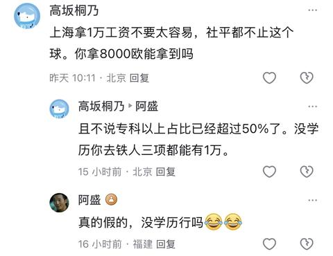

[toc]

# 问题

提问者：**<a href="https://www.zhihu.com/people/77-83-26-54-81">沉默的大壮</a>**
提问时间: 2025-11-7 23:37:35
总回答数: 280
总访问量: 2498091

面对这些似曾相识的困境，你有什么看法吗？

# 回答

回答者： **<a href="https://www.zhihu.com/people/this-time-52">上杉家主</a>**
回答时间: 2026-8-4 10:30:45
点赞总数: 2190
评论总数: 166
收藏总数: 1354
喜欢总数：116

这几年最贵的幻觉，就是以为咬牙熬过这一阵，日子便会自动回到从前。

  

房价会重新涨。

  

工作会重新好找。

  

学历会重新值钱。

  

生意会重新回到遍地机会的年代。

  

于是很多人一边骂环境，一边死守旧剧本，像个已经错过末班车的人，还站在原地研究车票为什么涨价。

  

读『以日为鉴』最难受的地方，就在这里。

  

它把日本过去30多年的日子摊开给你看：一个社会从高速增长滑下来以后，最先破碎的往往不是银行大楼，也不是新闻里的经济数据。

  

先碎掉的，是普通人对未来的想象。

  

年轻人突然发现，父母教给自己的那条路失灵了。

  

好好读书，考上大学，进入大公司，干到退休，买房结婚，安稳过完一生。

  

这套人生说明书，上一代用着挺顺，轮到下一代，开机就报错。

  

『以日为鉴：衰退时代生存指南』由分析师Boden撰写。作者有多年外资投行分析经验，书里没有把日本经济写成一堆冷冰冰的GDP曲线，而是把失业潮、大学生就业、学历贬值、考公热、少子化、教师过剩、医疗改革和老龄社会，拆进一个个普通人的命运里。

  

这本书真正让人背后发凉的一句话，可以总结成：

  

时代收账的时候，从来不会先问你努不努力。

  

日本泡沫最疯狂的时候，东京地价一路飙升，企业扩张，银行放贷，年轻人大学还没毕业，就有公司抢着送礼、请吃饭、安排旅游。

  

那时候的人也觉得好日子会一直持续。

  

他们相信土地永远涨，企业永远扩大，工资永远增加。

  

和所有泡沫里的普通人一样，他们把短暂的红利，当成了个人能力。

  

一个人站在电梯里往上升，很容易误以为是自己长高了。

  

等电梯突然下坠，他才发现，腿还是那两条腿。

  

泡沫破裂以后，日本企业手里堆满债务，银行背着坏账，政府面临一个很残酷的选择：

  

到底保谁？

  

保已经在企业里工作多年的中年员工，还是给刚毕业的年轻人留位置？

  

中年人有房贷、有家庭、有孩子。

  

他们一旦大规模失业，房贷可能断供，银行坏账继续爆炸，整个社会会更加混乱。

  

年轻人看起来负担少，还能回家啃几年父母。

  

于是很多企业冻结招聘，减少正式岗位，增加派遣工、合同工和临时工。

  

账面上的失业率被压住了，代价却悄悄塞进了一代年轻人的命里。

  

书中把这群人称作『就业冰河世代』。

  

他们没有犯什么大错。

  

只是出生晚了几年，毕业时刚好赶上门关上。

  

书中引用的数据很扎眼：从1993年前后开始，日本大学生就业率一路下滑，10年间由约85%降到约55%。那一代大学毕业生经过几十年，依然是平均收入偏低的群体之一。

  

很多人看到这种故事，喜欢说一句：

  

『机会不好，就先找份普通工作，以后再跳。』

  

问题在于，人的职业轨迹有惯性。

  

一个年轻人毕业后进入正规公司，会接受培训，接触项目，积累人脉，工资随着经验上升。

  

另一个年轻人进入便利店、临时岗位或劳务派遣，企业舍不得培养他，他也很难接触核心工作。

  

5年以后，两个人差的已经不止一份工资。

  

差的是技能、履历、自信和被下一家公司看见的资格。

  

社会后来恢复了，他却回不去了。

  

这就是『以日为鉴』最残酷的地方。

  

宏观经济里的一个临时决定，落在普通人身上，可能就是整整一生。

  

政策文件写的是『稳定就业』。

  

年轻人收到的翻译却是：

  

『你这一届，先委屈一下。』

  

可这一委屈，委屈了30年。

  

更恶心的事情还在后面。

  

等这些年轻人迟迟没有进入稳定职业，社会并不会承认他们被时代卡住了。

  

社会开始骂他们不努力。

  

『现在的年轻人不能吃苦。』

  

『频繁跳槽，没有忠诚度。』

  

『都30多岁了，为什么还没成家？』

  

『整天打零工，肯定是自己能力不行。』

  

先把一个人的梯子抽走，再站在楼上问他为什么爬不上来。

  

这套操作，熟练得让人想骂娘。

  

当然，时代有责任，也不等于个人从此什么都不用做。

  

把一切失败都甩给大环境，同样是一种舒服的自杀。

  

环境确实烂，日子还得自己过。

  

海水涨了，骂海没有错，骂完得赶紧学游泳。

  

书里让我印象很深的第二件事，是学历贬值。

  

经济高速增长时，社会需要大量管理人员、技术人员和专业人才。

  

大学扩招，研究生扩招，学历成为普通人改变命运的一张门票。

  

大家看见前面的人靠读书翻了身，马上挤进同一条路。

  

人一多，门票就开始贬值。

  

本科不够，读硕士。

  

硕士不够，读博士。

  

专业不好，再考一个证。

  

工作难找，继续留在学校。

  

许多人嘴上说提升自己，心里其实是在推迟进入就业市场。

  

学校成了经济寒冬里的候车室。

  

问题是，候车室里人越来越多，车并没有增加。

  

『以日为鉴』专门梳理了日本学历贬值和硕博扩招的历史，也追问了一个今天很多家庭都绕不开的问题：当学历供应持续增长，产业又无法提供足够的高水平岗位，多读几年书到底是在增加筹码，还是在延迟面对现实？

  

学历当然有价值。

  

可它只能证明一个人接受过某种训练，不能自动兑换成好工作。

  

现在很多家庭对学历的迷信，已经接近烧香拜佛。

  

孩子不知道喜欢什么，也不知道行业需要什么，家长只会喊：

  

『再读一个吧。』

  

仿佛硕士两个字贴在脑门上，企业就得跪着发录用通知。

  

读书真正危险的时刻，是一个人拿学历躲避选择。

  

他没有形成能解决实际问题的能力，却越来越舍不得放下『高学历人才』的身份。

  

普通工作不愿做，高端岗位进不去。

  

最后悬在半空，脚下没地，嘴上还得维持体面。

  

我学过法律，也熟悉心理学，更喜欢中国传统文化。

  

这些东西都很有用。

  

可知识一旦无法进入现实，就容易变成精致的装饰品。

  

懂100个心理学概念，仍然处理不好一次冲突。

  

背得出法律条文，遇到利益却连证据都不会保存。

  

读过很多经典，别人说句不中听的话，脸马上黑得像锅底。

  

这种学问，多少有点漏风。

  

书里还写到了日本的考公热。

  

经济增长放缓，企业工资停滞，裁员风险上升，年轻人自然会涌向稳定岗位。

  

公务员、教师、医生，慢慢变成父母眼里的安全岛。

  

大家都在海里扑腾，看见岛就往上爬。

  

可岛的面积有限。

  

上岛的人一多，考试越来越卷，培训机构先发财，年轻人则把最有精力的几年耗在一次又一次备考里。

  

考公本身没有问题。

  

真正危险的是，一个社会只剩下对稳定的崇拜。

  

最聪明、最有活力的一批年轻人，全在研究怎样进入一个风险最低的位置。

  

没人愿意冒险。

  

没人敢创业。

  

没人愿意进入刚起步的新行业。

  

最后整个社会看起来井然有序，里面却慢慢失去生长能力。

  

大家都在争抢船舱里最稳的座位，没人去看船往哪个方向开。

  

日本当年为了保住既有企业和岗位，也容忍了一批效率低、长期依赖银行与政策支持的企业继续生存。

  

这些企业没有立刻倒闭，社会避免了短期剧烈失业。

  

代价是资金、人才和资源被旧系统占住，新产业拿不到足够养分。

  

该死的企业死不了，该长的企业长不大。

  

表面稳定，内部缺氧。

  

这事放在个人身上也成立。

  

有些工作早已没有成长空间，工资也多年不涨，人却因为害怕风险不敢离开。

  

每天上班像服刑，下班靠短视频麻醉。

  

一边厌恶，一边依赖。

  

时间久了，工作没有保住他，工作只是慢慢吃掉了他重新选择的能力。

  

我在丽江经营6家客栈，对经济周期的感受很直接。

  

旺季的时候，房间满，电话不断，人会产生一种错觉：生意本来就应该这样。

  

于是有人扩店、装修、借钱，把旺季收入当成全年常态。

  

淡季一到，客流往下掉，固定成本却一分不少。

  

房租要交，工资要发，平台抽成照扣。

  

原来那些看着很漂亮的规模，突然变成一群张嘴吃饭的祖宗。

  

经济好的时候，扩张会掩盖很多问题。

  

服务粗糙没关系，反正有客人。

  

管理混乱没关系，反正还能赚钱。

  

等增长停下来，裸泳的人全出来了。

  

『以日为鉴』让我重新理解了一个词：衰退。

  

衰退并不意味着所有人一起变穷。

  

它更像一场漫长的筛选。

  

有现金的人，能等。

  

负债高的人，先慌。

  

有真本事的人，还能换赛道。

  

只靠平台和风口的人，很快失去方向。

  

年轻人失去机会，中年人害怕失业，老人又掌握着大量财富和社会资源。

  

整个社会越来越谨慎，也越来越僵。

  

我做过视频号直播，见过流量突然涌来时的热闹。

  

屏幕上的数字一涨，人很容易觉得自己已经摸到了规律。

  

可平台规则一变，观众兴趣一换，昨天有效的方法，今天可能连个水花都没有。

  

任何依赖外部红利的成功，都得留一只眼睛看退路。

  

掌声可以听，别拿来当氧气。

  

这本书还反复谈到少子化。

  

孩子越来越少，听上去像每个孩子能得到更多资源。

  

现实没这么简单。

  

学校数量、教师岗位、儿科医疗、住房需求、地方财政，都会跟着人口结构变化。

  

曾经看起来稳定的职业，也可能因为服务对象减少而重新洗牌。

  

教师今天很稳定，10年后某些地区可能连学生都凑不齐。

  

医生需求可能依然庞大，但医保支付、医院财政和医生培养数量，又会重新决定收入和工作强度。

  

职业选择最怕只看今天。

  

父母觉得某个行业稳，就让孩子往里钻。

  

等孩子读完几年，市场早换了一副脸。

  

书里对教师、医生、公务员等职业的讨论很有价值，因为它把所谓『铁饭碗』拆开给你看。

  

饭碗是不是铁的，要看谁在付钱，有多少人需要这项服务，财政能不能长期承担。

  

世界上没有永远安全的职业。

  

只有能不断适应的人。

  

我从2015年开始抽烟，2024年戒掉。

  

后来回头看，烟瘾最厉害的地方，是它会把依赖包装成稳定。

  

每天在固定时间点上一根，感觉生活有秩序，心也能安静几分钟。

  

实际上，那份安静正是烟瘾先制造焦躁，再赏给我的一点缓解。

  

很多所谓稳定工作也有类似味道。

  

它先让人失去外部竞争力，再用每个月固定到账的工资安慰他。

  

等哪天系统真的发生变化，他才发现自己早已离不开那根烟。

  

读『以日为鉴』也不能走到另一个极端。

  

日本不等于中国。

  

两国的人口规模、发展阶段、产业结构、政策空间和技术环境都有差异。

  

拿日本过去发生的事，直接宣布中国未来也会一模一样，属于拿后视镜当导航。

  

这本书提供的是镜子，不是预言书。

  

镜子能帮你看清脸上哪里脏了，不能替你决定明天往哪走。

  

作者的叙述很有冲击力，也带着鲜明观点。

  

有些因果关系值得继续核对，有些结论可能简化了复杂历史。

  

读它最好的姿势，既别把作者当神，也别因为不喜欢某个结论就把整面镜子砸了。

  

书里最有价值的东西，是那些被时代拐弯甩出去的普通人。

  

就业冰河期的大学生。

  

返乡以后找不到位置的年轻人。

  

学历越来越高，工资却没有跟着涨的人。

  

在大企业里熬到中年，突然发现技能早已过期的人。

  

他们提醒我们，人生规划不能建立在『一切会照旧』上。

  

2026年，我人在杭州一座寺庙里禅修。

  

寺庙的生活很慢，凌晨起床，吃饭，打坐，扫地。

  

外面的经济周期、流量算法、房价涨跌，在禅堂里暂时安静下来。

  

可修行不会替人付房贷，也不会替人做职业选择。

  

真正有用的清醒，是看见变化以后，仍然愿意处理现实。

  

少负一点不必要的债。

  

留出能撑过低谷的现金。

  

别把所有收入压在同一个平台。

  

培养一种离开现有公司仍然有人愿意付钱的能力。

  

别为了面子维持早已失效的生活。

  

更别把父母那个年代的成功路线，原封不动地塞给孩子。

  

普通人对抗时代，靠不了豪言壮语。

  

靠的是手里有余粮，身上有本事，脑子里少一点幻想。

  

『以日为鉴』真正想说的，大概就是：

  

高速增长时，很多错误会被红利遮住。

  

潮水退下去，选择的代价才开始显形。

  

你无法决定时代什么时候转弯。

  

你能决定的是，转弯那天，自己手里握着技能、现金和选择权，还是只握着一句『以前一直都这样』。

  

历史最阴险的地方，从来不是重复。

  

是它换了一身衣服回来时，大多数人还在笑别人眼熟。

  

原文地址：[(上杉家主)有人看过《以日为鉴》吗？](https://www.zhihu.com/question/1970273698889052512/answer/2067920408830022457) 

# 评论

1. <a href="https://www.zhihu.com/people/lao-shu-1">老叔</a> (<small title="北京">2026-8-4 11:9:46</small>): 能达到日本的程度，就不错了
   - <a href="https://www.zhihu.com/people/87-87-63-54-8">桑墟十三年</a> (<small title="甘肃">2026-8-4 18:23:16</small>): 过十年人均生活水平就差不多了，日本现在普通人的生活水平也比不过8090年代的日本
   - <a href="https://www.zhihu.com/people/shan-he-45-54">river</a> (<small title="回复于 2026-8-4 21:34:1/上海"> ✉️:桑墟十三年</small>): 国内近十年，普通人的收入就几乎没有上涨了，相对通胀甚至还在降低。 各种底层岗位时薪在下降，工作时长在上升。近5年内，政府的财政收入就停止增长了，哪怕是严查加税，各种罚款。  
 
这种真金白银的收入数据才是经济的基本面。  
 
这十年，实际的人均收入和生活水平就是停滞状态。
   - <a href="https://www.zhihu.com/people/guai-qi-za-huo-pu">怪奇杂货铺</a> (<small title="回复于 2026-8-4 23:14:29/北京"> ✉️:桑墟十三年</small>): 说句不爱听的，论社会发展程度的综合差距，三十年是有的
   - <a href="https://www.zhihu.com/people/a-zhe-28-49-72">赛博幽灵</a> (<small title="回复于 2026-8-4 23:32:43/湖北"> ✉️:桑墟十三年</small>): 你觉得未来十年生活水平会不断上升？
   - <a href="https://www.zhihu.com/people/tai-shu-ming-zhu">太叔明珠</a> (<small title="安徽">2026-8-5 8:32:20</small>): 国内虽然不能涨，但是日本自己会退［doge］
   - <a href="https://www.zhihu.com/people/lao-shu-1">老叔</a> (<small title="回复于 2026-8-5 11:15:20/北京"> ✉️:桑墟十三年</small>): 上半句是建立在我国在进步，日本在持续退步的推测，下半句不全面，日本收入预期和暴富的机会确实不如泡沫经济，但衣食住行并没有变差。而且有兜底的社会福利。
   - <a href="https://www.zhihu.com/people/wu-you-cheng-4-46">吴有成</a> (<small title="湖北">2026-8-6 12:8:46</small>): 日本太聪明，把泡沫炸掉，用30年换永远无泡沫，印度还不及当年日本富裕就迎来泡沫怕是…
   - <a href="https://www.zhihu.com/people/wu-you-cheng-4-46">吴有成</a> (<small title="回复于 2026-8-6 12:9:38/湖北"> ✉️:老叔</small>): 1989年日本已经是发达国家中非常富裕的经济体
   - <a href="https://www.zhihu.com/people/zi-chuan-35-31">子川</a> (<small title="回复于 2026-8-6 16:19:22/浙江"> ✉️:桑墟十三年</small>): 按以前的高速发展才行，但现在是衰退周期
   - <a href="https://www.zhihu.com/people/niu-niu-niu-85-37">牛牛Niu</a> (<small title="山西">2026-8-6 16:52:47</small>): 按日本的下降速度，还真有可能
   - <a href="https://www.zhihu.com/people/86-17-4-56-20">水平</a> (<small title="广东">2026-8-7 7:6:21</small>): 日本现在忍不住了，正在积极备战。形势所迫，只能孤注一掷。
   - <a href="https://www.zhihu.com/people/5-75-8-8-32">黑色月亮</a> (<small title="回复于 2026-8-7 23:39:7/美国"> ✉️:桑墟十三年</small>): 2026年 普通人3000工资。2016年普通人工资也是3000［吃瓜］
   - <a href="https://www.zhihu.com/people/jian-dian-7">检点</a> (<small title="回复于 2026-8-9 4:55:32/贵州"> ✉️:黑色月亮</small>): 我这个ip的小县城零几年我妈就有三千工资了，我现在本科毕业估计也只能找到四五千块钱
   - <a href="https://www.zhihu.com/people/5-75-8-8-32">黑色月亮</a> (<small title="回复于 2026-8-9 5:10:15/美国"> ✉️:检点</small>): 我老家福州长乐。 我和我老婆2015年刚刚认识的时候。她在眼镜店上班2800的工资。 后面2020年结婚的时候3200工资［吃瓜］。 最搞笑的是。结婚以后我让她赶紧辞职。 然后她老板重新请人 还是2800的工资
   - <a href="https://www.zhihu.com/people/18-88-44-21">夏天的风</a> (<small title="回复于 2026-8-10 21:36:15/湖北"> ✉️:river</small>): 你这是混过社会的，上面那个感觉还在上学
2. <a href="https://www.zhihu.com/people/zhu-zhi-qi-85-2">ZACKVII</a> (<small title="广东">2026-8-4 18:36:42</small>): 想多了，拿啥和日本比，我们巅峰的时候有企业请毕业生没入职先旅游吗？［doge］［飙泪笑］
   - <a href="https://www.zhihu.com/people/teng-hao-nan-79">巴啦啦克</a> (<small title="重庆">2026-8-5 7:27:3</small>): 土木有的
   - <a href="https://www.zhihu.com/people/das-67-60">das</a> (<small title="中国香港">2026-8-5 7:58:40</small>): 有的，缅甸［doge］
   - <a href="https://www.zhihu.com/people/meng-xi-66-64">实名用户</a> (<small title="回复于 2026-8-5 10:16:2/北京"> ✉️:巴啦啦克</small>): 经典开局是吧［doge］
   - <a href="https://www.zhihu.com/people/salinagu">S二姐说</a> (<small title="中国香港">2026-8-5 10:19:57</small>): 2001年我入职广东一个台资厂，一进来就听说提前入职的那一批公司包车去深圳旅游去了。。。
   - <a href="https://www.zhihu.com/people/zhu-zhi-qi-85-2">ZACKVII</a> (<small title="回复于 2026-8-5 13:34:3/广东"> ✉️:巴啦啦克</small>): 经典五星酒店开局［doge］
   - <a href="https://www.zhihu.com/people/aki-32-49">aki</a> (<small title="回复于 2026-8-5 17:33:39/广东"> ✉️:das</small>): 而且还是终身游是吧？［飙泪笑］
   - <a href="https://www.zhihu.com/people/gao-shou-gao-gao-shou-29">高手高高手</a> (<small title="回复于 2026-8-6 10:20:29/北京"> ✉️:das</small>): 肉包子打狗
   - <a href="https://www.zhihu.com/people/18-5-80-17-8">齐夏</a> (<small title="四川">2026-8-9 11:19:45</small>): 想当年土木老哥挂科躺寝室里打游戏，都有中字头企业来招聘。等我前两年毕业的时候，劳务公司都没得招了
3. <a href="https://www.zhihu.com/people/ru-nan-43-66">汝南</a> (<small title="广西">2026-8-5 5:30:26</small>): 日本在国际上位置是g7 g7是冷战战胜国，本身一国就超除了柏林墙以东欧亚大陆的gdp还要吃冷战红利。日本资本无论是去美国投资还是去欧亚大陆投资各地都是踊跃欢迎。日本财阀老巢在日本。财阀少爷小姐是要回日本继承家业。这种情况下日企在海外赚了钱是要反哺日本本土的。这就是所谓海外日本。只是这些海外日本在统计学上gdp统计在当地。这才支撑起日本经济停滞二三十年［思考］ 如果一个国家有钱人出国就是财产转移。企业对外投资就是洗钱。少爷小姐出国唯一正事就是把家族钱存到瑞士银行。企业稍微正经搞点投资就被当地人反感喊打喊杀。奴隶劳动。再不就是收归国有。请问怎么以日为镜。这和日本是一个状态吗？［思考］
   - <a href="https://www.zhihu.com/people/xie-zi-jia-22">叶子佳</a> (<small title="湖北">2026-8-5 13:25:32</small>): 只得一声叹息
   - <a href="https://www.zhihu.com/people/johnson-31-58-56">Johnson</a> (<small title="中国澳门">2026-8-6 9:45:48</small>): 這年頭有點小錢的人都是用鼻孔看人 不過都是效績主義養出來的
   - <a href="https://www.zhihu.com/people/cang-lang-36-26">苍狼</a> (<small title="内蒙古">2026-8-6 16:32:22</small>): ［赞］［赞］［赞］精辟
4. <a href="https://www.zhihu.com/people/von-13-19">太二</a> (<small title="江苏">2026-8-4 16:23:53</small>): 普通人没有什么选择的办法 最多就是节俭一些，不要负债，然后就老老实实躺平了，失去30只是因为日本现在只过了30年，马上就是40年、50年。普通人在设计上就不可能熬过寒冬，最多体面点
   - <a href="https://www.zhihu.com/people/aop-aop">AOPAOP</a> (<small title="天津">2026-8-5 17:47:49</small>): 可能不是，之所以是三十年，是因为房贷是30年，所有人债务出清了，可能敢消费了，资产又能炒一炒了，这也是我从别处看到的观点。
   - <a href="https://www.zhihu.com/people/lan-de-li-15">励精图治朱由检</a> (<small title="回复于 2026-8-5 18:30:10/山东"> ✉️:AOPAOP</small>): 经历过这种30年已经没人愿意消费了，这个观念会改变很多人［doge］
   - <a href="https://www.zhihu.com/people/aop-aop">AOPAOP</a> (<small title="回复于 2026-8-5 18:51:52/天津"> ✉️:励精图治朱由检</small>): 不见得，我在知乎已经看到很多年轻人说不理解为啥要搭上自己一辈子买房了，人的观念TMD改变的太快了。
   - <a href="https://www.zhihu.com/people/lan-de-li-15">励精图治朱由检</a> (<small title="回复于 2026-8-5 18:55:30/山东"> ✉️:AOPAOP</small>): 房子这个除了结婚根本不是硬性条件，所以现在结婚率、生育率一再下降，但是消费除了个人的，像以前贷款消费是很少了，毕竟未来都在降本增效，除非体制内稳定的另说。
   - <a href="https://www.zhihu.com/people/65-75-8-59-65">八角楼上</a> (<small title="回复于 2026-8-7 14:44:58/河北"> ✉️:励精图治朱由检</small>): 要不说看日本，而不是根据国内目前臆想。
   - <a href="https://www.zhihu.com/people/rex-56-37">rex</a> (<small title="重庆">2026-8-7 18:6:6</small>): 要度过超老龄社会，也就是说，老龄化比重要降低回25%以内才行。韩国也会有停滞的30年的，这是人口结构决定的。
   - <a href="https://www.zhihu.com/people/18-88-44-21">夏天的风</a> (<small title="湖北">2026-8-10 21:39:57</small>): 现在日经指数已经到90年代了，还衰落呢［思考］
5. <a href="https://www.zhihu.com/people/zniqgns5">贻昌之父</a> (<small title="上海">2026-8-4 14:49:18</small>): 有没有可能，我们和日本不一样［酷］
   - <a href="https://www.zhihu.com/people/he-he-53-93">momo</a> (<small title="广东">2026-8-4 18:25:27</small>): 日本只能是日本，中国的上限不好说，作为盘盘，我认为至少是亚洲霸主［捂脸］
   - <a href="https://www.zhihu.com/people/a-chao-wan-ju-dian">猫杀鸡</a> (<small title="回复于 2026-8-4 20:27:50/河南"> ✉️:momo</small>): 但是普通人的下限也不好说，整体未来非常光明是真的，落实到个体那就一言难尽也是真的
   - <a href="https://www.zhihu.com/people/he-he-53-93">momo</a> (<small title="回复于 2026-8-4 21:33:53/广东"> ✉️:猫杀鸡</small>): 老实说……哪个地方的底层都不好过吧……不然成天堂了……不过，哎，我也不看好能真正改革分配制度就是了
   - <a href="https://www.zhihu.com/people/1234-65-11-73">1234</a> (<small title="回复于 2026-8-4 23:23:7/广东"> ✉️:momo</small>): 亚洲霸主连门口的岛礁都看不住？
   - <a href="https://www.zhihu.com/people/he-he-53-93">momo</a> (<small title="回复于 2026-8-4 23:44:50/广东"> ✉️:1234</small>): 我不说的是上限嘛？［捂嘴］
   - <a href="https://www.zhihu.com/people/1234-65-11-73">1234</a> (<small title="回复于 2026-8-5 0:22:7/广东"> ✉️:momo</small>): 如果是真的，证明给我看［赞同］
   - <a href="https://www.zhihu.com/people/wang-yue-gang-99">此生难舍是非洲</a> (<small title="回复于 2026-8-5 0:46:27/江苏"> ✉️:momo</small>): 中国至少是非洲霸主。［酷］
   - <a href="https://www.zhihu.com/people/jin-xue-feng-1">金大大侠</a> (<small title="回复于 2026-8-5 8:12:43/江苏"> ✉️:momo</small>): 大概率是东北化，小概率朝鲜化，日本化过于乐观了
   - <a href="https://www.zhihu.com/people/liang-brian-38">风动心动</a> (<small title="回复于 2026-8-5 14:55:57/广东"> ✉️:金大大侠</small>): 泰国或马来化可能性大一些，这两个也是典型的未富先老，更早开始工业化但却留不住产业链和人才。
   - <a href="https://www.zhihu.com/people/jin-xue-feng-1">金大大侠</a> (<small title="回复于 2026-8-5 16:2:14/江苏"> ✉️:风动心动</small>): 差不多吧，产业转移是不可避免的，只能在大量流失之前尽可能升级一部分产业，保留一部分核心产业，未来还是要摸日本的石头
   - <a href="https://www.zhihu.com/people/aop-aop">AOPAOP</a> (<small title="回复于 2026-8-5 17:51:26/天津"> ✉️:momo</small>): 为啥别人犯过的错误我们还犯，很简单，因为都是一样的贪婪，而且犯错的人自己还不用承担后果，只享受贪婪带来的财富，坑以后由普通人填，所以才一样啊。
   - <a href="https://www.zhihu.com/people/hao-ming-zi-36-63">知乎用户</a> (<small title="回复于 2026-8-6 2:13:33/北京"> ✉️:金大大侠</small>): 智能化应该不会产业外流为会锁死其他第三国家的机会，其他第三国家的出路应该是子宫战
   - <a href="https://www.zhihu.com/people/jin-xue-feng-1">金大大侠</a> (<small title="回复于 2026-8-6 8:52:37/江苏"> ✉️:知乎用户</small>): 所谓智能化完全是自我安慰，你能智能化别人为什么不能智能化，连人力优势都没有了为什么要在你中国智能化
   - <a href="https://www.zhihu.com/people/fu-hua-shi-jie-de-le-zhang">今天也要元气满满</a> (<small title="回复于 2026-8-6 9:40:9/安徽"> ✉️:momo</small>): 笑［为难］
   - <a href="https://www.zhihu.com/people/wayne0942">ASAP</a> (<small title="回复于 2026-8-6 11:28:10/江苏"> ✉️:金大大侠</small>): 产业转移？就业不要保了吗？［捂脸］产业转移了，一大批工人往哪里赶？
   - <a href="https://www.zhihu.com/people/liang-brian-38">风动心动</a> (<small title="回复于 2026-8-6 12:1:54/广东"> ✉️:ASAP</small>): 印度欢迎你［doge］
   - <a href="https://www.zhihu.com/people/he-he-53-93">momo</a> (<small title="回复于 2026-8-6 14:7:33/广东"> ✉️:今天也要元气满满</small>): ［捂嘴］你怎么看？介意说说吗
   - <a href="https://www.zhihu.com/people/jin-xue-feng-1">金大大侠</a> (<small title="回复于 2026-8-6 14:9:13/江苏"> ✉️:ASAP</small>): 保就业保出了个2.8亿灵活就业人员，是喜欢灵活就业吗？是根本没的选，就好像产业转移一样，不是你喜欢产业转移，而是你根本没得选
   - <a href="https://www.zhihu.com/people/65-75-8-59-65">八角楼上</a> (<small title="回复于 2026-8-7 15:9:12/河北"> ✉️:ASAP</small>): 当年也没人管东北啊，你怎么觉得自己特殊呢
   - <a href="https://www.zhihu.com/people/ping-chang-xin-21-10-9">平常心</a> (<small title="广东">2026-8-7 18:0:8</small>): 我们不一样，不一样…我差点唱起来了。
   - <a href="https://www.zhihu.com/people/zniqgns5">贻昌之父</a> (<small title="回复于 2026-8-12 1:33:25/上海"> ✉️:ASAP</small>): 
   - <a href="https://www.zhihu.com/people/hussein-94-71">Hussein</a> (<small title="山东">2026-8-18 22:50:34</small>): 中国如果开发好内需市场的话，估计也不比美国差在哪，大国适合做消费国
   - <a href="https://www.zhihu.com/people/hussein-94-71">Hussein</a> (<small title="回复于 2026-8-18 23:0:34/山东"> ✉️:贻昌之父</small>): 北京上海，铁人三项一万还是能有的，就是累，但是更高就很难了
6. <a href="https://www.zhihu.com/people/shui-jue-ge-88-70">睡觉咯</a> (<small title="江西">2026-8-4 19:55:30</small>): ai生成的答案
   - <a href="https://www.zhihu.com/people/ansonbbm">濑文摩尔</a> (<small title="湖北">2026-8-5 9:56:24</small>): 语气用词都是ai味
   - <a href="https://www.zhihu.com/people/xlqdworld">LiQingdao</a> (<small title="回复于 2026-8-6 11:33:42/广东"> ✉️:濑文摩尔</small>): 甚至可以说一眼ds［捂脸］［捂脸］
7. <a href="https://www.zhihu.com/people/ai-qiang-cai-hui-ying">爱抢才会赢</a> (<small title="广东">2026-8-5 12:4:37</small>): 《以日为鉴》其实分析得很肤浅，所以从肤浅中得出来的感慨其实也很情绪化。  
 
要真以日为鉴，我们应该再读一些日本人自己公认的大衰退分析文章。比如《失去的二十年》池田信夫（经济学家），读《低欲望社会》大前研一，读 《工作漂流》稻泉连，读《日本的迷失》，《平成萧条》竹中平藏。  
 
读过这些，你会发现，幸福的家庭往往相似，而不幸的家庭各有各的不幸。  
 
现在的日本衰退从宏观上有借鉴，从微观上没有意义。  
 
还是要注重当下，好好生活，好好存钱，中国不是日本。
   - <a href="https://www.zhihu.com/people/112112-37">112112</a> (<small title="四川">2026-8-11 18:52:19</small>): 所以中国会怎样发展呢［思考］
8. <a href="https://www.zhihu.com/people/sun-shi-hao-29-63">老猴</a> (<small title="江苏">2026-8-4 17:25:43</small>): 这个是爽文来的 先射箭后画靶
9. <a href="https://www.zhihu.com/people/li-wan-jian">李键</a> (<small title="浙江">2026-8-5 3:10:56</small>): 这边进入深度老龄化社会的标志性事件就是小赢家们集体破防［吃瓜］
   - <a href="https://www.zhihu.com/people/rex-56-37">rex</a> (<small title="重庆">2026-8-7 18:7:24</small>): 我觉得就是老龄化的问题，因为老龄化了，社会就会走向收缩，这很正常。
10. <a href="https://www.zhihu.com/people/xiao-yan-smile-27">小燕smile</a> (<small title="甘肃">2026-8-5 11:23:29</small>): 兄弟，有这么多token多干点其他事，浪费在这上面可惜了
11. <a href="https://www.zhihu.com/people/peon">momo</a> (<small title="广东">2026-8-5 9:24:17</small>): 日本选保就业，中国选保生产
    - <a href="https://www.zhihu.com/people/18-88-44-21">夏天的风</a> (<small title="湖北">2026-8-10 21:41:11</small>): 选票以民为本
12. <a href="https://www.zhihu.com/people/zhao-yu-yan-33">Risu</a> (<small title="上海">2026-8-5 11:22:8</small>): ［捂脸］22年没买房真是这辈子目前最正确的决策
13. <a href="https://www.zhihu.com/people/xing-jin-26-7">星烬</a> (<small title="浙江">2026-8-4 15:6:1</small>): 日本现在真的恢复了吗？听说日本财政早晚要破产
    - <a href="https://www.zhihu.com/people/17-36-38-29">熵增时代</a> (<small title="辽宁">2026-8-4 15:43:0</small>): ［酷］说对了
    - <a href="https://www.zhihu.com/people/30-2-36-45">战神</a> (<small title="吉林">2026-8-4 23:1:13</small>): 政府不会破产，因为海外还有个日本，5大商社的利润还是源源不断回到日本，这些商社的员工过得很好
    - <a href="https://www.zhihu.com/people/momo-58-52-88-29">盾牌座UY</a> (<small title="上海">2026-8-5 11:37:24</small>): 早晚这话没意思，晚了别人噶了你就能活过来
    - <a href="https://www.zhihu.com/people/xie-zi-jia-22">叶子佳</a> (<small title="湖北">2026-8-5 13:26:16</small>): 我还听说美国马上就要完蛋了
    - <a href="https://www.zhihu.com/people/gfsyin-ta-miao">繁星</a> (<small title="河南">2026-8-7 23:3:59</small>): 今天看到的新闻，原奥运冠军去便利店偷东西（鸡蛋）
14. <a href="https://www.zhihu.com/people/zha-bi-xiao-xin-191311">自考贴士191311</a> (<small title="四川">2026-8-5 10:46:36</small>): “以史为鉴”这个词语出来多少年了。最大的意义就是毫无意义，别人走过的，还是照样走一遍。
15. <a href="https://www.zhihu.com/people/jing-yu-jing-yu-56">鲸鱼鲸鱼</a> (<small title="山西">2026-8-4 17:32:6</small>): 我们和日本在体制和规模上不一样，可以简单套用么？
    - <a href="https://www.zhihu.com/people/wu-wu-qi-70">兄弟你好香</a> (<small title="广东">2026-8-4 17:38:31</small>): 东亚三国根子上都一样的。
    - <a href="https://www.zhihu.com/people/31-76-67-67">哈士奇</a> (<small title="四川">2026-8-4 17:43:55</small>): 日本就是你们的未来
    - <a href="https://www.zhihu.com/people/ef5sha">漢官威仪</a> (<small title="江苏">2026-8-4 17:50:37</small>): 一步步全踩了一遍还能这么傲慢啊
    - <a href="https://www.zhihu.com/people/kuzijk">kuzijk</a> (<small title="广东">2026-8-4 18:4:17</small>): 体质和规模不一样，但是该踩的坑一个不落，甚至正因为我们的规模太大，后果也更严重［捂脸］，所以又有什么不一样的呢？
    - <a href="https://www.zhihu.com/people/zhu-zhi-qi-85-2">ZACKVII</a> (<small title="回复于 2026-8-4 18:36:29/广东"> ✉️:哈士奇</small>): 想多了，拿啥和日本比，我们巅峰的时候有企业请毕业生没入职先旅游吗？［doge］［飙泪笑］
    - <a href="https://www.zhihu.com/people/palladioreo">Palladioreo</a> (<small title="回复于 2026-8-4 20:56:59/山东"> ✉️:ZACKVII</small>): 以前倒是有请人来面试报销差旅费的，那时候以为是标配，不知道现在还有没有
    - <a href="https://www.zhihu.com/people/betty-35-58">闻着臭摸着刺挠</a> (<small title="回复于 2026-8-4 22:57:43/上海"> ✉️:ZACKVII</small>): 12，13年那会，同学去互联网，实习生开始就可以每天报销打车费，星巴克敞开了喝，年会都是去泰国的游艇开的。的确比不上日本当年，可是和今天比起来真的是［飙泪笑］
    - <a href="https://www.zhihu.com/people/30-2-36-45">战神</a> (<small title="回复于 2026-8-4 22:58:20/吉林"> ✉️:kuzijk</small>): 因为日本当年也救过股市，结果全部失败。
    - <a href="https://www.zhihu.com/people/37-49-94-7">光源</a> (<small title="江苏">2026-8-4 23:7:36</small>): 懂了。你的意思是体质和规格不一样。所以更惨。
    - <a href="https://www.zhihu.com/people/zniqgns5">贻昌之父</a> (<small title="回复于 2026-8-4 23:47:1/上海"> ✉️:战神</small>): 那这不就对上了，我们开始救股市了，现在看来成功的可能性很大［酷］
    - <a href="https://www.zhihu.com/people/zniqgns5">贻昌之父</a> (<small title="回复于 2026-8-4 23:52:36/上海"> ✉️:kuzijk</small>): 有没有可能我们规模太大，所以国家更耐造［酷］比如日本只有一亿人，发债到了gdp的230%就撑不住了。我们有14亿人，可以发债到gdp的2000%都能撑住
    - <a href="https://www.zhihu.com/people/kuzijk">kuzijk</a> (<small title="回复于 2026-8-5 10:33:39/广东"> ✉️:贻昌之父</small>): 等还钱出清的时候就老实了［捂脸］
    - <a href="https://www.zhihu.com/people/zhu-zhi-qi-85-2">ZACKVII</a> (<small title="回复于 2026-8-5 13:32:39/广东"> ✉️:Palladioreo</small>): 我刚陪对象从广东飞到上海面试［捂脸］一千多机票不报销［飙泪笑］
    - <a href="https://www.zhihu.com/people/31-76-67-67">哈士奇</a> (<small title="回复于 2026-8-5 15:9:49/四川"> ✉️:ZACKVII</small>): 有的，有个健身房开业招聘，集体带去缅甸旅游，一个也没回来
    - <a href="https://www.zhihu.com/people/jing-yu-jing-yu-56">鲸鱼鲸鱼</a> (<small title="回复于 2026-8-11 16:6:8/山西"> ✉️:光源</small>): 可能吧，可以类比苏联和朝鲜
16. <a href="https://www.zhihu.com/people/61-89-73-10">单机用户</a> (<small title="广西">2026-8-7 14:51:46</small>): 未富先老和富了才老是有区别的
17. <a href="https://www.zhihu.com/people/88-57-41-57-84">momo</a> (<small title="河南">2026-8-5 19:21:16</small>): 花有重开日，人无再少年。
18. <a href="https://www.zhihu.com/people/ruo-chi-25-32">若离</a> (<small title="山东">2026-8-4 17:21:18</small>): 我有生之年是看不到经济上行期了
19. <a href="https://www.zhihu.com/people/eric52004">eric520</a> (<small title="中国台湾">2026-8-5 23:59:10</small>): 公司不賺錢，你還能期待給出多少價碼呢?
20. <a href="https://www.zhihu.com/people/keenshu">Keen叔</a> (<small title="中国香港">2026-8-5 0:3:0</small>): 那几年派来上海的日本人，都是属于像我们派去非洲的感觉，但是，最后却是最幸运的人
21. <a href="https://www.zhihu.com/people/liu-si-rong-54">velvet</a> (<small title="广东">2026-8-4 16:33:44</small>): 理工科会和日本一样崩溃？
    - <a href="https://www.zhihu.com/people/wo-lao-po-wo-guan-de">我老婆我惯的</a> (<small title="江苏">2026-8-4 17:25:38</small>): 土木是文科吗？
    - <a href="https://www.zhihu.com/people/wang-chuan-qiu-shui-1-31">望穿秋水</a> (<small title="江苏">2026-8-4 21:5:46</small>): 已经崩溃了
    - <a href="https://www.zhihu.com/people/yan-nan-shu-79">雁南书</a> (<small title="河南">2026-8-4 21:9:12</small>): 推导的是：  
 
假如突破美国封锁，咱们走向世界，工业很可能会转移到东南亚，让东南亚国家培养廉价工程师来供给我们。这时候本土的工程师就显得太过昂贵，大部分会被辞退，留小部分负责和东南亚的工程师对接技术细节。  
 
假如没有突破美国封锁，那工业有不少概率会被压制，工程师的前景也不好看。
    - <a href="https://www.zhihu.com/people/betty-35-58">闻着臭摸着刺挠</a> (<small title="回复于 2026-8-4 22:58:36/上海"> ✉️:雁南书</small>): 如果走的是美国的剧本，那就是part2：斩杀线。
    - <a href="https://www.zhihu.com/people/liu-si-rong-54">velvet</a> (<small title="回复于 2026-8-5 0:19:8/广东"> ✉️:雁南书</small>): 兄弟说的对，我只是想到日本也是那会因为金融起飞了，所以一线工程师不愿意工作环境恶劣不如金融，所以才有理工科的崩溃，毕竟当年日本也是抓住了世界经济全球化的风口。［思考］
22. <a href="https://www.zhihu.com/people/hai-lang-37-32">海狼</a> (<small title="海南">2026-8-8 0:51:3</small>): 日本为啥会在高速增长的时候掉下来？如果没有广场协议，日元维持自己的态势，慢慢升值，按照自然的发展去进行经济和产业的转型，会出现后面的衰退吗？是因为强行踩了刹车，加上日本本土的应对失误，导致了后面资产衰退后不敢太多的试错，失去了2000年很多的新经济转型，互联网以及现在的AI。中国又不会被逼短时间升值一倍，而且敢于赌新产业新经济，所以中国的现在的民间经济衰弱和日本是有不一样的地方的！
23. <a href="https://www.zhihu.com/people/ce-hua-xiao-wu-long">策划小乌龙</a> (<small title="广东">2026-8-7 18:3:12</small>): 写得很好，不回避现实的困难，也不丧失前行的勇气。我们现在遇到的是前行中的坎，而不是崩溃的痛与无助，相信再过几年，就能翻过这道坎，重新成为世界经济增长的引擎！
24. <a href="https://www.zhihu.com/people/83-92-33-39">胖胖鱼</a> (<small title="湖南">2026-8-4 20:17:13</small>): 你怎么可以写这么多字
    - <a href="https://www.zhihu.com/people/piao-shui-liu-shan">你运气真好啊</a> (<small title="江苏">2026-8-4 21:28:29</small>): 一眼ai
25. <a href="https://www.zhihu.com/people/jia-zheng-chao-70">蜗牛不器</a> (<small title="山东">2026-8-5 11:10:35</small>): 宏观经济里的一个临时决定，落在普通人身上，可能就是整整一生。
26. <a href="https://www.zhihu.com/people/he-he-53-93">momo</a> (<small title="广东">2026-8-10 10:53:48</small>): 被删了［捂脸］没事，悠着点
27. <a href="https://www.zhihu.com/people/zhao-kuang-yin-16">洞明</a> (<small title="宁夏">2026-8-9 21:15:6</small>): 盘点日本考公热就得清楚日本考公热是怎么退潮的，因为企业实行了终身雇佣制，考不考都差不多，甚至因为鬼子发展好，便利店临时工收入也不错，支撑一个人完全没问题，他们甚至干两天挣得能撑好些天，国情不同，国内啥时候大规模普及双休都玄之又玄，当下最优解还是选个稳定的工作（文科生优先还是公，医，一个代表国家意志扎根基层，一个代表医学技术，理科生就深造技术去，尤其是能源这种更适合深造）最好不要负债（房贷车贷能不碰就不碰），保好自己的现金流，保住爹妈攒的一辈子血汗钱别梭哈婚姻，另一方面持续关注人民日报新闻，这东西是风向标，再去选一个新技术（也可能后续没来的及用就过时了，但是可以持续去筛选适合自己又属于朝阳行业的技术去学习，增加对冲未来不确定性的能力），君子藏器于身，待时而动，大白话就是猥琐发育别浪，负了债很难上岸，更别说其他［思考］
28. <a href="https://www.zhihu.com/people/bu-gan-gao-sheng-yu-27">青君不语</a> (<small title="广东">2026-8-9 17:25:22</small>): 那个年代还没有AI和机器人，现在有了
29. <a href="https://www.zhihu.com/people/dou-bi-yun">七玄门董大夫</a> (<small title="福建">2026-8-9 8:17:31</small>): 我们需要警惕的恰恰是日本都这样过来了，我们也一定可以。但要意识到的是会有一大批人都会是时代的炮灰，是你也可能是我。所以永远不要停止学习赚钱的本领，永远不要停下来。
30. <a href="https://www.zhihu.com/people/mu-rong-jue-chen-78">与世同尘</a> (<small title="河北">2026-8-8 1:48:34</small>): 豆包味溢出来了
31. <a href="https://www.zhihu.com/people/chen-yong-hua-52-80">腻明</a> (<small title="陕西">2026-8-7 21:49:50</small>): 人言洛阳花似锦，偏我来时不逢春［匿了］
32. <a href="https://www.zhihu.com/people/84-67-24-33-71">李傲阳</a> (<small title="江西">2026-8-6 22:55:37</small>): ai文［大笑］［思考］
33. <a href="https://www.zhihu.com/people/yan-shu-77-7">妍姝</a> (<small title="河南">2026-8-7 10:59:32</small>): 死守旧剧本
34. <a href="https://www.zhihu.com/people/podt">PodT</a> (<small title="福建">2026-8-7 9:47:30</small>): 肯定会好一点  
 
但不会再回到以前那种高速发展的时代了  
 
绝对  
 
绝对  
 
绝对不可能
35. <a href="https://www.zhihu.com/people/47-93-3-54-54">新时代三和大神</a> (<small title="广东">2026-8-7 9:38:25</small>): 重返泡沫时代：银行会倒闭，好好笑
36. <a href="https://www.zhihu.com/people/wei-xiao-9-34">萎笑</a> (<small title="美国">2026-8-7 0:6:51</small>): 看老电影，日本80年代别说和现在比，和90年代比都是破败很多的。科技比什么经济(市场占有率)对人类影响大得多
37. <a href="https://www.zhihu.com/people/Civanov">Nonk</a> (<small title="湖北">2026-8-11 15:54:15</small>): 我不是一个记忆力很好的人，更不是在过去二十年里一直盯着日本看的人，但以我仅剩的对日本的有限印象里，许多事情正在一步步印证和重复。大的影响不指望了，为自己做好准备吧
38. <a href="https://www.zhihu.com/people/wei-xiao-9-34">萎笑</a> (<small title="美国">2026-8-7 0:7:13</small>): 看老电影，日本80年代别说和现在比，和90年代比都是破败很多的。科技比什么经济(市场占有率)对人类影响大得多
39. <a href="https://www.zhihu.com/people/79-49-35-91">小甲鱼</a> (<small title="浙江">2026-8-6 16:59:46</small>): 螺旋式通缩，你就想像成自己在抽水马桶里面，抽水的时候自己能被冲走吗？
40. <a href="https://www.zhihu.com/people/xiao-qing-xu-23">叙川</a> (<small title="浙江">2026-8-6 15:26:5</small>): 浮木没了，搞个AI还刷这么长的屏。
41. <a href="https://www.zhihu.com/people/wo-lie-kai-liao-16-77">我裂开了</a> (<small title="安徽">2026-8-6 11:49:3</small>): 其实没法比，日本最起码发达过
42. <a href="https://www.zhihu.com/people/tian-bian-de-yun-63-4">天边的云</a> (<small title="四川">2026-8-6 8:5:49</small>): 说得好［赞］［赞］
43. <a href="https://www.zhihu.com/people/hui-shou-wu-chu-zhong">回首无初衷</a> (<small title="贵州">2026-8-6 11:6:28</small>): 说的很好。 存了
44. <a href="https://www.zhihu.com/people/stone-bit">沙耶博士</a> (<small title="北京">2026-8-6 13:47:36</small>): 一股豆包味儿
45. <a href="https://www.zhihu.com/people/wei-xin-yong-hu-28-88-35-26">微信用户</a> (<small title="山东">2026-8-5 11:12:16</small>): 不用那么委婉，他们和我们，过去现在将来基本是一样的。
46. <a href="https://www.zhihu.com/people/wa-ya-ya-46-99">Diver</a> (<small title="重庆">2026-8-5 11:10:18</small>): 如出一辙
47. <a href="https://www.zhihu.com/people/qu-liu-wu-yi-6-13">去留无意</a> (<small title="江苏">2026-8-10 16:11:5</small>): 评论区一堆搞笑的，明显是二战前的老美。经济衰退是正常的现象，衰退是繁荣的结果，繁荣是衰退的结果。老美也有1929大崩盘，布雷顿森林体系崩溃，互联网泡沫，次贷危机。
    - <a href="https://www.zhihu.com/people/112112-37">112112</a> (<small title="四川">2026-8-11 18:54:56</small>): 我也觉得和美国更像
48. <a href="https://www.zhihu.com/people/yao-yuan-de-meng-xiang">目极江天远</a> (<small title="新疆">2026-8-5 14:8:52</small>): 维持现在的生活就挺好
49. <a href="https://www.zhihu.com/people/wo-shi-xiao-xiao-xiao-shen-jing">希斯特利亚</a> (<small title="河南">2026-8-5 23:29:32</small>): 都去看哆啦A梦的视频，讲了好多次了
50. <a href="https://www.zhihu.com/people/beerlanger">Beerlanger</a> (<small title="广东">2026-8-5 11:53:48</small>): 所以人得保持活性，老话说树挪死，人挪活。房贷、车贷、生育就是把人的活性堵死了，劝诫各位还是不要轻易上了贼船。比如我想转行兽医，却为房、车、装修所困，待这些还完还得5年，5年以后又会是什么行情谁也不知道，可能又会有别的想法。  
 
奉劝奉劝，不要轻易地走入社会规训的一切。
51. <a href="https://www.zhihu.com/people/yang-54-70">Yang</a> (<small title="上海">2026-8-5 11:40:38</small>): 这并不是事实。对真正能接触到钱的人看来 体育明星的代言报价22年起就碾压各种流量明星了，体育明星很难暴雷 企业会算账
52. <a href="https://www.zhihu.com/people/80-77-26-95">知乎用户焱</a> (<small title="湖北">2026-8-5 15:25:34</small>): 以日为鉴里预测的很多现象都已出现了，比如大下岗，教师公务员裁员，学历贬值，永久性失业，银行为大规模发行货币大量购入黄金，失去的一代，家庭主妇炒外汇赚钱等等，是一本很好的预测教材，后面的现象会不会出现，我们拭目以待
    - <a href="https://www.zhihu.com/people/momo-81-3-79">momo</a> (<small title="广东">2026-8-5 19:45:27</small>): 预测啥啊，这本书显然是先找的中日共同点再写书，看个乐就行了［捂脸］
    - <a href="https://www.zhihu.com/people/80-77-26-95">知乎用户焱</a> (<small title="回复于 2026-8-5 23:40:10/湖北"> ✉️:momo</small>): 以史为鉴，懂吗
53. <a href="https://www.zhihu.com/people/17-95-94-64">西吴狂徒</a> (<small title="江苏">2026-8-4 19:51:20</small>): 房价不涨不是好事吗［生气］
    - <a href="https://www.zhihu.com/people/43-15-18-69">塞里斯喷子</a> (<small title="广东">2026-8-4 20:7:45</small>): ［酷］
54. <a href="https://www.zhihu.com/people/liu-wei-45-38-37">土豆神教</a> (<small title="上海">2026-8-5 9:58:54</small>): 整体认同感差远了，日本老爷和资本家可是真的在全球化中赚钱反哺本土的，反观。。。
55. <a href="https://www.zhihu.com/people/yuan-yi-86-51">ch2ch2</a> (<small title="安徽">2026-8-4 20:37:19</small>): 有没有一种可能，我们和日本真的不一样
56. <a href="https://www.zhihu.com/people/ihan-1">ihan</a> (<small title="天津">2026-8-5 13:8:9</small>): 咱们没有日本社会的稳定度，照搬不了。
57. <a href="https://www.zhihu.com/people/speed-20-60">秀秀秀</a> (<small title="浙江">2026-8-5 9:15:53</small>): 题主在讲核心，下面在说ai写的［好奇］用什么写的重要吗，都是人才关注点都在哪［惊喜］
58. <a href="https://www.zhihu.com/people/38-46-59-95-47">长野原快递员</a> (<small title="北京">2026-8-4 18:32:54</small>): 以日为鉴的话我直接买铠侠［思考］
59. <a href="https://www.zhihu.com/people/bu-zhi-dao-jiao-shi-yao-hao-77-20">烫烫烫</a> (<small title="江苏">2026-8-4 20:13:11</small>): 当时日本出国劳务情况如何［思考］有没有看过的讲一下
    - <a href="https://www.zhihu.com/people/30-36-11-58">大梦三千</a> (<small title="福建">2026-8-17 11:29:48</small>): 国民跟随企业大量出海，日企在全球投资，疯狂收购矿产、土地、企业
60. <a href="https://www.zhihu.com/people/zhang-pei-yuan-40">张萝卜</a> (<small title="广东">2026-8-4 20:13:8</small>): 下次可以把回车键少按一半。
61. <a href="https://www.zhihu.com/people/then-51">then</a> (<small title="贵州">2026-8-4 20:3:37</small>): 怎么感觉看过
62. <a href="https://www.zhihu.com/people/zui-ai-min-min-de-bao">最爱敏敏的宝</a> (<small title="重庆">2026-8-4 12:0:1</small>): 写得好啊  
 
  
 
人无远虑必有近忧
63. <a href="https://www.zhihu.com/people/trash-71-71-47">trash</a> (<small title="浙江">2026-8-6 10:54:44</small>): 换个好点的ai吧
64. <a href="https://www.zhihu.com/people/www-greta">wwwGreta</a> (<small title="北京">2026-8-5 12:33:34</small>): 现在的知乎文章只能看第一句，后面全是AI风格的幻觉［捂脸］
    - <a href="https://www.zhihu.com/people/momo-81-3-79">momo</a> (<small title="广东">2026-8-5 19:45:36</small>): 一股AI风
65. <a href="https://www.zhihu.com/people/qehing">QeHing</a> (<small title="广西">2026-8-5 10:16:48</small>): 一天到晚都是这些ai文章，什么时候知乎能出个内容含ai的判别，好直接跳过
66. <a href="https://www.zhihu.com/people/zergsu">ZergSu</a> (<small title="北京">2026-8-5 1:6:43</small>): 为啥ai生成的内容都会一空空一大行［飙泪笑］
67. <a href="https://www.zhihu.com/people/re-shui-shi-shi">rua一只美短</a> (<small title="陕西">2026-8-4 14:6:56</small>): 感觉ai里ai气的

=[评论](./attachments/comments.json)

