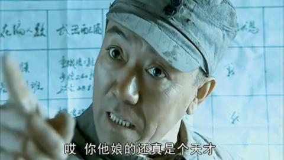

[toc]

# 问题

提问者：**<a href="https://www.zhihu.com/people/zhang-xin-nb">小鑫数学</a>**
提问时间: 2024-6-24 7:58:32
总回答数: 1182
总访问量: 39375870

现实里！那些人心安理得当个渣男，享受着对方的好不就行了吗？一旦对方提出要求就迅速切割，怎么会中美人计了？我不信有人会中美人计！

# 回答

回答者： **<a href="https://www.zhihu.com/people/mai-tian-quan-shou-wang-zhe">世人笑我泰峰巅</a>**
回答时间: 2026-1-27 18:8:37
点赞总数: 30484
评论总数: 610
收藏总数: 28440
喜欢总数：1820

失败的美人计:

曹操送了关羽十个美女，关羽连看都没看全送去给嫂子当丫鬟了。

成功的美人计：

古代有一小姐，遇到一个上京赶考的穷书生避雨，发现其很有才华后，掏出一些银两并以身相许。次日，小姐垂泪送书生：“君若高中莫负妾身。”书生发誓后，走了。小姐让丫环把书生的名字纪录在册，丫环说：“这已经是第五十个书生了！”小姐说：“没办法，总有一个会真的考上的”。

——《风投》

___

超长版后续：

丫环相信小姐的眼光，借口出去，半路上拦下书生，赠送了一些银两，并以身相许，事毕，回到住处，拿出名册，记下书生的名字，这是第46个了。

——《跟投》

书生让书童把一路上遇到的小姐们的名字一一记下，感叹说：这是第九十九个了啊！

——《融资》

一个老媒婆听闻，从几个员外手里凑了100两银子，分给了10个小姐。

——《母基金》

朝廷看不下去了，要求每一个小姐考《大家闺秀证书》，证明自己交往过的书生都是清清白白、有中举潜力的好书生。

——《基金从业资格考试》

这一天，书童忙跑进来。原来是京城有信来：各位儒生大才，今年科举规矩已改，接受过女眷资助的考生，披露之余要看看各位小姐的出身，如不是朝廷认定的大家闺秀，请退资后再来参考。

——《三类账户清理》

书童问书生：“公子，自从三年前你离家，如今已经睡了九十余名女子了。我们在各大赴京路上往复，难道就不去赶考了吗？”书生答:“赶考当大官不也是为了钱和女人吗？既得痴情女子九十有余，还赶着考啥”？

——《泡沫》

书生被公主看中，免于应试，直接招了驸马。 ——《上市》

书生招驸马后，无法兑现对之前九十多名女子的承诺，前期九十多名女子的投资将血本无归，全部输光。

——《P2P》

小姐得知书生发迹，知道前期投资已血本无归，逐上京击鼓鸣冤。

——《维权》

京城乱成一团，圣上得知后大怒，休掉书生，午门斩首。

——《退市》

书生被斩，众小姐血本无归，皇上为维稳将书生僵尸公司股份转由99名女子持有。

——《债转股》

圣上更换了主考官，主考官再度开科取士，小姐让丫鬟把名册取出，快马通知催促各书生赶考，却发现书生不在读书，纷纷居家搬迁到蛮夷瘴气之地。原来圣上要祈乐天下太平，主考官迎合上意，宣布蛮夷瘴气之地的书生直接金殿开卷，随到随考。为免赴京赶考且贡院排队三年之久，书生们纷纷掏出银两孝敬荒远之地的父母官，以求得一个落籍的机会。　　　

——《科考扶贫》

书生终于觉得书读的差不多了，砸锅卖铁星夜飞驰赴京赶考，途中突闻京城消息：因这么多年考中的书生太多，群众表示官员供养银两不足，为体恤民情，防止群体事件，主考官宣布暂停科考取士，何时恢复再议。书生和伴童捶胸顿足，小姐听闻，几欲上吊，睡过的近百名书生都不知道何时高中，草草嫁人于心不甘，只好向父母哭诉再等几年出阁。　　　　　　　

——《LP》

经过京城这么多年折腾，且赴京赶考路途山高水长艰难险阻，半路挂掉了不少书生，小姐待字闺中迟迟不见有书生高中迎娶的消息。银牙一咬，带着丫环一路寻着官衙，见官就睡，撺掇着官老爷们拿点银两，收纳供养资质尚可的书生进府读书，小姐继续逐一睡过。丫环不解，小姐说，老娘靠一己之力，睡不出个大官，和大官一起去栽培，总能出几个有出息的书生吧。

——《并购基金》

抵京后书生把所带银两的十分之一让书童去京城赌场压了自己考不上。

——《对冲》

三月后，乃有43号书生进士及第，高中探花，诚不负鱼水之欢，前来迎娶，霎时间，凤冠霞帔，鼓乐喧天，好一番锦绣富贵。

岂料25号书生高中状元，回乡省亲，顺道前来下聘，二书生争执不下，惊动地方，小姐眼看事败，遂投缳自尽，自挂东南枝。

后丫鬟扶正，做了探花娘子，为念旧主之恩，于后花园建一亭，取名风投，逢初一十五敬香三柱，嗟叹不已！

——《借壳》

书童又感叹到：是不是要把那些小姐的名字全都披露出来啊……

——《董秘》

其实，这些都是小姐的丫环布下的局。丫环找一百位书生每人要了介绍费，丫环上了新三板。

——《FA》

书童始悟，乃辞别书生自行上路。成为新的书生，以同样方法得百人斩，完成屌丝逆袭。

——《创业》

书生居然高中状元！100多个掏过钱的小姐陆续来敲门，要求成亲。

——《债转股》　

书生高中状元，100多个小姐抱着孩子陆续来敲门，要求认亲。

——《高送转》

状元也不傻，立马找百迈客基因的刘总帮忙做亲子鉴定，后来的结果大家都知道的。

——《宝宝不哭》

吏部得知书生高中状元，诸多小姐的背后故事，要求书生予以说明。

——《监管关注》

小姐爱上了书生，求其出考题的父亲透露题目给书生，书生高中。

——《内幕消息》

随着书生与女子故事的传播，天下间越来越多的帅哥上京赶考，越来越多的痴情女子舍身相许，世间一片飘红。

——《牛市》

书生让书童到酒楼、妓院、客栈等等地方散播一个消息：书生博览群书，九步成诗句，今年必中头名状元！

——《媒体》

不久之后，这些小姐都收到了一个自称书生打来的电话，书生详细的说出了与她们相识相交相别的时间地点，并说在京城要疏通关系需要钱，每位小姐都多少支援了些嫁妆。

——《电信诈骗》

探花和丫鬟结婚后，回到京城，被宰相相中要招为女婿，探花把丫鬟老婆收为自己干女儿，准备在更大市场上市。

——《私有化》

书生不幸中了状元，100多个小姐的承诺无法兑现，抓耳挠腮之际，书童献计：我与八大胡同老鸨有交情，状元大人可分别修书招小姐进京，老鸨每个小姐付白银千两。这样既解决了麻烦，我们还可有十万两白银进账，岂不两全十美？书生大喜。

——《非法持减》

书生没有中状元，众小姐暗自叫苦，这叫投资风险。［呲牙］书生高中后 ，皇上把公主许给了他，一日公主见到书生名单 ，大怒，请父王把众小姐抄家。

——《风险》

二十年后，书生垂暮，唤众子于前，曰：为父当年如此如此这般这般…言毕，卒。翌年伊始，赴京赶考路上出现各式一条龙！

——《家风与家族》

午时三刻还没到，九十多名女子带着七大姑八大姨大闹法场，要斩可以，但朝廷必须把书生非法集资我们的银两连本带利的还给我们。圣上体恤民情，令大理寺牵头，户部吏部等单位全力配合处理好此事。

——《民大于法》

书生中举，欲迎娶小姐，小姐妈妈问买房没有，书生欠赶考路费若干，更没钱首付，愤而跳江，小姐遂跳江，都是房价惹的祸。

——《房价过高》

书生中状元后娶回小姐，小姐觉得书生太容易中状元也不足以长相厮守，决定带上书生财产后离家出走。此乃最令小散惊魂之

——《大股东清仓套现》

书生金榜题名，状元归来迎娶小姐，大摆宴席，岂料正将夫妻对拜之时传来圣旨，书生舞弊取消状元资格，遂小姐悔婚，宴席取消。

——《熔断》

书童总结了书生的经验，在赶考的路上成立了一个茶馆兼做咨询服务，专门帮助进京赶考的书生对接富家小姐，并包装书生赶考的路径。

——《券商》

  

原文地址：[(世人笑我泰峰巅)为什么会有人中美人计？](https://www.zhihu.com/question/659727913/answer/1999544326875792593) 

# 评论

1. <a href="https://www.zhihu.com/people/Keisuke">Keisuke</a> (<small title="上海">2026-1-28 9:9:42</small>): 小姐与书生约定，若考试不中，需要返还银两及赔偿青春损失费：«回购»
   - <a href="https://www.zhihu.com/people/zhu-di-22-49-86">佛系青年</a> (<small title="海南">2026-1-28 11:0:47</small>): 《对赌》
   - <a href="https://www.zhihu.com/people/da-feng-qi-xi-56-40">大风起兮</a> (<small title="广东">2026-1-29 10:42:10</small>): 《对赌回购》
   - <a href="https://www.zhihu.com/people/26-3-72-1">五仁互助组</a> (<small title="江西">2026-2-3 17:3:29</small>): 书生衣帽本是借，那知小姐银两也要还，（两融）。
   - <a href="https://www.zhihu.com/people/qiu-shui-guan-qing-qing">叁猫</a> (<small title="广东">2026-2-5 16:3:10</small>): 这个叫《对赌》
   - <a href="https://www.zhihu.com/people/leng-yan-kan-wan-xiang">冷眼看万象</a> (<small title="回复于 2026-2-6 17:44:8/广西"> ✉️:叁猫</small>): 协议是对赌协议  
 
操作是回购  
 
所以都对。［吃瓜］
   - <a href="https://www.zhihu.com/people/li-ming-ming-94-68">李明明</a> (<small title="山西">2026-5-25 6:2:59</small>): 沃日全是套路
   - <a href="https://www.zhihu.com/people/dan-ye-70">薛定谔的猫</a> (<small title="北京">2026-7-15 8:23:48</small>): 而且还是国内这种包含创始人回购条款的对赌回购
2. <a href="https://www.zhihu.com/people/jian-bao-bao-15">林木</a> (<small title="湖南">2026-1-31 11:54:45</small>): 失败的美人计：间谍还想做我的老婆？  
 
成功的美人计：我的老婆竟然是间谍！  
 
非常成功的美人计：就算是间谍她也是我老婆
   - <a href="https://www.zhihu.com/people/ju-tian-82-34">什野</a> (<small title="福建">2026-2-2 14:33:55</small>): 合理
   - <a href="https://www.zhihu.com/people/8-24-33-94-6">知乎用户</a> (<small title="四川">2026-2-6 8:40:0</small>): 不就是Smith夫妇剧情删减版？
   - <a href="https://www.zhihu.com/people/min-hong-24-1">明月清风</a> (<small title="回复于 2026-6-19 1:10:14/上海"> ✉️:知乎用户</small>): 那叫资产重组吧？［吃瓜］
3. <a href="https://www.zhihu.com/people/xu-mou-ren-62-99">听说知乎逼格高</a> (<small title="浙江">2026-1-29 10:28:31</small>): 看过最打动我的一个回答：当你历经沧桑功成名就后，有一天，一个酷似曾经情愫暗生的人，蹦蹦跳跳的来到你身边，笑弯了眼睛跟你说，还是和之前一样呆.
   - **世人笑我泰峰巅** (<small title="山东">2026-1-29 10:37:46</small>): 给咱安排上：  
 
张三丰握着铁罗汉，眼前似乎又看到了那个明慧潇洒的少女，可是，那已经是八十年前的事了。
   - <a href="https://www.zhihu.com/people/ma-lu-65-21">马鹿</a> (<small title="回复于 2026-1-30 15:58:8/安徽"> ✉️:世人笑我泰峰巅</small>): ［飙泪笑］［飙泪笑］［飙泪笑］大哥咱正常点
   - <a href="https://www.zhihu.com/people/ri-yue-shan-he-yong-zai-18">疆晋</a> (<small title="回复于 2026-1-30 16:11:9/新疆"> ✉️:世人笑我泰峰巅</small>): 啥是铁罗汉？
   - **世人笑我泰峰巅** (<small title="回复于 2026-1-30 16:15:37/山东"> ✉️:疆晋</small>): 郭襄送给张君宝的礼物。
   - **世人笑我泰峰巅** (<small title="回复于 2026-1-30 16:16:13/山东"> ✉️:马鹿</small>): ［好奇］哪里不正常了？
   - <a href="https://www.zhihu.com/people/ma-lu-65-21">马鹿</a> (<small title="回复于 2026-1-30 16:32:51/安徽"> ✉️:世人笑我泰峰巅</small>): ［大笑］［大笑］好吧，我看错了，我看成了张三丰捏着罗汉［飙泪笑］
   - <a href="https://www.zhihu.com/people/zhou-kun-65">姬周</a> (<small title="广东">2026-1-30 20:13:37</small>): 乱我道心，杀［惊喜］
   - <a href="https://www.zhihu.com/people/da-xiong-22-23">大熊</a> (<small title="上海">2026-1-31 20:20:55</small>): 现实中我的故事是，二十年前人丑家穷普通二本，当我硕博复旦 上海高校教授兼职律师，刚攒了五百万首付款 当年喜欢的女生都生三胎了［大哭］
   - <a href="https://www.zhihu.com/people/zhi-hu-zhe-ye-de-zhi-58">之乎者也的知</a> (<small title="回复于 2026-2-1 2:23:4/新疆"> ✉️:大熊</small>): 500万首付，，，，
   - <a href="https://www.zhihu.com/people/da-xiong-22-23">大熊</a> (<small title="回复于 2026-2-1 2:46:54/上海"> ✉️:之乎者也的知</small>): 全款 首付500万太骇人了
   - <a href="https://www.zhihu.com/people/zhou-jin-peng-54-18">理人骚客相声演员</a> (<small title="河北">2026-2-1 12:35:4</small>): 还是和之前一样呆［滑稽］(笑弯了眼)
   - <a href="https://www.zhihu.com/people/chen-si-yan-31-81">爱因斯不平坦</a> (<small title="回复于 2026-2-1 16:18:34/广东"> ✉️:大熊</small>): 当年眼光不行
   - <a href="https://www.zhihu.com/people/wei-ni-er-lai-22-70">帝国右手</a> (<small title="回复于 2026-2-1 19:56:31/广东"> ✉️:大熊</small>): 合理的，带着遗憾大声喊出换一批［飙泪笑］
   - <a href="https://www.zhihu.com/people/zhao-xuan-63-47">最咸的那条咸鱼</a> (<small title="山东">2026-2-1 21:25:14</small>): 哎，没有爱过任何人是不是就没有弱点
   - <a href="https://www.zhihu.com/people/xu-mou-ren-62-99">听说知乎逼格高</a> (<small title="回复于 2026-2-2 11:30:41/浙江"> ✉️:大熊</small>): 这很正常，那种等你功成名就后发现喜欢的女生原来也一直暗恋着你并且一直在等你都是小说和电视剧里的情节
   - <a href="https://www.zhihu.com/people/chang-nian-shi-zong-ren-kou">常年失踪人口</a> (<small title="回复于 2026-2-2 17:39:6/广东"> ✉️:世人笑我泰峰巅</small>): 大哥 你怎么一下逗我笑点 一下逗我泪点［大哭］
   - **世人笑我泰峰巅** (<small title="回复于 2026-2-2 17:57:14/山东"> ✉️:常年失踪人口</small>): 咱技能点加的比较全面［可怜］
   - <a href="https://www.zhihu.com/people/xiao-yang-18-83-3">小样</a> (<small title="回复于 2026-2-2 19:14:14/重庆"> ✉️:大熊</small>): 已经很牛了［赞］
   - <a href="https://www.zhihu.com/people/da-xiong-22-23">大熊</a> (<small title="回复于 2026-2-3 15:48:31/上海"> ✉️:小样</small>): 马上四十了 母胎单身老狗一只 年轻时错过了 就真的意难平
   - <a href="https://www.zhihu.com/people/lovezh16888">新能源在逃厂叔</a> (<small title="回复于 2026-2-4 13:27:48/广东"> ✉️:世人笑我泰峰巅</small>): 铁罗汉？是电影里说的一柱擎天吗
   - **世人笑我泰峰巅** (<small title="回复于 2026-2-4 13:41:48/山东"> ✉️:新能源在逃厂叔</small>): 是当年郭襄送给张君宝的礼物。  
 
都说郭襄一见杨过误终身。  
 
张君宝心中未尝没有郭襄的位置。
   - <a href="https://www.zhihu.com/people/lu-bai-lu-zhan-16">屡败屡战</a> (<small title="回复于 2026-2-6 16:30:13/河北"> ✉️:世人笑我泰峰巅</small>): 最近正在重温这个，小张君宝从铁罗汉悟到了罗汉拳…然而张君宝与郭襄的交集仅此而已
   - <a href="https://www.zhihu.com/people/67-7-14-43-36">知乎人</a> (<small title="回复于 2026-2-7 19:32:47/浙江"> ✉️:世人笑我泰峰巅</small>): 突然发现，张三丰似乎暗恋郭襄
   - <a href="https://www.zhihu.com/people/xi-shan-ke-63">西山客</a> (<small title="回复于 2026-2-8 17:24:53/山东"> ✉️:大熊</small>): 没有什么意难平，你喜欢的只是20年前的她，时间不在，她也不在。
   - <a href="https://www.zhihu.com/people/hao-yi-14">天国的502</a> (<small title="回复于 2026-2-10 14:3:23/山东"> ✉️:帝国右手</small>): 大哥，这还不行啊？  
 
哎~
   - <a href="https://www.zhihu.com/people/jiao-qing-55-62">巍峨青山</a> (<small title="回复于 2026-3-22 7:31:27/山西"> ✉️:知乎人</small>): 张三丰回忆的是他自己美丽的逝去的青春，其实和郭镶没有太大关系。
   - <a href="https://www.zhihu.com/people/xiao-ying-61-66-86">小英</a> (<small title="回复于 2026-3-22 9:43:5/四川"> ✉️:疆晋</small>): 铁做的小人发条玩具，上了发条能动的，做成罗汉的样子。
   - <a href="https://www.zhihu.com/people/46-8-20-44">冰河长夜</a> (<small title="回复于 2026-3-22 22:19:31/吉林"> ✉️:帝国右手</small>): 大佬，你要喊‘我养你呀！’这样才让人有深刻的印象［惊喜］
   - <a href="https://www.zhihu.com/people/mo-zi-ming-43-19">墨子明</a> (<small title="回复于 2026-3-27 12:3:49/江苏"> ✉️:大熊</small>): 现实的，当晚婚晚育者如我，发现自家的娃与某朋友家的小孙女一块在广场玩耍时，年差只五岁，我也恍惚过［思考］
4. <a href="https://www.zhihu.com/people/tai-yang-61-20-65">灯塔</a> (<small title="山西">2026-2-1 13:14:56</small>): 懂了，金融是拉皮条的
   - <a href="https://www.zhihu.com/people/housaigei-13">housaigei</a> (<small title="重庆">2026-2-2 14:14:53</small>): 某种程度上说还真是
   - <a href="https://www.zhihu.com/people/wang-zhen-7-76">陈独秀</a> (<small title="回复于 2026-3-26 7:54:8/山东"> ✉️:housaigei</small>): 你这么一说，突然想干金融，能不能找个让我干干
   - <a href="https://www.zhihu.com/people/touchc">从前从前</a> (<small title="重庆">2026-4-13 15:47:23</small>): 里面关系就是混乱的一笔
   - <a href="https://www.zhihu.com/people/xu-zhen-ming-76">勇强</a> (<small title="回复于 2026-4-14 23:45:40/浙江"> ✉️:从前从前</small>): 张雪峰几年前早就说过金融圈一般家庭子女根本融不进去，比娱乐圈难多了，就算清北毕业的中产家庭都没用［流泪］
   - <a href="https://www.zhihu.com/people/gui-yun-xiu">云悠悠</a> (<small title="辽宁">2026-5-15 18:43:47</small>): 哈哈哈
   - <a href="https://www.zhihu.com/people/gui-yun-xiu">云悠悠</a> (<small title="回复于 2026-5-15 18:44:33/辽宁"> ✉️:陈独秀</small>): 期～个货
   - <a href="https://www.zhihu.com/people/wu-suo-bu-zhi-81-49-80">无所不知</a> (<small title="江西">2026-7-30 10:6:38</small>): 话糙理不糙
5. <a href="https://www.zhihu.com/people/xu-xu-shi-shi-76-78">面包超人</a> (<small title="湖北">2026-1-28 9:56:33</small>): 一看就是老股民
   - <a href="https://www.zhihu.com/people/wan-yan-lei-65">万延磊</a> (<small title="山东">2026-1-28 10:0:28</small>): 看起来也是跌宕起伏都经历过的［捂脸］
   - **世人笑我泰峰巅** (<small title="回复于 2026-1-29 11:42:45/山东"> ✉️:万延磊</small>): 人生就像股市，  
 
不过就是：  
 
起落落落落落落落落落落落~
   - <a href="https://www.zhihu.com/people/liu-tong-92-2">小刘同学</a> (<small title="回复于 2026-1-29 18:50:17/上海"> ✉️:世人笑我泰峰巅</small>): 还有大落［doge］
   - <a href="https://www.zhihu.com/people/kelinhui">一头牛在吃肉</a> (<small title="回复于 2026-2-2 17:49:56/广东"> ✉️:世人笑我泰峰巅</small>): 此情此景，只有遥远的东方某个大型A市常见
   - <a href="https://www.zhihu.com/people/27-67-46-84-40">听雨眠</a> (<small title="河南">2026-2-12 22:48:26</small>): ［大笑］起落落落落落落落落嘭～
6. <a href="https://www.zhihu.com/people/70-67-66-49-93">壹贰叁</a> (<small title="安徽">2026-1-28 11:29:50</small>): 邻居们一边干活一边聊天，提到小姐和书生的故事，啧啧称叹  
 
《吃瓜》
7. <a href="https://www.zhihu.com/people/mo-nai-72-55">莫奈</a> (<small title="重庆">2026-1-31 14:50:12</small>): 书生一大早起来闪着腰了。  
 
《重仓猛干》  
 
发现书生和县太爷互称久仰，于是陪行50里。  
 
《浮盈加仓》  
 
听说来了一群名气更响的真才子，赶紧让下人把之前的骗子抢一遍回点血。  
 
《频繁交易》  
 
小姐看不起别家见人就送的庸脂俗粉，决定自研四书五经辨明真才实学。  
 
《技术分析》［感谢］［感谢］［感谢］
   - **世人笑我泰峰巅** (<small title="山东">2026-1-31 15:24:37</small>): ［感谢］
8. <a href="https://www.zhihu.com/people/heng-xian-9-76">横线</a> (<small title="山东">2026-1-28 9:7:42</small>): 看过开头几篇，万万没想到竟然给扩写成这样
9. <a href="https://www.zhihu.com/people/yu-yan-li-zhi">聿广隶</a> (<small title="甘肃">2026-2-1 16:34:25</small>): 所有的骗局在历史上都可以找到案例，都属于新瓶装旧酒。起一个高大上的名称，照样可以引众人上当受骗。
   - <a href="https://www.zhihu.com/people/wang-1943">王1943</a> (<small title="山东">2026-2-6 14:8:55</small>): 太阳底下没有新鲜事［捂脸］
10. <a href="https://www.zhihu.com/people/e-tuo-guo">哦拖过</a> (<small title="湖北">2026-1-29 19:29:28</small>): 这哪是美人计，你恨不得写一篇未来20年商业规划书。
11. <a href="https://www.zhihu.com/people/jiayexia">大橘为重</a> (<small title="山东">2026-2-1 12:59:12</small>): 我跟小姐的二三事---想看详细的要付费--------知乎盐选
    - **世人笑我泰峰巅** (<small title="山东">2026-2-1 13:21:8</small>): ［捂脸］完了精髓被你学到了
12. <a href="https://www.zhihu.com/people/do111-25">知乎用户4DqTox</a> (<small title="山东">2026-2-3 15:40:8</small>): 小姐以身相许后，待书生走后不久发现自己怀有身孕———《套牢》
13. <a href="https://www.zhihu.com/people/jiu-dang-zhe-idbu-cun-zai">就当这ID不存在</a> (<small title="泰国">2026-1-30 1:52:13</small>): 吏部放出风声，要求各位书生把自己的出身及赶考路上各种情况原原本本写下来交给吏部审查，书生抄写不及，只得在吏部门口找人代写，一时间洛阳纸贵。  
 
——《荣大快印》
    - <a href="https://www.zhihu.com/people/jiu-dang-zhe-idbu-cun-zai">就当这ID不存在</a> (<small title="回复于 2026-6-19 15:1:3/广西"> ✉️:明月清风</small>): 荣大快印自有其传奇故事。  
 
不了解上市环节的不建议现充哈。
    - <a href="https://www.zhihu.com/people/min-hong-24-1">明月清风</a> (<small title="上海">2026-6-19 1:12:29</small>): 过段时间发现压根没啥用，恒大破产？
14. <a href="https://www.zhihu.com/people/qian-fang-you-wu-56">前方有雾</a> (<small title="新疆">2026-1-28 6:34:17</small>): 我都看完了，没有错别字。
    - <a href="https://www.zhihu.com/people/65-86-39-22">羽麟郎</a> (<small title="陕西">2026-1-28 17:44:29</small>): 有地方把再写成在的
    - <a href="https://www.zhihu.com/people/liu-nian-11-16-30">流年</a> (<small title="陕西">2026-2-7 17:1:49</small>): 哈哈哈哈哈哈
15. <a href="https://www.zhihu.com/people/quakefather">quakefather</a> (<small title="上海">2026-1-28 9:33:35</small>): 《风投》
 
结果当朝进士一大半身患梅毒。
    - <a href="https://www.zhihu.com/people/6-24-41-36">付梓君策</a> (<small title="河南">2026-2-14 14:20:47</small>): 有毒资产［捂脸］
    - <a href="https://www.zhihu.com/people/min-hong-24-1">明月清风</a> (<small title="上海">2026-6-19 1:13:21</small>): 索罗斯做空
16. <a href="https://www.zhihu.com/people/mei-xie-24-24">毒舌编剧林蔓青</a> (<small title="江苏">2026-1-30 15:2:49</small>): 我学金融出身的啊［捂脸］当年若是早遇先生，也不至于大学总挂科［捂脸］
17. <a href="https://www.zhihu.com/people/xiao-xiao-xiao-xiao-jie-deng">小小小小桔灯</a> (<small title="河南">2026-1-29 15:29:13</small>): 阁下堪称美人计讲解金融第一人
18. <a href="https://www.zhihu.com/people/rou-bing-60-92">肉饼</a> (<small title="广东">2026-2-2 16:17:19</small>): 早上小姐告诉书生怀孕了。并且要书生负责。《接盘》
19. <a href="https://www.zhihu.com/people/yi-meng-60-21">沐零</a> (<small title="北京">2026-2-2 17:53:42</small>): 知识以一种堪称诡异的方法溜进了脑子里Σ(\*ﾟﾛﾟ)!!［doge］［doge］［doge］
20. <a href="https://www.zhihu.com/people/ai-chi-jin-luo-bu-de-xiao-hui-tu">爱吃金萝卜的小灰兔</a> (<small title="上海">2026-1-28 18:24:51</small>): p2p那个应该叫暴雷
21. <a href="https://www.zhihu.com/people/liu1994318">黑与白的灰色</a> (<small title="河北">2026-2-1 16:6:24</small>): ［赞同］ 你看你 经济学老师有你一半功底 我也不至于看不懂不是
22. <a href="https://www.zhihu.com/people/lang-zi-yan-qing-109">浪子燕青108</a> (<small title="上海">2026-2-1 16:37:3</small>): 如果研究明白这篇文章，可以成为股市的弄潮儿了吗？稳赚不赔？［捂脸］［捂脸］［捂脸］
    - **世人笑我泰峰巅** (<small title="山东">2026-2-1 16:37:59</small>): 显然不呢［耶］
    - <a href="https://www.zhihu.com/people/he-ning-200409">禾柠200409</a> (<small title="湖南">2026-2-13 16:36:55</small>): 都烂尾了你去接盘么，好人卡发一个
23. <a href="https://www.zhihu.com/people/ai-xin-jue-luo-dui">渣渣大官人</a> (<small title="上海">2026-1-31 11:34:37</small>): 有一说一，真的在封建社会，这些乱七八糟的东西是会被批判的。也许私下都在做，但绝不能拿出来说，名义上还是错的。西方呢，就真的拿到台面上了，还大加表彰。现在看来，还是老祖想得对。
24. <a href="https://www.zhihu.com/people/bei-hu-shi-ren-yu">北湖食人鱼</a> (<small title="重庆">2026-1-29 12:10:41</small>): 小姐多投无果遂寄予下一代，下代自知注资风险，遂自己学有所成赴京赶考。小姐见下代果然高中遂喜笑颜开要求广而告之。忘记下代女扮男装且非亲生。下代见小姐喜乐忘形要爆了自己大料，遂匆匆逃走再不搭理只会投资不去上学的小姐。
25. <a href="https://www.zhihu.com/people/gao-pj">忧郁的哈士奇</a> (<small title="北京">2026-2-2 15:16:40</small>): 我是来看美人计的，谁让你上课了［发呆］
26. <a href="https://www.zhihu.com/people/wang-fei-xin-ji-57">枉费心机</a> (<small title="浙江">2026-1-30 16:6:30</small>): 不是，万一好几个中了怎么办？风投风投你到时候得投啊［捂脸］
    - <a href="https://www.zhihu.com/people/wang-long-lin-98">你好呀小痞子</a> (<small title="湖南">2026-3-2 11:56:33</small>): 中归中，不一定会来迎娶，就堵有那么一个中了又刚好愿意来娶的［捂脸］
27. <a href="https://www.zhihu.com/people/he-bi-yuan-fang-84-15">虚构的第25个小时</a> (<small title="广西">2026-2-1 14:22:27</small>): 成功的美人计策根本让人感觉不到是在用计［思考］
    - <a href="https://www.zhihu.com/people/liu-xia-ling-long-kan-jie-chu">留下玲珑看杰出</a> (<small title="浙江">2026-2-4 9:40:5</small>): 明知是计也会踩进去
28. <a href="https://www.zhihu.com/people/LinkWeng">Link Weng</a> (<small title="上海">2026-1-27 19:56:58</small>): 你等等，这问题问的是什么来着？
    - <a href="https://www.zhihu.com/people/gu-he-zhu-20-33">古河渚</a> (<small title="中国香港">2026-1-28 8:59:40</small>): 美人鲲，结局是阴的真没边了
    - <a href="https://www.zhihu.com/people/mou-ren-9-62-51">某人</a> (<small title="回复于 2026-1-28 9:24:15/山东"> ✉️:古河渚</small>): 想出美人鲲的你也是阴的没边了［赞］
    - <a href="https://www.zhihu.com/people/bai-yue-sheng-12">庄胜秋</a> (<small title="回复于 2026-1-28 9:38:7/山西"> ✉️:古河渚</small>): 你还看到结局了？
    - <a href="https://www.zhihu.com/people/gu-he-zhu-20-33">古河渚</a> (<small title="回复于 2026-1-28 18:57:37/中国香港"> ✉️:庄胜秋</small>): 因为我摸鱼闲的球疼，顺便看看咯［飙泪笑］
    - <a href="https://www.zhihu.com/people/20-9-80-41-10">灿等于火山</a> (<small title="湖北">2026-1-29 1:40:38</small>): 这后面的故事叫人猝不及防
    - **世人笑我泰峰巅** (<small title="山东">2026-1-29 10:41:31</small>): 美人计中计中计中计中计中计中计中计中计中计中计……  
 
你中了没？  
 
俺不中嘞~
    - <a href="https://www.zhihu.com/people/wen-song-48-9">赞美群星的索拉尔</a> (<small title="回复于 2026-1-30 13:57:35/广东"> ✉️:世人笑我泰峰巅</small>): 什么火凤燎原
    - <a href="https://www.zhihu.com/people/ma-lu-65-21">马鹿</a> (<small title="回复于 2026-1-30 15:57:25/安徽"> ✉️:世人笑我泰峰巅</small>): 俺也不中嘞，看的眼睛疼哟［飙泪笑］
    - <a href="https://www.zhihu.com/people/lou-ruo-feng">楼若风</a> (<small title="河南">2026-2-2 21:5:36</small>): 姨，姨背的住？
    - <a href="https://www.zhihu.com/people/treechild">treechild</a> (<small title="辽宁">2026-2-4 10:4:23</small>): 科举一条龙
    - <a href="https://www.zhihu.com/people/carolqin1984">平一</a> (<small title="上海">2026-2-4 16:5:27</small>): 《金融小知识100问》［飙泪笑］
    - <a href="https://www.zhihu.com/people/fang-fang-92-39">加了饼海盗</a> (<small title="回复于 2026-2-6 8:56:10/广东"> ✉️:古河渚</small>): 还可以上班公然摸球［大笑］
    - <a href="https://www.zhihu.com/people/ma-hu-76-8">马虎</a> (<small title="河南">2026-2-6 9:34:9</small>): 我忘了［捂脸］
    - <a href="https://www.zhihu.com/people/gu-he-zhu-20-33">古河渚</a> (<small title="回复于 2026-2-6 13:49:46/中国香港"> ✉️:加了饼海盗</small>): 我就挣这么点钱，不摸鱼对得起自己吗？［嘘］
    - <a href="https://www.zhihu.com/people/98-62-36-18">可乐烧狮子头</a> (<small title="安徽">2026-2-8 11:46:16</small>): 我咋记得老早前就看过了？
    - <a href="https://www.zhihu.com/people/lao-a-24-2">老啊</a> (<small title="广东">2026-2-10 23:22:37</small>): 不记得了
    - <a href="https://www.zhihu.com/people/xiao-yu-17-92-23-98">人生如画</a> (<small title="湖南">2026-6-18 11:9:37</small>): 我也是看着看着不记得题目了
29. <a href="https://www.zhihu.com/people/lu-hong-yun-11">泠竹</a> (<small title="广东">2026-1-31 8:7:46</small>): 
30. <a href="https://www.zhihu.com/people/zhui-ni-ke-yi-ma">未来某天</a> (<small title="广东">2026-3-15 17:13:37</small>): 看不懂
31. <a href="https://www.zhihu.com/people/77-90-73-94">岁月静好</a> (<small title="广东">2026-3-20 22:45:49</small>): 你为什么会中美人计［捂脸］
32. <a href="https://www.zhihu.com/people/liu-xu-44-99">澄怀观道</a> (<small title="陕西">2026-2-6 8:29:2</small>): 牛批
33. <a href="https://www.zhihu.com/people/mei-shi-yao-xian-sheng-57">没什么先生</a> (<small title="河北">2026-3-6 17:25:4</small>): 我只想当县长夫人，谁是县长，我无所谓［doge］
34. <a href="https://www.zhihu.com/people/feng-zhi-dao-84">风知道</a> (<small title="浙江">2026-1-30 20:44:24</small>): 我要验牌［流泪］
35. <a href="https://www.zhihu.com/people/lhl1313">lhl1313</a> (<small title="四川">2026-1-28 9:29:8</small>): 老早看过 再看一次也无妨
36. <a href="https://www.zhihu.com/people/a-qjing-shen-yong-bu-dao">阿Q精神永不倒</a> (<small title="湖南">2026-1-28 7:23:41</small>): 虽然涉嫌，但是太有才了［笑哭］这故事讲的，通俗易懂
37. <a href="https://www.zhihu.com/people/54-64-23-11-46">封禁中</a> (<small title="安徽">2026-1-28 7:19:20</small>): 成功的美人计不是无头找曹操要杜氏？第一次曹操答应了，第二次曹操犯嘀咕：这娘们长啥样？怎么无头老实来要？一看果然好货色，纳了［捂嘴］无头没捞着［捂嘴］
38. <a href="https://www.zhihu.com/people/wen-ren-kang-an">闻人康安</a> (<small title="贵州">2026-1-30 19:42:45</small>): 居然看完了［赞］
39. <a href="https://www.zhihu.com/people/queen-80-18">Queen</a> (<small title="广西">2026-2-6 18:21:32</small>): 中美人计核心原因是人性的欲望与认知的盲区叠加，美人计本质是用情感、美色制造心理陷阱，击穿理性防线。  
 
  
 
具体来说有这几点：  
 
  
 
1. 本能的吸引力：美色和好感会触发人的愉悦感，让人下意识放下警惕，甚至产生“对方无害、想亲近”的心理暗示；  
 
2. 欲望的裹挟：有人会被虚荣心、占有欲或情感需求牵着走，觉得被异性青睐是自身价值的体现，进而忽视背后的异常；  
 
3. 认知被干扰：沉浸在好感或暧昧中时，人会不自觉过滤掉不合理的细节，比如对方突然的亲近、刻意的讨好，甚至主动降低对风险的判断；  
 
4. 情境的铺垫：美人计往往搭配温柔、体贴的相处，慢慢拉近距离，让受害者产生“真情实感”，而非单纯的利益接触，放松戒备后更易中招；  
 
5. 侥幸心理作祟：总觉得“自己不会这么倒霉”“对方是真心的”，低估了陷阱的设计感，也高估了自己的把控力。  
 
  
 
简单说，美人计攻的从来不是“色”，而是人内心的贪、念、软，再用情绪遮住眼睛，让理性让位于感性。
40. <a href="https://www.zhihu.com/people/np1thncc">难忘忆中人</a> (<small title="湖南">2026-3-18 10:13:47</small>): 可能长期压力大与孤独的人，真的很难拒绝美人投来的温柔的陷阱［思考］
41. <a href="https://www.zhihu.com/people/muradiv">MuradIV</a> (<small title="上海">2026-1-30 16:11:14</small>): 一级确实如同三级。［飙泪笑］
42. <a href="https://www.zhihu.com/people/kelvin-87-6">Quest</a> (<small title="广东">2026-1-28 11:46:13</small>): 原本以为是普通的抖机灵 没想到是金融基础知识宝典-民间通俗版［doge］
43. <a href="https://www.zhihu.com/people/ge-jiu-bu-wei">风騏</a> (<small title="甘肃">2026-2-4 13:39:10</small>): 这直接解释的通透的不得了［捂脸］
44. <a href="https://www.zhihu.com/people/15-61-6-81">芭芭拉珍筱</a> (<small title="四川">2026-5-2 8:34:45</small>): 失败的美人计：间谍还想做我的老婆？成功的美人计：我的老婆竟然是间谍！非常成功的美人计：就算是间谍她也是我老婆
45. <a href="https://www.zhihu.com/people/youu-91-60">容小惜</a> (<small title="福建">2026-2-10 17:43:50</small>): 有意思有意思有意思，这厉害了
46. <a href="https://www.zhihu.com/people/long-chen-10-18">乾辰往世</a> (<small title="河南">2026-2-13 8:47:15</small>): ［感谢］在知乎果然能学到真东西，虽然没钱玩金融［捂脸］
47. <a href="https://www.zhihu.com/people/xing-yue-yin-32">诗诗文文</a> (<small title="湖南">2026-6-2 20:44:52</small>): 这条回答很有意思［赞同］
48. <a href="https://www.zhihu.com/people/hosty-22">hosty</a> (<small title="上海">2026-2-6 8:6:57</small>): 还可以再续写一些，与市场情况无异。果真是天下没有新鲜事儿，都是新瓶装老酒
49. <a href="https://www.zhihu.com/people/meng-xing-shi-fen-42-66">梦醒时分</a> (<small title="浙江">2026-2-4 8:10:14</small>): 我竟然看完了
50. <a href="https://www.zhihu.com/people/yk135915">yk135915</a> (<small title="河南">2026-2-10 8:49:39</small>): 这个世界还真就是这样，只要骗人的招数有用，就会有人去使用……
51. <a href="https://www.zhihu.com/people/he-hao-jie-57">弈剑听雨阁小师弟</a> (<small title="云南">2026-2-4 22:19:34</small>): 收藏了，方便我给完全不懂金融的人介绍我的工作内容［赞同］
52. <a href="https://www.zhihu.com/people/78-5-93-33">墨见当年</a> (<small title="天津">2026-3-6 11:43:6</small>): 解析的非常透彻，我居然看懂了
53. <a href="https://www.zhihu.com/people/lu-yao-10-94">路遥</a> (<small title="重庆">2026-2-23 8:32:51</small>): 怎么都是勾当了
54. <a href="https://www.zhihu.com/people/chen-wei-61-19-45">放鸽子的海</a> (<small title="河南">2026-2-5 8:29:25</small>): 等等，这是我理解的那种美人计吗？
55. <a href="https://www.zhihu.com/people/yan-bo-lan-66-48">超级不挑食</a> (<small title="山东">2026-1-31 20:17:10</small>): 直呼好家伙［思考］
56. <a href="https://www.zhihu.com/people/e-he-he-39-86">啊呀Holly</a> (<small title="广东">2026-3-6 15:43:46</small>): 这是和正经的主体没半点瓜葛啊［思考］  
 
但是呢，又有那么几分标新立异［感谢］
    - **世人笑我泰峰巅** (<small title="山东">2026-3-6 15:48:12</small>): 好像跑题了，但又没完全跑。
57. <a href="https://www.zhihu.com/people/FIRE-WOOD">燚森 Eason</a> (<small title="四川">2026-2-3 1:6:15</small>): 有没有逆回购，债转股？之类的情节？［doge］
58. <a href="https://www.zhihu.com/people/38-55-57-48-31">霸王龙</a> (<small title="北京">2026-2-8 23:37:26</small>): 不得不转［打招呼］
59. <a href="https://www.zhihu.com/people/45-93-4-89">夏天</a> (<small title="江苏">2026-5-5 19:5:43</small>): 真是好好的美人计，下成了好大一盘资本棋，哈哈，厉害［赞］［赞］  
 
看完了这个回答，是不是相当于学了半部金融学？［笑哭］
60. <a href="https://www.zhihu.com/people/qi-qi-47-75-76">冬水</a> (<small title="江苏">2026-2-7 12:6:22</small>): “我未成名卿未嫁，可能惧是不如人”一溜书生赶考下来突然想到这句话，然后去看了一下问题“为什么有人会中美人计”，这就好像问人“为什么喜欢占便宜一样”［发呆］
61. <a href="https://www.zhihu.com/people/si-sheng-qi-kuo-45-79">死生契阔</a> (<small title="重庆">2026-2-3 22:10:20</small>): 这问题看上头了是不是中了作者的美人计
62. <a href="https://www.zhihu.com/people/zhibias2iw">揽甜星</a> (<small title="北京">2026-7-2 22:47:10</small>): 感谢博主的分享，醍醐灌顶，有时间精力真的多多分享这些经历
63. <a href="https://www.zhihu.com/people/jiao-luo-xiao-qiang">知行</a> (<small title="江西">2026-2-4 18:8:7</small>): 不好，我中计了［害羞］
64. <a href="https://www.zhihu.com/people/34-51-26-71">拒绝房赌毒</a> (<small title="湖南">2026-2-4 16:24:10</small>): 看不下去了。。。［捂脸］
65. <a href="https://www.zhihu.com/people/hbabhuz">马川君</a> (<small title="江西">2026-2-8 11:29:42</small>): 英雄配美人，自古英雄都拜倒在美人的榴裙下，成为追随者。爱美之心，人皆有之。我们要做的是能够控制我们的欲望。追求真正的进步。
66. <a href="https://www.zhihu.com/people/zhinru49d">西西</a> (<small title="江西">2026-4-7 23:52:44</small>): 真的很好看啊，非常推荐的
67. <a href="https://www.zhihu.com/people/gang-jun-39">罓寯</a> (<small title="北京">2026-2-4 10:52:50</small>): 厉害厉害，简单生动形象。
68. <a href="https://www.zhihu.com/people/huang-wan-li-71">黄万历</a> (<small title="广东">2026-2-1 16:48:46</small>): 小姐后来气不过 女扮男装去赴京赶考，结果考上了。［酷］
    - **世人笑我泰峰巅** (<small title="山东">2026-2-1 17:57:19</small>): 剧情转入女驸马［害羞］
    - <a href="https://www.zhihu.com/people/min-hong-24-1">明月清风</a> (<small title="上海">2026-6-19 1:15:5</small>): 借壳上市吧
69. <a href="https://www.zhihu.com/people/bang-an-21">点金投资</a> (<small title="山东">2026-2-6 10:52:49</small>): ［知乎益蜂］［知乎益蜂］［知乎益蜂］［赞］［赞］［赞］
70. <a href="https://www.zhihu.com/people/1235-93-91">1235</a> (<small title="河南">2026-2-22 19:22:55</small>): 论计谋的重要性，认识自己的局限
71. <a href="https://www.zhihu.com/people/chan-ming-4-58">蝉鸣</a> (<small title="上海">2026-2-3 16:16:46</small>): 全是套路［捂脸］
72. <a href="https://www.zhihu.com/people/yolo-83-19-69">随风</a> (<small title="四川">2026-5-20 23:49:8</small>): 不行了，好符合现代逻辑［捂脸］
73. <a href="https://www.zhihu.com/people/zhe-sheng-54-67">者生</a> (<small title="浙江">2026-4-27 11:27:35</small>): 原来如此，美人计，计中计，计中计，实在太妙了
74. <a href="https://www.zhihu.com/people/tkzlooo">芝麻点事</a> (<small title="河南">2026-2-20 11:10:48</small>): 这圈子绕的，好大一圈，哈哈［捂脸］
75. <a href="https://www.zhihu.com/people/lovezh16888">新能源在逃厂叔</a> (<small title="广东">2026-2-4 13:26:47</small>): 靠腰，我在知乎看穿越剧［思考］
76. <a href="https://www.zhihu.com/people/yu-fei-96-89">余霏</a> (<small title="北京">2026-2-11 14:52:39</small>): 貂蝉：你们就没把我这个前辈放在眼里！
77. <a href="https://www.zhihu.com/people/qing-nan-78-75">清楠</a> (<small title="北京">2026-2-13 0:50:26</small>): (⊙o⊙)哇，感觉有一些神奇的知识丝滑的进入了大脑。
78. <a href="https://www.zhihu.com/people/albert-26-49">Albert</a> (<small title="云南">2026-3-6 14:1:0</small>): 男人好色，女子爱财；古今中外，概莫能外。［飙泪笑］
79. <a href="https://www.zhihu.com/people/wu-huang-wan-shui-44-6">吾皇晚睡</a> (<small title="江西">2026-2-1 13:55:53</small>): 资本运作［赞同］
80. <a href="https://www.zhihu.com/people/13-89-59-89-51">淡定如颠</a> (<small title="湖南">2026-5-24 21:26:36</small>): 牡丹花下死，做鬼也风流。
81. <a href="https://www.zhihu.com/people/20672-61-66">夏末</a> (<small title="四川">2026-5-1 22:43:7</small>): 我勒个，这美人计解释的好通透
82. <a href="https://www.zhihu.com/people/hong-hong-86-68-17">不想改名字了</a> (<small title="未知">2026-3-24 10:3:22</small>): 我看了这么多答案，这个不一定是最有道理的，但是最让我笑的
83. <a href="https://www.zhihu.com/people/zhao-chang-xiong">玩笔杆子的武僧</a> (<small title="云南">2026-3-6 16:30:40</small>): 这个版本比较齐全，评论是为了收藏！
84. <a href="https://www.zhihu.com/people/37-77-95-47-46">公子览</a> (<small title="甘肃">2026-2-1 23:10:47</small>): 这个得点个赞，全是知识［滑稽］
85. <a href="https://www.zhihu.com/people/z3xraak">夏知砚</a> (<small title="四川">2026-2-25 22:54:45</small>): 圈圈圆圆圈圈，弯弯绕绕弯弯
86. <a href="https://www.zhihu.com/people/33-44-84-20">吃人小妖精</a> (<small title="湖北">2026-3-9 11:15:23</small>): 美人 一击击中
87. <a href="https://www.zhihu.com/people/wang-xiao-gui-77">李甲一</a> (<small title="辽宁">2026-2-14 16:59:11</small>): 那怪现在管那个行业从业者叫小姐
88. <a href="https://www.zhihu.com/people/LIU-S-ecc">刘醉白</a> (<small title="广东">2026-2-2 19:29:7</small>): 寓教于乐，形象生动，今天的知乎满足了［酷］
89. <a href="https://www.zhihu.com/people/98431-69">每天都在用力拉屎</a> (<small title="河南">2026-2-3 1:23:30</small>): 哭了，看懂的，这几天闯荡基金，哭死😭
90. <a href="https://www.zhihu.com/people/53-83-15-65-79">白糖</a> (<small title="广西">2026-2-12 21:32:19</small>): ［思考］
91. <a href="https://www.zhihu.com/people/17-70-51-29">志波止水</a> (<small title="江苏">2026-2-1 14:49:44</small>): 这不比盐选好看［飙泪笑］
92. <a href="https://www.zhihu.com/people/1-mi-85-de-shuai-ge">好男人不吃剩饭</a> (<small title="山西">2026-3-13 14:40:53</small>): 有一说一年轻时候真的被广撒网过，不过因缘际会那女的qq我拿着（她忘了），正好她又是个理科白痴电脑白痴，所以她在我这成了个透明人，一个名校毕业又有颜值的女神级人物，在我这成了个笑话
93. <a href="https://www.zhihu.com/people/su-xiao-ran-79-1">苏小冉</a> (<small title="辽宁">2026-3-6 9:31:47</small>): 牛逼
94. <a href="https://www.zhihu.com/people/liu-zhi-gang-7-13">刘志刚</a> (<small title="北京">2026-2-6 14:35:40</small>): 看了下日期，梦回二十年前。后边有些是这些年的新事物，前面的二十年前的网络段子就看过了。
95. <a href="https://www.zhihu.com/people/he-jun-15-13">何君</a> (<small title="湖北">2026-2-2 15:6:55</small>): 看的津津有味，完全忘了问题是哈
96. <a href="https://www.zhihu.com/people/niu-niu-50-61-40">牛牛</a> (<small title="浙江">2026-2-6 15:40:31</small>): 哈哈哈，这个普及的好呀
97. <a href="https://www.zhihu.com/people/easy-72-95">腊鸡汁胡</a> (<small title="河北">2026-5-13 12:46:49</small>): 广撒网总有那么一两条鱼吧
98. <a href="https://www.zhihu.com/people/ren-jian-zhong-du-44">翟墨</a> (<small title="山东">2026-2-8 15:36:32</small>): 厉害👍
99. <a href="https://www.zhihu.com/people/huan-yan-57-89">九万字</a> (<small title="江苏">2026-2-12 16:58:5</small>): 金融知识突然好有趣~［大笑］
100. <a href="https://www.zhihu.com/people/zhi-zao-hu-fan">沙茶之虎</a> (<small title="浙江">2026-3-21 8:37:20</small>): 第一步，进京赶考的都是举人老爷，可不是穷书生。
101. <a href="https://www.zhihu.com/people/xing-chen-da-hai-gogogo">星辰大海GoGoGo</a> (<small title="宁夏">2026-3-18 22:33:42</small>): 顶！
102. <a href="https://www.zhihu.com/people/68-16-2-75">烽烟滚滚</a> (<small title="黑龙江">2026-3-6 13:40:37</small>): 皇上当廷为状元榜眼探花赐婚  
 
状元榜眼探花：学生已有心仪之人，请陛下成全  
 
皇上：都是何人啊？  
 
状元榜眼探花：是原文的风投女×3  
 
状元榜眼探花互殴：那是我的最爱×3  
 
三省：莫非他们仨说的是我的白月光？×3  
 
六部尚书：莫非他们仨说的是我的白月光？×6  
 
九卿：莫非他们仨说的是我的白月光？×9  
 
……  
 
满朝哗然  
 
皇上：莫非他们说的是我的白月光？
     - <a href="https://www.zhihu.com/people/68-16-2-75">烽烟滚滚</a> (<small title="回复于 2026-3-7 22:54:8/黑龙江"> ✉️:世人笑我泰峰巅</small>): 可以写一部小说，《一个女人一步步走上最高位-满朝为他倾心》，第1章因为涉黄被封［捂脸］
     - **世人笑我泰峰巅** (<small title="山东">2026-3-6 17:50:58</small>): ［捂脸］三省六部九卿大佬的白月光，估计已经上岸了没当上夫人也当上媒婆麻麻桑了。
103. <a href="https://www.zhihu.com/people/49-43-94-63">隆中</a> (<small title="湖北">2026-5-28 14:4:55</small>): 啥都离不开投资，您别管怎么投
104. <a href="https://www.zhihu.com/people/114514-91-88">暖阳</a> (<small title="上海">2026-2-6 14:28:49</small>): 哈哈哈，太牛了［赞］［赞］［赞］
105. <a href="https://www.zhihu.com/people/qin-ling-72-43">海底有网球</a> (<small title="山东">2026-2-2 20:16:10</small>): 看完了，我这是有多无聊才会把全文看完
106. <a href="https://www.zhihu.com/people/zhang-ji-ying-46-87">张继英</a> (<small title="北京">2026-2-2 14:16:27</small>): 金融行业真不是善类能干的［打招呼］
107. <a href="https://www.zhihu.com/people/addict-coffee">UncleCool</a> (<small title="湖北">2026-3-7 8:22:2</small>): 知识点太密集了，眼晕［捂脸］
108. <a href="https://www.zhihu.com/people/36-52-24-1-71">现进无往</a> (<small title="广西">2026-4-14 15:50:47</small>): 真是无语，又是无奈，美人计?这是攻心！［握手］
109. <a href="https://www.zhihu.com/people/84-4-12-23-42">天涯沦落人</a> (<small title="江西">2026-2-8 12:8:6</small>): 这个确实很不错，把一些关于经济金融方面的知识都融入其中，而且还是那么有意思，引人入胜，而且记忆犹新呢
110. <a href="https://www.zhihu.com/people/55-2-38-28">甜玉米</a> (<small title="江西">2026-5-5 23:36:22</small>): 这是美人计，催眠效果杠杠滴
111. <a href="https://www.zhihu.com/people/lotita-62">公台旧友曹阿瞒</a> (<small title="广东">2026-2-3 12:2:55</small>): 先生大才［哇］
112. <a href="https://www.zhihu.com/people/su-lun-62">Frank</a> (<small title="北京">2026-2-4 15:6:20</small>): 好险，刷着刷着手机，自动就开始学习了
113. <a href="https://www.zhihu.com/people/cui-meng-xiang-x">萃梦想x</a> (<small title="山东">2026-2-3 16:50:36</small>): 这下不得不点赞收藏了
114. <a href="https://www.zhihu.com/people/ba-jiu-9-28">栋赐大刺</a> (<small title="浙江">2026-2-18 15:0:53</small>): 基金投资这一块 绝对没毛病只能说
115. <a href="https://www.zhihu.com/people/da-yan-bu-can-zhi-shu-sheng">韬的世界</a> (<small title="广东">2026-2-6 14:24:10</small>): 佩服，改编的太妙了
116. <a href="https://www.zhihu.com/people/yun-zhong-ge-zhu-yun-zhong-zi">云中阁主云中子</a> (<small title="上海">2026-3-5 0:27:47</small>): 科考扶贫换成民族巴结吧
117. <a href="https://www.zhihu.com/people/frederic-93">李二郎</a> (<small title="江苏">2026-2-2 17:24:58</small>): 你这开头我见过，后续是真没见识过［捂脸］
118. <a href="https://www.zhihu.com/people/cong-zhuang">猿某人</a> (<small title="北京">2026-2-2 18:27:53</small>): 鬼才［赞］
119. <a href="https://www.zhihu.com/people/mi-si-te-big">沃德钱</a> (<small title="上海">2026-2-13 17:59:24</small>): 等等，我就是去考个试，不是考研［生气］
120. <a href="https://www.zhihu.com/people/wang-shao-xia-79-5">王少侠</a> (<small title="北京">2026-3-4 15:1:1</small>): 点赞和收藏数差不多啊，你们都收藏起来要干嘛？？？
121. <a href="https://www.zhihu.com/people/chun-zi-a-90">团圆圆的美食推荐</a> (<small title="广东">2026-2-17 0:1:57</small>): 好家伙，一开始看的兴致勃勃，后面字太多真的看不下去了［捂脸］
122. <a href="https://www.zhihu.com/people/qing-yang-hua-lu-fan-yu-qi">氢氧化氯</a> (<small title="广东">2026-1-28 17:41:8</small>): 是个人物
123. <a href="https://www.zhihu.com/people/kmapo">知乎用户kMAPO</a> (<small title="安徽">2026-5-15 8:33:56</small>): 爱美之心人人有。是人的本性。
124. <a href="https://www.zhihu.com/people/hong-tai-yang-75-21">黄金耀乾坤</a> (<small title="广东">2026-1-28 23:54:2</small>): 学习一下
125. <a href="https://www.zhihu.com/people/jing-dai-hua-kai-37-61-25">读书读自然</a> (<small title="山东">2026-1-30 8:5:10</small>): 这也太厉害了吧？［大笑］
126. <a href="https://www.zhihu.com/people/ptsama">点错了技能树</a> (<small title="陕西">2026-2-15 19:33:36</small>): 安排的明明白白
127. <a href="https://www.zhihu.com/people/feng-zhi-zi-52-60">师兄</a> (<small title="北京">2026-2-20 21:3:23</small>): 非法减持的例子什么意思［好奇］老鸨钱哪来的？
128. <a href="https://www.zhihu.com/people/yi-dong-51">翼咚咚咚</a> (<small title="江苏">2026-1-29 14:4:37</small>): 哈哈哈哈哈哈哈太对了［为难］
129. <a href="https://www.zhihu.com/people/shi-nian-yi-shu">诗年伊树</a> (<small title="广东">2026-2-19 8:13:3</small>): 哈哈哈，真的绷不住了呀，太有趣了
130. <a href="https://www.zhihu.com/people/ju-pi-86">州牧的牧</a> (<small title="甘肃">2026-1-29 11:3:3</small>): 要素过多
131. <a href="https://www.zhihu.com/people/s-19-89-36">送盆花溪哀</a> (<small title="山西">2026-5-15 13:3:43</small>): 哈哈真的好有趣，感觉和报纸上的漫画是一个风格，诙谐又有意义［感谢］
132. <a href="https://www.zhihu.com/people/wuu-40-1">WUU</a> (<small title="新加坡">2026-3-10 9:28:28</small>): 万一有两个考上了咋办
133. <a href="https://www.zhihu.com/people/xiao-guo-ding">小六子的123</a> (<small title="云南">2026-1-28 10:32:13</small>): 还有人记得P2P吗［流泪］［流泪］［流泪］［流泪］
134. <a href="https://www.zhihu.com/people/xiao-huo-ban-82">知乎用户vbYiXA</a> (<small title="北京">2026-1-29 13:11:3</small>): 四十多个考上了几个，回来之后怎么分？［思考］
135. <a href="https://www.zhihu.com/people/gu-jia-xiao-yi">momoy</a> (<small title="江苏">2026-1-28 19:11:37</small>): 关羽跟曹操抢杜夫人［尴尬］
136. <a href="https://www.zhihu.com/people/he-ri-zhong-hua-jue-qi">ForAlita</a> (<small title="广东">2026-3-24 15:18:32</small>): 小女子了解到一个多年科考未果却富有才华的公子，果断资助。——抄底
     - **世人笑我泰峰巅** (<small title="山东">2026-3-24 20:14:30</small>): 腹有精华？
137. <a href="https://www.zhihu.com/people/fqfqgg">不为救赎只为制裁</a> (<small title="河南">2026-1-28 9:23:53</small>): 收藏比赞多［吃瓜］
138. <a href="https://www.zhihu.com/people/si-di-wen-51">七哥哥</a> (<small title="湖北">2026-1-30 16:2:42</small>): 怎么也学不会的金融知识，这么几百个字给我搞懂了。［生气］
139. <a href="https://www.zhihu.com/people/zhe-zhi-42-42">鳌太上的微风</a> (<small title="辽宁">2026-1-27 20:20:25</small>): 第二次，曹操只送了一个少妇，名唤大嫂......
     - <a href="https://www.zhihu.com/people/ceng-tian-liang-20">李天羽</a> (<small title="安徽">2026-1-28 0:5:28</small>): 两个［捂脸］
140. <a href="https://www.zhihu.com/people/bai-gu-bu-gu">白顾不孤</a> (<small title="重庆">2026-2-6 7:14:18</small>): 还好我一个“美人计”都不中
141. <a href="https://www.zhihu.com/people/43-50-22-35">风了无痕</a> (<small title="广东">2026-2-5 8:51:25</small>): 停喜欢看的，后面多来点，另外书无店砸。［doge］
142. <a href="https://www.zhihu.com/people/ai-mao-mao-6-7">爱猫猫</a> (<small title="四川">2026-2-2 22:44:9</small>): 老实人玩不了金融
143. <a href="https://www.zhihu.com/people/bvi0pava">青青子衿</a> (<small title="云南">2026-5-27 18:53:31</small>): 居然看完了［捂脸］
144. <a href="https://www.zhihu.com/people/cheng-shi-tao-cheng-shi-tao">程世涛</a> (<small title="浙江">2026-2-6 10:53:56</small>): 考不上咋办？一位落榜生走进了一家酒吧。
145. <a href="https://www.zhihu.com/people/tian-yi-peng-53">闲来读书伴梦眠</a> (<small title="陕西">2026-2-10 19:28:58</small>): 兄大才
146. <a href="https://www.zhihu.com/people/meng-li-shuo-shu-ren-zhu">土豆豆角蒸面</a> (<small title="陕西">2026-1-28 9:36:49</small>): 故事会大合集［飙泪笑］
147. <a href="https://www.zhihu.com/people/uuuuuuuu-37-58">Echo</a> (<small title="山西">2026-1-27 22:42:14</small>): 牛批
148. <a href="https://www.zhihu.com/people/zhi-hu-yong-hu-49396-79">阿达西</a> (<small title="陕西">2026-2-5 17:35:2</small>): 这么有才
149. <a href="https://www.zhihu.com/people/xiao-fan-77-84">七弦十三徽</a> (<small title="广东">2026-2-1 14:45:30</small>): 看懂了
150. <a href="https://www.zhihu.com/people/kuai-dao-wan-li-lai-52-82">快到碗里来</a> (<small title="河北">2026-2-6 16:56:2</small>): 人才
151. <a href="https://www.zhihu.com/people/52-54-56-37-23">天下苦秦已久</a> (<small title="福建">2026-2-1 18:42:39</small>): 美女以为书生能考中三甲，提前抄底，赌未来发生的事，这叫期货！
152. <a href="https://www.zhihu.com/people/shi-jia-xiao-yao-86">释迦小妖</a> (<small title="湖南">2026-3-22 1:24:56</small>): 天才
153. <a href="https://www.zhihu.com/people/ashikaga-98">Reset</a> (<small title="上海">2026-3-19 23:49:16</small>): 由于状元驸马路上风流债太多，导致众女子纷纷上京大闹，为了皇家颜面，皇帝只能动员宫廷护卫下场安抚众女子。——《国家队入场救市》，顺便也为宫廷护卫以最小代价解决个人问题。——《抄底》
154. <a href="https://www.zhihu.com/people/shang-yan-72-53">言笑晏晏</a> (<small title="浙江">2026-3-12 10:6:2</small>): 美人计的本质是金融风投？
155. <a href="https://www.zhihu.com/people/chun-fen-49-99">春分</a> (<small title="广东">2026-4-18 17:53:7</small>): ［飙泪笑］
156. <a href="https://www.zhihu.com/people/sl65amg">SL65AMG</a> (<small title="北京">2026-4-25 17:2:7</small>): 有点像许家印的那个在建工门口卖煎饼的老婆［捂嘴］
157. <a href="https://www.zhihu.com/people/heavybass">黑翼陆贰肆</a> (<small title="云南">2026-1-28 9:34:19</small>): 满纸荒唐言，一把辛酸泪
158. <a href="https://www.zhihu.com/people/shi-qi-kuang-san-dian-xia">时崎狂三殿下</a> (<small title="四川">2026-1-28 9:49:34</small>): 我觉得这位风头小姐姐不是什么坏人啊 虽然说她不是对某个书生死心塌地的真爱 但是也有不少付出 书生怎么都不亏。这个人比现在很多人还更善良。
159. <a href="https://www.zhihu.com/people/zui-jing-de-chou-dong-xi">宇宙离谱君</a> (<small title="广东">2026-1-28 9:14:17</small>): 很好很好，借用了
160. <a href="https://www.zhihu.com/people/zi-han-82-7-60">紫晗</a> (<small title="河北">2026-1-28 10:21:14</small>): 最后一个是真神［赞］
161. <a href="https://www.zhihu.com/people/chen-xi-80-55-47">晨曦</a> (<small title="浙江">2026-2-1 23:4:31</small>): 小姐借遍县城给书生做盘缠，并并允诺书生高中，一定会千百倍归还，书生屡试不第——«非吸»［思考］
162. <a href="https://www.zhihu.com/people/shrf">shrf</a> (<small title="山东">2026-2-28 8:26:49</small>): 后面就看不懂了
163. <a href="https://www.zhihu.com/people/xu-jia-xin-29-59">一雷</a> (<small title="江苏">2026-2-6 6:38:52</small>): 不就是，书生如何小姐么
164. <a href="https://www.zhihu.com/people/yun-ding-tian-53-37">无映觉明</a> (<small title="俄罗斯">2026-3-8 17:18:55</small>): 哎呦卧槽，神文啊
165. <a href="https://www.zhihu.com/people/31-26-62-38-34">我在这</a> (<small title="湖北">2026-5-5 12:31:7</small>): 这个故事太精彩了
166. <a href="https://www.zhihu.com/people/zhiog1aq">爱读书的小向</a> (<small title="浙江">2026-3-20 16:28:0</small>): 风投 哈哈哈哈哈哈［思考］
167. <a href="https://www.zhihu.com/people/zhou-ke-9-58">周科</a> (<small title="湖北">2026-3-6 11:52:55</small>): 看完只能说金融圈真脏［笑哭］
168. <a href="https://www.zhihu.com/people/shu-hai-qi-fan">书海启凡</a> (<small title="山东">2026-3-20 16:3:19</small>): 你看古代的以身相许总是那么容易
169. <a href="https://www.zhihu.com/people/zzk-22-84">SKYFALL</a> (<small title="辽宁">2026-3-20 9:40:5</small>): 叹为观止［捂脸］
170. <a href="https://www.zhihu.com/people/15460-21">知乎用户15460</a> (<small title="广东">2026-3-23 8:40:35</small>): 所以你说这不是pc.，而是她在投资你一个万年考公生？
171. <a href="https://www.zhihu.com/people/roy_13">RoyN13</a> (<small title="上海">2026-2-15 8:53:42</small>): 20年前风格的笑话［赞］
172. <a href="https://www.zhihu.com/people/harryduan-25">HarryDuan</a> (<small title="内蒙古">2026-2-1 10:52:49</small>): 从英国资革至今，人类共发展出多少种金融活动？［魔性笑］
173. <a href="https://www.zhihu.com/people/xu-yi-chao-57">萌物波</a> (<small title="上海">2026-1-30 12:8:18</small>): 你等等，我是来看美人计的不是来学金融的
174. <a href="https://www.zhihu.com/people/hua-yue-ran-24">浪生浪死浪破天</a> (<small title="山东">2026-4-3 9:9:43</small>): 请填空：假装书生的书童和假装小姐的丫鬟谈了一宿两个E的大项目（\_\_\_\_\_\_）
     - **世人笑我泰峰巅** (<small title="山东">2026-4-4 1:55:31</small>): 丫鬟叫有容［好奇］
175. <a href="https://www.zhihu.com/people/zhi-shang-shuang-69">指上霜</a> (<small title="河北">2026-1-30 10:46:59</small>): 等下，让我捋捋［doge］
176. <a href="https://www.zhihu.com/people/wei-lao-shi-wei-lao-shi-jiang-wen-shi">说书人焚炎</a> (<small title="河南">2026-2-1 14:12:17</small>): 我到底在看什么故事来着［思考］
177. <a href="https://www.zhihu.com/people/ge-lin-59-72">格林</a> (<small title="上海">2026-3-6 12:52:21</small>): 李商隐的《柳枝》其实就很像美人计，但历史上似乎一直没人这么说
178. <a href="https://www.zhihu.com/people/bei-jing-xiao-si-ji">北京小司机</a> (<small title="北京">2026-2-4 17:10:48</small>): 哈哈哈通俗易懂，知识就应该以这种方式传播，我上学时候老师要是这样教，我现在高低得是个常青藤毕业的［酷］
179. **世人笑我泰峰巅** (<small title="山东">2026-4-14 20:54:13</small>): ［思考］啥情况，收藏库库涨，点赞不涨了，你们拿我当啥人啊？
     - <a href="https://www.zhihu.com/people/leng-yan-kan-wan-xiang">冷眼看万象</a> (<small title="广西">2026-4-15 20:57:29</small>): 我这边赞2.4w，藏2.4w，赶紧截图缓存［滑稽］，up被限流了
     - <a href="https://www.zhihu.com/people/youu-91-60">容小惜</a> (<small title="福建">2026-4-15 21:16:5</small>): ［感谢］
     - **世人笑我泰峰巅** (<small title="回复于 2026-4-15 21:40:15/山东"> ✉️:冷眼看万象</small>): 咋滴，我泄露天机了？资本要做我局？［可怜］
     - <a href="https://www.zhihu.com/people/chun-zi-a-90">团圆圆的美食推荐</a> (<small title="广东">2026-4-18 14:43:48</small>): 赶紧给你补一个［酷］
     - **世人笑我泰峰巅** (<small title="回复于 2026-4-18 16:23:34/山东"> ✉️:团圆圆的美食推荐</small>): ［感谢］蟹蟹
     - <a href="https://www.zhihu.com/people/bang-an-21">点金投资</a> (<small title="山东">2026-4-28 13:42:57</small>): ［感谢］
180. <a href="https://www.zhihu.com/people/yun-duo-76-17-52">云朵</a> (<small title="江苏">2026-3-22 6:57:53</small>): 这是连环套，刀刀致命。  
 
其实这做个课件给初入金融学的大学生讲课用，应该能活跃课堂气氛
181. <a href="https://www.zhihu.com/people/shi-ju-xi-shu-ren">不爱上班</a> (<small title="广东">2026-3-6 14:2:26</small>): 不忍直视了。。。。
182. <a href="https://www.zhihu.com/people/you-zhi-liang-41">有质量</a> (<small title="浙江">2026-4-3 2:29:19</small>): 我感觉我的大脑裂开了。。。
183. <a href="https://www.zhihu.com/people/bai-mu-56-63">白暮</a> (<small title="山东">2026-2-8 15:37:13</small>): 人才
184. <a href="https://www.zhihu.com/people/wei-yi-de-tian-shi-86">旋风大王</a> (<small title="云南">2026-2-3 16:56:16</small>): 我竟然看得懂金融了
185. <a href="https://www.zhihu.com/people/ningmengjiduqiu">职业生涯规划师</a> (<small title="广东">2026-2-6 13:39:20</small>): 有意思［大笑］
186. <a href="https://www.zhihu.com/people/zhang-yan-4-74-55">石头</a> (<small title="黑龙江">2026-2-1 16:6:19</small>): 后面我都看不懂了。。。
187. <a href="https://www.zhihu.com/people/unpredictable-34">spontaneous</a> (<small title="贵州">2026-1-27 18:23:11</small>): 你无敌了
188. <a href="https://www.zhihu.com/people/wo-shi-shui-82-34">追风</a> (<small title="北京">2026-1-29 8:58:13</small>): 这个故事十多年前就看过了
189. <a href="https://www.zhihu.com/people/si-kou-fan-lin">司寇帆粼</a> (<small title="安徽">2026-3-15 21:40:29</small>): 好好好现在搬运甚至都不用AI念稿。
 
[为什么会有人中美人计？](https://www.bilibili.com/video/BV1jANPzvEim/)
190. <a href="https://www.zhihu.com/people/li-cong-2-3">李聪</a> (<small title="日本">2026-1-27 18:50:9</small>): 看到中间明白为什么现代小姐叫小姐了［捂嘴］
     - <a href="https://www.zhihu.com/people/zhu-yao-fang-37">ioioyou</a> (<small title="美国">2026-3-7 15:35:26</small>): 反了，是因为现在的小姐不被尊重，所以才可以随便套用在其他正常的女性身份上。女性相关的词就是这样一个一个污名化掉的
191. <a href="https://www.zhihu.com/people/46-67-92-86-94">我的微博</a> (<small title="山东">2026-1-28 8:52:59</small>): 很早的段子
     - <a href="https://www.zhihu.com/people/liu-bing-6-34-9">泽尔多维奇</a> (<small title="回复于 2026-2-3 16:20:49/宁夏"> ✉️:勇强</small>): 问题那会是个看戏的，现在已经是局中人了［惊讶］
     - <a href="https://www.zhihu.com/people/xu-zhen-ming-76">勇强</a> (<small title="浙江">2026-2-2 6:42:16</small>): 08年左右就看过了
192. <a href="https://www.zhihu.com/people/14-20-49-55-37">无语</a> (<small title="浙江">2026-1-28 9:10:44</small>): 虚假美人计：送美女给你；
 
真实美人计：你爱而不得的白月光来找你，只是为了完成主人任务［酷］
     - <a href="https://www.zhihu.com/people/li-jian-wei-nick">Nick</a> (<small title="广东">2026-1-28 9:38:15</small>): 摘下墨镜说话
     - <a href="https://www.zhihu.com/people/gan-yu-o">君不见o</a> (<small title="广东">2026-1-28 10:0:23</small>): 太痛了［大哭］
     - <a href="https://www.zhihu.com/people/xilou">蝶恋花</a> (<small title="回复于 2026-1-28 10:7:20/北京"> ✉️:Nick</small>): 摘下墨镜［大哭］
     - <a href="https://www.zhihu.com/people/li-ze-sheng-72">OldQuan</a> (<small title="上海">2026-1-28 10:15:31</small>): 任务完成了吗？［doge］
     - <a href="https://www.zhihu.com/people/nie-yu-36-20">菍禹</a> (<small title="江苏">2026-1-29 11:0:58</small>): 范蠡王允：［酷］［酷］［酷］
     - <a href="https://www.zhihu.com/people/boyce-93-25">Boyce</a> (<small title="上海">2026-2-26 21:24:41</small>): 好扎心，不当人。
     - <a href="https://www.zhihu.com/people/jiao-qing-55-62">巍峨青山</a> (<small title="山西">2026-3-22 7:33:51</small>): 这个太难了，第一要找准你的白月光，其次要说服她来找你。最难的还是她没有结婚，没有生育，不然效果要减一大半。
     - <a href="https://www.zhihu.com/people/dou-dou-li-you-guo-guo">兜兜里有果果</a> (<small title="回复于 2026-7-13 15:14:9/上海"> ✉️:巍峨青山</small>): 同款
 
同款
 
同款而已
 
重要的事情强调三遍
193. <a href="https://www.zhihu.com/people/cai-yi-hong-51">喝牛奶不加冰块</a> (<small title="广东">2026-1-28 9:55:58</small>): 书生接过小姐的银两，并归还了2个铜板——《余额宝》［doge］
     - <a href="https://www.zhihu.com/people/fei-ben-de-cha-shao-bao-57">知乎用户YEZG9q</a> (<small title="浙江">2026-3-7 13:39:3</small>): 噗~~~~没绷住
194. <a href="https://www.zhihu.com/people/zhong-liu-ji-shui-88-10">中流击水</a> (<small title="北京">2026-1-29 11:33:10</small>): 所以让女人拥有平等的受教育权和参加科举很重要，这样就可以绕过投资男人这个选项自己上市了。［思考］［思考］［思考］
195. <a href="https://www.zhihu.com/people/fkystarfly">红门局东</a> (<small title="浙江">2026-1-28 8:55:32</small>): 关羽看上了别人，才拒绝曹操的美女：《献帝传》曰：朗父名宜禄，为吕布使诣袁术，术妻以汉宗室女。其前妻杜氏留下邳。布之被围，关羽屡请于太祖，求以杜氏为妻。
     - **世人笑我泰峰巅** (<small title="山东">2026-1-28 8:56:17</small>): 你猜我知不知道
     - <a href="https://www.zhihu.com/people/cong-kai-shi-dao-xian-zai-3-63">从开始到现在</a> (<small title="广东">2026-1-28 10:17:6</small>): 献帝那叫纪［doge］
     - <a href="https://www.zhihu.com/people/fkystarfly">红门局东</a> (<small title="回复于 2026-1-28 11:2:32/浙江"> ✉️:从开始到现在</small>): 裴松志注《三国志》的原文就是《献帝传》［doge］，而且根据专家分析《献帝传》可以说是名“传”而实“纪”。
     - <a href="https://www.zhihu.com/people/70-67-66-49-93">壹贰叁</a> (<small title="安徽">2026-1-28 11:28:11</small>): 竟然是真的？我以为是段子，没敢信
     - <a href="https://www.zhihu.com/people/cong-kai-shi-dao-xian-zai-3-63">从开始到现在</a> (<small title="回复于 2026-1-28 14:6:51/广东"> ✉️:红门局东</small>): 可这一段并不是出现在所谓的献帝传里面的吧，是蜀记写的吧，应该没有什么献帝传，只有献帝春秋和孝孝献帝纪吧，哪有历史学家会这么不严谨给献帝写传［doge］
     - <a href="https://www.zhihu.com/people/fkystarfly">红门局东</a> (<small title="回复于 2026-1-28 15:6:40/浙江"> ✉️:从开始到现在</small>): 原文很清楚，就是我写的那段。这也不是蜀记里面的内容，是《魏书 明帝纪第三》里面的。
     - <a href="https://www.zhihu.com/people/jshxksk">jshxksk</a> (<small title="回复于 2026-1-29 19:16:35/浙江"> ✉️:世人笑我泰峰巅</small>): 那你明显不知道啊
     - <a href="https://www.zhihu.com/people/zhang-ya-kang">玛卡巴卡</a> (<small title="山西">2026-1-30 14:6:29</small>): 关羽就因为这个才走的，纯粹心里受不了这个气，跟忠义没半毛钱关系…… ［吃瓜］［吃瓜］［吃瓜］
     - <a href="https://www.zhihu.com/people/zhen-zheng-ye-man-ren">真正野蛮人</a> (<small title="浙江">2026-7-29 13:7:40</small>): 后来被曹丞相收了的人妻［发呆］
196. <a href="https://www.zhihu.com/people/jia-da-wei-49">巨然</a> (<small title="北京">2026-3-16 16:38:1</small>): 别整了，小姐都整飞边子了
197. <a href="https://www.zhihu.com/people/zhi-zi-hua-kai-75-87">观主沈星河</a> (<small title="陕西">2026-3-6 16:19:19</small>): 你是人才
198. <a href="https://www.zhihu.com/people/videas24">videas24</a> (<small title="广东">2026-2-4 14:41:11</small>): 哥，你出书吧，我跪着看［飙泪笑］

=[评论](./attachments/comments.json)

