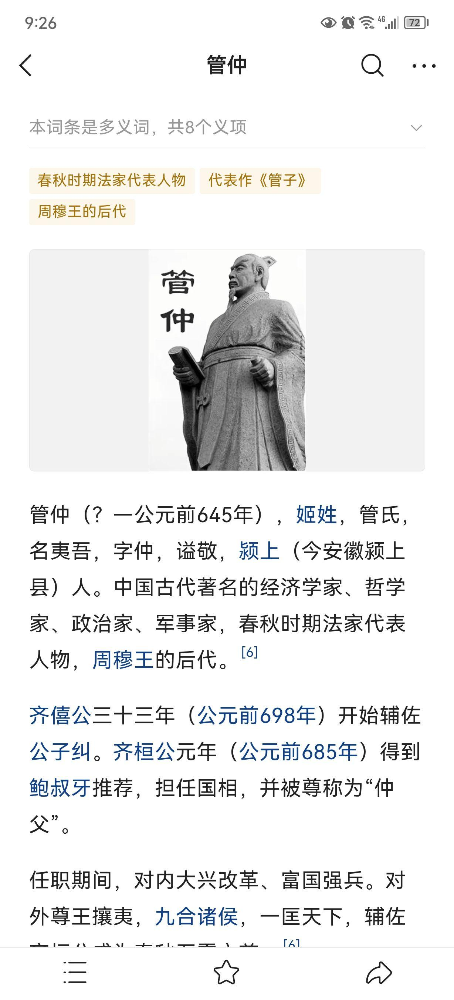
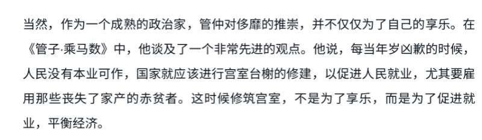
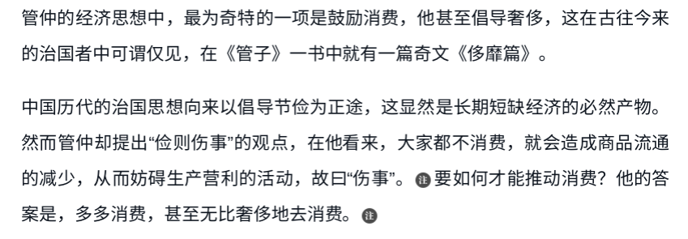

[toc]

# 问题

提问者：**<a href="https://www.zhihu.com/people/shuang-leng-chang-he-66">谈天说财</a>**
提问时间: 2023-1-11 20:53:35
总回答数: 32
总访问量: 102164

管仲主张刺激消费，利用扩张政府投资远远早于英国的凯恩斯，甚至利用贸易缓和战争不动一兵一卒就灭了两个邻国，如此先进的经济思想助力齐恒公成就了霸业，但他的经济思想为什么没有被延续呢？如果能够被延续，全球的现代化进城会不会提前很多？

  

  

# 回答

回答者： **<a href="https://www.zhihu.com/people/kang-you-huo">东亚赢学老祖</a>**
回答时间: 2026-7-31 13:2:40
点赞总数: 646
评论总数: 103
收藏总数: 471
喜欢总数：49

《管子》里有一篇叫《海王》，开头是桓公在问钱从哪里来。

他一连提了四个办法。向楼台房屋收，管子说这是毁人房子。向树木收，这是砍伐生长的东西。向牲畜收，这是杀生。最后他说，那向人头上收呢。

管子的回答只有四个字：此隐情也。

向人头收税，人就会把情况藏起来。少报丁口，把人藏进山里，把户籍做假。桓公问那到底怎么办，管子答了一句：唯官山海为可耳。

山出铁，海出盐。这两样东西的特点是人人都要用，而且产地集中，看得住。

接下来那段账，是这一篇真正的分量所在。

书里算道：十口之家十人食盐，百口之家百人食盐。一个月里，壮年男子吃盐五升多，妇人三升多，孩子二升多。这是最基本的用量，谁也逃不掉。

然后是那一步。每升盐的价钱上抬一点点——加半钱，加一钱，加两钱。单看一升，微不足道，没有人会为此改变什么。可百升为一釜，一釜就多出五十钱、一百钱、二百钱。再往上累，十釜，百釜，千钟，数目就变得吓人。

书里给出的结论是：这样收上来的钱，是按人头征税所得的两倍。而末了那句话说得最直白——我并没有向你们各位和你们的孩子征税，却拿到了两倍于人头税的收入。

铁那一半用的是同一手。一个女人必定要有一根针一把刀，耕地的人必定要有一具耒一具耜，做工的人必定要有斧有锯有锥有凿。没有这些东西而能把活干成的，天下没有。既然人人必用，那就在每一根针、每一把刀上加一点点，加到若干根针就等于一个人的人头税。

这套算术的精巧不在于它收得多，在于它收得看不见。

桓公提的那四种办法，每一种都有一个明确的时刻：官吏上门，报数，交钱。人知道自己在被征，于是可以躲，可以瞒，可以怨。而盐价里的那半钱不需要任何人上门。它没有征收的日子，没有登记的簿册，没有一个可以怨恨的对象。买盐的人只知道盐贵了些，不知道贵在哪里，更不知道贵出来的那部分去了哪儿。

布坎南后来给这类东西起过一个名字，叫财政幻觉：政府总是偏爱那些纳税人感觉不到的税种，因为感觉不到就不会反对。他讲的是现代国家的预算，可这个道理在公元前的临淄已经被人算得清清楚楚，还写成了一套可以照办的操作手册。

所以这不是征，是敛。

而它真正的代价，在两千年后才看得完整。一个人可以反对一项他知道的税，可以上书，可以逃亡，可以在史书上留下一句怨言。他没有办法反对一件他不知道正在发生的事。盐还是那些盐，饭还是那些饭，日子照过，只是每一顿饭里都有一份交给国家的钱，而他从来没有被告知过这件事。

这一篇最后没有停在算术上。它给出的是一个原则：向人收税是笨办法，向人不能不用的东西收税才是好办法。

后世每一次盐铁之议，每一次榷酤，每一次专卖，用的都是这一页纸上的道理。桑弘羊在朝堂上说的那些话，往上追四百多年，源头就在这里。

盐和铁只是两样东西。《管子》里还有一套更大的办法，管所有的东西。

那套办法叫轻重。

它的底子是一句谁都懂的话：东西多了就便宜，少了就贵。轻是贱，重是贵。物价起落本来是天时年成的事，丰年谷贱，荒年谷贵，谁也做不了主。

书里那一句把这件事往前推了一步：岁有凶穰，故谷有贵贱；令有缓急，故物有轻重。

前半句说的是老天，后半句说的是人。年成决定谷价，这是没办法的；而政令的松紧，同样能决定物价的高低——这是可以安排的。

一句话点破了整套办法的机关：国家不必等价格动，它自己就能让价格动。

具体的做法是敛轻散重。价贱的时候把货收进来，价贵的时候放出去。听上去像是平抑物价，像是替百姓着想，实际上做的是一门稳赚的买卖——因为出手的时机不是猜出来的，是自己定的。

真正厉害的是把钱和货一起攥住。谷贵则币轻，币重则谷贱，两样东西的比价永远是跷跷板的两头。谁同时握着这两头，谁就能决定跷跷板往哪边压。书里讲人君要操谷币金衡，说的正是这件事。

于是国家在市面上的身份变了。它不再是收税的那一方，它下了场，成了买卖的一方——而且是唯一预先知道下一步要出什么牌的那一方。这是争，不是征。

书里还留下了几个用这套办法打仗的例子。

有一则说的是齐国怎么收拾鲁国和梁国。管子让桓公自己穿绨——一种厚绸，又让齐国上下都穿，同时下令齐国境内不许织。鲁梁两国见有利可图，举国改行织绨，田里的活计撂下了。等到那边的织机转到停不下来的时候，齐国忽然改穿帛，闭关，一匹不买。

鲁梁的绨堆在库里换不成饭，粮价一日数倍，而地已经荒了，人只好往齐国跑。

这一仗没有出兵。

这类故事在书里不止一则，衡山、菁茅，路数都差不多：先用价格把对方引到一个方向上，等他把身家都押过去，再抽掉那个价格。用今天的话说，这是拿市场当兵器。而能这么打的前提只有一个——你必须是那个可以随时改变规则的人。

到这里，那台机器的图纸基本就画全了。

《海王》管的是一样东西，让人在盐价里交一笔他不知道的钱。轻重管的是所有东西，让人在任何一样东西的价格里交那笔钱。前者是一条缝，后者是一张网。

而两者共用同一个原理：不向人收，向人不能不用的东西收；不用公告，用价格。

税要立名目，要有征收的日子，要有一个可以被怨恨的对象。价格不需要。粮贵了，布贱了，市面上的人只会觉得年景不好，或者行情如此。没有人会想到这中间有一只手，更不会想到那只手同时握着钱和谷。

六百多年后，桑弘羊在长安设平准，贵则卖之，贱则买之，说的理由是抑制豪商的居间之利。那一套的图纸，就在这几篇里。

只是有一件事得先摆出来，否则后面全是虚的。轻重这几篇，恰恰是《管子》里成书最晚、争议最大的部分。有学者认为它们出自汉代人之手——若真如此，那就不是桑弘羊照着这几篇办事，而是这几篇在追记桑弘羊那一路人已经在办的事：与民争利。

《管子·国蓄》里有一段话，把整套办法的目标写在了纸面上，一个字也没绕。

 **利出于一孔者，其国无敌；出二孔者，其兵不诎；出三孔者，不可以举兵；出四孔者，其国必亡。** 

孔是出口。天下的好处从几个口子里流出来，这个数目决定一个国家的强弱。只有一个口子，天下无敌；有两个，军队还能打；有三个，就没法出兵了；到四个，这个国家一定亡。

先看这段话的形状。它不是在说好与坏，是在排一张刻度尺，而刻度上唯一的变量是口子的数目。少一个口子，国家强一分。

再看它的坦率。

它没有说这样做是为了百姓好，没有说这样更公道，也没有假借任何一句先王之言。它给出的理由从头到尾只有一个：其国无敌。目标是国家的力量，写得清清楚楚，不留余地。

同样的话还出现在另一部书里。《商君书》说，利出一空者，其国无敌；出二空者，国半利；出十空者，其国不守。空就是孔，用字略异，说的是同一件事，连句式都一样。

这两部书的先后与源流，学界至今没有定论。但有一点可以确定：这不是某一个人的偶发之想，它是战国时代一批治国的人共用的一条原理，你在这一部里看到它，在那一部里还会看到它。

《国蓄》后面还有一句，比前面那段更要紧。

 **见予之形，不见夺之理。** 

让百姓看见你给他们什么，不要让他们看见你凭什么拿走。原文接着说，这样一来，民众对君上的爱戴就能维持住。

到这里，前面两节讲的东西才算合成了一台机器。

《海王》管的是一样东西：盐和铁人人要用，在每一升盐、每一根针上加一点点，那笔钱就交出去了，而交钱的人不知道自己交了。轻重管的是所有东西：谷贱时收，谷贵时放，钱和谷一起攥在手里，价格往哪边走由自己定。

这两样办法看起来是两件事，其实共用一个原理，而这个原理就写在‘见予之形，不见夺之理’这九个字里。

税要立名目，要有征收的日子，要有官吏上门，因此要有一个可以被怨恨的对象。而这几套办法一样也不需要。它们不出现在任何一道公文上，只出现在价格里。百姓看见的是官府开仓平粜、是荒年有粮，看不见的是那笔钱早已经在别处收走了。

于是国家同时拿到了两样东西：钱，和感激。

这就是一孔真正的分量。它不只是把利收进一个口子，它还让这个口子看不见。

不过孔这个字有两面，而这两面是同一件事，拆不开。

一面是利往里流的口子。天下之利收进这一个口子，国库就满了。

另一面是人往外走的口子。既然所有的好处只从这一个口子出来，那么凡是想要好处的人，就只能从这一个口子挤过去。

收利于一孔与赶人入一途，从来不是两件事，是同一句话的两个方向。

《管子》这几篇只讲了前一面。后一面要等很久才在史书上显形——等到榷盐、榷铁、榷酒一样一样立起来，等到某一个王朝把读书、名声、财富、婚配、门第，全部接到同一场考试的出口上，那时候人们才知道，一个只有一个口子的天下，会把人挤成什么形状。

  

——作者东亚赢学老祖，西方哲学科班出身，现居日本。所治在儒学与经济学之间：用制度与货币的眼光重读经与史，并把日本、朝鲜半岛一并算进同一个刻度。这一路上溯，有康有为弟子陈焕章1911年在哥伦比亚大学写的《孔门理财学》；我接着往下走，走法与他不同。

  

原文地址：[(东亚赢学老祖)管仲的经济思想为什么没有延续？](https://www.zhihu.com/question/578125779/answer/2066509086011790324) 

# 评论

1. <a href="https://www.zhihu.com/people/95-47-56-25">漫天刮风树不摇</a> (<small title="广东">2026-7-31 16:26:38</small>): 后世把这个法子用烂了。就都知道了。
   - <a href="https://www.zhihu.com/people/yabhit">千帆</a> (<small title="北京">2026-7-31 21:18:31</small>): 也不见得，比如楼市
   - <a href="https://www.zhihu.com/people/wang-ri-sui-feng-13-52">往日随风</a> (<small title="回复于 2026-8-1 7:15:37/北京"> ✉️:千帆</small>): 把不是刚需的东西变成刚需，是一门大学问呀［酷］
   - <a href="https://www.zhihu.com/people/heat-39-33">HEAT</a> (<small title="江苏">2026-8-1 7:59:21</small>): 内存ai
   - <a href="https://www.zhihu.com/people/xu-hao-er-shi-san">序號二十三</a> (<small title="回复于 2026-8-1 10:6:35/黑龙江"> ✉️:千帆</small>): 明白人！［赞］
   - <a href="https://www.zhihu.com/people/95-47-56-25">漫天刮风树不摇</a> (<small title="回复于 2026-8-1 10:9:9/广东"> ✉️:千帆</small>): 楼市的本质是土地，土地国有，你说是不是官山海的一种？
   - <a href="https://www.zhihu.com/people/beefing-96">beefing</a> (<small title="回复于 2026-8-1 11:42:18/上海"> ✉️:漫天刮风树不摇</small>): 他说的是，不见得“就都知道”了，楼市就是，不“都知道”的情况，高位买房的人何其多
   - <a href="https://www.zhihu.com/people/95-47-56-25">漫天刮风树不摇</a> (<small title="回复于 2026-8-1 20:44:46/广东"> ✉️:beefing</small>): 现在绝大多数人肯定是知道了吧？
   - <a href="https://www.zhihu.com/people/mu-han-46-17">Atiyas</a> (<small title="河南">2026-8-1 22:9:48</small>): 知道又咋滴，你不吃盐试试
   - <a href="https://www.zhihu.com/people/95-47-56-25">漫天刮风树不摇</a> (<small title="回复于 2026-8-1 22:26:36/广东"> ✉️:Atiyas</small>): 私盐呗，这事历史上始终禁绝不了的。
   - <a href="https://www.zhihu.com/people/yabhit">千帆</a> (<small title="回复于 2026-8-2 1:3:2/北京"> ✉️:往日随风</small>): 其实是刚需，只是它的层级很多，有忍耐弹性
   - <a href="https://www.zhihu.com/people/zhang-er-ming-12">张二鸣</a> (<small title="回复于 2026-8-2 12:6:55/广东"> ✉️:千帆</small>): 领票的，跟盐业一样。
2. <a href="https://www.zhihu.com/people/jiang-he-hu-hai-wan-xi-gui-jing">江河湖海烷烯炔烃</a> (<small title="北京">2026-7-31 21:49:47</small>): 现在难道不是，收税在生产环节，你买东西自动纳税。
   - <a href="https://www.zhihu.com/people/zhou-huai-shang">周怀尚</a> (<small title="甘肃">2026-8-1 1:24:20</small>): 不，你还没买超市之类的场所也已经交过税了
   - <a href="https://www.zhihu.com/people/jiang-he-hu-hai-wan-xi-gui-jing">江河湖海烷烯炔烃</a> (<small title="回复于 2026-8-1 2:51:10/北京"> ✉️:周怀尚</small>): 你说的和我说的也不冲突啊，东西卖出去是消费者承担税收，东西卖不出去那税转嫁不到消费者身上，不就是超市老板承担。
   - <a href="https://www.zhihu.com/people/zhou-huai-shang">周怀尚</a> (<small title="回复于 2026-8-1 16:32:37/甘肃"> ✉️:江河湖海烷烯炔烃</small>): 哦哦，看得太快了理解不到位，你中间的说的没问题的，只要生产了就能产生税收
   - <a href="https://www.zhihu.com/people/96yin">给乐子递猹</a> (<small title="江西">2026-8-2 6:14:15</small>): ［大笑］但这套也就中国在用，像美国没管仲，超市货架摆的东西都要标加上税。
   - <a href="https://www.zhihu.com/people/yi-tian-zhao-hai-37">倚天照海</a> (<small title="回复于 2026-8-2 9:44:55/贵州"> ✉️:给乐子递猹</small>): 现在中国的发票就是标出价、税和价税合计。
3. <a href="https://www.zhihu.com/people/fei-xiang-de-he-lan-dou-36">飞翔的荷兰豆</a> (<small title="广东">2026-8-1 7:37:17</small>): 很多人真以为自己不到5000块月收入就不纳税，不说别的，你买一瓶可乐都有13个点的增值税让你作为负税人，还没说别的税
   - <a href="https://www.zhihu.com/people/andy-12-12">四方上下古往今来</a> (<small title="重庆">2026-8-1 12:51:15</small>): 所以中国的税在生产端就给你收得明明白白的，生产越多税越多。
   - <a href="https://www.zhihu.com/people/56-39-81-52">朕十七咩夜</a> (<small title="江苏">2026-8-3 0:8:46</small>): 那我买冰红茶不就行了［尴尬］ 别总把税说的好像跟普通人有关系似的
4. <a href="https://www.zhihu.com/people/Derkran">浮生如寄</a> (<small title="吉林">2026-8-1 10:36:44</small>): 以前的升和现在不一样吧，吃五升盐都成腊肉了［捂脸］
   - <a href="https://www.zhihu.com/people/quan-chang-zui-jia-16-36">momo</a> (<small title="福建">2026-8-3 9:5:3</small>): 古代年景三年好两年差，要用盐来保存食物的。
5. <a href="https://www.zhihu.com/people/feng-ye-peng-36">Richard</a> (<small title="广东">2026-7-31 21:19:53</small>): 官山海，增值税！
6. <a href="https://www.zhihu.com/people/da-ke-ke-41">大可可</a> (<small title="河南">2026-8-1 10:25:20</small>): 司马光吐槽过：说这样做看似没问题，能富国，但实际对民间的危害比直接加税还厉害。
   - <a href="https://www.zhihu.com/people/yang-hao-17-28">人不口嗨枉少年</a> (<small title="四川">2026-8-1 12:17:45</small>): 说明司马光政治水平是真的菜。
   - <a href="https://www.zhihu.com/people/yang-hao-17-28">人不口嗨枉少年</a> (<small title="四川">2026-8-1 12:18:14</small>): 也有一种可能 他真养了几千口人
   - <a href="https://www.zhihu.com/people/da-ke-ke-41">大可可</a> (<small title="回复于 2026-8-1 14:19:38/河南"> ✉️:人不口嗨枉少年</small>): 你知道司马光说谁吗？就司马光菜？
   - <a href="https://www.zhihu.com/people/da-ke-ke-41">大可可</a> (<small title="回复于 2026-8-1 14:23:45/河南"> ✉️:人不口嗨枉少年</small>): 天地所生财货百物，止有此数，不在民则在官。譬如雨泽，夏涝则秋旱。不加赋而国用足，不过设法阴夺民利，其害甚于加赋。
 
司马光比你看得清多了，说明你对社会的了解就是个小白。
   - <a href="https://www.zhihu.com/people/qi-guo-tan">席间平权饿殍无益</a> (<small title="回复于 2026-8-1 14:32:7/河南"> ✉️:大可可</small>): 这个民可是有讲究的，马云是民，你也是民。不在民则在官。我更愿意在官，至少有道德和法纪约束他
   - <a href="https://www.zhihu.com/people/da-ke-ke-41">大可可</a> (<small title="回复于 2026-8-1 14:34:16/河南"> ✉️:席间平权饿殍无益</small>): ［飙泪笑］
   - <a href="https://www.zhihu.com/people/da-ke-ke-41">大可可</a> (<small title="回复于 2026-8-1 14:39:40/河南"> ✉️:席间平权饿殍无益</small>): 许国在做地方官时，写词给辛弃疾，得到辛弃疾的赏识。一天，两人一同外出赏梅。晚上回来，路过一户人家，只见里面宴席排场很大，但客人还没到齐。辛弃疾和许国便进去坐下，要了酒喝，主人招待得十分恭敬。  
 
许国见状，随口说了句：“这是贵人进宅啊。”  
 
辛弃疾却摇头，冷冷地说：“决无好事。”  
 
接着，他就说当时流传的民间谚语：“破家县令，灭门刺史。”  
 
没过多久，这家人果然大祸临头，家破人亡。
   - <a href="https://www.zhihu.com/people/qi-guo-tan">席间平权饿殍无益</a> (<small title="回复于 2026-8-1 14:48:54/河南"> ✉️:大可可</small>): 然后呢。破家县令，灭门刺史。又和平头百姓有什么关系？倒是这些自称为“民”的人，会更加毫无负担的迫害贫民
   - <a href="https://www.zhihu.com/people/da-ke-ke-41">大可可</a> (<small title="河南">2026-8-1 16:4:54</small>): 第一次见还有把古代百姓的苦难推到自称为“民”的头上？是哪本历史书告诉你的？不都是皇帝荒淫无道，朝廷横征暴敛，最后官逼民反吗?还有替皇帝和朝廷洗的？我真是开眼了？和着陈胜吴广是被商人逼反的，不是秦的严苛律法逼反的？
   - <a href="https://www.zhihu.com/people/da-ke-ke-41">大可可</a> (<small title="回复于 2026-8-1 16:34:12/河南"> ✉️:席间平权饿殍无益</small>): 吴民生齿最繁，恒产绝少，家杼轴而户纂组，机户出资，织工出力，相依为命久矣。税监孙隆设关密如秋荼，参随黄建节等交通棍徒，擅增税额，且议每机一张税银三钱，人情汹汹，机户皆杜门罢织，织工失业，穷民无以为生。葛成（葛贤）愤而倡义，聚众击斩建节，焚税棍之室，围逼织造署，隆走杭得免。成自诣官请罪，曰：“始事者成也，杀人之罪，成愿以身当之，毋及众。” 当道义之，未即诛，系狱十余年乃释，吴人敬为葛将军。
 
请分析你最爱的官老爷和你最恨的自称平民的人，在里面的所作所为。
   - <a href="https://www.zhihu.com/people/da-ke-ke-41">大可可</a> (<small title="回复于 2026-8-1 16:49:23/河南"> ✉️:席间平权饿殍无益</small>): 万历皇帝派太监孙隆去苏州收税，孙隆对当地织布商人增收苛税，当地织布商人纷纷破产。当地官员向皇帝进言说，孙隆收的税款太多，能不能少一点，有很多织布工就靠这个工作养家糊口，现在丢掉生计后。商民贫苦，民怨沸腾。万历不管。
 
有一个织布工葛成振臂一呼，跟随他的有几千人，开始攻击衙门，要把孙隆杀掉。孙隆狼狈逃跑。事后，葛成为了不连累其他人，自己自首去了。
 
葛成因为这件事，深受当地人敬重，被当地人称为葛将军。
 
请分析，这件事皇帝太监和商人织布工，以及葛成的做法。
 
不是自称为民的人压迫的更狠吗？［飙泪笑］
   - <a href="https://www.zhihu.com/people/yang-hao-17-28">人不口嗨枉少年</a> (<small title="回复于 2026-8-1 17:18:14/四川"> ✉️:大可可</small>): 政府的职能是什么？
   - <a href="https://www.zhihu.com/people/qi-guo-tan">席间平权饿殍无益</a> (<small title="回复于 2026-8-1 17:25:44/河南"> ✉️:大可可</small>): 你说的再多，政府官员也受到制度和舆论压力的制约。
   - <a href="https://www.zhihu.com/people/da-ke-ke-41">大可可</a> (<small title="回复于 2026-8-1 17:47:2/河南"> ✉️:席间平权饿殍无益</small>): 你说的古代还是现代？古代那么多的官逼民反，被你的制度和舆论压力制约了？怎么净抬杠？
   - <a href="https://www.zhihu.com/people/da-ke-ke-41">大可可</a> (<small title="回复于 2026-8-1 17:48:39/河南"> ✉️:席间平权饿殍无益</small>): 那么多朝代更替，你约束住谁了？
   - <a href="https://www.zhihu.com/people/lei-jiong-8">好阿右</a> (<small title="北京">2026-8-1 19:42:19</small>): 那么问题来了，什么是民间，什么是民，民与民有区别吗
   - <a href="https://www.zhihu.com/people/eudq">eudq</a> (<small title="广东">2026-8-2 0:55:9</small>): 间接税才是实践出来的啊，真收直接税你又不乐意，历朝历代其实很多时候都是大量财政来自间接税-财政不行-改税直接税-暴死
   - <a href="https://www.zhihu.com/people/yang-hao-17-28">人不口嗨枉少年</a> (<small title="回复于 2026-8-2 9:20:27/四川"> ✉️:大可可</small>): 我大送不菜谁菜？
   - <a href="https://www.zhihu.com/people/3665-59">3665</a> (<small title="回复于 2026-8-2 21:32:45/江西"> ✉️:席间平权饿殍无益</small>): 道德律法束缚上位者［大笑］周礼礼法都做不到的事，只能开出克己复礼利有等差来治
   - <a href="https://www.zhihu.com/people/da-ke-ke-41">大可可</a> (<small title="回复于 2026-8-3 8:39:34/河南"> ✉️:eudq</small>): 不是间接税，是朝廷直接下场，干预垄断导致的。
   - <a href="https://www.zhihu.com/people/zhu-shu-gang-53">山高水长</a> (<small title="山东">2026-8-3 11:41:7</small>): 司马光说的不对，搁古代不论盐铁官营还是直接收税，都是从普通老百姓身上榨钱，不论那个都是危害。但是资源不会凭空变出来，所以两种手段都只能控制在能承受的范围内。
7. <a href="https://www.zhihu.com/people/arc_xu">沟通基本靠吼</a> (<small title="山东">2026-7-31 20:35:55</small>): 高，还是中国人聪明
8. <a href="https://www.zhihu.com/people/yy-xx-5">索伦国强兽人</a> (<small title="北京">2026-8-1 8:27:8</small>): 一个人一个月能吃几升盐？？？
   - <a href="https://www.zhihu.com/people/liu-quan-cheng-73">闲生主人</a> (<small title="安徽">2026-8-1 11:8:16</small>): 古代盐贵
   - <a href="https://www.zhihu.com/people/lu-qiang-23">鱼儿读书会摆尾</a> (<small title="回复于 2026-8-1 12:26:47/山东"> ✉️:闲生主人</small>): 贵也吃不了这么多啊
   - <a href="https://www.zhihu.com/people/men-lin-dong">东风不破</a> (<small title="河北">2026-8-1 12:38:17</small>): 隋代以前的度量衡比后世的小，合到现在没那么多；再加上古人天天从事体力劳动，出汗多，吃的盐确实比现在人多
   - <a href="https://www.zhihu.com/people/zhao-hai-ming-53">好养活</a> (<small title="上海">2026-8-1 12:40:42</small>): 重体力，出汗多？
   - <a href="https://www.zhihu.com/people/ao-nan-hai">敖南海</a> (<small title="江西">2026-8-2 13:43:13</small>): 如果这里的升是现代的升，那肯定吃不了，如果算上腌渍食物的用量有可能达到
   - <a href="https://www.zhihu.com/people/yy-xx-5">索伦国强兽人</a> (<small title="回复于 2026-8-3 9:17:42/河北"> ✉️:敖南海</small>): 也用不了每个月都消耗啊
9. <a href="https://www.zhihu.com/people/w9uex9">知乎用户W9ueX9</a> (<small title="浙江">2026-8-1 7:17:35</small>): 种田的需要更多盐和铁器，这不就是变相的田税吗。
   - <a href="https://www.zhihu.com/people/qing-he-gong-chang">清河弓长</a> (<small title="福建">2026-8-1 11:34:47</small>): 那你以为，如果官府不搞盐铁专营，种田的就不需要买盐和铁了吗？
 
盐和铁，都是有区域性的生产产品，当地没有海和盐井，没有矿山的地方，百姓是无法自己生产盐铁的。
 
这些地方的百姓，要用盐铁，不管是不是官府垄断，都是需要去购买的。
 
如果官府不垄断，那么他们买谁的盐铁？自然是垄断盐铁的地方豪强的。
 
豪强控制了盐铁，又可以借盐铁盘剥百姓，他们就会变得更强，从而对抗朝廷。
   - <a href="https://www.zhihu.com/people/w9uex9">知乎用户W9ueX9</a> (<small title="回复于 2026-8-1 12:14:9/浙江"> ✉️:清河弓长</small>): 刘彻实行盐铁专营后，地方豪强照样层出不穷，刘秀就是在豪强的支持下建立东汉的。真正解决地方豪强的是科举，只要你家中几代人里没有做大官的，有多少钱都得垮掉。再说了你一个地头蛇敢搞垄断盐铁，不正是给朝廷收拾你的理由吗。
   - <a href="https://www.zhihu.com/people/qing-he-gong-chang">清河弓长</a> (<small title="回复于 2026-8-1 14:49:9/福建"> ✉️:知乎用户W9ueX9</small>): 刘彻死后，对汉朝地方豪强的压制政策基本上就宣告失败了。西汉灭亡，东汉军阀混战，都是豪强地主搞起来的。刘彻是在对抗豪强地主，盐铁专营是他对抗豪强地主的一个手段。但是最终失败了。
 
豪强地主渗透进了朝廷，盐铁会议上，发起了正面进攻，松动了盐铁专营政策；又在实际执行中，破坏盐铁政策。
 
并且参与刘彻储君问题，引发了巫蛊之祸，以及马何罗兄弟对刘彻的刺杀。
 
乃至造成了刘彻死后，幼主当国，大臣辅政局面。霍光、上官桀等人的斗争，则是豪强地主派系的最后反击。
 
汉宣帝之后，汉朝朝廷中央日渐虚弱，地方豪强以儒学、谶纬学消解汉朝正统性，最终造成王莽篡政。王莽篡政，就是地方豪强地主派系势力建立新体制的尝试。结果因为豪强地主派系内部的分裂，而最终崩溃。西汉末年的绿林、赤眉、铜马义军起义，本质上都可能是地方豪强地主派系分赃不均的不满从而引起的。刘秀上台后，维持住了豪强地主派系的联盟稳定。但是豪强地主派系通过儒学深入参与朝政，事实上造成了“皇帝与士大夫共天下”的局面。
 
于是皇帝为了加强权力，不得不利用外戚或宦官势力，而外戚势力，又时常被豪强地主派系拉拢背叛皇帝。一直到出现党锢之祸。皇权与豪强地主派系的斗争明面化。
 
豪强地主与官僚勾结，掌握朝廷用人、军事、财政大权。于是皇帝打算组建中央禁军。便通过宦官进行卖官，一方面扰乱被豪强地主派系掌握的朝廷官僚体系，一方面获得资金，并且用卖官获得的资金，建立西园军。并任命宦官、与宦官有关联的士绅才俊，如曹操，豪强派系中的庶子，如袁绍，专业技术军官等为西园八校尉，目的就是在掌握禁军的时候，又不至于引发豪强派系的警觉。
 
另一方面，皇帝又让宦官十常侍联络忠诚于汉朝的天子之师张良的后人，以天师道、太平道的形式，发动被豪强地主欺压的地方百姓，于是掀起了轰轰烈烈的黄巾大起义。天子所掌握的西园军，则是为了监督制衡起义军。
 
而黄巾起义前期，也是以杀豪强、平坞堡为主要目的的。但是豪强地主派系不甘于灭亡，于是他们组织起来，假扮成黄巾军，鱼目混珠对抗朝廷，进行割据。另一方面，又积极拉拢皇帝外戚，让外戚背叛皇帝，西园军的袁绍、曹操也最终背叛皇帝，对忠诚于皇帝的宦官进行清洗。
 
并且蛊惑大将军何进调地方军队入京作乱，杀入内宫，逼得皇帝逃出皇宫。
 
这群地方豪强自以为获得了胜利，便又再次内讧起来。董卓军阀屠杀袁氏，从而引起了豪强地主派系在地方集结力量，矫诏反抗朝廷，造成了洛阳沦陷，皇帝被迫迁都。朝廷对地方彻底失去监管，东方的豪强地主便胡作非为，开始了军阀割据混战。
   - <a href="https://www.zhihu.com/people/w9uex9">知乎用户W9ueX9</a> (<small title="回复于 2026-8-1 16:21:11/浙江"> ✉️:清河弓长</small>): 刘彻死了，但盐铁专营保留了啊。
   - <a href="https://www.zhihu.com/people/ting-wen-ci-chu-da-lao-da-you-duo">听闻此处大佬大又多</a> (<small title="辽宁">2026-8-2 19:8:2</small>): 是。但要是直接收谷子你会生怨会反抗。甚至偶尔会弄死几个税吏。
10. <a href="https://www.zhihu.com/people/wangshenju">一叶忘神</a> (<small title="上海">2026-8-1 21:17:2</small>): 你是否在寻找：汪汪队［害羞］
11. <a href="https://www.zhihu.com/people/qing-he-gong-chang">清河弓长</a> (<small title="福建">2026-8-1 11:28:24</small>): 民，有两种，一种是一家一户的小民。
 
另一种是宗族实力盘根错节的大民，也就是地方豪强。
 
一家一户的小民，能够自己炼铁、制盐吗？不能。
 
因此官山海夺走的，只是这些地方豪强的利益。
 
小民本身是不能炼铁制盐的，但是他们也需要使用铁器和盐。
 
因此，如果官府不控制盐铁，小民就得接受地方豪强的盘剥。
 
地方豪强势力增强，就会形成地方割据的态势，破坏中央集权。
    - <a href="https://www.zhihu.com/people/cai-zhi-diu-shi">材质丢失</a> (<small title="回复于 2026-8-2 13:41:55/北京"> ✉️:joker</small>): 这种假设不用“隐含”，而是事实，甚至豪强会拿更多的暴利
    - <a href="https://www.zhihu.com/people/elephslayer">joker</a> (<small title="北京">2026-8-2 10:40:59</small>): 你这模糊了官府和豪强盘剥数量差别，我不说我对这件事的观点，你不讨论这个差别就得出所谓“官府夺走的只有豪强利益”的观点，这样的论证逻辑不够充分，因为你隐含了这样一种假设：“豪强会拿和官府差不多的暴利”。
12. <a href="https://www.zhihu.com/people/bi-hu-wei-guan-qun-zhong-98">知乎的荒原</a> (<small title="河南">2026-8-1 1:16:33</small>): 确实有用啊，比如还有大批的人认为自己不交税呢
    - <a href="https://www.zhihu.com/people/51-52-61-61-66">momo I</a> (<small title="河北">2026-8-1 9:54:38</small>): 它们太奸和很多人无知，再加上一些很坏的人歪嘴念经
    - <a href="https://www.zhihu.com/people/xiao-zhi-ying-6">晓之鹰</a> (<small title="广东">2026-8-1 10:30:45</small>): 因为这个确实好，收税容易的政府比收税困难的政府可以存活更久，而收税难比完全收不上税的存活得，等等好像没有收不上税的政府，有的话也早消失了。
 
不过，谁管呢，全世界几十亿人民都想要一个既不收税同时也保证人民的基本安全福利的政府啊，给地球天降一个只承担义务而没有权利，让人民享有权利而不承担义务的政府不香吗。
    - <a href="https://www.zhihu.com/people/bi-hu-wei-guan-qun-zhong-98">知乎的荒原</a> (<small title="回复于 2026-8-3 9:54:32/河南"> ✉️:momo I</small>): 一个收费符合以下要点：面向所有人，必须得给，你没有选择权。那这个收费就是税。
13. <a href="https://www.zhihu.com/people/shen-huang-da">正方形在两圆之间</a> (<small title="江苏">2026-8-1 9:15:12</small>): 老百姓其实也有办法应对的。那就是要求zf公开每一项支出和收入，只要收上来的钱确实用在实处，相信没有人会怨愤
    - <a href="https://www.zhihu.com/people/zhang-ren-long-37">Tedward</a> (<small title="广东">2026-8-1 10:12:24</small>): 一直公开啊，每年都发布政府财政审计，你们都不看的？
    - <a href="https://www.zhihu.com/people/1315735241">忧国的保安队长</a> (<small title="回复于 2026-8-1 13:8:24/广东"> ✉️:Tedward</small>): 没有监督的数据有啥意义？当场给你编都行［飙泪笑］
    - <a href="https://www.zhihu.com/people/zhang-ren-long-37">Tedward</a> (<small title="回复于 2026-8-1 13:11:7/广东"> ✉️:忧国的保安队长</small>): ［尴尬］按这标准，还是中国的统计数据最靠谱，毕竟每年都会有人大审计。其他国家审计不过的那更是都懒得编
    - <a href="https://www.zhihu.com/people/yhhhyf">潭州捕鱼人</a> (<small title="回复于 2026-8-1 18:18:49/湖南"> ✉️:Tedward</small>): 别闹［笑哭］
    - <a href="https://www.zhihu.com/people/zhang-er-ming-12">张二鸣</a> (<small title="广东">2026-8-2 12:36:26</small>): 怎么可能，大把的钱投入到军事进攻和防御上。他们看着自己白花花的银子变成了国家的刀兵，变成了边墙，怎么可能会安心缴税，只会说官家劳民伤财、穷兵黩武。
14. <a href="https://www.zhihu.com/people/running-67-83">Aman</a> (<small title="广东">2026-8-1 10:7:11</small>): 现在的水电煤气不一样吗
15. <a href="https://www.zhihu.com/people/lao-shi-ren-31-11">老实人</a> (<small title="上海">2026-8-1 7:19:13</small>): 老祖宗几千年的智慧，那不是白说的［捂脸］［捂脸］［捂脸］［捂脸］
16. <a href="https://www.zhihu.com/people/bei-ming-yi-bei-7">乐狮</a> (<small title="山东">2026-8-3 16:27:25</small>): 随着历史经验的积累，人们逐渐会知道这个原理，所以政府要不断开发出新的“盐铁”，才能不断通过官山海来创收。那么这个”盐铁“是什么呢？可以是房子、车子、奢侈品以及等等，归根到底，是要虚空造牌激发人性里的一种欲望，让人感觉没有这个”盐铁“日子就不能过，或者自己少了别人多了就是自己亏了，那这样可以想象的空间就很大了。请诸位说说都有可能产生哪些”盐铁“。
17. <a href="https://www.zhihu.com/people/mu-mu-19-88">木木</a> (<small title="江苏">2026-8-3 11:4:32</small>): 开妓院收税不就行了［飙泪笑］
18. <a href="https://www.zhihu.com/people/998-76">998</a> (<small title="云南">2026-8-2 23:20:3</small>): 无解。帝王以搜刮之利，立一座坚城，再养一支铁军，再用官僚职位分化民间智者能人，天下就无才无力无能人能挑战。唯一的bug是逃户。百姓躲进山林散入漠北，或者追随安史二圣都是办法。
19. <a href="https://www.zhihu.com/people/ju-wai-ren-5-10">海豚人</a> (<small title="陕西">2026-8-3 10:23:51</small>): 这个收税法其实还算公平的，起码真是按人头收税，古代西方那些乱七八糟的税收才真叫大开眼界呢［飙泪笑］
20. <a href="https://www.zhihu.com/people/nan-shui-bei-diao-76-95">北水南调</a> (<small title="江苏">2026-8-3 2:15:22</small>): 后世把这个法子用烂了。就都知道了。但架不住蠢人多，或者人总有犯蠢的时候，比如买华为。
21. <a href="https://www.zhihu.com/people/20-68-23-86">籽油派</a> (<small title="江苏">2026-8-2 2:2:42</small>): 不是汉代才开始用铁制农具吗？
    - <a href="https://www.zhihu.com/people/nan-shui-bei-diao-76-95">北水南调</a> (<small title="江苏">2026-8-3 2:16:32</small>): 汉代是铁质兵器，农具早就有了。兵器的要求更高。
22. <a href="https://www.zhihu.com/people/shi-bei-54-23">石贝</a> (<small title="重庆">2026-8-1 21:53:33</small>): 说到底是因为你手里有刀。之所以用盐铁是好收而不是隐蔽。私盐谁不想买，只不过要杀头。
23. <a href="https://www.zhihu.com/people/zi-fei-yu-26">子非鱼</a> (<small title="河南">2026-8-2 18:7:52</small>): 社保基金会炒股啊
24. <a href="https://www.zhihu.com/people/gao-nu-24">有名</a> (<small title="湖北">2026-8-2 11:37:9</small>): 其实这个方法不是在于收税看不见，而是在于"平"字，即公平、平衡、平面（看不见）。
 
在经济底层的公平、平衡、平面，大家都收等于大家都没收，大家的成本同时被抬高了。
 
不存在大范围你收我不收的可能。
25. <a href="https://www.zhihu.com/people/wang-dong-shi-90">临碣</a> (<small title="辽宁">2026-8-1 5:51:13</small>): 然而，姜齐亡于此，田齐亡于此
26. <a href="https://www.zhihu.com/people/caisentalent.com">刘化檩跨界OD学堂</a> (<small title="山东">2026-8-1 15:36:25</small>): 与民争利的幌子是很大的，谁最喜欢这个旗帜呐，大资本，只有大资本可以这么玩，比如盐铁，粮食等等，普通屁民能玩嘛，不能。
 
所以，与民争利是由头和幌子，你得看如果把这个利放出来之后，又到哪里去了，这个才是打幌子的主角。［大笑］
27. <a href="https://www.zhihu.com/people/rainbowbride">rainbowbride</a> (<small title="湖北">2026-8-1 11:37:44</small>): 你看经济学就是这么来的。［调皮］
    - <a href="https://www.zhihu.com/people/bu-xi-zhou-92-95">渭北不肖生</a> (<small title="陕西">2026-8-1 12:11:13</small>): 这不是纯粹的经济学，是政治经济学。
28. <a href="https://www.zhihu.com/people/zhao-tian-yi-90-58">B互删我名字</a> (<small title="江苏">2026-8-1 9:47:38</small>): 专卖权，特殊经营权，烟草，房产
29. <a href="https://www.zhihu.com/people/yang-hao-17-28">人不口嗨枉少年</a> (<small title="四川">2026-8-1 12:24:44</small>): 你说的这个民，是不是达官显贵的白手套？
30. <a href="https://www.zhihu.com/people/yan-sheng-hua-xiang">冷灯参剑</a> (<small title="山东">2026-8-1 10:7:27</small>): 耒耜按说是可以偷偷自制，但菜刀肯定不行
31. <a href="https://www.zhihu.com/people/li-qian-xin-56-42">好好看好好学</a> (<small title="浙江">2026-8-1 7:25:27</small>): 向生产工具收费，只是受限于铜钱产量，要不然就要涨价了。
32. <a href="https://www.zhihu.com/people/bu-xi-zhou-92-95">渭北不肖生</a> (<small title="陕西">2026-8-1 12:8:16</small>): 拔最多的鹅毛，听最少的鹅叫。
33. <a href="https://www.zhihu.com/people/zachary-ye">zachary ye</a> (<small title="重庆">2026-8-1 12:30:23</small>): 垄断供给。有人问为啥扫黄连ai也扫，也是因为这个。
34. <a href="https://www.zhihu.com/people/33-84-11-2">狂歌当哭</a> (<small title="北京">2026-8-1 11:9:12</small>): 到汉朝的时候人民开始用木头刨地，舔地面补盐
35. <a href="https://www.zhihu.com/people/51-52-61-61-66">momo I</a> (<small title="河北">2026-8-1 9:55:21</small>): 烟 酒 石油 国企 铸币税 海关 都是税收
36. <a href="https://www.zhihu.com/people/yong-hu-7476202944471">用户76742029444</a> (<small title="上海">2026-8-2 15:24:23</small>): 盐铁官营等于征税大家都懂，也藏不下去。不然大家为啥去买私盐呢？
37. <a href="https://www.zhihu.com/people/mythmy">牢A大王</a> (<small title="陕西">2026-8-2 10:57:57</small>): 扫黄禁了，海王管
38. <a href="https://www.zhihu.com/people/xu-cong-12-19">待仔的猪</a> (<small title="广东">2026-8-1 0:31:29</small>): 性专营，管它断子绝孙呢
    - <a href="https://www.zhihu.com/people/wu-nian-64-1">无念</a> (<small title="安徽">2026-8-1 12:44:57</small>): 管仲还开了官办妓院呢
    - <a href="https://www.zhihu.com/people/xu-cong-12-19">待仔的猪</a> (<small title="回复于 2026-8-2 17:22:52/广东"> ✉️:无念</small>): 性专营是不许卖淫，只能通过官方允许的方式获取性。

=[评论](./attachments/comments.json)

