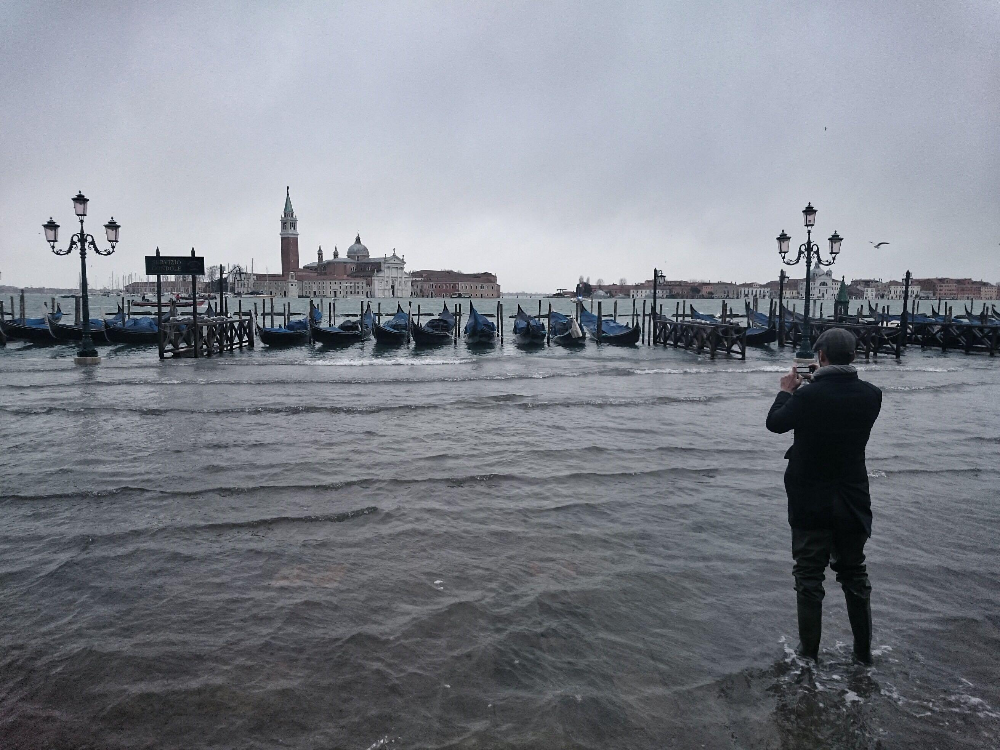
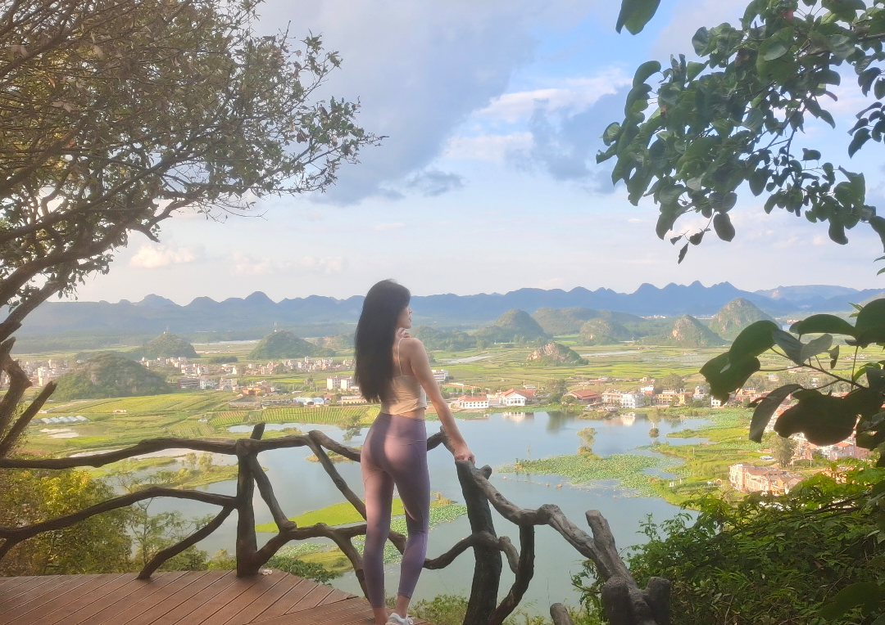
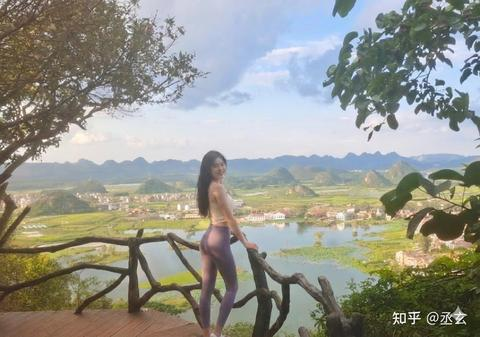
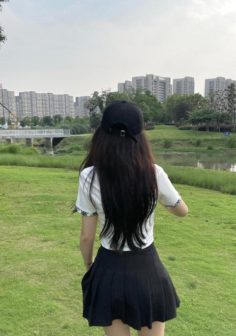
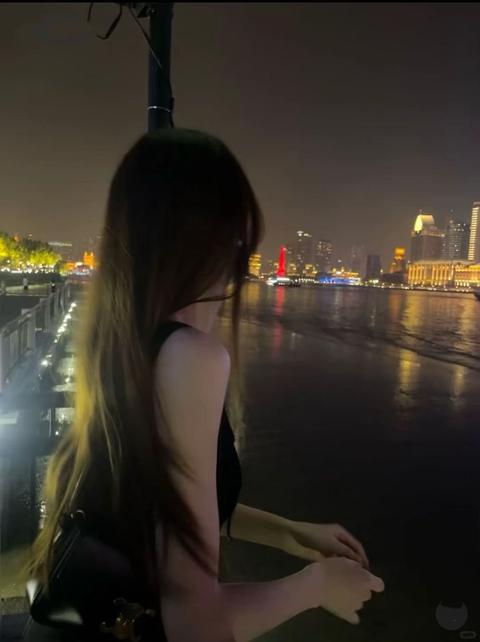
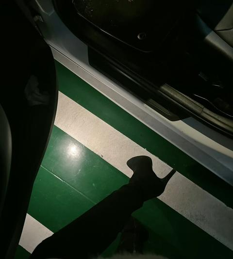

[toc]

# 问题

提问者：**<a href="https://www.zhihu.com/people/">匿名用户</a>**
提问时间: 2015-3-6 21:8:52
总回答数: 1194
总访问量: 30835680

不对啊……什么时候加上了钓鱼这个标签，  
题主是本着认真的态度来问的问题……  

  
附上题主的答案。

# 回答

回答者： **<a href="https://www.zhihu.com/people/csy-66-53">丞玄</a>**
回答时间: 2026-1-17 23:54:47
点赞总数: 1497
评论总数: 108
收藏总数: 476
喜欢总数：84

一年前在云南游历时碰到的一位姐姐，并非偷拍，当时我和我一个亲戚一起，他是个玩摄影的中年大叔，姐姐邀请大叔给她拍张照，我也顺手拍了一张，本来还说要约着在普者黑村里一起逛逛，可惜不了了之

  

原文地址：[(丞玄)你见过最美的背影是什么样的？](https://www.zhihu.com/question/28569292/answer/1996007565348345808) 

# 评论

1. <a href="https://www.zhihu.com/people/zhang-hao-72">张浩</a> (<small title="北京">2026-1-18 22:1:21</small>): 猛一看有点欧洲天主教壁画的感觉啊~
   - **丞玄** (<small title="湖北">2026-1-18 23:10:48</small>): 理工大佬好
2. <a href="https://www.zhihu.com/people/li-qi-long-23">小风</a> (<small title="湖北">2026-1-19 15:24:53</small>): 身材可以 面部感觉像地包天
   - <a href="https://www.zhihu.com/people/icaizi">依法论道</a> (<small title="山东">2026-1-20 22:38:38</small>): 老版本朱元璋吧
   - <a href="https://www.zhihu.com/people/hsin-60">Hsin</a> (<small title="江苏">2026-2-12 10:25:33</small>): 这哪里可以了？不就是穿的紧身吗
   - <a href="https://www.zhihu.com/people/mo-li-gu-yi-cheng-74">万里顾一程</a> (<small title="回复于 2026-2-13 21:41:11/北京"> ✉️:Hsin</small>): 我觉得可以啊，不胖不瘦，很完美啊
   - <a href="https://www.zhihu.com/people/yu-mo-13-18">郁墨</a> (<small title="回复于 2026-3-2 20:40:4/北京"> ✉️:依法论道</small>): 我也想起朱元璋来了［飙泪笑］
3. <a href="https://www.zhihu.com/people/luodabai">当一起</a> (<small title="广东">2026-1-19 17:3:57</small>): 这姐姐也只能看背影了。侧面可看出下巴太长，属于那种弯弓脸型，不好看的
   - <a href="https://www.zhihu.com/people/qia-qi-de-shi-jie">运筹唯沃</a> (<small title="辽宁">2026-1-21 12:46:45</small>): 但是下半身的状态也确实算精品了，不能什么都要求太高
4. <a href="https://www.zhihu.com/people/guo-zi-20-26">知道了</a> (<small title="云南">2026-1-18 17:23:34</small>): 我和我老婆也在这个位置拍过照 哈哈
   - **丞玄** (<small title="湖北">2026-1-18 17:34:43</small>): 祝幸福长久［爱］
   - <a href="https://www.zhihu.com/people/yang-zhi-23-49">Azhi</a> (<small title="广东">2026-3-13 11:8:44</small>): 这是云南的哪个位置呀
   - <a href="https://www.zhihu.com/people/guo-zi-20-26">知道了</a> (<small title="回复于 2026-3-15 20:29:51/云南"> ✉️:Azhi</small>): 普者黑景区，有个小山头上去就是
   - <a href="https://www.zhihu.com/people/guo-zi-20-26">知道了</a> (<small title="回复于 2026-3-15 20:30:9/云南"> ✉️:丞玄</small>): 哈哈 感谢［感谢］
5. <a href="https://www.zhihu.com/people/guan-shan-wen-dao">关山月</a> (<small title="上海">2026-1-19 9:23:29</small>): 瑜伽裤啊 挺尬的
   - <a href="https://www.zhihu.com/people/bang-da-li-hua">棒打梨花</a> (<small title="浙江">2026-1-20 10:50:36</small>): 无比言吊
6. <a href="https://www.zhihu.com/people/tan-quan-jin-10">smill</a> (<small title="湖北">2026-3-1 14:31:11</small>): 好看
   - **丞玄** (<small title="湖北">2026-3-1 14:39:19</small>): 这几天你热度很高，刷到你好几回了
7. **丞玄** (<small title="湖北">2026-1-18 14:30:17</small>): 还是直接上图有人看呀，认真写回答没人鸟［捂脸］［捂脸］
8. <a href="https://www.zhihu.com/people/zi-se-de-hu-li">紫色的狐狸</a> (<small title="美国">2026-1-20 14:44:19</small>): 
   - <a href="https://www.zhihu.com/people/bu-lian-gong-de-zhang-san-feng">不练功的张三疯</a> (<small title="河南">2026-5-13 16:57:54</small>): 这张还好［赞］［赞］［赞］
9. <a href="https://www.zhihu.com/people/qin-shu-zhuang">生命的奇迹</a> (<small title="云南">2026-3-16 0:13:46</small>): 这里是以树为中心的那个房屋二楼哈［大笑］［大笑］
10. <a href="https://www.zhihu.com/people/shi-xiao-78-50">施益达</a> (<small title="江苏">2026-1-19 15:2:37</small>): 人是美的，就是感觉有40 了。
    - **丞玄** (<small title="湖北">2026-1-19 15:5:3</small>): 23年以我一个大一的学生视角来看应该有30多［思考］［思考］
11. <a href="https://www.zhihu.com/people/9-34-92-42-18">塞考内吹斯特</a> (<small title="湖北">2026-1-20 11:2:4</small>): 珠圆獐？［思考］
12. <a href="https://www.zhihu.com/people/w1ix2t">神的孩子也在受苦</a> (<small title="四川">2026-1-21 9:17:37</small>): 欣赏不来
13. <a href="https://www.zhihu.com/people/6311188022">用户6311188022</a> (<small title="四川">2026-1-18 17:50:13</small>): 人猿泰山？
14. <a href="https://www.zhihu.com/people/fang-zi-chun-86">科技方子春</a> (<small title="山东">2026-1-20 12:37:33</small>): 好羡慕，我也想这么美。。。。
15. <a href="https://www.zhihu.com/people/niu-xiao-xiao-24">牛小小</a> (<small title="福建">2026-4-27 15:25:20</small>): 硬是拍出了”人猿泰山“的赶脚［捂脸］［doge］
16. <a href="https://www.zhihu.com/people/mai-qqqq">知乎用户uzgcUO</a> (<small title="广东">2026-1-20 10:9:55</small>): 朱元璋？［为难］
17. <a href="https://www.zhihu.com/people/lyrics-47-8">小青龙</a> (<small title="浙江">2026-1-24 12:25:21</small>): ［哇］这个身材真好看
18. <a href="https://www.zhihu.com/people/che-rui-15">车车</a> (<small title="四川">2026-1-20 17:37:5</small>): 照片有点过曝了，可以处理一下［飙泪笑］
19. <a href="https://www.zhihu.com/people/wei-shi-ji-jia-hong-cha-24">法律民工</a> (<small title="湖北">2026-1-19 9:49:13</small>): 背景好美啊，这是在云南哪个地方啊
    - **丞玄** (<small title="湖北">2026-1-19 10:1:6</small>): 文山普者黑青龙山，风景挺不错的
20. <a href="https://www.zhihu.com/people/tai-yang-hui-yue-ren">卡布奇诺灌大杯</a> (<small title="云南">2026-1-18 16:0:56</small>): 云南普者黑，好地方噢
21. <a href="https://www.zhihu.com/people/rise-worlds">西山听雨</a> (<small title="湖北">2026-6-3 22:11:56</small>): 还是在外面的小图好看［为难］
22. <a href="https://www.zhihu.com/people/22-33-22-23">西部大嫖客</a> (<small title="北京">2026-1-19 13:12:13</small>): 借不青龙山嘛? 五分钟登顶
    - **丞玄** (<small title="湖北">2026-1-19 19:4:26</small>): 大哥可以的，我帮我亲戚背着相机爬得还挺吃力
    - <a href="https://www.zhihu.com/people/22-33-22-23">西部大嫖客</a> (<small title="回复于 2026-1-19 19:40:42/北京"> ✉️:丞玄</small>): 有条近路,一直往前走,走到水边,再往上爬.前几天我在普者黑,马上天黑,我去拍夕阳,真的是五分钟登顶,上去后两分钟太阳就完全落山了.
 

    - **丞玄** (<small title="回复于 2026-1-19 21:33:7/湖北"> ✉️:西部大嫖客</small>): 当时我们也是准备去拍夕阳，可惜没赶上，你这张拍的很有生命力
23. <a href="https://www.zhihu.com/people/zai-kan-ni-yiyan-1">再看你一眼</a> (<small title="陕西">2026-1-18 15:7:50</small>): 要是编点后续故事肯定人气更高［思考］
    - **丞玄** (<small title="湖北">2026-1-18 15:24:4</small>): 现在编还来得及吗［思考］
    - <a href="https://www.zhihu.com/people/zai-kan-ni-yiyan-1">再看你一眼</a> (<small title="回复于 2026-1-18 16:9:59/陕西"> ✉️:丞玄</small>): 来得及，最好加点瑟瑟和出轨元素，知乎的老哥最爱看
    - **丞玄** (<small title="回复于 2026-1-18 16:32:33/湖北"> ✉️:再看你一眼</small>): 真实了［飙泪笑］［飙泪笑］
24. <a href="https://www.zhihu.com/people/mu-zi-li-42-99-19">木子李</a> (<small title="云南">2026-7-15 9:59:17</small>): 你是只想和她一起逛逛么？你这可惜不了了之我能看得出来你无尽的遗憾
    - **丞玄** (<small title="湖北">2026-7-15 10:31:41</small>): 当时年纪还小，真没想太多，小有遗憾罢了［捂脸］［捂脸］［捂脸］
25. <a href="https://www.zhihu.com/people/zhimmylx">晓晓</a> (<small title="河南">2026-7-12 10:27:50</small>): 为什么把秋裤穿出门？
    - **丞玄** (<small title="湖北">2026-7-15 10:33:16</small>): 拍照显身材呗［捂脸］
26. <a href="https://www.zhihu.com/people/heyhm-44">Heyhm</a> (<small title="广东">2026-7-10 17:44:49</small>): 想起来前任就在文山
    - **丞玄** (<small title="湖北">2026-7-10 17:58:6</small>): 还想着对方吗［思考］
27. <a href="https://www.zhihu.com/people/jing-hou-chen-guang-19">静候晨光</a> (<small title="北京">2026-7-3 12:27:28</small>): 她的衣服呢？
28. <a href="https://www.zhihu.com/people/chen-guan-qiao-11">执明矛的塔克</a> (<small title="江苏">2026-7-2 20:8:33</small>): 有种老欧洲的贵族风范。
29. <a href="https://www.zhihu.com/people/vanhalen-">v大熊</a> (<small title="天津">2026-6-29 11:20:54</small>): ［赞］
30. <a href="https://www.zhihu.com/people/jensen-12">jensen</a> (<small title="陕西">2026-6-5 19:0:6</small>): 这种瑜伽裤你们把握不住的。
31. <a href="https://www.zhihu.com/people/cheng-yu-xi">蟋蟀君</a> (<small title="河北">2026-1-18 17:16:0</small>): 你拍的不错
    - **丞玄** (<small title="湖北">2026-1-18 18:16:1</small>): 谢谢哥的认可
    - <a href="https://www.zhihu.com/people/cheng-yu-xi">蟋蟀君</a> (<small title="回复于 2026-1-18 18:43:52/河北"> ✉️:丞玄</small>): 但是还可以更好一些，人物不全
    - **丞玄** (<small title="回复于 2026-1-18 18:51:21/湖北"> ✉️:蟋蟀君</small>): 当时也没想着拍的怎么怎么样，单纯觉得这个姐姐身材挺好的就顺手一拍了
32. <a href="https://www.zhihu.com/people/lanpin">lanpin</a> (<small title="广西">2026-1-19 15:56:23</small>): 无疾而终？？
    - **丞玄** (<small title="湖北">2026-1-19 16:27:15</small>): 我印象中这个词语可以用来表示事情没有后续，不了了之吧
    - **丞玄** (<small title="湖北">2026-1-19 16:31:34</small>): 要是后续真有点互动还能编点小故事，知友们应该挺喜欢看的
33. <a href="https://www.zhihu.com/people/zai-bie-chu-52">墙外行人</a> (<small title="四川">2026-1-19 18:31:6</small>): 哈哈哈
34. <a href="https://www.zhihu.com/people/ying-tong-meng">石石</a> (<small title="湖南">2026-1-19 15:51:46</small>): 要是把头发拨到右边遮住脸那该多好
    - **丞玄** (<small title="湖北">2026-1-19 16:28:8</small>): 背影杀手，距离产生美［捂脸］［捂脸］
35. <a href="https://www.zhihu.com/people/ren-ji-yi-pan-xuan-63">任记忆盘旋</a> (<small title="广东">2026-4-17 11:4:41</small>): 她是不是姓朱？
    - **丞玄** (<small title="湖北">2026-4-17 14:30:29</small>): 不是吧，这只有个背影也能认出来？
    - **丞玄** (<small title="湖北">2026-4-17 16:22:13</small>): 回复被删了
36. <a href="https://www.zhihu.com/people/hao-ming-xian-sheng-75-4">xin9</a> (<small title="湖北">2026-3-16 10:35:29</small>): 愿大家都能为自由而活
 

37. <a href="https://www.zhihu.com/people/wo-ye-you-guo-shou-de-shi-hou">海城迷雾</a> (<small title="山东">2026-3-3 15:37:42</small>): 能有一米6？
38. <a href="https://www.zhihu.com/people/wu-qing-hong-9-53">快乎抖乎知</a> (<small title="广东">2026-1-25 15:20:46</small>): 看着下巴就长得一般
39. <a href="https://www.zhihu.com/people/86-27-10-87">晚晚</a> (<small title="湖北">2026-1-24 10:4:13</small>): 之前朋友给拍的 还是很喜欢［感谢］
 

    - **丞玄** (<small title="湖北">2026-1-25 13:17:46</small>): 喜欢你朋友，拍的真好
40. <a href="https://www.zhihu.com/people/xi-hu-zuo-si">弥鹿不迷路</a> (<small title="浙江">2026-1-21 11:55:35</small>): “无疾而终”是一个汉语成语，意为没有病就死了［发呆］［发呆］［发呆］
    - **丞玄** (<small title="湖北">2026-1-21 14:4:57</small>): 我平常口语会把这个词用在约好某件事但是没后后续的情景下，等会改成不了了之
41. <a href="https://www.zhihu.com/people/lao-na-fa-hao-ken-de">云南权志龙</a> (<small title="广东">2026-1-21 14:5:21</small>): 这风景不说还以为是广西 。 这美女五官略平，身材霸道
    - **丞玄** (<small title="湖北">2026-1-21 14:7:45</small>): 当时是从广东东莞出发经广西到云南昆明，感觉广西和云南两地风景确有相似之处
42. <a href="https://www.zhihu.com/people/jingxiangxi">静骧兮</a> (<small title="湖北">2026-1-21 14:0:36</small>): 差点看成露背的美女无疾而终……
43. <a href="https://www.zhihu.com/people/44-22-35-96">李慕晚m</a> (<small title="湖北">2026-1-21 9:37:10</small>): 影子可以？
 

    - **丞玄** (<small title="湖北">2026-1-21 9:59:38</small>): 道路千万条，安全第一条，不要“踩”实线哦［惊喜］［惊喜］
44. <a href="https://www.zhihu.com/people/yao-tou-wan-46">姚头丸</a> (<small title="湖北">2026-1-20 2:37:38</small>): 哥，咱勤擦擦镜头行不
    - **丞玄** (<small title="湖北">2026-1-20 8:5:18</small>): 用了4年的手机拍的，看着有点糊［捂脸］
45. <a href="https://www.zhihu.com/people/61-38-18-51">晚风</a> (<small title="江苏">2026-1-19 16:52:38</small>): 去头可食
    - <a href="https://www.zhihu.com/people/wo-fo-65-64">顺口溜考研招生办</a> (<small title="山东">2026-1-19 17:31:10</small>): ？？？特么地这词是这么用的［捂脸］［捂脸］
46. <a href="https://www.zhihu.com/people/san-shao-ye-24">三少爷</a> (<small title="广西">2026-1-20 0:19:34</small>): 只可远观
47. <a href="https://www.zhihu.com/people/li-xiang-li-6">半个月亮爬上来</a> (<small title="陕西">2026-5-17 10:18:59</small>): 穿这鬼样子拍照，说不是钓鱼的都不信
48. <a href="https://www.zhihu.com/people/zhou-zhi-yuan-71-51">智者四海</a> (<small title="湖北">2026-1-21 15:32:46</small>): 从后面［酷］
49. <a href="https://www.zhihu.com/people/ai-joe">艾法</a> (<small title="陕西">2026-1-21 17:0:44</small>): 这姐们有点反颌啊，朱元璋脸型
50. <a href="https://www.zhihu.com/people/lu-ren-47-18">彩笔</a> (<small title="云南">2026-1-23 2:36:31</small>): 看侧脸这么丑……普通颜值都到不了
51. <a href="https://www.zhihu.com/people/dontdomafia">善良泽宇</a> (<small title="广东">2026-4-21 14:1:44</small>): 确实是地包天，全靠氛围了
52. <a href="https://www.zhihu.com/people/yu-zhi-da-66">高漱澍</a> (<small title="重庆">2026-3-9 1:55:33</small>): 可惜了是个鞋拔子
53. <a href="https://www.zhihu.com/people/wang-kaka-43">wang_kaka</a> (<small title="河南">2026-5-15 11:37:29</small>): 我管你这那的.JPG
54. <a href="https://www.zhihu.com/people/jt61016">不喝咖啡的程序猿</a> (<small title="福建">2026-1-20 22:8:50</small>): 没见过女人嘛［捂脸］
    - **丞玄** (<small title="湖北">2026-1-20 23:15:35</small>): 年龄尚小，阅女不足，这位姐姐确实谈不上多漂亮，不过身材是我喜欢的类型
55. <a href="https://www.zhihu.com/people/kriss-wang">开水计划</a> (<small title="陕西">2026-1-18 19:17:40</small>): 怎么还删评论？下巴长就是下巴长，还不让人说了？
    - <a href="https://www.zhihu.com/people/54-69-47-93">你好呀</a> (<small title="上海">2026-1-18 19:41:16</small>): ［捂脸］朱元璋
    - **丞玄** (<small title="湖北">2026-1-18 19:26:8</small>): 我没删啊哥，我当时也觉得下巴有点长，只不过身材比较好才想拍一张

=[评论](./attachments/comments.json)

