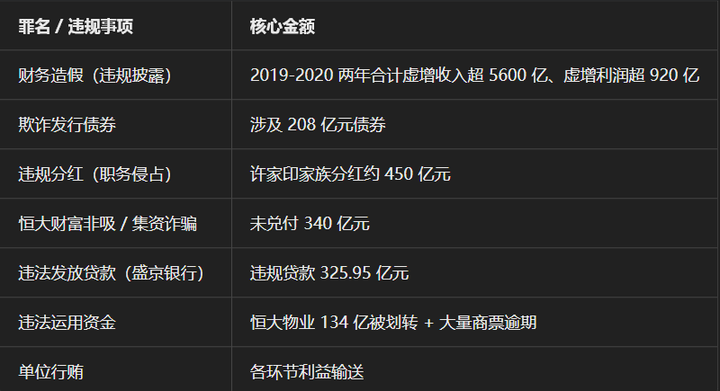
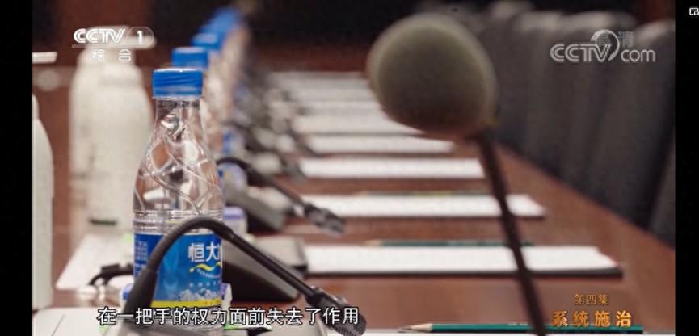

[toc]

# 问题

提问者：**<a href="https://www.zhihu.com/people/siri-80-76-24">Siri</a>**
提问时间: 2026-7-15 10:18:11
总回答数: 38
总访问量: 645966

许家印现在后悔了吗？

# 回答

回答者： **<a href="https://www.zhihu.com/people/zhi-hu-zhe-ye-18-33-60">之乎者也</a>**
回答时间: 2026-7-16 8:38:23
点赞总数: 2156
评论总数: 168
收藏总数: 1206
喜欢总数：61

许家印后不后悔没人知道，但他以及背后的那些人肯定有后悔的，这是一场巨大的倒台秀，众多官员陆陆续续落马，恒大的崩塌不是行业第一，但却成为众矢之的，大概就是这个无形的利益网的原因，做到了前无古人后无来者。

一、地方省部级党政主官（土地、项目、地方融资保护伞）

1.   **陈如桂（深圳市原市长、广州市原住建委主任）**   
    长期在广州、深圳任职，二十余年利用土地审批、旧改资源为恒大低价拿地、落地总部提供便利，受贿 1.08 亿余元，一审判处无期徒刑。恒大 2017 年将总部从广州迁入深圳，其任职期间给予大量政策倾斜。
2.   **孙志刚（贵州省委原书记）**   
    以扶贫名义纵容恒大在贵州低价大规模圈地、简化项目审批，收受贿赂 8.13 亿元，一审死刑缓期二年执行，终身监禁、不得减刑假释。
3.   **唐一军（司法部原部长、辽宁省原省长）**   
    在辽宁任内推动恒大入主盛京银行，放任恒大从该行违规套取超千亿资金，造成巨额坏账，受贿 1.37 亿元，判处无期徒刑。
4.   **蒋超良（湖北省委原书记）**   
    主政湖北期间多次与许家印会面，盲目引进恒大巨额投资项目，放松监管，留下大量恒大烂尾楼盘，2025 年被中央纪委立案审查。

二、国有大行、金融系统高管（违规放贷、明股实债输送资金）

1.   **孙德顺（中信银行原行长）**   
    违规向恒大投放巨额信贷，受贿 9.795 亿元，死缓、终身监禁，是金融系统涉恒大贪腐金额最高官员之一。
2.   **刘连舸（中国银行原董事长）**   
    为恒大违规审批大额授信，助力其高杠杆扩张，受贿 1.21 亿元，一审死缓。
3.   **李晓鹏（光大集团原董事长、光大银行原行长）**   
    通过 “明股实债” 等方式为恒大输送资金，家族式腐败，受贿 6043 万余元，获刑 15 年。
4.   **田惠宇（招商银行原行长）**   
    违规向恒大大规模放贷，深度卷入恒大融资链条，已被查处判刑。
5.   **姜丽明（原银保监会农金部主任，后任恒大副总裁）**   
    典型 “逃逸式辞职”，在职时利用监管职权为恒大疏通金融渠道，离职后直接入职恒大任职高管，被开除党籍、移送司法。
6.   **孙亮（山东高速集团原董事长）**   
    违规动用省属国企数百亿资金入股、拆借恒大，造成国有资产重大损失，落马获刑。

三、体育系统官员（依托恒大足球俱乐部利益输送）

1.   **苟仲文（国家体育总局原局长）**   
    借助恒大足球俱乐部运营、赛事资源开展权钱交易，为恒大体育板块发展提供特殊政策扶持，被立案查处。
2.   **王小平（中国足协纪律委员会原主任）**   
    2015—2019 年为广州恒大俱乐部减轻处罚、规避竞赛处分，单独收受恒大相关贿赂 400 万元，总受贿 645 万，获刑十年六个月。

上面这些贪官也只是冰山一角，由此揭开的反腐大幕这些年不知道多少人涉及其中。

对于企业内部，许多高管也被控制，许多员工也因此彻底改变人生。

我看很多人关注，那再补充恒大被抓的。

一、集团最高决策层

1.   **许家印（恒大集团原董事局主席、实控人）** 

-   2023 年 9 月 28 日被依法采取强制措施；
-   涉案罪名：集资诈骗、非法吸收公众存款、欺诈发行证券、财务造假、单位行贿、挪用资金等；
-   2026 年 4 月深圳中院开庭审理，当庭认罪，择期宣判；证监会顶格罚款 4700 万、终身证券市场禁入。

1.   **许腾鹤（许家印二儿子，恒大财富核心负责人）** 

-   2023 年 9 月同步被带走调查；
-   负责恒大财富理财产品发行、海外资产转移，列入 42 人公诉名单。

1.   **潘大荣（恒大原 CFO 首席财务官）** 

-   2023 年 9 月刑拘；
-   全盘操盘 5640 亿元巨额财务造假，统筹虚增收入、资金腾挪；罚款 900 万、十年市场禁入，已审查起诉。

1.   **夏海钧（原恒大董事局副主席、行政总裁）** 

-   财务造假总负责人，组织编制虚假年报、爆雷前离岸套现转移数百亿资产；证监会终身市场禁入、罚款 1500 万；
-   案发后失联境外，境内司法追责、全球冻结 600 亿港元资产，同步纳入刑事追责链条。

二、恒大财富板块（理财暴雷核心涉案人员）

1.   **杜亮（恒大财富原总经理、法定代表人）** 

-   2021 年 9 月最先被警方抓捕；
-   搭建 921 亿理财资金池，爆雷前违规内部兑付千万资产，一审被判 **无期徒刑** ，没收全部个人财产。

1.   **姚本财（恒大财富副总经理）** 

-   同步刑拘，负责全国渠道推广、客户资金吸纳，一并起诉。

1.  各地恒大财富分公司总经理、财务负责人数十人，全部纳入 42 人涉案名单。

三、恒大汽车板块

 **刘永灼（恒大汽车原总裁）** 

-   2024 年 1 月被刑拘；
-   涉嫌挪用恒大汽车建设资金、量产数据造假、违规关联交易，主导恒大汽车盲目扩张造成巨额资金流失，已审查起诉。

四、恒大物业、地产集团高管

1.   **甄立涛（恒大物业原董事长）** 

-   涉 134 亿物业存款违规质押挪用案，刑拘、审查起诉；证监会同步行政处罚、市场禁入。

1.   **柯鹏（恒大地产原总裁）** 

-   负责地产经营、旧改利益输送、配合财务造假，被刑拘起诉..。

1.   **钱程、潘翰翎（地产副总裁、财务高管）** 

-   年报造假直接执行者，均被刑事立案 + 证券处罚。

五、金融 / 保险板块涉案高管

 **朱加麟（恒大人寿前董事长）** 

-   2023 年 9 月被带走调查，保险资金违规向恒大关联方输送利益，同步纳入公诉范围；金融监管总局多重处罚、行业禁入。

看关注度这么高，就再补充一下许家印当庭认罪的几项罪名的简单逻辑（不展开了，过于复杂）：

 **逻辑主线** ：为了回 A 对赌业绩承诺（战投） → 财务造假虚增利润 → 基于假数据发债融资 + 高额分红套现 → 三道红线后资金链断裂 → 向内（恒大财富 / 员工 / 供应商）、向外（盛京银行 / 挪用物业资金）全方位违规抽血续命 → 全程靠行贿打通各环节

那么现在恒大集团现状如何，补充如下。

 **集团总部** ：中国恒大（港股）2025 年 8 月退市、香港清盘中；恒大地产（深圳）2026 年 3 月正式破产清算，超 39 家子公司陆续进入破产程序。

  

你若问许家印后不后悔，他吃了喝了享受了，只能说不亏。

\~~~~~~~~~~~~~~~~~~~~~~~~~~~~~~~~~~~~~~~~~~~~~~~~~~~~~~

其实在恒大崩盘之前，已经有一家公司悄悄完成了重组，而这家公司早在2019年就以负债近万亿，2020年开始破除重组，2022年完成，这就是《海航重组案》，不知道许家印有没有关注这个案子，亦或是他只注意到了大而不倒。

很多贪官官方判决大多不会直接说明和哪些企业勾连，而22年央视播出的反腐大片《零容忍》第四集孙德顺相关内容时，直接给了恒大冰泉特写，已经是明示了，此时许家印不知道意没意识到一年之后自己就要被拘。2023年9月许被拘，10月刘连舸也被拘。

而许家印这么招人恨，一方面是过于高调、膨胀，一方面是他和他背后的那些人做出来的事情都自绝于社会、老百姓。曾自诩“我能不能流芳百世”，可笑如今“遗臭万年”。

  

原文地址：[(之乎者也)许家印现在后悔了吗？](https://www.zhihu.com/question/2060669486961780723/answer/2061006761117717654) 

# 评论

1. <a href="https://www.zhihu.com/people/foreverwithu">zhulei</a> (<small title="北京">2026-7-17 9:34:40</small>): 这些人都不会后悔。
 
  
 
如果他们后悔，估计会后悔两点1、当初不如多捞点，2、为啥不早点跑？
   - <a href="https://www.zhihu.com/people/cqn1010">cqn1010</a> (<small title="浙江">2026-7-17 11:49:9</small>): 跑不掉的，这么大的案，你跑到哪里去都会把你抓回来
   - <a href="https://www.zhihu.com/people/2-57-30-10-81">谜语人2号</a> (<small title="回复于 2026-7-17 13:41:12/四川"> ✉️:cqn1010</small>): 天真，跑到没有签引渡协议的国家你还敢去把人绑回来不成？
   - <a href="https://www.zhihu.com/people/hao-deng-ha-v">好等哈v</a> (<small title="回复于 2026-7-17 15:45:15/广东"> ✉️:谜语人2号</small>): 一个国家是否与中国签有引渡条约，只是影响司法合作的效率与路径，并不构成无法遣返的绝对屏障
   - <a href="https://www.zhihu.com/people/tian-shuo-10-6">西瓜皮大将军</a> (<small title="回复于 2026-7-18 14:40:25/广西"> ✉️:谜语人2号</small>): 做利益交换回来，美国遣返润人就是要搭着红通国内才接收。
   - <a href="https://www.zhihu.com/people/hong-san-xiao-mei-ren">红伞小美人</a> (<small title="回复于 2026-7-18 16:0:57/广西"> ✉️:谜语人2号</small>): 天真！还能跑出地球吗？只要在地球上，只要有追捕的价值，跑到哪里去都能抓回来，实在麻烦给当地留个尸体也不难。
   - <a href="https://www.zhihu.com/people/foreverwithu">zhulei</a> (<small title="回复于 2026-7-19 9:26:50/北京"> ✉️:cqn1010</small>): 我国的法律和其它大多数国家没有互相的管辖权。大陆的警方到香港抓人都有很大的程序问题呢。
 
  
 
一旦跑出去，就很难抓回来了。
   - <a href="https://www.zhihu.com/people/tses-22">tses</a> (<small title="回复于 2026-7-19 19:23:47/广东"> ✉️:cqn1010</small>): 夏海钧跑去美国一点事没有
   - <a href="https://www.zhihu.com/people/bai-huang-16-85">cagge</a> (<small title="回复于 2026-7-19 20:4:4/江苏"> ✉️:红伞小美人</small>): 你跑美国是真欠CIA收拾了，富豪润人为啥润美国，CIA实力毋庸置疑
   - <a href="https://www.zhihu.com/people/qin-xiao-liu-liu-liu">66不溜溜</a> (<small title="回复于 2026-7-20 11:41:2/浙江"> ✉️:红伞小美人</small>): 你在做什么春梦？其他的不说，那么多跑美国的你去抓啊
   - <a href="https://www.zhihu.com/people/yuki-61-56-70">猪肝君君君</a> (<small title="回复于 2026-7-20 16:3:9/河北"> ✉️:tses</small>): 会让国家费劲往回追的要么明里影响巨大，要么暗里影响巨大，你要普通贪官跑出去不会费劲追的，你说的这个夏什么你不说我都不知道这个人，不可能费半天劲追他的，许家印这种造成这么大影响恶劣影响的不会不追的
   - <a href="https://www.zhihu.com/people/anson-jiang-24">Anson Jiang</a> (<small title="回复于 2026-7-21 22:15:6/湖南"> ✉️:cqn1010</small>): 夏海钧：真的吗？
   - <a href="https://www.zhihu.com/people/zhang-mou-17-7">张某</a> (<small title="回复于 2026-7-22 9:51:45/北京"> ✉️:cqn1010</small>): 贾队长抓回来没［为难］
   - <a href="https://www.zhihu.com/people/sunag03">sunag03</a> (<small title="回复于 2026-7-22 13:2:35/海南"> ✉️:cqn1010</small>): 希望你说的是对的。虽然我和恒大没有一毛钱关系，但是看到那么多人受害，还是希望能把夏海钧抓回来，把他的财产拿来给受害者挽回一点损失。
2. <a href="https://www.zhihu.com/people/deng-deng-deng-deng-deng-deng-37">将深蓝</a> (<small title="广东">2026-7-17 6:14:16</small>): 所以说哪有什么平庸之恶，我只看到了积极主动，不择手段，努力钻营的作恶
   - <a href="https://www.zhihu.com/people/38-27-29-16">二十八鱼</a> (<small title="山东">2026-7-17 10:57:0</small>): 从另一个角度看，老许是不是为国人做出了巨大的贡献啊？你想啊，借了外国那么多钱来补贴我们的房地产发展，才终于把房地产价格降到了普通老百姓可以接受的程度，如果没有老外资金的支持，房地产价格岂不是会更高？从这一点来说，老许是不是无愧国人啊？我不懂，只是觉得欠了那么多的钱，房子卖得还很贵，感觉就很离谱。
   - <a href="https://www.zhihu.com/people/he-chun-qiu-63">纪委督查室主任</a> (<small title="回复于 2026-7-17 11:5:59/广西"> ✉️:二十八鱼</small>): 你知道不知道许家印润了多少钱出国？
   - <a href="https://www.zhihu.com/people/zhai-zhai-37-22">宅宅</a> (<small title="回复于 2026-7-17 12:58:39/北京"> ✉️:二十八鱼</small>): 你真以为恒大在美国发的债是美国资本买的吗？看看许家印被抓完整证据链条吧，他是把国内的资产套现去买恒大在国外发的债，从而完成资本外逃。［尴尬］
   - <a href="https://www.zhihu.com/people/dou-dou-li-you-guo-guo">兜兜里有果果</a> (<small title="回复于 2026-7-17 16:2:14/上海"> ✉️:二十八鱼</small>): 有没有可能那个所谓的外债是许家印的手套公司自己买自己发行的高利息债券，花样转移资金的渠道而已。
   - <a href="https://www.zhihu.com/people/yi-lou-ting-feng-yu-56-28">风雨江湖</a> (<small title="江苏">2026-7-18 21:23:39</small>): 是极力钻营，不是努力钻营。他许家印配不上努力二字。
   - <a href="https://www.zhihu.com/people/tc-lll">先随便起一个名字</a> (<small title="回复于 2026-7-19 8:55:34/加拿大"> ✉️:二十八鱼</small>): 别的都不说，现在房价降到了普通人可以接受的程度？
   - <a href="https://www.zhihu.com/people/rty-73-47">戒色</a> (<small title="上海">2026-7-19 10:8:50</small>): 努力也有错了？
   - <a href="https://www.zhihu.com/people/catrkmhh">小看山CatrKMHh</a> (<small title="陕西">2026-7-19 10:18:17</small>): 我经常跟青年同学们在一起做事，我发现他们的人生观到现在都还没建立，还有些人几十岁了，我发现都没人生观哦，我说：你究竟想做一个什么样子的人嘛，他们都是这个样子：“我也不知道。”你也不知道，谁知道啊？  
 
  
 
不管你做哪一种职业、哪一种地位、实行哪一种事业，都有一个关键：先建立自己，那么，要建立自己，“诚身有道，不明乎善”，天下到底哪样是真正的对？  
 
  
 
这点必须要搞清楚哦，我说你们都是水面上的浪花，这个浪头一冲，冲到哪里就在哪里，都是随缘而遇，自己没有真正站起来过，你想做什么嘛，你要做怎么一个人嘛，你说我想做一个躺下来的人，也好啊，永远躺着也好，可是你躺不住的啊，躺不住就随波逐流了，叫你听命呢，又不服气，那么你有本事领.导别人，你创个业，你也可以去开个工厂、开个公司，做一件事业，养个千把、万把人，你能够给千把、万把人靠你吃饭，你就了不起喽！  
 
  
 
你要晓得哦，如果有八、九万人靠你吃饭，别人还有老婆、还有父亲、还有母亲，曾经有一年经.济很不.景气，一位办工厂的老.板来跟我谈话，他说：哎呀，我很想摆下，痛苦啊，想放下不干了，我说你不能放下，他说：对呀，我一放下来以后，二十万人没有饭吃，他说我工厂人多少万，每个都有家庭，我如果一不干，整个就垮了，所以说赚钱就要开下去，不赚钱除非我死掉，我说：哎，你这就是菩萨心肠，不管如何要撑下去，实际这就是人生观！  
 
  
 
你要做一个什么人嘛，这个理搞不清楚啊，就“不诚乎身矣”，身不能诚，此身不能诚，上面一切都垮了，“诚”是一个基础，天地永远是诚，所以天地生生不已，几千万年她没有怨恨人，没有要求人报答她什么，她永远给万物、给人类生命，给万物生机，这就是天道的境界！  
 
  
 
现在很多年轻人，一听到中 国文化的“诚”，就立马对等了诚实，其实真正的“诚”是非常不简单的，诚实只占“诚”里面的1%而已，而剩下的99%很少有人能懂，“诚”实际上指的是一个人能真正的看清一切国 际国 内社会人文大大小小的客观事实、看透自己身心性命的天地原理，知道自己生从何处来、死向何处去，有一丝生命的疑惑都会打破砂锅研究透，绝不会自欺欺人糊弄自己，怎么样，“诚”很难吧？？？
   - <a href="https://www.zhihu.com/people/xing-ye-yu-60">星夜雨</a> (<small title="回复于 2026-7-20 0:9:48/美国"> ✉️:先随便起一个名字</small>): 这几年房价大幅下降距离许家印被抓有很明显的时间差吧
   - <a href="https://www.zhihu.com/people/li-hang-98-61">李航</a> (<small title="美国">2026-7-21 13:26:18</small>): 不存在
   - <a href="https://www.zhihu.com/people/peng-bo-de-yu-wang">蓬勃的欲望</a> (<small title="湖南">2026-7-21 14:0:37</small>): 爽过了不后悔［打招呼］，孩子老婆都去国外了，基金花不完
   - <a href="https://www.zhihu.com/people/peng-bo-de-yu-wang">蓬勃的欲望</a> (<small title="回复于 2026-7-21 14:1:33/湖南"> ✉️:二十八鱼</small>): 房子没得，每个月房贷一分不少，你是一点不谈啊，这么算账？
   - <a href="https://www.zhihu.com/people/xue-ding-e-de-mao-95-7">永远的林登万</a> (<small title="回复于 2026-7-24 1:56:15/广东"> ✉️:二十八鱼</small>): 赢学家不管怎么样都能赢［捂脸］
3. <a href="https://www.zhihu.com/people/meng-xiang-29-87">一路飞扬</a> (<small title="山东">2026-7-17 7:59:57</small>): 山东高速最后损失并不是很大［捂脸］爆雷前唯一逃脱的一家公司。
   - <a href="https://www.zhihu.com/people/mou-ze-chuan-64">何处惹尘埃</a> (<small title="山东">2026-7-17 10:33:28</small>): 对啊，山东高速早就跑了啊，只是深圳接盘了
   - <a href="https://www.zhihu.com/people/you-na-ge-fei-fei">有那个飞飞</a> (<small title="回复于 2026-7-17 17:30:35/福建"> ✉️:何处惹尘埃</small>): 深圳接了恒大，又接了万科，眼光真好［尴尬］
   - <a href="https://www.zhihu.com/people/pidanddrou">tutuzi</a> (<small title="回复于 2026-7-18 2:6:52/湖南"> ✉️:有那个飞飞</small>): 还是因为血条厚，耐造，换别的一线城市都被折腾够呛
   - <a href="https://www.zhihu.com/people/hui-yi-29-68">灰翼</a> (<small title="山东">2026-7-18 12:35:46</small>): 第三期本金没拿回来，不过大头回来了
   - <a href="https://www.zhihu.com/people/li-hua-sheng-18-60">李华生</a> (<small title="回复于 2026-7-19 23:54:59/广东"> ✉️:tutuzi</small>): 换作广州，估计半死不活了，本来广州这个状况就好不了［飙泪笑］
   - <a href="https://www.zhihu.com/people/pidanddrou">tutuzi</a> (<small title="回复于 2026-7-20 3:15:32/湖南"> ✉️:李华生</small>): 除了北上广深，其余的所谓的一线城市或者是省会城市都是外强中干
   - <a href="https://www.zhihu.com/people/zhuo-yuan-65-32">卓越</a> (<small title="山东">2026-7-20 8:46:6</small>): 还有100多个小目标没要回来，深圳国资企业摆烂就是不还你山东高速又能怎么样？
   - <a href="https://www.zhihu.com/people/lu-da-gun-72-99">知不道</a> (<small title="回复于 2026-7-21 3:55:6/山东"> ✉️:卓越</small>): 100不多，过路费很快就收回来［捂脸］
   - <a href="https://www.zhihu.com/people/sth-p">夜色寂然</a> (<small title="回复于 2026-7-22 10:5:55/安徽"> ✉️:知不道</small>): ［捂脸］气笑了
4. <a href="https://www.zhihu.com/people/mycaier">mycaier</a> (<small title="江苏">2026-7-17 8:5:18</small>): 没有死刑，果然留有后手
   - <a href="https://www.zhihu.com/people/me-too-89-91">me too</a> (<small title="陕西">2026-7-17 11:24:51</small>): 当官的能给自己后路断了？
   - <a href="https://www.zhihu.com/people/0mosgq">知乎用户nZ83xl</a> (<small title="辽宁">2026-7-17 12:32:48</small>): 防止狗急跳墙
   - <a href="https://www.zhihu.com/people/jin-wan-da-tiger">今晚打tiger</a> (<small title="湖南">2026-7-18 0:19:38</small>): 经济犯罪和职务犯罪不搞死刑是很大的深意。经济犯罪最重要的是要犯罪者把钱吐出来挽回损失，很明显这种关押人不断施压让人赎罪的方式是最好的。职务犯罪是避免因为一旦斗争失败就会被扣上罪名而死，也为了避免有能量的人搞鱼死网破狗急跳墙。试想一下如果失败就会死，那么很难保证这些人做出什么疯狂的事来，其危害远超恐怖袭击。
   - <a href="https://www.zhihu.com/people/jin-wan-da-tiger">今晚打tiger</a> (<small title="回复于 2026-7-18 14:22:6/湖南"> ✉️:知乎用户nZ83xl</small>): 我再进一步总结一句职务犯罪这方面的：防止胜利方斩尽杀绝，防止失败方狗急跳墙。
   - <a href="https://www.zhihu.com/people/54-3-47-22">神圣之安拉</a> (<small title="回复于 2026-7-18 23:12:4/江西"> ✉️:今晚打tiger</small>): ［好奇］自罚三杯
   - <a href="https://www.zhihu.com/people/sheng-ming-de-yi-yi-41">生命的意义</a> (<small title="福建">2026-7-19 3:2:49</small>): 估计是钱基本还在国内
   - <a href="https://www.zhihu.com/people/wen-ti-zhong-nian">完梦好</a> (<small title="回复于 2026-7-19 9:30:37/广东"> ✉️:神圣之安拉</small>): 钱吐出来
   - <a href="https://www.zhihu.com/people/30-11-79-68-43">一百个飞鱼</a> (<small title="回复于 2026-7-19 13:39:54/甘肃"> ✉️:me too</small>): 当官的自己都被判死刑了
   - <a href="https://www.zhihu.com/people/30-11-79-68-43">一百个飞鱼</a> (<small title="回复于 2026-7-19 13:42:8/甘肃"> ✉️:神圣之安拉</small>): 无期叫自罚三杯啊
   - <a href="https://www.zhihu.com/people/54-3-47-22">神圣之安拉</a> (<small title="回复于 2026-7-19 23:29:31/江西"> ✉️:一百个飞鱼</small>): ［飙泪笑］［飙泪笑］能坐多久，什么监狱［好奇］什么生活水平
   - <a href="https://www.zhihu.com/people/li-hang-98-61">李航</a> (<small title="回复于 2026-7-21 13:26:44/美国"> ✉️:今晚打tiger</small>): 不存在
5. <a href="https://www.zhihu.com/people/115213">115213</a> (<small title="江苏">2026-7-18 16:8:20</small>): 别的不说，给恒大千亿自己只拿1亿+，这也太清廉了［思考］莫非他们也只是马仔［尴尬］
   - <a href="https://www.zhihu.com/people/ren-zhen-de-xiang-zhi-gou">认真的像只狗</a> (<small title="山东">2026-7-19 2:30:29</small>): 本来就是［捂脸］
6. <a href="https://www.zhihu.com/people/shi-qiao-32-57">风雨石桥</a> (<small title="陕西">2026-7-17 8:24:9</small>): 以上，怎么没有文化界的人？  
 
怎么没有经济学界的人？  
 
怎么没有媒体界的人？  
 
不应该啊
   - <a href="https://www.zhihu.com/people/bzliihvg">小看山BzLIihVg</a> (<small title="广东">2026-7-17 10:4:44</small>): 文娱和实体，一般情况要不到一块，恒大有自己的歌舞团，所以不需要和文娱深入合作
   - <a href="https://www.zhihu.com/people/happy-81-79">欢乐世界</a> (<small title="广东">2026-7-17 10:13:58</small>): 还有法律届的
   - <a href="https://www.zhihu.com/people/he-chun-qiu-63">纪委督查室主任</a> (<small title="回复于 2026-7-17 11:9:11/广西"> ✉️:小看山BzLIihVg</small>): 明白人［赞］［赞］［赞］
   - <a href="https://www.zhihu.com/people/chang-jiang-8-52">狮驼岭三把手</a> (<small title="埃及">2026-7-17 15:38:51</small>): 国内的评级机构勉强算经济学届的？
   - <a href="https://www.zhihu.com/people/28-76-93-49">牢固哥</a> (<small title="回复于 2026-7-22 9:59:33/浙江"> ✉️:小看山BzLIihVg</small>): 范冰冰表示我们有深度合作的
   - <a href="https://www.zhihu.com/people/bzliihvg">小看山BzLIihVg</a> (<small title="回复于 2026-7-22 17:15:8/广东"> ✉️:牢固哥</small>): 少数不代表普世性［捂脸］
7. <a href="https://www.zhihu.com/people/ofhrze">晋侯渡否</a> (<small title="广东">2026-7-17 8:7:34</small>): 车圈好像也有一家公司有无限弹药，不过人家的天线高
   - <a href="https://www.zhihu.com/people/hljszswby">米夏埃尔</a> (<small title="广东">2026-7-17 13:19:11</small>): 祥林嫂那家吗？爱情地产［捂嘴］
   - <a href="https://www.zhihu.com/people/xing-bai-li-zhe-ban-jiu-shi-50-7">行百里者半九十</a> (<small title="回复于 2026-7-17 13:36:43/福建"> ✉️:米夏埃尔</small>): 浙江的一个吧
   - <a href="https://www.zhihu.com/people/yue-e-80">呼啦啦</a> (<small title="回复于 2026-7-20 8:8:43/江西"> ✉️:行百里者半九十</small>): 哪家呀［哇］
8. <a href="https://www.zhihu.com/people/18226657388">我佩服你</a> (<small title="安徽">2026-7-16 15:42:44</small>): 还不完，根本还不完。
9. <a href="https://www.zhihu.com/people/lang-chao-18-69">浪潮</a> (<small title="河南">2026-7-17 10:1:52</small>): 肯定后悔：没有提前跑路［大笑］［大笑］［大笑］
10. <a href="https://www.zhihu.com/people/hhswu">hhswu</a> (<small title="浙江">2026-7-17 8:35:21</small>): 恒大的问题只说腐败就太肤浅了。只能说许盲目自信玩脱了。
    - **之乎者也** (<small title="广东">2026-7-17 8:47:58</small>): 你可以看我另外一篇，分析恒大8个罪名
    - <a href="https://www.zhihu.com/people/long-tian-qin">龙之千柘</a> (<small title="湖北">2026-7-20 18:21:59</small>): 从专门做账单资不抵债，还在奢靡的时候，就是打算腐败到底了。
11. <a href="https://www.zhihu.com/people/zhil4s5zu">行走的小蚂蚁</a> (<small title="广东">2026-7-18 8:42:39</small>): 许家印他老婆和大儿子已经顺利跑路了
    - <a href="https://www.zhihu.com/people/peterlinchi">时间的过客</a> (<small title="新疆">2026-7-18 21:53:6</small>): 冻结资产了，英国正在吃大户
    - <a href="https://www.zhihu.com/people/jian-feng-jin-24">剑锋金</a> (<small title="回复于 2026-7-19 14:16:15/广东"> ✉️:时间的过客</small>): 便宜了外国人
12. <a href="https://www.zhihu.com/people/laughing-83-54">laughing</a> (<small title="天津">2026-7-17 12:45:10</small>): 在辽宁任内推动恒大入主盛京银行，放任恒大从该行违规套取超千亿资金，造成巨额坏账，受贿 1.37 亿元，判处无期徒刑。  
 
  
 
对于做企业的来说 这个比例送的也太少了
13. <a href="https://www.zhihu.com/people/xin-yi-de-guo-wang">新衣的国王</a> (<small title="福建">2026-7-17 17:31:20</small>): 没有后悔的，他在去香港借钱的那时就已经做好万劫不复的打算
14. <a href="https://www.zhihu.com/people/shan-xing-yuan-8">山行远</a> (<small title="广东">2026-7-17 13:1:50</small>): 被抓住还退还的后悔了，被抓住没退还的不会后悔，没被抓住的绝对不后悔，请问，三类人各自占比？
    - <a href="https://www.zhihu.com/people/la-deng-shi-wo-gan-diao-de-31">空白格丶</a> (<small title="四川">2026-7-20 14:19:53</small>): 被抓住没退还的那些人，判了十多年，出来已经是白发苍苍，还是有些后悔的。没被抓住的占大多数
15. <a href="https://www.zhihu.com/people/yu-chuang-29-21">咸于</a> (<small title="上海">2026-7-19 4:50:47</small>): 恒大把至少四家顶级银行行长都给干下来了，中信，中银，广大，招商，厉害啊！与之相比较那些高官倒不是太意外，这些银行可是中国除了五大行之外的最顶级银行了，每个都是手握上万亿资产的，就被恒大那几亿收买了？
    - <a href="https://www.zhihu.com/people/li-cheng-long-66-31">繁华</a> (<small title="河南">2026-7-19 9:3:3</small>): 发现盲点［感谢］
    - <a href="https://www.zhihu.com/people/li-jin-qiang-40">不吃烤地瓜</a> (<small title="辽宁">2026-7-19 17:19:2</small>): 万亿资产是公家的，几个亿是自己的
    - <a href="https://www.zhihu.com/people/li-hua-sheng-18-60">李华生</a> (<small title="广东">2026-7-19 23:59:46</small>): 自己不可能从国有资产里面搞钱啊，这种被发现而且太蠢了，你答应给恒大贷款融资，恒大私下许诺就你几个亿回扣或者利益输送，你不心动吗，当董事长才几个钱［doge］
    - <a href="https://www.zhihu.com/people/ada-19-27-2">最好的自己</a> (<small title="江苏">2026-7-21 12:43:41</small>): 招商可不是，可以说招商还是许的对手盘
    - <a href="https://www.zhihu.com/people/28-76-93-49">牢固哥</a> (<small title="回复于 2026-7-22 10:1:30/浙江"> ✉️:不吃烤地瓜</small>): 他的意思是：能搞定一个两个不难，搞定4.5个那就说明艺术成分很高了［大笑］
16. <a href="https://www.zhihu.com/people/benney-95">benney</a> (<small title="广西">2026-7-18 17:51:2</small>): 我看许的面相，他肯定后悔没有早点跑到国外，至于洪水滔天肯定是不关心的。
17. <a href="https://www.zhihu.com/people/liu-zhen-hua-20-36">七月清风</a> (<small title="海南">2026-7-18 16:23:22</small>): 他们唯一后悔的就是没像夏海钧跑掉
    - <a href="https://www.zhihu.com/people/ada-19-27-2">最好的自己</a> (<small title="江苏">2026-7-21 12:42:44</small>): 有没有可能是夏举荐的许才有后面的事，许入局就知道自己肯定走不了
18. <a href="https://www.zhihu.com/people/changshao168">changshao</a> (<small title="广东">2026-7-17 12:53:48</small>): 每个人都觉得自己是天选之子，觉得自己的所作所为毫无破绽，可惜最终都是掩耳盗铃，人民的眼睛都是雪亮的。
19. <a href="https://www.zhihu.com/people/51-93-49-90">大明同学</a> (<small title="江苏">2026-7-18 16:42:27</small>): 国有资产流失，最可怜的是那些小供应商，建材五金供应商，原本以为上了恒大的快车道。唉！没想到被坑的倾家荡产。。。。。
20. <a href="https://www.zhihu.com/people/xiao-di-you-cha">箫笛油茶</a> (<small title="贵州">2026-7-19 6:29:18</small>): 为什么这些人不判死刑？
    - <a href="https://www.zhihu.com/people/55-44-48-72">摩崖</a> (<small title="内蒙古">2026-7-20 19:19:34</small>): 经济犯罪早远离死刑了
21. <a href="https://www.zhihu.com/people/wu-ming-zhi-bei-33-25">无名之辈</a> (<small title="广西">2026-7-19 0:37:24</small>): 没有一个死刑，呵呵
22. <a href="https://www.zhihu.com/people/chen-jun-71-66">橙子</a> (<small title="新疆">2026-7-18 16:53:19</small>): 其他人不清楚，招行行长明显不是这个原因。
23. <a href="https://www.zhihu.com/people/wang-ma-xiu-fan-lu-jiao">五行缺钱</a> (<small title="秘鲁">2026-7-20 12:7:0</small>): 中行那个其实不是
24. <a href="https://www.zhihu.com/people/bu-zhi-dao-jiao-shi-yao-8-19-74">歌舞升平国泰民安</a> (<small title="贵州">2026-7-19 12:55:47</small>): 任何贪腐都是由小变大的，可悲的是有苗头的时候放任不管。
25. <a href="https://www.zhihu.com/people/moly-18-99">素心</a> (<small title="广东">2026-7-19 12:37:56</small>): 恒大从许家印突然发迹，是不是本来就是境外资本的背后组织做的一个大局呢？
26. <a href="https://www.zhihu.com/people/li-jia-chen-15-59">劳动带来自由</a> (<small title="安徽">2026-7-19 22:50:9</small>): 这些人倒台和许没关系
27. <a href="https://www.zhihu.com/people/17-61-37-23">默默的走着</a> (<small title="陕西">2026-7-18 14:14:2</small>): 哦，难怪恒大高管的年薪那么高，原来隐含着很大一部分风险补偿金啊［捂脸］
28. <a href="https://www.zhihu.com/people/yang-jin-ping-41">杨金平</a> (<small title="贵州">2026-7-18 13:56:57</small>): 其他地方我不知道，贵州这边，恒大不算什么，中天和花果园才是猛，在他们面前，恒大就是弟弟
29. <a href="https://www.zhihu.com/people/68-98-34-6">比恩</a> (<small title="广东">2026-7-17 2:38:58</small>): 一审没用，要最终审定结果
30. <a href="https://www.zhihu.com/people/diao-min-38-44">粉区差不多得了</a> (<small title="安徽">2026-7-17 11:58:9</small>): 自罚三杯
31. <a href="https://www.zhihu.com/people/lu-yuan-69">爱吃红豆沙的狮子</a> (<small title="辽宁">2026-7-17 13:39:9</small>): 粤媒：  
 
出事前，广东知名企业家许家印。  
 
出事后，许家印是河南人。。。
    - <a href="https://www.zhihu.com/people/29-33-58-28">凤城万家</a> (<small title="山东">2026-7-18 14:21:40</small>): 没毛病啊
    - <a href="https://www.zhihu.com/people/ye-xu-ke-yi-69-71">谢广坤干王小蒙</a> (<small title="江苏">2026-7-18 23:8:3</small>): 恒大是广州的，许家印是河南的
    - <a href="https://www.zhihu.com/people/chen-hai-cheng-75">行走江湖</a> (<small title="云南">2026-7-20 8:19:34</small>): 恒大给广东纳税，不给河南纳税
32. <a href="https://www.zhihu.com/people/li-shao-fei-90">rick</a> (<small title="山东">2026-7-19 8:6:28</small>): 孙亮可是全身而退，而且还盈利了
33. <a href="https://www.zhihu.com/people/65-73-81-7">怀特威连</a> (<small title="江西">2026-7-22 19:21:2</small>): 这估计冰山一角，2.5万亿，就是算50％没啦！也有1.25万亿，人均1个亿，也有1.25万人哈！
34. <a href="https://www.zhihu.com/people/anson-jiang-24">Anson Jiang</a> (<small title="湖南">2026-7-21 22:19:36</small>): 一个商人生意人給民众造成如此巨大的损失的在人类历史上、在全球范围内有比肩的吗？
35. <a href="https://www.zhihu.com/people/xu-yong-48-83">天堂落日</a> (<small title="江苏">2026-7-21 13:56:22</small>): 夏海均是最大赢家呀！
36. <a href="https://www.zhihu.com/people/zz567358">ZZ567358</a> (<small title="广东">2026-7-22 8:4:19</small>): 五鼎烹，有什么后悔的
37. <a href="https://www.zhihu.com/people/46-17-55-47-8">知猪</a> (<small title="广西">2026-7-21 13:20:55</small>): 他后不后悔我不知道，但是买他房子的人很多后悔死了！
38. <a href="https://www.zhihu.com/people/sun-xiao-chou-chou-he-fen-tiao">望穿秋裤</a> (<small title="上海">2026-7-21 18:31:35</small>): 没有一个死刑，，，哎
39. <a href="https://www.zhihu.com/people/dai-yi-ru-72">戴伊汝</a> (<small title="重庆">2026-7-21 19:21:15</small>): 知道恒大是个庞然大物，但没想到庞大到了这个地步，吓人
40. <a href="https://www.zhihu.com/people/hou-tian-35-27">后天</a> (<small title="北京">2026-7-21 16:48:31</small>): 后悔啥 该爽的都爽过了
41. <a href="https://www.zhihu.com/people/xiong-rui-86-98">做一个纯粹的人</a> (<small title="四川">2026-7-21 8:9:5</small>): 1566
42. <a href="https://www.zhihu.com/people/xing-huo-liao-yuan-85-85">星火燎原</a> (<small title="安徽">2026-7-21 8:51:22</small>): 远远不够
43. <a href="https://www.zhihu.com/people/1413199429">又高又壮的韭菜</a> (<small title="山西">2026-7-20 9:42:59</small>): 实话说，这些人为了这么点利益，造出这么大隐患［思考］
44. <a href="https://www.zhihu.com/people/yuan-su-8-32">元素</a> (<small title="浙江">2026-7-20 22:27:41</small>): 请问大家！许家印这么造假骗贷，难道他不知道有暴雷那天？还是一直心存侥幸？
45. <a href="https://www.zhihu.com/people/xu-ni-yishi-yan-huo-79">铅笔小新</a> (<small title="河北">2026-7-20 7:18:39</small>): 看🐸发言是我每天的快乐源泉［飙泪笑］
46. <a href="https://www.zhihu.com/people/li36234417">葱头</a> (<small title="上海">2026-7-20 9:57:43</small>): 全ai
    - **之乎者也** (<small title="广东">2026-7-20 10:16:13</small>): 首先你得懂事情的来龙去脉，然后才能AI整理
47. <a href="https://www.zhihu.com/people/xu-meng-wang">尾张大瓜</a> (<small title="美国">2026-7-20 8:1:17</small>): 普通人为个几万块奔波 好家伙 这些牛人一整就是贪污几个亿
48. <a href="https://www.zhihu.com/people/kiss-queen">kiss'queen</a> (<small title="江苏">2026-7-17 4:53:44</small>): 那个刘永灼怎么回事，只是经营不善么？
    - <a href="https://www.zhihu.com/people/cxiao-xin-4">重反迷途</a> (<small title="福建">2026-7-17 7:58:4</small>): 数据造假，要是只是经营不善早被皮带换了。
    - <a href="https://www.zhihu.com/people/zhou-dong-hua-76">一品东华</a> (<small title="山东">2026-7-17 14:34:48</small>): 当年在恒大足球：不是你的不能抢，真TM牛。也是很有能力的80后，所以不到最后结束，半场香槟也就那么回事？  
 
每次都想起来国安半场冠军大肆宣扬，赛季结束痛失冠军。
49. <a href="https://www.zhihu.com/people/echo-13-54-57">Echo</a> (<small title="广东">2026-7-19 12:39:9</small>): 看来越穷的地方捞的月猛啊
    - <a href="https://www.zhihu.com/people/chen-hai-cheng-75">行走江湖</a> (<small title="云南">2026-7-20 8:20:14</small>): 但税是你IP收的
50. <a href="https://www.zhihu.com/people/jian-feng-jin-24">剑锋金</a> (<small title="广东">2026-7-19 14:14:55</small>): 好文章！
51. <a href="https://www.zhihu.com/people/zhang-yang-35-15-72">张杨</a> (<small title="广东">2026-7-20 8:18:28</small>): 为什么这些人不早点走？［好奇］那么多钱了，出去也可以过好日子了
52. <a href="https://www.zhihu.com/people/shen-yi-33-31">申一</a> (<small title="上海">2026-7-19 21:22:10</small>): 深圳市的万科还没完全死呢［doge］
53. <a href="https://www.zhihu.com/people/97-81-58-43">凹凸曼</a> (<small title="广东">2026-7-20 3:34:15</small>): 不大相信，金额太小了
54. <a href="https://www.zhihu.com/people/wu-ren-liang-80">昨夜雨疏风骤</a> (<small title="辽宁">2026-7-18 19:5:33</small>): 资本家
55. <a href="https://www.zhihu.com/people/ren-zi-tuo-74-24">众泰清洁部评论员</a> (<small title="海南">2026-7-19 3:1:28</small>): 这些巨贪忙活了这么些年，才贪个几千万上亿的，我是真真不敢相信呐［捂脸］
56. <a href="https://www.zhihu.com/people/nu-er-guo-zai-tao-wu-yan-zu">女儿国在逃吴彦祖</a> (<small title="四川">2026-7-19 13:54:13</small>): 这还是爆雷了的，那些碧桂园，万科之类的房企，也是一大堆债务，现在的营收能覆盖利息就很不错了，根本还不上
57. <a href="https://www.zhihu.com/people/zai-lu-shang-51-91">千寻春天</a> (<small title="重庆">2026-7-17 10:27:8</small>): 这么多钱，放在任何时候都是天文数字呀。启动之初没被发现，说得过去，在中途及尾部都没有一丝蛛丝马迹吗？还是不敢为之？
58. <a href="https://www.zhihu.com/people/dao-qiang-gun-bang-fu-yue-gou-cha">刀枪棍棒斧钺钩叉</a> (<small title="江西">2026-7-24 5:47:23</small>): 都觉得跑出去就没事了…去那没引渡条约的地方就能潇洒…外国人也不傻 你深居简出的 还有钱 谁不想捞一把 你敢报警么 只要通报过去知道你是贪污通缉的 都得跟狼一样咬过去 别把人性想的那么好 也别把自由想的那么神 在国内经营了这么多年都没人保 带着这么多钱在完全陌生的国外就有人保了？？？
59. <a href="https://www.zhihu.com/people/liu-da-yun-4">华表</a> (<small title="老挝">2026-7-19 5:31:52</small>): 再更
60. <a href="https://www.zhihu.com/people/samsamsam-72">迷茫的山哲伦</a> (<small title="广东">2026-7-18 19:19:9</small>): 许家印的名单  
 
————  
 
已收藏至文件夹《赛博考古》［蹲］[https://www.zhihu.com/collection/742532683](https://www.zhihu.com/collection/742532683)
61. <a href="https://www.zhihu.com/people/wu-ren-liang-80">昨夜雨疏风骤</a> (<small title="辽宁">2026-7-18 19:5:33</small>): 资本家
62. <a href="https://www.zhihu.com/people/ren-zi-tuo-74-24">众泰清洁部评论员</a> (<small title="海南">2026-7-19 3:1:28</small>): 这些巨贪忙活了这么些年，才贪个几千万上亿的，我是真真不敢相信呐［捂脸］
63. <a href="https://www.zhihu.com/people/nu-er-guo-zai-tao-wu-yan-zu">女儿国在逃吴彦祖</a> (<small title="四川">2026-7-19 13:54:13</small>): 这还是爆雷了的，那些碧桂园，万科之类的房企，也是一大堆债务，现在的营收能覆盖利息就很不错了，根本还不上
64. <a href="https://www.zhihu.com/people/zai-lu-shang-51-91">千寻春天</a> (<small title="重庆">2026-7-17 10:27:8</small>): 这么多钱，放在任何时候都是天文数字呀。启动之初没被发现，说得过去，在中途及尾部都没有一丝蛛丝马迹吗？还是不敢为之？
65. <a href="https://www.zhihu.com/people/dao-qiang-gun-bang-fu-yue-gou-cha">刀枪棍棒斧钺钩叉</a> (<small title="江西">2026-7-24 5:47:23</small>): 都觉得跑出去就没事了…去那没引渡条约的地方就能潇洒…外国人也不傻 你深居简出的 还有钱 谁不想捞一把 你敢报警么 只要通报过去知道你是贪污通缉的 都得跟狼一样咬过去 别把人性想的那么好 也别把自由想的那么神 在国内经营了这么多年都没人保 带着这么多钱在完全陌生的国外就有人保了？？？
66. <a href="https://www.zhihu.com/people/liu-da-yun-4">华表</a> (<small title="老挝">2026-7-19 5:31:52</small>): 再更
67. <a href="https://www.zhihu.com/people/samsamsam-72">迷茫的山哲伦</a> (<small title="广东">2026-7-18 19:19:9</small>): 许家印的名单  
 
————  
 
已收藏至文件夹《赛博考古》［蹲］[https://www.zhihu.com/collection/742532683](https://www.zhihu.com/collection/742532683)
68. <a href="https://www.zhihu.com/people/da-jiang-jun-88">大将军</a> (<small title="广东">2026-7-19 9:11:24</small>): 许皮带怎会后悔？这辈子该吃的、该喝的和不该享受的全来一遍，就是死也值了。后悔的事就是老婆还在外面。
    - <a href="https://www.zhihu.com/people/gu-dian-peng">谷佃鹏</a> (<small title="江苏">2026-7-20 6:17:2</small>): 老婆乐了，老东西进去了，自己有的是钱。想怎么活就怎么活。
69. <a href="https://www.zhihu.com/people/46-17-70-24">还酹江月</a> (<small title="上海">2026-7-19 6:59:37</small>): 有10万存款的是标准穷人，负债亿万的是大老板，不知代数课数学老师怎么向学生讲有理数［大笑］
70. <a href="https://www.zhihu.com/people/wisdom-72-50">wisdom</a> (<small title="山东">2026-7-18 12:9:38</small>): 说出去的有没有百亿？
71. <a href="https://www.zhihu.com/people/wu-ren-liang-80">昨夜雨疏风骤</a> (<small title="辽宁">2026-7-18 19:5:33</small>): 资本家
72. <a href="https://www.zhihu.com/people/ren-zi-tuo-74-24">众泰清洁部评论员</a> (<small title="海南">2026-7-19 3:1:28</small>): 这些巨贪忙活了这么些年，才贪个几千万上亿的，我是真真不敢相信呐［捂脸］
73. <a href="https://www.zhihu.com/people/nu-er-guo-zai-tao-wu-yan-zu">女儿国在逃吴彦祖</a> (<small title="四川">2026-7-19 13:54:13</small>): 这还是爆雷了的，那些碧桂园，万科之类的房企，也是一大堆债务，现在的营收能覆盖利息就很不错了，根本还不上
74. <a href="https://www.zhihu.com/people/zai-lu-shang-51-91">千寻春天</a> (<small title="重庆">2026-7-17 10:27:8</small>): 这么多钱，放在任何时候都是天文数字呀。启动之初没被发现，说得过去，在中途及尾部都没有一丝蛛丝马迹吗？还是不敢为之？
75. <a href="https://www.zhihu.com/people/dao-qiang-gun-bang-fu-yue-gou-cha">刀枪棍棒斧钺钩叉</a> (<small title="江西">2026-7-24 5:47:23</small>): 都觉得跑出去就没事了…去那没引渡条约的地方就能潇洒…外国人也不傻 你深居简出的 还有钱 谁不想捞一把 你敢报警么 只要通报过去知道你是贪污通缉的 都得跟狼一样咬过去 别把人性想的那么好 也别把自由想的那么神 在国内经营了这么多年都没人保 带着这么多钱在完全陌生的国外就有人保了？？？
76. <a href="https://www.zhihu.com/people/liu-da-yun-4">华表</a> (<small title="老挝">2026-7-19 5:31:52</small>): 再更
77. <a href="https://www.zhihu.com/people/samsamsam-72">迷茫的山哲伦</a> (<small title="广东">2026-7-18 19:19:9</small>): 许家印的名单  
 
————  
 
已收藏至文件夹《赛博考古》［蹲］[https://www.zhihu.com/collection/742532683](https://www.zhihu.com/collection/742532683)
78. <a href="https://www.zhihu.com/people/da-jiang-jun-88">大将军</a> (<small title="广东">2026-7-19 9:11:24</small>): 许皮带怎会后悔？这辈子该吃的、该喝的和不该享受的全来一遍，就是死也值了。后悔的事就是老婆还在外面。
    - <a href="https://www.zhihu.com/people/gu-dian-peng">谷佃鹏</a> (<small title="江苏">2026-7-20 6:17:2</small>): 老婆乐了，老东西进去了，自己有的是钱。想怎么活就怎么活。
79. <a href="https://www.zhihu.com/people/46-17-70-24">还酹江月</a> (<small title="上海">2026-7-19 6:59:37</small>): 有10万存款的是标准穷人，负债亿万的是大老板，不知代数课数学老师怎么向学生讲有理数［大笑］
80. <a href="https://www.zhihu.com/people/wisdom-72-50">wisdom</a> (<small title="山东">2026-7-18 12:9:38</small>): 说出去的有没有百亿？

=[评论](./attachments/comments.json)

