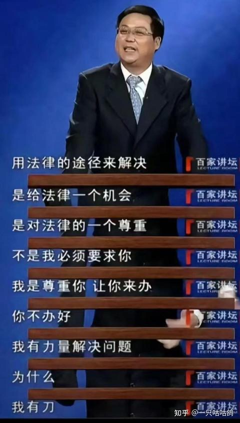

[toc]

# 问题

提问者：**<a href="https://www.zhihu.com/people/li-ge-17-9-20">人性的密码</a>**
提问时间: 2023-9-17 10:8:23
总回答数: 983
总访问量: 5186624

新闻链接：

[https://weibo.com/5044281310/4946665838217089](https://weibo.com/5044281310/4946665838217089)

男子阿今将自己未到结婚年龄的“妻子”退回娘家，过了几天之后，啊今要求复合或退回彩礼被拒

于是，阿今恼羞成怒前往女方工作的餐厅内将其砍成重伤，后经抢救无效死亡。目前检察机关已经以故意杀人罪对阿今提起公诉

阿今说：一开始我只是想着给她点教训，但是第一刀砍下去之后我就完全控制不住自己了

# 回答

回答者： **<a href="https://www.zhihu.com/people/tian-lan-se-yu-cao-lu-se">九月霜降</a>**
回答时间: 2026-7-17 3:10:12
点赞总数: 2139
评论总数: 134
收藏总数: 125
喜欢总数：82

 **2026.0716** 

因为男的知道法律不会帮他要回彩礼，而女的也知道法律不会判她退还彩礼。

所以两者一叠加，女的有恃无恐，男的孤注一掷。很遗憾，羞刀难入鞘，而一刀下去人就再也回不了头了。

只能说死人这种事情发生的越多，知道的人越多，以后发生这种事情的可能性越少。

很多人站在法律的规则之内，自以为有法律的保护，自己就可以为所欲为。却忘了法律需要依靠国家的暴力机关才能执行，换而言之，不是法律在保护你，而是暴力机关在保护你。

但是很多人，比如什么拖欠工资的老板，欠钱不还的老赖，收彩礼不退钱的女人，他们都忘了，国家的暴力机关不可能时时刻刻保护你。

别自信地以为法律站在你那边，你为所欲为，但罪不至死，别人就拿你没办法了。

  

原文地址：[(九月霜降)你怎么看待男子讨回彩礼无果将女方砍死？](https://www.zhihu.com/question/622453345/answer/2061286558423110984) 

# 评论

1. <a href="https://www.zhihu.com/people/22-92-70-17-64">大海</a> (<small title="北京">2026-7-17 8:45:52</small>): 类似于阎婆惜、西门庆，自以为了解规则吃透规则，在规则内把对方拿捏的死死的，殊不知对方是能够直接掀桌子的杀神。就像下围棋，真正的棋圣眼里，围棋除了棋盘上的风卷残云，也包括棋盘外招数，比如操起棋盘让对方脑袋开花……你总不能自己不守规则，却指望规则能够困住对方［思考］
   - <a href="https://www.zhihu.com/people/xi-feng-zhi-ge-1">西风之歌</a> (<small title="广东">2026-7-17 9:31:29</small>): 大汉棋圣刘启
   - <a href="https://www.zhihu.com/people/fang-zi-mo-80">绝了绝了</a> (<small title="江苏">2026-7-17 9:55:53</small>): 法律的本质是让触犯的人付出代价，但有些人本来就已经没什么可失去的了
   - <a href="https://www.zhihu.com/people/pi-ke-si-de-tai-deng">皮克斯的台灯</a> (<small title="回复于 2026-7-17 12:31:58/广东"> ✉️:西风之歌</small>): 大明棋圣雷凌云：胜负也可以在棋盘外［doge］  
 
大汉棋圣刘启：也可以是棋盘［doge］
   - <a href="https://www.zhihu.com/people/95-1-54-58-64">夜幕下的抚仙湖</a> (<small title="回复于 2026-7-17 13:20:45/上海"> ✉️:西风之歌</small>): 哪里会是棋圣？世人都知道刘启那局棋输了！如果不是必输之棋，会不按照套路出招吗？直接抄起棋盘，就是自认输棋了！
   - <a href="https://www.zhihu.com/people/zhu-jian-22-31">逐渐</a> (<small title="回复于 2026-7-17 13:32:10/山西"> ✉️:绝了绝了</small>): 换句话说只要付得起代价，随便违法。
   - <a href="https://www.zhihu.com/people/zheng-li-80-32">痕台</a> (<small title="回复于 2026-7-17 13:35:33/上海"> ✉️:夜幕下的抚仙湖</small>): 刘启之后下棋不就一路赢了
   - <a href="https://www.zhihu.com/people/huyan-55-39">浙二精神科主任</a> (<small title="浙江">2026-7-17 13:46:47</small>): 西门庆只是犯了事后想方设法隐瞒真相，可不是想靠规则拿捏武松，他可没这么纯
   - <a href="https://www.zhihu.com/people/dumbledore-87">Dumbledore</a> (<small title="上海">2026-7-17 13:54:41</small>): 谁说下棋就死不了人［doge］
   - <a href="https://www.zhihu.com/people/enderyuzy">enderyuzy</a> (<small title="福建">2026-7-17 13:56:5</small>): 这也有大汉棋圣的事？［飙泪笑］
   - <a href="https://www.zhihu.com/people/enderyuzy">enderyuzy</a> (<small title="回复于 2026-7-17 13:57:14/福建"> ✉️:Dumbledore</small>): 哪有人下棋不戴头盔啊
2. <a href="https://www.zhihu.com/people/1ysvwwym">月雪风之舞</a> (<small title="江苏">2026-7-17 11:25:58</small>): 我只记得追风老叶要了几年的道歉都没要到，有人两刀下去就要到了，而且还道歉了不止一次。
   - <a href="https://www.zhihu.com/people/73-30-48-54-33">阿苏</a> (<small title="江苏">2026-7-17 11:52:7</small>): 南通那个拖欠工资的？［doge］
   - <a href="https://www.zhihu.com/people/an-jing-de-mei-nan-zi-56-75">安静的美男子</a> (<small title="回复于 2026-7-17 12:15:15/浙江"> ✉️:阿苏</small>): 南昌胖虎吧，应该是
   - <a href="https://www.zhihu.com/people/734179904">抓拖枪逃跑的</a> (<small title="回复于 2026-7-17 12:21:47/上海"> ✉️:阿苏</small>): 江西一个职业学院，女的出轨，被男朋友捅死
   - <a href="https://www.zhihu.com/people/pihj">知乎用户ttJaKa</a> (<small title="广东">2026-7-17 12:33:26</small>): 老叶能活一辈子，两刀斩立决
   - <a href="https://www.zhihu.com/people/xing-chen-41-90-63">星臣</a> (<small title="回复于 2026-7-17 12:38:0/福建"> ✉️:知乎用户ttJaKa</small>): 如果是致残呢？
   - <a href="https://www.zhihu.com/people/wang-wei-wei-92-15">王威威</a> (<small title="回复于 2026-7-17 12:41:24/浙江"> ✉️:抓拖枪逃跑的</small>): 南通欠工资的也类似，被欠薪者一刀下去，连忙说“我错了错了”
   - <a href="https://www.zhihu.com/people/zhang-jia-rui-58">底格里斯咸鱼</a> (<small title="上海">2026-7-17 13:3:25</small>): 再也不敢了
   - <a href="https://www.zhihu.com/people/fatesay">fatesay</a> (<small title="江苏">2026-7-17 13:8:25</small>): 他道歉不是因为他知道错了，而是因为他知道他要噶了［尴尬］
   - <a href="https://www.zhihu.com/people/gong-teng-81">胆小怕事的人</a> (<small title="回复于 2026-7-17 13:23:43/江西"> ✉️:阿苏</small>): 南昌工学院，一个民办本科
   - <a href="https://www.zhihu.com/people/tan-xiao-tian-99-40">净火天</a> (<small title="北京">2026-7-17 13:33:15</small>): “我错了!我再也不敢了!”  
 
声嘶力竭、情真意切，这是我在网上听到的最真诚最大声的集美道歉。
   - <a href="https://www.zhihu.com/people/tian-tian-tp">天天tp</a> (<small title="山东">2026-7-17 13:52:10</small>): 道歉不是知道错了，而是知道他要死了
   - <a href="https://www.zhihu.com/people/burlkasuo">BulKathos</a> (<small title="回复于 2026-7-17 14:2:56/上海"> ✉️:fatesay</small>): 陈平安再现
3. <a href="https://www.zhihu.com/people/od0dd">小看山</a> (<small title="山西">2026-7-17 9:38:9</small>): 法律保护的是事后的权利，从来不是正在发生的权利，法律不是物理，人被杀就会死
   - <a href="https://www.zhihu.com/people/33-22-83-6">玻璃汽水瓶</a> (<small title="广东">2026-7-17 11:8:40</small>): 好男人。冤有头债有主。
   - <a href="https://www.zhihu.com/people/mou-guan-1994">元气少女momo酱</a> (<small title="广东">2026-7-17 11:25:2</small>): 你也是正义的伙伴吗？！ 山酱
   - <a href="https://www.zhihu.com/people/80-52-66-85-79">山河已秋</a> (<small title="江苏">2026-7-17 12:21:18</small>): 春风姐姐会给她立个碑，写上对方全责［酷］
   - <a href="https://www.zhihu.com/people/zq-wang-96">企鹅与鸵鸟齐飞</a> (<small title="回复于 2026-7-17 12:23:53/山东"> ✉️:玻璃汽水瓶</small>): 这条微博下的评论可全是拳评啊 ［捂脸］
   - <a href="https://www.zhihu.com/people/draco-don">狼人冈布奥</a> (<small title="回复于 2026-7-17 13:56:46/哈萨克斯坦"> ✉️:企鹅与鸵鸟齐飞</small>): 在这种新闻下还在打拳，就是还在期冀于站在规则的庇护下自己就可以无敌，颇有种在墓碑上刻下“对方全责”的幽默感
4. <a href="https://www.zhihu.com/people/muddy-store">爱阴斯坦</a> (<small title="广东">2026-7-17 10:41:47</small>): 土方子治大病的典型病例
   - <a href="https://www.zhihu.com/people/73-30-48-54-33">阿苏</a> (<small title="江苏">2026-7-17 11:52:26</small>): 土方子不土，都是经验科学［doge］
   - <a href="https://www.zhihu.com/people/xie-jia-jin-57">星夜铁行</a> (<small title="广东">2026-7-17 13:30:10</small>): 土方子治不了的话，由土方车来治［滑稽］
5. <a href="https://www.zhihu.com/people/ashassin">AshAssIN</a> (<small title="山东">2026-7-17 11:15:38</small>): 所以说是法律促成了女子的死亡以及一个杀人犯的诞生
   - <a href="https://www.zhihu.com/people/21-88-38-60">知天易学不完</a> (<small title="浙江">2026-7-17 11:44:51</small>): 是母平法
   - <a href="https://www.zhihu.com/people/lzzzzz-55">zzzl13</a> (<small title="浙江">2026-7-17 13:50:42</small>): 自己丧失理想信念贪婪是主要成因，可以选择善良非要选择邪恶，我只能说好死（没有说社会舆论、法律法院、春风法官好的意思，也该死）
6. <a href="https://www.zhihu.com/people/fenix-18">Fenix</a> (<small title="江苏">2026-7-17 11:27:18</small>): 最喜欢看B站车祸合集，里面的经典台词就是“墓志铭:对方全责”。现实中，把自己的生死完全寄托在法规上的人可不少。
   - <a href="https://www.zhihu.com/people/zhe-ge-shi-shi-yao-82">开会员加速改名</a> (<small title="湖北">2026-7-17 12:24:27</small>): ［捂脸］上周真见过骑车送娃上学不看红绿灯乱冲路上几排车全部急刹，被司机骂了后理直气壮的反手就是一句“你不知道行人优先？”
   - <a href="https://www.zhihu.com/people/tiantianaixueer">我叫小狗</a> (<small title="陕西">2026-7-17 12:57:34</small>): 对方是大车，你是行人或者肉包铁，对方全责，而你是中微子
7. <a href="https://www.zhihu.com/people/11-40-77-12-59">摸鱼大王</a> (<small title="广东">2026-7-17 12:32:54</small>): 说了无数次的，公法不彰，私刑必滥，女频规则怪们不相信，挺好的，大家都有光明的未来。
8. <a href="https://www.zhihu.com/people/rui-24-91">JeanValjean</a> (<small title="重庆">2026-7-17 11:47:2</small>): 暴力机关并不能保护你，暴力机关只能在他整死你以后去审判他而已
   - <a href="https://www.zhihu.com/people/wu-dian-san-shi-jiu-fen-ge">五點三十九奮咯</a> (<small title="浙江">2026-7-17 14:3:30</small>): 宁当被告不当原告［捂脸］
9. <a href="https://www.zhihu.com/people/xiao-ming-v5">小明知乎专用</a> (<small title="上海">2026-7-17 12:19:40</small>): 法律保护不了我的时候，也必定保护不了你［害羞］
10. <a href="https://www.zhihu.com/people/weidong-10">或在心中</a> (<small title="广东">2026-7-17 11:56:59</small>): 物理也是理［感谢］
    - <a href="https://www.zhihu.com/people/zhu-chao-80">李客中</a> (<small title="湖北">2026-7-17 12:43:38</small>): 刀法也是法
    - <a href="https://www.zhihu.com/people/89-46-13-26-9">踏雪寻梅</a> (<small title="回复于 2026-7-17 13:5:44/广西"> ✉️:李客中</small>): 老哥评论的很全面，我没有什么补充的了
    - <a href="https://www.zhihu.com/people/shi-min-li-xian-sheng-39">市民李先生</a> (<small title="回复于 2026-7-17 13:28:33/广东"> ✉️:踏雪寻梅</small>): 这是个有理有法的社会［doge］
    - <a href="https://www.zhihu.com/people/huyan-55-39">浙二精神科主任</a> (<small title="回复于 2026-7-17 13:49:17/浙江"> ✉️:踏雪寻梅</small>): 姐不做一句总结？
11. <a href="https://www.zhihu.com/people/yi-du-ling-yun">易渡凌云</a> (<small title="河北">2026-7-17 12:11:59</small>): 你去吃个板面，老板说你吃了两个卤蛋，你说吃了一个，你给1个的钱，老板不会杀你。老板找你要了2个的钱，你也不会杀老板。
 
你倾尽家财给孩子买了个全款房，结果你的全款被销售私下转走，连夜打赏了主播，叼着烟翘着二郎腿跟你说要钱没有烂命一条。是的你可以选择相信法律，但是你知道能执行他名下的十八手电摩没房没车……对法律而言，他肯定是不该死的。但是对你而言，他就是必须要死的。
    - <a href="https://www.zhihu.com/people/gao-er-ji-66">高尔稽</a> (<small title="江西">2026-7-17 13:48:25</small>): 第一个不好说，武汉以前有个很火案件，因为热干面涨价一块钱，顾客跟老板争执起来给图了，但因为顾客有精神疾病没有死刑［doge］
12. <a href="https://www.zhihu.com/people/a-bai-14-5-36">阿白</a> (<small title="河北">2026-7-17 12:32:54</small>): 
13. <a href="https://www.zhihu.com/people/yi-ran-hen-shuai">依然很帅</a> (<small title="山东">2026-7-17 11:40:21</small>): ［doge］［doge］
 

14. <a href="https://www.zhihu.com/people/zeifk6">冬天的雪花</a> (<small title="广东">2026-7-17 12:30:52</small>): 国家层面有法律武器，但其实这个要分开来讲，目前这两项好像不能同得！拿起法律放下武器！放下法律拿起武器！
15. <a href="https://www.zhihu.com/people/hong-shi-46">高兴</a> (<small title="吉林">2026-7-17 13:18:30</small>): 这是激情犯罪。如果是策划好，那应该是一家子整整齐齐的
16. <a href="https://www.zhihu.com/people/ai-te-chang-bu-da-de-xiao-hai">艾特长不大的小孩</a> (<small title="河南">2026-7-17 12:39:11</small>): 第一批判的武器永远取代不了武器的批判 第二遵守法律是我愿意给法律一个机会而不是法律给我一个机会
17. <a href="https://www.zhihu.com/people/williamchen98">momo</a> (<small title="浙江">2026-7-17 12:33:45</small>): 暴力机关只能保证你起诉的权利，而不能保证你能起诉［doge］
18. <a href="https://www.zhihu.com/people/chi-mei-75-88">魑魅</a> (<small title="湖南">2026-7-17 12:16:57</small>): 所以就有了那句话，当法律保护不了我的时候，法律也保护不了你。
19. <a href="https://www.zhihu.com/people/hu-po-34-55">琥珀</a> (<small title="江苏">2026-7-17 13:36:59</small>): 社会契约论，核心就是我让度一部分权利，来保障我的权利。如果我的权利没办法得到保障，那我凭什么相信公权力？
20. <a href="https://www.zhihu.com/people/jian-ou-1">家境贫寒蒙楚格</a> (<small title="广东">2026-7-17 11:43:22</small>): 可以把十万大军别裤腰带上［doge］
21. <a href="https://www.zhihu.com/people/lawliet-931102">Lawwliet</a> (<small title="广东">2026-7-17 14:0:19</small>): 经典力学魅力时刻
22. <a href="https://www.zhihu.com/people/han-hai-qin-tian-37">仰望云天的蜗牛</a> (<small title="河南">2026-7-17 13:56:46</small>): 实际上就是 不要破坏规矩 你破坏规矩 人家也可以破坏规矩。不要以为自己是特殊的。
23. <a href="https://www.zhihu.com/people/hydraang">Hydra</a> (<small title="湖南">2026-7-17 12:4:17</small>): 我无条件站在我性别的这一方。
24. <a href="https://www.zhihu.com/people/shuang-ge-57-73">爽哥</a> (<small title="江苏">2026-7-17 13:52:6</small>): 个例啦，大家笑一笑就好。［看看你］
25. <a href="https://www.zhihu.com/people/158-32">向天再借五百年</a> (<small title="河北">2026-7-17 13:33:49</small>): 还是那句话，法律保护不了我，同样他也保护不了你
26. <a href="https://www.zhihu.com/people/newstory-98">newstory</a> (<small title="广东">2026-7-17 13:44:48</small>): 哎呀，遵从内心，该咋做就咋做。有些法律是不对的。
27. <a href="https://www.zhihu.com/people/guohao-57-73">guohao</a> (<small title="广东">2026-7-17 12:48:53</small>): 相信法律的时候,想想劳动法是保护谁的［酷］
28. <a href="https://www.zhihu.com/people/zhi-yuan-9-16-3">纸鸢</a> (<small title="安徽">2026-7-17 13:0:48</small>): 女频小说思想，规则大于暴力，但功夫再高也怕菜刀
29. <a href="https://www.zhihu.com/people/ning-shi-yuan-fang-9">凝視遠方</a> (<small title="河北">2026-7-17 13:5:2</small>): 这样的例子多了后这样的问题肯定也就少了
30. <a href="https://www.zhihu.com/people/zhang-ming-21-51">问西东</a> (<small title="湖南">2026-7-17 13:51:46</small>): 法律不是用来保护弱者的［思考］
31. <a href="https://www.zhihu.com/people/xiaochong-51">湘江小虫</a> (<small title="湖南">2026-7-17 12:56:56</small>): 这就像有些人面对大运也不躲，知道死了还在墓志铭上书写对方全责［飙泪笑］
32. <a href="https://www.zhihu.com/people/sun-zhe-38-13">四十米长刀刀客</a> (<small title="河南">2026-7-17 12:53:1</small>): 暴力机关不保护任何人，只惩罚触犯法律的人。不保护他，也不保护她。
33. <a href="https://www.zhihu.com/people/49-1-69-63">卖报坤</a> (<small title="江苏">2026-7-17 11:54:11</small>): 所以某些人做了某些事要做好当刀鞘的心理准备
34. <a href="https://www.zhihu.com/people/94-68-4-53">类星体</a> (<small title="江苏">2026-7-17 13:16:13</small>): 啊啊啊啊啊啊啊啊啊啊啊啊啊啊啊啊啊
35. <a href="https://www.zhihu.com/people/su-su-79-72-55">诠释飞花</a> (<small title="河南">2026-7-17 11:10:17</small>): 底层互害，不足为奇
36. <a href="https://www.zhihu.com/people/bai-yang-62-33">你根本不敢打我</a> (<small title="上海">2026-7-17 13:31:35</small>): 天底下最公平的事情就是每个人都只有一条命
37. <a href="https://www.zhihu.com/people/123-32-93-32">MR.Zhang</a> (<small title="山东">2026-7-17 12:39:48</small>): 谨记，想着叫救护车，想着自首！！百分百保命！
38. <a href="https://www.zhihu.com/people/xu-shui-he-gu">胥水河谷</a> (<small title="陕西">2026-7-17 12:16:11</small>): 论武器分类
39. <a href="https://www.zhihu.com/people/ub20ol">司寇杏5x</a> (<small title="安徽">2026-7-17 13:56:15</small>): 我们希望建立一个法制健全的国家，但并不是建立一个法律条文处处藏着险恶用心的法制健全。
40. <a href="https://www.zhihu.com/people/20-11-79-67-36">白巾圣贤逍遥散仙</a> (<small title="上海">2026-7-17 13:7:12</small>): 估计是想双输好过单输啊
41. <a href="https://www.zhihu.com/people/ning-meng-xiao-xiao-66">柠檬萧萧</a> (<small title="浙江">2026-7-17 13:40:49</small>): 挺好的，双方这种不良基因都不会再传承下去了。
42. <a href="https://www.zhihu.com/people/yu-si-cong-14">崩坏的幻想</a> (<small title="北京">2026-7-17 11:27:46</small>): 法律只能通过事后惩戒形成事前威慑，但如果对方铁了心和你爆了，讲法是没用的。。。
43. <a href="https://www.zhihu.com/people/li-qiang-24-82">随风而逝的狗</a> (<small title="河北">2026-7-17 14:0:28</small>): 很多人就是忘了，法律站在谁一边，也得等人家犯法了才能处理！
44. <a href="https://www.zhihu.com/people/zhang-chong-43-69">qq4916</a> (<small title="江苏">2026-7-17 13:39:53</small>): 超过一年，彩礼原则上基本不退。(这是当时江西 罗贤俊 通话录音里法官大人说的)
45. <a href="https://www.zhihu.com/people/xia-xia-73-41">momo</a> (<small title="湖南">2026-7-17 13:37:4</small>): 狗命要紧，我不想跟男人发展，他转账我都不收，虽然他连我住哪里都不知道
46. <a href="https://www.zhihu.com/people/liuyanghe">刘阳河</a> (<small title="上海">2026-7-17 14:0:59</small>): 死人越多,中间忘了,死人越少
47. <a href="https://www.zhihu.com/people/bu-shuo-21-68">不说</a> (<small title="重庆">2026-7-17 13:19:4</small>): 百家讲坛-给法律一个面子.jpg
48. <a href="https://www.zhihu.com/people/77-83-7-19-86">开心就好</a> (<small title="北京">2026-7-17 12:22:52</small>): 不要拿法律 当挡箭牌
49. <a href="https://www.zhihu.com/people/zhixvttw2b8">昵称一直被河蟹</a> (<small title="广西">2026-7-17 12:44:49</small>): 一切问题迎刃而解
50. <a href="https://www.zhihu.com/people/75-1-80-39">精神病赵先生</a> (<small title="河北">2026-7-17 12:12:37</small>): 警告，不要拿法律当挡箭牌
    - <a href="https://www.zhihu.com/people/80-52-66-85-79">山河已秋</a> (<small title="江苏">2026-7-17 12:37:40</small>): 法律挡不了刀
51. <a href="https://www.zhihu.com/people/34-98-16-97">山風之嵐</a> (<small title="新疆">2026-7-17 11:51:47</small>): 五步之内，人尽敌国。 除非你能保证你得罪的人永远不可能出现在你附近，要不然做人留一线［吃瓜］
52. <a href="https://www.zhihu.com/people/a-luo-26-19">阿洛</a> (<small title="湖南">2026-7-17 13:51:54</small>): 匹夫一怒，血溅五步
53. <a href="https://www.zhihu.com/people/44-88-43-59-4">仙翁船江</a> (<small title="广东">2026-7-17 13:29:0</small>): 法律法规应严惩骗婚骗财者！这种不劳而获的人，应人人得而诛之！！！！
54. <a href="https://www.zhihu.com/people/wu-zhi-de-xiao-hai-14-70">MOMO</a> (<small title="上海">2026-7-17 13:18:25</small>): 法律保护的可从来都不是弱者。
55. <a href="https://www.zhihu.com/people/zhang-xiang-73-64-39">张翔</a> (<small title="重庆">2026-7-17 13:24:56</small>): NO、NO、NO！！！
 
  
 
原理上讲，最根本的原因在于，我们绝大多数人认为，我们的法律是禁止杀人的。
 
其实他们搞错了，法律从来都只规定了杀完人之后要承担什么后果，法律从来没办法在杀人之前制止或者限制人们杀人的自由。
 
  
 
你看法律里面哪一条写了“禁止杀人”的？？？是不是只说了杀人偿命嘛？
56. <a href="https://www.zhihu.com/people/da-mo-feng-sha-79">大漠风沙</a> (<small title="浙江">2026-7-17 13:58:1</small>): 墓碑上书对方全责
57. <a href="https://www.zhihu.com/people/tony-tang-25-81">Tony Tang</a> (<small title="江苏">2026-7-17 13:32:17</small>): 而且现在杀人几乎不会死刑，很多人不知道，都觉得杀人偿命，别人不敢，没想到，你死了，对方估计减刑后坐15-25年牢
58. <a href="https://www.zhihu.com/people/shi-ke-14-90">明天太远</a> (<small title="浙江">2026-7-17 12:11:48</small>): 对方全责
59. <a href="https://www.zhihu.com/people/bu-zhi-hu-li">无用之用</a> (<small title="河南">2026-7-17 12:18:1</small>): 好答主，把时间写在开头，值得一个赞。［感谢］
    - **九月霜降** (<small title="湖北">2026-7-17 12:33:44</small>): 呃，谈不上回答，只是当日志随笔。
60. <a href="https://www.zhihu.com/people/zhang-lin-35-59-23">张林</a> (<small title="四川">2026-7-17 13:56:50</small>): 现在的这群法律工作者忘了件事，人民群众愿意让法律来帮着解决问题是真的给他们面子，不需要他们的时候是也是有法办去解决的。［思考］
61. <a href="https://www.zhihu.com/people/ban-zhuan-xiao-san">搬砖小散</a> (<small title="安徽">2026-7-17 13:56:5</small>): 立法的起点就偏了，保护弱者，就破坏了公平。
62. <a href="https://www.zhihu.com/people/nozomi-t">Nozomi Tojo</a> (<small title="美国">2026-7-17 13:25:2</small>): 这是唯一和对方伤害对等的解法了。简直可悲
63. <a href="https://www.zhihu.com/people/53-40-75-29-68">沧海一粟</a> (<small title="陕西">2026-7-17 13:56:13</small>): 自己为自己主持公道是需要莫大的勇气，有这种勇气的人不多。
64. <a href="https://www.zhihu.com/people/david-87-57-66">lython</a> (<small title="贵州">2026-7-17 11:58:49</small>): 鲍老师说的～"让法律办，法律不办！那么就自己办"［哇］
65. <a href="https://www.zhihu.com/people/wu-001-81">花辞树</a> (<small title="陕西">2026-7-17 11:25:48</small>): 法律既然保护不了我，那肯定也保护不了你［捂脸］
66. <a href="https://www.zhihu.com/people/x--47-58-46">知乎用户X.</a> (<small title="安徽">2026-7-17 10:20:58</small>): 所以法律并不能帮你免疫急性铁中毒
67. <a href="https://www.zhihu.com/people/an-dong-ni-da-si-23">常熟吴彦祖</a> (<small title="江苏">2026-7-17 10:49:35</small>): 匹夫一怒，血流五步
68. <a href="https://www.zhihu.com/people/jie-ni-zhi-ming-an-wo-ming">再见1988</a> (<small title="湖北">2026-7-17 10:40:25</small>): 好事啊
69. <a href="https://www.zhihu.com/people/gao-fan-34-11">高凡</a> (<small title="四川">2026-7-17 10:50:36</small>): 就和闯红灯一样，你觉得他不管撞你，随便走，撞死的人多了，过马路的自己就会注意的。
70. <a href="https://www.zhihu.com/people/sui-feng-fei-guo-84">路过路过</a> (<small title="浙江">2026-7-17 11:49:20</small>): 彩礼还没花人噶了  
 
哈哈哈
    - **九月霜降** (<small title="湖北">2026-7-17 11:52:30</small>): 难说，也有可能已经点男模花完了，或者赞助前任创业，帮弟弟买房买车，亦或者给她爹妈预缴了丧葬费，所以退不了。［捂嘴］
71. <a href="https://www.zhihu.com/people/zheng-xiao-ming-16-38">鄭暁明</a> (<small title="广东">2026-7-17 12:50:29</small>): wb真是粪坑，底下的评论没法看
72. <a href="https://www.zhihu.com/people/emrakul">韭薙狂刀</a> (<small title="四川">2026-7-17 13:3:49</small>): 更应该反思的是我们的法律为什么总是保护这样的人［滑稽］
73. <a href="https://www.zhihu.com/people/hao-zi-ge-ge-torres">耗子哥哥TORRES</a> (<small title="重庆">2026-7-17 10:57:44</small>): 整死有点太极端了，把自己整死了也。有个15年左右也能惠人一身了吧
    - <a href="https://www.zhihu.com/people/momo-45-95-58">momo</a> (<small title="山西">2026-7-17 13:20:35</small>): 换个说法，把他弄死，自己坐十几年牢，出来一样
    - <a href="https://www.zhihu.com/people/jin-tian-qi-37">不废江河万古流</a> (<small title="吉林">2026-7-17 13:25:46</small>): 那没办法，自认倒霉呗
    - <a href="https://www.zhihu.com/people/liang-hong-yu-yi">惊鸿羽衣</a> (<small title="广东">2026-7-17 14:3:56</small>): 里面十来年，大概率比在外面十来年被日夜催债，过得还安逸。［捂脸］
74. <a href="https://www.zhihu.com/people/yu-ren-guo-du-27-48">愚人国度</a> (<small title="湖北">2026-7-17 8:42:29</small>): 多出一点这种事，法律就变了［捂脸］
    - <a href="https://www.zhihu.com/people/biggen-87">摔得可啪</a> (<small title="江苏">2026-7-17 9:32:25</small>): 都多少年多少事了，你见变了没［大笑］
    - <a href="https://www.zhihu.com/people/doppeldream">DoppelDream</a> (<small title="江苏">2026-7-17 10:36:28</small>): 出了多少了，也没见有啥变化啊，归根结底死的都是当事人，而不是乱判的法官
    - <a href="https://www.zhihu.com/people/yc-znone">yc znone</a> (<small title="广西">2026-7-17 10:39:30</small>): 法律改变了自然规律。
    - <a href="https://www.zhihu.com/people/dannylu-xin">Danny路新</a> (<small title="安徽">2026-7-17 10:47:56</small>): 法律是中性的，你不遵守也别指望别人遵守［捂脸］
    - <a href="https://www.zhihu.com/people/74-16-48-25">长长长长长长长</a> (<small title="回复于 2026-7-17 11:5:38/安徽"> ✉️:摔得可啪</small>): 现在都是个例。还没到海量个例呢，法律不可能为个例改变的
    - <a href="https://www.zhihu.com/people/chen-yu-yan-11-41">Mental</a> (<small title="回复于 2026-7-17 13:44:30/福建"> ✉️:摔得可啪</small>): 那是还不够
75. <a href="https://www.zhihu.com/people/liu-zhi-peng-88">Plzzzzzzzz</a> (<small title="广东">2026-7-17 11:40:46</small>): 法律保护不了我，那同样也保护不了你［感谢］
76. <a href="https://www.zhihu.com/people/zt24wig">君易轩主</a> (<small title="浙江">2026-7-17 9:19:57</small>): 以后国家可以给这些女人发一个机器人保镖保护啊。［吃瓜］这样继续坑男人彩礼就平安无事了。
    - <a href="https://www.zhihu.com/people/overmind911">overmind911</a> (<small title="江苏">2026-7-17 9:30:36</small>): 这机器人保镖必须得全女工厂制造才行［酷］
    - <a href="https://www.zhihu.com/people/xian-yu-48-32-81">老咸鱼</a> (<small title="广东">2026-7-17 9:30:40</small>): 国家没疯和企业没病的话，不太会给个人配这种东西，企业也不会针对个人做这个功能，万一哪版OTA出了问题，直接给主人弄伤，弄死那就有乐子了
    - <a href="https://www.zhihu.com/people/yan-yu-75-37-70">烟宇</a> (<small title="浙江">2026-7-17 10:12:58</small>): 小学生都能手搓的电磁脉冲装置，打无人机的那个，给机器人来一下就行了。只要抵押车贩子不死绝，这个设备就永远有渠道购买
    - <a href="https://www.zhihu.com/people/newsheamus113">PING</a> (<small title="回复于 2026-7-17 10:43:18/广东"> ✉️:老咸鱼</small>): 最大的问题不是老板可以养千军万马吗
77. <a href="https://www.zhihu.com/people/CHNNXXXN">猫脸无名客</a> (<small title="广东">2026-7-17 13:19:43</small>): 女+规则=男+物理  
 
由上导出：  
 
女+规则-男=物理
78. <a href="https://www.zhihu.com/people/zhi-li-bao-huo">纸里包火</a> (<small title="北京">2026-7-17 10:2:54</small>): “死人的事情会经常发生，开个追悼会嘛！”
79. <a href="https://www.zhihu.com/people/wu-ming-xian-sheng-14-12">悟风阁主</a> (<small title="甘肃">2026-7-17 13:40:11</small>): 你在规则人玩杀人不见血那一套，那就别怪别人用经典物理学了。兔子急了会咬人的
80. <a href="https://www.zhihu.com/people/lao-shu-kai-shui">老鼠开水</a> (<small title="重庆">2026-7-17 13:17:58</small>): 物理的理也是理，如果跟你讲不通法理，那就上物理吧！

=[评论](./attachments/comments.json)

