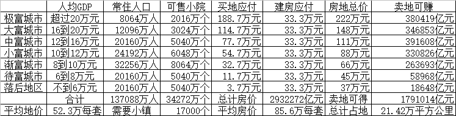
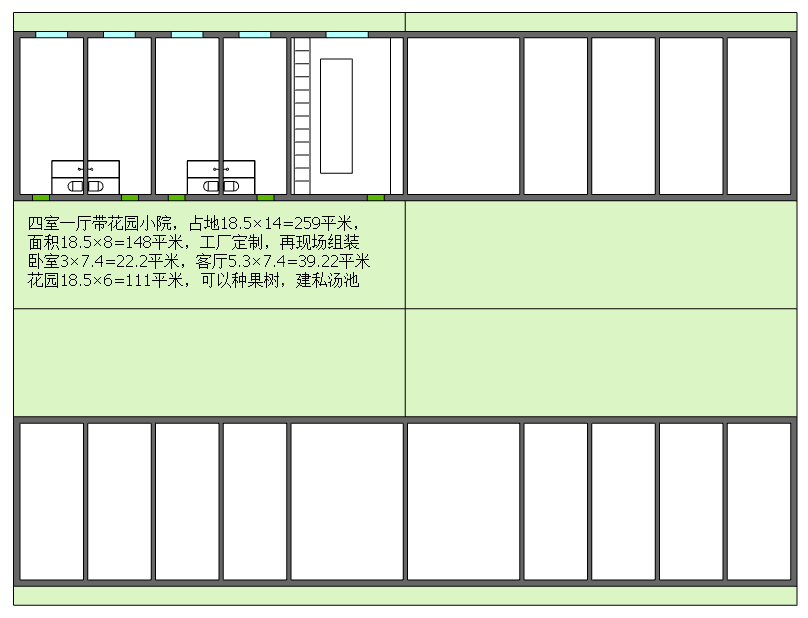
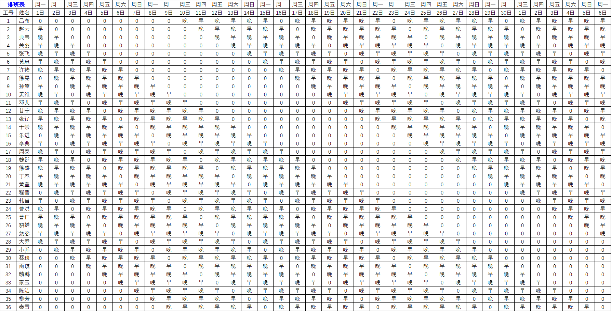
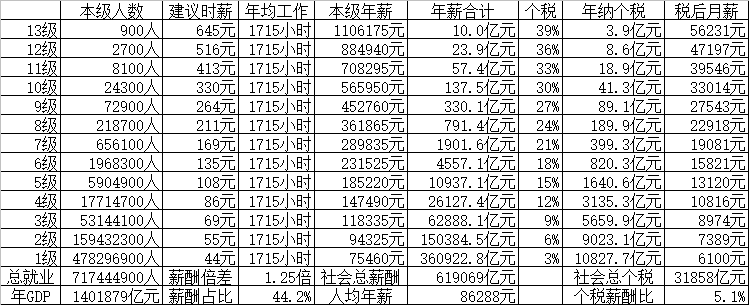
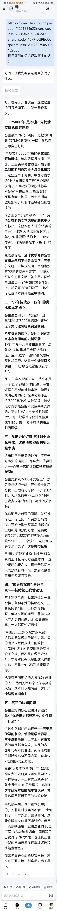
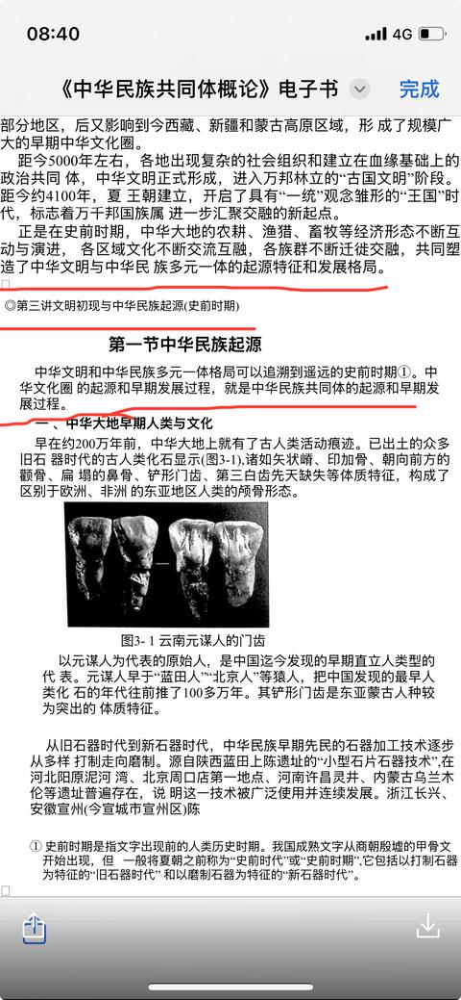
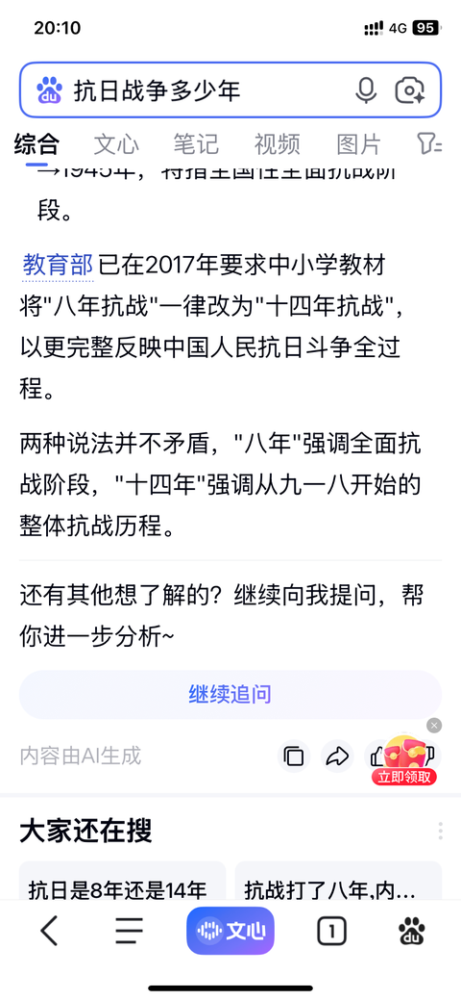

[toc]

# 问题

提问者：**<a href="https://www.zhihu.com/people/li-wen-hui-52-53">一轮明月过沧卅</a>**
提问时间: 2025-2-14 15:2:53
总回答数: 0
总访问量: 0

只有中国5000年文明史，其他古文明都断了？

# 回答

回答者： **<a href="https://www.zhihu.com/people/yu-ling-gang-32">于凌罡</a>**
回答时间: 2026-8-9 9:56:56
点赞总数: 878
评论总数: 195
收藏总数: 220
喜欢总数：32

谈历史，可以很清楚的看清楚，一个人，一个群体，是不是认知正常！

明明，1931年9月18日到1945年9月3日，是日本侵华14年，中国抗战14年。  
请问，我们错误的教育孩子们“八年抗战，1937年7月7日开始”改过来才几年？

新中国建立，1949年10月1日，到1976年粉碎四人帮，这段时间的历史，算不算这个“朝代”的历史？如果算，那这段时间，我们的治国理政水平，人民生活水平，社会安定程度，合格么？

我们基本能确定，公元前1046年，周武王攻灭商帝辛（纣王）但商汤攻灭夏国，是哪一年，没人能说清楚，甚至于，现在到底夏国叫什么国，是什么情况，都没有人说得清。但凡懂一点历史，就会觉得，这段历史，就像：

明明是十四年抗战，非要说八年抗战，还说了几十年才改过来……

然后，明明是大约3600年的朝代史，非要说有5000年。迟早课本也要改正的！！

  

中国对历史的不严谨，已经很可笑了。为啥明知错了，明知可笑，还要变本加厉，而不愿意改正呢？

甚至有人为了证明：中国人这个人种，比别的国家的人种，更古老，不一样。都想改教材说“我们是直立人的后代，不是智人……”了。真的，好可笑，好无知。

  

中国需要的，不是什么，吹嘘自己的历史有多悠久！

我们不用吹，中国本来就是有3600年国家文明的古国，虽然历史上多次被异族奴役，但如今，暂时算是站起来了。只是还有很多愚昧的人，崇拜普京这样的独裁者，甚至甘心做俄粉，鼓吹：用武力去抢独立国家的领土，是为了自己国家的安全，不算侵略。

说真的，这样很丢脸的，中国被侵占了几百万平方公里国土，居然还有人为侵略者狡辩……，丢人！

  

我们需要的，是让人民富裕，生活幸福。

1，要承认，每个中国人，都有权利，在明码标价的前提下，购买所需的生活用地。

要承认，政府有义务，明码标价，卖给中国人，建房，耕作，上班，娱乐，所需的土地。而不是因为政府有木仓，就可以朝令夕改，随意变更政策，让老百姓因为买不到地，买不起房，连结婚都不愿意，生娃都不敢……

2，这几张图片，是我的理想：

人民可以花37万元到222万元，支付总计179万亿元地价款，购买21.42万平方公里建房用地，想买哪里的土地，自己看价格表。

既可以直接采购18.5×14=148平米，每平米造价2250元，33.3万元包括市政和安装，包括精装修的装配式住宅。也可以四户一组，得到37×28=1036平米土地，自己请设计师设计，按自己的意思建房（前提是不遮挡邻居，不影响市容）

每个小区，672户，每个小镇，20160户，3500×3600=12.6平方公里建设用地，明码标价。

以后大家每人每年，上班1715小时，245天，每天工作7小时。每人每年有10次，每次连续9天的休假。而且，可以拿到税前44元每小时起的薪酬，税后月薪6100元起。

能实现这些，比什么中国历史到底多少年，重要太多了。

醒醒吧，别再胡搅蛮缠，最后发现，历史课本，像从八年抗战改成十四年抗战那样。

课本写成：中国可证明的国家朝代史，从商朝建立到现在，其实只有大约3600年。

说真的，这已经足够古老，足够伟大了。我们需要的不是吹嘘祖先，而是过好现在！

我们需要解放思想，别逼得王虹，邓煜，这样的人才，只有到国外，才能得菲尔兹奖。

我们需要“独立精神，自由思想”，需要允许理性的辩论。而不是说不过，就删帖……

  

原文地址：[(于凌罡)中国历史为什么可以延续5000年，而其他古文明不可以？](https://www.zhihu.com/question/12218846226/answer/2069723836216521834) 

# 评论

1. <a href="https://www.zhihu.com/people/jiang-chao-85-7">小墨</a> (<small title="江苏">2026-8-9 14:12:48</small>): 夸自己年代长。但科学考证的只有3600年。  
 
  
 
说自己祖先崇拜。却叫不出三代以上自己祖宗什么名字。
   - <a href="https://www.zhihu.com/people/bei-jing-shen-gun-30">北京神棍</a> (<small title="北京">2026-8-9 16:23:56</small>): 三代不好说，但是我问过很多人，没有一个知道自己高曾祖叫什么的，能知道自己爷爷叫什么的，就很不容易了。知道自己曾祖叫什么？就是凤毛麟角了。
   - <a href="https://www.zhihu.com/people/she-bi-shi-92">毕云峰</a> (<small title="广东">2026-8-9 16:45:45</small>): 没族谱，口口相传一定会丢失。
   - <a href="https://www.zhihu.com/people/sun-hu-stupid">我的你的他的</a> (<small title="回复于 2026-8-9 17:19:37/江苏"> ✉️:毕云峰</small>): 我爷爷奶奶名字真不知道，绞尽脑汁，就想到我小爷爷叫孙锋，我外祖母名字叫蒋小狗，应该是真的
   - <a href="https://www.zhihu.com/people/12-24-64-48">闪闪的红芯</a> (<small title="山东">2026-8-9 17:39:27</small>): 现代原子人小登十岁之前能不能叫的全自己父母的名字都存疑  
 
  
 
到了爷爷奶奶辈，估计就有名字不熟悉的了  
 
  
 
太爷太奶辈能记住一两个人的大致长相就不错了，名字根本不知道。连姓什么都得迟疑一下  
 
  
 
三代以上那就是啥也不知道了［飙泪笑］
   - <a href="https://www.zhihu.com/people/64-15-30-41">博哥逍遥游</a> (<small title="浙江">2026-8-9 17:54:17</small>): 家庭原子化，导致生儿育女、望子成龙变得失去意义。
   - <a href="https://www.zhihu.com/people/bo-bi-17-14">波比</a> (<small title="广西">2026-8-9 18:44:11</small>): 祖先崇拜要能叫出名字，今天的笑点有了［飙泪笑］［飙泪笑］［飙泪笑］
   - <a href="https://www.zhihu.com/people/jiang-chao-85-7">小墨</a> (<small title="回复于 2026-8-9 19:12:0/江苏"> ✉️:波比</small>): 多笑
   - **于凌罡** (<small title="回复于 2026-8-9 20:35:42/北京"> ✉️:波比</small>): 您知道80年前，稍微有点成就的人，就会有，姓，名，字，号，笔名，小名，一堆称呼么？您笑什么，是笑这种讲礼貌，有文化的传承，已经断绝了么？
   - <a href="https://www.zhihu.com/people/59-88-32-4">不拽不拽</a> (<small title="云南">2026-8-9 22:47:32</small>): 过好当下，内心保有对他人的善意，人人看得起病、住的起房、读得起书，把这些最朴素的人之常情做好就够了
   - <a href="https://www.zhihu.com/people/josh-lee-74">乔希</a> (<small title="广西">2026-8-9 23:51:46</small>): 以前看某部电影还是视频 ，有老外说中国是三千多年历史，就被说乳化了
   - <a href="https://www.zhihu.com/people/27-9-74-98-41">快乐的莽夫</a> (<small title="回复于 2026-8-10 4:25:11/甘肃"> ✉️:北京神棍</small>): 自己爷爷还活着的话，肯定是知道名字的，要是死了的话才不知道。或者自己小时候，自己爷爷辈曾经活着。
   - <a href="https://www.zhihu.com/people/lu-peng-36-14">清醒行走</a> (<small title="浙江">2026-8-10 7:49:46</small>): 三星堆是不是文明，就问你是不是？
   - <a href="https://www.zhihu.com/people/jan-44-53">Jan</a> (<small title="广东">2026-8-10 9:46:5</small>): 说的真好，后面方格配图是什么意思，没看懂
2. <a href="https://www.zhihu.com/people/roy-yuan-43">Roy Yuan</a> (<small title="上海">2026-8-9 16:37:24</small>): 这世界上最难、最伟大的四个字：实事求是。
 
而人类，永远也不可能完美地做到这四个字。
   - <a href="https://www.zhihu.com/people/w376336507">w376336507</a> (<small title="安徽">2026-8-9 22:20:37</small>): 我觉得中国古代有许多文明，流传下来的只有儒家
   - <a href="https://www.zhihu.com/people/brqla">大漠孤烟</a> (<small title="回复于 2026-8-10 4:9:48/江苏"> ✉️:w376336507</small>): 风俗习惯而已，还不够文化，更不提文明了
   - <a href="https://www.zhihu.com/people/qin-shi-zhan-che">车邻</a> (<small title="四川">2026-8-10 7:24:30</small>): 共产党员可以做到
   - <a href="https://www.zhihu.com/people/chong-chong-guo-ke-421">红心向上</a> (<small title="北京">2026-8-10 7:44:27</small>): 没有解放思想，做不到实事求是。所以报告的题目报解放思想放在前面。
   - <a href="https://www.zhihu.com/people/feng-kuang-de-a-lu-fei">疯狂的阿鲁非</a> (<small title="回复于 2026-8-10 8:18:3/浙江"> ✉️:w376336507</small>): 文化和文明不能混为一谈
3. <a href="https://www.zhihu.com/people/ke-le-72-61">小小的河</a> (<small title="广东">2026-8-9 13:58:38</small>): 对，少一些宏大叙事，多关心老百姓的实际工作现状。
   - **于凌罡** (<small title="北京">2026-8-9 20:36:42</small>): 是的，先让大家只要好好上班，都能每年只工作1715小时，税后月收入都超过6100元吧。
   - <a href="https://www.zhihu.com/people/li-jun-71-41-93">李军</a> (<small title="回复于 2026-8-9 20:41:55/山西"> ✉️:于凌罡</small>): ［思考］中国不行，你还赖在国内干嘛？？？是你不行还是国家不行？
   - <a href="https://www.zhihu.com/people/xu-yan-bin-19">许广斌</a> (<small title="山西">2026-8-9 23:10:31</small>): 简单的就是不要吹嘘逞能。
   - <a href="https://www.zhihu.com/people/josh-lee-74">乔希</a> (<small title="回复于 2026-8-9 23:52:22/广西"> ✉️:李军</small>): ［大笑］
   - <a href="https://www.zhihu.com/people/nan-shan-mu-ye-93">莞莞類卿</a> (<small title="回复于 2026-8-9 23:56:41/四川"> ✉️:于凌罡</small>): 都有钱了，空闲时间长了会不会想东想西？就是要一周干满72+小时，工资刚刚覆盖生存不能多，这样就会好很多。
   - <a href="https://www.zhihu.com/people/wo-bu-96">我不</a> (<small title="回复于 2026-8-10 0:51:46/江苏"> ✉️:李军</small>): 所以我们各方面都很行是吗？
   - <a href="https://www.zhihu.com/people/li-jun-71-41-93">李军</a> (<small title="回复于 2026-8-10 5:59:55/山西"> ✉️:我不</small>): 行不行的，你出去体验下不就知道了，你来说一个各方面都很行的国家，完了你过去赚钱生活不就好了
   - <a href="https://www.zhihu.com/people/qin-shi-zhan-che">车邻</a> (<small title="回复于 2026-8-10 7:26:23/四川"> ✉️:于凌罡</small>): 这个需要大家努力创造，没人能给14亿人施舍
   - <a href="https://www.zhihu.com/people/odom90-8">班狄特</a> (<small title="回复于 2026-8-10 7:48:14/山东"> ✉️:李军</small>): 行不行和待不待 是两回事 现在待不代表一直待 对吧
   - <a href="https://www.zhihu.com/people/chang-da-de-fan-nao-44">长大的烦恼</a> (<small title="回复于 2026-8-10 9:9:58/广东"> ✉️:李军</small>): 年轻人能理解，谁年轻的时候都喜欢整宏大叙事。呵呵
4. <a href="https://www.zhihu.com/people/lou-nuo-79">十全十美</a> (<small title="浙江">2026-8-9 13:50:57</small>): 最近有点宽松哦！
   - <a href="https://www.zhihu.com/people/wo-shi-chuan-qi-92-85">我是传奇</a> (<small title="河南">2026-8-10 0:2:20</small>): 因为总有看不过去的人
5. <a href="https://www.zhihu.com/people/zhuan-qian-la-27">赚钱啦</a> (<small title="吉林">2026-8-9 16:27:55</small>): 当下的百姓都不重视的人，怎么可能真正重视逝去的人
6. <a href="https://www.zhihu.com/people/xing-fu-ren-sheng-30-39">爱吃毛虫的猪猪侠</a> (<small title="江苏">2026-8-9 12:39:46</small>): 不是想更改，而是已经改了。我们就是直立人后代。［大笑］
   - <a href="https://www.zhihu.com/people/3-51-88-80">约翰</a> (<small title="四川">2026-8-9 12:44:38</small>): 好了，中医的逻辑通顺了，这种神秘医术就是适合直立人体质的，独此一家、别无分号
   - <a href="https://www.zhihu.com/people/nian-shao-wu-zhi-de-wo-37">6主6</a> (<small title="湖北">2026-8-9 22:4:35</small>): 纳粹吗？有意思。
   - <a href="https://www.zhihu.com/people/bjgydpj">wlmhpsj</a> (<small title="云南">2026-8-10 9:31:22</small>): 是非州人吗？
7. <a href="https://www.zhihu.com/people/oylb-16">oylb</a> (<small title="湖北">2026-8-9 16:51:36</small>): 额，你说的很好［赞］ 然而以后你有可能被封杀
8. <a href="https://www.zhihu.com/people/chen-yang-21-14">资深90后</a> (<small title="上海">2026-8-9 18:51:16</small>): 人更应该多关心自己的生活，关心自己的家人，其它的都是小事
   - <a href="https://www.zhihu.com/people/brqla">大漠孤烟</a> (<small title="江苏">2026-8-10 4:13:14</small>): 对社会不公不管不顾总有一天会落到自己头上的
9. <a href="https://www.zhihu.com/people/zhi-ming-bu-ju-63-36">知名不具</a> (<small title="浙江">2026-8-9 21:43:46</small>): 八年抗战其实不错，因为以前说的一直是全面抗战。倒是说十四年抗战有点小小的问题——918以后可以算抗战，那日本占领台湾后，台湾人民反抗日本统治为什么就不算到抗战史里？
   - <a href="https://www.zhihu.com/people/an-yue-8-17">黯岳</a> (<small title="广东">2026-8-10 8:29:35</small>): 还得往前，倭寇也是日本
   - <a href="https://www.zhihu.com/people/wo-men-de-46-67">我们的</a> (<small title="广东">2026-8-10 9:34:26</small>): 台湾不是打了败仗割让给了日本，没学过中学历史？这两个性质能一样？
10. <a href="https://www.zhihu.com/people/shuang-mu-97-37">双木</a> (<small title="吉林">2026-8-9 13:41:21</small>): 多少年历史和一群搬砖的有啥关系呢
11. <a href="https://www.zhihu.com/people/zhang-san-39-23-56">张三</a> (<small title="上海">2026-8-9 16:2:40</small>): 不利于赢的话不要讲［惊喜］
12. <a href="https://www.zhihu.com/people/ding-yi-18-97">只谈风月</a> (<small title="北京">2026-8-9 16:51:14</small>): 我们的现代化缺启蒙运动这一课
    - <a href="https://www.zhihu.com/people/she-ji-wang-bai-mo-13">倒背圆周率</a> (<small title="河北">2026-8-9 18:26:40</small>): 大多数人对于近代史都是文盲的状态
13. <a href="https://www.zhihu.com/people/derek-19-9">CASEREAsoning</a> (<small title="北京">2026-8-9 14:51:38</small>): 因为老祖宗智慧超群 诞生了国学和中医无法自证真伪的两大瑰宝
14. <a href="https://www.zhihu.com/people/chen-hao-67-93">面朝大海春暖花开</a> (<small title="浙江">2026-8-9 19:18:34</small>): ［赞同］［赞同］［赞同］［赞同］
15. <a href="https://www.zhihu.com/people/ming-xin-43-65">明心</a> (<small title="湖南">2026-8-9 22:16:22</small>): 👍👍👍👍👍👍👍👍👍👍👍👍👍👍👍👍👍👍👍👍👍👍👍👍👍👍👍👍  
 
我最感欣慰的是是我们中华能有如此境界的普通人。地球上本没有路，走的人多了，便也成了路。这样的人多了，中华文化才有新生的希望。
16. <a href="https://www.zhihu.com/people/cong-ming-dou-89">名字已被别人使用</a> (<small title="山东">2026-8-9 15:20:21</small>): 政治历史学
17. <a href="https://www.zhihu.com/people/xiao-gang-17-95">小刚</a> (<small title="广东">2026-8-9 21:51:27</small>): 这就是为什么我还在看知乎的理由，写得真好
18. <a href="https://www.zhihu.com/people/ya-mu-cha-83">普洱</a> (<small title="四川">2026-8-9 15:26:53</small>): 这思想和我100%一致！
19. <a href="https://www.zhihu.com/people/sun-ling-yuan-73">梅内苏</a> (<small title="南苏丹">2026-8-9 17:22:34</small>): 说的对，为民族历史自豪没错.但需要正本清源，没必要吹嘘. 但5000年历史好像没啥毛病吧.
    - <a href="https://www.zhihu.com/people/bjgydpj">wlmhpsj</a> (<small title="云南">2026-8-10 9:36:28</small>): 历史需要文字记载，实物证明。如果不考虑这点，你说万年也是对的。
20. <a href="https://www.zhihu.com/people/eecs-77">eecs</a> (<small title="北京">2026-8-10 7:11:42</small>): 历史是个任人打扮的小姑娘，是由胜利者书写的。我们能够自己书写历史，相比其它四大文明古国就是胜利！
21. <a href="https://www.zhihu.com/people/98-96-41-26-37">乌鸦</a> (<small title="河南">2026-8-9 23:23:32</small>): 民族的历史起源源于一个民族的原始记忆，其可追溯时间更长，因此四千年文明古国和上下五千年历史并不矛盾。我们身为中华文明的传承者自豪，但并不自傲，对其它文明不轻视，不贬低。
22. <a href="https://www.zhihu.com/people/tian-ya-yike-cong">天涯一棵葱</a> (<small title="广东">2026-8-9 20:36:5</small>): 看出来是憋了许久了
23. <a href="https://www.zhihu.com/people/tang-he-ping-27">蓝夜</a> (<small title="上海">2026-8-9 19:31:16</small>): 3600年是有文字记载的时间。  
 
5000年是考古时间。  
 
所以，别人问你几岁，你是用出生时间算起，还是从你学会写字的时间算起？
    - <a href="https://www.zhihu.com/people/zhbcn008">上善若水</a> (<small title="上海">2026-8-9 19:39:37</small>): 楼主说的文明，文明出现标准是城邦和文字。考古时间可以说5000年，文明确实只能算3600多年。［大笑］
    - <a href="https://www.zhihu.com/people/cong-na-shuo-qi">从哪说起</a> (<small title="回复于 2026-8-9 20:43:33/山西"> ✉️:上善若水</small>): 这是谁定的标准
    - <a href="https://www.zhihu.com/people/tang-he-ping-27">蓝夜</a> (<small title="回复于 2026-8-9 21:28:45/上海"> ✉️:上善若水</small>): 欧美大把缺乏文字考古的，你怎么不说？  
 
  
 
迈锡尼、特洛伊原只见于 《​荷​马​史​诗​》，挖出宫殿、金面具后，西方直接把史诗当信史框架接上；中国《 史​记·夏本纪》+二里头对应地层，却常被标注“传说待证”。  
 
  
 
赫梯早期也无自解文字，靠条约泥板和都城遗址就认帝国；轮到夏，就要求“出土‘夏’字铭文”才算。  
 
  
 
你们认定文明的方式，怎么就这么随心所欲呢？
    - <a href="https://www.zhihu.com/people/xoxodoit-36">WenMoMaek</a> (<small title="辽宁">2026-8-10 2:4:1</small>): 考古的话可以从海里出现生命那一刻算
    - <a href="https://www.zhihu.com/people/shao-chun-hua-37">邵春华</a> (<small title="江苏">2026-8-10 3:11:17</small>): 赞同
    - <a href="https://www.zhihu.com/people/tang-he-ping-27">蓝夜</a> (<small title="回复于 2026-8-10 7:15:49/上海"> ✉️:WenMoMaek</small>):   
 
海里的第一个生命会用青铜器吗？会组建城市吗？  
 
  
 
约公元前3000年（马家窑文化）：甘肃东乡林家遗址出土单刃青铜刀，含锡/铅，系早期青铜合金制品，是目前中原周边已知较早的青铜工具。  
 
  
 
约公元前2500—前2000年（龙山文化）：河南、山东、陕西等地龙山文化遗址出土青铜铃、青铜镜残件、小件兵器与工具，表明青铜铸造技术在黄河中下游已出现。  
 
  
 
约公元前2000—前1600年（二里头文化）：河南偃师二里头遗址出土青铜爵、青铜鼎、青铜牌饰等礼器，标志着中国青铜文明进入“礼器化”阶段
24. <a href="https://www.zhihu.com/people/lao-jiu-cai-36">韩山</a> (<small title="广东">2026-8-9 11:14:35</small>): 一共治理很合格，汉人口翻一倍多，御敌于国门外，从农业国向工业国转型，穷人也能娶妻留下后代，好有很多很多成就，总之远超北洋民国和南京民国，一个人只要屁股不歪，都能看得清清楚楚
    - <a href="https://www.zhihu.com/people/fei-mao-53-61">QQoberst</a> (<small title="浙江">2026-8-9 14:38:33</small>): 那是赶上了人类第三次工业革命的红利，印度还有非洲很多国家人口也都是增长了几倍，全球有几个国家是在倒退的？
    - <a href="https://www.zhihu.com/people/79-44-69-97-83">珩仔</a> (<small title="回复于 2026-8-9 15:41:21/重庆"> ✉️:QQoberst</small>): 有很多人，总把时代红利或平台当自己的本事
    - <a href="https://www.zhihu.com/people/ou-ran-xiang-yu-42-44">偶然相遇</a> (<small title="回复于 2026-8-9 16:12:52/辽宁"> ✉️:珩仔</small>): 有些人总把世界红利或平台当成自己的本事
    - <a href="https://www.zhihu.com/people/jing-jie-82-29">不能说太细</a> (<small title="湖北">2026-8-9 16:20:45</small>): 只讲屁股，就是不讲实事求是。
    - <a href="https://www.zhihu.com/people/peter-tam-56">Peter Tam</a> (<small title="回复于 2026-8-9 17:58:49/北京"> ✉️:QQoberst</small>): 你以为只提到了人口增长？其它字你都不认识吗？
    - <a href="https://www.zhihu.com/people/she-ji-wang-bai-mo-13">倒背圆周率</a> (<small title="回复于 2026-8-9 18:24:25/河北"> ✉️:Peter Tam</small>): 农业国转为工业国？周边二战后除了朝鲜那个没成功？
    - <a href="https://www.zhihu.com/people/peter-tam-56">Peter Tam</a> (<small title="回复于 2026-8-9 18:34:46/北京"> ✉️:倒背圆周率</small>): 何为成功？成功的程度如何？除了成功转型之外，还有什么？
    - <a href="https://www.zhihu.com/people/96-3-98-91-79">风轻云淡</a> (<small title="回复于 2026-8-9 19:27:34/福建"> ✉️:倒背圆周率</small>): 怎么从全球变周边国家了？
    - <a href="https://www.zhihu.com/people/su-deng-gang-12">反串维特根</a> (<small title="回复于 2026-8-9 19:51:22/上海"> ✉️:珩仔</small>): 这样很容易误事，忽略自己的缺点，觉得自己又行了。
    - <a href="https://www.zhihu.com/people/su-deng-gang-12">反串维特根</a> (<small title="回复于 2026-8-9 19:53:2/上海"> ✉️:风轻云淡</small>): 我们汉人经常被称为又一个犹太民族，做生意精明。只要有一个稳定的环境就行了。
    - <a href="https://www.zhihu.com/people/zheng-lao-wu-9">睡觉时间越来越少</a> (<small title="湖北">2026-8-9 20:3:4</small>): 他们只看到了人口翻倍，没看到卫星上天，原子弹氢弹爆炸，卫生条件大大改善，人口寿命提高，知字率，等等方面翻天覆地的变化。  
 
没有改开前打下的基础，改开就是沙滩上建高楼。
    - <a href="https://www.zhihu.com/people/xing-faerd">星faerd</a> (<small title="回复于 2026-8-10 1:14:36/北京"> ✉️:QQoberst</small>): 有几个国家的发展超过了中国？学西方的民主国家全世界190多个，发达国家总共才三十多个，选择性失明的就拿这好的几个好的来证明优越性？
    - <a href="https://www.zhihu.com/people/bjgydpj">wlmhpsj</a> (<small title="云南">2026-8-10 9:40:29</small>): 汉族人口翻倍是有很多少数民族并入了吧？比如匈奴鲜卑。
25. <a href="https://www.zhihu.com/people/ai-fu-ai-si-ji">团子小姐姐啦啦啦</a> (<small title="陕西">2026-8-9 21:32:17</small>): 首先，八年是全面抗战，十四年是抗战，我希望你能明白。这没有改的问题。其次请你明白文明史和断代史的差别。其余什么土地私有化的问题我就不说了，太敏感，也太长了。我的建议是你先读书再建政。
    - <a href="https://www.zhihu.com/people/ai-fu-ai-si-ji">团子小姐姐啦啦啦</a> (<small title="陕西">2026-8-9 21:35:22</small>): 但是你要说我们国家有没有问题，我觉得看评论区还是有的。就是教育事业仿佛还是需要再加把劲。怎么常识问题还有人不但不知道还要沾沾自喜、阴阳怪气
26. <a href="https://www.zhihu.com/people/yang-ming-hui-95-14">大漠孤烟</a> (<small title="北京">2026-8-9 19:57:16</small>): 时间长不长，与老百姓生活的好不好，正相关吗？这么些奇葩的人［捂脸］
27. <a href="https://www.zhihu.com/people/ren-sheng-he-chu-bu-xiang-feng-9-45">人生何处不相逢</a> (<small title="上海">2026-8-9 18:19:33</small>): 算上山顶洞人，我们的历史有5万年，算上北京猿人，就有50万年了。
    - <a href="https://www.zhihu.com/people/huan-xiang-zhi-bi-fang-80">彼方KNT</a> (<small title="广东">2026-8-9 20:15:19</small>): 北京猿人是直立人，，
    - <a href="https://www.zhihu.com/people/xhz-73-1">xhz</a> (<small title="河北">2026-8-9 19:53:20</small>): 然而，我们并不是山顶洞人和北京猿人的后代，相反，尼安德特人的基因还有很多遗存
28. <a href="https://www.zhihu.com/people/skway">skway</a> (<small title="澳大利亚">2026-8-9 22:13:18</small>): 中国历史与中华文明不完全相同。
29. <a href="https://www.zhihu.com/people/neiwai-7">涟漪</a> (<small title="四川">2026-8-9 20:28:24</small>): 八年抗战，那个涉及到正统性吧？［捂脸］［捂脸］［捂脸］［捂脸］
30. <a href="https://www.zhihu.com/people/94-34-80-32">幻帧工坊</a> (<small title="内蒙古">2026-8-9 19:3:39</small>): 不是都断代好几次了吗
31. <a href="https://www.zhihu.com/people/81-58-93-24">桐山之人</a> (<small title="浙江">2026-8-9 19:58:21</small>): 话题怎么从历史直接到买地建房呢
32. <a href="https://www.zhihu.com/people/54-6-95-54">就看看</a> (<small title="四川">2026-8-9 22:26:0</small>): 日本侵华十四年，中国达成共识全面反侵略只有八年，这两种说法都没问题。之前的抗争是地区性的，有点尴尬，现在改成十四年抗战，其实也有点牵强。
33. <a href="https://www.zhihu.com/people/xi-gui-89-55">昔圭</a> (<small title="重庆">2026-8-10 5:9:21</small>): 我一直把中国历史当文学作品看，而且是政治先行的文学小品。
    - <a href="https://www.zhihu.com/people/huangguawj">作业Ben</a> (<small title="河南">2026-8-10 8:43:2</small>): ［飙泪笑］［飙泪笑］
34. <a href="https://www.zhihu.com/people/92-95-62-90-37">谨言慎行</a> (<small title="河北">2026-8-9 17:43:52</small>): 有华为就够了
35. <a href="https://www.zhihu.com/people/fang-cheng-18-95">乱弹闲琴</a> (<small title="湖南">2026-8-9 13:53:5</small>): 明朝就有倭寇侵袭东南沿海，应该从那时候算起。
    - <a href="https://www.zhihu.com/people/w-ling-21-71">W.玲</a> (<small title="中国香港">2026-8-9 13:59:19</small>): 倭寇大部分是活不下去的沿海渔民。
    - <a href="https://www.zhihu.com/people/lang-zi-fan-xin-87">子尔</a> (<small title="回复于 2026-8-9 16:26:18/江苏"> ✉️:W.玲</small>): 其中的倭寇类似于现代的雇佣兵。
36. <a href="https://www.zhihu.com/people/hao-ying-zhi-20-32">杏仁炉</a> (<small title="北京">2026-8-10 2:44:9</small>): 如同论文一样喜欢注水
37. <a href="https://www.zhihu.com/people/guo-peng-fei-53-40">不意</a> (<small title="浙江">2026-8-10 2:2:1</small>): 说一大堆对错交叉的东西。既不能证明全对，也不能证明全错。难绷
38. <a href="https://www.zhihu.com/people/yun-tao-82-47">抹泥珠</a> (<small title="广东">2026-8-9 18:36:58</small>): 八年抗战是全面抗战
39. <a href="https://www.zhihu.com/people/jiang-ze-yuan-82">Andromeda</a> (<small title="福建">2026-8-9 14:58:27</small>): 实在难得
40. <a href="https://www.zhihu.com/people/eric-z-96-31">Eric.z</a> (<small title="上海">2026-8-9 15:41:4</small>): 历史么都是
41. <a href="https://www.zhihu.com/people/chen-hao-67-93">面朝大海春暖花开</a> (<small title="浙江">2026-8-9 19:18:47</small>): ［赞同］［赞同］［赞同］［赞同］
42. <a href="https://www.zhihu.com/people/kai-xin-jing-ling-75">SEO优化之路</a> (<small title="北京">2026-8-9 16:56:29</small>): 原来知乎看山可以这样用
    - <a href="https://www.zhihu.com/people/nuan-xin-de-nuo-nuo">暖心的诺诺</a> (<small title="河北">2026-8-9 17:18:53</small>): 答主带情绪，看来看山也有点情绪在里面
    - <a href="https://www.zhihu.com/people/kai-xin-jing-ling-75">SEO优化之路</a> (<small title="回复于 2026-8-9 17:55:4/北京"> ✉️:暖心的诺诺</small>): 有可能是提示词的问题，第一次玩儿，还在摸索中
    - <a href="https://www.zhihu.com/people/617280">617280</a> (<small title="广东">2026-8-9 18:0:0</small>): 我们常说的中华上下5000年文明史，指的是没有断代的历史，其实有记载的没有断代的确实只有3000多年。良渚文明到所谓的夏朝，跟现在显然断了。只有商开始才跟现在有明显连接。如果把古人存在的历史也叫做文明史的话，现在地球所有适合人类居住的地方都有几万年人类史了。
    - <a href="https://www.zhihu.com/people/huai-ren-28-18">怀仁</a> (<small title="回复于 2026-8-9 18:39:6/广东"> ✉️:617280</small>): 只要融合了就不算断［惊喜］
    - <a href="https://www.zhihu.com/people/mr-abi">領頭羊</a> (<small title="广东">2026-8-9 21:37:27</small>): 它们不过是借题发挥发泄不满情绪，其实并不是多么在乎真实与否。
    - <a href="https://www.zhihu.com/people/jiang-yu-jie-22-52">蒋刹鹅</a> (<small title="江苏">2026-8-9 22:21:52</small>): 能正面回答不错了，虽然也回避了一些重点［思考］
    - <a href="https://www.zhihu.com/people/zhixpoopaip">zhiXpoOPAIp</a> (<small title="回复于 2026-8-9 23:38:43/广东"> ✉️:617280</small>): 本世纪初有个“夏商周断代工程”就是官方搞的，但问是是不断代又为什么要搞这个呢？自相矛盾。
    - <a href="https://www.zhihu.com/people/josh-lee-74">乔希</a> (<small title="回复于 2026-8-9 23:54:14/广西"> ✉️:怀仁</small>): 那老外的更是融合的了
    - <a href="https://www.zhihu.com/people/kai-xin-jing-ling-75">SEO优化之路</a> (<small title="回复于 2026-8-10 2:5:38/北京"> ✉️:乔希</small>): 老外人种都被换了，你管这叫融合
    - <a href="https://www.zhihu.com/people/liang-ming-73-22">基本盘</a> (<small title="广东">2026-8-10 2:57:29</small>): 从山顶洞人算起也有几万年的文明史吧
    - <a href="https://www.zhihu.com/people/wang-hao-fei-2">烟波浩渺</a> (<small title="江苏">2026-8-10 8:9:10</small>): 答主是个有良知的人。
    - <a href="https://www.zhihu.com/people/40-59-64-58-89">凈靜境</a> (<small title="回复于 2026-8-10 8:31:21/江苏"> ✉️:暖心的诺诺</small>): 不是情绪，是政治正确
    - <a href="https://www.zhihu.com/people/xian-long-zai-tian">现龙在田</a> (<small title="回复于 2026-8-10 8:50:24/广东"> ✉️:617280</small>): 什么叫没有断代？是人没有死绝，虽然很艰难但是还是挺过来了对不对？如果这样理解，印度人也没有断代呀，埃及，欧洲人也一样存在这么久啊
43. <a href="https://www.zhihu.com/people/13-52-72-3">火柿子</a> (<small title="河北">2026-8-9 13:26:33</small>): 至少也应该从甲午战争算起吧
44. <a href="https://www.zhihu.com/people/tian-tian-6-66">培风图南</a> (<small title="四川">2026-8-9 18:26:39</small>): 本来回答的挺正常，但怎么说着说着，越来越离谱了
45. <a href="https://www.zhihu.com/people/chen-chen-40-31-3">飞奔的辰辰</a> (<small title="广东">2026-8-9 16:28:50</small>): ［思考］不是49年才叫中国？
46. <a href="https://www.zhihu.com/people/zhang-hu-hu-85">张乎乎</a> (<small title="山西">2026-8-9 23:45:37</small>): 缺少人文思想
47. <a href="https://www.zhihu.com/people/reseted1718757367000">公民</a> (<small title="北京">2026-8-10 9:15:52</small>): 中华文明探源工程的成果表述中，明确使用了“八千年起源”这个词。这份由国家文物局指导、求是网和河南省文旅厅转载的官方研究结论，将距今8000-6000年定义为中华文明起源的起步阶段［捂嘴］
48. <a href="https://www.zhihu.com/people/wang-er-xiao-45">王二小</a> (<small title="江苏">2026-8-10 8:41:17</small>): 现代埃及人是天上掉下来的？还是两河流域的人是天上掉下来的？如果连蒙古、满人都能算自己人，那埃及人为什么不能把希腊人、罗马人、阿拉伯人算成自己人，自己的王朝。更遑论日耳曼人继承的西罗马了
49. <a href="https://www.zhihu.com/people/wu-sheng-52-97-51">吴生</a> (<small title="重庆">2026-8-10 3:6:55</small>): 你最后那个［吃瓜］［捂脸］，也就是说我的加班工资也收了个税的…和老美没有区别［捂脸］
50. <a href="https://www.zhihu.com/people/wu-ming-78-9-62">远方的苟且</a> (<small title="广东">2026-8-10 7:57:18</small>): 国它需要这种认真思考的人才［赞］［赞］
51. <a href="https://www.zhihu.com/people/a-bai-45-2">美只是一瞬间</a> (<small title="浙江">2026-8-9 23:10:51</small>): 你说的直立人，其实目前已经改成直立人是中华民族的先民了［飙泪笑］ 最近几年改的，而且这门课是公共必修课［惊喜］ 
52. <a href="https://www.zhihu.com/people/2003-69-70">走来走去2003</a> (<small title="贵州">2026-8-10 1:40:31</small>): 说得好［赞同］［赞同］［赞同］
53. <a href="https://www.zhihu.com/people/futurebird">Future-Bird</a> (<small title="四川">2026-8-10 0:50:40</small>): 你说的这些问题
 
就像是牛蹄子表面的小孔
 
大家都看得到这个孔
 
但想要修复
 
往下深挖
 
那就会发现
 
里面没那简单
54. <a href="https://www.zhihu.com/people/lin-pang-69-85">momo</a> (<small title="广东">2026-8-9 22:45:20</small>): 点了个赞，但我要说，想多了
55. <a href="https://www.zhihu.com/people/xiao-xiao-hong-bing">小小红兵</a> (<small title="新疆">2026-8-9 13:45:7</small>): 好文章！
56. <a href="https://www.zhihu.com/people/chen-mao-38">雪尽马蹄轻舟已过</a> (<small title="浙江">2026-8-9 10:6:36</small>): 为什么要说 31 年开始抗战，之前日本没有侵略中国吗？
    - <a href="https://www.zhihu.com/people/32-51-40-15">李四</a> (<small title="上海">2026-8-9 11:47:28</small>): 1932年1月28日，淞沪抗日会战爆发；  
 
1932年2月4日，赣州战役打响。
    - <a href="https://www.zhihu.com/people/wei-qiang-64-56">我欲飞扬</a> (<small title="湖南">2026-8-9 12:32:32</small>): 明朝虽然有倭寇侵犯江浙，但是不叫侵略，
    - <a href="https://www.zhihu.com/people/xing-fu-ren-sheng-30-39">爱吃毛虫的猪猪侠</a> (<small title="回复于 2026-8-9 12:38:54/江苏"> ✉️:李四</small>): 32年上海那次叫第一次淞沪抗战，不叫会战。［大笑］
    - <a href="https://www.zhihu.com/people/chen-mao-38">雪尽马蹄轻舟已过</a> (<small title="回复于 2026-8-9 12:39:40/浙江"> ✉️:我欲飞扬</small>): 哦，那就是 1931 年之前侵略都通通也不算了吗？
    - <a href="https://www.zhihu.com/people/85-14-50-18-82">周斌</a> (<small title="回复于 2026-8-9 13:38:24/贵州"> ✉️:雪尽马蹄轻舟已过</small>): 以前可能是考虑37年日本全面侵华，而31年是侵略东北，37年国民政府对日宣战，之前没宣战。
    - <a href="https://www.zhihu.com/people/wei-qiang-64-56">我欲飞扬</a> (<small title="回复于 2026-8-9 15:2:48/湖南"> ✉️:雪尽马蹄轻舟已过</small>): 你应该问问我党，为啥不从1894年算起，1894年日本发动甲午战争，强迫清政府签订不平等条约，侵占中国台湾，因为如果这样算的话，八国联军都有侵华历史
    - <a href="https://www.zhihu.com/people/chen-mao-38">雪尽马蹄轻舟已过</a> (<small title="回复于 2026-8-9 16:0:40/浙江"> ✉️:我欲飞扬</small>): 我不是很了解，我只是觉得怪怪的：那些真正参加过抗日战争的老一辈都在说八年抗战，然后没参加过抗日战争的说是十四年，到底是谁说的比较对.
    - <a href="https://www.zhihu.com/people/rou-rou-83-50">宫崎英高的怜悯</a> (<small title="辽宁">2026-8-9 19:25:54</small>): 从唐朝就开始侵略我们了，白江口之战，所以 我们一千六百年抗日
    - <a href="https://www.zhihu.com/people/wei-qiang-64-56">我欲飞扬</a> (<small title="回复于 2026-8-9 20:10:30/湖南"> ✉️:雪尽马蹄轻舟已过</small>): 以国家说法为准， 
    - <a href="https://www.zhihu.com/people/huan-xiang-zhi-bi-fang-80">彼方KNT</a> (<small title="回复于 2026-8-9 20:19:30/广东"> ✉️:宫崎英高的怜悯</small>): 如果你把古代也算上的话，那中原侵略别国的历史也不少，甚至可以说我们绝大部分领土都是打下来的  
 
比如说岭南地区，可是东汉末年吴国打土著打下来的
    - <a href="https://www.zhihu.com/people/chen-mao-38">雪尽马蹄轻舟已过</a> (<small title="回复于 2026-8-9 20:51:29/浙江"> ✉️:我欲飞扬</small>): 准确说是“以当前的国家说法为准”。
    - <a href="https://www.zhihu.com/people/wei-qiang-64-56">我欲飞扬</a> (<small title="回复于 2026-8-9 20:55:49/湖南"> ✉️:雪尽马蹄轻舟已过</small>): 首先这个说法是17年说的，所以不能说当前，当前”指‌说话或操作发生的此刻及紧密衔接的当下阶段‌；
    - <a href="https://www.zhihu.com/people/wei-qiang-64-56">我欲飞扬</a> (<small title="回复于 2026-8-9 20:56:35/湖南"> ✉️:雪尽马蹄轻舟已过</small>): 当然你说光复中国，确实以当前国家说法为准
57. <a href="https://www.zhihu.com/people/hao-jiao-xiang-qi-4">号角响起</a> (<small title="浙江">2026-8-10 0:3:43</small>): 思想高度一致
58. <a href="https://www.zhihu.com/people/xun-zhao-he-xie">寻找和谐</a> (<small title="陕西">2026-8-10 8:25:30</small>): 文明古国传承到现在，那么今天在全球肯定是遥遥领先了吧！
59. <a href="https://www.zhihu.com/people/wang-gen-lin">八十万禁军总叫投</a> (<small title="江西">2026-8-10 3:12:23</small>): 我都没你过激，怎么我一直被禁言限流屏蔽。
60. <a href="https://www.zhihu.com/people/xghaz">xiaosewh</a> (<small title="湖北">2026-8-9 20:47:2</small>): 14年抗战，就得解释31-37年期间两国正常贸易；就得解释期间两国公民合法过境、旅游、经商、居住；就得解释期间两国正规军队未曾爆发一次战役。  
 
苏联红军远东方面军第88独立步兵旅的前身不受中国合法政府指挥。
    - <a href="https://www.zhihu.com/people/asa-cheung">青丰煮酒</a> (<small title="河北">2026-8-9 20:58:25</small>): 一二八事变你这就忘了？何梅协定、平津协定、长城抗战这些难道不是发生在1931-1937之间？
61. <a href="https://www.zhihu.com/people/8-85-9-79-41">拒绝强制打疫苗</a> (<small title="上海">2026-8-9 16:6:25</small>): 为体现社会主义制度优越性，目前属于政府的土地应当无偿划拨给有需求的建房者。
62. <a href="https://www.zhihu.com/people/13836063576">悠然</a> (<small title="黑龙江">2026-8-10 1:9:30</small>): 客观理性，事实就是，听起来很简单，可是绝大多数人做不到。更要命的是，不仅做不到，偏偏还觉得自己很客观很公正，能够事实就是，这就很可怕了［尴尬］［尴尬］［尴尬］
63. <a href="https://www.zhihu.com/people/a-ji-mi-de-13-4">阿基米德</a> (<small title="江苏">2026-8-9 17:17:53</small>): 我就说一个事，史记那么经典，原文有几个能通篇读懂。少数人能读下来是继承文明了吗？我想不是的。得是多数人才可以
    - <a href="https://www.zhihu.com/people/peter-tam-56">Peter Tam</a> (<small title="北京">2026-8-9 18:0:29</small>): 西方除了一本圣经故事，还有什么？
    - <a href="https://www.zhihu.com/people/65-71-97-80">爱祖国爱华为</a> (<small title="回复于 2026-8-9 18:5:26/山东"> ✉️:Peter Tam</small>): 你说的是汉语吗
    - <a href="https://www.zhihu.com/people/65-71-97-80">爱祖国爱华为</a> (<small title="回复于 2026-8-9 18:5:57/山东"> ✉️:Peter Tam</small>): 阿拉伯图书馆都留下来了
    - <a href="https://www.zhihu.com/people/peter-tam-56">Peter Tam</a> (<small title="回复于 2026-8-9 18:35:32/北京"> ✉️:爱祖国爱华为</small>): 那你去找出一本相当于孙子兵法和史记的书来，看看他们的文明包含什么内容。
    - <a href="https://www.zhihu.com/people/peter-tam-56">Peter Tam</a> (<small title="回复于 2026-8-9 18:35:52/北京"> ✉️:爱祖国爱华为</small>): 那你怎么看懂的。
    - <a href="https://www.zhihu.com/people/65-71-97-80">爱祖国爱华为</a> (<small title="回复于 2026-8-10 9:36:21/山东"> ✉️:Peter Tam</small>): 罗马史 历史 柏拉图亚里士多德
    - <a href="https://www.zhihu.com/people/bjgydpj">wlmhpsj</a> (<small title="回复于 2026-8-10 9:50:23/云南"> ✉️:Peter Tam</small>): 荷马史诗不算？
64. <a href="https://www.zhihu.com/people/alialilialilili">阿里</a> (<small title="加拿大">2026-8-10 2:47:57</small>): [https://en.wikipedia.org/wiki/Liangzhu\_culture](https://en.wikipedia.org/wiki/Liangzhu_culture)
    - <a href="https://www.zhihu.com/people/alialilialilili">阿里</a> (<small title="加拿大">2026-8-10 2:50:18</small>): [https://en.wikipedia.org/wiki/Hongshan\_culture](https://en.wikipedia.org/wiki/Hongshan_culture)  
 
[https://en.wikipedia.org/wiki/Longshan\_culture](https://en.wikipedia.org/wiki/Longshan_culture)
65. <a href="https://www.zhihu.com/people/liao-lei-86-88">童叟无欺</a> (<small title="内蒙古">2026-8-10 9:39:12</small>): 不是说力争文件不具备现实意义么？咋说到历史张口就是5000年，那元代算么？清代算么？
66. <a href="https://www.zhihu.com/people/qin-shi-zhan-che">车邻</a> (<small title="四川">2026-8-10 7:23:41</small>): 八年抗战没问题，37年之前并没有有效反抗，侵虐14年，抗战8年。五千年的说法出自民国的大家，目的就是给国人找自信的，没有任何问题。在坐的谁没有给别人吹过牛说自己品德高尚呢。商朝的文明也是民国“四堂”考察出来的，夏朝或许未来可以找到踪迹，超过5000年都未可知
67. <a href="https://www.zhihu.com/people/80-67-81-26-50">太巴列</a> (<small title="四川">2026-8-10 0:16:30</small>): 对，对国家的热爱不是搞一堆假大空的名头，而是想想该怎样让他变得更好
68. <a href="https://www.zhihu.com/people/wan-wan-mei-xiang-dao-61-88">万万没想到</a> (<small title="河北">2026-8-9 14:9:0</small>): 盛世滋丁
    - <a href="https://www.zhihu.com/people/jing-jie-82-29">不能说太细</a> (<small title="湖北">2026-8-9 16:21:51</small>): 没有不愿意结婚成家生育的盛世
    - <a href="https://www.zhihu.com/people/xiao-hui-a-57">Pearx</a> (<small title="回复于 2026-8-9 18:22:52/辽宁"> ✉️:不能说太细</small>): [［马住］](https://picx.zhimg.com/v2-7f3ce9ceb06e995f43bfd960ba4f7089.gif?source=1d2f5c51)
69. <a href="https://www.zhihu.com/people/hong-niu-66-53">黑白灰</a> (<small title="四川">2026-8-10 7:39:42</small>): 牛逼
70. <a href="https://www.zhihu.com/people/cnn-cun">黑猫紧张</a> (<small title="湖北">2026-8-9 14:45:20</small>): ［赞］［赞］
71. <a href="https://www.zhihu.com/people/ping-jing-ru-shui-16">平静如水</a> (<small title="湖南">2026-8-9 22:0:33</small>): 气性平和
72. <a href="https://www.zhihu.com/people/xing-xing-tang-45">一半</a> (<small title="广东">2026-8-9 21:47:49</small>): 哈哈要不是已知存在四大古国整个人类历史时间都要加上
73. <a href="https://www.zhihu.com/people/shao-chun-hua-37">邵春华</a> (<small title="江苏">2026-8-10 3:7:40</small>): 许多远古的传说我们要认为是真实存在的，只是没有文字可考罢了，商朝才有了甲骨文，商朝的前朝历史还没有找到文字记载的证据，可能会是口口相传传下来的吗？传奇神话故事比较丰富，西方的东方的都是这样的吧？仓颉造字是什么时候呢？我还是相信《史记》的文字，三皇五帝之类的传说，因为文字不是突然就产生的，文字产生之前的事件是靠口口相传的，口传就会添油加醋的超越现实，加上人们距离遥远，让我们看了觉得那是不真实的，最好认为是真实存在的
    - <a href="https://www.zhihu.com/people/shao-chun-hua-37">邵春华</a> (<small title="江苏">2026-8-10 3:23:59</small>): 如果只有东方的历史有远古的神话传说时期，人们还会疑惑，西方的历史也是这样就不得不让人多想了，没有那么偶然吧，这样的话就不得不让人相信神话传说的真实性了
74. <a href="https://www.zhihu.com/people/zhi-hu-zhe-ye-79-6-89">之乎者也</a> (<small title="浙江">2026-8-10 4:31:9</small>): 👍🏻👍🏻👍🏻👍🏻
75. <a href="https://www.zhihu.com/people/ricky-52-22">Ricky</a> (<small title="上海">2026-8-9 20:58:47</small>): 人人都上班，工作从哪里来？在美国，创造jobs是政府的头号目标。
76. <a href="https://www.zhihu.com/people/stdpiyp">stdpiyp</a> (<small title="陕西">2026-8-9 21:48:17</small>): 都是遥遥领先惹的祸
77. <a href="https://www.zhihu.com/people/morgan-loo">morgan loo</a> (<small title="浙江">2026-8-9 19:38:21</small>): 答主你话多了
78. <a href="https://www.zhihu.com/people/zhou-jing-67-87-59">得过且过</a> (<small title="广西">2026-8-9 18:41:48</small>): 九鼎出土就能证明夏朝可惜不知道藏在哪里了
79. <a href="https://www.zhihu.com/people/ha-ha-ha-34-19-70">哈哈哈</a> (<small title="山东">2026-8-9 19:50:30</small>): 中国人太多。等到剩下三个亿高素质年轻人时候。都会实现
80. <a href="https://www.zhihu.com/people/hongfuqitian20">hongfuqitian20</a> (<small title="浙江">2026-8-9 18:37:12</small>): 兄弟，别做梦，醒醒
81. <a href="https://www.zhihu.com/people/he-jia-yu-54-95">麦萌熊</a> (<small title="辽宁">2026-8-10 9:45:10</small>): 直立人的版本已经旧了。。。现在已经迭代到月球神族了［捂脸］［捂脸］［捂脸］
82. <a href="https://www.zhihu.com/people/david-72-96">david</a> (<small title="广东">2026-8-10 9:25:1</small>): 这方面的文化自信跟太阳国有的一拼，太阳国的人种起源都在太阳河！印度的人种起源也有说法说是北京猿人还是山顶洞人来着！
83. <a href="https://www.zhihu.com/people/ze-kai-ze-kai">泽楷泽楷</a> (<small title="河南">2026-8-9 13:58:46</small>): 说得好啊，别跟着节奏恨美恨日了，正视历史，要勇敢承认别的民族优秀……
    - <a href="https://www.zhihu.com/people/ze-kai-ze-kai">泽楷泽楷</a> (<small title="回复于 2026-8-9 18:19:13/河南"> ✉️:毕云峰</small>): 我汉族，谢谢
    - <a href="https://www.zhihu.com/people/she-bi-shi-92">毕云峰</a> (<small title="广东">2026-8-9 16:47:28</small>): 要勇敢承认中华民族优秀。
84. <a href="https://www.zhihu.com/people/kuang-cheng-shuang-13">匡成双</a> (<small title="浙江">2026-8-9 13:47:1</small>): 不利于赢的话不要说
85. <a href="https://www.zhihu.com/people/xiao-xie-32-13-27-82">小谢</a> (<small title="广东">2026-8-9 18:45:54</small>): 什么是中国什么又是中国历史什么又是国家？小编你能说清楚吗？
86. <a href="https://www.zhihu.com/people/yun-shang-ting-yin">云上听音</a> (<small title="吉林">2026-8-10 9:31:31</small>): 我想问一下，元，清，是是汉族吗  
 
你在查有文字的历史和物，［大笑］［大笑］
87. <a href="https://www.zhihu.com/people/yun-bai-95">云白</a> (<small title="宁夏">2026-8-10 7:44:51</small>): 贴主说的全是大词儿，屁用不顶。
88. <a href="https://www.zhihu.com/people/29-20-42-25">自然</a> (<small title="云南">2026-8-10 6:54:19</small>): 都不是劳动人民，说出来的东西是啥玩意？吃的多一点而已。
89. <a href="https://www.zhihu.com/people/64-36-5-59">谢谢啦</a> (<small title="广东">2026-8-9 15:28:47</small>): 说自己有5000历史，却连自己家的宗祠在哪里都不知道［捂脸］［捂脸］
    - <a href="https://www.zhihu.com/people/she-bi-shi-92">毕云峰</a> (<small title="广东">2026-8-9 16:44:59</small>): 破四旧时被拆掉了，后来是新建的。
90. <a href="https://www.zhihu.com/people/57-64-64-14-43">知乎让我改名三次</a> (<small title="浙江">2026-8-9 19:2:1</small>): 感觉是买不起房然后疯了［大笑］
91. <a href="https://www.zhihu.com/people/du-shi-36-48">甘河</a> (<small title="江苏">2026-8-9 15:12:48</small>): 如果程序可以的话，我要选你做我的人大代表
92. <a href="https://www.zhihu.com/people/-sir-93-59">开心快乐哈哈</a> (<small title="江苏">2026-8-9 14:40:43</small>):   
 
砸碎文章

=[评论](./attachments/comments.json)

