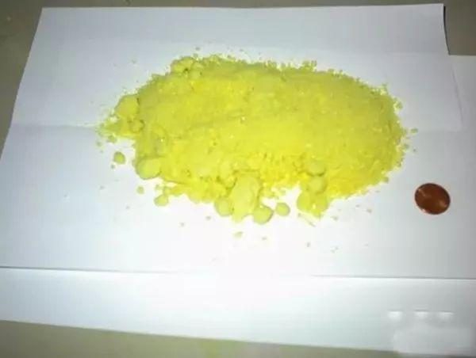
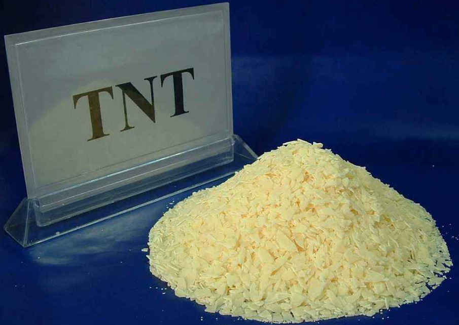
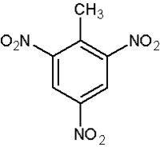
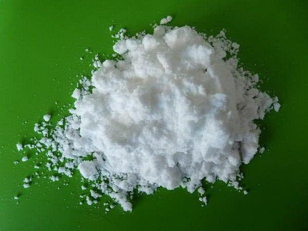
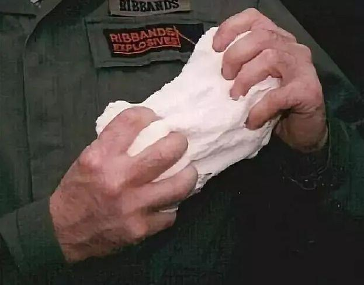
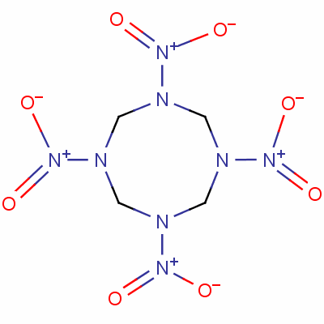
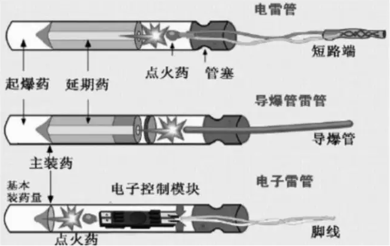
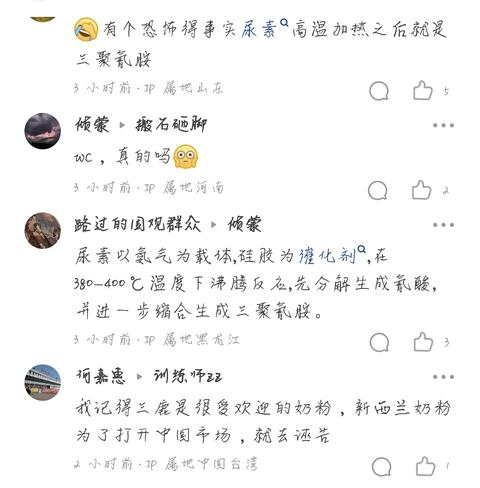
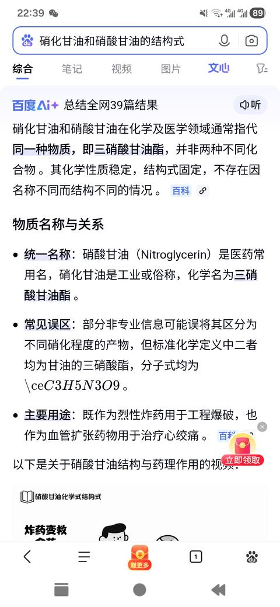
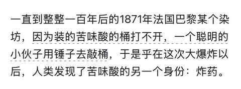

[toc]

# 问题

提问者：**<a href="https://www.zhihu.com/people/tong-hua-71-64">曈话</a>**
提问时间: 2019-5-19 22:12:28
总回答数: 25
总访问量: 289578

现代炸药的奠基人是发明黑火药的中国，还是发明了黄火药的诺贝尔？

# 回答

回答者： **<a href="https://www.zhihu.com/people/yun-qi-97-46">云起</a>**
回答时间: 2024-7-19 7:27:33
点赞总数: 2785
评论总数: 248
收藏总数: 1482
喜欢总数：230

都不是。

中国发明的黑火药不是炸药，是火药。

而黄炸药应该是黄色炸药，也就是苦味酸，不是诺贝尔发明的。

同时，另一个被误称为黄炸药的是三硝基甲苯，也就是缩写TNT，也不是诺贝尔发明的。

诺贝尔发明的是爆胶，是一种对硝化甘油的改良。

关于现代军用炸药的肇始，其实是黄色炸药——三硝基苯酚，而这个东西发明出来是做染料的。

关于军用炸药故事，看下文吧：

  

炸药并不仅仅是用在军事用途，实际上民用炸药也非常多。

比如大名鼎鼎的诺贝尔，实际上是通过对硝化甘油的钝化，发明了代拿买特以及爆炸胶，也就是通过这些赚得盆满钵满，最终成为炸药大王，才有钱去设什么诺贝尔奖。

当然，诺贝尔也有军用的产品，这个后面再说。

实际上，炸药类型非常多，但是很多并不是太适合军用，比如硝铵炸药、比如硝化甘油这些，或者爆速不行，或者不够安全，或者保存性差。

真正第一代军用炸药，也就是大规模军用的炸药，是黄色炸药——三硝基苯酚，常用名：苦味酸。

黄色炸药这个名字经常被误读为TNT，实际上真正叫黄色炸药的是苦味酸，不是说炸药单质是黄色，就叫黄色炸药，毕竟TNT也是黄色。

苦味酸之所以叫黄色炸药，是因为苦味酸最早被合成出来，是作为黄色染料的。

苦味酸（三硝基苯酚）被发现的非常早，1771年英国化学家就通过硝酸+靛蓝制造出了苦味酸，这是一种超级苦，具有强烈染色能力的化合物，分子式是C6H3N3O7三硝基苯酚，所以叫做苦味酸。

苦味酸被合成出来以后主要是作为染料，其黄色鲜艳而不褪色。

一直到整整一百年后的1871年法国巴黎某个染坊，因为装的苦味酸的桶打不开，一个聪明的小伙子用锤子去敲桶，于是乎在这次大爆炸以后，人类发现了苦味酸的另一个身份：炸药。

苦味酸很快就被军用化，其爆炸威力远超黑火药，而敏感度又低于硝化甘油等，可以装在炮弹里发射出去，也能直接装在手榴弹里，苦味酸就成了第一代大规模应用的军用炸药。

在十九世纪末，日本海军开始采用合成苦味酸的下濑火药，这个也是中日甲午海战中，武器差距的重要部分。

苦味酸作为第一代军用猛炸药，可以说对于军用武器是一个质的飞跃。

特别是火炮的威力明显有了提升。

在猛炸药使用之前，火炮还大量使用实心铁弹，有了猛炸药，开花弹也就是榴霰弹成了最主要的杀伤弹药。

这个也直接促使了火炮在战场上的统治地位。

不过苦味酸作为军用炸药还是有一点缺点，就是安全性。

作为一种酸性物质，其在潮湿环境下会和金属产生反应，生成物中有非常敏感的成分，也就是具有很明显的安全风险。

所以在苦味酸的应用中，会常用一些防潮隔水措施来规避潮湿和金属的直接接触。

其实就后来一些实际操作中，苦味酸已经比较安全了，但是苦味酸有点生不逢时，就在大规模应用伊始，人人类发现了另一种炸药，最终迅速淘汰了苦味酸。

淘汰苦味酸的，就是三硝基甲苯，常用缩写TNT。

TNT在1863年在一次实验中被意外合成，一直到1891才工业化生产。

这里特别说一下，TNT不是诺贝发明的，这个是最常见的误解。

TNT一诞生，其优秀性能就迅速征服了军用的各个领域，其各项基本特征近乎完美，在工业化以后快速代替了苦味酸成为军用炸药主力。

TNT具有非常好的安全性，基本上子弹都打不爆，更别说一般晃动敲击都很难引爆，同时化学稳定性也不错，基本不和空气水等发生反应，在绝大部分金属中也钝感。

同时，TNT熔点不高，大约80度熔化，也就是直接水浴加热就可以获得液态，对于灌装各种形状的弹药都很方便。

而且其身长成本很低，适合规模化生产。

因为TNT的优秀特性，其规模化生产以后就迅速代替苦味酸成为军用最常见的猛炸药，无论是炮弹手榴弹航弹基本都是用TNT。

也就是TNT的广泛应用，在很多时候TNT都成为了炸药的代名词。

甚至TNT作为了爆炸威力的基准计量单位，其他炸药威力常用以TNT威力的百分比来计算，后来的核武器为了直观的体现其威力也直接采用TNT吨当量来表达。

TNT有没缺点？

其实也有，TNT威力偏低，其实纯爆炸威力还不如苦味酸。

关于炸药威力，主要体现在能量密度和爆速。

TNT的爆速并不高，甚至还不如前辈苦味酸。

爆速一般和密度温度相关，一般比较一个区间值。

苦味酸爆速约7100米.秒，而TNT约6700米/秒。TNT的威力在军用炸药中并不突出，甚至可以说偏低一点。

所以在人类军事化学史上，就一直没有停下追求更强炸药的脚步。

1891年，人类合成了太安炸药PETN，这个的威力就远大于TNT，其爆速达到了8600米/秒。

但是太安的敏感度偏高，所以单质较少作为军用装药，更多时候和其他炸药混合使用，或者在雷管中采用。

1899年，德国人最早合成了黑索金炸药RDX，威力接近太安炸药，爆速约8350米.秒。但是性质比太安稳定很多，所以其应用非常广泛。

其中，黑索金加入塑胶剂等，就做成塑胶炸药C4。

C4具有高度可塑性，很高的安全性，虽然有塑胶剂其威力较单质黑索金略低一点，但是爆速也一般达到了8000米/秒，还是远大于TNT。

C4因为其可塑和安全性，成为特种作战的常用炸药。

而比黑索金还强的，就是奥克托金HMX。

奥克托金HMX的发现比较特殊，在早期制造黑索金的过程中，就发现会有一些伴生产物，最终在1941年纳粹德国科学家单独分离出了这种物质，命名为奥克托金HMX。

奥克托金HMX的爆速超过了9000米/秒，而且其稳定性还比黑索金还好。

综合性能而言，奥克托金可以说是炸药家族的绝对王者。

可惜，奥克托金就一个缺点，制造成本高，所以贵，最终无法代替其他炸药。

在奥克托金以后，还有更高端的CL20炸药。CL20是一种硝铵类炸药，其爆速达到了9600米/秒，是现在可生产炸药中威力最大的。

CL20的问题就是产量太小，成本太高，其性价比是无法大规模应用的。

当然，比CL20还强的也还有，但是各种原因都没有工业化生产，所以现有最强的实用化炸药，就是CL20了。

现在军用炸药主流就是这些了。

对于炸药这个东西，其实还有个重要的辅助，就是引爆装制。

前面说了炸药有一个最重要特性，需要足够的钝感，比如摔摔打打不能引爆，火烧不容易爆，否者装填到炮弹里，发射瞬间就会被引爆了。

但是太钝感的炸药，就会面临另一个问题，如何引爆。

前面说的炸药大王诺贝尔，本身是从民用炸药起家的，但是对于军用炸药，诺贝尔有一个最大的贡献，就是其雷管的设计。

雷管是通过敏感的起爆药爆炸，来引爆炸药。

只有了雷管，才能让安全钝感的炸药在需要爆炸时候就能爆炸。所以各种军用炸炸逼结构中，除了装药，引爆装制也是极其重要的，这里就不展开了。

对这些军用猛炸药的使用场景，基本也就是根据用途和成本来的。

比如最普通最大量使用装填爆炸物，就是TNT，这个是炸药的性价比之王，最常用在各种炮弹、航弹的装药中。属于价廉物美量大管饱。

稍微高级一点的，比如单兵导弹等装药，就可能是黑索金和包含黑索金的混合炸药。

也有一些小体积爆炸物，为了追求威力也会采用黑索金。

更高级一点的，诸如远程导弹这种价格高的，就会采用奥克托金这类高级货了。

另外还有些特殊需求的，诸如核弹引爆装药，可能会有一些更钝感的特种炸药了。

CL20还是成本太高，除了一些传说中的杀器可能装这个，一般应用是非常少的，在一些高端武器的发射药中，会混合CL20，以增加其动力，这个使用算是火药而非炸药类了。

  

原文地址：[(云起)现代炸药的奠基人是发明黑火药的中国，还是发明了黄火药的诺贝尔？](https://www.zhihu.com/question/325139151/answer/3566453371) 

# 评论

1. <a href="https://www.zhihu.com/people/zhu-jing-nan-hai-81-46">happy nerd</a> (<small title="江苏">2024-9-15 15:39:44</small>): 我发现个事，知乎今年用户量暴跌，科普类文章又多起来了，看来知乎最适合的还是做小众平台［doge］
   - <a href="https://www.zhihu.com/people/mo-ran-50-4">漠然</a> (<small title="浙江">2024-9-25 11:30:31</small>): 平台想用争议性的话题来带动流量，结果就是各种奇形怪状的生物乘虚而入让很多作者读者不堪其扰直接选择放弃平台，活生生的大脸例子步子迈大了容易扯到
   - <a href="https://www.zhihu.com/people/niu-niu-nie-nie-na-ni-ni-niu">人类之主尼奥斯</a> (<small title="河北">2024-12-21 11:15:31</small>): 这是好事啊［惊喜］
   - <a href="https://www.zhihu.com/people/cui-long-hai-83">多情剑客无情剑</a> (<small title="回复于 2025-3-15 21:6:27/上海"> ✉️:漠然</small>): 这是好事啊，有一段时间我都放弃了，感觉都是些什么牛鬼蛇神
   - <a href="https://www.zhihu.com/people/wu-zhong-ke-sheng-you">疏雨小筑</a> (<small title="回复于 2025-3-21 9:40:32/山东"> ✉️:多情剑客无情剑</small>): 现在也不少
   - <a href="https://www.zhihu.com/people/ying-guang-60-83-86">风与云</a> (<small title="回复于 2025-3-22 7:57:33/湖北"> ✉️:多情剑客无情剑</small>): 现在也很多
   - <a href="https://www.zhihu.com/people/shi-luo-ban-bian-hai">曹小川</a> (<small title="宁夏">2025-4-5 14:19:16</small>): 其实这篇科普文章质量还是很一般。
   - <a href="https://www.zhihu.com/people/zhai-zhi-qiang-23">其实挺好</a> (<small title="山东">2025-10-25 10:34:59</small>): 以前知乎都是左右换页的  
 
现在上下划纯属让人看广告的
   - <a href="https://www.zhihu.com/people/leon-41-48-92">leon</a> (<small title="浙江">2025-10-26 17:31:25</small>): 其实是广告，盐选，还动不动禁言封号，用户体验太差［doge］
   - <a href="https://www.zhihu.com/people/newbee_wang">duangduangdaddy</a> (<small title="上海">2026-5-5 9:43:19</small>): 把盐选砍掉就能回来不少
   - <a href="https://www.zhihu.com/people/tangyixp">tangyixp</a> (<small title="广西">2026-6-20 12:16:30</small>): 明天严选会员到期，不续费了。续也白续，续了想看文章还是到处要钱。盐选会员，知识会员…谁知道知乎还会搞出什么幺蛾子来弄我们的钱
2. <a href="https://www.zhihu.com/people/mathis_wei">Mathis·WEI</a> (<small title="广西">2024-7-20 10:11:52</small>): 甲午战争虽然用的也是苦味酸（还混了一点点硝化纤维之类的提高威力），但是那会日本还没搞定国产化，下濑火药还要再后面才有，用的其实是英国进口的立德炸药，同时期也有法国的麦宁炸药，这两个都是95%的苦味酸加其他辅助成分，北洋水师的洋顾问其实也知道有这些东西的，但已经没足够的经费大规模更新装备了，日本自己生产下濑火药要实战已经是后面日俄战争了
   - **云起** (<small title="四川">2024-7-20 10:17:7</small>): 感谢补充细节。  
 
也就是日军当时使用的是以苦味酸为基础的进口炸药，自产的苦味酸炸药尚未装备。  
 
不过就炸药这个差距依旧是一样的。  
 
国内确实是知道而没有装备。连续十年都没更新装备，换炮弹更没可能了，这个是制度性问题了。
   - <a href="https://www.zhihu.com/people/mathis_wei">Mathis·WEI</a> (<small title="回复于 2024-7-20 11:37:56/广西"> ✉️:云起</small>): 也不能把锅全甩给慈禧，就北洋水师在技术更新周期都不到二十年的工业革命时期买一堆船，很快就会过时，但是绝大多数国家短时间内都是掏不出全部更新换代的钱，就算是旧船换新炮效果也不一定好，北洋水师当时的经费光是引进新的无烟发射药都花得差不多了，日本是起步晚但是短时间内买新船和引进新战术打败北洋水师不奇怪
   - **云起** (<small title="回复于 2024-7-20 13:20:59/四川"> ✉️:Mathis·WEI</small>): 但是十年完全没更新也确实不合理，至少该有部分更新了。  
 
不过你说的对，那时候确实是海军技战术高速发展的时代，一不小心就落后了。
   - <a href="https://www.zhihu.com/people/mathis_wei">Mathis·WEI</a> (<small title="回复于 2024-7-20 16:19:51/广西"> ✉️:云起</small>): 北洋水师从建立到嗝屁发射药都经历过几轮大小换代了，从燃烧不稳定的黑火药到用碳化不完全的木粉的栗色火药，然后又出现了硝化棉和基于硝化棉的无烟双基药，船的设计理念也有很大的改变，十年前的新锐战舰可能十年后就发现跟不上时代了
   - **云起** (<small title="回复于 2024-7-20 16:49:50/四川"> ✉️:Mathis·WEI</small>): 是啊，随后的日俄战争彻底奠定了海战的基本模式，也让后来军舰的设计思想得以统一化，剩下就是细节了。  
 
那个时候，真是大变革的时候。
   - <a href="https://www.zhihu.com/people/zhu-di-22-49-86">佛系青年</a> (<small title="上海">2024-7-30 21:15:15</small>): 苦味酸具有酸性会腐蚀金属，北洋没解决这个问题，但是本子用蜡涂在蛋壳上解决了这个问题。
   - <a href="https://www.zhihu.com/people/mathis_wei">Mathis·WEI</a> (<small title="回复于 2024-7-31 3:41:10/广西"> ✉️:佛系青年</small>): 北洋是压根没来得及买就完蛋了，真正吃苦味酸的是沙俄舰队在对马海战［捂脸］
   - <a href="https://www.zhihu.com/people/ling-ren-qi-jia">散人肝不死</a> (<small title="回复于 2024-9-14 15:24:52/浙江"> ✉️:Mathis·WEI</small>): 后发优势
   - <a href="https://www.zhihu.com/people/xiao-ye-yao-77">叶薇凉</a> (<small title="四川">2024-10-9 15:46:13</small>): 但那时候我记得日本海军也没有完全解决苦味酸炸药的安全性问题，是直到有了伊集院引信之后整个苦味酸炸药的管线才在日本海军里完全跑通的
   - <a href="https://www.zhihu.com/people/mathis_wei">Mathis·WEI</a> (<small title="回复于 2024-10-9 16:22:53/广西"> ✉️:叶薇凉</small>): 苦味酸安全性一直没解决，不过战前已经开始生产安全性更好的九八式爆药了，只是没来得及快速替换，英国也差不多，从立德换谢利特。
   - <a href="https://www.zhihu.com/people/kakalll">kakalll</a> (<small title="回复于 2024-10-29 3:55:29/辽宁"> ✉️:云起</small>): 我觉得最大的变革是无烟火药和高爆速的炸药 还有从风帆到机械动力 那会太快了
   - <a href="https://www.zhihu.com/people/ye-dou-49-84">Fisher</a> (<small title="回复于 2025-5-15 9:13:21/河北"> ✉️:云起</small>): 别听底下那个mathis的说辞，一战前日本人换船的速度相当快，平均四五年一换，即便有的船比如香取级，萨摩级建造完成就落伍，但是日本很快也掏出来了金刚级。
 
当然日本更新多财政压力也大，不过一方面日本通过殖产兴业发展经济，一方面天皇带头节约经费给海军，因此日本都完成了，相比来说老太太不管是挪用海军军费还是以海军名义捞她的生日party钱都是极为拟人的行为。如果带清和日本1898年开战就好了，就会有12000吨级的日本战列舰给8000吨级的镇定两远一点儿霓虹震撼，老太太也就没这么多粉丝了［惊喜］
   - <a href="https://www.zhihu.com/people/he-sha-hui-98">三无产品</a> (<small title="河南">2025-10-10 21:40:11</small>): 炸药和火药的区别是什么？不过是人为定义罢了，火药也能炸，炸药也能慢慢烧
   - <a href="https://www.zhihu.com/people/wangsan-57">wangsan</a> (<small title="回复于 2025-10-27 12:0:10/浙江"> ✉️:Mathis·WEI</small>): 当时它们憋着一股气，哪怕卖批也要赢
   - <a href="https://www.zhihu.com/people/vgundam">vgundam</a> (<small title="回复于 2026-7-6 18:50:27/江苏"> ✉️:Mathis·WEI</small>): 十年来的电动车发展也是这样，一年一个大跨越
3. <a href="https://www.zhihu.com/people/windfall-huang">未确定</a> (<small title="上海">2024-7-20 20:28:23</small>): 一个聪明的小伙［吃瓜］
   - <a href="https://www.zhihu.com/people/hao-qi-35-24">一桶冷水</a> (<small title="上海">2025-3-15 22:0:51</small>): 一堆聪明的小伙［思考］
   - <a href="https://www.zhihu.com/people/ming-yu-28-85">冥羽</a> (<small title="山东">2025-3-24 9:45:37</small>): 过了100年才出现一个聪明的小伙，这是不是有点太神奇了［笑哭］
   - <a href="https://www.zhihu.com/people/jiao-mao-zi-fa-shi">碳酸電機</a> (<small title="回复于 2025-3-24 11:13:57/广东"> ✉️:冥羽</small>): 可能就这一个活着的［doge］
   - <a href="https://www.zhihu.com/people/mo-ye-shu-huang-61">末页书荒</a> (<small title="广东">2025-5-12 16:42:23</small>): 一锤子推动军事领域巨大进步，聪明！
   - <a href="https://www.zhihu.com/people/li-xue-wei-65-59">看图说名</a> (<small title="河北">2026-4-14 8:36:24</small>): 那一个聪明的小伙当场是不是没了。
   - <a href="https://www.zhihu.com/people/73-70-35-89">听天由命</a> (<small title="回复于 2026-5-7 12:43:1/广西"> ✉️:看图说名</small>): 直接飞升见上帝
4. <a href="https://www.zhihu.com/people/11-49-93-35-69">雁回小榕</a> (<small title="广东">2024-9-13 22:54:57</small>): 聪明的小伙后来怎么样了？
   - <a href="https://www.zhihu.com/people/sun-zhi-jing-10">陀思妥耶夫兔斯基</a> (<small title="河北">2024-9-16 9:15:15</small>): 一大桶炸药爆炸，还有后来嘛［飙泪笑］［飙泪笑］
   - <a href="https://www.zhihu.com/people/yi-hui-da-jiang-jun">阳光彩虹小白马</a> (<small title="北京">2024-9-25 13:0:32</small>): 屁股不疼了
   - <a href="https://www.zhihu.com/people/du-zi-jian-qiang-88">牛肉至少</a> (<small title="湖北">2024-10-27 9:7:27</small>): 后来出现在了知乎
   - <a href="https://www.zhihu.com/people/kakalll">kakalll</a> (<small title="辽宁">2024-10-29 3:56:29</small>): 聪明的小伙变成了火风暴［思考］
   - <a href="https://www.zhihu.com/people/wei-xin-yong-hu-91-39-21">零和X</a> (<small title="河北">2025-3-21 14:29:30</small>): 变成一堆聪明的小伙了［思考］
   - <a href="https://www.zhihu.com/people/tan-yue-wen-47">老狗熊</a> (<small title="广东">2025-3-21 20:50:26</small>): 已经上幼儿园了
   - <a href="https://www.zhihu.com/people/11-49-93-35-69">雁回小榕</a> (<small title="回复于 2025-3-22 0:12:5/广东"> ✉️:老狗熊</small>): ［惊喜］
   - <a href="https://www.zhihu.com/people/8-72-85-49">程灵素</a> (<small title="山东">2025-4-10 12:52:13</small>): 2024-1871=153年＞130年，后来他死了，人们安葬了他。
   - <a href="https://www.zhihu.com/people/xiang-ju-jian-yi">暂别知乎</a> (<small title="河北">2025-4-11 9:59:19</small>): 同问
   - <a href="https://www.zhihu.com/people/75-43-50-4-52">冰雨</a> (<small title="福建">2025-10-12 15:40:32</small>): 我就好奇这说法是怎么传出来的，按理当事人应该都死光了，哪个幸运儿活下来了？
   - <a href="https://www.zhihu.com/people/pang-ruo-liang-ren-26-45">胖若两人</a> (<small title="广西">2025-10-27 9:38:56</small>): ［doge］变成了满天星斗
   - <a href="https://www.zhihu.com/people/ye-lan-ting-yu-80-7">夜阑听雨</a> (<small title="山西">2025-10-27 17:27:34</small>): 后来去知乎写盐选了
   - <a href="https://www.zhihu.com/people/sha-guang-tu-fen">兔粉</a> (<small title="回复于 2026-3-21 17:19:14/湖南"> ✉️:冰雨</small>): 设想一个很合理的场景，染坊某个人发现装苦味酸的桶打不开了，几个人商量了一下决定找个锤子把桶直接敲烂算了（毕竟要花钱买桶），告知老板后老板也同意了，然后交给这个倒霉小伙子去干，其他人该干嘛干嘛，于是就有人出门办事。回来一看染坊没了。官府找人问一下，按照当时的化学发展水平猜也猜出来了
   - <a href="https://www.zhihu.com/people/yu-qian-47-18">于谦</a> (<small title="回复于 2026-3-25 8:31:37/湖南"> ✉️:兔粉</small>): 发生了爆炸，警察来侦查，总得有爆炸物吧，对残留物分析，指向燃料，一测试，发现染料真的会爆炸，为什么染料爆炸了，提一桶包装好的染料来分析，发现盖子紧打不开，是不是得想办法，其中一个办法想到了锤子
5. <a href="https://www.zhihu.com/people/sheng-huo-man-xi-wang">生活满希望</a> (<small title="广东">2024-7-19 17:48:39</small>): 为什么会给我推荐这个，难道是上天暗示我要搞出点大动静？［捂脸］
   - <a href="https://www.zhihu.com/people/tiphereth-91">Tiphereth</a> (<small title="贵州">2024-9-13 18:29:33</small>): 你也想当聪明的小伙？
   - <a href="https://www.zhihu.com/people/yi-hui-da-jiang-jun">阳光彩虹小白马</a> (<small title="北京">2024-9-25 13:2:26</small>): 你想当能吧下届荣誉吧主？［惊讶］
   - <a href="https://www.zhihu.com/people/cui-long-hai-83">多情剑客无情剑</a> (<small title="上海">2025-3-15 21:7:5</small>): 分分钟抓你，哈哈
   - <a href="https://www.zhihu.com/people/8-72-85-49">程灵素</a> (<small title="回复于 2025-4-10 11:23:50/山东"> ✉️:多情剑客无情剑</small>): 搞物理、化学是容易出事，而生物不会。整出什么危害性极大的微生物，都不知道谁干的。
6. **云起** (<small title="四川">2024-7-19 17:13:51</small>): 诺贝尔，黄色炸药，TNT，火药和炸药，这些属于易混淆概念，军迷入门考试的必考项目［捂嘴］。
   - <a href="https://www.zhihu.com/people/sun-yan-47-82">虫声新透绿窗纱</a> (<small title="山东">2026-6-2 11:41:38</small>): 无烟火药算啥［doge］
   - **云起** (<small title="回复于 2026-6-2 12:51:20/四川"> ✉️:虫声新透绿窗纱</small>): 无烟火药就是火药，对应的是有烟黑火药。  
 
你要简单分，火药这个大类下面有黑火药和无烟火药，无烟火药下面又有很多具体型号。  
 
本质上是黑火药作为一种混合物燃烧后固体残留太多，这些固体残留作为极小颗粒散发在空中就是烟雾的形态。  
 
无烟火药燃烧后产物都是无色气体，所以叫做无烟火药。
   - <a href="https://www.zhihu.com/people/powerzaurus">powerzaurus</a> (<small title="回复于 2026-7-3 11:4:30/北京"> ✉️:云起</small>): 黑火药通过造粒、加压等工艺，也能勉强军用吧。
   - **云起** (<small title="回复于 2026-7-3 11:27:9/四川"> ✉️:powerzaurus</small>): 作为发射药是可以的，作为炸药就太差了。
7. <a href="https://www.zhihu.com/people/liu-lei-69-23-17">刘磊</a> (<small title="山东">2024-9-16 14:11:15</small>): 诺贝尔的发明是雷管，有了这个才能大规模使用钝化炸药
8. <a href="https://www.zhihu.com/people/wang-bo-wen-78-84">小怪兽</a> (<small title="山西">2024-7-20 10:17:56</small>): 可以聊聊未来炸药，什么阴离子全氮之类［滑稽］
   - **云起** (<small title="四川">2024-7-20 10:19:54</small>): 这个是工艺问题了。实验室制备没问题，大规模生产涉及的东西就多了，大概率普及尚待时日了［大笑］。
   - <a href="https://www.zhihu.com/people/liu-1745809">杰斯提斯同盟者</a> (<small title="湖北">2024-7-28 22:41:40</small>): 这个能稳定存在吗？
   - <a href="https://www.zhihu.com/people/wang-bo-wen-78-84">小怪兽</a> (<small title="回复于 2024-7-28 23:12:44/山西"> ✉️:杰斯提斯同盟者</small>): 不清楚～  
 
  
 
若真能批量化和实战化，能代替战术核武器，那么战争形态又要改变了  
 
  
 
重机枪打出狙击榴效果，机关炮打出155效果，155打出千磅航弹效果［耶］
   - <a href="https://www.zhihu.com/people/scylla-54">知乎用户YV0RIO</a> (<small title="回复于 2024-8-21 10:35:13/上海"> ✉️:杰斯提斯同盟者</small>): 听说过叠氮化钠么？
   - <a href="https://www.zhihu.com/people/shui-guo-37-33">水果</a> (<small title="回复于 2024-8-28 11:56:18/山东"> ✉️:小怪兽</small>): 155才装10公斤左右的炸药而千磅炸弹最少几百公斤炸药［doge］你这需要提高几百倍威力，化学能几乎不可能
   - <a href="https://www.zhihu.com/people/wang-bo-wen-78-84">小怪兽</a> (<small title="回复于 2024-8-28 16:7:59/云南"> ✉️:水果</small>): 80年前，你也想象不到有燃料空气炸弹和钻地弹这些东西  
 
  
 
否则哪还有塞班岛、上甘岭这些打法
   - <a href="https://www.zhihu.com/people/shui-guo-37-33">水果</a> (<small title="回复于 2024-8-28 19:24:56/山东"> ✉️:小怪兽</small>): 100年前到现在炸药也就进步了顶多几倍［飙泪笑］
   - **云起** (<small title="回复于 2024-9-12 17:49:13/四川"> ✉️:小怪兽</small>): 燃料空气炸弹实际上攻坚效果还不如TNT［捂嘴］，而钻地弹的起源还在二战。  
 
现代战争技术在传统爆炸物领域并没多少飞跃，更多是感知能力和精准度。  
 
就炸药威力而言，没有数量级层面的提升。  
 
  
 
当然，你可设想金属氢［捂嘴］。
   - <a href="https://www.zhihu.com/people/ming-deng-19">大牧</a> (<small title="上海">2024-9-13 17:19:11</small>): 全氮阴离子盐
   - <a href="https://www.zhihu.com/people/zhong-yong-18-88">中庸</a> (<small title="山西">2024-9-18 14:46:32</small>): 金属氢之类的？
   - <a href="https://www.zhihu.com/people/david-74-83-91">David</a> (<small title="北京">2025-4-16 11:46:3</small>): 比如塑料外壳的锂离子炸药包啊［大笑］
   - <a href="https://www.zhihu.com/people/zhi-ge-63-40">zero</a> (<small title="回复于 2025-10-28 16:59:16/河北"> ✉️:小怪兽</small>): 枪管受不了这么大的膛压就算是枪管受得了，人的肩膀也受不了。
   - <a href="https://www.zhihu.com/people/yuan-gui-da-shi">圆规大师</a> (<small title="回复于 2025-12-12 20:27:25/上海"> ✉️:云起</small>): 燃料空气炸弹已经被证明没啥优势，还不如直接航弹砸，以大俄的水准，还是乖乖的用铁炸弹，高级的玩意不适合大俄。  
 
还有典型的就是被某些军盲吹上天的铝热弹，首先大俄用的就不是铝热弹，而是白磷弹，铝热弹作用时间很短，天女散花般撒下来就只剩保暖作用了。那样抛洒下来还能有杀伤力的，只能是白磷弹，而这是国际公约禁止的武器。就算白磷弹，对于有掩体的也几乎起不到杀伤作用。
9. <a href="https://www.zhihu.com/people/hu-li-yihao-83">狐狸一号</a> (<small title="广东">2024-9-16 0:46:19</small>): 一个叫火药一个叫炸药，而且中国人也没发现黑火药的正确材料，一开始是不知道要放碳，而且成分比例很有问题
   - <a href="https://www.zhihu.com/people/cun-shang-suan-xiu-cai">说书的酸秀才</a> (<small title="广东">2025-4-5 20:22:30</small>): 造谣传谣，明朝后期，接近现代黑火药了。有人拿燃烧弹配方，诋毁。
   - <a href="https://www.zhihu.com/people/mei-zhu-zhe-zhu">芝士power菇</a> (<small title="北京">2025-5-15 1:48:56</small>): 因为那会的中国是以阴阳五行为基准做火药的［捂脸］［捂脸］
   - <a href="https://www.zhihu.com/people/xue-xi-te-chong-bing">树先生</a> (<small title="回复于 2025-10-28 13:12:22/广东"> ✉️:说书的酸秀才</small>): ［吃瓜］还有种可能。是没合适的枪管。尤其是里面的螺旋。叫啥工艺来着。［看看你］好像直到二战。那装备才叫人类工艺品的战争。晚清也曾经想国产。奈何技术始终无法突破。好像只有当时德国具备完整的枪管生产。小批量生产。
   - <a href="https://www.zhihu.com/people/cun-shang-suan-xiu-cai">说书的酸秀才</a> (<small title="回复于 2025-10-28 15:44:27/广东"> ✉️:树先生</small>): 所以，影响你国火药是0→1。？？？
   - <a href="https://www.zhihu.com/people/cun-shang-suan-xiu-cai">说书的酸秀才</a> (<small title="回复于 2025-10-28 15:46:26/广东"> ✉️:树先生</small>): 明末，西方铜炮反超了，不过铁炮还没有，葡萄牙人在佛山挖的工人才学到~
   - <a href="https://www.zhihu.com/people/xue-ding-e-de-mao-43-67">薛定谔的猫</a> (<small title="回复于 2026-7-1 16:12:49/山东"> ✉️:芝士power菇</small>): 早期很多发明都是这样，错误的理论不影响正确的产品［捂脸］
10. <a href="https://www.zhihu.com/people/cain2577">文之翁</a> (<small title="四川">2024-9-1 21:45:22</small>): 诺贝尔研究了一辈子硝化甘油，他咋没发现这玩意儿可以救冠心病呢？［捂脸］
    - <a href="https://www.zhihu.com/people/cheng-yu-52-57-10">承羽</a> (<small title="浙江">2024-9-14 14:43:32</small>): 可能是硝化甘油看起来不好吃
    - <a href="https://www.zhihu.com/people/bluesf42">Blue</a> (<small title="江苏">2024-9-17 15:56:3</small>): 循证医学的发展是到很晚的时间了，快到20世纪了，一些现代医学的基本常识才确立起来，手术前要洗手这种事都是很晚才出现。诺贝尔时代，就算有人去吃这些东西，也很难发现它的疗效，变量太多了，那个时代的医学可以用一团雾来形容，到处都是未知数
    - <a href="https://www.zhihu.com/people/cain2577">文之翁</a> (<small title="回复于 2024-9-17 16:1:8/四川"> ✉️:Blue</small>): 我觉得诺贝尔要是发现硝化甘油能有效抢救心梗死，他挣的钱比在炸药领域多，毕竟″速效救心丸″要挣钱多了！［捂脸］
    - <a href="https://www.zhihu.com/people/bai-sha-47">白沙</a> (<small title="上海">2024-9-17 19:4:2</small>): 已经有人发现了，医生也向诺贝尔推荐了，但是诺贝尔觉得“你们懂个p的硝化甘油”
    - <a href="https://www.zhihu.com/people/ding-tian-fu-zhen">丁一</a> (<small title="上海">2024-9-19 14:30:10</small>): 因为他太了解硝化甘油了，要是换个文盲可能真就去试试看了
    - <a href="https://www.zhihu.com/people/zuo-kan-yun-qi-78-17">坐看云起</a> (<small title="回复于 2024-11-5 14:32:47/江苏"> ✉️:白沙</small>): “没有人比我更懂硝化甘油”
    - <a href="https://www.zhihu.com/people/dakew">王大可</a> (<small title="回复于 2025-3-13 11:58:8/广东"> ✉️:文之翁</small>): 就算不打仗。炸山修路挖矿拆屋，炸药成吨霍霍。心脏病也成吨的吃吗？
    - <a href="https://www.zhihu.com/people/tian-ran-ran-85">唯心不易</a> (<small title="回复于 2025-10-26 20:54:13/广东"> ✉️:王大可</small>): 按吨卖和按克卖你说哪个挣钱
    - <a href="https://www.zhihu.com/people/wu-yuan-su-wu-ju-32">芜园素芜居</a> (<small title="回复于 2025-10-26 21:51:18/湖北"> ✉️:文之翁</small>): 硝化甘油只能抢救心绞痛，心梗靠硝甘并不行
    - <a href="https://www.zhihu.com/people/cain2577">文之翁</a> (<small title="回复于 2025-10-26 21:57:51/四川"> ✉️:芜园素芜居</small>): 班门弄大爹，关庙玩大刀？！  
 
  
 
心脏冠状动脉狭窄异致心室流向心房的血液不足，这种病叫冠心病，直接临床症状就是心绞痛！  
 
心梗是冠心病极其严重后引起左右心房平滑肌因严重长期缺供血坏死，导致心脏停搏，这个是结果而不是症状~  
 
  
 
别来拿你的业余挑战人家吃饭的领域，永远记住！［思考］［思考］
    - <a href="https://www.zhihu.com/people/wu-yuan-su-wu-ju-32">芜园素芜居</a> (<small title="回复于 2025-10-26 22:11:41/湖北"> ✉️:文之翁</small>): 我说的就是心肌梗死啊，心梗了硝酸甘油还有用吗？
    - <a href="https://www.zhihu.com/people/cain2577">文之翁</a> (<small title="回复于 2025-10-26 22:14:8/四川"> ✉️:芜园素芜居</small>): 有，硝酸甘油能起沉尸，肉白骨~  
 
心肌梗死后，都炼化了的，只要还没过头七，都能救回来~
    - <a href="https://www.zhihu.com/people/wu-yuan-su-wu-ju-32">芜园素芜居</a> (<small title="回复于 2025-10-26 23:31:33/湖北"> ✉️:文之翁</small>): 天魁星杳马的时间回溯是吧［捂脸］
    - <a href="https://www.zhihu.com/people/l032lq">山斗长干</a> (<small title="回复于 2026-5-5 22:36:22/河南"> ✉️:文之翁</small>): 硝化甘油和硝酸甘油不是一种东西
    - <a href="https://www.zhihu.com/people/cain2577">文之翁</a> (<small title="回复于 2026-5-5 22:40:51/河北"> ✉️:山斗长干</small>): 这位兄台  
 
右手放自己心口，对着上帝耶和华，说一句非常诚实的话！  
 
  
 
您，真的完成9年义务教育了？！说真话，不要撒谎骗天地骗自己，OK？  
 

    - <a href="https://www.zhihu.com/people/l032lq">山斗长干</a> (<small title="回复于 2026-5-5 23:33:17/河南"> ✉️:文之翁</small>): 医用的硝酸甘油片，活性成分仅有0.3-0.5毫克，主要成分是淀粉、硬脂酸镁等。
 
作为炸药的硝化甘油，是高纯度的三硝酸甘油酯，为液体。
    - <a href="https://www.zhihu.com/people/luo-ying-42-74-73">落英</a> (<small title="回复于 2026-6-19 21:8:17/河南"> ✉️:山斗长干</small>): 这样不好！
    - <a href="https://www.zhihu.com/people/xue-ding-e-de-mao-43-67">薛定谔的猫</a> (<small title="回复于 2026-7-1 16:16:55/山东"> ✉️:坐看云起</small>): 的确是这样，自己半条命都搭上了［捂脸］
11. <a href="https://www.zhihu.com/people/liang-jun-9-30">ZetaPlusA1</a> (<small title="广东">2024-9-14 1:6:51</small>): 那个聪明的小伙子后来咋样了［捂脸］
    - <a href="https://www.zhihu.com/people/sophie-60-2">秦风黄鸟 Sophie</a> (<small title="黑龙江">2024-9-14 10:20:0</small>): 大抵是似了罢［拜托］
12. <a href="https://www.zhihu.com/people/metorm">船长</a> (<small title="中国香港">2024-11-3 22:32:23</small>): 我非常感兴趣，现场究竟是谁活下来并且告诉后人是大锤敲苦味酸的问题？
    - <a href="https://www.zhihu.com/people/da-dao-zhi-jian-83-51">大道至简</a> (<small title="山东">2025-3-15 1:35:36</small>): 有没有一种可能，那个聪明小伙去借锤子，人家问他干嘛，他说去敲那个桶。最后一声巨响过后，锤子从天而降，但聪明小伙找不到了。
    - <a href="https://www.zhihu.com/people/liumiamiao">柳喵喵</a> (<small title="山西">2025-10-26 16:39:49</small>): 合理推测他不是一锤子就敲炸的，前期没炸的时候或许被人看到了
13. <a href="https://www.zhihu.com/people/da-shan-mao-14">大山猫</a> (<small title="江西">2025-3-23 1:15:12</small>): 黑火药就别扯了，现代炸药是建立在现代化学，现代化工的基础上的，黑火药只不过是古代炼丹师把硫磺、硝酸钾、木炭当做炼丹的材料瞎猫碰上死老鼠碰上的。
    - <a href="https://www.zhihu.com/people/zhang-chao-54-87">打工人甲</a> (<small title="四川">2025-3-24 18:26:14</small>): 感觉即使现代的很多发明，也是瞎猫碰上死耗子，炼金术差不多地各种试，想解决a问题，结果发现瞎折腾出来的东西可以解决b问题。
    - <a href="https://www.zhihu.com/people/ax-greataxe">AX greataxe</a> (<small title="上海">2025-3-25 20:31:51</small>): 并没有，近代大部分化工品都是瞎猫碰上死耗子撞大运出来的，苦味酸本来是染料，特氟龙也是偶然发现的，太多了可以出本书。［捂脸］
    - <a href="https://www.zhihu.com/people/cun-shang-suan-xiu-cai">说书的酸秀才</a> (<small title="广东">2025-4-5 20:24:43</small>): 硝化甘油、苦味酸，不是偶然发现？  
 
反对传统忠孝不是不可以，只是不能…
14. <a href="https://www.zhihu.com/people/l032lq">山斗长干</a> (<small title="河南">2026-3-31 21:37:44</small>): 知乎直答称：CL20（六硝基六氮杂异伍兹烷），中国于2016年突破其工艺并实现工业化生产，成本接近甚至低于TNT。
    - <a href="https://www.zhihu.com/people/qing-tian-de-da-hua-mao">晴天的大花貓</a> (<small title="广东">2026-5-5 21:57:5</small>): 这是不可能的
    - <a href="https://www.zhihu.com/people/nagisa_koworu">椰树十一年的渚薰</a> (<small title="上海">2026-5-9 11:12:17</small>): 你看这个名字就知道不便宜
    - <a href="https://www.zhihu.com/people/72-41-17-79">凡夫</a> (<small title="安徽">2026-5-16 12:22:5</small>): 这东西最开始美国人发明，但因为成本，美国一直没有规模使用，又是中国人将成本降为几分之一，开始规模列装，外媒报道过这件事
15. <a href="https://www.zhihu.com/people/ni-dong-duo">简而言之</a> (<small title="广东">2025-9-21 13:13:39</small>): 为啥诺贝尔没有获得诺贝尔奖呢
16. <a href="https://www.zhihu.com/people/jiu-feng-70-24">疚瘋</a> (<small title="吉林">2025-3-26 15:30:38</small>): 榴霰弹用不到猛炸药，黑火药就够了，杀伤力靠的是发射药［吃瓜］
    - **云起** (<small title="四川">2025-3-26 15:39:53</small>): 你说的是霰弹，不是榴霰弹。  
 
一般说的霰弹是打出去一堆小弹丸。  
 
而榴霰弹是打出去一个炮弹，然后炸开很多小弹丸，这个叫榴弹，或者榴霰弹。
    - <a href="https://www.zhihu.com/people/jiu-feng-70-24">疚瘋</a> (<small title="回复于 2025-3-26 16:54:49/吉林"> ✉️:云起</small>): 我知道什么是榴霰弹，而且早在猛炸药发明前就有了［尴尬］
    - <a href="https://www.zhihu.com/people/jiu-feng-70-24">疚瘋</a> (<small title="回复于 2025-3-26 16:55:19/吉林"> ✉️:云起</small>): 榴霰弹不等于榴弹
17. <a href="https://www.zhihu.com/people/tank-wood-98">Tank.Wood</a> (<small title="广东">2024-9-13 14:20:10</small>): 不管是黑火药还是黄炸药，第一次从冷兵器到热兵器就是划时代的
18. <a href="https://www.zhihu.com/people/mao-ling-44">猫灵</a> (<small title="北京">2024-7-19 13:10:22</small>): CL20我们似乎已经超过实验室产量量级了。
    - **云起** (<small title="四川">2024-7-19 15:21:21</small>): 尚未达到还没工业化量产水平，别说cl20，就是奥克托金都没法大规模用，产能成本问题。
    - <a href="https://www.zhihu.com/people/du-zi-jian-qiang-88">牛肉至少</a> (<small title="湖北">2024-10-27 9:7:59</small>): cl20出厂价要1块钱1g
    - <a href="https://www.zhihu.com/people/yin-xia-wu">神经病专家</a> (<small title="回复于 2025-3-20 21:44:39/福建"> ✉️:牛肉至少</small>): 1块1克也不是非常贵，许老板可以买几百万吨
    - <a href="https://www.zhihu.com/people/ran-you-27">冉有</a> (<small title="回复于 2025-4-2 22:52:46/广东"> ✉️:牛肉至少</small>): 这个价格放在空空蛋或者防空蛋上面也不会很离谱，毕竟打下来的东西也很贵
    - <a href="https://www.zhihu.com/people/zhong-long-4">Jojo立</a> (<small title="回复于 2025-5-6 3:4:12/福建"> ✉️:冉有</small>): 防空用不到。毕竟飞机挺脆皮的
19. <a href="https://www.zhihu.com/people/yi-ming-18-98">亦明</a> (<small title="上海">2025-10-31 13:15:23</small>): 苦味酸是第一个实用猛炸药不假，但“真正的第一代军用炸药”这个帽子恐怕有些戴不稳，硝化棉除了作为推进药，也是装填过炮弹的，应用规模还不算小
20. <a href="https://www.zhihu.com/people/da-ma-ha-yu-xiao-tong-xie">呵呵嚯嚯嚯</a> (<small title="山东">2025-11-23 21:48:41</small>): 真是个悲伤的故事 
21. <a href="https://www.zhihu.com/people/yi-zhu-xiao-65-38-59">BlueLuna</a> (<small title="北京">2025-4-8 2:54:15</small>): 人们是怎么知道苦味酸很苦的呢？难道合成了新产品之后都会去尝一下吗［捂脸］
    - <a href="https://www.zhihu.com/people/yun-xing-wu-yi">云行无翼</a> (<small title="山东">2025-4-28 2:11:21</small>): 早期化学家和炼金术师是这样的
    - <a href="https://www.zhihu.com/people/yi-jun-19-3">不知道</a> (<small title="北京">2025-10-21 10:10:29</small>): 医生都没事把导管插静脉里去看看能不能安全通过 心脏，化学家会不差尝一下新物质的味道？事实上，人类发现的任何一种新物质，第一个问题都是能不能吃，能不能当药。  
 
镭发现以后第一个用处就是放饮料和唇膏里.一个哥们喝了几百把自己下半个脑袋的骨头都喝溶解了。女性经常在夜里闪闪发光。
    - <a href="https://www.zhihu.com/people/wu-yuan-su-wu-ju-32">芜园素芜居</a> (<small title="湖北">2025-10-26 21:53:12</small>): 你猜猜初中化学课本上就大字黑体警示的“在任何情况下都绝对不可以尝药品的味道”是怎么来的？
    - <a href="https://www.zhihu.com/people/75-88-78-75-5">萧鑫</a> (<small title="河北">2025-12-30 11:57:50</small>): 尝 闻 看颜色 以前化学家就是这么干的［doge］
    - <a href="https://www.zhihu.com/people/xue-ding-e-de-mao-43-67">薛定谔的猫</a> (<small title="山东">2026-7-1 16:20:1</small>): 对啊，所以早期化学家比较废命［调皮］
22. <a href="https://www.zhihu.com/people/ke-lao-en-pi-si">克劳恩皮斯</a> (<small title="四川">2025-3-22 1:40:3</small>): 八硝基立方烷，全氮阴离子，金属氢，这几个不知道有没有可能量产
23. <a href="https://www.zhihu.com/people/shui-han-shan">水含山</a> (<small title="广西">2024-9-19 11:39:46</small>): 有没有不含氮元素的炸药？［惊喜］
    - <a href="https://www.zhihu.com/people/hj-xx-50">momo official</a> (<small title="山东">2025-1-31 7:52:0</small>): 似乎没有，说白了，炸药就是通过反应生成高温气体，而氮气分子是最稳定的双原子气体分子，能够给反应尽可能大的吉布斯自由能变化
    - <a href="https://www.zhihu.com/people/da-dao-zhi-jian-83-51">大道至简</a> (<small title="回复于 2025-3-15 1:40:51/山东"> ✉️:momo official</small>): 怪不得炸药成份都以N为主。看来C和H的存在不起决定作用啊。
    - <a href="https://www.zhihu.com/people/Alex-Sadiku">Blank Image</a> (<small title="北京">2025-5-5 17:24:43</small>): 高氯酸钾火药
    - <a href="https://www.zhihu.com/people/ling-feng-18-73">凌风</a> (<small title="回复于 2025-6-10 0:57:28/浙江"> ✉️:大道至简</small>): 而且氮含量越高威力越大，最好全是氮
    - <a href="https://www.zhihu.com/people/ling-feng-18-73">凌风</a> (<small title="浙江">2025-6-10 0:58:57</small>): 氯酸盐加铝粉
    - <a href="https://www.zhihu.com/people/75-88-78-75-5">萧鑫</a> (<small title="回复于 2025-12-30 11:58:43/河北"> ✉️:凌风</small>): 烷基八氮［doge］
    - <a href="https://www.zhihu.com/people/zhaol-41">ZhaoL</a> (<small title="回复于 2026-5-6 14:27:39/上海"> ✉️:凌风</small>): 铝热反应的大部分能量都以热的形式损失掉了，适合做燃烧武器，理想的炸药应该尽可能多且快地把化学能转化为气体膨胀做功
24. <a href="https://www.zhihu.com/people/zi-ma-9">zi ma</a> (<small title="浙江">2024-9-15 14:0:36</small>): 大佬，八硝基立方烷怎么样，现在有使用吗
    - **云起** (<small title="四川">2024-9-15 14:14:30</small>): 成本太高，尚未批量使用。
25. <a href="https://www.zhihu.com/people/scylla-54">知乎用户YV0RIO</a> (<small title="上海">2024-8-21 10:27:19</small>): 据说C4之所以用C4，是因为使用了一直含4个碳的物质？而黑索金只有三个碳，所以C4其实是指胶的成分？
    - **云起** (<small title="四川">2024-8-21 11:30:11</small>): 不是这个原因命名的吧［捂嘴］
    - <a href="https://www.zhihu.com/people/tian-jiang-bing-lei">天降冰雷</a> (<small title="湖北">2024-8-22 0:4:39</small>): 不是，C4炸药是属于C系列炸药这个分类里的，还存在C1-C6这些炸药，同样还有A炸药、B炸药、H6炸药
    - <a href="https://www.zhihu.com/people/scylla-54">知乎用户YV0RIO</a> (<small title="回复于 2024-8-22 10:29:29/上海"> ✉️:天降冰雷</small>): 所以四个碳的说法是以讹传讹吧，那么这些编号是不同的成分和配比吗？
    - <a href="https://www.zhihu.com/people/tian-jiang-bing-lei">天降冰雷</a> (<small title="回复于 2024-8-22 10:39:36/湖北"> ✉️:知乎用户YV0RIO</small>): 是的，主要是成分和比例的区别，主要成分是不同比例的黑索金+TNT，配上不同的辅料，比如粘合剂和铝粉
    - <a href="https://www.zhihu.com/people/scylla-54">知乎用户YV0RIO</a> (<small title="回复于 2024-8-22 10:45:5/上海"> ✉️:天降冰雷</small>): 谢谢
26. <a href="https://www.zhihu.com/people/mu-tong-33-49">鼹鼠皮裙子</a> (<small title="广东">2024-7-20 20:53:48</small>): 为什么不提氮？通过加热氧化铁就可以把空气中的氮固定下来，这种炸药跟就是氮肥，和平时期可以帮助庄稼生长，蝙蝠侠里的反派小丑用的就是这个，白菜价的炸药
    - **云起** (<small title="四川">2024-7-21 9:20:15</small>): 实在不好意思，我不是学化学的，一直想不通你这个加热氧化铁就能固氮，如果这样可以那可真是化肥工业的福音了，不知道能否详细说说？  
 
你说的化肥兼炸药的 一般是硝铵类，这个是常见的民用炸药。  
 
纯度高就是炸药，纯度低点做化肥。  
 
至于什么小丑造炸药，这个你莫不是从电影，还是玄幻类超英电影学军事知识［doge］。
    - <a href="https://www.zhihu.com/people/mu-tong-33-49">鼹鼠皮裙子</a> (<small title="回复于 2024-7-21 12:59:15/广东"> ✉️:云起</small>): 二战用的就是这种炸药，初中就可以学到的知识，你初中老师没跟你说？
    - **云起** (<small title="回复于 2024-7-21 13:18:40/四川"> ✉️:鼹鼠皮裙子</small>): 不好意思，我初中老师真没给我说过加热氧化铁可以固氮，同时二战主流炸药是TNT，硝铵炸药并非主流军用炸药，民用矿山炸药比较多这类的。  
 
还有啊，你张嘴说这个那个的，能不能给个名字啊，某个炸药总有个名字吧？就算是臆造也要编个名字才好忽悠人吧？  
 
或者说你看玄幻剧里编剧大概懒得编个名字？
    - <a href="https://www.zhihu.com/people/chivliu">chivliu</a> (<small title="回复于 2024-8-1 17:53:13/上海"> ✉️:云起</small>): 他大概是说氢气与氮气在铁触媒催化下的合成氨反应，只不过记岔劈了［捂嘴］
    - **云起** (<small title="回复于 2024-8-1 17:56:15/四川"> ✉️:chivliu</small>): 估计是，所以我反复确认下［捂嘴］。  
 
合成氨要是加热氧化铁就能做到，让诺贝尔重新活过来给他发奖都是诺贝尔的光荣［大笑］。
    - <a href="https://www.zhihu.com/people/78-91-61-82">知乎用户eESLmw</a> (<small title="回复于 2024-9-14 13:17:53/北京"> ✉️:鼹鼠皮裙子</small>): 不好意思没上过初中［大笑］
    - <a href="https://www.zhihu.com/people/yu-shu-lin-feng-30-18">厉飞雨</a> (<small title="回复于 2025-3-24 10:16:9/重庆"> ✉️:云起</small>): 我是学化学的［害羞］ 我看不懂［害羞］
    - **云起** (<small title="回复于 2025-3-24 10:20:8/四川"> ✉️:厉飞雨</small>): 加热氧化铁固氮，我估计就是诺贝尔也看不懂［大笑］
27. <a href="https://www.zhihu.com/people/zhu-jing-nan-hai-81-46">happy nerd</a> (<small title="江苏">2024-9-15 15:39:44</small>): 我发现个事，知乎今年用户量暴跌，科普类文章又多起来了，看来知乎最适合的还是做小众平台［doge］
    - <a href="https://www.zhihu.com/people/mo-ran-50-4">漠然</a> (<small title="浙江">2024-9-25 11:30:31</small>): 平台想用争议性的话题来带动流量，结果就是各种奇形怪状的生物乘虚而入让很多作者读者不堪其扰直接选择放弃平台，活生生的大脸例子步子迈大了容易扯到
    - <a href="https://www.zhihu.com/people/niu-niu-nie-nie-na-ni-ni-niu">人类之主尼奥斯</a> (<small title="河北">2024-12-21 11:15:31</small>): 这是好事啊［惊喜］
    - <a href="https://www.zhihu.com/people/cui-long-hai-83">多情剑客无情剑</a> (<small title="回复于 2025-3-15 21:6:27/上海"> ✉️:漠然</small>): 这是好事啊，有一段时间我都放弃了，感觉都是些什么牛鬼蛇神
    - <a href="https://www.zhihu.com/people/wu-zhong-ke-sheng-you">疏雨小筑</a> (<small title="回复于 2025-3-21 9:40:32/山东"> ✉️:多情剑客无情剑</small>): 现在也不少
    - <a href="https://www.zhihu.com/people/ying-guang-60-83-86">风与云</a> (<small title="回复于 2025-3-22 7:57:33/湖北"> ✉️:多情剑客无情剑</small>): 现在也很多
    - <a href="https://www.zhihu.com/people/shi-luo-ban-bian-hai">曹小川</a> (<small title="宁夏">2025-4-5 14:19:16</small>): 其实这篇科普文章质量还是很一般。
    - <a href="https://www.zhihu.com/people/zhai-zhi-qiang-23">其实挺好</a> (<small title="山东">2025-10-25 10:34:59</small>): 以前知乎都是左右换页的  
 
现在上下划纯属让人看广告的
    - <a href="https://www.zhihu.com/people/leon-41-48-92">leon</a> (<small title="浙江">2025-10-26 17:31:25</small>): 其实是广告，盐选，还动不动禁言封号，用户体验太差［doge］
    - <a href="https://www.zhihu.com/people/newbee_wang">duangduangdaddy</a> (<small title="上海">2026-5-5 9:43:19</small>): 把盐选砍掉就能回来不少
    - <a href="https://www.zhihu.com/people/tangyixp">tangyixp</a> (<small title="广西">2026-6-20 12:16:30</small>): 明天严选会员到期，不续费了。续也白续，续了想看文章还是到处要钱。盐选会员，知识会员…谁知道知乎还会搞出什么幺蛾子来弄我们的钱
28. <a href="https://www.zhihu.com/people/10-97-88-33">教子有方张敬轩</a> (<small title="广东">2025-8-27 10:12:37</small>): 黑火药虽然名字叫火药，但实际上就是炸药啊，只要爆速超过500m/s的都是炸药。黑火药就超过了500m/s，反倒是硝化纤维，不在密闭空间情况下，爆速没有超过500m/s属于火药。
    - <a href="https://www.zhihu.com/people/rundstedt-69">rundstedt</a> (<small title="辽宁">2025-10-6 1:44:44</small>): 黑火药爆速600m/s，所以当时炮（子）弹出膛速度200m/s。硝化纤维爆速2000m/s，现在炮（子）弹出膛速度760m/s左右。特殊用途的火炮如坦克炮在发射药里面加猛炸药出膛速度可以到1700m/s，代价是身管寿命200发。
29. <a href="https://www.zhihu.com/people/xia-yan-53-91">那啥</a> (<small title="上海">2025-3-18 11:51:23</small>): 高情商：奠基人
 
低情商：蹭热度
30. <a href="https://www.zhihu.com/people/qiu-wen-tao-88">邱文涛</a> (<small title="广东">2026-7-8 18:17:54</small>): 子弹发射药一般用什么
    - **云起** (<small title="四川">2026-7-8 18:34:50</small>): 现在是无烟火药，最早就是硝化纤维。现在基本是这个基础上的改进版，炮弹会有双基三基发射药。
31. <a href="https://www.zhihu.com/people/li-liang-96-36">望月冲凉</a> (<small title="四川">2026-7-1 19:15:9</small>): 那个聪明的小伙后面还完整吗？
32. <a href="https://www.zhihu.com/people/ww98-65">ww98</a> (<small title="山东">2026-6-30 17:15:30</small>): 解放军常用来炸城墙的炸药包是什么炸药？
    - **云起** (<small title="四川">2026-6-30 20:23:53</small>): 二战时期主流TNT，太安也会混合使用，黑索金还是偏贵的。  
 
估计是TNT为主。
33. <a href="https://www.zhihu.com/people/tian-di-wu-yong-64">天地无用</a> (<small title="广东">2026-6-2 17:45:13</small>): 什么是火药？什么是炸药？什么是发射药？是怎么定义的？
34. <a href="https://www.zhihu.com/people/Workerfarmerfeelings">龚秾心</a> (<small title="江西">2026-5-27 18:18:21</small>): 冷知识：大部分火的药是拿来采矿的，军的用的比例实际上很小比例大多数用来民用采矿
35. <a href="https://www.zhihu.com/people/72-41-17-79">凡夫</a> (<small title="安徽">2026-5-16 12:35:25</small>): 搞炸药很容易成为专家，单位有个炸药室，出过几次事故，市场行情又不好，年轻一点的大学生都跑了，等到老同志退休，只能把技术和配方交给一个工人，结果他成为专家，后来市场火爆，吃香喝辣，二十几个大学生研究生跟在他屁股后面，好不得意😏
36. <a href="https://www.zhihu.com/people/22-73-41-89">兰芷</a> (<small title="湖北">2026-5-6 22:20:56</small>): 第一代大规模运用的军用炸药，应该是硝化棉。不是苦味酸，苦味酸还在后面
    - **云起** (<small title="四川">2026-5-6 23:0:11</small>): 硝化棉不是炸药。  
 
而且硝化棉规模应用都到了19世纪了，晚多了。
37. <a href="https://www.zhihu.com/people/zhieroddvbe">恩恩恩恩</a> (<small title="上海">2026-4-30 21:14:35</small>): 100年才有人敲？
    - <a href="https://www.zhihu.com/people/leng-kan-xing-kong-2">冷看星空2</a> (<small title="回复于 2026-7-1 0:35:21/天津"> ✉️:云起</small>): 尤其是铁和铅的苦味酸盐
    - **云起** (<small title="四川">2026-4-30 22:10:56</small>): 实际上，苦味酸还是很钝感，直接敲不会炸，这次意外是苦味酸和金属在潮湿环境下生成了敏感金属盐，这些金属盐很敏感，充当了引爆药的作用，从而引发了爆炸。
38. <a href="https://www.zhihu.com/people/ma-sheng-shuan-dan">鞋带拴蛋</a> (<small title="山东">2026-4-15 18:20:39</small>): 最真实靠谱的回答基本上一定会打脸部门。这是封嘴的必备首选。
39. <a href="https://www.zhihu.com/people/da-hui-lang-24-85">大灰狼</a> (<small title="江苏">2026-4-3 12:52:48</small>): 突然产生个想法，这种能量密度，有没有可能作为新能源的一个方向，比如应用在新能源汽车上？
    - <a href="https://www.zhihu.com/people/alpha-gde">清晏</a> (<small title="北京">2026-6-20 7:40:35</small>): 能量密度并不一定高，高的是功率密度［捂脸］
40. <a href="https://www.zhihu.com/people/banban-98-94">banban</a> (<small title="甘肃">2026-4-3 10:48:48</small>): 人类学会用火后，就想把各种东西都烧一下，火药也一样
41. <a href="https://www.zhihu.com/people/72-41-17-79">凡夫</a> (<small title="安徽">2026-5-16 12:35:25</small>): 搞炸药很容易成为专家，单位有个炸药室，出过几次事故，市场行情又不好，年轻一点的大学生都跑了，等到老同志退休，只能把技术和配方交给一个工人，结果他成为专家，后来市场火爆，吃香喝辣，二十几个大学生研究生跟在他屁股后面，好不得意😏
42. <a href="https://www.zhihu.com/people/22-73-41-89">兰芷</a> (<small title="湖北">2026-5-6 22:20:56</small>): 第一代大规模运用的军用炸药，应该是硝化棉。不是苦味酸，苦味酸还在后面
    - **云起** (<small title="四川">2026-5-6 23:0:11</small>): 硝化棉不是炸药。  
 
而且硝化棉规模应用都到了19世纪了，晚多了。
43. <a href="https://www.zhihu.com/people/zhieroddvbe">恩恩恩恩</a> (<small title="上海">2026-4-30 21:14:35</small>): 100年才有人敲？
    - <a href="https://www.zhihu.com/people/leng-kan-xing-kong-2">冷看星空2</a> (<small title="回复于 2026-7-1 0:35:21/天津"> ✉️:云起</small>): 尤其是铁和铅的苦味酸盐
    - **云起** (<small title="四川">2026-4-30 22:10:56</small>): 实际上，苦味酸还是很钝感，直接敲不会炸，这次意外是苦味酸和金属在潮湿环境下生成了敏感金属盐，这些金属盐很敏感，充当了引爆药的作用，从而引发了爆炸。
44. <a href="https://www.zhihu.com/people/ma-sheng-shuan-dan">鞋带拴蛋</a> (<small title="山东">2026-4-15 18:20:39</small>): 最真实靠谱的回答基本上一定会打脸部门。这是封嘴的必备首选。
45. <a href="https://www.zhihu.com/people/da-hui-lang-24-85">大灰狼</a> (<small title="江苏">2026-4-3 12:52:48</small>): 突然产生个想法，这种能量密度，有没有可能作为新能源的一个方向，比如应用在新能源汽车上？
    - <a href="https://www.zhihu.com/people/alpha-gde">清晏</a> (<small title="北京">2026-6-20 7:40:35</small>): 能量密度并不一定高，高的是功率密度［捂脸］
46. <a href="https://www.zhihu.com/people/banban-98-94">banban</a> (<small title="甘肃">2026-4-3 10:48:48</small>): 人类学会用火后，就想把各种东西都烧一下，火药也一样
47. <a href="https://www.zhihu.com/people/wu-xing-yu-run">籁棋先生舞星雨润</a> (<small title="广东">2025-12-30 22:12:52</small>): 火药的价值或者不比炸药低，只是，从军事和当下来看，火药还不值钱
48. <a href="https://www.zhihu.com/people/lin-yang-7-90">阳仔</a> (<small title="广东">2025-10-31 10:4:38</small>): 聪明的小伙没死吗，不然咋知道他是用锤子去敲桶？
49. <a href="https://www.zhihu.com/people/yuan-wei-xing-77">Raikkonen来颗您</a> (<small title="江苏">2025-10-30 16:16:24</small>): 干货必赞，虽然看不懂，而且也没有能力甄别内容可靠性。至少读起来像10年前的知乎。
50. <a href="https://www.zhihu.com/people/wo-chui-25">我锤</a> (<small title="湖北">2025-10-30 9:52:24</small>): 原来诺贝尔对于炸药本身的贡献是集中于民用领域啊，我一直以为他发明的炸药是军事用途［捂脸］
51. <a href="https://www.zhihu.com/people/72-41-17-79">凡夫</a> (<small title="安徽">2026-5-16 12:35:25</small>): 搞炸药很容易成为专家，单位有个炸药室，出过几次事故，市场行情又不好，年轻一点的大学生都跑了，等到老同志退休，只能把技术和配方交给一个工人，结果他成为专家，后来市场火爆，吃香喝辣，二十几个大学生研究生跟在他屁股后面，好不得意😏
52. <a href="https://www.zhihu.com/people/22-73-41-89">兰芷</a> (<small title="湖北">2026-5-6 22:20:56</small>): 第一代大规模运用的军用炸药，应该是硝化棉。不是苦味酸，苦味酸还在后面
    - **云起** (<small title="四川">2026-5-6 23:0:11</small>): 硝化棉不是炸药。  
 
而且硝化棉规模应用都到了19世纪了，晚多了。
53. <a href="https://www.zhihu.com/people/zhieroddvbe">恩恩恩恩</a> (<small title="上海">2026-4-30 21:14:35</small>): 100年才有人敲？
    - <a href="https://www.zhihu.com/people/leng-kan-xing-kong-2">冷看星空2</a> (<small title="回复于 2026-7-1 0:35:21/天津"> ✉️:云起</small>): 尤其是铁和铅的苦味酸盐
    - **云起** (<small title="四川">2026-4-30 22:10:56</small>): 实际上，苦味酸还是很钝感，直接敲不会炸，这次意外是苦味酸和金属在潮湿环境下生成了敏感金属盐，这些金属盐很敏感，充当了引爆药的作用，从而引发了爆炸。
54. <a href="https://www.zhihu.com/people/ma-sheng-shuan-dan">鞋带拴蛋</a> (<small title="山东">2026-4-15 18:20:39</small>): 最真实靠谱的回答基本上一定会打脸部门。这是封嘴的必备首选。
55. <a href="https://www.zhihu.com/people/da-hui-lang-24-85">大灰狼</a> (<small title="江苏">2026-4-3 12:52:48</small>): 突然产生个想法，这种能量密度，有没有可能作为新能源的一个方向，比如应用在新能源汽车上？
    - <a href="https://www.zhihu.com/people/alpha-gde">清晏</a> (<small title="北京">2026-6-20 7:40:35</small>): 能量密度并不一定高，高的是功率密度［捂脸］
56. <a href="https://www.zhihu.com/people/banban-98-94">banban</a> (<small title="甘肃">2026-4-3 10:48:48</small>): 人类学会用火后，就想把各种东西都烧一下，火药也一样
57. <a href="https://www.zhihu.com/people/wu-xing-yu-run">籁棋先生舞星雨润</a> (<small title="广东">2025-12-30 22:12:52</small>): 火药的价值或者不比炸药低，只是，从军事和当下来看，火药还不值钱
58. <a href="https://www.zhihu.com/people/lin-yang-7-90">阳仔</a> (<small title="广东">2025-10-31 10:4:38</small>): 聪明的小伙没死吗，不然咋知道他是用锤子去敲桶？
59. <a href="https://www.zhihu.com/people/yuan-wei-xing-77">Raikkonen来颗您</a> (<small title="江苏">2025-10-30 16:16:24</small>): 干货必赞，虽然看不懂，而且也没有能力甄别内容可靠性。至少读起来像10年前的知乎。
60. <a href="https://www.zhihu.com/people/wo-chui-25">我锤</a> (<small title="湖北">2025-10-30 9:52:24</small>): 原来诺贝尔对于炸药本身的贡献是集中于民用领域啊，我一直以为他发明的炸药是军事用途［捂脸］

=[评论](./attachments/comments.json)

