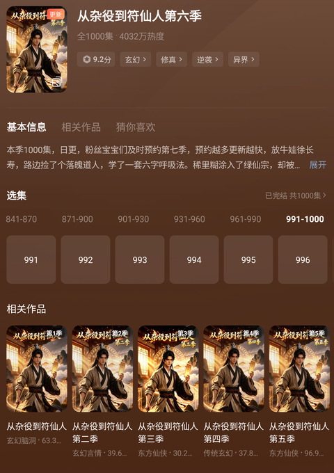

[toc]

# 问题

提问者：**<a href="https://www.zhihu.com/people/bo-ben-er-ba-26">liisu</a>**
提问时间: 2026-9-10 15:47:5
总回答数: 795
总访问量: 2776781

当下的竞争格局被形容为“五虎分食”——短视频、微短剧、直播、游戏、演唱会，正在共同分流传统影视的观众和市场。AI生成

  

如今，微短剧已成为国民常态化娱乐方式。《中国微短剧精品创作与传播研究报告（2026）》数据显示，国内微短剧用户规模达7.18亿，网民渗透率高达70%。通勤刷短剧、闲暇追更新，成为众多网民的生活日常。伴随着微短剧的迅猛崛起，国内视频赛道迎来深刻变革，长短视频行业呈现显著的K型分化（指经济数据图表中不同产业向上与向下的差距不断拉大，形成K字型分布），传统影视行业也步入深度转型的关键节点。

  

一份来自野村证券最新发布的中国互联网月度追踪报告引起业内广泛关注——字节跳动旗下红果短剧日活跃用户达1.68亿，同比增幅达107%，该数值已超越爱奇艺、腾讯视频、优酷、芒果TV四大长视频平台的日活总和。与之形成鲜明对比的是，“爱优腾芒”长视频平台日活均出现两位数下滑，用户月度使用时长降幅介于24%至47%之间。数据反差让“短剧取代长剧”的声音不绝于耳，但在业内学者看来，问题远比“谁取代谁”复杂，而是媒介迭代、注意力重构引发的行业深度调整。

[红果短剧日活1.68亿超越“爱优腾芒”总和，学者认为视听产业加剧分化，但无需悲观-新华网](https://www.xinhuanet.com/ent/20260910/16280668cc4e40b6ae839fe82691f0a6/c.html)

# 回答

回答者： **<a href="https://www.zhihu.com/people/jing-di-de-chang-jing-lu">井底的长颈鹿</a>**
回答时间: 2026-9-11 9:25:33
点赞总数: 487
评论总数: 165
收藏总数: 771
喜欢总数：20

我最近几个月狂热追的短剧，各式各样的都有，日均使用2.5小时以上，99%都是三季以上，毕竟以AI的生产力，再好看的短剧出不到三季以上，要么剧情有问题，要么设定有问题，要么技术有问题，如下：

万妖图录传：12季，大女主、系统、战斗

聚宝仙盆：11季，系统、修仙、宝物流、战斗

凡人仙葫之问道：11季，修仙、种田、宝物流

百岁成真仙：8季，修仙、战斗、宝物流

三千庇护：29季，2D、策略、末世、生存建造

种地师妹（已完结）：8季，搞笑、日常、一拳超人

护镖人：6季，武侠、系统、战斗

凡人百事书：6季，系统、修仙、战斗、挫败

团宠小师妹：5季，修仙、日常、仙侠

太玄胎珠传：9季，修仙、一拳超人、养成

烛九阴：5季，苦涩、战斗、养成

对不起地府有人：5季，大女主、重生

急诊科：4季，系统、都市医疗、专业

苏忆穿书（已完结）：7季，大女主、种田

全能相师：2季，都市玄学，日常

ENEMY：10集，悬疑，异能

道印入体：8季，都市玄学，战斗，种田

普通弓箭手：5季，全球博弈、养成、战斗

国运求生：6季、全球博弈、策略、竞技、种田

收租老汉：4季，都市、系统、日常

锦衣暴徒：2季，古风、系统、权谋

逆江湖：3季，武侠、热血

标签造神：2季，系统、异能、都市

山海藏墟：4季，国风、战斗、养成

师尊明明无敌：3季，修仙、一拳超人

全员恶仙：5季，修仙、对抗

不得不说，我这几个月吃的太好了。

  

根据评论区速速通宵看了几部也不错：

持械入宋：4季，穿越、大宋、械斗、权谋

魏家逆子成首辅：8季，权谋、博弈、养成

我嬴政面临面壁穿越者：3季，大秦、穿越、博弈、权谋

归墟：12集，末世

根据评论区，看了推荐后会持续更新~

  

原文地址：[(井底的长颈鹿)如何看待红果短剧日活1.68亿已超「爱优腾芒」四家总和？为啥大众会在影视娱乐上出现这...](https://www.zhihu.com/question/2081408366807442163/answer/2081674741203604719) 

# 评论

1. <a href="https://www.zhihu.com/people/xiang-nian-69-49">想念</a> (<small title="江苏">2026-9-11 10:23:30</small>): 再看看现在的凡人修仙传，特么的真是不争气啊，还没有漫剧好看［笑哭］
   - <a href="https://www.zhihu.com/people/zhao-hua-dong-52">互联网乐子人</a> (<small title="上海">2026-9-11 10:49:58</small>): 你这里边说的好几个我都看过。
   - <a href="https://www.zhihu.com/people/ye-030shen">知乎用户DUZpQ</a> (<small title="广东">2026-9-11 11:40:5</small>): 王玉玉心目中的女频封神传［doge］
   - <a href="https://www.zhihu.com/people/ma-hao-ran-50-71">陈·风暴烈酒</a> (<small title="河南">2026-9-11 14:20:49</small>): 马上就要王大导演带着一帮傅首尔改成古偶了［笑哭］
   - **井底的长颈鹿** (<small title="陕西">2026-9-11 15:18:2</small>): 更新慢也就算了，还总是魔改，现在不如万妖图录传一根，几个月聚宝盆都干到仙界了，5年了凡人还在人间渡劫呢［尴尬］
   - <a href="https://www.zhihu.com/people/24-26-4-33">momo</a> (<small title="回复于 2026-9-11 15:56:46/河南"> ✉️:井底的长颈鹿</small>): 我真的很好奇，万妖真的能看？？你们到底什么审美啊？你们看完凡人前176集居然能看下万妖？我是真心发问的 因为我也在找代餐 找不到非常非常痛苦
   - <a href="https://www.zhihu.com/people/bu-jian-58-35">编号BJ02</a> (<small title="回复于 2026-9-11 16:4:20/福建"> ✉️:momo</small>): 我也是边骂边看,一边嫌弃,看一会儿弃掉,无聊又只能掏出来看,最终也是看完了
   - **井底的长颈鹿** (<small title="回复于 2026-9-11 16:6:27/陕西"> ✉️:momo</small>): 有啥不能看的，要剧情比凡人爽，要画质一季比一季精细，要打斗一季比一季精彩，情绪饱满，换算成凡人的集数，不到半年更新了160集+，从更新开始追凡人的时候，凡人画质也没好哪去
   - <a href="https://www.zhihu.com/people/qin-yu-jun-43">one night</a> (<small title="回复于 2026-9-11 16:54:34/浙江"> ✉️:井底的长颈鹿</small>): 是啊，凡人百世书和万妖图录这两个代餐比凡人爽多了［大笑］
   - <a href="https://www.zhihu.com/people/yuan-qi-yuan-mie-nai-he-qing-shen">林明远</a> (<small title="回复于 2026-9-11 18:2:47/广东"> ✉️:momo</small>): 有一部剧不错：一罐仙草到道祖，你可以看下，十几季绝对比现在的凡人好看
   - <a href="https://www.zhihu.com/people/ding-chun-yu-71">丁丁</a> (<small title="回复于 2026-9-11 20:1:6/江苏"> ✉️:momo</small>): 就凡人那僵硬的建模比不上现在AI短剧的一根毛
   - <a href="https://www.zhihu.com/people/wang-qian-95-86">千儿</a> (<small title="回复于 2026-9-12 10:41:18/云南"> ✉️:momo</small>): 没事，万妖原著小说本身就打不过凡人，全靠漫改制作组带飞，而且前面几级季就是比AI漫改剧稍好一点都水平［捂脸］
 
大家也就是看个美少女战斗爽，第8季和第10季是迄今为止的打戏巅峰，你可以直接看第10季万妖蚀天的那场打戏，差不多就是国漫巅峰一级的水准了，后面的第11和12季都没办法超越。
   - <a href="https://www.zhihu.com/people/ai-zi-wei-zhen-shi-tai-hao-liao">再见</a> (<small title="回复于 2026-9-12 17:30:27/广东"> ✉️:千儿</small>): 万妖的制作团队比较厉害，特效，分镜，打击感做得基本是同类顶尖，文戏谈不上顶尖，但是也是不错的水平
   - <a href="https://www.zhihu.com/people/ci-qu-jing-nian-69">此去经年</a> (<small title="广东">2026-9-13 8:34:24</small>): 说到改编就好笑，凡人原著之所以受欢迎 就是书中的剧情人物设定，动漫只需要把内容具象化 ，改编只需把一些原著里的遗憾满足观众的期待就好了。底层逻辑都改了 不就是挂羊头卖狗肉嘛［捂脸］
2. <a href="https://www.zhihu.com/people/xiao-diao-12-92">全无敌</a> (<small title="陕西">2026-9-11 9:46:53</small>): 我80后，算是极度顽固的老古董了，前几天也下了红果了，一边玩游戏，一遍连播断句，真是顶级享受
   - <a href="https://www.zhihu.com/people/15268154184ai">思秦月</a> (<small title="上海">2026-9-11 18:51:1</small>): 短剧很大一部分群体是60后和70后，不敢信吧［飙泪笑］
   - <a href="https://www.zhihu.com/people/leemu-yang">sheepherder</a> (<small title="天津">2026-9-11 21:0:30</small>): ［飙泪笑］我也被小辈们定义为“老顽固”了，不愿意接受新事物，不理解他们小辈的爱好。
   - <a href="https://www.zhihu.com/people/94-34-9-16-98">大西瓜瓜</a> (<small title="广东">2026-9-12 10:22:29</small>): 俺也一样［飙泪笑］
   - <a href="https://www.zhihu.com/people/91-54-73-84">这就是知乎</a> (<small title="上海">2026-9-12 14:37:48</small>): 嗯，我觉得红果短剧还挺好看的
   - <a href="https://www.zhihu.com/people/zhang-zhen-hao-56">xixixixixixxxxxi</a> (<small title="浙江">2026-9-12 18:17:33</small>): 玩回合制游戏开个短剧看很舒服［doge］
   - <a href="https://www.zhihu.com/people/shi-yu-48-45-51">猫猫窝</a> (<small title="四川">2026-9-13 2:17:53</small>): ［飙泪笑］我爹妈60后，可喜欢短剧了
   - <a href="https://www.zhihu.com/people/song-xian-le">Nicexyzabc</a> (<small title="广东">2026-9-13 4:57:32</small>): 很多老人在抖音上看短剧 小剧场的
   - <a href="https://www.zhihu.com/people/zeng-qing-tang">堂堂正正</a> (<small title="回复于 2026-9-13 8:26:18/福建"> ✉️:xixixixixixxxxxi</small>): ［捂脸］很多年前，我就是一边玩文明，跳回合的时候一边看番
3. <a href="https://www.zhihu.com/people/wang-jin-peng-92">功成不必在我</a> (<small title="内蒙古">2026-9-11 10:28:29</small>): 谁让这个文盲修仙的，看了三季，感觉打斗比一些年番强
   - <a href="https://www.zhihu.com/people/mao-jin-dao-77">卯金刀</a> (<small title="浙江">2026-9-11 11:22:38</small>): 打斗可以，但是剧情强行降智。。。
   - <a href="https://www.zhihu.com/people/ping-min-ku-de-yi-zhu-jia-67">OoooV</a> (<small title="云南">2026-9-11 19:59:49</small>): 推荐去看看 万妖图录传
   - <a href="https://www.zhihu.com/people/yu-gong-83-5">禁言</a> (<small title="回复于 2026-9-14 11:28:12/四川"> ✉️:卯金刀</small>): 剧情都是直接用的番茄小说现成的，这些热门，比如聚宝仙盆，其实是番茄小说一本8.5分的小说［捂脸］，还没更新完的。我还没看到番茄9.5分小说的短剧，估计是版权贵，短剧制作者不想花钱买版权
   - <a href="https://www.zhihu.com/people/ge-yizhen">一欧</a> (<small title="山西">2026-9-14 11:46:57</small>): 这个真的好看
4. <a href="https://www.zhihu.com/people/locking-97-96">momo</a> (<small title="广东">2026-9-11 10:20:22</small>): 推荐一个持械入宋。
   - <a href="https://www.zhihu.com/people/xiao-hei-pi-7-58">小黑皮</a> (<small title="上海">2026-9-11 10:59:28</small>): 真好看，熬夜追完了4季，第4季林昭建模不如前面
   - <a href="https://www.zhihu.com/people/mao-jin-dao-77">卯金刀</a> (<small title="回复于 2026-9-11 11:23:39/浙江"> ✉️:小黑皮</small>): 有2个版本。。。而且2个版本画风衣着相差不大，所以你可能看混了
   - <a href="https://www.zhihu.com/people/quison">Quison</a> (<small title="广东">2026-9-11 12:7:53</small>): 看了几集，制作不太精良，各种穿帮错误
   - <a href="https://www.zhihu.com/people/mu-yi-76-53">木易</a> (<small title="回复于 2026-9-11 14:28:2/贵州"> ✉️:Quison</small>): 五人封面那个版本才好。
   - <a href="https://www.zhihu.com/people/ren-zha-zhi-guang">三把刷子</a> (<small title="广东">2026-9-11 14:33:58</small>): 这个是真的好看，群像无系统无异能，但看着比那些系统剧爽多了，让我感觉短剧的好作品确实正在发芽
   - <a href="https://www.zhihu.com/people/60-98-20-15-44">60号</a> (<small title="湖北">2026-9-11 17:2:25</small>): 这个真可以 第一季AI技术力差一些，现在更新的好多了。 另外推荐李景隆的别样人生 集数爽看
   - <a href="https://www.zhihu.com/people/vmlxt5">opsoom</a> (<small title="湖北">2026-9-11 17:17:44</small>): 这个爽完了
   - <a href="https://www.zhihu.com/people/jiang-ji-zhong-28">jizhong</a> (<small title="广西">2026-9-11 17:46:59</small>): 前几天看到这小说在番茄上下架了。
5. <a href="https://www.zhihu.com/people/ye-030shen">知乎用户DUZpQ</a> (<small title="广东">2026-9-11 11:38:36</small>): 大明，李景隆的别样人生，别逼我修炼，反向之地，归墟，全员恶仙
   - <a href="https://www.zhihu.com/people/60-98-20-15-44">60号</a> (<small title="湖北">2026-9-11 17:3:42</small>): 完蛋 现在已经很难看到我没看过的了 你和答主推的这几个我都看了［大哭］
   - <a href="https://www.zhihu.com/people/han-dou-91-40">土豆炖番茄</a> (<small title="湖北">2026-9-11 12:47:46</small>): 你这推荐完全符合我的胃口，有品味
6. <a href="https://www.zhihu.com/people/jiu-a-ge-50">九阿哥</a> (<small title="江西">2026-9-11 11:32:42</small>): 最近在追魏家逆子成首辅，只有权谋，没有感情戏原来也这么好看！
   - <a href="https://www.zhihu.com/people/yi-nian-hua-kai-33-47">一念花开</a> (<small title="江西">2026-9-11 17:30:57</small>): 超级好看，穿越进去真活不过半集，个个800心眼子
   - <a href="https://www.zhihu.com/people/luo-hua-leng-yan-kan">落花冷眼看</a> (<small title="湖南">2026-9-11 18:47:25</small>): 这个真的好看，楼主说的我几部我也在看
   - <a href="https://www.zhihu.com/people/qing-qing-22-47-73">猫贵人</a> (<small title="北京">2026-9-12 6:59:24</small>): 这个真好看，而且脱离了全爽情节。
   - **井底的长颈鹿** (<small title="陕西">2026-9-12 11:19:0</small>): 非常好看！
   - <a href="https://www.zhihu.com/people/mu-ti-82">木蹄</a> (<small title="浙江">2026-9-14 8:36:39</small>): 还有个李景隆也不错，不是单纯的爽剧
7. <a href="https://www.zhihu.com/people/yu-hui-71-23">许昌曹阿瞒</a> (<small title="上海">2026-9-11 10:18:3</small>): 我最近沉迷 穿越成南方古猿，生存百万年，太好看了
   - <a href="https://www.zhihu.com/people/locking-97-96">momo</a> (<small title="广东">2026-9-11 10:20:1</small>): 这个我真的只能说赛道清奇 ［大笑］
   - <a href="https://www.zhihu.com/people/chentianhao">铁骑</a> (<small title="回复于 2026-9-11 10:22:3/浙江"> ✉️:momo</small>): 这部剧编剧是真的牛逼，插梗非常丝滑，要么水平很高，要么很用心
   - <a href="https://www.zhihu.com/people/wang-yong-deng-57">牛奶糖</a> (<small title="河南">2026-9-11 10:49:59</small>): 你说的是那个天津口音的吧？太搞笑了
   - <a href="https://www.zhihu.com/people/yiisan">易散</a> (<small title="广东">2026-9-12 10:44:59</small>): 烦死了 还不更新
   - <a href="https://www.zhihu.com/people/57-97-18-98-28">知乎用户</a> (<small title="海南">2026-9-14 8:45:20</small>): 不知道咱们看的是不是一个版本，我看的是只有两季的，嘴太贫了，看不下去了
8. <a href="https://www.zhihu.com/people/dulingjiang">杜先生</a> (<small title="江苏">2026-9-11 13:2:50</small>): 山楂啊梨［机智］
9. <a href="https://www.zhihu.com/people/hui-dou-42">投机小学生</a> (<small title="山东">2026-9-11 12:2:29</small>): 天天电子榨菜能不巴适么［doge］
10. <a href="https://www.zhihu.com/people/felixXie">Sheply</a> (<small title="辽宁">2026-9-11 11:47:16</small>): 别逼我修炼 这个也挺好的。
    - <a href="https://www.zhihu.com/people/ma-jia-5-28-2">血色</a> (<small title="北京">2026-9-11 15:30:48</small>): +10086  
 
这玩意热度好像不高
11. <a href="https://www.zhihu.com/people/cecil-57-15">噫吁嚱</a> (<small title="广西">2026-9-12 15:41:1</small>): 赦夜人，日薪一万：我在博物馆值夜班。这两不比归墟的剧情差。持械入宋我第一季没看完，主要是涉及到我的专业知识，太出戏了。对了，马姐（精神小妹也要修机甲吗）没看过的话可以尝试一下，虽然小说长期停更，但是整体制作水平还可以，算是机甲类第一了。
12. <a href="https://www.zhihu.com/people/xi-mo-sha-shou-bo-luo-te-79">7897</a> (<small title="山东">2026-9-11 15:11:9</small>): 我得看了上百部了，你发的这些我竟然大半部分都没看过，红果短剧的体量也太大了吧［飙泪笑］
    - <a href="https://www.zhihu.com/people/8-58-93-89">白思域</a> (<small title="山东">2026-9-14 9:29:1</small>): 几万部
13. <a href="https://www.zhihu.com/people/li-xu-54-64-54">小轩窗</a> (<small title="上海">2026-9-11 10:33:13</small>): 烬九州，魏家逆子成，，还有什么小卖部通三界的赛道
    - <a href="https://www.zhihu.com/people/liang-xiao-tian">嘎嘣</a> (<small title="上海">2026-9-11 10:43:1</small>): 魏家逆子的确不错 很精良
    - <a href="https://www.zhihu.com/people/wang-yong-deng-57">牛奶糖</a> (<small title="河南">2026-9-11 10:48:45</small>): 烬九州太怂了
    - <a href="https://www.zhihu.com/people/li-xu-54-64-54">小轩窗</a> (<small title="回复于 2026-9-11 13:29:41/上海"> ✉️:牛奶糖</small>): 最新这季还行，这是要饮马翰海
    - <a href="https://www.zhihu.com/people/peng-dong-62-37">一二咯咯</a> (<small title="回复于 2026-9-11 14:32:34/广东"> ✉️:嘎嘣</small>): 除了魏逆生，李景隆也很不错，道化服剧情无短板，明朝初期，爽点在线。
14. <a href="https://www.zhihu.com/people/gang-hui-bian">夏虫语冰</a> (<small title="重庆">2026-9-11 15:47:9</small>): 反相之地，归墟，畸变，执念师，山海，我说实话，高质量的红果还是差点。
15. <a href="https://www.zhihu.com/people/huai-dan-85-76">孬蛋</a> (<small title="河南">2026-9-11 10:11:45</small>): 让你代写情书，你惊哭大儒
16. <a href="https://www.zhihu.com/people/mu-yi-76-53">木易</a> (<small title="贵州">2026-9-11 14:27:18</small>): 归墟和持械入宋，强推。
17. <a href="https://www.zhihu.com/people/eric-37-48-96">ERIC</a> (<small title="四川">2026-9-14 9:36:2</small>): 从杂役到符仙人,6季 ,一季1000集, 量大管饱, 质量可以排在聚宝盆后面
 

    - <a href="https://www.zhihu.com/people/li-xu-54-64-54">小轩窗</a> (<small title="上海">2026-9-14 10:7:15</small>): 量这么大吗？聚宝盆前面看的很爽，后面几季就看不下去了，更慢了
    - <a href="https://www.zhihu.com/people/kai-kou-zhao">墨知白</a> (<small title="河南">2026-9-14 10:59:11</small>): 这个真可以，主角一心搞修仙，没有那么多情情爱爱
18. <a href="https://www.zhihu.com/people/wang-yong-deng-57">牛奶糖</a> (<small title="河南">2026-9-11 10:48:27</small>): 万妖图录传这个是真好看。
    - <a href="https://www.zhihu.com/people/li-xu-54-64-54">小轩窗</a> (<small title="上海">2026-9-11 13:30:47</small>): 刚好剧荒，今晚开始刷
    - <a href="https://www.zhihu.com/people/qing-feng-xu-lai-skr">樱桃老王子</a> (<small title="陕西">2026-9-11 17:5:2</small>): 特效也好，不知道作者需要写多少字才能给ai描述那个画面
    - <a href="https://www.zhihu.com/people/wang-yong-deng-57">牛奶糖</a> (<small title="回复于 2026-9-11 20:44:47/河南"> ✉️:樱桃老王子</small>): 对，别的剧特效拉胯。
    - <a href="https://www.zhihu.com/people/wang-yong-deng-57">牛奶糖</a> (<small title="回复于 2026-9-11 20:45:28/河南"> ✉️:小轩窗</small>): 绝对是质量非常好的ai剧了
    - <a href="https://www.zhihu.com/people/hellovenus">Hellovenus</a> (<small title="广东">2026-9-13 7:1:28</small>): 红果顶流
19. <a href="https://www.zhihu.com/people/xie-gao-wei">小谢要进步</a> (<small title="江苏">2026-9-14 11:36:44</small>): 整了个破解版，连个广告都没有，观看体验非常纯净
20. <a href="https://www.zhihu.com/people/potato-874">T249</a> (<small title="新加坡">2026-9-14 13:4:3</small>): 三千庇护：29季  
 
  
 
季还是集，这快速迭代都比敏捷开发还勤快了［捂脸］
    - **井底的长颈鹿** (<small title="陕西">2026-9-14 13:36:59</small>): 季，前27季在红果，后面的在其他平台播了
21. <a href="https://www.zhihu.com/people/yu-gong-83-5">禁言</a> (<small title="四川">2026-9-14 11:28:46</small>): 推荐《老人修仙记》，特搞笑［捂脸］
22. <a href="https://www.zhihu.com/people/wang-zhong-bin">天二天二</a> (<small title="广东">2026-9-14 10:58:13</small>): 艹，看过50%，收藏了。
23. <a href="https://www.zhihu.com/people/swift100">知乎用户</a> (<small title="北京">2026-9-14 9:22:15</small>): 零号档案
24. <a href="https://www.zhihu.com/people/da-qing-wa-30-54">大青蛙</a> (<small title="浙江">2026-9-14 10:2:41</small>): 加个李景隆。真人建模，良心得很。［捂脸］
25. <a href="https://www.zhihu.com/people/xia-xin-yin">夏心音</a> (<small title="北京">2026-9-13 16:40:57</small>): 精神小妹也要修机甲吗；满院亲戚都是上古大妖；穿成南方古猿生存百万年；全球躲猫猫到底谁才是诡异啊；这几个都跟答主列出来的题材不重复，质量都超好
26. <a href="https://www.zhihu.com/people/pancake-wang">Pancake</a> (<small title="广东">2026-9-13 18:1:12</small>): 系统和重生太多了
27. <a href="https://www.zhihu.com/people/lian-zi-min">萌量不足</a> (<small title="广东">2026-9-14 14:10:5</small>): 原始之巫，谁说纨绔不能当状元，百岁悟道仙途
28. <a href="https://www.zhihu.com/people/ai-lei-liao-ku-xia-liao">爱累了哭瞎了</a> (<small title="广西">2026-9-13 20:12:11</small>): 冒姓琅琊，原著是一位历史学博士写的。男主穿越南齐，
    - <a href="https://www.zhihu.com/people/flybu-wei-distance">飞非菲</a> (<small title="江苏">2026-9-14 2:43:27</small>): 有个版本的男主角长得特别像胡歌［捂脸］
29. <a href="https://www.zhihu.com/people/zhan-guo-88">战国</a> (<small title="广东">2026-9-14 11:18:39</small>): 就服你，我刷这个只是为了金币啊
30. <a href="https://www.zhihu.com/people/ben-pao-xiao-qing-nian">孔乙己爱吃茴香豆</a> (<small title="四川">2026-9-13 18:4:36</small>): 持械入宋超级好看！！
31. <a href="https://www.zhihu.com/people/ai-wei-60-84">艾薇</a> (<small title="广东">2026-9-13 12:43:2</small>): 还有从杂役到符仙人，主角徐长寿，剧情来说这个最好看，还有御狐
32. <a href="https://www.zhihu.com/people/hong-meng-jin-bang-14">鸿蒙金榜</a> (<small title="湖南">2026-9-13 21:4:50</small>): 归墟不错 可惜只有一季
33. <a href="https://www.zhihu.com/people/sea-nicky">Sea Nicky</a> (<small title="福建">2026-9-13 10:52:57</small>): 凡人百世书，也非常不错［感谢］
34. <a href="https://www.zhihu.com/people/yu-zhong-lei-49">雨中泪</a> (<small title="广东">2026-9-14 7:33:30</small>): 持械入宋昨晚通宵看完［doge］［doge］［doge］
    - **井底的长颈鹿** (<small title="陕西">2026-9-14 10:4:46</small>): 巨好看，可惜一季100集定死的，不过周三就再更新100集了
35. <a href="https://www.zhihu.com/people/gou-shi-huan-xiang">狗屎幻想</a> (<small title="江苏">2026-9-13 22:40:10</small>): 全员恶仙应该是六季了吧，它的主题曲还是很魔性的，最近在追每年一点属性，感觉挺不错
36. <a href="https://www.zhihu.com/people/wu-chao-90-96-83">大爷给妞笑个</a> (<small title="湖北">2026-9-13 19:19:26</small>): 推荐：  
 
被主播被刺开除，我下午营业开早餐店（小剧场很多那版）  
 
国师定大明  
 
灶下煤  
 
末日游戏：庇护所是瞭望塔  
 
西游圣僧的自我修养  
 
星耀关公：我替关二爷封神（这个强推，质量挺高）  
 
诸君且同行，剑育文策  
 
  
 
短剧百花齐放，题材众多，太有意思了
37. <a href="https://www.zhihu.com/people/zhou-boll">城北徐公</a> (<small title="广西">2026-9-13 19:13:32</small>): 日薪一万，我在博物馆当保安。3季已完结，感觉也还可以
38. <a href="https://www.zhihu.com/people/wang-ke-14-49">控油二哥</a> (<small title="江苏">2026-9-13 8:33:10</small>): 强推《异界降临》，地球停转人类毁灭，主角穿越到魔法世界开启时空通道，联合神圣人族、精灵、矮人、半兽人打败魔族入侵。  
 
为了7亿中国人生存（14亿人口由于灾变已经死了一半），25000解放军通过临时传送门前往异界，进行一场没有退路的远征，真TMD牛13。  
 
第三季完结时，中国已经和人族、精灵、矮人、半兽人签订协议，在异界拥有1000平方公里土地，开启永久传送门，在异界为中国开疆拓土，延续华夏文明。
    - <a href="https://www.zhihu.com/people/stonejun-60">精神病院张主任</a> (<small title="浙江">2026-9-14 4:0:39</small>): 这个牛
39. <a href="https://www.zhihu.com/people/li-heng-97-24">0000</a> (<small title="河北">2026-9-13 18:36:44</small>): 太长了 爱看几集十几集就能演完的
40. <a href="https://www.zhihu.com/people/--82-90-88-5">记忆的回光</a> (<small title="山东">2026-9-13 0:38:26</small>): 万妖少了个性转吧
    - **井底的长颈鹿** (<small title="陕西">2026-9-13 20:40:21</small>): 说是性转，漫改后这其实并不是什么重要的标签
41. <a href="https://www.zhihu.com/people/pai-huai-yu-dou-niu-zhi-jian">徘徊于斗牛之间</a> (<small title="湖南">2026-9-13 20:4:57</small>): 第一个提出奶头乐的人都想不到会到当今的程度
42. <a href="https://www.zhihu.com/people/kan-jin-ren-sheng-bai-tai">看尽人生百态</a> (<small title="河北">2026-9-13 15:28:45</small>): 短剧确实好看
43. <a href="https://www.zhihu.com/people/61-73-49-15-66">五脊六兽</a> (<small title="山东">2026-9-13 10:31:48</small>): 这实际上是一个双刃剑，一面来说，大家都有了自己喜欢的舒适平替，近乎无限获得自己喜欢的内容。另一方面，凡人修仙传当然不能按着头让观众喜欢，但是它是公共产品，是中心化的，在此之前，所有人不得不观看，因为没有别的同等质量的，现在去中心化了，这其实会导致一些问题
44. <a href="https://www.zhihu.com/people/san-huan-lan-qiu">博海寻贝</a> (<small title="山东">2026-9-13 8:53:10</small>): 唠嗑修仙之浮仙长老韩凡也不错［捂嘴］
    - <a href="https://www.zhihu.com/people/kai-kou-zhao">墨知白</a> (<small title="河南">2026-9-14 11:0:46</small>): 小说原著就是唠嗑修仙［捂脸］
45. <a href="https://www.zhihu.com/people/gu-du-huan-zhe-27-1-24">无人知晓</a> (<small title="云南">2026-9-13 8:44:33</small>): 还有个无灵根证道的，三十多季了都
46. <a href="https://www.zhihu.com/people/90-78-73-69-67">牛啊</a> (<small title="广东">2026-9-12 22:32:38</small>): 万妖、持械、魏家逆子都是顶级好剧！
47. <a href="https://www.zhihu.com/people/lan-duo-de-xun-ge">懒惰的迅哥</a> (<small title="湖北">2026-9-12 14:47:16</small>): 收藏了
48. <a href="https://www.zhihu.com/people/shao-hua-36-31">晚风</a> (<small title="广东">2026-9-12 21:23:59</small>): 还是更新太慢了，随便来个一百季，一季300级，那才是量大管饱
49. <a href="https://www.zhihu.com/people/ai-zi-wei-zhen-shi-tai-hao-liao">再见</a> (<small title="广东">2026-9-12 17:33:27</small>): 一剑挽仙洲也好看，群像搞笑修仙，而且已经完结了，六季加起来一千多集，爽看［酷］
50. <a href="https://www.zhihu.com/people/jie-ke-shang-xiao">刘醒</a> (<small title="福建">2026-9-12 21:20:34</small>): 师妹下山也还行
51. <a href="https://www.zhihu.com/people/mu-tian-yun">慕天云</a> (<small title="陕西">2026-9-13 1:5:19</small>): 我姑姑60多了，现在做饭的时候必开着红果［飙泪笑］
52. <a href="https://www.zhihu.com/people/pan-da-yu">潘大煜</a> (<small title="浙江">2026-9-13 0:37:59</small>): 谢谢已收藏
53. <a href="https://www.zhihu.com/people/a-bai-9-82-97">明天又是新的一天</a> (<small title="河北">2026-9-12 20:53:2</small>): 万妖屠戮传
54. <a href="https://www.zhihu.com/people/liu-lang-gou-73-76">闲来无事但取闹</a> (<small title="广东">2026-9-12 14:51:1</small>): 全球死考、满院亲戚全是上古大妖、谁把我仙侠游戏退出键抠了、命格求仙，这几部也不错可以看看
55. <a href="https://www.zhihu.com/people/xxx-96-14-96">Xxx</a> (<small title="江苏">2026-9-11 21:33:8</small>): 祖龙计划这种就比较喜欢，开荒流
56. <a href="https://www.zhihu.com/people/chen-sheng-66-35">古皖居士</a> (<small title="江苏">2026-9-11 21:17:10</small>): Mark一下！
57. <a href="https://www.zhihu.com/people/jue-ming-zi-11-59">决明子</a> (<small title="浙江">2026-9-12 19:6:30</small>): 国师定大明，真心推荐
58. <a href="https://www.zhihu.com/people/a-bai-10-47-48">二妞</a> (<small title="广东">2026-9-11 21:15:30</small>): 我靠，同类啊［握手］
59. <a href="https://www.zhihu.com/people/wo-zhao">西门</a> (<small title="四川">2026-9-12 13:35:51</small>): 有规则类推荐吗，最近看了好多
    - **井底的长颈鹿** (<small title="陕西">2026-9-12 13:37:47</small>): 啥是规则类［捂脸］
60. <a href="https://www.zhihu.com/people/zhibskdd">PigeonFake</a> (<small title="河北">2026-9-11 22:0:52</small>): 收藏一下 慢慢看
61. <a href="https://www.zhihu.com/people/lian-fei-44-40">连飞</a> (<small title="江苏">2026-9-11 20:41:20</small>): 聚宝仙盆有第三季了？
    - <a href="https://www.zhihu.com/people/oliverwu-wu">潇洒的绣春刀</a> (<small title="回复于 2026-9-13 1:14:51/广东"> ✉️:樱桃小丸犊子</small>): 不是11季了吗
    - <a href="https://www.zhihu.com/people/sun-1-75">樱桃小丸犊子</a> (<small title="广东">2026-9-12 10:31:8</small>): 都出第七季了
62. <a href="https://www.zhihu.com/people/da-da-da-ju-zi-jun">大大大橘子菌</a> (<small title="浙江">2026-9-11 16:41:57</small>): 谢谢分享，HHHH
63. <a href="https://www.zhihu.com/people/liu-qing-32-69-6">一歌麻麻</a> (<small title="山西">2026-9-11 22:10:11</small>): 强烈安利持械入宋［看看你］
    - **井底的长颈鹿** (<small title="陕西">2026-9-12 11:17:37</small>): 很不错！
64. <a href="https://www.zhihu.com/people/60-98-20-15-44">60号</a> (<small title="湖北">2026-9-11 17:6:32</small>): 看你品味应该会喜欢算死仙，毕竟都有八哥［doge］
65. <a href="https://www.zhihu.com/people/ling-xiao-zi-93-49">喵喵喵</a> (<small title="江苏">2026-9-11 16:58:14</small>): 像我七尺男儿你们非说我是绝世美人，一季就完结，剧情也很搞笑
66. <a href="https://www.zhihu.com/people/ba-jie-ta-shi-di">樊一一</a> (<small title="广东">2026-9-11 21:47:36</small>): 推荐魏家逆子成首辅，有点点大明王朝的调调
    - **井底的长颈鹿** (<small title="陕西">2026-9-12 11:17:46</small>): 很不错！
67. <a href="https://www.zhihu.com/people/wang-xu-chu-3">王减肥</a> (<small title="安徽">2026-9-11 15:25:42</small>): 百岁修仙这个体裁太新颖了
68. <a href="https://www.zhihu.com/people/eerr-64">eerr</a> (<small title="上海">2026-9-11 13:0:25</small>): 在给你推荐一部，除了开头有一点点拖沓，还是很好看的
69. <a href="https://www.zhihu.com/people/tian-tian-tian-lan-82-24">天天天蓝</a> (<small title="北京">2026-9-11 10:45:18</small>): 万妖图录 最新一季不如前面了
    - <a href="https://www.zhihu.com/people/luo-hua-leng-yan-kan">落花冷眼看</a> (<small title="湖南">2026-9-11 18:49:14</small>): 这季在铺垫，小说就是这么写的，下季开始砍小天将了
70. <a href="https://www.zhihu.com/people/sovereign1996">sovereign</a> (<small title="河南">2026-9-11 10:46:34</small>): 我最喜欢诡异规则类，可惜很多就拍第一季，没有完整的，夜晚看诡异贼刺激
    - <a href="https://www.zhihu.com/people/sovereign1996">sovereign</a> (<small title="回复于 2026-9-14 11:17:10/河南"> ✉️:荣耀的背后是孤独</small>): 可惜了，就是很多更新的很慢
    - <a href="https://www.zhihu.com/people/rong-yao-de-bei-hou-shi-gu-du">荣耀的背后是孤独</a> (<small title="辽宁">2026-9-11 21:40:50</small>): 看，我的诡异表妹
71. <a href="https://www.zhihu.com/people/gua-pi-lao-shi-shi-liao-zhi">瓜皮老师失了智</a> (<small title="陕西">2026-9-11 19:22:44</small>): 好样的平生哥
72. <a href="https://www.zhihu.com/people/yi-nian-hua-kai-33-47">一念花开</a> (<small title="江西">2026-9-11 17:30:23</small>): 魏逆生 有没有
73. <a href="https://www.zhihu.com/people/xin-li-3-48">Boundy</a> (<small title="北京">2026-9-11 15:19:25</small>): 从这些漫剧更新的情况也能看出来ai视频发展的速度
74. <a href="https://www.zhihu.com/people/8-53-64-56">路见不平一声吼</a> (<small title="广东">2026-9-11 10:39:34</small>): 我已出仓，你们还在修仙。这个也挺有意思的，可惜断更了
75. <a href="https://www.zhihu.com/people/bao-mi-90-40">千舟</a> (<small title="陕西">2026-9-11 16:32:24</small>): 感谢分享目录，  
 
一些真的达到了神剧的标准，  
 
比方说，烛九阴
76. <a href="https://www.zhihu.com/people/wei-gui-38-87">merry111</a> (<small title="四川">2026-9-11 14:7:5</small>): 我在追万妖和盆子。这两个真的不错。［酷］
77. <a href="https://www.zhihu.com/people/ci-yong-hu-yi-bei-feng">此用户已被封</a> (<small title="浙江">2026-9-11 13:37:34</small>): 感谢分享
78. <a href="https://www.zhihu.com/people/pang-zi-40-54">天下狗王</a> (<small title="山东">2026-9-11 11:26:21</small>): 诸天梦道也好看
79. <a href="https://www.zhihu.com/people/71316-53">知乎用户71316</a> (<small title="四川">2026-9-11 10:41:56</small>): 有没有完结了的，别看了一季等二季
    - <a href="https://www.zhihu.com/people/wang-yong-deng-57">牛奶糖</a> (<small title="河南">2026-9-11 10:49:39</small>): 没有 ，
    - <a href="https://www.zhihu.com/people/71316-53">知乎用户71316</a> (<small title="回复于 2026-9-11 13:54:41/四川"> ✉️:牛奶糖</small>): 那种不想看，看一半就没了［大笑］
    - **井底的长颈鹿** (<small title="陕西">2026-9-11 16:7:47</small>): 有的兄弟，苏忆穿书录有完结的
80. <a href="https://www.zhihu.com/people/jin-fan-89-12">绅士之面具</a> (<small title="陕西">2026-9-11 9:53:44</small>): 还有木筏求生，万古沙丘［捂嘴］
81. <a href="https://www.zhihu.com/people/wo-mi-27-9">知乎用户螨虫</a> (<small title="浙江">2026-9-11 13:20:3</small>): 不让点赞收藏，好多剧都没后续了，全靠不停下滑
82. <a href="https://www.zhihu.com/people/qiugu">巨流河</a> (<small title="山东">2026-9-11 9:51:28</small>): 收藏了，下班就看
 
［调皮］
83. <a href="https://www.zhihu.com/people/fung-99-81">刷个知乎</a> (<small title="广东">2026-9-11 13:32:40</small>): 三千庇护追了20多季断更了［飙泪笑］
    - **井底的长颈鹿** (<small title="陕西">2026-9-11 15:7:1</small>): 版权原因在别的平台复播了，目前都29季了好像，主要是作者勤更
84. <a href="https://www.zhihu.com/people/zhen-zhen-82-12-20">直钩钓鱼</a> (<small title="广东">2026-9-11 10:54:3</small>): 三千庇护［酷］
85. <a href="https://www.zhihu.com/people/luo-hua-leng-yan-kan">落花冷眼看</a> (<small title="湖南">2026-9-11 18:46:46</small>): 魏家逆子也好看
86. <a href="https://www.zhihu.com/people/bai-bin-1-52">风之旅人</a> (<small title="陕西">2026-9-11 11:38:52</small>): 为啥我觉得短剧各种恶心，尤其是ai短剧
87. <a href="https://www.zhihu.com/people/shen-dou-dou-0511">神斗斗</a> (<small title="上海">2026-9-11 14:24:57</small>): 好家伙，你是只看AI和漫剧啊……我正好相反，我只看真人剧，AI的人脸和表情看久了有点恐怖……［捂脸］
    - **井底的长颈鹿** (<small title="陕西">2026-9-12 11:18:31</small>): 真人演的看不了，演技太差了
88. <a href="https://www.zhihu.com/people/lu-chao-60-23">Galxian</a> (<small title="上海">2026-9-11 12:2:48</small>): 推荐一手这个破盆是宝物，夜阑耀火和巴特雷。我红果看的早，可惜这三剧没赶上ai画面不太行。

=[评论](./attachments/comments.json)

