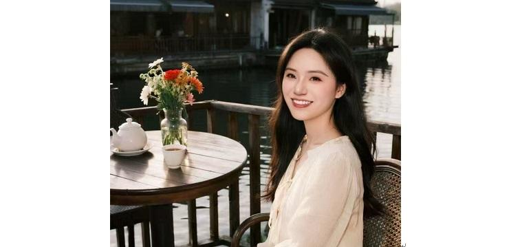

[toc]

# 问题

提问者：**<a href="https://www.zhihu.com/people/wang-xiao-ye-3">王小爷</a>**
提问时间: 2018-2-6 17:4:17
总回答数: 5025
总访问量: 39142493

看见一个问题叫 中国教育最大的失败在哪里？

[中国教育最大的失败在哪里？ - 知乎](https://www.zhihu.com/question/20007972)

# 回答

回答者： **<a href="https://www.zhihu.com/people/81-48-20-63-44">匪匪书屋</a>**
回答时间: 2026-5-20 7:50:15
点赞总数: 316
评论总数: 18
收藏总数: 899
喜欢总数：18

下午，接女儿放学，一上车我就感觉气压不对。

她没像往常一样跟我分享班里的八卦，而是缩在副驾驶，书包带子被她攥得发白。眼眶红红的，显然是刚哭过。

我没急着问，先带她去喝了一杯热可可。等那股暖流下肚，她才抽抽噎噎地说：“妈妈，她们不跟我玩了。林林带头，把我也从那个‘秘密基地’的群里踢出来了，她们说我不合群。”

换做一般的家长，这时候大概率会说：“是不是你哪做得不对？”或者“别理她们，咱们找新朋友。”

但我没这么说。

看着她委屈的小脸，我意识到，这是她人生中第一次面对“社交权力博弈”。如果这课上不好，她以后在职场、在婚姻、在社会里，都会沦为那个为了讨好别人而不断割肉的“受害者”。

我放下杯子，看着她的眼睛说：“闺女，恭喜你。你提前领到了人生的入场券。”

接下来的三个小时，我没跟她讲所谓的“礼貌”和“友善”，我给她拆解了社交的底层代码。

这也是我要送给所有女性，甚至所有成年人的社会真相。

一、社交的本质是“价值对冲”，不是“感情互换”

我问女儿：“你觉得她们为什么踢你？”

她说：“林林说我最近不听她的，上次玩游戏我没按她说的做。”

我笑了：“这不叫不合群，这叫你拒绝了她的‘能量收割’。”

你要明白，小孩子的小圈子，其实就是成人社会的微缩版。所谓的“闺女圈”、“姐妹团”，本质上是一个个小型的能量场。

一个圈子能维持，一定有一个“中心节点”。在这个班级小圈子里，林林就是那个中心。她通过制定规则、分配关注力来获取权力感。

而其他成员，本质上是在用“服从”换取“归属感”。

我对女儿说：“社交不是请客吃饭，不是大家坐在一起嘻嘻哈哈就是朋友。真正的社交，是价值的对冲。你身上有她想要的东西，她身上有你想要的东西，这叫链接。如果你身上没有她能压榨的‘服从性价值’，而你又不具备能让她仰望的‘硬核价值’，被踢出来是必然的。”

很多人一辈子活不明白，总觉得只要我足够好、足够善良，大家就会喜欢我。

这是屁话。

善良只是门票，价值才是筹码。你被踢出来，说明在这个特定的低维度博弈中，你的筹码不再满足对方的胃口。

这没什么好难过的，反而说明你开始长出自己的骨头了。

二、所谓的“合群”，本质上是“认知折叠”

我问女儿：“你跟着她们玩的时候，开心吗？”

她想了想，摇摇头：“其实挺累的。林林喜欢聊谁的文具贵，谁长得漂亮，如果不跟着夸，她就不高兴。”

这就是我要讲的第二个真相：合群，往往意味着你要主动折叠自己的认知。

在这个世界上，平庸是绝大多数人的底色。为了让大多数人感到舒服，那个圈子一定会把标准拉到一个极低、极平庸的水平。

如果你比她们聪明，你得装傻；如果你比她们有见地，你得闭嘴。

我告诉女儿，这就叫“认知熵增”。在一个封闭的小圈子里，大家互相消耗，互相洗脑，最后所有人的思想都会变得混乱而无序。

你被踢出来，是因为你的能量已经溢出了那个容器。那个容器装不下你了，它必然会把你排挤出去，以维持它内部那种脆弱的、低水平的平衡。

你要做的不是削足适履去钻回那个破鞋子，而是要去寻找更大的草原。

我常说，你要习惯这种孤独。因为在这个世界上，真理永远掌握在少数人手里，而卓越的灵魂，从来都是离群索居的。

三、警惕“情绪债”的陷阱

女儿问：“可她们现在在背后说我坏话，我很难受。”

我摸摸她的头：“这就是林林在给你发‘情绪债’。她想通过这种方式，让你产生罪恶感和羞耻感，从而反过来去求她，重新交出你的主导权。”

在人际关系中，最廉价也最有效的控制手段，就是制造“舆论孤岛”。

她们孤立你，辱骂你，本质上是在进行一种“精神围猎”。如果你当真了，你就背上了沉重的情绪债。你会开始自我怀疑，你会想：是不是我真的有问题？

一旦你开始反思自己，你就输了。

我告诉女儿，对待这种“情绪债”，最好的办法就是：不承接，不解释，不回应。

她们说你的坏话，那是她们的口业，是她们在消耗自己的福德。你如果因此生气，你就是在拿别人的错误惩罚自己。

你要学会一种能力——“能量绝缘”。

你要明白，那些在背后指点你的人，永远不可能走在你前面。因为走在你前面的人，连回头看你的时间都没有。

四、社交中的“T型人才”战略

那如果不合群，该怎么办？

我教了女儿一个方法：深耕一寸，广纳一尺。

这就是我思想体系里的“T型人才”模型。

“深耕一寸”，是让你在某个领域拥有绝对的、不可替代的硬核实力。在班级里，这可以是你的成绩，可以是你的特长，甚至可以是你看过的书、走过的路。

当你足够强大，强大到能解决别人解决不了的问题时，你不需要去合群，群会来合你。

“广纳一尺”，是让你保持一种开放的、慈悲的心态，去跟不同层次、不同背景的人进行点状的、弱连接的沟通。

你可以跟门口的保安爷爷聊天，可以跟卖早餐的大妈微笑，可以跟高年级的学长请教。

这种“弱连接”，反而能带给你更广阔的信息流和更高的认知维度。

我告诉女儿：“你不需要在那几个小女生的‘秘密基地’里找归属感，你的归属感应该来自你对世界的认知，来自你内心的笃定。”

当你能向下扎根，向上生长，你本身就是一个场域。

五、把“被孤立”当成你的“根本道场”

我对女儿说：“接下来的一个月，是你提升最快的时候。”

因为你不需要再去应付那些无谓的寒暄，不需要再去陪着她们玩那些弱智的游戏，你拥有了大把的、纯净的、完全属于自己的时间。

这在《人生格物学》里，叫作“能量回流”。

以前你的能量是发散的，是为了取悦外界而不断损耗的。现在，这些能量全部回到了你身上。

你要用这段时间去看书，去思考，去练习你的特长，去跟那些真正高维度的灵魂在文字里对话。

你要把这种“被孤立”的状态，当成你的修行道场。

在这个道场里，你要修的是你的“定力”。外界风吹草动，我自岿然不动。

等你一个月后再出现在她们面前，你会发现，你身上的气质变了。那种从骨子里散发出来的清醒和自洽，会形成一种强大的压场感。

那时候，林林她们会发现，她们的小手段在你面前显得那么滑稽和幼稚。

她们会再次试图拉拢你，但那时候，决定权就在你手里了。

你可以优雅地拒绝，也可以礼貌地保持距离，因为你已经不再是那个需要靠别人的点赞来确认自己存在的小女孩了。

六、父母的底色，是孩子的退路

女儿听完，眼里的泪光消失了，取而代之的是一种思考的神色。

我看着她，心里其实也很有感触。

作为母亲，我不能替她去打仗，我能给她的，只有这一套破局的思想系统。

很多家长在孩子受委屈时，只会提供廉价的情感安慰。那没用，那只会让孩子变得更软弱。

真正的慈悲，是给孩子装上一套强大的、足以应对复杂社会的“认知操作系统”。

这也是我为什么一直强调，女性一定要觉醒，家庭教育的本质是认知的传承。

如果你自己都活得卑躬屈膝、委曲求全，你拿什么去教你的孩子挺起脊梁？

我之所以能如此淡定地跟女儿谈这些，是因为我内心有一座绝对自洽的能量中枢。

我看过太多的商战博弈，见过太多的流量起伏，我深知这个世界的底层逻辑。

财富、名声、地位，这些都是外物，是随时可能被收回的“租借物”。

唯有你的认知，唯有你对规律的洞察，唯有你那颗磐石般的心，才是你真正拥有的资产。

我带女儿回家。路过花店，我买了一束白姜花送给她。

我说：“花开不是为了吸引蝴蝶，是为了它自己生命力的显现。蝴蝶来不来，花都香。”

那一刻，我知道，她懂了。

在这个喧嚣的时代，我们每个人都在社交的泥潭里挣扎过。

为了那点可怜的认同感，我们磨平了自己的棱角，出卖了自己的灵魂，最后变得面目全非。

其实，人生哪有什么“合群”不“合群”？

大家不过都是在不同的认知维度里，进行着能量的交换。

当你觉得孤独，觉得被世界排挤时，不要去哀求，不要去反思。

那是宇宙在提醒你：该升级系统了。

你要做的，是关上门，点上一炷香，泡上一壶好茶，开始这场内在的考古。

去拆解你那些陈旧的信念系统，去识别那些限制你的思维代码。

去建立你自己的“乾坤万象智慧系统”。

过去这些年，我把自己行走大地的见闻，把我看过的古今经典，把我对人性与商业的深度拆解，全部浓缩进了一部作品里。

这就是我的《人生格物学》电子书专栏。

这里没有文艺范的废话，只有最硬核的逻辑和最犀利的洞察。

它包含了格身、核心、格局、格业、格道5大模块，整整100个章节，70万字。

每一个章节，都是一个高阶的思维模型。

它能帮你识别社交中的“陷阱”，看穿商业里的“气口”，厘清两性间的“博弈”。

这不是一套简单的成功学，而是一套让你在这个不确定的世界里，获得终极自由的人生操作系统。

如果你也正处于人生的迷茫期，如果你也厌倦了低效率的社交，如果你也渴望活出那种清醒、丰盛、自洽的状态。

我邀请你，加入这场长达70万字的智慧长征。

订阅《人生格物学》，链接匪匪本人。

我们在评论区置顶入口等你。

记住，真正的强大，不是有多少人围着你转，而是即使全世界都背过身去，你依然能面带微笑，在那方属于你的道场里，优雅地瀹茶、观鱼、悟道。

那一刻，你就是你自己的王。

接下来的日子，女儿表现出了惊人的定力。

她不再关注那个群里的消息，甚至主动退出了好几个只有虚假寒暄的讨论组。

她开始在日记里记录自己的思考，开始大量阅读那些原本觉得枯燥的历史经典。

她告诉我，她发现了一个秘密：当她不再试图讨好别人的时候，她发现那些原本对她爱答不理的人，反而开始主动找她说话了。

我对她说：“这就是‘引力法则’。你不需要去追马，你只要种好你的草。等春暖花开，骏马自来。”

其实，这个道理对成年人同样适用。

很多人在职场里卷，在圈子里钻，搞得精疲力竭，最后还是一无所有。

为什么？

因为你把能量都花在了“术”上，却忽略了底层的“道”。

你以为多参加几次酒局，多发几张名片，就是人脉？

别天真了。

只有同维度的交换，才叫人脉。不同维度的乞求，那叫打赏。

你要做的是提升自己的“生态位”。

在《人生格物学》里，我专门讲了“生态位”的模型。

你要学会不再孤立地思考“我要做什么”，而是去思考“在这个复杂的系统中，哪个独特的、不可或缺的位置最适合我？”

当你找到了那个位置，你就找到了你的“护城河”。

那时候，你不需要去争，不需要去抢。你只需要在那里，持续地创造价值，世界自然会向你低头。

这种思维的转变，就是“降维打击”。

很多粉丝跟我反馈，读了《人生格物学》后，最大的感受是：以前觉得天大的难事，现在看来不过是逻辑题。

以前被情绪牵着鼻子走，现在能站在高空俯瞰情绪。

这种从“入戏”到“观戏”的转变，就是觉醒。

我一直在思考，如何才能让更多的人，尤其是那些在社会规训中迷失自我的女性，能够拿回人生的主导权。

文字，是我能想到的最纯净、最有能量的载体。

在这100章节的《人生格物学》里，我没有用任何华丽的修辞，我只用最通俗的语言，讲最深刻的逻辑。

因为我深信，真理本该简易。

只有那些没想通的人，才会把道理讲得云山雾罩。

我要给你的，是一把手术刀。

帮你剖开现象的迷雾，直抵因果的内核。

无论是关于“第一性原理”的颠覆式创新，还是关于“反脆弱”的系统构建。

每一课，都是在为你的人生系统“重装插件”。

当你读完这70万字，当你内化了这100个模型。

你会发现，你看世界的眼光变了。

那些曾经让你焦虑的、恐惧的、愤怒的事物，在这一套强大的思维网络面前，都会变得清晰而透明。

你会明白，人生这场戏，你才是那个唯一的导演。

林林们的排挤，领导的刁难，生活的不顺，都只是你这个大剧本里的一个个小配角、小插曲。

它们存在的唯一意义，就是为了磨炼你的心性，丰富你的体验，助你最终达成那场华丽的“觉醒”。

女儿昨天临睡前对我说：“我觉得我现在挺有力量的。”

我笑了。

这就对了。

力量，从来不是别人给的，而是从你内心深处的认知里长出来的。

这不仅是我给女儿的第一课。

这也是我希望能通过文字，给到每一位有缘人的力量。

在这场人生的格物之旅中，我们不求尽如人意，但求无愧我心。

我们要像那庭院里的锦鲤，顺着心性的流转，游出属于自己的姿态。

我们在《人生格物学》里见。

我们在彼岸见。

 **声明：** 我是匪匪，本篇文章来自公众号“ **_匪匪有话说_** ” -《匪匪日记》专栏

订阅《人生格物学》专栏，帮你从身在局中到俯瞰全局，拥有看透本质、定义问题的能力。

有偿阅读，若有收获，自愿点击文章结尾处 **_帮上热门 -送礼物_**  功能，结缘匪匪。

  

原文地址：[(匪匪书屋)中国教育最大的成功在哪里？](https://www.zhihu.com/question/266767649/answer/2040338537590039052) 

# 评论

1. **匪匪书屋** (<small title="北京">2026-5-20 7:52:43</small>): 欢迎点击下方蓝字订阅《人生格物学》构建你人生操作系统的100个思维模型 - 匪匪书屋的文章 - 知乎  
 
  
 
👇👇👇👇👇👇👇👇👇👇
 
[《人生格物学》构建你人生操作系统的100个思维模型](https://zhuanlan.zhihu.com/p/1981405959235581096)
2. <a href="https://www.zhihu.com/people/Agent99">99号特工</a> (<small title="山东">2026-5-21 7:40:4</small>): 一个让未成年孩子坐副驾的家长，写不出来特别好的育子文章
3. <a href="https://www.zhihu.com/people/qing-qian-yuan-qian-de-pang-xie">清浅缘浅的螃蟹</a> (<small title="四川">2026-5-20 21:9:6</small>): 你的这套大道理对于一个被隐性霸陵的孩子来说没有一点用。当时觉得你说的有道理，回到班级圈子一样不舒服。一个小孩哪有那么强大的心理！
4. <a href="https://www.zhihu.com/people/mu-mu-yan-yu-90">一池</a> (<small title="上海">2026-5-26 8:45:39</small>): 写的真好，大家不过都是在不同的认知维度里，进行着能量的交换。
5. <a href="https://www.zhihu.com/people/80-60-85-49">宁静致远</a> (<small title="广东">2026-5-21 8:19:27</small>): 有时候平庸也未尝是坏事，肮脏的世界里能独守自己那一份安宁很难得。很多娱乐明星光鲜亮丽，其实不过穷人的女神富人的精盆而已。大部分人羡慕别人聚光等下的华美，却鲜有人知幕后的泪水和心酸。都在用金钱定义成功，却鲜有人问自己的心，你快乐吗，这是你想要的生活吗？渴望波澜壮阔之后发现最重要的其实是眼前的风景，是内心的淡定和从容，成功是什么？是真正过上自己想要的生活。
6. <a href="https://www.zhihu.com/people/yun-qi-mo-ya-87">云起魔崖</a> (<small title="福建">2026-5-20 20:5:40</small>): 小小年纪能听懂这些属于天赋异禀了
7. <a href="https://www.zhihu.com/people/lucifer-64-87-87">Lucifer</a> (<small title="广东">2026-5-26 13:49:53</small>): 科学里面怎么感觉夹杂着鸡汤和教会的用词的感觉呢。  
 
  
 
  
 
  
 
希望把他全部科学化，大白话也可以，不要搞些奇怪的“新词”。这样才会火。  
 
  
 
  
 
  
 
不然，容易信的看不懂，能看懂的又反感。就这个书名就让人反感。改为：为人处世的技巧或者看懂人性，或者年轻人怎么更好的适应社会。
8. <a href="https://www.zhihu.com/people/niu-zhan-37">反顾</a> (<small title="天津">2026-5-21 13:39:55</small>): 转人工
9. <a href="https://www.zhihu.com/people/yang-yu">1-3层物业招租</a> (<small title="广东">2026-5-21 11:12:3</small>): 说人话
10. <a href="https://www.zhihu.com/people/crush-53-90">小坑动漫</a> (<small title="新疆">2026-5-26 16:33:1</small>): 这一套下来 娃娃能听懂啥啊 累不累［捂脸］
11. <a href="https://www.zhihu.com/people/ren-sheng-wu-chang-15-63">花开今朝</a> (<small title="河南">2026-5-20 22:40:48</small>): 善良只是门票，价值才是筹码。  
 
在背后指点你的人，永远不可能走在你前面。因为走在你前面的人，连回头看你的时间都没有。
12. <a href="https://www.zhihu.com/people/liuyedaooo">liuyedaooo</a> (<small title="河北">2026-5-20 19:41:3</small>): 不绝如缕
13. <a href="https://www.zhihu.com/people/er-wu-yan-11">二五眼</a> (<small title="辽宁">2026-5-20 22:14:39</small>): 书包带子是什么颜色的？如何能攥得发白？
    - <a href="https://www.zhihu.com/people/wang-teng-82-45-59">一栋217</a> (<small title="北京">2026-5-21 10:45:55</small>): 哈哈哈哈
14. <a href="https://www.zhihu.com/people/he-lan-dou-he-lan-dou">荷兰豆荷兰豆</a> (<small title="江苏">2026-5-21 16:48:21</small>): 我一般都是教她 如果别人在你背后说话坏 被你听到了 你上去就一个大逼兜。不要去跟她争论，先打了她。一般这种人也不会主动去告诉老师的，就算告诉老师了又如何，老师说你两句也就过了
    - <a href="https://www.zhihu.com/people/23-89-9-18">小顽石啊</a> (<small title="河南">2026-5-25 10:5:16</small>): 你是教孩子，作者是卖书，目的不一样的。

=[评论](./attachments/comments.json)

