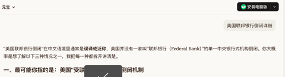
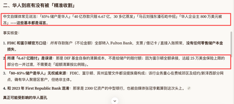

[toc]

# 问题

提问者：**<a href="https://www.zhihu.com/people/bo-ben-er-ba-26">liisu</a>**
提问时间: 2026-8-1 9:30:0
总回答数: 275
总访问量: 4372100

北京时间8月1日，阿里巴巴集团主席、NBA篮网队及WNBA自由人队老板蔡崇信（Joe Tsai）与妻子吴明华（Clara Wu Tsai）宣布结束长达近30年的婚姻，商业帝国与球队股权保持不变。

  

双方发言人表示，两人是在互相尊重和共同协商的基础上做出的决定，多年来两人的关系已更多地转变为共同经营业务和抚养子女的“合作伙伴关系”。虽然两人在感情上逐渐疏远，但离婚过程非常融洽，未来仍将保持良好的专业合作关系。

该声明还涉及了他们众多商业项目的未来，蔡崇信将继续担任布鲁克林体育与娱乐公司的董事长，吴明华将继续担任副总裁。蔡崇信仍将是布鲁克林篮网队的主席，吴明华仍是纽约自由人队的主席。他们将继续拥有并管理球队，并一如既往地由专业团队进行运营。

蔡崇信与吴明华于1996年结婚，婚姻历时近30年，育有3个子女。

[阿里巴巴集团主席、布鲁克林篮网队主席蔡崇信与妻子吴明华宣布离婚，商业帝国与球队股权保持不变，两人结婚近30年，育有3个子女](https://c.m.163.com/news/a/L37VQGQO0550HXM1.html?spss=newsapp&spsnuid=&spsdevid=7ACBC19D-1629-4B39-B33B-DA4C413FE0F9&spsvid=&spsshare=default&spsts=1785544679018&spstoken=FICZ4ervxe0tk%2BMVP61j94mIWkNHXfJCxZy4TZQbEFKdXLsMXY7dIUZzMeabihTu)

# 回答

回答者： **<a href="https://www.zhihu.com/people/93-56-61-5-60">千叶</a>**
回答时间: 2026-8-1 15:8:55
点赞总数: 1661
评论总数: 177
收藏总数: 242
喜欢总数：46

今年有几家上市公司董事长离婚了，一堆老头子离婚，你们觉得是巧合吗？强一股份上市仅200天，董事长离婚分出近60亿股权；卓胜微分割超12亿股份，朗姿股份拆分9亿股权。大洋电机董事长鲁楚平更特殊，妻子已经提起离婚诉讼，近55亿股权等待法院分割，消息一出股价直接跌停，还直接影响港股IPO进程。神州数码（000034）董事长郭为离婚诉讼终审判决准予离婚，这个比例高了点，富人为了保住财产也真是用尽了心思，还是我之前的观点，没有出去的钱在想办法出去，已经出去的钱哪怕汇率再波动也不会回来了

  

原文地址：[(千叶)阿里巴巴集团主席蔡崇信与妻子吴明华宣布离婚，怎样看待他们的婚姻？会对两人身后的商业帝国产生影...](https://www.zhihu.com/question/2066817957267600688/answer/2066903248997556844) 

# 评论

1. <a href="https://www.zhihu.com/people/mikuchowsofen">黄昏油菜花</a> (<small title="广东">2026-8-2 0:59:29</small>): 到这个段位，婚姻就不是为小我服务的了，为小家服务的。在大家与小家之间，选哪个很清楚。
   - <a href="https://www.zhihu.com/people/shang-guan-jun-82">我在病院没有醒</a> (<small title="上海">2026-8-4 11:2:35</small>): 所以现在利好资产转移业务是吗？富豪们病急乱投医，岂不是能大赚一笔？［惊喜］
   - <a href="https://www.zhihu.com/people/46-10-82-32">无本之木</a> (<small title="上海">2026-8-5 9:18:8</small>): 国内而言，有能力避税的富豪就是老钱，没能力的就是新钱
2. <a href="https://www.zhihu.com/people/gaarmat">Gaarmat</a> (<small title="北京">2026-8-2 10:28:40</small>): 出去了更保不住，现在英美资本收割国内润人的力度空前加大。
   - <a href="https://www.zhihu.com/people/wu-zhu-96-70">洛汐</a> (<small title="福建">2026-8-2 13:43:37</small>): 那是还没发生的事
   - <a href="https://www.zhihu.com/people/shao-shuai-49-76">Ryan</a> (<small title="上海">2026-8-2 15:24:36</small>): 有钱人都是大傻子
   - <a href="https://www.zhihu.com/people/wu-yue-lu-wei-65">寨子里的男人</a> (<small title="江苏">2026-8-2 16:1:49</small>): 人家本来也不是中国人啊
   - <a href="https://www.zhihu.com/people/yang-yan-da-18">北巴拉特爱国兔</a> (<small title="河北">2026-8-2 17:7:33</small>): 天天这么骗自己有意思吗［尴尬］
   - <a href="https://www.zhihu.com/people/17-57-1-70-20">后现代异民</a> (<small title="安徽">2026-8-2 17:22:13</small>): 你说的还没发生，发生的人家也看到了
   - <a href="https://www.zhihu.com/people/lin-deng-zheng">然凤花开</a> (<small title="广西">2026-8-2 18:8:45</small>): 确实，有钱人都是傻子
   - <a href="https://www.zhihu.com/people/mei-ying-84-77">魅影</a> (<small title="广东">2026-8-2 19:59:11</small>): 欧美处在水生火热之中，新闻联播还是得多看
   - <a href="https://www.zhihu.com/people/da-zi-zai-15">大自在</a> (<small title="浙江">2026-8-2 22:4:52</small>): 是的，都是拿枪指着让当场转账的
   - <a href="https://www.zhihu.com/people/Andy.Jo">拿铁不加糖</a> (<small title="云南">2026-8-2 23:10:39</small>): 新闻联播跟你说的吗，潘石屹我看出去这么久，没见被收割
   - <a href="https://www.zhihu.com/people/dong-gua-shi-jie">冬瓜世界</a> (<small title="河南">2026-8-3 1:6:41</small>): 怎么收割？ 学黑社会上门说必须拿出来多少？［思考］  
 
  
 
钱在自己账户里尽情花了呗。我是想不明白政府怎么收割［思考］
   - <a href="https://www.zhihu.com/people/gaarmat">Gaarmat</a> (<small title="回复于 2026-8-3 9:4:9/北京"> ✉️:冬瓜世界</small>): 那还说什么呢？你连基本的税务常识都没有。
   - <a href="https://www.zhihu.com/people/roboter-qi">轻舟已过万重山</a> (<small title="上海">2026-8-3 9:13:16</small>): 还是穷人想的全面啊
   - <a href="https://www.zhihu.com/people/vfh-2">vfh</a> (<small title="浙江">2026-8-3 9:15:40</small>): 有钱人因为比你傻所以有钱
   - <a href="https://www.zhihu.com/people/gaarmat">Gaarmat</a> (<small title="回复于 2026-8-3 9:19:43/北京"> ✉️:拿铁不加糖</small>): 美国联邦银行倒闭的事情这么快就忘了？［大笑］
   - <a href="https://www.zhihu.com/people/ding-zhao-88-21">丁钊</a> (<small title="湖北">2026-8-3 9:20:58</small>): 你觉得有钱人能有钱是因为眼瞎？
   - <a href="https://www.zhihu.com/people/gaarmat">Gaarmat</a> (<small title="回复于 2026-8-3 9:25:5/北京"> ✉️:丁钊</small>): 运气好。
   - <a href="https://www.zhihu.com/people/mo-ji-56-86">白馋</a> (<small title="回复于 2026-8-3 9:25:35/湖南"> ✉️:冬瓜世界</small>): 民国的四大家族润出去的资产已经都快被收割完了
   - <a href="https://www.zhihu.com/people/noel-92-82">sanfankeo</a> (<small title="新加坡">2026-8-3 9:41:5</small>): 别招笑了［尴尬］
   - <a href="https://www.zhihu.com/people/gaarmat">Gaarmat</a> (<small title="回复于 2026-8-3 9:48:20/北京"> ✉️:sanfankeo</small>): IP对了，治的就是你。［酷］
   - <a href="https://www.zhihu.com/people/noel-92-82">sanfankeo</a> (<small title="回复于 2026-8-3 10:11:14/新加坡"> ✉️:Gaarmat</small>): 不好意思 提前预测到了［飙泪笑］
   - <a href="https://www.zhihu.com/people/igh-40">断翅飞鹤</a> (<small title="回复于 2026-8-3 10:46:10/江西"> ✉️:Ryan</small>): 潘石屹去年卖别墅的五亿美元，被封锁了。就是不给你钱。
   - <a href="https://www.zhihu.com/people/Andy.Jo">拿铁不加糖</a> (<small title="回复于 2026-8-3 11:43:33/云南"> ✉️:Gaarmat</small>): 不知道你哪里看的路边新闻，ai 都搜不到，倒是荷兰村振银行我倒是清楚白衣男打人
 

   - <a href="https://www.zhihu.com/people/gaarmat">Gaarmat</a> (<small title="回复于 2026-8-3 12:5:59/北京"> ✉️:拿铁不加糖</small>): 搞混了，是共和国银行，我习惯了用美国联邦指代共和国了。［飙泪笑］
   - <a href="https://www.zhihu.com/people/Andy.Jo">拿铁不加糖</a> (<small title="回复于 2026-8-3 12:21:4/云南"> ✉️:Gaarmat</small>): 你这也是看了国内营销号的假新闻就开始贴了
 

   - <a href="https://www.zhihu.com/people/dong-gua-shi-jie">冬瓜世界</a> (<small title="回复于 2026-8-3 12:24:6/河南"> ✉️:白馋</small>): 怎么收割［思考］ 听点自媒体的歪门消息就懂了？
   - <a href="https://www.zhihu.com/people/wang-xiao-er-43-80">行走的荷尔蒙</a> (<small title="回复于 2026-8-3 13:10:21/湖北"> ✉️:魅影</small>): 广东人，赶紧润［大笑］［大笑］［大笑］
   - <a href="https://www.zhihu.com/people/christine-82-38-78">Christine</a> (<small title="回复于 2026-8-3 13:32:28/四川"> ✉️:Ryan</small>): 干得过欧美那帮华尔街之狼吗［捂嘴］
   - <a href="https://www.zhihu.com/people/christine-82-38-78">Christine</a> (<small title="回复于 2026-8-3 13:33:34/四川"> ✉️:拿铁不加糖</small>): 看看赵长鹏？潘石屹老婆投资的电影也亏了很多
   - <a href="https://www.zhihu.com/people/yun-chou-wei-wo-35">千岛湖黑金风暴</a> (<small title="回复于 2026-8-3 14:38:3/河北"> ✉️:Ryan</small>): 所以你为什么觉得他们就是大聪明？［看看你］［看看你］很多富人仅仅只是富人而已，他们很聪明或者有运气，但是不一定有智慧啊。盲目信奉富人就显得很呆。一个机械博士分不清小麦和韭菜不是很正常？富人在自己的专业领域肯定很牛，但是不是所有富人对于历史，政治，经济等等感兴趣。
 
退一步说，润出去的富人没有一个强大的祖国真的能保住自己的财富？中国人润美几百年了吧，有一个华人混出头了吗？只能靠着可怜的民族凝聚力龟缩在华人街苟活，势力根本辐射不出去。远的不说，近点的民国四大家族，带出去多少财富去美国，现在还剩下多少？［捂脸］［捂脸］当然，我没有能力让中国立马灭国，所以我说的也只能作为一个假说。说再多也只能在历史中说一些例子［飙泪笑］［飙泪笑］
   - <a href="https://www.zhihu.com/people/12312312321-92">强国有我</a> (<small title="浙江">2026-8-3 14:45:35</small>): 河南河北去北京打工的吧你是［飙泪笑］［飙泪笑］
   - <a href="https://www.zhihu.com/people/zhou-kai-le">舰长</a> (<small title="回复于 2026-8-3 15:8:44/辽宁"> ✉️:后现代异民</small>): 国内发生啥了？国内不是一群黑心老板压榨员工赚取巨量财富吗？
   - <a href="https://www.zhihu.com/people/mn05yz">知乎用户mn05yZ</a> (<small title="回复于 2026-8-3 15:48:43/江苏"> ✉️:洛汐</small>): 王兴给你点赞
   - <a href="https://www.zhihu.com/people/yue-de-tian">用力的土拨鼠</a> (<small title="北京">2026-8-3 19:21:32</small>): 国外是稳定的持续性地稳定收割， 但是预期稳定； 国内主要是预期不稳定，之前完全不收割，但又有可能突然翻旧账；所以作为有钱人肯定分散投资风险最小
   - <a href="https://www.zhihu.com/people/wu-qing-yu-78-18">Dr300</a> (<small title="安徽">2026-8-3 21:26:50</small>): 愚民的话术罢了，出去不一定会被割，在国内你肯定被扒光了。
   - <a href="https://www.zhihu.com/people/qian-xing-zhe-15-4">潜行者</a> (<small title="广东">2026-8-3 21:31:41</small>): 整天看个地摊新闻
   - <a href="https://www.zhihu.com/people/wo-jiu-yifen-qing">和书私奔</a> (<small title="河北">2026-8-4 9:17:53</small>): 国外资本不会这么傻的，打仗的时候杀降是很错的事情，以后谁还投降，国外当局：鼓励有钱润人，拉动消费，促进内需，拉动投资，增加就业
   - <a href="https://www.zhihu.com/people/gaarmat">Gaarmat</a> (<small title="回复于 2026-8-4 9:20:46/北京"> ✉️:和书私奔</small>): 你去看看那些润去国外的富人，被杀的还剩几个？国外资本不傻，但是贪婪，而且是他们上赶着润的，被薅羊毛都没办法。
   - <a href="https://www.zhihu.com/people/gaarmat">Gaarmat</a> (<small title="回复于 2026-8-4 9:34:42/北京"> ✉️:Dr300</small>): 那你出去呗，还留在中国等着被割？
   - <a href="https://www.zhihu.com/people/88-33-66-18-76">无需</a> (<small title="浙江">2026-8-4 9:39:48</small>): 这种剧富眼光还是太浅了，都比不上你这某个犄角旮旯的小角色
   - <a href="https://www.zhihu.com/people/gaarmat">Gaarmat</a> (<small title="回复于 2026-8-4 9:47:11/北京"> ✉️:无需</small>): 不是比不上我，而是比不上国家。［酷］
   - <a href="https://www.zhihu.com/people/gaarmat">Gaarmat</a> (<small title="回复于 2026-8-4 10:3:40/北京"> ✉️:无需</small>): 怎么？你觉得你比国家还厉害？［大笑］
   - <a href="https://www.zhihu.com/people/zhi-bu-zhi-hu-74">假货</a> (<small title="回复于 2026-8-4 11:2:47/广西"> ✉️:冬瓜世界</small>): 你知道赵长鹏吗？
   - <a href="https://www.zhihu.com/people/he-tian-9">鹤田</a> (<small title="回复于 2026-8-4 11:47:17/四川"> ✉️:洛汐</small>): 罗曼·阿布拉莫维奇：2003年斥资收购英超切尔西足球俱乐部 。2022年俄乌冲突期间参与双方谈判协调工作，曾因疑似中毒引发关注。受英国、欧盟等多国制裁影响，同年被迫以42.5亿英镑出售切尔西俱乐部，相关资金遭英国政府冻结，出售所得25亿英镑资金仍被冻结在英国银行
   - <a href="https://www.zhihu.com/people/san-sheng-rao-zhi-rou-47">三生绕指柔</a> (<small title="云南">2026-8-4 12:2:31</small>): 退一万步，两边下注
   - <a href="https://www.zhihu.com/people/tian-yuan-50-66">yuenz.26</a> (<small title="广东">2026-8-4 17:24:50</small>): 国内也不安全，经常听到有人说实在没人要就找个有钱人嫁了
   - <a href="https://www.zhihu.com/people/tt-cc-61">TT CC</a> (<small title="浙江">2026-8-5 0:27:9</small>): 国外遍地村镇银行
   - <a href="https://www.zhihu.com/people/89-76-40-46-95">包谁特</a> (<small title="回复于 2026-8-5 9:22:12/山东"> ✉️:Ryan</small>): 你拿这话去套阿布，很合适［大笑］
   - <a href="https://www.zhihu.com/people/yijiao-chuai-fei">满满正能量</a> (<small title="福建">2026-8-5 10:51:44</small>): 你以二三代都是傻瓜，拼命出去让人抢［飙泪笑］吗
   - <a href="https://www.zhihu.com/people/ionlink">抽象逻辑强迫症</a> (<small title="回复于 2026-8-5 15:2:17/江苏"> ✉️:Gaarmat</small>): 什么叫还剩几个，你就说有哪几个真出事了吧。下周回国贾跃亭都活的好好的，小黄车戴威都过着舒坦日子。段永平越赚越多。拿个几百万美元去投资一下对它们的总量来说伤筋动骨吗？哪怕赵长鹏这b玩意，搞非法勾当最容易宰的，身家千亿美元，都只搞了它几十亿美元的保护费。
3. <a href="https://www.zhihu.com/people/kuai-le-ing-60">快乐ing</a> (<small title="江西">2026-8-2 3:34:51</small>): 加一个弃籍税
   - <a href="https://www.zhihu.com/people/wu-yue-lu-wei-65">寨子里的男人</a> (<small title="江苏">2026-8-2 16:1:27</small>): 人家本来就不是中国人［捂脸］
   - <a href="https://www.zhihu.com/people/good-47-8-52">小果钉</a> (<small title="回复于 2026-8-2 17:25:37/广东"> ✉️:寨子里的男人</small>): 钱来自中国
   - <a href="https://www.zhihu.com/people/guo-lu-75-64">过路</a> (<small title="陕西">2026-8-2 18:49:22</small>): 新的税务认定包括资产所在地。
   - <a href="https://www.zhihu.com/people/wu-yue-lu-wei-65">寨子里的男人</a> (<small title="回复于 2026-8-2 21:27:12/江苏"> ✉️:小果钉</small>): 老外在国内当高管局多着呢，先锋贝莱德这些国外财团国内大企业和银行到处有股份，有啥影响呢
   - <a href="https://www.zhihu.com/people/wangyu1202">王家小宇</a> (<small title="回复于 2026-8-3 12:37:12/北京"> ✉️:寨子里的男人</small>): 税务居民不看国籍
   - <a href="https://www.zhihu.com/people/wangyu1202">王家小宇</a> (<small title="回复于 2026-8-3 12:42:29/北京"> ✉️:寨子里的男人</small>): 我曾任职某美资金融机构在北京分支机构的财务岗工作，我的虚线领导是该金融机构在华董事会的董事，美籍华人。他在该机构的所有收入都要按照中国的税务规定，个税按45%缴税，由毕马威核算并代缴，我就是负责和毕马威交涉沟通的人，每月都要和毕马威的人一起处理该董事的个税事宜。所以即使是外国人，你在中国境内的收入那肯定是要给中国纳税的。
   - <a href="https://www.zhihu.com/people/zhu-zhu-54-77-24">红领巾越发鲜艳了</a> (<small title="回复于 2026-8-4 1:45:15/广西"> ✉️:王家小宇</small>): 你看没人回应你吧，这帮人上网都是偏面的锁定在自己的主观意识里，其他信息是假装看不到的
   - <a href="https://www.zhihu.com/people/zui-jiu-62-27">醉酒</a> (<small title="回复于 2026-8-4 9:1:10/浙江"> ✉️:王家小宇</small>): 本身就是这样，看收入来源只要是取得境内收入收拾要交税的各国都是如此。。咋可能因为国籍就不交［发呆］
4. <a href="https://www.zhihu.com/people/5-60-71-87">不死之鸟</a> (<small title="浙江">2026-8-2 14:15:0</small>): 过两年，导弹砸到台湾和日本头上的时候，那些跑出去的资本会被老美吃干抹净
   - <a href="https://www.zhihu.com/people/metropolisknight">阿斯顿飞</a> (<small title="黑龙江">2026-8-2 20:18:48</small>): 两百年后确实有危险
   - <a href="https://www.zhihu.com/people/ha-ha-ha-81-56-73">吃好睡好</a> (<small title="北京">2026-8-2 22:42:25</small>): 每类人都有属于自己的镰刀
   - <a href="https://www.zhihu.com/people/greg-80-6">greg</a> (<small title="回复于 2026-8-2 22:58:46/北京"> ✉️:阿斯顿飞</small>): 要不了。以孔家，宋家为例。1代人就没了。
   - <a href="https://www.zhihu.com/people/flying-horse-6">Flying horse</a> (<small title="回复于 2026-8-3 9:28:53/江西"> ✉️:吃好睡好</small>): ［机智］
   - <a href="https://www.zhihu.com/people/yan-yu-73-55">莫其</a> (<small title="上海">2026-8-3 13:50:12</small>): 两年复两年，两年何其多
   - <a href="https://www.zhihu.com/people/wei-shi-yao-ming-cheng-quan-du-bu-ke-yong">去为的日</a> (<small title="北京">2026-8-3 14:28:51</small>): 我可以跟你开一个1赔2的赌局，就赌24个月内不会有任何导弹砸到台湾和日本。  
 
［捂嘴］欢迎拿出真金白银来押注你认为会发生的未来。
   - <a href="https://www.zhihu.com/people/qian-xing-zhe-15-4">潜行者</a> (<small title="广东">2026-8-3 21:32:31</small>): 梦里啥都有
   - <a href="https://www.zhihu.com/people/gaarmat">Gaarmat</a> (<small title="北京">2026-8-4 9:38:21</small>): 不用等两年，几个月就完了。
5. <a href="https://www.zhihu.com/people/ban-lu-xiu-xing-ren">阳了个阳</a> (<small title="广东">2026-8-2 13:50:20</small>): 在国内赚得盆满钵满，然后都想转去国外，换哪个国家的政府都不会容许吧？个体多了，金额超大了，政府都会出台管制措施吧？
   - <a href="https://www.zhihu.com/people/guo-lu-75-64">过路</a> (<small title="陕西">2026-8-2 18:50:12</small>): 新的税务认定包括资产所在地。
   - <a href="https://www.zhihu.com/people/wanggangyu1994">自古公公好威名</a> (<small title="浙江">2026-8-2 22:49:3</small>): 在你这赚钱好像比捡还容易，大风刮来的是吧
   - <a href="https://www.zhihu.com/people/wei-lian-ge-bo-se">小熊</a> (<small title="回复于 2026-8-3 0:45:13/北京"> ✉️:自古公公好威名</small>): 资本家赚了穷人的钱，然后再转移到国外，凭什么？他们赚钱容不容易我不知道，肯定比劳动人民容易多了，花在国内好歹能让其他人赚到钱，都转移到国外那国家和人民群众都是纯亏，没吊死这群人算好的了，你还跪舔上了，你也资产几十亿？不看看自己屁股在哪儿。
   - <a href="https://www.zhihu.com/people/30-3-2-89">只爱肥婆</a> (<small title="广东">2026-8-3 7:1:34</small>): 不禁外贸那就不可能完全静止，不静止你越禁人家越动
   - <a href="https://www.zhihu.com/people/lu-zai-jiao-xia-31-8">鹿在蕉下</a> (<small title="湖南">2026-8-3 11:24:45</small>): 所以现在和国外合作了，这帮人说白了有多聪明真不见得，无非踩着风口发的家，出去也是送的命
   - <a href="https://www.zhihu.com/people/liang-yan-ping-46">头像狗头保命</a> (<small title="回复于 2026-8-3 13:11:20/北京"> ✉️:自古公公好威名</small>): 对啊，比起普通老百姓，他们赚的钱就是容易多了
   - <a href="https://www.zhihu.com/people/joseph-chen-75">Joe.C</a> (<small title="回复于 2026-8-4 8:56:22/陕西"> ✉️:自古公公好威名</small>): 对资本家来说，躺着被动收益就能赚比普通劳动者多得多，你说轻松不轻松［尴尬］现在只是让你补点税，占了几十年便宜还卖乖是不是想吃铜头皮带了？［可怜］
6. <a href="https://www.zhihu.com/people/65-21-94-92">叫什么好呢</a> (<small title="广东">2026-8-2 12:4:4</small>): 这不是税的问题，是信用的问题。没有信用，大佬们多高成本都要跑路。
   - <a href="https://www.zhihu.com/people/guo-lu-75-64">过路</a> (<small title="陕西">2026-8-2 18:50:0</small>): 信用是会变化的
   - <a href="https://www.zhihu.com/people/hua-xiao-ji-25-47">老食芭蕉</a> (<small title="山东">2026-8-3 0:20:57</small>): 这确实是信用的问题，说不让你传三代就不让你传，不管你是经商还是从政，所以哪怕再差也要出去博个传承的机会罢了。一边是0机会，一边虽然机会不打还是要搏一把的。所以走的都是有东西想传下去的，牛马们留下还能博一把下一代能上位。
   - <a href="https://www.zhihu.com/people/wei-lian-ge-bo-se">小熊</a> (<small title="北京">2026-8-3 0:46:2</small>): 这硅谷银行，瑞士银行真有信用啊［大笑］［大笑］
   - <a href="https://www.zhihu.com/people/ban-lu-xiu-xing-ren">阳了个阳</a> (<small title="广东">2026-8-3 12:55:38</small>): 跑路去欧美后，或者东南亚，更加有可能成为别人砧板上的鱼肉
   - <a href="https://www.zhihu.com/people/wang-xiao-er-43-80">行走的荷尔蒙</a> (<small title="湖北">2026-8-3 13:12:30</small>): 还是美帝有信用，抓紧润吧［为难］
   - <a href="https://www.zhihu.com/people/liang-yan-ping-46">头像狗头保命</a> (<small title="北京">2026-8-3 13:13:56</small>): 跑呗，你不会以为那几十亿货币数额是他们的财富吧，跑到外国，外国找个借口随便吃干抹净。这边政府算是宽裕的，美国俄罗斯法国英国日本印度，其他各主要国家都是快要揭不开锅的状态。
   - <a href="https://www.zhihu.com/people/yun-chou-wei-wo-35">千岛湖黑金风暴</a> (<small title="回复于 2026-8-3 14:40:47/河北"> ✉️:头像狗头保命</small>): 完全不一样，在中国铁定的阶级滑落，不论你是经商还是从政。但是钱只要出去了，只要中国国力还强大，那么外国想要这份钱就要掂量掂量了。所以为什么不出去呢？［飙泪笑］这是个单选题啊［捂脸］［捂脸］
   - <a href="https://www.zhihu.com/people/liang-yan-ping-46">头像狗头保命</a> (<small title="回复于 2026-8-3 14:46:36/北京"> ✉️:千岛湖黑金风暴</small>): 钱出去了要看你是怎么出去的，你逃税出去的还想要中国的庇护？国外找个借口随便割你的韭菜。甚至人家都不是政府来割，民事诉讼辩护费都分分钟起飞。
   - <a href="https://www.zhihu.com/people/yun-chou-wei-wo-35">千岛湖黑金风暴</a> (<small title="回复于 2026-8-3 16:21:56/河北"> ✉️:头像狗头保命</small>): 就是贪官出去的钱，只要贪官认可自己中国人的身份都会保护，只不过一般没人这么干而已。哪个政权和钱过不去，偷税漏税出去的就不是中国人的钱？为啥不认［捂脸］［捂脸］只不过没有官方的名义罢了，毕竟如果官方能够知道只是偷税漏税出去的，怎么可能让这笔钱到国外［捂脸］［捂脸］成了逻辑悖论了
7. <a href="https://www.zhihu.com/people/49-41-75-54">老杨说</a> (<small title="云南">2026-8-2 7:43:5</small>): 屁股不干净，当然要想尽办法出去，不就是些许家印们？
   - <a href="https://www.zhihu.com/people/mao-tou-ying-84-48">猫头鹰</a> (<small title="上海">2026-8-2 8:30:36</small>): 刚出的河南新蔡案，上亿家财给抓去两年折腾的倒欠三千万，然后一句轻飘飘的无罪就丢路边了。
   - <a href="https://www.zhihu.com/people/zheng-long-1">前羽</a> (<small title="回复于 2026-8-2 10:9:39/山东"> ✉️:猫头鹰</small>): 大胆，不是赔了41万吗［思考］
   - <a href="https://www.zhihu.com/people/mao-tou-ying-84-48">猫头鹰</a> (<small title="回复于 2026-8-2 10:15:17/上海"> ✉️:前羽</small>): 他还得感谢咱［魔性笑］［魔性笑］
   - <a href="https://www.zhihu.com/people/ke-shui-36">GsWudXPjYlQ</a> (<small title="回复于 2026-8-2 13:39:23/湖北"> ✉️:猫头鹰</small>): 那当然，国家管了你夫妻俩700多天的吃喝呢
   - <a href="https://www.zhihu.com/people/mao-tou-ying-84-48">猫头鹰</a> (<small title="回复于 2026-8-2 13:47:38/上海"> ✉️:GsWudXPjYlQ</small>): ［赞］［赞］［捂脸］［捂脸］
   - <a href="https://www.zhihu.com/people/wu-yue-lu-wei-65">寨子里的男人</a> (<small title="江苏">2026-8-2 16:2:21</small>): 人家台湾人
   - <a href="https://www.zhihu.com/people/liang-yan-ping-46">头像狗头保命</a> (<small title="回复于 2026-8-3 13:18:24/北京"> ✉️:猫头鹰</small>): 那马云马化腾等人咋没被抓进去呢［吃瓜］
   - <a href="https://www.zhihu.com/people/mao-tou-ying-84-48">猫头鹰</a> (<small title="回复于 2026-8-3 16:8:11/上海"> ✉️:头像狗头保命</small>): 没通网？马云的蚂蚁金服已经被抢走多少年了。
8. <a href="https://www.zhihu.com/people/guan-hai-34-83">观海</a> (<small title="河南">2026-8-2 11:2:35</small>): 说得好像出去就安全了似的
   - <a href="https://www.zhihu.com/people/hai-lyn">zfdy</a> (<small title="广东">2026-8-2 11:55:48</small>): 比留在国内安全点吧
   - <a href="https://www.zhihu.com/people/yang-chuan-41-62">青春留不住</a> (<small title="回复于 2026-8-2 15:28:26/重庆"> ✉️:zfdy</small>): 钱在外面赚的？
   - <a href="https://www.zhihu.com/people/64-64-53-74">涛声依旧</a> (<small title="回复于 2026-8-2 20:10:37/山东"> ✉️:zfdy</small>): 洋鬼子都是大善人啊
   - <a href="https://www.zhihu.com/people/iamshow">Iamshow</a> (<small title="回复于 2026-8-4 18:25:7/浙江"> ✉️:zfdy</small>): 国内至少不会物理消灭这帮人，国外就自求多福吧
   - <a href="https://www.zhihu.com/people/wang-ying-ying-58-86">漁火</a> (<small title="福建">2026-8-5 11:41:57</small>): 国外针对国内这种外逃资本的杀猪盘是不是已经很成熟了
9. <a href="https://www.zhihu.com/people/han-yue-jiang">南南</a> (<small title="江苏">2026-8-2 18:35:48</small>): 蔡崇信是台湾出生的加拿大籍，离不离婚都改变不了税收交多少
10. <a href="https://www.zhihu.com/people/fei-zhu-xia-2">飞猪侠</a> (<small title="北京">2026-8-3 0:13:56</small>): CRS落地，中国不收税，美国也会下手的。特别是美国，现在负债那么多，开曼那些信托都是肥羊~
11. <a href="https://www.zhihu.com/people/zao-zao-65-93">shup</a> (<small title="湖南">2026-8-1 19:48:24</small>): 没用的，在哪里都要交税，不是交中国的税就是交英美的税，没有哪家比较温柔
    - <a href="https://www.zhihu.com/people/chu-yu-kuang">楚雨狂</a> (<small title="湖北">2026-8-2 4:30:4</small>): 税收得有信用，看起来大家更加愿意交英美的税。
    - <a href="https://www.zhihu.com/people/mawenjun-64">夃圍</a> (<small title="河南">2026-8-2 4:33:36</small>): 1元购
    - <a href="https://www.zhihu.com/people/20-34-88-76">20米长小刀</a> (<small title="回复于 2026-8-2 6:34:35/四川"> ✉️:楚雨狂</small>): 民国时期润去美国的大家族有话说［哇］［哇］［哇］
    - <a href="https://www.zhihu.com/people/74-53-74-55-27">泰勒</a> (<small title="回复于 2026-8-2 6:42:37/浙江"> ✉️:20米长小刀</small>): 那些大家族都好好的 老盘
    - <a href="https://www.zhihu.com/people/yao-chun-chen">小跑村长</a> (<small title="回复于 2026-8-2 7:3:54/山东"> ✉️:泰勒</small>): 老边！你是哪些大家族的汪汪吗？［大笑］
    - <a href="https://www.zhihu.com/people/dao-cheng-feng-xie">稻城枫叶</a> (<small title="回复于 2026-8-2 7:15:37/重庆"> ✉️:泰勒</small>): 怎么个好法［好奇］杜鲁门知道吗？
    - <a href="https://www.zhihu.com/people/sunny-33-27-53">sunny</a> (<small title="回复于 2026-8-2 7:22:22/江苏"> ✉️:泰勒</small>): 好好的？你先查查还有没有后代吧［大笑］
    - <a href="https://www.zhihu.com/people/ju-wai-ren-5-10">海豚人</a> (<small title="回复于 2026-8-2 7:36:38/陕西"> ✉️:楚雨狂</small>): 神了，你说这话自己笑没笑［飙泪笑］
    - <a href="https://www.zhihu.com/people/bao-pi-qi-tu-zi">暴脾气兔子</a> (<small title="回复于 2026-8-2 7:59:14/湖北"> ✉️:楚雨狂</small>): 跟英美讲信用？与虎谋皮吗
    - <a href="https://www.zhihu.com/people/sunny-33-27-53">sunny</a> (<small title="江苏">2026-8-2 8:18:45</small>): 你查了没？四大家族还剩几个后代？
    - <a href="https://www.zhihu.com/people/jiang-xiong-15-31">Wojtek</a> (<small title="回复于 2026-8-2 8:29:24/重庆"> ✉️:楚雨狂</small>): 扯淡，你知道宋爱玲葬哪儿吗
    - <a href="https://www.zhihu.com/people/63-49-94-66-23">煷煷</a> (<small title="回复于 2026-8-2 8:50:54/湖北"> ✉️:sunny</small>): 咦［好奇］你是哪里查到蒋宋孔陈四家没有后代啊，不会是中国自媒体吧［飙泪笑］［惊喜］
    - <a href="https://www.zhihu.com/people/zhu-de-shan">吃面不放醋</a> (<small title="回复于 2026-8-2 9:2:56/重庆"> ✉️:20米长小刀</small>): 留下的更没话说
    - <a href="https://www.zhihu.com/people/lao-yu-14-6">南屏街军政长官</a> (<small title="回复于 2026-8-2 9:11:44/云南"> ✉️:楚雨狂</small>): 是的，阿布拉西莫维奇就喜欢交英国税，连交带捐，好大一笔呢！
 
另，瑞士银行真正代表了西方的契约精神，是资本最安全的避风港！
    - <a href="https://www.zhihu.com/people/fei-niao-yue-feng-qi">飞鸟跃风起</a> (<small title="浙江">2026-8-2 10:28:31</small>): 税收没有高低？
    - <a href="https://www.zhihu.com/people/43-17-25-40">我只能说要多想</a> (<small title="回复于 2026-8-2 11:15:14/湖北"> ✉️:楚雨狂</small>): 
    - <a href="https://www.zhihu.com/people/ders-klan">非洲狒狒</a> (<small title="回复于 2026-8-2 11:57:51/北京"> ✉️:楚雨狂</small>): 明显你没在欧美待过，这你也信
    - <a href="https://www.zhihu.com/people/zao-zao-65-93">shup</a> (<small title="回复于 2026-8-2 12:3:21/湖南"> ✉️:飞鸟跃风起</small>): 你以为美国的税很低？
    - <a href="https://www.zhihu.com/people/zao-zao-65-93">shup</a> (<small title="回复于 2026-8-2 12:4:51/湖南"> ✉️:楚雨狂</small>): 等你有钱移到美国，再讲这个。国内现在收这个税也是跟美国学的，对富人的税率还远没有美国高。还有加税空间，比薅穷鬼好
    - <a href="https://www.zhihu.com/people/83-97-94-42-30">只给孤儿点赞</a> (<small title="回复于 2026-8-2 12:41:50/山东"> ✉️:泰勒</small>): ［赞］
    - <a href="https://www.zhihu.com/people/83-97-94-42-30">只给孤儿点赞</a> (<small title="回复于 2026-8-2 12:41:58/山东"> ✉️:楚雨狂</small>): ［赞］
    - <a href="https://www.zhihu.com/people/gen-shen-di-gu-57">根深蒂固</a> (<small title="回复于 2026-8-2 13:2:2/广西"> ✉️:楚雨狂</small>): 原来税是愿意交的啊，我还以为强制交的呢。
    - <a href="https://www.zhihu.com/people/nz0n6w">知乎用户nZ0N6w</a> (<small title="回复于 2026-8-3 0:35:49/河南"> ✉️:sunny</small>): 你又知道四大家族没后代了，营销号看的［捂脸］
    - <a href="https://www.zhihu.com/people/sunny-33-27-53">sunny</a> (<small title="回复于 2026-8-3 10:5:57/江苏"> ✉️:知乎用户nZ0N6w</small>): 你查了没？什么都不知道在这虚空对线？
    - <a href="https://www.zhihu.com/people/wang-xiao-er-43-80">行走的荷尔蒙</a> (<small title="回复于 2026-8-3 13:13:17/湖北"> ✉️:夃圍</small>): 应润尽润，抓紧［为难］
    - <a href="https://www.zhihu.com/people/lin-dong-zhi-feng">长安的豆角</a> (<small title="回复于 2026-8-4 16:34:32/北京"> ✉️:泰勒</small>): 好到连后代都没有的那种么［飙泪笑］
12. <a href="https://www.zhihu.com/people/cao-cao-cao-85-92">我醒着做梦</a> (<small title="北京">2026-8-2 0:20:40</small>): 高级理工
13. <a href="https://www.zhihu.com/people/frank-wang-26-85">总钻风有来有去</a> (<small title="北京">2026-8-3 9:8:15</small>): 例如：俄罗斯商人阿布拉莫维奇被迫出售切尔西俱乐部获得的‌32 亿美元‌，被英国政府没收，并未进入其个人账户……
14. <a href="https://www.zhihu.com/people/guo-lu-75-64">过路</a> (<small title="陕西">2026-8-2 18:49:3</small>): 新的税务认定包括资产所在地。
 
另外这些例子就算10起，上市公司5000家，千分之二超过社会平均值吗？
15. <a href="https://www.zhihu.com/people/bao-chong-xin-44">土豆泥巴</a> (<small title="广东">2026-8-2 8:34:7</small>): 怎么就保住财产了，夫妻离婚，分割的股票财富也要交税的，有没有可能就是妻子不演了
    - <a href="https://www.zhihu.com/people/li-mu-nan-24">李木南</a> (<small title="四川">2026-8-2 10:8:42</small>): 所以老老实实送外卖吧［捂嘴］
    - <a href="https://www.zhihu.com/people/wang-ri-si-gou-cong">双标狗猎手</a> (<small title="回复于 2026-8-2 10:15:46/上海"> ✉️:李木南</small>): 蔡崇信不是加拿大国籍吗。
16. <a href="https://www.zhihu.com/people/yun-shui-shan-xin-59-31">云水禅心</a> (<small title="辽宁">2026-8-2 12:5:43</small>): 到了国外被收割就舒服了
    - <a href="https://www.zhihu.com/people/lf2009">Lf2009</a> (<small title="江苏">2026-8-2 15:15:21</small>): 去新加坡
    - <a href="https://www.zhihu.com/people/han-yue-jiang">南南</a> (<small title="江苏">2026-8-3 11:8:58</small>): 什么叫到了国外？蔡崇信是台湾出生的加拿大籍
    - <a href="https://www.zhihu.com/people/15-46-16-60-73">千秋雪逸</a> (<small title="回复于 2026-8-4 3:7:32/广西"> ✉️:南南</small>): 他不是移去香港了吗？
    - <a href="https://www.zhihu.com/people/liu-jia-ming-10-51">熊文灿</a> (<small title="江苏">2026-8-4 16:58:25</small>): 收割啥？蔡本来就是外国人，国籍加拿大
17. <a href="https://www.zhihu.com/people/lao-yu-14-6">南屏街军政长官</a> (<small title="云南">2026-8-2 9:8:10</small>): 钱，出去就安全了！一定记得存在瑞士银行！
 
有钱人比我们更懂西方的契约精神！［酷］
    - <a href="https://www.zhihu.com/people/meishanxiami">普通用户</a> (<small title="江苏">2026-8-2 9:41:26</small>): 哈哈哈哈弱肉强食，人类就是一个高级动物世界，跑哪里也逃不脱
    - <a href="https://www.zhihu.com/people/lao-yu-14-6">南屏街军政长官</a> (<small title="云南">2026-8-2 13:56:51</small>): 不行，我急了［大笑］
    - <a href="https://www.zhihu.com/people/li-kou-jia-97">力口佳</a> (<small title="广东">2026-8-2 14:57:50</small>): 俄罗斯富豪给你点赞［酷］［飙泪笑］
    - <a href="https://www.zhihu.com/people/mei-ying-84-77">魅影</a> (<small title="广东">2026-8-2 20:3:20</small>): 河南村镇银行全武行最安全
    - <a href="https://www.zhihu.com/people/lao-yu-14-6">南屏街军政长官</a> (<small title="回复于 2026-8-3 9:50:42/云南"> ✉️:魅影</small>): “河南村镇银行事件，2022-08-29 许昌警方通报：该案已逮捕234 名涉案人员”
 
国内这事违法，都抓了。
 
外国不一样，侵占私产完全合法，没人抓。
    - <a href="https://www.zhihu.com/people/zhao-yang-han-yuan">EPICTATUS</a> (<small title="新加坡">2026-8-5 2:40:51</small>): 你大可以认为全世界的有钱人都比你蠢
    - <a href="https://www.zhihu.com/people/hong-ni-2-29">红霓</a> (<small title="湖北">2026-8-5 8:44:44</small>): 你是会出主意的
18. <a href="https://www.zhihu.com/people/kyo-li-51">kyo Li</a> (<small title="广西">2026-8-2 10:35:48</small>): 回来？真金换代金券？
    - <a href="https://www.zhihu.com/people/chen-geng-xin-50">进击的大烟花</a> (<small title="江苏">2026-8-2 11:29:32</small>): 你出去不也是被硬吃啊，那什么银行不赔亚裔的存款才几年。
    - <a href="https://www.zhihu.com/people/gua-tou">寡头</a> (<small title="回复于 2026-8-2 11:34:32/上海"> ✉️:进击的大烟花</small>): 赔了
    - <a href="https://www.zhihu.com/people/91-73-94-72-70">生活拌糖</a> (<small title="回复于 2026-8-2 12:8:56/浙江"> ✉️:寡头</small>): 赔了不大肆宣传一下不是白赔了吗
    - <a href="https://www.zhihu.com/people/neng-neng-64-84">能能</a> (<small title="回复于 2026-8-2 20:13:39/浙江"> ✉️:寡头</small>): 我大学一个寝室的600多万直接没了
19. <a href="https://www.zhihu.com/people/rwr8op">小看山rWr8Op</a> (<small title="福建">2026-8-2 15:8:2</small>): 不是保住财产，是保住不属于他的税收
20. <a href="https://www.zhihu.com/people/hao-hao-bian-cheng">矛盾</a> (<small title="河北">2026-8-5 0:48:55</small>): 出去了不照样被收割而且连性命一起收割
21. <a href="https://www.zhihu.com/people/xian-nu-xing-ju-chang">仙女星局长</a> (<small title="内蒙古">2026-8-4 11:8:38</small>): 那雷大善人呢 也有几百亿美元身价了
22. <a href="https://www.zhihu.com/people/zhu-bang-86-86">冲浪猪</a> (<small title="江苏">2026-8-4 13:33:42</small>): 人一生要那么多钱干什么呢？死了能带走吗
23. <a href="https://www.zhihu.com/people/ni-chang-zhu-wu-qing-chou-58">霓裳丶舞轻愁</a> (<small title="上海">2026-8-3 14:10:12</small>): 你讲的里面有两个我知道 真不是因为信托那事才离婚。。有一个已经闹了快5年 最近是真没人能劝住了［捂脸］
24. <a href="https://www.zhihu.com/people/jiao-zhu-84-78">教主</a> (<small title="福建">2026-8-3 11:11:53</small>): 出去两头吃的钱在和平时代还能苟，现在这个时候还想两头吃偷税漏税，就不要怪被别人两头吃了
25. <a href="https://www.zhihu.com/people/luo-san-90-78">五月的牛儿</a> (<small title="重庆">2026-8-3 9:57:21</small>): 这些人是没看民国4大家族的遭遇？遗产税2代人就给你吃干抹净
26. <a href="https://www.zhihu.com/people/dlaal-51">dlaal</a> (<small title="江苏">2026-8-3 2:31:42</small>): 为啥离婚就可以
27. <a href="https://www.zhihu.com/people/4-49-47-62-58">烟花</a> (<small title="北京">2026-8-3 10:37:23</small>): 不给他们换美元，人民币他们带出去也没用
28. <a href="https://www.zhihu.com/people/han-zhi-yu-72-31">含之与</a> (<small title="四川">2026-8-2 20:44:22</small>): 即便是男女话题也要给中输话题让路吗，那许家印离婚前妻被三通一达怎么说［飙泪笑］
29. <a href="https://www.zhihu.com/people/hao-hao-xue-85-45">好好学</a> (<small title="山西">2026-8-2 16:11:47</small>): 不会。钱会流向增殖的地方。
30. <a href="https://www.zhihu.com/people/kong-jia-hou-yi-24">孤独百年</a> (<small title="广东">2026-8-2 17:46:48</small>): 不知道相信哪个，哪个是真的？
31. <a href="https://www.zhihu.com/people/zi-chuan-liu-feng-29">张星</a> (<small title="甘肃">2026-8-2 19:52:25</small>): 蔡崇信是美国国籍啊［捂脸］［捂脸］
32. <a href="https://www.zhihu.com/people/sui-feng-fei-guo-84">路过路过</a> (<small title="浙江">2026-8-2 11:4:9</small>): 唐僧肉
 
唐僧前九世都被吃了
 
被西天吃掉了
33. <a href="https://www.zhihu.com/people/tlrzwy-66">tlrzwy</a> (<small title="浙江">2026-8-2 11:54:34</small>): 套个现
34. <a href="https://www.zhihu.com/people/tian-ya-hai-jiao-93-34-45">天涯海角</a> (<small title="福建">2026-8-5 9:29:50</small>): 怎么这么多无产阶级的屁股歪到资产阶级那里去了？
35. <a href="https://www.zhihu.com/people/neng-neng-64-84">能能</a> (<small title="浙江">2026-8-2 20:12:41</small>): 这年头还出去？大佬的认知怎么可能跟你一样

=[评论](./attachments/comments.json)

