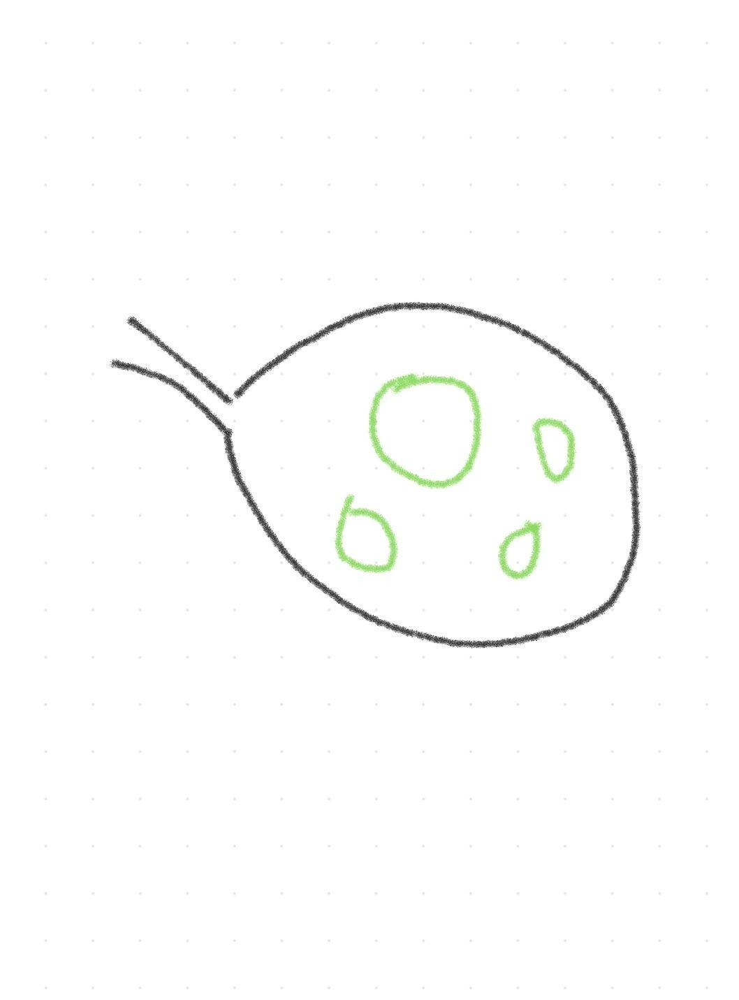
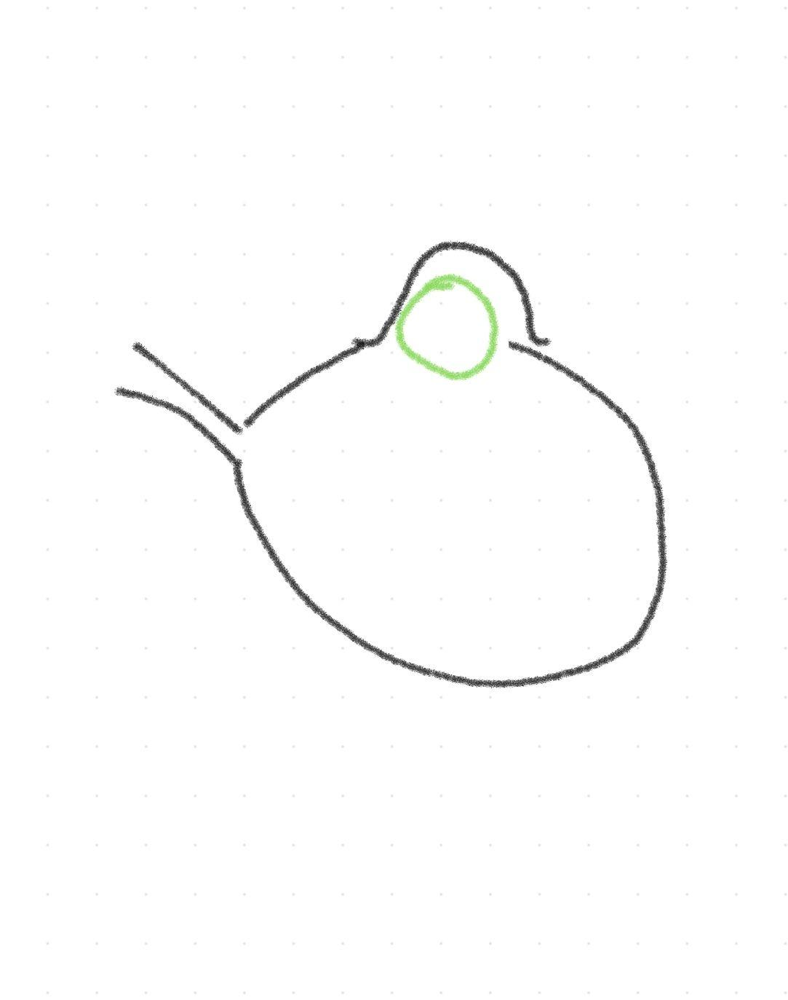
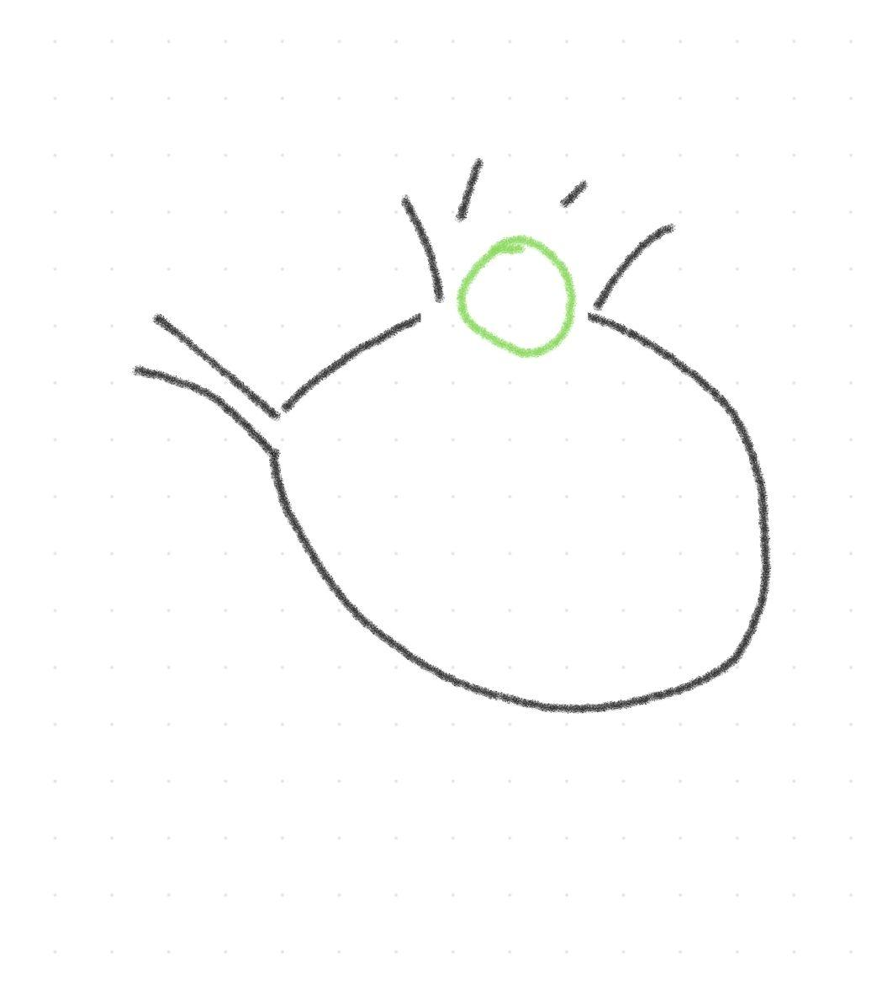
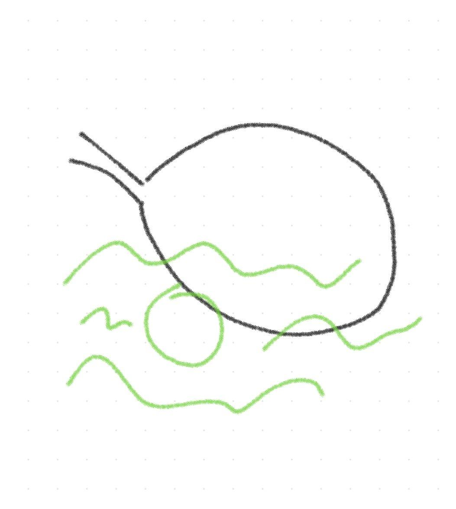
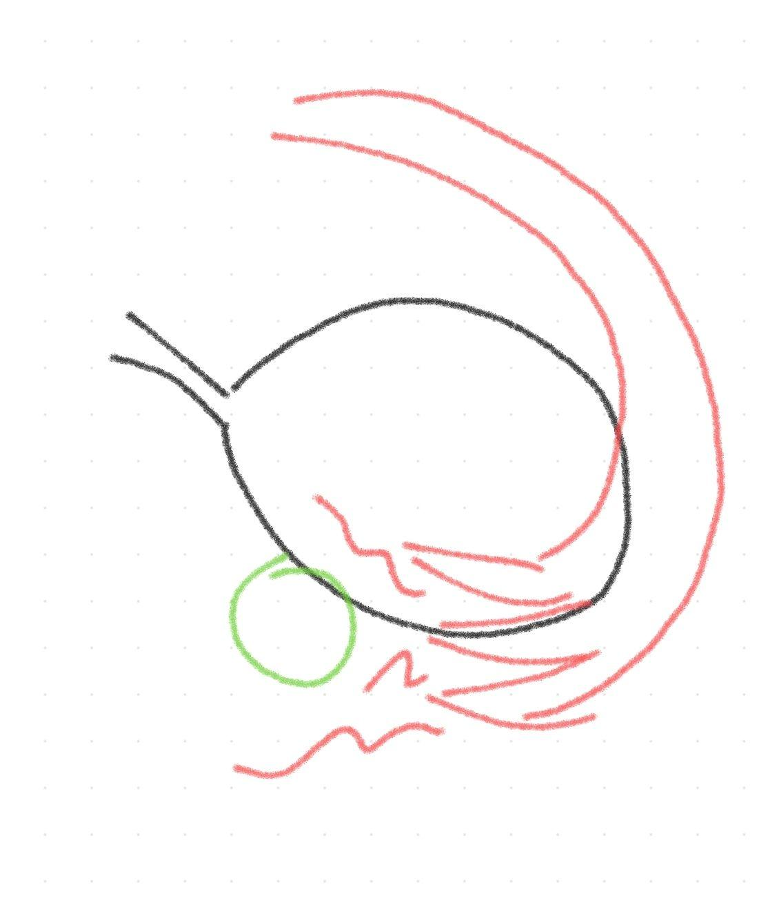
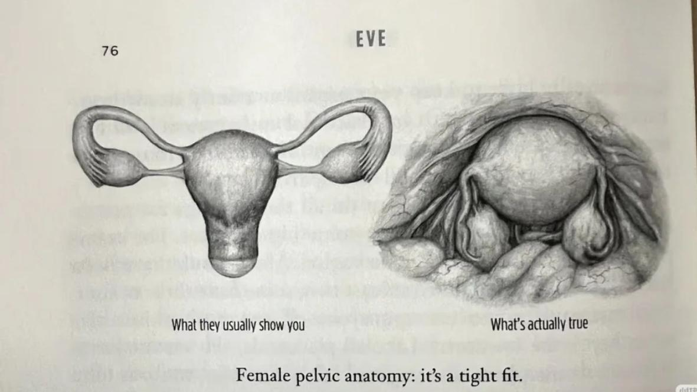

[toc]

# 问题

提问者：**<a href="https://www.zhihu.com/people/a-werit">中文昵称</a>**
提问时间: 2025-9-26 0:46:59
总回答数: 31
总访问量: 45968

国家为什么不搞一个公共精子库和和卵子库，提供给想要孩子的人使用，解决当下人口负增长的问题?

# 回答

回答者： **<a href="https://www.zhihu.com/people/yolanda59">南野95</a>**
回答时间: 2026-7-21 21:5:34
点赞总数: 389
评论总数: 2
收藏总数: 97
喜欢总数：14

我的潦草简笔画生理知识小科普又要上线了。

___

很多人根本不知道女性排卵过程是怎么样的。

我个人觉得非常逆天非常克。

卵细胞的生成与人工取卵对女性身体的伤害，和生成与获取精子对男性的影响，根本不是一个级别。

___

首先，这是一颗健康的 **卵巢** ，有很多大大小小的未成熟 **卵泡** 在里面。

现在，一颗卵细胞即将成熟——注意，它是 **在卵巢的表皮之下** 。

卵细胞成熟了，它是像挤痘痘一样 **冲破卵巢表皮蹦出来的** 。

所以有相当一部分女生会产生排卵痛和排卵期出血——因为腹腔里真有个器官在破损和出血。

由于卵巢在腹腔内，所以 **卵细胞蹦出来之后会在腹腔内漂移** 。

这时候，我们的输卵管就上线了。

教科书里经常把输卵管和卵巢画得连在一起，让人以为输卵管和输精管一样，但实际上， **输卵管和卵巢是分开的** 。

输卵管末端的触手（没错，真的是触手），会在腹腔里律动着，捕捉漂移的卵细胞，再用内部的绒毛推动卵细胞移动。

所以， **人工取卵的取卵针要有五十厘米，穿刺出阴道，直达腹腔，像输卵管一样捕捉腹腔内漂移的卵细胞** 。

（另外，由于女性的腹腔，经输卵管、子宫、阴道，是和外环境相连的，所以女性生殖系统感染有概率导致腹腔感染。）

那我们的卵巢怎么样了呢？

 **卵细胞脱离卵巢后，卵巢表面会留下一个坑洞** ，所以女性排卵期之后会有黄体期，就是卵巢会填充修复卵细胞留下的坑洞。

（即便如此，卵巢并不能完美复原，所以老年女性的卵巢和月球表面一样坑坑洼洼的。）

但是，如果像 **人工取卵** 一样打促排针，就会同时有 **十几个卵细胞破壁而出，把卵巢爆得破破烂烂的** 。

  

___

另外，教科书上的解剖图，女性子宫卵巢往往会被画成左边，但实际上，女性的卵巢和子宫是右边这样。

（根据上面的排卵过程，由于卵细胞成熟后会在腹腔里漂移，所以 **左边的输卵管也可以捕捉到右边卵巢排出的卵子** 。）

  

原文地址：[(南野95)国家为什么不搞一个公共精子库和和卵子库，提供给想要孩子的人使用，解决当下人口负增长的问题...](https://www.zhihu.com/question/1954708485351642715/answer/2063006736915624104) 

# 评论

1. <a href="https://www.zhihu.com/people/e-a-59">李无刀</a> (<small title="河南">2026-7-21 22:57:42</small>): 懂了。教科书害人！
2. <a href="https://www.zhihu.com/people/30-63-89-31">摸鱼摸鱼</a> (<small title="四川">2026-7-22 11:47:26</small>): 男性人工取精子那不是他们手拿把掐从小练习的事吗［捂脸］

=[评论](./attachments/comments.json)

