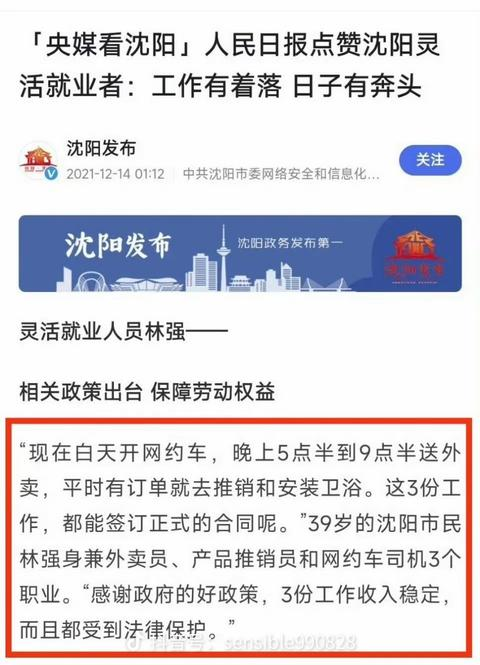

[toc]

# 问题

提问者：**<a href="https://www.zhihu.com/people/xi-xi-98-83-66">Miaomiaomiao</a>**
提问时间: 2025-11-17 13:58:10
总回答数: 0
总访问量: 0

有人可以讲讲逆全球化的原因吗？

# 回答

回答者： **<a href="https://www.zhihu.com/people/qia-luo-su-yu-tuo-fei-lun">卡罗素与陀飞轮</a>**
回答时间: 2026-8-1 9:16:26
点赞总数: 1821
评论总数: 171
收藏总数: 225
喜欢总数：53

30年前的西方：跟他们做生意，收少一点关税，让他们赚到钱，这样等他们的人民赚到钱，我们就有了13亿人的市场喇，我真是个天才棒棒哒！

30年后的西方：什么叫他们每天干14个小时还只能拿600美金？什么叫他们1/4的工资被收走用来给上一辈养老？什么叫每个月70%的工资用来还房贷，要三十年？什么叫他们剩下的还要存起来？？？？

拉倒吧拉倒吧，这鬼市场谁要开拓啊，谁爱去谁去，我还是收点税来得实在啊。

  

原文地址：[(卡罗素与陀飞轮)有人可以讲讲逆全球化的原因吗？](https://www.zhihu.com/question/1973751762981778818/answer/2066814544547156467) 

# 评论

1. <a href="https://www.zhihu.com/people/mu-mu-19-88">木木</a> (<small title="江苏">2026-8-2 8:36:45</small>): 关键是老外认为，如果再继续纵容他们，会增加这个国家的人民改变自己命运的难度［酷］
   - <a href="https://www.zhihu.com/people/65-71-97-80">爱祖国爱华为</a> (<small title="山东">2026-8-2 14:14:28</small>): 是的
   - <a href="https://www.zhihu.com/people/38-27-29-16">二十八鱼</a> (<small title="山东">2026-8-3 2:9:9</small>): 抛开关键不谈，难道老外就没有责任吗？
   - <a href="https://www.zhihu.com/people/hui-long-jue-46">回笼觉</a> (<small title="福建">2026-8-3 9:0:21</small>): 老外知道他们自己这样认为吗
   - <a href="https://www.zhihu.com/people/101hzh">101hzh</a> (<small title="浙江">2026-8-3 9:21:4</small>): 会反过来破坏他们本国的社会生态
   - <a href="https://www.zhihu.com/people/wang-hong-yi-85">momo</a> (<small title="回复于 2026-8-3 9:24:31/江苏"> ✉️:回笼觉</small>): 这个就是美帝国主义核心价值观，对外输出这个价值观的行为被称为“和平演变”或“颜色革命”。
   - <a href="https://www.zhihu.com/people/heng-xing-wu-ji-99">横行无忌</a> (<small title="回复于 2026-8-3 9:37:12/江苏"> ✉️:二十八鱼</small>): 有责任 ［大哭］ 真的有责任
   - <a href="https://www.zhihu.com/people/hu-li-74-91">干锅牛蛙</a> (<small title="回复于 2026-8-3 9:47:44/湖南"> ✉️:momo</small>): 合法的叫革命，非法的叫颜色革命叛乱
   - <a href="https://www.zhihu.com/people/liu-chen-73-85-39">青梅煮酒</a> (<small title="回复于 2026-8-3 9:48:49/内蒙古"> ✉️:二十八鱼</small>): 克林顿确实有责任，他把东大放进wto的
   - <a href="https://www.zhihu.com/people/san-san-de-lan">散散的懒</a> (<small title="广东">2026-8-3 10:10:24</small>): 老外：特么我想着培养市场的，结果变资敌了，我嘞个大豆［捂脸］
   - <a href="https://www.zhihu.com/people/hank-do">HANK DO</a> (<small title="回复于 2026-8-3 10:22:39/北京"> ✉️:回笼觉</small>): 从基辛格的书里来看，老外真的这样认为的，他们真的是救世主的价值观，平时我们说骗骗哥们就算了，哥们一笑了之，但是基辛格基佬是真把自己也说的信了
   - <a href="https://www.zhihu.com/people/li-jiao-han-19">李郊寒寒寒</a> (<small title="回复于 2026-8-3 10:24:9/北京"> ✉️:回笼觉</small>): 确实你们妈祖人改变自己命运的行动力属实全国第一。
   - <a href="https://www.zhihu.com/people/38-27-29-16">二十八鱼</a> (<small title="回复于 2026-8-3 10:31:18/山东"> ✉️:青梅煮酒</small>): 咱们自己应该向着自己，老外的责任应该是，“老外们自己得了社会病却想让老中吃药”。
   - <a href="https://www.zhihu.com/people/li-gao-qin">烦烦烦</a> (<small title="回复于 2026-8-3 10:37:52/云南"> ✉️:回笼觉</small>): 老外要不这样认为，白左怎么来的？信宗教的有些人真有当救世主的心
2. <a href="https://www.zhihu.com/people/47-15-79-81">心如止水</a> (<small title="河南">2026-8-1 18:21:19</small>): 这是一片什么样的土地
   - <a href="https://www.zhihu.com/people/ke-e-18-57">kimochiii</a> (<small title="湖南">2026-8-2 8:6:57</small>): 在给普丁20年，还你一个强大的俄罗斯
   - <a href="https://www.zhihu.com/people/eyezk1">知乎用户eyEZK1</a> (<small title="山西">2026-8-2 18:44:50</small>): 点睛之笔：河南
   - <a href="https://www.zhihu.com/people/huang-peng-fei-48">切莫人肉</a> (<small title="回复于 2026-8-2 19:9:3/陕西"> ✉️:知乎用户eyEZK1</small>): 二哥别笑大哥［捂脸］
   - <a href="https://www.zhihu.com/people/xuan-yuan-gou-dan-15-54">轩辕狗蛋</a> (<small title="广东">2026-8-2 20:16:53</small>): 这是一片“只要你能吃苦，那就有吃不完的苦”的土地
   - <a href="https://www.zhihu.com/people/38-73-80-9-78">站住</a> (<small title="回复于 2026-8-2 23:47:50/浙江"> ✉️:知乎用户eyEZK1</small>): 这么近那么美？
   - <a href="https://www.zhihu.com/people/cuxhu4">知乎用户CuxhU4</a> (<small title="山东">2026-8-3 8:39:25</small>): 种啥都长不出来的地
   - <a href="https://www.zhihu.com/people/xu-yi-hai-17">做个差生好难</a> (<small title="浙江">2026-8-3 8:52:15</small>): 自己心里没点数么，还问［飙泪笑］
3. <a href="https://www.zhihu.com/people/1899123">知乎拥户</a> (<small title="广东">2026-8-1 20:41:35</small>): 工厂可以几个月不发工资，还能运转下去，老外怕是没这等能力［doge］
   - <a href="https://www.zhihu.com/people/guo-hui-feng-51">登楼看山</a> (<small title="江西">2026-8-2 15:52:18</small>): 几个月？看不起谁呢，很多地方高铁通车都好几年了，修高铁工地的工资到现在还没结清呢。那些什么叫什么 中建XX局的 国企央企，被起诉到法院的案件用万来做单位，不怕你起诉，就是不给钱，爱咋告咋告
   - <a href="https://www.zhihu.com/people/54005200">呆呆和如如</a> (<small title="广东">2026-8-2 20:0:12</small>): 几个月？我有个同事，她老公接了个二包的ZF园林项目，几十万欠了几年，一年还个几万块钱。。。还有一半没结清，能咋办。
   - <a href="https://www.zhihu.com/people/phoukn">追逐中国梦</a> (<small title="广东">2026-8-2 20:36:9</small>): 工厂算好的了，有些十几二十个月不发工资，不能叫工资，毕竟才1200块一个月只能算补贴。
   - <a href="https://www.zhihu.com/people/88-33-66-18-76">无需</a> (<small title="浙江">2026-8-2 23:22:18</small>): 之前不是有个地方gov没有给工程款被人告了，地方gov还败诉成老赖了吗？
   - <a href="https://www.zhihu.com/people/yuan-he-feng-yu-luan-ren-jian">十五载天子</a> (<small title="安徽">2026-8-3 7:56:30</small>): 几个月，我们12个月没发工资［打招呼］现在离职两个月了还没发，就这还有人没跑呢
   - <a href="https://www.zhihu.com/people/feng-ming-44">每日随机夸十人</a> (<small title="回复于 2026-8-3 8:36:25/重庆"> ✉️:呆呆和如如</small>): 一年还个几万块都算不错的了，现实是钱也不给你，还要继续让你垫资干，不干那以前的也一笔勾销。
   - <a href="https://www.zhihu.com/people/xiao-an-10">水溅跃</a> (<small title="回复于 2026-8-3 9:47:45/云南"> ✉️:呆呆和如如</small>): 那算好的，我们这有个老板，两三年了也是没结到款，一分都没有，开会的时候抱怨了几句，主会的领导觉得不给自己面子，不断给穿小鞋，还将老板的企业打成反面典型，要彻底严查［捂脸］。甚至这位主会的领导都不是结款的负责人
   - <a href="https://www.zhihu.com/people/54005200">呆呆和如如</a> (<small title="回复于 2026-8-3 10:32:39/广东"> ✉️:每日随机夸十人</small>): 你这个太黑了吧，哈哈
4. <a href="https://www.zhihu.com/people/ying-nian-zao-shui-27">英年早睡</a> (<small title="广东">2026-8-1 20:32:51</small>): 中国人能飞［赞］
   - <a href="https://www.zhihu.com/people/lalala-99-57">lalala</a> (<small title="四川">2026-8-3 0:54:37</small>): ［捂脸］这个歌好讽刺的感觉。最近传了一些炒股的空中飞人视频。太吓人
   - <a href="https://www.zhihu.com/people/wang-hong-yi-85">momo</a> (<small title="江苏">2026-8-3 9:27:41</small>): 因为顺，所以飞
5. <a href="https://www.zhihu.com/people/chen-xi-72-9-53">陈陈陈</a> (<small title="湖北">2026-8-1 20:36:26</small>): 600美金？太高了吧［为难］
   - <a href="https://www.zhihu.com/people/yang-huo-guo-42">自由自在</a> (<small title="湖南">2026-8-1 20:47:29</small>): 600美金=4200，90%的城市是达不到的
   - <a href="https://www.zhihu.com/people/da-qin-34-39">达亲</a> (<small title="回复于 2026-8-1 23:53:10/广西"> ✉️:自由自在</small>): 90？［为难］99？
   - <a href="https://www.zhihu.com/people/an-ye-sui-feng-94">暗夜随风</a> (<small title="广东">2026-8-2 14:2:30</small>): 从欧美的视角看是合适的，毕竟他们缺乏想象力，他们眼里一对夫妻住单间就已经是居住环境恶劣了。所以以为只有600美元也不奇怪
   - <a href="https://www.zhihu.com/people/kkkkke-jiang">眉上风芷</a> (<small title="回复于 2026-8-2 16:23:5/江苏"> ✉️:自由自在</small>): 如果按底薪2400，工厂普工每天干10h（其实是12h，吃饭时间各1h要扣除），上六休一的话工资有4200，去掉五险到手3700
   - <a href="https://www.zhihu.com/people/li-su-zhou-72">灵活用户</a> (<small title="河南">2026-8-2 16:47:15</small>): 我只有500美刀。12小时站班［捂脸］
   - <a href="https://www.zhihu.com/people/de-guo-di-liu-zhuang-jia-ji-tuan-jun">德国第六装甲集团军</a> (<small title="回复于 2026-8-2 21:37:7/广东"> ✉️:灵活用户</small>): 这么幸福的［为难］［为难］［为难］
   - <a href="https://www.zhihu.com/people/li-su-zhou-72">灵活用户</a> (<small title="回复于 2026-8-2 22:17:22/河南"> ✉️:德国第六装甲集团军</small>): 你来吧，正缺人，＄大家分［大笑］
   - <a href="https://www.zhihu.com/people/zhan-dou-de-wu-shen-lun-zhe">战斗的无神论者</a> (<small title="山东">2026-8-3 6:57:31</small>): 600美金是加班后。
   - <a href="https://www.zhihu.com/people/chen-xi-72-9-53">陈陈陈</a> (<small title="回复于 2026-8-3 9:58:46/湖北"> ✉️:战斗的无神论者</small>): 基础工资200刀，加班工资400刀，富士康法则［飙泪笑］
6. <a href="https://www.zhihu.com/people/bu-zhi-xi-75">普林斯爱德华</a> (<small title="美国">2026-8-1 20:43:41</small>): 以前总说中国是世界第二大市场。。。
   - <a href="https://www.zhihu.com/people/68-34-12-83">苒物华休</a> (<small title="安徽">2026-8-3 8:36:30</small>): 生产市场，人家又没说自己是消费方市场
   - <a href="https://www.zhihu.com/people/bei-chi-chi-dao-ni-guang-er-xing-98">背离赤道 逆光而行</a> (<small title="回复于 2026-8-3 10:6:42/湖南"> ✉️:苒物华休</small>): 市场？工厂！
   - <a href="https://www.zhihu.com/people/li-gao-qin">烦烦烦</a> (<small title="云南">2026-8-3 10:39:43</small>): 人多凑的，这么多人总能凑出点东西吧［捂脸］
7. <a href="https://www.zhihu.com/people/yan-wu-28-82">大乘赢学</a> (<small title="北京">2026-8-2 8:54:25</small>): 600 美金？你知道月入 3000 已经属于中等收入了么［白眼］
   - <a href="https://www.zhihu.com/people/lestat773">Sisyphus</a> (<small title="山东">2026-8-3 8:48:55</small>): 9.67亿人口月收入2000以下
8. <a href="https://www.zhihu.com/people/lin-zhi-peng-17">林志鹏</a> (<small title="上海">2026-8-2 15:31:27</small>): 我劝这些西方人，料敌还得从宽啊，你不能把对面都想象成和自己差不多
9. <a href="https://www.zhihu.com/people/2-18-14-78-43">阿波吃得</a> (<small title="四川">2026-8-2 21:30:1</small>): 即便假设全世界不加你的关税。  
 
自家人疯狂卷，低福利，低工资  
 
倾销别个国家  
 
你把别人家的商品冲夸了，  
 
而你自家人买不起进口的，只能买自产的。  
 
然后随着时间推移。  
 
他国失业暴涨，然后买不起你的东西。  
 
全世界都得完蛋［大笑］［大笑］［大笑］
   - <a href="https://www.zhihu.com/people/trunks-czlx">TRUNKS CZLX</a> (<small title="广东">2026-8-3 9:24:48</small>): 解放全人类补完计划
   - <a href="https://www.zhihu.com/people/a-ha-ha-55-53-33">何须许以卑微</a> (<small title="山东">2026-8-3 9:40:27</small>): 这就是人家加关税的原因
   - <a href="https://www.zhihu.com/people/shi-jian-chang-he-2">知乎用户MRzb7</a> (<small title="重庆">2026-8-3 9:44:6</small>): 英国在上个世纪踩过的坑，他们还要踩一遍
   - <a href="https://www.zhihu.com/people/li-gao-qin">烦烦烦</a> (<small title="回复于 2026-8-3 10:43:40/云南"> ✉️:知乎用户MRzb7</small>): 100年前福特都知道让自己的工人买得起自己生产的汽车才能持续，他们不信，就喜欢特立独行［飙泪笑］
10. <a href="https://www.zhihu.com/people/yu-cheng-wei-69-76">余大</a> (<small title="浙江">2026-8-1 9:30:9</small>): 感觉不如一天打三份工［感谢］
    - <a href="https://www.zhihu.com/people/wei-si-11-39">微思</a> (<small title="广东">2026-8-1 16:6:11</small>): 确实不如，三份工加起来也未必超过8小时。何况，“一天三份工”多是属盘子工，更多的是非盘子工，那就是三四份工的多是不在同一天的。
    - <a href="https://www.zhihu.com/people/fu-she-xing-bai-mo-han-mian-bao">辐射性百万憨面包</a> (<small title="重庆">2026-8-1 18:11:12</small>): 詹姆斯母亲一天打三份工，还有时间去看儿子打比赛。  
 
詹姆斯描述自己以前穷，说的是他在高一才知道储藏室，也就是家里可以有一间专门用来存放食物。
 
他们母子甚至不会从自来水里喝大分［飙泪笑］
    - <a href="https://www.zhihu.com/people/mi-feng-91-99">蜜蜂</a> (<small title="上海">2026-8-1 18:18:36</small>): 我也想打三份工，但是老板不用，因为法律支持他白嫖
    - <a href="https://www.zhihu.com/people/j-d-77">回旋镖队长</a> (<small title="重庆">2026-8-1 19:6:15</small>): 三份工39小时我们一份49小时，赢［惊喜］
    - **卡罗素与陀飞轮** (<small title="广东">2026-8-1 20:10:6</small>): 你也是打三份，不过老板是一个，工资是一份而已
    - <a href="https://www.zhihu.com/people/xcdh-6">XCDH</a> (<small title="江苏">2026-8-1 20:11:52</small>): 确实，以老中这人口密度别说一天打三份工了就是一天打十份工都来得及［飙泪笑］（可惜连打工的机会都不太足哦）
    - <a href="https://www.zhihu.com/people/shi-yu-11-64">摸石头过河</a> (<small title="广东">2026-8-1 20:15:40</small>): 发达国家打三份工被斩杀，发展中国家五天八小时生活轻松，赢麻了
    - <a href="https://www.zhihu.com/people/liu-qi-17-5">LQ.matrices</a> (<small title="北京">2026-8-1 21:54:34</small>): 你是不是以为打一份工是工作8h,打3份工就要工作24h了？
    - <a href="https://www.zhihu.com/people/Wheel-of-Fate">新·命运之轮</a> (<small title="广东">2026-8-1 22:9:7</small>): 如果美国人真的打三份工的话，你现在应该会在网上看到铺天盖地的美国人猝死的新闻，比国内劳工猝死的新闻只多不少，你不会觉得美国人人均美队体质，一天干20小时工作喊两句累就完了吧 ［尴尬］
    - <a href="https://www.zhihu.com/people/you-hua-87-8">优华</a> (<small title="天津">2026-8-2 0:15:49</small>): 中国人每天可不止打三份工，你还说少了呢
    - <a href="https://www.zhihu.com/people/he-he-he-lian-bo-bo">赫赫赫连勃勃</a> (<small title="广东">2026-8-2 7:52:19</small>): 收到组织指示，已严肃恨美［害羞］
    - <a href="https://www.zhihu.com/people/a-ha-12-94-37">啊哈</a> (<small title="安徽">2026-8-2 8:8:33</small>): 那个说自己每天三份工的女孩，人家用的是新款苹果和苹果表，住的独栋还有泳池，家里还养了猫，每年都去欧洲旅行两次，还会去看霉霉的演唱会。  
 
  
 
完事说自己要打三份工才能活下来，我说白了这个生活质量，你打五份工我都觉少了😅
    - <a href="https://www.zhihu.com/people/li-ji-xuan-85">逆转监督小浣熊</a> (<small title="回复于 2026-8-2 10:9:4/安徽"> ✉️:辐射性百万憨面包</small>): 詹姆斯小时候家里穷，只能吃猪肉［生气］
    - <a href="https://www.zhihu.com/people/kkkkke-jiang">眉上风芷</a> (<small title="回复于 2026-8-2 16:26:57/江苏"> ✉️:辐射性百万憨面包</small>): 以前在阿b看到一个采访，讲一个美国单身母亲养三孩子，住乡下别墅开个破车，也哭诉自己要打三份工养孩子，没时间给孩子做饭只能吃工业垃圾食品，评论区一堆太惨了，感觉不如他们家小县城，额……
    - <a href="https://www.zhihu.com/people/wang-an-61-19">王安</a> (<small title="江苏">2026-8-2 19:13:47</small>): 打两份工就会脑子受损了，8小时工作
    - <a href="https://www.zhihu.com/people/lan-de-li-15">励精图治朱由检</a> (<small title="山东">2026-8-2 20:19:8</small>): 肯定不如东大三份正式工作有保障［惊喜］ 
    - <a href="https://www.zhihu.com/people/001-65-33-88">冬日里的猫</a> (<small title="广东">2026-8-2 22:17:24</small>): 一天工作24小时，哪里有一份工11小时那么从从容容。
    - <a href="https://www.zhihu.com/people/88-33-66-18-76">无需</a> (<small title="浙江">2026-8-2 23:26:55</small>): 美国现在的那些黑人顶级球星，有很大比例幼年的时候家庭是困难的  
 
  
 
你现在基于这个去推理，他们的父母在“贫困”的前提下，能培养出一个个顶天的巨星，你不会以为小时候吃窝窝头，吃你认知中的垃圾食物能有这个身体素质供他们球场挥霍吧？你不会不知道我们这边贫困的家庭小孩长啥样吧？  
 
那好了，你认知中的贫困和他们实际的生活有了巨大的偏差，哪方面出的问题？
    - <a href="https://www.zhihu.com/people/rdjzue">知乎用户RDjZue</a> (<small title="回复于 2026-8-3 1:55:18/山东"> ✉️:辐射性百万憨面包</small>): 还养着另一位探花
    - <a href="https://www.zhihu.com/people/yan-yu-52-19">盐鱼</a> (<small title="回复于 2026-8-3 2:25:38/山东"> ✉️:辐射性百万憨面包</small>): 就那么个身高体重，青春期铁定没挨饿，这是肯定的
    - <a href="https://www.zhihu.com/people/zheng-wen-long-89">郑文龙</a> (<small title="回复于 2026-8-3 8:58:26/吉林"> ✉️:逆转监督小浣熊</small>): 和带骨头的牛肉。
    - <a href="https://www.zhihu.com/people/xwx-38-87">xwx</a> (<small title="江苏">2026-8-3 9:2:22</small>): 你以为国内就没有啦，国内多了去了
    - <a href="https://www.zhihu.com/people/91-43-25-19-86">穆风</a> (<small title="浙江">2026-8-3 9:52:48</small>): 人家的三份工，也就去修个空调，送个外卖，就叫两份工了，还有就是你可以不去。
    - <a href="https://www.zhihu.com/people/91-43-25-19-86">穆风</a> (<small title="回复于 2026-8-3 9:54:8/浙江"> ✉️:无需</small>): 美国有贫困县的，人口的百分之20都是贫困人口。
    - <a href="https://www.zhihu.com/people/jian-jian-44-61-5">苍越孤鸣</a> (<small title="回复于 2026-8-3 9:59:11/上海"> ✉️:穆风</small>): 2026 年美国本土 48 州联邦贫困标准（年收入）Federal Re...：单人：15960 美元 / 年（月均 1330 美元）四口之家：33000 美元 / 年（月均 2750 美元）
    - <a href="https://www.zhihu.com/people/91-43-25-19-86">穆风</a> (<small title="回复于 2026-8-3 10:22:55/浙江"> ✉️:苍越孤鸣</small>): 脱贫攻坚之前，10年收入2000以内是贫困人口，20年是年收入4000以内是贫困人口，现在没有数据了，因为我们没有贫困人口；了。
    - <a href="https://www.zhihu.com/people/li-jiao-han-19">李郊寒寒寒</a> (<small title="回复于 2026-8-3 10:27:44/北京"> ✉️:辐射性百万憨面包</small>): 最搞笑的是他头像就是“喝水啊”
    - <a href="https://www.zhihu.com/people/jian-jian-44-61-5">苍越孤鸣</a> (<small title="回复于 2026-8-3 10:27:51/上海"> ✉️:穆风</small>): 因为现在“贫困人口”这四个字没有了，改叫三类低收入监测对象，你当然搜索不到贫困人口
    - <a href="https://www.zhihu.com/people/li-gao-qin">烦烦烦</a> (<small title="云南">2026-8-3 10:45:53</small>): 你能打三份吗［飙泪笑］
11. <a href="https://www.zhihu.com/people/hoilh">momo</a> (<small title="天津">2026-8-3 8:45:42</small>): 还有最关键的，你投资给的是绿纸，你赚到的却是红纸，在岸红纸和离岸红纸还是两套体系，彼此不互通，不论在岸红纸还是离岸红纸换成绿纸还有限额，红纸他还玩命印［飙泪笑］［飙泪笑］［飙泪笑］
12. <a href="https://www.zhihu.com/people/wang-hao-46-25-42">风铭</a> (<small title="河南">2026-8-1 23:26:41</small>): 20年前，中国普通人消费远比现在少，工资比现在低，也不妨碍西方继续推广全球化，因为全球化对于西方最有利，西方在这个过程中赚到了最多的钱。当下中国的市场和消费远比20年前旺盛，可见消费和市场根本就不是西方搞逆全球化的根本原因。
 
至于西方搞逆全球化很简单，因为原先归西方赚的钱，现在大量都归中国赚了。这是一个很简单的利益问题，有利就支持，有害就反对。只能说，有些人是真可怜，连最基本的逻辑和客观现实都搞不清楚。
    - <a href="https://www.zhihu.com/people/qian-zhen-di-chang-1">浅斟低唱</a> (<small title="上海">2026-8-2 0:59:41</small>): 山河四省的含金量。  
 
打工圣地。
    - <a href="https://www.zhihu.com/people/li-min-qian-25">李 闵谦</a> (<small title="广东">2026-8-2 2:6:57</small>): 虽然以前消费少，但是设备机器市场大啊，工厂不是石头蹦出来的，建设也是需要机器的。所以西方一边赚机器钱一边等消费市场发育。就算西方赚的机器钱现在大量归中国赚了但现实是产能过剩了不是大头的钱了。这才是基本逻辑和客观事实
    - <a href="https://www.zhihu.com/people/li-min-qian-25">李 闵谦</a> (<small title="广东">2026-8-2 2:7:29</small>): 而且大量赚了怎么荷兰银行连取款都困难了，这赚在哪里？
    - <a href="https://www.zhihu.com/people/long-qiang-62">慕色星空</a> (<small title="上海">2026-8-2 9:31:21</small>): 说西方逆全球化就很好笑，只是不带你玩了而已。
    - <a href="https://www.zhihu.com/people/yan-wu-28-82">大乘赢学</a> (<small title="北京">2026-8-2 13:47:45</small>): 并没有逆全球化，美加澳协定、欧盟内部零关税、CPTPP…这些不还是全球化的证明么？不带你玩就给人家扣个逆全球化的帽子？
    - <a href="https://www.zhihu.com/people/zhiiawrfvu7">zhiIAwrfvu7</a> (<small title="回复于 2026-8-2 14:26:20/广东"> ✉️:慕色星空</small>): 没错
    - <a href="https://www.zhihu.com/people/bu-xie-ing">不屑ing</a> (<small title="上海">2026-8-2 15:31:12</small>): 独立思考，明辨是非
    - <a href="https://www.zhihu.com/people/mike-58-83">约克小夏</a> (<small title="吉林">2026-8-2 15:58:58</small>): 同意最后一句
    - <a href="https://www.zhihu.com/people/cnysteen">Cosmos</a> (<small title="回复于 2026-8-2 16:51:12/天津"> ✉️:大乘赢学</small>): 搞小圈子就是全球化了？
    - <a href="https://www.zhihu.com/people/yan-wu-28-82">大乘赢学</a> (<small title="回复于 2026-8-2 16:54:28/北京"> ✉️:Cosmos</small>): 为啥要搞小圈子？［思考］小圈子连在一起不就是大圈子了么？
    - <a href="https://www.zhihu.com/people/e-e-e-e-85-70-89">争斤论两</a> (<small title="回复于 2026-8-2 17:34:36/山西"> ✉️:Cosmos</small>): 搞小圈子不是全球化，但是逐步脱离一个国家那还是全球化，主要这个国家还很乐意
    - <a href="https://www.zhihu.com/people/huang-tao-83-32">黄桃</a> (<small title="回复于 2026-8-2 21:39:42/四川"> ✉️:浅斟低唱</small>): 配得上吃的苦
    - <a href="https://www.zhihu.com/people/ruo-de-dian-zhong-dian">若的典中典</a> (<small title="河南">2026-8-2 21:41:29</small>): 逆全球化？还是只把我们排除在外的全球化？
    - <a href="https://www.zhihu.com/people/bin-wei-shuang-3">鬓微霜</a> (<small title="回复于 2026-8-2 23:22:29/重庆"> ✉️:Cosmos</small>): 小圈子？以为美国为中心的贸易是大圈子。
    - <a href="https://www.zhihu.com/people/liu-biao-68-9">Nothing</a> (<small title="广西">2026-8-3 0:26:4</small>): 区人大是谁都不清楚，但是我知道美国一草一木欧洲一草一木所有事情［飙泪笑］
    - <a href="https://www.zhihu.com/people/meng-po-lai-wan-tang-38">西拉</a> (<small title="云南">2026-8-3 2:5:16</small>): 总说河北低价倾销，河南也一点都不差，躲在河北背后让人忽视，你两兄弟倾销其他省份，要不是省份之间不加税，你看棍子打自己身上叫不叫
    - <a href="https://www.zhihu.com/people/68-34-12-83">苒物华休</a> (<small title="回复于 2026-8-3 8:41:20/安徽"> ✉️:李 闵谦</small>): 冷知识，荷兰村镇银行吸收的已经大都不是荷兰本地商人的，当时的最低购入门槛好像还不低
13. <a href="https://www.zhihu.com/people/feng-ming-44">每日随机夸十人</a> (<small title="重庆">2026-8-3 8:35:1</small>): 一百多年过去了，西方人还是没学会二鸦的教训，当年强行开了通关，后来怎么样？
14. <a href="https://www.zhihu.com/people/xi-xue-luo-chun-22">John</a> (<small title="上海">2026-8-2 19:18:49</small>): 太温柔辣，还假定我们每天有8小时睡眠和各一小时的午餐晚餐
15. <a href="https://www.zhihu.com/people/yin-ya-79">殷哑</a> (<small title="天津">2026-8-2 22:21:35</small>): 以前：中国是个拥有14亿消费潜力的大国。现在：［大笑］
16. <a href="https://www.zhihu.com/people/bu-wang-chu-xin-97-77-74">不忘初心</a> (<small title="山东">2026-8-2 8:4:0</small>): 退休金一万我看着真眼馋
17. <a href="https://www.zhihu.com/people/77-55-95-31">七点多发的</a> (<small title="广东">2026-8-1 11:42:43</small>): 倒因为果
    - <a href="https://www.zhihu.com/people/zhuqi-24-40">Zhuqi</a> (<small title="沙特阿拉伯">2026-8-1 20:14:47</small>): 主要原因还是咱妈对我们太好了［酷］［酷］
18. <a href="https://www.zhihu.com/people/yzf-96">马牌甲客</a> (<small title="广东">2026-8-1 9:29:53</small>): BBC，CNN就这样报道的。  
 
这不来一趟中国就都明白了
19. <a href="https://www.zhihu.com/people/mei-tian-du-you-xin-gu-shi">每天都有新故事</a> (<small title="湖北">2026-8-3 10:32:38</small>): 西方左派总是对苏系抱有一种不切实际的幻想［滑稽］
20. <a href="https://www.zhihu.com/people/di-qia-er-si-bin-ge-le">笛卡尔斯宾格勒</a> (<small title="内蒙古">2026-8-2 15:48:4</small>): 东大生产国的地位，让欧美等消费国瑟瑟发抖。
21. <a href="https://www.zhihu.com/people/rdjzue">知乎用户RDjZue</a> (<small title="山东">2026-8-3 1:56:17</small>): 有些人是不是傻，打三份工是为了不给联邦政府交税。你一万工资五险一金扣一半。人有不傻的。
22. <a href="https://www.zhihu.com/people/yan-shu-77-7">妍姝</a> (<small title="河南">2026-8-3 8:59:41</small>): 收点税来得实在
23. <a href="https://www.zhihu.com/people/huang-tao-83-32">黄桃</a> (<small title="四川">2026-8-2 21:38:47</small>): 只被骗一回
24. <a href="https://www.zhihu.com/people/lin-ke-29-7">油弹钢铝</a> (<small title="四川">2026-8-3 9:37:26</small>): 当年贸易顺差最终导致了一鸦的爆发［机智］
25. <a href="https://www.zhihu.com/people/lyv819">知乎知否</a> (<small title="山东">2026-8-3 9:24:29</small>): 对外招商引资，必喊 我们有全球最大的消费市场
26. <a href="https://www.zhihu.com/people/31-62-42-20-6">该用户很懒</a> (<small title="江西">2026-8-3 9:13:50</small>): 主要是别人几十年前经济大萧条时期怕是都没这样，只能说哦没过过这种日子老美实在想不到啊
27. <a href="https://www.zhihu.com/people/si-zhai-84">死宅</a> (<small title="北京">2026-8-3 9:21:56</small>): 他们特别自豪，40年劳动成本没有上升，可以接着奏乐接着舞，换人话：40年普通人基本没享受到发展红利（我说的是美国）。
28. <a href="https://www.zhihu.com/people/xia-tian-38-9">秋雪</a> (<small title="贵州">2026-8-3 3:28:15</small>): 英国两百年前相信的事美国又做了一遍，不愧是一脉相承
29. <a href="https://www.zhihu.com/people/65-82-94-24-33">邪不胜正</a> (<small title="北京">2026-8-2 22:46:14</small>): 道理我都懂就是不明白欧洲为什么不买空调［可怜］
    - <a href="https://www.zhihu.com/people/yang-yang-77-29-53">杨洋</a> (<small title="重庆">2026-8-2 23:29:9</small>): 围魏救赵？
    - <a href="https://www.zhihu.com/people/momo-66-60-51">momo</a> (<small title="沙特阿拉伯">2026-8-2 23:36:16</small>): 青岛某大学热死的门卫：我也想知道啊
    - <a href="https://www.zhihu.com/people/65-82-94-24-33">邪不胜正</a> (<small title="回复于 2026-8-2 23:47:1/北京"> ✉️:momo</small>): 那肯定是穷，欧洲也穷［好奇］
    - <a href="https://www.zhihu.com/people/65-82-94-24-33">邪不胜正</a> (<small title="回复于 2026-8-2 23:47:36/北京"> ✉️:杨洋</small>): 600美元的能买得起空调，这3000美元的买不起［好奇］
    - <a href="https://www.zhihu.com/people/momo-66-60-51">momo</a> (<small title="回复于 2026-8-3 0:6:12/沙特阿拉伯"> ✉️:邪不胜正</small>): ［惊喜］不然呢，不然新闻怎么天天欧美水深火热，真不人道啊
    - <a href="https://www.zhihu.com/people/65-82-94-24-33">邪不胜正</a> (<small title="回复于 2026-8-3 0:17:40/北京"> ✉️:momo</small>): 可欧美人均工资不是3000，这个回答不也是说中国穷，一月才600。那为什么600的能买空调，3000买不起
    - **卡罗素与陀飞轮** (<small title="广东">2026-8-3 9:39:9</small>): 欧洲空调也不贵，就是安装费高，还得专业人士，因为人家工人有力量［惊喜］
    - <a href="https://www.zhihu.com/people/65-82-94-24-33">邪不胜正</a> (<small title="回复于 2026-8-3 10:19:6/北京"> ✉️:卡罗素与陀飞轮</small>): 人家工人买不起空调
30. <a href="https://www.zhihu.com/people/huo-li-fei-er-de">获利非尔得</a> (<small title="重庆">2026-8-3 8:57:58</small>): 什么600美金？夸大其词。500美金，不要写多了。
31. <a href="https://www.zhihu.com/people/25-85-7-70">霸爷</a> (<small title="浙江">2026-8-3 8:46:22</small>): 廉价劳动力实则就是勒紧裤腰带真金白银补贴外国人，多么可笑的逻辑，就为了那点外汇和税。
    - **卡罗素与陀飞轮** (<small title="广东">2026-8-3 9:35:42</small>): 人民币出不去，外汇就方便多了
32. <a href="https://www.zhihu.com/people/92121">龚大喇叭</a> (<small title="广东">2026-8-2 17:24:34</small>): 400 美金吧
33. <a href="https://www.zhihu.com/people/yang-18-55-26">yang</a> (<small title="北京">2026-8-3 9:36:53</small>): 而且，他们连工资都敢不发
34. <a href="https://www.zhihu.com/people/dong-dong-92-90-91">基本盘</a> (<small title="广东">2026-8-2 9:11:29</small>): 骗你的，只有400美金
35. <a href="https://www.zhihu.com/people/tian-ge-deng">pilipili</a> (<small title="广东">2026-8-3 9:13:4</small>): 不止是挣不到钱，自己的行业要被中国吃干净了，有的行业确实是中国强，更多的是打不过中国的低工资优势行业
36. <a href="https://www.zhihu.com/people/51-8-53-57">路人甲而已</a> (<small title="广东">2026-8-2 17:29:13</small>): 讲的太好了
37. <a href="https://www.zhihu.com/people/cnysteen">Cosmos</a> (<small title="天津">2026-8-2 16:48:29</small>): 4000元你知道购买力什么样么［尴尬］
38. <a href="https://www.zhihu.com/people/65-82-94-24-33">邪不胜正</a> (<small title="北京">2026-8-2 22:40:16</small>): 那美国学贷呢［好奇］
    - **卡罗素与陀飞轮** (<small title="广东">2026-8-3 9:40:18</small>): 德国还免费读大学呢
39. <a href="https://www.zhihu.com/people/chen-xi-ke-56">陈稀客</a> (<small title="宁夏">2026-8-3 7:53:56</small>): 我也不满意现状，但又无能为力。我还是要说，其实他们没有那么善，当年刚修订劳动合同法的时候，就是那些欧美日韩欧洲的外资叫的最欢，最后没办法，又修改了好几版，最后修改的面目全非，等真正实行之后，先裁员的也是日韩企业，然后国内的那些企业，包括央视，华为就开始骚操作了，裁员呀，买断工龄呀什么的。
    - <a href="https://www.zhihu.com/people/chen-xi-ke-56">陈稀客</a> (<small title="回复于 2026-8-3 10:31:45/宁夏"> ✉️:卡罗素与陀飞轮</small>): 我的意思是他们本质上还是想要当年我们的底价劳动红利人口的，所以推出保证劳工权益的法律时候他们知道用工要涨价了，所以他们也不愿意中国劳动人民拿高的收入。后面我们一步一步强了起来，虽然是摸着他们过河，但有些行业渐渐要革他们的命了，所以他们才着急了，又转口说我们对工人不好之类巴啦巴啦的，虽然这部分是事实，他们的出发点始终是卷不过我们，一码归一码。他们本质上不在乎中国人过什么样的日子，他们只想中国一直是那个全低端产业链国家，永远做个代工厂，只要不威胁他们的地位。话又说回来，提升劳工的工资和待遇之风确实是互联网通了，受教育人口多了，从那边吹过来的。所以真正提升自己待遇还是要靠我们自己，外面那些花花架子不堪一击，比亚迪那种环境，巴西不最后还是和解了，他们更想要就业，而且很大一部分是巴西政坛内斗。
    - **卡罗素与陀飞轮** (<small title="广东">2026-8-3 9:47:46</small>): 不能用道德去评价商业行为，他们仅仅是因为潜在市场做了风险投资然后失败了，他们本来想种韭菜然后割的，怎么知道长出了狗尾巴草。
40. <a href="https://www.zhihu.com/people/ju-kou-xi-lin">巨口细鳞</a> (<small title="河北">2026-8-2 18:54:54</small>): 恐怕是没想到中国只有一亿人
41. <a href="https://www.zhihu.com/people/si-zai-hui-yi-de-xing-fu">死在回忆的幸福</a> (<small title="安徽">2026-8-2 17:3:4</small>): 我们单位4月奖金还没发［捂嘴］［捂嘴］［捂嘴］
42. <a href="https://www.zhihu.com/people/JaminTin">科莫拉多</a> (<small title="浙江">2026-8-3 9:34:13</small>): 还有一点，他们赚的钱竟然是为了强大自己的武装，然后反对我们。我想除非是老美脑子坏了，咱们去哪个超市或者饭店被老板冷落了都不想再去，而美国对中国的贸易逆差上万亿。［捂脸］
43. <a href="https://www.zhihu.com/people/heng-bin-liu-xing-80">横滨流星</a> (<small title="陕西">2026-8-2 22:47:15</small>): 老外也怕有些人不正当竞争把国内企业搞崩溃
44. <a href="https://www.zhihu.com/people/diana-94-19">He He</a> (<small title="浙江">2026-8-2 15:26:22</small>): ［doge］600刀太多了，很多盘盘ip集中地大概400刀差不多了
45. <a href="https://www.zhihu.com/people/allsunday-99">ALLSUNDAY</a> (<small title="安徽">2026-8-1 9:36:29</small>): 西方好善良啊，感动得都要哭了［大哭］
    - <a href="https://www.zhihu.com/people/lxssg">lxssg</a> (<small title="福建">2026-8-1 11:15:33</small>): 感觉不如咱们人民企业家善良［尴尬］
    - <a href="https://www.zhihu.com/people/xia-ya-12-68">Casval</a> (<small title="上海">2026-8-1 13:22:17</small>): 不如宁德时代［酷］
    - <a href="https://www.zhihu.com/people/momo-17-85-8">momo</a> (<small title="湖南">2026-8-1 19:30:35</small>): 天下熙熙，皆为利来，他们是只是没想到，人和人对生活的定义截然不同。
 
有的人的生活，是可以没有生活的。
    - <a href="https://www.zhihu.com/people/zui-meng-sheng-41">可狱不可囚</a> (<small title="黑龙江">2026-8-1 21:46:5</small>): 不如比亚迪
    - <a href="https://www.zhihu.com/people/he-he-he-lian-bo-bo">赫赫赫连勃勃</a> (<small title="广东">2026-8-2 7:57:7</small>): 不如曹旺
    - <a href="https://www.zhihu.com/people/a-ha-12-94-37">啊哈</a> (<small title="安徽">2026-8-2 8:9:10</small>): 还是企业家善良，怕我们掉入西方的消费陷阱，所以特意少发点工资
    - <a href="https://www.zhihu.com/people/allsunday-99">ALLSUNDAY</a> (<small title="回复于 2026-8-2 12:32:0/安徽"> ✉️:啊哈</small>): 离萝莉岛还是有些差距的，人民企业家还要向文明靠拢啊
    - <a href="https://www.zhihu.com/people/allsunday-99">ALLSUNDAY</a> (<small title="回复于 2026-8-2 12:32:31/安徽"> ✉️:可狱不可囚</small>): 确实，必须向联合果品看齐
    - <a href="https://www.zhihu.com/people/qaq-85-14-71">小豆丁QAQ</a> (<small title="回复于 2026-8-2 13:49:52/陕西"> ✉️:ALLSUNDAY</small>): 永州乐乐案，卖毒品给未成年人，还有活活打死人  
 
  
 
更多的萝莉岛你不知道罢了
    - <a href="https://www.zhihu.com/people/allsunday-99">ALLSUNDAY</a> (<small title="回复于 2026-8-2 19:50:25/安徽"> ✉️:小豆丁QAQ</small>): 哦，我不知道的中国这么多，美国都养出来萝莉岛这样的蛊王了，是不是不知道的更多？
    - <a href="https://www.zhihu.com/people/qaq-85-14-71">小豆丁QAQ</a> (<small title="回复于 2026-8-2 20:11:27/陕西"> ✉️:ALLSUNDAY</small>): 不知道就多上网，谢谢
    - <a href="https://www.zhihu.com/people/qaq-85-14-71">小豆丁QAQ</a> (<small title="回复于 2026-8-2 20:12:27/陕西"> ✉️:ALLSUNDAY</small>): 安徽大逃荒的时候，我奶奶还给个安徽人半只老鼠呢
46. <a href="https://www.zhihu.com/people/s-abc123">momo</a> (<small title="河南">2026-8-2 19:21:47</small>): 真是不长教训，100年前为什么打鸦片战争不记得了？大清那么落后做生意都没赚到钱，现在更不可能让你赚到钱了［生气］
    - <a href="https://www.zhihu.com/people/livemore-45">全卡卡</a> (<small title="河南">2026-8-2 23:15:19</small>): 其实后边抢了点东西作为补偿了，还有赔了点银子。
47. <a href="https://www.zhihu.com/people/gui-mei-e-luo-si">鬼魅俄罗斯</a> (<small title="上海">2026-8-2 15:34:10</small>): 这片土地上，未成年人都可以每天15个小时，一周6天（晚自习），白皮怎么可能比得上［生气］

=[评论](./attachments/comments.json)

