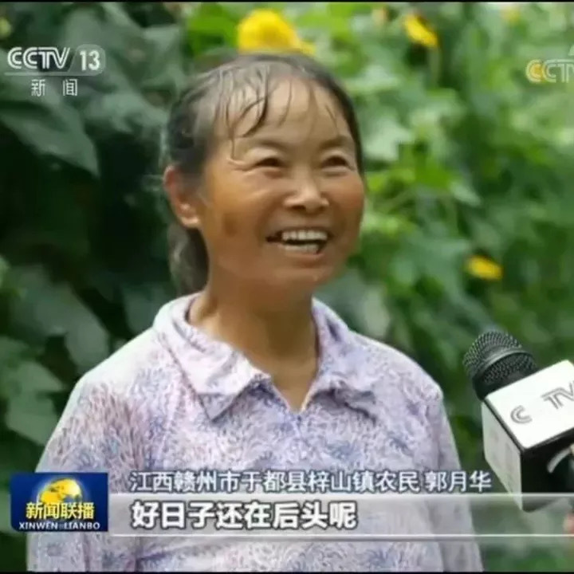
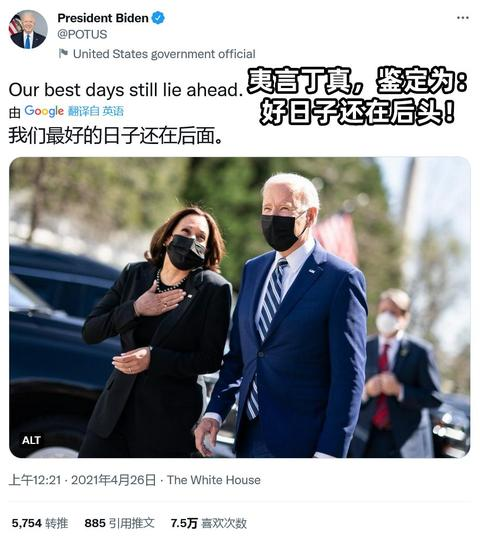
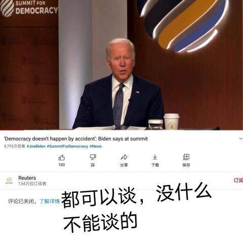
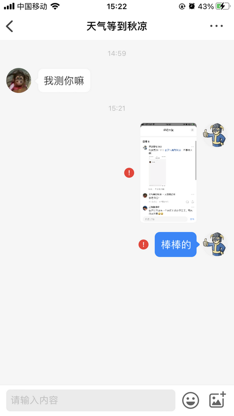
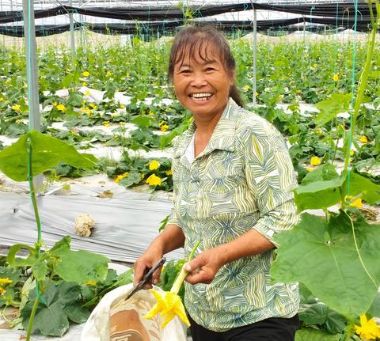
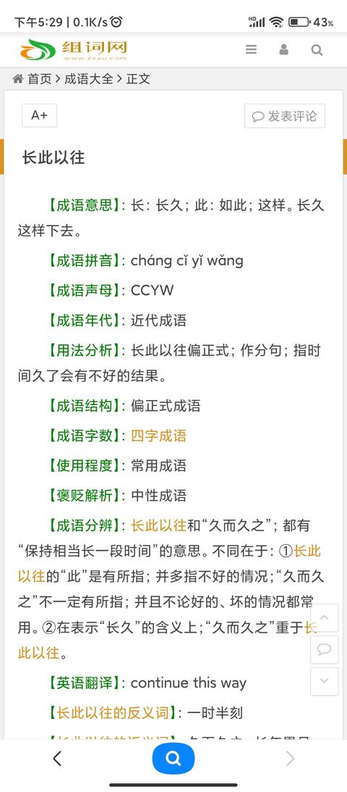
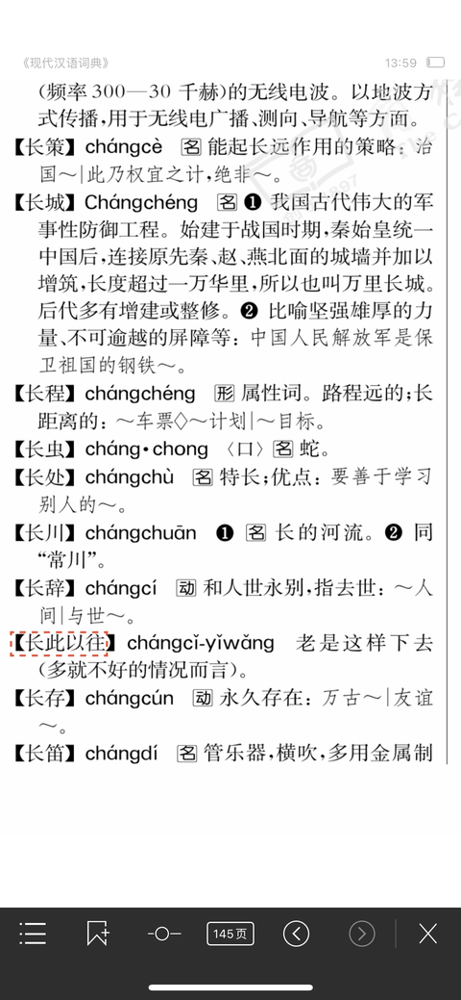

[toc]

# 问题

提问者：**<a href="https://www.zhihu.com/people/hua-feng-74-92">頔山</a>**
提问时间: 2021-11-18 19:35:10
总回答数: 2290
总访问量: 134425871

有哪些真实事件让你瞬间破防？

# 回答

回答者： **<a href="https://www.zhihu.com/people/houyanwuchiwangsitu">厚颜无耻王司徒</a>**
回答时间: 2022-10-5 23:23:54
点赞总数: 58871
评论总数: 2284
收藏总数: 13991
喜欢总数：6945

一开始我也刷这个表情包，各种衍生梗图玩得飞起，后来某天在群里听到有人说“ **人家是贫困户，依靠扶贫确实过上好日子了** ”，有点好奇就去搜索了一下郭月华的经历。

然后就破大防了。

> 在郭月华的家，郭月华告诉记者，2008年9月，一场突如其来的家庭变故使原本就不富裕的家庭陷入了困境， **郭月华的儿媳曾金凤患上心脏病** ，必须做心脏搭桥手术， **手术费用需要近十万元** ； **丈夫蔡冬寿长期患有慢性病** ；儿子蔡明在建筑工地上班，收入较低。家庭每年基本收支平衡，根本就没有存款，十多万元对这个普通农民家庭来说就是天文数字。为了给儿媳治病，郭月华借遍了所有的亲戚朋友，就连一百、二百元也借。后来郭月华儿媳曾金风做了心脏搭桥手术，病情得到缓解，但是干不了重活，只能在家照顾小孩，因此 **家庭也负债十余万元** 。  
> 为了还债，为了过上好的生活，郭月华想过出外面打工，多次外出找工作，但是因为年纪偏大，又没有文化和技术，根本找不到合适的工作，于是郭月华夫妻俩商量只有靠种地来增加收入。她夫妻俩把亲戚、邻居家的二十余亩地接过来自己人工耕种，种植水稻十余亩，花生、蔬菜各几亩，起早贪黑，过上了日出出门，日落而归的生活，有时候晚上八、九点钟才从田里干活回家。邻居和其同样年龄的妇女已经开始在跳广场舞了，但是她却 **经常累的经常直不起腰，有一次连上个厕所都在厕所里睡着** ，每个逢圩日郭月华都挑一担蔬菜去圩上卖，一卖就是一上午，收入才百元。就这样通过卖稻谷、蔬菜、花生油等，就这样一点一滴积累，每年家庭收入增加2万余元。^[[郭月华：我现在的生活芝麻开花节节高！ - 中国日报网](https://jx.chinadaily.com.cn/a/202009/12/WS5f5c2624a31009ff9fddfcc4.html)]

我从小到大干过最重的活，也就是大学时候在快递分拣站做兼职，那时候就觉得很累了。像郭月华这样累得直不起腰、上厕所都睡着，真是从没体会过。

 **这是第一次破防。** 

> 2016年底镇里开始发展蔬菜产业，为响应党和政府号召，郭月华把自己耕种的土地全部流转给蔬菜基地种蔬菜，没有了地耕种，郭月华也闲不下来，她通过帮扶干部在蔬菜基地找到了工作，她在蔬菜大棚里做小工， **每天在蔬菜大棚工作7-8小时，收入每天70-80元，回到家里还要干家务。每年在大棚蔬菜务工收入2万余元** 。她转变观念，勤劳好学，经常参加县、乡组组织的农业技术培训班。只要她听说哪里有农业技术培训班，她都不会放弃学习的机会。哪里有农业技术培训班，哪里就可以看到她的身影，在蔬菜基地务工的同时也经常向蔬菜基地的技术员请教技术。郭月华在蔬菜基地务工的3年时间不仅增加了家庭收入而且还学到了蔬菜种植技术。^[[郭月华：我现在的生活芝麻开花节节高！ - 中国日报网](https://jx.chinadaily.com.cn/a/202009/12/WS5f5c2624a31009ff9fddfcc4.html)]

在扶贫支持之下，郭月华的生活有了起色，总算是日子好过了一点。但是再看看郭月华生活的地方，江西省赣州市于都县梓山镇岗脑村。还记得吗？那个在朋友圈炫富的周劼，他就在江西省国有资本运营控股集团有限公司工作。同样在江西，一位贫困户在蔬菜大棚里辛苦劳作，起早贪黑干一年，务工收入也才2万元；而周劼这么一个不学无术的二世祖，坐办公室吹空调都要加个挡风板，一斤茶叶就要20万元。这样的对比，实在让人心寒。

 **这是第二次破防。** 

> 郭月华受到了鼓励和启发，看到了富硒蔬菜的商机。2019年底，郭月华与家人商量后决定自己创业种植大棚蔬菜，她找到乡村干部要求自己来承包大棚种植蔬菜，她投资五六万元承包起了蔬菜基地两个大棚，种植富硒丝瓜26亩，她利用在蔬菜基地务工时学到的技术自己种起了大棚蔬菜，这半年来，天天在蔬菜大棚都可以看到她的身影，她经常泡在蔬菜大棚里手把手指导工人种植富硒丝瓜， **现在她承包的两个大棚长期雇佣了七、八名贫困劳动力务工，带动了七、八名贫困劳动力年增收万元** ，她带动大家一起致富，成为村里真正的致富带头人。如今郭月华种植的大棚富硒丝瓜已经多次摘果，摘果五、六万斤，富硒丝瓜销往全国各地。郭月华说，目前她种植的富硒丝瓜已增收五、六万元，预计全年可增收十余万元。  
> 如今郭月华家的生活发生了翻天覆地的变化，家里安装了空调，购买了小汽车，孙子孙女也送到了城里读书，她用自己勤劳的双手脱贫致富，成为了岗脑村的致富带头人。郭月华说，“ **自己的脱贫致富，还要感谢党和国家的好政策，自己富裕了还不行，要大家富裕了才是真的富裕。** ”^[[郭月华：我现在的生活芝麻开花节节高！ - 中国日报网](https://jx.chinadaily.com.cn/a/202009/12/WS5f5c2624a31009ff9fddfcc4.html)]

先富带后富喊了这么多年，最后真正落实它的，竟然是一位自己刚脱贫不久的前贫困户。

 **这是第三次破防。** 

> 富硒蔬菜产业园按照“ **龙头企业+合作社+农户和贫困户** ”的发展模式，帮助村里不能出门打工的村民在家门口就业，带动了村民脱贫致富。^[[焦点访谈：老区新颜 家门口就业 稳稳的幸福 - 中国日报网](https://cn.chinadaily.com.cn/a/202110/03/WS615914e2a3107be4979f106e.html)]

是的，在包产到户执行了40多年后，帮助农民脱贫的竟然是合作社。

 **这是第四次破防。** 

对了，还记得郭月华的家在哪吗？

江西省赣州市于都县，如果你对中国革命史有所了解，应该会记得：

这里是 **中央红军长征集结出发地** ，1934年10月，中央红军主力8.6万人在江西于都集结出发，实行战略大转移，开始了二万五千里长征，到今天已经整整88年了。^[[中央红军长征集结出发地：江西于都](http://www.nmgsjw.cn/ztlm/xxyll/yzzsjdzj/202106/t20210616_10843.html)]

  

原文地址：[(厚颜无耻王司徒)有哪些真实事件让你瞬间破防？](https://www.zhihu.com/question/499890445/answer/2702945967) 

# 评论

1. <a href="https://www.zhihu.com/people/qian-ye-11-60">协同教育</a> (<small title="江苏">2022-10-6 14:37:37</small>): 看图联想［捂嘴］
   - <a href="https://www.zhihu.com/people/yang-yang-yang-86-82-9">再来七天嘛</a> (<small title="山东">2022-10-6 16:41:47</small>): 这回maga了
   - <a href="https://www.zhihu.com/people/di-yu-san-bing-73-76">塞雷娅嗷</a> (<small title="黑龙江">2022-10-6 18:56:15</small>): 
   - <a href="https://www.zhihu.com/people/da-hao-yi-si-wu-nian">大号已死勿念</a> (<small title="上海">2022-10-6 20:48:20</small>): 哈哈哈
   - <a href="https://www.zhihu.com/people/hong-shu-8">红蜀</a> (<small title="安徽">2022-10-6 22:11:37</small>): 什么匹配机制
   - <a href="https://www.zhihu.com/people/lucky-71-74-21">路人甲乙丙</a> (<small title="回复于 2022-10-6 22:27:0/广东"> ✉️:塞雷娅嗷</small>): 这下万恶的美利坚终于追上我们的脚步了
   - <a href="https://www.zhihu.com/people/sai-bo-le-ke-si">繁星一尘</a> (<small title="广东">2022-10-6 22:29:38</small>): 真是一个比烂的地球。。。唉
   - <a href="https://www.zhihu.com/people/lucky-71-74-21">路人甲乙丙</a> (<small title="回复于 2022-10-6 22:49:50/广东"> ✉️:塞雷娅嗷</small>): 你发了什么被删了
   - <a href="https://www.zhihu.com/people/666666-64-3">666666</a> (<small title="回复于 2022-10-6 23:45:42/黑龙江"> ✉️:塞雷娅嗷</small>): reuters所有视频都🔒评论，你这图没啥意义
   - <a href="https://www.zhihu.com/people/666666-64-3">666666</a> (<small title="回复于 2022-10-6 23:46:19/黑龙江"> ✉️:路人甲乙丙</small>): reuters没有一个视频开评论，你可以自己看看去
   - <a href="https://www.zhihu.com/people/wang-han-54-49">知乎用户14yMU3</a> (<small title="四川">2022-10-6 23:51:29</small>): 绷不住了［捂脸］
   - <a href="https://www.zhihu.com/people/sui-feng-shi-qu-15-96">知乎用户5pFWkH</a> (<small title="四川">2022-10-7 0:3:39</small>): 一脉相承［飙泪笑］
   - <a href="https://www.zhihu.com/people/ling-xiao-zi-93-49">喵喵喵</a> (<small title="江苏">2022-10-7 1:13:1</small>): 拜登：你跟我说法我都想笑
   - <a href="https://www.zhihu.com/people/bao-ding-shi-xin-67">知乎用户fGEWNA</a> (<small title="江苏">2022-10-7 4:13:20</small>): 真的假的啊［笑哭］
   - <a href="https://www.zhihu.com/people/sun-xiao-chuan-4-37">卡牌大师拜顺登</a> (<small title="回复于 2022-10-7 7:7:23/湖北"> ✉️:666666</small>): 美国那个同性恋征兵的，不也一样锁评论吗，而且是单锁
   - <a href="https://www.zhihu.com/people/di-yu-san-bing-73-76">塞雷娅嗷</a> (<small title="回复于 2022-10-7 7:46:50/黑龙江"> ✉️:666666</small>): 中国那个图也是都🔒，然而照样一大票人高潮［惊喜］
   - <a href="https://www.zhihu.com/people/zhang-wen-huan-1">知乎用户AmtbRS</a> (<small title="江苏">2022-10-7 10:24:10</small>): 旗鼓相当的对手［尴尬］
   - **厚颜无耻王司徒** (<small title="回复于 2022-10-7 10:27:45/河北"> ✉️:路人甲乙丙</small>): 海上生明月［尴尬］
   - <a href="https://www.zhihu.com/people/zhan-zhao-97-1">展昭</a> (<small title="回复于 2022-10-7 14:44:20/福建"> ✉️:666666</small>): youtub好像也锁了
   - <a href="https://www.zhihu.com/people/da-tou-tou-hen-da-68">美利坚赢宗懂皇帝</a> (<small title="广东">2022-10-7 17:42:10</small>): 美版！［酷］
   - <a href="https://www.zhihu.com/people/zhao-ke-1-65">赵客</a> (<small title="回复于 2022-10-7 17:47:25/四川"> ✉️:666666</small>): 这不更恶心吗，所有都关评论［为难］［为难］
   - <a href="https://www.zhihu.com/people/ke-li-si-xiao-zhang">万梓良</a> (<small title="回复于 2022-10-7 23:19:52/河南"> ✉️:路人甲乙丙</small>): 摸着兔子的尾巴过河。
   - <a href="https://www.zhihu.com/people/lucky-71-74-21">路人甲乙丙</a> (<small title="回复于 2022-10-7 23:28:55/广东"> ✉️:万梓良</small>): ［捂脸］这下互相借鉴了，以前美国内宣总是输，现在还不赢？
   - **厚颜无耻王司徒** (<small title="回复于 2022-10-9 22:56:22/河北"> ✉️:666666</small>): 你这么一说我觉得更典了——路透社这样的国际通讯社，本来应该是“都可以谈，没什么不能谈”，结果连评论区都不开。
   - <a href="https://www.zhihu.com/people/di-yu-san-bing-73-76">塞雷娅嗷</a> (<small title="回复于 2022-10-10 9:57:24/黑龙江"> ✉️:厚颜无耻王司徒</small>): 那也比地下室里背后身中八枪自杀好啊［惊喜］，路透社其实是想保护你［惊喜］
   - <a href="https://www.zhihu.com/people/generic-96">知乎用户ZJ5fWn</a> (<small title="回复于 2023-2-25 21:7:57/江西"> ✉️:路人甲乙丙</small>): 不许你这么说灯塔［生气］
   - <a href="https://www.zhihu.com/people/li-hua-32-68-70">陈梦闲</a> (<small title="回复于 2023-3-13 18:31:16/河北"> ✉️:路人甲乙丙</small>): 都在成为彼此［惊喜］
   - <a href="https://www.zhihu.com/people/jojolion-80">吴普</a> (<small title="回复于 2023-6-21 18:59:45/中国"> ✉️:塞雷娅嗷</small>): 🔒也不是因为拜登啊，这个频道就是锁
   - <a href="https://www.zhihu.com/people/ji-guang-50-93">极光</a> (<small title="回复于 2023-12-8 9:25:18/浙江"> ✉️:塞雷娅嗷</small>): 观察者网都锁？
   - <a href="https://www.zhihu.com/people/53-19-43-73">弄大魍蓬</a> (<small title="湖南">2024-1-19 22:13:35</small>): MAGA
   - <a href="https://www.zhihu.com/people/iee6sa">bobo</a> (<small title="回复于 2024-1-29 10:35:57/北京"> ✉️:塞雷娅嗷</small>): 8795次观看［惊喜］
   - <a href="https://www.zhihu.com/people/tou-shou-96">清凉油</a> (<small title="黑龙江">2024-2-13 0:6:6</small>): 万能的丁真。。。［捂脸］
   - <a href="https://www.zhihu.com/people/chi-qi-de-shi-jie">擦肩而过</a> (<small title="河南">2024-2-22 9:39:53</small>): 相互学习，共同进步
   - <a href="https://www.zhihu.com/people/33-53-65-70">知乎用户Id8SJP</a> (<small title="回复于 2024-2-24 15:8:8/江苏"> ✉️:塞雷娅嗷</small>): 首先我想问个问题，路透社，不是英国的吗？
   - <a href="https://www.zhihu.com/people/joke-81-91">Joke</a> (<small title="贵州">2024-3-17 18:46:2</small>): 不是，，到底真的假的啊［捂脸］［捂脸］
   - <a href="https://www.zhihu.com/people/frank-35-39">吃藕</a> (<small title="回复于 2024-3-22 9:13:57/新西兰"> ✉️:路人甲乙丙</small>): 这是回旋镖
   - <a href="https://www.zhihu.com/people/shang-xing-feng">上行风</a> (<small title="回复于 2024-4-12 11:0:58/陕西"> ✉️:666666</small>): 主要意思在于建议大家换赛道，不要再在关评论这个问题上拉踩了，因为东西二圣没有什么区别。［惊喜］
   - <a href="https://www.zhihu.com/people/yactar">yactar</a> (<small title="回复于 2024-4-22 8:23:58/山东"> ✉️:塞雷娅嗷</small>): 难绷
   - <a href="https://www.zhihu.com/people/s2cyjq">知乎用户S2CYJQ</a> (<small title="福建">2026-3-16 20:41:26</small>): ［飙泪笑］“那能一样吗？”
2. <a href="https://www.zhihu.com/people/xi-qin-jian-ke">知乎用户HAgWIm</a> (<small title="江苏">2022-10-6 14:50:55</small>): 看评论区，还以为楼主犯了啥罪恶滔天的大罪［飙泪笑］
   - <a href="https://www.zhihu.com/people/luo-cang-qi">肖夹党笠方圣勃哲</a> (<small title="广东">2022-10-6 16:28:27</small>): 之前殖乎还嘲讽豆瓣微博小红书是女厕，贴吧 虎扑 nga低端，b站童厕  
 
这答案底下的评论，看起来和它们嘲讽的各个网站没什么区别［惊喜］
   - <a href="https://www.zhihu.com/people/deng-sha-jun">知乎用户VX1hQ8</a> (<small title="四川">2022-10-6 16:29:0</small>): 你是谁呢？
   - <a href="https://www.zhihu.com/people/xi-qin-jian-ke">知乎用户HAgWIm</a> (<small title="江苏">2022-10-6 16:47:4</small>): ［飙泪笑］［飙泪笑］点进头像，三无小号。
   - <a href="https://www.zhihu.com/people/shen-lan-xiang-bin-343">知乎用户FxuPkI</a> (<small title="回复于 2022-10-6 16:54:53/河南"> ✉️:知乎用户VX1hQ8</small>): 骂完拉黑？就这点本事？［飙泪笑］［飙泪笑］［飙泪笑］
   - <a href="https://www.zhihu.com/people/ren-bo-wen-35">任博文</a> (<small title="北京">2022-10-6 16:56:8</small>): 又是老操作，喷完就拉黑［惊喜］
   - <a href="https://www.zhihu.com/people/xi-gua-ai-hao-zhe-8">西瓜爱好者</a> (<small title="山东">2022-10-6 17:18:48</small>): 一击脱离这就是BZ［飙泪笑］
   - <a href="https://www.zhihu.com/people/li-da-hui-lang-89">李大灰狼</a> (<small title="回复于 2022-10-6 17:44:29/山东"> ✉️:知乎用户VX1hQ8</small>): 注册个新号就上岗，你们那招人没有门槛吗？［惊喜］
   - <a href="https://www.zhihu.com/people/shen-lan-xiang-bin-343">知乎用户FxuPkI</a> (<small title="河南">2022-10-7 15:20:45</small>): 私信骂我？？？[@天气等到秋凉](http://www.zhihu.com/people/8fa952c6715a4e42c61447c9e5c18aa2) 本事真大啊！ 
   - <a href="https://www.zhihu.com/people/shen-lan-xiang-bin-343">知乎用户FxuPkI</a> (<small title="河南">2022-10-7 15:23:12</small>): 骂完我拉黑［飙泪笑］［飙泪笑］［飙泪笑］[@天气等到秋凉](http://www.zhihu.com/people/8fa952c6715a4e42c61447c9e5c18aa2) 
   - <a href="https://www.zhihu.com/people/jie-fei-88-53">石斑鱼几个斑</a> (<small title="回复于 2022-10-7 23:23:32/湖北"> ✉️:西瓜爱好者</small>): 什么安东星人［doge］
   - <a href="https://www.zhihu.com/people/ke-ren-29-16">喂自己袋盐</a> (<small title="回复于 2022-10-8 9:23:12/湖北"> ✉️:知乎用户FxuPkI</small>): 你不是被骂开了会员吧？
   - <a href="https://www.zhihu.com/people/shen-lan-xiang-bin-343">知乎用户FxuPkI</a> (<small title="回复于 2022-10-8 10:38:36/河南"> ✉️:喂自己袋盐</small>): 会员5月份开的［思考］一直自动续费。
   - <a href="https://www.zhihu.com/people/zuo-ri-zhi-hui-wang">昨日之回望</a> (<small title="回复于 2022-10-14 18:41:49/河北"> ✉️:西瓜爱好者</small>): 这下空战英豪了［捂脸］
   - <a href="https://www.zhihu.com/people/dianaqian">子骞</a> (<small title="上海">2023-4-14 14:26:1</small>): 评论区让我有点破防。。感觉网上释放恶意真的很随意，因为没有成本吧
   - <a href="https://www.zhihu.com/people/shen-zhen-shi-li-bang-tai">山上有个和尚</a> (<small title="回复于 2023-4-20 18:15:42/广东"> ✉️:肖夹党笠方圣勃哲</small>): 跟平台关系不大，跟人素质有关系
   - <a href="https://www.zhihu.com/people/yuan-shi-35">头球之我见</a> (<small title="重庆">2023-7-26 14:29:49</small>): 好多人莫名破防了［捂嘴］
   - <a href="https://www.zhihu.com/people/76-2-55-62">俩母牛比牛逼</a> (<small title="回复于 2023-10-21 13:0:40/安徽"> ✉️:肖夹党笠方圣勃哲</small>): 在贴吧看到骂知乎和B站的，在B站看到骂贴吧和知乎的，在知乎看到骂B站和贴吧的，乐
   - <a href="https://www.zhihu.com/people/wangzhebuzai">王者不在</a> (<small title="北京">2024-1-15 8:32:55</small>): 片面
   - <a href="https://www.zhihu.com/people/summer-time-21">summer time</a> (<small title="回复于 2024-2-25 23:19:33/安徽"> ✉️:肖夹党笠方圣勃哲</small>): 都互联网了，大家都一样，没谁比谁高贵，就知乎优越感强......
   - <a href="https://www.zhihu.com/people/zhang-guo-jun-12">卤蛋对撞</a> (<small title="回复于 2024-3-7 15:4:55/安徽"> ✉️:肖夹党笠方圣勃哲</small>): 童厕小黑盒和tap
   - <a href="https://www.zhihu.com/people/zou-wen-zhen-39">南山区热心网友</a> (<small title="回复于 2024-3-22 2:12:16/广东"> ✉️:肖夹党笠方圣勃哲</small>): 别尬黑，除了微博，不是没什么区别，知乎不如这些，微博除外
   - <a href="https://www.zhihu.com/people/su-chen-45-80">旺旺小小苏</a> (<small title="回复于 2024-4-3 22:53:21/江苏"> ✉️:肖夹党笠方圣勃哲</small>): 是时候拿出这张图了
   - <a href="https://www.zhihu.com/people/fishman-24-15">Fishman</a> (<small title="回复于 2024-4-4 10:53:42/广东"> ✉️:肖夹党笠方圣勃哲</small>): 本来就没区别，有些沙子真觉得自己用了一个APP就高人一等了［捂脸］
   - <a href="https://www.zhihu.com/people/zhizuXX">皮萨罗</a> (<small title="回复于 2024-4-17 9:37:6/广西"> ✉️:肖夹党笠方圣勃哲</small>): 早年是知乎 后面堕落变殖乎
   - <a href="https://www.zhihu.com/people/jiang-feng-jue">知乎用户vRLyqO</a> (<small title="回复于 2024-4-28 15:59:46/江苏"> ✉️:肖夹党笠方圣勃哲</small>): 也是蛮好笑的，出现了女厕童厕，到了贴吧就是低端，男厕是说不出口吗哈哈
   - <a href="https://www.zhihu.com/people/20-85-51-37">雪豹闭嘴</a> (<small title="回复于 2026-2-4 23:25:40/湖南"> ✉️:西瓜爱好者</small>): 还有空军哥
3. <a href="https://www.zhihu.com/people/feng-qi-tian-lan-94">风起天澜</a> (<small title="四川">2022-10-6 18:1:3</small>): 神看你像兔 兔看你像神 这就是评论区一片敌军的原因［惊喜］
   - <a href="https://www.zhihu.com/people/zhou-da-ye-de-ye">郑州第六精神病院</a> (<small title="河南">2022-10-6 18:22:17</small>): 一针见血
   - <a href="https://www.zhihu.com/people/feng-qi-tian-lan-94">风起天澜</a> (<small title="回复于 2022-10-6 18:42:53/四川"> ✉️:郑州第六精神病院</small>): ［害羞］
   - <a href="https://www.zhihu.com/people/du-gu-ye-gou-86">登阆风而緤马</a> (<small title="青海">2022-10-6 21:44:19</small>): 有没有一种可能答主确实没说清楚。［飙泪笑］
   - <a href="https://www.zhihu.com/people/huang-chen-yu-63">见乎蓍龟</a> (<small title="浙江">2022-10-6 21:57:23</small>): 答主才是真正的爱国者哇  
 
神神兔兔应该全部抓起来劳动改造
   - <a href="https://www.zhihu.com/people/chen-jia-duo-67">喵喵呜</a> (<small title="安徽">2022-10-7 10:57:20</small>): 可能是因为，当我看到一篇回复，我很赞同他的观点并且觉得作者很有条理，很有逻辑，我会觉得这和我是一样的人；我不赞同就会觉得作者是对立面的人
   - <a href="https://www.zhihu.com/people/er-tu-zi-17">二秃子</a> (<small title="江苏">2022-10-7 23:31:11</small>): 神就是兔，兔就是神，没什么毛病。
   - <a href="https://www.zhihu.com/people/feng-qi-tian-lan-94">风起天澜</a> (<small title="回复于 2022-10-8 11:11:14/四川"> ✉️:登阆风而緤马</small>): 你看 这是站队的问题吗
   - <a href="https://www.zhihu.com/people/su-ge-la-xi-62">苏格拉稀</a> (<small title="江西">2022-10-9 9:58:8</small>): 那么这样的人是真正的爱国人士
   - <a href="https://www.zhihu.com/people/feng-qi-tian-lan-94">风起天澜</a> (<small title="回复于 2022-10-9 12:10:39/四川"> ✉️:苏格拉稀</small>): 是的
   - <a href="https://www.zhihu.com/people/tong0071985">tong0071985</a> (<small title="河北">2022-10-11 9:13:2</small>): 网上都这样，你说梅西踢球好那你一定是罗黑，你说科比厉害那你一定是詹黑［惊喜］
   - <a href="https://www.zhihu.com/people/gao-jing-wen-47-4">蒽醌</a> (<small title="广东">2022-10-16 3:15:37</small>): 2G网问一下神神兔兔是啥意思［思考］［思考］［思考］
   - <a href="https://www.zhihu.com/people/ling-ling-71-78-58">谷雨</a> (<small title="回复于 2022-10-16 15:34:55/广东"> ✉️:蒽醌</small>): 可以去搜一下，知乎有人写了成分划分［思考］
   - <a href="https://www.zhihu.com/people/qu-ming-zhen-de-hen-ma-fan-91">知乎用户cdScGq</a> (<small title="回复于 2022-10-18 17:45:51/辽宁"> ✉️:登阆风而緤马</small>): 我没有一种可能说清楚并不是答主的义务
   - <a href="https://www.zhihu.com/people/du-gu-ye-gou-86">登阆风而緤马</a> (<small title="回复于 2022-10-18 18:56:9/青海"> ✉️:知乎用户cdScGq</small>): 你确实没有。
   - <a href="https://www.zhihu.com/people/wolf-22-25">丸酱汁锅</a> (<small title="回复于 2023-6-25 8:51:15/广东"> ✉️:见乎蓍龟</small>): 好啊，能与免免一起劳改，开心
   - <a href="https://www.zhihu.com/people/wang-xi-99-39">北西</a> (<small title="江苏">2023-8-4 10:33:36</small>): 主要是破防这个词在网络环境下已经成了yygq专属词汇了，阅读知乎上一篇文章的时间无法区分答主的破防是作“触动”解读还是作“绷”解读
   - <a href="https://www.zhihu.com/people/di-shi-kun-52">挤一挤我也来</a> (<small title="新加坡">2023-8-20 20:41:3</small>): 说明语言表达能力有待加强［捂脸］
   - <a href="https://www.zhihu.com/people/feng-qi-tian-lan-94">风起天澜</a> (<small title="回复于 2023-8-21 12:58:43/四川"> ✉️:挤一挤我也来</small>): 这是表达能力的事么
   - <a href="https://www.zhihu.com/people/pang-ci-pang-ci-23-99">知乎用户RwyHXU</a> (<small title="缅甸">2023-8-27 5:55:31</small>): 我到觉得写的不错
   - <a href="https://www.zhihu.com/people/feng-qi-tian-lan-94">风起天澜</a> (<small title="回复于 2023-8-28 12:42:0/四川"> ✉️:知乎用户RwyHXU</small>): 我也觉得
   - <a href="https://www.zhihu.com/people/wu-shui-he-liu-suan-tong-19">五水合硫酸铜</a> (<small title="回复于 2024-1-12 21:21:51/山东"> ✉️:登阆风而緤马</small>): 答主说得很清楚，只不过跟兔和神都不是同一立场罢了
   - <a href="https://www.zhihu.com/people/yy-yy-74-48">YY YY</a> (<small title="回复于 2024-1-18 20:37:5/浙江"> ✉️:见乎蓍龟</small>): 真爱国就不会往20w茶叶和为什么这么穷上引了［尴尬］
   - <a href="https://www.zhihu.com/people/aidemo">大锤80</a> (<small title="江西">2024-1-19 0:48:21</small>): 答主这个立场应该是佐壬的。虽然我不知道是不是真的是佐壬
   - <a href="https://www.zhihu.com/people/xiao-xue-sheng-shan-yao-lai-xi">小学生闪耀来袭</a> (<small title="回复于 2024-2-3 10:17:2/福建"> ✉️:见乎蓍龟</small>): 有没有可能答主是佐人，真正的关心底层的爱国者［捂嘴］
   - <a href="https://www.zhihu.com/people/45-54-4-21">千里草</a> (<small title="福建">2024-2-11 5:16:15</small>): 说明两个团体都是一叶障目
   - <a href="https://www.zhihu.com/people/ruo-yin-72-97">青蝉衣</a> (<small title="云南">2024-3-22 10:8:28</small>): 哈哈哈哈笑不动了
   - <a href="https://www.zhihu.com/people/45-68-52-10">单机斗地主</a> (<small title="北京">2024-3-24 13:6:3</small>): 答主跟我们不是一个阶级的人［发呆］，只是对底层人民困苦的俯视罢了［捂脸］。
   - <a href="https://www.zhihu.com/people/xie-sheng-gui-lai">小克里格</a> (<small title="回复于 2024-4-16 8:28:25/浙江"> ✉️:YY YY</small>): 为什么不会
   - <a href="https://www.zhihu.com/people/zhang-fan-16-15">张凡</a> (<small title="湖北">2024-4-20 16:38:43</small>): 两面不是人。［酷］
   - <a href="https://www.zhihu.com/people/thebigguy">知乎用户G7BTLI</a> (<small title="广东">2024-5-3 10:32:27</small>): 答主的签名算是精确描述了这两批人［惊喜］
   - <a href="https://www.zhihu.com/people/62-11-17-22-72">法制教育</a> (<small title="吉林">2025-12-28 14:39:40</small>): 低级兔，高级神
   - <a href="https://www.zhihu.com/people/41-34-5-46">登山冠军蒋中正</a> (<small title="广西">2025-12-29 1:4:51</small>): 三年过去了是兔是神有定论了吗［看看你］
   - <a href="https://www.zhihu.com/people/jun-mo-xi-19-72">君莫惜</a> (<small title="回复于 2025-12-30 13:9:9/北京"> ✉️:登山冠军蒋中正</small>): 兔神二象性［惊喜］
   - <a href="https://www.zhihu.com/people/huang-yan-ling-40">6654</a> (<small title="湖北">2026-1-2 14:18:2</small>): 我厚脸皮来问一下：什么是兔？什么是神？
   - <a href="https://www.zhihu.com/people/92-98-43-48-73">直面这一切</a> (<small title="广东">2026-1-3 2:33:33</small>): 打击两面派呗，
   - <a href="https://www.zhihu.com/people/xu-guohao-28">Xu Guohao</a> (<small title="上海">2026-1-9 10:43:23</small>): 哈哈哈，所以说神兔一体嘛
   - <a href="https://www.zhihu.com/people/pan-wei-73-39">海阔凭鱼跃</a> (<small title="北京">2026-3-21 19:17:4</small>): 哈哈哈哈哈哈哈实话 笑我我了［惊喜］［惊喜］
   - <a href="https://www.zhihu.com/people/kuai-zhi-zhai-zhu-ren-7">林深见鹿</a> (<small title="回复于 2026-3-24 20:34:10/河北"> ✉️:见乎蓍龟</small>): 人家体制内搞宣传的，能不爱国？
   - <a href="https://www.zhihu.com/people/pengyi">布里人</a> (<small title="广东">2026-7-23 16:13:52</small>): 看懂这个故事最重要的是要有辩证思维。一体两面来看，贪污分子的确是这支队伍里面的人，而制定政策帮扶和兜底穷人的是这个队伍本身。从这个区别来看，这支队伍里面的个体，应该从故事里面牢记什么是不忘初心。
4. <a href="https://www.zhihu.com/people/er-shi-ba-hua-sheng-2-82">真正的粉丝</a> (<small title="青海">2022-10-6 14:57:46</small>): 我国是发展中国家，从这一点就能看出我们党说不放弃任何一个穷人是真的
   - <a href="https://www.zhihu.com/people/44-39-56-90">索索</a> (<small title="北京">2022-10-6 15:44:47</small>): ［尴尬］
   - <a href="https://www.zhihu.com/people/mu-feng-yang-46">沐风炀</a> (<small title="浙江">2022-10-6 16:20:35</small>): 绷不住
   - <a href="https://www.zhihu.com/people/ta-mu-ken-qi-32">塔姆肯奇</a> (<small title="广西">2022-10-6 16:36:53</small>): 有没有可能没看错［大笑］
   - <a href="https://www.zhihu.com/people/caserlyn">caserlyn</a> (<small title="广东">2022-10-6 16:40:34</small>): 不放过也讲得通
   - **厚颜无耻王司徒** (<small title="河北">2022-10-6 16:46:25</small>): 看了评论本来想笑，一看IP属地笑不出来了
   - <a href="https://www.zhihu.com/people/wu-di-de-mu-yi">稍稍少勺多铎夺朵</a> (<small title="江苏">2022-10-6 17:12:2</small>): ［捂脸］［捂脸］［捂脸］
   - <a href="https://www.zhihu.com/people/cun-cun-qing-si-chou-hua-nian-88">哭丧着脸的骑士</a> (<small title="广东">2022-10-6 17:48:56</small>): 还得是你们那的人感触深
   - <a href="https://www.zhihu.com/people/xie-xiang-lun-48">萧炎焱</a> (<small title="广东">2022-10-6 17:53:19</small>): 本来就是啊
   - <a href="https://www.zhihu.com/people/xiao-lu-nian-jiu">学儿食媳汁</a> (<small title="广东">2022-10-6 18:53:26</small>): 我还是相信他
   - <a href="https://www.zhihu.com/people/jojo-14-69-29">椰拿travelling</a> (<small title="辽宁">2022-10-6 19:12:42</small>): 每一个不至于［大笑］但扶贫确实是有用的，问题是刚好过线的那种农村
   - <a href="https://www.zhihu.com/people/qin-nai-de-mu-gua">亲耐的木瓜</a> (<small title="北京">2022-10-6 20:3:25</small>): 没觉得这个抖机灵多好笑
   - <a href="https://www.zhihu.com/people/er-shi-ba-hua-sheng-2-82">真正的粉丝</a> (<small title="回复于 2022-10-6 20:3:37/青海"> ✉️:椰拿travelling</small>): 刚好过线的过线了起码不会为温饱发愁了
   - <a href="https://www.zhihu.com/people/qia-zi-ke-91">卡兹克</a> (<small title="浙江">2022-10-6 20:36:32</small>): 一看IP我好像懂得了什么
   - <a href="https://www.zhihu.com/people/58-58-93-61">韩家公子</a> (<small title="广东">2022-10-6 21:21:48</small>): 有没有一种可能，是他打字的时候打错字了。
   - <a href="https://www.zhihu.com/people/30wj">知乎用户Puy8lY</a> (<small title="湖北">2022-10-6 22:56:35</small>): ［尴尬］
   - <a href="https://www.zhihu.com/people/CLECK-89">CLARK</a> (<small title="广东">2022-10-7 2:6:40</small>): 毕竟有的人视力是经过改造的
   - <a href="https://www.zhihu.com/people/liu-xiang-shuai-97">要吃叶子烟</a> (<small title="广东">2022-10-7 5:13:42</small>): ［捂脸］
   - <a href="https://www.zhihu.com/people/ccccy-79-10">ccccy</a> (<small title="山东">2022-10-8 16:59:28</small>): 现在着急让人买房上车的样子你觉得是不放弃还是不放过呢［惊喜］
   - <a href="https://www.zhihu.com/people/huo-zhao-6-33-76">活着</a> (<small title="回复于 2022-10-8 17:47:38/湖南"> ✉️:亲耐的木瓜</small>): 京爷，你觉得不好笑，我看他的ip地址配合他的话，很真实啊［飙泪笑］［飙泪笑］
   - <a href="https://www.zhihu.com/people/xi-yun-chu-qi-ri-chen-ge-96">拥有即失去</a> (<small title="回复于 2022-10-9 10:38:1/上海"> ✉️:活着</small>): 在看到你的ID更真实了［大哭］
   - <a href="https://www.zhihu.com/people/liu-shu-97-50">日月昭昭</a> (<small title="黑龙江">2022-10-9 11:11:11</small>): ［尴尬］抖机灵是吧
   - <a href="https://www.zhihu.com/people/contrail-28">林北防护林</a> (<small title="福建">2022-10-9 15:11:49</small>): 正确的
   - <a href="https://www.zhihu.com/people/qin-nai-de-mu-gua">亲耐的木瓜</a> (<small title="回复于 2022-10-9 18:39:32/北京"> ✉️:活着</small>): 我是河北的，只是北京上学罢了。。。
   - <a href="https://www.zhihu.com/people/90-39-26-25">不想学习的废物</a> (<small title="广东">2022-10-12 21:7:59</small>): 你觉得你很幽默吗
   - <a href="https://www.zhihu.com/people/zcychina">sakura z</a> (<small title="河北">2022-10-14 11:55:38</small>): 难蚌
   - <a href="https://www.zhihu.com/people/xing-wan-65-5-36">高岭 蕾</a> (<small title="贵州">2022-10-16 5:35:6</small>): 意外的合理［为难］
   - <a href="https://www.zhihu.com/people/the-spooky">The spooky</a> (<small title="吉林">2022-10-25 16:10:45</small>): 不冲突［惊喜］
   - <a href="https://www.zhihu.com/people/gao-dong-cheng-74">暴客</a> (<small title="福建">2022-10-29 22:40:11</small>): 这么理解也可以，不放过任何一个穷人，尽量消灭他们的贫穷
   - <a href="https://www.zhihu.com/people/le-ke-le-ke-4-40">三两s</a> (<small title="回复于 2022-10-30 1:34:54/河南"> ✉️:暴客</small>): 对，我就是这个意思
   - <a href="https://www.zhihu.com/people/ping-fan-de-shi-jie-68-29">平凡的世界</a> (<small title="北京">2022-10-31 19:30:5</small>): 打的轻了还是［滑稽］［滑稽］［滑稽］
   - <a href="https://www.zhihu.com/people/li-xiao-meng-chi-sao-meng">长夜千印</a> (<small title="河南">2023-2-2 1:53:23</small>): 你真幽默［尴尬］［尴尬］［尴尬］
   - <a href="https://www.zhihu.com/people/xie-xiao-ban-89-46">幻想</a> (<small title="辽宁">2023-2-20 17:39:25</small>): 怎么笑的出来的［大哭］
   - <a href="https://www.zhihu.com/people/shuai-qi-de-biao-biao-biao-82">帅气的表表表</a> (<small title="回复于 2023-2-24 0:57:4/广东"> ✉️:厚颜无耻王司徒</small>): 我也想笑的，一看IP是我老家🤡🤡🤡
   - <a href="https://www.zhihu.com/people/zhong-yu-li-xiang-36-52">suzumiya</a> (<small title="湖北">2023-7-21 19:32:28</small>): 还真是
   - <a href="https://www.zhihu.com/people/a-xin-you-99">命运.destiny</a> (<small title="重庆">2025-12-5 5:30:15</small>): 你干嘛用我头像［机智］
   - <a href="https://www.zhihu.com/people/15-11-37-77">黄豆芽</a> (<small title="福建">2025-12-28 22:11:20</small>): 是的！
   - <a href="https://www.zhihu.com/people/qin-fen-yi-dian-57">勤奋一点</a> (<small title="浙江">2025-12-29 7:23:54</small>): 中肯的
   - <a href="https://www.zhihu.com/people/xu-huang-28-5">惊蛰</a> (<small title="广东">2025-12-29 13:45:6</small>): 因为还没达到发达国家标准，所以发展中
   - <a href="https://www.zhihu.com/people/peng-zi-da">放屁带点汁儿</a> (<small title="广东">2025-12-29 22:56:46</small>): 难绷
   - <a href="https://www.zhihu.com/people/how-how-56">how how</a> (<small title="回复于 2025-12-31 11:52:4/广东"> ✉️:放屁带点汁儿</small>): 让你难受了？［调皮］
   - <a href="https://www.zhihu.com/people/lao-zi-yue-88">知乎用户TSZ7EK</a> (<small title="广东">2026-1-3 13:53:23</small>): 国家为扶贫确实做了不少事的。贪官很多不可否认，但国家的大方针政策确实是为很多老百姓考虑的
   - <a href="https://www.zhihu.com/people/wu-tong-long-jun">梧桐龙</a> (<small title="广东">2026-1-7 16:23:11</small>): 不放过任何一个穷人
   - <a href="https://www.zhihu.com/people/32-46-69-98">你啊你啊</a> (<small title="江苏">2026-1-14 13:8:42</small>): ［为难］［为难］［为难］
   - <a href="https://www.zhihu.com/people/Reznovlee">Reznovlee</a> (<small title="湖南">2026-4-27 14:39:13</small>): ［生气］［生气］［生气］你们呐就光顾着骂，现在那个评论没了我想看乐子都看不了了
   - <a href="https://www.zhihu.com/people/shun-shun-ge">辰晞</a> (<small title="回复于 2026-7-23 8:28:43/山东"> ✉️:索索</small>): 这人说了啥啊
5. <a href="https://www.zhihu.com/people/she-pi-52-62">玫瑰</a> (<small title="山东">2022-10-6 12:55:57</small>): 这是真过上好日子了［害羞］
   - <a href="https://www.zhihu.com/people/TingHsi">羲庭</a> (<small title="山东">2022-10-6 13:25:42</small>): 是啊，这可是革命老区啊
   - **厚颜无耻王司徒** (<small title="河北">2022-10-6 14:9:27</small>): 如今郭月华家的生活发生了翻天覆地的变化，家里安装了空调，购买了小汽车，孙子孙女也送到了城里读书，……郭月华说，她还要扩大大棚蔬菜种植面积和种植的蔬菜品种，带动更多的农民增产增收，让大家都富裕起来。
 
郭月华这样的劳动者，理所应当过上好日子，当然也希望其他贫困户也能都过上好日子。但还是有点儿心酸，像周劼这种二世祖一个人的吃穿用度就够多少贫困户生活，只希望周劼这种人少一点，像郭月华一样过上好日子的贫困户多一点。
 

   - <a href="https://www.zhihu.com/people/xia-zhao-de-xing-xing-2333">地摊文学家</a> (<small title="回复于 2022-10-6 15:1:58/浙江"> ✉️:厚颜无耻王司徒</small>): 这个笑容是发自内心的
   - <a href="https://www.zhihu.com/people/chang-zheng-yun-29">常徵云</a> (<small title="回复于 2022-10-6 17:8:17/新疆"> ✉️:地摊文学家</small>): 就那个梗图，我一直没了解过，但是也没被破防过。因为那个笑容真的发自肺腑，那是演不出来做不了假的，她说好日子还在后面我特别相信。
   - <a href="https://www.zhihu.com/people/zhong-sheng-zhi-xiong-mao-xiu-xian">重生之熊猫修仙</a> (<small title="回复于 2022-10-6 17:59:13/广西"> ✉️:常徵云</small>): 这种一看图就知道了，看不出来的人，真的体会不到人间的真善美了么［捂脸］
   - <a href="https://www.zhihu.com/people/524456490">道友留步</a> (<small title="回复于 2022-10-6 18:13:6/江苏"> ✉️:常徵云</small>): 很早以前就看到过那张图，后续慢慢的无意间也了解到其相关的事迹。  
 
但从我个人的角度去理解而言，  
 
发这张图以此来嘲讽什么事情的时候，我个人觉得应该没多少人是因为图中的人说了这样子的话，而嘲讽这个人的同时间接嘲讽其他事情。  
 
更多的应该是背后的一些事情，对于其个人，不论怎么说，其个人能过上比曾经要好的日子肯定是好事情。  
 
与之类似的一个例子是丁真的走红遭到了很多人的嘲讽，大家嘲讽的不是丁真其本人，而是背后的力量。  
 
又想起一个网络电影里的段子。  
 
物理学博士开卡车,那是社会学问题，就不多做讨论了。
   - <a href="https://www.zhihu.com/people/v99j">玩泥巴的小屁孩</a> (<small title="回复于 2022-10-6 20:42:7/浙江"> ✉️:厚颜无耻王司徒</small>): 怎么有人说她生病去世了？
   - <a href="https://www.zhihu.com/people/mo-nian-95-97">莫念</a> (<small title="回复于 2022-10-6 21:37:51/内蒙古"> ✉️:厚颜无耻王司徒</small>): 不患寡而患不均
   - <a href="https://www.zhihu.com/people/xia-zhao-de-xing-xing-2333">地摊文学家</a> (<small title="回复于 2022-10-8 0:44:48/浙江"> ✉️:常徵云</small>): 没错，我其实很看不惯那个梗图，因为原图里的主角根本就没有梗图要表达的意思，所以根本算不上是个梗，这个梗就是为了阴阳怪气而凭空捏造的
   - <a href="https://www.zhihu.com/people/prelive">prelive</a> (<small title="回复于 2022-10-8 16:13:37/广东"> ✉️:厚颜无耻王司徒</small>): 亲不亲，阶级分
   - <a href="https://www.zhihu.com/people/yunskyline">刀客云空</a> (<small title="回复于 2022-10-28 4:23:55/广东"> ✉️:厚颜无耻王司徒</small>): 是的！他本来值得更好的日子！
   - <a href="https://www.zhihu.com/people/10-80-76-16-47">预言</a> (<small title="回复于 2022-12-15 6:16:50/浙江"> ✉️:厚颜无耻王司徒</small>): 她的笑容里透露着一股强人姿态，感觉没那么朴实了，甚至有点资本的味道，不过这也正常，如果没有这样的个性，也不会有这样的进步
   - <a href="https://www.zhihu.com/people/tang-hong-guang-27">知乎用户w8mSlN</a> (<small title="回复于 2023-2-5 13:1:50/北京"> ✉️:厚颜无耻王司徒</small>): 发现没，她跟最开始的图里相比，都胖起来了
   - <a href="https://www.zhihu.com/people/wei-feng-fu-mian-33-72">不再是阑珊的背影</a> (<small title="回复于 2023-4-17 23:40:55/安徽"> ✉️:知乎用户w8mSlN</small>): 可能吃的好了［doge］
   - <a href="https://www.zhihu.com/people/tang-hong-guang-27">知乎用户w8mSlN</a> (<small title="回复于 2023-4-17 23:43:56/吉林"> ✉️:不再是阑珊的背影</small>): 对啊，就是吃得好了，生活好了，人家确实越过越好了啊
   - <a href="https://www.zhihu.com/people/63-8-1-49">放马天山</a> (<small title="回复于 2023-6-26 11:46:2/河南"> ✉️:预言</small>): 她的后代也有变成周公子的一天
   - <a href="https://www.zhihu.com/people/tan-suo-54-26">探索</a> (<small title="回复于 2024-2-3 12:35:1/广东"> ✉️:放马天山</small>): 你会有可能病 ［doge］亡
   - <a href="https://www.zhihu.com/people/alanccav">从今往后一万年</a> (<small title="回复于 2025-12-28 16:4:12/广西"> ✉️:放马天山</small>): 这不更说明我国阶级没有固化嘛，和平年代也能升到顶级，你这节奏不好带啊［捂嘴］
6. <a href="https://www.zhihu.com/people/chu-yi-13-41">楚易</a> (<small title="山西">2022-10-6 0:48:34</small>): 你还会破很多次防的［惊喜］
   - <a href="https://www.zhihu.com/people/oldmam">消散</a> (<small title="上海">2022-10-6 18:29:15</small>): 建议去看《隐入尘烟》，估计又会破防
   - <a href="https://www.zhihu.com/people/mu-chu-62-41">哈哈哈</a> (<small title="回复于 2022-10-6 19:11:1/湖北"> ✉️:消散</small>): 一个农村北京的城里故事你破啥防 ？
   - <a href="https://www.zhihu.com/people/jiao-wo-li-lao-shi-69">知乎用户rUxyZd</a> (<small title="回复于 2022-10-6 19:14:23/河南"> ✉️:消散</small>): 一群小资的无病呻吟
   - <a href="https://www.zhihu.com/people/73-42-47-8">豌豆射手</a> (<small title="回复于 2022-10-6 20:22:3/湖南"> ✉️:消散</small>): ……
   - <a href="https://www.zhihu.com/people/dfg325">幸存者偏差</a> (<small title="山东">2022-10-7 16:17:21</small>): 先搞明白谁应该感谢谁［尴尬］  
 
[https://www.zhihu.com/answer/2577821384](https://www.zhihu.com/answer/2577821384)  
 
  
 
[https://www.zhihu.com/answer/2600631534](https://www.zhihu.com/answer/2600631534)
   - <a href="https://www.zhihu.com/people/huo-shu-guang-11">voyager</a> (<small title="回复于 2022-10-7 16:27:32/广东"> ✉️:知乎用户rUxyZd</small>): 别，小资比封建可进步多了
   - <a href="https://www.zhihu.com/people/hei-se-bei-zi-hua-ji">滑稽</a> (<small title="广东">2023-1-31 13:35:59</small>): 奇妙的角度
   - <a href="https://www.zhihu.com/people/81-68-72-3">雀巢脆脆鲨</a> (<small title="回复于 2025-12-30 21:13:36/山东"> ✉️:消散</small>): 那戟把就是小资想象里的农村和穷苦人［尴尬］
7. <a href="https://www.zhihu.com/people/zhang-fei-16-76-29">沙琪玛</a> (<small title="海南">2022-10-7 9:37:0</small>): 知乎怎么越来越多理解能力较低的人混进来了？他想表达的是，已经近极限的贫富差距，像郭月华这种底层人民真的是穷的穷死周之流富的躺着都能富死。你们嘲笑博主破防恰恰证明了并没有与这个故事发生共情，反而各个急了眼，又是多少个不学无术的二世祖呢［惊喜］
   - <a href="https://www.zhihu.com/people/jiao-jiao-78-51-97">the telescope</a> (<small title="福建">2022-10-7 14:9:43</small>): 这么简单的道理前排还在党同伐异呢
   - <a href="https://www.zhihu.com/people/80-15-67-26">明历史 知未来</a> (<small title="福建">2022-10-10 9:24:19</small>): 学历肯定没有大学
   - <a href="https://www.zhihu.com/people/--76-23-22-19"> 为你摇一园桃花</a> (<small title="安徽">2022-11-1 14:39:12</small>): 有的嘲讽是因为楼主到现在才发现这个问题，以及这种小问题就破防太夸张了，更深的问题你还没见到呢，是这个意思
   - <a href="https://www.zhihu.com/people/h2ksi-ben-se">H2K灬本色</a> (<small title="河北">2023-4-13 11:19:23</small>): 我不是啥二世祖，只是感觉他第一个破防点有点莫名其妙，农村这种辛苦的人太多了，［发呆］［发呆］［发呆］
   - <a href="https://www.zhihu.com/people/gang-zhou-lin-wen-he">不是小林</a> (<small title="回复于 2024-2-7 11:48:42/广东"> ✉️:H2K灬本色</small>): 因为我们养尊处优惯了，答主也在文中说了，他做过辛苦的事就是在大学当兼职。不了解农村，怎么会知道广大农村的艰苦呢?
   - <a href="https://www.zhihu.com/people/ji-wan-qian-chong-ai-yu-yishen">后absence</a> (<small title="回复于 2024-4-16 20:50:6/四川"> ✉️:H2K灬本色</small>): 多也不代表就是“正常的”，难道绝大多数人的心愿不都是希望过得幸福快乐吗？可是穷苦劳累不幸福也不快乐…
   - <a href="https://www.zhihu.com/people/1893-9">1893</a> (<small title="回复于 2025-12-28 14:33:29/湖北"> ✉️: 为你摇一园桃花</small>): 那这种嘲讽也挺说明嘲讽者的水平［思考］
   - <a href="https://www.zhihu.com/people/wu-liang-zi-34">高知悍妇</a> (<small title="广东">2025-12-28 21:42:43</small>): 一针见血了［感谢］［感谢］cheers
   - <a href="https://www.zhihu.com/people/peng-zi-da">放屁带点汁儿</a> (<small title="回复于 2025-12-29 22:59:38/广东"> ✉️:H2K灬本色</small>): 所以就理所应当了是吗［飙泪笑］
   - <a href="https://www.zhihu.com/people/93-31-70-36-12">泥爪</a> (<small title="山东">2025-12-30 23:53:36</small>): 这就是离谱的地方啊，现在的舆论情况就是，多少扶贫工作者辛辛苦苦做出一点成果，多少纪委工作人员辛辛苦苦查出一个贪官，结果网上只要叙事，都要用后者的努力否定前者的努力，这样显得特别有冲击力。可问题是，两件不都是好事吗？两群人拼命想让这个国家变好一点的努力，成了网友贬低他们的笑柄了。这对吗？
8. <a href="https://www.zhihu.com/people/a-zhe-69-46-96">啊这</a> (<small title="江西">2022-10-6 14:8:30</small>): 破啥防。没政府提供的技术、资金和土地，有合作社也没用［doge］
   - <a href="https://www.zhihu.com/people/wu-yan-shang-de-mao-92">知乎用户VxQr8P</a> (<small title="内蒙古">2022-10-6 15:16:32</small>): ［doge］这么多年可算是无产了。
   - <a href="https://www.zhihu.com/people/feng-qi-tian-lan-94">风起天澜</a> (<small title="四川">2022-10-6 17:59:36</small>): 万能
   - <a href="https://www.zhihu.com/people/69-2-42-77">十万伏特</a> (<small title="广东">2022-10-6 18:54:1</small>): 最起码有议价权，
   - <a href="https://www.zhihu.com/people/shou-wang-jin-you-de-huai-lian">守望仅有的怀恋</a> (<small title="天津">2023-7-3 22:11:9</small>): 那我们来聊聊农村土地的归属？
   - <a href="https://www.zhihu.com/people/xu-chen-jie-72">无趣的人</a> (<small title="浙江">2023-9-3 8:28:50</small>): 那我们来聊聊政府资源的归属？
   - <a href="https://www.zhihu.com/people/xiao-ma-ge-82-38">马大三</a> (<small title="天津">2025-12-28 8:35:58</small>): 神逻辑。。。政府和合作社是对立的？
   - <a href="https://www.zhihu.com/people/qin-fen-yi-dian-57">勤奋一点</a> (<small title="浙江">2025-12-29 7:48:39</small>): 没人脉没资源没背景，就只能自己一步一步来啊，最起码社会不会让你饿死，也会给你一个能睡觉的地方。
   - <a href="https://www.zhihu.com/people/sha-shou-14-63">杀手</a> (<small title="回复于 2026-1-4 13:10:18/浙江"> ✉️:马大三</small>): 作者已经分开讲了
   - <a href="https://www.zhihu.com/people/80-63-82-95-56">化水郭天叶</a> (<small title="湖北">2026-1-6 21:28:22</small>): 没地球你都没地站［doge］［doge］［doge］［doge］。。。。
9. <a href="https://www.zhihu.com/people/bonhomiestriker">BonhomieStriker</a> (<small title="浙江">2023-2-1 20:51:3</small>): 那些用郭阿姨的图去玩烂梗的人，和那些说“关爱具体的人而不是冷冰冰的数字”的有多少重合？［好奇］
   - <a href="https://www.zhihu.com/people/liu-shan-63-18-57">刘山</a> (<small title="吉林">2023-4-15 21:47:35</small>): 自信点，一波人
10. <a href="https://www.zhihu.com/people/li-li-xian">火桥帕露东</a> (<small title="广东">2022-10-6 15:21:12</small>): 实际上周劼这种人不可避免，任何社会形式都是如此，倒不如说越是资本兴盛时期，这种人越大行其道。但共同富裕这种故事早就有了，这个故事之前我就听过很多个，不必危言耸听到现在才出现的地步。  
 
好人远比你想的好，坏人远比你想的坏，而他们都远比你想的有能力，你的信仰你的防御不能仅靠个例支持，那样也撑不住。
11. <a href="https://www.zhihu.com/people/yu-ze-92-36">云子</a> (<small title="云南">2022-10-6 15:59:12</small>): 这有啥破防的，我就是农村出来的，肉眼可见农村生活越来越好了，另外有些农村穷是自然条件所限，拢共就那二亩地，你勤劳出花来也富不了，这些地方没有政府帮持，靠自己吃饱肚子都难
12. <a href="https://www.zhihu.com/people/la-fei-er-bo-jue">拉费耳伯爵</a> (<small title="河北">2022-10-10 10:37:49</small>): 于都作为长征出发地，可以说是中国革命的发源地之一了，结果在长征八十多年后还在等“后面的好日子”……  
 
难道真的如网民所说，“打仗湘鄂赣，享福北上广”？？！
    - <a href="https://www.zhihu.com/people/fa-xi-she-she-chang">法曦</a> (<small title="浙江">2025-12-28 9:48:59</small>): 那这些地方是越来越好了还是越来越差了？
    - <a href="https://www.zhihu.com/people/feng-ting-an-9">方棋骑士</a> (<small title="陕西">2026-1-18 16:4:34</small>): 典型速胜论
    - <a href="https://www.zhihu.com/people/yi-ge-shuai-guo-guo">太阳照常升起</a> (<small title="河南">2026-7-23 0:23:54</small>): 生产力发展不可能一蹴而就，马克思都解决不了的问题你在这脑袋一拍就想解决这太急了。
    - <a href="https://www.zhihu.com/people/peng-yi-60-92">啮缺</a> (<small title="江苏">2026-7-23 9:21:57</small>): 还是要客观一点，要知道，红军、八路军拉队伍建根据地的地方，肯定是交通不便、资源相对匮乏的地方，要不然国民党、日军出动机械化部队，根据地还守得住吗？所以很多革命老区天然是相对封闭、经济落后的，发展经济确实会很困难的，当然也不是完全没发展。
13. <a href="https://www.zhihu.com/people/meng-luo-kong">萌萝控</a> (<small title="江苏">2022-10-6 15:25:23</small>): 这个评论区到底什么情况？
    - <a href="https://www.zhihu.com/people/xi-yue-leng-ning-shuang">西月冷凝霜</a> (<small title="广东">2022-10-6 17:50:50</small>): 就是那种你跟爹妈喊疼爹妈说我以前吃的苦比你这点小伤厉害多了，本质上就是嘲讽答主的书卷气，彰显优越感的
    - <a href="https://www.zhihu.com/people/47-54-24-26-94">武梧</a> (<small title="回复于 2023-12-31 12:35:48/江苏"> ✉️:西月冷凝霜</small>): 对头了 我说他们再说啥
    - <a href="https://www.zhihu.com/people/18071313fzb">18071313FZB</a> (<small title="北京">2024-3-13 19:26:48</small>): 因为楼主一方面说发这个梗图的人有毛病。一方面又因为看到了真穷人，觉得为什么国家还有穷人。所以两边不讨好。
14. <a href="https://www.zhihu.com/people/gzy1122">末日沙场II</a> (<small title="北京">2023-1-13 10:56:49</small>): 其实这种解构文化就是梗小鬼的的拿手好戏，截出个只言片语解构、重构然后拿出来塑造正确的历史记忆，前段时间的天火和索多玛不就是这个套路［尴尬］
    - <a href="https://www.zhihu.com/people/liu-cong-79-84">刘聪</a> (<small title="上海">2026-1-17 15:55:17</small>): 对的，说的是事实，但是精确挑选，类似“路上捡了条牛绳就被抓去坐牢了”
15. <a href="https://www.zhihu.com/people/reseted1531277930875">看今朝</a> (<small title="江西">2022-11-25 14:22:36</small>): 有人说答主是兔，有人说答主是神，其实答主只是不偏不倚。
    - <a href="https://www.zhihu.com/people/gui-qu-wei-lai">星海闲人</a> (<small title="回复于 2025-12-31 20:59:21/吉林"> ✉️:生锈的武士刀</small>): 我们党要的是实事求是，不是说瞎话，更不是坑蒙拐骗
    - <a href="https://www.zhihu.com/people/78-55-2-93-80">生锈的武士刀</a> (<small title="湖南">2025-12-29 19:17:50</small>): 忠诚不彻底等于彻底不忠诚
16. <a href="https://www.zhihu.com/people/mu-qing-shi-63">火龙果派</a> (<small title="江苏">2022-10-6 20:8:51</small>): 大大方方承认社会不公、贫富差距和阶级壁垒不就行了，我是没明白评论区里为啥这么多人揶揄答主。
17. <a href="https://www.zhihu.com/people/shen-xing-zhu-xiao-wen">慎行丶晓文</a> (<small title="陕西">2022-10-9 7:10:1</small>): 扶贫工作我的记忆力做了多少年了，小时候县里和家里都穷，县里就那么一点点大。。家里还是泥土房。。由于下雨一间房屋塌了，然后镇政府的工作人员安排人来查看，印象很深的是一名短发的女副镇长，那时候02年，镇上马上安排了低息贷款修新房。。那一年还是哪一年免除了学杂费。。08年5年级年企业赞助学校里面几个学生来西安游玩几天。。09年初一有了蛋奶工程。。还有生活补助。。12年西安上专科学校一学期学费5000，贫困生补助2000。。。国家在做的其实很多很多，很多可能我们已经脱离了那个环境，或者已经习惯了，但那些并不是一开始就有的。。老家位于陕南的一个小县城，，你让我形容那个县城的话。拟人化就是:你们班里最普通，学习开始比较差，甚至你都不知道有这个人，靠老师和自己不躺平，考上了著名的985或者211，虽说没能上清华，但他对得起那些帮助过他的人了。。也对得起生活在里面的人民
    - <a href="https://www.zhihu.com/people/ponyhuang-63">PonyHuang</a> (<small title="重庆">2022-11-2 10:30:15</small>): 现在这个环境，挺忘恩负义的。大学生有些拿着国家助学金反过来骂人家。
    - <a href="https://www.zhihu.com/people/li-shao-69-2">1727649</a> (<small title="四川">2025-12-28 11:11:0</small>): 就做了这么点事,让大家都化债
18. <a href="https://www.zhihu.com/people/shu-san-16-31">强力祛湿茶</a> (<small title="加拿大">2022-10-18 2:46:34</small>): 其实吧，把一个退休领导的退休金砍一半，就能救10个郭月华
    - <a href="https://www.zhihu.com/people/yuan-chang-64-60-18">园长</a> (<small title="福建">2024-2-8 19:20:11</small>): 说句不好听的，那些退休干部是真正为新中国做出过贡献的，现在退休的的那一批很多都是经历过抗美援朝，对越对印自卫，还有为中国各项基础设施建设贡献过力量的，他们当时吃苦的时候，凭什么他们不能享受超出普通人的退休金和待遇？还是你觉得每一个退休干bu都贪污？而那些贫困户在干嘛？那些贫困户为新中国做出过一分一厘的贡献么？甚至国家还倒贴了每个人几十上百的贫困补助！
    - <a href="https://www.zhihu.com/people/tu-dou-da-wang-wang-da-zhuang">土豆大王王大壮</a> (<small title="回复于 2024-4-17 22:34:4/江苏"> ✉️:园长</small>): 前半段说的还可以，贫困户也是人民，贫困户也一样对新中国有贡献
    - <a href="https://www.zhihu.com/people/wang-xiao-pu-96-82">Roa璞璞</a> (<small title="回复于 2024-5-1 13:52:42/山东"> ✉️:园长</small>): 你这话说的很奇怪，照你这么说，当年下岗潮里的东北工人都贫困的嘬鸡架子了，难道你能否定他们做出的巨大贡献和牺牲？  
 
只要不是反动派，谁家祖辈父辈还没为新中国流过血流过汗了？革命之下分工不同而已。  
 
一个人的贫困是多方面原因造成的，最主要的原因还是分配不公，最明显的就是那些周公子鲶鱼这些丑类为代表，盘踞在人民头上吃的脑满肠肥，这才是对国家丁点贡献没有，却贪吞着巨量的资源，完完全全的癌细胞，这才是你我要批判的对象，而不是你所谓的贫困户……
    - <a href="https://www.zhihu.com/people/lei-xing-51">齐小远</a> (<small title="广东">2025-12-31 16:18:43</small>): 法律依据是什么？
    - <a href="https://www.zhihu.com/people/build-65-25">build</a> (<small title="回复于 2026-1-2 11:47:10/广东"> ✉️:Roa璞璞</small>): ［赞］
    - <a href="https://www.zhihu.com/people/bai-hu-36-90-52">暮云河</a> (<small title="河南">2026-3-24 20:39:21</small>): 一个拆迁户少分一套房，能救100个郭月华
    - <a href="https://www.zhihu.com/people/e-meng-ng">虎年大吉</a> (<small title="河南">2026-7-23 9:44:47</small>): 把加拿大打下了，能救1亿个张月华
19. <a href="https://www.zhihu.com/people/spike-54-34">spike</a> (<small title="江苏">2022-10-10 0:2:22</small>): 评论区给我看懵了［飙泪笑］看了半天只能说神兔之间有如车之两轮鸟之双翼相辅相成不可偏废［doge］
20. <a href="https://www.zhihu.com/people/antigone-38-63">张渔</a> (<small title="江苏">2022-10-6 15:35:16</small>): 就算知道了这个人背后的故事能阻止大家刷这个图的动作吗［思考］知乎对周公子人人喊打但谁也没对他怎么样，反而去刷另一个什么都没做错的普通农民的梗图，某种方面来讲也挺超前的［思考］
    - <a href="https://www.zhihu.com/people/ali-40-81">Ali</a> (<small title="宁夏">2022-10-6 19:5:55</small>): 哥们，你有没有想过是发不出来？
    - <a href="https://www.zhihu.com/people/mi-da-miao-90">咪哒喵</a> (<small title="回复于 2022-10-7 20:52:24/江苏"> ✉️:Ali</small>): ［惊喜］我前一个号都被封了还有记录呢，你们装啥啊
21. <a href="https://www.zhihu.com/people/boooooh-16">开玩笑</a> (<small title="菲律宾">2022-10-6 15:21:25</small>): 用这张图做头像的都是傗生
22. <a href="https://www.zhihu.com/people/bu-er-xian-sheng-93-51">不二先生</a> (<small title="山东">2023-8-28 16:20:26</small>): 她干的这些活我农村的姨妈干了一辈子，天天都是这样，并且没有任何政策补助没有新闻报道
23. <a href="https://www.zhihu.com/people/lai-yi-wei">lywzow</a> (<small title="广东">2022-12-22 22:15:14</small>): 不懂为啥答主这都要挨骂，这个回答还不够诚恳吗
    - <a href="https://www.zhihu.com/people/jing-dao-xian-sheng">与神搏斗</a> (<small title="辽宁">2023-2-1 23:2:51</small>): 人是多样化的人，不管你说了多么正确的话，做了多么合理的事儿，总是会有人反对的，很正常的事情，不要在意就行了。
    - <a href="https://www.zhihu.com/people/18071313fzb">18071313FZB</a> (<small title="北京">2024-3-13 19:29:52</small>): 因为明明是个正面的东西他偏要鸡蛋里面挑骨头。
24. <a href="https://www.zhihu.com/people/guang-hui-xing">光辉星</a> (<small title="江苏">2022-10-8 13:6:27</small>): 殖友对这人恨之入骨，也不知道为什么，大概反人类就是这样
25. <a href="https://www.zhihu.com/people/no-name-99-50">知乎用户PolFvj</a> (<small title="湖北">2023-6-2 10:57:4</small>): 收入比我低的我就破防，收入比我高的我就憎恨，这是一种什么心态？
    - <a href="https://www.zhihu.com/people/milie-16">Cloneo</a> (<small title="云南">2023-6-19 17:26:4</small>): 这是简简单单的收入问题吗？［思考］［思考］［思考］
    - <a href="https://www.zhihu.com/people/18071313fzb">18071313FZB</a> (<small title="回复于 2024-3-13 19:41:59/北京"> ✉️:Cloneo</small>): 发展短时间看本来就不可能均衡。新中国，东北有日本，前代留下的工业遗传，离苏联近，就率先发展东北，于是东北工业化城市化民众工作机会，社会福利远超其他地区。改革开放，加入全球化，给欧美发达国家打工，率先发展东部沿海，东部沿海经济发展非常快，要和资本主义国家做生意(以及计划经济不完善)搞市场经济，市场经济就会拉大贫富差距。二次分配，我们的币纸没有锚，没法剥削其他国家，无法把低端产业甩出去(低端产业要和落后国家抢地板价)，农业人口比例已经拉到很低(但我国人口众多，哪怕做了世界工厂，也无法解决全部人的就业)，这样的情况只能先扶贫，让那些没有工作稳定收入的人先自己自主。然后调整产业结构，产业升级，扶持我们的下线国家，才能让大部分人过上好日子
26. <a href="https://www.zhihu.com/people/xie-dan-9">谢丹</a> (<small title="加拿大">2023-8-29 7:8:24</small>): 她是靠剥削7-8人剩余价值来致富的。
    - <a href="https://www.zhihu.com/people/74-13-37-5-77">知乎用户Ai9mrP</a> (<small title="四川">2024-1-9 1:58:53</small>): 有没有一种可能她开的是合作社［魔性笑］你要阴阳怪气，也不要虚空打靶啊
    - <a href="https://www.zhihu.com/people/kan-jin-ren-sheng-bai-tai">看尽人生百态</a> (<small title="湖南">2024-2-27 14:45:5</small>): 好一个阴阳怪气 要不您出个主意
    - <a href="https://www.zhihu.com/people/mo-mo-du-xing">哥哥 俺也一样</a> (<small title="辽宁">2025-12-29 9:18:8</small>): 润人滚珠~［撇嘴］
27. <a href="https://www.zhihu.com/people/yu-mi-da-ren-73">玉米大人</a> (<small title="四川">2024-4-25 12:55:48</small>): 我感觉扶贫干部看到这些话应该挺心寒的，还有那些死在扶贫路上的，我有个同事就是扶贫的时候没得，血雾炸了另外一个同事一脸，导致那个同事现在都不敢坐车，要想发展好不是一日之功更不是一人之功，是千千万万个爱党爱国的人真切努力的付出，不是在网络上嘲讽两下就能过上好日的，哪里都有苦命人哪里都有资本家，哪里都有斗争，但是我们应该用全局的眼光去看事物，这样举个例真没意思，我同学朋友同事去凉山甘孜扶贫几年都回不了家，我不知道有的人为什么什么都没做，就能来拿一些事物来进行片面的批评。
28. <a href="https://www.zhihu.com/people/liang-hong-quan">面具人</a> (<small title="广东">2023-9-3 23:5:3</small>): 答主应该不是所谓的神，也不是所谓的兔，只是个富有同情心、爱国的普通人。  
 
其实我也一样，国家做得好的地方值得夸，做得不好的地方就骂。但因为是这样，神神觉得我们是兔，兔兔又觉得我们是神［为难］［为难］
29. <a href="https://www.zhihu.com/people/77-14-73-26-6">当怀斯民</a> (<small title="浙江">2023-9-10 19:52:52</small>): 所以某些人不问前因后果，就断章取义曲解人家的意思，好好的扶贫励志的故事到了它们嘴里就成了肮脏的买卖，真是蛆虫走不出粪坑，苍蝇只盯着💩堆
30. <a href="https://www.zhihu.com/people/44-39-56-90">索索</a> (<small title="北京">2022-10-6 15:48:33</small>): 所以扶贫事业好啊
31. <a href="https://www.zhihu.com/people/xi-shang-liu-40">溪上流</a> (<small title="山东">2022-10-6 14:52:24</small>): 土地流转给蔬菜基地，然后又承包回来，这。
    - <a href="https://www.zhihu.com/people/tou-chui-9">知乎用户Eb5Lfp</a> (<small title="江苏">2022-10-6 16:53:4</small>): 国家筛选真正想过好日子的人。
    - <a href="https://www.zhihu.com/people/qia-zi-ke-91">卡兹克</a> (<small title="回复于 2022-10-6 20:39:2/浙江"> ✉️:知乎用户Eb5Lfp</small>): 正确的，中肯的
    - <a href="https://www.zhihu.com/people/huang-kuo-28">窖藏白干五两</a> (<small title="贵州">2022-10-7 2:37:17</small>): 懂不懂什么叫返租倒包
    - <a href="https://www.zhihu.com/people/73-21-62-11">晨曦</a> (<small title="广东">2023-5-22 1:22:57</small>): 土地承包经营权嘛，原先把承包转让了，后面又要回来了
32. <a href="https://www.zhihu.com/people/guo-jun-qi-14">郭俊祺是个二楞啊</a> (<small title="安徽">2023-2-19 1:15:34</small>): …………说真的所谓网左、目田等等，在我看来都是同样的精神问题［吃瓜］［吃瓜］
33. <a href="https://www.zhihu.com/people/35-20-72-2">Renisanto</a> (<small title="湖北">2023-2-21 14:54:9</small>): 不影响我刷梗
    - <a href="https://www.zhihu.com/people/piw-6">日蛙仙人</a> (<small title="广西">2023-3-31 9:16:51</small>): 不以为耻，反以为荣
    - <a href="https://www.zhihu.com/people/35-20-72-2">Renisanto</a> (<small title="回复于 2023-3-31 16:11:22/湖北"> ✉️:日蛙仙人</small>): 本来也不影响，丁真也没那么坏，照样刷梗，怎么了？谁都像你那样上纲上线?what's wrong with u
    - <a href="https://www.zhihu.com/people/piw-6">日蛙仙人</a> (<small title="回复于 2023-3-31 16:29:58/广西"> ✉️:Renisanto</small>): 每个人的道德水平都不一样，可以理解；但出于维护公德的角度，大家依旧有立场去评价和批评。
    - <a href="https://www.zhihu.com/people/wu-xie-3-81">弈客</a> (<small title="回复于 2023-4-1 17:20:29/江苏"> ✉️:日蛙仙人</small>): 刷梗都不让了？
    - <a href="https://www.zhihu.com/people/piw-6">日蛙仙人</a> (<small title="回复于 2023-4-3 9:23:52/广西"> ✉️:弈客</small>): 评论都不让了？
    - <a href="https://www.zhihu.com/people/free-22-94-31">洛杉矶圆脸</a> (<small title="北京">2023-4-9 13:5:22</small>): 抽象人是这样的
    - <a href="https://www.zhihu.com/people/73-21-62-11">晨曦</a> (<small title="广东">2023-5-22 1:18:19</small>): 丁真本来就不坏，真去理解他的家乡为什么要营销他就知道了
    - <a href="https://www.zhihu.com/people/54-32-41-34">干饭了</a> (<small title="河南">2023-10-25 9:59:54</small>): 知道了，玩去吧［爱］
34. <a href="https://www.zhihu.com/people/ya-lu-ji-97">芦鹭麓鹿</a> (<small title="山东">2023-7-8 18:27:23</small>): 深深复读的那一套很多都是被强行扭过去的，比如共青团怼人的两条评论，怼的一条是侮辱袁老的，一个是拿天灾开玩笑的
35. <a href="https://www.zhihu.com/people/li-ai-lan-66">李艾蓝</a> (<small title="北京">2022-10-10 17:44:22</small>): 别老破防不破防的，整那点小情绪没啥意思。
 
不如说说你打了这么多字，有什么结论，你想表达的是什么，把你想说的说出来，而不是暗搓搓的意有所指。
36. <a href="https://www.zhihu.com/people/zi-zai-chuan-shang-yue-92-39">子在川上曰</a> (<small title="浙江">2023-8-19 23:35:40</small>): 你了解一下截图里这句话流行起来的时间点，就会明白为什么那么多人刷这个梗了，你如果认为他们是在嘲笑郭月华那就大错特错了
    - <a href="https://www.zhihu.com/people/fan-hao-n006">哲阅网训导专员</a> (<small title="贵州">2023-8-24 16:35:36</small>): 郭月华的事迹本身就是在反驳刷的那个梗。
37. <a href="https://www.zhihu.com/people/zhan-lun-hui-51">知乎用户m0zoBc</a> (<small title="安徽">2022-10-6 17:35:41</small>): 拿一个典型来代表一大群人有意义吗？你如果这么说，那我是不是可以用丁真代表广大的少数民族人民？丁真的成功也离不开国家提供的平台，是不是说明每一个少数民族人民都可以依靠甜美的笑容获得编制，哪怕他是个文盲？
38. <a href="https://www.zhihu.com/people/pie-cheng-si-shan">氨氯地平</a> (<small title="广西">2026-1-1 23:53:9</small>): 没绷住，带动脱贫的关键应该引进的是“龙头企业”，你真不了解合作社还是假了解？合作社多了去了，怎么没见我这里的农民富？［捂脸］［捂脸］
39. <a href="https://www.zhihu.com/people/duan-xiao-xiao-12">段小小</a> (<small title="广东">2022-10-6 18:23:46</small>): 这你都要破防，你是怎么在现实世界生存下来的。
40. <a href="https://www.zhihu.com/people/ling-xiao-xie-90">凌小邪</a> (<small title="山东">2022-10-6 23:54:43</small>): 你说的很好呀。但郭月华是一个很好的例子，不是所有农村人都像郭月华那样。真正的农村人只会出卖体力，并不是说他们不爱学，而是学不了，农村中50—70岁的农民不识字的很多，他们一生就只能靠体力干活了。我是一个农村大学生，我亲自见证了农村发生的大变化。这是真的，在国家政府和党的领导下农村真的变了很多很多，农村人都很感谢党和政府。
    - <a href="https://www.zhihu.com/people/7milew">7mile</a> (<small title="回复于 2023-9-4 16:48:4/北京"> ✉️:晨曦</small>): 我妈是71年生人，读书到小学五年级。她可以说是识字，但三秒才能读出一个字的读音、三十秒才能把一句话的读音连成一串念出来，然后才能理解这句话的意思；倘若认字时有一个字认错、不认得，就读不明白。平时很难见到不熟悉的人阅读，所以我见过的样本也很少，但我觉得这应该是中老年人识字的普遍状况。
    - <a href="https://www.zhihu.com/people/73-21-62-11">晨曦</a> (<small title="广东">2023-5-22 1:25:20</small>): 想问一下，当初建国初的扫盲在你们那有遗漏处吗？没有恶意，只是看你评论想知道这点，你知道就回我，不知道就算了，谢谢
41. <a href="https://www.zhihu.com/people/zhe-hao-duo-jiu-yong-feng-wo-kang-kang">阿依土鳖公主</a> (<small title="湖南">2022-10-6 13:58:12</small>): 肃然起敬
42. <a href="https://www.zhihu.com/people/lu-gong-zhu-76">人类</a> (<small title="山西">2022-10-6 13:41:18</small>): 破啥防
43. <a href="https://www.zhihu.com/people/guai-tu-er-94">不互关互粉累</a> (<small title="广东">2022-10-6 18:32:50</small>): 评论区给我整不会了
44. <a href="https://www.zhihu.com/people/bei-ji-xiong-97-65">北极熊</a> (<small title="浙江">2026-1-2 17:44:45</small>): 我就是农村出来的，这些只是成功的个例。不然也不会拿出来宣传！
45. <a href="https://www.zhihu.com/people/shen-cang-bluede-fei-xiang">深藏Blue的飞翔</a> (<small title="广东">2025-12-30 2:3:39</small>): 是的，在包产到户执行了40多年后，帮助农民脱贫的竟然是合作社。  
 
对于一个新闻，能去深究并查资料的人。我不相信会有这么蠢的归纳能力［微笑］  
 
告诉我，到底哪里出问题了。
46. <a href="https://www.zhihu.com/people/healer-25-67-97">Healer</a> (<small title="吉林">2023-5-9 20:27:53</small>): 我的家乡，每次看到这张图我都很伤心，想和他们解释，可是他们永远不会相信［可怜］
    - <a href="https://www.zhihu.com/people/huo-hao-lu-lu">A的大神</a> (<small title="广东">2023-5-16 5:16:27</small>): 于都老表吗？抓到一个［飙泪笑］
    - <a href="https://www.zhihu.com/people/huo-hao-lu-lu">A的大神</a> (<small title="广东">2023-5-16 5:17:20</small>): 说实话，之前也看到过这个表情包哦，但没想到在家乡还有这样的事情
    - <a href="https://www.zhihu.com/people/healer-25-67-97">Healer</a> (<small title="回复于 2023-5-16 13:17:5/吉林"> ✉️:A的大神</small>): 哈哈哈，对
47. <a href="https://www.zhihu.com/people/liu-hao-yu-38-46">雨巷</a> (<small title="山东">2022-10-6 23:37:54</small>): 我出生于鲁南农村，小学要走半个小时的山路，那时候最大的梦想是家里给买个自行车;我每天拿着一袋小麦和一毛钱，小麦用来去学校门口的小卖部换馒头而一毛钱用来买一根辣条，那是我的午饭？我记不清家里的收入，我只记得爸妈四个月的收入只能给家里安个电话。岁月渐长，日子确实好了非常非常多，我也骂996，我也骂周公子，但是有一些人不承认这些年的发展，一码归一码，我不同意
48. <a href="https://www.zhihu.com/people/lin-ying-hao-36-42">Hayinli</a> (<small title="广东">2025-12-28 15:3:45</small>): 人家确实好日子 在后头 家境一直在改善。  
 
只不过网络社交就是这样，玩梗从来只考虑表面的东西，动不动就阴阳怪气，自以为很幽默。实质上不过是个确少了解情况的跟风小丑。
49. <a href="https://www.zhihu.com/people/jojolion-80">吴普</a> (<small title="中国">2023-6-21 19:3:23</small>): 这个故事其实还挺好，毕竟图中人的日子真的越过越好了。但甜的那个是纯纯的恶心人
50. <a href="https://www.zhihu.com/people/steve-lee-68-68">知乎用户KxNwwz</a> (<small title="福建">2022-10-7 11:23:3</small>): 在你被某些人洗脑可怜郭月华、感谢某些人的时候，周公子谈笑间又喝了口十万元一斤的茶叶。［尴尬］
51. <a href="https://www.zhihu.com/people/feng-yun-bao">F先生</a> (<small title="浙江">2024-1-19 15:19:17</small>): 无产阶级的坚韧不是小资产阶级可以理解的
52. <a href="https://www.zhihu.com/people/journey-85-94-89">知乎客户</a> (<small title="江苏">2023-8-25 11:59:54</small>): 如果说知乎是985211以及海外硕士博士成功人士的聚集地的话。那我很怀疑这个985211海外硕士博士和成功人士的真实水平了。
53. <a href="https://www.zhihu.com/people/li-kuai-le-73">文开心</a> (<small title="湖北">2022-10-8 11:7:28</small>): 神神不会希望人真的过得好，前两天有个新闻是很久以前有个吃土豆的女孩现在当行长，一堆人阴阳怪气。他们不想有人真的富裕起来，他们只想穷的人一直穷下去，然后他们可以一直“哀民生之多艰”
    - <a href="https://www.zhihu.com/people/ni-kan-qi-lai-sheng-qi-liao">萤火与萤火虫</a> (<small title="四川">2026-3-27 10:48:19</small>): 他们想要得是优越感
54. <a href="https://www.zhihu.com/people/bu-zhi-dao-47-82">喜欢过后来戒了</a> (<small title="辽宁">2025-12-23 19:26:56</small>): 看到最后发现是我们市的［大哭］
55. <a href="https://www.zhihu.com/people/ysaraz74">卡拉迦迪斯</a> (<small title="北京">2024-4-16 17:47:36</small>): 没看懂为什么破防［好奇］
    - <a href="https://www.zhihu.com/people/li-jun-xi-yi">豊军徙移</a> (<small title="山东">2026-1-3 18:4:18</small>): +1
56. <a href="https://www.zhihu.com/people/calliston">Calliston</a> (<small title="天津">2022-11-4 11:6:48</small>): 真的太同意不过了……我记得这个梗刚开始火起来的时候，知乎这一搜这个相关就全是yygq的，然后我搜到了媒体对郭老的报道并且在知乎上写了一个科普考据向的回答（整个过程和你的心路历程差不多），结果...这个回答在排到问题前几名并且获得了几百个赞同后就只能我自己可见了［捂脸］［捂脸］［尴尬］
57. <a href="https://www.zhihu.com/people/huo-hua-55-40">非必要不评论</a> (<small title="河南">2022-10-6 20:53:51</small>): 扶贫为什么还要阴阳怪气啊
    - <a href="https://www.zhihu.com/people/mo-nian-95-97">莫念</a> (<small title="内蒙古">2022-10-6 21:40:36</small>): 精准扶贫的精髓在于精准二字，太精准了阴阳一下也没什么不好的［捂嘴］
58. <a href="https://www.zhihu.com/people/qfnpqu-70">菈妮</a> (<small title="湖北">2023-10-27 15:12:38</small>): 她的精神本来就值得学习，无可指摘。这个国家很多不足，但是哪怕能让人依然有这种精神，并能影响到真实生活，那也值得肯定。不需要阴阳。
59. <a href="https://www.zhihu.com/people/tan-bao-25-67">evolution</a> (<small title="广东">2023-3-31 9:20:35</small>): 让我想起了一张大爷面露凶相挥手的表情包，网友在玩游戏时用来调侃某职业很强像大爷一样挥手摆平一切的样子，然而这表情包后面的大爷是某城市的捞尸人，当时因为溺水死者家人出价太低，面露凶相挥手拒绝时候的样子。
60. <a href="https://www.zhihu.com/people/hu-jia-nan-84">熊爸爸科技工坊</a> (<small title="浙江">2022-10-7 12:33:53</small>): ［大笑］一看就知道没有农村亲戚，农村人没有你想的那么淳朴，没有公社天天就在那边扯皮吧
61. <a href="https://www.zhihu.com/people/524456490">道友留步</a> (<small title="江苏">2022-10-6 18:22:33</small>): 或许当你看到七旬老汉干了七年工资仅一万余元，平均每日工资仅几块钱，更是会破了大防了。  
 
有时候，是真的不忍多看相关的新闻。看了糟心，难受，又无能为力。反而显得自己充满了小布尔乔亚式的矫情。
62. <a href="https://www.zhihu.com/people/xm4rlu">知乎用户Xm4rlU</a> (<small title="山东">2022-10-6 16:47:58</small>): 还能买小汽车，我真的破防了😭
    - <a href="https://www.zhihu.com/people/73-21-62-11">晨曦</a> (<small title="广东">2023-5-22 1:25:55</small>): 你看不得人家过得好？
63. <a href="https://www.zhihu.com/people/ya-nu-61">哑奴</a> (<small title="天津">2023-6-24 6:14:37</small>): 答主想说的是贫富差距大，上头一堆裙带关系喝酒吃肉，底下一群劳苦大众艰难求生，这样不公平看起来很心酸，为啥评论区一群人损啊，感觉没啥好杠的啊
64. <a href="https://www.zhihu.com/people/ma-ji-ze-54">追 chase</a> (<small title="江苏">2022-10-6 18:48:9</small>): 农村里的苦，城里人怎么可能体会，我92的，放过牛，放过羊，养过兔子，养过鸡。  
 
以前，家里辛辛苦苦种的粮食还要上交国家，一亩地赚不了几个钱，小麦玉米大豆都卖不上钱。甚至以前爸爸要外出打工都不允许，就逼我们只能种地。
    - <a href="https://www.zhihu.com/people/73-21-62-11">晨曦</a> (<small title="广东">2023-5-22 1:43:45</small>): 那个时候还有城市收容遣送制度，所以农村去城市确实会难一些。但我这里和你不一样，我爸可以自由去城市
65. <a href="https://www.zhihu.com/people/youngfly0137">金圭子</a> (<small title="江苏">2024-2-4 9:57:49</small>): 最后一段…………冷知识：大多数“老区”到现在还是“老少边穷地区”。［吃瓜］
    - <a href="https://www.zhihu.com/people/youngfly0137">金圭子</a> (<small title="回复于 2024-2-17 17:18:28/江苏"> ✉️:折纸大学吊车尾</small>): 是的，地理决定历史，这些地方的地理条件就是不适合发展，所以才会成为“老区”，而现在大多数情况下地理条件没有得到改善，自然还是继续“老少边穷”。［吃瓜］
    - <a href="https://www.zhihu.com/people/qqq-35-24-21">折纸大学吊车尾</a> (<small title="江苏">2024-2-17 3:21:4</small>): 正是因为老少边穷，这些地方在民国时代基本三不管，是军阀力量的薄弱地带，所以才适合作为老区（）  
 
而且虽然老区可以用红色的组织手段解决一部分问题，但是这些地方没有科技和现金工程的力量是无法有彻底变化的，真的太穷了（）
66. <a href="https://www.zhihu.com/people/tsui308">XZZG308</a> (<small title="广东">2025-12-28 14:34:58</small>): 终于刷到跟我一样的想法，人家是底层人，发自内心的感恩，和对未来生活的美好希望。不知道为什么那么多人在讽刺。
67. <a href="https://www.zhihu.com/people/alvan-zhu">黄金麦卡伦</a> (<small title="上海">2024-2-26 18:42:8</small>): “先富带后富喊了这么多年，最后真正落实它的，竟然是一位自己刚脱贫不久的前贫困户。”——这件事不能这么解读。如果没有别的先富，谁会专门来买富硒蔬菜呢？所谓先富带后富，既包括这种生产组织者，也包括先富的消费者，先富的消费升级几乎是后富致富唯一的机会。
68. <a href="https://www.zhihu.com/people/11-12-60-64-71">lawliet</a> (<small title="湖北">2024-2-7 23:33:49</small>): 什么是神什么是兔的，还有啥破防，评论区让我看不懂且大为震惊，大家到底在说什么
69. <a href="https://www.zhihu.com/people/paulaa-99">paulaa</a> (<small title="湖北">2023-5-22 14:30:9</small>): 神兔要是都有这种了解事情原委再发言的老知乎精神，也就不会陷入无意义争吵中了
    - <a href="https://www.zhihu.com/people/zhtaok-zhu-bao-gou-zhang-ke-la">子非鱼</a> (<small title="广东">2023-7-27 10:58:13</small>): 神兔 都不是正常人啊，正常人谁会无脑撕逼
70. <a href="https://www.zhihu.com/people/mk16suan-su-yu-lei-7">MK16酸素鱼雷</a> (<small title="黑龙江">2023-4-14 9:0:44</small>): 你对破防的定义是不是有什么误解
71. <a href="https://www.zhihu.com/people/34-98-75-37">momo</a> (<small title="四川">2023-4-13 10:45:53</small>): 实际上这图已经化为一个符号，用来输出情感，从而内容或是真相已经淡化直至忽略
72. <a href="https://www.zhihu.com/people/dongqikj">知乎用沪</a> (<small title="上海">2023-2-2 16:2:5</small>): 我滴老家，哈哈哈，她至少卷出来了，大部分是没卷出来的，还在地里
73. <a href="https://www.zhihu.com/people/fivesplus">卜芥</a> (<small title="河南">2023-2-1 23:19:34</small>): 应该请深深看看［尴尬］，不知道又有什么花样［尴尬］
    - <a href="https://www.zhihu.com/people/nexus-57">知乎用户GNmLbQ</a> (<small title="浙江">2023-2-8 15:21:15</small>): 底下评论不就一大批［捂嘴］
    - <a href="https://www.zhihu.com/people/wu-xie-3-81">弈客</a> (<small title="江苏">2023-4-1 17:21:2</small>): 对呀，河南高考分数线还是太低了［捂嘴］
    - <a href="https://www.zhihu.com/people/free-22-94-31">洛杉矶圆脸</a> (<small title="回复于 2023-4-9 13:6:4/北京"> ✉️:知乎用户GNmLbQ</small>): 江苏卷子还是太简单了［捂嘴］
    - <a href="https://www.zhihu.com/people/nexus-57">知乎用户GNmLbQ</a> (<small title="回复于 2023-4-12 9:21:51/浙江"> ✉️:洛杉矶圆脸</small>): 江苏再难和我又有什么关系呢［捂嘴］
74. <a href="https://www.zhihu.com/people/cheng-chang-de-fan-nao-55">不爱吃鱼的猫</a> (<small title="天津">2022-10-10 19:52:19</small>): 你这防御也太好破了［飙泪笑］
75. <a href="https://www.zhihu.com/people/felier">Jadin</a> (<small title="广东">2022-10-9 0:21:22</small>): 你这是完全没去过农村吗？？？？？  
 
你是什么级别的富哥才会被这种经历破防啊
    - <a href="https://www.zhihu.com/people/18071313fzb">18071313FZB</a> (<small title="北京">2024-3-13 20:14:4</small>): 就是z时代的城市青年，年轻时一直在象牙塔里读书，工作也不可能反农，也是在城市城镇一些相对安逸的单位，至少不需要买体力。现在还不需要当顶梁柱，家里也没变故。这其实也反映我们国家确实相较上个世纪有明显改观。相当一部分人不用过那么苦的日子。制造业，服务业的占比已经比较高了。也是独生子，优生优育，城市教育内卷的结果。
76. <a href="https://www.zhihu.com/people/wu-xie-58-82">吴叶</a> (<small title="广东">2023-12-24 18:7:18</small>): 有1说1，20万茶叶我也破防，但是吹空调加挡风板是正常的需求没什么好黑的
77. <a href="https://www.zhihu.com/people/xi-gai-shou-ge-zhe-11">膝盖收割者</a> (<small title="湖南">2023-4-30 18:46:6</small>): 知乎遗风，感谢认真写答案的人
78. <a href="https://www.zhihu.com/people/sweetsc">前线SRE康某</a> (<small title="英国">2023-6-23 20:36:12</small>): 人家好日子在不在后面不知道，但是日子确实好起来了
79. <a href="https://www.zhihu.com/people/chen-jia-duo-67">喵喵呜</a> (<small title="安徽">2022-10-6 15:49:48</small>): 感谢科普，也是头一次知道这张图背后的故事［爱］（我也不理解他们在嘲讽你啥？）
    - <a href="https://www.zhihu.com/people/sanbener-liu-tcm">知乎用户S3CHsQ</a> (<small title="河南">2022-10-13 0:56:25</small>): 其实郭月华算是幸运的啦。她这张脸至少值一个亿。
    - <a href="https://www.zhihu.com/people/wei-feng-tang-tang-90-44">威风堂堂</a> (<small title="回复于 2022-10-25 21:28:2/广东"> ✉️:知乎用户S3CHsQ</small>): 一个亿［尴尬］你给吗
    - <a href="https://www.zhihu.com/people/nian-nian-bu-wang-bi-you-hui-xiang-74">念念不忘 必有回响</a> (<small title="回复于 2023-10-24 19:21:34/江苏"> ✉️:知乎用户S3CHsQ</small>): ？
    - <a href="https://www.zhihu.com/people/hu-xian-jun-80">胡仙君</a> (<small title="回复于 2024-4-12 12:40:40/湖北"> ✉️:威风堂堂</small>): 值啊，你再看看这张脸
    - <a href="https://www.zhihu.com/people/sanbener-liu-tcm">知乎用户S3CHsQ</a> (<small title="回复于 2024-4-20 3:22:25/美国"> ✉️:威风堂堂</small>): 我说的是流量价值啦。比如带货去肯定有优势
    - <a href="https://www.zhihu.com/people/momo-31-38-25">ssdd</a> (<small title="回复于 2024-4-20 12:13:0/云南"> ✉️:知乎用户S3CHsQ</small>): ？
    - <a href="https://www.zhihu.com/people/38-84-82-31">知乎用户OjNGj7</a> (<small title="回复于 2024-4-21 16:17:53/广东"> ✉️:胡仙君</small>): 那你倒是打钱呀［捂嘴］
    - <a href="https://www.zhihu.com/people/60-20-75-41">专业锄奸</a> (<small title="回复于 2024-4-22 3:40:7/四川"> ✉️:知乎用户S3CHsQ</small>): ［尴尬］［尴尬］［尴尬］
    - <a href="https://www.zhihu.com/people/15-77-26-92-25">沟槽的冰岛人</a> (<small title="回复于 2026-1-7 20:6:55/广东"> ✉️:胡仙君</small>): 你想表达什么？
    - <a href="https://www.zhihu.com/people/15-77-26-92-25">沟槽的冰岛人</a> (<small title="回复于 2026-1-7 20:7:27/广东"> ✉️:知乎用户S3CHsQ</small>): 没有优势
80. <a href="https://www.zhihu.com/people/shadow-walker-3">Shadow Walker</a> (<small title="重庆">2024-4-16 22:38:54</small>): 神神给这位大婶提鞋都不配［飙泪笑］
81. <a href="https://www.zhihu.com/people/cui-yimo-37">山佳一</a> (<small title="重庆">2022-10-9 15:32:4</small>): 想起电影古田会议里，他们问他，你们还会回来吗？
 
鼻子就突然很酸
82. <a href="https://www.zhihu.com/people/zhang-xue-zhi-72">改来改去</a> (<small title="上海">2022-10-27 15:15:10</small>): 我这个人傻，我不知答主真心何意。我只讲我见到的。我父母从1994年开始做暖室大棚，自己买书，和其他人交流，后来村里人干的多了，特产税来了。一直到后来，免征农业税农民才好过一点。
83. <a href="https://www.zhihu.com/people/annngellllll">栖栖</a> (<small title="湖南">2022-10-19 17:24:20</small>): 呃，因为现在都只会技术扶贫了，所以你才会觉得是她自己脱贫吧，不过这也正是现在扶贫政策希望的，能够自己摆脱贫困，而不是一直靠资金扶持
    - <a href="https://www.zhihu.com/people/73-21-62-11">晨曦</a> (<small title="广东">2023-5-22 1:41:48</small>): 毕竟授人以鱼不如授人以渔
84. <a href="https://www.zhihu.com/people/lan-jian-xiao-ge">妖儿七</a> (<small title="北京">2022-10-7 11:21:34</small>): 神兔都一样恶臭。去学学理论吧，做一些实在的事。
    - <a href="https://www.zhihu.com/people/18071313fzb">18071313FZB</a> (<small title="北京">2024-3-13 20:6:39</small>): 现在没理论可用，社会主义面对那些发展了几百年的列强工业强国一一点意义也没有，人家靠过去几百年剥削的资本发展出自身发达的工业水平，健全的基础建设，还能剥削发展中国家补贴自己国家无产，他们无产只在乎自己利益，根本不会在意第三世界死活，他们一些圣母对难民，对非洲瘟疫很上心，但面对真的能威胁到自己地位的后发国家也是一致对外，日本，欧洲国家的企业被美国制裁它们国民不但不反对还非常支持，我们发展起来他们国民可不会因为我们是第三世界国家就同情我们，该遏制该反对的一个不少。大部分发展中国家连翻身机会都没有，拉美发展到中等收入陷阱，直接被釜底抽薪，金融收割。我们现在也是类似的情况，我们有高端到低端全产业链，但我们的低端得和其他第三世界抢地板价，然后面对我们庞大的人口，现阶段没有实现产业升级，产业结果调整，丢掉落后产能的后果就是大面积失业，犯罪率飙升，社会动荡，进一步影响贸易影响发展。然后高端产业我们得和发达国家比工资待遇比资本投入包装品牌营销，要允许上市公司烧钱，用杠杆，过程就会有资源不公平倾斜，一部分先富可以利滚利。这就决定了我们现阶段非常不稳定。实现产业升级，产业结果调整需要时间，而且也不一定成功，也就是没有理论可是支持，给出一条确保可行的方案，都是在摸石头过河。
85. <a href="https://www.zhihu.com/people/shi-san-yue-de-xing-qi-ba">十三月的星期八</a> (<small title="江西">2025-12-29 21:41:20</small>): 继续关注，你还会破防。  
 
生活总会有不期而遇的困难降临。2022年3月和2023年6月，郭月华两次因脑梗和“三高”住院治疗。出院后，郭月华的身体状况大不如前，于是她出让了大棚的承包权，也辞掉了在基地的工作。待身体好些，郭月华又开始了忙碌。今年，她种了2亩水稻，养了30多羽鸡鸭，还在自家的田地里种了各类时令蔬菜，用勤劳的双手在希望的土地上浇灌美好的生活。每逢圩日，郭月华凌晨四点多就起床去地里割菜，之后回家洗漱、吃饭，等一切张罗停当，五点多就骑车去圩上卖菜。问及为什么要那么早去卖菜时，郭月华笑着回答：“因为我要抢占个好档口，这样菜卖得快呀！”说到卖菜收入时，郭月华脸上笑意盈盈：“卖菜少则五六十、七八十，多则百来块。今年清明前后，我卖鸡鸭也有近千元的收入。这些小钱日积月累就是一笔不小的收入了。” 简单的话语，透露出郭月华对生活的乐观和知足。
86. <a href="https://www.zhihu.com/people/san-wu-xiao-dao">啊嘁</a> (<small title="浙江">2023-12-23 10:13:32</small>): 这个故事刚开始还挺感动的，但是现在 总觉得她在嘲讽我。
    - <a href="https://www.zhihu.com/people/zhi-zhe-wu-huo-si-zhe-wu-jiang">知者无惑 思者无疆</a> (<small title="福建">2024-1-5 10:48:46</small>): 换个角度想，你能这样思考，说明你要干大事了呀。
87. <a href="https://www.zhihu.com/people/ou-yang-hu-97">梅桃过客</a> (<small title="广东">2023-12-11 20:6:5</small>): 留心一下，会发现脱贫攻坚成功的典型案例基本上都是重新建了合作社，比如黄文秀所在的百色以及近年爆火的柳州螺丝粉产业，唉
    - <a href="https://www.zhihu.com/people/wert-90">一个普通的兔子</a> (<small title="山东">2024-3-10 20:26:20</small>): 现在是合作社，以前是人民公社，这在底层架构上就不是一个东西
    - <a href="https://www.zhihu.com/people/wu-bei-ming-70">知乎用户kBDd2z</a> (<small title="陕西">2024-3-6 13:48:52</small>): 唉什么？
88. <a href="https://www.zhihu.com/people/dong-meng-han-65">知乎用户v9IWA2</a> (<small title="山东">2023-2-5 22:40:18</small>): 这位郭女士确实没什么好骂的，他代表了淳朴的，从古至今一直被人欺负的中国传统农民
89. <a href="https://www.zhihu.com/people/123654-30-22">知乎用户TO14D8</a> (<small title="广东">2022-10-8 22:33:35</small>): 你的防也太容易破了吧
    - <a href="https://www.zhihu.com/people/bai-guang-ying-79">白光莹</a> (<small title="北京">2022-10-8 23:40:43</small>): 确实，又不是看不得人家过得好，要是以为这张图是讽刺，为她过的差了破防还差不多
90. <a href="https://www.zhihu.com/people/ggjx-34">momo</a> (<small title="安徽">2022-10-8 16:9:6</small>): 或许你可以先去了解一下合作社是什么。。。
91. <a href="https://www.zhihu.com/people/wu-suo-zhi-72-86">你了解星星吗</a> (<small title="江西">2022-10-6 18:1:44</small>): 革命烈士的血不能白流
92. <a href="https://www.zhihu.com/people/wu-wu-chao-39">城南旧事</a> (<small title="广东">2022-10-10 23:43:35</small>): 楼主这评论，可是让不少人破防了啊。
 
你一不嚎丧，二不哭坟，这在知乎是大罪啊。
93. <a href="https://www.zhihu.com/people/qiu-mu-zhi-ju-long">秋暮之巨龙</a> (<small title="上海">2026-3-22 12:5:28</small>): 所以你为啥要忽略“龙头企业”，而专门为“合作社”破防？并同时忽略“合作社”是以承包到户为基础自由经营的“合作社”式合作经营，而想与“承包到户”对立集体主义强制“合作社”扯上关系？  
 
显然没有接受过强制合作社的毒打。
94. <a href="https://www.zhihu.com/people/30-3-36-35">豆角炖熟</a> (<small title="江苏">2026-3-18 10:48:8</small>): “他还得谢谢咱呢”
95. <a href="https://www.zhihu.com/people/64-73-96-69">搁着玩鬼故事呢</a> (<small title="广西">2024-2-4 11:33:5</small>): 所以贴吧有句话：笑梗不笑人，玩图不玩梗［大哭］
96. <a href="https://www.zhihu.com/people/deng-sha-jun">知乎用户VX1hQ8</a> (<small title="四川">2022-10-6 16:28:37</small>): 你....去看看那个顿顿吃洋芋的小孩子。破防你....呢
    - **厚颜无耻王司徒** (<small title="河北">2022-10-6 16:54:38</small>): 还是希望继续扶贫，好歹把两不愁三保障都落实了。
    - **厚颜无耻王司徒** (<small title="河北">2022-10-6 17:1:4</small>): 这种素质还是第一次见
 

    - <a href="https://www.zhihu.com/people/--76-23-22-19"> 为你摇一园桃花</a> (<small title="回复于 2022-11-1 14:51:18/安徽"> ✉️:厚颜无耻王司徒</small>): 有没有可能星号不是脏话呢？只是一些不能发出来的呢？
97. <a href="https://www.zhihu.com/people/80-33-79-45">氨基生命</a> (<small title="山东">2024-3-15 15:22:51</small>): 玩梗的100人里得有99个从来没有了解过这张图背后的故事
98. <a href="https://www.zhihu.com/people/lao-wu-16-32-54">老伍</a> (<small title="广东">2024-2-18 16:2:24</small>): 没法我 我说我日子过的越来越甜了 有些人不愿意了 可是不愿意我说的也是实话 94年的人 一步步看着我那个小村庄的变化
99. <a href="https://www.zhihu.com/people/lang-man-wei-xiao-de-ku-lou">浪漫微笑的骷髅</a> (<small title="山东">2025-12-27 8:17:46</small>): 这才是独立思考
100. <a href="https://www.zhihu.com/people/limit-59-61">limit</a> (<small title="辽宁">2024-4-17 20:16:24</small>): 她没见过周公子的生活，以为这是极好的
101. <a href="https://www.zhihu.com/people/ji-ke-52-5">机壳</a> (<small title="江苏">2023-2-14 8:32:7</small>): 终于找到一个像我一样日常被两面夹击得了，为答主挽个尊。［飙泪笑］
102. <a href="https://www.zhihu.com/people/wang-huang-xuan">秋分丿</a> (<small title="黑龙江">2025-12-27 10:6:35</small>): 建筑工人的工作低？一看时间，2008年啊。如果是现在的话，建筑工人工资不低的。
     - **厚颜无耻王司徒** (<small title="河北">2025-12-27 11:21:48</small>): 这些房地产不景气了，有时候要工资都困难，2019年以前确实挣得不少，但那也是累死累活地干。
     - <a href="https://www.zhihu.com/people/nfko6w">快乐的我</a> (<small title="回复于 2025-12-27 18:37:57/四川"> ✉️:厚颜无耻王司徒</small>): 现在工资也不低，但没活干
103. <a href="https://www.zhihu.com/people/yu-dan-shi-ge-er">鱼蛋是个二</a> (<small title="上海">2024-3-9 16:54:27</small>): 你以为的合作社是啥？现在每个村委会同时也是村集体合作社，这里的合作社还是村集体，并不是你以为的哪个合作社企业，如果没有政府牵头，你以为这位阿姨能轻松脱贫吗？
     - <a href="https://www.zhihu.com/people/12-33-31-15">托把大王</a> (<small title="广西">2024-3-17 15:30:35</small>): 是的，政府拨付资金让村委带头以合作社都形式扶贫。
104. <a href="https://www.zhihu.com/people/emmmmm-12-42">优越感</a> (<small title="山东">2024-2-17 13:20:2</small>): 问题在于周公子为什么可以如此？少了周公子这种货，可以培育多少个郭月华？
     - <a href="https://www.zhihu.com/people/yan-bin-2-59">ROby泡沫</a> (<small title="浙江">2024-3-5 1:59:28</small>): 千百年来未变罢了，题主说像郭这样的人靠勤劳而致富是理所当然。但回望历史呢，奴隶与奴隶主斗争，结果不过是请回另一个奴隶主罢了，奴隶本身真的具备维持奴隶社会的能力吗？而封建地主和农民的斗争，刘邦朱元璋李自成等或成或败的经历表明农民领袖只有蜕变为地主代表才能取得农民战争的胜利。统治阶级的组织动员能力碾压被统治阶级，从而实现其统治，这才是理所当然。［doge］
105. <a href="https://www.zhihu.com/people/he-hao-qi-52">何镐祺</a> (<small title="浙江">2024-1-25 14:15:20</small>): 我也在类似的一个话题下面发了评论，分享的是自己经过努力，总算达到了一般人的生活平均线，结果一群人回复阴阳怪气的，说我这么努力是想统治世界。［捂脸］［捂脸］
     - <a href="https://www.zhihu.com/people/m98-62">北河落雪</a> (<small title="北京">2024-1-29 23:48:6</small>): 还有这种言论［捂脸］［捂脸］
106. <a href="https://www.zhihu.com/people/yang-xing-53-45">孤独的人不会相遇</a> (<small title="四川">2024-3-22 15:56:58</small>): “我从小到大干过最重的活，也就是大学时候在快递分拣站做兼职”哥们，你是真没过过苦日子，挺好的。
 
顺便说一句，小时候我家也种了十几亩地。
107. <a href="https://www.zhihu.com/people/su-yun-69-4">苏云</a> (<small title="江苏">2024-2-4 17:54:18</small>): ［发呆］真看不懂你究竟是神是兔了
108. <a href="https://www.zhihu.com/people/Lujango">泥菩萨</a> (<small title="中国香港">2022-10-8 21:11:10</small>): 破的没有了，-100的防御［大笑］
109. <a href="https://www.zhihu.com/people/guang-du-juan">光杜鹃</a> (<small title="河北">2024-3-1 21:59:52</small>): 我发现很多人搞错了一个前提，就是贫富差距从始至终就存在。  
 
老美那种大资本家对钱已经都没概念了，“长生不老”是人家追求的目标，“萝莉王国”才是人家日常娱乐，“包个小岛”开派对那是习以为常，但贫民窟的流浪汉不照样存在，抽着毒品醉生梦死，哪儿天冻死在街头也无人在意。这不就是“朱门酒肉臭，路有冻死骨的真实写照吗？  
 
世界上大多数地方，所谓的“周某人”这种现象才是常态，贫困户也是常态，现在我们做的是把这种常态尽力的用制度拉近。对贫困户有帮扶助力脱贫，这就是我们政府的任务，也是切切实实在做的。  
 
你要是觉得里面的害群之马可以代表全部，那你才是脑子有问题。
     - <a href="https://www.zhihu.com/people/guang-du-juan">光杜鹃</a> (<small title="河北">2024-3-1 22:2:25</small>): 实际上能和我们国家做对比例子的只有寥寥几个，国土疆域辽阔，人员稠密的国家，比如：印度、美国、俄罗斯。  
 
当然你要拿挪威瑞典丹麦对比，也没问题，自己一边玩儿去吧宝贝。
110. <a href="https://www.zhihu.com/people/musik-2">rossetta</a> (<small title="上海">2024-5-3 17:46:9</small>): 冷知识——包干到户政策，支持率不到50%就在全国推开了
     - <a href="https://www.zhihu.com/people/43-15-27-20">吴东海</a> (<small title="陕西">2026-7-3 10:10:4</small>): 你调查的百分之五十？
111. <a href="https://www.zhihu.com/people/cen-wu-6">岑无</a> (<small title="北京">2023-7-2 15:22:55</small>): 玩得一手好情绪...
112. <a href="https://www.zhihu.com/people/wu-xie-55-84">经天纬地牛爵爷</a> (<small title="安徽">2024-4-22 13:59:56</small>): 神兔合流，天下无敌
     - <a href="https://www.zhihu.com/people/fei-an-quan-91">国际站运营星月</a> (<small title="上海">2024-4-23 11:27:7</small>): 一起干掉
113. <a href="https://www.zhihu.com/people/zou-yang-rong-94">阿山与阿狗</a> (<small title="湖南">2024-2-3 22:54:27</small>): 你干脆直接说吧，我们该怎么反思
114. <a href="https://www.zhihu.com/people/cartierter">Cartierter</a> (<small title="福建">2022-10-9 9:54:47</small>): 那个年代的人到现在都有一种朝气和勤劳
115. <a href="https://www.zhihu.com/people/guo-zhong-zhi-48-2">元景阳</a> (<small title="江苏">2022-10-6 21:25:45</small>): 不瞒你说，这件事我一开始就知道，我没事干查资料的时候看过片段，后来也看到郭月华常常出镜宣传。  
 
我想部分人拿这样的图嘲讽应该是一种宣泄吧，和这张图本身的故事没多大联系。  
 
他们可能厌恶塔的宣传，也可能是对现状不满。  
 
奥，我也用这张图啊，那没事了，就是找乐子嘛，有啥大不了［惊喜］
     - <a href="https://www.zhihu.com/people/dan-sama-10">llzxcv</a> (<small title="四川">2022-10-6 21:36:8</small>): 我也觉得是自身的情绪宣泄，毕竟很多农户在各种支持帮扶下 生活确实有慢慢变好，咱青年社畜一毕业就这鸟样没多大盼头［捂脸］
     - <a href="https://www.zhihu.com/people/guo-zhong-zhi-48-2">元景阳</a> (<small title="回复于 2022-10-6 21:39:12/江苏"> ✉️:llzxcv</small>): 也不至于，至少毕业没就业的话学校还是很急的［吃瓜］
116. <a href="https://www.zhihu.com/people/ming-luan">名乱</a> (<small title="海南">2024-2-12 11:1:11</small>): 就凭说清楚来龙去脉前因后果，就值得点赞收藏。
117. <a href="https://www.zhihu.com/people/wszzwscq">莱蒙89</a> (<small title="重庆">2022-10-6 15:46:26</small>): 你可真容易破防［大哭］
     - <a href="https://www.zhihu.com/people/xue-ding-e-de-xin-87">Waldeinsamkeit</a> (<small title="山东">2022-10-6 16:50:11</small>): 你也是呢，你这就破防了［思考］
     - <a href="https://www.zhihu.com/people/zzzzombies">Jalapeno</a> (<small title="江西">2022-10-6 16:1:59</small>): 阴阳怪气啥呢［好奇］
118. <a href="https://www.zhihu.com/people/xi-lily-11">唐倒鸭</a> (<small title="北京">2023-5-7 14:21:34</small>): 这位答主还是有一个优点的，就是反对的答案他没删。
119. <a href="https://www.zhihu.com/people/8-73-32-41-43">第四个马甲</a> (<small title="天津">2023-12-19 6:9:2</small>): 当你负重前行，有人替你岁月静好。
120. <a href="https://www.zhihu.com/people/ha-ha-ha-14-24-41">洗嘻嘻嘻嘻</a> (<small title="内蒙古">2024-3-6 23:58:25</small>): 也不是哇。包产到户的话实际上是不太利于发展大型农业的，说白了就是各家各干各的。但是你合作社就是大家一起弄，大机器，大片土地，还可以雇专业农人打理。
121. <a href="https://www.zhihu.com/people/duan-mu-cheng-2">杨听荷</a> (<small title="上海">2024-1-27 11:5:59</small>): 你对合作社的理解完全错误，就看个名字。按你的意思我们合伙开公司也叫合作社
122. <a href="https://www.zhihu.com/people/gu-di-72-69">棉一眠</a> (<small title="上海">2026-3-22 21:16:40</small>): 借钱也要给儿媳妇治病，这是好婆婆呀，该她过好日子
123. <a href="https://www.zhihu.com/people/tuntiandajiangjun">辕门执戟</a> (<small title="福建">2022-10-9 9:6:23</small>): 没有什么破防不破防的！只是一个最底层的普通人，努力把日子过好而已！
     - <a href="https://www.zhihu.com/people/ai-sa-jiao-de-pan-pan">不知道呀</a> (<small title="湖北">2022-10-9 11:6:5</small>): 不觉得很励志吗  
 
不觉得精神很可嘉吗  
 
不觉得这个女性很值得称赞吗  
 
答主因为一张图探索出一个改变自己家庭和人生的女性 由此感叹某些人和她人生对比下的心酸 感叹一下又何妨呢？
124. <a href="https://www.zhihu.com/people/zhou-xiao-cheng-10">毫无理想的咸鱼儿</a> (<small title="云南">2022-10-9 2:27:22</small>): 知乎讲求求真务实，先讲有没有，是什么，而不是上来就点开评论区开始阴阳怪气［思考］
     - <a href="https://www.zhihu.com/people/che-gan-92">车干</a> (<small title="四川">2022-10-9 21:46:32</small>): 知乎屁股本来就是歪的，沾一点zz方面的都没眼看
125. <a href="https://www.zhihu.com/people/mi-ren-you-ke-ai-15-70">迷人又可爱</a> (<small title="山东">2022-10-8 10:46:2</small>): 不说破防不破防的问题，如果真破防说明答主心里还有“热乎气”，这挺好，社畜工作时间长了心就渐渐冷了，因为见过了这种富人与穷人并存的现象！
 
如果是为了宣泄情绪的假破防，答主起码为了一个图片去搜索了主人公背后的故事，比键盘侠们强很多，但生活还要继续，达则兼济天下，穷者独善其身呗，破防能有个锤子用，渡己方能渡人
126. <a href="https://www.zhihu.com/people/zhao-shen-56-66">小小罗</a> (<small title="江苏">2025-12-31 13:47:24</small>): 感觉只有从底层崛起的人才会切身实地的考虑到底层人的利益，二代们如果教育的不好，恐怕都会觉得自己天生就是天龙人
     - <a href="https://www.zhihu.com/people/mo-mo-ji-ji-13-67">磨磨唧唧</a> (<small title="山东">2025-12-31 16:41:49</small>): 朱元璋在崛起后在乎一样的普通人吗？
 
越是底层崛起的，越是会把我自己的那一幕三份，哪怕这一幕三份已经比其他人的加起来都多，这玩意不在乎地位，而在于精神是否富足。因为在他们看来，他们永远都可能再次返贫。再次挣扎。他们的内心依旧是在底层没有出来过。
127. <a href="https://www.zhihu.com/people/pang-guan-zhe-2-46">三河骑士</a> (<small title="四川">2024-4-28 8:20:41</small>): 合作化是乡村振兴的利器，然而包产神教不会承认
128. <a href="https://www.zhihu.com/people/qi-yue-62-99-9">绮月</a> (<small title="甘肃">2024-4-25 0:7:21</small>): 帮助农民脱贫的竟然是合作社。  
 
这句话看得出你的站位太低了。
129. <a href="https://www.zhihu.com/people/chuan-nong-xio-zi-san-ge-liu">ssel</a> (<small title="四川">2024-3-11 0:42:25</small>): “是的，在包产到户执行了40多年后，帮助农民脱贫的竟然是合作社。”  
 
这句话纯纯扯淡。其一，现在的合作社可不是以前的那种合作社，你要搞特色大棚？怕是要割你资本尾巴。其二，包产到户的同时，是允许百姓自行结社的，你猜为什么当时没人结社？而现在的新社又是来自哪里？［好奇］
     - <a href="https://www.zhihu.com/people/12-33-31-15">托把大王</a> (<small title="广西">2024-3-17 15:29:39</small>): 从我工作接触来看，这些合作社都有国家的资金，金额大小不等。
     - <a href="https://www.zhihu.com/people/chuan-nong-xio-zi-san-ge-liu">ssel</a> (<small title="回复于 2024-3-18 0:13:30/四川"> ✉️:托把大王</small>): 有国家的资金，和国家事无巨细地掌控你，这两件事是不一样的。  
 
你这样说反而印证了改革的成功，混合所有制（国+集体+民）是初级社的最佳实现途径。
130. <a href="https://www.zhihu.com/people/MooNahiY">月曜</a> (<small title="陕西">2024-3-9 1:14:18</small>): 不知道破防点在哪里，看完这个故事我只觉得国家确实是在扶贫
131. <a href="https://www.zhihu.com/people/liu-xue-ao-yi-50">知乎用户6hfEpj</a> (<small title="山东">2023-11-27 20:12:46</small>): 革命老区一般发展都不好，这些地方大概都是地势险要易守难攻，敌人难进，现代化也难进
     - <a href="https://www.zhihu.com/people/zhen-mo-yue">真魔月</a> (<small title="湖北">2023-12-26 16:17:29</small>): 我们这里革命老区贫富差距有点大，门面是光鲜亮丽的，普通人找工作找不到。
132. <a href="https://www.zhihu.com/people/yu-xin-0001">雨欣0001</a> (<small title="广东">2023-9-18 1:23:0</small>): 赣州人民很辛苦
133. <a href="https://www.zhihu.com/people/xiao-xiao-dong-69-76">仲夏文章</a> (<small title="广东">2023-8-3 19:50:15</small>): 以前在老家跑业务去过于都所有的镇，这个梓山镇也去过，路特别不好走，而且当时还下雨了，是真的穷，她那种骨子民族里不服输的精神真的好棒
     - <a href="https://www.zhihu.com/people/zhen-mo-yue">真魔月</a> (<small title="回复于 2023-12-26 16:26:12/湖北"> ✉️:烂醉花间应有书</small>): 我老家是11年通的公路，每户交了2千。
     - <a href="https://www.zhihu.com/people/lan-zui-hua-jian-ying-you-shu-42">烂醉花间应有书</a> (<small title="福建">2023-8-19 1:15:9</small>): 难道你去的时候没通水泥路?不可能吧。基本上在一零年之前，都已经完成村村通了。疫情前更是绝大多数完成了组组通（村小组），再不济也可以过个小三轮的。
134. <a href="https://www.zhihu.com/people/jiangchengxiu">成熟稳重小郎君</a> (<small title="河南">2023-7-3 17:57:11</small>): 自己主动去了解梗图背后的故事，并且详细罗列下来分享给大家伙儿，为什么要嘲讽人家？
     - <a href="https://www.zhihu.com/people/hong-zhan-zhan-bai-hui-hui">momo</a> (<small title="浙江">2023-7-5 15:17:2</small>): 发评论又不要钱，也不浪费什么时间，你选择赞扬支持答主，也有人选择随口杆几句发泄一下
135. <a href="https://www.zhihu.com/people/321dlh">321dlh</a> (<small title="江苏">2023-6-6 20:53:13</small>): 收藏了 下次看见谁在阴阳发这个图就转发了怼他
136. <a href="https://www.zhihu.com/people/xin-xin-1-53-29">Iris</a> (<small title="江苏">2022-12-2 23:15:47</small>): 评论区什么鬼
137. <a href="https://www.zhihu.com/people/duo-zi-wei-de-adgai-nai">知乎用户zr6hTv</a> (<small title="安徽">2022-10-26 20:57:30</small>): 感谢，我以前也是拿这个图刷烂梗，今天才知道这位老阿姨的故事，对不起。🙏
138. <a href="https://www.zhihu.com/people/ban-men-shua-da-dao">嘟嘟哔嘟嘟</a> (<small title="北京">2022-10-26 10:31:11</small>): 可我一开始用这表情包就大概知道啊，虽然不知道具体的，但肯定是扶贫的故事。我们刷这个表情包又不是笑话表情包里的人，正是因为质朴的郭月华对美好生活的向往和现实不少魔幻新闻的对比，这个表情包才更显讽刺，讽刺的又不是郭月华本人
139. <a href="https://www.zhihu.com/people/wty-82-51">您的手机已欠费</a> (<small title="湖南">2022-10-19 17:56:32</small>): 就事论事，至少我看到了一个扶贫成功的例子，从国家角度来看可能不值一提，但从个人角度来看，扶贫政策改变了她可能穷困一生的命运
140. <a href="https://www.zhihu.com/people/shan-xia-18-58">山下</a> (<small title="山东">2022-10-8 11:37:6</small>): 感觉你的防线真的挺松的，这么容易破
141. <a href="https://www.zhihu.com/people/shiying-84">shiying</a> (<small title="北京">2022-10-8 3:11:54</small>): 一路看下来，作为经历过和她一样累睡着的一个  
 
  
 
想说，收起你小资的廉价破防，底层只是你们的利用工具罢了。
142. <a href="https://www.zhihu.com/people/lu-gong-zi-46">昵称不能是数字</a> (<small title="河南">2022-10-8 11:27:33</small>): 防还挺多。。。
143. <a href="https://www.zhihu.com/people/yao-wang-39">给个面子吧</a> (<small title="浙江">2022-10-6 23:18:17</small>): ［思考］本意是好的
     - <a href="https://www.zhihu.com/people/zhang-ze-long-94">一叶之修</a> (<small title="云南">2022-10-6 23:34:37</small>): 冷知识，灭霸想杀一半人，本意也是好的，他是想让宇宙实现可持续发展
144. <a href="https://www.zhihu.com/people/xiao-han-44-79">晓晗</a> (<small title="广东">2022-10-6 18:3:35</small>): 所以你到底想表达什么？
145. <a href="https://www.zhihu.com/people/chen-nian-wang-shi-29-82">陳年往事</a> (<small title="湖北">2022-10-6 19:15:50</small>): 周公子：家族传承，传承而已。大家不要误会
146. <a href="https://www.zhihu.com/people/qin-nai-de-mu-gua">亲耐的木瓜</a> (<small title="北京">2022-10-6 20:22:40</small>): 我以后绝对不会再用这个表情包，谢谢你又提醒了我们，我们的敌人到底是谁
147. <a href="https://www.zhihu.com/people/bu-wang-chu-xin-61-65-58">不忘初心</a> (<small title="广东">2022-10-6 15:11:30</small>): 最后面说的合作社，应该跟计划经济的合作社是两码事吧［思考］［思考］
     - <a href="https://www.zhihu.com/people/wen-shi-hao-86">南天</a> (<small title="广东">2022-10-6 16:37:4</small>): 他这种合作社有点类似于王健林搞的那种扶贫投资（有个王健林和县长讨论视频，可以看一看）
     - <a href="https://www.zhihu.com/people/73-21-62-11">晨曦</a> (<small title="广东">2023-5-22 1:45:2</small>): 是两码事，不一样
148. <a href="https://www.zhihu.com/people/guo-shu-chao">红莲骷髅</a> (<small title="山东">2023-2-1 13:57:51</small>): 雄关漫道真如铁，而今迈步从头越
149. <a href="https://www.zhihu.com/people/riverwoods">镜花水月</a> (<small title="重庆">2024-4-24 17:31:55</small>): 没想到你这么容易破防
150. <a href="https://www.zhihu.com/people/90-75-92-64-3">圆美的同心环</a> (<small title="广东">2026-3-20 11:17:5</small>): 尔来八十又八年矣
151. <a href="https://www.zhihu.com/people/li-xiang-de-tian-kong-72">nono</a> (<small title="上海">2026-1-16 15:2:21</small>): 我看到的是，如果没资本介入，商业化运行，她是没办法富的。  
 
你最后说的是合作社，我看到的是龙头企业，他利用自身的渠道能力，附带了这些农民脱贫，自己也赚了钱。  
 
所以这么明显的市场化好处，竟然还有人反对
     - <a href="https://www.zhihu.com/people/li-xiang-de-tian-kong-72">nono</a> (<small title="回复于 2026-3-18 8:57:20/上海"> ✉️:无名</small>): 很简单，成本  
 
企业不参与包揽所有农民的生产活动，他的成本就会降的很低，他只需要负责拓展销售市场就行。  
 
合作社也可以看做当地的地方公司，土生土长，对当地知根知底，很方便进行管理，制定计划。他省去的成本就是全国推广市场以及寻找买家。  
 
你只要多看点关于这种公司市场经营管理的，很容易理解。  
 
举个例子麦当劳，现在国内叫金拱门，用的还是麦当劳的标准，收入还要分麦当劳母公司，但我国换成本土公司金拱门进行本土管理市场化。  
 
基本上同理
     - <a href="https://www.zhihu.com/people/wu-ming-73-49-43">无名</a> (<small title="北京">2026-3-16 22:35:54</small>): 相看两厌的企业和合作社为什么会团结在脱贫攻坚的目标之下呢？只是因为有利可图，为什么不会踢掉其中一方呢？
152. <a href="https://www.zhihu.com/people/zheng-zhuang-gong-68">郑庄公</a> (<small title="江苏">2026-1-1 6:46:27</small>): 钱是守恒的，一家致富万家穷，零和游戏，赌博。如果老百姓赚钱能让老百姓都富，一万年前就都富了。
     - <a href="https://www.zhihu.com/people/kevin-kiven">kevin kiven</a> (<small title="四川">2026-1-1 9:58:58</small>): 那就不要钱啊，可共产主义社会也不是天上掉下来的
     - <a href="https://www.zhihu.com/people/yan-qi-86-27">盐棋</a> (<small title="浙江">2026-1-1 15:9:26</small>): 货币发行量定律：流通中需要的货币量，与待实现的商品价格总额成正比，与同一单位货币的平均流通速度成反比。
     - <a href="https://www.zhihu.com/people/82-24-5-15-91">阿白</a> (<small title="回复于 2026-1-2 11:57:43/辽宁"> ✉️:kevin kiven</small>): 不可能没有钱这个东西
153. <a href="https://www.zhihu.com/people/shi-ying-kai-lun-69">文思泉涌大师哥</a> (<small title="甘肃">2024-4-16 6:55:12</small>): 有限的债务其实还好解决，但长达三十年的月供就不一样咯！
     - <a href="https://www.zhihu.com/people/70-88-79-53-36">雨初停</a> (<small title="贵州">2024-4-16 15:1:15</small>): 三十年太长，个人承担的风险就会很高
154. <a href="https://www.zhihu.com/people/mary-may">沚玲</a> (<small title="广东">2025-12-27 13:16:18</small>): ［飙泪笑］有些媒体看到了苦难就像苍蝇嗅到了屎
155. <a href="https://www.zhihu.com/people/meng-meng-xiong-71-39">梦梦熊</a> (<small title="江西">2022-10-6 18:14:4</small>): 于都县是江西彩礼最高峰之一
156. <a href="https://www.zhihu.com/people/yun-qing-cang-bai">韫青藏白</a> (<small title="浙江">2024-2-5 17:25:31</small>): 人人都有改变的机会就不错了，指望人人都有改变的运气和能力不太现实。
157. <a href="https://www.zhihu.com/people/58-61-45-2-5">知乎用户B1b9Kc</a> (<small title="河南">2024-2-6 22:48:52</small>): 所以一些素质低的人什么都做表情包，造成了现在网络乌烟瘴气
158. <a href="https://www.zhihu.com/people/zhi-qing-da-li-93-48">知情达理</a> (<small title="湖南">2026-1-1 0:56:8</small>): 啊？好好一个脱贫致富故事怎么让你讲成这样了［打招呼］
159. <a href="https://www.zhihu.com/people/reseted1754536011895">周大源</a> (<small title="湖南">2022-10-6 16:13:42</small>): 长征是瑞金出发
160. <a href="https://www.zhihu.com/people/su-hao-71-54">比较小的大模型</a> (<small title="河南">2025-12-27 20:2:7</small>): 没有控制变量。。。
 
  
 
周喆坐办公室，工资也就四五千。
 
  
 
那20万一斤茶叶。要么是他爹贪的，要么是吹牛。又不是自己收入。
161. <a href="https://www.zhihu.com/people/ultraviolet-71">ultraviolet</a> (<small title="北京">2023-11-14 12:54:15</small>): 挺励志的  
 
不过合作社就别吹了，反经济规律的东西
     - <a href="https://www.zhihu.com/people/xian-shang-hou-xia">先上后下</a> (<small title="新疆">2023-11-20 1:23:1</small>): 不吹合作社吹小农？积极性符合经济规律是吧［飙泪笑］
162. <a href="https://www.zhihu.com/people/fang-tie-lei">且听龙吟</a> (<small title="北京">2023-7-4 12:36:25</small>): 这边建议你堆物抗和魔抗［为难］
163. <a href="https://www.zhihu.com/people/xi-mei-78-21">海底</a> (<small title="江西">2026-3-18 22:0:40</small>): 这位郭女士知道请雇工干活，就比很多人厉害了。  
 
  
 
我倒是有另一个神想。郭女士请人干活，赚了很多钱，最后开工厂，做企业，成为大资本家。这该破多少人的防啊。
164. <a href="https://www.zhihu.com/people/bing-chang-yimi-liu-4">王振球</a> (<small title="天津">2025-12-28 6:46:8</small>): 截图这句话真是发自内心的［赞］
165. <a href="https://www.zhihu.com/people/65-97-46-44">真小浩</a> (<small title="山东">2024-4-16 12:11:10</small>): 我作为一个农村出来的我有发言权，我小时候比这苦。［捂脸］现在真的是过上好日子了。
166. <a href="https://www.zhihu.com/people/zhi-hu-de-ming-zi-91">知乎的名字</a> (<small title="北京">2025-12-30 8:27:4</small>): 很喜欢这位阿姨的笑容。不过对于做过农村脱贫调研的人来讲，她的辛勤再加上需要典范的宣传需要（算幸运），才是她后来翻盘的根本。否则承包贷款获取、产品销路建立、前期学习和后期专家指导，以及现代化企业管理的思路转变，很多事都是后面的人推动的，就像造星运动一样，没做过生意的人很难明白这些资源有多难，特别还是一位六七十岁无资产的农村阿姨。国家真正在扶贫上做的，实际上是把社会的最低水准靠真金白银硬生生往上抬了一节，这才是让绝大多贫苦人的生活得以改善的原因。
167. <a href="https://www.zhihu.com/people/hua-er-ye-58-25">sjejdhwllq</a> (<small title="山东">2022-10-6 17:44:44</small>): 感谢楼主分享背后故事，让我提前感受到生活的艰辛。有太多比我苦比我累的人。用功读书吧。
168. <a href="https://www.zhihu.com/people/cao-hong-xia-57">rineY</a> (<small title="上海">2024-2-17 13:17:40</small>): 这不是好事吗？为什么要破防
169. <a href="https://www.zhihu.com/people/jian-keng-jin-he-zai">黄而</a> (<small title="广东">2024-4-16 20:37:28</small>): 什么时候更第五次破防，在线等
170. <a href="https://www.zhihu.com/people/bai-zi-xian-sheng-3-87">白字先生</a> (<small title="浙江">2024-4-29 16:18:19</small>): 答主实事求是的精神值得肯定。很多时候一件事情出来，总能被各种立场的人解读成各种立场的切片版本。
171. <a href="https://www.zhihu.com/people/ni-hao-13-86-8">你好</a> (<small title="云南">2023-8-18 20:55:19</small>): 诶
172. <a href="https://www.zhihu.com/people/gu-diao-jin-dan">古调今弹</a> (<small title="内蒙古">2022-10-8 12:17:25</small>): 让我破防的是，每次小人物的翻身，都是一次歌颂苦难。我们不需要这种翻身，只需要没有苦难。
     - <a href="https://www.zhihu.com/people/8-61-71-62">剑羽</a> (<small title="广东">2022-10-9 23:20:10</small>): 应该歌颂的是与苦难斗争的精神而不是苦难本身
     - <a href="https://www.zhihu.com/people/8-61-71-62">剑羽</a> (<small title="广东">2022-10-9 23:19:41</small>): 苦难不是用来歌颂的 苦难是用来解决的
173. <a href="https://www.zhihu.com/people/25-81-96-39">旧野</a> (<small title="陕西">2022-10-6 15:12:57</small>): 这种表情包的实际使用场景是被结构过的，没有这个表情包，还会有其他代替品的，因为表达的就是一种思想，思想是杀不死的［酷］
     - <a href="https://www.zhihu.com/people/25-81-96-39">旧野</a> (<small title="陕西">2022-10-6 15:13:6</small>): 解构
     - <a href="https://www.zhihu.com/people/43-37-88-87">吉士</a> (<small title="浙江">2022-10-6 17:29:8</small>): 错，表情包表达的不是思想，而是情绪
     - <a href="https://www.zhihu.com/people/yejiming">Kitt在进化</a> (<small title="广东">2022-10-6 18:22:33</small>): “独立思考”［惊喜］
     - <a href="https://www.zhihu.com/people/25-81-96-39">旧野</a> (<small title="回复于 2022-10-6 18:50:43/陕西"> ✉️:Kitt在进化</small>): ？又开始阴阳怪气了［好奇］独立思考怎么了［好奇］你突然说这个跟我有什么关系吗［好奇］
     - <a href="https://www.zhihu.com/people/guan-hai-ting-feng-16">观海听风</a> (<small title="山西">2022-10-6 20:34:49</small>): 啥狗屁思想啊，思想现在这么廉价了？宣泄的一种情绪而已
     - <a href="https://www.zhihu.com/people/25-81-96-39">旧野</a> (<small title="回复于 2022-10-6 20:59:0/陕西"> ✉️:观海听风</small>): 说错了，确实要表达的情绪
     - <a href="https://www.zhihu.com/people/CLECK-89">CLARK</a> (<small title="广东">2022-10-7 2:9:17</small>): 有些事物就不该成为表情包或者调侃的对象。
     - <a href="https://www.zhihu.com/people/76-10-45-11">爱看猫捉鸟</a> (<small title="江苏">2024-2-12 10:35:30</small>): 怎么不去把阿波罗当表情包？
     - <a href="https://www.zhihu.com/people/hang-hao-29">木木</a> (<small title="北京">2026-3-26 9:49:39</small>): 那很有思想了［大笑］
174. <a href="https://www.zhihu.com/people/chu-jiu-6-94">见痴</a> (<small title="河南">2023-8-19 22:38:48</small>): 如果你真的想各种、各层的破防，建议你实地暗访调研后，再谈出你的见解。  
 
仅仅把宣传资料上网搜一下，就各种破防。和你告诉大家，你看了脑白金广告后，心里觉得过年就送脑白金有啥区别？
     - <a href="https://www.zhihu.com/people/fan-hao-n006">哲阅网训导专员</a> (<small title="贵州">2023-8-24 16:38:23</small>): 同样的，支持与反对的，都该去亲自实地了解一下。而不是以网络节奏与刻板印象作为认知根据。
175. <a href="https://www.zhihu.com/people/xiao-ban-er-64-55">伴哥</a> (<small title="山西">2024-2-3 17:5:6</small>): 正是因为有周大姐这样的人的付出，周公子才能喝起二三十万一斤的茶叶，北极鲶鱼才能润出去骂人。
176. <a href="https://www.zhihu.com/people/age-mao">age mao</a> (<small title="浙江">2022-10-10 14:59:51</small>): 首先为答主认真探寻照片背后具体新闻的行动点赞，这在如今动不动就甩表情包的表达风气中显得难能可贵。
 
然后来说说答主的“四次破防”
 
一：“我从小到大干过最重的活，也就是大学时候在快递分拣站做兼职，那时候就觉得很累了。像郭月华这样累得直不起腰、上厕所都睡着，真是从没体会过。  
 
这是第一次破防。”
 
答主应该是比较年轻，肯定比郭跃华年轻，我相信累的直不起腰的经理答主父母一辈的人应该还是能有体会的，说明年青一代的生活普遍都比父辈一代要好了。
 
二、“同样在江西，一位贫困户在蔬菜大棚里辛苦劳作，起早贪黑干一年，务工收入也才2万元；而周劼这么一个不学无术的二世祖，坐办公室吹空调都要加个挡风板，一斤茶叶就要20万元。这样的对比，实在让人心寒。  
 
这是第二次破防。”
 
郭月华2016年左右年收入达到2万元，这时候周某人估计还没开始上班呢——有人天生贫困，有人承祖上福荫，想要完全杜绝这类情况在当下世界的生产力水平是不现实的，事实上世界上存在很多比这不公平得多的事情。嗯，希望答主未来能够冷静而不失感情地看待这个世界。
 
三、“先富带后富喊了这么多年，最后真正落实它的，竟然是一位自己刚脱贫不久的前贫困户。  
 
这是第三次破防”
 
这或许是个误会，具体到郭月华身边可能是这样，但是放眼全国，“先富带动后富”的例子太多了，比如有很多的“特色产业村、镇”，一个村，一个镇都是从事某种产业的，能够形成这个业态的，就是较先从事该产业的人致富后带动身边人从事同产业，最后形成了村产、镇产。（甚至是县产）
 
四、“是的，在包产到户执行了40多年后，帮助农民脱贫的竟然是合作社。  
 
这是第四次破防。”
 
回答里明明提到了“龙头企业+合作社+农户和贫困户”的发展模式，帮助农民脱困，合作社有功劳，但龙头企业的作用也不能忽视啊。
     - <a href="https://www.zhihu.com/people/bai-guang-ying-79">白光莹</a> (<small title="北京">2022-10-10 20:8:23</small>): 正确的，中肯的［赞］
     - <a href="https://www.zhihu.com/people/Workerfarmerfeelings">龚秾心</a> (<small title="北京">2024-3-31 21:39:38</small>): 所谓龙头公司是他们的员工创造的劳动而不是老板私人劳动，可是利润果实被股东老板独占
     - <a href="https://www.zhihu.com/people/Workerfarmerfeelings">龚秾心</a> (<small title="北京">2024-3-31 21:39:48</small>): 您说的所谓龙头公司是他们的员工创造的劳动而不是老板私人劳动，可是利润果实被股东老板独占
     - <a href="https://www.zhihu.com/people/age-mao">age mao</a> (<small title="回复于 2024-3-31 22:13:11/浙江"> ✉️:龚秾心</small>): 企业经营的风险也是股东老板承担的啊。。。。
     - <a href="https://www.zhihu.com/people/Workerfarmerfeelings">龚秾心</a> (<small title="回复于 2024-3-31 22:14:56/北京"> ✉️:age mao</small>): 错误，倒闭风险是公司雇员承担失去全部生存来源风险，第二件事情抢劫饭风险更大难道抢劫就应该合理吗
     - <a href="https://www.zhihu.com/people/Workerfarmerfeelings">龚秾心</a> (<small title="回复于 2024-3-31 22:15:50/北京"> ✉️:age mao</small>): 您说的所谓龙头公司是他们的员工创造的劳动而不是老板私人劳动，可是利润果实被股东老板独占。倒闭风险是公司劳动者员工承担失去全部生存来源风险，第二件事情抢劫饭风险更大难道抢劫就应该合理吗
     - <a href="https://www.zhihu.com/people/Workerfarmerfeelings">龚秾心</a> (<small title="回复于 2024-3-31 22:21:34/北京"> ✉️:age mao</small>): 员工在资苯经营中遇到的风险远大于股东和老板，老板会损失账面数字但是员工随时可能被裁撤失去全部生存来源，而且员工被雇与否决定于有生铲资料的老板的物质同意。  
 
  
 
所谓龙头公司是他们的员工创造的劳动而不是老板私人劳动，可是利润果实被股东老板独占。倒闭风险是公司劳动者员工承担失去全部生存来源风险，第二件事情抢劫饭风险更大难道抢劫就应该合理吗
     - <a href="https://www.zhihu.com/people/Workerfarmerfeelings">龚秾心</a> (<small title="回复于 2024-3-31 22:21:52/北京"> ✉️:age mao</small>): 就算从风险角度考虑，员工在资苯经营中遇到的风险远大于股东和老板，老板会损失账面数字但是员工随时可能被裁撤失去全部生存来源，而且员工被雇与否决定于有生铲资料的老板的物质同意。  
 
  
 
所谓龙头公司是他们的员工创造的劳动而不是老板私人劳动，可是利润果实被股东老板独占。倒闭风险是公司劳动者员工承担失去全部生存来源风险，第二件事情抢劫饭风险更大难道抢劫就应该合理吗
     - <a href="https://www.zhihu.com/people/qin-fen-yi-dian-57">勤奋一点</a> (<small title="浙江">2025-12-29 7:31:22</small>): 这有啥好破防的？正常人别老想着一步登天，没资源没人脉没背景，在哪不是都得慢慢来呢？好歹社会给兜底，不会饿死你［尴尬］
     - <a href="https://www.zhihu.com/people/yu-mo-zhou">热心市民枼师傅</a> (<small title="回复于 2025-12-29 14:13:25/福建"> ✉️:龚秾心</small>): 这么看，你应该是比较纯粹的共产主义者，但我们处于社会主义初级阶段。
     - <a href="https://www.zhihu.com/people/qin-chu-48">秦楚</a> (<small title="回复于 2025-12-31 0:6:53/浙江"> ✉️:龚秾心</small>): 无语了，你看事情视角偏差太大。员工哪怕失去工作，他这点工资收入相比老板投入资金不值一提。老板一旦经营失败，往往会变成负债，动不动几十几百万，员工失业大不了跳槽，农民大不了回去种以前的田，老板公司破产他可能多少年要用来还债。至于你只把体力劳动当作劳动就更是幼稚得可笑了
     - <a href="https://www.zhihu.com/people/Workerfarmerfeelings">龚秾心</a> (<small title="回复于 2025-12-31 8:48:42/江西"> ✉️:秦楚</small>): 不是的，老板投入资金全部都是全体员工劳栋创造的并不是老板一人功劳，只有劳栋最终创造价值，而亏损是员工被裁员工风险远大于老板因为员工一开始就缺乏收入来源。所以风险是员工通过岁数可能被裁承担，而老板却通过裁员早就把风险剥的削压破员工。如果你认为老板承担风险就应该老板自己所得不超过最努力员工、把除扩大产线以外的全部收益分给员工，同时生铲资料公油人人都可以公开学习才是对社绘效率最高既公坪坪等又有效率。老板排他私占封闭拢断既不如坪等也没有效率
     - <a href="https://www.zhihu.com/people/75-82-43-49">KyoKusanagi</a> (<small title="江西">2025-12-31 10:26:42</small>): 又赢了。赢麻了。
     - <a href="https://www.zhihu.com/people/di-ao-si-1">迪奥斯</a> (<small title="回复于 2025-12-31 10:41:31/云南"> ✉️:龚秾心</small>): 话说，怎么老板投入的资金全部都是全体员工劳动创造的？有没有可能是抵押了自家房子从银行贷的呢？
     - <a href="https://www.zhihu.com/people/Workerfarmerfeelings">龚秾心</a> (<small title="回复于 2025-12-31 10:47:16/江西"> ✉️:迪奥斯</small>): 你说的早期投入是固定的并不是后期公司大多数资金来源。老板投入资金全部都是全体员工劳栋创造的并不是老板一人功劳，只有劳栋最终创造价值，而亏损是员工被裁员工风险远大于老板因为员工一开始就缺乏收入来源。所以风险是员工通过岁数可能被裁承担，而老板却通过裁员早就把风险剥的削压破员工。如果你认为老板承担风险就应该老板自己所得不超过最努力员工、把除扩大产线以外的全部收益分给员工，同时生铲资料公油人人都可以公开学习才是对社绘效率最高既公坪坪等又有效率。老板排他私占封闭拢断既不如坪等也没有效率
     - <a href="https://www.zhihu.com/people/yi-hang-74-73">淘尽</a> (<small title="回复于 2025-12-31 12:20:34/陕西"> ✉️:KyoKusanagi</small>): 彩礼钱都赚不到，还有闲心关心别人赢不赢？［飙泪笑］
     - <a href="https://www.zhihu.com/people/yi-hang-74-73">淘尽</a> (<small title="回复于 2025-12-31 12:57:4/陕西"> ✉️:KyoKusanagi</small>): 看不到捏［惊喜］
     - <a href="https://www.zhihu.com/people/pipi-33-72">pipi</a> (<small title="回复于 2026-3-20 14:10:24/广东"> ✉️:KyoKusanagi</small>): 扶贫工作有序开展，这也叫赢麻了？
     - <a href="https://www.zhihu.com/people/zhu-yu-fei-27">朱宇飞</a> (<small title="回复于 2026-7-22 20:2:49/湖北"> ✉️:龚秾心</small>): 公司倒闭员工就失去了所有生存资源？？？？这是怎么了，签了死契绑死了，还是中了黑魔法，公司倒闭就忘掉了生产技能丧失了劳动所需体力？？？
     - <a href="https://www.zhihu.com/people/Workerfarmerfeelings">龚秾心</a> (<small title="回复于 2026-7-22 20:8:10/江西"> ✉️:朱宇飞</small>): 稍微好些的公司对工作人员搞类似于资的产阶的级要求员工搞的所谓竞业实质类似于卖身契强行绑定个别公司强制不允许换其他公司，你说的早期投入是固定的并不是后期公司大多数资金来源。老板投入资金全部都是全体员工劳栋创造的并不是老板一人功劳，只有劳栋最终创造价值，而亏损是员工被裁员工风险远大于老板因为员工一开始就缺乏收入来源。所以风险是员工通过岁数可能被裁承担，而老板却通过裁员早就把风险剥的削压破员工。如果你认为老板承担风险就应该老板自己所得不超过最努力员工、把除扩大产线以外的全部收益分给员工，同时生铲资料公油人人都可以公开学习才是对社绘效率最高既公坪坪等又有效率。老板排他私占封闭拢断既不如坪等也没有效率
177. <a href="https://www.zhihu.com/people/jan-38-27">Dio brando</a> (<small title="湖北">2022-10-6 14:47:45</small>): 你这个评论区是个怎么回事？
     - <a href="https://www.zhihu.com/people/xh6300">豫涉川</a> (<small title="江苏">2022-10-6 16:1:22</small>): 楼主嘲讽骗赞，没想到嘲讽错了方向
     - <a href="https://www.zhihu.com/people/xh6300">豫涉川</a> (<small title="江苏">2022-10-6 16:2:9</small>): 什么都可以批判，唯独这个扶贫的决心，那是真批判不了。
     - <a href="https://www.zhihu.com/people/chen-yu-21-74">沈御</a> (<small title="江苏">2022-10-6 16:50:47</small>): 这个评论区简直有毒［小情绪］
     - <a href="https://www.zhihu.com/people/xi-gua-ai-hao-zhe-8">西瓜爱好者</a> (<small title="山东">2022-10-6 17:19:48</small>): 网上的跳梁小丑是这样的［飙泪笑］
     - <a href="https://www.zhihu.com/people/sugarbombs">Sugarbombs</a> (<small title="云南">2022-10-6 17:31:17</small>): 你可真有意思，多发几条你就能多一碗饭［思考］
     - <a href="https://www.zhihu.com/people/ruo-chen-86-22">若尘</a> (<small title="安徽">2022-10-7 0:27:50</small>): 你可真有意思，多几个赞你就能少踩几天缝纫机？
     - <a href="https://www.zhihu.com/people/oooooh-4">会很尴尬</a> (<small title="回复于 2022-10-7 2:49:55/湖北"> ✉️:豫涉川</small>): 这不是应该的？［发呆］
     - <a href="https://www.zhihu.com/people/xh6300">豫涉川</a> (<small title="回复于 2022-10-7 9:6:17/江苏"> ✉️:会很尴尬</small>): 人家做出了巨大的成就你来一句：这不是应该的？完全抹杀掉人家的努力。  
 
  
 
我国历史上可有这样年代？  
 
  
 
横向对比，斯里兰卡政府破产了。  
 
  
 
我国最近十几年对脱贫的贡献世界第一，除此之外，我国近十几年对沙漠治理绿化的贡献率同样世界第一。  
 
  
 
拉黑了。
     - <a href="https://www.zhihu.com/people/shi-a-li-a-81">卡卡</a> (<small title="回复于 2022-10-7 10:26:38/江西"> ✉️:豫涉川</small>): 扶贫、防腐、扫黑，确实是有成果的，不能拿少部分来否定整体［流泪］
     - <a href="https://www.zhihu.com/people/dfg325">幸存者偏差</a> (<small title="回复于 2022-10-7 10:46:44/山东"> ✉️:豫涉川</small>): 你说那100养老金？  
 
先搞明白谁应该感谢谁  
 
[https://www.zhihu.com/answer/2600631534](https://www.zhihu.com/answer/2600631534)
     - <a href="https://www.zhihu.com/people/westmulan-72">Westmulan</a> (<small title="回复于 2022-10-7 17:18:3/广西"> ✉️:卡卡</small>): 扶贫抓得越来越严，因为要落到最基层，稍有放松就会变味，扫黑除恶疫情前抓得严，现在没看到提起了，这是一场攻坚战
     - <a href="https://www.zhihu.com/people/chu-xue-zhe-60-98">大袖飘摇</a> (<small title="回复于 2022-10-7 20:55:39/湖北"> ✉️:豫涉川</small>): 如何评价白衣人［思考］
     - <a href="https://www.zhihu.com/people/gao-ju-fei-ge">黑暗天际黎明将至</a> (<small title="回复于 2022-10-8 1:51:26/江苏"> ✉️:会很尴尬</small>): 这是应该的？你拥有的只有你双手和大脑创造出来的东西，其他的都不是别人欠你的，你应该明白这个道理［捂脸］
     - <a href="https://www.zhihu.com/people/gao-ju-fei-ge">黑暗天际黎明将至</a> (<small title="回复于 2022-10-8 1:53:40/江苏"> ✉️:大袖飘摇</small>): 且不说符不符合防疫规定，我就想问非法集会压根没有向公安机关报备，公安机关怎么配备安保力量？［好奇］现在出现暴力事件了开始追责了，集会的人追不追责？
     - <a href="https://www.zhihu.com/people/oooooh-4">会很尴尬</a> (<small title="回复于 2022-10-8 9:17:16/湖北"> ✉️:黑暗天际黎明将至</small>): 这不是应该的？收了那么多税，从人民身上拿到的，不用在人民身上［尴尬］
     - <a href="https://www.zhihu.com/people/chu-xue-zhe-60-98">大袖飘摇</a> (<small title="回复于 2022-10-8 11:17:51/湖北"> ✉️:黑暗天际黎明将至</small>): 要啊，那打人怎么追责［好奇］
     - <a href="https://www.zhihu.com/people/hei-tao-72">黑桃</a> (<small title="回复于 2022-10-8 11:45:57/福建"> ✉️:豫涉川</small>): 因为根本没有，所以无法批判？
     - <a href="https://www.zhihu.com/people/xh6300">豫涉川</a> (<small title="回复于 2022-10-8 11:54:48/江苏"> ✉️:黑桃</small>): 又让我拉黑一个
     - <a href="https://www.zhihu.com/people/gao-ju-fei-ge">黑暗天际黎明将至</a> (<small title="回复于 2022-10-8 16:39:21/江苏"> ✉️:会很尴尬</small>): 所以你付出了多少享受了多少？维持一个上海户口要70万，普通县城一个户口分到的只有40万，我就很好奇很多人没有产出这么大的价值，凭什么部分人民要为另一部分人民承担社会运行成本呢？就凭你嘴说一句应该？
     - <a href="https://www.zhihu.com/people/oooooh-4">会很尴尬</a> (<small title="回复于 2022-10-8 16:44:6/湖北"> ✉️:黑暗天际黎明将至</small>): 你那个数据哪来的？享受?［尴尬］
     - <a href="https://www.zhihu.com/people/oooooh-4">会很尴尬</a> (<small title="回复于 2022-10-8 16:45:46/湖北"> ✉️:黑暗天际黎明将至</small>): 你来告诉我一个普通人正常生活需要用30万？
     - <a href="https://www.zhihu.com/people/oooooh-4">会很尴尬</a> (<small title="回复于 2022-10-8 16:47:50/湖北"> ✉️:黑暗天际黎明将至</small>): 没有产生那么大的价值？别人一天工作那么长时间，你一句没用价值？你来告诉我什么没有价值？
     - <a href="https://www.zhihu.com/people/gao-ju-fei-ge">黑暗天际黎明将至</a> (<small title="回复于 2022-10-8 16:57:23/江苏"> ✉️:会很尴尬</small>): 供电供水系统维持成本，交通市政维持成本，治安司法成本，医疗教育成本，社会保险哪一项不要钱？
     - <a href="https://www.zhihu.com/people/gao-ju-fei-ge">黑暗天际黎明将至</a> (<small title="回复于 2022-10-8 17:0:30/江苏"> ✉️:会很尴尬</small>): 且不说人均税负工作时长164小时远低于发达国家230小时，我说的是产业结构所反映大部分的工作产出很低，而不是说有没有价值，我认为有没有价值不重要，市场说了算
     - <a href="https://www.zhihu.com/people/gao-ju-fei-ge">黑暗天际黎明将至</a> (<small title="回复于 2022-10-8 17:0:48/江苏"> ✉️:会很尴尬</small>): 你以为呢［捂脸］
     - <a href="https://www.zhihu.com/people/oooooh-4">会很尴尬</a> (<small title="回复于 2022-10-8 17:13:50/湖北"> ✉️:黑暗天际黎明将至</small>): 你倒是给我说说看是什么能一年30万，是把什么公共开支平均？［思考］
     - <a href="https://www.zhihu.com/people/oooooh-4">会很尴尬</a> (<small title="回复于 2022-10-8 18:26:10/湖北"> ✉️:黑暗天际黎明将至</small>): 你说的那么多人人都能用到？需要花那么多？花的是税吧？说说哪些是我们zf不应该给的吧［思考］
     - <a href="https://www.zhihu.com/people/aaaafwf">知乎用户kga6HO</a> (<small title="回复于 2022-10-8 18:29:3/福建"> ✉️:会很尴尬</small>): 是啊，那其他政府怎么不扶一扶？［尴尬］
     - <a href="https://www.zhihu.com/people/gao-ju-fei-ge">黑暗天际黎明将至</a> (<small title="回复于 2022-10-8 22:11:24/江苏"> ✉️:会很尴尬</small>): 不是用不用到的问题，供水供电通讯这类生活必须品肯定是百分百用到，这一方面就已经需要很大成本，而这个成本和责任不是每一个政府都需要做的也不是想做的就能做好，这就也不需要和其他政府比了，免得又说比烂，不要用0%需要用就100%的司法医疗治安这类也同样，成本不仅有税收承担还有公共预算收入，国有资本，地方集体经济和私营企业（生产公共产品和服务的民企）承担责任，就业也是政府需要解决的问题，私营经济就是就业的蓄水池，而这一项社会运行成本明显并不是由你我税收直接承担的，我们可能承担的仅仅是一部分，更多投入到营商环境，由政府负责招商引资。说到国有经济和集体经济，你可能又说这不是全民所有或者地方集体所有吗？这有涉及到这个制度原本的代价就是革命者的血而不是你我劳动，明白吧，既然要批评所谓政府拿钱不办事首先得肯定政府在分配方面具有某种程度的影响力吧，就这样分配的，国家垄断一定程度是与民争利，另一部分就是维持你我生活稳定喽。
     - <a href="https://www.zhihu.com/people/90-39-26-25">不想学习的废物</a> (<small title="回复于 2022-10-12 21:9:22/广东"> ✉️:豫涉川</small>): 知乎魔怔人多
     - <a href="https://www.zhihu.com/people/liu-wei-36-73-19">知乎用户F8tNIW</a> (<small title="回复于 2022-10-14 8:24:9/重庆"> ✉️:豫涉川</small>): 别拉黑呀，一直辩啊。  
 
13.1亿对比0.9亿。13.1就是一群渣渣。  
 
感谢0.9，你们辛苦啦。
     - <a href="https://www.zhihu.com/people/zlk-12-90">ZeroLinK</a> (<small title="回复于 2023-8-23 11:13:1/江西"> ✉️:豫涉川</small>): 什么最速破防传说［飙泪笑］
     - <a href="https://www.zhihu.com/people/ching-6-74">ching</a> (<small title="回复于 2025-12-28 14:16:36/湖北"> ✉️:豫涉川</small>): 谁说的？只要有关共产党领导下的中国正面积极的事情，他们都要质疑，都要阴阳
     - <a href="https://www.zhihu.com/people/ji-ji-lin-jun-jie">塔塔子</a> (<small title="回复于 2025-12-29 11:14:4/广东"> ✉️:会很尴尬</small>): ？？？？？？跟老美说吧
     - <a href="https://www.zhihu.com/people/chen-mo-de-mo-zhu-shi-39">SETO</a> (<small title="回复于 2025-12-31 8:18:9/西藏"> ✉️:ZeroLinK</small>): ［思考］人家可不是破防，懒得跟魔怔人说话罢了
     - <a href="https://www.zhihu.com/people/chen-mo-de-mo-zhu-shi-39">SETO</a> (<small title="回复于 2025-12-31 8:18:38/西藏"> ✉️:大袖飘摇</small>): 白衣人和扶贫有什么关系？
178. <a href="https://www.zhihu.com/people/gao-ge-17-85">历经风雨你还文艺</a> (<small title="黑龙江">2025-12-27 21:56:47</small>): 当美国早被斩杀了，朋友。
 
还有你以为帮他的这些组织也好，他取得的成就也好，里面没有政府的牵头？政府的成绩？
 
个人肯定是一直在努力，但是也不能把社会上的帮助去掉。
     - <a href="https://www.zhihu.com/people/xing-ming-48-87">洛夫古德</a> (<small title="广东">2025-12-28 13:1:27</small>): 特朗普直接画K线、资本家一夜赚25亿、万斯乘人之危低价收购土地，还有权贵享用的萝莉岛，这些事情有些人是提都不会提的
179. <a href="https://www.zhihu.com/people/wu-ying-xiao-mi">Lily喵地图</a> (<small title="江苏">2025-12-28 16:50:37</small>): 我觉得答主在夹带私货，答主说了四个破防，不知道破防破在哪儿了。
 
是希望周月华这样的人好？那很好，因为周月华，以及周月华们都在好起来；
 
是希望周公子们不好？那也很好，因为不断有周公子们在倒下去。
 
可以明确的是，周公子们一定是占绝少数，就像美国社会，有钱人再多、再怎么占有社会财富，也终究只占人口的2%，更何况在美国，有钱人对穷人的敲骨吸髓是立法保护的。
 
  
 
正是因为我国的精准扶贫政策，千千万万个周月华最终直起了腰杆；  
 
也正是因为我国的反腐反贪打老虎、拍苍蝇的工作，类似周公子这样的人一个接一个的倒下去。  
 
任何一个国家都有周公子这样的人，在西方，周公子们对底层人民的敲骨吸髓是天经地义的，是合法的，而在我国，不是说没有这样的人，但这样的人绝对不能纵容其越来越猖狂，更不可能立法来支持它们的敲骨吸髓。
 
  
 
希望答主可以明确一下，破防破在哪儿了，如果真的破防了，是对哪里不满意，是否是自己太过于注重阴暗面了，还是根本看不到阳光面。
 
如果觉得中国是地上天国，对不起，咱们中国不是地上天国，一样是由人组成的社会，有人的地方，就一定会有不和谐的地方，所在之处不过是比例多少而已。
 
如果觉得中国人间炼狱，那还是对不起，对于妖魔鬼怪来讲，有秩序的和谐人间就是针对妖魔鬼怪的地狱。
     - <a href="https://www.zhihu.com/people/xie-guo-qiang-25">勇敢的心</a> (<small title="天津">2025-12-29 8:22:15</small>): 第一次破防我理解为答主没想到人可以过的那么累那么苦所以感到悲伤情不自禁流泪。  
 
第二次破防我理解是对那个二代的愤慨，看到一个县贫富差距那么大破防破口大骂。  
 
第三次破防我可以理解为第二次破防的衍生，像一代二代没有先富带后富，贫困刚起来的带着后富共同富裕，指他们那个县。  
 
第四次破防我有点没理解是怎么破防的，这块加上破防有点狗尾续貂的味道个人觉得，作为短文来讲的话。
180. <a href="https://www.zhihu.com/people/zhou-wei-jia-64">维基同学</a> (<small title="上海">2022-10-6 15:2:54</small>): 楼主因为好奇而去搜索表情包背后的故事，最后为读者叙述完整的故事，并附上个人的分析，这种精神值得学习，如果长此以往以后一定能取得一番成就！
     - <a href="https://www.zhihu.com/people/zhang-duo-duo-30">猫仙人</a> (<small title="广东">2022-10-6 15:27:15</small>): 这是老知乎时期的风气，求真务实［赞同］
     - <a href="https://www.zhihu.com/people/yi-chen-58-83-18">忆尘</a> (<small title="陕西">2022-10-6 16:21:46</small>): 是的，评论区什么过激人，太多了［大笑］
     - <a href="https://www.zhihu.com/people/yi-jing-xiao-yue">倚井晓月</a> (<small title="浙江">2022-10-6 16:23:12</small>): 虽然你说的很好，但请允许我抬个杠：长此以往是贬义词。［doge］
     - <a href="https://www.zhihu.com/people/di-li-ai-hao-shu">地理爱好鼠</a> (<small title="回复于 2022-10-6 16:28:5/江西"> ✉️:倚井晓月</small>): 那应该用什么？［思考］
     - <a href="https://www.zhihu.com/people/miao-xiao-cheng">喵小诚</a> (<small title="广东">2022-10-6 18:46:31</small>): 就是这个理，但是遗憾的是，评论区里面很多人都像是语文不及格一样
     - <a href="https://www.zhihu.com/people/feng-shan-wu-xue">网恋教父</a> (<small title="四川">2022-10-6 19:49:13</small>): 这就是没有调查就没有发言权，支持
     - <a href="https://www.zhihu.com/people/xun-shang-yan-93">开心锤锤</a> (<small title="浙江">2022-10-6 21:42:31</small>): 有周树人的遗风
     - <a href="https://www.zhihu.com/people/tao-zhou-73-77">Tao Zhou</a> (<small title="回复于 2022-10-6 21:54:16/日本"> ✉️:地理爱好鼠</small>): 日积月累 持之以恒 积少成多
     - <a href="https://www.zhihu.com/people/shu-dong-28-78">漱冬</a> (<small title="广东">2022-10-6 22:9:15</small>): 就是，评论区都是什么乐子人😅
     - <a href="https://www.zhihu.com/people/bao-ding-shi-xin-67">知乎用户fGEWNA</a> (<small title="江苏">2022-10-7 4:0:36</small>): 你这说话风格不知道为啥想到油管［笑哭］
     - <a href="https://www.zhihu.com/people/liu-xiang-shuai-97">要吃叶子烟</a> (<small title="广东">2022-10-7 5:8:42</small>): 实事求是
     - <a href="https://www.zhihu.com/people/towrabbit">nameless</a> (<small title="浙江">2022-10-7 8:1:18</small>): 她的日子确实越来越好了 我就。。。
     - <a href="https://www.zhihu.com/people/zhang-fei-16-76-29">沙琪玛</a> (<small title="海南">2022-10-7 9:38:3</small>): 所以评论区的二世祖都破大防了［捂脸］
     - <a href="https://www.zhihu.com/people/ban-bian-20">齐楚</a> (<small title="回复于 2022-10-9 18:34:54/辽宁"> ✉️:猫仙人</small>): 你好，我今天扔垃圾的时候拖袋子，忽然就想起了前段时间晚间的一个新闻，是一个女子肇事拖行外卖员好几公里，最后她从车上下来的时候还在摘手表毫无畏惧的那个新闻，我该如何搜索呢？
     - <a href="https://www.zhihu.com/people/zhang-duo-duo-30">猫仙人</a> (<small title="回复于 2022-10-10 7:50:21/广东"> ✉️:齐楚</small>): 在百度搜女 车 外卖 拖行 时间限定最近半年试试
     - <a href="https://www.zhihu.com/people/la-fei-er-bo-jue">拉费耳伯爵</a> (<small title="河北">2022-10-10 10:42:34</small>): 这种认真分析的态度就很重要
     - <a href="https://www.zhihu.com/people/meng-yichang-39">NewYounger</a> (<small title="回复于 2022-10-10 14:42:0/黑龙江"> ✉️:倚井晓月</small>): 只是多用来形容变得更坏，不是一定不能形容好事，学东西不要和公务员考试一样搞一言堂
     - <a href="https://www.zhihu.com/people/yi-jing-xiao-yue">倚井晓月</a> (<small title="回复于 2022-10-12 9:32:19/江苏"> ✉️:NewYounger</small>): 既然是学知识，那一定不能接受错误的知识。你可以去求证一下，“长此以往”从没有用来形容好事的。这不是死板不知变通，而是尊重知识的行为呀。
     - <a href="https://www.zhihu.com/people/meng-yichang-39">NewYounger</a> (<small title="回复于 2022-10-13 2:51:14/黑龙江"> ✉️:倚井晓月</small>): 我上学时候语文老师说过一句话，有的东西在考试的时候要求怎么用，那你就得怎么用，要不然就没分，但是在生活里，只要能让跟你对话的人理解你的意思，那就没必要咬文嚼字，觉得是有道理的，送给你
     - <a href="https://www.zhihu.com/people/yi-jing-xiao-yue">倚井晓月</a> (<small title="回复于 2022-10-13 13:2:52/江苏"> ✉️:NewYounger</small>): 他说的没错，但你理解的有些偏颇。日常说话达意即可，不用追求最合适的表达，但不意味着，面对明显错误的用法，放任、不纠正，更不能习以为然。
     - <a href="https://www.zhihu.com/people/71-37-79-80">小东</a> (<small title="山东">2022-10-13 19:1:56</small>): 支持一下楼主，表达了我的想法，最近情绪化文字太多，除了阴阳怪气以外，就感觉没其他的
     - <a href="https://www.zhihu.com/people/wu-chan-jie-ji-13-97">地滑</a> (<small title="回复于 2022-10-14 17:1:49/上海"> ✉️:喵小诚</small>): 同意，他们甚至连反语都读不懂
     - <a href="https://www.zhihu.com/people/lucky-su-57">翻斗花园头号恶霸</a> (<small title="回复于 2022-10-26 14:50:44/北京"> ✉️:倚井晓月</small>): 长此以往：指一直这样下去。正常语序下为中性词
     - <a href="https://www.zhihu.com/people/mysterious-lancer-x">谜之枪兵X</a> (<small title="回复于 2023-4-20 16:0:15/江苏"> ✉️:倚井晓月</small>): 你不能排除人家本来就想表达这个意思
     - <a href="https://www.zhihu.com/people/kag2">传说中的KAG</a> (<small title="回复于 2023-4-28 18:6:8/湖北"> ✉️:倚井晓月</small>): 长此以往，如何就是贬义词了？贬在何处？
     - <a href="https://www.zhihu.com/people/luo-mo-ye-shang">神奇的博雅君</a> (<small title="回复于 2023-8-2 23:5:16/江苏"> ✉️:猫仙人</small>): 求别侮辱老知乎
     - <a href="https://www.zhihu.com/people/li-dong-hao-3-53">冰鸟</a> (<small title="广东">2023-8-19 15:58:59</small>): 你这个总结没有片面吗？是因为好奇去搜索？还是自己先刷烂梗后来才去搜索？
     - <a href="https://www.zhihu.com/people/xing-wang-mian-gui">姓王免贵</a> (<small title="回复于 2023-11-28 17:45:25/四川"> ✉️:倚井晓月</small>): 假以时日
     - <a href="https://www.zhihu.com/people/hu-shi-hao-90">胡时豪</a> (<small title="广东">2024-1-13 15:30:50</small>): 古知乎遗风
     - <a href="https://www.zhihu.com/people/jie-ke-25-49">杰克</a> (<small title="回复于 2024-1-18 0:56:38/北京"> ✉️:地理爱好鼠</small>): 坚持不懈
     - <a href="https://www.zhihu.com/people/huo-ye-46-46">夥靥</a> (<small title="回复于 2024-2-11 10:5:36/湖南"> ✉️:传说中的KAG</small>): 自己百度搜呗［小情绪］
     - <a href="https://www.zhihu.com/people/wei-xi-15-6">未晞</a> (<small title="四川">2024-2-14 10:55:30</small>): 谢谢
     - <a href="https://www.zhihu.com/people/ttt-hgg">fucu</a> (<small title="回复于 2024-2-18 14:50:7/北京"> ✉️:倚井晓月</small>): 我感觉长此以往从字面并看不出来是个贬义词。。。
     - <a href="https://www.zhihu.com/people/ni-zhe-ge-chou-xiong-mao">我是一棵小青菜</a> (<small title="回复于 2024-2-19 0:28:25/四川"> ✉️:猫仙人</small>): 这个风气真的好，我2015年开始玩知乎，我还记得那时候流行两句话“先问是不是，再问为什么”“没有调查就没有发言权”，以至于影响着我对好多不了解的事情，不先入为主地展开联想，妄自揣测，瞎听别人带节奏，而是去先搞清楚具体发生了什么。。。(后来大多用在了解各个梗的出处，但那是另一个故事了)
     - <a href="https://www.zhihu.com/people/du-xing-69-25">独星</a> (<small title="回复于 2024-2-26 17:29:49/广东"> ✉️:倚井晓月</small>): 中性词
     - <a href="https://www.zhihu.com/people/ni-zhe-ge-chou-xiong-mao">我是一棵小青菜</a> (<small title="回复于 2024-2-27 13:28:6/四川"> ✉️:独星</small>): 但是你看看释义，“此”多指不好的事。。。不过说明可以偶尔用来指好事
     - <a href="https://www.zhihu.com/people/wang-shu-18-48">忘书</a> (<small title="回复于 2024-3-29 16:54:5/陕西"> ✉️:倚井晓月</small>): 持之以恒。
     - <a href="https://www.zhihu.com/people/tian-xing-98-10">布衣墨香</a> (<small title="回复于 2024-4-1 20:48:33/福建"> ✉️:Tao Zhou</small>): 久而久之
     - <a href="https://www.zhihu.com/people/tao-zhou-73-77">Tao Zhou</a> (<small title="回复于 2024-4-1 20:51:45/日本"> ✉️:布衣墨香</small>): 虽然词典中没有明确规定，但久而久之常用于不好的事情。
     - <a href="https://www.zhihu.com/people/tian-xing-98-10">布衣墨香</a> (<small title="回复于 2024-4-1 20:52:38/福建"> ✉️:Tao Zhou</small>): 经年累月，长年累月，成年累月，积年累月、积岁累月、整年累月、年深日久、连年累岁［发呆］
     - <a href="https://www.zhihu.com/people/tao-zhou-73-77">Tao Zhou</a> (<small title="回复于 2024-4-1 20:57:54/日本"> ✉️:布衣墨香</small>): 近义词搜索？问题是你为什么要回复我呢？你应该回复那个提问的人。
     - <a href="https://www.zhihu.com/people/abrilliant-12">徐之灵</a> (<small title="回复于 2024-4-9 13:7:3/江西"> ✉️:倚井晓月</small>): 不是啊，是中性词，我查了
     - <a href="https://www.zhihu.com/people/zheng-tt-42">敬山月</a> (<small title="回复于 2024-4-16 12:3:9/四川"> ✉️:齐楚</small>): 这个事情不知道后续咋样了，竟然都是22年的新闻了
     - <a href="https://www.zhihu.com/people/ye-hei-jiu-dian-ban-38">夜黑九点半</a> (<small title="回复于 2024-4-16 12:56:42/浙江"> ✉️:猫仙人</small>): 刚接触知乎去抬杠，忘记是什么话题了，直接被干懵。。那个楼主一条条回复，也不是为了反驳，有理有据地分析，被干得一点脾气没有，真的很务实且不带情绪输出。现在不知道是不是小年轻多了，情绪输出占比大了，满屏杠精，无论什么话题先反驳，然后逆向去回答问题。
     - <a href="https://www.zhihu.com/people/zhangyide">张易得</a> (<small title="回复于 2024-4-17 13:59:53/北京"> ✉️:Tao Zhou</small>): 多指不好的情况，好的情况用也不算错。 
     - <a href="https://www.zhihu.com/people/zhangyide">张易得</a> (<small title="回复于 2024-4-17 14:0:11/北京"> ✉️:倚井晓月</small>): 多指不好的情况，好的情况用也不算错。 
     - <a href="https://www.zhihu.com/people/tao-zhou-73-77">Tao Zhou</a> (<small title="回复于 2024-4-17 15:15:54/日本"> ✉️:张易得</small>): 有更合适的词为什么一定要用不常用的感情色彩呢？
     - <a href="https://www.zhihu.com/people/zhangyide">张易得</a> (<small title="回复于 2024-4-17 16:7:56/北京"> ✉️:Tao Zhou</small>): 特别简单，《现汉》深知“常用”与否是在变化的，“更合适的词”的定义权在于每个人自己，所以在非原则性的前提下，对于部分词语它只做呼吁，不做一刀切。甚至还会根据使用者多少修改自己的定义。保留使用者各自的语言习惯并不是坏事。
 
类似的还有“坐位”与“座位”，“烦琐”与“繁琐”，可以推荐首选词，不能说另外一个就是错的。
     - <a href="https://www.zhihu.com/people/tao-zhou-73-77">Tao Zhou</a> (<small title="回复于 2024-4-17 16:21:12/日本"> ✉️:张易得</small>): 同音异字词和感情色彩还是不一样的。当然我更欣赏能把同音异字词用准确的人。你若是喜欢用不常用的用法，那就用。但我认为语言，尤其是书面语，应该更加规范而不是更加随意，用词要更加精准考究而不是制造更多的误解。如果一篇文章中，同音异字用错尚可理解为输入法的问题，但若是屡见使用不常用感情色彩，我会认为作者的文化水平有限。
     - <a href="https://www.zhihu.com/people/zhangyide">张易得</a> (<small title="回复于 2024-4-17 16:39:49/北京"> ✉️:Tao Zhou</small>): 您能对自己精益求精，当然是好事。
     - <a href="https://www.zhihu.com/people/mei-dan-yin-xiao-yuan-dan-bai">银针金针菇007</a> (<small title="回复于 2024-4-18 14:39:42/广东"> ✉️:倚井晓月</small>): 中性词
     - <a href="https://www.zhihu.com/people/jin-ji-de-quan-55">进击的圈</a> (<small title="回复于 2024-4-21 12:35:50/广东"> ✉️:倚井晓月</small>): 啊哈哈哈 确实 持之以恒比较好
     - <a href="https://www.zhihu.com/people/lu-bo-te-zhi-lei-27">鲁伯特之泪</a> (<small title="回复于 2024-4-25 9:10:30/浙江"> ✉️:倚井晓月</small>): 我倒是觉得词性可以改，就比如卧龙凤雏以前是褒义词，但是现在看你怎么用，褒义贬义都有［思考］
     - <a href="https://www.zhihu.com/people/xing-kong-92-81">星空</a> (<small title="回复于 2024-4-28 16:13:57/重庆"> ✉️:倚井晓月</small>): 哈哈哈
     - <a href="https://www.zhihu.com/people/si-shi-liu-60">四十六</a> (<small title="回复于 2024-5-2 10:57:27/辽宁"> ✉️:倚井晓月</small>): 而且长此以往和以后还有点语义重复？
     - <a href="https://www.zhihu.com/people/san-ben-gou-hong-san-pao">啦啦啦</a> (<small title="北京">2024-5-3 4:8:55</small>): 这种人应该远离知乎，以免耽误自己
     - <a href="https://www.zhihu.com/people/11-92-43-62-9">极端天魔</a> (<small title="中国香港">2025-12-18 20:12:33</small>): 如果都这样那该多好啊
     - <a href="https://www.zhihu.com/people/747878">不了知道</a> (<small title="广东">2025-12-27 21:20:4</small>): 有充分的调查，有充分的发言权
     - <a href="https://www.zhihu.com/people/mi-lu-de-xiao-hui-chen">迷路的小灰尘</a> (<small title="上海">2025-12-28 7:36:48</small>): 没有调查就没有发言权的真理性还在上升！［感谢］［感谢］［感谢］［感谢］［感谢］
     - <a href="https://www.zhihu.com/people/zhe-ye-48-82-92">者也</a> (<small title="回复于 2025-12-28 16:34:12/广东"> ✉️:倚井晓月</small>): 假以时日对吧
     - <a href="https://www.zhihu.com/people/mo-mo-ji-ji-13-67">磨磨唧唧</a> (<small title="山东">2025-12-31 16:44:0</small>): [人家现在有自己的蔬菜大棚了，属于是真的过上了好日子了。](https://www.bilibili.com/video/BV1M8ffYeEW7/?spm_id_from=333.337.search-card.all.click&vd_source=02420f6130b432da3ab579547f439f7d)
     - <a href="https://www.zhihu.com/people/bu-neng-han-you-te-shu-zi-fu-14">不能含有特殊字符</a> (<small title="回复于 2026-1-2 15:12:18/山东"> ✉️:地理爱好鼠</small>): 假以时日
     - <a href="https://www.zhihu.com/people/burt-chan">Burt Chan</a> (<small title="回复于 2026-1-7 19:6:1/广东"> ✉️:倚井晓月</small>): 你也是老知乎时期的风气（［感谢］真心夸你）
     - <a href="https://www.zhihu.com/people/n6-57">知乎用户N6</a> (<small title="上海">2026-3-17 22:22:40</small>): 现实和网络，特别是处在舆论战当中的网络，是完全两个世界，随着阅历提升就会明白的
     - <a href="https://www.zhihu.com/people/limao1131">limao1131</a> (<small title="回复于 2026-6-14 18:51:1/四川"> ✉️:倚井晓月</small>): 经年望月何如？
181. <a href="https://www.zhihu.com/people/qing-se-ning-meng-89">青色柠檬</a> (<small title="辽宁">2024-4-17 15:52:54</small>): 大大方方骂周劼就行了，非要拿他跟贫困户比较一下。怎么着？没有周劼，郭月华就自动飞升成富豪了？贫富差距是客观存在且永远存在的，别说中国只是个发展中国家，就算再发展一百年变成发达国家，也一样要有贫富差距。永远有人更有钱，永远有人更没钱，如果你看到一个贫困户就破防了，那我建议你别上网把自己关在家里不出门，这样对你来说比较安全。
182. <a href="https://www.zhihu.com/people/wufatian-63">景历十九年秋</a> (<small title="山东">2022-10-7 18:33:27</small>): 红军走了，再也没回来
     - <a href="https://www.zhihu.com/people/Dallenwil">枝江</a> (<small title="宁夏">2022-10-7 23:47:18</small>): 那年 红军止步于华沙城下 再也没前进一步［可怜］
183. <a href="https://www.zhihu.com/people/huo-shu-yin-hua-da-si-ming">大司命</a> (<small title="福建">2022-10-6 19:42:2</small>): 大家用梗图讽刺的又不是阿姨本人
     - <a href="https://www.zhihu.com/people/v99j">玩泥巴的小屁孩</a> (<small title="浙江">2022-10-6 20:48:19</small>): 是二流媒体人民日报吧？
     - <a href="https://www.zhihu.com/people/5-66-7">沈默</a> (<small title="广东">2022-10-6 21:12:49</small>): 所以呢，人家的肖像就被你们这样污名化？尤其是那些p图的某种程度上就是仗着人家不会起诉罢了。真起诉你以为不违法？
     - <a href="https://www.zhihu.com/people/huo-shu-yin-hua-da-si-ming">大司命</a> (<small title="回复于 2022-10-7 11:40:40/福建"> ✉️:沈默</small>): 那你去起诉呗，起诉的明星多了去
     - <a href="https://www.zhihu.com/people/man-man-3-83-42">31979</a> (<small title="回复于 2022-10-7 13:34:13/广东"> ✉️:沈默</small>): 报警吧 都抓了 快报［大哭］
     - <a href="https://www.zhihu.com/people/mi-da-miao-90">咪哒喵</a> (<small title="回复于 2022-10-7 20:51:53/江苏"> ✉️:大司命</small>): 我不太懂你们这些人，平时没少嘲笑宏大叙事吧，但你们真的伤害到底下的小民了，你们又不在乎了，说到底，你们这群人实际上也不在乎小民。
     - <a href="https://www.zhihu.com/people/huo-shu-yin-hua-da-si-ming">大司命</a> (<small title="回复于 2022-10-8 10:20:12/福建"> ✉️:咪哒喵</small>): 我就是小民
     - <a href="https://www.zhihu.com/people/zhou-jie-lun-24-56">阳明</a> (<small title="回复于 2022-10-8 15:31:24/陕西"> ✉️:大司命</small>): 你是个🔨［尴尬］
     - <a href="https://www.zhihu.com/people/aaaafwf">知乎用户kga6HO</a> (<small title="回复于 2022-10-8 18:32:39/福建"> ✉️:大司命</small>): 别装的跟为民请命一样，平时没少嘲笑宏大叙事吧，但你们真的伤害到底下的小民了，你们又不在乎了，说到底，你们这群人实际上也不在乎小民。
     - <a href="https://www.zhihu.com/people/li-jin-ze-6-87">小白的豆腐心</a> (<small title="安徽">2022-10-9 9:18:47</small>): 您可以把您的图放出来让大家讽刺吗［赞］……我们也不是讽刺您本人，就是想用用可以吗
     - <a href="https://www.zhihu.com/people/huo-shu-yin-hua-da-si-ming">大司命</a> (<small title="回复于 2022-10-10 8:38:51/福建"> ✉️:阳明</small>): 你是棒槌，你不也和我一样在这讽刺，大哥不笑二哥
     - <a href="https://www.zhihu.com/people/huo-shu-yin-hua-da-si-ming">大司命</a> (<small title="回复于 2022-10-10 8:39:26/福建"> ✉️:小白的豆腐心</small>): 你自己的评论就可以截图拿去用了［赞］
     - <a href="https://www.zhihu.com/people/bu-lang-39-57">布朗</a> (<small title="回复于 2022-10-26 13:50:30/北京"> ✉️:沈默</small>): 怎么污名化？既然没有侮辱阿姨本人，又何以污名？
     - <a href="https://www.zhihu.com/people/huo-shu-yin-hua-da-si-ming">大司命</a> (<small title="回复于 2023-1-10 11:7:37/福建"> ✉️:小白的豆腐心</small>): 可以啊，你来拍张让我活，我在福州晋安区化工路与前横路交口
     - <a href="https://www.zhihu.com/people/ke-kou-ke-le-liao-69-62">可口可乐了</a> (<small title="回复于 2024-5-6 10:37:21/天津"> ✉️:大司命</small>): 你自拍发出来，大伙以后用你的图来讽刺［飙泪笑］
184. <a href="https://www.zhihu.com/people/wang-yu-32-76">拉拉路路拉</a> (<small title="上海">2022-10-6 14:21:27</small>): 家庭联产承包制后，人民积极性高了，产量翻了几翻，然后几亿农民留下在农村的老人小孩，背井离乡去城市打工。。
     - <a href="https://www.zhihu.com/people/bi-xin-38-40">笔芯</a> (<small title="山东">2022-10-6 15:45:51</small>): 我认为产量提高和承包制无关，最主要的是化肥工业的崛起
     - <a href="https://www.zhihu.com/people/Th1nker">光宇The Rock</a> (<small title="内蒙古">2022-10-6 16:1:35</small>): 那是取消了人民公社制度，跟合作社有毛关系
     - <a href="https://www.zhihu.com/people/garfield-89-77">Garfield</a> (<small title="回复于 2022-10-6 16:44:26/江苏"> ✉️:笔芯</small>): 的确如此，而且我一直觉得小农经济根本打不过zb
     - <a href="https://www.zhihu.com/people/wo-zhi-kan-kan-6">我只看看</a> (<small title="湖南">2022-10-6 17:18:35</small>): 不应该吗？这就是典型的用脚投票。或者你觉得几亿农民都没你聪明？
     - <a href="https://www.zhihu.com/people/xi-gua-ai-hao-zhe-8">西瓜爱好者</a> (<small title="山东">2022-10-6 17:21:15</small>): 从统计数据上看产量并没有翻几番。
     - <a href="https://www.zhihu.com/people/524456490">道友留步</a> (<small title="回复于 2022-10-6 18:14:5/江苏"> ✉️:笔芯</small>): 无关肯定是不可能的，只不过没宣传的那么的充分必要条件而已。
     - <a href="https://www.zhihu.com/people/wen-nuan-duo-nian">MuuAle</a> (<small title="浙江">2022-10-7 0:35:59</small>): 时代背景应为中美破冰引进了很多化工产线，化肥质量和产量上来了，带动了农业。家庭联产承包责任制最大的作用就是瓦解了农村集体，原子化个人，农民从此失去了议价权。
     - <a href="https://www.zhihu.com/people/destin-88-41">Destin</a> (<small title="回复于 2022-10-9 10:10:37/广东"> ✉️:笔芯</small>): 这才是实话呀 科技是第一生产力 能吃饱饭 第一功臣是拉瓦锡 是这些科学家
     - <a href="https://www.zhihu.com/people/bi-xin-38-40">笔芯</a> (<small title="回复于 2022-10-9 10:35:43/山东"> ✉️:Destin</small>): 得益于改革开放，引进了西方氮肥工业。我个人认为，公社制再晚几年取消，也许会有不一样的结果。但现在假设已经没有意义，是历史虚无主义。可以看出，现在市场经济体制下，农村已逐渐合作社化，未来公社化也不是没有可能。
     - <a href="https://www.zhihu.com/people/li-hua-dao-xue-319">立花道雪319</a> (<small title="回复于 2022-10-11 11:20:14/贵州"> ✉️:笔芯</small>): 化肥工业需要石油，石油我们受制于人，这种东西他们不懂，也不想懂，只会发图而已。
     - <a href="https://www.zhihu.com/people/shuang-luo-han-tian-7">霜落寒天</a> (<small title="江苏">2022-10-27 15:19:51</small>): 和家庭联产承包责任制有毛关系，要是有用小岗村能到前几年才脱贫？个体小农经济能有多少抗风险能力？现在扶贫不还都是搞合作社吗？
     - <a href="https://www.zhihu.com/people/wu-hao-34-75-36">黎庶</a> (<small title="回复于 2023-2-13 8:56:41/河北"> ✉️:MuuAle</small>): 有没有可能是得到了议价权？毕竟进城就能躲农业税了
     - <a href="https://www.zhihu.com/people/73-59-90-18">冠军射手山上</a> (<small title="回复于 2023-4-15 19:57:44/湖北"> ✉️:笔芯</small>): 有很多专业学者研究探讨过这个问题了，哪怕去认真读读，而不是凭自己的感觉去猜呢［好奇］
     - <a href="https://www.zhihu.com/people/bi-xin-38-40">笔芯</a> (<small title="回复于 2023-4-15 19:58:33/山东"> ✉️:冠军射手山上</small>): 嗯
     - <a href="https://www.zhihu.com/people/qi-lian-san">祁连叁</a> (<small title="回复于 2023-5-15 9:24:10/福建"> ✉️:MuuAle</small>): 集体还是有的，但是得靠农民个人带头了
     - <a href="https://www.zhihu.com/people/si-jun-zhi-ma">司军之马</a> (<small title="重庆">2024-1-23 23:55:41</small>): 其实和英国的圈地运动一个道理，都是在硬生生地创造自由劳动力。不过英国的是光明正大地拿着刀子逼迫，咱是往甜枣里下毒
     - <a href="https://www.zhihu.com/people/ming-yu-82-56-2">年货</a> (<small title="回复于 2024-2-3 13:39:2/四川"> ✉️:黎庶</small>): 议价权怎么议价。靠嘴说吗
     - <a href="https://www.zhihu.com/people/76-10-45-11">爱看猫捉鸟</a> (<small title="回复于 2024-2-12 10:32:23/江苏"> ✉️:Garfield</small>): 中国农民都进城了哪里来小农经济啊？没看到现在各种大户都是一万亩土地一承包的吗？
     - <a href="https://www.zhihu.com/people/kongjianguan">寂静的春天</a> (<small title="回复于 2024-2-12 13:58:9/广东"> ✉️:笔芯</small>): 不完全是，同时期的粮食收购价提高也是重要因素
     - <a href="https://www.zhihu.com/people/hu-tao-91">hugh</a> (<small title="浙江">2024-4-17 10:11:36</small>): 氮肥生产线我看他们说不是四三计划引进的嘛？我寻思那时候还没改革开放啊
     - <a href="https://www.zhihu.com/people/dou-dou-95-64-79">山豆几石页</a> (<small title="回复于 2024-5-3 11:34:42/甘肃"> ✉️:MuuAle</small>): 这才是根本原因，好多人看不到的
     - <a href="https://www.zhihu.com/people/ke-kou-ke-le-liao-69-62">可口可乐了</a> (<small title="回复于 2024-5-6 10:31:54/天津"> ✉️:hugh</small>): 化肥生产线确实是改开前引进的
     - <a href="https://www.zhihu.com/people/ba-jie-ge-ge-81-38">八戒哥哥</a> (<small title="回复于 2024-5-6 10:55:3/江苏"> ✉️:笔芯</small>): 还有育种技术，水利，机械化及其他  
 
【为什么有人会认为我国粮食增产全是化肥的功劳？？【主播说三农】-哔哩哔哩】 [https://b23.tv/2inSDDZ](https://b23.tv/2inSDDZ)
     - <a href="https://www.zhihu.com/people/whale-fall-40-11">whale fall</a> (<small title="浙江">2025-12-28 10:6:44</small>): 经济规律的必然。农业本身的低附加值就不可能容纳这么多人。改开之初八成以上人口都是农村人口，工业社会人口就应该集中在工业，不然兔子当年就是白革命了。  
 
真正改变这些的，只能是先进的生产力。人口都在农村永远不可能转化为先进生产力。这是高中政治就讲过的
     - <a href="https://www.zhihu.com/people/li-shao-69-2">1727649</a> (<small title="回复于 2025-12-28 11:18:4/四川"> ✉️:MuuAle</small>): 农民根本就没有议价权，又谈何失去
     - <a href="https://www.zhihu.com/people/xing-che-62">星澈</a> (<small title="福建">2026-1-2 16:11:36</small>): 现在，那些背井离乡的干不动了，回到了老家。
 
现在，他们代替原先留守的孩子，留在老家，孩子门呢？子承父业，他们背着行囊，继续留下年迈的父母和孩子，进城打工。
 
哦，这两年开始，没有孩子了，只留下年迈的老人，进城打工。
     - <a href="https://www.zhihu.com/people/ai-you-bu-cuo-e-guy">哎呦不错哦GUY</a> (<small title="河南">2026-3-16 12:35:12</small>): 理论上的先进需要实践验证。合作社模式是先进的模式，但是当时我们还处在工业化初期，社会生产力是支撑不了合作社的。而先进生产力出现以后，必需要产生与之匹配的社会分工模式——分田到户会重新回到合作社模式。
     - <a href="https://www.zhihu.com/people/ou-zi-feng-14">慢一步疯子</a> (<small title="回复于 2026-3-19 8:58:20/广东"> ✉️:西瓜爱好者</small>): 是小岗村翻了几倍，翻完后比平均值略低
     - <a href="https://www.zhihu.com/people/pipi-33-72">pipi</a> (<small title="回复于 2026-3-20 14:12:34/广东"> ✉️:Destin</small>): 谁来控制科技？科技可以私用也可以公用，还记得赛博朋克社会吗？这种世界观下，科技不发达吗？那么赛博朋克世界的人们，一定过得很幸福吧。
     - <a href="https://www.zhihu.com/people/La.Ngai9">攻城狮</a> (<small title="回复于 2026-3-26 17:52:29/北京"> ✉️:笔芯</small>): 我也是这样觉得，化肥和农业技术进步都有，主要还是化肥。小时候一亩地几斤化肥，每年春天我记得也就几袋，一亩地产量也就百十来斤，年头差的时候更惨，有时候连种子都收不回来。现在一亩地快差不多一袋。产量一般的时候也有300来斤，这是还没有水浇之类的。还有现在密植，这也算是农业技术队伍进步吧。
185. <a href="https://www.zhihu.com/people/zhe-ye-18-80">者也</a> (<small title="辽宁">2023-3-28 17:33:35</small>): ［赞同］不过楼主是碰到谁的蛋糕了，步调这么一致。
186. <a href="https://www.zhihu.com/people/er-sha-79-28">队长别开枪是我</a> (<small title="浙江">2022-10-6 17:44:55</small>): 你本来要防啥啊
     - <a href="https://www.zhihu.com/people/mo-nian-95-97">莫念</a> (<small title="内蒙古">2022-10-6 21:33:13</small>): 直击要害
     - <a href="https://www.zhihu.com/people/CLECK-89">CLARK</a> (<small title="广东">2022-10-7 2:11:4</small>): 你没有什么心理防御机制？
     - <a href="https://www.zhihu.com/people/23-43-85-97">宋雨佳</a> (<small title="北京">2024-4-16 12:27:10</small>): 防洗脑，防伤心，防止自己看到生活的改变，防止自己的固有价值观受到影响。  
 
但答主最后还是接纳了看到的一切。  
 
而没有沉浸在“一句话爽文”的垃圾式答题当中。
     - <a href="https://www.zhihu.com/people/wei-wei-liang-78-56">微微凉</a> (<small title="回复于 2025-12-31 21:56:23/上海"> ✉️:宋雨佳</small>): 哈哈
187. <a href="https://www.zhihu.com/people/zhang-san-51-86-98">张三</a> (<small title="辽宁">2026-1-12 18:16:14</small>): 词汇匮乏是这样的，如果把“破防”换成“震撼”或者“重塑三观”，可能会更容易理解一些，这个也破防那个也破防，不知道的还以为你是个千层酥嘞。

=[评论](./attachments/comments.json)

