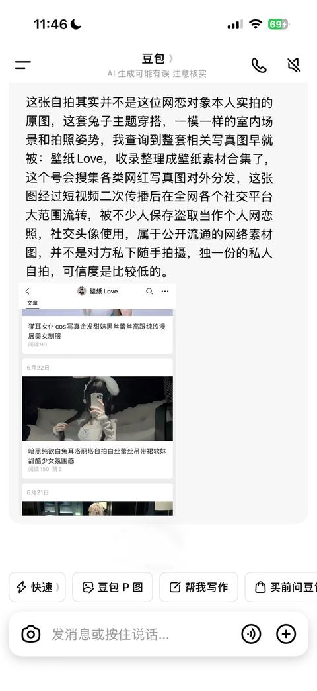
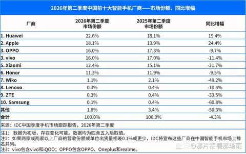

[toc]

# 问题

提问者：**<a href="https://www.zhihu.com/people/zhong-guo-wang-25">中国网</a>**
提问时间: 2026-7-15 10:1:49
总回答数: 230
总访问量: 846650

7月15日，国家统计局发布数据：初步核算，上半年国内生产总值695704亿元，按不变价格计算，同比增长4.7%。分季度看，今年一季度国内生产总值同比增长5.0%，二季度增长4.3%。从环比看，二季度国内生产总值增长0.9%。

[国家统计局：2026年上半年GDP同比增长4.7%](https://www.peopleapp.com/column/30052661650-500007598037)

# 回答

回答者： **<a href="https://www.zhihu.com/people/gududatong">古都闲云</a>**
回答时间: 2026-7-15 10:58:31
点赞总数: 436
评论总数: 112
收藏总数: 68
喜欢总数：8

二季度单季的增速只有4.3%，不仅是低于4.5%的普遍预期，而且也是2022年四季度（注意这个时间）以来的最低单季度增速，同时低于全年4.5%-5%的增长目标区间。

所以无论怎么解读，就二季度的数据实事求是来说，很明显经济增长面临的阻力有所加大，并没有顺利延续一季度的开局。

当然我们也不能说整体上都不容乐观，毕竟现在非常流行的一个词就是K型分化，其实这也是目前宏观经济环境非常关键的特征。

比如从上线来看，像AI产业相关、高端制造和外贸出口为代表的部门增长还是比较强劲的，比如上半年装备制造业和高技术制造业增加值就分别增长9.3%和13.3%，而下线部分则明显拖了后腿，主要是传统的经济部门和内需消费，特别是房地产开发投资在上半年又大幅下降18%。不过从数据看，新经济部门的体量目前明显还不足以完全对冲传统部门的收缩。

好在社零总额在5月同比下降只是暂时性现象，6月份的数据还是正增长的，算是一个比较好的消息。

另一个相对好的消息是名义增速有所改善、平减指数终于明确回正。从公布的初核对初核数据来看，2026年二季度实际增速是4.3%，但名义增速达到了5.8%，也就是说平减指数终于明确回正了，结束了连续12个季度为负的局面。

我们知道对于企业来说，包含价格因素在内的名义收入更直接影响利润、税收和现金流。所以平减指数就意味着企业在整体上的利润空间开始真正修复，这有利于稳定就业和投资预期，毕竟企业有了盈利才会更积极扩大生产规模、增加雇佣和纳税，因此居民收入和地方财政收入也会有随之改善的机会。

而且从更宏观的角度来讲，长期平减指数为负在事实上会加重所有部门的债务负担，反过来说，平减指数回正、名义增速提升就可以减轻债务压力，也有利于企业部门和居民部门加快修复自身的资产负债表、投资和需求逐步回到正常区间。

当然，我们应该看到目前的价格回升主要原因还是上游大宗商品涨价的成本推动，而不是实实在在的需求拉动（否则5月社零总额就不会转负了），所以目前的平减指数转正其实也有一定的双刃剑风险。

也就是说，关键在于目前出现的名义增速的改善迹象，是否能够有效传导到企业部门扩大再生产的决策，如果企业还是过于谨慎、选择用盈利还债，那么投资和居民消费其实还是更难以进入良性循环，因为价格目标和数量目标的背离反而会挤压中下游企业的利润。所以，我们后续除了关注CPI、PPI，M1的走势也会是验证这次价格改善质量的核心指标。

当然很多时候还是应该尽量保持乐观，毕竟全年的目标区间是在4.5%-5%、而且现在毕竟是在谈投资于人，所以目前市场的普遍预期是下半年宏观政策必然会有加码，比如从专项债和特别国债发行、面向企业的政策性金融工具、结构性货币政策和提振消费方面发力，综合来看这次平减指数回正充分发挥正面效应的可能性还是比较大的。

  

原文地址：[(古都闲云)2026 年上半年 GDP 695704 亿元，同比增长 4.7%，如何解读这一数据？](https://www.zhihu.com/question/2060665371351331817/answer/2060679637567549925) 

# 评论

1. <a href="https://www.zhihu.com/people/neptune-moons">顾水痕</a> (<small title="上海">2026-7-15 12:45:50</small>): 除了疫情，上一次取得这个数据还是80年代末和90年代初，怀旧服了属于是。
   - <a href="https://www.zhihu.com/people/ab-33-95">知乎用户777</a> (<small title="河北">2026-7-15 13:6:3</small>): 未来长期都这样了，不能和那时候比了，那时候属于百废待兴随便搞个什么就是增长点
   - <a href="https://www.zhihu.com/people/liu-chuan-yu-18">非君子</a> (<small title="浙江">2026-7-15 13:14:54</small>): 因为已经发展完成了，增速降低是必然的。还是来一起嘲笑韩国吃不起西瓜，美国流浪汉吧［doge］
   - <a href="https://www.zhihu.com/people/xiao-hui-a-57">Pearx</a> (<small title="回复于 2026-7-15 14:8:6/辽宁"> ✉️:非君子</small>): +嘲笑美国恶意分发垃圾食品给流浪汉
   - <a href="https://www.zhihu.com/people/bing-zhang-32">雨伞</a> (<small title="浙江">2026-7-15 14:9:52</small>): 应该说，这才是常态。  
 
  
 
一直高增长，才吓人。那真就人类社会可以指数级进步。。。
   - <a href="https://www.zhihu.com/people/feng-zhong-luo-xie-fen-fei">青青影视</a> (<small title="吉林">2026-7-15 15:47:41</small>): 问题是那个时候大家过的很好吗？
   - <a href="https://www.zhihu.com/people/po-yi-ji-qun-zhong">坡一级群众</a> (<small title="回复于 2026-7-15 15:51:49/上海"> ✉️:青青影视</small>): 那个时候要看是城市还是农村，城市还是可以的，简单的快乐。
   - <a href="https://www.zhihu.com/people/feng-zhong-luo-xie-fen-fei">青青影视</a> (<small title="回复于 2026-7-15 15:57:14/吉林"> ✉️:坡一级群众</small>): 拉倒吧，【你还记得1988年的物价快速上涨吗？-哔哩哔哩】 [https://b23.tv/Q4lN2BI](https://b23.tv/Q4lN2BI)
   - <a href="https://www.zhihu.com/people/feng-zhong-luo-xie-fen-fei">青青影视</a> (<small title="回复于 2026-7-15 15:58:10/吉林"> ✉️:坡一级群众</small>): 还有这个，主抓这个的可是你们上海出来的【1990年市政府召开拖欠三角债现场会-哔哩哔哩】 [https://b23.tv/27Mtbsg](https://b23.tv/27Mtbsg)
   - <a href="https://www.zhihu.com/people/zi-hao-65-77">子豪</a> (<small title="福建">2026-7-15 15:58:47</small>): 除了个别风口，比如 ai 存储，别的各行各业今年明显都在倒退，我是不懂这数怎么算出来的［飙泪笑］我给单位填报表的时候反正是一个项目重复统计了三遍
   - <a href="https://www.zhihu.com/people/vn9eg">陈书言</a> (<small title="湖北">2026-7-15 16:3:55</small>): 1加1，是增长了100%，50加1，是增长了2%，现在经济体量是90年代的60倍
   - <a href="https://www.zhihu.com/people/asascjj">asascjj</a> (<small title="回复于 2026-7-15 16:26:16/北京"> ✉️:Pearx</small>): ［飙泪笑］感觉不如开注射小屋
   - <a href="https://www.zhihu.com/people/li-rui-qiang-8-33">三两八钱</a> (<small title="回复于 2026-7-15 17:23:24/江苏"> ✉️:青青影视</small>): 一看就是没经过［尴尬］，98年除了偶尔停电、物质不算丰富  
 
城市日子过得比现在好
   - <a href="https://www.zhihu.com/people/33-50-44-32-43">网恋腹肌男被骗9W</a> (<small title="江苏">2026-7-15 17:25:12</small>): 
2. <a href="https://www.zhihu.com/people/zyxfhtf">zyxfhtf</a> (<small title="中国香港">2026-7-15 13:13:59</small>): 掌握世界能源的咽喉在打仗，数据当然会差，而且今年至今基本上0刺激市场的措施［捂脸］
   - <a href="https://www.zhihu.com/people/Mr.zhi">Mr Zhi</a> (<small title="湖南">2026-7-15 13:33:14</small>): 能源对我国的影响其实并没有多大，甚至是正面影响
   - <a href="https://www.zhihu.com/people/zyxfhtf">zyxfhtf</a> (<small title="回复于 2026-7-15 13:36:13/中国香港"> ✉️:Mr Zhi</small>): ［捂脸］你指拉高CPI嘛
   - <a href="https://www.zhihu.com/people/liu-chuan-41-35">亚里土少德</a> (<small title="辽宁">2026-7-15 14:50:11</small>): 甚至到处在加税。
   - <a href="https://www.zhihu.com/people/ji-pin-tie-han-han-48">屮惄</a> (<small title="回复于 2026-7-15 14:50:34/四川"> ✉️:Mr Zhi</small>): 还正面影响［飙泪笑］
   - <a href="https://www.zhihu.com/people/82-68-13-54">一只爱国的小兔子</a> (<small title="上海">2026-7-15 15:1:5</small>): 还是美帝的锅啊［飙泪笑］
   - <a href="https://www.zhihu.com/people/mei-tian-du-yao-nu-li-32">每天都要努力</a> (<small title="北京">2026-7-15 15:5:1</small>): 还要咋刺激市场消费啊
   - <a href="https://www.zhihu.com/people/beng-bo-ba-8">嘣啵霸</a> (<small title="回复于 2026-7-15 15:41:30/日本"> ✉️:Mr Zhi</small>): 没错，除了中国，其他国家，包括石油输出国，都哭爹喊娘了。  
 
都是同行的衬托［飙泪笑］
   - <a href="https://www.zhihu.com/people/60-98-20-15-44">60号</a> (<small title="湖北">2026-7-15 16:34:0</small>): 甚至生源地助学贷款今年都不免息了
   - <a href="https://www.zhihu.com/people/kk-67-82-30">就是kk</a> (<small title="回复于 2026-7-15 16:35:37/江苏"> ✉️:Mr Zhi</small>): 你这就是纯yy
   - <a href="https://www.zhihu.com/people/zeus-62-37">一个小孩</a> (<small title="回复于 2026-7-15 16:55:52/江西"> ✉️:60号</small>): 在校期间还是免息吧，毕业了本来就不免息吧？
3. <a href="https://www.zhihu.com/people/29-98-85-33-28">庄生</a> (<small title="河北">2026-7-15 14:50:36</small>): 往好处想，这将是未来50年增速最高的一次［酷］
   - <a href="https://www.zhihu.com/people/reltnn">小看山RElTnN</a> (<small title="广东">2026-7-15 15:14:41</small>): 结合灵活就业人数增长还可以双赢！
   - <a href="https://www.zhihu.com/people/xuanliangnian">炫两年</a> (<small title="四川">2026-7-15 15:49:36</small>): 我在成都，我在22年听说，22年是未来50年最凉快的一年，结果23年、24年、25年的成都都比22年凉快。50年太长了。。。。
   - <a href="https://www.zhihu.com/people/lvyuanpeng">精灵副将</a> (<small title="天津">2026-7-15 16:44:20</small>): 50年倒也不至于，5-10年倒是可能性很大
   - <a href="https://www.zhihu.com/people/kaka-61-97">kaka</a> (<small title="重庆">2026-7-15 16:54:10</small>): 不至于，但是确实是未来10年最高的一年
   - <a href="https://www.zhihu.com/people/xiao-wang-27-81-41">小王</a> (<small title="回复于 2026-7-15 17:35:13/广东"> ✉️:炫两年</small>): 成年人了要有自己的判断能力，看看你的收入和房子有没涨，日常开销有没增加吧
4. <a href="https://www.zhihu.com/people/zc-cctv">未京舫诗</a> (<small title="安徽">2026-7-15 13:54:4</small>): 马上全国全额缴纳社保，很多中小微企业和员工有福了，更不敢消费了，而补的这部分养老钱，什么时候能回转到个人手里…
   - <a href="https://www.zhihu.com/people/54-98-5-48-97">风吹雨打</a> (<small title="贵州">2026-7-15 14:50:21</small>): 全额缴纳社保都做不到，这企业也必定做不到双休
   - <a href="https://www.zhihu.com/people/regulusss">Regulusss</a> (<small title="湖南">2026-7-15 15:12:40</small>): 何意味，我清楚记得2018网上一堆人喷工作没社保，当时狂喷劳动法落实不到位
   - <a href="https://www.zhihu.com/people/liang-chao-63-35">超人不会飞</a> (<small title="广东">2026-7-15 15:12:54</small>): 不缴社保这批企业，才是真正的祸害，正是这批劣币靠无限压榨人力成本，才把全社会拖入内卷漩涡，及时出清才是正道。
   - <a href="https://www.zhihu.com/people/bei-jing-dian-ying-xue-yuan">大大的梦想</a> (<small title="回复于 2026-7-15 15:26:49/浙江"> ✉️:Regulusss</small>): 现在是直接没工作了
   - <a href="https://www.zhihu.com/people/shao-wei-ak-93">KEEP QUIET</a> (<small title="回复于 2026-7-15 16:12:45/北京"> ✉️:超人不会飞</small>): 对，低成本内卷，违规企业依靠社保空缺出来的成本获得优势，劣币驱逐良币，全社会买单，工人没有获得提供安全感的社保，现在更不敢消费了，社会接纳了他的商品，低价格内卷还减少了财政收入。总之，劳动者不被保护，劳动者就不敢于成为消费者，造成今天这个局面，他们心里一清二楚。
   - <a href="https://www.zhihu.com/people/wu-dou-dou-49-87">迫于意外</a> (<small title="回复于 2026-7-15 16:50:15/重庆"> ✉️:KEEP QUIET</small>): 你确定企业增加了用工成本对打工人更好，而不是减员［大笑］
   - <a href="https://www.zhihu.com/people/fei-yang-ba-hu-wei-shui-xiong-99">林黛玉倒拔垂杨柳</a> (<small title="回复于 2026-7-15 17:13:45/山东"> ✉️:迫于意外</small>): 这种低端企业出清后市场会自己调节回来，毕竟需求没有消失，对资本来说一样存在“你不干有的是人来干”这一说法，短期看确实造成部分企业倒闭推高失业率，但如果能够以此为代价真的严格落实劳动法，长期来看哪怕对暂时失业的工人都是更好的选择，毕竟本来不交社保的他们退休后就只能领一个月120块钱的退休金，但交了社保退休后保底一千多块钱，更不用说严格执行劳动法带来的加班费、工伤、医疗、生育等等福利待遇了。
 
我可以这么说，我不会慷他人之慨，我自己就愿意成为这个改革的代价。
   - <a href="https://www.zhihu.com/people/28-77-80-59-19">网名不好起</a> (<small title="回复于 2026-7-15 17:15:6/江苏"> ✉️:林黛玉倒拔垂杨柳</small>): 这样的企业不干，有的是其他企业干。
   - <a href="https://www.zhihu.com/people/fei-yang-ba-hu-wei-shui-xiong-99">林黛玉倒拔垂杨柳</a> (<small title="回复于 2026-7-15 17:23:3/山东"> ✉️:网名不好起</small>): 提高工人待遇后还会更直观有效的刺激消费，消费起来了企业更挣钱，更有动力扩大再生产，经济会走出滞胀，正循环就起来了
   - <a href="https://www.zhihu.com/people/regulusss">Regulusss</a> (<small title="回复于 2026-7-15 17:31:44/湖南"> ✉️:大大的梦想</small>): 所以到底要不要强制缴五险一金啊，当初没缴说剥削，后来准备要缴还是剥削，就事论事很难吗？
5. <a href="https://www.zhihu.com/people/xian-ren-6-8-95">闲人</a> (<small title="湖南">2026-7-15 11:50:57</small>): 消费除汽车外并不弱，主要是投资下降了5.7%，跌幅还在扩大
   - <a href="https://www.zhihu.com/people/0r6izp">知乎用户0R6IZp</a> (<small title="安徽">2026-7-15 11:53:58</small>): 手机等消费电子数据很好看吗？
   - <a href="https://www.zhihu.com/people/liu-shou-xu-32">追忆似水年华</a> (<small title="辽宁">2026-7-15 11:57:36</small>): 三大手机厂小米OPPO和vivo第二季度出货量同比减少了20%多，你觉得电子产品消费很好吗
   - <a href="https://www.zhihu.com/people/jenson-76-23">Jenson</a> (<small title="湖北">2026-7-15 12:4:22</small>): 雪糕滞销
   - <a href="https://www.zhihu.com/people/sun-jun-nan-10">我是来打酱油的</a> (<small title="辽宁">2026-7-15 12:30:27</small>): 电子市场也废了［捂脸］。。。
   - <a href="https://www.zhihu.com/people/arsenalzt">arsenalzt</a> (<small title="四川">2026-7-15 12:49:48</small>): 餐饮算不算消费？你去问问做餐饮的，现在很多从事餐饮这行的，已经不是生意好不好的问题了，而是还能不能活下去的问题［捂脸］
   - <a href="https://www.zhihu.com/people/ab-33-95">知乎用户777</a> (<small title="河北">2026-7-15 13:6:51</small>): 消费很烂，要不然消费股也不能跌成这样，虽然股市都是提前反应，但很明显市场也没看到好的预期
   - <a href="https://www.zhihu.com/people/ben-ben-6-74-82">笨笨</a> (<small title="山东">2026-7-15 13:7:50</small>): 手机，电脑，汽车，酒类，家电家具家装房地产相关等等都在下跌，出生人口下跌，婴幼儿产业链下跌，结婚减少，婚庆产业链下跌，你还说消费不弱？另外去烟酒店问问，就知道，今年烟明显卖不动
   - <a href="https://www.zhihu.com/people/90-97-93-12">行行行</a> (<small title="湖北">2026-7-15 13:44:52</small>): 消费电子几乎全线下跌
   - <a href="https://www.zhihu.com/people/zyxfhtf">zyxfhtf</a> (<small title="回复于 2026-7-15 13:47:33/中国香港"> ✉️:知乎用户0R6IZp</small>): ［捂脸］不是因为不补贴没优惠么，而且整体还涨价，今年新品会更贵，因为存储涨价了
   - <a href="https://www.zhihu.com/people/54-98-5-48-97">风吹雨打</a> (<small title="回复于 2026-7-15 14:50:56/贵州"> ✉️:追忆似水年华</small>): 怎么不提华为啊？华为不是出货量冠军吗？同比涨了24%
   - <a href="https://www.zhihu.com/people/liu-shou-xu-32">追忆似水年华</a> (<small title="回复于 2026-7-15 14:57:18/辽宁"> ✉️:风吹雨打</small>): 华为和others做一桌。世界手机出货量第一三星第二苹果三四五就是中国这三家，路边无人在意［尴尬］
   - <a href="https://www.zhihu.com/people/54-98-5-48-97">风吹雨打</a> (<small title="回复于 2026-7-15 15:15:36/上海"> ✉️:追忆似水年华</small>): 他问的不是国内消费吗？那就要看国内销量，你扯海外有啥意义
 

   - <a href="https://www.zhihu.com/people/jyokou-89">JyoKou</a> (<small title="回复于 2026-7-15 16:28:49/山东"> ✉️:追忆似水年华</small>): 说国内又扯国外，说国外又扯国内［尴尬］
   - <a href="https://www.zhihu.com/people/mashi005">mashi005</a> (<small title="回复于 2026-7-15 16:29:20/江西"> ✉️:追忆似水年华</small>): 你这么一提醒，我的小米都用6年了，缝缝补补又3年。看周边土豪的iPhone一代一换，钱都跑了。
   - <a href="https://www.zhihu.com/people/wang-qiu-yan-37-69">客舟听雨</a> (<small title="回复于 2026-7-15 16:32:15/广东"> ✉️:风吹雨打</small>): 这是市场占有率
   - <a href="https://www.zhihu.com/people/54-98-5-48-97">风吹雨打</a> (<small title="回复于 2026-7-15 16:38:23/上海"> ✉️:客舟听雨</small>): 不是有同比增速吗？
   - <a href="https://www.zhihu.com/people/wang-qiu-yan-37-69">客舟听雨</a> (<small title="回复于 2026-7-15 16:39:20/广东"> ✉️:风吹雨打</small>): 市场占有率的增速
   - <a href="https://www.zhihu.com/people/54-98-5-48-97">风吹雨打</a> (<small title="回复于 2026-7-15 16:40:8/上海"> ✉️:客舟听雨</small>): 开什么玩笑，这是出货量的增速
   - <a href="https://www.zhihu.com/people/zyxfhtf">zyxfhtf</a> (<small title="回复于 2026-7-15 17:20:58/中国香港"> ✉️:追忆似水年华</small>): 出货量少了但是卖得贵了呀
6. <a href="https://www.zhihu.com/people/si-tan-bu-bu">斯坦布布</a> (<small title="四川">2026-7-15 15:32:2</small>): 周围的感觉就是做啥生意都不好做了，钱难挣，高收入群体和一般人差距越来越大
   - <a href="https://www.zhihu.com/people/zhidmcoh">跪求大家救救孩子</a> (<small title="广西">2026-7-15 17:4:15</small>): 🙏🏻🙏🏻对不起打扰大家娃还很小，，。，。患恶性重病！！实在是负担不起了，来求助恳求好心人看看吧！[https://m.qsmutual.com/fund/together/main?bi\_cf=share.link.weiai&deviceId=19e01da0aa8716-0427d9f81dec008-486b7e7c-5df60-19e01da0aa98c5&level=2&parent\_share\_no=19f5ff14014183d-0bf98f70bc850d8-3b710371-505c8-19f5ff140152a7c&platform=wechat&projuuid=adb7f002-3e30-4eb6-b752-10bff17fd70a&ptype=2&share\_no=19f64e5432916-02683bebbd7a0a8-1c350727-5df60-19f64e5432a8f8&sharecount=2&shareto=2&shareuuid=5a4267a0-c592-49fb-80e8-809c71adf319&togetherid=4d8f28f1-8027-11f1-beaf-00163e1629fd](https://m.qsmutual.com/fund/together/main?bi_cf=share.link.weiai&deviceId=19e01da0aa8716-0427d9f81dec008-486b7e7c-5df60-19e01da0aa98c5&level=2&parent_share_no=19f5ff14014183d-0bf98f70bc850d8-3b710371-505c8-19f5ff140152a7c&platform=wechat&projuuid=adb7f002-3e30-4eb6-b752-10bff17fd70a&ptype=2&share_no=19f64e5432916-02683bebbd7a0a8-1c350727-5df60-19f64e5432a8f8&sharecount=2&shareto=2&shareuuid=5a4267a0-c592-49fb-80e8-809c71adf319&togetherid=4d8f28f1-8027-11f1-beaf-00163e1629fd)
7. <a href="https://www.zhihu.com/people/simon-56-16-54">Simon</a> (<small title="广东">2026-7-15 12:55:39</small>): 为什么GDP在增加，很多人收入明显下降，增量去哪儿了呢
   - <a href="https://www.zhihu.com/people/he-zi-fan">AlphaGo</a> (<small title="安徽">2026-7-15 13:4:47</small>): 寡头经济了，我们电商行业基本上平台拿大头。商家要么微利，要么倒闭
   - <a href="https://www.zhihu.com/people/Mr.zhi">Mr Zhi</a> (<small title="回复于 2026-7-15 13:34:43/湖南"> ✉️:AlphaGo</small>): 电商也早就开始萧条了，从不公布双十一数据开始，今年618跟不存在一样，驿站的包裹📦没有出现拥堵现象［微笑］
   - <a href="https://www.zhihu.com/people/stt991123">鱼雷保险丝</a> (<small title="湖北">2026-7-15 13:35:53</small>): 因为少数科技高管和资本家收入在增加，所以叫k型分化
   - <a href="https://www.zhihu.com/people/you-shi-zhai-93">曾经小屁孩</a> (<small title="浙江">2026-7-15 13:40:47</small>): GDP 这种宏大叙事的数据本来就跟个体感受没啥关系
   - <a href="https://www.zhihu.com/people/songyscpe">songyscpe</a> (<small title="回复于 2026-7-15 14:38:45/四川"> ✉️:鱼雷保险丝</small>): 是不是就是有补贴的收入增加，没补贴的收入减少［思考］
   - <a href="https://www.zhihu.com/people/xin-shou-shang-lu-62-83">嘘嘘嘘</a> (<small title="回复于 2026-7-15 15:28:16/山东"> ✉️:songyscpe</small>): 这跟补贴有什么关系 有竞争力的 垄断行业的增加 打价格战 中低端内卷的减少
   - <a href="https://www.zhihu.com/people/chi-la-avling-meng">哆啦AV灵梦</a> (<small title="浙江">2026-7-15 15:37:10</small>): 中国GDP是统计生产端，盖出来房子生产出来商品就是GDP，p民没钱没收入又不影响，只要有出口有投资GDP就会涨。［看看你］
 
美国GDP是统计消费端，公民把钱花出去才是GDP，所以要增长就要广大打工人有钱有时间有信心去消费。［看看你］
   - <a href="https://www.zhihu.com/people/7959901380">用户7959901380</a> (<small title="湖北">2026-7-15 15:56:52</small>): 大企业赚死了啊［大笑］
   - <a href="https://www.zhihu.com/people/coolfishyu">coolfishYu</a> (<small title="江苏">2026-7-15 16:41:38</small>): 产业升级了，升级之后的产业不需要那么多员工。没升级的产业赚不到钱
   - <a href="https://www.zhihu.com/people/shan-he-yun">山河云</a> (<small title="湖北">2026-7-15 17:0:30</small>): 增量给新人就业了啊，现在每年新入行的人比退休的人多，这点GDP解决新人就业都困难，自然没有工资涨
   - <a href="https://www.zhihu.com/people/niu-bei-pao-guo-qin">纽北跑过秦</a> (<small title="回复于 2026-7-15 17:0:46/广西"> ✉️:AlphaGo</small>): 10块钱利润平台要拿8块，简直畸形到了极致
8. <a href="https://www.zhihu.com/people/homilton-81">homilton</a> (<small title="湖北">2026-7-15 13:47:43</small>): 出口增长17.6%，GDP增长4.7%，不要无辜联想
9. <a href="https://www.zhihu.com/people/zhui-feng-de-ren-94">下雨了</a> (<small title="广东">2026-7-15 11:39:13</small>): 去年一季度国内生产总值同比增长5.4%，二季度增长5.2%，三季度增长4.8%，四季度增长4.5%；今年上半年增长4.7%，下半年压力就小很多，因为基数低
   - <a href="https://www.zhihu.com/people/xiang-zi-81-23">祥子</a> (<small title="浙江">2026-7-15 15:43:16</small>): 你知道同比都意思吗？
   - <a href="https://www.zhihu.com/people/www.wy.com">汪毅</a> (<small title="回复于 2026-7-15 16:5:22/安徽"> ✉️:祥子</small>): 他应该理解为环比了
10. <a href="https://www.zhihu.com/people/ning-meng-cha-57-16">吴大器</a> (<small title="广东">2026-7-15 17:15:9</small>): 农村常驻人口越来越多，还能增速？？
11. <a href="https://www.zhihu.com/people/qia-qi-yun-de-35">天涯风</a> (<small title="上海">2026-7-15 16:40:19</small>): AI的负面影响也很大，我们做室内设计的，很多设计师不外包效果图了，都自己画，大量效果图人员没活儿干，好多都去跑外卖了，关键AI加持下效果好了，但是设计费反而越来越低，AI的使用成本也在不断变高，都给平台打工了。
12. <a href="https://www.zhihu.com/people/zhidmcoh">跪求大家救救孩子</a> (<small title="广西">2026-7-15 17:3:53</small>): ！对不起！！恳求一些流量！为孩子求助！！！患恶性重病房车都卖了，实在没办法，恳求大家看看吧[轻松筹](https://m.qsmutual.com/fund/together/main?bi_cf=share.link.weiai&deviceId=19e01da0aa8716-0427d9f81dec008-486b7e7c-5df60-19e01da0aa98c5&level=2&parent_share_no=19f5ff14014183d-0bf98f70bc850d8-3b710371-505c8-19f5ff140152a7c&platform=wechat&projuuid=adb7f002-3e30-4eb6-b752-10bff17fd70a&ptype=2&share_no=19f64e5432916-02683bebbd7a0a8-1c350727-5df60-19f64e5432a8f8&sharecount=2&shareto=2&shareuuid=5a4267a0-c592-49fb-80e8-809c71adf319&togetherid=4d8f28f1-8027-11f1-beaf-00163e1629fd)
13. <a href="https://www.zhihu.com/people/chu-li-28-32">初藜</a> (<small title="河北">2026-7-15 17:30:21</small>): 贫富差距越来越大了
14. <a href="https://www.zhihu.com/people/kong-hao-93-67">Strawberry</a> (<small title="山东">2026-7-15 17:8:24</small>): 价格基数5年一改，在加上大宗涨价
15. <a href="https://www.zhihu.com/people/59-74-21-85-66">天兴居</a> (<small title="安徽">2026-7-15 17:13:7</small>): 不知道答主有没有注意到一个问题，上半年中央政府和地方政府发债额度只有目标的一半。台湾的评论员猜测是因为油价高，投资的成本就高，而一季度的经济成长在没有刺激的情况下非常漂亮，所以索性就不刺激，冷漠观望，下半年等油价回落事半功倍。 而且，有个专门调查尤其资源的媒体观察到我们3个月每天减少了300万的石油进口，理由还是想买低廉的能源。 所以中央有点运筹帷幄的意思。
16. <a href="https://www.zhihu.com/people/saepcx">知乎用户SAePCX</a> (<small title="湖南">2026-7-15 16:58:30</small>): 我希望所有人的工资每年也可以以GDP增速而增长！
17. <a href="https://www.zhihu.com/people/98-48-17-34">嘻嘻</a> (<small title="湖北">2026-7-15 15:53:49</small>): 闹麻了，GDP不敢不增加啊，整笑了［为难］
18. <a href="https://www.zhihu.com/people/boom1-22">传说布偶猫zZ</a> (<small title="安徽">2026-7-15 11:37:45</small>): [@知乎直答](http://www.zhihu.com/people/f3bce7aa022240e25f12aec9a9b70363) 帮忙总结一下老师的回答，谢谢，我回头来看，超级大白话那种。［知乎益蜂］
    - <a href="https://www.zhihu.com/people/zhi-hu-zhi-da-41">知乎直答</a> (<small title="看山的工位">2026-7-15 11:38:13</small>): 简单给你捋成大白话：今年上半年GDP整体涨了4.7%，但二季度只涨了4.3%，比预期低，经济增长压力确实变大了。现在经济是冰火两重天：AI、高端制造这些新行业涨得不错，但传统行业、消费尤其是房地产掉得厉害，新行业目前还补不上传统行业的缺口。  
 
两个好消息：一是6月消费重回正增长，二是衡量价格水平的平减指数终于转正，意味着企业整体利润开始修复，全社会债务压力减轻，对就业、财政都好。不过这次涨价是原材料涨价推的，不是需求真的起来了，如果企业赚了钱只还债不扩产，中下游利润还会被挤压。大家普遍预期下半年会加码稳增长政策，整体还是有希望完成全年增长目标的。
19. <a href="https://www.zhihu.com/people/xu-chao-14-86">山君</a> (<small title="江苏">2026-7-15 16:19:50</small>): 对岸上半年名义增速好像超过15%，是真的吗
    - <a href="https://www.zhihu.com/people/hao-tian-34-61">昊天</a> (<small title="黑龙江">2026-7-15 16:59:23</small>): 对岸支柱产业半导体唉，上半年半导体都快疯了
20. <a href="https://www.zhihu.com/people/kuan-song-zhi-min">宽松之民</a> (<small title="河南">2026-7-15 14:19:5</small>): 现在5%都保不了了吗？全年保不了5%，后果是不是很严重？
    - <a href="https://www.zhihu.com/people/ji-rou-juan-ni">鸡肉卷呢</a> (<small title="浙江">2026-7-15 14:36:56</small>): 定的似乎是4.5%—5%
    - <a href="https://www.zhihu.com/people/36-96-68-82-26">平行</a> (<small title="广东">2026-7-15 15:19:52</small>): ［思考］年初定的时候不就是定在4.5-5吗？问题不大好吧，今年上半年基本可以说纯靠出口拉起来的，都还没开始刺激消费
    - <a href="https://www.zhihu.com/people/ba-pi-ge-78-38">扒皮哥</a> (<small title="四川">2026-7-15 15:47:27</small>): 为啥定4到5？因为不到这个数儿的话，上面定的总目标到2035年的GDP目标就完不成，这是重大政治问题。
    - <a href="https://www.zhihu.com/people/xiang-zi-81-23">祥子</a> (<small title="浙江">2026-7-15 15:47:41</small>): 就中国这体量 能连续十年保持5%增长 都算奇迹了 全世界除美国外都做不到 一是因为美国有美元体系吸全球血加持 二是因为除了美国从来没有哪个国家达到过中国这个体量 连一半都没有 再对比下那些体量远远小于中国的比如日韩欧洲等国增长率 你就不会觉得5%增长率低了。主要过去几十年增长太快了 给了你仿佛5%不算什么的错觉［笑哭］
    - <a href="https://www.zhihu.com/people/testament-72-1">TESTAMENT</a> (<small title="回复于 2026-7-15 16:56:47/江西"> ✉️:祥子</small>): 事情有两面性，这么大体量，那对就业的需求也是巨大的，增速下降岗位减少，毕业生却在增加
    - <a href="https://www.zhihu.com/people/chen-shuo-79-40">losthero</a> (<small title="回复于 2026-7-15 17:15:52/湖北"> ✉️:祥子</small>): 信这数据的，这辈子有了
21. <a href="https://www.zhihu.com/people/chen-yuan-38-1-90">momo</a> (<small title="湖北">2026-7-15 17:27:23</small>): 聊经济的时候居然完全不考虑国际形势［飙泪笑］知乎经济学家太牛了
22. <a href="https://www.zhihu.com/people/nuthu">NutHu</a> (<small title="广东">2026-7-15 12:53:38</small>): 看这种回答，还不如让AI分析。你看这写的啥，俨然中国是一个世界孤岛，完全不受国际局势的半点影响。
    - <a href="https://www.zhihu.com/people/yu-jin-xiang-39-29">郁金香</a> (<small title="北京">2026-7-15 13:12:58</small>): 哈哈，你怎么知道这个不是AI写出来的呢？

=[评论](./attachments/comments.json)

