[toc]

# 问题

提问者：**<a href="https://www.zhihu.com/people/71-65-91-84-1">太极说</a>**
提问时间: 2025-10-19 10:30:18
总回答数: 430
总访问量: 7247114

华人移民欧美三代之后，华人文化是否基本灭绝？

# 回答

回答者： **<a href="https://www.zhihu.com/people/liu-lin-57-66">吾牧之</a>**
回答时间: 2026-1-11 19:49:14
点赞总数: 27959
评论总数: 1566
收藏总数: 15315
喜欢总数：5895

因为欧美有一种超能力，哪怕你是中国达官贵人家的公子小姐，人家也能够让你自惭形秽，让你疯癫，让你坦诚的接受自己是一个劣等人。

这个最好举举例子，而最好的例子就是蒋宋孔三大家族。

虽然说是什么蒋宋孔陈四大家族，但是人家蒋宋孔是实在亲戚，陈氏兄弟还离着远了点

所谓的蒋宋孔陈四大家族，其实是个噱头，里面那个陈家无非是来凑个数的。

四大家族的称谓亦如四喜丸子

四喜总是好过三喜，有四喜丸子而绝对没有三喜丸子。

解放战争胜利后，蒋宋孔三家逃到了台湾，后来又都陆续去了美国

先说蒋家

老蒋有一个儿子，一个养子，老蒋的儿子蒋经国有四个孩子

蒋经国的长子蒋孝文是一个花花公子，在国内的时候就不安分。

去了美国之后，干脆就成了酒鬼，三十五岁就把自己喝成了瘫痪

蒋孝文平素不学无术，人品败坏，他喜欢开车，尤其喜欢酒后开车，曾经撞死了无辜路人张慧云；喜欢玩女人，把军人福利社的女服务员玩弄后抛弃，让人家上吊自杀；他甚至曾经开枪射杀老蒋的卫士李之楚

老蒋让他念军校，他在就读期间，只去舞厅不去教室

为了争夺一个漂亮舞女，不仅掏枪示威，而且殴打前来维持秩序的军警

这号混世魔王，自然最后被军校开除

老蒋面上无光，找了个蒋孝文有鼻炎的理由给他办了退学。

退了学，也不能不学啊，老蒋的孙子连个大学文凭都没有，说出去也不好看

转去大学读书？就他这个混世魔王的样子，还不定干什么丢人事呢！

只好留学，换个风水

老蒋自己也是留学生，是去了日本之后转了性，所以老蒋觉得让孙子留学也不失是一个办法

但是这里就又有了一个问题，老蒋前不久刚刚下令不准私人留学！

事情是这样的，当时国民党高官都和疯了一样的把小孩往美国送，老蒋很生气，认为他们这是对在台湾站稳脚跟没有信心，送小孩去美国读书是假，让小孩替他们去美国打前站是真，无非是为了将来往美国逃命罢了。

于是勒令高中生们不允许去美国留学

但是亲孙子这么不争气，老蒋也没法子了

自己说出去的话，也没法往回咽，于是他就钻了个空子：私人留学照旧不行，公费留学是允许的

私人留学是对在台湾站稳脚跟没有信心，公费留学，那是为了国家科学进步

说的倒是冠冕堂皇，但是大家都是知道是怎么回事的

于是，老蒋为了能够让他的宝贝孙子蒋孝文留学，指令伪教育部专门办了一个高中毕业菁英 **公费** 赴美留学考试

打着送高中生去美国公费留学的旗号，把自己的宝贝孙子也送去了美国。

这一次大家算是沾了蒋大少爷的光，不仅能够去美国，而且还是公费

至于名单上的人么？猜都不用猜，一准是家庭条件特别好的高中毕业菁英

这当然引发了人们的侧目，于是雷震写文章笑话蒋孝文无能，老蒋食言而肥

老蒋竟然罕见的保持了沉默

靠着爷爷作弊，蒋孝文去了美国之后，就读于加州大学伯克利分校企业管理专业

别看蒋公子就读的专业高大上，但是蒋公子根本就不读书，照样是花天酒地——而且酒瘾越来越大，至于原因么？据他自己说是难以忍受中美文化的差异

去了不到两个月，就已经有精神病的意思了

这样的公子哥，在美国这个有钱人的天堂，何以会这个样子？原因那就颇值得思考了。

老蒋听说大孙子成了这个德行，很是不放心，联想自己早年的经验，觉得孙子是缺女人。

于是大笔一挥派了徐锡麟的孙女徐乃锦去美国照顾他

说起来这个徐乃锦了，她的母亲是德国人。

彼时国民党的高层，已经看不上中国人了，结婚都得是找洋人才好

徐乃锦因为母亲的缘故，已经在德国就读大学了。

是国民党硬把她从德国转学去了蒋大少爷的学校的。

至于目的么？明眼人都知道，就是让徐乃锦伺候蒋孝文，从各方面慰藉蒋家大少爷的异乡孤独感（按照蒋孝文的话，就是中美文化差异）

这个说实在的十分侮辱人，惹得徐乃锦的父亲，也就是徐锡麟的儿子徐学文，勃然大怒

徐锡麟的公子这号过气儿人物，怒不怒的其实也无所谓

更何况了，徐学文当时担任台湾的烟酒专卖局局长，拿人饭碗受人管，也由不得他不同意。

小蒋做了做工作，徐学文就同意

婚后蒋孝文着实安稳了一阵子，但是随着徐乃锦怀孕，他那个邪火没地方撒了

于是越发的疯了，终于在1964年酒驾出了车祸，因为在法庭上辱骂法官（其实从蒋孝文的角度来说，他有理由生气，因为在中国的时候蒋家大少爷撞死人都不算犯罪，来了美国撞坏个隔离柱就被拘留了）且涉嫌保险诈骗，被美国人赶出了美国，如此自然也就没拿到学位

蒋家的大少爷，还真就没大学学历

老蒋对此很是失望。

蒋孝文回到台湾后，也安排了工作，任台湾电力公司桃园区管理处处长，他的主要工作是带着流氓去眷村问给他爹，他爷爷卖命的老兵讨要水电费

此时他已经是一副精神病的样子了，谁敢惹他呢？所以竟然能够如数催缴

由于他的精神疾病已经很严重了，但是又没什么理由让他发疯

所以坊间流传他的疯癫是因为梅毒的原因——他的梅毒已经到了能够损伤大脑的地步

甚至还有很多人据此认为，蒋孝文那发生在1970年，并最终让他终身瘫痪、智力衰退的昏厥，不是因为糖尿病和过量饮酒导致，而是因为梅毒爆发导致（这个我觉得不大可靠，因为当时已经有青霉素了）

是的，蒋孝文从美国回来后第六年就瘫痪了，智力退化到六岁水平。

当然了在他发疯到瘫痪的五年时间里，他还是抓住一切可以抓住的机会干了不少坏事。

其中最离谱的是奸污了（一说是诱奸，还有一说是追求未遂）时任台北市长高玉树的儿媳妇吴纯纯，并杀害了高玉树的长子高成器

高市长虽然是台北市长，但是其实不是老蒋那一派的。

他是本省人，是无党籍人士，于是有冤无处诉，只能含垢忍辱

为了表示无声的抗议，这位高市长亲自操办了他儿子和儿媳妇的冥婚

需要说一点，这个高玉树和前面的雷震是好朋友，也难说蒋孝文不是出于报复的动机才这么做的。

蒋孝文在去美国之前是混蛋公子哥，但是在美国待了这么几年就蜕变成了发疯的混蛋公子哥

在美国的四年经历对于他可真是人生的转折点

至于蒋孝文何以在美国染上酒瘾和发了精神病，你就猜吧

肯定不是看棒球赛看的太多，在美国过得太爽导致的

蒋孝文的旅美经历代表了公子哥赴美的一大结局：成为废人

小蒋的大女儿蒋孝章，品学兼优且相貌周正，在蒋孝文去美国后第二年也去美国留学。

小蒋托台湾的伪国防部部长俞大维之子，已经离过两次婚，且比蒋孝章大十几岁的俞扬和代为照顾这个品学兼优，相貌端正的第一千金。

结果一来二去，两人刚接触不到半年，俞扬和就把小蒋的第一千金照顾到床上去了

蒋孝章成了被俞扬和玩弄的情妇

于是国民党内部就说了，是小蒋安排女儿勾引俞扬和的。

目的是为了能够拉拢掌握台湾那个伪国防部的俞大维

气的小蒋大骂俞大维，甚至打上门去，把俞大维的办公室给砸了。

小蒋本来是打算强令两人分手的，但是蒋孝章肚子都被玩大了，而且因为月份大没法打胎。

小蒋没了法子，天天气的团团转，又没个章程。

最后还是疼孙女的爷爷老蒋和奶奶宋美玲出面，才把这个事情安排了算完

两人是1960年8月结婚的，结婚场面十分冷清，宾主尴尬（1961年5月女儿就出生了，所以估计是大着肚子结婚的）

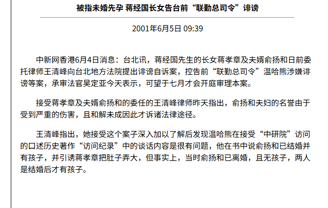

至于这个一贯表现良好，喜欢读书，尤其喜欢读哲学的第一千金怎么成了老男人俞扬和的玩物，这个事情么，就仁者见仁智者见智了

反正肯定不是在美国看迪士尼看的太开心的结果

这是堕落结局。

不过也算是小蒋的第一千金走了大运，找了个中国男人，要是找了个美国男人，那可完蛋咯

说不定得被家暴

前一阵子不是有中国的大小姐，让他那个无业的外国男朋友殴打死了么？

虽然吧，我说了类似于玩弄之类的话

但是其实这是不带有人格诋毁的色彩的，因为老男人和比自己小十几岁的小姑娘谈恋爱，确实也只能认为是玩弄。大家的社会阅历完全不是一个层面。

而且玩弄这种东西，如果是长期的对一个特定对象的专一的玩弄。

也不是不能够理解为是某种意义上的爱情（有点畸形就是了）

更何况了，人家兴许就是爱情。

蒋孝文留美留成了酒疯子，蒋孝章留美留成了老男人俞扬和的玩物，小蒋觉得老美那边可能不大对劲

于是就让因为殴打辱骂教官被军校开除的老三蒋孝武去了德国，留学归来之后，蒋孝武成了中美关系研究专家（德国也有美国人不是么？）

他还算是正常的，毕竟江南案也不是一般人能够犯下的

现在蒋家的儿子里面就剩下蒋孝勇了，小蒋一看没准老小可以接班

于是送老小蒋孝勇也读了军校，老小蒋孝勇倒是挺刻苦，至少没有迟到早退，殴打教官

但你以为蒋孝勇就能读出军校来么？他到底也是吃不了苦，想退学，又怕亲爹小蒋生气——这位三少爷于是就想到了绝妙的办法，自残

他故意在训练中把自己的脚踝跌成骨折

气的他爹在日记里骂他

1970年3月9日：“勇儿以因公务受伤之理由，办理退学与转学之手续， **明知此为欺人自欺之作** ，但是事实如此， **如何使我不自感惭愧耶** 。”

两年后，蒋经国去伪军校参加校庆，看见伪军校的伪军官们一个个神气活现的

不禁想起了自己喝成瘫痪的大儿子孝文，殴打教官被开除的二儿子蒋孝武，自残装病的小儿子蒋孝勇

一想三个宝贝儿子都是这个德行，小蒋便是悲从中来

1972年6月19日日记：“军校校庆前夕宿于军校之春晖堂，想起文、勇两儿先后从军校退学， **实在没有面目可见军校之学生** ，深感愧疚。而文儿尚在重病中。儿辈之不争气，影响家誉和事业，余身为人父而未尽父职，此心必将一生不安。”

其实蒋孝勇这个人算是他们蒋家为数不多的正常人

他出生的时候，老蒋、小蒋已经到台湾垂泪对宫娥去了

所以算是没有和他俩哥哥一样，学成流氓

多少还有点正经样子，比如说吧，蒋孝勇不想念军校，采取的是自残的办法

美国的教育，把小蒋的长子教育成了酒鬼，大女儿教育成了老男人的玩具；欧洲的教育把二儿子教育的也是莫名其妙

小蒋吸取教训，小孩还是在台湾读书吧，去台大吧——于是最能替蒋家生孩子的蒋孝勇成长起来了

蒋孝勇绝对是小蒋积德的产物，这个小儿子不仅没有什么逼奸少女，撞死路人，随意开枪，酗酒闹事这类事情

而且转入台大之后，还挺仗义，赢得了师生的赞誉。

设若小蒋送蒋孝勇去美国留学，兴许老蒋就绝后了

毕竟蒋家老大在美国三四年就喝酒喝成了废人，蒋家大小姐去了不到两年就成了玩物

这个也不是没根据的说法，比如说蒋孝勇的三个儿子吧

他的三个儿子，都是在美国长大的，老大、老二还好（但是总是觉得怪怪的，好像什么地方不对劲），老三直接被刺激的疯疯癫癫的

不过说实话，我对蒋孝勇家的老大，印象很好

因为他有一句名言

30岁以下的人我不用，因为这些人烂、又没有责任感。

我到了三十岁之后，就觉得这句话说的特别的对

就蒋家来说——也不能说是留美毁了他们家俩孩子吧，但是至少能够看出来

意志力薄弱的人，小男孩在美国容易酒精成瘾或者麻药成瘾，小女孩容易被骗上当失身失财（当然了，蒋家大小姐这个也不算，人家两口子感情其实不错，生育多个子女）

至于其中的缘故，不知道，但是结果却是如此。

而且这也不是蒋家的特例，在某种意义上，这种情况甚至具有相当的普遍性

酒精成瘾也好，性成瘾也罢，实际上都是精神抑郁的结果

为什么这么有钱的小孩，在美国会精神抑郁？这个事情啊，就只有当事人自己知道了。

蒋家说完了，再说宋家

宋家本来姓韩，因为过继的缘故，于是就姓了宋了，据宋嘉澍（韩教准）自称，他们家是韩琦的后人，真假就不知道了

宋嘉澍家族是基督教家族，宋本人就是牧师，所以宋嘉澍说了，他的女婿只能是基督徒

这也是老蒋为什么之前还向我佛起誓，后来却改信了基督的原因

宋嘉树的夫人倪桂珍是当时少见的知识女性，会弹钢琴，被盛宣怀请去当了家庭教师

哦对了，宋嘉澍老先生还有个教名叫查理宋，也可以叫宋查理

所以宋家很洋气的。

宋氏家族，宋氏三姐妹这个自不必说，宋子文生了三个女儿，宋子良生的也是女儿

只有宋子安生了两个儿子：宋伯熊、宋仲虎

宋氏家族虽然是基督教家族，但是这个名字起的倒是十分有古风古韵，可惜只有俩儿子，如果有老三，估计老三就得叫宋叔豹了

宋伯熊只有一个女儿，宋仲虎生了宋氏家族目前唯一的男丁：宋元孝

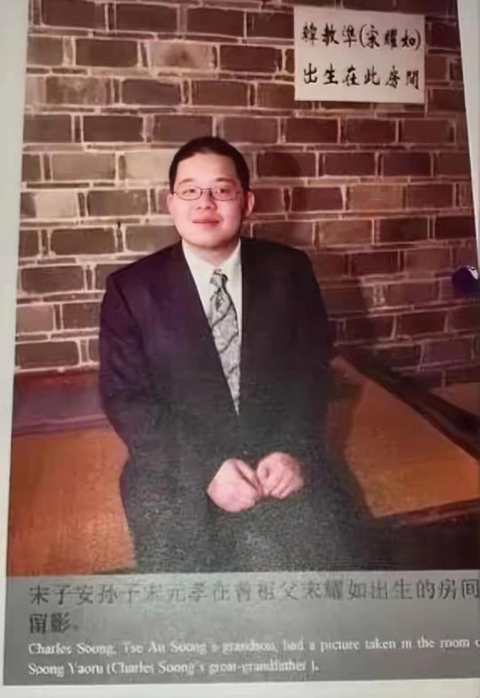

他们家是几百年的基督教家庭，所以在美国不能拿寻常华人家庭看待

不过不知道为什么，几代下来，宋家成了单传了

至于孔祥熙家族

孔祥熙其实也是基督徒，可以说南京国民政府其实是一个基督教政府

孔祥熙之所以信仰基督教，主要是因为他小时候得了腮腺炎，差点病死。

是教会医院帮他治好的——后来庚子国难的时候，他们家又掩护了传教士，于是他们家就和基督教会混熟了

庚子国难后，他和公理会的牧师合伙办过一个铭贤师范学校，任课老师就是公理会牧师

孔祥熙用人讲究惟贤、惟晋，这里面的贤不是贤才，而是他在铭贤师范学校的学生们，晋就是山西省

虽然他也是一个任人唯亲的人

但客观地讲，孔祥熙可比宋子文更讨蒋介石喜欢——甚至于在孔家拆了小蒋在上海的台之后也是如此

毕竟蒋介石至少没对孔祥熙说过类似于

“这辈子我就没和你做过不赔钱的买卖”这类话（他倒是对宋子文这么说过）

是的，孔祥熙是接任宋子文当的财政部长

1933年蒋介石因为要打内战，发行了十四亿元的公债，由于此时南京国民政府每个月财政赤字高达八百万元，所以这些公债根本卖不出去

宋子文表示自己办不了给蒋介石筹款的工作于是辞职

蒋介石无法，只好让孔祥熙接任财政部长

他上任之后，一番折腾，竟然让南京国民政府至少达到了收支相抵的状态

不过这个是后话了

还是回到1912年吧

因为有教会这个背景，孔祥熙在1912年通过代理壳牌的灯油发了大财

之后更是在1913年在日本，以“中华留日基督教青年会”总干事的身份和孙中山搭上了关系

1914年以孙中山为介绍人同宋蔼龄结婚（当时宋蔼龄是孙中山的秘书，宋蔼龄嫁给孔祥熙之后，宋庆龄先生才成了孙中山的秘书），孔祥熙于是正式加入了宋氏王朝

不过加入了之后，也没他什么职务可干，孙中山自己都在流亡状态，总不能和康有为一样，画个委任状糊弄孔祥熙吧？

于是孔祥熙还是回到山西，老老实实的当乡绅

不过因为他和教会关系很好，他这个乡绅是手眼通天的乡绅

此时的孔祥熙还不那么坏，所以在山西旱灾里面很有作为，争取到100万美元的外国救助，并以工代赈修了很多公路，受到了北洋政府的表彰

现在有很多人认为是孙文提拔了孔祥熙

但是从历史上来看

与其说是孙文提拔他，不如说是他给孙文提供了一个抓手

由于孔祥熙赈灾办得好，又有好朋友兼基督教教友王正廷帮衬，所以很快就在北洋政府里面打得火热

孙文联系冯玉祥，联系张作霖，都是通过孔祥熙的渠道

1925年孙文北上也是孔祥熙一路陪同

孙中山去世后，孔祥熙的大靠山虽然倒了，不过没关系，他又靠上了老蒋

就资历上来说，孔祥熙是老资格的，就和孙中山的关系上，孔祥熙更近

所以老蒋在初期是指望着孔祥熙的。

所以孙中山并没有给孔祥熙安排具体职务，但是老蒋上来就委任孔祥熙当了广东财政厅长

投桃必然报李，孔祥熙不仅帮着蒋介石在北洋系里面兴风作浪，联系阎锡山和冯玉祥分裂北洋；而且在1926年把宋美玲介绍给了蒋介石当老婆

这下子可就不得了了

蒋介石本来是孙中山的学生，如此一来，就成了孙中山的连襟

学生和老师成了同辈关系，这个对于老蒋可是很要紧的事情

于是老蒋就越发的爱戴起来孔祥熙了。

孔祥熙先后出任实业部长，央行行长，并替老蒋买过军火—总之了是顶重要的人物

孔祥熙有四个孩子，分别是孔令仪，孔令侃，孔令伟，孔令杰

孔祥熙的大女儿孔令仪找了个叫陈纪恩的穷小子

能够巴结这种大小姐的穷书生，往往不是好人

宋蔼龄对于这个婚姻不满意，持反对态度，但是孔令仪非得嫁给这个陈纪恩

孔祥熙夫妇拗不过，只好同意

两个人结婚的时候恰好是1943年，抗日战争最吃紧的时候

孔祥熙夫妇给女儿的陪嫁是两飞机的礼品

婚后，陈男本性暴露，不仅吃喝嫖赌，甚至殴打怀孕的孔令仪，让孔大小姐流产并丧失了生育能力

两人自此分手，至于陈男则下落不明——就是消失在历史的长河里面了

1981年，宋美玲去了美国，孔令仪照顾了姨妈二十年，直到宋美玲去世

孔家大小姐很长寿，2008年才去世，2007年的时候还来大陆参观了一下童年旧居。

不晓得为什么，中国的这帮大小姐去了美国之后，很多都混成了家暴的受害者

想来，这些人在国内被保护的太好了，出了国之后，脱离了保护他们的那个社会环境，就如同离了水的鱼

孔祥熙的大儿子是孔令侃，此人曾经的最大志向是能够和自己的舅舅宋子文成为连襟

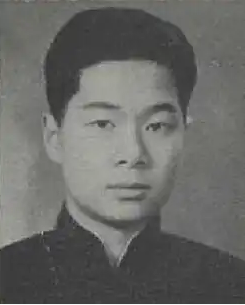

“娘舅怕什么，讨了他的小姨子，我和他（宋子文）不就平起平坐了。”

这等荒唐的言论自然不被宋蔼龄认可，此时恰好盛宣怀的儿子盛升颐因为走私被下了大牢，盛升颐那个妓女出身的小老婆白兰花经常去孔家活动

盛宣怀虽然是大清朝的尚书，孔祥熙虽然是先行者的连襟

但是两家那是父一辈子一辈的交情，孔祥熙的老岳母倪桂珍就当过盛宣怀家里的家庭教师，孔祥熙的太太宋蔼龄更是当过盛家五小姐盛关颐的英文教师

论起来，孔部长和盛尚书的关系可比和他的辛亥革命同志亲近多了。

作为盛升颐小老婆的白兰花自然是能够搭上话的

于是也不知道是谁勾搭的谁，一来二去，盛升颐的小老婆白兰花就和孔令侃搞上了

白兰花本来就是干那行的，对于玩男人经验丰富，又比孔大少年长将近二十岁，一来二去，孔大少可就离不开白兰花了

盛升颐对此虽然知道，但是却无可奈何

只好踢足球解闷，盛升颐除了走私，赚钱，占便宜，还创办了一支东华足球队

白兰花和孔令侃二人长期维持偷情关系，直到孔大少被派驻去了香港

孔大少二十郎当岁就当了国民政府的高等秘书，1937年全面抗战爆发后，更是被派驻去了香港。

他这号公子哥，机会多了去了

至于孔大少的表现么？那就很完蛋了

孔大少在香港是烂赌成性，曾经一把输了国民政府十五万元法币的公费

十五万元是一个什么概念呢？当时国军发的是抗战薪水，上尉一个月工资是80元，一年一千元

孔大少一笔输出去150个上尉一年的工资

不过没关系，谁让他爹是孔祥熙呢？当时香港人挖苦他是：爹爹在朝为宰相，人人称我小霸王

后来1939年，英国人找了个由头，说他设立电台，从事间谍活动，把他从香港赶了出去。

当时香港是中国抗战物资的唯一入口了

老蒋对此很不满意

孔家就让他去哈佛大学读书，躲躲风头

私设电台，从事间谍活动，这个也不能说是没有

私设电台是他孔大少想家，每天都要给在重庆的孔祥熙夫妇发电报

至于间谍活动吗？

孔大少在圣约翰大学上学的时候，搜集了一群他的跟班，成立了什么南尖社（取名自德国的纳粹党，南尖就说nazi）。

这个小团体，到了最后竟然成了南京政府财政部的编外机构

1937年之后，许多成员和孔大少一起去了香港，情报工作搞了，但主要靠着看报纸、听墙根、请吃饭、收购小道消息等方式搜集情报。

哦，对了，期间孔大少还炒了外汇，据说获利颇丰。

该说不说，这可能是孔大少在香港干的最好的事情。

该说不说，孔大少运气好的不得了，得亏让英国人轰走了，要是此时不走，估计就得赶上太平洋战争了。

孔大少兴许啊，那就得去集中营

当然了——就孔大少这个身份

就算是让日本人捉了，到最后也无非就是被礼送出境。

至于孔大少的南尖社的成员么——就在香港殉国吧。

在去美国的路上，孔大少，越想越窝囊，于是为了报复重庆政府对他的无情（主要是他爸爸对他的无情），发电报请老情人白兰花来菲律宾和他结婚

老情人闻言大喜，立即买票去找孔大少

于是在马尼拉，23岁的孔家大少如愿以偿的娶了盛升颐那42岁的，从事过特种行业的小老婆

去了美国之后，孔大少根本无心学习，天天寻欢作乐，但是老美的学位不下点真功夫是拿不到的

于是孔家大少突发奇想，找了个姓吴的科员替他上学考试

两年后，孔大少带着哈佛的文凭，潇洒回国

至于吴科员么？则被孔大少提拔当了副经理

吴科员被讥讽成了地下硕士。

孔大少回国之后，就闹出来了扬子公司那档子事，小蒋很是恨这个孔大少，不过也没什么办法

只好高高举起，轻轻放下，把孔大少轰走了事。

于是孔大少又回了美国，并自此长居

孔大少在美国生活了五十多年，宋美玲在美国的宅子就是他买的

孔大少没有子女，一个都没有。

孔祥熙家的老三就是异装癖孔令伟了

人家孔家二小姐，12岁的时候就见过美国总统罗斯福

这样的人物，那是不把中国人当人看的

这位孔家二小姐，在中国的时候干过下面这些事情，枪杀交警，撞飞哨兵（人家要灯火管制，他一脚油门把人家撞飞），和龙云的儿子在公园拔枪对射（两人毫发无损，打伤多名路人），1939年接替他那个因为从事间谍活动被英国佬递解出境的哥哥孔令侃去香港——他没他哥哥倒卖外汇的本事，于是只好走私烟土

1941年太平洋战争爆发，日本人马上就要开进香港

国民党派飞机接在香港的要人去重庆

结果要人们到了机场后，却发现本来安排好接他们的飞机，上面的座位竟然早就已经被孔二小姐和他的十七条狗给占满了

南天王陈济棠要求上飞机，竟然被孔二小姐拿小手枪赶了下去——孔二小姐时年不到24岁

这是一个小霸王一般的女人。

但是他在美国的时候，可是老实的不得了，从来没有什么违法行为，简直就是良好公民

孔家二小姐，六十年代随着父母回到台湾后，被宋美玲留下来当了老蒋和宋美玲的大管家

宋美玲靠着他经营圆山饭店赚了不少钱，自然这些钱都下落不明了

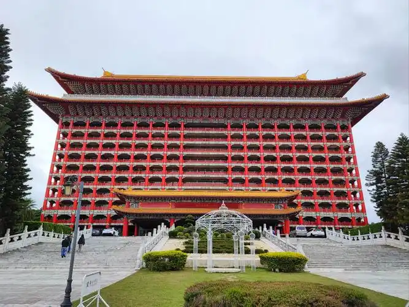

在此期间这位孔二小姐，以男人的身份包养多名女子。

他从来都是男装打扮，直到得癌症去世

最搞笑的来了

孔二小姐这辈子虽然就没穿过女装，但是死了之后，反而是穿的女装下葬的

当时这位孔二小姐因为癌症、心肺衰竭在台北死掉了

按道理说就地埋了就是

那可不行，必须坐飞机弄去美国下葬

由于防腐处理不当，等到了纽约的时候，孔二小姐已经没法看了

花了大价钱，化妆，换的女装

至于为什么非得换女装下葬，因为基督教不准许这种异装癖和女同性恋

看看，多么的乖顺啊

孔二小姐埋葬的墓园是芬克里夫墓园

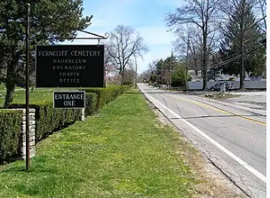

宋美玲和孔祥熙，宋子文、宋子良家族都埋在这里

顾维钧也埋在这里

徐志摩的老婆儿子也埋在这里

除了这几个华人是不得了的大人物外，这个墓园埋葬的主要是演艺界人士

我看好多人说这个墓地如何高档云云，但是他是一个无宗教的墓地

换句话说，在基督教盛行的美国，这个属于非主流墓地

宋氏家族，都是基督徒，他们家是基督徒世家

然而很遗憾，他们到底是不能埋到基督教的墓地里面去的，他们终究是外人

是信仰了基督教的黄皮猴子。

墓地是非主流墓地，只能和叛逆艺术家当邻居

至于安葬的地方么？

事实上，上面这些曾影响了中国的大人物，连一个像样的墓地都没有

他们采取的是壁葬的方式

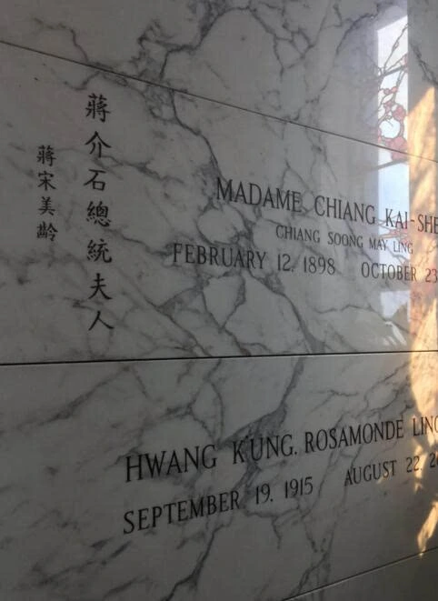

宋美玲的棺材就和货架上的货一样，垒在自己的外甥女孔令怡的棺材上面

中间隔了一道薄薄的水泥板。

至于孔家的墓葬，那就更寒酸了

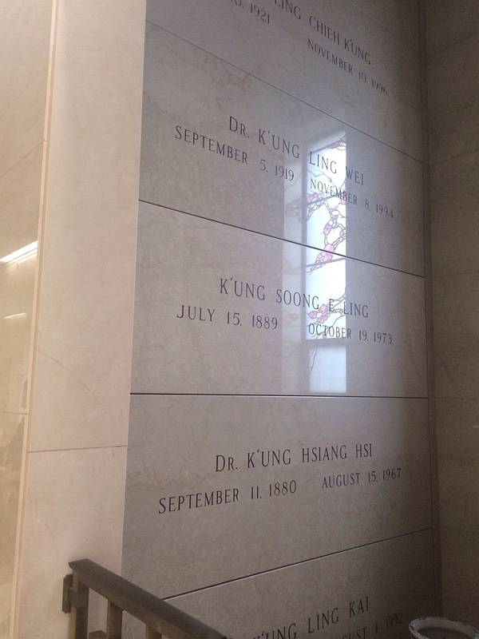

一家人整整齐齐的码放了一墙，最下面是孔家大少，上面是孔祥熙，在上面是宋蔼龄，再上面是孔令伟，最上面是孔令杰。

因为实在是太寒酸了，所以他们自称这是暂厝

说实在的，就算是暂厝，也没这样的

足以见得，就算是宋家王朝，在美国没了利用价值，也是死无葬身之地的。

既然写到这里，就再说说孔令杰，孔令杰出生比较晚，1949年的时候不过是毛头小伙

在给毛邦初当了几年管汽油采购的军需官之后

就拿着自家的资本在美国搞石油买卖去了，还开了一个石油公司叫西兰石油

这个人在最开始是很赚钱的，以至于能够突破自己身为黄种人的种族限制，娶到了好莱坞女明星黛布拉·佩吉特

女明星是孔家的恩人，要不是他，孔家得绝后

因为孔令杰结婚的时候已经四十岁了，再晚上几年就不能生了

至于孔先生为什么四十岁才在美国结婚，这个事情，就无人知晓了

总不能是钞票太少，不足够弥补身为小黄人的缺乏魅力吧？

财神爷的儿子，怎么可能缺钱，不缺钱，也难找哟！

总之了，别看孔家曾经一大堆人，现在所有的财产都掌握在黛布拉·佩吉特儿子手里

这个儿子叫孔德基，不会中文，一句都不会。

他们家族就他一个人了。

孔令杰的石油大亨生意开始的时候非常赚钱，在1981年的时候甚至为员工和自己的家庭修建了规模很大的核战争避难掩体

看来孔令杰老先生，也是求生狂这类活动的爱好者

但是到了1987年，孔令杰的西兰石油公司，忽然破产了！

猜猜为什么？你肯定猜不到，因为那一年小蒋病危了，并在1988年1月份去世

估计是美国人看着孔令杰的靠山垮掉了，所以吃上门来

孔令杰索性抢先破产

总之了，我这是推测

不过考虑到宋美玲去世之前，也就是1995年，他在蝗虫谷的房舍就被贱卖，甚至连家具都不准带走

房屋被贱卖就算了，为什么家具都不允许带走呢？

原来是购买他房产的美国商人，在合同里埋设了陷阱

260万美元，购买的不仅是庄园，而且还有庄园里面的所有的东西

于是宋美玲的家具、珍藏的古董（1991年宋美玲回台湾，带走了大批古董有两个飞机）、甚至蒋介石的照片、信件都被美国商人买走了

宋美玲不允许从别墅里面带走一张纸，否则就是违约，宋美玲就要承担巨大的违约责任

美国商人单靠这个合同条款，靠着卖宋美玲的文物就发了大财，而宋美玲对此只能唯唯诺诺

老蒋的夫人，竟然请不到好律师。

是真的请不到么？是真的请不到。

因为1995年，李登辉已经站稳了脚跟了，孙美玲的影响力已经垮掉了

虽然也是这一年，美国国会请她去做了抗战胜利五十年演讲，让他再风光了一回

但是又有什么用呢？

他被人坑了。

而在宋美玲去世后，一毛不拔的蒋氏家族、宋氏家族、孔氏家族，更是不知为什么给大学捐了几千万美元（这个确有此事，但是具体大学名称是什么，决策者是谁，记不得了）

之所以说不知道为什么，因为此时的蒋宋孔三大家族的男丁，尤其是宋家和孔家的男丁——只有两个了，连带上小女孩，也不超过十个人

根本没必要掏钱赞助大学

需要上学的时候，单个花钱就好了——那么你猜他为什么要捐款呢？

无非是被老美吃了绝户罢了

现在宋家的唯一继承人宋元孝老先生和孔家的唯一继承人孔德基老先生

在网络上那是一点消息都没有，两个人一个赛一个的低调

低调的都不正常

如果他们过世了，你猜猜他们的财富归谁？如果真的有坏人知道他们的财富

你猜猜他们还能留下孩子么？

这就是他们为什么异常低调的原因了，他们倒是也回国参加过各种活动

但是神情可就很奇怪了

美国人玩的那一套，连蒋宋孔三大家族都遭不住，一般的华人岂能遭得住呢？

根本遭不住的

总之了当2003年10月24日，虔诚的基督徒，循道宗信徒宋美玲去世的时候。

这个曾经把老蒋葬礼办成了基督教宣传会的人，这个中国最早的华人传教士的女儿——把自己埋在了一个完全没有宗教氛围的无宗派坟地，同时在墓碑上没有丝毫的基督教标志，连一个十字符号都没有。

虽然他的葬礼还是基督教的，但是他的心态，到底是怎么样的呢？

只能说很难说，很难说

现在他的墓地还时不时有中国人祭扫，但是祭扫的人，是中国人，而不是他的教友。

蒋家到底好说，宋家和孔家的子孙，不是想不想当华人，而是能不能、敢不敢当华人了

现在宋氏家族和孔氏家族，就一个叫宋曹琍璇的老太太还能说中文

别的都不会说中文了

对了说起来了，其实孙文的子孙也在美国，

孙文有一个儿子，就是孙科，台湾管他叫先总理哲嗣

孙科有两个儿子，孙治平和孙治强

孙治平的儿子孙国雄虽然有大学学位，但是却当了替身演员

换句话说，就是孙中山的长房重孙子当了替身演员

只要有风险的戏码，孙先生的重孙就要冒着生命危险去当替身

在中国，孙先生的长房重孙是要进政协的，但是在美国，炸死孙先生的重孙不要紧，可不敢炸死美国的三流明星；孙先生的长房重孙，是可以受伤的，是要作为三流明星的人肉防护服的。

“孙国雄也有自己的梦想——成为电影演员。大学时他虽然念的是生物化学系，但凭着一种热情和信念，他勇闯好莱坞 ，后来任职特技演员长达37年。而很多时候，他还坚持跑龙套、当替身。孙国雄第一次出镜，是在美国著名影星马龙·白兰 度主演的《丑陋的美国人》一片中扮演一位村民，辛苦一天，赚到16美元。职业生涯中，他前后参加过大约600部电影和 电视剧的制作，拍过很多从高楼坠下的惊险画面，也拍过撞车和爆炸场面。在一部《非凡的勇气》的电影里，他甚至“死”过 19回。虽然辛苦，但他对能做自己喜欢的职业十分满意，认为 **“孙中山的后代做特技演员是一件非常有趣的事情”（实在是难以认同，千金之子坐不垂堂，更何况他，而且其实他不缺钱，他父亲作为孙先生的长房长孙从台湾拿到了足够的钱——之所以会这样，只能理解为让老美教育的。）** 。”

而且最悲惨的是，这个几乎等于替死鬼的工作，还被父传子了

孙国雄的小儿子孙伟仁接了他爸爸特技演员的班（他也是孙国雄唯一的男孩）

孙中山的另一个儿子是孙治强，他的儿子，孙国升虽然有经济系大学文凭，但是最后却混成了保险销售员；孙国升的亲哥哥孙国元连弟弟都不如，孙国元因为照顾生病的孙治强，从大学退学，没有拿到大学文凭。作为一个高龄高中生的他在社会上根本就找不到好工作——干脆就长期失业在家了

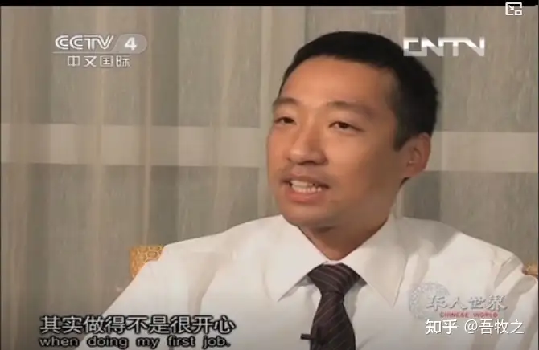

孙文先生的重孙子一共就三个，一个当了替身演员，一个当了保险销售（后来转了码农），一个长期失业

还是老美厉害

美国建国以来，有无数的名门望族去美国避难，那么看到这里，你大概就知道，这些名门望族去了那里了吧？

都让老美干掉啦！

多了我也不敢说，但是我觉得吧，单就是孙先生重孙这个身份

毕竟封建王朝还讲究一个二王三恪呢。

更何况了，还有点师承关系。

不过孙先生的重孙们，已经不会说中国话了。

可叹可叹。

孙先生的子孙，不仅成了美国人，而且还成了不会说中国话的美国人，最关键的是过得实在是不能够说好

美国大学学费是很贵的

不知道孙先生重孙的儿子们，还有没有机会接受高等教育了。

如果接受不了高等教育，那么未来的人生，会怎么样呢？还会有子嗣么？

这都是顶尖家族，在美国是这样子的。其他的自然也不用问了。

  

原文地址：[(吾牧之)华人移民欧美三代之后，华人文化是否基本灭绝？](https://www.zhihu.com/question/1963190201850520160/answer/1993771442676969710) 

# 评论

1. <a href="https://www.zhihu.com/people/58-25-10-85">江左镇乡绅</a> (<small title="陕西">2026-1-11 23:8:26</small>): 这几大家族啊，留下的只有钱，说到底他们是旧时代中国身上的吸血鬼，要不是靠着蒋介石这个强力机关，他们都没有啥能力在美国立足。常言道君子之泽五世而斩，这都不是君子传个两三代不错了，至于墓地确实奇奇怪怪，毕竟融不进去，在哪里留个地方也算包容了。
   - <a href="https://www.zhihu.com/people/5-44-31-38-26">莲花眼</a> (<small title="北京">2026-1-12 1:14:21</small>): 货悖而入者亦悖而出！
   - <a href="https://www.zhihu.com/people/73-52-29-67">confidence</a> (<small title="浙江">2026-1-12 16:35:53</small>): 如果真包容［吃瓜］美国就不会有新教了［吃瓜］美国虽然是基督教，但是是属于新教一派［吃瓜］你猜基督教欧洲各国在美国势力大，还是华人基督教势力大［吃瓜］这个世界军事实力是国防根基，否则你去了海外也是被人家吃绝户，哪怕你明白，你也很难回头了［吃瓜］除非你能放弃，跑出去的华人内部祖上政治斗争的矛盾，否则这群人自己都会内斗，你比如就有清代时期跑出去的满清权贵，到了现在掌控了美国海军其中一只海军，你猜这满清跑出去的权贵会不会打压民国跑出的四大家族［doge］更别说你都被赶到了弯弯已经没有翻盘的可能性，被人联手吃绝户很正常［doge］
   - <a href="https://www.zhihu.com/people/ni-ming-nan-11">喵呜</a> (<small title="回复于 2026-1-13 1:0:36/英国"> ✉️:confidence</small>): 黄豆满屏 眼晕
   - <a href="https://www.zhihu.com/people/peiping888-4">peiping888</a> (<small title="江苏">2026-1-13 14:5:55</small>): 不谈家族富不过三代的说法，单拎美国佬吃绝户的水平真是一流的！
   - <a href="https://www.zhihu.com/people/you-ji-shu-82">13cer</a> (<small title="回复于 2026-1-14 21:29:2/贵州"> ✉️:confidence</small>): 国内基督徒是与买办高度绑定的，算是历史传统了
   - <a href="https://www.zhihu.com/people/kan-dao-ceng-jing-de-hai">看到曾经的海</a> (<small title="回复于 2026-1-18 19:56:57/广西"> ✉️:confidence</small>): 老乡见老乡，两嘴泪汪汪
   - <a href="https://www.zhihu.com/people/kai-ma-la">开唛啦</a> (<small title="回复于 2026-1-19 13:15:3/上海"> ✉️:看到曾经的海</small>): 嘴唇油汪汪
   - <a href="https://www.zhihu.com/people/tang-yu-zheng-13">魔神下凡123</a> (<small title="回复于 2026-1-20 14:52:37/浙江"> ✉️:confidence</small>): 哪个满清权贵掌握了一支美国海军啊
   - <a href="https://www.zhihu.com/people/cui-guang-3">光哥在散步</a> (<small title="回复于 2026-1-25 7:40:30/上海"> ✉️:confidence</small>): 跑出去的满清的权贵，有这些方面的资料链接吗，很感兴趣。谢谢！
   - <a href="https://www.zhihu.com/people/lang-dang-38-30">烤肉拌饭</a> (<small title="回复于 2026-1-25 21:14:18/河南"> ✉️:confidence</small>): 你说的清朝权贵是何人
   - <a href="https://www.zhihu.com/people/41-35-10-60-13">康再复</a> (<small title="回复于 2026-2-11 15:50:4/辽宁"> ✉️:confidence</small>): 展开讲讲呗
   - <a href="https://www.zhihu.com/people/52-80-94-32-76">岁月痕迹</a> (<small title="北京">2026-3-19 16:17:44</small>): 你搞什么？看文章好好的你突然来一段这个？给我都看哭了。
   - <a href="https://www.zhihu.com/people/24le0prw">小看山24lE0prw</a> (<small title="广东">2026-6-20 22:37:14</small>): 那是你不知道宋家在大陆的地位
   - <a href="https://www.zhihu.com/people/hen-jiu-yi-hou-86">云不知</a> (<small title="贵州">2026-9-11 10:27:56</small>): 虽然但是，有些臆想还是太反违背科学了［思考］比如蒋孝章和俞扬和那里，“两人是1960年8月结婚的，结婚场面十分冷清，宾主尴尬 (1961年5月女儿就出生了，所以估计是大着肚子结婚的)”  
 
这也能大肚子吗？按最有利答主的极限时间来算，8月31日才结婚次年5月1日就生产，中间隔了七个月整［思考］很难想象结婚时肚子能大到什么程度才会让宾主尴尬？兴许是哪吒吧［思考］
   - <a href="https://www.zhihu.com/people/xiao-xiao-6c">鸢北</a> (<small title="回复于 2026-9-12 13:56:25/浙江"> ✉️:云不知</small>): 蒋孝章1960 年8月13日在美国内华达州一个基督教堂里面和俞扬和领了证，9月份怀上隔年5月生下儿子俞祖声博士，该博主虽然点赞数量有2万多，可是文章里面很多内容都是错的，女人怀孕到生产是9个月又十天，更何况俞祖声博士明明是男的啊，到他文章里面直接变成女的，我看了也觉得奇葩 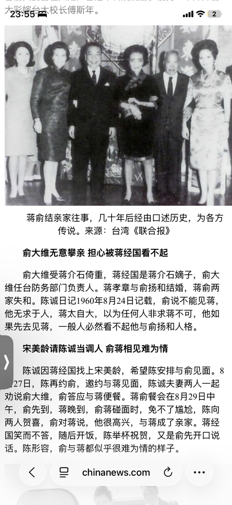
2. <a href="https://www.zhihu.com/people/zhang-li-da-30">寒江雪</a> (<small title="浙江">2026-1-12 8:36:28</small>): 国民党败给共产党真是一点都不冤枉.自己的高层都看不起中国人.也就是看不起自己.  
 
  
 
教员发动的朝鲜战争。打美国人，打联合国军。是他们国民党到死都不敢想一下的事情。就像他们的太太在舞厅被美国人强奸。他们连屁都不敢放一个。那些施暴的美国人一点事情没有。后面居然还惩罚了那些被强奸的太太。  
 
  
 
说句实在话，国民党的血性连慈禧都不如。慈禧都还敢和八国联军开战。即使后面是被八国联军打败，割地求和。
   - <a href="https://www.zhihu.com/people/qing-cheng-94-80-91">狗勾</a> (<small title="山东">2026-1-12 16:21:40</small>): 说到底是屁股决定脑袋，跟血性没关系。国民党统治阶级是地主和买办
 
大地主靠吸农民血，不可能去团结农民
 
大买办帮洋人办事，不可能支持民族工业
 
牢蒋靠美援打输出，也不可能去反美
 
跟利益有关系，跟血性没关系
   - <a href="https://www.zhihu.com/people/tian-kong-75-30-61">天空</a> (<small title="回复于 2026-1-13 1:55:26/湖南"> ✉️:狗勾</small>): 民众的力量大［赞］［拜托］
   - <a href="https://www.zhihu.com/people/gao-jian-feng-68-33">Kylo 小锋</a> (<small title="江苏">2026-1-13 15:53:15</small>): CCP比之前的那些强太多了
   - <a href="https://www.zhihu.com/people/bao-bao-ma-13-66">宝宝妈</a> (<small title="北京">2026-1-13 16:15:42</small>): 谁能要求买办或者地主有血性了？他们又不止一个老婆，正妻小老婆一大堆，钱和权才是他们钻营的重点。
   - <a href="https://www.zhihu.com/people/qing-cheng-94-80-91">狗勾</a> (<small title="回复于 2026-1-13 23:23:2/山东"> ✉️:宝宝妈</small>): 阶级错了，有没有血性无所谓。公私合营消灭资本家，土改消灭地主。什么叫无产阶级铁拳，这就是。
   - <a href="https://www.zhihu.com/people/xiao-gao-bu-ai">小高不矮</a> (<small title="湖北">2026-1-14 8:11:30</small>): 你这理论也不成立。他们只是没出去过，发展后出去过不一样看不起吗［飙泪笑］
   - <a href="https://www.zhihu.com/people/zhang-li-da-30">寒江雪</a> (<small title="回复于 2026-1-14 9:8:43/浙江"> ✉️:小高不矮</small>): 那不一样。假设国民党时代特朗普打贸易战。只要一开打，国民党必定怂。美国无论提出什么条件，我们无条件答应。就像日本的广场协议，明眼人一看就知道这协议有问题。更不用说日本那么多金融专家不可能都是摆设。但是在美国眼里，日本人就是孙子。可以随意拿捏，事实也是如此。  
 
  
 
现在，特朗普一打贸易战。我们根本鸟都不鸟他。你打你的贸易战，我玩我们的。谁怕谁。
   - <a href="https://www.zhihu.com/people/bao-bao-ma-13-66">宝宝妈</a> (<small title="回复于 2026-1-14 9:16:1/北京"> ✉️:狗勾</small>): 换到现在也一样，那些有资产的，比无产阶级更惧怕打仗，更惧怕环境变动让自己资产减值。
   - <a href="https://www.zhihu.com/people/xiao-gao-bu-ai">小高不矮</a> (<small title="回复于 2026-1-14 15:47:7/湖北"> ✉️:寒江雪</small>): 我回复的是你第一句话。
   - <a href="https://www.zhihu.com/people/bu-hui-shui-de-yu-33">maltum</a> (<small title="回复于 2026-1-16 15:43:55/江西"> ✉️:宝宝妈</small>): 不止太太，当时还有女儿、孙女［捂脸］
   - <a href="https://www.zhihu.com/people/shunhim-tsang">迪奥妮露姆</a> (<small title="广东">2026-1-17 8:51:32</small>): 别傻了，慈禧是因为八国联军动摇了她的国本，还有顺便让义和团和八国联军狗咬狗。否则她根本不管八国在国内的所作所为。
   - <a href="https://www.zhihu.com/people/zhi-bu-zhi-13-9">知不知</a> (<small title="天津">2026-1-17 16:30:57</small>): 现在是禅茶一味，平等兄弟。
   - <a href="https://www.zhihu.com/people/chi-zhu-xiao-zu">渊蝣</a> (<small title="江苏">2026-1-18 11:13:14</small>): 你还太年轻，双方的事情都要多了解了解
   - <a href="https://www.zhihu.com/people/iarfbm">polydew</a> (<small title="四川">2026-1-19 2:24:44</small>): 教员可没发动朝鲜战争，只是把发动战争的崽儿一耳屎全扇回去了［捂脸］
   - <a href="https://www.zhihu.com/people/pafey">漠行</a> (<small title="广东">2026-1-19 15:17:53</small>): 看来电视上演绎的还是保守了。
   - <a href="https://www.zhihu.com/people/--93-7-20">再回首 物是人非</a> (<small title="回复于 2026-1-19 15:36:21/辽宁"> ✉️:渊蝣</small>): 反正现在确实比以前站的直一些 并且事实胜于雄辩 国名党装备好那么多 最后溃败得去了小岛 连一个小岛都快守不住了
   - <a href="https://www.zhihu.com/people/kingmastas">KingMastas</a> (<small title="回复于 2026-1-22 9:5:38/四川"> ✉️:狗勾</small>): 看似是美援，实际都是领空权，港口，矿产，国企等等资源换的，跟现在乌克兰一样。怎么可能无缘无故支援你
   - <a href="https://www.zhihu.com/people/jiao-wai-de-ting-zi">郊外的亭子</a> (<small title="回复于 2026-1-28 17:50:58/福建"> ✉️:狗勾</small>): 没血性就是没血性，跟屁股脑袋没关系，因为没有血性，才会当买办吧，又不是只有买办一条路可以走的，真有点血性的，不会一直当买办。
   - <a href="https://www.zhihu.com/people/jiao-wai-de-ting-zi">郊外的亭子</a> (<small title="回复于 2026-1-28 17:56:17/福建"> ✉️:宝宝妈</small>): 只要是正常人，不管有没有资产，都不希望打仗，没有谁更怕一说，没资产的，打了仗，就会变得有资产了吗？
   - <a href="https://www.zhihu.com/people/bao-bao-ma-13-66">宝宝妈</a> (<small title="回复于 2026-1-29 9:5:22/北京"> ✉️:郊外的亭子</small>): 一句俗话：光脚的不怕穿鞋的。  
 
他本身什么都没有，环境变化还是什么都没有；有些人本身有很多东西，环境变化，很可能让他什么都没有，你觉得前者更怕还是后者更怕？  
 
如果都一样，就看看当下，中美两国对弈，中产以上的与赤贫线附近的人相比，前者才是不想打仗的。
   - <a href="https://www.zhihu.com/people/jiao-wai-de-ting-zi">郊外的亭子</a> (<small title="回复于 2026-1-30 18:57:23/福建"> ✉️:宝宝妈</small>): 你这这种思维还停留在五十年代，那个时候才是真得光脚，这年头，就算你觉得人家穷，但人家也不是真得光脚，局势早变了，还刻舟求剑。光脚的没只是财产，不是没命，你起来搞事情，可是要丢命的，不是环境变了，你还是老样子。
   - <a href="https://www.zhihu.com/people/72-66-78-11-17">知乎用户y9aKTz</a> (<small title="回复于 2026-2-11 9:24:2/广东"> ✉️:狗勾</small>): 抛弃利益选择血性的人太多了，跟阶级没有太有关系，跟血性和人性有关系。不是什么都能用"阶级"或"利益"一言概之，说白了就是没了"血性"也没了"汉人魂"。
   - <a href="https://www.zhihu.com/people/xiao-shi-hou-shi-xi-pi">小时候是嬉皮</a> (<small title="回复于 2026-2-14 12:56:10/四川"> ✉️:宝宝妈</small>): 你的认知水平太低了
   - <a href="https://www.zhihu.com/people/bai-ze-4-12-6">食为天</a> (<small title="湖北">2026-3-13 9:53:11</small>): 普通人在得势后也差不多，只不过是一部分人拥有这样的权利，大部分人并不拥有，本质上没有区别
   - <a href="https://www.zhihu.com/people/jiao-rui-peng-27">谁给我改的名字</a> (<small title="广东">2026-4-4 8:18:37</small>): 现在呢［捂脸］
   - <a href="https://www.zhihu.com/people/37-9-59-76-58">金蛋小黄鸭</a> (<small title="海南">2026-5-14 16:32:7</small>): 无力反驳［惊讶］
   - <a href="https://www.zhihu.com/people/ly888-89">LY888</a> (<small title="回复于 2026-7-14 11:7:27/广东"> ✉️:狗勾</small>): 说到公私合营，我在知乎遇到过同情这个公私合营的这个私的，然后自己还不是个私。
   - <a href="https://www.zhihu.com/people/qian-mo-ke-38">阡陌客</a> (<small title="湖南">2026-8-24 6:19:45</small>): 买办资产阶级相比地主阶级更是反动中的反动掠夺中的掠夺
   - <a href="https://www.zhihu.com/people/ffrdddf">ffrdddf</a> (<small title="回复于 2026-9-14 20:58:35/广东"> ✉️:谁给我改的名字</small>): 更加支持了［赞］
   - <a href="https://www.zhihu.com/people/fud1syv">知乎用户Fud1sYv</a> (<small title="广东">2026-9-19 9:19:14</small>): 卢冬生给你点赞，你说卢重要还是哪几个女的重要？
3. <a href="https://www.zhihu.com/people/ren-can-hua-80">人参花</a> (<small title="辽宁">2026-1-11 22:33:31</small>): 说到底，就是蒋宋孔陈都没有和美国人真正斗争过。美国人也是批判辩证看问题的，打得赢的那就可以通吃，大家都得信服。都还没有打，怎么可能信？
   - <a href="https://www.zhihu.com/people/xiao-ming-tong-xue-41-42-72">小明同学</a> (<small title="广东">2026-1-12 10:36:45</small>): 打了死更快［吃瓜］，一个江南案就轻轻松松终结蒋家王朝，对付另外三家一个参议员就能让他们完蛋。
   - <a href="https://www.zhihu.com/people/wwtg">第六天魔王</a> (<small title="上海">2026-1-12 11:39:41</small>): 也就在自己的地盘上可以随意作威作福，去了美国在白人老爷面前啥也不是啊，拿什么斗？
   - <a href="https://www.zhihu.com/people/gu-gu-jun-95">弱水</a> (<small title="回复于 2026-1-14 15:59:42/陕西"> ✉️:第六天魔王</small>): 蒋光头从头到尾不都算是美国人扶持的么，人家管它呢［酷］
   - <a href="https://www.zhihu.com/people/li-gan-rui-27">浮影倒世</a> (<small title="河南">2026-3-21 22:57:23</small>): 本来就是买办，哪有和衣食父母斗争的
4. <a href="https://www.zhihu.com/people/lidandadandan">李郸</a> (<small title="天津">2026-1-11 22:48:26</small>): 写这么长还不用交钱 必须点赞
   - <a href="https://www.zhihu.com/people/zhang-ji-ying-46-87">张继英</a> (<small title="北京">2026-1-13 9:20:25</small>): 知乎最好的文章都不是严选
   - <a href="https://www.zhihu.com/people/zhang-ji-ying-46-87">张继英</a> (<small title="北京">2026-1-13 15:41:34</small>): 你想看长的，搜搜“国内博士后有多坑”，我写了几万字
   - <a href="https://www.zhihu.com/people/qing-tong-xiao-jie">好名字都被取了</a> (<small title="回复于 2026-1-14 13:53:15/湖北"> ✉️:张继英</small>): 你笑死我
   - <a href="https://www.zhihu.com/people/zhang-ji-ying-46-87">张继英</a> (<small title="回复于 2026-1-14 14:21:43/北京"> ✉️:好名字都被取了</small>): 看看呗
   - <a href="https://www.zhihu.com/people/yun-zhi-94-89">照星河</a> (<small title="回复于 2026-1-19 10:23:47/广西"> ✉️:张继英</small>): 你笑死我
5. <a href="https://www.zhihu.com/people/123-35-41-49">123</a> (<small title="安徽">2026-1-11 23:26:29</small>): 宋美龄太搞笑了［大笑］，旧时代毕竟是落幕了，既然是蒋家王朝，那么蒋家都不在位了，这些附庸能有什么好下场，没被清算已经不错了
   - <a href="https://www.zhihu.com/people/neng-dou-dou-ye-shi-xiong-dou-dou">能豆豆也是熊逗逗</a> (<small title="山东">2026-1-14 8:0:21</small>): 可惜了那些被她带走的古董。还有张爱玲母亲，也是靠着变卖古董过火。唉
   - <a href="https://www.zhihu.com/people/chen-si-ru-57">小鱼</a> (<small title="中国香港">2026-1-14 16:1:49</small>): 宋美龄难道不看合同就签吗？［飙泪笑］
   - <a href="https://www.zhihu.com/people/sun-jiao-9-31">满山的猪我膘最肥</a> (<small title="回复于 2026-1-14 17:48:53/北京"> ✉️:能豆豆也是熊逗逗</small>): 无所谓了，留国内也说不定被偷卖
   - <a href="https://www.zhihu.com/people/zhihuhu-29">冬冬</a> (<small title="回复于 2026-1-15 7:53:19/河北"> ✉️:小鱼</small>): 豪横惯了，你是没见过这种鼻子冲天的，
   - <a href="https://www.zhihu.com/people/47-41-6-34">午夜正阳</a> (<small title="回复于 2026-1-16 12:7:30/辽宁"> ✉️:小鱼</small>): 被人骗了呗，而且就是被人骗，也不敢拿人家美国人如何，自认倒霉呗。。。中国以前某部级高官车队在法国被当街打碎车窗抢劫，不也一样说欧洲好吗。。。
   - <a href="https://www.zhihu.com/people/xiao-yao-74-77-52">小妖</a> (<small title="宁夏">2026-1-17 10:12:0</small>): 她在国内也不见得有好下场
   - <a href="https://www.zhihu.com/people/123-35-41-49">123</a> (<small title="回复于 2026-1-17 11:2:43/安徽"> ✉️:小妖</small>): 蒋家王朝倒了，从那一刻起就不会有好下场
   - <a href="https://www.zhihu.com/people/dui-sheng-huo-que-shao-ji-qing">血肉苦楚机械飞升</a> (<small title="回复于 2026-1-17 12:53:19/广东"> ✉️:能豆豆也是熊逗逗</small>): 留在国内可能也被陈丽华这种八旗卖了
   - <a href="https://www.zhihu.com/people/lchxmu">啦啦啦啦</a> (<small title="回复于 2026-7-17 8:33:5/山东"> ✉️:午夜正阳</small>): 还可以这么说啊［酷］［酷］［酷］［酷］
   - <a href="https://www.zhihu.com/people/64-92-21-13-48">小鱼儿</a> (<small title="回复于 2026-9-3 13:9:41/山西"> ✉️:满山的猪我膘最肥</small>): 那也比在国外被人家当小丑🤡玩弄好很多［大笑］
   - <a href="https://www.zhihu.com/people/64-92-21-13-48">小鱼儿</a> (<small title="回复于 2026-9-3 13:10:35/山西"> ✉️:午夜正阳</small>): 这个没有听过？具体说说
6. <a href="https://www.zhihu.com/people/chang-hen-56-55">清虞不是青鱼</a> (<small title="北京">2026-1-12 8:53:34</small>): 答主没说的是，蒋经国还有蒋孝严、蒋孝慈两个私生子，这俩人反而很有出息［飙泪笑］台北现任市长蒋万安就是蒋孝严之子，蒋家总算还是没绝
   - <a href="https://www.zhihu.com/people/xiong-xiong-42-83">胡咧咧</a> (<small title="河南">2026-1-12 10:6:53</small>): 嫡出不行看庶出，大宗完了靠小宗
   - <a href="https://www.zhihu.com/people/ling-qian-11">gyko</a> (<small title="浙江">2026-1-12 12:53:56</small>): 章万安是王继春的野出，跟蒋家没有任何血缘关系
   - <a href="https://www.zhihu.com/people/ling-qian-11">gyko</a> (<small title="回复于 2026-1-12 12:54:8/浙江"> ✉️:胡咧咧</small>): 章万安是王继春的野出，跟蒋家没有任何血缘关系
   - <a href="https://www.zhihu.com/people/ling-qian-11">gyko</a> (<small title="回复于 2026-1-12 12:54:28/浙江"> ✉️:胡咧咧</small>): 章万安是史上学历最低的台北市长，除了章万安都是台湾大学毕业的，不蹭蒋姓根本没有资格去选
   - <a href="https://www.zhihu.com/people/ling-qian-11">gyko</a> (<small title="回复于 2026-1-12 12:54:38/浙江"> ✉️:胡咧咧</small>): 章万安乱认祖宗说明一能力不行，二人品不行，为了利益连祖宗都改了
   - <a href="https://www.zhihu.com/people/ling-qian-11">gyko</a> (<small title="回复于 2026-1-12 12:54:45/浙江"> ✉️:胡咧咧</small>): 章万安姓章能选上就不会改姓蒋了
   - <a href="https://www.zhihu.com/people/ling-qian-11">gyko</a> (<small title="回复于 2026-1-12 12:54:54/浙江"> ✉️:胡咧咧</small>): kmt要利用章万安这个冒牌货而已
   - <a href="https://www.zhihu.com/people/ling-qian-11">gyko</a> (<small title="回复于 2026-1-12 12:55:7/浙江"> ✉️:胡咧咧</small>): 章亚若是郭礼伯的妾 怀孕之后跟郭礼伯说孩子是他的，郭礼伯说姓蒋比姓郭好（郭礼伯儿子出书写的）
   - <a href="https://www.zhihu.com/people/ling-qian-11">gyko</a> (<small title="浙江">2026-1-12 12:55:25</small>): 你帮野出鉴定的蒋经国的私生子吗？经国日记里写了双胞胎是王继春的儿子
   - <a href="https://www.zhihu.com/people/ling-qian-11">gyko</a> (<small title="浙江">2026-1-12 12:55:39</small>): 章孝严是王继春的私生子，不是蒋经国的私生子
   - <a href="https://www.zhihu.com/people/ling-qian-11">gyko</a> (<small title="浙江">2026-1-12 12:55:50</small>): 蹭别人的姓本身就是一种很没出息的行为
   - <a href="https://www.zhihu.com/people/ling-qian-11">gyko</a> (<small title="浙江">2026-1-12 12:56:1</small>): 章万安是史上学历最低的台北市长，除了章万安都是台湾大学毕业的，不蹭蒋姓根本没有资格去选
   - <a href="https://www.zhihu.com/people/ling-qian-11">gyko</a> (<small title="回复于 2026-1-12 12:56:20/浙江"> ✉️:胡咧咧</small>): 台湾身份证有父亲栏，根据民法，改姓必须由生父认领，并验dna，章万安属于违法操作
   - <a href="https://www.zhihu.com/people/ling-qian-11">gyko</a> (<small title="浙江">2026-1-12 12:56:26</small>): 台湾身份证有父亲栏，根据民法，改姓必须由生父认领，并验dna，章万安属于违法操作
   - <a href="https://www.zhihu.com/people/ling-qian-11">gyko</a> (<small title="浙江">2026-1-12 12:56:33</small>): kmt要利用章万安这个冒牌货而已
   - <a href="https://www.zhihu.com/people/ling-qian-11">gyko</a> (<small title="浙江">2026-1-12 12:56:41</small>): 章万安姓章能选上就不会改姓蒋了
   - <a href="https://www.zhihu.com/people/ling-qian-11">gyko</a> (<small title="回复于 2026-1-12 12:56:54/浙江"> ✉️:胡咧咧</small>): 
   - <a href="https://www.zhihu.com/people/ling-qian-11">gyko</a> (<small title="浙江">2026-1-12 12:57:2</small>): 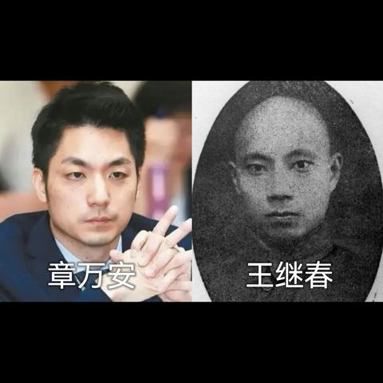
   - <a href="https://www.zhihu.com/people/ling-qian-11">gyko</a> (<small title="浙江">2026-1-12 12:57:28</small>): 章亚若是郭礼伯的妾 怀孕之后跟郭礼伯说孩子是他的，郭礼伯说姓蒋比姓郭好（郭礼伯儿子出书写的）
   - <a href="https://www.zhihu.com/people/tian-kong-75-30-61">天空</a> (<small title="回复于 2026-1-13 2:7:43/湖南"> ✉️:gyko</small>): 读书少，王继春是谁也不知道
   - <a href="https://www.zhihu.com/people/ping-ping-an-an-95-77">平平安安</a> (<small title="回复于 2026-1-13 7:37:7/湖南"> ✉️:胡咧咧</small>): 我觉得主要是看血统，混血并不好
   - <a href="https://www.zhihu.com/people/xiong-xiong-42-83">胡咧咧</a> (<small title="回复于 2026-1-13 7:48:18/河南"> ✉️:平平安安</small>): 主要是各种环境作用下的教育。王德民和蒋英不也都是混血么，人家为啥出色
   - <a href="https://www.zhihu.com/people/zongheng-94">zongheng</a> (<small title="陕西">2026-1-13 12:28:48</small>): 蒋经国自己就是蒋介石他老婆和他大哥的种，那有啥嫡出庶出。
   - <a href="https://www.zhihu.com/people/ping-ping-an-an-95-77">平平安安</a> (<small title="回复于 2026-1-13 19:3:35/湖南"> ✉️:胡咧咧</small>): 日本人和我们是同一人种，这个算不得混血
   - <a href="https://www.zhihu.com/people/xiong-xiong-42-83">胡咧咧</a> (<small title="回复于 2026-1-14 7:47:29/河南"> ✉️:平平安安</small>): 还是有一定差别的
   - <a href="https://www.zhihu.com/people/ba-er-duo-chao-xing">知乎用户nshxya</a> (<small title="回复于 2026-1-19 9:11:59/上海"> ✉️:gyko</small>): 有危机感的才会谨小慎微小心行事，废的概率会低很多，其它的养尊处优惯了，不废很难
   - <a href="https://www.zhihu.com/people/kong-tiao-cheng-tai-lang-62-23">小王王王</a> (<small title="回复于 2026-1-23 23:33:13/四川"> ✉️:zongheng</small>): 假的哦，蒋经国确实不像牢蒋像毛福梅，但他几个后代确实像牢蒋，尤其牢蒋的那个玄孙女
   - <a href="https://www.zhihu.com/people/zongheng-94">zongheng</a> (<small title="回复于 2026-1-23 23:38:33/陕西"> ✉️:小王王王</small>): 侄孙侄玄孙像叔叔的不要太多，一根藤上的瓜。
   - <a href="https://www.zhihu.com/people/zongheng-94">zongheng</a> (<small title="回复于 2026-1-24 18:48:25/陕西"> ✉️:小王王王</small>): 蒋经国出生后就被蒋母过继给了早夭的，蒋经国出生后就被蒋母过继给了早夭的蒋瑞青。  
 
自古哪有把儿子的长子过继出去的道理，蒋母清楚就不是蒋介石的种，过继出去免得尴尬。  
 
只是没想到蒋介石花柳病坏了丁丁，生不出来儿子，只能接回来。  
 
正是因为蒋经国和蒋纬国都不是蒋介石的种，才有后来争嫡的可能，谁都知道蒋纬国是蒋介石的养子，如果蒋经国真是蒋介石的种，那还争什么。刘封能威胁刘禅的地位吗？
   - <a href="https://www.zhihu.com/people/di-ping-xian-shang-de-yang-guang-74">地平线上的阳光</a> (<small title="山西">2026-1-25 10:45:10</small>): 就那个在大街让跳日本舞的蒋小涵
   - <a href="https://www.zhihu.com/people/ling-qian-11">gyko</a> (<small title="回复于 2026-1-27 10:30:12/浙江"> ✉️:知乎用户nshxya</small>): 章孝严章孝慈学历都是垫底，以章孝严垫底的学历不蹭蒋姓到不了现在的位置
   - <a href="https://www.zhihu.com/people/ling-qian-11">gyko</a> (<small title="回复于 2026-1-27 10:30:17/浙江"> ✉️:知乎用户nshxya</small>): kmt要利用章孝严这个冒牌货而已
   - <a href="https://www.zhihu.com/people/ling-qian-11">gyko</a> (<small title="回复于 2026-1-27 10:30:41/浙江"> ✉️:zongheng</small>): 章万安是王继春的野出，跟蒋家没有任何血缘关系
   - <a href="https://www.zhihu.com/people/tzht2020">铁中堂</a> (<small title="广东">2026-2-8 10:40:16</small>): 所以，结论是啥？大家多搞几个私生子 还是有好处滴，对吧［捂嘴］
   - <a href="https://www.zhihu.com/people/dang-nian-zhui-ming-yue-89">宇文尚义</a> (<small title="回复于 2026-2-8 19:49:23/江苏"> ✉️:gyko</small>): 和蒋家没有任何关系，章万安赶着认祖宗
   - <a href="https://www.zhihu.com/people/ling-qian-11">gyko</a> (<small title="回复于 2026-2-9 18:42:31/浙江"> ✉️:铁中堂</small>): 章万安是王继春的私生子， 不是蒋经国的私生子
   - <a href="https://www.zhihu.com/people/ling-qian-11">gyko</a> (<small title="回复于 2026-2-9 18:42:49/浙江"> ✉️:铁中堂</small>): 章万安是史上学历最低的台北市长，除了章万安都是台湾大学毕业的，不蹭蒋姓根本没有资格去选
   - <a href="https://www.zhihu.com/people/ling-qian-11">gyko</a> (<small title="回复于 2026-2-9 18:42:56/浙江"> ✉️:铁中堂</small>): 章万安乱认祖宗说明一能力不行，二人品不行，为了利益连祖宗都改了
   - <a href="https://www.zhihu.com/people/wu-ming-shi-85-31-88">土豆的土</a> (<small title="回复于 2026-2-26 0:27:49/山西"> ✉️:zongheng</small>): 老蒋没有生育能力吗？
   - <a href="https://www.zhihu.com/people/26-24-25-72-32">风过铃响</a> (<small title="回复于 2026-4-6 17:51:42/北京"> ✉️:土豆的土</small>): 老蒋以前有，蒋经国是原配夫人生的，但后来票出梅毒了外加上换成宋美龄就不好说了［捂脸］反正蒋纬国确实是领养的，就是不知道他俩谁有问题
   - <a href="https://www.zhihu.com/people/bao-zhi-qi-80nian-37">保质期80年</a> (<small title="瑞典">2026-5-18 4:14:52</small>): 这是说美国，又不是说别的
   - <a href="https://www.zhihu.com/people/ba-kou">涡轮增压</a> (<small title="回复于 2026-7-17 17:41:14/北京"> ✉️:gyko</small>): 哥们，你有点吓人
   - <a href="https://www.zhihu.com/people/wen-sha-gong-jue-71">温莎公爵</a> (<small title="吉林">2026-7-18 8:37:52</small>): 蒋万安长得和蒋介石几乎是一个模子刻出来的，还怀疑他不是蒋家血统嘛
   - <a href="https://www.zhihu.com/people/tian-ya-17-42">天涯</a> (<small title="回复于 2026-9-14 18:54:41/湖南"> ✉️:gyko</small>): 法学生哦 执业律师哦
7. <a href="https://www.zhihu.com/people/ni-men-hao-73">离心橙</a> (<small title="山东">2026-1-13 7:35:4</small>): 这就是买办政权的意义喽，教员曾经说过的，对外极其奴颜婢膝，对外媚外自卑到极点，认为对于外国人来说自己简直不配是人；对内极度猖狂，为非作歹，学到了西方的精髓不把任何低于自身阶级的人当成一条人命看，买办就是这样的。
 
只能说，蒋宋孔陈王朝的灭亡，实际上是就是买办的灭亡，是对外投机者对内独裁剥削人民以肥己者的灭亡［酷］
   - <a href="https://www.zhihu.com/people/ni-lao-tou-48-34">倪老头</a> (<small title="湖北">2026-1-13 15:51:41</small>): 支部就比买办强
   - <a href="https://www.zhihu.com/people/xiao-ming-39-36-24">小明</a> (<small title="回复于 2026-1-14 17:51:1/吉林"> ✉️:倪老头</small>): ？
   - <a href="https://www.zhihu.com/people/56788-20">56788</a> (<small title="回复于 2026-1-18 21:49:13/福建"> ✉️:小明</small>): 他说的是共产国际中国分部。当时积贫积弱，完全靠自己不现实，都会找外部支持。没有美援蒋撑不过抗日。没有苏援陈独秀连官司都打不了。米夫一句话，就能空降楞头青当领导。后台没人上不了台。
   - <a href="https://www.zhihu.com/people/kfcc">momo</a> (<small title="山东">2026-4-9 22:39:48</small>): 还是教员厉害，后代不出国，都是好样的
   - <a href="https://www.zhihu.com/people/123654kstone">小耳</a> (<small title="贵州">2026-7-31 23:8:30</small>): 跟买办没有关系，跟权力监督有关系，没有限制的权力结构下，都是这样。
8. <a href="https://www.zhihu.com/people/yu-ze-21-94">雨泽</a> (<small title="阿联酋">2026-1-14 2:55:45</small>): 毛主席说的好啊——他们哪里懂什么资本主义，充其量就是买办［捂脸］
   - <a href="https://www.zhihu.com/people/10-74-30-10">Transformeraholi</a> (<small title="广东">2026-2-7 19:5:51</small>): 毛主席早看它们70多年。
9. <a href="https://www.zhihu.com/people/1-78-29-78-63-40">赵日晨</a> (<small title="辽宁">2026-1-11 23:33:17</small>): 他们应得的［思考］［大笑］
   - <a href="https://www.zhihu.com/people/jivku-gou-hui-yuan">呼呼</a> (<small title="广东">2026-1-12 1:1:43</small>): 与他们犯下的滔天罪行相比不足偿还其万分之一
   - <a href="https://www.zhihu.com/people/1-78-29-78-63-40">赵日晨</a> (<small title="回复于 2026-1-12 13:13:34/辽宁"> ✉️:呼呼</small>): 不过没有太大的现世报应在他们身上罢了，顶多就是失利离开老家、家族绝嗣、财产被洋人夺取。
   - <a href="https://www.zhihu.com/people/mmia-78">知乎用户</a> (<small title="回复于 2026-1-16 21:15:3/江苏"> ✉️:赵日晨</small>): 基因灭绝，就是最大的报应。
   - <a href="https://www.zhihu.com/people/si-shi-lou-shi-23">Sjdkn</a> (<small title="回复于 2026-1-23 0:30:21/浙江"> ✉️:知乎用户</small>): 灭绝反而是好事啊，活着遭受痛苦才是最惨的
   - <a href="https://www.zhihu.com/people/ping-xing-yu-zhou-5">在城隍庙打篮球</a> (<small title="广东">2026-1-24 10:6:7</small>): 看到光头后代都这样，我总算意平了一下
   - <a href="https://www.zhihu.com/people/53-23-25-37-97">太阳神</a> (<small title="北京">2026-2-6 16:1:40</small>): 蒋介石和他子孙应该抽经扒皮，现在只有蒋万安可以偿还债务了吧
   - <a href="https://www.zhihu.com/people/2-46-27-60-62">知乎用户3acy55</a> (<small title="回复于 2026-4-28 19:53:17/北京"> ✉️:太阳神</small>): 满人气急败坏了［飙泪笑］
   - <a href="https://www.zhihu.com/people/29-41-4-61">叮叮</a> (<small title="回复于 2026-8-26 9:2:29/浙江"> ✉️:在城隍庙打篮球</small>): 你也是满人吗
10. <a href="https://www.zhihu.com/people/wo-luo-nie-ri">CoolerThanMe</a> (<small title="广西">2026-1-11 23:28:51</small>): 刷知乎这么多年，最多也就知道江南案，第一次看到小蒋这么多故事，
11. <a href="https://www.zhihu.com/people/xiong-xiong-42-83">胡咧咧</a> (<small title="河南">2026-1-12 7:48:45</small>): 其实可以多看看白先勇的小说和散文，由于他特殊的身份，透露了很多。他笔下的国民党高官后代在台北就是一群表面正常实际花天酒地开始没落精神空虚的人，小说《孽子》，小说集《台北人》，到了美国不过更进一步了而已，《谪仙记》《谪仙怨》《记我的三姐先明》，《Danny boy》《芝加哥之死》，有一个写男同在美国放纵的小说忘记了名字～
    - <a href="https://www.zhihu.com/people/tian-kong-75-30-61">天空</a> (<small title="湖南">2026-1-13 2:10:8</small>): 没有大志，财富失去了创造的动力
    - <a href="https://www.zhihu.com/people/han-yi-41-81">含一</a> (<small title="新加坡">2026-3-12 22:14:39</small>): 白先勇本人是同性恋，他没后代
    - <a href="https://www.zhihu.com/people/xiong-xiong-42-83">胡咧咧</a> (<small title="回复于 2026-3-12 22:47:46/河南"> ✉️:含一</small>): 这不挺好的么，不祸害女人
    - <a href="https://www.zhihu.com/people/xiong-xiong-42-83">胡咧咧</a> (<small title="河南">2026-5-9 7:55:23</small>): 白先勇写的影射这方面的小说，长篇短篇多了去了
12. <a href="https://www.zhihu.com/people/chen-qing-18-96">辰清</a> (<small title="北京">2026-1-11 23:52:47</small>): 亚历山大、凯撒、屋大维还是皇帝呢，属于最高统治者，没有任何人能限制和歧视他们，但是他们都绝嗣。秦始皇倒是生了几十个孩子，结果自相残杀被秦二世图图光了（胡亥连姐妹都图），只剩了几个人，剩的这几个人又都被项羽杀了，秦始皇死后3年内绝嗣。项羽自身当然也是绝嗣（项燕没绝，但是项羽绝了）。
    - <a href="https://www.zhihu.com/people/muhan-yu">Ceeport</a> (<small title="重庆">2026-2-20 20:35:44</small>): 杀戮太多，留不下子嗣的，留下的也不一定能正常，家族动力。无关是否因为正义，都是杀戮，做一些我们认为好的将军元帅后代也..
    - <a href="https://www.zhihu.com/people/chi-ren-shuo-meng-96-49">痴人说梦</a> (<small title="山东">2026-4-5 10:57:43</small>): ［知乎益蜂］［百分百赞］
    - <a href="https://www.zhihu.com/people/da-ye-43-58">死亡是妥协的墓地</a> (<small title="回复于 2026-4-8 8:12:34/浙江"> ✉️:Ceeport</small>): 杀人只是为了维护社会稳定的准则，你看以前杀奴隶的也没啥事［捂脸］
13. <a href="https://www.zhihu.com/people/hive-67">hIVE</a> (<small title="广东">2026-1-13 0:11:9</small>): 钱和权没有办法教好一个孩子
 
  
 
人的成长是需要家长陪伴的，这是铁律。把一个乳臭未干的小孩儿送到一个陌生环境，人生地不熟，而且身边没有能够依赖的人（帮自家做事儿的不一定就是可靠的人），然后不酗酒、不抽烟？除非这人是保尔柯察金，有着钢铁的意志吧。。。
    - <a href="https://www.zhihu.com/people/guo-yuan-tao-38">庆风</a> (<small title="福建">2026-1-13 0:33:6</small>): 是的，蒋孝章也是，年轻时没有家长在身边教育，到了美国人生地不熟，太容易被人趁虚而入了。其实三星两个公主也是这样。
    - <a href="https://www.zhihu.com/people/tian-kong-75-30-61">天空</a> (<small title="湖南">2026-1-13 2:17:4</small>): 是的，孩子成长需要家人的陪伴。
    - <a href="https://www.zhihu.com/people/xiong-xiong-42-83">胡咧咧</a> (<small title="河南">2026-1-13 6:34:29</small>): 不一定，你看宋美龄三姐妹留学美国时也很小，但都好好的没有学坏
    - <a href="https://www.zhihu.com/people/guo-yuan-tao-38">庆风</a> (<small title="回复于 2026-1-13 9:32:8/福建"> ✉️:胡咧咧</small>): 宋氏三姐妹算是在教会学校，又太不一样
    - <a href="https://www.zhihu.com/people/xiong-xiong-42-83">胡咧咧</a> (<small title="回复于 2026-1-13 9:42:21/河南"> ✉️:庆风</small>): 不全是教会学校的事，她们大学上的也不是教会学校而是专门培养贵族的女子学院
    - <a href="https://www.zhihu.com/people/xiong-xiong-42-83">胡咧咧</a> (<small title="回复于 2026-1-13 15:2:55/河南"> ✉️:庆风</small>): 一个是宋氏三姐妹的留学环境是美国二十世纪一二十年代，这时美国环境相对保守安定， 尤其在南方；再一个美国上下默认当时来美留学的中国人都是将来的统治阶级，对这些有前途的人是比较尊重的，花了大力气培养拉拢“搞好关系”，以便将来有利于美国在中国这块儿“肥肉上大啃一口；  
 
1949年以后这俩内外条件荡然无存了：跑到美国的国民党后裔已经证明自己实际丧失了对中国的合法统治权，朝鲜战争也证明了美国短期内无法与中国“友好合作”，更无法通过那一帮跑到台湾的丧家之犬获取美国在中国的利益；那么养着到美国的这帮人有何用呢？美国不尊重甚至轻视他们那就在所难免了。大环境下二战后五六十年代的美国和平富足，逐渐有了一股青年放纵的风气，到七十年代到发展为“嬉皮士运动” ，去留学的中国人耳濡目染 加上国民党高层特有的封建腐朽，两者结合起来出现疯子是很自然的事情。
    - <a href="https://www.zhihu.com/people/guo-yuan-tao-38">庆风</a> (<small title="回复于 2026-1-13 15:29:49/福建"> ✉️:胡咧咧</small>): 那不是三姐妹一开始读的都是卫斯理安女子学院，是附属于卫理会的。不然也不会有宋美龄让蒋介石受洗这个桥段了。
    - <a href="https://www.zhihu.com/people/xiong-xiong-42-83">胡咧咧</a> (<small title="回复于 2026-1-13 15:42:56/河南"> ✉️:庆风</small>): 公费派去就是要求读卫斯理安女校，读附属学校只是因为她们年龄小程度不好有个过渡。而且她们父亲本身就是基督徒 ，读的是南方的杜克大学。
    - <a href="https://www.zhihu.com/people/hive-67">hIVE</a> (<small title="回复于 2026-1-13 16:15:12/广东"> ✉️:胡咧咧</small>): 看情况吧，或许宋家当时安排妥当了，学校氛围也更好？  
 
  
 
留学就是一道坎儿，里面的人痛苦不堪，外面的人觉得光鲜亮丽...  
 
  
 
说难听点，大部分家庭安排的留学就是把小孩子扔到海外“荒野求生”
    - <a href="https://www.zhihu.com/people/xiong-xiong-42-83">胡咧咧</a> (<small title="回复于 2026-1-13 16:34:39/河南"> ✉️:hIVE</small>): 我小时候看过美国人写的传记，宋家三姊妹在美国留学物质上过得很滋润，不仅有人照应，上的是贵族女校，她们的母亲还不断从国内寄来各种高级锦缎，她们用这些贵重衣料请裁缝做衣服，不仅演出穿，还要平时穿， 大出风头。白先勇在《谪仙记》里有写女主人公美国贵族女校衣服多，“有人问她是不是中国皇帝的公主”，可能就是映射这段历史。
    - <a href="https://www.zhihu.com/people/guo-yuan-tao-38">庆风</a> (<small title="回复于 2026-1-13 16:41:9/福建"> ✉️:胡咧咧</small>): 卫斯理安女校首先是一个教会学校，教会学校不是过渡。你认为他是贵族学校，可能单纯因为在 20 世纪初受教育本就是较高阶层的特权，不然也不需要限制犹太人入学了。
    - <a href="https://www.zhihu.com/people/xiong-xiong-42-83">胡咧咧</a> (<small title="回复于 2026-1-13 16:47:39/河南"> ✉️:庆风</small>): 对啊，就是那种贵族教会女子大学，攀比成风。
    - <a href="https://www.zhihu.com/people/guo-yuan-tao-38">庆风</a> (<small title="回复于 2026-1-13 17:12:10/福建"> ✉️:胡咧咧</small>): 我的观点是教会学校的环境，虽然很奇怪，但是不至于把人培养的太坏。说到底教会学校规矩是第一位的。
    - <a href="https://www.zhihu.com/people/xiong-xiong-42-83">胡咧咧</a> (<small title="回复于 2026-1-13 17:41:51/河南"> ✉️:庆风</small>): 也是。还有上贵族女校的缘故，这种女校说白了就是培养上流社会的贵太太的，所以基本的规矩和体面还是要训练的。
    - <a href="https://www.zhihu.com/people/hive-67">hIVE</a> (<small title="回复于 2026-1-13 18:1:8/广东"> ✉️:胡咧咧</small>): 那就对头咯，在海外也能被公主般宠着
    - <a href="https://www.zhihu.com/people/t-ba-ling-ling">勇往向前</a> (<small title="海南">2026-1-16 23:6:17</small>): 基因遗传，自己是个什么样的人，孩子也是什么样。
    - <a href="https://www.zhihu.com/people/xiong-xiong-42-83">胡咧咧</a> (<small title="回复于 2026-2-26 7:55:53/河南"> ✉️:勇往向前</small>): 不光是基因，是外界大环境小环境。“时来天地皆助力，运去英雄不自由”。你看台湾国民党后代“外省人”写的记录那个时代生活的小说，就有这种感慨！
    - <a href="https://www.zhihu.com/people/81-91-86-47-34">自由落体放松下</a> (<small title="回复于 2026-4-9 20:25:31/广东"> ✉️:庆风</small>): 她跟她丈夫在一起的原因应该跟万贵妃给皇子当乳母被爱上差不多……反正有情感依赖
14. <a href="https://www.zhihu.com/people/lu-zhi-93-90">倦案牍而投笔兮</a> (<small title="北京">2026-1-13 1:2:22</small>): 所以我说，那帮人得保证中国强大，，才能在洛杉矶悠闲地唱我的祖国。
    - <a href="https://www.zhihu.com/people/wen-dao-74-96">文刀</a> (<small title="天津">2026-1-20 16:20:53</small>): 有点难，哈哈😄
    - <a href="https://www.zhihu.com/people/10-74-30-10">Transformeraholi</a> (<small title="广东">2026-2-7 18:58:25</small>): 满城尽带黄金甲，唱响世界。
15. <a href="https://www.zhihu.com/people/li-xiang-de-jin-tou">理想的尽头</a> (<small title="湖北">2026-1-11 20:7:53</small>): 没送去衡水打磨打磨真是生不逢时［大笑］
    - <a href="https://www.zhihu.com/people/hong-xing-da-fei-98">洪兴大飞</a> (<small title="浙江">2026-1-11 23:21:11</small>): 蒋经国的三个儿子都送去军校也没用啊［捂嘴］，倒是两个私生子知道寄人篱下的滋味不好受，发愤读书了
    - <a href="https://www.zhihu.com/people/xie-he-he-86-11">谢呵呵</a> (<small title="广东">2026-1-12 5:20:24</small>): 你看古代的皇帝，开国的皇帝基本都吃过苦的，到后面从小娇生惯养的皇帝就开始不行了，中间来个中兴的皇帝必然小时候也是有悲惨经历的
    - <a href="https://www.zhihu.com/people/chong-hua-fei-song-de-8">冲话费送的</a> (<small title="回复于 2026-1-12 11:20:33/四川"> ✉️:洪兴大飞</small>): 老蒋家的教育太失败了，不过也是作为“皇子”跋扈点倒也正常［飙泪笑］
    - <a href="https://www.zhihu.com/people/ling-qian-11">gyko</a> (<small title="回复于 2026-1-12 13:7:25/浙江"> ✉️:洪兴大飞</small>): 章孝严是王继春的野出，跟蒋家没有任何血缘关系
    - <a href="https://www.zhihu.com/people/ling-qian-11">gyko</a> (<small title="回复于 2026-1-12 13:7:48/浙江"> ✉️:洪兴大飞</small>): 章孝严章孝慈学历都是垫底，以章孝严垫底的学历不蹭蒋姓到不了现在的位置
    - <a href="https://www.zhihu.com/people/ling-qian-11">gyko</a> (<small title="回复于 2026-1-12 13:9:20/浙江"> ✉️:洪兴大飞</small>): 章孝严章孝慈发愤读书学历只是台湾垫底大学，看来智商不行啊
    - <a href="https://www.zhihu.com/people/yuan-neng-23">无心沐颜</a> (<small title="回复于 2026-6-3 19:34:45/天津"> ✉️:谢呵呵</small>): 古代皇帝也不是娇生惯养，历朝历代对太子教育的要求都是极为严格，但古代受过教育的皇帝经常暴毙，最后让闲散王爷登基。
    - <a href="https://www.zhihu.com/people/60-20-75-41">专业锄奸</a> (<small title="贵州">2026-7-20 13:8:56</small>): 嘢夠［尴尬］
    - <a href="https://www.zhihu.com/people/75-83-7-37">泽恩</a> (<small title="回复于 2026-9-15 11:28:30/江苏"> ✉️:洪兴大飞</small>): 真是生于忧患，死于安乐啊！真正想传家千年的还得是靠教育啊，就像钱塘江钱氏，代代出人才
16. <a href="https://www.zhihu.com/people/hei-song-bao">猫咪梦境</a> (<small title="山西">2026-1-11 23:16:10</small>): 脱离群众，他们什么都不是
    - <a href="https://www.zhihu.com/people/wen-long-19-47">aeiouuoieaaeiou</a> (<small title="江苏">2026-2-7 4:49:52</small>): 说到根子了
    - <a href="https://www.zhihu.com/people/li-wan-li-48-72">大侠不次肉</a> (<small title="江苏">2026-3-23 8:15:41</small>): 按照现在开灵视的角度，就是老美和小日子有目的有计划的吃绝户，逐步渗透干废继承人，美国吃财富，小日子拿台湾的政治遗产
17. <a href="https://www.zhihu.com/people/wei-shen-1999">伟神1999</a> (<small title="安徽">2026-1-11 21:49:13</small>): 越看越佩服美国了
    - <a href="https://www.zhihu.com/people/qzyqzyqzy">互联网小松鼠</a> (<small title="德国">2026-1-12 0:12:42</small>): 外缘而已，美国核心还是那一套，阶级固化极度严重
    - <a href="https://www.zhihu.com/people/zhi-xi-sama-18">窒息sama</a> (<small title="回复于 2026-1-12 0:17:6/湖南"> ✉️:互联网小松鼠</small>): 贵族，骑士，领主，这一套从来没有变过
    - <a href="https://www.zhihu.com/people/zhang-li-da-30">寒江雪</a> (<small title="浙江">2026-1-14 9:14:58</small>): 美国是盎格鲁萨克逊强盗文化。不过他的那种强盗文化比苏联要高级。抢劫的野蛮程度要低一些。  
 
  
 
不过你要祈祷你在美国是有钱人，或者至少是个中产，如果你落入了斩杀线。而且你的身体倍棒。不吸大麻不吸毒。那你要当心你的零件。甜甜圈已经落入斩杀线了。他的身体已经属于保险公司。［思考］  
 
  
 
你应该看过黑客帝国吧。里面那个锡安的叛徒边吃着牛排边和敌方老大谈条件。叛徒说我可以帮你。但是你帮我投胎的时候，变成有钱人［感谢］。
    - <a href="https://www.zhihu.com/people/xie-yu-long-90">叶雨龙</a> (<small title="回复于 2026-9-11 10:5:51/湖南"> ✉️:寒江雪</small>): 真有钱华人去美国干啥？加拿大，新加坡都舒服多了，［大笑］信价比最高的去美国的是技术工人和搞研究的
18. <a href="https://www.zhihu.com/people/13-47-50-49">終有一天</a> (<small title="湖北">2026-1-17 16:37:45</small>): 不同于早期华人为求生存赴海外，如今的大部分华人移民欧美是本着嫌弃母国文化，慕强欧美文明的心态投奔而去的，他们恨不得把黄皮都换了，华人文化在他们眼里是落后的代名词，他们骨子里都瞧不起，更别谈主动传承，灭绝不是注定的结局吗？
    - <a href="https://www.zhihu.com/people/34-89-98-84">蒙古輕騎兵</a> (<small title="浙江">2026-7-27 22:9:36</small>): 白人骨子裏瞧不起非白人
19. <a href="https://www.zhihu.com/people/yuan-fei-li-tian-69">鸢飞戾天</a> (<small title="黑龙江">2026-1-11 21:27:57</small>): 新中国没有皇位要继承也没有东西能传到千秋万代
    - <a href="https://www.zhihu.com/people/xi-niu-yue-liang">犀牛月亮</a> (<small title="山西">2026-1-11 23:40:52</small>): 但是新中国讲究统战价值，所以遗老遗少还是有生存机会，生活的还比较好。
    - <a href="https://www.zhihu.com/people/wo-zhi-zai-hu-ni-49-51">我只在乎你</a> (<small title="回复于 2026-1-14 0:50:34/江西"> ✉️:犀牛月亮</small>): 是二王三恪传统
    - <a href="https://www.zhihu.com/people/meng-xin-xin-97">萌新新</a> (<small title="回复于 2026-1-15 7:50:1/浙江"> ✉️:我只在乎你</small>): 他自己也不可能接受留下的
    - <a href="https://www.zhihu.com/people/10-74-30-10">Transformeraholi</a> (<small title="回复于 2026-2-7 18:56:45/广东"> ✉️:犀牛月亮</small>): 看不清谁在统战谁？
    - <a href="https://www.zhihu.com/people/you-ran-86-22-13">悠然</a> (<small title="回复于 2026-8-7 13:18:26/江苏"> ✉️:犀牛月亮</small>): 你看娱乐圈的遗老遗少混的好吧
20. <a href="https://www.zhihu.com/people/shan-26-71">shan</a> (<small title="北京">2026-1-12 8:2:15</small>): 我觉得不是教育的差异，是留学之后终于脱离原生家庭的掌控，年轻人报复性放纵的结果。
    - <a href="https://www.zhihu.com/people/10-74-30-10">Transformeraholi</a> (<small title="广东">2026-2-7 19:6:48</small>): 满城尽带黄金甲
    - <a href="https://www.zhihu.com/people/a-de-71-74-85">momo</a> (<small title="江西">2026-9-12 7:12:39</small>): 历史是螺旋上升的，谁也逃不过轮回。反抗父权带着天命，也逃不过天命。一切皆有定数
21. <a href="https://www.zhihu.com/people/hu-tu-shi-fu-45">糊涂是福</a> (<small title="广东">2026-1-11 22:38:2</small>): 钱要权保证的，自古如此。
    - <a href="https://www.zhihu.com/people/zhang-yan-27-49-50">LHEscv</a> (<small title="江苏">2026-1-12 17:51:39</small>): 大商无政不稳，大政无商不活。这放到个人财富上其实也一样
    - <a href="https://www.zhihu.com/people/lynn-59-3">Lynn</a> (<small title="广东">2026-1-13 2:24:15</small>): 东林党
    - <a href="https://www.zhihu.com/people/xia-tian-de-huo">夏天的硅</a> (<small title="回复于 2026-1-13 15:11:10/山东"> ✉️:Lynn</small>): 在中国的土地上他们的权力是渗透到底层的，移民的做不到
    - <a href="https://www.zhihu.com/people/dong-feng-nuan">东风暖</a> (<small title="回复于 2026-1-13 19:42:16/江苏"> ✉️:Lynn</small>): 粤党
    - <a href="https://www.zhihu.com/people/arorsc">ARorSC</a> (<small title="山东">2026-1-14 5:18:28</small>): 但是管钱的和掌权的不能混到一块，混到一块的时候也离大船倾覆不远了
    - <a href="https://www.zhihu.com/people/fjxmds001">ling ling</a> (<small title="回复于 2026-1-17 9:37:16/四川"> ✉️:夏天的硅</small>): 没有权利，别人想怎么弄就怎么弄，美国是求财的，不是引狼入室的，好东西不会分给别人的，这种逻辑到现在也是行的通的，不是一伙的，上升机会可能都不会给其他人留
    - <a href="https://www.zhihu.com/people/fjxmds001">ling ling</a> (<small title="回复于 2026-1-18 15:23:40/四川"> ✉️:夏天的硅</small>): 移民的过去的政要和富豪有几个师，现在过去第一步是除你武器，除他军权，没了军队啥也不是，想弄的话还是很轻松的
    - <a href="https://www.zhihu.com/people/94-31-98-11-84">知乎用户HthlIk</a> (<small title="广东">2026-1-26 4:39:40</small>): 权也没用，如果后人无德，权越大越容易被折杀，只望二代纨绔子弟。  
 
那什么东西能载得住钱和物？古人给出的答案：  
 
厚德方可载物。
    - <a href="https://www.zhihu.com/people/a-bu-51-28">布样</a> (<small title="山西">2026-2-6 9:4:17</small>): 而且他们认为外国你自己祖国更能保证他们财产和地位。当然他们是反动者，国家会没收财产什么的，但是后人总是能活。
    - <a href="https://www.zhihu.com/people/jian-jian-16-33">战舰</a> (<small title="广东">2026-2-7 20:32:36</small>): 非也，是美国让其自甘堕落，而且难以抗拒越堕落越快乐
    - <a href="https://www.zhihu.com/people/10-74-30-10">Transformeraholi</a> (<small title="回复于 2026-2-9 9:32:12/广东"> ✉️:东风暖</small>): 满城，难精
    - <a href="https://www.zhihu.com/people/10-74-30-10">Transformeraholi</a> (<small title="广东">2026-2-9 9:33:29</small>): 满城尽带黄金甲
    - <a href="https://www.zhihu.com/people/10-74-30-10">Transformeraholi</a> (<small title="回复于 2026-2-9 9:34:48/广东"> ✉️:LHEscv</small>): 商鞅秦制，利出一孔
    - <a href="https://www.zhihu.com/people/lao-dao-87-78">老道</a> (<small title="回复于 2026-2-11 23:41:56/重庆"> ✉️:ARorSC</small>): 只要不是集体制，有权就会越来越有钱，或者说资源越来越多。这是无法阻挡的趋势。
    - <a href="https://www.zhihu.com/people/sun-ke-xiong-66">smallpolo</a> (<small title="湖北">2026-2-12 8:44:42</small>): ［捂脸］［捂脸］
    - <a href="https://www.zhihu.com/people/9dzfsys">小看山9DzFSYs</a> (<small title="四川">2026-3-28 14:12:29</small>): 我经常跟青年同学们在一起做事，我发现他们的人生观到现在都还没建立，还有些人几十岁了，我发现都没人生观哦，我说：你究竟想做一个什么样子的人嘛，他们都是这个样子：“我也不知道。”你也不知道，谁知道啊？  
 
  
 
不管你做哪一种职业、哪一种地位、实行哪一种事业，都有一个关键：先建立自己，那么，要建立自己，“诚身有道，不明乎善”，天下到底哪样是真正的对？  
 
  
 
这点必须要搞清楚哦，我说你们都是水面上的浪花，这个浪头一冲，冲到哪里就在哪里，都是随缘而遇，自己没有真正站起来过，你想做什么嘛，你要做怎么一个人嘛，你说我想做一个躺下来的人，也好啊，永远躺着也好，可是你躺不住的啊，躺不住就随波逐流了，叫你听命呢，又不服气，那么你有本事领.导别人，你创个业，你也可以去开个工厂、开个公司，做一件事业，养个千把、万把人，你能够给千把、万把人靠你吃饭，你就了不起喽！  
 
  
 
你要晓得哦，如果有八、九万人靠你吃饭，别人还有老婆、还有父亲、还有母亲，曾经有一年经.济很不.景气，一位办工厂的老.板来跟我谈话，他说：哎呀，我很想摆下，痛苦啊，想放下不干了，我说你不能放下，他说：对呀，我一放下来以后，二十万人没有饭吃，他说我工厂人多少万，每个都有家庭，我如果一不干，整个就垮了，所以说赚钱就要开下去，不赚钱除非我死掉，我说：哎，你这就是菩萨心肠，不管如何要撑下去，实际这就是人生观！  
 
  
 
你要做一个什么人嘛，这个理搞不清楚啊，就“不诚乎身矣”，身不能诚，此身不能诚，上面一切都垮了，“诚”是一个基础，天地永远是诚，所以天地生生不已，几千万年她没有怨恨人，没有要求人报答她什么，她永远给万物、给人类生命，给万物生机，这就是天道的境界！  
 
  
 
现在很多年轻人，一听到中 国文化的“诚”，就立马对等了诚实，其实真正的“诚”是非常不简单的，诚实只占“诚”里面的1%而已，而剩下的99%很少有人能懂，“诚”实际上指的是一个人能真正的看清一切国 际国 内社会人文大大小小的客观事实、看透自己身心性命的天地原理，知道自己生从何处来、死向何处去，有一丝生命的疑惑都会打破砂锅研究透，绝不会自欺欺人糊弄自己，怎么样，“诚”很难吧？？？
    - <a href="https://www.zhihu.com/people/37-9-59-76-58">金蛋小黄鸭</a> (<small title="海南">2026-5-14 16:31:46</small>): ［惊讶］［惊讶］
    - <a href="https://www.zhihu.com/people/wa-ha-a-79">咕咕大战小怪兽</a> (<small title="回复于 2026-7-17 7:13:37/四川"> ✉️:LHEscv</small>): 这话放全世界都是真理，马斯克万亿美金级别的一样需要川普保驾护航才行
    - <a href="https://www.zhihu.com/people/xin-sheng-5-33">新生</a> (<small title="回复于 2026-8-1 8:47:4/北京"> ✉️:ling ling</small>): 核心那块肥肉肯定不会交出 但余肉只是不分给你亚洲人特别中国人和华裔 连跟毛都不给你 黑人犹太分得可不少 ［大笑］
    - <a href="https://www.zhihu.com/people/rain-and-tears-18">道信先生</a> (<small title="中国香港">2026-9-13 14:10:52</small>): [@三五先生](http://www.zhihu.com/people/176c660942bc893380e07700b7ea96b0) 老哥能看看这篇文章属实吗？［大笑］
22. <a href="https://www.zhihu.com/people/liang-zhao-zhong-chen-wu-san-gui-76">两朝开济老臣心</a> (<small title="北京">2026-1-11 21:58:2</small>): 你看这像话吗？多元雨宙［doge］［飙泪笑］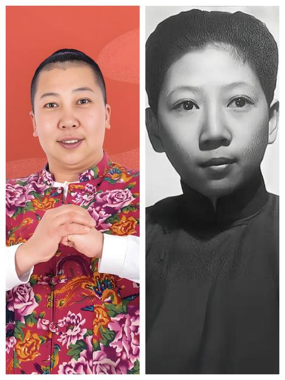
    - <a href="https://www.zhihu.com/people/404notfoundli">梓音</a> (<small title="北京">2026-1-11 22:35:8</small>): 我真求你了［大哭］［大哭］
    - <a href="https://www.zhihu.com/people/chu-men-shan-liao-yao">野狐禅</a> (<small title="浙江">2026-1-11 22:46:35</small>): 妈耶，我第一眼也是觉得很带派，一看评论区真有发的［飙泪笑］
    - <a href="https://www.zhihu.com/people/mu-zi-li-zi-min">木子李子闵</a> (<small title="河南">2026-1-11 23:37:28</small>): 哈哈哈哈哈哈哈，我第一眼也是这样觉得
    - <a href="https://www.zhihu.com/people/an-shi-en">安诗恩</a> (<small title="回复于 2026-1-12 0:8:4/天津"> ✉️:梓音</small>): 求也要排队［可怜］
    - <a href="https://www.zhihu.com/people/wang-yihua-4">飒沓如流星</a> (<small title="河南">2026-1-12 0:30:17</small>): 那个被二小姐撞死的交警看见这图也得在棺材里笑出声［飙泪笑］
    - <a href="https://www.zhihu.com/people/wu-shan-yun-yu-ming-hua-chang">巫山云雨明华裳</a> (<small title="北京">2026-1-12 0:44:10</small>): ［捂脸］［捂脸］［捂脸］
    - <a href="https://www.zhihu.com/people/zhang-heng-23-31">黎明扣扣邮箱登录</a> (<small title="湖北">2026-1-12 6:22:17</small>): 我吃不下，给你吃吧
    - <a href="https://www.zhihu.com/people/wang-shi-sui-feng-97-47-58">往事随风</a> (<small title="四川">2026-1-12 7:47:3</small>): ［哇］  
 
  
 
，🚕［握手］🦽️🦽️🦽️
    - <a href="https://www.zhihu.com/people/er-chun-hou-zi">二春猴子</a> (<small title="山西">2026-1-12 7:48:10</small>): 带派啊！老铁，加个关注［赞］［赞］［赞］
    - <a href="https://www.zhihu.com/people/xiao-ya-41-17-56">远程畜牧业农场主</a> (<small title="湖北">2026-1-12 8:15:9</small>): 绷不住了［捂脸］
    - <a href="https://www.zhihu.com/people/hot-hot-84">花雨城</a> (<small title="湖北">2026-1-12 8:23:11</small>): 怪不得我看着眼熟［惊讶］［大笑］［捂脸］
    - <a href="https://www.zhihu.com/people/mouton-45">momo</a> (<small title="广东">2026-1-12 9:5:22</small>): 都很带派 刻板印象诚不欺我［doge］
    - <a href="https://www.zhihu.com/people/qi-yi-ren-sheng-26">仲尼</a> (<small title="河南">2026-1-12 9:40:54</small>): 太带派了！［飙泪笑］
    - <a href="https://www.zhihu.com/people/wu-ming-87-19-31">虞麓</a> (<small title="广东">2026-1-12 10:49:9</small>): 我就是来找这条评论的
    - <a href="https://www.zhihu.com/people/jia-ye-winter">tentenbagger</a> (<small title="上海">2026-1-12 11:23:54</small>): 好他妈面熟
    - <a href="https://www.zhihu.com/people/su-zui-da-shu">Szds</a> (<small title="北京">2026-1-12 11:44:44</small>): 太带派了
    - <a href="https://www.zhihu.com/people/xiao-feng-shu-46">远看似山不是山</a> (<small title="上海">2026-1-12 15:53:11</small>): ［滑稽］
    - <a href="https://www.zhihu.com/people/ti-wo-pan-bian-yici">替我叛变一次</a> (<small title="安徽">2026-1-12 17:18:4</small>): 这个赛道可以搞一波
    - <a href="https://www.zhihu.com/people/pu-zhu-zhu-78">蒲宁宁</a> (<small title="回复于 2026-1-12 19:16:26/广东"> ✉️:Szds</small>): 带派是什么意思啊请问了［发呆］
    - <a href="https://www.zhihu.com/people/su-zui-da-shu">Szds</a> (<small title="回复于 2026-1-12 20:17:49/北京"> ✉️:蒲宁宁</small>): 看看雨姐就知道什么叫带派了
    - <a href="https://www.zhihu.com/people/yao-ye-27-75">尧页</a> (<small title="山东">2026-1-13 0:56:28</small>): 多元雨宙！强
    - <a href="https://www.zhihu.com/people/wang-a-qiu-91">俺是你牛爷爷呀</a> (<small title="上海">2026-1-13 1:30:9</small>): 好家伙，家怪不得看着看着二小姐眼熟呢，家人们带不带派［为难］
    - <a href="https://www.zhihu.com/people/lan-ping-si-ji-66">蓝屏死机</a> (<small title="山东">2026-1-13 1:34:14</small>): 突然想起来 原起点某著名作家好像是好这一口的  
 
［飙泪笑］ 我们当年还调侃了很久 右边这位就是原定的女主之一［飙泪笑］
    - <a href="https://www.zhihu.com/people/la-hei-wo-a">人民阿列夫岁</a> (<small title="辽宁">2026-1-13 7:47:44</small>): 老心，扎铁了［大哭］
    - <a href="https://www.zhihu.com/people/wei-lan-12-47-84">王哥睡不着</a> (<small title="重庆">2026-1-13 8:12:26</small>): 俺们不干了！
    - <a href="https://www.zhihu.com/people/puleiboy">puleiboy</a> (<small title="内蒙古">2026-1-13 8:28:36</small>): “一阵强劲的音乐响起”
    - <a href="https://www.zhihu.com/people/ht-hh">十三</a> (<small title="辽宁">2026-1-13 12:47:10</small>): 🤣
    - <a href="https://www.zhihu.com/people/80-12-14-19">大歪</a> (<small title="回复于 2026-1-15 11:43:24/广东"> ✉️:蒲宁宁</small>): 死亡圆周率，die π
    - <a href="https://www.zhihu.com/people/miao-pa-si-32-7">爵勃的盛旺力斗战</a> (<small title="天津">2026-1-15 14:30:31</small>): 删了让我发，求求了。［大哭］［大哭］
    - <a href="https://www.zhihu.com/people/an-ping-jun-zhu">西门城口的石狮子</a> (<small title="回复于 2026-1-15 17:5:26/澳大利亚"> ✉️:蓝屏死机</small>): 谁啊
    - <a href="https://www.zhihu.com/people/rcvou5">呦呦鹿鸣Yoyo</a> (<small title="陕西">2026-1-15 20:37:53</small>): 左边这是谁啊？
    - <a href="https://www.zhihu.com/people/wei-jie-liao">韦德</a> (<small title="广东">2026-1-16 20:3:47</small>): 太带派了老铁
    - <a href="https://www.zhihu.com/people/jing-yi-zhu-5">柴进之</a> (<small title="回复于 2026-1-17 4:0:5/广东"> ✉️:蒲宁宁</small>): 带派就是黄龙江一派全都带蓝牙。
    - <a href="https://www.zhihu.com/people/bai-ri-19-80">小满</a> (<small title="江苏">2026-1-18 15:40:17</small>): 我看到就感觉像［思考］
    - <a href="https://www.zhihu.com/people/64-20-57-1">雄关漫道真如铁</a> (<small title="回复于 2026-1-19 12:37:37/辽宁"> ✉️:呦呦鹿鸣Yoyo</small>): 大名鼎鼎的雨姐，带派不老铁［捂脸］
    - <a href="https://www.zhihu.com/people/xiang-shang-tian-de-yu-3">想下海的鸟</a> (<small title="宁夏">2026-1-20 10:20:27</small>): 我翻上去看了好几遍，总觉这个人异样的眼熟［捂脸］
    - <a href="https://www.zhihu.com/people/xian-xian-86-91">羡仙</a> (<small title="山东">2026-1-25 12:12:53</small>): 果然不出所料的来了
    - <a href="https://www.zhihu.com/people/a-li-ya-nuo">亚克西</a> (<small title="山东">2026-1-26 8:14:46</small>): 带π
    - <a href="https://www.zhihu.com/people/lu-guo-ni-de-shi-jie-37">路过你的世界</a> (<small title="山东">2026-1-28 11:5:15</small>): 我感觉长的好像娱乐圈的一个人，但是想不起来了
    - <a href="https://www.zhihu.com/people/wu-bei-xiao-yao-24">雅俗共赏</a> (<small title="回复于 2026-1-31 15:18:57/山东"> ✉️:蓝屏死机</small>): 跃千愁的小说里有一段，看到那看不下去了，女扮男装去济源［看看你］
    - <a href="https://www.zhihu.com/people/b34tka">小看山b34TkA</a> (<small title="黑龙江">2026-1-31 18:10:21</small>): ［思考］
    - <a href="https://www.zhihu.com/people/bu-wang-chu-xin-7-65-87">国家不保护废物</a> (<small title="上海">2026-2-3 17:4:26</small>): ［大笑］
    - <a href="https://www.zhihu.com/people/9528jia-li-ban">9528珈立搬</a> (<small title="贵州">2026-3-21 21:4:56</small>): 我求你了［捂脸］
    - <a href="https://www.zhihu.com/people/zi-yue-wu-you-39">子曰无忧</a> (<small title="河南">2026-5-18 18:8:8</small>): 真特么像。
    - <a href="https://www.zhihu.com/people/zhu-zhu-34-27-17">乌米</a> (<small title="北京">2026-7-14 18:12:0</small>): 我真求你了［飙泪笑］
    - <a href="https://www.zhihu.com/people/ubuntu-48-6">带带大师兄258</a> (<small title="上海">2026-7-17 18:46:58</small>): 太带派了［生气］［生气］
    - <a href="https://www.zhihu.com/people/pu-ti-shu-32">菩提树</a> (<small title="湖北">2026-9-15 20:54:28</small>): 这个女星像孔令伟，台湾人 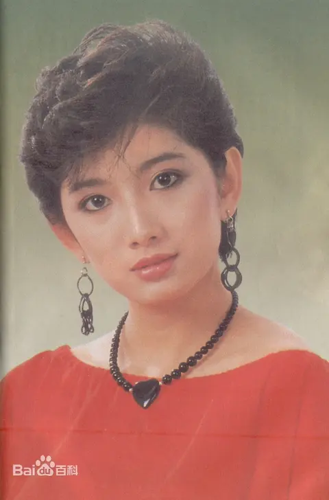
23. <a href="https://www.zhihu.com/people/hou-zhi-hou-jue-79-83">后知后觉</a> (<small title="江苏">2026-1-11 23:50:38</small>): 在老美眼里，这帮人都是罪人。当年为了所谓丢失中国的责任，老美自己处理了一批自己的官员。而蒋宋孔陈这些人贪污腐化，美国政府当年认为他们是直接责任人。他们带到美国的钱，美国政府认为是他们贪污美援，贪污国民政府的钱来的，所以搞他们很正常。而现在那些带资金跑到美国的人，不知道历史是一面镜子，美国政府迟早有一天把他们当新的韭菜割掉，最近出的几个被搞的中国富豪就是开始。
    - <a href="https://www.zhihu.com/people/17758033137">糖果果糖</a> (<small title="浙江">2026-1-12 9:51:48</small>): 老美还挺公正的，干这些人
    - <a href="https://www.zhihu.com/people/vvk1pm">消除我懒惰</a> (<small title="山东">2026-1-12 15:4:21</small>): 米国比中国人自己都清楚，这些人都是肥羊，他们那种资本主义可不是闹着玩的。
    - <a href="https://www.zhihu.com/people/lemonlimeng">童年时光机</a> (<small title="回复于 2026-1-12 15:41:29/浙江"> ✉️:糖果果糖</small>): 本意是坏的，执行的结果好了［生气］
    - <a href="https://www.zhihu.com/people/megatron-4-66">Megatron</a> (<small title="湖南">2026-1-12 15:46:36</small>): 麦克阿瑟不是证明了么，不是果党无能。实在是对手太强。  
 
拿美械的果军没打赢。纯正美国部队加多国联合也没打出大名堂来。
    - <a href="https://www.zhihu.com/people/bea-1-41">曹勘</a> (<small title="回复于 2026-1-12 22:42:59/山东"> ✉️:童年时光机</small>): 本意是好的，执行结果坏了［生气］
    - <a href="https://www.zhihu.com/people/bea-1-41">曹勘</a> (<small title="回复于 2026-1-12 22:43:8/山东"> ✉️:童年时光机</small>): 你选哪个？
    - <a href="https://www.zhihu.com/people/ri-yue-guang-ming-43">日月光明</a> (<small title="山西">2026-1-13 3:15:26</small>): 真以为那些富豪不知道历史呢？不跑马上被割，跑了好歹还能富裕一两代，真当别人傻？
    - <a href="https://www.zhihu.com/people/bo-luo-han-bao">菠萝汉堡</a> (<small title="陕西">2026-1-13 8:14:48</small>): 没事，多买些大豆献殷勤就好了
    - <a href="https://www.zhihu.com/people/chris-45-15-74">Chris</a> (<small title="回复于 2026-1-13 9:10:27/安徽"> ✉️:糖果果糖</small>): 那是，你看惠普搞那个英国的AI公司，就给你留妻子活着（避免无人继承财产，被王室继承），老板的血脉都完犊子了［大笑］。
    - <a href="https://www.zhihu.com/people/xiao-mo-gui-68-58">穆之</a> (<small title="回复于 2026-1-13 10:36:9/山东"> ✉️:日月光明</small>): 那为什么非得逃到美国呢？逃到北欧不好吗？逃到欧洲？富一代和富二代，三代有什么区别？反正都要被收割。在国内被收割，说不定还能掉点渣给国人呢。在国外被收割，这不纯纯拿着国人的钱，给外国送钱。
    - <a href="https://www.zhihu.com/people/maoriex">Maoriex</a> (<small title="回复于 2026-1-13 12:27:50/四川"> ✉️:穆之</small>): 那个时候北欧还没富起来呢［飙泪笑］
    - <a href="https://www.zhihu.com/people/15-59-77-34">知乎用户7ZCBMX</a> (<small title="回复于 2026-1-13 13:28:12/河南"> ✉️:穆之</small>): 在国内割后代可能坐牢
    - <a href="https://www.zhihu.com/people/du-du-86-57">南山</a> (<small title="回复于 2026-1-14 7:51:8/安徽"> ✉️:穆之</small>): 那些人的脑子就是那么奇葩
    - <a href="https://www.zhihu.com/people/a-bo-46-70">阿博</a> (<small title="回复于 2026-1-14 9:18:14/广西"> ✉️:穆之</small>): 人离乡贱。更何况去欧洲也不是好选择，看看欧洲现在堕落成啥样了。
    - <a href="https://www.zhihu.com/people/jphr-66">jphr</a> (<small title="回复于 2026-1-14 9:59:26/四川"> ✉️:菠萝汉堡</small>): 美国人在你眼里就这么坏吗？
    - <a href="https://www.zhihu.com/people/zhou-wei-tao-99">明言</a> (<small title="回复于 2026-1-14 11:31:46/新疆"> ✉️:穆之</small>): 北欧也是90年代以后才富起来的
    - <a href="https://www.zhihu.com/people/hou-zhi-hou-jue-79-83">后知后觉</a> (<small title="回复于 2026-1-14 12:48:14/江苏"> ✉️:日月光明</small>): 他们真的不知道历史，80年前出生的中国人，很多是无脑崇拜，美国在他们眼里是云端上的，没有缺点的。
    - <a href="https://www.zhihu.com/people/hou-zhi-hou-jue-79-83">后知后觉</a> (<small title="回复于 2026-1-14 12:52:46/江苏"> ✉️:消除我懒惰</small>): 所以特朗普2024年总统竞选期间的公开讲，以前中国移民美国的多少都是精英，现在移民美国的中国人基本是毫无道德底线的贪官污吏、巧取豪夺的不法商人、不学无术的纨绔子弟。”这其实也代表了美国政府和主流民意的看法，也预示着他们割起这些韭菜来没有任何心理负担，因为你来路不正。民国那群人跑美国被收割，他们屁的不敢放一个，也是一样原因。
    - <a href="https://www.zhihu.com/people/song-yue-38-79">东溪书院</a> (<small title="回复于 2026-1-14 14:15:39/湖南"> ✉️:穆之</small>): 跑出中国就完全被犹太控制了。
    - <a href="https://www.zhihu.com/people/aayyyy-20">aayyyy</a> (<small title="回复于 2026-1-14 14:59:32/河南"> ✉️:糖果果糖</small>): 又不是自己人 干他怎么的［飙泪笑］
    - <a href="https://www.zhihu.com/people/ben-pao-de-gua-niu-13-86">奔跑的蜗牛</a> (<small title="回复于 2026-1-14 17:16:57/北京"> ✉️:Megatron</small>): 麦克阿瑟确实没打赢，但是没有老蒋输的那么惨，个人认为比老蒋水平高一些
    - <a href="https://www.zhihu.com/people/gerald-67-83">Gerald</a> (<small title="回复于 2026-1-14 17:43:28/湖北"> ✉️:后知后觉</small>): 大统领说的挺对的
    - <a href="https://www.zhihu.com/people/bu-sheng-bu-mie-ru-qu-ru-lai">一笑倾城</a> (<small title="回复于 2026-1-16 10:19:33/江西"> ✉️:奔跑的蜗牛</small>): 那么好的条件打成这样，比蒋该死还拉
    - <a href="https://www.zhihu.com/people/chi-cui-hong-40">雨打芭蕉</a> (<small title="上海">2026-1-16 13:40:49</small>): 美国替天行道！
    - <a href="https://www.zhihu.com/people/t-ba-ling-ling">勇往向前</a> (<small title="海南">2026-1-16 23:3:12</small>): 蒋氏家族，宋氏家族，孔氏家族，这些人。基本上就是不伦不类，封建时代的奴隶主而已。
    - <a href="https://www.zhihu.com/people/bai-se-chun-qiu">黑洞不黑</a> (<small title="辽宁">2026-1-20 17:53:44</small>): 就驼峰航线宋美龄用救国的飞机空运占了一半机舱的空间运钢琴化妆品名牌奢饰品，当时的老美看了也得来句必吃，因为驼峰航线真的会死美国飞行员。
    - <a href="https://www.zhihu.com/people/bai-se-chun-qiu">黑洞不黑</a> (<small title="回复于 2026-1-20 17:54:43/辽宁"> ✉️:穆之</small>): 当时欧洲可是面临苏联钢铁洪流的平推啊［捂脸］。怕真吊路灯和吃蘑菇云。
    - <a href="https://www.zhihu.com/people/chang-wei-46-73">想不出来名</a> (<small title="河南">2026-1-24 12:11:17</small>): 美帝对其他人都重拳出击，更何况这帮人是贪的美帝援助，美国人早就恨得牙痒痒了。
    - <a href="https://www.zhihu.com/people/1-10-11-67-32">发面团</a> (<small title="回复于 2026-2-8 20:20:29/广东"> ✉️:奔跑的蜗牛</small>): 比光头差远了，人家的兵员是抓壮丁拼凑的，指挥的混乱的，武器是杂牌和外援的，可他力抗的是一群元帅且打了几年才败逃。反观这个国际级别的五星老外，其在携二战胜威，合列强峰值精锐，装备碾压且管够，可在只对阵一个元帅的情况下才抗了一阵子就败退被撸，而且其对阵的彭帅也不是众帅中最历害的。这无异于皇帝阅兵时被扒光衣服，远比确有众多不利因素而逐步崩溃的光头来的更不可思议，这种过于夸张的反差，估计当时的世界各国都得下意识的摸一摸门牙。  
 
而老米在被反推后，那些与光头对接的米官再也不敢对其明嘲暗讽高高在上了，面对有点神气的光头也开始恭敬起来，随后几近断更的援助都加码了。送礼还得陪笑，这足以说明老米也认可木偶对共的战力远比自己强
    - <a href="https://www.zhihu.com/people/hai-jun-shang-jiang-28">海军上将</a> (<small title="回复于 2026-3-24 14:13:55/上海"> ✉️:奔跑的蜗牛</small>): 麦克阿瑟又让老蒋自信起来了［doge］
    - <a href="https://www.zhihu.com/people/ri-yue-guang-ming-43">日月光明</a> (<small title="回复于 2026-7-13 23:53:15/山西"> ✉️:穆之</small>): 北欧并不利好富人，某种角度来说，北欧是最接近社会zy的地方
    - <a href="https://www.zhihu.com/people/zheng-rong-lian">整容脸</a> (<small title="北京">2026-7-14 15:27:52</small>): 想多了，美国压根就找不到证据，这才知道被杜鲁门坑了，所以才处理了自己的一批官员。这些kmt官员在美国去世对时候美国政府高官云集送行
    - <a href="https://www.zhihu.com/people/shou-nian-xiang-zi-chi-yi-dao">手粘箱子吃一刀</a> (<small title="山东">2026-7-15 5:24:36</small>): 那是美国自己的战略收缩，包括南北朝鲜的形成，不能怪老蒋，美国不给支援，老蒋打不过
    - <a href="https://www.zhihu.com/people/dong-feng-tou-zou-de-nian-hua">假装自己很忙</a> (<small title="河北">2026-7-16 14:18:54</small>): 还真是，远征军美军司令史迪威当时就特别看不上果党腐败，但没办法，指着士兵打仗呢，后来战败了，果党高层能跑的全跑过来了，美国一看，嘿这不巧了吗
    - <a href="https://www.zhihu.com/people/ling-hu-rui-kang">三尖子</a> (<small title="回复于 2026-7-20 15:52:8/江苏"> ✉️:整容脸</small>): 云集？意淫也能云集？！2
    - <a href="https://www.zhihu.com/people/luo-tian-59-23">知乎用户111</a> (<small title="吉林">2026-7-23 15:23:54</small>): 美国就盯这些富豪割呢，因为吃定他们回不了中国了。你跑都跑不了，老实被吃得了
    - <a href="https://www.zhihu.com/people/alex124592">Alex124592</a> (<small title="回复于 2026-9-6 10:7:54/广东"> ✉️:糖果果糖</small>): 只能说是幼稚
24. <a href="https://www.zhihu.com/people/1-7-28-39">老王</a> (<small title="北京">2026-1-11 23:34:24</small>): 哈耶克:人群流动的方向就是文明的方向。
    - <a href="https://www.zhihu.com/people/ming-wei-zhi-35">摔倒爬起天天向上</a> (<small title="福建">2026-1-12 13:2:27</small>): 近三十年，最大移民国经济最强国的人口增长量，真笑死人了
    - <a href="https://www.zhihu.com/people/xi-ke-suo">奚克索</a> (<small title="回复于 2026-1-13 9:22:9/山东"> ✉️:摔倒爬起天天向上</small>): 这简直是部队回收廠［捂脸］
    - <a href="https://www.zhihu.com/people/he-shao-63-36">god是dog</a> (<small title="安徽">2026-1-14 8:23:50</small>): 所以西欧是文明洼地
    - <a href="https://www.zhihu.com/people/10-74-30-10">Transformeraholi</a> (<small title="广东">2026-2-7 19:3:53</small>): 随大流，献上黄金甲？
25. <a href="https://www.zhihu.com/people/fan-er-sai-de-bu-da-la">平安是福</a> (<small title="安徽">2026-1-12 0:34:36</small>): 这，反倒真替我们做到了王侯将相宁有种乎了。不然，还让这些家族子传孙孙传子吗
    - <a href="https://www.zhihu.com/people/da-xue-man-gong-dao-15">大雪满弓刀</a> (<small title="江苏">2026-1-12 8:32:4</small>): 美国本土的家族依旧子孙相传啊，这些外来的家族不过被骗过去吃掉了而已，谈不上王侯将相宁有种乎。
    - <a href="https://www.zhihu.com/people/wu-ming-87-19-31">虞麓</a> (<small title="广东">2026-1-12 10:53:55</small>): 美国有美国的“种”，他们这啥都不是
    - <a href="https://www.zhihu.com/people/93-69-14-98-92">分别在雨夜</a> (<small title="江西">2026-1-13 2:7:50</small>): 这些哪算得上美国种
    - <a href="https://www.zhihu.com/people/tian-kong-75-30-61">天空</a> (<small title="回复于 2026-1-13 2:12:50/湖南"> ✉️:大雪满弓刀</small>): 背井离乡
    - <a href="https://www.zhihu.com/people/81-86-1-51-73">德码</a> (<small title="贵州">2026-1-13 2:57:14</small>): 美国上层剥削阶级里面也不是没有流行过这种“硬汉”风格的教育，资本主义的腐败堕落不是开玩笑的也不是反话，那些酒醉金迷是真的，但吃人不吐骨头，甚至亲生孩子都吃也是真的。
    - <a href="https://www.zhihu.com/people/fan-er-sai-de-bu-da-la">平安是福</a> (<small title="回复于 2026-1-13 8:41:14/安徽"> ✉️:虞麓</small>): 是送上门的肥羊。
    - <a href="https://www.zhihu.com/people/shen-hai-yu-591">深海鱼591</a> (<small title="回复于 2026-1-15 16:52:39/北京"> ✉️:德码</small>): 献祭吗？
26. <a href="https://www.zhihu.com/people/mao-yu-32-37">猫于</a> (<small title="四川">2026-1-14 7:58:46</small>): 这个蒋孝文就是给他爷爷背诵“三千里地河山，四十年来家国”的那位么？大陆电影还是太美化它们了［飙泪笑］
    - <a href="https://www.zhihu.com/people/mo-tian-68-7">枸歌</a> (<small title="四川">2026-3-15 20:38:43</small>): 艾伦
    - <a href="https://www.zhihu.com/people/72-33-31-90">向抵抗者致敬的人</a> (<small title="天津">2026-5-28 22:3:1</small>): 是的，艾伦就是他，我当时看的时候根本没有把蒋孝文和Alan联系在一起。
    - <a href="https://www.zhihu.com/people/24-41-9-66">小书包</a> (<small title="广东">2026-6-18 23:23:38</small>): 最是仓皇辞庙日，教坊犹奏别离歌，垂泪对宫娥。［捂脸］
27. <a href="https://www.zhihu.com/people/qzyqzyqzy">互联网小松鼠</a> (<small title="德国">2026-1-12 0:14:40</small>): 文章精辟！还是得建设家园。 川宝那种寒门出贵子的特例是特别聪明的人，对于上面来说他是从底层干上来的真的能干，人家是青春永驻的小伙子，还是金发白人形象出镜，他能替家族扛旗，替犹太佬和幕后黑手背黑锅。  
 
  
 
蒋宋孔陈四大手套保险丝，老大老大一笔钱了，美国发的绝户财，所以要控制媒体言论，不能让消息广而告之，不好骗新猪崽了，大家族被人用完扔掉，敲骨吸髓失势就抢钱，死无葬身之地，就算是基督教家庭，后代是分支，也不让进基督教墓地，人家那是高级别犹太佬的，轮不到边缘国民党手套。  
 
  
 
其实看脸就知道，管他们春秋笔法怎么写呢，都写在脸上，一看就精神有灵气舒展漂亮，跟一看就被切削打压了气象的面相就不一样，不是选美，是一看就知道舒不舒畅，静定，神气，气聚还是散，散那是被人故意搞的，那种容易疯的可能就是高敏感都感觉到了但是血不够厚没顶住，高敏感这种撑过那一阵后面真能成长起来呢吧，就是人家美国人一看他们行，就得搞他们，绝症的绝代佳人可以去最后的疯狂，正经人算了吧。  
 
  
 
复制粘贴:  
 
王安、王嘉廉听说过吗？都是曾经的在美华人首富，他们的后人呢［捂脸］  
 
  
 
钱要权保证的，自古如此。  
 
  
 
这么说牢美真的是他国移民美国的官员富商名流们最严厉的父亲［捂脸］  
 
  
 
参考美国建国十三行假说，美国建立有满清深度参与的话。四大家族和孔家以及华人被这样搞就很正常了，他们都知道是这群人搞没了他们老家，而且华人只配当奴隶，所以无所不用其极的搞死  
 
  
 
但是新中国讲究统战价值，所以遗老遗少还是有生存机会，生活的还比较好。  
 
  
 
蒋经国老婆是个苏联人，他们有酗酒基因  
 
  
 
蒋家第三代里貌似只有蒋纬国的儿子和蒋经国的两个私生子读书还蛮好，也算是有正经工作的，好像其中一个还在台湾当大学老师后面当校长了  
 
  
 
总结下来就是派正常人照顾精神病，派坏人照顾好人。这种照顾法放在那里也是没一个能幸存的。  
 
  
 
其实就是斩杀线，淘汰机制优化  
 
  
 
白崇禧的儿子白先勇  
 
白先勇还好，他三姐先明在美国留学发疯了  
 
  
 
没送去衡水打磨打磨真是生不逢时［大笑］  
 
蒋经国的三个儿子都送去军校也没用啊［捂嘴］，倒是两个私生子知道寄人篱下的滋味不好受，发愤读书了  
 
  
 
这不挺好啊，阶层不固化。世袭贵族就好了？  
 
这不正说明人家才是固化的吗？  
 
你看看佩洛西家族，统治加州多少年。  
 
人家只是跟你没人情世故，人家自己都是祖传。  
 
人家自己人固化，你外来人可进不去。  
 
  
 
长生种和短生种，美国早就固化了。外来的不固化，花光带来的钱后，在中产、底层和流浪汉之间靠本事向下流动。  
 
  
 
老布什、小布什：没错孩子们，我们不是政治家族［飙泪笑］  
 
  
 
特朗普家族就挺励志的。  
 
第一代跑路美国，白手起家，开旅馆妓院赌场。  
 
第二代经营酒店地产。  
 
第三代成为总统。  
 
  
 
老特在老钱面前是寒门
    - <a href="https://www.zhihu.com/people/jin-se-de-meng-1968">玉书桐</a> (<small title="美国">2026-1-12 4:15:2</small>): 帶錢來美國和在美國发财是不同的。 能在美国延續几代財富 才是真本領。 这些來美国的有钱人 原本就是失败者 在母国被趕出來的 所以來美是难民一樣 和母體文化断血。 混血兒極有可能生育以及精神易出毛病。 他們第一不找本族 第二中文放弃了 所以同化． 反而中国城 有宗祠 常往來內地 有族人不斷填血 一直延續。
    - <a href="https://www.zhihu.com/people/tkl886">tkl886</a> (<small title="回复于 2026-1-12 7:3:55/广东"> ✉️:玉书桐</small>): 是这个道理不过你怎么说繁体字［飙泪笑］
    - <a href="https://www.zhihu.com/people/ling-qian-11">gyko</a> (<small title="浙江">2026-1-12 13:2:1</small>): 章孝严是王继春的野出，跟蒋家没有任何血缘关系
    - <a href="https://www.zhihu.com/people/ling-qian-11">gyko</a> (<small title="浙江">2026-1-12 13:2:28</small>): 你帮野出鉴定的蒋经国的私生子吗？经国日记里写了双胞胎是王继春的儿子
    - <a href="https://www.zhihu.com/people/ling-qian-11">gyko</a> (<small title="浙江">2026-1-12 13:2:41</small>): 章孝严章孝慈学历都是垫底，以章孝严垫底的学历不蹭蒋姓到不了现在的位置
    - <a href="https://www.zhihu.com/people/ling-qian-11">gyko</a> (<small title="浙江">2026-1-12 13:2:47</small>): kmt要利用章孝严这个冒牌货而已
    - <a href="https://www.zhihu.com/people/ling-qian-11">gyko</a> (<small title="浙江">2026-1-12 13:2:56</small>): 章孝严乱认祖宗说明一能力不行，二人品不行，为了利益连祖宗都改了
    - <a href="https://www.zhihu.com/people/ling-qian-11">gyko</a> (<small title="浙江">2026-1-12 13:3:4</small>): 台湾身份证有父亲栏，根据民法，改姓必须由生父认领，并验dna，章孝严属于违法操作
    - <a href="https://www.zhihu.com/people/ling-qian-11">gyko</a> (<small title="浙江">2026-1-12 13:3:17</small>): 章亚若是郭礼伯的妾 怀孕之后跟郭礼伯说孩子是他的，郭礼伯说姓蒋比姓郭好（郭礼伯儿子出书写的）
    - <a href="https://www.zhihu.com/people/ling-qian-11">gyko</a> (<small title="浙江">2026-1-12 13:5:13</small>): 章孝严章孝慈都毕业于台湾垫底大学，哪里发愤读书了？全靠蹭别人的姓
    - <a href="https://www.zhihu.com/people/bing-qia-lff">冰卡lff</a> (<small title="北京">2026-1-12 13:13:6</small>): 怪不得看照片觉得小蒋的大儿子大女儿是混血
    - <a href="https://www.zhihu.com/people/jin-se-de-meng-1968">玉书桐</a> (<small title="回复于 2026-1-12 15:14:6/美国"> ✉️:tkl886</small>): 我识简认繁。 因为在写书 原始材料很多是繁体字 特别觉得繁体字中的文字之美 传承之美。
    - <a href="https://www.zhihu.com/people/74246-77">知乎用户74246</a> (<small title="山西">2026-1-13 0:57:39</small>): 可惜第四代只学会电脑开机
    - <a href="https://www.zhihu.com/people/qzyqzyqzy">互联网小松鼠</a> (<small title="回复于 2026-1-13 7:29:22/德国"> ✉️:知乎用户74246</small>): 就神了，好多都这样，就好像被人暗害过，或者为了保命装傻充愣似的，清晰传达没有任何威胁性
    - <a href="https://www.zhihu.com/people/qzyqzyqzy">互联网小松鼠</a> (<small title="回复于 2026-1-13 7:30:32/德国"> ✉️:冰卡lff</small>): 高层混血也正常，交往的面大，小老百姓那种可能就是类似被租妻了。
    - <a href="https://www.zhihu.com/people/qzyqzyqzy">互联网小松鼠</a> (<small title="回复于 2026-1-13 7:32:47/德国"> ✉️:gyko</small>): 能大学毕业算不错了，看跟同家族后代对比还是跟平民天骄对比，你说的也有道理
    - <a href="https://www.zhihu.com/people/qzyqzyqzy">互联网小松鼠</a> (<small title="回复于 2026-1-13 7:33:56/德国"> ✉️:gyko</small>): 哈哈哈，知识点很细致嘛，又学到啦，青青大草原，不一定是谁的孩子呢
    - <a href="https://www.zhihu.com/people/qzyqzyqzy">互联网小松鼠</a> (<small title="回复于 2026-1-13 7:35:55/德国"> ✉️:gyko</small>): 纵横捭阖，能踩着出身的资源左右逢源，玩得明白也行了，高敏感还可能会疯掉，也是生命力不差了，当然，私生子从小没那么有安全感，争口袋得去争，所以还不是彻底的公子哥大小姐
    - <a href="https://www.zhihu.com/people/qzyqzyqzy">互联网小松鼠</a> (<small title="回复于 2026-1-13 7:40:44/德国"> ✉️:玉书桐</small>): 有被赶出来的，也有被家庭托举出来的呀，也被排挤打压，从学校里就开始了，切削孩子气象没跑的，就是这个孩子比美国孩子优秀的多，人家觉得有威胁性，就是要把孩子往傻了弄，散孩子的气，破孩子的功
    - <a href="https://www.zhihu.com/people/lao-zi-shi-miao-ye">老子是喵爷</a> (<small title="广西">2026-1-16 13:46:24</small>): 蒋万安还做台北市长了
    - <a href="https://www.zhihu.com/people/qzyqzyqzy">互联网小松鼠</a> (<small title="回复于 2026-1-20 10:7:21/德国"> ✉️:老子是喵爷</small>): 君子之泽五世而斩，还有余荫挺好的，也挺会处事的。
    - <a href="https://www.zhihu.com/people/ling-qian-11">gyko</a> (<small title="回复于 2026-4-25 15:14:29/浙江"> ✉️:互联网小松鼠</small>): 你帮野出鉴定的家族吗？
    - <a href="https://www.zhihu.com/people/ling-qian-11">gyko</a> (<small title="回复于 2026-4-25 15:15:6/浙江"> ✉️:互联网小松鼠</small>): 章孝严是王继春的野出，跟蒋家没有任何血缘关系
    - <a href="https://www.zhihu.com/people/ling-qian-11">gyko</a> (<small title="回复于 2026-4-25 15:15:27/浙江"> ✉️:互联网小松鼠</small>): 章孝严章孝慈学历都是垫底，以章孝严垫底的学历不蹭蒋姓到不了现在的位置
    - <a href="https://www.zhihu.com/people/ling-qian-11">gyko</a> (<small title="回复于 2026-4-25 15:16:4/浙江"> ✉️:互联网小松鼠</small>): 章孝严是王继春的私生子，不是蒋经国的私生子
    - <a href="https://www.zhihu.com/people/ling-qian-11">gyko</a> (<small title="回复于 2026-4-25 15:16:11/浙江"> ✉️:互联网小松鼠</small>): kmt要利用章孝严这个冒牌货而已
    - <a href="https://www.zhihu.com/people/ling-qian-11">gyko</a> (<small title="回复于 2026-4-25 15:17:1/浙江"> ✉️:老子是喵爷</small>): 章万安是王继春的野出，跟蒋家没有任何血缘关系
    - <a href="https://www.zhihu.com/people/ling-qian-11">gyko</a> (<small title="回复于 2026-4-25 15:17:11/浙江"> ✉️:老子是喵爷</small>): 章万安是史上学历最低的台北市长，除了章万安都是台湾大学毕业的，不蹭蒋姓根本没有资格去选
    - <a href="https://www.zhihu.com/people/ling-qian-11">gyko</a> (<small title="回复于 2026-4-25 15:17:17/浙江"> ✉️:老子是喵爷</small>): kmt要利用章万安这个冒牌货而已
    - <a href="https://www.zhihu.com/people/ling-qian-11">gyko</a> (<small title="回复于 2026-4-25 15:17:26/浙江"> ✉️:互联网小松鼠</small>): 章万安是王继春的野出，跟蒋家没有任何血缘关系
    - <a href="https://www.zhihu.com/people/ling-qian-11">gyko</a> (<small title="回复于 2026-4-25 15:17:35/浙江"> ✉️:互联网小松鼠</small>): kmt要利用章万安这个冒牌货而已
    - <a href="https://www.zhihu.com/people/qzyqzyqzy">互联网小松鼠</a> (<small title="回复于 2026-4-26 2:16:44/黑龙江"> ✉️:gyko</small>): 没有呀，愿闻其详，感恩指点
    - <a href="https://www.zhihu.com/people/qzyqzyqzy">互联网小松鼠</a> (<small title="回复于 2026-4-26 2:17:3/黑龙江"> ✉️:gyko</small>): kmt是啥？
    - <a href="https://www.zhihu.com/people/qzyqzyqzy">互联网小松鼠</a> (<small title="回复于 2026-4-26 2:17:55/黑龙江"> ✉️:gyko</small>): 哦哦，有点出身，没能力，好拿捏听话被利用，一般都喜欢扶这种上位，没有威胁性，没人嫉妒
28. <a href="https://www.zhihu.com/people/Ju-Dy-23">Judy</a> (<small title="贵州">2026-1-11 21:49:52</small>): 大多数人还是摆脱不了各种偏见的，不说种族之间，那地域之间的偏见也不在少数。
29. <a href="https://www.zhihu.com/people/qianqianbj">妙云</a> (<small title="北京">2026-1-11 21:44:44</small>): 美国文化就是这样....中美文化是非常相悖的
    - <a href="https://www.zhihu.com/people/zi-jin-cheng-59">小房子</a> (<small title="四川">2026-1-13 0:20:38</small>): 明明文化是相近的，你看这几个家族在大陆混不下去，在美国照样混不下去，说白了这也打不过那也打不过
    - <a href="https://www.zhihu.com/people/qianqianbj">妙云</a> (<small title="回复于 2026-1-13 1:0:7/北京"> ✉️:小房子</small>): 不是 我的意思是美国文化排斥中国文化 会污名化 不是打不过的问题吧
    - <a href="https://www.zhihu.com/people/tian-kong-75-30-61">天空</a> (<small title="回复于 2026-1-13 1:53:40/湖南"> ✉️:小房子</small>): 确实没有创造力
    - <a href="https://www.zhihu.com/people/zi-jin-cheng-59">小房子</a> (<small title="回复于 2026-1-13 15:52:53/四川"> ✉️:妙云</small>): 压根就融合不进去，就算有美国国籍，你也不是白人啊［飙泪笑］
    - <a href="https://www.zhihu.com/people/qianqianbj">妙云</a> (<small title="回复于 2026-1-13 16:45:34/北京"> ✉️:小房子</small>): 他们根本不存在融入...dei是假的 哪怕出生在美国 他们的自我认同是美国人
    - <a href="https://www.zhihu.com/people/19-7-30-76">月梦剑心</a> (<small title="安徽">2026-1-14 11:16:54</small>): 我看皇汉说满溢在老美生活不错，有资金有基地，在社会上具有影响力。还说美联储就是以前广州十三行（本人只是记录他们说的）［思考］
    - <a href="https://www.zhihu.com/people/qianqianbj">妙云</a> (<small title="回复于 2026-1-14 19:34:37/北京"> ✉️:月梦剑心</small>): 那都是过去了我估计 就出生在美国 他们的文化会迫使他们想成为美国人 除非少数回来的
    - <a href="https://www.zhihu.com/people/zhong-chi-zi-chen">钟离紫晨</a> (<small title="回复于 2026-1-15 11:36:51/四川"> ✉️:月梦剑心</small>): 美国独立后能发达 也少不了与清朝的贸易和交流(茶叶 西洋参 冰 华人劳工… ) 1904年西奥多罗斯福很高兴地接收慈禧画像 也说明关系不一般。
    - <a href="https://www.zhihu.com/people/shen-hai-yu-591">深海鱼591</a> (<small title="回复于 2026-1-15 16:24:59/北京"> ✉️:月梦剑心</small>): 估计可能钱是广州十三行的，但是血脉已经被稀释了［酷］
    - <a href="https://www.zhihu.com/people/ji-yong-de-chu-ju">鸡涌的雏菊</a> (<small title="回复于 2026-1-31 18:8:36/四川"> ✉️:月梦剑心</small>): 但出去的藏族奴隶主们过得好像还不错
    - <a href="https://www.zhihu.com/people/19-7-30-76">月梦剑心</a> (<small title="回复于 2026-1-31 18:10:30/安徽"> ✉️:鸡涌的雏菊</small>): 确实，论有技术的重要性［大笑］
    - <a href="https://www.zhihu.com/people/tao-pao-zhe-30">逃跑者</a> (<small title="广东">2026-2-5 8:41:51</small>): 他们是什么样的文化
    - <a href="https://www.zhihu.com/people/10-74-30-10">Transformeraholi</a> (<small title="广东">2026-2-7 18:52:48</small>): 怎么办？退回清朝？
    - <a href="https://www.zhihu.com/people/13-3-60-49-70">青华无悲喜</a> (<small title="回复于 2026-7-14 1:52:27/广东"> ✉️:钟离紫晨</small>): 斯坦福大学地下工人
    - <a href="https://www.zhihu.com/people/60-20-75-41">专业锄奸</a> (<small title="回复于 2026-7-20 13:8:14/贵州"> ✉️:天空</small>): 嘢夠［尴尬］
30. <a href="https://www.zhihu.com/people/ping-xing-xian-502">平行线502</a> (<small title="广东">2026-1-12 15:7:26</small>): ［捂脸］《消失在历史长河里面》该不会是被做掉了吧
31. <a href="https://www.zhihu.com/people/poi-75-29">Poi</a> (<small title="河北">2026-1-15 8:55:34</small>): 从孙科开始，后面的内容都在说一件事。权贵出去之后没有“祖荫”［大笑］
32. <a href="https://www.zhihu.com/people/ben_gx">ben gx</a> (<small title="广东">2026-1-12 8:25:30</small>): 等等，8月结婚5月产子，这不是妥妥的9月怀胎吗？怎么可能大肚子结婚？
    - <a href="https://www.zhihu.com/people/ming-xin-lei">明阳</a> (<small title="江苏">2026-2-27 16:46:9</small>): 没有大肚子，但也不是9月，正常10月怀胎，就是7月怀孕的
    - <a href="https://www.zhihu.com/people/ben_gx">ben gx</a> (<small title="回复于 2026-2-27 18:56:39/广东"> ✉️:明阳</small>): 前面还写了“月份大没法打胎”呢
    - <a href="https://www.zhihu.com/people/bi-xing-86-35">必行</a> (<small title="回复于 2026-9-15 21:25:58/安徽"> ✉️:明阳</small>): 10月是农历大约数，实际上科学计算就是266天，按公历就是9个月，所以文章中这条有毛病，不是大着肚子结婚的！
33. <a href="https://www.zhihu.com/people/xiao-qian-xia-79-39">筱千夏</a> (<small title="山东">2026-1-13 15:59:49</small>): 他们这个下场，不是情理之中？历史课本对四大家族啥定义？买办，啥是买办，就是欧美列强派驻中国捞钱的代理人。他们捞的再多，也是欧美老爷们的。类似的还有菲律宾的马科斯家族，坊间传闻老马当年逃跑时，带走了上百亿美元的财富，可是呢，不还是全部被美国冻结了［doge］［doge］［doge］
    - <a href="https://www.zhihu.com/people/dba-34">DBA</a> (<small title="美国">2026-1-15 0:24:37</small>): 不是，“四大家族”（只有两家是富户）不是买办，但起点也不高，放同期美国也就个中产水平，只是靠连襟在原来国内有一定的权势而已
    - <a href="https://www.zhihu.com/people/38-73-71-57-57">你好</a> (<small title="河南">2026-3-18 0:21:20</small>): 这些是代理人，不是最大老板
    - <a href="https://www.zhihu.com/people/15-32-32-96">逾志</a> (<small title="回复于 2026-4-22 17:55:4/山东"> ✉️:你好</small>): 蒋都是代理人？谁是老板求教
    - <a href="https://www.zhihu.com/people/38-73-71-57-57">你好</a> (<small title="回复于 2026-4-23 4:0:35/河南"> ✉️:逾志</small>): 当然是美日了
    - <a href="https://www.zhihu.com/people/15-32-32-96">逾志</a> (<small title="回复于 2026-4-23 9:10:15/山东"> ✉️:你好</small>): 请问日本是指日本陆军还是海军还是倭皇？毕竟海陆军都快打起来了，美国是指罗斯福还是哪个组织？那会全世界灭油，美国资本家被罗斯福快搞死了，为什么你会认为美或日就像一个人一样意志统一？他们国内都在争权夺利谁又能远程操控常凯申？利益交换肯定是有，要是接受好处就成了傀儡代理人，那共产国际怎么说？
34. <a href="https://www.zhihu.com/people/zhi-zhe-wu-huo-si-zhe-wu-jiang">知者无惑 思者无疆</a> (<small title="福建">2026-1-12 19:22:26</small>): 不奇怪，不奇怪，那堆人都那样，有什么好奇怪的，留黄金三世，不如留家风万年
    - <a href="https://www.zhihu.com/people/xiong-xiong-42-83">胡咧咧</a> (<small title="河南">2026-1-12 19:55:38</small>): 道德传家，十代以上，耕读传家次之，诗书传家又次之，富贵传家不过三代。蒋宋孔在台湾和美国想做耕读传家，无奈只做成了富贵传家
    - <a href="https://www.zhihu.com/people/arorsc">ARorSC</a> (<small title="山东">2026-1-14 4:53:14</small>): 家学家风家谱，才是最宝贵的，比黄金更宝贵的唯有一缕悠久隽永的残香，一脉精气神，这也是一个文明文脉神髓之所以重要的原因所在，有了这些，保护传承好这些，钱与权都是可以无中生有的。往大了说，中国，华夏汉文明之所以被系统性灭绝了300年，仍能顽强生存，并在挣脱杀阵后崛起这么快，也是一样的道理----家学过于深厚
35. <a href="https://www.zhihu.com/people/7lddbh">圣遗物牢A的酸奶</a> (<small title="广东">2026-4-28 15:19:50</small>): 你敢谁说红孩儿过去了变什么样吗［飙泪笑］［飙泪笑］［飙泪笑］［飙泪笑］
    - <a href="https://www.zhihu.com/people/60-20-75-41">专业锄奸</a> (<small title="贵州">2026-7-20 13:10:52</small>): 嘢夠［尴尬］
    - <a href="https://www.zhihu.com/people/a-xi-ba-61-83">转角遇到抢劫的</a> (<small title="湖南">2026-7-27 10:56:36</small>): 红孩儿过去了比他们过得好。 毕竟那些是前朝余孽，失了势的。 现在的可是如日中天。
36. <a href="https://www.zhihu.com/people/chen-he-yi-38">寂兮寥兮</a> (<small title="福建">2026-1-11 23:3:5</small>): 桔生南国为橘，生北国为枳。
37. <a href="https://www.zhihu.com/people/fei-ran-18">斐然</a> (<small title="重庆">2026-1-12 1:2:39</small>): 这就是他们通化其他民族的能力，你外来民族去了他们那里被他们优势包围，就不得不自觉不自觉地靠像他们，几百年前我们也有过这种能力
    - <a href="https://www.zhihu.com/people/zhang-li-da-30">寒江雪</a> (<small title="浙江">2026-1-12 9:25:35</small>): 问题是，无论去美国的名门望族后面如何变得像美国人。如何讨好美国人。一旦你在他们那里没有了利用价值。你带过去的巨大财富，就像小孩抱着金砖过街。迟早被他们抢走。  
 
  
 
看看犹太人就更清楚了，没有自己的国家，因为贪婪在德国乱放高利贷。最后被希特勒全部进了集中营。  
 
  
 
一个民族假如没有了国家概念。自己的上层人都看不起自己国家的人。要移民去美国做上等人。那其他国家的人又怎么会看得起你？一旦你没了利用价值，人家就会像扔垃圾一样把你给扔掉。然后拿走你所有的财富。
    - <a href="https://www.zhihu.com/people/fei-ran-18">斐然</a> (<small title="回复于 2026-1-15 17:49:29/重庆"> ✉️:寒江雪</small>): 他们这些过去的人最后如何都不是过不去的人担心的，懂了吗？
38. <a href="https://www.zhihu.com/people/xin-xi-wang-76-90">新希望</a> (<small title="山西">2026-1-12 7:55:59</small>): 国民党也是什么人传承啊，在美国遵纪守法（在法庭骂法官老美也有啊），一回国就欺男霸女横行不法了。  
 
这只能说明这一挂人压根不拿中国人当人，他们不是中国人，认为自己是精神美（英德）国人嘛。这个精神状态和明末满八旗汉军旗那一波很相似啊，以小族临大国，满洲太君无敌天下，万民如蝼蚁。  
 
从根本上说，这就是一个民族自信心的问题。明朝时候见到了外国人是非常正常的事情，甚至有使用外国雇佣军的情况。到了清末，民族自信心达到了最低点，看见了外国商人都像是老鼠见猫，《官场现形记》《文明小史》都是直接的反应。国民党这拨人没脱出这个范畴，还是以英美为师，从本质上说国民党主流就是一个买办的政党（也有阎锡山冯玉祥李宗仁这样的本土派，但影响有限），他们不得民心失国而去才是正常。  
 
建国以后我们也有一段时间进入了这个误区，开始是以苏联为师，开放后西方月亮是圆的，这个局面一直到了现在才有了一定的缓解，一方面我们逐渐的变强，另一方面对手也开始摆烂了。早期到国外的中国人极度的不自信，这个早期包括改革开放后一段时间的国人，现在的很多专家里面充斥着这一类，中国的传承是不可能依靠这类人的。  
 
梁启超的《少年中国说》是正确的，国家发展民族自信还是要看少年人呀。
39. <a href="https://www.zhihu.com/people/yang-xing-wang-12">Flory</a> (<small title="江西">2026-1-12 8:2:4</small>): 能搜索到清末那些逃掉的八旗后人如何了么
    - <a href="https://www.zhihu.com/people/shen-hai-yu-591">深海鱼591</a> (<small title="北京">2026-1-15 16:54:8</small>): 估计都类似，大差不差吧［发呆］
    - <a href="https://www.zhihu.com/people/shz-chk">chkchh</a> (<small title="广西">2026-1-17 20:48:56</small>): 不要小看它们，它们通过联姻混进西方高层家族内部了。现在暴露出来的那个谷爱凌就是冰山一角，谷爱凌只是低等阶层的满人跟西方人联姻的后代，但是都已经可以混得这么风风光光了，背后肯定有势力在捧她  
 
  
 
[清朝相对于宋朝是不是出现了审美倒退？](https://www.zhihu.com/question/632758450/answer/1987064378621719903?share_code=nY5ywlxZD4rF&utm_psn=1995960373338186900)  
 
  
 
[https://www.zhihu.com/question/659667270/answer/1896919306891154645?share\_code=Hswsc7FfkfSn&amp;utm\_psn=1995958749249159250](https://www.zhihu.com/question/659667270/answer/1896919306891154645?share_code=Hswsc7FfkfSn&amp;utm_psn=1995958749249159250)
    - <a href="https://www.zhihu.com/people/shz-chk">chkchh</a> (<small title="回复于 2026-1-17 20:49:18/广西"> ✉️:深海鱼591</small>): 不要小看它们，它们通过联姻混进西方高层家族内部了。现在暴露出来的那个谷爱凌就是冰山一角，谷爱凌只是低等阶层的满人跟西方人联姻的后代，但是都已经可以混得这么风风光光了，背后肯定有势力在捧她  
 
[清朝相对于宋朝是不是出现了审美倒退？](https://www.zhihu.com/question/632758450/answer/1987064378621719903?share_code=nY5ywlxZD4rF&utm_psn=1995960373338186900)  
 
  
 
[https://www.zhihu.com/question/659667270/answer/1896919306891154645?share\_code=Hswsc7FfkfSn&amp;utm\_psn=1995958749249159250](https://www.zhihu.com/question/659667270/answer/1896919306891154645?share_code=Hswsc7FfkfSn&amp;utm_psn=1995958749249159250)
    - <a href="https://www.zhihu.com/people/li-gan-rui-27">浮影倒世</a> (<small title="河南">2026-3-21 23:30:5</small>): 犹-猶 建酋(猶,猷) 猷酞
    - <a href="https://www.zhihu.com/people/seoul-nord">seoul nord伐</a> (<small title="上海">2026-9-13 18:14:24</small>): 华伦天奴 创始人
40. <a href="https://www.zhihu.com/people/fei-fei-fei-ji-79">张飞飞飞</a> (<small title="江苏">2026-1-11 22:10:48</small>): 笑死了哈哈哈，全部都是奇奇怪怪
41. <a href="https://www.zhihu.com/people/arthur-du">SpiritForce</a> (<small title="浙江">2026-1-12 23:7:29</small>): 可怜徐锡麟，革命先驱，后人还被蒋家糟蹋
42. <a href="https://www.zhihu.com/people/79-14-83-75-42">般若波罗蜜多菩萨</a> (<small title="广东">2026-1-14 8:25:48</small>): 不是一个民族，说白了人家就不会把你当人看。这也是我们即将面临的问题，如何真正自信摆脱白人的禁锢
43. <a href="https://www.zhihu.com/people/qe-68-91-84">知行合一</a> (<small title="山东">2026-1-11 22:9:9</small>): 这不挺好啊，阶层不固化。世袭贵族就好了？
    - <a href="https://www.zhihu.com/people/mu-ran-hui-shou-21-18">暮然回首</a> (<small title="上海">2026-1-11 22:22:6</small>): 这不正说明人家才是固化的吗？  
 
你看看佩洛西家族，统治加州多少年。  
 
人家只是跟你没人情世故，人家自己都是祖传。  
 
人家自己人固化，你外来人可进不去。
    - <a href="https://www.zhihu.com/people/pu-ti-shu-xia-hao-yue-dang-kong">慢即是快</a> (<small title="河南">2026-1-11 22:30:6</small>): 长生种和短生种，美国早就固化了。外来的不固化，花光带来的钱后，在中产、底层和流浪汉之间靠本事向下流动。
    - <a href="https://www.zhihu.com/people/lu-ban-shu-81">陆半书</a> (<small title="甘肃">2026-1-11 23:3:59</small>): 老布什、小布什：没错孩子们，我们不是政治家族［飙泪笑］
    - <a href="https://www.zhihu.com/people/10-72-30-35">当里个当</a> (<small title="回复于 2026-1-11 23:27:40/福建"> ✉️:暮然回首</small>): 特朗普家族就挺励志的。
 
第一代跑路美国，白手起家，开旅馆妓院赌场。
 
第二代经营酒店地产。
 
第三代成为总统。
    - <a href="https://www.zhihu.com/people/hui-duo-47">用户</a> (<small title="回复于 2026-1-11 23:37:3/海南"> ✉️:当里个当</small>): 你说励志 ，这里面那个家族不励志。就翻翻咱们历史上弘农杨家 就是从分了项羽尸开始发迹的［捂脸］
    - <a href="https://www.zhihu.com/people/26-96-40-8">好的</a> (<small title="回复于 2026-1-11 23:57:51/天津"> ✉️:当里个当</small>): 老特在老钱面前是寒门
    - <a href="https://www.zhihu.com/people/puritanese">人需为儒</a> (<small title="辽宁">2026-1-12 0:1:21</small>): 拜托你换个名字吧
    - <a href="https://www.zhihu.com/people/mu-mu-12-5-24">穆穆</a> (<small title="回复于 2026-1-12 0:1:44/新疆"> ✉️:暮然回首</small>): 证明就在美国需要真本事［捂脸］［捂脸］［捂脸］没点技能在身上是不行的［捂脸］［捂脸］［捂脸］
    - <a href="https://www.zhihu.com/people/lu-ban-shu-81">陆半书</a> (<small title="回复于 2026-1-12 0:17:48/甘肃"> ✉️:穆穆</small>): 你是说那个智商低于八十的小布什吗？［飙泪笑］
    - <a href="https://www.zhihu.com/people/zai-lu-shang-27-15-30">lllg</a> (<small title="安徽">2026-1-12 8:54:14</small>): 外来的只有被吃的份
44. <a href="https://www.zhihu.com/people/sappertriode">BVVD种植园</a> (<small title="湖南">2026-1-12 0:7:26</small>): 美国人知道他们是美国人吗？
45. <a href="https://www.zhihu.com/people/ross-wong-93">Darknight</a> (<small title="广东">2026-2-7 8:51:56</small>): 没错，非常正确，我自己在美国留学，我都同意。  
 
但是  
 
钱学森不是美国培养的？  
 
丘成桐不是美国培养的？  
 
诺贝尔物理学奖得主崔琦 朱棣文不是美国培养的？  
 
清华姚班的冠名者姚期智不是美国培养的？  
 
就算是目前，人工智能领域多行业大师李飞飞 ResNet之父何恺明 菲尔兹大热王虹，哪个不是美国培养的？  
 
这还只是科学领域，体育领域里，姚明王治郅 易建联，都是国内顶尖才能在美国有适者生存之地。  
 
  
 
楼主的证明，完美地说明，在美国，有一类人是非常适合——对自己目标极其坚定并一直持之以恒的人。  
 
  
 
美国是个不设上下线的国家，不会为底层做任何兜底，也不会为上层做任何设限。不会给普通人停止堕落的机会，要堕落的能多堕落有多堕落；也不会给坚定者停止修行的场合，不想领导社交不想敬酒人情的要多安静有多安静。  
 
  
 
美国这个国家，是个照妖镜，能具象化一切欲望——奸淫掳掠者可具象，安定修心者可具象。而由于我们东方文明对自身有强大的教养文化 修身文化 和教育文化 加持，使得我们能把美国社会工具化为阶层上升器。而最后的结果，它也会告诉你——秉持心智者胜，自律苦修者胜。
    - <a href="https://www.zhihu.com/people/xiong-xiong-42-83">胡咧咧</a> (<small title="河南">2026-2-10 16:12:52</small>): 你说这些都是学术立身的，我前夫的叔外祖父也是二战后去美国的，后来在美国做了大学教授。文章里写的这些人都是学术立不了身的，你以为他们不痛苦吗？白先勇的《芝加哥之死》就写了这种幻灭。
    - <a href="https://www.zhihu.com/people/ross-wong-93">Darknight</a> (<small title="回复于 2026-2-10 16:48:0/广东"> ✉️:胡咧咧</small>): 《前夫》。姐姐你好，姐姐也是做学术吗姐姐，姐姐我们可以好好聊聊呢姐姐
    - <a href="https://www.zhihu.com/people/xiong-xiong-42-83">胡咧咧</a> (<small title="回复于 2026-2-10 17:3:28/河南"> ✉️:Darknight</small>): 我不是。
    - <a href="https://www.zhihu.com/people/ross-wong-93">Darknight</a> (<small title="回复于 2026-2-10 19:14:6/广东"> ✉️:胡咧咧</small>): 这么巧呀姐姐，我也不是呢姐姐，我们又可以好好儿聊聊了［微笑］［微笑］
    - <a href="https://www.zhihu.com/people/qwer13579-77">qwer13579</a> (<small title="辽宁">2026-2-21 13:8:33</small>): 你想多了，lz举这些例子再加上今年曝光的爱泼斯坦案，美国的老钱一直都是老钱，小黄人也想跻身婆罗门？想得美
46. <a href="https://www.zhihu.com/people/wei-lai-xing-kong-da-fa-wang">西北千群白帽来</a> (<small title="江苏">2026-1-12 8:46:36</small>): 我母亲的舅舅曾任台湾电力公司总经理，说起来可能和孝文当过同事
    - <a href="https://www.zhihu.com/people/xiong-xiong-42-83">胡咧咧</a> (<small title="河南">2026-1-12 9:4:52</small>): 我前夫的母亲的二叔是蒋纬国部下，他老子是同盟会的，三叔四叔也是空军军官和陆军军官，他一家子国民党 。去了台湾后都去美国了。
47. <a href="https://www.zhihu.com/people/anemone-35">Anemone</a> (<small title="天津">2026-1-12 0:13:43</small>): 老大：宋伯熊  
 
老二：宋仲虎  
 
老三：宋叔豹  
 
老四：宋季鸟猴
    - <a href="https://www.zhihu.com/people/bison-22-27">杂交柑子</a> (<small title="安徽">2026-1-13 12:51:59</small>): 可能是叫季狸？
    - <a href="https://www.zhihu.com/people/zai-fu-xia-tong">眼瞳鸽鸽呀</a> (<small title="回复于 2026-1-14 22:58:4/山东"> ✉️:杂交柑子</small>): 很多演义小说里，都是虎豹彪，老四可能叫季彪
    - <a href="https://www.zhihu.com/people/89-38-95-5-83">月关丶幺玖</a> (<small title="回复于 2026-1-18 2:12:21/吉林"> ✉️:眼瞳鸽鸽呀</small>): 熊=林中霸主 虎=山中霸主 雪豹=雪地霸主 老四=宋季霸［赞同］［赞同］［赞同］［赞同］
48. <a href="https://www.zhihu.com/people/philler-32">MANUS</a> (<small title="上海">2026-1-11 23:59:36</small>): 不用花里胡哨，直接说美国的领域展开—长生短命
49. <a href="https://www.zhihu.com/people/ma-wen-qing-44">马文清</a> (<small title="湖北">2026-1-11 21:52:20</small>): 白崇禧的儿子白先勇
    - <a href="https://www.zhihu.com/people/xiong-xiong-42-83">胡咧咧</a> (<small title="河南">2026-1-11 21:59:49</small>): 白先勇还好，他三姐先明在美国留学发疯了
    - <a href="https://www.zhihu.com/people/darthandious">darthandious</a> (<small title="河北">2026-1-12 0:58:50</small>): 白先勇还是个gay……
    - <a href="https://www.zhihu.com/people/xue-hua-piao-piao-79-60">油手耗咸赵小姐</a> (<small title="回复于 2026-1-12 8:16:42/江苏"> ✉️:darthandious</small>): 老白他爹好像生了11个孩子。我的妈呀，真的很厉害。
    - <a href="https://www.zhihu.com/people/xiong-xiong-42-83">胡咧咧</a> (<small title="回复于 2026-1-12 9:44:32/河南"> ✉️:油手耗咸赵小姐</small>): 他老爹是信回教的，可能这个教鼓励生育
    - <a href="https://www.zhihu.com/people/jacky-young-15">月下瑶光</a> (<small title="回复于 2026-1-12 23:1:8/江苏"> ✉️:胡咧咧</small>): 白崇禧信回教，但他不强迫自己子女也信教，而且对于喝酒抽烟吃大肉这些习惯也没有强制规定。如果不问的话，你根本看不出白崇禧是那种跪在毯子上，每天有五次祷告的先知追随者［大笑］［大笑］［大笑］［大笑］［大笑］
    - <a href="https://www.zhihu.com/people/xiong-xiong-42-83">胡咧咧</a> (<small title="回复于 2026-1-13 7:12:27/河南"> ✉️:月下瑶光</small>): 人家自己说自己是信回教的汉人～
    - <a href="https://www.zhihu.com/people/na-ke-shu-kan-qi-lai-hao-xiang">那棵树看起来好像</a> (<small title="回复于 2026-1-13 8:14:23/宁夏"> ✉️:油手耗咸赵小姐</small>): 男人生多个孩子有什么厉害的
    - <a href="https://www.zhihu.com/people/xue-hua-piao-piao-79-60">油手耗咸赵小姐</a> (<small title="回复于 2026-1-13 13:14:39/江苏"> ✉️:那棵树看起来好像</small>): 我说厉害的原因是在那个战乱的年代，他没有把他们扔掉。［感谢］
    - <a href="https://www.zhihu.com/people/xiong-xiong-42-83">胡咧咧</a> (<small title="回复于 2026-1-13 21:14:33/河南"> ✉️:油手耗咸赵小姐</small>): 他家是大军阀，把广西少民整得不要不要的，条件好着呢，咋会扔孩子。
    - <a href="https://www.zhihu.com/people/pu-ti-51-72">菩提</a> (<small title="回复于 2026-1-14 8:35:4/广西"> ✉️:油手耗咸赵小姐</small>): 桂系军阀首领，生二三十个都正常。扔掉孩子那是穷人的生活，军阀的生活不一样
    - <a href="https://www.zhihu.com/people/xue-hua-piao-piao-79-60">油手耗咸赵小姐</a> (<small title="回复于 2026-1-14 8:40:9/江苏"> ✉️:胡咧咧</small>): 我知道呀，他爹白从喜。  
 
他在那个混乱的年代，从民国生活到现代。  
 
他爹打仗的时候抗日战争军阀混战，接着跑路到台湾。  
 
这么多乱七八糟，没把孩子扔了，确实不错。  
 
毕竟刘邦都把自己的娃扔过。［捂脸］
    - <a href="https://www.zhihu.com/people/8iswry">我是茂茂v</a> (<small title="回复于 2026-1-17 16:36:34/四川"> ✉️:油手耗咸赵小姐</small>): 白崇禧的老婆是个厉害角色 从小就当家 战乱中一家80余口逃跑 都是她安排转移
    - <a href="https://www.zhihu.com/people/xue-hua-piao-piao-79-60">油手耗咸赵小姐</a> (<small title="回复于 2026-1-17 17:44:29/江苏"> ✉️:我是茂茂v</small>): 大牛就是大牛，这种情况下还能从容安排八十几个人确实挺厉害。
50. <a href="https://www.zhihu.com/people/ti-wo-pan-bian-yici">替我叛变一次</a> (<small title="安徽">2026-1-12 17:18:22</small>): 我说四大家族在美国怎么一点声音都没有了。。。
51. <a href="https://www.zhihu.com/people/tan-jiang-yan-89">谭江广</a> (<small title="湖北">2026-1-13 12:57:22</small>): 可惜了宋美龄的家具了，这些都是中国近代史的重要文物，几年前看矮大紧的节目说，他在美国拍得了大批蒋介石的信件，是不是因为这个原因。
52. <a href="https://www.zhihu.com/people/jiu-dian-jiu-21">九点九</a> (<small title="四川">2026-1-11 23:44:32</small>): 俱往矣！咱们跟他们不熟。［发呆］
    - <a href="https://www.zhihu.com/people/10-74-30-10">Transformeraholi</a> (<small title="广东">2026-2-7 19:11:45</small>): 老百姓都跟统治阶级不熟，它们的命运是它们的命运。
53. <a href="https://www.zhihu.com/people/gu-jian-han-quan-29">古涧寒泉</a> (<small title="陕西">2026-1-11 22:11:59</small>): 蒋经国老婆是个苏联人，他们有酗酒基因
    - <a href="https://www.zhihu.com/people/xiong-xiong-42-83">胡咧咧</a> (<small title="河南">2026-1-11 22:40:3</small>): 白俄罗斯贵族后代
    - <a href="https://www.zhihu.com/people/hong-xing-da-fei-98">洪兴大飞</a> (<small title="浙江">2026-1-11 23:19:34</small>): 蒋家第三代里貌似只有蒋纬国的儿子和蒋经国的两个私生子读书还蛮好，也算是有正经工作的，好像其中一个还在台湾当大学老师后面当校长了
    - <a href="https://www.zhihu.com/people/aa-83-30-11">AA颜干才</a> (<small title="回复于 2026-1-12 0:29:16/安徽"> ✉️:洪兴大飞</small>): 蒋纬国不是蒋介石儿子
    - <a href="https://www.zhihu.com/people/ping-ping-an-an-95-77">平平安安</a> (<small title="湖南">2026-1-13 7:35:6</small>): 我也觉得，是种的问题，章亚若那两个儿子就很正常
    - <a href="https://www.zhihu.com/people/pu-ti-51-72">菩提</a> (<small title="回复于 2026-1-14 8:27:55/广西"> ✉️:AA颜干才</small>): 要证据没有，全是道听途说的野史，你这种行为跟传播谣言有什么区别
    - <a href="https://www.zhihu.com/people/a--48-75">A 無止</a> (<small title="回复于 2026-1-14 8:44:32/福建"> ✉️:菩提</small>): 李敖考据过
    - <a href="https://www.zhihu.com/people/pu-ti-51-72">菩提</a> (<small title="回复于 2026-1-14 9:23:44/广西"> ✉️:A 無止</small>): 李敖本身就是野史的，他哪能列入正统
    - <a href="https://www.zhihu.com/people/hong-xing-da-fei-98">洪兴大飞</a> (<small title="回复于 2026-1-17 13:2:16/未知"> ✉️:平平安安</small>): 也可能更多的是成长环境问题
    - <a href="https://www.zhihu.com/people/8iswry">我是茂茂v</a> (<small title="回复于 2026-1-17 16:24:52/四川"> ✉️:菩提</small>): 蒋炜国本来就不是蒋介石的儿子，他自己都说了没蒋家血统。据说是戴季陶和一个日本女人生的。
    - <a href="https://www.zhihu.com/people/8iswry">我是茂茂v</a> (<small title="回复于 2026-1-17 16:27:25/四川"> ✉️:洪兴大飞</small>): 蒋经国的那对所谓双胞胎私生子到底是不是他的，要打一个问号。以前在台湾看到一本书，章亚若私生活太乱了，按时间线推算，那对双胞胎是郭伯礼的。另外，蒋纬国是收养的，非老蒋亲生。
    - <a href="https://www.zhihu.com/people/pu-ti-51-72">菩提</a> (<small title="回复于 2026-1-17 17:34:19/广西"> ✉️:我是茂茂v</small>): 那是他晚年说的，而且也没有拿的出什么证据
    - <a href="https://www.zhihu.com/people/caesar-77-5">Caesar</a> (<small title="回复于 2026-1-22 21:32:19/山东"> ✉️:菩提</small>): 不是戴季陶之子，蒋介石收养的。
    - <a href="https://www.zhihu.com/people/pu-ti-51-72">菩提</a> (<small title="回复于 2026-1-22 21:59:14/广西"> ✉️:Caesar</small>): 比较难认证，毕竟留下的资料太少。总不能蒋纬国自己说了算，蒋介石、戴季陶都没有明确说过。
54. <a href="https://www.zhihu.com/people/60-5-78-47">你逗我</a> (<small title="江苏">2026-1-16 1:2:43</small>): 那个壁葬是无信者之墙，属于基督教的侮辱手段［捂脸］
55. <a href="https://www.zhihu.com/people/ian-40-39">南风熏</a> (<small title="北京">2026-1-12 8:3:0</small>): 现代的也可以讲嘛，比如几耐妹妹继红的女儿杀夫。。几亿保释。。
56. <a href="https://www.zhihu.com/people/zai-lu-shang-27-15-30">lllg</a> (<small title="安徽">2026-1-12 8:53:8</small>): 挺看透本质的，以前只知道一些蒋宋孔家族的事，在作者这里补齐了
57. <a href="https://www.zhihu.com/people/30-13-51-22">百万富猫</a> (<small title="安徽">2026-1-13 10:12:31</small>): 那个公费读书是继承了，宋氏三姐妹也是在清末时走关系出去留学的，她们的成绩是不够格的，因为不够格出去读的不是大学而是学级更低的学校。
    - <a href="https://www.zhihu.com/people/xiong-xiong-42-83">胡咧咧</a> (<small title="河南">2026-1-13 14:41:22</small>): 当时第一批出去的女留学生都先读补习学校啊，因为水平不够
    - <a href="https://www.zhihu.com/people/30-13-51-22">百万富猫</a> (<small title="回复于 2026-1-13 16:25:53/安徽"> ✉️:胡咧咧</small>): no，就是走后门的，这个组织考试的官员说过该问题，同时期男孩大部分是去读大学的
    - <a href="https://www.zhihu.com/people/xiong-xiong-42-83">胡咧咧</a> (<small title="回复于 2026-1-13 16:27:54/河南"> ✉️:百万富猫</small>): 当时组织考试的人说，女生普遍成绩差，虽然都是在家补习的富家女， 但是“中文流利，英文不甚流利” 恐怕跟不上，所以都先上美国补习学校
    - <a href="https://www.zhihu.com/people/30-13-51-22">百万富猫</a> (<small title="回复于 2026-1-13 16:34:50/安徽"> ✉️:胡咧咧</small>): 这个范围三姐妹应该不属于，她们爹就是美国回来的，世代基督徒，宋美龄更是把英文当母语
    - <a href="https://www.zhihu.com/people/xiong-xiong-42-83">胡咧咧</a> (<small title="回复于 2026-1-13 16:39:54/河南"> ✉️:百万富猫</small>): 宋霭龄的考试成绩有记录的，成绩都差不多， 因为她们要进的是美国大学，当时的情况是宋霭龄去了先读两年大学预科。美国1920年只有百分之二的高中毕业白人男生可以读大学。所以你想吧。
    - <a href="https://www.zhihu.com/people/30-13-51-22">百万富猫</a> (<small title="回复于 2026-1-13 17:13:36/安徽"> ✉️:胡咧咧</small>): 本来就差不多的成绩，本质上这三姐妹能入围选拔已经就是走后门了，拿国家公费出去读的也不是什么要紧的专业。
    - <a href="https://www.zhihu.com/people/xiong-xiong-42-83">胡咧咧</a> (<small title="回复于 2026-1-13 17:39:10/河南"> ✉️:百万富猫</small>): 我倒，那年代美国可能有百分之一的白人高中毕业男生能读大学，而且她们读的是培养太太的贵族女校，张爱玲写出来了“大学文凭是女子最奢侈的嫁妆”
    - <a href="https://www.zhihu.com/people/30-13-51-22">百万富猫</a> (<small title="回复于 2026-1-13 20:25:44/安徽"> ✉️:胡咧咧</small>): 所以啊，搞公费留学结果去读的是不重要的专业，更显得是走后门了
    - <a href="https://www.zhihu.com/people/47-41-6-34">午夜正阳</a> (<small title="回复于 2026-1-16 12:27:37/辽宁"> ✉️:胡咧咧</small>): 拿着公费去学如何当贵太太，牛呀。。。。
58. <a href="https://www.zhihu.com/people/bu-zhi-xi-75">普林斯爱德华</a> (<small title="北京">2026-1-12 0:7:50</small>): 反正我在美国的时候时刻想着我爷爷揍过他们，天天一脸不服他们那些种族歧视，待了几年我就实在受不了了。。。
    - <a href="https://www.zhihu.com/people/jivku-gou-hui-yuan">呼呼</a> (<small title="广东">2026-1-12 1:2:38</small>): 美国的种族歧视链是根深蒂固的，个人基本没可能改变［捂脸］
59. <a href="https://www.zhihu.com/people/ming-he-you-ling">冥河艄公</a> (<small title="上海">2026-1-12 1:45:15</small>): 蒋家确实好像非常喜欢混血，蒋三代貌似好几个娶了混血老婆。不过现在看来，混的最好的反而是姓章那个［捂脸］
    - <a href="https://www.zhihu.com/people/xiong-xiong-42-83">胡咧咧</a> (<small title="河南">2026-1-12 8:9:33</small>): 蒋纬国的续弦夫人好像就是中德混血，蒋经国夫人也是白俄罗斯贵族。
    - <a href="https://www.zhihu.com/people/ling-qian-11">gyko</a> (<small title="浙江">2026-1-12 13:0:3</small>): 章万安是王继春的野出，跟蒋家没有任何血缘关系
    - <a href="https://www.zhihu.com/people/ling-qian-11">gyko</a> (<small title="浙江">2026-1-12 13:0:10</small>): 章万安是史上学历最低的台北市长，除了章万安都是台湾大学毕业的，不蹭蒋姓根本没有资格去选
    - <a href="https://www.zhihu.com/people/ling-qian-11">gyko</a> (<small title="浙江">2026-1-12 13:0:19</small>): 章万安乱认祖宗说明一能力不行，二人品不行，为了利益连祖宗都改了
    - <a href="https://www.zhihu.com/people/ling-qian-11">gyko</a> (<small title="浙江">2026-1-12 13:0:24</small>): 台湾身份证有父亲栏，根据民法，改姓必须由生父认领，并验dna，章万安属于违法操作
    - <a href="https://www.zhihu.com/people/ling-qian-11">gyko</a> (<small title="浙江">2026-1-12 13:0:29</small>): 章万安姓章能选上就不会改姓蒋了
    - <a href="https://www.zhihu.com/people/ling-qian-11">gyko</a> (<small title="浙江">2026-1-12 13:0:36</small>): kmt要利用章万安这个冒牌货而已
    - <a href="https://www.zhihu.com/people/ling-qian-11">gyko</a> (<small title="浙江">2026-1-12 13:0:47</small>): 章亚若是郭礼伯的妾 怀孕之后跟郭礼伯说孩子是他的，郭礼伯说姓蒋比姓郭好（郭礼伯儿子出书写的）
    - <a href="https://www.zhihu.com/people/ling-qian-11">gyko</a> (<small title="浙江">2026-1-12 13:0:55</small>): 
    - <a href="https://www.zhihu.com/people/56788-20">56788</a> (<small title="福建">2026-1-18 21:59:3</small>): 私生子环境最差，反而知道上进。太子王爷们娇生惯养纨绔子弟也很正常。生于忧患死于安乐又一明证。
    - <a href="https://www.zhihu.com/people/caesar-77-5">Caesar</a> (<small title="回复于 2026-1-22 21:38:32/山东"> ✉️:胡咧咧</small>): 蒋方良是白俄罗斯人，但不是贵族。
    - <a href="https://www.zhihu.com/people/caesar-77-5">Caesar</a> (<small title="回复于 2026-1-22 21:41:20/山东"> ✉️:胡咧咧</small>): 自幼父母双亡，由姐姐抚养长大。
    - <a href="https://www.zhihu.com/people/xiong-xiong-42-83">胡咧咧</a> (<small title="回复于 2026-1-22 21:56:49/河南"> ✉️:Caesar</small>): 她父母不是白俄罗斯贵族为啥进的集中营
    - <a href="https://www.zhihu.com/people/caesar-77-5">Caesar</a> (<small title="回复于 2026-1-22 22:28:0/山东"> ✉️:胡咧咧</small>): 没有进集中营，在乌拉尔重型机械厂认识的蒋经国。
    - <a href="https://www.zhihu.com/people/xiong-xiong-42-83">胡咧咧</a> (<small title="回复于 2026-1-22 22:37:47/河南"> ✉️:Caesar</small>): 她没进集中营，后来当了女工
    - <a href="https://www.zhihu.com/people/caesar-77-5">Caesar</a> (<small title="回复于 2026-1-22 22:41:5/山东"> ✉️:胡咧咧</small>): 蒋方良就是工人家庭出身，不是贵族。
    - <a href="https://www.zhihu.com/people/xiong-xiong-42-83">胡咧咧</a> (<small title="回复于 2026-1-22 22:43:0/河南"> ✉️:Caesar</small>): 她同学回忆她“仪态非常好，永远站的笔直，像有一根无形的棍子从她喉咙插着”
    - <a href="https://www.zhihu.com/people/caesar-77-5">Caesar</a> (<small title="回复于 2026-1-22 22:45:1/山东"> ✉️:胡咧咧</small>): 苏联档案说的她是平民家庭出身，否则不会去做车工。
    - <a href="https://www.zhihu.com/people/xiong-xiong-42-83">胡咧咧</a> (<small title="回复于 2026-1-22 22:49:25/河南"> ✉️:Caesar</small>): 她是从孤儿院进工厂的，
    - <a href="https://www.zhihu.com/people/caesar-77-5">Caesar</a> (<small title="回复于 2026-1-23 14:37:20/山东"> ✉️:胡咧咧</small>): 她有个姐姐，父母早逝。
    - <a href="https://www.zhihu.com/people/81-91-86-47-34">自由落体放松下</a> (<small title="回复于 2026-4-9 20:27:55/广东"> ✉️:gyko</small>): 意味不明
60. <a href="https://www.zhihu.com/people/57-17-31-54-86">芝麻开花</a> (<small title="山东">2026-1-12 23:26:47</small>): 还好这群人去了美国呀，如果在台湾继续存在和经营的话，大概率还有些政治影响力。到时候统一了还得处理这些人，真麻烦
    - <a href="https://www.zhihu.com/people/chen-zi-yu-44-20">晨子鱼</a> (<small title="江苏">2026-1-13 1:50:23</small>): 可能被李登辉处理了［大笑］
    - <a href="https://www.zhihu.com/people/usuc3dqw">知乎用户uSUc3dQw</a> (<small title="四川">2026-5-4 14:43:44</small>): 没用的，嚣张跋扈的皇子就是因为混不下去才被撵去美国的。
61. <a href="https://www.zhihu.com/people/liu-shen-7-95">唯在于心</a> (<small title="上海">2026-1-12 11:42:3</small>): 阴德被败光了，没法子。
62. <a href="https://www.zhihu.com/people/duan-mu-wei-kou">蔻色-Matcha</a> (<small title="上海">2026-1-15 23:5:20</small>): 上次去参观博物馆，发现大书圣赵孟俯竟然是明太祖赵匡胤宋太祖赵匡胤的18世孙。我当时都被震惊了，皇室后裔竟然混成了个普通人，而且他生活的后半生主要是在元代，也就是宋代灭绝了。看了这篇文章才发现，二代三代四代都混得这么差才是常态
    - <a href="https://www.zhihu.com/people/zheng-neng-liang-3-20">正能量</a> (<small title="广东">2026-1-24 0:22:39</small>): 赵孟頫一直做元代大官，怎么普通人了？
63. <a href="https://www.zhihu.com/people/baozizi">慕容世家</a> (<small title="河南">2026-1-13 0:46:55</small>): 潘石屹也捐了很多钱，不知道他能坚持几代？
64. <a href="https://www.zhihu.com/people/chu-tou-26">大锤子哥哥</a> (<small title="江西">2026-7-19 7:8:14</small>): 大漂亮确实西药见效快啊［看看你］［看看你］［看看你］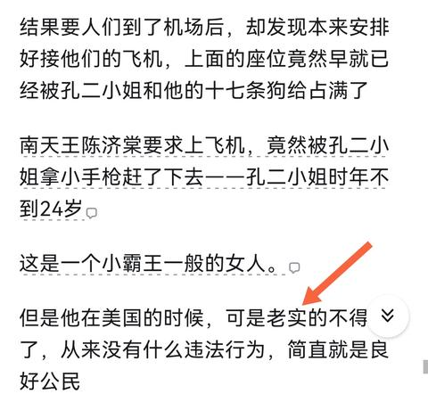
65. <a href="https://www.zhihu.com/people/bing-shi-zi-45">冰室子</a> (<small title="广东">2026-1-11 23:10:19</small>): 本土的文化传统都改观了，海外的游子根扎何处？［大哭］
    - <a href="https://www.zhihu.com/people/10-74-30-10">Transformeraholi</a> (<small title="广东">2026-2-7 19:14:38</small>): 心安之处是吾乡。
    - <a href="https://www.zhihu.com/people/10-74-30-10">Transformeraholi</a> (<small title="广东">2026-2-7 19:15:45</small>): 早没有本土文化了
    - <a href="https://www.zhihu.com/people/72-33-31-90">向抵抗者致敬的人</a> (<small title="贵州">2026-5-3 17:27:17</small>): 拉倒吧，就四大家族那帮人也配叫海外的游子？
66. <a href="https://www.zhihu.com/people/zheng-sen-16-33">郑森</a> (<small title="上海">2026-1-13 13:4:21</small>): 以礼为骨，以春秋为目，可传万世不殆。
67. <a href="https://www.zhihu.com/people/mei-hou-wang-72-53">美猴王</a> (<small title="山东">2026-1-15 18:46:7</small>): 所以润出去的有几个最后是能有好结果的？问题是还是有大把大把的润人们争先恐后飞蛾扑火。不得不说，大漂亮的舆论宣传做得确实是到位的。［捂脸］
68. <a href="https://www.zhihu.com/people/xiao-fei-43-78">Momo</a> (<small title="上海">2026-1-12 7:55:57</small>): 老蒋始乱终弃的报应，都应在了后代上了
69. <a href="https://www.zhihu.com/people/nan-sheng-56-51">膳宿</a> (<small title="湖南">2026-1-12 7:26:40</small>): 哪有千年的富贵？就算开始肥头大耳的也能当个将军，再过几代你看看，都要回归均值的。
70. <a href="https://www.zhihu.com/people/linmal233">linmal233</a> (<small title="福建">2026-1-11 23:28:27</small>): 富不过三代 你中国老祖宗早就给你总结了，说起来按照俗语平均传承时间还没有到美国那边传承的久。而且别老拿点纨绔子弟的故事说事儿，张爱玲不也是大小姐，当了快船队去了老美，结局起码比她留下来的同行们强多了。
    - <a href="https://www.zhihu.com/people/da-da-shi-jie-10">大大世杰</a> (<small title="江苏">2026-1-11 23:41:5</small>): 张爱玲也是绝后［思考］
    - <a href="https://www.zhihu.com/people/aa-li-3">aa li</a> (<small title="天津">2026-1-11 23:48:7</small>): 嫁给60岁老头，怀孕的时候老头瘫痪了，打掉孩子伺候老头到对方老死，然后自己独居一个小公寓，死在公寓里臭了才被发现［思考］
    - <a href="https://www.zhihu.com/people/jivku-gou-hui-yuan">呼呼</a> (<small title="回复于 2026-1-12 0:57:56/广东"> ✉️:aa li</small>): 自己选的嘛［飙泪笑］
    - <a href="https://www.zhihu.com/people/linmal233">linmal233</a> (<small title="回复于 2026-1-12 10:53:19/福建"> ✉️:aa li</small>): 她国内同行怎么样了
    - <a href="https://www.zhihu.com/people/20-25-8-95-11">自古圣贤尽贫贱</a> (<small title="回复于 2026-1-12 11:29:18/北京"> ✉️:大大世杰</small>): 她弟弟也未婚无后，李鸿章的女儿李菊耦这一支绝灭无人了。
    - <a href="https://www.zhihu.com/people/xiong-xiong-42-83">胡咧咧</a> (<small title="回复于 2026-1-12 15:33:4/河南"> ✉️:自古圣贤尽贫贱</small>): 没事，李菊耦的胞妹结婚有后代一儿一女 ，同胞兄弟李经述有四个儿子，每个儿子又给生了至少一孙男一孙女，他家人口昌盛呢。
    - <a href="https://www.zhihu.com/people/linmal233">linmal233</a> (<small title="回复于 2026-1-12 16:23:31/福建"> ✉️:aa li</small>): 张爱玲享年75,你未必能赢得过她［大笑］等你75了再来说说明独居不独居的吧，独居说明有自己的房产。
    - <a href="https://www.zhihu.com/people/linmal233">linmal233</a> (<small title="回复于 2026-1-12 16:24:50/福建"> ✉️:呼呼</small>): 问题是国内同行被斩杀了啊［飙泪笑］ 人家起码得了善终。
    - <a href="https://www.zhihu.com/people/aa-li-3">aa li</a> (<small title="回复于 2026-1-12 16:41:41/天津"> ✉️:linmal233</small>): 张爱玲一辈子没有买过房子，都是租的，在美国出过3年搬家上百次的事情。最后死在租的洛杉矶月租400刀的小公寓，屋子里就一个行军床、折叠桌、冰箱、电视和个灯，连衣柜都没有，唯一的窗户对着停车场。死了一周之后被房东家人发现尸体……收尸的警察说房间“非常紧凑”“满地报纸和卫生纸”［捂脸］
    - <a href="https://www.zhihu.com/people/linmal233">linmal233</a> (<small title="回复于 2026-1-12 16:44:45/福建"> ✉️:aa li</small>): 国内同行早几十年就触发斩杀线咯
    - <a href="https://www.zhihu.com/people/aa-li-3">aa li</a> (<small title="回复于 2026-1-12 17:11:34/天津"> ✉️:linmal233</small>): 你要说作家、编辑同行，苏青活到1982，宋其夫妇给张爱玲办了后事，潘柳黛活到2001年，丁玲活到1986年………如果你说的同行是指汉奸的老婆，这个确实普遍比较容易被人报仇［思考］
    - <a href="https://www.zhihu.com/people/linmal233">linmal233</a> (<small title="回复于 2026-1-13 8:9:14/福建"> ✉️:aa li</small>): 你说的这地方有法律吗［大笑］什么现代法律还搞连坐
    - <a href="https://www.zhihu.com/people/aa-li-3">aa li</a> (<small title="回复于 2026-1-13 8:18:51/天津"> ✉️:linmal233</small>): 你这是物伤其类了啊［思考］
    - <a href="https://www.zhihu.com/people/linmal233">linmal233</a> (<small title="回复于 2026-1-13 17:10:4/福建"> ✉️:aa li</small>): 理念不同 夏虫不可语冰［飙泪笑］不过时代总是在进步的 法治是必然的要求
    - <a href="https://www.zhihu.com/people/wo-zhi-zai-hu-ni-49-51">我只在乎你</a> (<small title="回复于 2026-1-14 1:1:3/江西"> ✉️:linmal233</small>): 不一样平反了吗？哪怕死的，后代也被照顾，没几个滑落到底层的。
    - <a href="https://www.zhihu.com/people/linmal233">linmal233</a> (<small title="回复于 2026-1-15 21:21:21/福建"> ✉️:aa li</small>): 人家遗产光现金存款，就有几十万美元。［捂脸］那个年代带这些钱回来，你那个地方管事儿的都得笑脸相迎呢［大笑］
71. <a href="https://www.zhihu.com/people/a-yi-tu-bie-gong-zhu-xi-da-ya">知之为不知</a> (<small title="北京">2026-1-14 9:16:56</small>): 8月结婚，次年5月生孩子，怎么就大肚子结婚了，还什么肚子被玩大了这种话，你首先尊重一下别人，权贵阶层都一样，不能因为在大陆说台湾不整你，就这么缺德过嘴瘾。
    - <a href="https://www.zhihu.com/people/xiong-xiong-42-83">胡咧咧</a> (<small title="河南">2026-1-14 11:3:46</small>): 白先勇有篇小说影射这个事
    - <a href="https://www.zhihu.com/people/lan-se-xiao-zhen-tou">蓝色小枕头</a> (<small title="重庆">2026-9-17 20:0:45</small>): 他估计都不了解足月分娩需要九个月，8月结婚到次年五月刚好九个月，所以八月要么刚刚是受精卵，要么刚怀上一两周，怎么可能大着肚子结婚
72. <a href="https://www.zhihu.com/people/tin-47-95">老刀未宝</a> (<small title="广东">2026-1-14 18:11:47</small>): 王安电脑，也是消失的干干净净
73. <a href="https://www.zhihu.com/people/long-qi-bing-24">龙骑兵</a> (<small title="浙江">2026-1-13 7:51:5</small>): 能出去大部分都当自己人上人，国内被恭维惯了！出去哪有这环境，时间久了就会自我怀疑，一旦人开始无意识反思，那就好玩了！
74. <a href="https://www.zhihu.com/people/liu-hua-jun-29">刘华君</a> (<small title="上海">2026-1-17 16:5:16</small>): ［感谢］觉得美国文化就是把所有人种都同化了。
75. <a href="https://www.zhihu.com/people/18-67-96-89">彬彬大淘汇</a> (<small title="海南">2026-7-30 22:15:59</small>): 钱和权没有办法教好一个孩子  
 
  
 
  
 
人的成长是需要家长陪伴的，这是铁律。把一个乳臭未干的小孩儿送到一个陌生环境，人生地不熟，而且身边没有能够依赖的人（帮自家做事儿的不一定就是可靠的人），然后不酗酒、不抽烟？除非这人是保尔柯察金，有着钢铁的意志吧。。。
76. <a href="https://www.zhihu.com/people/49-61-5-93-94">焰栖青梧</a> (<small title="山西">2026-1-14 15:51:39</small>): 回到美国，又去不了中国，这些买办价值为0
77. <a href="https://www.zhihu.com/people/di-shi-fan-tian-59">帝释梵天</a> (<small title="浙江">2026-1-11 22:39:32</small>): 日记抒怀，家学渊源！［doge］
78. <a href="https://www.zhihu.com/people/yan-xiao-64-79">杯酒浇块垒</a> (<small title="山东">2026-1-12 8:17:12</small>): 跑外国尽孝心，也只能这样了。
79. <a href="https://www.zhihu.com/people/fsb7kah">宇宙岛</a> (<small title="湖北">2026-7-7 1:40:31</small>): 我总觉得中国上下五千年文明及文化，深刻影响着每一位海外游子，一句洋装穿在身，我心依然是中国心！它生动的体现出了海外华人对祖国的向往与怀念。
80. <a href="https://www.zhihu.com/people/tian-qi-47-53">田田</a> (<small title="山东">2026-7-17 8:49:19</small>): 到底是孙中山的重孙做特技演员是公平的还是，就因为是孙中山的重孙就可以占据一个政协委员位置是公平的呢？
81. <a href="https://www.zhihu.com/people/kanye7778">世家80boring</a> (<small title="陕西">2026-9-11 10:29:17</small>): 一脉相承，建丰是完人，无桃色，🈚私生子
82. <a href="https://www.zhihu.com/people/66-50-1-42-8">黎不白</a> (<small title="新疆">2026-1-17 7:51:47</small>): 196年8月结婚，1961年5月孩子出生，怎么会大着肚子结婚？怎么会肚子大得不能打胎，只能结婚了事？  
 
我4月初查出来怀孕，11月中旬生的孩子。孩子38周+1出生的，也算是足月了。
83. <a href="https://www.zhihu.com/people/wang-zi-an-87">六朝旧事祂来了</a> (<small title="北京">2026-2-13 19:39:25</small>): 孙 和蒋家后代 恐怕都不知道自己祖先曾经气吞万里如虎吧 他们的水平和认知 甚至不如刘峻
84. <a href="https://www.zhihu.com/people/31-27-72-98-50">圆圆</a> (<small title="新疆">2026-7-17 17:49:50</small>): 我觉得很正常，很好，就应该这样，咱们国人往往对贵族豪门是既仇恨又向往，恨自己不如人又恨不得立马取而代之，对这些子孙往往自发的为其戴上光环，因此这些人才能在国内为所欲为，出了国人家谁认识你是谁谁谁的儿子孙子呢！
85. <a href="https://www.zhihu.com/people/mei-hou-wang-72-53">美猴王</a> (<small title="山东">2026-1-15 18:42:47</small>): 因果循环，报应不爽。
86. <a href="https://www.zhihu.com/people/zhu-ti-zui-hao-chi-12">猪蹄最好吃</a> (<small title="北京">2026-1-12 1:3:34</small>): 8月结婚五月生娃 肚子一点都不大，可能刚怀上。
87. <a href="https://www.zhihu.com/people/xi-hong-shi-de-hong">西红柿的红</a> (<small title="北京">2026-7-17 7:51:52</small>): 讲真权贵阶层的后人跌落不能完全埋怨其身处环境.环境是外因。同样是权贵，袁世凯的孙子袁家骝就能当物理学家，李鸿章的后人在美就能混的风生水起，为何蒋宋的就不行？其实还是和个人能力相关。前朝的剑斩不了新朝的官，20世纪以来流亡欧美的世界各地王室贵族多了去了，单中国就有蒋家王朝，北洋权贵，满清勋族，难道这些人必须得优待？不可能的，树倒猢狲散，只能看猴子自己的本领［飙泪笑］
    - <a href="https://www.zhihu.com/people/97-12-91-87-21">韭菜与镰刀</a> (<small title="江苏">2026-7-19 15:1:48</small>): 从一战开始，世界各国风云变幻，光王室都不知道倒了多少个，什么公爵的后代啊，什么酋长的后代啊，什么倒台军阀的后人啊，落魄户多了去了。
88. <a href="https://www.zhihu.com/people/wu-gong-ji-guo">无功即过</a> (<small title="四川">2026-1-11 23:33:57</small>): 孔令侃第一眼还真像佟大为［捂脸］
89. <a href="https://www.zhihu.com/people/huang-xing-89-32">Huang Steven</a> (<small title="辽宁">2026-1-18 12:18:18</small>): 答主的文笔真是风趣［看看你］
 
下木总统说过权力和金钱的关系。权力才是更长久的基石。
 
其实国内外相关社科研究，结论都是相似的，富不过三代才是常态。
 
只有化身权力，才能与国同休。
 
这方面四大家族是不如大陆的，不是他们不想，是实力不行，被打跑了。
 
老美也是给全世界吃权力鸡游戏失败的玩家都托了个底，能让他们平安活到老，他们已经够幸运了。
 
不然这种玩家只有车裂夷族的结果。
90. <a href="https://www.zhihu.com/people/ling-ge-fan-ye-47">菱歌泛夜</a> (<small title="山西">2026-1-12 8:44:29</small>): 从中国人角度看这个也能叫因果报应［惊喜］
    - <a href="https://www.zhihu.com/people/zhao-zong-jing-li-14">燕云楼主</a> (<small title="上海">2026-1-12 13:35:34</small>): 远在儿孙近在身
91. <a href="https://www.zhihu.com/people/wang-long-58-89">王龙</a> (<small title="江苏">2026-1-12 12:44:42</small>): 去那边被同化成短生种，自然选择掉了。
    - <a href="https://www.zhihu.com/people/linmal233">linmal233</a> (<small title="福建">2026-1-12 16:25:58</small>): 什么长生种的言论挺无厘头的，人均寿命都没赢呢怎么敢自称的？
    - <a href="https://www.zhihu.com/people/dao-you-liu-bu-62">道友留步</a> (<small title="回复于 2026-1-18 10:54:57/广东"> ✉️:linmal233</small>): 不是物理意义上的寿命，指的是精神层面的。这样说，您是否能理解？
92. <a href="https://www.zhihu.com/people/xing-10-61">xing</a> (<small title="上海">2026-2-11 14:27:35</small>): 所以说如果孙文的重孙在大陆的话，就不用干替身演员，卖保险这种累活养活自己了。他们可以养尊处优，大陆人民会努力干活抬举他们的。对了，大陆还不只有一个孙文。
93. <a href="https://www.zhihu.com/people/feng-qing-yue-ming-52-95">春和景明</a> (<small title="陕西">2026-4-7 14:17:52</small>): 连个孩子都管成这样，还有脸搞内战
94. <a href="https://www.zhihu.com/people/zhang-heng-23-31">黎明扣扣邮箱登录</a> (<small title="湖北">2026-1-12 6:21:43</small>): 反动派瞧不起泥腿子，但是为什么泥腿子一造反，就把锦衣玉食，位高权重的反动派消灭了？
95. <a href="https://www.zhihu.com/people/34-7-1-78">中子流</a> (<small title="安徽">2026-8-25 20:46:34</small>): 孙国雄放这不合适吧，人家本来就是靠学习而不是混吃混喝拿的学位，进电影圈也是纯属因为热爱，和其他几位根本不是一个概念好不
96. <a href="https://www.zhihu.com/people/VivaJese">Viva Jese</a> (<small title="浙江">2026-1-12 19:32:16</small>): 写的有点李敖的感觉
97. <a href="https://www.zhihu.com/people/19-72-60-34-62">玄鸟</a> (<small title="北京">2026-1-12 20:41:28</small>): 真应该让国内的有钱人学学历史！
98. <a href="https://www.zhihu.com/people/zha-xi-42-85-22">扎西</a> (<small title="四川">2026-1-13 12:41:33</small>): 会不会是混血的原因，基因差距过大引起的离散性
99. <a href="https://www.zhihu.com/people/xue-qian-ling-6">雪千玲</a> (<small title="广西">2026-1-12 10:26:41</small>): 喝酒过量本身可至脑委缩，继而导致精神障碍，大多都是暴力型的
100. <a href="https://www.zhihu.com/people/fang-xiao-xin-39">方小新</a> (<small title="福建">2026-1-14 12:31:52</small>): 8月结婚，次年5月生子，不正好10个月，怎么会大肚结婚！？？
101. <a href="https://www.zhihu.com/people/shang-shan-ruo-shui-25-94-65">上善若水</a> (<small title="河北">2026-7-27 12:47:9</small>): 写的有点刻薄，年龄有差距就是被玩弄吗？那国共两党都有太多案例了，你怎么说？希望大家理性看待问题，笔下积德！
102. <a href="https://www.zhihu.com/people/shui-guo-lao-39">momo</a> (<small title="天津">2026-1-12 19:46:23</small>): 答主辛苦了，好全面的材料［赞］
103. <a href="https://www.zhihu.com/people/shi-chuan-yi-jiu-de-gua-pi-cao-zuo">信天游</a> (<small title="江苏">2026-2-4 15:25:8</small>): 老美那套斩杀机制在那里，除非你是顶尖资本家，手握大资本的世代联姻的政治豪门世家，否则就是待宰的羔羊，在欧美这种以宗教神权为统治基础的国家里，亚洲人在他们眼里就是黄皮猴子。我之前看过早些年逃出去的在逃通缉犯贪官的纪录片，一开始在美国很潇洒，很体面，过了几十年后穷困潦倒，又不敢回中国，靠打临工为生。
     - <a href="https://www.zhihu.com/people/usryl4e">小看山</a> (<small title="北京">2026-4-30 16:5:23</small>): 这种人不活该嘛 ［好奇］
104. <a href="https://www.zhihu.com/people/qiu-feng-shan-zhu">秋风扇主</a> (<small title="河北">2026-3-23 10:14:44</small>): 买办就这德行
105. <a href="https://www.zhihu.com/people/mai-xiao-qing-66">麦晓晴</a> (<small title="北京">2026-1-16 9:33:49</small>): 有点理解西方人为啥看重宗教信仰了，人性本恶，如果没有宗教信仰，吃喝嫖赌，很快自我斩杀了。他们信教是一种自我保护。不像中国人，大部分还是相信因果报应，道德观比较强的。
106. <a href="https://www.zhihu.com/people/wang-ma-xiu-fan-lu-jiao">五行缺钱</a> (<small title="秘鲁">2026-1-13 0:46:37</small>): 有一家姓晏的，也是在中国近代史上有名的家族，现在在美国是大家庭了，就是后代看不出来是不是中国人，哈哈。
107. <a href="https://www.zhihu.com/people/zgoliver-81">zgoliver</a> (<small title="北京">2026-1-15 7:59:0</small>): 老美这种种族主义盛行的地方，怎么可能让你传承。你连议员都没有
108. <a href="https://www.zhihu.com/people/sqtsy">孤舟垂钓</a> (<small title="天津">2026-2-9 15:15:39</small>): 美国不能算国家，它就是个向全世界开放的大酒店，你有钱就能来，可以住单间住套房，享受服务，没钱了就滚。当然，你也可以靠给酒店打工活着，劳力而已。
     - <a href="https://www.zhihu.com/people/79-35-23-26">Papillon</a> (<small title="德国">2026-2-10 6:51:47</small>): 一切大事还是盎撒人说了算，中国人在那里做不大的
109. <a href="https://www.zhihu.com/people/feng-xie-xiao-xiao-50-27">枫叶潇潇</a> (<small title="北京">2026-7-13 8:19:13</small>): 那个什么壁葬，看来看去，还是没有入土为安啊。。。难怪，老蒋也还没有入土，这一大帮子都陪着
110. <a href="https://www.zhihu.com/people/39-68-93-10">北极星看海</a> (<small title="福建">2026-1-12 10:19:43</small>): 都说穷生奸计，富长良心，看完本文我觉得都是扯淡，把个性当整体。贫富没啥关系
111. <a href="https://www.zhihu.com/people/fu-hong-xue-56-52">傅红雪</a> (<small title="浙江">2026-1-11 21:47:42</small>): 是不是曾国藩的后人在美国还不错？
     - <a href="https://www.zhihu.com/people/feng-hua-yue-ye-96">枫华月夜</a> (<small title="山西">2026-1-11 21:51:41</small>): 曾诗书传家，正经读书人
     - <a href="https://www.zhihu.com/people/tian-kong-75-30-61">天空</a> (<small title="湖南">2026-1-13 2:22:44</small>): 叶帅前夫人是曾家的，国内就一大把人
     - <a href="https://www.zhihu.com/people/zhi-xing-ming-xing-qiang-shen-jian-ti">强身健体知行明性</a> (<small title="安徽">2026-9-16 8:42:19</small>): 袁世凯，李鸿章的后代在美国当物理学家［酷］［酷］
112. <a href="https://www.zhihu.com/people/69-6-13-23">王者</a> (<small title="河南">2026-1-30 17:47:35</small>): 我觉得是因为我们给了很多保底，让他们去做公务员，如果没有这个保底，在中国也未见得怎么样
113. <a href="https://www.zhihu.com/people/84-30-29-25">殷阿炳</a> (<small title="山东">2026-1-18 8:24:27</small>): 现在网上的一些人一边抱怨怀才不遇，好位置都被权贵后代占去了，一方面又要求权贵后代兴旺发达，这是不可能的，位置就那么多，二代占了就没有别人的了，所以富贵一代，二代无德无才就让位置才是正确方向
114. <a href="https://www.zhihu.com/people/lao-zi-shi-miao-ye">老子是喵爷</a> (<small title="广西">2026-1-16 13:14:9</small>): 专一的玩弄…好小众的形容词…顺便，杜律铭大公子去美国留学自杀收场也可以添个旁证［思考］［思考］［思考］
115. <a href="https://www.zhihu.com/people/70-41-34-17">柚科技</a> (<small title="河北">2026-1-27 20:51:47</small>): 宋美龄晚年“凄惨”、被合同诈骗、死后房子里的东西“不能拿走”等。这些叙述在知乎、微博、B站等大陆网络平台上反复出现，常常以“揭秘”“内幕”“报应”为标题或关键词，内容高度情绪化、细节夸张。  
 
这个回答的具体内容分析  
 
从你提供的链接看（我已确认页面可访问性），它属于典型的知乎式“历史爆料”帖，作者用第一人称或“据说”方式描述：  
 
• 宋美龄晚年住在纽约，但生活窘迫、被亲戚/他人“合同诈骗”财产。  
 
• 死后公寓里的家具、首饰、古董等物品被扣押或“拿不走”，暗示家族遗产被吞没或因法律/债务问题无法继承。  
 
• 整体基调是“昔日权贵落魄凄凉”，常配以“被美国白人社会吃绝户”的比喻，延伸到整个宋/孔家族的“没落”。  
 
这类回答几乎没有引用可靠来源（如主流媒体、家族官方声明、纽约时报讣告、孔令仪本人口述等），多靠“听说”“据传”“老一辈回忆”串联，细节往往互相矛盾或与已知事实冲突。  
 
与事实对比（基于可靠记录）  
 
• 遗产与财产：孔令仪（宋美龄最亲近的外甥女，28年全程照顾她）在2003年宋美龄去世后公开表示：宋美龄身后仅剩12万美元银行存款，无房产、无贵重资产。住的纽约公寓属孔家（孔令侃名下），长岛老宅1998年已售出（售价约280-300万美元）。宋美龄物品（如旗袍、书画、首饰）早在1991年离台时打包带走，死后由孔令仪正常继承和处理。没有“诈骗”或“拿不走”的官方记录或法庭文件。  
 
• 诈骗传闻：无任何美国法院、媒体或家族成员证实宋美龄被“合同诈骗”。类似说法可能源于：  
 
◦ 混淆孔令伟（孔二小姐）遗产税纠纷（2006-2007年台湾税务局追缴1.5亿新台币遗产税，孔令仪上诉称部分转账非本人所为）。  
 
◦ 国民党时期“四大家族”财产争议的旧闻被放大。  
 
◦ 宋美龄拒绝回台合葬、与蒋家渐行渐远，被解读为“家族抛弃她”。  
 
• 晚年生活：宋美龄106岁高龄，生活由孔令仪团队支持（仆人、医疗、安保），公寓18间房、私人电梯。回忆录和报道（如纽约时报讣告）描述她优雅、独立、拒绝回忆过去，而非“凄惨”。她曾说“钱够用吗？”只问过一次，显示对物质不执着。  
 
为什么这类说法在知乎等平台流行？  
 
• 情绪价值高：把“国民党权贵”包装成“被美帝/亲戚坑惨”，符合某些“因果报应”“亲美无好下场”的叙事，容易获赞和转发。  
 
• 来源链：多从旧论坛、博客、微信群流传（如2003-2008年宋美龄去世后的旧闻被反复改编），缺乏原始出处。  
 
• 平台特性：知乎允许匿名/化名回答，审核宽松，历史话题常成情绪宣泄场。类似问题下，常有对立声音（如引用孔令仪声明），但“凄惨版”更吸睛。  
 
结论  
 
这个说法属于典型的网络阴谋论/情绪化传闻，不是基于事实的历史分析。真实历史显示宋美龄晚年有尊严、有照顾，死后遗产/物品处理正常，没有诈骗或扣押情节。总之，这类内容看热闹可以，但当历史看就容易被误导。
116. <a href="https://www.zhihu.com/people/94-31-98-11-84">知乎用户HthlIk</a> (<small title="广东">2026-1-26 4:46:43</small>): 权也没用，如果无德，权越大越容易折煞后辈，大概率变纨绔子弟。  
 
那什么东西能载得住钱和物？古人给出的答案：  
 
厚德方可载物。  
 
所以啊，位高权重者，还是先修德吧。
117. <a href="https://www.zhihu.com/people/addar-adar">addar adar</a> (<small title="河南">2026-1-21 15:38:50</small>): 刚看到一个评论，甜甜圈和牢a一个说明了美国对底层的斩杀，一个说明了对中产的斩杀，博主这个不妥妥的说明了美国是对高产润的斩杀
     - <a href="https://www.zhihu.com/people/usuc3dqw">知乎用户uSUc3dQw</a> (<small title="四川">2026-5-4 14:49:12</small>): 老美本来就是由一群拿着枪，反对政府的人组成的。南北战争更是开门自由贸易的典范。人家狠起来自己人都杀。杀点外来的黄皮猴子那不是简简单单？
118. <a href="https://www.zhihu.com/people/jin-nian-xiang-jie-hun-de-nan-sheng">孤道寡人</a> (<small title="广东">2026-1-13 12:38:13</small>): 你看！姓氏面前一样要加丈夫姓！
119. <a href="https://www.zhihu.com/people/meng-long-ren-jian-shui-deng-gao">曚昽人间谁登高</a> (<small title="江苏">2026-1-12 15:46:40</small>): 真是尔曹身与名俱灭，不废江河万古流
120. <a href="https://www.zhihu.com/people/jiang-yin-wen-50">最近</a> (<small title="上海">2026-7-15 19:41:5</small>): 混血基因不稳定的，尤其男混血。其实二代混血一般还可以，小蒋找了毛子工人阶层，酗酒滋事的基因遗传进来了。
121. <a href="https://www.zhihu.com/people/72-66-78-11-17">知乎用户y9aKTz</a> (<small title="广东">2026-2-11 9:16:34</small>): 不大理解，他们作为旧中国高层，竟然慕洋到如此地步［思考］我家也曾是旧时代书香门第，但自古以来从小传承的启蒙教育就是汉人华人是极其伟大的意识形态。向来对洋人异族蔑视，怎么能信基督
     - <a href="https://www.zhihu.com/people/yan-ran-yi-xiao-68-72">嫣然一笑</a> (<small title="河北">2026-3-22 22:19:19</small>): 一方面是早期经历的影响，孔祥熙从小就接触基督教会家里对他就读教会学校也不是绝对反对，宋嘉树更是北卡第一个受洗的黄种人。  
 
另一方面是各个方面的差距是真实存在的，在他们出生的时候清政府已经签了好几个不平等条约了
     - <a href="https://www.zhihu.com/people/qwer13579-77">qwer13579</a> (<small title="辽宁">2026-4-29 12:23:50</small>): 买办常态
     - <a href="https://www.zhihu.com/people/usryl4e">小看山</a> (<small title="回复于 2026-4-30 16:3:30/北京"> ✉️:嫣然一笑</small>): 因为他们是南方人［飙泪笑］见了高大的白人肯定自卑［飙泪笑］
122. <a href="https://www.zhihu.com/people/23-91-91-22-10">痴痴</a> (<small title="上海">2026-7-12 10:49:4</small>): 还敢写文章笑蒋
123. <a href="https://www.zhihu.com/people/you-lan-57-26-64">幽蓝</a> (<small title="陕西">2026-3-19 11:11:13</small>): 同样是海外移民，肯尼迪家族是爱尔兰裔，特朗普家是德裔。而华裔最早在清晚期就有过去的了，到现在没听说过美国有什么出名的华裔家族，华人黑帮倒是驰名海外
124. <a href="https://www.zhihu.com/people/man-bu-yun-shan">濂溪河西</a> (<small title="广东">2026-9-15 17:18:31</small>): 钱老的侄子 钱永健 诺贝尔化学奖得主，居然连个子嗣都没有 64岁就死了。
 
  
 
如果是在国内这么大的成就，至少都是部级干部待遇。哎 可悲
125. <a href="https://www.zhihu.com/people/depp-dong">DEPP DONG</a> (<small title="上海">2026-1-12 17:40:48</small>): 李安他爸在台湾是一中学校长，他去纽约读电影根本看不上，也是摸爬滚打蛰伏多年拿了个奖后才稍微瞧得上一点点，李安的儿子在片子里也只能混个群众演员［doge］
126. <a href="https://www.zhihu.com/people/yu-darth">FrozenBarracuda</a> (<small title="安徽">2026-1-11 23:42:27</small>): 念丧经的是哪一个［飙泪笑］
     - <a href="https://www.zhihu.com/people/duoqizuo2018">多崎作</a> (<small title="河南">2026-1-12 0:12:57</small>): 艾伦啊，蒋孝文。
     - <a href="https://www.zhihu.com/people/yu-darth">FrozenBarracuda</a> (<small title="回复于 2026-1-12 1:0:17/安徽"> ✉️:多崎作</small>): 哦哦［赞］
127. <a href="https://www.zhihu.com/people/yan-zi-92-53">瑞雪兆丰年</a> (<small title="陕西">2026-1-11 22:51:14</small>): 张学良兄弟在夏威夷是墓葬
128. <a href="https://www.zhihu.com/people/fjftyhb">fjftyhb</a> (<small title="山东">2026-7-13 11:30:27</small>): 只能说明特权阶层没有了特权那就过的和普通人一样
129. <a href="https://www.zhihu.com/people/cha-cha-wan-24">茶茶丸</a> (<small title="上海">2026-9-8 9:42:54</small>): 话说站在基因角度，均值回归真的十分冷酷和绝对，常公［doge］和小蒋绝对是顶尖人物了（赢不了是因为对手是过于离谱的 goat［捂脸］），然而在下一代就基本全垮掉了
130. <a href="https://www.zhihu.com/people/clark-86-69">Clark</a> (<small title="陕西">2026-9-11 22:50:34</small>): 因为美国有宪法，这些人去了是公民没有特权。法治社会和人治社会的区别。
131. <a href="https://www.zhihu.com/people/oliven-66">oliven</a> (<small title="北京">2026-1-11 22:46:17</small>): 袁世凯后人在海外好像还不错
132. <a href="https://www.zhihu.com/people/mao-lao-ban-2">毛毛Hoawr</a> (<small title="江苏">2026-1-13 9:55:23</small>): 欲灭其国，必先灭其史；欲灭其族，必先灭其文化 它们从未改变
133. <a href="https://www.zhihu.com/people/wenqishixu">wenqishixu</a> (<small title="浙江">2026-1-12 18:47:23</small>): 没有守护资源的能力就等同没有资源，看看温州人移民南欧怎么扎根生存的就懂了
134. <a href="https://www.zhihu.com/people/alicia-kong">最爱回笼觉</a> (<small title="江苏">2026-4-25 12:31:34</small>): 小时候当着老蒋的面背“四十年来家国，三千里地山河。”看起来也像是朽木啊
     - <a href="https://www.zhihu.com/people/alicia-kong">最爱回笼觉</a> (<small title="江苏">2026-4-30 15:11:14</small>): 啊啊我是说不像朽木［捂脸］ 关键字漏了意思完全变了
135. <a href="https://www.zhihu.com/people/yyyou-ran-3013">窗边晒太阳</a> (<small title="山东">2026-1-12 14:39:29</small>): 暴发户富不过三代
136. <a href="https://www.zhihu.com/people/tian-bu-la-68-77">甜不辣</a> (<small title="安徽">2026-2-7 13:54:55</small>): 对中国的老百姓来说也许是好事，权贵名流的子女出国后不再占据国内社会重要岗位和资源。
137. <a href="https://www.zhihu.com/people/77-90-81-39-78">汤百叙</a> (<small title="广东">2026-7-13 12:31:10</small>): 好家伙，就差一个人收集材料写蓝楼梦了［捂脸］
138. <a href="https://www.zhihu.com/people/chen-mu-48-56">晨暮</a> (<small title="广东">2026-1-23 18:39:41</small>): 提醒一下，蒋光头学历造假，振武学校就是个预备学校，相当于初中
139. <a href="https://www.zhihu.com/people/jiang-xu-73-12">不上头远离DB合约</a> (<small title="浙江">2026-1-19 9:1:33</small>): 写这么多，辛苦了，给你五毛稿费
140. <a href="https://www.zhihu.com/people/xiao-lu-64-68-89">我反对</a> (<small title="浙江">2026-1-14 8:1:8</small>): 物离乡贵，人离乡贱。  
 
  
 
老祖宗几千年前总结好的
     - <a href="https://www.zhihu.com/people/arorsc">ARorSC</a> (<small title="山东">2026-1-14 14:29:13</small>): 除非把外域变成华夏，变成汉土，有族人同胞形成社会经营繁衍生息，变成乡，如果只是各自为战形单影只就断了祖脉跟脚和势力，一个人去异族的地盘被异族的秩序和势力包围，与泥牛入海有何区别，夹着尾巴偏安一隅能做个人就不错了，还想过风光日子，当异族门阀们是做慈善的？
141. <a href="https://www.zhihu.com/people/shan-zai-xu-wu-piao-miao-jian-28">7thLayer</a> (<small title="辽宁">2026-1-13 10:27:29</small>): 老美真是人类（美国人除外）之光！
142. <a href="https://www.zhihu.com/people/4-70-71-43-93">刘同志</a> (<small title="河北">2026-8-10 17:4:14</small>): 其实，你愿意进入人家那个圈子开始，你自己就已经说服自己要低他们一等了，是你上赶着倒贴，而不是人家求你进。
143. <a href="https://www.zhihu.com/people/17-45-12-72-82">罪不在我</a> (<small title="辽宁">2026-1-23 22:36:14</small>): 这不说明蒋经国娶得妻子不对吗？苏联害死人
144. <a href="https://www.zhihu.com/people/dao-ke-dao-88-81">道可道</a> (<small title="山西">2026-1-14 14:23:44</small>): 阿q精神吗？宋家后代就是宋子文、宋子安这两支，现在还有近30口人，没有一个败家子，没有一个染恶习的，大部分都藤校毕业，而且都是精英阶层，还有敲钟上市的。创业上市的就好几个，还有在摩根当总裁的，你要求太高。宋家三代创立的品牌，今天依然活跃的我知道的就有四个。
     - <a href="https://www.zhihu.com/people/xiong-xiong-42-83">胡咧咧</a> (<small title="河南">2026-2-7 19:55:56</small>): 宋子文生了仨女儿好像
     - <a href="https://www.zhihu.com/people/dao-ke-dao-88-81">道可道</a> (<small title="回复于 2026-2-7 23:29:46/山西"> ✉️:胡咧咧</small>): 不用好像，就是。宋子文生了三个女儿。宋子文一家五口，除了宋子文自己，都完全远离政治。
     - <a href="https://www.zhihu.com/people/qiu-tou">第一道头抽</a> (<small title="广东">2026-2-15 17:1:44</small>): 这文章就是迎合最近斩杀线舆论的尬黑
     - <a href="https://www.zhihu.com/people/yi-sha-ou-47">一沙鸥</a> (<small title="回复于 2026-3-12 22:34:45/湖南"> ✉️:胡咧咧</small>): 女儿不是孩子吗？清朝人怎么杀不完
     - <a href="https://www.zhihu.com/people/81-91-86-47-34">自由落体放松下</a> (<small title="广东">2026-4-9 20:27:16</small>): 没听过，还不是泯然众人矣
     - <a href="https://www.zhihu.com/people/dao-ke-dao-88-81">道可道</a> (<small title="回复于 2026-4-11 15:34:24/山西"> ✉️:自由落体放松下</small>): 安全着陆没有败家子就是最好的结局。涉及隐私就不说了。
145. <a href="https://www.zhihu.com/people/chen-ke-cun">陈科存</a> (<small title="辽宁">2026-1-12 8:24:2</small>): 看了这些我终于明白美国还真是人人平等，管你来时是什么身份别人都一视同仁，能在这种环境出头的都是人精
     - <a href="https://www.zhihu.com/people/shen-hai-yu-591">深海鱼591</a> (<small title="北京">2026-1-15 16:53:21</small>): 转：美国本土的家族依旧子孙相传啊，这些外来的家族不过被骗过去吃掉了而已，谈不上王侯将相宁有种乎。
146. <a href="https://www.zhihu.com/people/tang-yu-chen-30">失乐园</a> (<small title="北京">2026-1-12 14:45:13</small>): 你说的这些人本来就是老鼠上桌的僭主制下的腐败分子，甚至不能再僭主制里面继续掌权的公子小姐。他们是不是失败者，他们自己清楚，我国人民也清楚。他们因为无力维持腐败的秩序，到民主国家做秩序消费者，和当地的秩序生产者比起来，当然是下等人。他们的感觉是对的。相比起来，华人街老华侨主流是自食其力和生产自己小范围的秩序的，自然不是下等人。  
 
  
 
表面的不公正背后是长远而隐秘的公正。我劝各位站稳阶级立场和民族立场，和顶天立地的劳动人民共情，不要和腐败分子共情，更不要因为民族立场被忽悠掉了阶级立场。［doge］
     - <a href="https://www.zhihu.com/people/jacky-young-15">月下瑶光</a> (<small title="江苏">2026-1-12 23:2:58</small>): 杜鲁门没有看到四大家族被逮进监狱的那一刻，但是他绝对很欣慰这些人的后代掉下斩杀线［大笑］［大笑］［大笑］［大笑］［大笑］
     - <a href="https://www.zhihu.com/people/evilhero-15">evilhero</a> (<small title="浙江">2026-1-13 3:45:46</small>): 应该不会有人和他们共情吧，只是会感慨老美吃人的能力和可惜那些民脂民膏
147. <a href="https://www.zhihu.com/people/1848-93">徐庶</a> (<small title="广东">2026-1-12 17:22:24</small>): 第一次看到这么全面的整理蒋宋孔家族第二代在1949年之后生平的文章
148. <a href="https://www.zhihu.com/people/zhi-xi-sama-18">窒息sama</a> (<small title="湖南">2026-1-12 0:14:47</small>): 李小龙怎么挂的，很多人都没想明白
     - <a href="https://www.zhihu.com/people/lns-91">L.Marx</a> (<small title="天津">2026-1-12 7:52:44</small>): 李小龙的儿子也挂了
     - <a href="https://www.zhihu.com/people/xue-hua-piao-piao-79-60">油手耗咸赵小姐</a> (<small title="回复于 2026-1-12 8:16:13/江苏"> ✉️:L.Marx</small>): 李小龙还有个女儿长得一点也不像华人。
     - <a href="https://www.zhihu.com/people/zhi-xi-sama-18">窒息sama</a> (<small title="回复于 2026-1-12 11:35:48/湖南"> ✉️:油手耗咸赵小姐</small>): 所以她能活
     - <a href="https://www.zhihu.com/people/lan-xiao-ye-2">蓝小野</a> (<small title="湖北">2026-1-12 13:49:40</small>): 太对了 绞尽脑汁分化瓦解华人团体
     - <a href="https://www.zhihu.com/people/sheng-ming-de-yi-yi-41">生命的意义</a> (<small title="福建">2026-2-10 8:49:40</small>): 健美健死的
     - <a href="https://www.zhihu.com/people/li-li-32-37-97">莉莉</a> (<small title="浙江">2026-9-14 11:52:4</small>): 被迫害
149. <a href="https://www.zhihu.com/people/liang-yong-nan-55">LOWKEYCEO</a> (<small title="福建">2026-1-11 21:35:42</small>): 少长咸集，群贤毕至［赞］
     - <a href="https://www.zhihu.com/people/zi-yan-83-81">煈火燚焱</a> (<small title="贵州">2026-1-13 16:37:2</small>): 这才是整整齐齐啊
150. <a href="https://www.zhihu.com/people/fenghe-15">风和</a> (<small title="广东">2026-1-20 21:0:15</small>): 看完了你说蒋家的部分，大女儿和小儿子的部分完全是先射箭再画靶子，你也说人家夫妻恩爱怎么就玩弄了？
     - <a href="https://www.zhihu.com/people/xiong-xiong-42-83">胡咧咧</a> (<small title="河南">2026-2-5 15:50:2</small>): 大小姐嫁给权势金钱不如自家老爹又大自己十几岁的男人，还不够丢人啊？白先勇在《思旧赋》里影射过。
151. <a href="https://www.zhihu.com/people/li-qing-fei-44">知乎用户TTWmtg</a> (<small title="中国香港">2026-1-11 22:59:6</small>): 很好。比那些世袭罔替的好多课
152. <a href="https://www.zhihu.com/people/xie-jian-ling">谢杰尼</a> (<small title="福建">2026-1-11 23:7:35</small>): 小蒋二子生于1945年，三子生于1948年。
153. <a href="https://www.zhihu.com/people/si-shen-da-ren">法海想喝雄黄酒</a> (<small title="山西">2026-1-14 19:59:8</small>): 一个亚非拉第三世界国家的的斗争失败者，在美国根本排不上名号，没人关心他们那点破事
154. <a href="https://www.zhihu.com/people/zhi-le-15">之乐</a> (<small title="海南">2026-1-11 21:35:37</small>): 求锤得锤，如愿以偿
155. <a href="https://www.zhihu.com/people/jian-zhi-ren-shan">洗尘约</a> (<small title="安徽">2026-1-11 23:34:19</small>): 不止果党啊，现在不也有很多人把千金少爷往外送么［尴尬］
     - <a href="https://www.zhihu.com/people/zht-61">天上加班加上天</a> (<small title="新疆">2026-1-21 1:8:22</small>): 现在都是送出去啊，不允许留下从政了
     - <a href="https://www.zhihu.com/people/xiong-xiong-42-83">胡咧咧</a> (<small title="回复于 2026-1-28 11:28:42/河南"> ✉️:天上加班加上天</small>): 宁肯赔钱把他们送出去锦衣玉食，比留在国内身居高位不知民间疾苦好心办坏事强。
156. <a href="https://www.zhihu.com/people/fly_bird">李得</a> (<small title="美国">2026-1-14 16:38:25</small>): 国内的钱家现在是什么情况，是不是不能说？对于留美家族，我的看法是，融入了一半，另一半在国内。两个都沾点，造成了两边融入不彻底，相当于两种力量，两种观点，一直在脑袋里撕扯。就像今天很多留学生拿到绿卡了，他们能怎么样呢？能有4代就不错了。更多的，老莫，阿三，才是学习的典范，像癌症一样扩散。四大家族就是站的太高了，低不下去身子，一摔就完了。  
 
对于外国定居，能不能保障存活，主要看同一族的人口基数。嗯，再次向老莫，阿三学习。有点类似农村包围城市。理解其义即可。同民族，同姓氏人口，相对后者更重要。
     - <a href="https://www.zhihu.com/people/xiong-xiong-42-83">胡咧咧</a> (<small title="河南">2026-1-14 18:17:16</small>): 我前夫的外祖父的三个胞弟和他们的父母建国时去了台湾，后来三弟又去了美国，并且陆续把另外俩兄弟和小弟的儿女都弄到了美国，在美国做大学教授，他娶的是以前民国驻外领事馆的一个女职员 ，两个儿子在美国做律师，一个女儿在好莱坞做视觉编辑，不过他家从第二代就是ABC基本不能读写中文了。
     - <a href="https://www.zhihu.com/people/fly_bird">李得</a> (<small title="回复于 2026-1-14 19:21:59/美国"> ✉️:胡咧咧</small>): 听起来还行，3个子女，两个律师
     - <a href="https://www.zhihu.com/people/xiong-xiong-42-83">胡咧咧</a> (<small title="回复于 2026-1-14 19:30:26/河南"> ✉️:李得</small>): 这都是上个世纪八九十年代的事了，我有次听我妈说我前婆婆给炫耀她堂兄弟是美国州议员还是州检察院的，我说听她吹牛皮
     - <a href="https://www.zhihu.com/people/fly_bird">李得</a> (<small title="回复于 2026-1-14 19:47:33/北京"> ✉️:胡咧咧</small>): 哈哈哈，那估计有水分
     - <a href="https://www.zhihu.com/people/xiong-xiong-42-83">胡咧咧</a> (<small title="回复于 2026-1-14 20:12:3/河南"> ✉️:李得</small>): 说是州检察官，谁知道呢
     - <a href="https://www.zhihu.com/people/zhi-zhe-wu-huo-si-zhe-wu-jiang">知者无惑 思者无疆</a> (<small title="回复于 2026-1-22 10:56:7/福建"> ✉️:胡咧咧</small>): 断根了就不算了。
157. <a href="https://www.zhihu.com/people/14-51-34-4-9">草蛇灰线</a> (<small title="辽宁">2026-1-11 22:20:9</small>): 这个壁葬属实太搞笑
     - <a href="https://www.zhihu.com/people/wen-dao-bu-xiang-si">翻车鱼斯机</a> (<small title="福建">2026-1-11 22:58:2</small>): 我和美龄之间，已经隔着一层可悲的厚壁葬了［害羞］
     - <a href="https://www.zhihu.com/people/xing-zhi-xuan-44">玄成</a> (<small title="北京">2026-1-11 23:7:49</small>): 壁葬还真是由来已久，一些经文暗示耶稣就是壁葬的
     - <a href="https://www.zhihu.com/people/yang-ze-tian-52">天天</a> (<small title="上海">2026-1-11 23:48:5</small>): 现代人都是壁葬？
     - <a href="https://www.zhihu.com/people/nan-bo-tu-6-61">男啵兔</a> (<small title="江苏">2026-1-11 23:56:15</small>): 那就要看看老美的权贵是怎么个葬法了。
     - <a href="https://www.zhihu.com/people/mei-wan-liao-99">美滴很</a> (<small title="浙江">2026-1-12 0:24:14</small>): 确实，没见过世面的美国前总统，居然还葬在家族墓地里［捂嘴］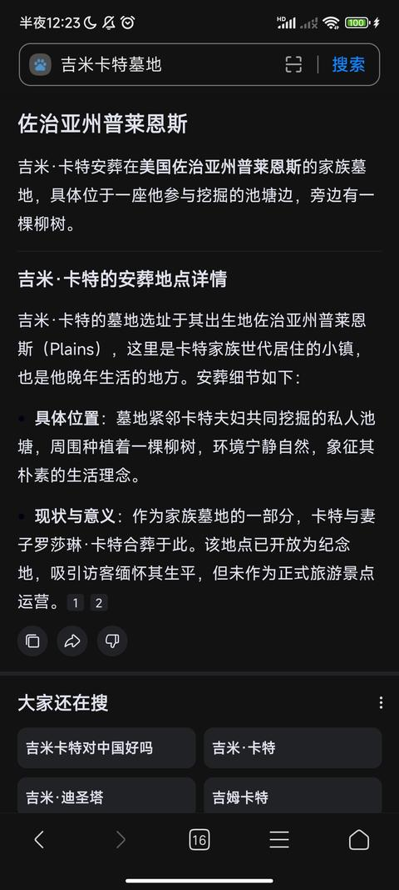
     - <a href="https://www.zhihu.com/people/jifeng">季风大湿</a> (<small title="河北">2026-1-12 0:24:52</small>): 那美国那些独立基地是谁在用啊？  
 
你们也真能掰扯😂
     - <a href="https://www.zhihu.com/people/45-63-71-53-92">liberty</a> (<small title="回复于 2026-1-12 0:31:11/海南"> ✉️:季风大湿</small>): 独立墓地有，但是壁葬的也不少啊，基督徒更多，感觉这段真有点尬黑了。宋美龄死前说自己希望葬回上海宋家的旧墓址，是和老蒋一样客居异乡的，造个大墓地也不合适吧。不知道作者想证明什么，人家要是真想风光大葬，凭人家的财力葬不起吗？
     - <a href="https://www.zhihu.com/people/wang-yihua-4">飒沓如流星</a> (<small title="河南">2026-1-12 0:32:34</small>): 哥们我看过的美国影视剧电影不算多，但壁葬我真的第一次见［飙泪笑］
     - <a href="https://www.zhihu.com/people/--20-77-8-83">残兵-燎原火</a> (<small title="回复于 2026-1-12 7:37:56/广西"> ✉️:liberty</small>): 都被从别墅赶出来了，还风光大葬呢？有那个钱自己住的舒舒服服的别墅能让人收走喽？
     - <a href="https://www.zhihu.com/people/jifeng">季风大湿</a> (<small title="回复于 2026-1-12 11:18:29/河北"> ✉️:liberty</small>): 不是你说的“还以为人家发达国家都像xx国家一样死要面子买大墓地呢”么？怎么删了啊？按你的逻辑去解释一下，人家都那么先进文明，为啥还有那么多大墓地？到底是文明还是不文明？
     - <a href="https://www.zhihu.com/people/45-63-71-53-92">liberty</a> (<small title="回复于 2026-1-12 14:17:45/海南"> ✉️:季风大湿</small>): ？什么我说的，那是我说的吗就开喷［飙泪笑］
     - <a href="https://www.zhihu.com/people/45-63-71-53-92">liberty</a> (<small title="回复于 2026-1-12 14:19:31/海南"> ✉️:残兵-燎原火</small>): 宋美龄在美生活的开销都是台当局报销的［思考］你说她儿女葬不起有可能，宋美龄有可能吗？她带去那么多钱，又一个子都不用自己花
     - <a href="https://www.zhihu.com/people/45-63-71-53-92">liberty</a> (<small title="海南">2026-1-12 17:8:43</small>): 你知不知道一年照顾她生活的公务人员工资都超过1000w刀，24小时私人医生待命，葬不起是真的搞笑了［大笑］她后期在纽约住在上东区曼哈顿，中央公园边上的豪华公寓里。而且人家也没绝嗣啊
     - <a href="https://www.zhihu.com/people/zfguan-li-yuan-shi-sb">管理员要求改名字</a> (<small title="回复于 2026-1-13 1:44:37/江苏"> ✉️:liberty</small>): 就是葬不起啊，客死他乡了
     - <a href="https://www.zhihu.com/people/pluto-29-77-88">Pluto</a> (<small title="回复于 2026-1-14 0:28:50/江苏"> ✉️:liberty</small>): 我觉得重点是没葬宗教墓地［思考］，因此用壁葬弥补一下
     - <a href="https://www.zhihu.com/people/pu-ti-51-72">菩提</a> (<small title="回复于 2026-1-14 8:40:39/广西"> ✉️:飒沓如流星</small>): 呐，人家是顶流社会的顶级葬法，你没见过正常啊［滑稽］
     - <a href="https://www.zhihu.com/people/19-7-30-76">月梦剑心</a> (<small title="回复于 2026-1-14 11:24:50/安徽"> ✉️:liberty</small>): 如果搜搜菲律宾华人富豪墓地，就会发现菲律宾华人墓地都比宋美龄壁葬豪华多了。都是一个房屋就是一个墓地（刷菲律宾贫民区与公众墓地一起的视频刷到的）［思考］
     - <a href="https://www.zhihu.com/people/19-7-30-76">月梦剑心</a> (<small title="回复于 2026-1-14 11:27:27/安徽"> ✉️:菩提</small>): 菲律宾华人富豪墓地比宋美玲壁葬要豪华多了，真的是一个房屋本身就是一个墓地（主要是刷菲律宾贫民窟与墓地一起视频刷到的）［打招呼］
     - <a href="https://www.zhihu.com/people/ye-yan-59-1-28">夜炎</a> (<small title="回复于 2026-1-16 6:49:47/江苏"> ✉️:玄成</small>): 什么壁葬？哈哈，不就是耶稣被人砌墙里了吗？后来复活了。让我想起了会砌墙手艺的那个，那个连城诀的大师兄，不是把戚长发砌墙里了吗？后来突出一块砖，天天梦里砌墙。后来戚长发也复活了。哈哈，砌墙不牢稳啊，死不透
     - <a href="https://www.zhihu.com/people/mu-mu-si-wen-14">木夏纯</a> (<small title="北京">2026-1-17 14:10:14</small>): 真没想到宋美龄的归宿是这样
     - <a href="https://www.zhihu.com/people/nai-cha-22-49-32">奶茶</a> (<small title="回复于 2026-4-11 11:28:46/江苏"> ✉️:liberty</small>): 不是有没有钱的问题，是身份阶级问题，他们到了那边没有政治地位，主流社会不认可，美丽国边缘人有钱也不能登堂入室。壁葬对于孔宋家族某种程度上是种羞辱，但凡这块壁在一天，后人就会想着憋屈。当年权倾朝野，富可敌国，现在只能在白人社会当个编外人员，被人死死踩在脚下。要么后代和白人，黑人混血，逐渐遗忘孔宋家族，看这面壁也就无所谓了，这个时候，这个家族就彻底消亡了。他们这些跑出去的买办只有两个选择，要么忍辱负重，且看着家族财富被吞噬无力保全，母国权利更迭，被西方主流社会边缘化的活着，要么后代被加入外族血脉，什么都不记得了。
     - <a href="https://www.zhihu.com/people/86-49-82-36-76">开心</a> (<small title="广东">2026-9-13 19:50:12</small>): 应该是幻想某天能埋回上海
     - <a href="https://www.zhihu.com/people/dan-diao-han-shu">单调喊数</a> (<small title="回复于 2026-9-14 18:24:37/山西"> ✉️:飒沓如流星</small>): 法国的先贤祠知道吧，你看看里面的一大堆名人都是什么葬。
     - <a href="https://www.zhihu.com/people/lovehebeboi">lovehebeboi</a> (<small title="美国">2026-9-16 20:14:47</small>): 壁葬还挺贵的 但是我第一次知道的时候也是大受震撼。而且可以闻到防腐剂的味道。
158. <a href="https://www.zhihu.com/people/yan-zhao-yi-shi">燕赵义士</a> (<small title="河北">2026-1-11 22:9:12</small>): 对于梅毒损坏神经这个事，我见过真实案例，一个97年的妹子表现为间歇性狂躁症，几分钟之内行为判若两人，一问7年梅毒患者
     - <a href="https://www.zhihu.com/people/lyy-69-81">lyy</a> (<small title="广东">2026-1-11 23:15:41</small>): 现代医学治疗中早期梅毒很简单啊
     - <a href="https://www.zhihu.com/people/jiong-qu-fang">四医院业务副院长</a> (<small title="回复于 2026-1-12 2:19:53/广西"> ✉️:lyy</small>): 治疗中早期梅毒很简单，但病毒对神经系统的影响机理还没搞清楚，会有一定数量的病人器官或神经系统发生机制性改变，也就是病毒本身没了，但副作用会隐性或显性的终身存在。
     - <a href="https://www.zhihu.com/people/yan-zhao-yi-shi">燕赵义士</a> (<small title="回复于 2026-1-12 18:36:48/河北"> ✉️:lyy</small>): 女孩得了梅毒，你觉得她什么情况下才去正规医院？？？？
     - <a href="https://www.zhihu.com/people/79-64-49-91-29">瑰诗谷</a> (<small title="山西">2026-1-13 6:47:42</small>): 身上长满疙瘩，要我我也抑郁。
     - <a href="https://www.zhihu.com/people/47-41-6-34">午夜正阳</a> (<small title="回复于 2026-1-16 12:34:36/辽宁"> ✉️:lyy</small>): 病毒入侵神经系统，损害神经之后，哪怕治好了，但是损害已经发生了，神经又不是跟表皮组织一样，自愈力高。。。
     - <a href="https://www.zhihu.com/people/wen-long-19-47">aeiouuoieaaeiou</a> (<small title="江苏">2026-2-7 4:45:44</small>): 对医学不过高期待。有人脚气都治不好［捂脸］
159. <a href="https://www.zhihu.com/people/fei-xiang-de-chen-ai-2">飞翔的尘埃</a> (<small title="四川">2026-1-11 23:53:0</small>): 这能怪到美国文化？这分明是黄鼠狼下耗子，一窝不如一窝。这种三代四代当纨绔子弟的概率高才是正常现象，有出息的才是极少数。
     - <a href="https://www.zhihu.com/people/tian-kong-75-30-61">天空</a> (<small title="湖南">2026-1-13 2:10:52</small>): 心无大志
     - <a href="https://www.zhihu.com/people/wo-zhi-zai-hu-ni-49-51">我只在乎你</a> (<small title="江西">2026-1-14 0:52:56</small>): 国内有二王三恪传统，政府不会让自甘堕落绝后的，改造、真发老婆［大笑］
     - <a href="https://www.zhihu.com/people/91-88-92-52-16">愣头青</a> (<small title="湖南">2026-1-14 16:51:55</small>): 这反而证明了东土人龙生龙凤生凤的传统思想，认为祖先牛逼，子女后代也就必须牛逼，这种思想和清朝人明朝人有什么区别？
     - <a href="https://www.zhihu.com/people/91-88-92-52-16">愣头青</a> (<small title="湖南">2026-1-14 16:53:16</small>): 我看分明是家天下的传统思想与人人平等，公天下思想产生了矛盾。  
 
  
 
这篇文章里面指出的子弟，个人能力是非常糟糕的，只是依靠家族的权势而作威作福。  
 
他们自己有什么才能吗？非但没有反而挥扬拔措，如果让他们这样的人继续身居高位，那才是不公正的
     - <a href="https://www.zhihu.com/people/xing-yi-xi-liu-ye-wei-yang-63">已下线</a> (<small title="回复于 2026-1-22 21:33:49/陕西"> ✉️:愣头青</small>): 是啊，权贵的混蛋后代没有权力庇佑不就这德行么，但这文章觉得是美国不善待中国二代了［飙泪笑］
     - <a href="https://www.zhihu.com/people/91-88-92-52-16">愣头青</a> (<small title="回复于 2026-1-23 7:5:49/湖南"> ✉️:已下线</small>): 反而是老孙的后代，不飞扬巴赫，当替身演员乐在其中。  
 
这又有什么不好呢？  
 
如果不是作者默认“牛的人物，子女也必须牛，代代都牛，成为牛的家族”，那么，自食其力，乐在其中，替身演员不是很好的工作吗？
     - <a href="https://www.zhihu.com/people/xian-shi-xiao-peng-you">9527鸠唔易出</a> (<small title="江西">2026-1-23 20:11:18</small>): 这楼最正常了，纨绔子弟在哪能融入一样，什么都不学连语言都不通就大谈起文化差异，吃个瓜就好了，果然是b乎故事汇，不过好看是好看
     - <a href="https://www.zhihu.com/people/tian-guan-jin-zuo">兲冠锦座</a> (<small title="回复于 2026-1-28 10:45:45/湖南"> ✉️:愣头青</small>): 得看跟谁比啊，甘愿平凡是个人的选择外人确实不好说啥。普通人无过就是功，但一个大家族不出三代就此没落，当个替身演员还能说是好工作嘛，他要是有个亲戚群他那群亲戚都得在背后骂他
     - <a href="https://www.zhihu.com/people/91-88-92-52-16">愣头青</a> (<small title="回复于 2026-2-1 10:18:4/湖南"> ✉️:兲冠锦座</small>): 6666666
     - <a href="https://www.zhihu.com/people/Thomas-2010">法国梧桐</a> (<small title="上海">2026-8-14 9:41:26</small>): 对呀，这也能怪到美国文化制度，明明就是不学无术的纨绔子弟穷困潦倒。
     - <a href="https://www.zhihu.com/people/shang-kxiao-jiang">阿振</a> (<small title="辽宁">2026-8-17 10:21:21</small>): 人家说的是，他们带出去的资产，哪怕吃喝嫖赌几辈子都花不完，却莫名其妙的被吃干抹净了［吃瓜］
     - <a href="https://www.zhihu.com/people/zhip9ivy-94">zhiP9IVY</a> (<small title="江苏">2026-9-15 16:39:7</small>): 用科学术语就是均值回归。用因果论就是报应。
160. <a href="https://www.zhihu.com/people/kmym-42">kmym</a> (<small title="云南">2026-1-12 11:50:0</small>): 杨振宁后代很多美国著名学者，在国外，你必须有真才实学才能拥有行业的尊重
161. <a href="https://www.zhihu.com/people/36-72-73-33-53">无言</a> (<small title="湖南">2026-1-14 16:36:43</small>): 我现在怎么觉得华人才是这个世界上最高贵最优秀的。我们之所以在过去三四百年在科学技术上落后于西方，是因为千百年以来，我们老祖宗把智慧和精力折腾在怎么样治理国家实现国家大一统上，没有时间和精力折腾在科学技术上。
     - <a href="https://www.zhihu.com/people/arorsc">ARorSC</a> (<small title="山东">2026-1-14 17:58:19</small>): 是因为满清斩断了华夏文脉
162. <a href="https://www.zhihu.com/people/antonov-13">奇怪的人</a> (<small title="四川">2026-1-11 22:46:42</small>): 其实就是斩杀线，淘汰机制优化
     - <a href="https://www.zhihu.com/people/ba-er-duo-chao-xing">知乎用户nshxya</a> (<small title="上海">2026-1-19 9:14:53</small>): 别硬蹭，说到底就是文化差异，出国没有了在国内为非作歹的待遇和环境了，试想你刚入职一个公司或者新到一个完全陌生环境时的那种安全感缺失感，你的言行举止衣食住行都受很大影响，心理压力也会大不少，何况去美国就是让你全过程沉浸在那种安全感缺失状态中
     - <a href="https://www.zhihu.com/people/tang-yu-zheng-13">魔神下凡123</a> (<small title="浙江">2026-1-20 8:44:27</small>): 别人大世家又不参照老美斩杀线
     - <a href="https://www.zhihu.com/people/antonov-13">奇怪的人</a> (<small title="回复于 2026-1-20 10:34:54/四川"> ✉️:魔神下凡123</small>): 那就看看吧
163. <a href="https://www.zhihu.com/people/m-shuo-17">潇潇·JIN</a> (<small title="安徽">2026-7-23 18:47:53</small>): 确实啊，孙文的孙子要是在国内，都请去当政协副主席了
164. <a href="https://www.zhihu.com/people/chen-qing-18-96">辰清</a> (<small title="北京">2026-1-11 23:44:8</small>): 讨论这个其实意义不大。如果你是亲建制，那我可以说：周公也绝嗣了，在他自己那一代就绝了，而且算是他自愿的（他有机会离婚另娶，自己不愿意）。如果你是真佐，你看看教师的侄子和女儿是什么下场？唯一的男性孙辈宇哥，跟章万安比哪个更有人样？还有，出身传统农民而且最勇猛的大将军也绝嗣了，他只有侄子，没有亲生儿女。  
 
甚至美国自己也有大量男系绝嗣的权贵，开国总统华盛顿就没有任何后代。杰斐逊则是另一个极端：有好几个黑人私生子女，按一滴血原则、在林肯解放黑奴之前，都不一定算人。  
 
其他西方国家的名人，列宁、小胡子都绝嗣。他们自己那代就无子。甚至右翼保守派的代表，支持传统家庭和天主教道德的佛朗哥、萨拉查，他们也是自己那代就没有男性后裔。  
 
如果不是林白、花荣（沧白）、马斯克这种繁衍学魔怔人。现代人（哪怕富人）并不怎么在乎自己是不是绝后，哪怕在乎也只是想养儿防老+不想自己的财产在自己这代死后就给外人。但是只会想要自己有儿子就够了，不会非得要求儿子还有儿子，非得确保家族永远不绝嗣。  
 
答主本人将来大概率也会绝嗣。即使如果你现在已经有妻子有儿子了，你也管不了你儿子能不能还有儿子，即使有了孙子，总不能孙子不结婚你就不闭眼吧？你也说了，宋家四代才闹到要绝嗣。可是今天民国时期以及国初的大人物，拉长到四代，在国内生活也照样绝嗣的有的是。而且我说答主将来大概率绝嗣这不是人参公鸡，我可以明确承认：我自己将来也大概率绝嗣。即使我能生儿子而且活到有孙子，我也管不了我孙辈结不结婚。  
 
虽然我很敬佩林白，但我不得不说：他和马斯克在繁衍问题上就是魔怔人。因为人类社会最大的成就就是青史留名，历史上无数家族传了十八代也没能出一个青史留名的人物。而一个人只要青史留名，比有没有男嗣伟大无数倍——文天祥、陆秀夫都没有男嗣留存。反而有直系后代的朱成功（郑森，国姓爷），他的孙辈投降满清入了八旗（虽然是沦陷后畏死被迫）在现代定了满族，令先祖蒙羞。
     - <a href="https://www.zhihu.com/people/long-you-jiu-xiao-66">月曦</a> (<small title="广东">2026-1-12 1:15:38</small>): 这个观点也有一定道理，别说家族四五代了，连国家能撑过四五代，一百多年的其实也不多
     - <a href="https://www.zhihu.com/people/jonathan-40-85">Jonathan</a> (<small title="浙江">2026-1-12 4:40:22</small>): 支持
     - <a href="https://www.zhihu.com/people/xiang-lin-98-14">二林子</a> (<small title="河北">2026-1-12 9:29:33</small>): 厉害
     - <a href="https://www.zhihu.com/people/whonda-ji">whon大吉</a> (<small title="浙江">2026-1-12 17:47:6</small>): 我觉得答主的意思应该是家族对于时事的判断，影响了子嗣的延续，国内比如钱家应该是少有血脉延续至今的大家，有时代的给予也有家族优良的品德的影响，其实我想更多人关心的是优秀血脉的传承，至于个人是否延续还是取决于自己对自己血脉的认知。
     - <a href="https://www.zhihu.com/people/my-world">日月重开</a> (<small title="广东">2026-1-13 1:26:13</small>): 真后代还是冒认的？
     - <a href="https://www.zhihu.com/people/my-world">日月重开</a> (<small title="广东">2026-1-13 1:28:55</small>): 讲真，我觉得宇哥比章万安强
     - <a href="https://www.zhihu.com/people/archerqi-qi-46">archer琦琦</a> (<small title="上海">2026-1-13 2:50:2</small>): 主要部分人物为斗争的失败者。但也是能富贵传家了。再看看斗争胜利者的那几大家族。爽翻天了
     - <a href="https://www.zhihu.com/people/43-67-25-84-50">我心飞扬</a> (<small title="安徽">2026-1-13 3:2:33</small>): 普通人也最多给爷爷的爸爸上坟，古代皇帝的太庙名额有限，还要把太早的先祖迁出来，［doge］后代绵延不绝，也只是留下一本族谱，在族谱普遍造假的大背景下，如果又只是历史书甚至新闻都没提到过的普通人，那确实没什么大用
     - <a href="https://www.zhihu.com/people/tian-xiu-zhi-cai-19">年轻的国家球</a> (<small title="湖北">2026-1-13 3:27:41</small>): 个人不婚和家族断绝是两码事，孔家宋家可是个大家族，改变不了被吃绝户的命运［思考］
     - <a href="https://www.zhihu.com/people/evilhero-15">evilhero</a> (<small title="浙江">2026-1-13 3:33:41</small>): 问题题目是为什么华人在美国三代就没了  
 
答主核心观点应该是1老美会把没有靠山的有钱人吃干抹净2国内飞扬跋扈的二代到了老美会变得相对温顺3家族财产很难继承给他们的子嗣  
 
核心论据是蒋宋孔孙四家后人的经历  
 
绝嗣不绝嗣我觉得不关键，有些可能真不想生，有些可能身体出问题了呢，但是一个人一直过比较荒唐的日子却没有子嗣总是会让旁人惊讶  
 
新中国不会希望可以继承政治遗产，但是继承财富不会受人诟病吧，只要是正常积累的财富。而父辈对子侄辈（如果有）也总是希望他们能够过好日子的，而答主举例的人，论政治没一个人可以说的，论财富应该就一个石油公司的短暂让父辈欣慰吧？  
 
华盛顿没人继承不代表老美就没有政治家族，宇哥只能当吉祥物也不代表国内就没有以权谋私。  
 
你要反对他的观点只要举几个非白人在美能过几代好日子的，而且答主举例的应该都算大家族，你能举例一些小人物翻身应该也可以打脸了。总不能说绝嗣很正常，所以到了老美的外来户都绝嗣了吧
     - <a href="https://www.zhihu.com/people/96-5-87-68-71">鹅鹅鹅</a> (<small title="回复于 2026-1-13 8:22:0/河北"> ✉️:evilhero</small>): 这个靠概率和个人意愿，这边绝嗣的大人物也不少
     - <a href="https://www.zhihu.com/people/susie-51-18">苏溪</a> (<small title="新西兰">2026-1-13 9:19:16</small>): 这个说法只是站在自己繁衍后代来看  
 
  
 
但是对于周总理毛主席及刻在人民英雄纪念碑上人物，他们的奋斗跟起义本身就不是为了私户门计。周总理毛主席留下来传承的是精神力量是理论思想，所以探讨他们的后人就太狭隘了。我们的高端武器命名取自主席的诗词，这比单纯的血缘继承更长久更伟大。  
 
  
 
炎帝的后人是谁？黄帝的后人是谁？但是你我都是炎黄子孙。能穿越千年的，只有伟大的精神。  
 
  
 
在我看来，作者刨的表面是四大家族的去向，其实是说一个“人算不如天算”的道理，四大家族身居高位，本应做的是利国利民的事，但却巧取豪夺，中饱私囊，到头来不仅被人民跟历史唾弃，死后家族也没能被源远流长。
     - <a href="https://www.zhihu.com/people/nqd24w">知乎用户nQD24W</a> (<small title="海南">2026-1-13 11:23:57</small>): 你搞错了一点。新中国建国那一代人没有为自己家族考虑过，绝嗣很正常。但是四大家族不一样，自始至终都是自私自利为自己家族谋利的，这些人绝嗣必然是被外界因素影响。至于你说美国富豪那些例子只能说明你并不了解西方真正的财阀家族。
     - <a href="https://www.zhihu.com/people/yu-nan-zhang-xue-you">牧羊犬养殖</a> (<small title="广东">2026-1-13 12:44:49</small>): 你说的这些开国领袖后代稀少的主要原因是被老蒋杀完了，而且，他们的后代没有继续做到国家领袖的位置，正是说明了我们制度的优越性。老蒋那个是纯把自己做没了
     - <a href="https://www.zhihu.com/people/64-8-85-79">石刁柏</a> (<small title="江苏">2026-1-13 13:24:48</small>): 其实现存的人多少沾点亲戚关系。 自己这一脉没有必要一定永续。 知道自己的基因复刻片段散落在各个同胞处就行了
     - <a href="https://www.zhihu.com/people/ni-lao-tou-48-34">倪老头</a> (<small title="湖北">2026-1-13 15:49:26</small>): 说的好
     - <a href="https://www.zhihu.com/people/43-67-25-84-50">我心飞扬</a> (<small title="回复于 2026-1-13 16:15:35/安徽"> ✉️:石刁柏</small>): 后代的存在是老年时威慑各种吃绝户的亲戚，不是宏大叙事y染色体和优秀基因［doge］
     - <a href="https://www.zhihu.com/people/huan-ying-1204">幻影1204</a> (<small title="河南">2026-1-13 16:50:32</small>): 绝嗣很正常，全绝嗣就不正常了！
     - <a href="https://www.zhihu.com/people/Accrual">rual Acc</a> (<small title="安徽">2026-1-13 17:36:42</small>): 在大陆有大陆的说法，在美国有美国的说法，你不和美国权贵比后代，跑来和中国社会主义国家的后代比，像话吗？
     - <a href="https://www.zhihu.com/people/twenty-7-27">知乎用户2VL03G</a> (<small title="广西">2026-1-14 0:47:26</small>): 还行吧，养儿防老什么的倒是其次，未来若是有机会的话，我只是想找个人继承我的衣钵罢了。
     - <a href="https://www.zhihu.com/people/02nian-xiao-lei">02年小雷</a> (<small title="加拿大">2026-1-14 5:34:24</small>): 其实社会自古就是优势男性才有后代，所以炎黄子孙，其实很大程度上是成立的。王公贵族十几二十个，普通老百姓两三个都很累，概率上讲确实更容易绝嗣。不过文中这几个，他们的教育绝对有问题，不管是家教还是学校，都要承担很大责任。
     - <a href="https://www.zhihu.com/people/ming-ming-ru-yue-qing-hua-ru-shuang">明明如月清华如霜</a> (<small title="山西">2026-1-14 9:5:9</small>): 文天祥有儿子啊，咋没男嗣留存了？
     - <a href="https://www.zhihu.com/people/pang-guan-zhe-81-10">旁观者</a> (<small title="回复于 2026-1-14 10:23:39/山东"> ✉️:我心飞扬</small>): 你回这个人哪里提宏大叙事和优秀基因了？
     - <a href="https://www.zhihu.com/people/hai-ping-mian-91-75">海平面</a> (<small title="江西">2026-1-14 19:59:34</small>): 博主谈论的是绝嗣的问题吗？人说的主题是就算拥有巨额财富，再爱美国的中国人在美国也是低等人。
     - <a href="https://www.zhihu.com/people/man-jiang-shu-56">满江树</a> (<small title="回复于 2026-1-15 10:27:41/广东"> ✉️:知乎用户nQD24W</small>): 有的兄弟，你看看78年那些人的家族［看看你］权势滔天，富可敌国。
     - <a href="https://www.zhihu.com/people/wu-a-meng-2">吴阿蒙</a> (<small title="四川">2026-1-15 21:38:6</small>): 什么鬼，这叫人怎么想［飙泪笑］
     - <a href="https://www.zhihu.com/people/20-56-41-9">无语</a> (<small title="回复于 2026-1-17 18:19:42/山东"> ✉️:倪老头</small>): 都快入土了，还恨呢？
     - <a href="https://www.zhihu.com/people/zhang-hao-ran-31-81">普鲁士喵</a> (<small title="北京">2026-1-17 18:44:40</small>): 移民美国的问题绝嗣还不是最大的，最大的问题是精神不健康和阶级滑落，无论是在大陆还是台湾这些问题都不会这么严重
     - <a href="https://www.zhihu.com/people/wang-hu-suo-yi-2-87">忘乎所以</a> (<small title="四川">2026-1-17 23:36:44</small>): 基本上是生拉硬拽，看似有道理，实则逻辑混乱。
     - <a href="https://www.zhihu.com/people/6mii4d">知乎用户6Mii4d</a> (<small title="回复于 2026-1-18 19:19:17/四川"> ✉️:知乎用户nQD24W</small>): 可以讲讲真正的财阀家族吗？
     - <a href="https://www.zhihu.com/people/wang-yao-wu-12">KAMAX</a> (<small title="重庆">2026-1-18 21:58:11</small>): 朱元璋的后代太多了，有参加辛亥革命的，还有能主持大下岗的呢［大笑］［大笑］
     - <a href="https://www.zhihu.com/people/pic-16-16">pic</a> (<small title="回复于 2026-1-19 14:13:58/山东"> ✉️:知乎用户nQD24W</small>): 可怕
     - <a href="https://www.zhihu.com/people/qi-wu-si-21">七五四</a> (<small title="回复于 2026-1-19 23:4:23/辽宁"> ✉️:日月重开</small>): 章万安［酷］一个为了自己政治前途不要祖宗的作秀者
     - <a href="https://www.zhihu.com/people/wang-wang-bu-shi-dan-shen-gou">汪意礼</a> (<small title="江苏">2026-1-20 11:46:9</small>): 我感觉你跟他说的不是一码事［飙泪笑］，答主是回答题主的问题写的这些内容，你的偏题了
     - <a href="https://www.zhihu.com/people/sky_">浮生述梦</a> (<small title="四川">2026-1-20 18:3:5</small>): 啥理解能力，这理解能力也是牛逼得很。压根没在一个层面上讨论。
     - <a href="https://www.zhihu.com/people/ni-hai-po">LOVEJJ2DEATH</a> (<small title="重庆">2026-1-24 17:13:17</small>): 那孔子相当厉害了
     - <a href="https://www.zhihu.com/people/da-bing-74-96">大兵</a> (<small title="上海">2026-1-29 2:8:51</small>): 我艹，必须回复，前几天打车我还跟司机师傅说以后断子绝孙不是什么骂人话了［大笑］
     - <a href="https://www.zhihu.com/people/da-bing-74-96">大兵</a> (<small title="回复于 2026-1-29 2:15:43/上海"> ✉️:苏溪</small>): 你就说我是为了绝种革命的，这句我信［大笑］
     - <a href="https://www.zhihu.com/people/redfulice">redfulice</a> (<small title="河北">2026-2-2 16:16:47</small>): 鄙家君朱，从山东闯关东到东北，后来调到河北。八十年代东北老家想改自治县，亲戚写信过来问我们要不要汉改满，毕竟孩子高考有加分。我们家说不改，太对不起老祖宗了。朱元璋明末后代就十几万，谢谢不必拿个别人举例
     - <a href="https://www.zhihu.com/people/da-da-da-lu-97">大大大陆</a> (<small title="回复于 2026-2-5 15:2:20/上海"> ✉️:redfulice</small>): 汉族同胞，赞一个［赞同］
     - <a href="https://www.zhihu.com/people/huang-hua-6-97">黄华</a> (<small title="安徽">2026-3-15 12:29:57</small>): 个人绝嗣和一个家族绝嗣是两码事吧？
     - <a href="https://www.zhihu.com/people/mo-er-ben-lao-da">墨尔本大叔</a> (<small title="回复于 2026-3-21 12:48:24/上海"> ✉️:日月重开</small>): 你指体重吗
     - <a href="https://www.zhihu.com/people/my-world">日月重开</a> (<small title="回复于 2026-3-22 22:7:31/广东"> ✉️:墨尔本大叔</small>): 少将再怎么不成器也不至于去当政治小丑［飙泪笑］
     - <a href="https://www.zhihu.com/people/fo-ye-79-36">躺平仙人</a> (<small title="回复于 2026-4-16 14:5:58/湖北"> ✉️:明明如月清华如霜</small>): 文天祥亲生子女两子六女都死于抗元斗争，现在官方认证的文家后人其实是文天祥弟弟和堂弟的后人（过继）
     - <a href="https://www.zhihu.com/people/yi-suo-yan-yu-3-59">一蓑烟雨</a> (<small title="云南">2026-7-13 15:53:47</small>): 说得好！人生在世无非是个经历，没有什么千秋万代的家族伟业，前辈造了孽后辈要还回来，这是个因果轮回的关系，那么多普通中国人在米国混得好好的，拿那些腐败家族来说事，真没啥意思
     - <a href="https://www.zhihu.com/people/37-40-76-87">超级无敌暴龙战神</a> (<small title="湖北">2026-7-18 3:18:38</small>): 这个倒是,差点被糊弄过去。这篇回答其实真正的核心是钱要权保障，脱离了本土环境，到了完全不同的国家和文化环境就什么都不是了。他自己强调了所谓子嗣的延续，反倒是他自己抓不住重点。他想强调子嗣那一点，结果他的文章更多的体现的是另外一点［可怜］［可怜］
     - <a href="https://www.zhihu.com/people/wang-meng-40-37">日月光</a> (<small title="河南">2026-8-5 17:14:28</small>): 6 到了灯塔死了连坟都没有，比烂是吧？比烂也是去灯塔混的更烂［哇］
     - <a href="https://www.zhihu.com/people/mei-you-58-60">没有</a> (<small title="回复于 2026-8-5 17:47:5/广东"> ✉️:汪意礼</small>): 我来说一句吧，其实华人文化在欧美没断绝，有唐人街的地方年味儿比国内强［大笑］
     - <a href="https://www.zhihu.com/people/8-49-40-81">玄成</a> (<small title="广东">2026-8-30 18:24:50</small>): 蒋万安也就比宇哥强在果粉的嘴里［大笑］
     - <a href="https://www.zhihu.com/people/xie-yu-long-90">叶雨龙</a> (<small title="回复于 2026-9-11 10:1:9/湖南"> ✉️:普鲁士喵</small>): 那是对于你的id来说，很多人巴不得去那边打工赚钱［大笑］至于那些富人和权贵本来就是国内斗争的失败者过去了没有地位保障也正常
     - <a href="https://www.zhihu.com/people/bi-ying-de-95">苍天一鸷</a> (<small title="山东">2026-9-11 10:20:5</small>): 有道理［赞］
     - <a href="https://www.zhihu.com/people/lao-zhang-90-4">胖胖胖虎</a> (<small title="江苏">2026-9-11 15:30:14</small>): 宇哥是将军，那些人能比的了？
     - <a href="https://www.zhihu.com/people/zhi-xing-ming-xing-qiang-shen-jian-ti">强身健体知行明性</a> (<small title="安徽">2026-9-16 8:36:43</small>): 不值得反驳，没儿子就是没儿子，bb那么多干啥
     - <a href="https://www.zhihu.com/people/pi-jiu-chi-bu-pang">啤酒吃不胖</a> (<small title="山东">2026-9-20 12:18:55</small>): 一个为公，全心全意为人民服务，一个为私，绞尽脑汁榨干民脂民膏，能一样吗？！
     - <a href="https://www.zhihu.com/people/45-3-22-12">momo</a> (<small title="新加坡">2026-9-20 18:49:56</small>): 古今中外最不会绝嗣的应该是成吉思汗［doge］
165. <a href="https://www.zhihu.com/people/reseted1783570026589">修改修改快修改</a> (<small title="天津">2026-1-24 0:22:57</small>): 通篇看下来，就感觉米国的人才上升通道真流畅，自己没本事哪怕祖辈是民国四大一样吃土，搁印度估计后边X代都能吃香喝辣，就一条，凭啥孙文的后辈在你嘴里好像凭借这个身份就能进政xie？他自己没本事，干个特技演员不很正常？你想没想过，你的血统论反而是不对的啊？？？？？？
166. <a href="https://www.zhihu.com/people/k-ansel">呼池</a> (<small title="广东">2026-9-19 5:20:58</small>): 黑的够偏执
167. <a href="https://www.zhihu.com/people/zhang-ting-kai-90">愷乐簧音</a> (<small title="四川">2026-1-12 8:39:39</small>): 这个应该是私人财产，私人利益保护的原因吧，你有没有钱管我p事，你有没有权利管我p事，你能不能让我有钱，让我有机会发达，你的存在才有意义。比如英国女王支援英国海军出击抢钱抢地，英国人越来越发达，那当然尊敬女王。在中国也是，不管崇祯还是蒋，你把中国搞得一团糟，你就si去吧。当然，身体因素也有原因，以中国人的体型和体质，大多数那是肯定比白人和黑人弱的，那么从基因学看，为什么雌性动物要找体质更弱的结婚？而不找体质更强的？而且以国军的实际战力，几十万东北军不战而逃跑，苏联被打的这么惨还能反攻围歼德国，国民党最后都还在豫桂香大溃败，对英国战绩还不如非洲部落，那么美国人凭什么要高看你？现在说起来，我相信正常中国人都会瞧不起当年的东北军和国民党。再大的官，也就是一颗zidan的事情，看看肯尼迪。何况丢人现眼的国民党，什么宋美龄之流，在中国这么为难的时刻，你哪里来的钱过着奢华的上流生活？从清朝灭亡到抗日前期，你们搞了什么工业？搞了什么军工，建设了什么？活该被人看不起。现在中国人的地位，都没有起来，还在为明朝，清朝，民国的各种惨败背锅，当然还有中国足球。
168. <a href="https://www.zhihu.com/people/3-5-7-74-72">知乎用户Tf3nV8</a> (<small title="河南">2026-1-14 9:12:36</small>): 这么好的文章不该留在这里，应该广而告之，让大家看看这些吸血鬼都是什么德行
169. <a href="https://www.zhihu.com/people/fan-wu-tuo-bang-lian-meng">马思榻</a> (<small title="青海">2026-1-12 9:49:13</small>): 达利特领班赌上几代人的一切只为能进入种姓体制做一个首陀罗［大哭］
170. <a href="https://www.zhihu.com/people/zuo-leng-que-29">洗车全靠下雨</a> (<small title="陕西">2026-1-12 8:59:19</small>): 老美给二战时期中国支持不少，被这几个家族从中贪污了很多。这是老美找机会报仇呢［大笑］［大笑］
171. <a href="https://www.zhihu.com/people/mxghace">mxghace</a> (<small title="甘肃">2026-1-11 23:37:3</small>): 什么超能力啊？  
 
  
 
无非是“狄夷，禽兽也”的欧美版本！  
 
  
 
我们仍了，人家可没仍。  
 
  
 
人家也有不任的理由，“富贵且强力”。  
 
  
 
以后，我们会不会捡起来？［思考］
172. <a href="https://www.zhihu.com/people/gu-mo-lang-zi">郭知乎</a> (<small title="新疆">2026-7-29 11:19:49</small>): 刚好九个自然月，凭啥说人家大着肚子结婚的呢？他不是个东西，已经够不是个东西了，何必额外泼脏水呢？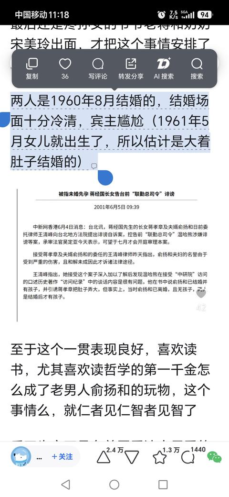
173. <a href="https://www.zhihu.com/people/li-zhao-qi-29-87">李韦恩</a> (<small title="河南">2026-1-13 16:46:39</small>): 在国内乱打拳的女性，在国外就能相夫教子，兴许就是环境所致，环境影响了认知导致认为自己低人一等，才决定好好当“好媳妇”，这么说女性地位低下有利于社会和谐。
174. <a href="https://www.zhihu.com/people/zhao-wu-an">AnnecyleVieux</a> (<small title="浙江">2026-1-13 0:8:19</small>): 如果社会主义失败了，整个中国都会成为这样的地方
     - <a href="https://www.zhihu.com/people/tian-kong-75-30-61">天空</a> (<small title="湖南">2026-1-13 2:18:42</small>): 是的，资本的力量很大，民众的力量更大，但需要社会主义全民所有制
175. <a href="https://www.zhihu.com/people/yi-bei-jiu-27-98">旗余人</a> (<small title="江西">2026-1-12 15:56:59</small>): 有一个外地人，抛弃自己的发型模仿你的发型，抛弃自己的服饰模仿你的服饰，抛弃自己的礼仪模仿你的礼仪，从小苦学你的语言，最后跑到你面前，你不歧视他，那就是你若智。
176. <a href="https://www.zhihu.com/people/si-mi-da-97-48-31">后山都是粑粑</a> (<small title="福建">2026-7-18 1:46:35</small>): 这难道不正常吗？嗯?凭什么要四世三公，凭什么这些踩在劳苦大众身上作威作福得家族要一直富贵下去。果然阿美立卡事世界的灯塔。还有结尾，其他人怎么样就不用问了。凭啥不用问了。那些在国内被压榨，一天工作十几小时只有微薄收入的人，到了阿美立卡后，不说大富大贵，起码有存款，有不动产。
177. <a href="https://www.zhihu.com/people/dan-yong-ming-80">新天新地0321</a> (<small title="北京">2026-1-12 12:3:49</small>): 就蒋宋孔陈干的没人性没底线的那些事，绝后便宜他们了，根本不能赎清他们的罪孽。
178. <a href="https://www.zhihu.com/people/thevon">Thevon</a> (<small title="四川">2026-1-14 9:59:46</small>): 这么来看，就一点不担心统一时某些弯弯出逃了，反正跑了也是人家案板上的肉［捂嘴］
179. <a href="https://www.zhihu.com/people/emanon-67-16">姜哥</a> (<small title="美国">2026-1-21 11:43:17</small>): 这不恰恰就是进步文明的表现吗？能力不行，孙的孙子也只能是当个特技演员，不然放在封建国度，高低得抽几百户老百姓的社保退休金，给某位肥头大耳，连走路都要人扶的大胃袋三代，弄个将军的头衔和待遇［打招呼］［打招呼］
180. <a href="https://www.zhihu.com/people/lin-bin-63-56">三分恶气</a> (<small title="福建">2026-1-13 15:38:55</small>): 说到底，在外国跟普通老百姓一个性质！全红婵在国内只能第二，在国际大赛只能第一！在明朝，中华田园犬都比外国人阶级高
181. <a href="https://www.zhihu.com/people/dablo-38">dablo</a> (<small title="山东">2026-1-13 15:14:28</small>): 民族跪下去后，国民都抬不起头来，
182. <a href="https://www.zhihu.com/people/zhi-zhi-17-85">知之</a> (<small title="山东">2026-1-11 22:59:43</small>): 这些人真是失策，送到大陆来，肯定给你改造成四有好青年～三观都给你掰正
183. <a href="https://www.zhihu.com/people/polaris-40-40-59">Polaris</a> (<small title="广东">2026-1-11 23:22:35</small>): 用特权刮来的民脂民膏，在某些人嘴上喜欢的新大陆真·黑暗森林里不堪一击，这是好事啊，有什么物伤其类的必要吗
     - <a href="https://www.zhihu.com/people/wang-si-fan-88-95">劳动节快乐</a> (<small title="陕西">2026-1-12 0:51:6</small>): 是好事，问题是他们已经是在美国坚持的比较长的家族了
     - <a href="https://www.zhihu.com/people/wu-huang-1-57">借我一盏烛火</a> (<small title="江西">2026-1-12 1:26:22</small>): 但是他们花掉的钱是从国人身上刮走的啊［捂脸］［捂脸］［捂脸］
184. <a href="https://www.zhihu.com/people/dan-bao-de-dan-dan">蛋包的蛋蛋</a> (<small title="北京">2026-1-14 0:58:42</small>): 纯属为了结论找证据，所谓四大家族衰败，首先是因为后代淫逸骄纵，都是些不争气的玩意，别说去美国了，留在台湾到现在也混不下去，吃枣药丸。
     - <a href="https://www.zhihu.com/people/dba-34">DBA</a> (<small title="美国">2026-1-15 0:19:55</small>): 再说所谓“四大家族”起点也没有很高
185. <a href="https://www.zhihu.com/people/ling-qian-11">gyko</a> (<small title="浙江">2026-1-12 13:12:33</small>): 章万安是王继春的野出，跟蒋家没有任何血缘关系
     - <a href="https://www.zhihu.com/people/xiong-xiong-42-83">胡咧咧</a> (<small title="河南">2026-1-12 14:21:52</small>): 亲，按你的说法蒋纬国和蒋家也没关系了？怎么一直到蒋纬国去世大家都觉得他是二公子呢？中国上层一向是血统，姓氏，财产和政治遗产分开继承。刘备可作为东汉继承人建立蜀汉，李存勖克作为李存勖唐继承人建立后唐。
     - <a href="https://www.zhihu.com/people/ling-qian-11">gyko</a> (<small title="浙江">2026-1-12 19:3:19</small>): 我打假跟你有关系吗？
     - <a href="https://www.zhihu.com/people/ling-qian-11">gyko</a> (<small title="回复于 2026-1-12 19:6:39/浙江"> ✉️:胡咧咧</small>): 现在是法制社会，改身份证父亲栏必须拿出dna证据，必须由生父认领，不然怎么证明他有血缘关系，靠一张嘴吗？
     - <a href="https://www.zhihu.com/people/xiong-xiong-42-83">胡咧咧</a> (<small title="回复于 2026-1-12 19:23:49/河南"> ✉️:gyko</small>): 政治上素有养子继承政治遗产之例，有何不可？本朝仁宗乃先烈养子，先丞相亦开国丞相养子，无血缘均可继承政治遗产从政
     - <a href="https://www.zhihu.com/people/xiong-xiong-42-83">胡咧咧</a> (<small title="河南">2026-1-12 19:36:16</small>): 但不是亲爹，他是他生父怕弟弟绝后过继给江上青的
     - <a href="https://www.zhihu.com/people/xiong-xiong-42-83">胡咧咧</a> (<small title="回复于 2026-1-12 20:42:38/河南"> ✉️:gyko</small>): 亲，你跟我说喊破喉咙也没用！你得跑去给两岸的国民党说啊！人家都认可他爹，自然也认可他.，宁肯把票投给他，也不投给蒋孝勇的神经儿！好比李唐朝野认可李旦儿子，但只认可庶出的李隆基做太子，不认可太平公主提名的嫡出李隆宪！这种政治认同可不是你抬出血缘和嫡嫡道道就能瓦解的呦!
     - <a href="https://www.zhihu.com/people/ling-qian-11">gyko</a> (<small title="回复于 2026-4-25 1:25:51/浙江"> ✉️:胡咧咧</small>): 蒋纬国正宗蒋家国字辈，没有违法改姓，章孝严假货硬蹭
     - <a href="https://www.zhihu.com/people/ling-qian-11">gyko</a> (<small title="回复于 2026-4-25 1:26:3/浙江"> ✉️:胡咧咧</small>): 台湾身份证有父亲栏，根据民法，改姓必须由生父认领，并验dna，章孝严属于违法操作
     - <a href="https://www.zhihu.com/people/ling-qian-11">gyko</a> (<small title="回复于 2026-4-25 1:26:8/浙江"> ✉️:胡咧咧</small>): kmt要利用章孝严这个冒牌货而已
     - <a href="https://www.zhihu.com/people/ling-qian-11">gyko</a> (<small title="回复于 2026-4-25 1:27:52/浙江"> ✉️:胡咧咧</small>): 经国日记里写了双胞胎是王继春的儿子，本人不认哪怕是亲生的也继承不了任何东西
     - <a href="https://www.zhihu.com/people/ling-qian-11">gyko</a> (<small title="回复于 2026-4-25 1:29:3/浙江"> ✉️:胡咧咧</small>): 没人养他，自己硬蹭的蒋姓
     - <a href="https://www.zhihu.com/people/ling-qian-11">gyko</a> (<small title="回复于 2026-4-25 1:30:59/浙江"> ✉️:胡咧咧</small>): 法律规定只有生父认可才行，但国民党为了利用冒牌货，让章孝严违法改姓
     - <a href="https://www.zhihu.com/people/ling-qian-11">gyko</a> (<small title="回复于 2026-4-25 1:31:7/浙江"> ✉️:胡咧咧</small>): 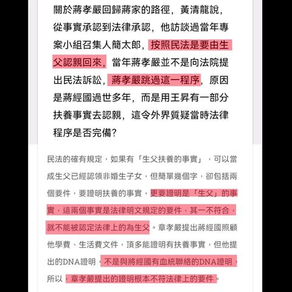
     - <a href="https://www.zhihu.com/people/ling-qian-11">gyko</a> (<small title="回复于 2026-4-25 1:31:44/浙江"> ✉️:胡咧咧</small>): 蒋经国只有一个老婆，没有庶出，章亚若是郭礼伯的妾，章万安是王继春与妾的野出
186. <a href="https://www.zhihu.com/people/anday-22">李达野</a> (<small title="安徽">2026-1-12 23:52:36</small>): 所有的权贵的底层逻辑都是基于武力之上，你一个移民能掌控到国家机器的武力?所以乖乖的做二三等公民，别想翻天［吃瓜］
187. <a href="https://www.zhihu.com/people/chen-he-yi-38">寂兮寥兮</a> (<small title="福建">2026-1-11 23:5:27</small>): 脱离华夏文化土壤的基因会开启堕落自毁程序……
     - <a href="https://www.zhihu.com/people/bu-xi-99-40">柚子</a> (<small title="安徽">2026-1-13 12:1:7</small>): 入华夏则华之，入夷狄则夷之［惊喜］
     - <a href="https://www.zhihu.com/people/yiweihangzhi">任自然</a> (<small title="北京">2026-1-18 21:12:55</small>): 老话说的好，人离乡贱
188. <a href="https://www.zhihu.com/people/hua-lu-shui-90-25">花露水</a> (<small title="上海">2026-1-12 0:14:54</small>): 其实在美国已经属于政治避难了，对于一群没有祖国只有钱的废物还能怎么优待啊［捂脸］
189. <a href="https://www.zhihu.com/people/healthinformatics">吃貨仁波切</a> (<small title="澳大利亚">2026-1-12 10:2:6</small>): 根源在于中国文化的中庸。你看看印度人，到了加拿大就活生生的把印第安人当作了自己的后代，把加拿大认作了前世乐土。
190. <a href="https://www.zhihu.com/people/13692249609">我说话比较直</a> (<small title="广东">2026-1-14 20:55:10</small>): 不是欧美的超能力，而是要看他们是怎么发家的。本来就是以劣等人的自我认知和包衣姿态发家的，这种刻在骨头里的劣等认知基因，不是靠金钱能改变的。
191. <a href="https://www.zhihu.com/people/yong-wu-zhi-jin-19">永无止尽</a> (<small title="四川">2026-1-13 15:22:47</small>): 老美那边说白了，这么多年的事实还是没教会那些吃里扒外的东西，背叛自己民族的人，你还指望人家把你当自己人？你又去再背叛他们？［捂脸］
192. <a href="https://www.zhihu.com/people/devin-10-75">Devin</a> (<small title="陕西">2026-1-14 22:54:57</small>): 羊跑到狼群里，如何繁殖？如何保证不被吃掉？［大笑］［大笑］［大笑］
193. <a href="https://www.zhihu.com/people/yholes">yholes</a> (<small title="重庆">2026-3-14 10:23:24</small>): 想象一下外国人移居中国，一家人呆了60多年还没有被同化吧。。。
     - <a href="https://www.zhihu.com/people/97-60-58-86-34">千足马</a> (<small title="浙江">2026-3-17 15:22:46</small>): 那只能是犹太建立社区了［捂脸］
194. <a href="https://www.zhihu.com/people/usryl4e">小看山</a> (<small title="北京">2026-4-30 16:0:46</small>): 西北三马有两个马也去了外国 其中一个去了阿拉伯国家 一个去了美国 人家怎么没发疯 说到底还不是你牢蒋小集团这群人不行 这群罕见不靠国外资助 实际水平连军阀甚至溥仪这些抽象东西都不如
195. <a href="https://www.zhihu.com/people/zi-qi-dong-lai-62-69">紫气东来</a> (<small title="浙江">2026-7-18 9:3:25</small>): 这是上一代人不积德，后代被反噬。看得挺爽，学学阿Q竟然也高潮了［大笑］
196. <a href="https://www.zhihu.com/people/tao-tie-30-40">饕餮</a> (<small title="浙江">2026-1-12 1:32:46</small>): 美国好啊，好就好在在中国再怎么恨国愤世嫉俗的人到了美国都会被教育的跟乖孙一样［思考］

=[评论](./attachments/comments.json)

