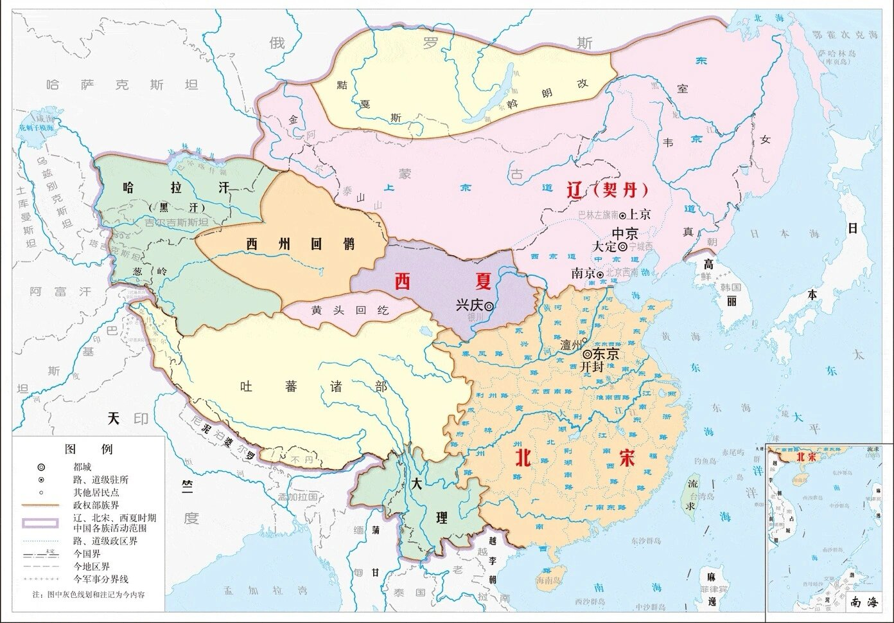
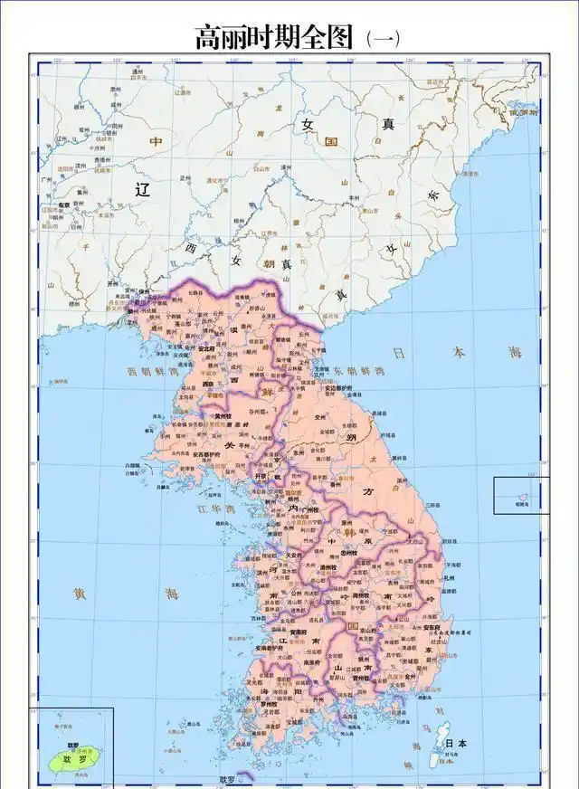
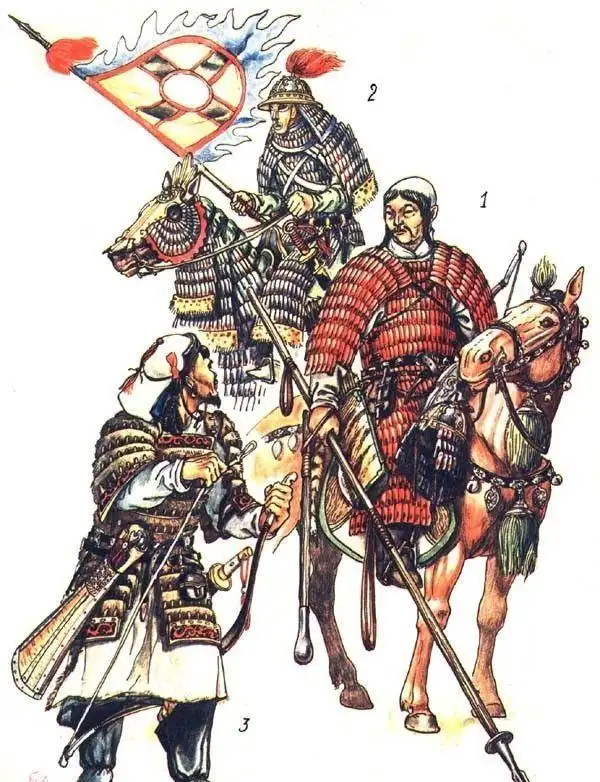
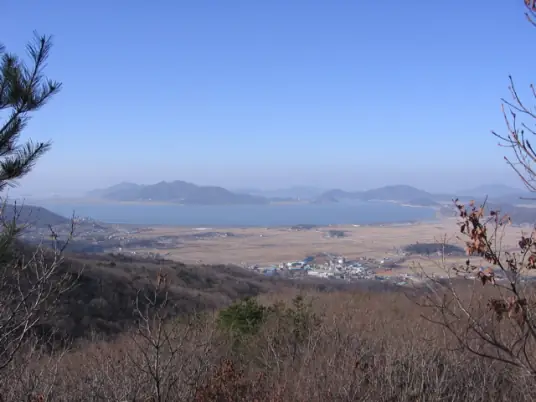
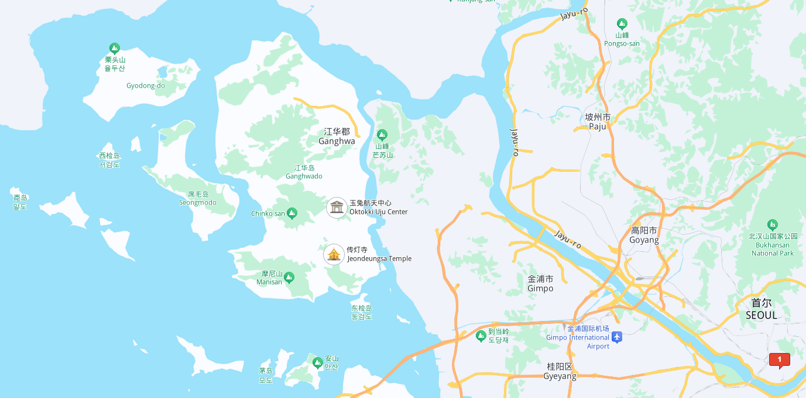
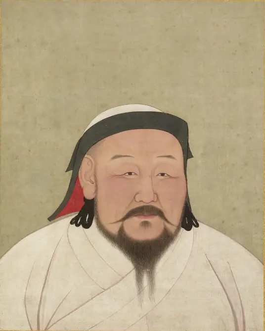
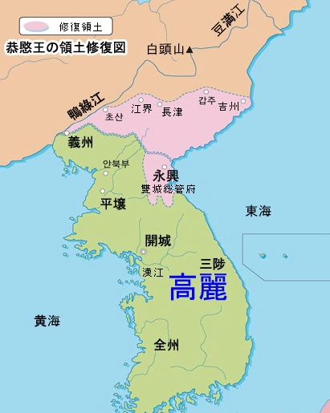
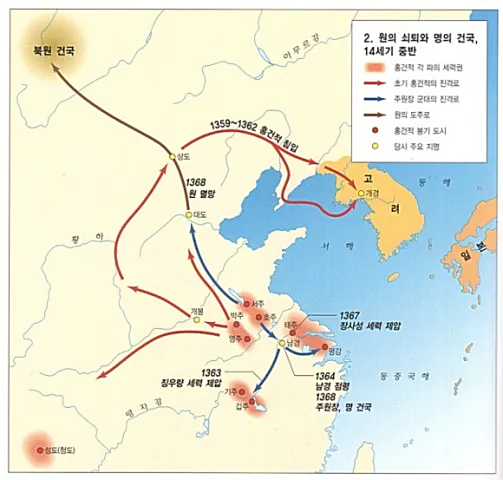
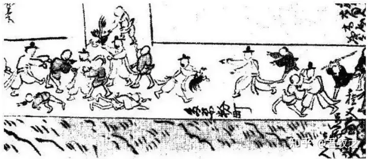
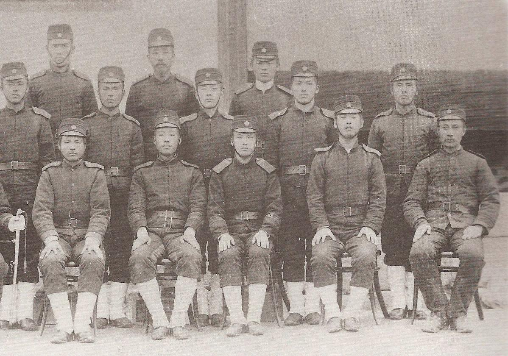

[toc]

# 问题

提问者：**<a href="https://www.zhihu.com/people/da-jiao-guai-61">高血压圣体</a>**
提问时间: 2025-6-4 19:36:17
总回答数: 1788
总访问量: 10552859

电影里面韩国男人一顿阿西吧就把对面摆平一片了，现实中韩国男人打架的战斗力如何？和电影里面一样强吗？大概对标中国哪个省市的战力?

# 回答

回答者： **<a href="https://www.zhihu.com/people/liu-lin-57-66">吾牧之</a>**
回答时间: 2025-12-29 15:1:1
点赞总数: 570
评论总数: 157
收藏总数: 342
喜欢总数：27

如果大家想听假话，朝鲜民族不善战，壬辰倭乱让日本人打的抱头鼠窜，大清朝南征十几个八旗兵能够压着五六十的朝鲜兵打，甲午战争更是一枪没打就沦为亡国奴——实在是差劲的不得了

但是如果大家想听真话，朝鲜民族其实很能打，非常能打，十分能打

而且能打到了中国人很难办的地步，别看明朝的时候人家恭顺，其实明朝的皇上大臣还挺怕他们的

这个事情，也不用从什么隋炀帝征讨高丽开始说，因为隋炀帝打的其实也不是朝鲜人，是我们东北的少数民族同胞

只不过是朝鲜人、韩国人硬往高句丽上凑，才让大家误解了。

我们从辽代的辽圣宗九征高丽开始说吧

辽圣宗，圣讳 耶律隆绪（空一格以示尊重）

是辽朝的第六位皇帝，他的母亲就是大家都很知道的萧太后，萧燕燕

95年的时候，辽宁电影制片厂还拍了个电影《大辽太后》

当时海报上说了，她是契丹的武则天——当然了，后来随着对历史的了解，萧太后可比武后厉害多了，也正常多了

在萧太后的治理下，辽国国势很强盛，甚至就连大食国都要给辽国朝贡

辽国基本上是打遍天下无敌手，但是就是没有打服气高丽

993年辽国第一次讨伐高利国，这一次讨伐的目的是为了未来进攻宋朝做准备

彼时高丽和宋朝实际上是准盟友关系

辽国担心出兵大宋，逐鹿天下的时候，老窝被高丽人掏了

必须要清楚高丽在后背的威胁，才好。

当时的带兵官是萧恒德，这个人后来因为乱搞男女关系气死了自己的公主老婆，被萧太后也就是自己的丈母娘给赐死了。

但是一看他这个简历就知道他其实是挂名统帅，真实的统帅其实是副都统萧挞凛，和兵马都监耶律元宁

这位萧挞凛后来主持了和宋朝的战争，因为在前敌视察，被宋军的弩炮命中头颅死亡

他一死，辽国的士气直接崩溃，

将与宋战，挞凛中弩， **我兵失倚** ，和议始定。或者天厌其乱，使南北之民休息者耶。

我兵失倚可是不得了的赞誉，不是什么阿猫阿狗死掉了都会有这个效果

所以萧挞凛可以说是当时辽国最厉害的战将了

至于耶律元宁，则是宿将，曾经参与了让宋太宗驴车漂移的高梁河之战。

国势强盛，兵力雄厚，带兵官也很有能力，而且是突然袭击（之前辽国为了战略蒙骗高丽人，发动了数次对高丽的佯攻，此时已经极大的迷惑了高丽国王，这一次攻击有偷袭的成效）

这下子总能大获全胜吧？

开始还真是打的不错，但是等打到安戎镇的时候，推不下去了，兵力损失很大，士气也不行了

八月出兵，打倒了闰十月，这个时候朝鲜的气温已经很低了

再打下去，非战斗减员就受不了。

辽国此次讨伐，没有达到战略目的，只不过是深入高丽国境三百里地，远远没有达到摧毁高丽军事能力的目的

但是仗打到这个份上也只好撤军（其实对于伟大的统帅来说，见好就收也是一个必备素质），至于战争成果，也不过是高丽王口头承诺要断绝和宋朝的外交关系，并朝贡契丹辽国

但是同时却也做出了赏赐高丽王女直鸭渌江东数百里地的让步，算是割地了

战后双方都自称取得了胜利，可以说是平手

但后来过了没多久，高丽王就食言而肥了，高丽王没有来朝贡，但是女直鸭渌江东数百里地却被辽国给了出去

所以严格的说，辽国算是败了

而没能够清除高丽的威胁，也是辽国在澶渊之战中，不得不求和的一个重要原因

如果辽军被宋军牵制，而高丽趁机北伐，则契丹国万事休矣，大辽社稷就瓦解了

1010年，此时萧太后刚刚去世，三十七岁的辽圣宗亲政。次年五月高丽发生宫廷政变西京留守康肇弑君

卧榻之侧岂容他人鼾睡？机不可失时不再来

趁着高丽内乱，辽圣宗带着他的精锐卫队皮室军亲征

此时大辽国因为澶渊之盟的岁币缘故，经济上很好（虽然当时是荒年），军事上也很强盛，又是趁乱出兵

按道理说应该能够轻取高丽

事实上开始也确实如此

辽军连下通州、郭州、安北府、肃州,击溃康肇率领的高丽军主力,兵围高丽西京(平壤),并于次年正月,仅用不到两个月的时间,便攻克高丽都城开京。

结果因为高丽王逃亡南方，而后路上的高丽人开始组织义军，袭扰契丹的后勤

最后在打下高丽的开京后不到三个月，辽圣宗也发现无力继续进攻了

但是此时撤兵的最好时机已经错失，辽军在回国路上被高丽军截击，蒙受了巨大的损失

几乎形成溃败

《高丽史·杨规传》,“契丹兵为诸将钞击,又因大雨,马驼疲乏,甲仗皆失,渡鸭绿江引去。郑成追之,及其半渡,尾击之,契丹兵溺死者甚众。诸降城皆复之。 **规以孤军,旬月间,凡七战,斩级甚众。** 夺被虏人三万余口,获驼马器械不可胜数”

所以说，见好就收，真的是伟大统帅必备的素质

辽圣宗此时虽然是中年了，但是确实不具备伟大统帅的素质，所以他任内，虽然东征西讨，但是辽国的国力实际上是衰退状态

这一次，也是无果而返，不过是再次获得了高丽王朝贡的许诺

不过比上一次强一点，高丽王自称要亲自朝贡（自然后来也没去）

所以说，这一次也算是打了个平手——至少没割地

两年后，也就是1012年，辽圣宗看着高丽王死活不来朝贡，于是再次讨伐高丽

至于战争理由么，第一是不朝贡，第二是索要鸭绿江东女真地面（就是第一次割让出去的）

这一次辽国不敢深入高丽内地了，而是通过吸取唐太宗伐高句丽的经验搞起来了边境战争。

《资治通鉴》卷198《唐纪十四》,太宗贞观二十一年

高(句)丽依山为城,攻之不可猝拔……今若数遣偏师,更迭扰其疆场,使彼疲于奔命,释耒入堡,数年之间,千里萧条,则人心自离,鸭绿之北,可不战而取矣

从1013年到1019年，每年都要打一次高丽，这就是第三征到第九征

期间取得过斩首数万的郭州大捷，但是都是见好就收，高丽国的城防甚是坚固，辽军没有长驱直入的能力

结果打来打去，高丽军越打越强1018年开泰第六次讨伐（总数的第八次）

辽军竟然被高丽人击破大败，甚至就连禁卫军都死伤惨重

“是月,萧排押等与高丽战于茶、陀二河,辽军失利,天云、右皮室二军没溺者众,遥辇帐详稳阿果达、客省使酌古、渤海详稳高清明、天云军详稳海里等皆死之”

指挥这次大败仗的也不是无名之辈，而是宿将萧排押，此人从军数十年，南征北讨，打过大宋，更是从第一次讨伐高丽开始就一直参与对高丽的作战（攻破开城的就是他了）

之所以这次讨伐高丽惨败，纯粹是统帅想要复刻当年攻克开城的丰功伟绩，孤军深入

中了人家的诱敌深入之计

这下子，可就很尴尬了

辽圣宗甚至大发雷霆，表示要把萧排押脸皮扒了（当然肯定不能这样，毕竟是亲戚）

“汝轻敌深入,以至于此,何面目见我乎? 朕当皮面然后戮之”

这一次打了这么大的败仗，高丽开始约着北宋一块讨伐契丹了

当然了，北宋没搭理他们，后来这个事情被很多人认为是失策

次年，辽军又发动了开泰第七次讨伐，这一次是站在鸭绿江边，武装示威，表示自己的态度

其实就没打

而高丽一看辽军又要作势打人，而且北宋朝廷态度冷漠

也受够了，于是主动请和，宣布自己是辽国的朝贡国（至于鸭绿江女真地，自然是不还的）

1020年2月，高丽王，是月,遣李作仁奉表如契丹,请称藩纳贡如故

辽圣宗看见有了台阶下，顺着梯子爬了下来

大赦,改元太平,中外官进级有差；并且改年号太平

还给高丽王封了官：开府仪同三司、守尚书令、上柱国、高丽国王,食邑一万户、食实封一千户

纵观辽国对高丽的讨伐，很难说是胜利。最后实惠全都归了高丽人，辽国就落了一个虚名

而且自此开始辽国因为连年战火竟然衰弱了下来

辽国衰弱后，女真开始独立，但是比较搞笑的是，女真人面对的第一个大敌还真不是契丹人

而是高丽人，前面不是说了么，高丽霸占了鸭绿江东女真地

女真不满万，满万不可敌，鸭绿江东的也是同文同种的女真同胞，于是完颜阿骨打他哥哥完颜乌雅束就准备收降鸭绿江东女真部落

这下子就撞上高丽人了

因为高丽人一边给大辽国称臣纳贡，另一边呢，又逼着女真人给他称臣纳贡

于是完颜女真就和高丽人展开了七年的曷懒甸之战（1103到1109）

至于战争结果么？则是女真部落归完颜女真，但是完颜女真必须代替女真部落向高丽王朝贡

嗯，熟悉不熟悉？就和高丽王必须向辽国朝贡那样

于是高丽就成了完颜女真的父母之邦，为了让高丽人信服，女真甚至还发毒誓效忠

而今已後,至于九父之世,無有惡心,連二朝貢,有渝此誓,蕃土滅亡

所以女真灭亡大辽国，从法律上来说算是朝贡国的朝贡国灭亡了宗主国的宗主国

后来辽国被灭亡了，高丽人趁乱霸占了契丹人修建在边境上的保州要塞

金太祖很生气，责问高丽人为什么要这么做

高丽人想了想，犯不着为了一个城池和完颜女真打仗，退了出去，并且向金国朝贡

两国约定为兄弟之国，日常书信是这么行文的“兄大女真金国皇帝致书于弟高丽国王”

比较尴尬的是，当时金朝和南宋约定的是君臣之国（其实本来是父子之国，但是南宋君臣感情上接受不了），后来成了伯侄之国——嗯，如此一来，高丽就成了南宋的叔叔国了

但是你以为他们很恭顺么？绝不恭顺

1164年，趁着宋朝发动隆兴北伐的档口，高丽人觉得完颜女真要完蛋，竟然袭击了金国和高丽边境线上的一系列城堡

后来隆兴北伐失败，宋金议和

高丽人又退了回来，而金世宗也吸取了辽圣宗的教训，不敢问罪高丽

至于高丽为什么这么难打，一来原因是地形多为山地，骑兵不好展开；二来就是高丽还在坚持唐朝的府兵制度，军事动员能力极强

有府兵制度，就得有支撑府兵制度的均田制

高丽的均田制度，他们叫田柴科制，文武官员分为七十九品，最高获田柴各110结，普通士兵得田15结，其实就是唐朝的那一套制度，换换名词，制度内核毫无二致。

不过高丽国这套制度保持的比较好

辽军也好，金军也罢，遇上的高丽军，其实就是山寨版的唐军。

五十年后金朝也衰败了，大蒙古崛起，开始进入辽东，攻击高丽

之前，辽东已经和金朝的大部被隔绝了，被女真人统治了许久的契丹人，翻身农奴把歌唱，在耶律留哥的带领下投奔了蒙古人

金朝只能跨海命令辽东宣抚蒲鲜万奴攻打耶律留哥

结果辽东宣抚蒲鲜万奴让耶律留哥和蒙古人打的溃不成军，害怕被军纪处分，再考虑到大金国也快完蛋了

索性直接自立为王，也投降了蒙古人，是为大真国，后来又背叛了蒙古改名叫东夏国，总之了折腾了半天，从辽东到海参崴的乱窜。

期间也打过高丽，但是也没打过

1215年，投降蒙古的耶律留哥 正在成吉思汗那里做客，搞外交

他老窝里面的契丹人，本来想要唆使耶律留哥称帝，但是一看耶律留哥只相当成吉思汗手底下的王

很是不满，趁着他搞外交的档口，造反了

耶律留哥大惊失色，成吉思汗倒是很无所谓——毕竟耶律留哥这么乖顺，确实也不好意思下手，耶律留哥手底下的契丹人，造反了好啊，正好有个由头，于是把耶律留哥的长子扣下当了人质，发兵讨伐耶律留哥名下的叛人

1216年耶律留哥手底下的叛变者，战败逃入高丽，很快和高丽人发生了矛盾

于是女真人、契丹人、高丽人，这三个较量了二百年的老对手，在·1216年的朝鲜半岛打的是死去活来

1218年成吉思汗派哈真带着耶律留哥去讨伐逃亡到了高丽的契丹叛人

路上顺便逼降了蒲鲜万奴，于是兵力越发充足了

于是高丽人和蒙古人、女真人开始攻击契丹人，契丹人投降，两万五千契丹人归耶律休哥，剩下的两万五千契丹人归高丽人——当农奴去了，这些人就是朝鲜贱民的一大来源

高丽王一看这个样子，于是又成了蒙古国的朝贡国，约定为兄弟之邦

后来么，因为蒙古人索要的贡品已经远远超过了高丽之前的朝贡贡品的份额（这个当然很合理，蒙古人又不是很清楚东亚这套礼仪性的朝贡贸易，在他们眼里，朝贡就是宗主国对朝贡国收税）

外加上东夏国也趁着成吉思汗西征西夏造反了，于是高丽对于蒙古也不甚恭顺了

虽然不恭顺，但是也没反叛。

只不过是虚与委蛇罢了，但是事情在1225年发生了变化。

1225年蒙古使者被人截杀在了归国路上，蒙古人认为是高丽人所为

但是其实十之八九是东夏国所为，因为东夏国一三五装成蒙古人杀高丽人，二四六装成高丽人杀蒙古人

目的就是逼着高丽反叛蒙古。

不过蒙古人也没兴趣分辨，都干掉就是了。

但是还没等到出兵讨伐高丽，成吉思汗就驾崩了

这就耽误了，又是大汗继承事务，又是各地将领的宣誓效忠事务，期间还打了几仗，直到六年后1231年，蒙古人才开始讨伐高丽

发兵日期还是老样子从八月出兵，到正月回师

带兵官是撒礼塔，高丽人开始还以为蒙古军队是东夏国装成的假蒙古人，等到了确定身份后，直接就投降了。

撒礼塔觉得高丽已经被灭亡了，按照规矩，从开城到府县派出去七十二个达鲁花赤

这就让高丽王很恐惧，认为这一次是打算要灭亡高丽了

于是在朝臣的建议下，高丽王躲藏去了江华岛

  

自此形成惯例，只要朝鲜被侵略，国王都要逃到江华岛躲避

高丽王在江华岛抑郁的不得了，只能念佛获得心灵的平静

于是在岛上还刻了一套高丽大藏经

至于撒礼塔派出去的七十二个达鲁花赤，全让高丽人杀了，甚至撒礼塔本人也被射杀

当时有一个被俘虏的高丽官员劝撒礼塔不要过汉江，因为国谚有之：异国大官，渡南江者不吉。”

这个估计是大辽国九征高丽留下的传说

也对，老百姓哪里知道，当年那么凶狠的契丹人，为什么在过了汉江之后，就一败涂地的呢？

不过撒礼塔被射杀之后，蒙古人觉得挺有道理，不仅释放了高丽官员，而且还送了赠品

撒礼塔死了，除了退兵，也没什么别的选择了

因为蒙古国疆域广阔，所以第二次征伐高丽是1235年做出的

这一次出征的是上次幸存的带兵官唐古，吸取上一次的教训，第一七月份就出兵了，宁肯热着也坚决不在高丽挨冻了

第二是稳扎稳打，顺着交通线往前打，绝对不给高丽军民骚扰后路的机会

于是从1235年七月到1239年，蒙古军在高丽打了四年

高丽王终于受不了了，投降

蒙古人也不多要：你亲自去给大汗解释吧！

高丽王不敢去，或者是说实际掌管了高丽国政的崔沆不愿意高丽王去

于是高丽国在1241年就派了个王室成员去蒙古当人质去了

这号人质根本就没有用，这号国王的远房亲戚，就算是片成片，对国王也没什么损失

等于是在欺骗大汗，蒙古大汗很生气，后果很严重

不过恰好这个时候，蒙古大汗窝阔台驾崩，蒙古朝廷也很忙，暂时也没找高丽人的晦气

等到手头工作忙完了，找高丽人晦气的时候，已经是1247年了

贵由汗派了元帅阿母侃讨伐高丽人

高丽人直接滑跪，弄得阿母侃也不知道该怎么办了，于是只好请示贵由汗

结果等来的却是贵由汗驾崩的消息

这还打什么？还是快回去开会选新任大汗吧——这一次可就不好选了，来来回回折腾到了1251年才选出来蒙哥当大汗

在此期间，高丽惴惴不安，直接把江华岛给要塞化了

蒙古人本来就对高丽王杀害达鲁花赤，躲到江华岛，送假冒的货色当人质的行为不满意，这下子看见高丽王还修上了碉堡

于是很生气，指责高丽王不讲信用

高丽王解释：是为了防止宋朝来的海寇抢劫他

蒙古人当然不相信

坚决要求高丽王迁都回陆地，并且亲自朝贡蒙古大汗

高丽王就坚持说，自己生病了，去不了——因为生病了，所以也没法迁都

蒙古人很生气，于是1252年，蒙哥在讨伐南宋的途中命令，必须收拾高丽人

蒙古军再次出征

这一次要求是高丽王迁都回陆地，平毁江华岛工事，高丽全国剃发——按照蒙古人的样子来

哦，对了剃发后的高丽王必须要去朝拜大汗

高丽王肯定不同意，于是蒙古人这一次再也没有客气，烧杀抢掠，掳掠走了二十多万高丽人

恰巧这个时候，操控高丽国政，坚持抗蒙古，坚持躲在江华岛的权臣崔沆死了

这里需要提一下，因为近二百年来先是大辽国后来是大金国再后来是东夏国和蒙古国不断地打高丽

所以武人的地位空前上涨

所以此时高丽的政权已经被武夫掌握

高丽王和傀儡差不多

比汉献帝倒是强不少，但是也强的有限。

权臣既然死了，高丽王于是表态，虽然国王没法去蒙古，但是太子可以去蒙古

自此朝鲜半岛确立了，太子当人质的传统

不过高丽太子刚出发，高丽王先去世，而后蒙古大汗蒙哥也驾崩了——一来二去，太子自己也不知道该到哪里去找蒙古大汗了

因为这个时候元世祖和他弟弟阿里不哥正在争夺大汗的位置

考虑再三，高丽世子决定，还是找元世祖吧

当时元世祖正在读《贞观政要》，听说高丽王太子来投降了

大喜过望“高丽万里之国，自唐太宗亲征而不能服，今其世子自来归我，此天意也”

来得早不如来得巧，这个时候元世祖正好在和弟弟争皇位，如此一来高丽世子成了证明其政权合法性的活论据，别管有什么实质性的用处，至少在精神上很有好处

当时元世祖早就在金莲川开府了，弄了群北方汉人当幕僚

于是大家建议，厚待高丽太子，不费一兵一卒收降高丽

江淮宣抚使赵良弼:“高丽虽名小国，依阻山海，国家用兵二十余年尚未臣服，前岁太子倎来朝，适銮舆西征，留滞者二年矣。供张疏薄，无以怀辑其心，一旦得归，将不复来，宜厚其馆谷，待以藩王之礼。今闻其父已死，诚能立倎为王，遣送还国，必感恩戴德，愿修臣职，是不劳一卒而得一国也”

元世祖觉得非常有道理，又想到，太子离开高丽很久了，回国继位可能会有麻烦

于是挑选了精兵护送太子继位

而且为了让高丽太子的即位合法性得到增强，元世祖还归还了掳掠的高丽人畜

该说不说，元世祖确实英明，多尔衮就不行，当年做了十年大清朝人质的昭显世子回国

多尔衮就送了人家一个砚台，最后可怜的昭显世子被他的父亲仁祖大王用多尔衮赠送的砚台活活砸死。至于和满洲亲贵关系很好的昭显世子妃则被毒死，昭显世子的三个儿子被流放济州岛，其中两个活活饿死

多尔衮要是学习元世祖，派遣八旗兵护送世子回家，可能世子就不会遇害了

已经对清朝友好的昭显世子即位后，朝鲜未来必然和大清朝关系更加的紧密

这个被元朝护送回去继位的高丽世子就是后来的高丽元宗

虽然说，他投降了元世祖，但是也因为元世祖和大元朝的支持，所以高丽元宗得以驱逐了权臣，罕见的重掌大权，并在被权臣林衍迫害的时候转危为安——当时高丽元宗已经被软禁了，王位也被剥夺了，是他的儿子世子王谌去向忽必烈哭诉，这才救出来这个元宗

因为蒙古人的原因，高丽王终于摆脱了一百年来傀儡的地位，成为了真正的统治者

投桃报李，高丽王自此开始忠诚于大元朝，甚至元朝自己都完蛋了，高丽王还要顽抗明朝

最后直到王族被灭族才为止

蒙古人是当时最厉害的武力，但是也不是靠着纯粹的暴力才收降高丽

收降高丽的是暴力和元世祖的怀柔策略

当然了除了怀柔政策，还有元朝的公主们，高丽王的老婆都是黄金家族的女子

所以高丽又被称为驸马国

高丽和元朝是女婿和老丈人的关系，而且这个老丈人还是很有能力的老丈人

岂能不忠诚？

高丽王的庙号也没了，改成了谥号，元宗之下分别是

忠烈王、忠宣王、忠肃王、忠惠王、忠穆王、忠定王

忠宣王和忠惠王还被元朝捉走教育过几次

要忠诚！

尤其是忠烈王，就是那个去蒙古搬救兵的世子，后来娶了元世祖的女儿忽都鲁揭里迷失公主

此人干脆直接成了精神蒙古人了，不仅自己剃发易服还带动朝臣一块剃发易服

并且开始了事大主义

当然了，大元朝后来在元世祖驾崩后，很快也衰弱了

这一套草原和中原制度结合在一起的二元帝国，也就元世祖自己玩得转

他一去世，元朝就基本上要散架了

忠烈王是怕老婆的，但是到了忠烈王的孙子高丽忠肃王的时候，公主亦怜真八剌竟然被忠肃王活活打死

宗主国的权威自此就萧然了。

老丈人没有本事了，女婿就要欺压女儿了，就是这个道理

等到了恭愍王即位的时候，高丽甚至开始对宗主国下手，悍然夺走了元朝在鸭绿江南的领土

现在中国有个地名叫铁岭，其实最早先的铁岭是在朝鲜境内

所以高丽的事大，是在强力之下的事大，一旦中央政权不行了，这种事大主义，顿时就会烟消云散

而且需要指出的一点是，此时高丽的地位，正是最高的时候

奇皇后就是一个高丽人

而元昭宗是高丽人的儿子，然后恭愍王把元昭宗的姥爷家灭门了。

而元朝，虽然出兵讨伐，但是最后战败，反而还得感谢高丽剿灭了龙凤北伐的红巾军

是的，龙凤北伐打到了高丽

洪武帝因为受到了高丽君臣的侮辱，很生气，曾经写信痛斥过高丽王

里面有这么一句

我是一个农家，与我中原作主；恁是箕子之国，新罗，乐浪郡相敌，掳了平［民］百姓，如今恁便都做了恁的奴婢。在先唐太宗征恁不得，他每不会征，后高宗都灭了恁国来！ **在后关先生那波男女，不理法度，只要贪淫，以此上他也坏了。** 因那上头，恁堤防的是也。我可不那般的，明白征恁去。

关先生一路人，所向披靡，是折损在了高丽国的，所以总而言之吧，高丽人在当时的战斗力，其实还是很强的，至少要比元朝的军队强

另外说一句，他那个文书还是挺有意思的，里面有这么一句

李火者来了两三番也，见达达说达达话，见一般火者说高丽话，见汉儿说汉儿话。这般打细呵，怎中！我如今强如恁来打细，我这里两三处折了四五万军马，我这里是创立的天下，省台官都阙少，恁那里与将廉干识字人二三百名来。说与恁国王，我委付它省台六部各衙里做官人，不强如恁使人来做买卖打细！

高丽恭愍王还派遣了一个精通三国外语的李太监来当间谍，四处打探明朝的情报

洪武帝很恼火，就骂他，你打听说什么，明白告诉你我打了两三场败仗，折损了四五万人，你要是对情报感兴趣，可以派遣认字的人来当官，全安排进衙门当官，让你打听个一清二楚。

至于武力威胁，自然也有

 **我如征恁去呵，明州造海船五百只，温州五百只，泉州，太仓，广东，四川三个月内修造七八千只船，明白征去也者。** 

就算是强大如洪武帝的，也不愿意陆路征讨高丽，而是打算发动海军，造七八千战船去征讨

因为之前的历史教训太深刻了，陆路打高丽，总是不好打的

因为一来高丽在北方的要塞很是难打，二来就算是打进去了，后勤也维持不住

明朝对高丽难打的认识，是一以贯之的

李氏朝鲜取代了高丽国之后，大明朝还是觉得高丽难打，所以才在鸭绿江南的领土上对朝鲜做了退让

甚至李氏朝鲜其实也不是很把大明朝当回事

比如说土木堡之变的时候，朝鲜其实是有二心的

当时景泰帝本来是打算问朝鲜人买战马两万匹的

结果朝鲜君臣只给了两千二百匹，至于理由么？

朝鲜王世宗称“今中国之变出于不意， **观其疲弊，未有甚于此时者也** ，今若不遵敕旨，进马未充其数，则必以为我国见中国之弱、胡虏之盛将有二心也”

现在大明朝国力不行了，就算是不听话，大明朝也不能怎么样咱们，现在没必要闹僵，送上点马，安抚下明朝，看看形势——如果明朝完蛋了，那么朝鲜就要北上夺取辽东去

这可不是我过度引申

因为当时的朝鲜国内还有这种论调

《朝鲜世宗实录》卷五年八月庚戌条

“军政莫急于马，而择实马二万匹以献，则是减二万骑兵也。”

彼时朝鲜北边是大明朝，距离蒙古人远的不得了，留两万马军想要干什么，不言自明

所以等到壬辰倭乱的时候，朝鲜人一路溃败，明朝君臣的第一反应是朝鲜人和日本人勾结起来侵略中国了

“辽人疑朝鲜有异志，多有荧惑。”

后来琉球王通报日本人要侵略朝鲜，明朝兵部盘问朝鲜王

结果朝鲜王的回答十分之可疑

“但深辩向导之污，亦不知其谋己也”。

毕竟朝鲜可是在辽朝、金朝、蒙古累次打击下屹立不倒的国家，怎么可能这么轻易就瓦解掉了？

“一准是日本人和朝鲜人勾结起来了。”

后来发现，朝鲜还真是让日本打垮了，这才急急忙忙派兵去朝鲜助战

至于朝鲜人何至于在二百年时间堕落成这个德行？

那就得提提李朝的“德政”了

李成桂上台后，把高丽国王的宗室一网打尽，一个不留统统处死

如果姓王，且似乎和高丽王族关系不大，那么就勒令改姓

同时把高丽王朝的历代帝后的画像和典籍也统统烧毁，只要把前朝的痕迹全部清理掉，那么就算是有人不满意，也不能 借着前朝来反对他了

后来甚至到了只要和前朝有关系的，统统都要铲除，连高丽王朝的王陵也全部平毁

当然也得编辑《高丽史》，不过李氏朝鲜长了心眼，不断地通过贬低蒙古人，贬低和蒙古交好的高丽贵族乃至于高丽王室，给读者一种高丽已经沦为蒙古附庸国，高丽王已经沦为蒙古人奴才的感觉

在完成这个工作之后，也就到了十五世纪中叶了

此时高丽王朝已经灭亡了快百年了，于是李氏朝鲜又开始给高丽王朝的陵墓派遣守陵官员了

但是因为相关文物已经被毁灭殆尽，所以守陵官员也不知道那一座坟是哪个王的只好编上号

《承政院日记》1905年六月二十二日条载：礼式院掌礼卿南廷哲谨奏，即接开城府尹崔锡肇报告书，则以为丽显陵令张翼邦照会内，阴历六月初十日夜， **府西鹄岭里月老洞丽朝第二陵** ，不知何汉犯毁，长广各五尺余，深则墨暗难测。阴历六月十一日夜， **府南排也洞里丽朝忠定王聪陵犯毁** ，长广各六尺余，深则墨暗难测云。

但是真的不知道么？是小官不知道，朝鲜的礼曹可知道是谁的墓地

礼式院掌礼卿南廷哲奏：“ **开城府丽朝显陵** 、忠定王聪陵，不知何汉掘毁，莫重之地，连续起变，不胜惶悚。

原来这个坟地是 高丽朝的太祖墓地啊

这就算了，关键是李氏朝鲜还大开历史倒车，恭愍王好歹还有一个废除奴隶制的举动

但是到了李成桂这里。那就是良贱区别，良民就是良民贱民就是贱民

甚至到了最后李氏朝鲜到了这样一个地步，搞起来了庶孽禁锢法

就是士大夫只有和他的贵族出身的老婆生出来的孩子，才是贵族；和自己良妾生出来的小孩就是庶子，和自己贱民出身的妾生的孩子就是孽子

大官僚的庶子和孽子，当然也能当官，但是都是不齿士林的，只能出任武官

于是朝鲜的武官就成了庶子孽子的专场

至于小官僚的庶子和孽子，则基本上就是贱民了，只能伙着自己孽子出身的长官在边境喝西北风。

如此一来朝鲜的军事传统，可就算是荡然了

当然了，也会有通融，比如说吧，壬辰倭乱的时候，朝鲜王朝就要倒台了，这个时候就有通融了，捐款可以免去，参军也可以免去

到了后来在清代朝鲜发生财政危机，干脆直接明码标价，只要缴纳捐款就允许参加科举

这又成了朝鲜国王的生财之道

于是朝鲜人就在这种烂事里面挣扎了将近三百年，到了万历援朝的时候，朝鲜已经是一个穷的不得了的国家了

宋应昌《直陈东征艰苦并请罢官疏》乃我军自入朝鲜，别是一番世界。语言不通， **银钱不用，并无屠猪、沽酒之肆** ，兼以倭奴焚掠，庐舍一空，军士无论羹菜，不能沾唇，即盐酱绝无入口，言之深可悲泣。虽臣屡发盐觔、牛只，量为犒赏，濡沫之恩，终难济事。虽号召辽阳人，赶贩生理，道路迂回，所来无几……

当时朝鲜已经退化回了实物交易状态，甚至连屠户和卖酒的都没有

明朝的带兵官甚至训斥朝鲜官

“尔国不采银，不用钱，不畜鸡豚，何以通货？何以食肉？”

当然这个时候的朝鲜，还没有穷到底

之后会更穷，清朝中期甚至发生过朝鲜使臣在日本偷鸡的事情

日本人还画成了画，如上图所见，左下角有个日本人被朝鲜人打的吐了血，估计是活不成了

等到了甲午战争的时候，清军到了朝鲜更是被震惊的无以复加

据聂士成回忆：城池荒陋至极，民苦可知…… **民情太惰** ，种地只求敷食，不思积蓄。遇事尤泥古法，不敢变通，读书几成废物

朝鲜人可是很勤劳的民族，但是在李氏朝鲜统治下竟然成了民情太惰了

因为李氏朝鲜的统治实在是太黑暗了，所以朝鲜人从清朝乾隆年间就开始不断地逃难来大清朝

清朝倒是也没难为他们，只要剃头就行，于是逃难朝鲜人纷纷剃发易服

1869年朝鲜爆发饥荒，更是有大量朝鲜人入籍大清

但是问题也来了，1885年朝鲜政府竟然要大清朝把朝鲜人耕种的土地赏赐给朝鲜国

这当然遭到了大清朝的严词拒绝，毕竟这些土地本来就是中国的，是看着朝鲜难民可怜才允许他们屯垦

这一来一去就折腾到好几年，一直到甲午战争也没折腾出来个所以然

后来朝鲜沦陷，李氏朝鲜成了傀儡国，朝鲜军队甚至在日本人的授意下由李范允带领出兵数千人想要夺走中国的领土

此时是1904年，距离甲午战争不过过去了十年，大清国的赔款，连利息都没还完

然而李氏朝鲜呢？已经发兵攻击大清朝了。

甲午战争后，朝鲜虽然已经被日本人控制，但是还是保留了大多数主权

利用这些主权，朝鲜人进行了自己的改革

编练了大韩帝国军这个新式军队

这个部队，总兵力大概在两万人左右

所以数千人实际上已经算是当时的李氏朝鲜的最大出兵数字了

估计韩国人觉得这些军力足够了

毕竟大清朝似乎已经成了一个任人欺凌的角色

但是谁曾想啊

这数千李氏朝鲜的精兵，竟然被陈作彦与胡殿甲的两千清军击溃

1909年，此时大清朝国力已经完全衰弱，可以说是行将就木了

日本人于是派遣特务引诱朝鲜人重新加入朝鲜国籍，并且允诺了好处，可以发放日本和朝鲜两个国家的护照

到时候在中国种地的朝鲜人就可以不用向大清朝纳税了，等于白种地

当然有同意的，但是更大多数的朝鲜人，明确认识到了日本人的险恶用心，并严词拒绝

于是他们就成了朝鲜族

考察历史，一个种族能战与否全然不取决于人种，而是取决于制度和文化

奉行唐朝封建军国主义的府兵制度的高丽能够在大辽、大金、蒙古人的二百年进攻之下屹立不倒

但是奉行庶孽禁锢与重文轻武的朝鲜，则能够被日本半年时间灭亡

沦为日本保护国的大韩帝国，更是数千人被清朝陈作彦与胡殿甲的两千人完全压制

人还是那一群人，但是战斗力可就天差地别了。

至于现在，这是一个和平的年代，能不能打，无人知道

当然了，这并非坏事。

  

原文地址：[(吾牧之)韩国人在电影上非常凶猛能打，现实中 韩国男人的战力如何?](https://www.zhihu.com/question/1913680464197162961/answer/1988987870170608091) 

# 评论

1. <a href="https://www.zhihu.com/people/shou-yixie">手一些</a> (<small title="河南">2025-12-29 20:24:20</small>): 朝鲜本来还算能打，不硬攀扯高句丽都算。结果让李氏朝鲜500年给废了。明太祖本来是很防备朝鲜的，结果到万历的时候已经不行了。根本谈不上战斗力，纯粹是武备废弛，拉胯至极。到了满清入侵，还是丝毫没有起色，一波带走。
   - <a href="https://www.zhihu.com/people/gan-bing-1-69">干冰</a> (<small title="江苏">2025-12-30 9:23:20</small>): 明朝故意削弱朝鲜的，找茬一样让他们贡金贡马，我都觉得削过头了
   - <a href="https://www.zhihu.com/people/xiao-yang-yang-da-wang">小阳阳大王</a> (<small title="回复于 2025-12-31 11:32:21/广西"> ✉️:干冰</small>): 李成桂家族在朱元璋眼皮子底下搞篡位，总要付出的代价吧［捂嘴］
   - <a href="https://www.zhihu.com/people/yuan-dong-jie-73">Frederick</a> (<small title="回复于 2026-5-17 19:5:56/北京"> ✉️:干冰</small>): 是的，真的堪称智子锁死科技那种封锁了
2. <a href="https://www.zhihu.com/people/hahaha-59-53">hahaha</a> (<small title="新加坡">2025-12-29 17:18:11</small>): 那答主怎么看明朝助朝鲜击败日本军队后，朝鲜国王高呼“皇恩浩荡”呢？到现在韩国都有万历皇帝“再造番邦”的说法。
   - <a href="https://www.zhihu.com/people/86-78-34-81">小山</a> (<small title="湖北">2025-12-29 18:33:36</small>): 有名声，无实惠
   - <a href="https://www.zhihu.com/people/17-95-94-64">西吴狂徒</a> (<small title="江苏">2025-12-29 21:58:5</small>): 大明的军队明显比辽金厉害多了
   - <a href="https://www.zhihu.com/people/woxiangmodamimi">兰博</a> (<small title="回复于 2025-12-29 22:23:43/山东"> ✉️:西吴狂徒</small>): 怎么大宋却那么挫？［好奇］
   - <a href="https://www.zhihu.com/people/gu-du-de-xiong-51">孤独的熊</a> (<small title="广东">2025-12-30 2:39:23</small>): 因为朝鲜人确实占了大便宜，口头夸两句又不亏钱
   - <a href="https://www.zhihu.com/people/li-jun-xi-yi">豊军徙移</a> (<small title="回复于 2025-12-30 8:31:2/山东"> ✉️:西吴狂徒</small>): 朝鲜的军队也比辽金弱多了
   - <a href="https://www.zhihu.com/people/xiao-mi-fan-15">小米饭</a> (<small title="辽宁">2025-12-30 10:36:55</small>): 你大明天下无敌呗 永乐大典有机关枪随便突突［飙泪笑］
   - <a href="https://www.zhihu.com/people/dou-dou-ji-76">快乐的七手大圣</a> (<small title="回复于 2025-12-30 12:10:31/四川"> ✉️:小米饭</small>): 高潮了
   - <a href="https://www.zhihu.com/people/sundar-sun">不近女色董太师</a> (<small title="江苏">2025-12-30 14:23:33</small>): 韩国说自己是“番”？
   - <a href="https://www.zhihu.com/people/hahaha-59-53">hahaha</a> (<small title="回复于 2025-12-30 14:57:29/新加坡"> ✉️:不近女色董太师</small>): 事实就是如此。他们承认明朝时期，自己是明朝的藩属国。
   - <a href="https://www.zhihu.com/people/16-57-98-97">我来也</a> (<small title="福建">2025-12-30 15:30:42</small>): 经过中国上千年的削弱，三韩的实力大为减弱，朝韩不分裂，肯定也是中俄日三国的大患。即使分裂了，朝韩也仍然是全世界除五常外的一等军事强国。
   - <a href="https://www.zhihu.com/people/sundar-sun">不近女色董太师</a> (<small title="回复于 2026-1-3 17:11:34/江苏"> ✉️:hahaha</small>): 藩属国的藩不等于番吧
   - <a href="https://www.zhihu.com/people/mu-chan-11mo-jin">进步</a> (<small title="重庆">2026-5-29 18:54:48</small>): ［赞同］
3. <a href="https://www.zhihu.com/people/zhang-fan-43-16">海淀网友</a> (<small title="北京">2025-12-29 22:33:13</small>): 他们这么牛B，为什么他们没把东亚最好的地方给占了呢？  
 
是不想吗？还是他善？
   - <a href="https://www.zhihu.com/people/he-xie-cheng-87">河蟹城</a> (<small title="江苏">2025-12-30 9:37:48</small>): 东北亚牛逼存在太多了，古早有能压制匈奴的东胡，接着是大汉，然后是鲜卑，接着是高句丽，然后依次是契丹女真蒙古，最后是明清，到了近代了，俄罗斯日本美国又来了。全世界哪个地方这么多牛人啊！［捂脸］
   - <a href="https://www.zhihu.com/people/xxxyyy-98">xxxyyy</a> (<small title="上海">2025-12-30 14:47:20</small>): 因为先发优势，落地地形好发育快占了好地后面的人想要来拿就难了
   - <a href="https://www.zhihu.com/people/xiang-long-zai-tian-52">Ailura</a> (<small title="北京">2025-12-30 15:8:25</small>): 很简单，因为汉族也很能打。但你不能因为汉族人能打，就否定朝鲜很能打。东亚被汉人灭掉、同化的民族、地区不可计数，能留下来的，如越南、朝鲜这类，绝对是抵御住汉人不止一次入侵、有一定抗打能力的。
4. <a href="https://www.zhihu.com/people/wu-jin-tang">面团跳得高</a> (<small title="广东">2025-12-30 8:47:32</small>): 现在朝鲜的主体民族朝鲜族，其直系先民之一是新罗（朝鲜半岛南部政权），新罗联合唐朝灭亡高句丽后，逐步统一朝鲜半岛中南部，在此基础上发展出后续的高丽王朝等政权，最终形成现代朝鲜族的雏形。  
 
  
 
所以高句丽和朝鲜有个屁关系［尴尬］
   - <a href="https://www.zhihu.com/people/chekahou">银发的芝加哥</a> (<small title="河北">2025-12-30 16:51:59</small>): 话是这么说，但灭亡的只是政权，和一部分死在战火中的老百姓，剩下一部分人的后代你猜他们是谁
   - <a href="https://www.zhihu.com/people/wu-jin-tang">面团跳得高</a> (<small title="回复于 2025-12-31 7:14:40/广东"> ✉️:银发的芝加哥</small>): 照你这么回溯中国就是准噶尔［尴尬］
   - <a href="https://www.zhihu.com/people/chekahou">银发的芝加哥</a> (<small title="回复于 2025-12-31 12:29:4/河北"> ✉️:面团跳得高</small>): 真能杠，准格尔才剩下几个人
   - <a href="https://www.zhihu.com/people/chekahou">银发的芝加哥</a> (<small title="回复于 2025-12-31 12:30:15/河北"> ✉️:面团跳得高</small>): 一个农耕一个游牧，在你眼里是一回事是吧［飙泪笑］
   - <a href="https://www.zhihu.com/people/wu-jin-tang">面团跳得高</a> (<small title="回复于 2025-12-31 12:37:39/广东"> ✉️:银发的芝加哥</small>): 高句丽灭亡（668年）时，其国总户数约69.7万户（约350万人，含境内各族），其中高句丽族主体约150万人；没有“剩余人数”的精确统计，而是以星散迁徙、融入他族为主，无独立族群留存。  
 
  
 
核心数据与去向  
 
  
 
\- 灭国基数：唐朝灭高句丽得69.7万户（约350万人，含汉、靺鞨等）；高句丽族主体约150万人。  
 
​  
 
\- 迁徙中原：合计约40-50万人（含上层与富户），多被分散安置并融入汉族。  
 
​  
 
\- 入新罗：约5-10万人，后融入新罗/高丽民族。  
 
​  
 
\- 投靺鞨/突厥/契丹：约10-20万人，后多融入渤海、突厥、契丹等。  
 
  
 
喜欢比人多是吧  
 
那中国才是高勾丽［飙泪笑］
   - <a href="https://www.zhihu.com/people/15-56-80-71">站在风口的猪</a> (<small title="江苏">2026-1-5 7:48:37</small>): 答主不是上来就说了不谈高句丽吗，因为高句丽是东北同胞［飙泪笑］。
5. <a href="https://www.zhihu.com/people/chu-ta">九寨沟段子手</a> (<small title="四川">2025-12-30 1:28:57</small>): “一个民族是否能战，不在于人种，而在于制度。”逻辑上和事实上都没毛病，被日本人吊打的国民党军队投共之后能在朝鲜半岛和美国人打的有来有回，接受中式军训后的卢旺达军队吊打同为黑叔叔并且体量差几十倍的的刚果金。［捂脸］
6. <a href="https://www.zhihu.com/people/yuanyanhua">买了再说</a> (<small title="湖南">2025-12-30 2:54:10</small>): 三韩是一直向北推进的，周边都是大国强国，能有现在的国土，不是白捡的
   - <a href="https://www.zhihu.com/people/ty567780">ty567780</a> (<small title="江苏">2025-12-30 8:35:4</small>): 最近几百年领土也是一直在扩张。［飙泪笑］
   - <a href="https://www.zhihu.com/people/tian-tian-bai-tu-70">天天白土</a> (<small title="吉林">2025-12-30 11:37:34</small>): 就是白捡的，明初不缩边朝鲜还在大同江南边那
   - <a href="https://www.zhihu.com/people/tian-xin-lei-88">白金龙</a> (<small title="内蒙古">2025-12-30 18:15:57</small>): 明王弃土［捂脸］
   - <a href="https://www.zhihu.com/people/yuanyanhua">买了再说</a> (<small title="回复于 2025-12-30 22:43:13/湖南"> ✉️:天天白土</small>): 为什么缩，不就是守不住嘛
   - <a href="https://www.zhihu.com/people/cui-lei-53-47">勿以赢小而不麻</a> (<small title="回复于 2026-1-3 14:56:6/河南"> ✉️:买了再说</small>): 集中力量防御蒙古
   - <a href="https://www.zhihu.com/people/yuanyanhua">买了再说</a> (<small title="回复于 2026-1-3 18:44:17/湖南"> ✉️:勿以赢小而不麻</small>): 那不还是守不住嘛
   - <a href="https://www.zhihu.com/people/cui-lei-53-47">勿以赢小而不麻</a> (<small title="回复于 2026-1-3 19:17:15/河南"> ✉️:买了再说</small>): 没有蒙古袭扰的话，守朝鲜很简单吧
   - <a href="https://www.zhihu.com/people/yuanyanhua">买了再说</a> (<small title="回复于 2026-1-3 19:19:1/湖南"> ✉️:勿以赢小而不麻</small>): 大国就要做好四面为敌的准备
   - <a href="https://www.zhihu.com/people/tian-tian-bai-tu-70">天天白土</a> (<small title="回复于 2026-1-5 10:22:29/吉林"> ✉️:买了再说</small>): 守不住也和朝鲜没半毛钱关系
7. <a href="https://www.zhihu.com/people/liduxing">行走</a> (<small title="广东">2025-12-30 8:32:20</small>): 朝鲜人善射，且本土防守战很有一套，但是守成有余进取不足，历史上一直都是藩属国，从来没出头过，日本人的战力倒是挺强的
   - <a href="https://www.zhihu.com/people/yi-da-li-pao-37-52">意大利泡面</a> (<small title="上海">2025-12-30 15:51:23</small>): 本土防守战很有一套，指被日本人搞了一遍又一遍［doge］？
   - <a href="https://www.zhihu.com/people/xykmon">xykmon</a> (<small title="安徽">2025-12-30 20:17:16</small>): 进取不足能从朝鲜半岛南端的三韩一直扩张到鸭绿江边，甚至长白山天池都能占去一半？
   - <a href="https://www.zhihu.com/people/bingmabear">Bingmabear</a> (<small title="福建">2025-12-31 20:48:34</small>): 他们是有想进取的，但是被打回去了［doge］他们主要是对北方来的进攻能够比较👌的防御，因为多山又多要塞，一时半会攻不下就得吃到寒冬的消耗，打下朝鲜又没什么实际好处，实在是划不来。但是从南边打上岸就不一样了，基本都是势如破竹，所以并不是日本人战力如何，而是地形杀罢了。［doge］
   - <a href="https://www.zhihu.com/people/22056-17-97">22056</a> (<small title="回复于 2026-3-13 13:0:9/江苏"> ✉️:Bingmabear</small>): 高丽朝日本也打不上来［吃瓜］
8. <a href="https://www.zhihu.com/people/yu-chui-xue-70">羽吹雪</a> (<small title="上海">2025-12-29 21:18:16</small>): 朝鲜越南不能打早就不存在了，倒是外蒙古完全是靠老毛子
9. <a href="https://www.zhihu.com/people/95-70-1-16-68">会疼的石头</a> (<small title="天津">2025-12-29 16:52:22</small>): 朝鲜战争怎么看，难道是冷兵器可以，热兵器不行
   - <a href="https://www.zhihu.com/people/pao-xiao-shan-hong">咆哮山洪</a> (<small title="湖南">2025-12-29 19:43:50</small>): 从甲午算，朝鲜的抗日战争是50年，从1910算也有35年，类比清军入关50年，洪玄烨33年，满清统治基本巩固了；日军在朝鲜搞大屠杀、慰安妇、抓猪仔、推日语、毁史书，属实是日满暴行双结合，何况面对的是美军，换你你也麻
   - <a href="https://www.zhihu.com/people/de-guo-zhan-che-54">箐华浮梦长</a> (<small title="中国台湾">2025-12-29 22:35:11</small>): 白马山韩军还真打赢了
   - <a href="https://www.zhihu.com/people/chen-yang-tian-jin-31">沈阳天津</a> (<small title="回复于 2025-12-30 0:22:29/上海"> ✉️:箐华浮梦长</small>): 有叛徒通风报信而已。
   - <a href="https://www.zhihu.com/people/Sakyaria">黄金假面</a> (<small title="回复于 2025-12-30 10:34:49/北京"> ✉️:箐华浮梦长</small>): 白马山那只韩军，白马部队，在上甘岭基本被十五军杀成死马了。秦基伟称十一月一日是最痛快的一天。
   - <a href="https://www.zhihu.com/people/fu-ying-6-25">敷鹰</a> (<small title="回复于 2025-12-30 14:47:17/河南"> ✉️:箐华浮梦长</small>): 吹不了国军，吹韩军也算［飙泪笑］［飙泪笑］被人揍了10次，偶尔赢一次，大捷呀［飙泪笑］
   - <a href="https://www.zhihu.com/people/75-11-75-80-93">灵安</a> (<small title="韩国">2026-2-10 0:32:44</small>): 朝军很能打啊，朝鲜战场上美军阵亡三万多，有差不多一万是在志愿军入朝前被朝军几个月内干掉的
10. <a href="https://www.zhihu.com/people/liu-guo-dong-67-23">jean</a> (<small title="广东">2025-12-29 18:25:51</small>): 人家说现代你说古代
    - <a href="https://www.zhihu.com/people/jie777-30">jie777</a> (<small title="广东">2025-12-29 21:43:56</small>): 古代也不可能打，真能打，几千年下来还能蜗居在小半岛？你听过说哪个商贾大世家，世世代代蜗居老破小的？
    - <a href="https://www.zhihu.com/people/chu-ta">九寨沟段子手</a> (<small title="回复于 2025-12-30 1:24:53/四川"> ✉️:jie777</small>): 能活下来的民族，武力值算不错的了，因为再次点就没了［捂脸］
    - <a href="https://www.zhihu.com/people/bu-sheng-bu-mie-ru-qu-ru-lai">一笑倾城</a> (<small title="回复于 2025-12-30 2:18:0/江西"> ✉️:九寨沟段子手</small>): 那点山沟沟咱们看不上，小日本倒是很想，不是揍了几回了吗
    - <a href="https://www.zhihu.com/people/chu-ta">九寨沟段子手</a> (<small title="回复于 2025-12-30 2:46:57/四川"> ✉️:一笑倾城</small>): 澳洲土著，印第安人，这些就被揍一回，基本上就没……
    - <a href="https://www.zhihu.com/people/si-liao-la-du-guai-ni">快死了奶我一口</a> (<small title="英国">2025-12-30 7:47:38</small>): 现代人全民兵役，真的还需要说吗
    - <a href="https://www.zhihu.com/people/li-jun-xi-yi">豊军徙移</a> (<small title="回复于 2025-12-30 8:31:56/山东"> ✉️:jie777</small>): 不能打，从从半岛一隅扩张到鸭绿江图们江？
    - <a href="https://www.zhihu.com/people/epphal">epphal</a> (<small title="回复于 2025-12-30 12:38:16/广东"> ✉️:豊军徙移</small>): 靠认爹认回来的，和打有什么关系
    - <a href="https://www.zhihu.com/people/li-jun-xi-yi">豊军徙移</a> (<small title="回复于 2025-12-30 13:4:24/山东"> ✉️:epphal</small>): 不知道不丢人，不知道还理直气壮的多少有点Q了
    - <a href="https://www.zhihu.com/people/zhang-jia-ming-50-74">解夫楼</a> (<small title="回复于 2025-12-30 14:23:43/广东"> ✉️:jie777</small>): 不能打早被灭了，新罗高丽武德还是可以的，李氏朝鲜拉垮了点而已。
    - <a href="https://www.zhihu.com/people/zhang-jia-ming-50-74">解夫楼</a> (<small title="回复于 2025-12-30 14:25:9/广东"> ✉️:一笑倾城</small>): 不是没看上，中国古代汉朝唐朝这两个最强的朝代都试图在半岛建立稳定的控制，最后没成功
    - <a href="https://www.zhihu.com/people/fu-ying-6-25">敷鹰</a> (<small title="回复于 2025-12-30 14:41:36/河南"> ✉️:快死了奶我一口</small>): 伊拉克百万军队，结果呢
    - <a href="https://www.zhihu.com/people/fu-ying-6-25">敷鹰</a> (<small title="回复于 2025-12-30 14:43:41/河南"> ✉️:豊军徙移</small>): 上千年扩张了不到1000公里，确实能打［酷］
    - <a href="https://www.zhihu.com/people/su-san-xiang">苏三想</a> (<small title="回复于 2025-12-30 15:0:2/湖南"> ✉️:jie777</small>): ［捂脸］朝鲜半岛面积和英伦三岛总面积差不多 朝鲜地理条件更加恶劣往外扩张是比较困难的
    - <a href="https://www.zhihu.com/people/li-jun-xi-yi">豊军徙移</a> (<small title="回复于 2025-12-30 15:15:25/山东"> ✉️:敷鹰</small>): 能不被北方的邻居灭掉，且向北不断扩张，还要啥自行车［飙泪笑］
    - <a href="https://www.zhihu.com/people/fu-ying-6-25">敷鹰</a> (<small title="回复于 2025-12-30 16:9:17/河南"> ✉️:豊军徙移</small>): 也对
    - <a href="https://www.zhihu.com/people/liu-guo-dong-67-23">jean</a> (<small title="回复于 2025-12-31 14:53:33/广东"> ✉️:快死了奶我一口</small>): 没觉得你的论据有什么问题，但感觉你会被喷哈哈。这些人诡辩，审题没审明白，拿整体军队攻击单人战力［尴尬］
    - <a href="https://www.zhihu.com/people/jie777-30">jie777</a> (<small title="回复于 2026-1-7 17:29:11/广东"> ✉️:解夫楼</small>): 对对对，只要是能喘气的，都是优秀的［思考］
    - <a href="https://www.zhihu.com/people/tyslgmydon">TYSLGMYDON</a> (<small title="回复于 2026-1-16 4:49:44/北京"> ✉️:解夫楼</small>): ..  
 
这个需要司马懿背锅了
11. <a href="https://www.zhihu.com/people/li-jun-xi-yi">豊军徙移</a> (<small title="山东">2025-12-30 8:16:52</small>): 也可以从隋唐说啊，高丽虽然打败了隋朝的大军，但是也没有打败新罗和百济啊，反倒被他们打得丢城失地，后来的唐朝也被新罗打败，失去了熊津都督府和大同江以南的领土［滑稽］
12. <a href="https://www.zhihu.com/people/38-14-21-24-15">早夏余秋</a> (<small title="江苏">2025-12-30 9:42:50</small>): 韩国普遍兵役制而且抱团团结，在国外打架特别是打群架，小心。
13. <a href="https://www.zhihu.com/people/44-77-98-6">斛律丰乐</a> (<small title="辽宁">2025-12-29 19:22:3</small>): 朝鲜人战力也就那样己亥东征的战果远不如同期明朝的望海埚城之战
    - <a href="https://www.zhihu.com/people/li-jun-xi-yi">豊军徙移</a> (<small title="山东">2025-12-30 10:11:28</small>): 一个是入侵，一个是防御，概念不一样
    - <a href="https://www.zhihu.com/people/44-77-98-6">斛律丰乐</a> (<small title="回复于 2025-12-30 13:19:15/辽宁"> ✉️:豊军徙移</small>): 己亥东征，朝军攻击虚弱的对马岛（大部分倭寇都去入侵明朝辽东了）朝军以180人牺牲的代价杀了倭寇123人，俘获了21人。这战果也是可以了
    - <a href="https://www.zhihu.com/people/li-jun-xi-yi">豊军徙移</a> (<small title="回复于 2025-12-30 13:27:51/山东"> ✉️:斛律丰乐</small>): 李朝初年的战斗力还是可以的，不然不会被老朱那么忌惮
    - <a href="https://www.zhihu.com/people/44-77-98-6">斛律丰乐</a> (<small title="回复于 2025-12-30 13:30:16/辽宁"> ✉️:豊军徙移</small>): “左議政朴訔啓: “左軍節制使朴實對馬島敗軍時所護漢人宋官童等十一名, 備知我師見敗之狀, 不可解送中國, 【以見我國之弱】。 ”  
 
——李朝实录 世宗元年（1419）七月二十二日  
 
朝鲜世宗时战力就不咋滴了。
14. <a href="https://www.zhihu.com/people/benzlv">凯申速运</a> (<small title="吉林">2026-1-4 13:46:11</small>): 朝鲜没办法，身边中日俄都是t0级变态战力。  
 
  
 
说白了，南北朝鲜放在全球都是中上战力，不服的谁行谁上
15. <a href="https://www.zhihu.com/people/jcc-67-41">jcc</a> (<small title="天津">2025-12-30 9:24:11</small>): 朝鲜古代叫新罗
16. <a href="https://www.zhihu.com/people/tfdg-66">tfdg</a> (<small title="辽宁">2025-12-30 9:45:53</small>): 任何一个东亚历史上能留下国家或者家族没有孬的［捂脸］叶赫元朝崛起 后期三代家主叛明被斩 叶赫兄弟之间婚礼刺杀王台 夺得龙虎将军 又投清 慈禧亡了大清 后人如：那英
17. <a href="https://www.zhihu.com/people/tian-tian-bai-tu-70">天天白土</a> (<small title="吉林">2025-12-30 11:44:12</small>): 明粉和国粉高度重合，韩粉和宋粉也高度重合，只要没有占领朝鲜就算赢是吧
    - <a href="https://www.zhihu.com/people/tian-tian-bai-tu-70">天天白土</a> (<small title="吉林">2025-12-30 11:47:15</small>): 至于赔了多少款，割了多少土地都不管，就是赢了
    - <a href="https://www.zhihu.com/people/15-56-80-71">站在风口的猪</a> (<small title="回复于 2026-1-5 8:24:30/江苏"> ✉️:天天白土</small>): 赔款还能比挫宋赔的多吗，割地能有挫宋的地大吗，如果只是割地赔款就能活下来，挫宋为啥没活下来
    - <a href="https://www.zhihu.com/people/tian-tian-bai-tu-70">天天白土</a> (<small title="回复于 2026-1-5 10:19:27/吉林"> ✉️:站在风口的猪</small>): 那是因为朝鲜没啥油水，除了更穷的日本没人愿意占领朝鲜
18. <a href="https://www.zhihu.com/people/supertang2008">supertang2008</a> (<small title="天津">2025-12-29 18:11:26</small>): 高句丽跟现在的棒子没啥关系，是他们自己非要认祖归宗。
    - <a href="https://www.zhihu.com/people/lai-en-66">莱恩</a> (<small title="广西">2025-12-29 23:53:54</small>): 说的是高丽
    - <a href="https://www.zhihu.com/people/yuanyanhua">买了再说</a> (<small title="湖南">2025-12-30 2:57:7</small>): 当然有关系，半岛北部是高句丽的，韩国只有南端的一小块地方，就是釜山光州那一块。
    - <a href="https://www.zhihu.com/people/li-jun-xi-yi">豊军徙移</a> (<small title="回复于 2025-12-30 8:17:43/山东"> ✉️:买了再说</small>): 那是老黄历了，6世纪时新罗就干到了汉江流域
    - <a href="https://www.zhihu.com/people/xiao-mi-fan-15">小米饭</a> (<small title="辽宁">2025-12-30 10:37:39</small>): 只有岭南才算真韩国人 群山以北都不是
    - <a href="https://www.zhihu.com/people/wu-yuan-su-wu-ju-32">芜园素芜居</a> (<small title="湖北">2025-12-30 13:1:36</small>): 高句丽是扶余民族和靺鞨民族的国家，和棒子一点关系都没有，硬说是满清的半个祖宗还说得过去（女真族是黑水靺鞨的一支）
    - <a href="https://www.zhihu.com/people/zhang-jia-ming-50-74">解夫楼</a> (<small title="回复于 2025-12-30 14:20:23/广东"> ✉️:豊军徙移</small>): 高句丽灭亡之前首都都在平壤，鼎盛时期占据了半岛将近四分之三，肯定跟半岛有关系。
    - <a href="https://www.zhihu.com/people/li-jun-xi-yi">豊军徙移</a> (<small title="回复于 2025-12-30 15:21:15/山东"> ✉️:解夫楼</small>): 你是不是回复错了人
19. <a href="https://www.zhihu.com/people/chekahou">银发的芝加哥</a> (<small title="河北">2025-12-29 20:29:14</small>): 你看你说实话就没什么赞了吧，实际上朝鲜半岛这块战斗力一直不弱，别管什么民族或者朝代更替，那片土地上的人战斗力一直都很强，也就是被中日夹着难以脱颖而出而已
20. <a href="https://www.zhihu.com/people/alexei-38">西域小火影</a> (<small title="新疆">2025-12-30 19:57:2</small>): 说朝鲜人小菜鸡不客观，但你说来说去就是高丽王朝击败了辽一个事有点干货。
21. <a href="https://www.zhihu.com/people/woxiangmodamimi">兰博</a> (<small title="山东">2025-12-29 22:23:12</small>): 那为什么他们踢球却很厉害呢？韩国每届世界杯都能进［好奇］
    - <a href="https://www.zhihu.com/people/wu-ming-gao-di-21">无名高地</a> (<small title="重庆">2025-12-30 10:39:31</small>): 那拉丁国家打仗一定很牛逼了？
    - <a href="https://www.zhihu.com/people/woxiangmodamimi">兰博</a> (<small title="回复于 2025-12-30 10:46:15/山东"> ✉️:无名高地</small>): 西班牙和葡萄牙占了好几块辽阔的殖民地，人家打仗怎么不厉害了？［好奇］
    - <a href="https://www.zhihu.com/people/wo-de-xiao-hao-6-50">橙儿酸</a> (<small title="回复于 2025-12-30 22:2:43/广东"> ✉️:兰博</small>): 那是工业化国家打奴隶制部落
    - <a href="https://www.zhihu.com/people/woxiangmodamimi">兰博</a> (<small title="回复于 2025-12-30 22:4:23/山东"> ✉️:橙儿酸</small>): 16-17世纪的西班牙和葡萄牙什么时候成工业化国家了？当时世界上有工业化这个概念吗？［好奇］
    - <a href="https://www.zhihu.com/people/wo-de-xiao-hao-6-50">橙儿酸</a> (<small title="回复于 2025-12-31 13:26:15/广东"> ✉️:兰博</small>): 拿枪拿炮干不过部落土著吗？
22. <a href="https://www.zhihu.com/people/jiang-dong-98-5">江东</a> (<small title="北京">2026-7-15 9:46:45</small>): 各家都来打一遍，想来就来，想走就走，结果没有彻底打死，就算棒子能打？
23. <a href="https://www.zhihu.com/people/wang-xiao-hong-60-49">夏浪</a> (<small title="黑龙江">2026-7-15 15:47:24</small>): 叠最厚的甲，挨最毒的打［捂脸］。这么个善战法。那西夏也可以说善战了
24. <a href="https://www.zhihu.com/people/lei-de-zhao">雷德昭</a> (<small title="广西">2026-7-15 11:18:14</small>): 能不能打，得结合历史时期动态的看
25. <a href="https://www.zhihu.com/people/wang-yu-75-46-90">大型夜行猫科动物</a> (<small title="广东">2025-12-29 19:37:5</small>): 朝鲜也好，韩国也好，能不能打，还是对金将军比较重要。
26. <a href="https://www.zhihu.com/people/reseted1778843010606">知乎用户PkcISZ</a> (<small title="宁夏">2026-1-31 10:51:44</small>): 朝鮮民族如此強悍，怎麼古代一直是漢人/蒙古人/通古斯人的藩屬國，怎麼沒有入主華夏/內亞？［好奇］
27. <a href="https://www.zhihu.com/people/xia-ge-79-15">下个</a> (<small title="天津">2025-12-30 6:26:22</small>): 因为大陆地区打朝鲜得不偿失，所以基本能打就打，打不了就算，花花中原世界还等着大家呢，去朝鲜半岛吃肠梗阻套餐吗
28. <a href="https://www.zhihu.com/people/wirohjn-nedunch">至騷歹幻索賾</a> (<small title="江西">2026-1-6 9:23:40</small>): 恭顺和平久了不就不能打了吗？ 不然万历朝鲜战役怎么那么拉胯，后来又被明治时期日子速占。王氏高丽确实武德充沛，后来不行也是事实。
29. <a href="https://www.zhihu.com/people/15-56-80-71">站在风口的猪</a> (<small title="江苏">2026-1-5 7:54:33</small>): 从实际出发，辽金蒙三个时代，高丽这么一点点小国都好好的没被捏死，就说明有点东西。除了蒙古人，辽国和金国跟高丽可都是有仇的，金国在发家之前跟高丽更是有大仇。
30. <a href="https://www.zhihu.com/people/67-10-16-39-70">累不觉</a> (<small title="山东">2026-1-5 11:36:49</small>): 说那些都没用，近代就有案例，看朝鲜战争呀，啥战斗力一目了然。
31. <a href="https://www.zhihu.com/people/bingmabear">Bingmabear</a> (<small title="福建">2025-12-31 20:43:25</small>): 就算撇开组织度和军事建设，冷兵器时代的地形还是很重要的。由北面走陆路进攻朝鲜半岛还是太难了，吃严冬debuff吃到满，打要塞打到傻，对面富饶的平原大后方可以不断支援上来。由南往北打就不一样了，南面一打上岸就势如破竹，剩下北面难打的地方也没有后勤了。
32. <a href="https://www.zhihu.com/people/linbeifeng-50">lINBEIFENG</a> (<small title="广东">2025-12-31 7:15:23</small>): 看下朝鲜战争韩国军队的表现不就知道了，扯那么远干啥
33. <a href="https://www.zhihu.com/people/xuan-tai-feng">轩台鳳</a> (<small title="辽宁">2025-12-30 10:6:5</small>): 你知道朝鲜半岛第一个统一王朝叫什么吗？叫新罗。新罗联合唐朝灭高句丽和百济。
34. <a href="https://www.zhihu.com/people/15-5-36-20">带水屏山</a> (<small title="北京">2025-12-30 20:24:50</small>): 你说的这个看了半天是历史上以平壤开城为首都的北朝鲜，自从他们定都汉城就都无了，历史上反抗日本人的也是以北部朝鲜人为主，连他们吹的最厉害的李舜臣早年也是在北边跟满族人打仗的，后来才转任水师的。
35. <a href="https://www.zhihu.com/people/zi-zhi-ying-22">紫之影</a> (<small title="湖南">2025-12-30 11:11:15</small>): 别扯什么高句丽，那跟韩国没什么关系，高句丽是东北少数民族扶余人，韩国是新罗或者百济。
36. <a href="https://www.zhihu.com/people/kkc-39-64">kkc</a> (<small title="陕西">2025-12-30 16:59:11</small>): 能打［捂脸］
37. <a href="https://www.zhihu.com/people/wan-wan-mei-xiang-dao-61-88">万万没想到</a> (<small title="河北">2025-12-30 16:53:55</small>): 朝鲜的防范重点是北方蒙古人和女真人。北兵精锐被日本打废了。辽东兵精锐损失也很大。导致女真崛起
38. <a href="https://www.zhihu.com/people/sephiroth-41-38">Sephiroth</a> (<small title="安徽">2025-12-30 15:51:49</small>): 你这例子不好，还不如朝鲜战争中韩国军队阵斩美国中将车骑将军沃克含金量高。
39. <a href="https://www.zhihu.com/people/fei-chen-26-4-33">飞尘</a> (<small title="新疆">2025-12-30 11:31:11</small>): 我只想到了，屋顶的韩国人。
40. <a href="https://www.zhihu.com/people/wang-bo-14-75">王佳</a> (<small title="浙江">2025-12-30 11:31:48</small>): 高句丽被唐灭了
 
百济也被唐灭了
41. <a href="https://www.zhihu.com/people/zhou-qian-78-16">周钱</a> (<small title="湖南">2025-12-30 14:49:7</small>): 不能打的是南朝鲜，北边是可以的。
42. <a href="https://www.zhihu.com/people/xie-le-an">法里仁</a> (<small title="北京">2025-12-30 13:48:38</small>): ［赞］感谢，长知识了
43. <a href="https://www.zhihu.com/people/mealymouth">mealymouth</a> (<small title="上海">2025-12-30 10:57:26</small>): 写得很好
44. <a href="https://www.zhihu.com/people/di-ye-96-77">迪爷</a> (<small title="中国香港">2025-12-29 23:26:2</small>): 主要是朝鲜这弔地方一到冬天就是后勤地狱 老说二战东线惨烈 ，汉斯在斯大林格勒跟毛子死磕的时候也就零下十八九度，后期解围行动时503重装甲营的虎式都被冻得直接趴窝了，而抗美援朝长津湖战役发生时明确记载当时接近零下三十度，极端记录是零下三十八度，现代战争都这样了，古代那后勤条件，打不下来真不是棒子能打
    - <a href="https://www.zhihu.com/people/666666-56-34">666666</a> (<small title="四川">2025-12-30 1:28:45</small>): 有一说一萧排押那次是真被打惨了，十万辽军被堵在河中间淹死一大堆［捂脸］
45. <a href="https://www.zhihu.com/people/yi-wen-zhe-ye-69">疑问者也</a> (<small title="海南">2025-12-30 16:59:5</small>): 能不能打动手才知道，但从历史行径来看，只能说是小国寡民的无奈了
46. <a href="https://www.zhihu.com/people/tang-yuan-da-sheng">汤圆大圣</a> (<small title="天津">2025-12-30 11:30:21</small>): 萧太后也能和武则天碰瓷么
    - <a href="https://www.zhihu.com/people/34-90-36-38-45">光芒祛邪</a> (<small title="重庆">2025-12-31 7:42:3</small>): 应该反过来。武则天把能打仗的老将弄死了让自己的男宠领兵结果被人速通就已经是个大黑点了
47. <a href="https://www.zhihu.com/people/ba-qian-li-lu-yun-he-yue-33-31">八千里路云和月</a> (<small title="陕西">2025-12-30 19:40:23</small>): 隋本来就是杨坚联合八柱国代周的，隋炀帝想借打高句丽中央集权，八柱国背后家族一点不惯着，各种使绊子所以才看着这么费劲
48. <a href="https://www.zhihu.com/people/mu-ha-mo-de-75">穆.铪里发</a> (<small title="广东">2025-12-30 19:14:36</small>): 没收了它太可惜了
49. <a href="https://www.zhihu.com/people/tinystrong">tinystrong</a> (<small title="澳大利亚">2025-12-30 18:3:23</small>): 那抗美援朝解释下吧
50. <a href="https://www.zhihu.com/people/yituan-hen-da-hen-da-de-huo-qiu">一团很大很大的火球</a> (<small title="广东">2025-12-30 13:3:59</small>): 首先，打仗和打架是两回事
51. <a href="https://www.zhihu.com/people/wang-bei-bei-18-11">鸭梨山大王</a> (<small title="河南">2025-12-30 15:53:19</small>): 人人服兵役，肯定厉害
52. <a href="https://www.zhihu.com/people/zi-li-93-17">Tom就是我</a> (<small title="浙江">2025-12-30 8:52:27</small>): 韩国人会打架，黑人会打架，但是会打架的民族一般打仗不太行。
53. <a href="https://www.zhihu.com/people/hui-fu-zhong-hua-74">道路以目</a> (<small title="江苏">2025-12-30 8:38:0</small>): 朝鲜就是不能打，能打的话猴子侵朝时能被打得一路跑到鸭绿江边？
54. <a href="https://www.zhihu.com/people/wang-wei-71-79">阮文追</a> (<small title="江苏">2025-12-30 0:57:3</small>): 朝鲜人能抗住女真蒙古，战斗力杠杠的
55. <a href="https://www.zhihu.com/people/20-14-46-8">榛子</a> (<small title="北京">2025-12-30 13:5:43</small>): 辽河平原谁能占领，谁就强；要不是山海关一线运输困难，哪有什么朝鲜
56. <a href="https://www.zhihu.com/people/ta-ji-yu-17">呵呵呵呵</a> (<small title="江苏">2025-12-30 7:11:5</small>): 勇于私斗，怯于公战
57. <a href="https://www.zhihu.com/people/jia-zi-wang-ming-da">长安甲子望</a> (<small title="黑龙江">2025-12-30 8:15:32</small>): 李朝上层能力不咋地，残暴倒是和朱元璋学的挺明白，动不动就戮尸，挫骨扬灰之类的，对内残暴的一批，对外让日军清军一顿暴打就服软，还不如民间义军硬气呢。  
 
  
 
出了起义军领袖，就污蔑人家为万古逆贼。
58. <a href="https://www.zhihu.com/people/ke-ai-zheng-tai-mao">可爱正太猫</a> (<small title="黑龙江">2026-3-4 3:9:19</small>): 李氏朝鲜烂成那样，现在的韩国关于李朝的影视剧也是不少，也没见民间大骂这种戏码，骂李朝误我大韩五百年［doge］
59. <a href="https://www.zhihu.com/people/xykmon">xykmon</a> (<small title="安徽">2025-12-30 20:15:58</small>): 不管中原怎么改朝换代，朝鲜总能找到机会扩张国土，甚至新中国成立后都能被朝鲜占便宜，朝鲜确实是精通小国生存之道。
60. <a href="https://www.zhihu.com/people/wangjy-19">NicaeanCourier</a> (<small title="北京">2025-12-29 18:40:29</small>): 合着壬辰倭乱让日本人打的抱头鼠窜成假话了［大笑］
    - <a href="https://www.zhihu.com/people/wangjy-19">NicaeanCourier</a> (<small title="回复于 2025-12-30 12:47:29/北京"> ✉️:徐鹏</small>): 你骂我也得骂准了啊，这是在开头写的。再说壬辰倭乱让日本人打的抱头鼠窜是假的？［好奇］
    - <a href="https://www.zhihu.com/people/xu-peng-85-58">徐鹏</a> (<small title="山西">2025-12-30 3:24:15</small>): 典型的只看题目。
61. <a href="https://www.zhihu.com/people/wang-lai-lai-76-7">王来来</a> (<small title="广东">2025-12-29 15:17:7</small>): 阿西巴，前轱辘不转后轱辘转思密达
62. <a href="https://www.zhihu.com/people/80-85-40-33">达瓦里希</a> (<small title="吉林">2025-12-29 23:1:48</small>): 高句丽不是三韩，是扶余。从血缘上，文化上，语言上和三韩蛮夷没有多大关系。三韩是半岛南端的土人，被称为禽兽之族 不可以教化。作者连这点历史常识都没有
63. <a href="https://www.zhihu.com/people/wen-wen-40-39-73">一念永恒</a> (<small title="天津">2025-12-29 21:24:5</small>): 朝鲜那破地方但凡好一点，也早就纳入中国统治了
    - <a href="https://www.zhihu.com/people/fu-ying-6-25">敷鹰</a> (<small title="河南">2025-12-30 14:51:46</small>): 山多，地贫 天冷
    - <a href="https://www.zhihu.com/people/aviva">轩辕</a> (<small title="广东">2025-12-30 0:17:3</small>): 土地太贫瘠了
64. <a href="https://www.zhihu.com/people/steven-lee-92-60">Steven Lee</a> (<small title="湖北">2025-12-29 21:48:15</small>): 棒子要是不能打的话，半岛早就属于中国了。就是因为一块烂地，上面的人又特能打，所以才作罢了。［衰］［衰］［衰］
    - <a href="https://www.zhihu.com/people/yi-ran-zai-90-88">依然在</a> (<small title="北京">2025-12-29 23:19:12</small>): 按你这么说，越南、泰国应该更能打
    - <a href="https://www.zhihu.com/people/lovefcb">沈晓波</a> (<small title="回复于 2025-12-30 0:4:9/重庆"> ✉️:依然在</small>): 泰国跟中国交集不大，本身就不是势力范围，越南是确实能打。
    - <a href="https://www.zhihu.com/people/yi-ran-zai-90-88">依然在</a> (<small title="回复于 2025-12-30 0:14:19/北京"> ✉️:沈晓波</small>): 不止，还有俄罗斯，缅甸，老挝，不丹，琉球，阿富汗，看来都挺能打
    - <a href="https://www.zhihu.com/people/steven-lee-92-60">Steven Lee</a> (<small title="回复于 2025-12-30 11:46:8/湖北"> ✉️:依然在</small>): 你这是抬杠啊，俄罗斯在清朝之前都不和中国搭界，阿富汗且都是山地，不丹屁大点地你也惦记着，难为了［赞］［赞］［赞］［赞］
65. <a href="https://www.zhihu.com/people/yu-wen-hua-ji-13-13">语文化极</a> (<small title="安徽">2025-12-31 9:15:21</small>): 辽代是哪一代［飙泪笑］［飙泪笑］［飙泪笑］这位耶律公子，家里还供着阿保机的排位呢吧？［飙泪笑］［飙泪笑］［飙泪笑］  
 
  
 
爸爸的韩语怎么发音知道吗，你细品［飙泪笑］［飙泪笑］［飙泪笑］
66. <a href="https://www.zhihu.com/people/33-63-82-48">风林火山阴雷震</a> (<small title="陕西">2025-12-30 10:41:8</small>): 没见过世面  
 
能打的民族，几百年窝在半岛上？祖上没阔过［捂嘴］
67. <a href="https://www.zhihu.com/people/wang-zhao-82-54">科大讯飞涨到十万</a> (<small title="山东">2025-12-30 11:47:57</small>): 晋北西晋50年，前期司马师司马昭。
 
北宋多少年，前期沙陀柴荣。。
 
东晋南朝。南宋一直一个宋。
 
晋朝最缺德 后代司马家族最惨，清朝也缺德反而没有事。why。。。清朝胡人打击胡人汉人一切。。。清朝坏就要坏才对。晋坏反而要好，所以就惨了。好人能好，也能坏，不能中庸混杂，要泾渭分明。 我对狗不能彻底全攻击，想留一点后路的，如晋与后萧朝的萧衍一样，所以好，都产生错误的答案，，失败的悲惨结局

=[评论](./attachments/comments.json)

