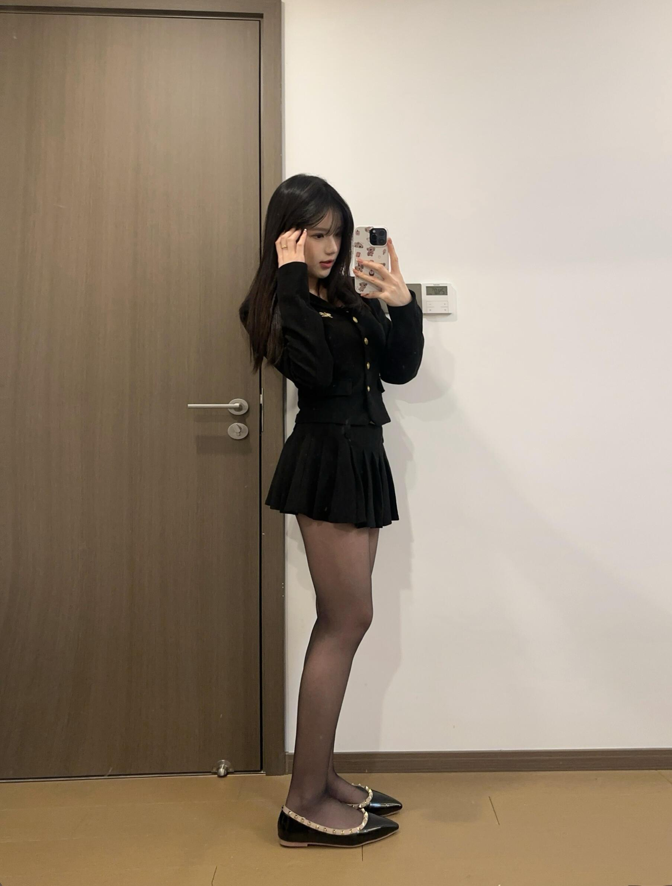
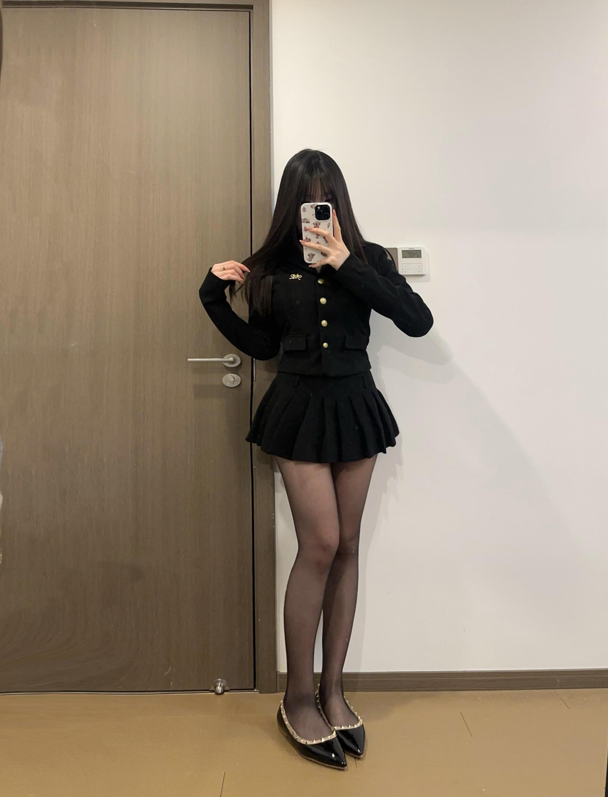
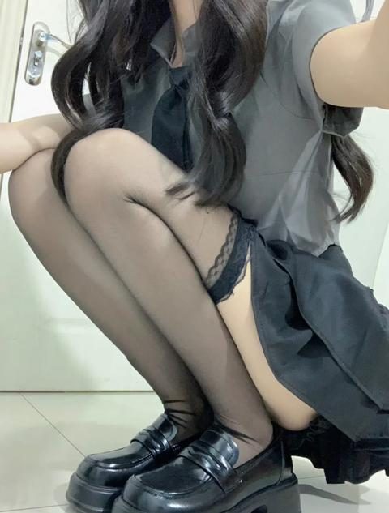

[toc]

# 问题

提问者：**<a href="https://www.zhihu.com/people/76-33-79-35">木头人</a>**
提问时间: 2026-5-22 15:8:19
总回答数: 109
总访问量: 707030

如题~

# 回答

回答者： **<a href="https://www.zhihu.com/people/51-15-40-72">喵喵咪呀</a>**
回答时间: 2026-8-10 14:35:2
点赞总数: 84
评论总数: 14
收藏总数: 65
喜欢总数：8

其实算下来还好吧，只要不是破了，勾丝了，清洗后接着穿就好。并不像很多人说的穿了就扔，哪有那么土豪。

一年的话，起码七八十双还是有的，没去算过，大概取这个数吧。价格不一定，贵的便宜的都有买。

  

  

  

原文地址：[(喵喵咪呀)一个爱穿丝袜的女生，一年大概要买多少双丝袜，花销多少？](https://www.zhihu.com/question/2041173557514876181/answer/2070156213061473505) 

# 评论

1. <a href="https://www.zhihu.com/people/hao-ming-xian-sheng-75-4">xin9</a> (<small title="湖北">2026-8-11 9:20:52</small>): 每天都在买买买
 

   - <a href="https://www.zhihu.com/people/monsters-3-61">Monsters</a> (<small title="浙江">2026-8-11 11:11:19</small>): 美死了
2. <a href="https://www.zhihu.com/people/zhi-zhi-zhi-82">郅知之</a> (<small title="山东">2026-8-10 14:43:1</small>): 一年365天，365/70=5.2，你这啥脚这么废袜子？
   - <a href="https://www.zhihu.com/people/luo-yan-heng-44">衍珩</a> (<small title="广东">2026-8-11 10:12:35</small>): 穿过了也可以卖的
3. <a href="https://www.zhihu.com/people/qian-zhao-shang-di-qu-liu-lang">牵着上帝去流浪</a> (<small title="安徽">2026-8-10 17:16:17</small>): 身材真好［思考］
   - **喵喵咪呀** (<small title="四川">2026-8-10 20:52:9</small>): ［感谢］
4. <a href="https://www.zhihu.com/people/a-tian-40-36-9">阿添</a> (<small title="广东">2026-8-11 10:11:55</small>): 想看车厘子
 

5. <a href="https://www.zhihu.com/people/wu-lu-wu-lu-87">solmh</a> (<small title="河北">2026-8-11 10:8:52</small>): 菩萨［爱］
6. <a href="https://www.zhihu.com/people/lao-hu-57-97">老虎</a> (<small title="江苏">2026-8-11 6:17:26</small>): 露脸又露腿，顺风还顺水
7. <a href="https://www.zhihu.com/people/zhang-ze-tian-63-58">Justllike</a> (<small title="河南">2026-8-11 7:7:58</small>): 不是p的图的话是身材确实挺好，另外想问下，你这个丝袜是什么厚度的？或者哪个品牌的？
8. <a href="https://www.zhihu.com/people/10-41-96-94-93">新的开始就是现在</a> (<small title="山西">2026-8-10 14:51:48</small>): 亲亲，这边可以以旧换新哦？
9. <a href="https://www.zhihu.com/people/62-11-8-60-56">陈峰</a> (<small title="浙江">2026-8-10 20:7:46</small>): 身材真好［思考］
   - **喵喵咪呀** (<small title="四川">2026-8-10 20:51:54</small>): ［感谢］谢谢
10. <a href="https://www.zhihu.com/people/shang-xuan-63-18">上玄</a> (<small title="北京">2026-8-11 15:35:8</small>): 大腿根子太粗

=[评论](./attachments/comments.json)

