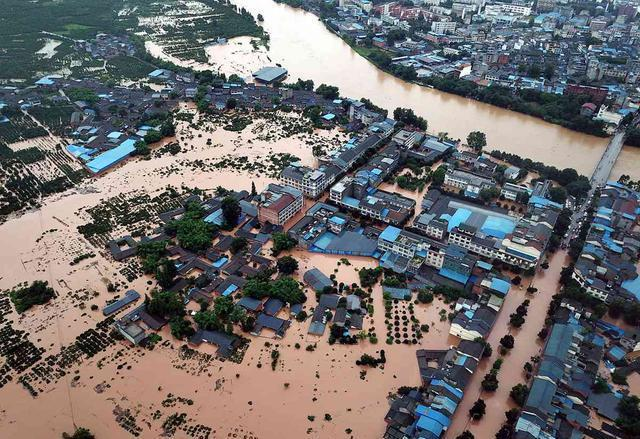
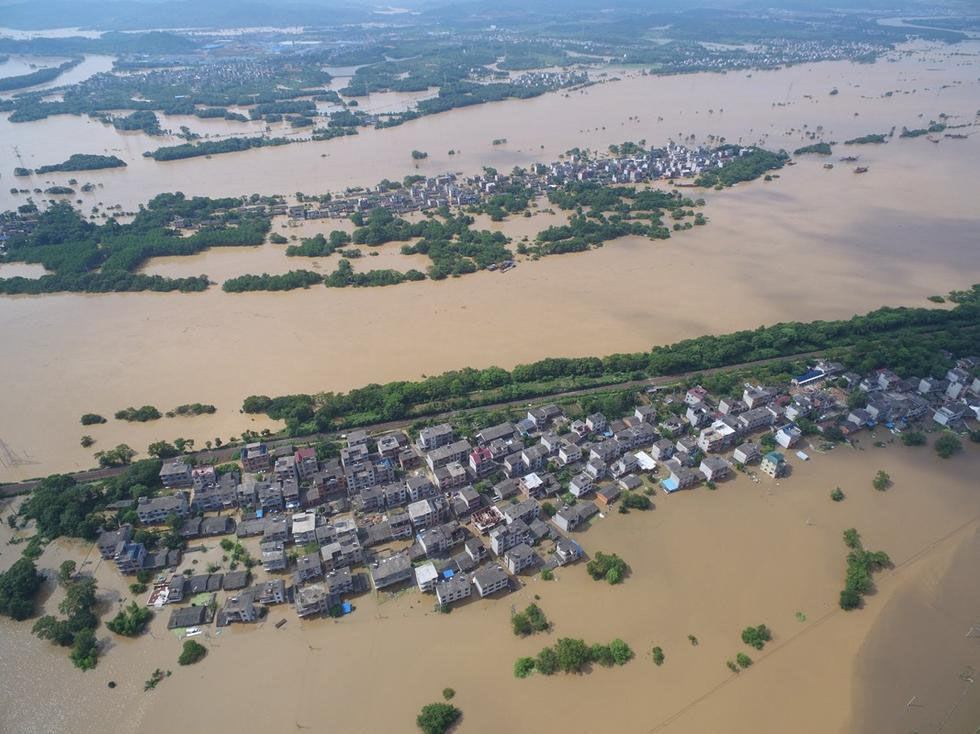
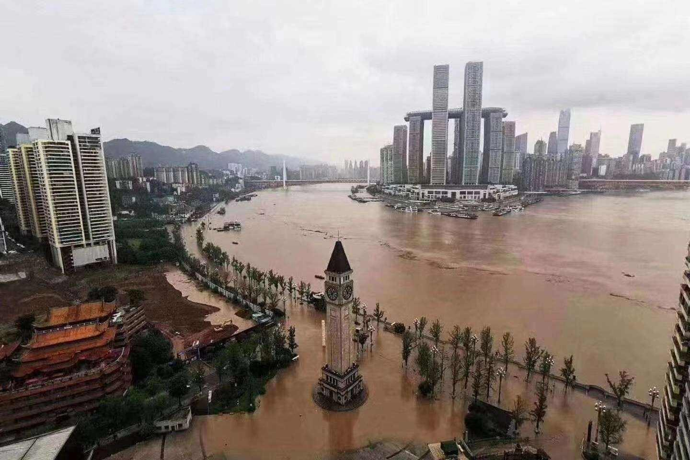
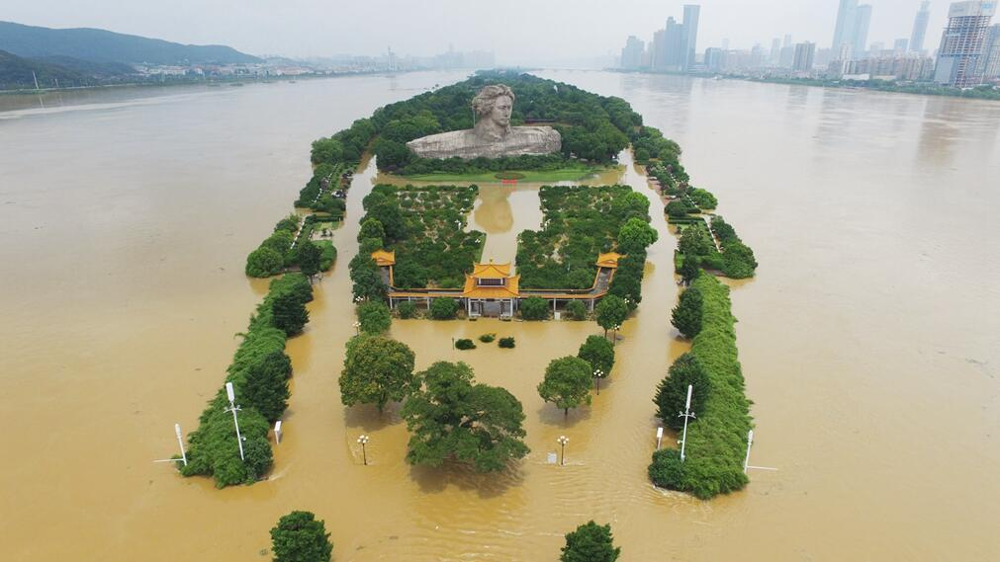
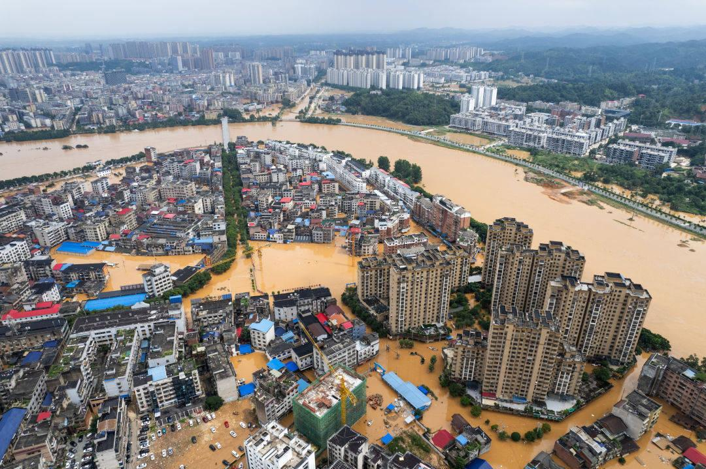

[toc]

# 问题

提问者：**<a href="https://www.zhihu.com/people/deng-ye-29-49">上帝只上晚班</a>**
提问时间: 2024-7-23 17:58:8
总回答数: 2050
总访问量: 46141413

# 回答

回答者： **<a href="https://www.zhihu.com/people/slixwe">埃迪卡拉</a>**
回答时间: 2026-8-9 14:25:46
点赞总数: 2308
评论总数: 170
收藏总数: 622
喜欢总数：278

1、尼罗河，不用治，真正的母亲河，这条河但凡不温顺，埃及一亿人都得冲进地中海喂鱼。水土流失？两边都是沙漠！这都稳定，神奇。尼罗河从地理角度看实在太危险，但是架不住这河的情绪也太稳定了，知道下游没水土每年还从上游冲点淤泥下来，简直丢了河的脸。

2、美索不达米亚，奶与蜜之地，不用治，也没钱治。这片古代就战乱不断，人口没起来（萨达姆时期才从1300万增加到2400万，现在4700万），后续又通过贸易维持了生计，所以开荒没那么严重，不然也差不多。

3、恒河，雅鲁藏布江过了大拐弯后就平缓了，不用治，就算漂着尸体，那也是母亲河的馈赠，印度人生死看淡，能忍，汛期死不少人跟没事一样，可能是都很会游泳，觉得游不过河那是自己的问题。

4、多瑙河，德国佬奥地利人给你治的明明白白的，好好提供航运吧你

5、塞纳河，法国人的母亲河，很温顺，巴黎岛靠着这条河威压欧陆

法国和德国都是一年一熟，不太需要挖主干道，靠着融雪和降雨就够了，河的作用主要是航运。

6、 **荷兰，莱茵河和其他支流，人类治河治海的巅峰，土地几乎都是填海填出来的，一个不小心，全国泡水里了。** 

 **7、威尼斯，同上，治河双雄，水城威尼斯** 

8、第聂伯河和伏尔加河，斯拉夫人的母亲河，冬天结冰的河其实都好治，黑龙江同理，倒不是有多温顺，而是人相对少，而且粮产不太靠河流，融雪灌溉都够了。

9、密西西比河和长江、珠江、澜沧江，治不了，等死吧。

什么？工业革命啦？你早说啊，密西西比河流量最大的，但是，大人，工业革命啦！超大农场，几百公里内人都没一个，你淹我啊，我开车就跑了。

水来人跑，就是最好的治水方式，工业革命后就可以这么玩。

 **长江、珠江主要粮产区不在主干道上，支流和湖泊提供灌溉，不用冒险挖主干道，主要城市也在平缓区，而且降雨丰富。** 

 **挖主干道，水比田高，水才会流动，全赌河道的土坡扛的住汛期，能不危险么，湖就不怕，相对可以动态调节。** 

 **同样水量在河道抬升一米，在湖岸顶多抬升0.1米（甚至一厘米），河堤压力差太多了，古代的鄱阳湖、洞庭湖、太湖千里烟波，就是最好的抗汛阀。** 

澜沧江没仔细研究，应该也差不多，而且早期文明发展的慢，开荒少。

 **10、亚马逊河，这个真治不了，鳄鱼来了都得淹死，想治水，你有几个鳃啊？** 

  

所以黄河的问题是什么呢？是农耕区太靠近主干道了，密集的农民村庄一遇到洪水，迁都迁不了，而且粮食就是命，能跑很多也舍不得跑，人家美国农民如果看到发大水，立刻开着吉普车就跑了，今年收成不要，命还在，黄河两岸的农民要是丢了收成，就算不被征粮逼死，也得饿死。

 **这才是黄河治河最困难的地方，古代农耕经济全部压在河灌溉农田产量这个死循环上，水一退，立刻回迁继续生产，人家法国、德国可以退到离主干远的支流去，可以靠支流和融雪（一年一熟）。美国更是根本不碰危险的主干道。而黄河被征粮压着一轮轮回来这种最危险的地方扣粮食，跟老天爷抢。** 

 **封建王朝要人口，要兵员，就全靠这条河，河讯死人算什么？水土流失算什么？没兵没粮王朝就要覆灭。** 

不年年治能怎么办？

年年治年年过渡开垦，水土都流失完，河讯就越来越严重，谁在乎长远发展？

这种早期农耕发源地，过渡开荒是没办法的事情，越开荒就越要治河，越治河就越开荒，植被砍光水土流失就越危险。

这种事情没人敢踩刹车也没人能踩刹车，讲长远发展就是置眼前利益不顾。讲人与自然共生就是不顾人命。

过度索取大自然，总得支付点代价，这是极其无奈的事情，无解。

  

原文地址：[(埃迪卡拉)为什么中国年年重复防汛，而欧美国家几乎没有防汛的概念？](https://www.zhihu.com/question/662387644/answer/2069791491254392682) 

# 评论

1. <a href="https://www.zhihu.com/people/zhao-zhi-nan-86">清平乐</a> (<small title="北京">2026-8-9 14:42:48</small>): 瑙鲁河是多瑙河或者莱茵河的小名?
   - **埃迪卡拉** (<small title="广东">2026-8-9 14:49:38</small>): 多瑙河，写错，手写打字，感谢提醒
   - <a href="https://www.zhihu.com/people/yue-gong-8-1">岳工</a> (<small title="回复于 2026-8-9 20:38:48/天津"> ✉️:埃迪卡拉</small>): 荷兰也不在多瑙河流域啊，流过荷兰的是莱茵河
   - **埃迪卡拉** (<small title="回复于 2026-8-9 20:44:8/广东"> ✉️:岳工</small>): 感谢指正［握手］
   - <a href="https://www.zhihu.com/people/tang-liang-45-87">墙外行人</a> (<small title="上海">2026-8-10 1:8:8</small>): 瑙鲁甚至整个国家都没有河，只有一个咸水湖
   - <a href="https://www.zhihu.com/people/54-90-49-90">连三月</a> (<small title="广东">2026-8-10 17:33:6</small>): 笑死［飙泪笑］我想着瑙鲁鼻屎大的国家哪来的河
2. <a href="https://www.zhihu.com/people/jin-sui-99">引力透镜</a> (<small title="日本">2026-8-9 20:8:56</small>): 中华民族的一切政治经济哲学都是围绕解决农业和水利搭建起来的
   - <a href="https://www.zhihu.com/people/barry-60-35">barry</a> (<small title="浙江">2026-8-11 9:17:20</small>): 太对了，治国的底色也可以从对河流的治理能看的出来
   - <a href="https://www.zhihu.com/people/93-22-3-57-81">前锁后塞的小狼狗</a> (<small title="广东">2026-8-11 11:58:21</small>): 所以必须用剑为犁获取土地
3. <a href="https://www.zhihu.com/people/69-17-65-6">芝芝</a> (<small title="天津">2026-8-9 20:37:49</small>): 自然状态下的黄河，由于流经黄土高原，自带泥沙，会在华北平原频繁改道，整个华北平原就是黄河泥沙淤积出来的，大平原要住人种地，必须把河道固定下来，难度堪比束缚巨龙，但没办法必须要做，除非以后粮食由工厂生产，不种地了，才能还黄河自由
   - <a href="https://www.zhihu.com/people/wang-shi-73-10">王石</a> (<small title="北京">2026-8-9 20:39:51</small>): 其实只要留足够改道的空间就可以，可惜没法留
   - <a href="https://www.zhihu.com/people/69-17-65-6">芝芝</a> (<small title="回复于 2026-8-9 20:52:2/天津"> ✉️:王石</small>): 没法留，先秦河北就贴着太行山的一长条能住人，剩下从天津以南，整个河北中南部，到山东西部，全是黄河改道形成的乱流湖泊沼泽，基本没啥人住，也就有点狄人部落，所以燕国在北方会和中原失联几百年，因为燕国只能通过太行东侧的平原通道和中原联系，这条路的状态和现在的辽西走廊差不多
   - <a href="https://www.zhihu.com/people/urmyl">urmyl</a> (<small title="回复于 2026-8-11 3:14:22/河南"> ✉️:王石</small>): 你自己看看黄河故道，意思是整个华北平原别住人了呗［尴尬］
   - <a href="https://www.zhihu.com/people/rui-tu-86">战五渣注册建筑师</a> (<small title="回复于 2026-8-11 9:45:10/北京"> ✉️:urmyl</small>): 没事，继续住，三十年河南三十年河北三十年河间三十年河内。
4. <a href="https://www.zhihu.com/people/xiao-chou-81-18">秋木无言</a> (<small title="江苏">2026-8-10 14:32:33</small>): 世界排名前几的大河，长江黄河和人类聚居地重合度最高，其他的要么流量小不用治，要么人烟稀少不值得治，还有个亚马逊河（湖），这个得等三体星人来了才能治
   - <a href="https://www.zhihu.com/people/chen-hou-zhu-43">陈后主</a> (<small title="江苏">2026-8-10 22:47:43</small>): 更正：亚马逊海
   - <a href="https://www.zhihu.com/people/feng-shuang-wu-shang">风霜</a> (<small title="英国">2026-8-11 1:27:39</small>): 重合度最高的其实是尼罗河，埃及95%的人口都在尼罗河沿岸和三角洲地区，从史前时代就开始滋养埃及人一直到今天，真正的母亲河
   - <a href="https://www.zhihu.com/people/lin-bo-xue-75">米尔洛亚</a> (<small title="回复于 2026-8-11 8:54:11/辽宁"> ✉️:风霜</small>): 不能忽视阿斯旺水坝。
   - <a href="https://www.zhihu.com/people/shi-ren-25-38">实人</a> (<small title="回复于 2026-8-11 9:17:58/福建"> ✉️:风霜</small>): 河北其实也是黄河的三角洲。
   - <a href="https://www.zhihu.com/people/feng-shuang-wu-shang">风霜</a> (<small title="回复于 2026-8-11 9:20:41/英国"> ✉️:实人</small>): 但人口集中度没那么高，埃及是真的绝大部分人都生活在尼罗河两岸的狭长地带里，当然这和也有沙漠有关系
5. <a href="https://www.zhihu.com/people/luo-yi-bu-95">北落师门</a> (<small title="江西">2026-8-9 21:34:33</small>): 尼罗河真的是梦中情河
   - <a href="https://www.zhihu.com/people/36-5-12-47-30">大帝</a> (<small title="浙江">2026-8-10 2:2:29</small>): 流量太小了
   - <a href="https://www.zhihu.com/people/chen-yan-10-5">逆袭的奥尼尔</a> (<small title="回复于 2026-8-10 2:44:51/浙江"> ✉️:大帝</small>): 比黄河多了，虽然跟长江没法比。
   - <a href="https://www.zhihu.com/people/huang-zhong-qiang-43">DreamingH</a> (<small title="湖南">2026-8-10 3:31:19</small>): 埃及核心问题是没办法扩张，没办法输出影响力，周围都是沙漠
   - <a href="https://www.zhihu.com/people/li-wu-63-32">火火兔的程序之路</a> (<small title="江西">2026-8-10 20:36:29</small>): 想多了！楼主写什么！就信什么［飙泪笑］［飙泪笑］
   - <a href="https://www.zhihu.com/people/wen-rou-de-di-ren">温柔的敌人</a> (<small title="回复于 2026-8-11 5:54:45/广东"> ✉️:火火兔的程序之路</small>): 那你写啊［飙泪笑］不会？
   - <a href="https://www.zhihu.com/people/liu-che-te">刘车特</a> (<small title="河南">2026-8-11 10:5:25</small>): 尼罗河现在的安全，是因为阿斯旺高水坝建成之后，产生的纳赛尔水库有巨大的库容，可以直接容纳尼罗河2年的总流量。
   - <a href="https://www.zhihu.com/people/wen-rou-de-di-ren">温柔的敌人</a> (<small title="回复于 2026-8-11 10:23:31/广东"> ✉️:火火兔的程序之路</small>): 不会就不会［飙泪笑］还有发的什么就被删了
6. <a href="https://www.zhihu.com/people/tian-kong-73-55">天空</a> (<small title="河北">2026-8-10 8:30:19</small>): 尼罗河上游是个大湖，他不是自己下雨或是山脉形成的河。所以比较平稳。
7. <a href="https://www.zhihu.com/people/17-57-84-33-67">天下大同</a> (<small title="湖北">2026-8-9 22:43:44</small>): 从四亿人，到八亿人，仅仅用了二十几年！
   - <a href="https://www.zhihu.com/people/wang-zi-niu-nai-83-23">唐氏筛查中心主任</a> (<small title="广东">2026-8-9 23:16:43</small>): 是的，太能生了，疯狂繁殖
   - <a href="https://www.zhihu.com/people/ultra-18-64">ultra</a> (<small title="回复于 2026-8-9 23:45:40/浙江"> ✉️:唐氏筛查中心主任</small>): 这20年世界人口也翻了一倍了
   - <a href="https://www.zhihu.com/people/yang-guang-53-77">阳光</a> (<small title="回复于 2026-8-10 2:47:6/浙江"> ✉️:ultra</small>): 战后婴儿潮，这边还落后全世界平均增长。
   - <a href="https://www.zhihu.com/people/liu-kai-ming-29-94">于谦罪在千秋</a> (<small title="回复于 2026-8-10 3:20:47/山东"> ✉️:唐氏筛查中心主任</small>): 生十个活三个，你敢生一两个你试试？
   - <a href="https://www.zhihu.com/people/tang-yan-76-19">夏天融化的糖</a> (<small title="回复于 2026-8-10 18:47:41/湖南"> ✉️:于谦罪在千秋</small>): 那代人还活着你就敢造谣是吧？
   - <a href="https://www.zhihu.com/people/liu-kai-ming-29-94">于谦罪在千秋</a> (<small title="回复于 2026-8-10 18:57:10/山东"> ✉️:夏天融化的糖</small>): 造谣？  
 
我爷爷1920年出生，兄弟姐妹哥八个，活到建国的就两个，他害怕重蹈覆辙，和我奶奶生了六个，就这样，活到21世纪的也只有五个。  
 
  
 
就建国前那个存活率，你只有多生才能流传后代下来，你猜我老爷爷只生一个的话，后面还会有我吗？
   - <a href="https://www.zhihu.com/people/li-jun-84-56">李军</a> (<small title="回复于 2026-8-10 19:30:9/广西"> ✉️:于谦罪在千秋</small>): 你认可“从四亿人，到八亿人，仅仅用了二十几年！”这个观点吗？如果你认可的话，“生十个活三个”这样的成活率，人口能在20年翻倍？
   - <a href="https://www.zhihu.com/people/xu-shi-geng">晓美焰</a> (<small title="回复于 2026-8-10 22:44:18/江苏"> ✉️:李军</small>): 是的，真可以。
 
你知道，建国前，婴儿夭折率多高吗？
 
把一两岁之前就死亡的孩子都去掉，才是你“印象”中的存活率。
   - <a href="https://www.zhihu.com/people/zhifxlkmb8">zhiFXLkmb8</a> (<small title="浙江">2026-8-11 3:14:6</small>): 从高产作物普及到发明氮肥花了几百年
   - <a href="https://www.zhihu.com/people/ji-feng-46-67">祭锋</a> (<small title="回复于 2026-8-11 7:9:59/广西"> ✉️:李军</small>): 人口翻倍和成活率有什么关系  
 
活了四个就翻倍了管他生了多少个
   - <a href="https://www.zhihu.com/people/ji-feng-46-67">祭锋</a> (<small title="回复于 2026-8-11 7:11:33/广西"> ✉️:夏天融化的糖</small>): 生10活三确实夸张 了  
 
生10活7差不多
   - <a href="https://www.zhihu.com/people/38-17-24-73-43">烧水壶</a> (<small title="回复于 2026-8-11 9:48:27/陕西"> ✉️:晓美焰</small>): 在上个世纪，关中一带的农村，很多村子里都有一个地方叫“死娃坡”或者叫“死娃沟”， 大概从名字就能听出是用来做什么的
   - <a href="https://www.zhihu.com/people/cheeler">Shokaku</a> (<small title="江苏">2026-8-11 10:19:15</small>): 中国第一次人口爆炸，是清朝中期，主要是土豆玉米的功劳，第二次人口爆炸就是建国后，主要是毛主席和抗生素的功劳。
   - <a href="https://www.zhihu.com/people/li-jun-84-56">李军</a> (<small title="回复于 2026-8-11 10:48:0/广西"> ✉️:祭锋</small>): 我有点奇怪，“生十个活三个”不是成活率是什么？
   - <a href="https://www.zhihu.com/people/li-jun-84-56">李军</a> (<small title="回复于 2026-8-11 11:1:5/广西"> ✉️:祭锋</small>): 另外，楼主给出了一个“二十几年”的年限，做翻倍的估算，你不用成活率这个主要指标做估算，你用什么做估算？——得出“人口翻倍和成活率有什么关系”这个结论，你是用什么指标进行估算的？
   - <a href="https://www.zhihu.com/people/yiren-zui-19">大醉</a> (<small title="回复于 2026-8-11 11:55:36/浙江"> ✉️:祭锋</small>): 你这个算法，你数学老师听了得气死［捂脸］
   - <a href="https://www.zhihu.com/people/59-16-10-20">荦杰</a> (<small title="回复于 2026-8-11 13:35:30/四川"> ✉️:于谦罪在千秋</small>): 夸张了，我爷爷他们那一辈13个活了9个
8. <a href="https://www.zhihu.com/people/es7007">C40分割大师</a> (<small title="广东">2026-8-9 18:26:31</small>): 战国时期齐国，魏国和赵国的以黄河为边境各自退后25里修大堤。就两边一共给黄河留了50里的泛滥距离。不用怎么治都没事儿。后来人口增加，你都贴到黄河边上修房子，种地了。稍微一涨水，那肯定是灾民无数。
   - <a href="https://www.zhihu.com/people/80-18-5-70">疯言疯语</a> (<small title="河南">2026-8-9 23:53:46</small>): 郑州黄河大桥，长度好几公里，平时水面只有几百米宽，河床上都是开垦种庄稼的，国家睁一只眼闭一只眼。
   - <a href="https://www.zhihu.com/people/es7007">C40分割大师</a> (<small title="回复于 2026-8-10 1:3:35/广东"> ✉️:疯言疯语</small>): 发大水的时候，老头老太太去抢救庄稼被困难，不知道要死多少救援队。
   - <a href="https://www.zhihu.com/people/guo-jing-9-56">不圆的拖拉机轮胎</a> (<small title="回复于 2026-8-10 8:54:36/河北"> ✉️:疯言疯语</small>): 不发水，白捡啊
   - <a href="https://www.zhihu.com/people/vincent-li-56-94">实名用户</a> (<small title="回复于 2026-8-10 10:5:9/广东"> ✉️:C40分割大师</small>): 有一说一救援要以自身安全为前提没毛病
9. <a href="https://www.zhihu.com/people/akizuki-40">若草山</a> (<small title="江苏">2026-8-10 19:10:56</small>): 恒河三角洲那支离破碎的地形再加上孟加拉国的人口密度，一看就不少死人
   - <a href="https://www.zhihu.com/people/zhuang-ming-hao-86">庄明皓</a> (<small title="广东">2026-8-11 6:44:12</small>): ［知乎益蜂］［知乎益蜂］
10. <a href="https://www.zhihu.com/people/xue-ying-yu-de-ri-yu-sheng">思必可Lorde</a> (<small title="江苏">2026-8-11 9:6:31</small>): 亚马逊河确实是没法治，别说鳄鱼了，汛期鱼都要淹死，腐殖质冲到水里腐烂分解会消耗氧气，水里还会充满泥沙以及酸性物质。
11. <a href="https://www.zhihu.com/people/huang-zhong-qiang-43">DreamingH</a> (<small title="湖南">2026-8-10 3:27:5</small>): 尼罗河并不温顺不然埃及和苏丹也不折腾大坝
    - <a href="https://www.zhihu.com/people/28-40-4-79-1">棒棒</a> (<small title="浙江">2026-8-10 4:33:25</small>): 你是真不懂还是？苏丹要水，埃及也要水。都在锁水，［捂嘴］还不够温顺的
    - <a href="https://www.zhihu.com/people/markoff">markoff</a> (<small title="回复于 2026-8-10 9:29:48/安徽"> ✉️:棒棒</small>): 阿斯旺大坝修筑完成前埃及尼罗河沿岸每隔几年的雨季都要遭一次洪水
    - <a href="https://www.zhihu.com/people/huang-zhong-qiang-43">DreamingH</a> (<small title="回复于 2026-8-10 10:10:2/湖南"> ✉️:棒棒</small>): 根本原因是埃及苏丹分裂了，不是尼罗河问题
    - <a href="https://www.zhihu.com/people/xing-lian-hai-jun-lie-zhu-ge-le-hao">不关凯露酱的事哦</a> (<small title="回复于 2026-8-11 14:19:43/安徽"> ✉️:markoff</small>): 古埃及就是靠这些洪水兴盛起来的，和长江黄河的洪水比起来还是好多了
12. <a href="https://www.zhihu.com/people/dong-dong-30-24-58">东东</a> (<small title="河北">2026-8-9 23:13:15</small>): 防汛和治理，分为两件事来聊吧。其实只要心够大，啥都不是事。  
 
德国也有小镇泡在水里的新闻。他们觉得频率低，能接受。那就不是事儿了。  
 
法国塞纳河的事，就是奥运游泳比赛了。说大不大，说小不小。就看心态了。
13. <a href="https://www.zhihu.com/people/yan383499880">一胖毁所有</a> (<small title="黑龙江">2026-8-11 8:35:17</small>): 一说黄河就不得不夸开封人民，淹了就建新城。建好了接着被淹。主打一个认准地方就是不跑［大哭］
 
黄河七擒开封都没收服河南人民［捂脸］
14. <a href="https://www.zhihu.com/people/bian-yu-95-2">边雨</a> (<small title="山东">2026-8-10 8:10:10</small>): 可是河流并不是只有你说的这几条，中国大大小小的河流几万条，而且防汛并不是只顾及防河流溃提，而是重点避免或者减轻强降雨造成的损失［大笑］
15. <a href="https://www.zhihu.com/people/ke-neng-shi-ta-12">可能是他</a> (<small title="湖北">2026-8-9 22:37:36</small>): 复活节岛
16. <a href="https://www.zhihu.com/people/wei-wei-de-mao-75">烈然</a> (<small title="江苏">2026-8-9 18:5:4</small>): 可是雅鲁藏布江应该是在孟加拉国境内注入恒河
    - **埃迪卡拉** (<small title="广东">2026-8-9 19:10:21</small>): 多瑙河也流经很多国家，没办法一个个举例，随便写一下具有代表性的几个，算是一种省略写法吧。
    - <a href="https://www.zhihu.com/people/zhen-zheng-ye-man-ren">真正野蛮人</a> (<small title="上海">2026-8-9 20:1:36</small>): 雅鲁藏布江拐弯后应该叫拉普拉塔河，跟恒河不是一条吧
    - **埃迪卡拉** (<small title="回复于 2026-8-9 20:56:19/广东"> ✉️:真正野蛮人</small>): 流经多国的算一个就可以了，不然澜沧江也得找越南柬埔寨名字。
17. <a href="https://www.zhihu.com/people/jing-luo-kuang-xi-1453">精罗狂喜1453</a> (<small title="四川">2026-8-11 0:18:33</small>): 还有个刚果河，河道100多200米深，几乎全是石头，想改道也改不动［飙泪笑］
18. <a href="https://www.zhihu.com/people/you-you-die-8">知难行易</a> (<small title="重庆">2026-8-10 8:19:54</small>): 有空看点国外新闻［思考］
19. <a href="https://www.zhihu.com/people/jia-jia-58-70">嘉嘉</a> (<small title="广东">2026-8-9 14:40:14</small>): 跟过度有什么联系，你说的其他河流的地方有人吗？还有不分时间一竿子打死，菜静都拜你为师
    - **埃迪卡拉** (<small title="广东">2026-8-9 14:42:4</small>): 对，不过度，外国人太坏了［思考］
    - <a href="https://www.zhihu.com/people/ying-su-hua-san">嘴很毒</a> (<small title="新疆">2026-8-9 17:46:15</small>): ［好奇］其他地方没人，就你这有人，这不是过度啥是过度？
    - <a href="https://www.zhihu.com/people/jiu-dian-wu-shi-qi-66">九点五十七</a> (<small title="海南">2026-8-9 23:16:54</small>): 人家都知道有危险会躲？就你还回来？不是过度是什么？
20. <a href="https://www.zhihu.com/people/ba-mian-lai-feng-9144">壬寅杏一三</a> (<small title="河南">2026-8-10 8:29:5</small>): 现在为啥治好了？
    - <a href="https://www.zhihu.com/people/vkdrz7">小看山vKDrZ7</a> (<small title="河南">2026-8-10 18:13:32</small>): 说治好也就这二三十年…82年黄河水灾，半个新乡都淹了，98年松花江、长江、珠江…
    - <a href="https://www.zhihu.com/people/45siiu">ZZXXQQ</a> (<small title="山西">2026-8-11 2:29:20</small>): 治好了还需要防洪吗［为难］
21. <a href="https://www.zhihu.com/people/chen-bo-yu-86">陈柏雨</a> (<small title="四川">2026-8-10 21:6:40</small>): 不就是想否认我们华夏民族治水的丰功伟绩么 纯舆论战的文章…
22. <a href="https://www.zhihu.com/people/li-bi-duo-ren">可惜不是沙琪玛</a> (<small title="广西">2026-8-9 23:9:18</small>): 一名西方学者说过，政治的治是治水的治［doge］
    - <a href="https://www.zhihu.com/people/xie-kai-72-89">叶开</a> (<small title="加拿大">2026-8-10 2:2:38</small>): 中文还怪好的［捂嘴］
    - <a href="https://www.zhihu.com/people/wangyangyang-18-97">wangyangyang</a> (<small title="回复于 2026-8-10 7:33:45/黑龙江"> ✉️:叶开</small>): 原谅我笑出了声
    - <a href="https://www.zhihu.com/people/yue-ru-gou-24">月如钩</a> (<small title="安徽">2026-8-10 8:1:51</small>): 你有一个姓科的朋友吗？
23. <a href="https://www.zhihu.com/people/michelle-93-62-71">MDAmerican</a> (<small title="北京">2026-8-11 9:50:11</small>): 中国特别奇怪地大河都是东西向而非南北向，导致黄河流域的部落只能称为文化而非古文明。靠谱的朝代都在努力修南北大运河。漕运才是真正母亲河。
    - <a href="https://www.zhihu.com/people/michelle-93-62-71">MDAmerican</a> (<small title="回复于 2026-8-11 11:46:11/北京"> ✉️:祭酒</small>): 当然是多元起源。
    - <a href="https://www.zhihu.com/people/gui-guai-wu-shuang">祭酒</a> (<small title="四川">2026-8-11 11:41:46</small>): 华夏文明是什么？
24. <a href="https://www.zhihu.com/people/zzz-38-29-74">zzz</a> (<small title="陕西">2026-8-9 21:54:41</small>): 亚马逊河这么猛？你鳄鱼叔叔有点质疑［doge］
    - <a href="https://www.zhihu.com/people/7lddbh">圣遗物牢A的酸奶</a> (<small title="广东">2026-8-9 23:18:25</small>): 我看鳄鱼也就是惨死在河马屎尿坑了，亚马逊不至于淹死
25. <a href="https://www.zhihu.com/people/da-shi-ji-chang-lao-85">大师级场老</a> (<small title="陕西">2026-8-11 15:14:27</small>): 埃及不上有阿斯旺水坝吗？
26. <a href="https://www.zhihu.com/people/aztaka-73">Aztaka</a> (<small title="日本">2026-8-11 13:46:0</small>): 黄河现在的主要问题是没水。要不是中央管的严，黄河能断流365天/年。
27. <a href="https://www.zhihu.com/people/47-38-46-15-47">神经蛙</a> (<small title="山西">2026-8-11 13:22:50</small>): 刷到保底了，总算是看到一个正解了，不容易啊。终于不是赢赢赢了，都给我看恶心了。[@知乎直答](http://www.zhihu.com/people/f3bce7aa022240e25f12aec9a9b70363)
    - <a href="https://www.zhihu.com/people/zhi-hu-zhi-da-41">知乎直答</a> (<small title="看山的工位">2026-8-11 13:23:8</small>): 这篇把不同地区的地理条件、人口经济差异讲得很清楚，抛开具体情况乱下结论的二极管发言看多了确实腻，能说透本质的分析确实少见。
28. <a href="https://www.zhihu.com/people/davidnofat">卖雪糕的橘猫</a> (<small title="北京">2026-8-11 8:41:16</small>): 哪位高人来细说几个腮都治不了亚马逊河的事儿？是因为挨着大西洋吗
29. <a href="https://www.zhihu.com/people/404-73-25">404</a> (<small title="四川">2026-8-11 15:39:35</small>): 只看河流不看气候、地形等等那些？我国是季风气候，欧洲那边啥海洋性气候，地中海气候降水跟我们能比吗，
30. <a href="https://www.zhihu.com/people/gao-ban-sui-nai-guo-33-16">高坂穗乃果</a> (<small title="贵州">2026-8-11 14:6:25</small>): 话说能不能在黄河不改道的地方挖几条运河，分担一下流量，让它不频繁改道？［捂脸］
    - **埃迪卡拉** (<small title="广东">2026-8-11 14:12:0</small>): 下游要种地，你抢他们水说你在救他们，看他们锄不锄你。只能顺其自然，都是历史人文因素交织的结果，上游治理水土流失还能多挺一段时间，下游怎么治都没用，甚至下游巴不得继续冲积造平原能继续种。
    - <a href="https://www.zhihu.com/people/gao-ban-sui-nai-guo-33-16">高坂穗乃果</a> (<small title="回复于 2026-8-11 14:18:24/贵州"> ✉️:埃迪卡拉</small>): 黄河：那好，加大力度［惊喜］。  
 
  
 
结果发大水淹死人又要说天地不仁，以万物为刍狗了，又是狂暴的母亲河了。  
 
  
 
黄河：你们的要求很奇怪我无法满足
    - <a href="https://www.zhihu.com/people/xing-lian-hai-jun-lie-zhu-ge-le-hao">不关凯露酱的事哦</a> (<small title="安徽">2026-8-11 14:21:13</small>): 现代有南水北调的话可以，但古代不行
31. <a href="https://www.zhihu.com/people/xiang-zhi-xiang-jian">相知相见</a> (<small title="浙江">2026-8-11 6:9:29</small>): 不是啊 王景治河不是用了1千年吗 但凡宋朝脑子不抽 我估计还能继续用个几百年
32. <a href="https://www.zhihu.com/people/denglinliu">RomanticOnly</a> (<small title="加拿大">2026-8-11 4:20:26</small>): 属于农耕时期的凯恩斯主义了。［飙泪笑］
33. <a href="https://www.zhihu.com/people/52-74-94-72-10">小区综合服务</a> (<small title="浙江">2026-8-11 13:59:14</small>): 西欧河流航运和灌溉都被压榨干净了吧，温带海洋气候蒸发量少，比我们季风气候好治理。
34. <a href="https://www.zhihu.com/people/85-28-14-46">勤奋</a> (<small title="山东">2026-8-11 10:2:33</small>): 《征粮》
35. <a href="https://www.zhihu.com/people/gong-sun-liao">铁匠铺子</a> (<small title="山东">2026-8-11 14:9:44</small>): 我记得之前在哪看的来着，黄河又到了该改道的时候了。［捂脸］
36. <a href="https://www.zhihu.com/people/xgongx">Poison</a> (<small title="上海">2026-8-11 11:21:55</small>): "觉得游不过河是自己的问题"，这个是一个值得学习的点。
37. <a href="https://www.zhihu.com/people/liu-che-te">刘车特</a> (<small title="河南">2026-8-11 10:21:44</small>): 第一，华北平原太特殊——它几乎可以称为“黄河三角洲”，是黄河（以及淮河、海河）漫流生成的。你不可能完全避开黄河然后在华北平原种地。  
 
  
 
第二，黄河太特殊——它不仅含沙量高（容易产生平原，但也容易形成地上河从而改道），而且，常年平均流量只有650m³/s，只是塞纳河的2倍多，比顿河都小。  
 
但它洪灾的时候，可以飙到22300m³/s（1958年黄委会花园口实测值），甚至36000m³/s（道光23年测算值），这三四十倍的变化，谁也遭不住。塞纳河要是也这么猛，巴黎也和开封一样城摞城了。  
 
当然塞纳河发源地海拔只有四五百米，肯定不可能有这么大的水。
    - <a href="https://www.zhihu.com/people/liu-che-te">刘车特</a> (<small title="回复于 2026-8-11 11:21:56/河南"> ✉️:埃迪卡拉</small>): 是。另外长江本身有河道约束（两岸多山），且本身流量巨大，即使推算出来的历史峰值，也不过是平时的三倍
    - **埃迪卡拉** (<small title="广东">2026-8-11 10:36:25</small>): “水量在河道抬升一米，在湖岸顶多抬升0.1米”，水量变化我在长江那里有讲，古代长江流域也是靠着大湖吸收洪峰。现在几大湖都在填湖造陆（田），湖的基本功能还在，不是太大的汛也能抗住，太大那就没办法了，也会危险。
38. <a href="https://www.zhihu.com/people/yi-pan-xing-xing-bing-gan">一盘星形饼干</a> (<small title="天津">2026-8-11 10:40:31</small>): 虽然但是，雅鲁藏布江下游叫布拉玛普特拉河
39. <a href="https://www.zhihu.com/people/du-jian-98">哈哈乐开怀</a> (<small title="山东">2026-8-11 10:34:29</small>): 黄河主要是悬河
40. <a href="https://www.zhihu.com/people/RouxLemon">钟执</a> (<small title="湖北">2026-8-11 7:56:43</small>): 美索不达米亚现在环境是崩溃了，但是过去还是治水的。阿拔斯哈里发还是美索不达米亚总督时都在努力治河，后来是不行了，战乱太多了
41. <a href="https://www.zhihu.com/people/yao-yuan-cang-qiong-99">遥远苍穹</a> (<small title="山东">2026-8-10 23:49:54</small>): 现在也一样，我经常山东菏泽河南濮阳两地跑，过浮桥的时候能清晰的看见黄河大坝里面挨着滩涂就种着农作物，比如小麦和玉米，就赌一个今年黄河水位不高
42. <a href="https://www.zhihu.com/people/yan-yu-ru-feng-77">言语如风</a> (<small title="江西">2026-8-11 12:30:29</small>): 尼罗河在古代条件下其实也是没法治的，枯水期和洪水期都经常能带走一个王朝\*
43. <a href="https://www.zhihu.com/people/qia-wen-di-xu-69-18">滦岁春</a> (<small title="湖北">2026-8-11 9:39:2</small>): 能不能治一下亚马逊河［doge］
44. <a href="https://www.zhihu.com/people/ngc2237-85">己丑南宫初十</a> (<small title="四川">2026-8-11 13:42:34</small>): 雅鲁藏布江似乎不是恒河的上游
45. <a href="https://www.zhihu.com/people/wu-wei-22-55">吴伟</a> (<small title="山东">2026-8-11 8:36:8</small>): 所以还是澳大利亚省最好，没有这方面的事情，大粮仓大矿场
46. <a href="https://www.zhihu.com/people/wang-hu-suo-yi-82-74">忘乎所以</a> (<small title="安徽">2026-8-11 8:53:55</small>): 看到密西西比河，我就想到了美国版的《我的祖国》［尴尬］
47. <a href="https://www.zhihu.com/people/yi-yi-70-55-84">心花社</a> (<small title="浙江">2026-8-11 12:25:32</small>): 法国和德国都是一年一熟，不太需要挖主干道，靠着融雪和降雨就够了，河的作用主要是航运。
 
  
 
  
 
真的假的？他们不是秋冬季种小麦，夏季种大豆、玉米、水稻之类的？
    - **埃迪卡拉** (<small title="广东">2026-8-11 13:3:13</small>): 德法肯定不种水稻，顶多意大利降雨丰富种点，他们又不缺粮，肯定挑适合气候降水条件的种啊，法国自给率超过300%，多到能倒掉。  
 
  
 
缺粮也可以找美国巴西乌克兰买，真不缺那点粮食搞到要去挖河道。
48. <a href="https://www.zhihu.com/people/jiang-wu-98">江无</a> (<small title="上海">2026-8-10 22:59:8</small>): 其实也不止黄河。三峡之前的鄱阳湖流域也是年年防汛，人口太密集了，必然要年年防汛。舍不得退
49. <a href="https://www.zhihu.com/people/jwzx-62">jwzx</a> (<small title="北京">2026-8-11 9:43:40</small>): 尼罗河另外一个过人之处是它的流向跟风向正好是相反的，简直给古埃及人的航运加了天大的buff
50. <a href="https://www.zhihu.com/people/laozhu-36">laozhu</a> (<small title="北京">2026-8-10 18:50:37</small>): 欧美财产保险相对发达，所以淹不淹的也无所谓
51. <a href="https://www.zhihu.com/people/75-30-96-49-74">林三哥</a> (<small title="宁夏">2026-8-11 9:3:33</small>): 现在日益严峻的防汛问题，根本是逐年扩张的人类活动挤占了原有的河流行洪通道，有些河道或沟道，平时看着一小股水或者根本就是干沟，然后大家就使劲往水边盖，实际上已经位于行洪通道内了，赌了10年没洪水，一场洪水全都推平。所以国家从21年开始河湖清四乱，才算把河道给管住了，但是百姓或者企业不理解，觉得水利部门管的太宽，洪水是个概率事件，什么时候淹到自己家才明白清四乱的重要性。
52. <a href="https://www.zhihu.com/people/helloworld-87-45">momo</a> (<small title="北京">2026-8-11 0:24:34</small>): 哎呀，我已经做得很好了，都是河不行，你得问河［尴尬］
53. <a href="https://www.zhihu.com/people/zui-zui-zui-zui-zui-bang">哇哇呀呀呀</a> (<small title="湖北">2026-8-10 21:16:5</small>): 你这个回答再次证明了华夏人的祖地不仅仅是中国这片地方，而是全世界
54. <a href="https://www.zhihu.com/people/haplinder">haplinder</a> (<small title="四川">2026-8-10 9:33:21</small>): 恰好前几天看b站球局的视频 美国不说 西欧那片地方真的是非常好的地方 几乎没啥洪水暴雨，高热严寒 特别是他提及伦敦比哈尔滨还偏北6个纬度 而我猜测冬季气温很可能济南郑州都比伦敦冷。这跟体现了中国古人奋斗的历史。
55. <a href="https://www.zhihu.com/people/mu-yu-jing-feng">沐雨静风</a> (<small title="北京">2026-8-10 8:45:50</small>): 固态电池技术如果得到突破，工程机械变得廉价，水利和农业将是第一批治理的领域。黄河地上悬河和沿岸水土固化也会同步展开。降水线北移，新疆将会变成基建重点地区。
56. <a href="https://www.zhihu.com/people/dou-bi-64-76">逗逼</a> (<small title="山东">2026-8-10 8:13:42</small>): 多瑙河好像最近快断流了［捂脸］
57. <a href="https://www.zhihu.com/people/mei-hong-fei-39">荣一声</a> (<small title="浙江">2026-8-11 11:25:53</small>): ［赞同］［赞同］［赞同］［赞同］［赞同］［赞同］［赞同］［赞同］［赞同］［赞同］［赞同］［赞同］［赞同］［赞同］［赞同］［赞同］［赞同］［赞同］
58. <a href="https://www.zhihu.com/people/jiang-huai-29-84">江淮</a> (<small title="美国">2026-8-10 1:4:6</small>): 人口太多 人与水争地
59. <a href="https://www.zhihu.com/people/nue-zhe-zhuan-jia-jiao-shou">鲁班七号电脑</a> (<small title="广东">2026-8-10 7:10:25</small>): 古珠江主航道出海口，自己把自己玩没的代表［doge］
60. <a href="https://www.zhihu.com/people/xiaogg-42">xiaogg</a> (<small title="浙江">2026-8-9 19:36:28</small>): 我觉得吧，哪怕是夺了澳大利亚，也会觉得它那个地太硬，全是毛病。
    - <a href="https://www.zhihu.com/people/658shi-bai-du-ming">658是百度名</a> (<small title="陕西">2026-8-9 20:55:39</small>): 本来都是毛病，下南洋的福建人都记录过那地方，然而澳洲北岸确实缺水的厉害，可以看看地理图，全是荒漠，就如今奥克兰那块有淡水有森林，所以只有英国从南美洲到了后才觉得那鬼地方能是殖民地，就这一开始都是把各种社会烂人先丢过去的，印度阿拉伯东大没一个看上那破地方
    - <a href="https://www.zhihu.com/people/658shi-bai-du-ming">658是百度名</a> (<small title="陕西">2026-8-9 20:56:20</small>): 说错了是悉尼，奥克兰跑新西兰去了［捂脸］
    - <a href="https://www.zhihu.com/people/liang-yao-peng-20">希腊奶</a> (<small title="广东">2026-8-9 22:22:5</small>): 事实上你得先有第一次工业革命的成果才能去开发澳大利亚，得有二工的成果才能让澳大利亚发达起来，所以这鬼地方被英国给占着完全是天意
    - <a href="https://www.zhihu.com/people/xiaogg-42">xiaogg</a> (<small title="回复于 2026-8-10 8:11:18/浙江"> ✉️:658是百度名</small>): 算了吧，没本事的，不是怨天就是怨地。金子在手里也当石头
61. <a href="https://www.zhihu.com/people/xuan-you-39">玄幽</a> (<small title="四川">2026-8-10 0:26:38</small>): 尼罗河要是不温顺，埃及根本不可能有1亿人。看看亚马逊流域的人口就知道了［吃瓜］
    - <a href="https://www.zhihu.com/people/huang-zhong-qiang-43">DreamingH</a> (<small title="湖南">2026-8-10 3:26:56</small>): 尼罗河并不温顺不然埃及和苏丹也不折腾大坝
    - <a href="https://www.zhihu.com/people/huang-zhong-qiang-43">DreamingH</a> (<small title="湖南">2026-8-10 3:26:14</small>): 同纬度珠江流域也是1.5亿人，尼罗河还更大
62. <a href="https://www.zhihu.com/people/feng-xue-ye-gui-ren-11-82">斟茶兵</a> (<small title="湖北">2026-8-10 8:21:6</small>): 应该是降雨量的问题
63. <a href="https://www.zhihu.com/people/ni-shang-de-piao-yu-57">霓裳de飘羽</a> (<small title="内蒙古">2026-8-10 0:8:56</small>): 黄河滩区禁限种工作各省都在陆续开展中，想查的自然查得到。
64. <a href="https://www.zhihu.com/people/lin-zhi-peng-17">林志鹏</a> (<small title="上海">2026-8-10 8:48:53</small>): 我之前看过黄河历史上的改道记录，整个一被人按住的水龙头，蛇一样随便乱拧，你离它多远也没有用［飙泪笑］
65. <a href="https://www.zhihu.com/people/zhao-kun-6-37">空白先生</a> (<small title="山东">2026-8-10 6:57:45</small>): 恒河大部分和雅鲁藏布江没啥关系，你看看地图，两者交汇的地方几乎已经到入海口了！
66. <a href="https://www.zhihu.com/people/yue-ba-chong-qiu-chong-yin">月巴虫丘虫引</a> (<small title="天津">2026-8-10 8:50:28</small>): 不治不行，黄河动不动就改道，这搁谁也受不了［捂脸］
67. <a href="https://www.zhihu.com/people/vincent-li-56-94">实名用户</a> (<small title="广东">2026-8-10 10:2:54</small>): 啊？玩文明尼罗河中东都属于泛滥区，假的吗？
68. <a href="https://www.zhihu.com/people/tian-xing-60-3">天醒</a> (<small title="广东">2026-8-10 9:19:48</small>): 黄河我感觉就像高压水枪。头抓不住，抓住身子他头就一阵狂扭
69. <a href="https://www.zhihu.com/people/atea-oisatea">海的奇迹</a> (<small title="吉林">2026-8-10 9:1:14</small>): 总卡着地区承载人口的上限，遇到灾年当然惨。
70. <a href="https://www.zhihu.com/people/zai-qun-li-25">小铁锹</a> (<small title="广东">2026-8-10 8:40:23</small>): 有点意思
71. <a href="https://www.zhihu.com/people/dao-mei-dan-2hao-ji">倒霉蛋2号机</a> (<small title="天津">2026-8-9 21:24:58</small>): 那不就是人多么，欧洲人直到工业革命前人都多不起来难道是计划生育么？
    - <a href="https://www.zhihu.com/people/wo-jia-ma-lu-bian">大菠萝</a> (<small title="浙江">2026-8-10 8:23:34</small>): 两条母亲河，孕育出足够的人口是没问题的。  
 
但是封建统治导致老百姓终其一生都只能活在挣扎线也是事实
    - <a href="https://www.zhihu.com/people/dao-mei-dan-2hao-ji">倒霉蛋2号机</a> (<small title="回复于 2026-8-10 16:27:22/天津"> ✉️:大菠萝</small>): 全球都是一样的，但是国内能达到马尔萨斯陷阱，战国时期就没有，那是为啥，因为频繁的战乱没办法有很高的人口爆发
    - <a href="https://www.zhihu.com/people/dao-mei-dan-2hao-ji">倒霉蛋2号机</a> (<small title="回复于 2026-8-10 16:30:38/天津"> ✉️:大菠萝</small>): 而活阎王们之所以叫活阎王就是因为他们觉得战果那种平时战乱的人口损失和不稳定的状态导致的人口停滞是好的
72. <a href="https://www.zhihu.com/people/tan-lang-xiong-niao">贪狼凶鸟</a> (<small title="浙江">2026-8-10 1:29:56</small>): 会频繁改道的地上悬河，还刚好和主要人口居住地与耕地重合。而且黄河是跑也没用，上游不治水不谨慎处置改道，下游自动泛滥，连带着华东平原一并受到危害，总不能整个华北地区因为害怕治水就自动变成无人区。产粮区南移的思路在北宋就已经付诸实施，但是因为上游的河套地区在西夏手里，上游水土流失比历朝历代都更严重，两宋反而是受到黄河频繁改道危害最深的时代。
    - <a href="https://www.zhihu.com/people/jia-hui-37-24">嘉卉</a> (<small title="广西">2026-8-10 21:26:6</small>): 宋朝是人祸，跟金人打仗扒开黄河
    - <a href="https://www.zhihu.com/people/cheng-ke-xing-42">呈客星</a> (<small title="山西">2026-8-10 18:55:45</small>): 整个华北平原都是黄河的河道……只不过人们看着河道土地平坦、土壤肥沃，在河道里面修了一条河［捂脸］
73. <a href="https://www.zhihu.com/people/tie-shi-zi-tai-bao">黑鹰勃兰登</a> (<small title="辽宁">2026-8-10 4:37:45</small>): 第聂伯河呢
74. <a href="https://www.zhihu.com/people/4-69-95-85-90">知乎下沉广场</a> (<small title="江苏">2026-8-9 20:47:29</small>): 又删除我评论？这下倒是没拉黑我。
    - <a href="https://www.zhihu.com/people/4-69-95-85-90">知乎下沉广场</a> (<small title="江苏">2026-8-9 20:49:37</small>): 过度，
    - **埃迪卡拉** (<small title="广东">2026-8-9 20:57:6</small>): 我没删过任何人评论
    - <a href="https://www.zhihu.com/people/4-69-95-85-90">知乎下沉广场</a> (<small title="回复于 2026-8-9 20:58:39/江苏"> ✉️:埃迪卡拉</small>): 系统删的。han ren我居然打不出来［捂脸］
75. <a href="https://www.zhihu.com/people/ming-nian-huan-dan-shen">我是真不错</a> (<small title="广东">2026-8-11 12:5:40</small>): 反思怪
76. <a href="https://www.zhihu.com/people/wen-rou-de-di-ren">温柔的敌人</a> (<small title="广东">2026-8-11 14:45:21</small>): 想骂人啊［飙泪笑］发的什么就被删了
77. <a href="https://www.zhihu.com/people/hua-zai-mei-bu-xiang-yao-3">不是我而是风</a> (<small title="天津">2026-8-9 22:20:58</small>): 说来说去还是中国人多，人口减少个八成，肯定一切都消停了。
    - **埃迪卡拉** (<small title="广东">2026-8-10 0:58:37</small>): 也不是人多，农业国的心态就是一直走不出农业机械化。这波来料加工把农业人口托举到工业里，便宜卖房子把城市化拉上去，然后顺手就农业机械化了，才那点农田，几百万人都能种，却拴了几亿人。  
 
  
 
现在产业外迁人口回流就难了，又是夺田如夺命。
78. <a href="https://www.zhihu.com/people/li-cong-66-13">李聪</a> (<small title="河南">2026-8-11 0:47:14</small>): 指点江山一套一套，一看路边一条
    - <a href="https://www.zhihu.com/people/wen-rou-de-di-ren">温柔的敌人</a> (<small title="广东">2026-8-11 7:25:49</small>): 指点江山一套一套［飙泪笑］一看路边一条
79. <a href="https://www.zhihu.com/people/jia-zi-wang-ming-da">长安甲子望</a> (<small title="黑龙江">2026-8-10 16:31:33</small>): 据说黄河以前也很温和，直到宋朝瞎折腾，妥了，母亲急眼了，你等qie走的。  
 
  
 
隔三差五就让老乡们爆发一句，亲娘咧
80. <a href="https://www.zhihu.com/people/yun-yi-zhi-94">云已知</a> (<small title="山东">2026-8-9 23:19:26</small>): 偷换概念，绞尽脑汁找角度抹杀政府功劳，其心可诛！防汛可不是只防这几条大河，是各种支流乃至山洪，你去看看耿彦波在大同修的河道，现在全国对各个河道都在河堤治理，不仅改善生态还极大减少夏季洪水泛滥，如此巨大投资的千年大计利民工程岂是资本主义国家能做出来的？
    - <a href="https://www.zhihu.com/people/liu-shang-7-79-26">月河流觞</a> (<small title="河南">2026-8-10 8:5:59</small>): 外国的空气都是香甜的，现在那么多国家的山火在烧，是多么自然生态的美丽风景线啊。
    - <a href="https://www.zhihu.com/people/wen-rou-de-di-ren">温柔的敌人</a> (<small title="广东">2026-8-11 7:26:21</small>): 什么功劳［飙泪笑］唐完了真是

=[评论](./attachments/comments.json)

