[toc]

# 问题

提问者：**<a href="https://www.zhihu.com/people/wan-shi-58-62">锦书休寄</a>**
提问时间: 2024-8-16 15:31:32
总回答数: 238
总访问量: 11232300

相比海贼火影，他的招式名字是更有诗意一点，其他没感觉有什么啊，很普通。

# 回答

回答者： **<a href="https://www.zhihu.com/people/an-de-lu-bao-bao">塔克拉玛干地头蛇</a>**
回答时间: 2026-7-23 20:3:41
点赞总数: 985
评论总数: 109
收藏总数: 1234
喜欢总数：94

帅的批爆！

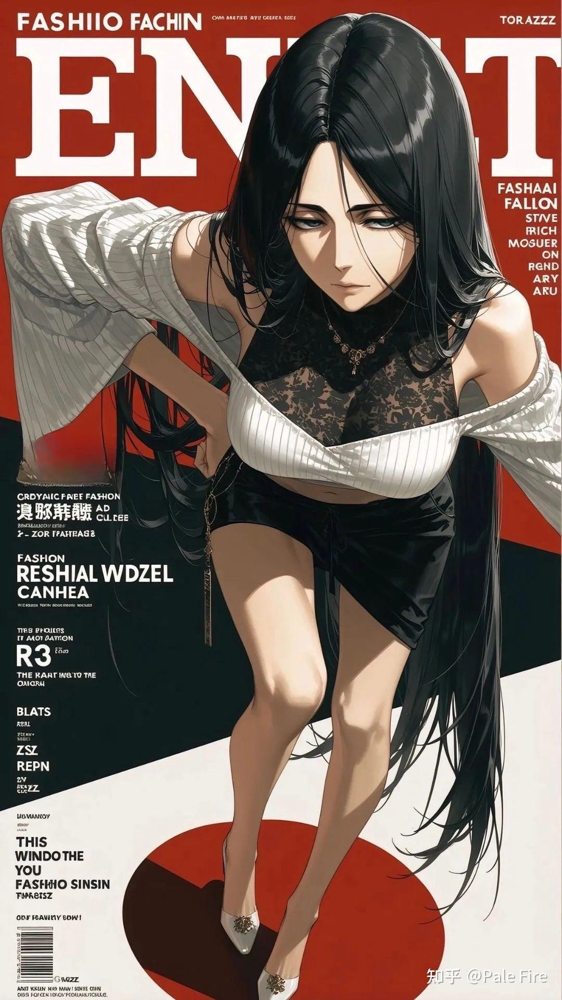

  

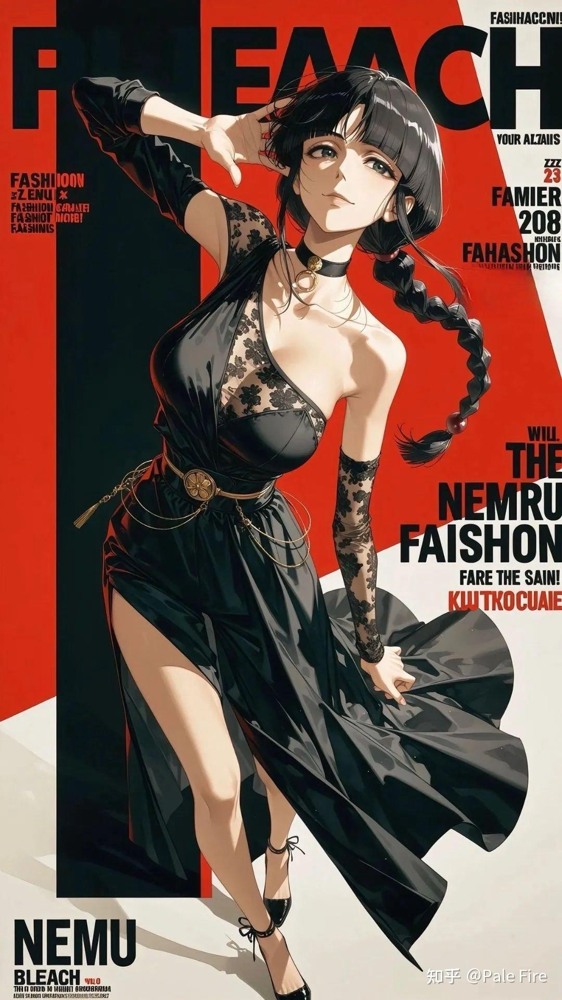

  

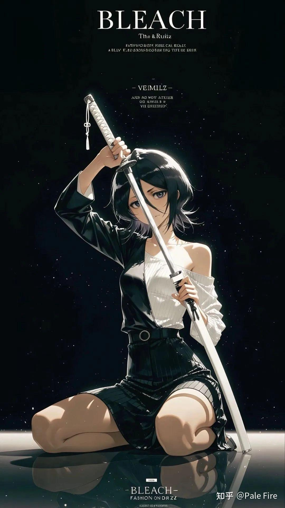

  

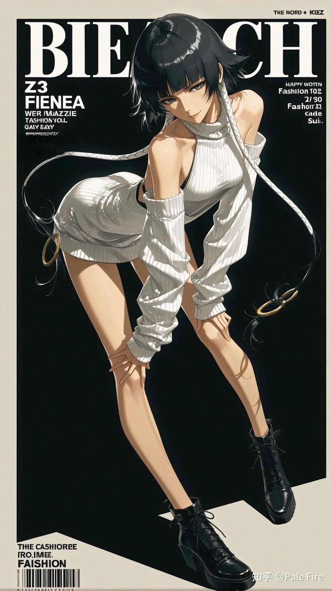

  

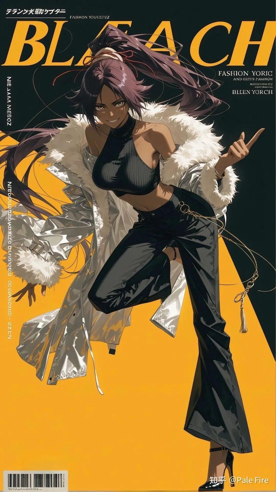

  

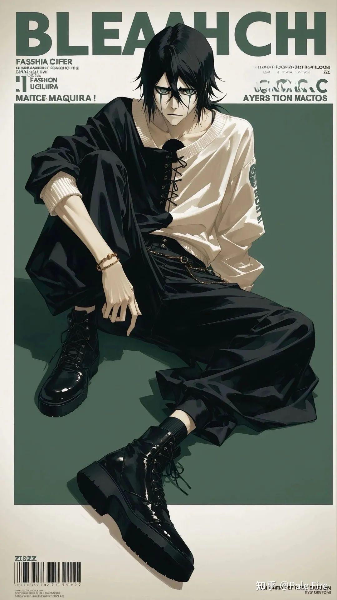

  

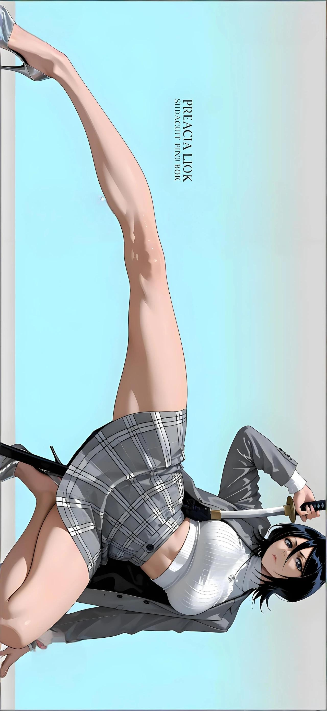

  

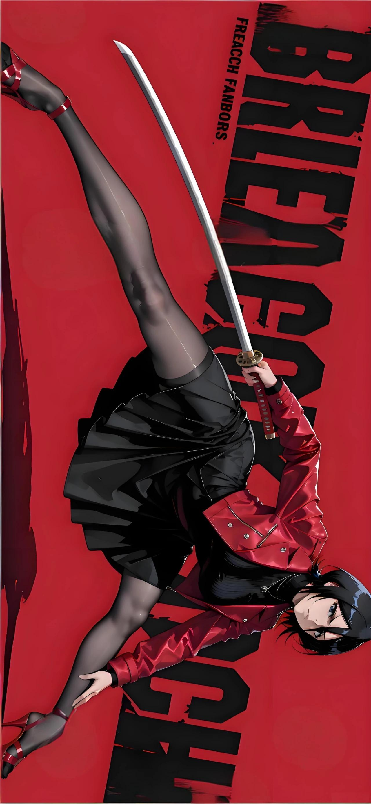

  

  

原文地址：[(塔克拉玛干地头蛇)诚心发问为什么大家都在说《死神》的时髦值很高？](https://www.zhihu.com/question/664449191/answer/2063715937841329238) 

# 评论

1. **塔克拉玛干地头蛇** (<small title="四川">2026-7-28 2:46:21</small>): 哈哈哈，好多兄弟提醒这是AI图，我当然知道这是AI图，就是分享分享［酷］
2. <a href="https://www.zhihu.com/people/li-jing-tian-9">呵呵哒</a> (<small title="上海">2026-7-25 22:15:36</small>): 碎蜂是检验是否是ai的标准，ai很少让她是对A的［doge］
   - <a href="https://www.zhihu.com/people/mdxiao-shi-di">MD小师弟</a> (<small title="北京">2026-7-26 15:44:3</small>): 然后我就又回去看了一次［飙泪笑］
   - <a href="https://www.zhihu.com/people/andrew-82-30">轻拢慢捻抹复挑</a> (<small title="回复于 2026-7-26 20:36:14/澳大利亚"> ✉️:MD小师弟</small>): 真的只看了一次吗［酷］ 还是起飞了一次
   - <a href="https://www.zhihu.com/people/fzr0qshv">小看山fZr0QsHV</a> (<small title="广西">2026-7-28 1:2:9</small>): ［思考］［思考］
3. <a href="https://www.zhihu.com/people/lunanovaacad">LunaNovaAcad</a> (<small title="湖北">2026-7-25 19:26:13</small>): 你这全是AI图有个铲铲说服力，看看Maison Margiela联动的斋藤不老不死，这才是功力［大哭］ 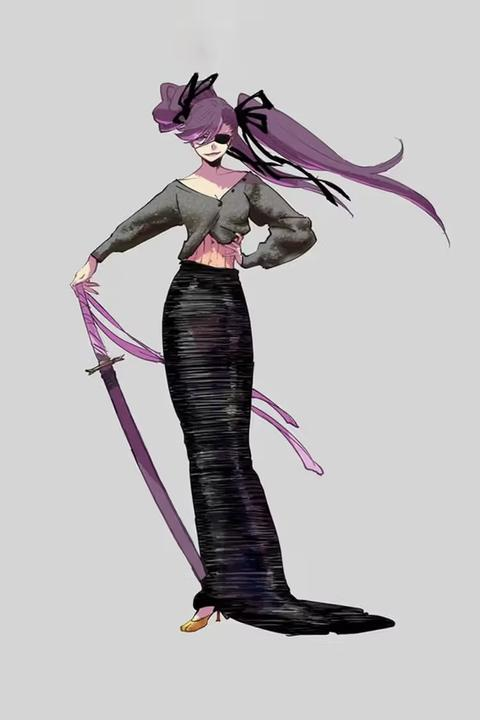
   - <a href="https://www.zhihu.com/people/qi-hai-92">祈海</a> (<small title="上海">2026-7-27 8:52:17</small>): 这玩意有没有机会漫画化出个前传啊 人设一个比一个爆 98你努努力啊［大哭］
   - <a href="https://www.zhihu.com/people/fzr0qshv">小看山fZr0QsHV</a> (<small title="广西">2026-7-28 1:1:56</small>): ［思考］［思考］
4. <a href="https://www.zhihu.com/people/xian-qu-zhe-14">先驱者halo</a> (<small title="江苏">2026-7-26 2:55:17</small>): 露琪亚没有那么长的腿！
   - <a href="https://www.zhihu.com/people/andrew-82-30">轻拢慢捻抹复挑</a> (<small title="澳大利亚">2026-7-26 20:36:43</small>): ［酷］ 到后面我看出来是AI的了
   - <a href="https://www.zhihu.com/people/socrateslee">socrateslee</a> (<small title="回复于 2026-7-27 9:32:50/上海"> ✉️:轻拢慢捻抹复挑</small>): 第一张的伪中文就能看出来
   - <a href="https://www.zhihu.com/people/bluewhale-48">bluewhale</a> (<small title="山东">2026-7-28 8:52:19</small>): 露琪亚太明显了 ［大笑］
   - <a href="https://www.zhihu.com/people/you-ren-a-91-68">友人A</a> (<small title="回复于 2026-7-28 15:49:45/浙江"> ✉️:轻拢慢捻抹复挑</small>): 第一张就看出来了，神秘汉字已经崩了
5. <a href="https://www.zhihu.com/people/kai-wan-xiao-zen-yao-hui">开玩笑怎么会</a> (<small title="上海">2026-7-26 12:7:45</small>): ［爱］［爱］［爱］
 
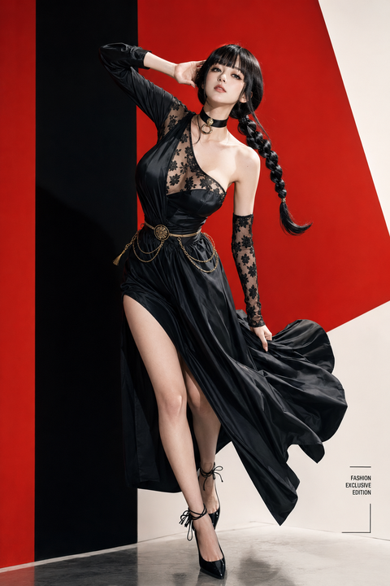
   - <a href="https://www.zhihu.com/people/captainsoap">队长我是肥皂</a> (<small title="回复于 2026-7-27 12:25:56/广东"> ✉️:马达.特蒙</small>): 因为就是按照真人皮肤取样去还原的吧
   - <a href="https://www.zhihu.com/people/yyi0730">马达.特蒙</a> (<small title="湖南">2026-7-27 9:13:42</small>): 这个皮肤的纹理绝了
6. <a href="https://www.zhihu.com/people/yin-chun-hua-84">踏雪寻梅</a> (<small title="江苏">2026-7-26 16:59:4</small>): 露琪亚被史诗级加强啊［害羞］
   - <a href="https://www.zhihu.com/people/andrew-82-30">轻拢慢捻抹复挑</a> (<small title="澳大利亚">2026-7-26 20:37:9</small>): 我看到那张C cup的就懂了［酷］
7. <a href="https://www.zhihu.com/people/cong-ci-jun-wang-bu-zao-zhao">从此君王不早朝</a> (<small title="上海">2026-7-26 15:41:50</small>): 《Blitch》［生气］
8. <a href="https://www.zhihu.com/people/87-57-14-68">删帖是国粹</a> (<small title="上海">2026-7-25 23:38:33</small>): 把露琪亚弄大不如把织姬弄烧
   - <a href="https://www.zhihu.com/people/xian-qu-zhe-14">先驱者halo</a> (<small title="江苏">2026-7-26 2:56:34</small>): 织姬往那一站就已经烧透了
   - <a href="https://www.zhihu.com/people/xue-zhong-du-xing-16">雪中独行</a> (<small title="回复于 2026-7-26 8:12:21/山东"> ✉️:先驱者halo</small>): 你是这种感觉吗？我只感觉织姬一脸呆样，毫无诱惑力
   - <a href="https://www.zhihu.com/people/andrew-82-30">轻拢慢捻抹复挑</a> (<small title="回复于 2026-7-26 20:37:58/澳大利亚"> ✉️:雪中独行</small>): 哎［酷］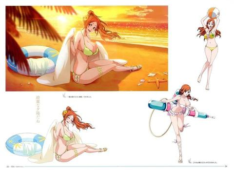
   - <a href="https://www.zhihu.com/people/andrew-82-30">轻拢慢捻抹复挑</a> (<small title="回复于 2026-7-26 20:38:43/澳大利亚"> ✉️:先驱者halo</small>): ［酷］
   - <a href="https://www.zhihu.com/people/xue-zhong-du-xing-16">雪中独行</a> (<small title="回复于 2026-7-26 21:4:30/山东"> ✉️:轻拢慢捻抹复挑</small>): 身材扭曲，大而瘫软，感觉老迈；面孔非常路人，毫无吸引力［思考］
   - <a href="https://www.zhihu.com/people/xue-zhong-du-xing-16">雪中独行</a> (<small title="回复于 2026-7-26 21:5:30/山东"> ✉️:轻拢慢捻抹复挑</small>): 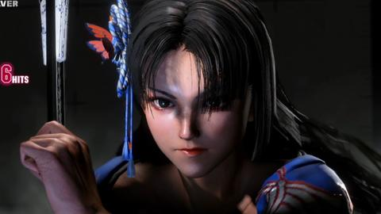
   - <a href="https://www.zhihu.com/people/xue-zhong-du-xing-16">雪中独行</a> (<small title="回复于 2026-7-26 21:8:17/山东"> ✉️:轻拢慢捻抹复挑</small>): 
   - <a href="https://www.zhihu.com/people/xue-zhong-du-xing-16">雪中独行</a> (<small title="回复于 2026-7-26 21:10:36/山东"> ✉️:轻拢慢捻抹复挑</small>): 街霸六的火舞，表情美艳而坚毅，身材性感而矫健，洋溢着强大的生命力---你把这两个形象对比一下，感受试试
   - <a href="https://www.zhihu.com/people/xi-nue-32">戏谑</a> (<small title="回复于 2026-7-27 12:55:22/新疆"> ✉️:雪中独行</small>): 哇，是超级炎炎舞！
   - <a href="https://www.zhihu.com/people/andrew-82-30">轻拢慢捻抹复挑</a> (<small title="回复于 2026-7-28 6:12:48/澳大利亚"> ✉️:雪中独行</small>): 成年人不做选择，我都要［感谢］
9. <a href="https://www.zhihu.com/people/xu-zhao-yang-5">疾风之科基</a> (<small title="陕西">2026-7-25 23:49:5</small>): 露琪亚哪有那么大
   - <a href="https://www.zhihu.com/people/hong-chen-dao-zhu-13">红尘道主</a> (<small title="回复于 2026-7-27 20:53:46/江苏"> ✉️:Antares</small>): 绯真也是平
   - <a href="https://www.zhihu.com/people/dio-brando">Antares</a> (<small title="河北">2026-7-26 9:3:21</small>): 可能这是绯真
10. <a href="https://www.zhihu.com/people/ivan-wang-67">ToBeMyOwn</a> (<small title="四川">2026-7-25 18:9:0</small>): 可惜露琪亚是个矮子啊
11. <a href="https://www.zhihu.com/people/linicoco1">Linicoco1</a> (<small title="福建">2026-7-27 9:29:33</small>): 总结：弯腰撅屁股［微笑］
12. <a href="https://www.zhihu.com/people/onenser">nswOne</a> (<small title="江苏">2026-7-27 10:29:36</small>): 最近上映的诀别谭篇 那画风越来越BT了。。。。。。。［酷］［酷］［酷］
13. <a href="https://www.zhihu.com/people/linan1225">糖醋排骨</a> (<small title="河南">2026-7-26 9:16:19</small>): 不管咋说，露琪亚就是不好看！！！
14. <a href="https://www.zhihu.com/people/ma-zao">马枣</a> (<small title="北京">2026-7-25 20:19:24</small>): 哪来的？人体比例错的离谱。
    - <a href="https://www.zhihu.com/people/ma-zao">马枣</a> (<small title="北京">2026-7-25 20:20:39</small>): 我指的不是夸张化腿长，而是结构上就完全是错的。
    - <a href="https://www.zhihu.com/people/saneseed">马桶上的沉思者</a> (<small title="回复于 2026-7-25 21:44:18/广东"> ✉️:马枣</small>): 世界上所有漫画人物比例都要一样的吗？又不是考试，有风格就行了
    - <a href="https://www.zhihu.com/people/tie-cang-feng">铁藏锋</a> (<small title="浙江">2026-7-26 9:40:12</small>): 快去，把海贼拎出来骂一顿
    - <a href="https://www.zhihu.com/people/83-27-11-34-7">不知道起什么名字</a> (<small title="河南">2026-7-26 10:25:28</small>): AI跑的
    - <a href="https://www.zhihu.com/people/ja-ri">UniqueDiablo</a> (<small title="回复于 2026-7-26 13:35:33/湖北"> ✉️:马桶上的沉思者</small>): 这些全是AI图
    - <a href="https://www.zhihu.com/people/ma-zao">马枣</a> (<small title="回复于 2026-7-26 14:10:13/北京"> ✉️:马桶上的沉思者</small>): 四肢修长，但是没脖子，或者是在超绝前伸头。你觉得这个比例整挺好是吧？杜兰特风格美男子。
    - <a href="https://www.zhihu.com/people/ma-zao">马枣</a> (<small title="回复于 2026-7-26 14:18:7/北京"> ✉️:马桶上的沉思者</small>): 还比如这个大长腿，问题根本不是它特别特别特别长，而是它的膝盖不对，差不多是人的大小腿相对转了30度再接在一起，或者她大小腿骨本身有个美妙的弧线。尸魂界O型腿圣体了属于是。
    - <a href="https://www.zhihu.com/people/zxcv-69-55">zxcv</a> (<small title="湖南">2026-7-26 15:55:1</small>): 即便是ai图只要有人看就是好图，画错了也有对的人喜欢
    - <a href="https://www.zhihu.com/people/saneseed">马桶上的沉思者</a> (<small title="回复于 2026-7-26 17:6:1/广东"> ✉️:UniqueDiablo</small>): 首先，活人画的漫画人物就必须人体比例正确吗？其次，喂AI的是活人的作品，能否认它没某种风格吗？
    - <a href="https://www.zhihu.com/people/saneseed">马桶上的沉思者</a> (<small title="回复于 2026-7-26 17:7:25/广东"> ✉️:马枣</small>): 请回答：世界上所有漫画人物比例都要一样的吗？是考试吗？
    - <a href="https://www.zhihu.com/people/ma-zao">马枣</a> (<small title="北京">2026-7-26 18:47:14</small>): ［飙泪笑］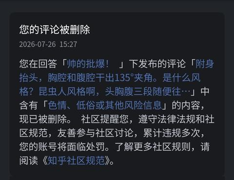
    - <a href="https://www.zhihu.com/people/56-77-58-22">绿龙的祖宗</a> (<small title="回复于 2026-7-26 20:47:31/广东"> ✉️:马枣</small>): 杂志封面的超绝前伸头太普遍了，正常坐姿才少见呢。
    - <a href="https://www.zhihu.com/people/ja-ri">UniqueDiablo</a> (<small title="回复于 2026-7-28 3:8:31/湖北"> ✉️:马桶上的沉思者</small>): 当然有风格，这套图就是写实的杂志封面
 
那么写实风格是否需要正确的人体比例？
15. <a href="https://www.zhihu.com/people/hong-74-19">蒙古海王</a> (<small title="江苏">2026-7-29 11:43:9</small>): 倒是很色［飙泪笑］
16. <a href="https://www.zhihu.com/people/fo-shan-lin-pa-te">佛山林帕特</a> (<small title="广东">2026-7-28 15:40:24</small>): 露琪亚根本就没胸阿
17. <a href="https://www.zhihu.com/people/momo-55-80-26-45">momo</a> (<small title="广东">2026-7-27 23:56:44</small>): 这个风格就算换火影也一样时髦［惊喜］
18. <a href="https://www.zhihu.com/people/le-pu-16">乐谱</a> (<small title="广东">2026-7-27 23:52:35</small>): 一叽咕
19. <a href="https://www.zhihu.com/people/pockettrain">PocketTrain</a> (<small title="湖北">2026-7-28 2:33:20</small>): 这么大的事怎么不早说？ ［doge］
20. <a href="https://www.zhihu.com/people/chen-mo-6-22">LoopHero</a> (<small title="江苏">2026-7-27 18:19:19</small>): 露琪亚生菜没那么好
21. <a href="https://www.zhihu.com/people/ai-shui-jue-30">爱睡觉</a> (<small title="天津">2026-7-27 16:7:18</small>): 不是，你这AI图能说明啥啊，还是得用原画比较好说明死神的时髦值(提裤)
22. <a href="https://www.zhihu.com/people/alexei-dg">momo</a> (<small title="四川">2026-7-27 15:45:26</small>): 是AI图
23. <a href="https://www.zhihu.com/people/yin-xiao-meng-83">寅芷棂</a> (<small title="福建">2026-7-27 16:2:39</small>): 露琪亚诗史级加强［为难］
24. <a href="https://www.zhihu.com/people/mhye">mh ye</a> (<small title="安徽">2026-7-27 10:44:18</small>): 大哥这图是不是以前发过
25. <a href="https://www.zhihu.com/people/goddess-miku">ABCD车小秘书</a> (<small title="广东">2026-7-27 17:19:20</small>): 很大，爱看［看看你］
26. <a href="https://www.zhihu.com/people/lei-guo-95-4">泪果</a> (<small title="山东">2026-7-27 11:4:55</small>): 碎蜂和露琪亚都是平板电脑
27. <a href="https://www.zhihu.com/people/shu-shu-56-16">司狐</a> (<small title="四川">2026-7-27 16:56:30</small>): 实话说你的AI没有98的手绘时髦
28. <a href="https://www.zhihu.com/people/tangmingyang">SummerVibe</a> (<small title="重庆">2026-7-27 14:48:36</small>): 道理我都懂，可露琪亚不是平胸么
29. <a href="https://www.zhihu.com/people/tang-song-46-45">汤宋</a> (<small title="河南">2026-7-27 10:7:41</small>): 碎蜂小了，露琪亚大了
30. <a href="https://www.zhihu.com/people/du-ming-80">杜铭</a> (<small title="广西">2026-7-27 9:20:23</small>): 最后一张是谁啊？
31. <a href="https://www.zhihu.com/people/tie-quan-wu-di-72">铁拳无敌</a> (<small title="浙江">2026-7-27 13:54:7</small>): 露琪亚哪来这么长的腿［为难］
32. <a href="https://www.zhihu.com/people/liu-fj-37">刘FJ</a> (<small title="广西">2026-7-27 16:43:42</small>): 碎蜂和露琪亚不对劲，完全不对劲。
33. <a href="https://www.zhihu.com/people/ju-jia-qi-shi-li-zi-jun">居家骑士栗子君</a> (<small title="广东">2026-7-27 10:54:36</small>): 久南白呢？我的久南白呢？［捂脸］
34. <a href="https://www.zhihu.com/people/75-6-70-48-67">隆平小麦王鹏程</a> (<small title="河南">2026-7-27 20:35:4</small>): 露琪亚哪有那么大啊？！这不是诈骗嘛！
35. <a href="https://www.zhihu.com/people/9-94-46-64-54">夸夸</a> (<small title="辽宁">2026-7-27 8:38:33</small>): 没看出来哪帅
36. <a href="https://www.zhihu.com/people/fei-er-lao">晨曦</a> (<small title="广东">2026-7-27 15:29:0</small>): 死神的角色真的好潮。
37. <a href="https://www.zhihu.com/people/sheng-tu-41">SaintE419</a> (<small title="上海">2026-7-27 9:21:27</small>): 还行［撇嘴］
38. <a href="https://www.zhihu.com/people/wu-ruo-mu-92">西山居她力量</a> (<small title="江苏">2026-7-27 15:9:7</small>): 收藏比点赞多是吧［生气］那我也收藏［生气］
39. <a href="https://www.zhihu.com/people/xu-kai-80-6">时隔多年</a> (<small title="浙江">2026-7-26 23:3:9</small>): 粉色护士服是谁~
40. <a href="https://www.zhihu.com/people/xi-yi-51-51-3">希夷</a> (<small title="浙江">2026-7-27 18:10:19</small>): 哎呦，喜欢［害羞］
41. <a href="https://www.zhihu.com/people/yqz-95">一个小兵早上起床</a> (<small title="四川">2026-7-27 8:48:30</small>): 谢谢兄弟 已经谢了［打招呼］
42. <a href="https://www.zhihu.com/people/suan-xiang-xiao-tu-dou">蒜香小土豆</a> (<small title="广东">2026-7-27 11:30:16</small>): 你这些图除了头其他的和死神有什么关系
43. <a href="https://www.zhihu.com/people/bu-gao-su-67-15">不告诉</a> (<small title="辽宁">2026-7-27 16:27:59</small>): 露琪亚那么矮的个子 怎么做到那么长的腿
44. <a href="https://www.zhihu.com/people/hu-yi-san-64-50">胡汉三</a> (<small title="上海">2026-7-27 8:2:18</small>): 额，也就这样［吃瓜］
45. <a href="https://www.zhihu.com/people/88-41-2-51-65">知乎用户</a> (<small title="广东">2026-7-26 19:10:53</small>): 织姬呢
46. <a href="https://www.zhihu.com/people/HRURH">迷路的大番薯</a> (<small title="广东">2026-7-27 16:55:42</small>): 咒语交出来［酷］
47. <a href="https://www.zhihu.com/people/xin-an-26-47">王昱舜</a> (<small title="河南">2026-7-27 8:40:6</small>): 第二张图看脸瞬间想起来狗头萝莉［为难］
48. <a href="https://www.zhihu.com/people/wang-da-she-87">巴山之蛇</a> (<small title="江苏">2026-7-27 11:14:15</small>): 朽木露琪亚，没有那么大！［害羞］
49. <a href="https://www.zhihu.com/people/95-48-62-26">熙鎏</a> (<small title="山东">2026-7-27 11:0:8</small>): ［感谢］露琪亚横图，有无水印原图资源吗
50. <a href="https://www.zhihu.com/people/liu-liu-ji-tang">知乎老让我改名</a> (<small title="山东">2026-7-27 9:15:34</small>): 碎蜂没这么大
51. <a href="https://www.zhihu.com/people/zhu-zhu-zhu-66-42">欧尼玛辛噶</a> (<small title="湖北">2026-7-26 8:17:31</small>): 你要这么玩的话我今天可就逛到这里了
52. <a href="https://www.zhihu.com/people/zhen-da-bao-36">真大宝</a> (<small title="广西">2026-7-26 11:28:4</small>): 人靠衣装！！！
53. <a href="https://www.zhihu.com/people/leng-bu-fang-re-bu-gong">冷不防热不攻</a> (<small title="广东">2026-7-26 22:11:56</small>): 40m 的大长腿［大笑］
54. <a href="https://www.zhihu.com/people/sun-chen-xu-56-12">左手提猫</a> (<small title="安徽">2026-7-26 10:24:25</small>): 有原图不，搞张当手机壁纸
55. <a href="https://www.zhihu.com/people/chen-ji-11-68">宸极</a> (<small title="河北">2026-7-26 16:32:25</small>): 这玩意爆了真的好吗
56. <a href="https://www.zhihu.com/people/nuan-nuan-you-di-fa">暖暖有滴伐</a> (<small title="浙江">2026-7-26 11:15:43</small>): 一股塑料味［暗中学习］
57. <a href="https://www.zhihu.com/people/liu-hua-chun-16">朱雀牌薄荷糖</a> (<small title="四川">2026-7-26 8:21:43</small>): 小伊势呢？
58. <a href="https://www.zhihu.com/people/bei-shu-de-li-mao-xia">凉白开</a> (<small title="浙江">2026-7-26 11:28:7</small>): 露琪亚没这么大de［捂脸］
59. <a href="https://www.zhihu.com/people/egoist-13-30">Egoist</a> (<small title="浙江">2026-7-25 14:22:53</small>): 腿比命长［滑稽］
60. <a href="https://www.zhihu.com/people/hask-43">hask</a> (<small title="安徽">2026-7-25 22:28:5</small>): ［感谢］
61. <a href="https://www.zhihu.com/people/di-er-bo">第二伯</a> (<small title="天津">2026-7-25 22:0:22</small>): 横图要有这么大，就不一定有后面织机的剧情了
62. <a href="https://www.zhihu.com/people/cha-cha-53-19">渡江卿</a> (<small title="河南">2026-7-25 10:12:53</small>): 这是岸本画的吗？
    - <a href="https://www.zhihu.com/people/mi-hou-tao-95">猕猴桃</a> (<small title="北京">2026-7-25 15:30:3</small>): 并不是。岸本画风成熟后，主要的风格是“潇洒”
63. <a href="https://www.zhihu.com/people/steven-han-82">飞奔的野猪</a> (<small title="浙江">2026-7-25 13:17:5</small>): 酒保的审美还是可以的［思考］
64. <a href="https://www.zhihu.com/people/yaakult">Yaakult</a> (<small title="云南">2026-7-27 17:48:11</small>): 这不是ai的吗？
65. <a href="https://www.zhihu.com/people/84-18-89-90">不若初见</a> (<small title="安徽">2026-7-27 8:47:14</small>): 小本子的漫画师研究青少年和老涩批们的爱好几十年，还不知道你们心里那点小癖好么？［机智］
66. <a href="https://www.zhihu.com/people/li-jun-jie-6-1-33">毒舌的Dr.李</a> (<small title="上海">2026-7-26 19:14:47</small>): ？这是久保带人的功劳吗？这不是 ai 的功劳吗？换个其他动漫的脸不都一样吗？
67. <a href="https://www.zhihu.com/people/u-know-13">U KNOW</a> (<small title="中国香港">2026-7-27 10:36:23</small>): 我管你这那的.jpg
68. <a href="https://www.zhihu.com/people/liuyanghe">刘阳河</a> (<small title="上海">2026-7-27 9:36:38</small>): 现在用AI生成图都是尽量避免出现中文的,
 
原因嘛,看第一张图
69. <a href="https://www.zhihu.com/people/foreverclovers">苏往</a> (<small title="北京">2026-7-26 18:37:28</small>): ai还是不如酒保
70. <a href="https://www.zhihu.com/people/UnseenDawn">看不见的黎明</a> (<small title="江苏">2026-7-26 12:3:22</small>): 难怪感觉怪怪的，原来是AI图啊……我就说露琪亚不可能那么鼓。
71. <a href="https://www.zhihu.com/people/zhi-zhu-qi-guan-zhu">踯躅崎馆主</a> (<small title="上海">2026-7-25 14:3:59</small>): AI图就不用拿出来了……

=[评论](./attachments/comments.json)

