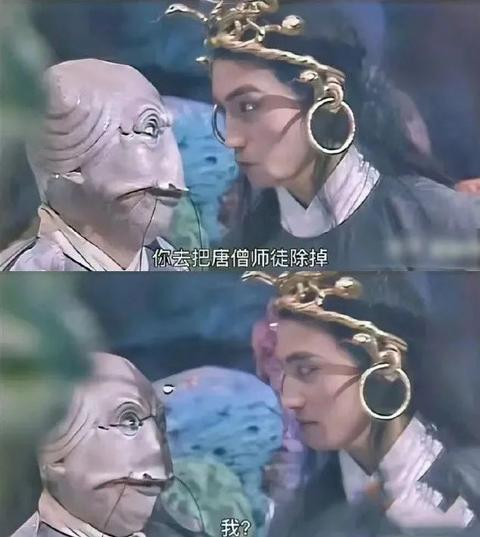

[toc]

# 问题

提问者：**<a href="https://www.zhihu.com/people/lai-xi-xian-sen">一笔书尽长安雪</a>**
提问时间: 2026-7-11 10:42:14
总回答数: 0
总访问量: 0

十年前大家口中的时代红利，是买房、进厂、电商、短视频，所有人都在往一条赛道里挤，不敢掉队；父辈祖辈更是没有选择权，种地、上班是活下去的唯一出路，只能跟着规则拼命往前跑。

但 2026 年的当下完全变了：雪糕刺客泡沫破裂，高价消费集体遇冷，年轻人主动拒绝内卷、晚婚晚育、逃离一线城市，几千块就能满足基础生存需求，不用再被 “必须买房、升职、30 岁成家” 的标准绑架。

到处都有人说现在没有红利、阶层固化、赚钱越来越难，可最近刷到一种完全相反的观点： **当下真正的时代红利，根本不是新风口、搞钱副业，而是普通人拥有了「主动退出内卷游戏」的选择权** 。

不用透支身体拼酒争职级，不用掏空六个钱包硬扛一线城市房贷，不用跟风追逐所有人都说好的 “人生模板”，哪怕降低欲望、躺平慢生活，也能安稳吃饱穿暖，不会落到衣食无着的地步。

想问问大家，抛开自媒体贩卖的暴富焦虑、资本制造的消费陷阱，站在普通人真实生活的角度，现阶段属于我们这代人的时代红利，到底是什么？这种 “不想做就能不做” 的选择权，真的是普通人最大的机遇吗？

# 回答

回答者： **<a href="https://www.zhihu.com/people/canglimo">墨苍离</a>**
回答时间: 2026-7-19 22:58:29
点赞总数: 640
评论总数: 13
收藏总数: 877
喜欢总数：79

利用新技术踹老登摊子。

其实这个踹老登摊子的模式，从互联网时代就开始了。

算力进步、技术基础设施建设、物流体系、手机普及，一系列东西都做了踹老登摊子的行业替代。

电商和电商直播，把传统快消渠道老登打崩了。

直播、短剧、流媒体，把传统在地娱乐基本打崩了，卡拉OK、夜场、电影都深受影响。

新媒体把大众媒体打崩了，报纸电台电视台，大众媒体三件套，就剩下交通电台一枝独秀

X和TG上面的各种福利菩萨玩意，把灰色的很多在地业务打崩了。

。。。。。。

然后，一些踹老登的中登，这波又被小登踹崩了。

比如最简单的，短剧行业，从22年起步到24年辉煌，到25年下半年就开始被AI短剧踹，现在基本上也踹惨了，很多短剧的演员在半年之内突然发现没有剧集可以拍了。

而且AI短剧这件事，真正踹人的还不只是“不要演员”这么简单。

它同时在踹编剧、分镜、场景、服化道、拍摄、后期、宣发，乃至过去围绕剧组形成的整套组织方式。以前拍一部东西，首先要攒局，要找钱、找人、找场地、排档期。现在一个懂模型、懂审美、懂平台流量的人，带着几个执行，就能把过去几十上百人的生产链压缩成一个小作坊。

所谓时代红利，本质上不是某个行业突然天降黄金，而是新工具把旧行业的成本结构打穿以后，旧玩家还没反应过来的那一段时间差。

技术红利是明牌，认知差和组织差才是利润。

所有老登摊子都有几个共同特点：

第一，成本高，但其中大量成本不是消费者真正需要的，而是历史包袱、组织摩擦和层层分利。

第二，流程长。一个东西明明三天能做完，非要审批、开会、协调、排期三个月。

第三，信息不透明。靠消费者不知道真实成本、不知道替代方案，维持高毛利。

第四，服务差。不是因为做不好，而是过去消费者没得选，供给方根本不在乎。

第五，旧玩家把护城河误认为能力。实际上很多所谓护城河，只是牌照、渠道、关系、地段和信息差。一旦技术绕开这些节点，护城河马上变成负资产。

所以，判断一个行业能不能踹，不要先问“AI能做什么”，而要先问：“这个行业里，哪些钱是因为过去技术做不到，才不得不花的？”

如果今天能把其中一个关键环节的成本降到原来的十分之一，把速度提高十倍，把交付从标准套餐改成千人千面，那就有踹摊子的机会。

教育、广告、设计、翻译、客服、招聘、咨询、法务辅助、软件外包、财税服务、内容制作，这些行业都会反复经历这个过程。不是整个行业一夜消失，而是行业里面最标准化、最重复、最依赖信息差的部分先被打掉。剩下的利润向两端集中：一端是极致便宜、极致高效的机器化供给；另一端是高信任、高审美、高责任的真人服务。夹在中间，既不便宜，也不稀缺，还要养一大堆人的公司最危险。

但这里还有一个常见误区：

很多人以为用了新技术，自己就是踹摊子的人。其实不是。绝大多数人只是买了把新锤子，然后满街寻找看起来像钉子的东西。

会用AI，不等于能吃AI红利。就像会开网店不等于能吃电商红利，会拍视频不等于能吃短视频红利。

真正的红利来自三件事的交叉：

新生产方式、新分发渠道、新商业闭环。

只会生产，不会分发，做出来就是数字垃圾。会分发，不能成交，就是平台的免费劳工。能成交，但交付成本降不下来，最后只是用新媒体给旧业务拉客，赚的仍然是辛苦钱。

这也是为什么，现在最值得做的，不是泛泛地“学AI”，而是钻进一个具体行业，把完整流程拆开看。

客户为什么付钱？

哪个环节最贵？

哪个环节最慢？

哪个环节最依赖熟练工？

哪个环节最容易出错？

谁掌握客户？

谁掌握定价权？

哪些东西机器可以完成百分之八十，再由人补最后百分之二十？

把这些问题弄明白，再把模型、自动化、数据和新渠道塞进去，才叫产业应用。否则只是追热点。

从个人方法论来说，普通人不要一上来就想着发明大模型，也不要幻想正面冲击巨头。最现实的姿势，是寻找“小市场里的老登摊子”。

越是传统、琐碎、非标准、看起来不性感的行业，反而越可能存在机会。因为大厂嫌市场小，技术人员嫌行业土，传统从业者又不懂新工具。这个夹缝，就是小团队和个人的窗口期。

先用新工具做服务，靠服务理解需求；再把重复流程做成产品；最后才考虑规模化。不要反过来，先闭门造一个自以为伟大的产品，再去教育市场。市场通常不需要被教育，它只会为更便宜、更快、更省心、更能赚钱的东西付费。

同时，也别把“踹老登摊子”理解成单纯的年龄战争。

老登不是年龄，而是一种生产关系。一个二十五岁的人，如果靠信息差、资历崇拜和拒绝变化吃饭，他也是老登。一个六十岁的人，如果愿意重做流程、拥抱工具、重新理解客户，他照样可以踹别人的摊子。

更重要的是，今天踹摊子的人，明天也会变成摊主。

互联网踹了传统媒体，短视频又踹门户网站；短剧踹了长视频的一部分，AI短剧再来踹真人短剧。每一代新玩家在赢了以后，都会迅速形成自己的经验、利益和傲慢，然后把偶然吃到的红利解释成不可复制的能力。

因此，真正可靠的认知姿态，不是站队小登嘲笑老登，而是永远站在成本下降、效率提升和用户迁移这一边。

不要迷信行业。

不要迷信平台。

不要迷信自己过去成功的经验。

持续观察什么东西正在从稀缺变成廉价，什么能力正在从专业技能变成基础设施，什么渠道正在失去注意力，什么新需求因为成本下降而第一次成为可能。

现阶段最大的时代红利，当然是AI。

但更准确地说，不是“做AI”的红利，而是用AI重新做一遍旧行业的红利。

谁能最先找到那些价格虚高、流程僵化、体验恶劣，却又长期没人愿意认真改造的老登摊子，谁就最有可能吃到这一轮。

只是动作要快。

因为你踹进去以后，身后很快也会出现一批更年轻、成本更低、工具更强的小登，准备连你一起踹。

以上。

供参考。

  

原文地址：[(墨苍离)现阶段的时代红利到底是什么？](https://www.zhihu.com/question/2059225990199501174/answer/2062310375484405215) 

# 评论

1. <a href="https://www.zhihu.com/people/zhang-wei-wen-77-8">小新不小心</a> (<small title="江西">2026-7-20 2:37:11</small>): 之前互联网对于普通人来说最大的改变是改变了信息传播的速度，现在ai对于普通人最大的改变是改变了信息理解的速度。其本质是把高认知人士的高效率思维模型通过ai对普通人进行下放。因为普通人进入具体行业是需要门槛的，拆解行业时没有一手的，带有使用条件和边界的数据根本无法判断ai能够替代什么东西。所以ai对于普通人最大红利反而是高效的迭代自己学习和执行方案。普通人拼到最后反而是拼执行力和迭代速度。
2. <a href="https://www.zhihu.com/people/diana-94-19">He He</a> (<small title="浙江">2026-7-20 6:55:46</small>): 纯想多了，央国企下场抢所谓小凳行业，小登就是秒死，只是他们这些老登目前看不上而已
3. <a href="https://www.zhihu.com/people/chun-se-shui-xia-38">瞬.顺</a> (<small title="山西">2026-7-20 0:32:10</small>): 啧，这个墨大，又在晚上发光了［机智］
4. <a href="https://www.zhihu.com/people/16-9-98-85-75">刘姥姥九进大观园</a> (<small title="上海">2026-7-20 8:30:45</small>): 就是用工业化工厂代替手工作坊
5. <a href="https://www.zhihu.com/people/refuse-45-60">知乎星球的外星人</a> (<small title="江西">2026-7-20 3:35:17</small>): 墨大，你怎么也知道X和电报［捂脸］
   - <a href="https://www.zhihu.com/people/kong-lp">孔lp</a> (<small title="四川">2026-7-20 8:17:41</small>): 不懂就问，是什么 为什么 干什么
6. <a href="https://www.zhihu.com/people/87-75-56-8">患得患失</a> (<small title="甘肃">2026-7-19 23:11:36</small>): ［赞］［赞］［赞］
7. <a href="https://www.zhihu.com/people/yu-zheng-yang-19">仁波切里尼</a> (<small title="上海">2026-7-20 9:48:8</small>): 最后没上卖课链接？［生气］编辑重来！
8. <a href="https://www.zhihu.com/people/yang-zhi-han-38">老虎就是浩克的猫</a> (<small title="上海">2026-7-20 9:32:32</small>): 在理，评论区这么多反对的声音我是没想到的。。
9. <a href="https://www.zhihu.com/people/rodog">机器狗</a> (<small title="美国">2026-7-20 2:15:57</small>): 美国参议院、美国最高法院是不是老登摊子？
10. <a href="https://www.zhihu.com/people/shu-chang-28-74">舒畅</a> (<small title="上海">2026-7-20 7:42:56</small>): 达索和西门子，谁来踹这俩老登呢？
    - <a href="https://www.zhihu.com/people/yang-ding-tian-38-89">杨耀泽</a> (<small title="山东">2026-7-20 9:3:24</small>): 
11. <a href="https://www.zhihu.com/people/zi-yao-yu-59">RTX5090Ti</a> (<small title="安徽">2026-7-20 8:32:41</small>): 土木工程上千年了，怎么没有小登踹翻？？？

=[评论](./attachments/comments.json)

