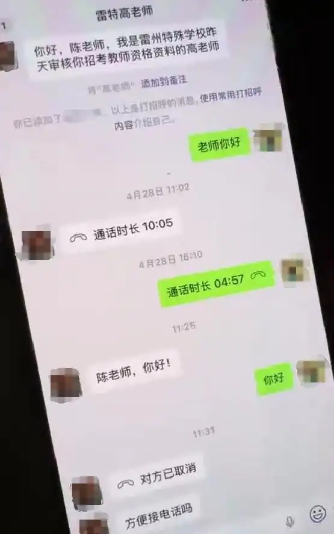
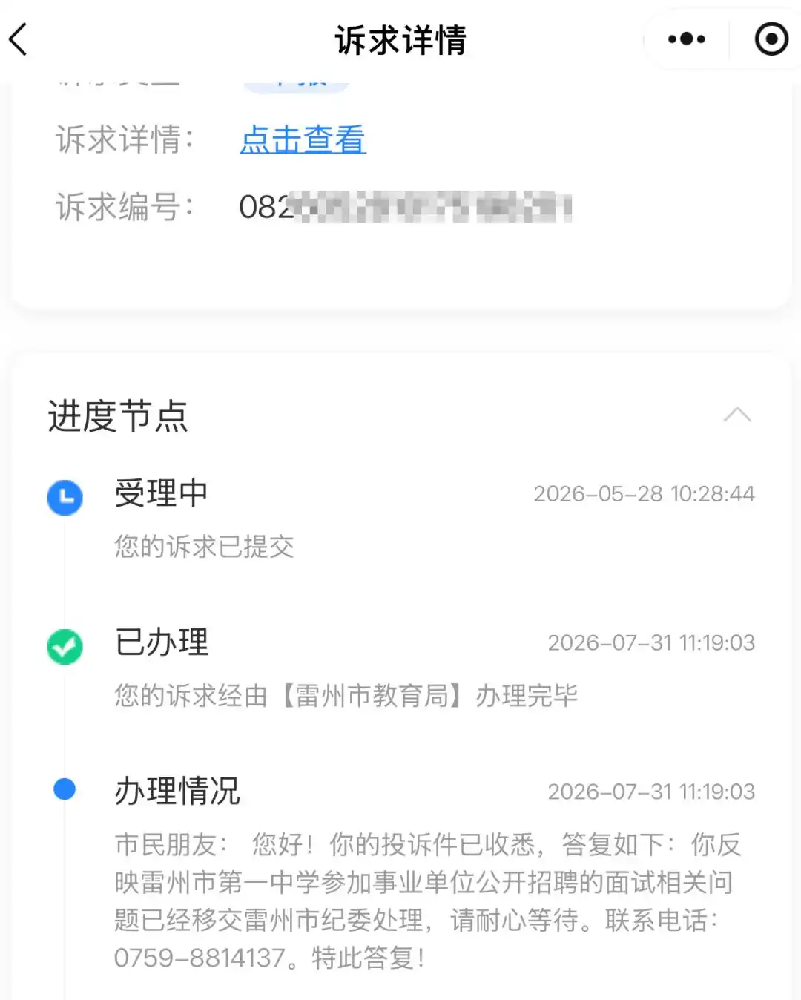

[toc]

# 问题

提问者：**<a href="https://www.zhihu.com/people/78-79-65-35">有毒桔子汁</a>**
提问时间: 2026-8-5 3:32:53
总回答数: 477
总访问量: 2298469

8月4日，广东的陈女士向海峡都市报反映，她是广东省事业单位2026年集中公开招聘高校毕业生雷州市事业单位考试的一名考生，笔试成绩位列第一，但却遭遇“泄露个人信息”“招考单位工作人员私下接触考生”“他人以金钱利诱劝退”等问题。

笔试第一考生遭“老师”传话：

“重新选择其他地方报考，给你几万块”

陈女士报考的是雷州市特殊教育学校高中舞蹈组专业技术岗位。

4月28日，一名自称“雷州特殊学校审核教师资格资料高老师”的陌生人员，通过微信添加了陈女士。当天，对方在微信通话中对她的教师资格证提出疑问，随后又改口称“没问题”。陈女士起初以为只是资格审核的常规沟通，并未放在心上。可接下来发生的事，让她逐渐心生警惕。

陈女士与这名自称“雷州特殊学校高老师”的聊天记录

5月6日，面试备考阶段，这位“高老师”再次致电陈女士，这一次陈女士录下了两人的通话记录。记者从陈女士拍摄的通话视频中看到，自称高老师的人称，陈女士是该岗位的笔试第一名，笔试第二名的考生提出愿意给陈女士几万块钱，让陈女士选择其他地方报考。

陈女士问对方是以什么身份转达这番话，对方回答：“我是作为学校老师嘛，她可能也是找到我的信息和联系方式嘛。”随后，陈女士回绝了对方的要求。

举报工单办理过程一拖再拖

拟聘用名单正常发布

5月23日面试当天，陈女士在考场遇到了笔试第二名的考生。

“那名考生就当我的面跟我说，‘我当时都求你别来你还来’。”据陈女士描述，该考生在面试现场还多次向在场老师提及，她的母亲就在本次报考的学校任职，希望入职后能与母亲同校工作。5月25日，陈女士就此事向雷州市教育局进行举报。5月28日，她又通过湛江市12345政务服务热线提交了投诉工单。然而工单办理一再延期，直至7月31日，12345热线才回复，称相关问题已移交雷州市纪委处理。海都君，公众号：海峡都市报教招面试前，笔试第一名接到电话：“选其他地方报考，第二名给你几万块钱”；笔试第二名被公示拟聘用，广东湛江教育局：已启动调查

诉求详情显示，陈女士5月28日提交了工单，7月31日移交至雷州市纪委处理

而陈女士至今未收到任何反馈。更令她意外的是，雷州市教育局于8月3日发布了《广东省事业单位2026年集中公开招聘高校毕业生雷州市事业单位（教育类）拟聘用人员公示（第一批）》，她所报考的岗位上，那名岗位笔试第二名的考生名字赫然在列。

湛江市教育局：

已对参与招聘人员启动调查

“拟聘用人员笔试面试没问题”

8月4日，记者多次拨打雷州市特殊教育学校电话，均未能接通。

记者又致电湛江市教育局人事科。工作人员回应称，已收到相关投诉，已要求雷州市教育局开展调查，目前正在对参与招聘的人员进行调查，“正在走程序当中”。该工作人员表示，已启动纪检调查，并一直在督促雷州市教育局处理此事。针对雷州市教育局发布拟聘用公示一事，该工作人员解释：“目前了解到该考生的笔试、面试分数均没有问题，因此才按程序发布公示。”海都君，公众号：海峡都市报教招面试前，笔试第一名接到电话：“选其他地方报考，第二名给你几万块钱”；笔试第二名被公示拟聘用，广东湛江教育局：已启动调查

4日傍晚，海都记者致电雷州市纪委，工作人员表示需先请示领导，再由相关办公室予以答复。但截至发稿，记者仍未收到任何回应。

# 回答

回答者： **<a href="https://www.zhihu.com/people/xia-qing-66-10">夏庆</a>**
回答时间: 2026-8-5 5:25:8
点赞总数: 778
评论总数: 123
收藏总数: 124
喜欢总数：27

事业单位招聘舞弊事件不是没有，但大多都是暗戳戳地在面试环节搞搞小动作，把笔试第一名给PK掉。像雷州市教育局这种公开“劝退”的时期确实少见，雷州市教育是来雷人的吗？

陈女士报考雷州市特殊教育学校高中舞蹈组专业技术岗位， 笔试第一，却被“老师”传话：“重新选择其他地方报考，给你几万块”。陈女士录音并多次举报，但笔试第二名仍然被公示为拟聘用人员。湛江市教育局工作人员回应，已要求雷州市教育局开展调查，目前正在对参与招聘的人员进行调查，但解释“目前了解到该考生的笔试、面试分数均没有问题，因此才按程序发布公示。”

现在教师岗位成了唐僧肉，什么妖魔鬼怪都想咬一口，什么卑鄙的手段都使出来了。这反映了哪些教育管理的问题？

雷州市教育局招录考试流程管控失效，公平竞争底线被冲击得七零八落，保密与信息安全管理存在重大漏洞。考生排名、联系电话、报考信息属于招录工作涉密信息，本应严格管控。出现工作人员可以轻易获取考生信息、充当中间人传话劝退，说明报名、资格审核环节信息权限管理混乱，缺少访问留痕、权限分级机制，极易滋生私下勾兑、利益交易。

部分校内教职工亲属参与报考，却没有主动执行任职回避，允许内部人员介入考生之间的博弈，利用职务身份形成信息优势，破坏平等竞争环境。

教职工管理混乱，纪律意识薄弱，权责边界模糊。在职教师、招录工作人员错误认为“帮忙传话只是私人行为”，实际上教育系统公职人员负有维护招考公正的法定责任，居间传递劝退、利益交换信息属于违反工作纪律。单位日常纪律教育、警示教育缺位，对招考岗位工作人员没有明确负面行为清单。招聘单位缺少约束机制，没有明确禁止工作人员私自单独联系入围考生。

大家都知道，面试前后是违规操作的高发期，但雷州市教育局和雷州市教特殊教育学校学校没有主动排查，考生主动举报后才不情不愿地启动调查，这就是赤裸裸的懒政行为。

笔试第一名陈女士实名举报后，涉事学校和主管教育局甚至一边受理举报，一边照常推进拟聘用公示，未建立争议处置期间暂停录用流程的机制，导致考生维权处于被动地位。在以往同类事件中，对于居间传话的教职工以及参与不正当竞争考生处罚太轻了，一般就是违规考生取消考试成绩，不予利用。违规教职工给个轻飘飘的警告处分，违纪违规成本太低了，完全起不到震慑作用。

  

原文地址：[(夏庆)广东一事业单位笔试第一考生被第二名花钱劝弃考，教育局已开展核查，反映了哪些教育管理问题？](https://www.zhihu.com/question/2068177634983515593/answer/2068205886942843917) 

# 评论

1. <a href="https://www.zhihu.com/people/dou-ma-72-51">快乐的小小风筝</a> (<small title="甘肃">2026-8-5 8:0:55</small>): 举报都不起作用了吗［捂脸］
   - **夏庆** (<small title="浙江">2026-8-5 8:18:51</small>): 人家说第二名成绩没有问题。舆论压力下估计会处理
   - <a href="https://www.zhihu.com/people/momo1888">momo</a> (<small title="回复于 2026-8-5 10:30:10/美国"> ✉️:夏庆</small>): 如果面试有猫腻的话，这些入局的人一般不会像合格间谍那样不留下一丝痕迹。
 
所以可以马上调查相关人员的各种通讯信息，就知道面试到底有没有猫腻了。
   - **夏庆** (<small title="回复于 2026-8-5 10:34:50/浙江"> ✉️:momo</small>): ［赞同］［赞同］［赞同］［赞同］
   - <a href="https://www.zhihu.com/people/bao-tu-2borne">宝图2borne</a> (<small title="北京">2026-8-5 11:41:2</small>): 举报只是导火索，舆论起来了才行，真的是互联网啊
   - <a href="https://www.zhihu.com/people/cheng-bai-nan-chang-jiu">成败难长久</a> (<small title="回复于 2026-8-5 11:55:54/浙江"> ✉️:夏庆</small>): 但问题是5月份就举报了现在8月了，两三个月的时间还没查清楚吗？
   - <a href="https://www.zhihu.com/people/zhuoyan2017">姜岩丶</a> (<small title="江苏">2026-8-5 12:1:30</small>): 你奈我何［滑稽］
   - <a href="https://www.zhihu.com/people/ma-shang-feng-hou-42-21">馬上封侯</a> (<small title="广东">2026-8-5 12:22:44</small>): 她妈在那个学校里面工作，她爸搞不好在教育局工作。然后她爷爷或者她姥爷可能是市里的领导退休，一大圈关系，能搞不定？
   - <a href="https://www.zhihu.com/people/wo-mei-you-jia-ren-liao">逗比代表2000</a> (<small title="回复于 2026-8-5 12:49:52/四川"> ✉️:momo</small>): 人家自己查自己，你能怎么办
   - <a href="https://www.zhihu.com/people/pzxjmd">一丝不苟百香果</a> (<small title="回复于 2026-8-5 13:45:38/山西"> ✉️:夏庆</small>): 感觉舆论压力的作用越来越小了！现在都是，一个调查跟你拖时间，等舆论过去，早就没人关注了，事情也就不了了之了！
   - <a href="https://www.zhihu.com/people/xiao-feng-can-xie-61-5">南风知我意</a> (<small title="回复于 2026-8-5 14:1:39/黑龙江"> ✉️:夏庆</small>): 以后会不会出现这样的情况，第三名冒充第二名给第一名发消息，第一名拿钱放弃，然后再举报第二名，最终自己上岸
   - **夏庆** (<small title="回复于 2026-8-5 14:37:1/浙江"> ✉️:南风知我意</small>): 高［赞同］
   - <a href="https://www.zhihu.com/people/bu-yuan-bing-guo">不愿冰菓</a> (<small title="回复于 2026-8-5 14:53:22/贵州"> ✉️:南风知我意</small>): 那你猜猜查起来，查到的应该是谁［看看你］
   - <a href="https://www.zhihu.com/people/chen-ruo-mu">陈若木</a> (<small title="回复于 2026-8-5 15:40:16/湖北"> ✉️:夏庆</small>): 现在公务员面试已经没有什么漏洞了，事业单位面试也在逐渐规范，只能想别的招了。
   - <a href="https://www.zhihu.com/people/chen-feng-de-li-zi">尘封的鸭梨</a> (<small title="回复于 2026-8-5 17:41:16/四川"> ✉️:夏庆</small>): 没有的，你多去考几次就发现了，别人都是萝卜坑，你去给别人添堵干嘛，习惯了，本人亲身经历了，不报希望了，黑暗面不能说
   - <a href="https://www.zhihu.com/people/tai-guo-yao-yuan">太过遥远</a> (<small title="江西">2026-8-6 9:50:54</small>): 舆论起作用了，举报压根不鸟
2. <a href="https://www.zhihu.com/people/young-dong">梦想躺平</a> (<small title="天津">2026-8-5 8:27:48</small>): 你在说啥［为难］  
 
给的钱买对方一个名额可太普遍了。  
 
你是没经历过十几年前考公不是很热门的时候。  
 
很多人遇到这种就直接拿钱重考了，一年挣的钱比工资都高［捂脸］  
 
只是现在考公成独木桥了，外边就业环境也不好，所以这个价格有些太低了。
   - **夏庆** (<small title="浙江">2026-8-5 8:49:8</small>): 是真的，我家孩子遇到过，一个编制6个人进面，目标人物第五。我家第三，有中间人打电话说给1万放弃，说其他人他也打好招呼了。我家没敢收钱，也没去面试。最后那个第五果真录取了。不知道是手眼通天，还是其他人也被吓唬住了［大笑］
   - <a href="https://www.zhihu.com/people/q1161239087">学习好</a> (<small title="广东">2026-8-5 9:16:58</small>): 确实常见，问题文中这个不同意
   - <a href="https://www.zhihu.com/people/shima123">知乎用户1122</a> (<small title="安徽">2026-8-5 9:49:0</small>): 这个是真的。。。。之前考试遇到个人闲聊他就说随便考考，考第一了不想去就卖了
   - <a href="https://www.zhihu.com/people/li-xue-hao-92">李学好</a> (<small title="江苏">2026-8-5 10:48:10</small>): 要是真拿了钱也是在赌对方是个诚实守信的主儿，别到时候拿了钱反手被告一个敲诈勒索，真的是被双重恶心，萝卜招聘在事业单位招考里面就是屡禁不止的［捂脸］
   - <a href="https://www.zhihu.com/people/di-gua-41-58">地瓜</a> (<small title="浙江">2026-8-5 11:20:21</small>): 长期第一放弃的话也会被调查的，我这就有，大概是从10年到17年某个专业的岗位第一名一直都是一个很少见的名字，最关键尾号对得上，然后这位17年之后就再也没见到了，通讯录里也找不到。
   - <a href="https://www.zhihu.com/people/liu-sha-40-23-53">流沙</a> (<small title="回复于 2026-8-5 13:5:28/江西"> ✉️:夏庆</small>): 这么怂吗？不过按你说的逻辑，可能想用最少的钱买通考生，考生买不通再花大价买通主考官或者考官里有硬察一下又拿不下又不想多花钱［吃瓜］
   - <a href="https://www.zhihu.com/people/wang-xiao-bo-xi-huan-niu-rou-gan">王小博喜欢牛肉干</a> (<small title="回复于 2026-8-5 13:47:47/辽宁"> ✉️:夏庆</small>): ？？？
   - <a href="https://www.zhihu.com/people/fengyuliunian">风雨流年</a> (<small title="安徽">2026-8-5 15:25:51</small>): 确实是普通的现象，特别中小城市，当时听朋友说的时候我都愣住了，比一年上班还赚［笑哭］
   - <a href="https://www.zhihu.com/people/chen-duo-qiao-83">月野兔宝宝</a> (<small title="回复于 2026-8-5 19:56:23/广东"> ✉️:风雨流年</small>): 人要有远见啊 不能看面前蝇头小利［飙泪笑］
   - <a href="https://www.zhihu.com/people/fengyuliunian">风雨流年</a> (<small title="回复于 2026-8-5 20:39:28/安徽"> ✉️:月野兔宝宝</small>): 当时人家工作比较轻松，说比考证合算，还安全［吃瓜］
   - <a href="https://www.zhihu.com/people/huang-wei-hao-63-9">落叶</a> (<small title="广东">2026-8-6 8:15:0</small>): 是普遍，但是只想给几万块，这就有点异想天开了，老老实实拿出五十到一百万给人家，还差不多
   - <a href="https://www.zhihu.com/people/35-26-75-63">江北塘主</a> (<small title="回复于 2026-8-6 8:56:51/广西"> ✉️:李学好</small>): 有通话录音啊，敲诈？那你孩子的工作也没了啊。
   - <a href="https://www.zhihu.com/people/hou-liang-35-35">进入大谷翔平</a> (<small title="回复于 2026-8-6 9:16:51/吉林"> ✉️:夏庆</small>): 浙江的编制1万就唬住你家了？
3. <a href="https://www.zhihu.com/people/86-53-73-26">端着加特林的秀琴</a> (<small title="河南">2026-8-5 10:32:39</small>): 看我们河南三支一扶成绩，都敢放到台面上了，
   - **夏庆** (<small title="浙江">2026-8-5 10:34:25</small>): ［赞同］［赞同］［赞同］
   - <a href="https://www.zhihu.com/people/yjyyag">yjyyag</a> (<small title="河北">2026-8-5 11:57:13</small>): 烂透了，［doge］努力建设新时代
   - <a href="https://www.zhihu.com/people/wang-zhi-long-66">习以为常</a> (<small title="回复于 2026-8-5 14:42:14/河北"> ✉️:yjyyag</small>): 努力改革，改革力量由外二内
   - <a href="https://www.zhihu.com/people/bu-zhi-suo-yun-hu-14">知所云乎</a> (<small title="江苏">2026-8-6 6:30:2</small>): 大白以后我觉得这个地方什么都可能发生
4. <a href="https://www.zhihu.com/people/yun-shui-shan-xin-59-31">云水禅心</a> (<small title="辽宁">2026-8-5 9:10:56</small>): 朴实无华，还给钱，太有良心了
   - **夏庆** (<small title="浙江">2026-8-5 9:18:16</small>): ［赞同］［赞同］［大笑］［大笑］［大笑］［大笑］
   - <a href="https://www.zhihu.com/people/jia-you-niang-pao-huang">家有娘炮黄</a> (<small title="福建">2026-8-6 9:50:56</small>): 确实，一般在前面人家已经走关系，都已经打点完了。连钱都不会给到这个面试竞争的人。
5. <a href="https://www.zhihu.com/people/a-xuan-33-74">先富带动后富</a> (<small title="陕西">2026-8-5 12:9:23</small>): 有没有人详细整理下八月合订本［大笑］  
 
河南三支一扶  
 
河北法院  
 
雷州考生花钱劝弃考
   - **夏庆** (<small title="浙江">2026-8-5 12:15:39</small>): 好主意［赞同］［赞同］［赞同］
   - <a href="https://www.zhihu.com/people/qiao-ke-li-80-11">巧克力</a> (<small title="广东">2026-8-5 15:47:29</small>): 八一钢铁在哪里呢［思考］
6. <a href="https://www.zhihu.com/people/ripple-57-64">ripple</a> (<small title="浙江">2026-8-5 11:32:17</small>): 不是，［思考］我就想问问一个编也就值几万块？在我印象中，这事如果能办成。你砸个几十也值得
   - **夏庆** (<small title="浙江">2026-8-5 11:35:35</small>): 肯定值，所有给少了［大笑］
   - <a href="https://www.zhihu.com/people/yang-na-ge-xiao-91">国服花裤头</a> (<small title="浙江">2026-8-5 14:21:2</small>): 工资两三千，几十万不值。
   - <a href="https://www.zhihu.com/people/all-creat">All Creat</a> (<small title="回复于 2026-8-5 16:20:46/广东"> ✉️:国服花裤头</small>): 怎么可能两三千，高校的，又不是偏僻农村的小学
   - <a href="https://www.zhihu.com/people/huang-wei-hao-63-9">落叶</a> (<small title="广东">2026-8-6 8:15:41</small>): 五十万一大堆人抢，一百万都有人要
   - <a href="https://www.zhihu.com/people/huang-wei-hao-63-9">落叶</a> (<small title="回复于 2026-8-6 8:16:5/广东"> ✉️:国服花裤头</small>): 一年所有算下来有十万的
   - <a href="https://www.zhihu.com/people/hou-liang-35-35">进入大谷翔平</a> (<small title="回复于 2026-8-6 9:24:32/吉林"> ✉️:国服花裤头</small>): 他那地方学校一年到手差不多10万，想几万就打发别人不现实［捂脸］
   - <a href="https://www.zhihu.com/people/li-zheng-yu-94-60">风莫逆</a> (<small title="广东">2026-8-6 9:32:18</small>): 可能真砸了几十万，主要大头给“老师”了。“老师”为了成功率更高，就决定花几万块把笔试第一自己劝退，结果遇到硬茬，只能原计划进行。笔试第一，面试不一定第一，有可能笔试第三的人，面试成绩超级顶尖。所以花几十万买通笔试第一，这个可能性就很低。除非就你们2个人报考。
   - <a href="https://www.zhihu.com/people/jia-you-niang-pao-huang">家有娘炮黄</a> (<small title="福建">2026-8-6 9:51:36</small>): 确实，这是听到很少的金额。身边听的比较多的都是花了几十万。
7. <a href="https://www.zhihu.com/people/zhiukdqkes">zhiuKdQkeS</a> (<small title="北京">2026-8-5 8:29:42</small>): 这需要给钱吗？面试直接刷就完事了
   - **夏庆** (<small title="浙江">2026-8-5 8:45:36</small>): 如果有人拿了钱不去，就不会有后面这些事了，现在碰到硬茬了［大笑］
   - <a href="https://www.zhihu.com/people/xiao-xiao-de-tai-yang-96-71">小小的太阳</a> (<small title="广东">2026-8-5 11:7:51</small>): 所以啊，有没有另外一种，被刷下去的自导自演一名“老师”
   - <a href="https://www.zhihu.com/people/csw0991">Sven</a> (<small title="广西">2026-8-5 13:25:57</small>): 所以看不懂 是两手准备还是被刷下去的自导自演
   - <a href="https://www.zhihu.com/people/qiao-ke-li-80-11">巧克力</a> (<small title="回复于 2026-8-5 15:46:45/广东"> ✉️:小小的太阳</small>): 查一下不就知道了
8. <a href="https://www.zhihu.com/people/43-74-88-27">耄耋哈气米</a> (<small title="浙江">2026-8-5 5:28:14</small>): 这个事情湛江教育局再不处理好，老百姓就没有什么可以相信的了
   - <a href="https://www.zhihu.com/people/firefly-49-64">firefly</a> (<small title="上海">2026-8-5 8:33:56</small>): 招聘过程合法合规，已处理举报人［大笑］
   - <a href="https://www.zhihu.com/people/import-42">Import</a> (<small title="陕西">2026-8-5 9:35:59</small>): 搞的现在有人信一样［大笑］
   - <a href="https://www.zhihu.com/people/18720438806">奥雷连诺</a> (<small title="江西">2026-8-5 13:26:54</small>): 这有啥不可信的？ 别人花钱买，你可以不卖啊。
   - <a href="https://www.zhihu.com/people/li-qiang-89-5">汤姆猫</a> (<small title="回复于 2026-8-5 15:32:26/广东"> ✉️:奥雷连诺</small>): 问题是第一名考生的联系信息被泄露了，没问题？
   - <a href="https://www.zhihu.com/people/18720438806">奥雷连诺</a> (<small title="回复于 2026-8-5 16:8:29/江西"> ✉️:汤姆猫</small>): 泄漏给谁了？
   - <a href="https://www.zhihu.com/people/26-88-61-35-16">无可抵抗</a> (<small title="回复于 2026-8-5 17:51:37/河北"> ✉️:奥雷连诺</small>): 卖官鬻爵在封建社会都是被人唾弃的
   - <a href="https://www.zhihu.com/people/18720438806">奥雷连诺</a> (<small title="回复于 2026-8-6 8:39:42/江西"> ✉️:无可抵抗</small>): 这既不是官更不是爵，更谈不上卖，就是个打工的岗位而已。
9. <a href="https://www.zhihu.com/people/bu-zhi-suo-yun-hu-14">知所云乎</a> (<small title="江苏">2026-8-6 6:28:51</small>): 这种事情很常见的好吧，早三年前就知道一个当时我们一个群里面的网友，他跟我们讲这个情况，我都震惊了，居然还有人可以去约考试前几名的人，叫他们不要去考，把名次让出来。
   - **夏庆** (<small title="浙江">2026-8-6 7:39:4</small>): 是啊，只不过这次遇到硬茬了
10. <a href="https://www.zhihu.com/people/kim-62-22">A股 荣乐中路</a> (<small title="上海">2026-8-5 10:31:9</small>): 其实我真靠以一名，退也就铁路。这种就算进去了，也是萝卜岗，人家能给你穿四。 没办法社会就是那么惨酷。 不过要是异地 那就是我另外一种说法了
    - **夏庆** (<small title="浙江">2026-8-5 10:34:20</small>): ［赞同］［赞同］［赞同］
    - <a href="https://www.zhihu.com/people/41-28-27-88">说说</a> (<small title="广东">2026-8-5 11:51:3</small>): 穿鞋也没有用啊，编制就是编制，逼急人家也不怕，大不了升职不了罢了
    - <a href="https://www.zhihu.com/people/zhao-jia-xu-56">云霄鸟</a> (<small title="上海">2026-8-5 15:17:20</small>): 先进去再说,还没有进去考虑穿小鞋的事情,属实多虑了.
    - <a href="https://www.zhihu.com/people/ni-ma-61-52-65">尼玛</a> (<small title="回复于 2026-8-5 22:53:31/四川"> ✉️:说说</small>): 不是那么简单的
    - <a href="https://www.zhihu.com/people/lu-lu-xiu-36-99">鲁鲁修</a> (<small title="回复于 2026-8-6 9:19:16/山东"> ✉️:尼玛</small>): 确实 比解道数学题麻烦多了
    - <a href="https://www.zhihu.com/people/hou-liang-35-35">进入大谷翔平</a> (<small title="吉林">2026-8-6 9:25:45</small>): 大不了同归于尽
11. <a href="https://www.zhihu.com/people/Valiant-X">李征</a> (<small title="江苏">2026-8-5 11:3:8</small>): 当年吹捧春风法官的那篇报道中，她们那个单位，有很多人两代人都在同一单位。
12. <a href="https://www.zhihu.com/people/gao-yong-tao-65">蛋卷</a> (<small title="河南">2026-8-5 11:17:6</small>): 第二名还是胎太心善了，她明明可以在第一名不知情的情况下直接把第一名刷掉的，这下反而给别人落下了把柄
    - <a href="https://www.zhihu.com/people/hou-liang-35-35">进入大谷翔平</a> (<small title="吉林">2026-8-6 9:26:5</small>): 没绷住
13. <a href="https://www.zhihu.com/people/dan-dan-de-ai-42">木子老师</a> (<small title="湖南">2026-8-6 9:47:1</small>): 给的钱还是少了，还没上10
    - **夏庆** (<small title="浙江">2026-8-6 9:54:0</small>): 确实少了
14. <a href="https://www.zhihu.com/people/fei-fei-de-xu-11">肥肥的许</a> (<small title="浙江">2026-8-6 7:28:44</small>): 很简单抽签能  
 
解决的问题，  
 
但就是做不好。
    - **夏庆** (<small title="浙江">2026-8-6 7:38:28</small>): 还真是哦［赞同］
15. <a href="https://www.zhihu.com/people/li-xu-77-78">李旭</a> (<small title="江苏">2026-8-5 10:19:20</small>): 看了半天除了通话记录没任何实证，你怎么知道举报人说的就是真的
    - <a href="https://www.zhihu.com/people/xiao-xiao-de-tai-yang-96-71">小小的太阳</a> (<small title="广东">2026-8-5 11:8:46</small>): 我也觉得是。还有种情况，举报人自导自演，“老师”不好查
    - <a href="https://www.zhihu.com/people/qiu-yu-fei-fei-32">秋雨菲菲</a> (<small title="湖南">2026-8-5 11:39:55</small>): 通话记录还不够？ 这对于普通人来说 这基本上已经是能够收集到的证据的上限了好吗
    - <a href="https://www.zhihu.com/people/18720438806">奥雷连诺</a> (<small title="回复于 2026-8-5 13:27:54/江西"> ✉️:秋雨菲菲</small>): 通话记录能证明什么［飙泪笑］  
 
某人给我打个电话，然后我说他说了什么他就说了什么了？
    - <a href="https://www.zhihu.com/people/wang-zhi-long-66">习以为常</a> (<small title="河北">2026-8-5 14:44:18</small>): 类似的事情，宁可信其有，不可因无证据而错放。民告官，官取证。
    - <a href="https://www.zhihu.com/people/wang-zhi-long-66">习以为常</a> (<small title="回复于 2026-8-5 14:45:20/河北"> ✉️:奥雷连诺</small>): 你敢在公共资源面前说公安局的XX要XX你吗？
    - <a href="https://www.zhihu.com/people/18720438806">奥雷连诺</a> (<small title="回复于 2026-8-5 15:19:47/江西"> ✉️:习以为常</small>): 先学会说话再来发言。
    - <a href="https://www.zhihu.com/people/qiu-yu-fei-fei-32">秋雨菲菲</a> (<small title="回复于 2026-8-5 16:37:18/湖南"> ✉️:奥雷连诺</small>): 别人通话有录音 你都看不到吗
    - <a href="https://www.zhihu.com/people/18720438806">奥雷连诺</a> (<small title="回复于 2026-8-5 17:2:37/江西"> ✉️:秋雨菲菲</small>): 我看不到，你发给我看看
    - <a href="https://www.zhihu.com/people/zou-ming-13">师爷快上</a> (<small title="广西">2026-8-5 23:53:31</small>): 看了最新的调查公告，学校的老师私下找副校长拿到了第一名的个人信息，说明事情是真的！
16. <a href="https://www.zhihu.com/people/jie-shu-shi-wo-shi-ju-jue-de">结束时我是拒绝的</a> (<small title="安徽">2026-8-5 9:21:48</small>): 区县的事业单位如果不是联考，那么操作空间太大了，现实中我看到过真的有人把傻儿子弄进去的。放xx年前，走政法gj当公务员的也不少
17. <a href="https://www.zhihu.com/people/hen-gan-ga-a">山雨欲来皆成空</a> (<small title="四川">2026-8-5 14:38:5</small>): 我觉得可能分数啥的确实没问题，就是害怕自己不能翻盘，落选了，所以，才用了这些手段（但这些手段也只能作用在面试考场之外），结果不知道岗一是受影响了还是确实面试没发挥好，所以岗二进了，然后岗一开始举报。这件事，如果属实也确实按照我这个推理来的，那处理起来确实还是有点麻烦，怎么定性是个问题。大概率可能以岗一会因诚信或者道德问题而下岸。
18. <a href="https://www.zhihu.com/people/77-33-72-59">夏天的棕熊</a> (<small title="湖南">2026-8-5 7:38:35</small>): 事业单位招聘舞弊事件不是没有，但大多都是暗戳戳地在面试环节搞搞小动作，把笔试第一名给PK掉。像雷州市教育局这种公开“劝退”的时期确实少见，雷州市教育是来雷人的吗？
19. <a href="https://www.zhihu.com/people/wang-zhi-min-21-83">志缮-拂晓</a> (<small title="山东">2026-8-6 8:35:36</small>): 我当年金融办招考笔试第一，面试完变成第三了。
20. <a href="https://www.zhihu.com/people/ovo-80-35-64">小拉格OvO</a> (<small title="上海">2026-8-5 20:0:50</small>): 一个萝卜一个坑。先有萝卜后有坑。
21. <a href="https://www.zhihu.com/people/xiao-sa-qing-chen-de-yang-guang">艾莎的妹妹</a> (<small title="北京">2026-8-5 19:37:59</small>): 是不是第二名照第一名成绩差的太多了，就是给第二名满分，总分他也干不掉第一名？
22. <a href="https://www.zhihu.com/people/showmax">晨露听风</a> (<small title="福建">2026-8-5 16:35:22</small>): 显失公平
23. <a href="https://www.zhihu.com/people/nuan-xia-67-22">温水</a> (<small title="山东">2026-8-6 9:13:47</small>): 不是，我不太懂啊，笔试第一，又不是笔面第一，笔面第一的话还可以找人传个话，让他放弃，然后第二名顶上，第二名直接联系第一名只要出了足够的钱，也算是合法合规，而且这种直接让招考单位来传话，这种行为也太大胆了吧，是真的无视法律还是有恃无恐，还是两者都有，那我只能说现在这个世界还是不够干净，还是需要净化
24. <a href="https://www.zhihu.com/people/xie-yong-zheng-5">熊大</a> (<small title="山东">2026-8-5 16:57:57</small>): 这不是去年的事吗，又重演了？
25. <a href="https://www.zhihu.com/people/di-er-duo-mu-jin-hua-kai-64">向日葵对你说</a> (<small title="福建">2026-8-5 21:46:48</small>): 还去吗，去了会好吗？不去也要记得拉她下来。
26. <a href="https://www.zhihu.com/people/--xx-12">- xx</a> (<small title="湖南">2026-8-6 8:36:19</small>): 我就亲身体会过，语文老师编制，前六进面试，前三名都是90多分，到了第四名就是70多了，语文诶，90多是什么概念？你细品
27. <a href="https://www.zhihu.com/people/60-78-80-36">林小梨</a> (<small title="云南">2026-8-5 14:58:11</small>):   
 
  
 
大部分人遇到这种事情就选择重考了，一年挣的工资也不少了。
28. <a href="https://www.zhihu.com/people/ni-ma-61-52-65">尼玛</a> (<small title="四川">2026-8-5 22:51:40</small>): 这么一闹，想录取也不能录取了。退一步讲即便进去了也不会过好日子
29. <a href="https://www.zhihu.com/people/1-92-69-51">宝贝乐</a> (<small title="江苏">2026-8-5 20:5:43</small>): 很奇怪，高老师还明目张胆留下微信证据？他不知道会留把柄？
30. <a href="https://www.zhihu.com/people/parklf">Parklf</a> (<small title="重庆">2026-8-5 14:32:1</small>): 罚酒三杯 再来一杯
31. <a href="https://www.zhihu.com/people/zero-92-71-97">zerO</a> (<small title="广东">2026-8-5 17:3:16</small>): 现在成绩首先没问题了。如果岗二完全没参与进这个所谓的贿赂过程（问题中俩考生在考场的话只要拒不承认，应该也没录音证据吧），只是其体制内直系亲属与相关工作人员的操作，最终也会被拉下水？
    - <a href="https://www.zhihu.com/people/58-13-51-67-78">蒲攀</a> (<small title="四川">2026-8-6 1:37:15</small>): 父母行贿、打招呼、利诱和威胁与子女同岗位竞争者的根本目的就是"帮子女上岸" 。 即便子女不知情，本次招录的程序公正性已被破坏，被查实后，直接认定录取无效、取消资格。这就是实务中说的"萝卜招聘""违规入编"零容忍处理。
32. <a href="https://www.zhihu.com/people/he-gui-hong-43">皓腕霜雪</a> (<small title="云南">2026-8-5 12:2:5</small>): 我以为这种事情已经是大家私底下心知肚明的，这种跟第一名交易岗位的一直都是民不举官不究，还有请一批人帮自己围考的事情也是屡见不鲜
33. <a href="https://www.zhihu.com/people/di-gua-41-58">地瓜</a> (<small title="浙江">2026-8-5 11:17:50</small>): 我去，第一名没意见也就算了，这都投诉了还能给第二名，有点东西哦。
 
这种招考第二名和第一名达成协议，实际上根本没法管，你情我愿的，不说面试，体检之前放弃第二名就能正常递补。
 
  
 
也别觉得第二名关系有多硬，有关系的根本不是这么操作的，这就是正好认识几个关键位置的人，然后徇私，胆子是真的大。
34. <a href="https://www.zhihu.com/people/a-li-a-li-98">清栩</a> (<small title="山东">2026-8-5 14:45:3</small>): 几万块钱有点少，这也不是天家不值得啊
35. <a href="https://www.zhihu.com/people/liu-kan-shan-78">刘看山</a> (<small title="未知">2026-8-6 9:52:6</small>): 招考公平是不可触碰的底线，这种明目张胆的劝退操作明显违规，现有管理漏洞、过低违纪成本必须整改，看山坐等调查结果给考生合理交代ZHI——
36. <a href="https://www.zhihu.com/people/zzuvszz">指南针</a> (<small title="河南">2026-8-5 9:59:36</small>): 等调查结果就行了，笔试成绩好，面试被刷下来的多的很，先别急着带节奏了，谁知道被刷下来的，有几句真话［看看你］
37. <a href="https://www.zhihu.com/people/hua-zang-84-32">花臧</a> (<small title="辽宁">2026-8-5 17:15:58</small>): 我当年考试时也是笔试第一,后来第二想给我3万块让我退出,我没退,结果他们花了30万找人面试时把我给干掉了,结果钱也没拿到,工作也没得到,这还是2009年的事,这样的事一直都有的,习惯就好了.
    - <a href="https://www.zhihu.com/people/ni-ma-61-52-65">尼玛</a> (<small title="四川">2026-8-5 23:0:22</small>): 30万都被你晓得了［飙泪笑］
38. <a href="https://www.zhihu.com/people/qwezxcoop">SummerSad</a> (<small title="日本">2026-8-5 10:44:6</small>): 如果有事请举报到极为而不是发到小红书和知乎。
39. <a href="https://www.zhihu.com/people/yjyyag">yjyyag</a> (<small title="河北">2026-8-5 11:55:49</small>): ［doge］一点诚信也不讲！
40. <a href="https://www.zhihu.com/people/chusuke-82">official-chak</a> (<small title="广东">2026-8-5 10:15:20</small>): 出价没有90万，最好别卖
41. <a href="https://www.zhihu.com/people/ma-long-73-68">观众席</a> (<small title="河北">2026-8-5 14:41:24</small>): 将来人口少了教师岗位更危险了，想不明白为什么还要让子女进教师岗
42. <a href="https://www.zhihu.com/people/6-70-87-71">风落</a> (<small title="江苏">2026-8-5 9:4:36</small>): 第二名也可以面试不是吗？？
43. <a href="https://www.zhihu.com/people/96-8-98-96-39">豌豆荚老人家</a> (<small title="浙江">2026-8-5 5:26:38</small>): 真是太雷人了，都敢公开叫板了，完全不怕人家录音举报
    - <a href="https://www.zhihu.com/people/68-41-83-26">一声意识宜家人</a> (<small title="广东">2026-8-5 9:52:42</small>): 是的，要么跟第一名聊好，要么跟评委说好，
 
现在这情况就是又吃了米田共又挨了打
44. <a href="https://www.zhihu.com/people/fengyuliunian">风雨流年</a> (<small title="安徽">2026-8-5 15:23:57</small>): 一般这样流程外的劝退才是最稳妥的，流程内合法合规啊，谁能说啥［不抬杠］
45. <a href="https://www.zhihu.com/people/70-20-10-4">莫莫</a> (<small title="河南">2026-8-5 16:42:34</small>): 在编老师考试舞弊是用这么降智的手段吗？

=[评论](./attachments/comments.json)

