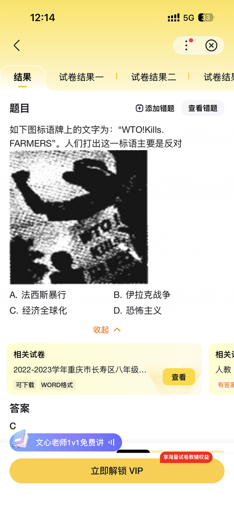

[toc]

# 问题

提问者：**<a href="https://www.zhihu.com/people/nu-li-pin-bo-77-95">温柔职场小胖</a>**
提问时间: 2026-2-13 4:4:3
总回答数: 0
总访问量: 0

当初克林顿看到了什么，同意中国加入世界经贸组织？他的初心是什么……

# 回答

回答者： **<a href="https://www.zhihu.com/people/way-ei">夜静魂梦归</a>**
回答时间: 2026-7-23 15:32:33
点赞总数: 7778
评论总数: 674
收藏总数: 2383
喜欢总数：285

这个问题让我意识到自己已经是中老登了。

当年我们上学的教材上，写的都是加入WTO后，国产品牌受到外国品牌和资本冲击，中国吃亏的故事。

比较有名的案例有日化品牌：

### 小护士：2003年被法国欧莱雅集团全资收购，是欧莱雅入华后首次本土并购。

结局：欧莱雅核心目的是获取小护士覆盖全国的下沉渠道，收购后将资源全面倾斜给自有品牌 “卡尼尔”，小护士产品线持续收缩，终端网点逐步清退，如今市场上已基本绝迹。

### 大宝：2008年美国强生以23亿元全资收购北京大宝，创下当时国内日化并购金额纪录。

结局：品牌得以保留，但长期被锁定在低端平价赛道，研发投入、品牌升级几乎停滞，“大宝天天见” 的国民度大幅下滑，沦为强生旗下边缘产品线。

### 丁家宜：2011年法国科蒂集团收购丁家宜多数股权。

结局：外资团队替换本土运营后，业绩连续暴跌，品牌被快速边缘化，几乎从商超渠道消失；2015 年原创始人回购品牌，但已错过行业黄金发展期，至今未能恢复巅峰。

### 丝宝日化（舒蕾、美涛、风影、顺爽）：2007年德国拜尔斯道夫收购丝宝日化全部洗护业务，拿下舒蕾、美涛四大本土品牌。

结局：曾是能与宝洁、联合利华抗衡的本土洗护龙头，收购后资源持续向拜尔斯道夫自有品牌倾斜，四大品牌市场份额逐年萎缩，逐步退出主流竞争。

### 羽西：2004年被欧莱雅集团收入麾下。

结局：定位高端彩妆护肤线，品牌未被直接雪藏，但声量和渠道资源远不如巅峰期，成为欧莱雅旗下小众补充品牌。

洗涤用品品牌：

### 熊猫洗衣粉：90年代 “南有白猫，北有熊猫”，是北方洗衣粉龙头；1994年与美国宝洁合资，宝洁获得品牌50年使用权。

结局：合资后宝洁立即雪藏熊猫品牌，将生产线全部转产自有品牌汰渍、碧浪；2000 年中方不惜代价收回商标，但被雪藏 6 年后市场根基已毁，至今未能恢复。

### 活力28：1996年与德国美洁时（后归属利洁时）合资，德方控股60%。

结局：外资违背合资约定，全力推广自有品牌 “巧手”，活力 28 逐年减产，2006 年全面停产，彻底消失十余年；直到 2019 年后才通过直播电商重新复兴。

饮料行业：

### 乐百氏：2000年法国达能以23.8亿元收购乐百氏92%股权，拿下当时乳饮行业第二品牌。

结局：达能直接砍掉乐百氏核心的AD钙奶产品线，放弃 “27 层净化” 的饮用水心智，将全国渠道全部倾斜给自有品牌脉动；创业团队集体离职，乐百氏快速衰落，仅存小众饮用水业务；2016年达能将其整体甩卖。

### 天府可乐：1994年与百事可乐合资，百事控股60%；巅峰时占据国内可乐市场75%份额，是国宴指定饮料。

结局：合资后百事逐年减产天府可乐，生产线转产百事可乐、美年达，品牌被雪藏十余年，市占率跌至接近为0；2013年中方追回品牌，2016年复出。

### 北冰洋汽水：1994年与百事可乐合资。

结局：合资后北冰洋生产线全部用来生产百事旗下产品，品牌被直接停产雪藏 15 年；2011 年中方收回品牌经营权，借国潮东风重新崛起。

### 山城啤酒（重庆啤酒旗下）：2013年丹麦嘉士伯完成对重庆啤酒的绝对控股。

结局：嘉士伯入主后大幅削减山城啤酒的推广资源，全力主推自有品牌，山城啤酒产销量从巅峰100万吨跌至不足10万吨，濒临消亡，后续引发商标权纠纷诉讼。

### 哈尔滨啤酒：2004年百威英博以 7.17 亿美元全资收购，拿下中国历史最悠久的啤酒品牌。

结局：品牌保留但逐步区域化，全国市场资源向百威主品牌集中，从全国性品牌退化为东北区域品牌。

食品与餐饮行业：

### 小肥羊：2011年美国百胜餐饮集团（肯德基、必胜客母公司）以46亿港元私有化小肥羊，从港股退市。

结局：曾是国内火锅第一品牌，巅峰门店超700家；百胜接手后用西式快餐逻辑运营火锅，品牌基因尽失，门店持续关店收缩，如今全国仅剩20余家，基本退出主流火锅赛道。

### 太太乐鸡精：2000年雀巢收购80%股份，2016年实现全资控股。

结局：品牌名称保留，但研发和战略自主性大幅下降，成为雀巢在中国调味品市场的渠道载体。

### 银鹭食品：2011年雀巢收购60%股权。

结局：八宝粥、花生牛奶核心品类创新停滞，品牌逐步老化；2020 年雀巢将银鹭股权出售，品牌重回中资。

其他行业：

### 南孚电池：2003年被美国吉列收购，后随吉列并入宝洁体系。

结局：外资为保护自有品牌 “金霸王”，刻意限制南孚的扩张和新品研发；2014年鼎晖投资从宝洁手中回购南孚，品牌回归后重回国内电池行业龙头。

### 苏泊尔：2006年法国SEB集团获得控股权，目前持股比例超80%。

结局：品牌保留且营收规模增长，但更多承担SEB全球代工厂角色，研发投入长期偏低，每年超8成利润流向外资股东，自主品牌高端化进展缓慢。

### 白加黑感冒药：2006年德国拜耳收购白加黑品牌。

结局：曾是国民级感冒药，收购后市场推广资源大幅削减，份额持续下滑，逐步淡出主流药品市场。

### 三笑牙刷：2003年美国高露洁收购三笑牙刷业务。

结局：曾是全球最大牙刷生产商，收购后高露洁主推自有品牌，三笑品牌被边缘化，逐步退出中高端市场

___

那些说西方国家心善，上面的案例给你答案了么？

中国加入WTO，也是经历一个“WTO是坏的→WTO有利有弊→WTO整体是好的”变化。加入WTO经济变差的国家也不少，比如：

### 海地：1996年正式加入WTO，被迫将大米进口关税从50%降至3%，完全放弃了对本土农业的保护。

结局：粮食自给率从1980年代的近90%暴跌至不足 20%，全国80%的大米依赖进口，成为美国大米第四大进口国，粮食安全完全被国际粮价和美国粮商绑定。数百万农民破产，大量人口涌入城市贫民窟，农村经济彻底凋敝，全国贫困率长期维持在70%以上，经济高度依赖外援和侨汇，陷入 “越开放越贫困” 的恶性循环。

本问题题主崇拜的克林顿总统曾表态：强制海地开放农产品市场“是一个错误”—— 政策只惠及了美国农场主，却摧毁了海地本土农业根基。

### 墨西哥：1986年加入GATT、1995年成为WTO创始成员，1994年同步生效北美自贸协定（NAFTA），全面对美加开放市场。

结局：美国对玉米、大豆、小麦等主粮提供高额补贴，生产成本仅为墨西哥的1/3到1/2。市场开放后美国农产品大量涌入，墨西哥国内玉米价格3年内下跌48%，超300万小农户濒临破产，玉米、菜豆等传统主粮产业全面萎缩。

墨西哥农业陷入长期结构性衰退，农村贫困率持续上升，大量失地农民被迫非法移民美国，同时催生了庞大的毒品种植与走私产业，成为长期社会顽疾。出口制造业虽有规模增长，但核心技术、品牌和渠道被美资掌控，利润大量外流，本土企业升级空间被严重挤压。

### 阿根廷：1995年随WTO成立正式成为成员，同期梅内姆政府大幅削减关税、全面放开外资准入，将石油、电信、电力、铁路、银行等核心国有企业以极低价格出售给外资

结局：西班牙、美国资本抄底阿根廷命脉产业，西班牙雷普索尔收购阿根廷国家石油公司后，年利润率高达142%；法国、美国资本控制了全国90%以上的电信、电力和银行业。进口商品零壁垒涌入，本土制造业企业大量倒闭，工业化进程出现倒退，国家从工业国退化为依赖资源出口的经济体。资本账户完全开放，外资自由进出；1997年亚洲金融危机后，国际资本集中抽逃，阿根廷外汇储备快速耗尽，货币局制度难以为继。

2001年爆发当时人类历史上规模最大的主权债务违约，经济连续4年负增长，GDP累计萎缩超20%，失业率突破20%，全国半数人口陷入贫困，社会动荡频发。国家经济主权大幅丧失，能源、公用事业、金融等命脉产业长期被外资控制，利润持续汇出海外，国内资本积累能力被严重削弱。

### 菲律宾：1995年加入WTO，是东南亚地区受入世负面冲击较显著的国家，本土农业和中小企业双双受挫

结局：按WTO承诺取消除大米外所有农产品配额，美国补贴的玉米、小麦、冷冻鸡肉低价涌入，本土玉米种植面积缩减 20%，家禽养殖业近乎全军覆没。大范围取消外资准入限制，跨国企业凭借资本和技术优势挤压本土中小企业，本土轻工、电子企业批量倒闭。

入世头5年，全国超100万农业岗位流失，制造业近50万工人失业；2002年平均每天有200多家中小企业关停。经济长期低速增长，失业率长期居东南亚前列，被迫走上 “劳务输出立国” 的道路，海外劳工汇款成为经济核心支柱，本土产业空心化持续加剧。

___

所以中国能形成“WTO是正面”的共识，本质上还是所有人努力的结果。

国家制度层面，就是咱们制度先进，政府有能力，所以趋利避害，将一把双刃剑变成得心应手的武器，不仅促进本国经济发展，还能冲击外国市场。

企业经济层面，虽然存在大量买办资本，但每个时代都有一批爱国企业家挑大梁，还有国有企业当顶梁柱。真正有价值的企业持续为国家经济发展输入动力。

组织个人层面，虽然有那么多恨国党、润人，但国内大多数人还是能分辨出谁是我们的朋友，谁是我们的敌人，所以保持住了政治舆论环境稳定，让跨国资本无法肆意收割。

当年让中国加入WTO，美国人看我们和今天看菲律宾没啥不同，就是一个任人摆布的猴子。但咱们争气，不仅站起来了，更是成为舵手，住在了WTO的上层甲板，反过来对那些曾经的上等舱乘客发号施令。

今天WTO中的大多数国家已经忘记当年为啥加入WTO，对自己在WTO中的定位和作用也一无所知，压根不知道自己在这套国际贸易体系中是赚了还是亏了。

少数觉醒者，比如印度，他们面对于WTO上等舱乘客吸血本国市场，能使用的武器也有限，不得不采取更加过激的行为来保护本国民族企业，也就是咱们看到的一视同仁的印度赚钱印度花，一分别想带回家。

今天的国人，如果以为WTO就是好的，中国的一切经济成果来源于WTO恩赐，那就是本末倒置。失去了警惕下，下次西方国家再搞糖衣炮弹，吃亏的就是自己。

这样的案例已经太多太多，那些在国内安全环境长大的孩子，去了国外成为小偷、绑架犯、诈骗分子的目标，还要被其他看热闹的人说成自己不小心，不懂国外规则，哑巴吃黄连有苦说不出。这样的坑，咱们不能总跳进去，毕竟我们的钱都是辛辛苦苦赚来的，不是靠对外掠夺原始积累来的。

即便对于中国人来说，WTO 90%是好的，我们是规则受益者，也要牢记那些被WTO冲击消亡的品牌，因为这才是WTO原本的样子。

  

原文地址：[(夜静魂梦归)克林顿因何原因支持中国加入WTO？](https://www.zhihu.com/question/2005492379386413306/answer/2063647703368781880) 

# 评论

1. <a href="https://www.zhihu.com/people/bai-yu-34-45">白莫莫</a> (<small title="浙江">2026-7-23 16:46:56</small>): 最大头的汽车销量 国产反超合资也就这几年的事情，刚加入wto国产车的销量更是低到个位数百分比的
   - <a href="https://www.zhihu.com/people/fu-ying-93">huang liu</a> (<small title="中国香港">2026-7-23 18:10:23</small>): 80年代北京大街就到处是外国车了，波兰华沙牌捷克斯柯达一大堆。
   - <a href="https://www.zhihu.com/people/wu-kong-70-1">潜龙在渊</a> (<small title="河北">2026-7-23 19:21:8</small>): 还记得意林上的文章  
 
日本老师带它们的小孩在天安门前大街上数来往汽车里有几个日系车
   - <a href="https://www.zhihu.com/people/hayzh-13">hayzh</a> (<small title="回复于 2026-7-23 21:2:9/北京"> ✉️:huang liu</small>): 伏尔加、拉达、波罗奈兹。
   - <a href="https://www.zhihu.com/people/nick-zhang-22">非常道</a> (<small title="重庆">2026-7-23 22:22:29</small>): 是的，就是在疫情前可以说全国人民都认为国产燃油车没戏了，哪知疫情后新能源爆发，连国产燃油车在国外销量也猛涨！当然也得感谢欧美公子的大火箭！［大笑］［大笑］
   - <a href="https://www.zhihu.com/people/Heinz-Steinmann-70">HeinzN</a> (<small title="上海">2026-7-23 22:36:58</small>): 90年代夏利是大中城市的出租车主力车型，01年后迅速绝迹，当然这车产品力本身就有问题也是一部分原因
   - <a href="https://www.zhihu.com/people/miao-jiao-83">蛙年</a> (<small title="浙江">2026-7-24 4:38:20</small>): 力帆造个车能造出方向盘不正对驾驶员，国产车那会儿除了便宜点之外就没竞争力
   - <a href="https://www.zhihu.com/people/fu-ying-93">huang liu</a> (<small title="回复于 2026-7-24 4:45:17/中国香港"> ✉️:蛙年</small>): 力帆用的日本20年前的技术，摩托车学的是本田的落后技术，自然就会越来越落后。
   - <a href="https://www.zhihu.com/people/fu-ying-93">huang liu</a> (<small title="回复于 2026-7-24 4:46:46/中国香港"> ✉️:非常道</small>): 疫情期间据说是德国转让了洗衣机的电机技术，以前国产洗衣机力量不足，转让之后电机水平起来了，汽车电机就攻克了，加上特斯拉转让了电池管理技术国产化，于是一下子就发展水平到了顶端。
   - <a href="https://www.zhihu.com/people/jiang-jiang-16-29-16">食肉库玛</a> (<small title="回复于 2026-7-24 5:9:4/辽宁"> ✉️:huang liu</small>): 德国自己的电车都没造明白呢还转让［大笑］
   - <a href="https://www.zhihu.com/people/67-57-69-22">起名字真烦</a> (<small title="回复于 2026-7-24 7:50:9/广东"> ✉️:huang liu</small>): 这你都信［大笑］
   - <a href="https://www.zhihu.com/people/che-lei-chao">影子看不见</a> (<small title="回复于 2026-7-24 8:25:46/山西"> ✉️:huang liu</small>): 你这话要是20年前说，可能还真有人会信
   - <a href="https://www.zhihu.com/people/lv-xin-86-10">天上星</a> (<small title="回复于 2026-7-24 9:1:47/浙江"> ✉️:huang liu</small>): 好美🧠
   - <a href="https://www.zhihu.com/people/magicfire-58">magicfire</a> (<small title="回复于 2026-7-24 9:22:36/广东"> ✉️:huang liu</small>): 这个不至于吧，洗衣机的电机才多大马力一个。
   - <a href="https://www.zhihu.com/people/lanjieying">lanjieying</a> (<small title="回复于 2026-7-24 9:24:51/北京"> ✉️:huang liu</small>): 哈哈哈哈哈哈哈哈哈
   - <a href="https://www.zhihu.com/people/qqqq-33-80-83">qqqq</a> (<small title="回复于 2026-7-24 9:42:9/陕西"> ✉️:huang liu</small>): 感谢马圣开源，只给中国开源，马圣一定是党员吧［吃瓜］
   - <a href="https://www.zhihu.com/people/xuexiongwang">xuexiongwang</a> (<small title="回复于 2026-7-24 10:41:23/北京"> ✉️:huang liu</small>): 感谢马圣开源，没有马圣开源哪有中国的新能源［大笑］［大笑］
   - <a href="https://www.zhihu.com/people/dukeyi">阿一</a> (<small title="湖南">2026-7-24 10:56:16</small>): 这就是叙事权的重要性，你说的没人能听到，他说的只往耳朵里钻！［语塞］
   - <a href="https://www.zhihu.com/people/a-lan-18-22">阿岚</a> (<small title="回复于 2026-7-24 11:28:50/湖南"> ✉️:潜龙在渊</small>): 不需要意林，我上大学那会05年上下，四线满大街日本车，我在路边数过，数了前100辆车有超70辆日本车，所以我第一辆车也买了日本车，现在我只看国产电车
   - <a href="https://www.zhihu.com/people/bai-nong-10">水手</a> (<small title="回复于 2026-7-24 17:9:9/江苏"> ✉️:huang liu</small>): 到89年，北京一共才有5000多辆轿车。北京那么大的地方，5000辆轿车就能到处都是了？［捂脸］［捂脸］。
   - <a href="https://www.zhihu.com/people/enzojz">Enzojz</a> (<small title="法国">2026-7-25 4:58:26</small>): 刚加入wto的时候哪来的国产车。。。
   - <a href="https://www.zhihu.com/people/wa-wa-feng-feng-hui-hui">飞天大黑狗</a> (<small title="回复于 2026-7-25 8:31:12/广东"> ✉️:非常道</small>): 疫情前，哈弗H6长期占领紧凑型SUV销量第一的宝座，什么吉利博瑞啊之类一大堆国产燃油车也很能打。你的信息或者记忆不准确。
   - <a href="https://www.zhihu.com/people/nick-zhang-22">非常道</a> (<small title="回复于 2026-7-25 8:45:18/山西"> ✉️:飞天大黑狗</small>): 少数几款性价比车型说明不了什么，那时国产车在国内就是低价低质高配的形象。短短几年，不说新能源已经冲击中高端成功，就是燃油车同级里国产车也和合资竞品打得有来有回，在现在年轻人中合资外资没有光环了
   - <a href="https://www.zhihu.com/people/victor-xu-45">匆匆过客</a> (<small title="回复于 2026-7-25 9:46:12/重庆"> ✉️:huang liu</small>): 开啥玩笑啊
   - <a href="https://www.zhihu.com/people/victor-xu-45">匆匆过客</a> (<small title="回复于 2026-7-25 9:53:23/重庆"> ✉️:非常道</small>): 疫情前时，吉利、长安、奇瑞、长城都已经是百万销量或者接近百万销量。如果不是新能源突然崛起，燃油车也到了突破点。这几家车企都有多款车型月销量上万甚至几万的车型。
   - <a href="https://www.zhihu.com/people/chen-xiao-a-69">且听风吟</a> (<small title="回复于 2026-7-25 9:56:30/湖北"> ✉️:huang liu</small>): 我印象中是零几年，比亚迪就收购陕西秦川汽车，开始搞电动车了，跟特斯拉有半毛钱关系，马斯克这种冷血资本家，本公司员工说开就开的人，能有这么好心
   - <a href="https://www.zhihu.com/people/qqqq-33-80-83">qqqq</a> (<small title="回复于 2026-7-25 9:59:11/陕西"> ✉️:匆匆过客</small>): 这就岁月史书上了，19年前后国产车市场占有率是下降的，那时候买过车的都知道合资是什么嘴脸
   - <a href="https://www.zhihu.com/people/wang-jun-98-42-17">小楼一夜听春雨</a> (<small title="回复于 2026-7-25 10:42:19/河南"> ✉️:huang liu</small>): 神论［思考］
   - <a href="https://www.zhihu.com/people/xue-yu-xiao-chuan">来根红双喜</a> (<small title="回复于 2026-7-25 11:38:46/河北"> ✉️:huang liu</small>): 特斯拉和德国这么牛逼，他们自己知道吗？［打招呼］
   - <a href="https://www.zhihu.com/people/shu-lan-38-67">舒澜</a> (<small title="回复于 2026-7-25 11:49:14/山东"> ✉️:huang liu</small>): 香港怎么没有电动汽车品牌，是德国不转让洗衣机还是马斯克不对香港开源？
   - <a href="https://www.zhihu.com/people/chen-zhi-yuan-80-71">花之庆次</a> (<small title="回复于 2026-7-25 12:8:43/上海"> ✉️:huang liu</small>): 大春
   - <a href="https://www.zhihu.com/people/xiao-zhi-xiao-ye">萧之肖爷</a> (<small title="山东">2026-7-25 14:42:4</small>): 汽车行业，才好了几年啊，2020年之前，都是合资品牌在主导我们的市场。前面的十几年，就是被外国品牌按在地上摩擦，没死绝就是莫大的奇迹［飙泪笑］［飙泪笑］［飙泪笑］
   - <a href="https://www.zhihu.com/people/xiao-zhi-xiao-ye">萧之肖爷</a> (<small title="回复于 2026-7-25 14:51:9/山东"> ✉️:匆匆过客</small>): 百万级的长城， 当时应该是国产第一吧。但合资品牌，不说大众丰田本田日产通用福特现代，就是起亚，也把长城摁地上摩擦。跟外企牌子，完全不是一个量级的，彼时的比亚迪，正在转型电车，F3，F6这种爆款，基本处于停滞状态，谁也想不到，短短几年后的BYD，居然可以跟全球巨头掰手腕了［大笑］［大笑］［大笑］
   - <a href="https://www.zhihu.com/people/wu-ming-70-17">吴铭</a> (<small title="回复于 2026-7-25 15:16:15/河北"> ✉️:huang liu</small>): 你可得了吧，睡觉去吧，梦里什么都有
   - <a href="https://www.zhihu.com/people/victor-xu-45">匆匆过客</a> (<small title="回复于 2026-7-25 15:29:4/重庆"> ✉️:萧之肖爷</small>): 2021年，东风就把东风悦达起亚的股份全卖了，梦里摩擦长城？
   - <a href="https://www.zhihu.com/people/xiao-zhi-xiao-ye">萧之肖爷</a> (<small title="回复于 2026-7-25 16:25:23/山东"> ✉️:匆匆过客</small>): 那是萨德事件的影响，别说起亚，就是现代，就是三星， 不一样逐步败走？东风是央企，再攥着要死掉的牌子，没必要。
   - <a href="https://www.zhihu.com/people/victor-xu-45">匆匆过客</a> (<small title="回复于 2026-7-25 17:28:37/重庆"> ✉️:萧之肖爷</small>): 2019年，起亚在中国销量20多万，属于被摩擦的。
   - <a href="https://www.zhihu.com/people/lakeoffire">lakeoffire</a> (<small title="内蒙古">2026-7-26 1:9:17</small>): 华晨宝马还是不错的！还有海南马自达！北汽福田！一汽大众！
   - <a href="https://www.zhihu.com/people/89-33-33-1">森下下士</a> (<small title="回复于 2026-7-26 3:35:13/江苏"> ✉️:huang liu</small>): HK教育水平之低下令人叹为观止［飙泪笑］
   - <a href="https://www.zhihu.com/people/xiao-yi-44-32">七点十三横</a> (<small title="回复于 2026-7-26 8:37:16/湖北"> ✉️:huang liu</small>): 请问德国转让的洗衣机电机技术转让给了哪家公司？我家在疫情后也买过洗衣机，我感觉清洁能力和疫情前也没什么区别。而且家用洗衣机即使装满水最多也才一百多公斤，电动汽车除了A0级小车外，一般至少1.5吨，至少10倍重量差距你倒告诉我怎样通过洗衣机电机来攻克汽车电机
   - <a href="https://www.zhihu.com/people/yong-hu-7540293070">华北猛男</a> (<small title="回复于 2026-7-26 8:44:58/北京"> ✉️:潜龙在渊</small>): 那时候能开上日本车也是挺有面子的事了［捂脸］
   - <a href="https://www.zhihu.com/people/xiao-zhi-xiao-ye">萧之肖爷</a> (<small title="回复于 2026-7-27 9:36:2/山东"> ✉️:匆匆过客</small>): 就是现在，起亚在大陆卖不了几辆了，依然不是长城能碰瓷的。长城现在还是百万辆的水准，也早就不是大陆第一自主品牌了，起亚只是在合资大溃败之前就败走而已，全体量依然可以摁着长城摩擦。2020年前的汽车市场，多数人就是认为合资车更好更多人愿意买；短短几年后，这个认知发生了反转，自主品牌销量逐渐赶超了合资。至于长城，还是那个洋人之下他第一的心态，也还是那个市场体量。
   - <a href="https://www.zhihu.com/people/aa-28-35-56">知乎用户aa</a> (<small title="北京">2026-7-27 9:53:22</small>): 不是不搞合资不准进来吗，咱也不亏啊
2. <a href="https://www.zhihu.com/people/weasty">weasty</a> (<small title="湖南">2026-7-23 17:31:39</small>): 还有各地自来水厂，真不明白关乎民生的企业也被出售。  
 
  
 
当时有自我限制的名词叫：“游戏规则”，甩锅的叫“交学费”。
   - <a href="https://www.zhihu.com/people/li-sai-liu-42">黎塞留</a> (<small title="广东">2026-7-23 19:49:11</small>): 当地政府没钱呗
   - <a href="https://www.zhihu.com/people/modern-86">督公回來了嗎</a> (<small title="中国香港">2026-7-23 21:17:48</small>): 因為2000年左右，新自由主義是最厲害的時候，私有化是主旋律，即使香港也不例外
   - <a href="https://www.zhihu.com/people/pcha">泡茶茶</a> (<small title="广东">2026-7-23 22:19:48</small>): 91年苏联解体，此后公有制一度被质疑，国家穷、人穷，地方揭不开锅，国企、乡镇企业大多亏损，卖水厂还被当成减轻负担呢。
   - <a href="https://www.zhihu.com/people/xu-yan-1-36">许彦</a> (<small title="回复于 2026-7-23 23:55:59/天津"> ✉️:督公回來了嗎</small>): 香港不是从港英时代就是低税小政府的自由主义模范吗……
   - <a href="https://www.zhihu.com/people/modern-86">督公回來了嗎</a> (<small title="回复于 2026-7-24 1:25:44/中国香港"> ✉️:许彦</small>): 沒那麼簡單，本質上香港的公共服務還有很多的 ，起碼有大約五成香港人住在政府提供的公共房屋
   - <a href="https://www.zhihu.com/people/cuso4-77">小山</a> (<small title="云南">2026-7-24 1:43:18</small>): 因为没技术啊，我爷爷退休后就被昆明市请去摸底一个日本自来水厂的技术，发现对方的自动化信息化水平远超我国，于是昆明自来水厂痛快地和小日子合资了
   - <a href="https://www.zhihu.com/people/zjl-5-55">ZJL</a> (<small title="回复于 2026-7-24 7:52:4/广东"> ✉️:督公回來了嗎</small>): 香港公屋比例有五成那么高吗
   - <a href="https://www.zhihu.com/people/modern-86">督公回來了嗎</a> (<small title="回复于 2026-7-24 7:59:22/中国香港"> ✉️:ZJL</small>): 香港人口按房屋類別分布  
 
  
 
公營租住房屋（公屋）： 約佔 29.3%  
 
  
 
資助自置居所房屋（如居屋）： 約佔 15.7%  
 
  
 
私人永久性房屋（私樓）： 約佔 52.9%  
 
  
 
臨時房屋或其他： 約佔 0.7% 至 2.1%
   - <a href="https://www.zhihu.com/people/leapant">四体不勤</a> (<small title="黑龙江">2026-7-24 8:12:34</small>): 毕竟当时没钱，跟各种游戏工作室都盼着大厂收购一样，可钱你拿到了权就没了［doge］
   - <a href="https://www.zhihu.com/people/shen-yu-wo-tong-zai-7">倒计时开始v的</a> (<small title="回复于 2026-7-24 9:49:52/上海"> ✉️:督公回來了嗎</small>): 所有媒体都拿外资的宣传费和好处，就算到最近还有炒作煤油车运食用油报道，发现也运金龙鱼一下就没声了
   - <a href="https://www.zhihu.com/people/modern-86">督公回來了嗎</a> (<small title="回复于 2026-7-24 10:5:40/中国香港"> ✉️:倒计时开始v的</small>): 不是說媒體，是整個社會氣芬，我是整個時期的親歷者，那時候整體社會對私型化是無比正確，之後各種中小學變成直資（大概是半政府半營運學校，學費由之前每年幾百變成幾萬），醫院縮減開支（後來因03Sars改變了整個方向），公屋商場街市變私營後上巿港股，出售公屋等等
   - <a href="https://www.zhihu.com/people/810705">wuzhan</a> (<small title="广东">2026-7-24 10:53:6</small>): 这个事情你要看当时的地方财政情况，不是一句关乎民生就能凭空把钱变出来了。另外，zf投资顺序是什么，水厂能排在前面吗？
   - <a href="https://www.zhihu.com/people/chang-wei-46-73">想不出来名</a> (<small title="江苏">2026-7-25 2:59:31</small>): 你能进入别人市场不允许别人进入你的市场，等你什么时候比全世界加起来还强大几倍再说，不然别人一定会反抗的。
   - <a href="https://www.zhihu.com/people/An0nym0us">Sylvan</a> (<small title="江苏">2026-7-25 7:28:45</small>): 威立雅 中华煤气只是参股，没有这些先进企业指导，城市化进程效率肯定要受影响
   - <a href="https://www.zhihu.com/people/bu-zhi-dao-86-91">自在玩</a> (<small title="江苏">2026-7-25 9:37:18</small>): 犹太蜜糖有有毒药
   - <a href="https://www.zhihu.com/people/reseted1780893179667">rabbish</a> (<small title="上海">2026-7-25 11:22:50</small>): 因为自来水厂在公有化运营的时候，确实是亏损的呀。举个例子，各级部门领导打个招呼，自来水厂就哼哧哼哧铺段管子过去，还不一定能收费。打招呼的领导倒是省了钱，亏损算公有水厂的，本质上不还是全民负担？
   - <a href="https://www.zhihu.com/people/ling-mao-wu-ying">灵猫无影</a> (<small title="辽宁">2026-7-25 13:33:40</small>): 撒切尔当年就是这么干的，把自来水厂这些关乎民生的国企全都卖给国外资本了，当时确实甩掉了包袱还回笼了一些资金，但从那以后大英的独立自主权就彻底没有了
   - <a href="https://www.zhihu.com/people/gu-dao-xi-feng-shou-ma-43">古道西风瘦马</a> (<small title="四川">2026-7-25 14:44:11</small>): 有些东西是加入的时候就签字了的
   - <a href="https://www.zhihu.com/people/aline-huang-96">Aline Huang</a> (<small title="回复于 2026-7-25 21:18:21/广东"> ✉️:督公回來了嗎</small>): 公屋比例这么高，不恰恰说明港英政府垃圾吗？咱同步不是还要看人均面积嘛。
   - <a href="https://www.zhihu.com/people/modern-86">督公回來了嗎</a> (<small title="回复于 2026-7-25 21:41:35/中国香港"> ✉️:Aline Huang</small>): 你所說的和討論新自由主義有什麽關係？認真一些好嗎？
   - <a href="https://www.zhihu.com/people/xiang-qiang-69">胡志鹏</a> (<small title="湖北">2026-7-25 23:38:8</small>): 关乎民生的才应该出售
   - <a href="https://www.zhihu.com/people/bei-jing-shen-gun-30">北京神棍</a> (<small title="回复于 2026-7-26 0:36:3/北京"> ✉️:倒计时开始v的</small>): 《国务院食安办通报对媒体反映的“罐车运输食用植物油乱象问题”调查处置情况》
   - <a href="https://www.zhihu.com/people/wo-ding-ni-ge-fei-ya-78">我顶你个肺</a> (<small title="河北">2026-7-26 5:31:25</small>): 汉奸内鬼太多了。
   - <a href="https://www.zhihu.com/people/shuang-shu-xia-de-he-shang">双树下的和尚</a> (<small title="河南">2026-7-26 9:41:12</small>): 那时候就行产业化，从上到下还有任务。我家这里就把医疗教育差点都产业化了，结果现在这两项都是全省倒数。
   - <a href="https://www.zhihu.com/people/zackyoung">知白守黑</a> (<small title="湖南">2026-7-26 9:48:3</small>): 不是，你以为国企没卖的都是因为关乎民生吗？你告诉我烟草关乎啥民生了
   - <a href="https://www.zhihu.com/people/pu-cheng-yang-10">渭水無贤</a> (<small title="回复于 2026-7-26 13:48:38/广东"> ✉️:督公回來了嗎</small>): 为什么香港五成多人都买不起房，是因为他们懒吗，为什么香港房价这么贵还有这么多人能买房，是因为他们聪明吗
   - <a href="https://www.zhihu.com/people/modern-86">督公回來了嗎</a> (<small title="回复于 2026-7-26 14:36:45/中国香港"> ✉️:渭水無贤</small>): 那麼你也可以想想為什麼廣州有人買不起房，是因為懶還是什麽？
   - <a href="https://www.zhihu.com/people/xie-ling-yun-98-48">谢灵运</a> (<small title="福建">2026-7-27 9:13:50</small>): 我们隔壁县财政破产，能卖的都卖了［飙泪笑］
   - <a href="https://www.zhihu.com/people/zhang-hai-zhou-90">JoeyZZ</a> (<small title="回复于 2026-7-27 9:47:20/江苏"> ✉️:知白守黑</small>): 那当然是赔钱的才卖啊，赚钱的还卖那不是傻子吗？
   - <a href="https://www.zhihu.com/people/wang-han-89-51">今天嘉宝止蚀了吗</a> (<small title="辽宁">2026-7-27 9:50:20</small>): 为什么不能出售？我就好奇这种出厂预设思想是哪来的模因［思考］
   - <a href="https://www.zhihu.com/people/zhao-qing-hua-29">不吃南瓜的老赵</a> (<small title="广东">2026-7-27 9:55:12</small>): 这世上有不关乎国计民生的产业吗？
3. <a href="https://www.zhihu.com/people/Xixidaozhang">嘻嘻道长</a> (<small title="江苏">2026-7-23 18:30:13</small>): 上海英雄钢笔当时也挺危险的，硬是挺过来了。我记得2000年初小学学写钢笔字的时候，条件好的同学都用派克钢笔，我们当时普通条件的学生要么用杂牌要么就用英雄［飙泪笑］
   - <a href="https://www.zhihu.com/people/wo-ceng-zuan-san-sha-wang-zhe">我曾钻三杀王者</a> (<small title="江苏">2026-7-23 19:0:50</small>): 聊钢笔的都来了，真就一切责任在美帝
   - <a href="https://www.zhihu.com/people/hljszswby">米夏埃尔</a> (<small title="回复于 2026-7-23 19:8:7/广东"> ✉️:我曾钻三杀王者</small>): 这是触发了什么应激［捂脸］
   - <a href="https://www.zhihu.com/people/xu-zhu-97-60">我是谁</a> (<small title="回复于 2026-7-23 19:31:35/江苏"> ✉️:我曾钻三杀王者</small>): 你怎么又难受了
   - <a href="https://www.zhihu.com/people/luan-jian-60">不吃刨冰</a> (<small title="天津">2026-7-23 20:38:41</small>): 但是派克钢笔写中文确实不好用啊，比英雄差远了。
   - <a href="https://www.zhihu.com/people/yin-han-xun-18">清心寡欲完颜亮</a> (<small title="江苏">2026-7-23 21:20:46</small>): 英雄本厂的质量不错，但是还是有些生产线品控不好，而且假笔太多。现在有网购了，直接买正品还好一点，以前去文具店买英雄钢笔就是抽卡摸奖
   - <a href="https://www.zhihu.com/people/kobepang-87">kobe庞</a> (<small title="回复于 2026-7-23 21:27:14/江苏"> ✉️:清心寡欲完颜亮</small>): 死去的记忆在攻击我，记得当年买钢笔都需要去店里一支一支试笔，品控很差，不知道现在如何了
   - <a href="https://www.zhihu.com/people/zhang-ling-qun">张凌群</a> (<small title="回复于 2026-7-23 21:30:55/浙江"> ✉️:清心寡欲完颜亮</small>): 没错，当时可以说99%是义乌生产的，本来就不咋滴名声被败坏的无以复加。
   - <a href="https://www.zhihu.com/people/zhisytk15u">刘留流</a> (<small title="广东">2026-7-23 22:49:58</small>): 我小学的时候也是买的英雄笔，你不说我都忘记了
   - <a href="https://www.zhihu.com/people/river001">一分流水</a> (<small title="北京">2026-7-23 23:14:33</small>): 英雄的品控不行，好不好用全看运气
   - <a href="https://www.zhihu.com/people/zczcmpf">zczcmpf</a> (<small title="回复于 2026-7-24 2:7:11/江苏"> ✉️:kobe庞</small>): 现在也不行，我买的英雄100和永生629(和英雄一个母公司了现在)，都有问题。相反一些新晋的国产牌子还不错，有些牌子甚至有惊喜，钢尖也能做到非常好的写感
   - <a href="https://www.zhihu.com/people/zczcmpf">zczcmpf</a> (<small title="江苏">2026-7-24 2:10:11</small>): 大概20年前我买钢笔都只能选凌美，那会国产就没什么好选择。这两年国产钢笔全面发展，买了好多支弘典，永生，末匠这些，又试了试凌美感觉也不怎么样，还有进口的bock钢尖也就那么回事。倒是不得不承认日本笔品控始终还是稍好一些
   - <a href="https://www.zhihu.com/people/chen-li-jin-1">陈立金</a> (<small title="回复于 2026-7-24 4:23:40/北京"> ✉️:我曾钻三杀王者</small>): 层主并没有一个字责怪你的盎格鲁爷爷，你不必如此受伤。
   - <a href="https://www.zhihu.com/people/snowing-170000">雪意和五点钟</a> (<small title="回复于 2026-7-24 6:42:42/江苏"> ✉️:zczcmpf</small>): 我买的永生601非常好用。
   - <a href="https://www.zhihu.com/people/86-14-3-52">知乎用户0L2hut</a> (<small title="回复于 2026-7-24 7:27:33/湖南"> ✉️:我曾钻三杀王者</small>): 噗，我就说还是得你们去学学逻辑学吧
   - <a href="https://www.zhihu.com/people/you-you-28-41-19">悠悠</a> (<small title="回复于 2026-7-24 7:38:28/四川"> ✉️:我曾钻三杀王者</small>): 钢笔得罪你了？不能聊？
   - <a href="https://www.zhihu.com/people/tu-wu-75-60">突兀</a> (<small title="广西">2026-7-24 7:38:38</small>): 2000年的时候，我用英雄608，五块四一枝
   - <a href="https://www.zhihu.com/people/shawn-58-44-51">shawn</a> (<small title="回复于 2026-7-24 8:5:0/浙江"> ✉️:陈立金</small>): 换个词，主人
   - <a href="https://www.zhihu.com/people/can-long-18">柴犬BS</a> (<small title="回复于 2026-7-24 8:9:10/江苏"> ✉️:我曾钻三杀王者</small>): 666觸發關鍵詞了
   - <a href="https://www.zhihu.com/people/torn333-58">torn333</a> (<small title="广西">2026-7-24 8:34:32</small>): 我读书那阵，英雄算是很高大上的牌子了，都是已经工作人士才能用得起的。
   - <a href="https://www.zhihu.com/people/ha-sa-xin">未济</a> (<small title="回复于 2026-7-24 8:34:44/浙江"> ✉️:我曾钻三杀王者</small>): 又刺激到你哪一根敏感的神经了？
   - <a href="https://www.zhihu.com/people/zhao-hu-ying-69">巴西木好好养</a> (<small title="浙江">2026-7-24 8:56:31</small>): 英雄的低端钢笔也不咋地，笔尖材质有问题，不是断墨就是水龙头，要么就是笔尖劈叉，市场也证明了最适合学生用的还是凌美
   - <a href="https://www.zhihu.com/people/kong-yu-77-49">咕哒子</a> (<small title="上海">2026-7-24 8:59:17</small>): 英雄钢笔没买过，不过用的墨水都是英雄的
   - <a href="https://www.zhihu.com/people/huang-hong-chang-63">缘味冰室的动漫熊</a> (<small title="回复于 2026-7-24 9:28:39/上海"> ✉️:我曾钻三杀王者</small>): 知道你根本不关心国笔了
   - <a href="https://www.zhihu.com/people/song-wen-jun-4-74">一只北极的企鹅</a> (<small title="回复于 2026-7-24 9:30:55/山西"> ✉️:不吃刨冰</small>): 10款以后的卓尔也不错吧，大豆也中规中矩
   - <a href="https://www.zhihu.com/people/zheng-zhong-tian-31">lambda</a> (<small title="广东">2026-7-24 9:45:22</small>): 英雄从当年烂到现在，现在是金豪的时代了
   - <a href="https://www.zhihu.com/people/lulu-93-70-48">lulu</a> (<small title="回复于 2026-7-24 9:47:21/上海"> ✉️:清心寡欲完颜亮</small>): 哈哈哈是的，我手气很差，每次都买的不好的，爸妈说我瞎用，不给我买新的，原来是这个原因。
   - <a href="https://www.zhihu.com/people/chqx2898">chqx2898</a> (<small title="回复于 2026-7-24 9:56:22/浙江"> ✉️:清心寡欲完颜亮</small>): 我说为啥当年英雄有的贼好用，有的用几下就坏了。
   - <a href="https://www.zhihu.com/people/lordpapa">小僧不休</a> (<small title="山西">2026-7-24 10:12:29</small>): 以前用 英雄,后来 我 改用 百乐 了
   - <a href="https://www.zhihu.com/people/rui-xiao-er">瑞小二</a> (<small title="山东">2026-7-24 11:20:15</small>): 英雄烂到极致，漏水，不出水，我小时候用过很多，这辈子不会用了
   - <a href="https://www.zhihu.com/people/miao-miao-miao-19-99">前鬼后鬼的守护</a> (<small title="回复于 2026-7-24 11:52:22/吉林"> ✉️:张凌群</small>): 那时候低端钢笔这一块得看江西文港
   - <a href="https://www.zhihu.com/people/miao-miao-miao-19-99">前鬼后鬼的守护</a> (<small title="回复于 2026-7-24 11:57:51/吉林"> ✉️:zczcmpf</small>): 629是上海格林生产的，他们拿到了永生商标的使用权［捂脸］
   - <a href="https://www.zhihu.com/people/zczcmpf">zczcmpf</a> (<small title="回复于 2026-7-24 11:58:34/江苏"> ✉️:前鬼后鬼的守护</small>): 是的，很多热门型号都是格林在做了
   - <a href="https://www.zhihu.com/people/zczcmpf">zczcmpf</a> (<small title="回复于 2026-7-24 12:0:16/江苏"> ✉️:咕哒子</small>): 英雄墨水真不行，国产墨水还得是鸵鸟
   - <a href="https://www.zhihu.com/people/kong-yu-77-49">咕哒子</a> (<small title="回复于 2026-7-24 14:5:8/上海"> ✉️:zczcmpf</small>): 以前只买过英雄和老板两个牌子［捂脸］不过钢笔用的也少
   - <a href="https://www.zhihu.com/people/you-shi-wang-bao-zi">又是王包子</a> (<small title="回复于 2026-7-25 8:27:2/陕西"> ✉️:悠悠</small>): 2000年几个人用钢笔？
   - <a href="https://www.zhihu.com/people/you-shi-wang-bao-zi">又是王包子</a> (<small title="陕西">2026-7-25 8:27:48</small>): 我们写作业用中性笔，
   - <a href="https://www.zhihu.com/people/yong-gao-20">yong gao</a> (<small title="江苏">2026-7-25 8:49:3</small>): 但是现在英雄和永生也都不怎么样，我觉得白雪目前用下来是最好的
   - <a href="https://www.zhihu.com/people/zhizmrmu5">看看再说吧</a> (<small title="回复于 2026-7-25 8:50:18/山东"> ✉️:我曾钻三杀王者</small>): 遮沙避风了。随便说个事实，你都能扯到美跌身上。
   - <a href="https://www.zhihu.com/people/xiao-xiao-he-lan-zi">潇潇贺兰子</a> (<small title="安徽">2026-7-25 9:18:32</small>): 我们当时用的最多的英雄和永生
   - <a href="https://www.zhihu.com/people/10-40-24-18-8">零度酒精</a> (<small title="回复于 2026-7-25 11:27:35/河北"> ✉️:我曾钻三杀王者</small>): 你咋被禁言了呢
   - <a href="https://www.zhihu.com/people/zhang-han-51-75">venomous</a> (<small title="广东">2026-7-25 11:36:17</small>): 英雄的品控就是狗屎，买10根最后可能就1根很好用
   - <a href="https://www.zhihu.com/people/te-rui-24">特瑞</a> (<small title="回复于 2026-7-25 14:50:9/上海"> ✉️:不吃刨冰</small>): 英雄其实因为太有名，导致假冒的太多了。
 
没用法律武器保护好自己，差点倒掉。
   - <a href="https://www.zhihu.com/people/zhizrccg">ZSYL</a> (<small title="回复于 2026-7-25 15:28:38/陕西"> ✉️:我曾钻三杀王者</small>): 不是，你这就应激了［大笑］
   - <a href="https://www.zhihu.com/people/ping-ping-dan-dan-32-40">听雨的猫</a> (<small title="回复于 2026-7-25 15:37:40/江西"> ✉️:我曾钻三杀王者</small>): 嘬嘬嘬
   - <a href="https://www.zhihu.com/people/zhang-liang-liang-liang-31">张良良</a> (<small title="回复于 2026-7-25 15:52:55/新疆"> ✉️:前鬼后鬼的守护</small>): 还有知道文港的［捂脸］罗氏钢笔
   - <a href="https://www.zhihu.com/people/farlyer11">farlyer11</a> (<small title="回复于 2026-7-25 17:40:42/上海"> ✉️:我曾钻三杀王者</small>): 这是只纯种远程畜牧［飙泪笑］
   - <a href="https://www.zhihu.com/people/superj-4-51">江叔不好鱼</a> (<small title="回复于 2026-7-25 19:0:0/浙江"> ✉️:我曾钻三杀王者</small>): 应激了？
   - <a href="https://www.zhihu.com/people/lakeoffire">lakeoffire</a> (<small title="内蒙古">2026-7-26 1:9:58</small>): 也就江苏孩子。派克那么贵也能买得起
   - <a href="https://www.zhihu.com/people/yuan-lu-lu-13">丨一</a> (<small title="山西">2026-7-26 6:13:59</small>): 英雄也就靠着情怀割韭菜的路边一条，都2026年了还搞不定品控，不是没能力，就是不把消费者当回事而已。老牌子看看人家金豪，新品牌看看人家弘典。
   - <a href="https://www.zhihu.com/people/liu-da-shan-55-69">刘大山</a> (<small title="回复于 2026-7-26 6:33:39/河北"> ✉️:kobe庞</small>): 有假货的，在我们村买的英雄十只有三只不能用。我姐结婚时给我姐夫买的钢笔，我姐夫不用送给我了，结果吸墨水后写不出字……零几年我去医院实习，在某个超市购买英雄钢笔，发现质量非常好，出水流利笔尖还光滑不破纸，当时超市老板父亲是英雄厂退休的，他家钢笔就是原厂钢笔，据老爷子说，巅峰时期市面上最少有六成英雄钢笔都是假的，现在用钢笔的人少了，大量钢笔厂倒闭了，买真笔几率就高了［捂脸］
   - <a href="https://www.zhihu.com/people/yong-hu-7540293070">华北猛男</a> (<small title="北京">2026-7-26 8:45:56</small>): 我小时候也是用英雄钢笔，我只在故事里听说过派克金笔。
   - <a href="https://www.zhihu.com/people/leng-leng-jie-mi-mei-la-la">不反不叫海瑞</a> (<small title="回复于 2026-7-27 9:15:28/河南"> ✉️:不吃刨冰</small>): 派克确实不好用，当年高中成人礼的时候老爹送我了个一千多的精英系列，当时装逼写作业就用钢笔写，最后因为写的太慢没写完抱着凳子滚出去写了［大哭］
   - <a href="https://www.zhihu.com/people/steven-87-20-6">steven</a> (<small title="回复于 2026-7-27 9:47:18/北京"> ✉️:我曾钻三杀王者</small>): 聊笔怎么你了？就聊你这个笔［doge］
   - <a href="https://www.zhihu.com/people/cong-azhan-lai-de">不四不三</a> (<small title="回复于 2026-7-27 9:49:33/上海"> ✉️:我曾钻三杀王者</small>): 招笑非基杯
   - <a href="https://www.zhihu.com/people/1-72-66-3-55">太一安有</a> (<small title="回复于 2026-7-27 10:1:33/北京"> ✉️:我曾钻三杀王者</small>): 也够［尴尬］
4. <a href="https://www.zhihu.com/people/fu-ying-93">huang liu</a> (<small title="中国香港">2026-7-23 18:9:54</small>): 中国最惨烈的就是日化品和消费饮料，全军覆没，到今天也就是网购扳回一城。汽车当时估计是全完蛋，实际上用了一代人时间才赢回来的。
   - <a href="https://www.zhihu.com/people/wei-di-chi-39">江南铁笛</a> (<small title="河南">2026-7-23 20:32:1</small>): 饮料慢慢搬回来了，日化仍然不行（比最低谷时期好点）。
   - <a href="https://www.zhihu.com/people/wondermoon">GT一条街</a> (<small title="上海">2026-7-24 8:25:19</small>): 汽车实打实的差距大，全灭，合资算是换种死法，直到新能源才弯道超车的
   - <a href="https://www.zhihu.com/people/fan-zhi-wei-74-35">R调包侠</a> (<small title="内蒙古">2026-7-24 10:0:57</small>): 我还以为是蜜雪冰城扳回一城［酷］
   - <a href="https://www.zhihu.com/people/xuexmg">xuexmg</a> (<small title="辽宁">2026-7-24 10:1:3</small>): 中国现在有随时收回所有产品制造、销售权力的能力，但不这么做是给别人留条活路。wto使命已经完成。
   - <a href="https://www.zhihu.com/people/wei-gong-zi-44">沐夏</a> (<small title="新疆">2026-7-24 10:17:26</small>): 维他、农夫山泉，你说它们是中国消费饮料吧，市场占有率也高吧，但是···里面的资本家是黄皮白心。就和答主说的一样，资本家也分国界的。
   - <a href="https://www.zhihu.com/people/frederick-65">Frederick</a> (<small title="上海">2026-7-24 10:39:17</small>): 没错，但是不开放的话永远赢不回来。
   - <a href="https://www.zhihu.com/people/SweetCongeee">BIiiin</a> (<small title="上海">2026-7-24 11:10:20</small>): 联合利华和宝洁千禧年瓜分了中国的日化市场，国产品牌死的死卖的卖
   - <a href="https://www.zhihu.com/people/wang-yu-xiang-30-91">神尾观铃</a> (<small title="回复于 2026-7-25 12:4:6/广东"> ✉️:江南铁笛</small>): 看不起立白［思考］
   - <a href="https://www.zhihu.com/people/95-84-25-14-13">还得是你呀</a> (<small title="贵州">2026-7-25 13:26:28</small>): 其实问题不大，都是没啥技术含量的生活品……
   - <a href="https://www.zhihu.com/people/alan-yang-wen-jie">反驳我就是你有错</a> (<small title="广东">2026-7-25 21:43:2</small>): 就只剩个立白好像是
   - <a href="https://www.zhihu.com/people/fu-ying-93">huang liu</a> (<small title="回复于 2026-7-26 0:36:49/中国香港"> ✉️:还得是你呀</small>): 日化品利润很高的
   - <a href="https://www.zhihu.com/people/95-84-25-14-13">还得是你呀</a> (<small title="回复于 2026-7-26 1:27:39/湖北"> ✉️:huang liu</small>): 非国计民生行业，国企都不带看一眼。
   - <a href="https://www.zhihu.com/people/guai-bao-bao-65-29">乖宝宝</a> (<small title="山东">2026-7-26 10:7:28</small>): 汽车一个是靠电动车，一个是前几年差不多吃透了技术，国产燃油车技术跟上了，只是在电车的光环下不显眼，现在全面吊打外资车
5. <a href="https://www.zhihu.com/people/jiang-yi-16-63">不着急赶路的路人</a> (<small title="四川">2026-7-23 17:2:11</small>): 每次主要看到这种说实话的文章，基本上评论都不高［捂脸］［捂脸］［捂脸］
   - <a href="https://www.zhihu.com/people/thomas-zheng-31">大猫</a> (<small title="江苏">2026-7-23 20:54:26</small>): 逼乎会压制的
   - <a href="https://www.zhihu.com/people/e-e-86-71">狼毒</a> (<small title="山东">2026-7-23 21:58:43</small>): 神油觉得自己说的才是实话
   - <a href="https://www.zhihu.com/people/yu-se-cha">于色叉</a> (<small title="北京">2026-7-24 0:46:7</small>): 对吧，远不如乌友们发的“痛打”菜鹅的内容吸引眼球［捂脸］
   - <a href="https://www.zhihu.com/people/98-15-78-6-65">天空之城</a> (<small title="黑龙江">2026-7-25 16:23:33</small>): 你说的很对，评论还没你身高高［大笑］［大笑］［大笑］
   - <a href="https://www.zhihu.com/people/9437676495">五月知竹</a> (<small title="四川">2026-7-27 7:46:22</small>): 你真的看到了实话，你看到了这些企业被压制，但你知道没有加入WTO之前，这些企业都不存在吗？你能明白本地企业在公平竞争的环境中，就没法跟外的企业比，因为他们已经运营了几百年。如果市场是公平的，他就是很容易在漫长的时间中，因为自己没经验，被外资找到机会，这就是竞争。不过我们市场换技术，也是有要求的，限制外资企业
6. <a href="https://www.zhihu.com/people/pi-ren-59-61">十月大</a> (<small title="上海">2026-7-23 20:55:48</small>): 上学时候经常教那种一部手机几百刀，美国设计日韩提供芯片屏幕欧洲营销，我们负责组装，只拿到百分之零点几收入的例子。谈我国科技就是科学水平低创新能力弱。  
 
每每看到都是一边答案一边内心极度悲愤。
   - <a href="https://www.zhihu.com/people/bu-na-mo-ku">不那麽酷</a> (<small title="辽宁">2026-7-24 7:7:36</small>): 现在到了把这些躺着挣钱的国家和公司消灭掉时候了
   - <a href="https://www.zhihu.com/people/lin-bo-xue-75">米尔洛亚</a> (<small title="辽宁">2026-7-24 7:17:25</small>): ［捂脸］衬衫换手机。以前五毛住地下室啃馒头。现在起码月薪3000了
   - <a href="https://www.zhihu.com/people/chen-mao-38">雪尽马蹄轻舟已过</a> (<small title="回复于 2026-7-24 9:20:33/浙江"> ✉️:不那麽酷</small>): 三星：你接着说。
   - <a href="https://www.zhihu.com/people/62-93-35-55">甘蔗渣</a> (<small title="回复于 2026-7-24 9:20:50/山东"> ✉️:米尔洛亚</small>): 当时商务部长说的是衬衫换飞机
   - <a href="https://www.zhihu.com/people/hellsson">hellsson</a> (<small title="回复于 2026-7-24 10:11:21/江西"> ✉️:雪尽马蹄轻舟已过</small>): 说谁不好说三星啊，今年5月三星都全面退出中国市场了［捂脸］
   - <a href="https://www.zhihu.com/people/chen-mao-38">雪尽马蹄轻舟已过</a> (<small title="回复于 2026-7-24 10:14:27/浙江"> ✉️:hellsson</small>): 三星：啊，你们真的不买我的存储了吗？好伤心啊。  
 
你要不要去看看三星是什么退出中国了。
   - <a href="https://www.zhihu.com/people/lin-bo-xue-75">米尔洛亚</a> (<small title="回复于 2026-7-24 13:58:30/辽宁"> ✉️:甘蔗渣</small>): ［捂脸］明显键盘瓢了［捂脸］
   - <a href="https://www.zhihu.com/people/bu-na-mo-ku">不那麽酷</a> (<small title="回复于 2026-7-24 15:38:28/辽宁"> ✉️:雪尽马蹄轻舟已过</small>): 三星不算躺着挣，不过三星的很多业务也被吃的差不多了。
   - <a href="https://www.zhihu.com/people/chen-ji-an-1">军师祭酒</a> (<small title="孟加拉">2026-7-25 10:22:11</small>): 这些领域的先发优势太明显，慢了就只能挨打，幸好如今弯道超车
   - <a href="https://www.zhihu.com/people/58-44-60-40-13">书童</a> (<small title="回复于 2026-7-25 14:19:39/浙江"> ✉️:雪尽马蹄轻舟已过</small>): 三星：老子当年可是呼风唤雨的，现在还是夹着尾巴挣些钱的好。
   - <a href="https://www.zhihu.com/people/xiao-zhi-xiao-ye">萧之肖爷</a> (<small title="山东">2026-7-25 14:54:2</small>): 标准答案动辄就是基数大，底子薄，技术积累差，研发能力弱［捂脸］
   - <a href="https://www.zhihu.com/people/lakeoffire">lakeoffire</a> (<small title="内蒙古">2026-7-26 1:10:50</small>): 其实也是事实
   - <a href="https://www.zhihu.com/people/rui-z-11">Rui.Z</a> (<small title="江苏">2026-7-26 3:29:38</small>): 那是老中的来时路，现在今非昔比了
   - <a href="https://www.zhihu.com/people/lao-zuo-76">某用户</a> (<small title="回复于 2026-7-26 12:6:32/四川"> ✉️:不那麽酷</small>): 三星什么业务被吃的差不多了？具体说说。  
 
你的华为都会变成others了
   - <a href="https://www.zhihu.com/people/bu-na-mo-ku">不那麽酷</a> (<small title="回复于 2026-7-26 23:3:3/辽宁"> ✉️:某用户</small>): 家电
7. <a href="https://www.zhihu.com/people/xin-13480">今晚打老虎</a> (<small title="福建">2026-7-23 22:1:31</small>): 作为80后中老登，当初欧美吸纳中国进入WTO，就类似于现在吸纳越南等东南亚国家，意图把中国当成人口庞大、价格低廉劳动力的低端产品出口国，固化为国际市场低端分工的一份子，类似于19世纪引进黑奴一样。
 
而当年的现状就是“三亿件衬衣换一架飞机”，好在凭借中国人民的吃苦耐劳、聪明智慧和顽强拼搏，我们从青铜杀到了王者段位。
 
  
 
所以欧美当初把中国吸纳进来的初心是坏的，但中国人靠自己翻了盘，所以既没必要对欧美感恩戴德，毕竟别人是想把我们当人肉电池，但同样也必要对wto深恶痛绝，已经我们靠WTO翻身成王者，甚至于中国成为了全球最最最最支持自由贸易的国家。
   - <a href="https://www.zhihu.com/people/mrq-le">mrq le</a> (<small title="广东">2026-7-24 3:12:1</small>): 把人口红利还坚持至今的算是我们还是别人？华为把赛力斯吸纳进来的初心也能有好坏之分？
   - <a href="https://www.zhihu.com/people/3-96-47-22-57">思得其解</a> (<small title="回复于 2026-7-24 7:30:1/天津"> ✉️:mrq le</small>): 什么人口红利。资本家的压榨摧毁了中国正常的人口繁衍。
   - <a href="https://www.zhihu.com/people/xin-13480">今晚打老虎</a> (<small title="回复于 2026-7-24 8:9:53/福建"> ✉️:mrq le</small>): 1，第一个问题，有目共睹的东西，而且你自己有答案，何须问我？  
 
2，这和华为有什么关系？
   - <a href="https://www.zhihu.com/people/lao-ge-43-67-89">昨天的昨天的昨天</a> (<small title="上海">2026-7-24 9:47:48</small>): 当年亚洲有一个理论，就是日本领头、四小龙随后，中国当生产基地，其他国家再次之。好像叫“雁行经济”？
 
国内一大批“专家”也为之摇旗呐喊
   - <a href="https://www.zhihu.com/people/xin-13480">今晚打老虎</a> (<small title="回复于 2026-7-24 9:56:54/福建"> ✉️:昨天的昨天的昨天</small>): 当年的专家也没有错，产业必须要逐步升级，就类似打游戏，只能从青铜开始打，没办法上来就王者。  
 
就类似现在的越南，它也想干芯片、新能源、半导体等高附加值产业，但是他做不到啊。只能先从衬衣、鞋子、内衣等做起，逐步升级，这是客观经济规律。  
 
当年的中国经济和科技水平也是这样，我们只是现在相对吃饱了，但不能否定前面的 9 个馒头。
   - <a href="https://www.zhihu.com/people/wang-shi-tou-46-73">王铁蛋</a> (<small title="江苏">2026-7-25 8:23:29</small>): 是的本来想靠着自由贸易的枷锁把我们套牢，结果反被我们赶上来了。
   - <a href="https://www.zhihu.com/people/xin-13480">今晚打老虎</a> (<small title="回复于 2026-7-25 12:30:59/上海"> ✉️:王铁蛋</small>): 是的［握手］
8. <a href="https://www.zhihu.com/people/rc-richard">kanke44</a> (<small title="江西">2026-7-24 0:58:7</small>): 中华牙膏，这个难得带“中华”字样的日化品牌也在研发、生产和市场推广都由联合利华负责，然后，然后它就变成了一个不知道多少线的品牌了。
   - <a href="https://www.zhihu.com/people/58-58-61-90-61">默默</a> (<small title="广西">2026-7-25 10:40:47</small>): 对，小时候这个牌子非常出名
   - <a href="https://www.zhihu.com/people/95-84-25-14-13">还得是你呀</a> (<small title="贵州">2026-7-25 13:25:12</small>): 主打酒店市场
   - <a href="https://www.zhihu.com/people/Shenchenzhou">沈晨舟</a> (<small title="上海">2026-7-25 20:9:38</small>): 中华牙膏不是到处都有吗
   - <a href="https://www.zhihu.com/people/lao-zuo-76">某用户</a> (<small title="四川">2026-7-26 12:10:49</small>): 你可以不卖啊，联合利华难道拿枪逼着你卖中华牙膏品牌了？  
 
真相就是，中华牙膏就是价高质次，毫无竞争力，原来企业主比谁都明白自己手里面的就是一坨垃圾，看见有人愿意收购就赶快脱手。  
 
你真有本事，你可以不卖啊，和联华利合竞争啊
   - <a href="https://www.zhihu.com/people/yichuan-hong-xie">一川红叶</a> (<small title="河北">2026-7-26 17:49:54</small>): 中华、两面针，多少年不变的老样子。
9. <a href="https://www.zhihu.com/people/li-tao-83-11-71">千里平波</a> (<small title="河北">2026-7-23 15:39:24</small>): 我也是老登［捂脸］
10. <a href="https://www.zhihu.com/people/wo-ceng-zuan-san-sha-wang-zhe">我曾钻三杀王者</a> (<small title="江苏">2026-7-23 18:59:37</small>): 可是，老宗的哇哈哈，民族企业双汇前些天都2026了都能被曝光用烂肉，我去超市特意找别的牌子，结果没有，只能拿了包双汇火腿肠，汽车的好消息是国产电车起来了，坏消息是这些国产车企把我们当日本人整，所以能不能不要再搞爱国营销了，这些国企民族企业是无论如何不会把中国自己人当人的，现在除了有关系的谁不想削尖脑袋进外企
    - <a href="https://www.zhihu.com/people/su-la-2010">苏拉2010</a> (<small title="湖北">2026-7-23 19:11:22</small>): 这套十几年前还能说得上，现在没啥区别了
    - <a href="https://www.zhihu.com/people/ni-wei-xiao-shi-hao-mei-46-62-6">你微笑时好美</a> (<small title="河南">2026-7-23 20:28:46</small>): 娃哈哈在老宗的手里没啥大事吧？小宗上去后才搞事的。这只能说个人能力问题，至于双汇，是外国企业，没错，已经卖了
    - <a href="https://www.zhihu.com/people/ok22316">ok22316</a> (<small title="江西">2026-7-23 20:29:22</small>): 你这套早就过时了
    - <a href="https://www.zhihu.com/people/e-e-86-71">狼毒</a> (<small title="山东">2026-7-23 22:1:27</small>): 爱国营销？！［尴尬］我真度过，所有国货都起洋名字的时代。  
 
能挣几分钱？！
    - <a href="https://www.zhihu.com/people/yue-wu-sheng-tang">月舞盛唐</a> (<small title="湖南">2026-7-23 23:32:5</small>): 日系车还是加价加太少了。
    - <a href="https://www.zhihu.com/people/ycx-81-79">ycx</a> (<small title="浙江">2026-7-24 9:6:13</small>): 老宗的娃哈哈咋了，他只是传统封建中国男人想把家产留给儿子，私德有亏不代表产品差啊。而且老宗对员工也挺好的
    - <a href="https://www.zhihu.com/people/da-xia-75-49-72">大侠</a> (<small title="重庆">2026-7-24 9:24:24</small>): 666国货就是爱国营销，你一想到自己流的中国血还用的简中网不是天塌了吗
    - <a href="https://www.zhihu.com/people/sheng-zhe-chen-xi">圣者晨曦</a> (<small title="江苏">2026-7-24 9:26:29</small>): 日本政府现在把日本人当日本人整，大米都快吃不起了。时代变了，有些故事没办法像当年一样胡说了。
    - <a href="https://www.zhihu.com/people/gdx3kni">亲元部我宗长</a> (<small title="广东">2026-7-24 11:12:8</small>): 就算有很多烂的国企，他们从研发到生产到装配再到销售、管理，大头在国内；这就提供了大量的优质岗位。这是两方面的问题，要辩证看待。
    - <a href="https://www.zhihu.com/people/tian-tian-de-mi-tang-qiu">倚窗闲话</a> (<small title="北京">2026-7-24 12:5:5</small>): 搜了一下，双汇品牌今年（2026年7月前）被报道出的问题是黑龙江的工厂生产的冷鲜肉有农残超标的问题。没有“烂肉”的情况。其品牌之前出现过的变质问题是2024年前有若干件。但都属于具体产品发生了腐败变质，不是用“烂肉”当原料。
 
至于你说的超市没有其他品牌只有双汇～～你该不是进了双汇的品牌店吧？你的IP在江苏，江苏能没有雨润的产品～～
 
这年头不是都削尖脑袋考公嘛，还有人削尖脑袋进外企？？
 
你是穿越来的吧［开心］［捂脸］
    - <a href="https://www.zhihu.com/people/wo-ceng-zuan-san-sha-wang-zhe">我曾钻三杀王者</a> (<small title="回复于 2026-7-24 12:19:27/江苏"> ✉️:倚窗闲话</small>): 是的，对你们来说想找一份不错的普通工作的普通人不是人，我们打工人不是人，你说的都对我承认
    - <a href="https://www.zhihu.com/people/lian-yun-54">采云芝兰</a> (<small title="广东">2026-7-24 12:24:23</small>): 那你别买中国货，饿死他们［吃瓜］
    - <a href="https://www.zhihu.com/people/e-e-86-71">狼毒</a> (<small title="回复于 2026-7-24 13:5:38/山东"> ✉️:我曾钻三杀王者</small>): 日本财阀，掌控几乎所有产业，抢掠中国山东劳工，我们反对日货，∪型锁念了多少年。  
 
莫言公知口中中国良心，还不是写短文，北海最美的人  
 
（补莫言家乡就是山东劳工家乡，北海道是山东劳工干活的地方）  
 
如果不反对日货，仇恨日本。  
 
你说站在打工人，我就觉得好笑
    - <a href="https://www.zhihu.com/people/ai-zi-38-28">爱子</a> (<small title="回复于 2026-7-24 13:39:21/湖北"> ✉️:我曾钻三杀王者</small>): 你很偏执
    - <a href="https://www.zhihu.com/people/wo-ceng-zuan-san-sha-wang-zhe">我曾钻三杀王者</a> (<small title="回复于 2026-7-24 13:53:14/江苏"> ✉️:爱子</small>): 我代表的是不会出现在知乎平台的工人农民兄弟，我可以承认我偏执，可你们削尖脑袋考公务员的是中国人我们普通打工人就不是吗，人人都知道考公好，好在哪，好在你们可以成为人上人，这是你们的追求，你们要承认自己眼里从来没有我们工人农民兄弟，我又没说什么，我知道没什么
    - <a href="https://www.zhihu.com/people/ai-zi-38-28">爱子</a> (<small title="回复于 2026-7-24 13:56:35/湖北"> ✉️:我曾钻三杀王者</small>): 你只能代表你自己，你还没高尚到代他们发声，好好学习，别看人有恨己无，谁口袋里的钱都是辛苦挣的！最好再感谢努力学习拼搏的奋斗者，他们的内卷，让你可以在空调房刷手机，让你可以顺利通过九年义务制教育！
    - <a href="https://www.zhihu.com/people/e-e-86-71">狼毒</a> (<small title="回复于 2026-7-24 14:49:12/山东"> ✉️:我曾钻三杀王者</small>): 二战山东劳工是不是人［尴尬］？！  
 
如果共情就是你（做为大西洋十字军）的宣传，你的武器。  
 
我为什么要和你的节奏起舞？
    - <a href="https://www.zhihu.com/people/wo-ceng-zuan-san-sha-wang-zhe">我曾钻三杀王者</a> (<small title="回复于 2026-7-24 14:56:7/江苏"> ✉️:狼毒</small>): 所以呢，现在山东人不也削尖脑袋往韩国往日本跑去打工吗，难道都留在老家种大葱或者考公务员？中国有一句古话，识时务者为俊杰
    - <a href="https://www.zhihu.com/people/e-e-86-71">狼毒</a> (<small title="回复于 2026-7-24 15:7:22/山东"> ✉️:我曾钻三杀王者</small>): ［为难］原形毕露是吧
    - <a href="https://www.zhihu.com/people/e-e-86-71">狼毒</a> (<small title="回复于 2026-7-24 15:14:9/山东"> ✉️:我曾钻三杀王者</small>): 你承认从来没有什么工人农民兄弟。  
 
只有你的大西洋盟友。
    - <a href="https://www.zhihu.com/people/tian-yu-81-10">DDDDDDD</a> (<small title="浙江">2026-7-25 2:56:0</small>): 你被营销“爱国营销”的那群人给营销了
    - <a href="https://www.zhihu.com/people/zhang-dong-yang-75-41">文宝没文化</a> (<small title="浙江">2026-7-25 11:16:20</small>): 要不要我给你搜一些国外大牌的一些龌龊事啊
    - <a href="https://www.zhihu.com/people/hong-yi-zhu-jiao-39">红衣主教</a> (<small title="山东">2026-7-25 11:43:25</small>): 现在去外企，保不齐哪天把你裁了还不用赔偿呢，真是资本主义好饲料［打招呼］
    - <a href="https://www.zhihu.com/people/gu-du-de-xiao-shi-tou-59">孤独的小石头</a> (<small title="北京">2026-7-25 15:18:34</small>): 资本，资本，资本。资本是没有祖国的。
    - <a href="https://www.zhihu.com/people/wu-ming-70-17">吴铭</a> (<small title="河北">2026-7-25 15:20:35</small>): 国产车最便宜的都三万多块钱了，怎么就把你当日本人整了？？有人拿刀逼着你必须要买某个品牌了？爱国营销跟你有什么关系？
    - <a href="https://www.zhihu.com/people/kan-shi-yao-kan-73-24">看什么看</a> (<small title="新疆">2026-7-25 15:50:43</small>): 19万的轩逸还是卖便宜了
    - <a href="https://www.zhihu.com/people/feng-ming-hua-huo">枫茗君233</a> (<small title="北京">2026-7-26 4:50:0</small>): 哥们儿，双汇算外企，早卖了
    - <a href="https://www.zhihu.com/people/feng-ming-hua-huo">枫茗君233</a> (<small title="回复于 2026-7-26 4:52:47/北京"> ✉️:我曾钻三杀王者</small>): 别啊，人家查了新闻告诉你双汇没用烂肉，超市里也不只有双汇一个肉类制品品牌，你怎么光盯着就业方向一个事回答呢？？  
 
  
 
不会是因为被人逮了个胡说八道的现行不知道怎么回答了吧。
    - <a href="https://www.zhihu.com/people/yi-ge-66-17-62">一哥</a> (<small title="广东">2026-7-26 10:22:54</small>): 七头懂个屁啊
    - <a href="https://www.zhihu.com/people/shi-zhan-23-82">冷冻孢子</a> (<small title="回复于 2026-7-26 10:30:48/浙江"> ✉️:我曾钻三杀王者</small>): 怎么这么快就自爆了？你这样搞小心外务省给你用日元结账
    - <a href="https://www.zhihu.com/people/51-49-50-9-3">夏天</a> (<small title="宁夏">2026-7-26 22:14:28</small>): 你活在20年前啊
11. <a href="https://www.zhihu.com/people/tushi-liu">买水泥 找齐彬</a> (<small title="辽宁">2026-7-24 0:19:1</small>): 外资花钱入股，收购中国企业，然后将其冷处理，寄人篱下的中国品牌或主动或被动被砍掉半死不活甚至查无此牌子。这是外资干掉国货的基本操作之一，然后现在的小神登：如果没有洋大人，你那国货的价格会定到天上去
    - <a href="https://www.zhihu.com/people/hui-zhang-84">hui zhang</a> (<small title="广东">2026-7-24 4:24:12</small>): 小神登都没进厂打过镙丝，都不知道衣食住行这些东西怎么来的，欧美给他一洗脑就感恩戴德
    - <a href="https://www.zhihu.com/people/hu-po-liu-li-76">琥珀琉璃</a> (<small title="辽宁">2026-7-24 7:36:15</small>): 你楼上就有一个这种小神登［思考］
    - <a href="https://www.zhihu.com/people/you-zi-cha-1-44">柚子茶</a> (<small title="山东">2026-7-24 10:4:12</small>): 可以不卖啊
    - <a href="https://www.zhihu.com/people/dex-69-51">Dex</a> (<small title="回复于 2026-7-24 10:54:17/黑龙江"> ✉️:hui zhang</small>): 没进厂打过螺丝的是你，但凡有点工作经验都知道工作待遇，规范性，劳保欧美日企＞＞本地企业［尴尬］
    - <a href="https://www.zhihu.com/people/yi-ri-san-feng-wu-shen">一日三封吾身</a> (<small title="回复于 2026-7-24 10:56:58/河北"> ✉️:柚子茶</small>): 你根本没经历过那个时代，地方政府为了完成“引进外资”的任务，强令本地企业合资甚至低价出售的大有人在，包括原本非常强的国产老品牌。
    - <a href="https://www.zhihu.com/people/yu-sui-feng-xi">孔维辰</a> (<small title="安徽">2026-7-24 10:59:18</small>): 现实是国产顶起来了价格才逐渐有性价比，比如白色家电，汽车
    - <a href="https://www.zhihu.com/people/57-69-53-56">刷知乎的刘看山</a> (<small title="广西">2026-7-24 11:4:5</small>): 小登接触不到别的，就知道饮料这块，3块能买快乐水，其他要四五块
    - <a href="https://www.zhihu.com/people/hui-zhang-84">hui zhang</a> (<small title="回复于 2026-7-24 11:4:55/广东"> ✉️:Dex</small>): 还不如直接让你坐进空调房去办公
    - <a href="https://www.zhihu.com/people/qiu-kong-chen-xi">秋空晨曦</a> (<small title="回复于 2026-7-24 14:3:25/江苏"> ✉️:Dex</small>): 你打过什么螺丝？
    - <a href="https://www.zhihu.com/people/zhang-huan-he">赵虎</a> (<small title="北京">2026-7-25 1:12:23</small>): 其实这套也不只是针对国产品牌。之前在一家外企就这样，把另一家外企的竞品买了，然后当然就半死不活地做，主推自家品牌。
    - <a href="https://www.zhihu.com/people/axin-dai-zi-xun-xiao-lu">开心每天小鲁</a> (<small title="回复于 2026-7-25 2:45:4/安徽"> ✉️:一日三封吾身</small>): 汇源果汁我还不知道嘛几十个亿不卖，现在直接破产了
    - <a href="https://www.zhihu.com/people/xiang-la-ji-tui-bao-43">文武双残</a> (<small title="回复于 2026-7-25 6:43:18/湖北"> ✉️:Dex</small>): 是吗？据我所知，中车长客的生产车间早就超越了国外了。
    - <a href="https://www.zhihu.com/people/yi-ri-san-feng-wu-shen">一日三封吾身</a> (<small title="回复于 2026-7-25 7:7:30/河北"> ✉️:开心每天小鲁</small>): 汇源差点被收购的时候经营困难了？我记得不是果汁类销量第一的吗？汇源破产跟当时没被收购之间存在因果关系吗？你怎么不提苹果也曾经差点破产呢？要是被收购了还有今天的世界市值第一吗？哪个公司是一直顺风顺水的？只要后来破产了就是因为当初没被并购？
    - <a href="https://www.zhihu.com/people/dex-69-51">Dex</a> (<small title="回复于 2026-7-25 8:31:2/黑龙江"> ✉️:秋空晨曦</small>): 你又打过什么螺丝呢［飙泪笑］
    - <a href="https://www.zhihu.com/people/zhao-ge-ta-wang-liao-ta-20">风暴之鸟</a> (<small title="回复于 2026-7-25 8:58:38/江苏"> ✉️:Dex</small>): 这不是欧美企业的自发行为，而是在政府监管下的规范化
    - <a href="https://www.zhihu.com/people/zhen-mo-yue">真魔月</a> (<small title="回复于 2026-7-25 13:6:45/湖北"> ✉️:一日三封吾身</small>): 当时叫甩财政包袱，我老家的地方国企大部分被打包出售，北方重工业厂还算好点的，南方内陆纺织、日化厂既受到外资的竞争，又面临沿海所谓血汗工厂的挤压，还背着企业职工福利的包袱，想不倒闭都难。
    - <a href="https://www.zhihu.com/people/ling-hu-da-jiang-you">黑屋常客胡言菌</a> (<small title="回复于 2026-7-25 13:10:20/浙江"> ✉️:Dex</small>): 你这种就是给外国佬打螺丝都没打过的
    - <a href="https://www.zhihu.com/people/tian-lei-1">嘻嘻哈哈</a> (<small title="回复于 2026-7-25 19:7:56/重庆"> ✉️:一日三封吾身</small>): 当时收购都谈妥了，汇源就把销售渠道和团队砍了，然后政府来了个不准卖，快消品最重要的就是渠道，没了渠道不破产才怪了［流泪］
12. <a href="https://www.zhihu.com/people/chen-chun-yan-86-5">东山闲云</a> (<small title="湖北">2026-7-23 19:21:0</small>): 貌似还有四大行的上市也是WTO的一部分
    - <a href="https://www.zhihu.com/people/xiao-yao-you-70-96">逍遥游</a> (<small title="广东">2026-7-23 20:13:0</small>): 对，华尔街赚翻了，但是强制卖给他们的股份，翻几百倍了
    - <a href="https://www.zhihu.com/people/wei-di-chi-39">江南铁笛</a> (<small title="回复于 2026-7-23 20:30:25/河南"> ✉️:逍遥游</small>): 这些都是利益交换。近些年中美关系恶化，就是因为中国产业升级开始威胁美国跨国公司利益了。
13. <a href="https://www.zhihu.com/people/ren-yi-men-38">任意门</a> (<small title="山东">2026-7-24 9:37:48</small>): 本意是来收割的，最坏的结果是让中国当好合格的底层供应商，只不过倒反天罡了。
 
结果现在蹦出来一群人非要认个洋祖宗
14. <a href="https://www.zhihu.com/people/difeijing-14">君且俯首</a> (<small title="北京">2026-7-23 20:8:17</small>): 艹！死去的记忆在攻击我［捂脸］
15. <a href="https://www.zhihu.com/people/libertygs">脑洞大魔王</a> (<small title="四川">2026-7-24 6:58:38</small>): 这有些也是强行怪wto，小肥羊明明是当年查出来用老鼠肉，之后就一下不行了
    - <a href="https://www.zhihu.com/people/chen-ji-an-1">军师祭酒</a> (<small title="孟加拉">2026-7-25 10:25:26</small>): 收购都是趁你病要你命，要不然运营好好的为什么接受收购，只不过不被收购的话坚持几年也还有好转的机会，收购的话钱都进了股东腰包，他们自己全身而退，品牌和整个企业就废了
    - <a href="https://www.zhihu.com/people/xiong-jie-1-43">大熊</a> (<small title="浙江">2026-7-26 6:29:41</small>): 你这么说，历史上的土地兼并大部分都是合法的，都是农民自己黄赌毒、生病、天灾，最后自己把地低价卖给了大地主。站在大地主的立场，确实没毛病。
    - <a href="https://www.zhihu.com/people/zackyoung">知白守黑</a> (<small title="回复于 2026-7-26 9:12:9/湖南"> ✉️:军师祭酒</small>): 人家可是拿外汇收购的，你拿同样多的人民币看能不能买下来
    - <a href="https://www.zhihu.com/people/zhang-jia-chun-yu">涵涵涵涵涵</a> (<small title="河北">2026-7-27 0:54:38</small>): 去哪找那么多老鼠肉给你用啊，但凡你说个用货源稳定便宜的鸭肉我也能信
16. <a href="https://www.zhihu.com/people/ming-yuan-45">月明星稀</a> (<small title="北京">2026-7-23 20:0:11</small>): 其实里面不少案例是跨国企业水土不服经营不善，典型如银鹭，老外管理层不接地气业绩一路下滑，最后又低价卖给了创始人陈清水，差价几十亿。
    - <a href="https://www.zhihu.com/people/wei-di-chi-39">江南铁笛</a> (<small title="河南">2026-7-23 20:32:49</small>): 很多品牌是直接雪藏，被收购之后很快就消失了。
    - <a href="https://www.zhihu.com/people/gong-chang-bai-gao-yue-jing">弓长</a> (<small title="回复于 2026-7-24 0:1:55/福建"> ✉️:江南铁笛</small>): 各说各的理了，  
 
一边觉得是自己投资失败投了一些没有未来收益的不良资产搞了一批坏账。  
 
另一边觉得我这是蒸蒸日上的企业，只是一点经营困难分出去而已被搞死了。
    - <a href="https://www.zhihu.com/people/jin-mi-fa-jue-11">紧密发觉</a> (<small title="回复于 2026-7-24 2:40:47/陕西"> ✉️:弓长</small>): 别的不知道，饮料企业确实都被搞死了［魔性笑］
    - <a href="https://www.zhihu.com/people/gong-chang-bai-gao-yue-jing">弓长</a> (<small title="回复于 2026-7-24 5:22:38/福建"> ✉️:紧密发觉</small>): 如果经营得当本土企业能正常发展时，其实拒绝外资入股也不难，怕的是地方官员招商引资时给了不切实际的许诺，逼迫它们去合资
    - <a href="https://www.zhihu.com/people/hui-qiang-47-71">四蛋</a> (<small title="回复于 2026-7-24 7:9:20/福建"> ✉️:紧密发觉</small>): 还有日化企业，基本都是并购雪藏。遇到有威胁的品牌直接花钱收购，然后雪藏废掉
    - <a href="https://www.zhihu.com/people/can-long-18">柴犬BS</a> (<small title="回复于 2026-7-24 8:19:54/江苏"> ✉️:弓长</small>): 更大的原因是當時融資并購體系不完善且沒有經驗加上國内創始人要套現有外潤的需求，我印象最深的就是雙匯，這邊國企轉型成私企，那邊立馬被國外收購
    - <a href="https://www.zhihu.com/people/44-39-73-69">寻瓜人</a> (<small title="回复于 2026-7-24 8:27:33/广西"> ✉️:弓长</small>): 想啥呢？外资要的是本田品牌的销售渠道，一次性吃完市场份额比苦哈哈拼营销打价格战好无数倍
    - <a href="https://www.zhihu.com/people/1111-61-95">1111</a> (<small title="回复于 2026-7-24 8:43:50/黑龙江"> ✉️:弓长</small>): 因为当时的主流都是引进外资嘛 都是有任务的 能拉来外资投入都是政绩。 我都怀疑很多都是当地政府逼着企业融资的。 因为很多企业当时效益都是很好的
    - <a href="https://www.zhihu.com/people/ye-han-wei-leng-8">夜寒微冷</a> (<small title="回复于 2026-7-24 9:33:22/北京"> ✉️:弓长</small>): 想啥呢，啥投资失败呀，很多外资看重的是你的渠道、厂房工人和政府资源，收购后直接雪藏品牌，然后铺自己的货，像什么香雪海冰箱之类、还有答主举例的很多品牌都是这个思路
    - <a href="https://www.zhihu.com/people/3-80-65-69-97">植物人3号</a> (<small title="回复于 2026-7-24 9:35:56/云南"> ✉️:弓长</small>): 很多这样的。。。。。。
    - <a href="https://www.zhihu.com/people/gong-chang-bai-gao-yue-jing">弓长</a> (<small title="回复于 2026-7-24 11:5:32/福建"> ✉️:夜寒微冷</small>): 看懂我写的补充内容，首先我认为的是一个企业发展正常情况下不会选择融资让股还同时交出控制权权这种几乎等于被收购的方式（这比上市还极端一些），那么如果不是企业已经垂死的情况下这么选，很可能是某些政治压力的结果。
    - <a href="https://www.zhihu.com/people/pie-bing-zhu-yu-gun">丿冰丶雨丨</a> (<small title="回复于 2026-7-25 8:41:26/陕西"> ✉️:1111</small>): 效益好，那是之前，真跟那些跨国巨无霸干起来还是不行的，当时死了一大批民族企业。
    - <a href="https://www.zhihu.com/people/meng-xing-45-39">梦醒</a> (<small title="陕西">2026-7-25 10:8:50</small>): 人家就没想要你业绩，人家只是想收购竞争对手，然后把竞争对手市场份额吃掉
    - <a href="https://www.zhihu.com/people/ming-yuan-45">月明星稀</a> (<small title="回复于 2026-7-25 10:33:13/北京"> ✉️:梦醒</small>): 这只是媒体叙事罢了，虽然不排除有这种情况，但这么多年过去，从大部分实际运营情况来看，对外企大可怯魅
    - <a href="https://www.zhihu.com/people/huang-addler">Huang Addler</a> (<small title="回复于 2026-7-25 21:19:47/北京"> ✉️:江南铁笛</small>): 相对于营销体系、廉价甚至免费的资产以及免税，品牌真的不是个事。
    - <a href="https://www.zhihu.com/people/lao-zuo-76">某用户</a> (<small title="回复于 2026-7-26 12:9:0/四川"> ✉️:江南铁笛</small>): 别人收购你，没给你钱吗？你真有本事，拿着钱不能再创一个品牌吗？  
 
真相就是，被收购的品牌都是一堆价高质次的落后产能，原来的企业主巴不得把品牌卖了
    - <a href="https://www.zhihu.com/people/wei-di-chi-39">江南铁笛</a> (<small title="回复于 2026-7-26 12:16:58/河南"> ✉️:某用户</small>): 所以后来不让收购了啊［微笑］
    - <a href="https://www.zhihu.com/people/shi-wang-bai-dao">石王白刀</a> (<small title="回复于 2026-7-27 9:31:39/陕西"> ✉️:1111</small>): 太子奶企业的案例历历在目
17. <a href="https://www.zhihu.com/people/babylolo-31">我跟你说</a> (<small title="上海">2026-7-23 23:51:51</small>): WTO好不好，其实并不取决于WTO，而是取决于你有没有足够工业潜力以及市场潜力。工业潜力和市场潜力决定你的容错能力。
 
你有足够容错能力，学费就能转化为经验和实力，没有容错能力，学费就会要命。
18. <a href="https://www.zhihu.com/people/yang-wen-40-85">敬亭山</a> (<small title="四川">2026-7-24 10:29:46</small>): 什么叫被wto冲击消亡？  
 
那叫被市场竞争冲击消亡。  
 
你认为一个企业永远不破产不更新，品牌永远都是那几个的经济，就是理想经济？
    - <a href="https://www.zhihu.com/people/momo-46-2-27">momo</a> (<small title="山东">2026-7-25 7:7:13</small>): 那这里建议你去批评外国贸易保护，现在有问题的可不是中国，英，荷兰直接，美直接以国家安全接收你的企业怎么不反驳去
    - <a href="https://www.zhihu.com/people/carl-3-31">Carl</a> (<small title="广东">2026-7-25 9:6:8</small>): 那你们欧美企业倒闭活该
    - <a href="https://www.zhihu.com/people/zuo-si-hai-61">爱拖更的企鹅</a> (<small title="回复于 2026-7-25 9:44:26/湖北"> ✉️:Carl</small>): 本来是要倒的，结果外资出海一堆人买拉圾资产，硬生生把它们盘活了，果然世界上还是对欧美好的人多，破落户来这也终于享受到了大爷的待遇。
    - <a href="https://www.zhihu.com/people/austinyun">austin云</a> (<small title="回复于 2026-7-25 10:6:5/浙江"> ✉️:Carl</small>): 欧美倒闭的不要太多，市场竞争很正常，go pro都快被大疆打的倒闭了
    - <a href="https://www.zhihu.com/people/yang-wen-40-85">敬亭山</a> (<small title="回复于 2026-7-25 10:47:34/四川"> ✉️:Carl</small>): 那是当然啊
    - <a href="https://www.zhihu.com/people/xiong-jie-1-43">大熊</a> (<small title="浙江">2026-7-26 14:15:37</small>): 你和泰森打拳击，唯一的可能性就是你消亡。一个发达工业国，和一个半工业半农业的国家谈市场竞争，你是认真的吗？不过中国人胸怀宽广，虽然当年被各种打压，但我们熬过来了。我们也不计较当年的公平不公平了，你们也最好别提，因为你们输的很不光彩。
    - <a href="https://www.zhihu.com/people/yang-wen-40-85">敬亭山</a> (<small title="回复于 2026-7-26 17:51:56/四川"> ✉️:大熊</small>): WTO本来就已经保护了
    - <a href="https://www.zhihu.com/people/xiong-jie-1-43">大熊</a> (<small title="回复于 2026-7-27 7:5:39/浙江"> ✉️:敬亭山</small>): 不存在保护，都是利益交换，即使有保护，也是我们交了保护费的保护，有代价的。
    - <a href="https://www.zhihu.com/people/yang-wen-40-85">敬亭山</a> (<small title="回复于 2026-7-27 7:29:46/四川"> ✉️:大熊</small>): 是的，肯定是利益交换啊，生意就是双方都觉得划算才能成交的啊
19. <a href="https://www.zhihu.com/people/davidnofat">卖雪糕的橘猫</a> (<small title="北京">2026-7-24 8:47:42</small>): 别说WTO了
 
  
 
在那之前，还有一个
 
  
 
哪年我懒得查了，说的是美国给予了咱们“最惠国待遇”
 
  
 
当时都高兴的不行。
 
  
 
所以啊，现在的局面，都是前路的群众们，筚路蓝缕打出来的。
20. <a href="https://www.zhihu.com/people/zhe-jiu-shi-bai-piao">这就是白嫖</a> (<small title="湖南">2026-7-24 10:11:33</small>): 说得跟收购没给钱，是白抢来的一样。拿着钱去干嘛了？
    - <a href="https://www.zhihu.com/people/enjoyit-35">地雷系万斯</a> (<small title="四川">2026-7-25 21:39:11</small>): 勇哥告诉我们，开店一定要把自己的工资算进成本［惊喜］
21. <a href="https://www.zhihu.com/people/jiaoyisibian">交易思辨Ken</a> (<small title="广东">2026-7-25 0:39:32</small>): 天府可乐占国内市场75%？［飙泪笑］［飙泪笑］
    - <a href="https://www.zhihu.com/people/mzx-60">老广喜欢momo嗨</a> (<small title="陕西">2026-7-25 10:37:27</small>): 对啊，当时的物流怎么可能占75%。在川渝都不可能75%。陕西作为临省表示都没听说过。后面过秦岭的高速通车了才知道这个可乐。
    - <a href="https://www.zhihu.com/people/han-tuo-65">韩拓</a> (<small title="北京">2026-7-25 13:36:49</small>): 站国产可乐市场份额，看字看半句吗
    - <a href="https://www.zhihu.com/people/jiaoyisibian">交易思辨Ken</a> (<small title="回复于 2026-7-25 17:47:30/广东"> ✉️:韩拓</small>): 你自己再认真看看，把眼镜戴上
    - <a href="https://www.zhihu.com/people/feng-ming-hua-huo">枫茗君233</a> (<small title="北京">2026-7-26 4:56:38</small>): 因为那时候市面上的国产可乐还有非常可乐和崂山可乐
22. <a href="https://www.zhihu.com/people/hanboy">汉堡</a> (<small title="湖南">2026-7-23 22:11:12</small>): 当时特别惊悚的一个口号就是：“狼来了！”只是最终被我们擒获了这个狼崽子，我们也越来越自信了。但加入之前和加入的那一会，实际上很多人真心是忐忑的，尤其没经历过社会毒打的学生，很多可能都会感觉前途渺茫。［捂脸］
23. <a href="https://www.zhihu.com/people/michael-62-37">Michael</a> (<small title="上海">2026-7-26 12:56:30</small>): 我纳闷一点，别人要收买你，是用枪逼你了吗？还是因为对你有利，你愿意卖？
24. <a href="https://www.zhihu.com/people/suo-zai-bei-wo-li-mkii">缩在被窝里MKII</a> (<small title="江苏">2026-7-24 9:4:26</small>): 现在我们有这么多外汇，他们却不肯卖，真是愁人
25. <a href="https://www.zhihu.com/people/sun-xiao-yi-80">晚三千</a> (<small title="上海">2026-7-23 20:27:20</small>): 这不全是占便宜吗？用落后品牌狠坑了一波外资，唯一一个有竞争力的南孚还回购了［捂脸］
    - <a href="https://www.zhihu.com/people/12-8-9-91">漩涡漩涡</a> (<small title="山东">2026-7-23 20:51:59</small>): 这些都是全国知名第一档品牌了，落后从何说起？
    - <a href="https://www.zhihu.com/people/tian-qi-qing-84-28">陆迁</a> (<small title="美国">2026-7-23 20:54:50</small>): 占便宜？人家当年就是第一档的牌子，外资收购的唯一目的就是封杀他们
    - <a href="https://www.zhihu.com/people/ma-yun-bo-ju-chang">马云波局长</a> (<small title="湖北">2026-7-23 21:5:51</small>): 不管不管，你不掏钱继续生产落后产品就是恶意打压民族品牌［惊喜］
    - <a href="https://www.zhihu.com/people/a-bai-63-78-70">哈哈</a> (<small title="广东">2026-7-23 21:15:49</small>): 坑？［大笑］被赚走几千亿这叫坑？
    - <a href="https://www.zhihu.com/people/hu-hu-67-89">胡胡</a> (<small title="回复于 2026-7-23 21:16:49/山西"> ✉️:漩涡漩涡</small>): 放眼世界啊
    - <a href="https://www.zhihu.com/people/convi28">convi28</a> (<small title="回复于 2026-7-23 21:51:21/山东"> ✉️:胡胡</small>): 那直接拼产品力竞争就是了，何必要先收购了再雪藏呢
    - <a href="https://www.zhihu.com/people/hanboy">汉堡</a> (<small title="湖南">2026-7-23 22:15:25</small>): 落后？很多都是中国的民族品牌哈。别人会蠢到收购你这种落后品牌？肯定是优中选优，觉得划算才买哈。
    - <a href="https://www.zhihu.com/people/hanboy">汉堡</a> (<small title="回复于 2026-7-23 22:20:19/湖南"> ✉️:convi28</small>): 雪藏的目的就是打压中国品牌和企业哈，让自家品牌抢占市场，目的是未来我们中国人接触和能在各个渠道购买到的商品，都是国外品牌，自带高品牌溢价，就是要收割我们哈。你还以为目的是啥？我印象最深的就是中华牙膏。“20世纪六、七十年代，中华牙膏市场占有率最高时达到约40%，稳居中国牙膏市场销量第一位 ［4］。90年代，国内牙膏市场在很长一段时间，被高露洁、宝洁（佳洁士）和联合利华（收购“中华”牙膏）三大外资品牌抢占 ［16-17］。1998年，中华牙膏市场占有率飞升至21%，奠定了其中国第一品牌的坚实基础 ［3］ ［6］ ［10］。在2016年的排名中，中华牙膏销售额为13.6亿元，市占率仅为5.6% ［13］。”只是联合利华发现雪藏的做法其实有点不讨好，后续又重新推出市场的，现在份额有高了不少。
 
为何对这个产品印象深？就是因为其品牌名直接就是“中华”，这种词申请到品牌，应该是很可贵的，天然易记且有亲和力。
    - <a href="https://www.zhihu.com/people/48-84-63-95-30">知乎用户光</a> (<small title="河北">2026-7-23 22:27:8</small>): 外国好资本家是吧［捂脸］
    - <a href="https://www.zhihu.com/people/hao-hao-xue-xi-30-88">好好学习</a> (<small title="山西">2026-7-24 0:40:18</small>): 人外资是啥子？花钱收购落后品牌？
    - <a href="https://www.zhihu.com/people/bing-chang-yimi-liu-4">王振球</a> (<small title="回复于 2026-7-24 6:14:15/四川"> ✉️:陆迁</small>): 对，这点是最可恶的。
    - <a href="https://www.zhihu.com/people/convi28">convi28</a> (<small title="回复于 2026-7-24 7:16:46/山东"> ✉️:汉堡</small>): 。。。提升一下阅读理解，我不是和你一个观点吗
    - <a href="https://www.zhihu.com/people/hu-po-liu-li-76">琥珀琉璃</a> (<small title="辽宁">2026-7-24 7:34:11</small>): 多少个知名龙头品牌！到你这成落后品牌了［生气］
    - <a href="https://www.zhihu.com/people/you-you-28-41-19">悠悠</a> (<small title="四川">2026-7-24 7:40:15</small>): 文章列出的都是龙头企业，落后品牌？你怕是个落后人……
    - <a href="https://www.zhihu.com/people/kui-xi-san-ren">哎呀使不得</a> (<small title="重庆">2026-7-24 8:6:49</small>): 你当外国的资本家老爷比你还蠢？花钱买烂牌子？
    - <a href="https://www.zhihu.com/people/ai-zuo-fan-de-cai">momo</a> (<small title="江苏">2026-7-24 8:18:50</small>): 哪里落后了，当年都是家喻户晓的牌子，被收购后才一落千丈的
    - <a href="https://www.zhihu.com/people/skkyee">要啥自行车</a> (<small title="广西">2026-7-24 8:38:48</small>): 神人。南孚是重回巅峰了你知道，那些你不知道的不是曾经没有辉煌过，而是被外资弄死了
    - <a href="https://www.zhihu.com/people/tang-grand">tang grand</a> (<small title="湖北">2026-7-24 8:40:10</small>): 哦？这么多外资都是傻子么［思考］
    - <a href="https://www.zhihu.com/people/wo-gua-pai">八哥碳</a> (<small title="湖北">2026-7-24 8:44:6</small>): 这是先画靶再射箭，因果倒置。为什么是落后品牌，因为被收购后被雪藏，渐渐淡出市场。
    - <a href="https://www.zhihu.com/people/zhang-yiyang-38">张大帅</a> (<small title="回复于 2026-7-24 9:14:5/中国香港"> ✉️:胡胡</small>): 别的不说，洗涤、日化、饮料何谈落后不落后？
    - <a href="https://www.zhihu.com/people/hu-hu-67-89">胡胡</a> (<small title="回复于 2026-7-24 9:17:27/山西"> ✉️:张大帅</small>): 非常落后
    - <a href="https://www.zhihu.com/people/qi-feng-liao-78-21-75">momo</a> (<small title="回复于 2026-7-24 9:55:30/浙江"> ✉️:胡胡</small>): 扑街
    - <a href="https://www.zhihu.com/people/di-shi-74-53">缄默</a> (<small title="回复于 2026-7-24 9:57:18/山东"> ✉️:胡胡</small>): 洗涤、日化用品有什么技术含量？街边小作坊都能搓出来能用的产品，这行业最有价值的东西就是品牌
    - <a href="https://www.zhihu.com/people/81-88-82-86-62">乱石穿空</a> (<small title="回复于 2026-7-24 9:58:58/福建"> ✉️:胡胡</small>): 如果真的落后，外资自己产品力强，那完全没必要收购啊，你这个逻辑就不行［捂脸］
    - <a href="https://www.zhihu.com/people/wang-chao-28-65">天涯明月刀</a> (<small title="贵州">2026-7-24 10:7:12</small>): ？？？这么肤浅的认知吗？啥叫落后品牌，当年国内企业一片欣欣向荣，但国际资本何其凶狠，一个简单地落后就解释了？一个学习比你好，比你有钱的同学，天天拉你出去打游戏，本来成绩好的，结果因为打游戏成绩下滑了，这个比你学习好，比你有钱的， 家底雄厚，资源充分，永远比你强。
    - <a href="https://www.zhihu.com/people/hu-hu-67-89">胡胡</a> (<small title="回复于 2026-7-24 10:29:6/山西"> ✉️:乱石穿空</small>): 落后也有低端市场
    - <a href="https://www.zhihu.com/people/dooelan">杜若</a> (<small title="山东">2026-7-24 10:36:22</small>): 你当洋资本傻呢，被收购的都是国民品牌，在国内份额巨大，而且因为很多都是集体品牌，经营方式很容易被洋资本耍手段攻陷。
    - <a href="https://www.zhihu.com/people/zhuang-zi-huang">庄子黄</a> (<small title="浙江">2026-7-24 10:38:12</small>): 你这一看就不是老登。不要觉得老牌子就是垃圾，老登们都是过来人，知道当年那些国产牌子的水平，如果不是被收购了，外资的那些东西又比我们先进多少？哪有机会那么容易杀进来？？
    - <a href="https://www.zhihu.com/people/he-yue-9-83">何月</a> (<small title="回复于 2026-7-24 10:43:4/安徽"> ✉️:convi28</small>): 举个很简单的例子，现在市场有abc三家企，如果a把bc都收购了，a是不是掌握定价权了？  
 
按你的观点，a要是通过降价，提质来竞争，且不说能不能做到，关键是时间周期长啊。  
 
  
 
至于为什么现在没有，很简单08年之后中国才有反垄断法。
    - <a href="https://www.zhihu.com/people/gdx3kni">亲元部我宗长</a> (<small title="广东">2026-7-24 11:14:38</small>): 所以外企是傻吗？为什么要收购这些“落后”品牌呢？产线可能确实落后，但图的不就是它们的知名度吗？收购之后，再从国外倾销产品，另一方面控制国内品牌的反抗。这样做的最直接后果，就是这些产品很多管理、研发（甚至有些生产）本该在国内的都转移到国外去了。
    - <a href="https://www.zhihu.com/people/81-88-82-86-62">乱石穿空</a> (<small title="回复于 2026-7-24 12:42:57/福建"> ✉️:胡胡</small>): 所以说你逻辑有问题，外国就没有低端市场？［捂脸］
    - <a href="https://www.zhihu.com/people/zhan-lan-bing-kuai">momo</a> (<small title="回复于 2026-7-24 16:18:10/江苏"> ✉️:convi28</small>): 拼产品力慢啊, 直接收购既能减产又能利用原有渠道, 躺着赚钱多舒服
    - <a href="https://www.zhihu.com/people/hanboy">汉堡</a> (<small title="回复于 2026-7-24 22:37:13/湖南"> ✉️:convi28</small>): 你什么观点我倒是真没太明白，我只是看到了感兴趣的内容，就我知道的说下说我的观点哈，这东西是大学老师刻意作为某个专题讲过的内容。［捂脸］
    - <a href="https://www.zhihu.com/people/vivow">流光飞舞</a> (<small title="回复于 2026-7-25 0:7:48/四川"> ✉️:悠悠</small>): 因为在当下，它确实是落后品牌。近20年了，基本就是隔一代人了。我第一次知道，南孚中间被外资收购过。
26. <a href="https://www.zhihu.com/people/shen-can-zhi-jian-si-ma-qian">身残志坚司马迁</a> (<small title="湖北">2026-7-24 16:33:43</small>): 不用20多年前，就5年前，中文媒体还是都在说人家欧洲各国纷纷立法，2030年左右就要禁止销售燃油车了，新能源汽车这一块欧洲遥遥领先，以后中国怎么办。。。转眼就变成欧洲咬牙切齿抵制新能源了、
27. <a href="https://www.zhihu.com/people/fei-ke-niu-si-47">飞科牛丝</a> (<small title="广东">2026-7-24 9:24:28</small>): 你把加入wto看成外部强迫？是没办法了［大笑］
    - <a href="https://www.zhihu.com/people/fei-ke-niu-si-47">飞科牛丝</a> (<small title="回复于 2026-7-25 12:59:44/广东"> ✉️:董事呦</small>): 再不加入也没办法了，刘欢的从头再来听过没？［大笑］
    - <a href="https://www.zhihu.com/people/tony-95-64">董事呦</a> (<small title="江苏">2026-7-25 8:25:59</small>): 那时候是我们国家的战略。积极申请加入 wto 的。要和全世界交流做生意，否则就凭国内的消费力，卖给谁。加入 wto 后。全中国工厂都是火力全开赶订单。
28. <a href="https://www.zhihu.com/people/yun-zhi-dao-8-33">原真探社</a> (<small title="山西">2026-7-25 21:11:42</small>): 这和俄罗斯为什么不能加入北约其实是同一个逻辑。任何体系吸收一个成员，首先是把这个成员当成一种资源，是他们使用吸血操控的对象。如果新吸收的这个成员可以改变这个组织的格局，可以影响这个组织的决策，那一定会被拒绝加入。中国在加入WTO之前，经济足够的弱小。弱小到西方觉得完全能够掌控，利用组织规则来玩弄中国。这相当于为西方打开了影响中国政治的一扇大门。中国的强大之处在于，敢于斗争善于斗争，你以为只是你以为，我只要我以为。当然这不是一步到位的。今天没什么人提WTO。是因为中国已经事实上摧毁了美国为首的西方对WTO的掌控，把规则玩弄于股掌之间，拒绝了一切双标。不然围绕WTO规则的纠纷斗争会活跃在新闻页。这就是20年前的常态。
    - <a href="https://www.zhihu.com/people/enjoyit-35">地雷系万斯</a> (<small title="四川">2026-7-25 21:25:28</small>): 勇哥直播告诉我们，开店要把自己工资算进成本［大笑］
29. <a href="https://www.zhihu.com/people/tai-ping-yang-de-ju-feng-9">太平洋的飓风</a> (<small title="河南">2026-7-23 20:45:43</small>): 当时大喊狼来了，害怕经受不住考验，不过，中国顶住了，又有人会说中国不守信用，老奸巨猾，蒙蔽了欧美，利用了wto，钻了规则空子，卑鄙呀［酷］
    - <a href="https://www.zhihu.com/people/wei-xiao-13-92-35">微笑</a> (<small title="广西">2026-7-25 9:18:0</small>): 外资买的时候为啥要卖？难道不卖美国会派航空母舰上门？
    - <a href="https://www.zhihu.com/people/wu-peng-83-49">乌篷</a> (<small title="回复于 2026-7-25 10:47:4/河北"> ✉️:微笑</small>): 好多品牌是国际巨鳄，商业模式成熟程度远超国内市场。举个简单的例子，美团进入我们市的时候我们本地已经有了一个一群年轻人自己做的外卖平台，大家用的也挺好。美团用一年的时间砸入大量宣发费用站稳脚跟，基本做到和本土平台平分秋色，紧接着又提升外卖员待遇，把本地平台的骑手往他这边挖。再加上对头部商家进行免费配送，对中等商家签署独家协议换取优惠等等方法争取商家。不到一年半的时间本土那个团队就没了。
    - <a href="https://www.zhihu.com/people/tai-ping-yang-de-ju-feng-9">太平洋的飓风</a> (<small title="回复于 2026-7-25 12:1:39/河南"> ✉️:微笑</small>): 加入wto就是允许人家买，允许人家来抢市场，要不怎么叫狼来了，同样的人家也对你开放，也允许你去买企业抢市场，结果就是国内守住了基本盘，抢了很多加工活，成了世界工厂
    - <a href="https://www.zhihu.com/people/lakeoffire">lakeoffire</a> (<small title="内蒙古">2026-7-26 1:14:55</small>): 本来我们是有（一定）技术，有品牌的，  
 
结果刚入世那几年，我们品牌丢了，技术被降维冲击个稀巴烂。后来就变成纯人力资本拼刺刀。万幸的是，我们拼赢了。  
 
如同淮海战役应当感谢支前的小推车一样，中国的全面工业化，首先应当感谢数亿缺胳膊少腿的农民工
    - <a href="https://www.zhihu.com/people/xiong-jie-1-43">大熊</a> (<small title="回复于 2026-7-26 6:3:31/浙江"> ✉️:微笑</small>): 西方也开放了市场给你，这个是交易啊，你不卖，人家凭什么给你市场。就是一个大逃杀游戏，而且是西方制定规则的大逃杀，只是我们现在在游戏中占了上风，现在一帮恨国党天天要我们感恩美国。
    - <a href="https://www.zhihu.com/people/yi-ge-66-17-62">一哥</a> (<small title="广东">2026-7-26 10:23:26</small>): 反正见不得中国人好
    - <a href="https://www.zhihu.com/people/wei-xiao-13-92-35">微笑</a> (<small title="回复于 2026-7-26 19:39:18/广西"> ✉️:乌篷</small>): 那是监管机构不作为，在某些国家，美团的做法就构成了不正当竞争
30. <a href="https://www.zhihu.com/people/epsonapple">童装高档尾货</a> (<small title="山东">2026-7-24 21:48:17</small>): 被人收购，点钞票的时候，就没想到这一步？  
 
你也可以买耐克，买奔驰，把路易威登买来，放菜市场装白菜。
31. <a href="https://www.zhihu.com/people/wang-chao-28-65">天涯明月刀</a> (<small title="贵州">2026-7-24 8:33:59</small>): 作为一个中登，你的看法我完全赞同。一直以来我都认为改革开放引进外资的时候，我们国内的民营企业和集体企业是受到了巨大的冲击甚至伤害的。但我没你这么厉害，能罗列总结。给你点赞！
32. <a href="https://www.zhihu.com/people/kqtv7q">张导别导啦</a> (<small title="广东">2026-7-25 1:8:41</small>): 大宝真拉完了，强生我敢给婴儿用
    - <a href="https://www.zhihu.com/people/wen-wen-17-97-79">问问</a> (<small title="山东">2026-7-25 6:46:34</small>): 强生爽身粉含致癌物的事忘了吗
    - <a href="https://www.zhihu.com/people/58-58-61-90-61">默默</a> (<small title="广西">2026-7-25 10:43:5</small>): 你居然敢给婴儿用强生？逆天了
    - <a href="https://www.zhihu.com/people/tong-ji-fan-9">卡卡</a> (<small title="山东">2026-7-25 18:56:37</small>): 无知更可怕！自己不知道，没看过外国品牌的负面新闻，就一直认为是好的。。。
33. <a href="https://www.zhihu.com/people/ai-zi-38-28">爱子</a> (<small title="湖北">2026-7-24 13:40:48</small>): 还记不记得时不时来一下301调查，当时觉得很正常，现在想想，都是主权国家，都在WTO，凭什么你说了算？！［捂脸］［捂脸］
34. <a href="https://www.zhihu.com/people/zhang-zhi-gang-30-37">甘道夫</a> (<small title="江苏">2026-7-23 22:52:18</small>): 记得当时的媒体一片哀嚎：狼来了；过了十几年：要学会与狼共舞；再后来：咦，你们凭什么告我补贴，倾销？［飙泪笑］
35. <a href="https://www.zhihu.com/people/lao-zhang-51-37">格罗索立功了</a> (<small title="重庆">2026-7-24 10:49:11</small>): WTO确实对国内民营企业有很大冲击，我们当初处于摸索起步阶段的软硬实力都不足以抗衡国际成熟企业。但有冲击也不代表一票否决，比如天府可乐，我小学春游老师还带我们去参观过这个企业，那个时候还没百事收购呢，一副半死不活的样子，我记得可口或百事可乐中国那么久了，一直3块一瓶，天府可乐复活后，还打着经典口味的情怀，我买了一瓶，难喝得要死，还好意思卖6块，喝了一半果断扔求了，谁爱喝谁买，可口或百事，价格几乎没涨吧，全国再偏远的地方铺货能力也秒杀天府这种吧，你几十年了口味不想办法提升，价格还步步高，这种企业垮了算求。
36. <a href="https://www.zhihu.com/people/freezyd123">freezyd123</a> (<small title="江苏">2026-7-24 8:30:31</small>): 合资和进口汽车，在国内起码狠赚了20年。加价车的消失也就是最近3-5年前的事。
    - <a href="https://www.zhihu.com/people/su-feng-xie">其风力力</a> (<small title="上海">2026-7-25 7:9:7</small>): 那早60年的时候也没合资和进口汽车呀，那时候是谁在狠赚？
    - <a href="https://www.zhihu.com/people/tony-95-64">董事呦</a> (<small title="回复于 2026-7-25 8:24:51/江苏"> ✉️:其风力力</small>): 哈哈哈 所以，在这里热血沸腾的几乎都是小孩，只会热泪盈眶，你别说五六十年代了，就是 90 年代 2000 年时候的事，他们没有概念的，只会凭文字视频音乐热泪盈眶。
37. <a href="https://www.zhihu.com/people/wangw-29-6">WANGW</a> (<small title="辽宁">2026-7-24 4:52:0</small>): 有一点可能是其他加入国不能比的，从建国开始，这个足够大的盘子里，就有一套完整的配套分工体系，有的地方出人，有的地方出资源，有的地方生产轻工品，有的是重工业。刚引进外资的时候，北方大下岗就是原有的配套体系打破了，同时南方可以有相对他们更北方向来的源源不断的廉价劳动力，不需要承担医疗养老保障，可以用的随心所欲肆无忌惮。所以，这造就了今天的基本格局，有的省是资本省(可以吸全国的低价资源低价劳动力，后来变成大资本大平台甚至吸全国穷省税收)，有的省变为资源(后来可能资源枯竭)提供者，有的省成为粮食提供者。资源枯竭之后，变为短视频博主猎奇地，农田被淹的时候，在全国都一点热度没有，大家只感觉大米看来要涨价。
38. <a href="https://www.zhihu.com/people/qi-sha-ming-zi-hao-39">起啥名字好</a> (<small title="浙江">2026-7-23 20:57:31</small>): 我是90后星际玩家，星际的GOAT教主所在的KT战队因为长期在战队赛里教主1分别人零蛋被中老登取了个外号“活力二八战队”，但作为中登的我已经get不到了。
    - <a href="https://www.zhihu.com/people/jia-xiao-qi-49">大明悍将</a> (<small title="陕西">2026-7-24 8:25:15</small>): 活力二八，恩威日化［捂脸］
    - <a href="https://www.zhihu.com/people/ai-zi-38-28">爱子</a> (<small title="回复于 2026-7-26 10:1:14/湖北"> ✉️:大明悍将</small>): 活力二八，沙市日化［捂嘴］［捂嘴］
39. <a href="https://www.zhihu.com/people/qiu-kong-chen-xi">秋空晨曦</a> (<small title="江苏">2026-7-24 14:2:4</small>): 还有一些250认为。是加入了WTO，给中国人饭吃的。
40. <a href="https://www.zhihu.com/people/gong-yuan-1949">西塞</a> (<small title="北京">2026-7-27 10:2:22</small>): 这些所谓的国货粗制滥造不应该4️⃣吗？说明那个时候的市场经济比现在更发达［飙泪笑］
41. <a href="https://www.zhihu.com/people/aline-huang-96">Aline Huang</a> (<small title="广东">2026-7-25 20:36:37</small>): 我觉得不太对，我就说三个点：  
 
1，这些品牌失败和消亡是对的，你卖了就不是你的了，你拿钱人家拿东西，你质疑惋惜你卖的东西非常莫名其妙和搞笑，好像你卖了俩大辣椒给人家，人家做辣椒炒肉还是扔掉跟你没有一毛钱关系，说的好像你会退钱似的。  
 
2，WTO不是恩赐，我们没占便宜，美国人比猴都精，不会做赔本买卖，并不是我们搞小动作卖惨下跪得到的入世，而是我们合作的条件足够好，我们的国民足够优秀隐忍干出来的，得益的是双方而是我们一家，而且做为大甲方美国受益的比我们多的多的多。  
 
3，我们干的好跟别人干的不好没有一毛钱关系，各国都有国情，模式不一样，数马同槽我们长的壮既有先天又有后天努力，同样菲律宾阿根廷这些没有我们这么成功，也没有好指摘的，互相学不来。［看看你］
42. <a href="https://www.zhihu.com/people/lao-zuo-76">某用户</a> (<small title="四川">2026-7-26 12:4:7</small>): 价高质次被淘汰难道不应该吗？有什么可痛惜的
    - <a href="https://www.zhihu.com/people/enjoyit-35">地雷系万斯</a> (<small title="四川">2026-7-26 12:47:9</small>): 开店要把自己的工资算进成本
43. <a href="https://www.zhihu.com/people/ai-xiao-de-ren-66-20">爱笑的人</a> (<small title="江苏">2026-7-24 8:54:56</small>): 小护士真的非常好用。可惜没有了
44. <a href="https://www.zhihu.com/people/hu-tao-jia-zi-87">momo</a> (<small title="宁夏">2026-7-24 1:40:13</small>): 白加黑疗效真的是惊人的好，白天误吃黑片，瞬间困意来袭，睡到昏迷
45. <a href="https://www.zhihu.com/people/yilian-tuo-shen">一莲拖身</a> (<small title="上海">2026-7-24 8:50:16</small>): 啊，都是熟悉的品牌，我果然是老登了
46. <a href="https://www.zhihu.com/people/fan-liu-89-42">fan liu</a> (<small title="广东">2026-7-24 8:48:59</small>): 说个反例哈，坑了老外的——金丝猴奶糖。
47. <a href="https://www.zhihu.com/people/li-zi-shuo-41">sure</a> (<small title="上海">2026-7-26 9:55:47</small>): ［捂脸］现在回过头来看，会发现崩掉的主要是消费品类的品牌，崛起的主要是科技和制造业品牌，有得有失吧，科技和制造兴起的情况下消费品早晚会追回来
48. <a href="https://www.zhihu.com/people/xia-lao-ke-5">瞎唠嗑</a> (<small title="安徽">2026-7-27 9:55:23</small>): 你怎么不看看加入WTO之后崛起的品牌，为什么只看阴暗面呢？
    - <a href="https://www.zhihu.com/people/hong-hong-huo-huo-huang-huang-bu-bu-63-55">红红火火恍恍惚惚</a> (<small title="广东">2026-7-27 10:0:13</small>): 事实是先有一堆人在哪里鼓吹加入WTO是天大的恩赐，贩卖赎罪券呢，答主只是说也有坏的一面，总体说有利有弊啊。
49. <a href="https://www.zhihu.com/people/liao-zhe-quan">廖哲全</a> (<small title="广西">2026-7-23 22:24:10</small>): 不能因为我们现在占优势了就说他们外国人当初是有良心的
    - <a href="https://www.zhihu.com/people/qiu-kong-chen-xi">秋空晨曦</a> (<small title="江苏">2026-7-24 14:6:2</small>): 都是一些250信。当初全面占领的时候。合资可不是现在这样。。
    - <a href="https://www.zhihu.com/people/yan-zi-60-86-84">燕子</a> (<small title="陕西">2026-7-25 7:4:3</small>): 欧美有良心？小孩子都不相信
    - <a href="https://www.zhihu.com/people/jerome-69">Jerome</a> (<small title="回复于 2026-7-25 9:6:49/广东"> ✉️:燕子</small>): 我还记得新西兰跟我们通报三鹿奶粉。好吧，新西兰不是欧美［大笑］
    - <a href="https://www.zhihu.com/people/qian-li-lin-ju">千里林驹</a> (<small title="江苏">2026-7-25 9:11:4</small>): 是的，而且他们只是 MAGA现在不赚钱，又不代表民主党亏钱了。  
 
  
 
MAGA要再次伟大那就像懂王说的那样把飞机、机床再弄起来呗，日本一直在收购他们的技术，同样连朝鲜都会想买吧。  
 
  
 
他们天天喊MAGA，真自己做主总不能就只会打砸抢吧［思考］
    - <a href="https://www.zhihu.com/people/wu-ting-qin-fu">无听琴福</a> (<small title="回复于 2026-7-25 14:4:42/山西"> ✉️:Jerome</small>): 新西兰？新西兰更不要脸，那特么政府官方下场设计为恒天然扫清进中国的阻碍。三鹿从最开始就想要召回，到拿错误标准报告放宽标准，再到后边准备自首，最后到暴雷，全是新西兰恒天然给的错误信息导致的，结果他特么反手告新西兰政府，政府到中国中央，三鹿，全球最大的基粉供应商这下倒了，外资入场，恒天然顺势接管，然后奶粉价格飙升，我记得以前我爷爷当年还经常买一袋奶粉喝，当年最喜欢的就是倒手上舔了，现在一罐奶粉都要精打细算的买。
    - <a href="https://www.zhihu.com/people/guai-bao-bao-65-29">乖宝宝</a> (<small title="山东">2026-7-26 10:8:28</small>): 不是因为他们不坏，而且他们没机会在中国再坏，在其他地方一点不隐藏的
    - <a href="https://www.zhihu.com/people/liao-zhe-quan">廖哲全</a> (<small title="回复于 2026-7-26 19:58:34/广西"> ✉️:乖宝宝</small>): 其实我们当时搞达能也下手挺狠的［飙泪笑］
    - <a href="https://www.zhihu.com/people/oopsoopsooh">Ooch</a> (<small title="回复于 2026-7-27 10:4:55/广东"> ✉️:无听琴福</small>): 基本盘的平行世界［飙泪笑］［飙泪笑］
50. <a href="https://www.zhihu.com/people/da-tou-he-ta-de-peng-you-men-50">大头和他的朋友们</a> (<small title="湖北">2026-7-24 8:57:49</small>): 没有一个品牌是有核心技术的企业，快消品本来就是轮番涌现和淘汰的行业。
51. <a href="https://www.zhihu.com/people/yp-59-42">小冰期</a> (<small title="天津">2026-7-24 9:30:45</small>): 还有徐工收购案，如果不是三一重工举报，就让凯雷收购了；还有胶卷行业，全行业被收购
52. <a href="https://www.zhihu.com/people/liu-lian-liu-lian-liu-lian-22">榴莲留恋流连</a> (<small title="上海">2026-7-24 12:30:25</small>): 这种知识应该编书成册，警示后人。不要被别人玩弄于股掌之间
53. <a href="https://www.zhihu.com/people/lu-xiu-cai-63">吕秀才</a> (<small title="北京">2026-7-25 8:7:21</small>): 哈尔滨啤酒那个不对。本来哈啤连东三省品牌都算不上，百威收购后变成全国都能买到的品牌了。
54. <a href="https://www.zhihu.com/people/tomchan28">安身立命不易</a> (<small title="广东">2026-7-25 11:25:10</small>): 说了半天，就是在强调辩证法。
 
为什么不用辩证法讨论一下wto为什么事实上已经消亡呢？
55. <a href="https://www.zhihu.com/people/xue-hai-wu-ya-34">不明真相群众</a> (<small title="河北">2026-7-24 9:27:51</small>): 企业和品牌卖给外国资本不一定就是坏事。这些企业和品牌卖给国内资本下场也不一定就好。对于卖方来说价格合适最重要，对于打工人来说工资待遇不受影响就好。满足这两个条件就没有什么不满的。
    - <a href="https://www.zhihu.com/people/gdx3kni">亲元部我宗长</a> (<small title="广东">2026-7-24 11:17:1</small>): 国内品牌被边缘化，研发、管理、一些生产在国内的产品被研发、管理、这一些生产在国外的产品替代了，怎么能说是有利于打工人呢？难道只有外企的打工人才是打工人？
    - <a href="https://www.zhihu.com/people/wang-chao-28-65">天涯明月刀</a> (<small title="贵州">2026-7-24 10:7:32</small>): 你看一下结局，就是这些被收购的品牌，无一例外地被边缘化，外资不是傻子，外资当然不会培养本土品牌，只会打压本土，培植自己的品牌和势力。
56. <a href="https://www.zhihu.com/people/li-tian-xu-7">死者代言人</a> (<small title="北京">2026-7-26 14:2:59</small>): 北冰洋？  
 
北京孩子还记得小时候喝北冰洋开盖以后第一个动作是什么吗？用手抹一把瓶口！  
 
为什么？因为瓶口经常有锈渍！  
 
不是为外企洗地，而是本土企业也没好到哪去。现在的北冰洋其实更多的就是喝个情怀，有钱了不在乎多花那两块钱，但是它真比可乐雪碧好喝吗？并没有。我们还是喜欢3块钱的快乐水［飙泪笑］
57. <a href="https://www.zhihu.com/people/42-51-26-94-21">远友</a> (<small title="四川">2026-7-23 21:59:54</small>): 私有化时期，柳联想，娃哈哈门乐欢了。
58. <a href="https://www.zhihu.com/people/98-39-6-14-70">米饭</a> (<small title="江苏">2026-7-24 9:39:1</small>): 也就是共产党领导下的新中国和觉醒后的中国人民才能抗住外国的掠夺和买办恨国党的侵蚀，换一个朝代遇到内忧外患基本上就是废了
59. <a href="https://www.zhihu.com/people/jnsday">命运多兰客</a> (<small title="江苏">2026-7-26 8:46:49</small>): 这个举例，似乎都是无关紧要的行业，稍微重要点的行业都设置壁垒了
60. <a href="https://www.zhihu.com/people/zackyoung">知白守黑</a> (<small title="湖南">2026-7-26 9:11:1</small>): 人家收购花的钱可是实打实的外汇，你知道当时多缺外汇吗？
61. <a href="https://www.zhihu.com/people/chen-run-ze-24">被水淹没</a> (<small title="德国">2026-7-25 3:36:8</small>): 多来东南欧看看当地日化百货在欧元区成立后逐渐被德国资本垄断，就能体会到人家让你进WTO不是做慈善来了
62. <a href="https://www.zhihu.com/people/wu-dong-xu-59">smileMr</a> (<small title="福建">2026-7-25 20:31:55</small>): 只有那个时代的亲历者才明白，中国是由无数60年代革命先驱，70后农民工，80后工程师，90后程序员，以及这四十年间无数坚韧朴实的人共同努力才建立起来的，几代人的牺牲，几代人的接力，这样的配置怎么都能起飞
63. <a href="https://www.zhihu.com/people/yun-ling-15-3">云凌</a> (<small title="中国香港">2026-7-24 9:25:40</small>): 美国会做善人吗，会主动扶持中国吗？当然不可能，中国加入WTO在美国看来已经是他们可以达成的最苛刻条件，妄图将中国纳入他们的规则体系成为真正的血汗工厂和获取暴利的市场，只是他们和那些买办都低估了中国人的勤劳、内卷和智慧。所以真正的崛起原因在于中国人，不在于欧美的施舍，更不在于那些谈判专家。
64. <a href="https://www.zhihu.com/people/23-83-30-81">飞翔的轰炸机</a> (<small title="湖南">2026-7-24 7:16:23</small>): 唉，中登看到好多小时候熟悉现在已经几乎消失的牌子了
65. <a href="https://www.zhihu.com/people/sha-ding-mao">沙丁猫</a> (<small title="北京">2026-7-25 17:23:28</small>): 羽西是真好用，比现在很多大牌都好用。小肥羊确实不是主观恶意雪藏，真的就是经营不善
66. <a href="https://www.zhihu.com/people/zhao-hai-lin">赵海林</a> (<small title="上海">2026-7-25 23:28:16</small>): 人家收购没毛病啊，出合理的价了，你觉得好你咋不去收购经营呢
67. <a href="https://www.zhihu.com/people/gao-jing-wei-95">溪山行旅</a> (<small title="北京">2026-7-25 16:16:9</small>): 加入wto时我上初中，开始关心时事政治，当时普遍看法是机遇和挑战并存，加入wto之前中国出口和gdp增速已经很快了。记得当时《时事》课本上有一篇文章《鲨鱼来了，鱼才会游的更快》，说的就是外资对国产品牌的冲击。没想到加入wto以后中国gdp和出口都一飞冲天了，不是美国心善，是中国几亿劳工用血汗拼出来的。
    - <a href="https://www.zhihu.com/people/enjoyit-35">地雷系万斯</a> (<small title="四川">2026-7-25 16:28:42</small>): 勇哥告诉我们，开店算成本要把自己的工资算上［大笑］
68. <a href="https://www.zhihu.com/people/ling-hu-zu-dao">远行</a> (<small title="江苏">2026-7-24 9:28:12</small>): 真知灼见
69. <a href="https://www.zhihu.com/people/a-mu-95-25-19">阿木</a> (<small title="上海">2026-7-24 8:14:32</small>): 老外是抢了去的吗，还是作价卖给他的？创始人和国资没想经营品牌，只想赚一笔快钱。老外既然买了去爱怎么处理就是由不得你了。
    - <a href="https://www.zhihu.com/people/lonelyheart-90">秦陇复汉军</a> (<small title="江苏">2026-7-24 9:1:10</small>): 坚持做下来的企业不多，被外资冲击，除非背后有地方或中央暗中支持支持的，否则几乎玩不过人家。所以我在老家都是坚持喝冰峰，当年百事准备收购他，但是冰峰比较警惕，合作时坚守品牌运营的自主权，否则也和北冰洋一样，彻底被雪藏。
    - <a href="https://www.zhihu.com/people/onclick">onclick</a> (<small title="广东">2026-7-24 19:21:37</small>): 我们把你们想得太好了
    - <a href="https://www.zhihu.com/people/qin-shi-ming-yue-41-29">秦时明月</a> (<small title="回复于 2026-7-25 3:9:53/湖南"> ✉️:秦陇复汉军</small>): 北冰洋现在是不是回来了？
    - <a href="https://www.zhihu.com/people/lonelyheart-90">秦陇复汉军</a> (<small title="回复于 2026-7-25 8:16:2/江苏"> ✉️:秦时明月</small>): 是回来了，但是市场影响力几乎没有了
70. <a href="https://www.zhihu.com/people/taylor-nono">Taylor Nono</a> (<small title="湖北">2026-7-24 8:51:19</small>): 中国能够发展起来，绝不可能是西方心善，还得是党的领导和人民群众自强不息。
71. <a href="https://www.zhihu.com/people/1977-15-16">痛痛的水果啊</a> (<small title="上海">2026-7-24 1:17:4</small>): 当时徐工集团这种国之重器，都差点被收购，当时真的很危险，是08年金融危机以后，中国才慢慢占据主动。
72. <a href="https://www.zhihu.com/people/hen-hao-de-42">很好的</a> (<small title="浙江">2026-7-24 8:26:37</small>): 单单是粮油就可以搞死很多 还好国内中粮牛批
73. <a href="https://www.zhihu.com/people/28-11-80-45">铺设凌晨</a> (<small title="浙江">2026-7-23 22:22:32</small>): 三笑当年真的是我们那里的支柱企业啊
74. <a href="https://www.zhihu.com/people/19-91-93-28">没人看到就躺着吧</a> (<small title="贵州">2026-7-23 22:32:56</small>): 像一场高风险对赌，在一定时间内，用市场换科技技术。成功了可以用科技再拿回自己的市场，失败了就是中等收入危机，反反复复，给别人当牛做马。
75. <a href="https://www.zhihu.com/people/yan-yi-39-47">走鸡酱</a> (<small title="北京">2026-7-24 10:56:27</small>): WTO是绑定了必须把企业卖给国外吗？如果本身经营的好还用卖？连八宝粥这种案例都摆出来，难道没卖身的八宝粥活得好吗……
    - <a href="https://www.zhihu.com/people/lan-se-xing-qi-si">无忧无虑</a> (<small title="广西">2026-7-25 13:1:43</small>): 你这是站个人角度看，答主是站国家角度。我是打心底里佩服你们这些人，怎么切换的这么丝滑的
    - <a href="https://www.zhihu.com/people/momo-46-2-27">momo</a> (<small title="山东">2026-7-25 7:8:41</small>): 大公司收购，中国经济比外国差，这些你不讲是吧
76. <a href="https://www.zhihu.com/people/a-qi-88-1">阿奇懂知乎</a> (<small title="山东">2026-7-24 10:44:39</small>): 适者生存，自然选择而已。没有国外品牌的冲击，李宁卖1000元一双鞋，都行。
    - <a href="https://www.zhihu.com/people/19-55-66-65">穷光蛋</a> (<small title="山东">2026-7-24 12:34:16</small>): 没老外卖的一千多的牌子鞋，李宁敢卖多贵都难说
    - <a href="https://www.zhihu.com/people/jian-jian-dan-dan-84-12">简简单单</a> (<small title="北京">2026-7-24 16:59:50</small>): 外国有的牌子卖的都不止 1000，都是跟外国学的。
    - <a href="https://www.zhihu.com/people/21-7-53-98-32">烈咬陆鲨</a> (<small title="浙江">2026-7-25 9:16:3</small>): 不能买特步鸿星尔克，他们不知道价格战？
    - <a href="https://www.zhihu.com/people/enjoyit-35">地雷系万斯</a> (<small title="四川">2026-7-25 13:35:21</small>): AJ炒到上万怎么说［好奇］
77. <a href="https://www.zhihu.com/people/wang-dong-72-52">秘色</a> (<small title="江苏">2026-7-23 16:4:57</small>): 这是偏向性宣传还是真的
    - **夜静魂梦归** (<small title="江苏">2026-7-23 16:14:12</small>): 其他专业不清楚，广告专业这段历史是必学的。
 
因为我上学的时候，教材都是90-00年代的案例，就是国产品牌纷纷被外国品牌打趴下。
 
我毕业那年，老家的企业“海澜之家”跟现在的华为、小米是差不多的，毕业生排着队去递简历，人气仅次于移动、电信这些国企。因为这是当年江苏少有的跟外国品牌打的有来有回的本土巨头企业
    - <a href="https://www.zhihu.com/people/di-shi-74-53">缄默</a> (<small title="山东">2026-7-23 16:43:59</small>): WTO入世的时候“狼来了”观点是社会主流，都认为国内市场要重演一百年前列强冲垮本土企业的情况
    - <a href="https://www.zhihu.com/people/cao-jie-66-41">曹节</a> (<small title="印度尼西亚">2026-7-23 17:22:43</small>): 这些事项都是真的。即使现在，看起来技术含量不高的日化、饮料市场，外资品牌占有非常大份额。
    - <a href="https://www.zhihu.com/people/fu-ying-93">huang liu</a> (<small title="回复于 2026-7-23 18:10:41/中国香港"> ✉️:缄默</small>): 中国最惨烈的就是日化品和消费饮料，全军覆没，到今天也就是网购扳回一城。汽车当时估计是全完蛋，实际上用了一代人时间才赢回来的。
    - <a href="https://www.zhihu.com/people/feng-fan-gu-fen-91">风帆股份</a> (<small title="安徽">2026-7-23 18:22:41</small>): 9几年和00年初，还能看到不少国产品牌，后面2，3年就经历了一个国产品牌快速消失的过程。当年真实经历。
    - <a href="https://www.zhihu.com/people/su-la-2010">苏拉2010</a> (<small title="湖北">2026-7-23 19:10:42</small>): 是真的呀，这些事情都是以前上过电视，上过报纸的
    - <a href="https://www.zhihu.com/people/wei-di-chi-39">江南铁笛</a> (<small title="河南">2026-7-23 20:29:26</small>): 当年。很多新闻报道，外资收购中国品牌后雪藏，然后主推自己的品牌，这个基本是当年外资的主要套路。
    - <a href="https://www.zhihu.com/people/pi-ren-59-61">十月大</a> (<small title="回复于 2026-7-23 21:1:49/上海"> ✉️:huang liu</small>): 高关税+合资换技术，就这样本土汽车基本无立锥之地。06年那会儿我老家能开个大众，全镇女性抢着嫁。
    - <a href="https://www.zhihu.com/people/24-16-87-73-33">宽厚仁慈拉多维德</a> (<small title="浙江">2026-7-23 21:27:0</small>): 看来是年轻人。答主提到的一些品牌在电视机里放过广告，有的还能重复三遍。就是在那个时候我和广告不共戴天的（看风云的时候插播广告让我火大）。
    - <a href="https://www.zhihu.com/people/wayway0302">枬枬</a> (<small title="浙江">2026-7-23 22:14:16</small>): 真的啊，我成长的过程就是看着这些品牌消失的过程，每个品牌都是耳熟能详的，但是被收购后都慢慢消失了，小护士，乐百氏，活力28等等，以前每个超市都有卖的。后来都没了。
    - <a href="https://www.zhihu.com/people/12-1-9-10">经世济民</a> (<small title="宁夏">2026-7-23 23:40:54</small>): 是真的，但是这种情况也是国家预料到的。当时赌的一个东西是我国的涅槃重生能力。我记得那时候报纸的宣传，是我国现在总体竞争力不足，再自己封闭起来玩会越来越落后，必须要放进来鲶鱼（实际上是鲨鱼）。对于外国资本来说，这确实是个狩猎场，我国很多品牌被狩猎了。但是对于我国来说，在全球化竞争压力下，会培养出一代弄潮儿，新的企业会成长起来，与外国鲨鱼厮杀。
    - <a href="https://www.zhihu.com/people/12-1-9-10">经世济民</a> (<small title="宁夏">2026-7-23 23:44:32</small>): 最终，我们杀出来了，漂亮得涅槃重生。很多国家没这种能力，最终扛不住外资的狩猎。
    - <a href="https://www.zhihu.com/people/gua-seng">瓜僧</a> (<small title="回复于 2026-7-24 0:46:45/云南"> ✉️:夜静魂梦归</small>): 为你补充一点：当年墨西哥的有识之士/专家提出本国农业（尤其玉米）不能直接一步放开，是需要保护期的，也成功的在协议里写进了为期15年的保护期（保护至2009年），如果政府有所作为，那墨西哥农民不会那么惨，但政府被资本绑架，对内政策加速土地兼并，对外主动加速开放且最终提前0关税全面放开，才彻底摧毁国内小农经济。这一切是典型的国家制度的反面案例，与我国形成鲜明对比。
    - <a href="https://www.zhihu.com/people/lonelyheart-90">秦陇复汉军</a> (<small title="江苏">2026-7-24 8:52:50</small>): 都是真的，日化行业全军覆没，饮料行业曾经也是被打的毫无还手之力，所以我在老家坚持喝冰峰
    - <a href="https://www.zhihu.com/people/jana-40-53">幸福666888</a> (<small title="回复于 2026-7-25 7:33:2/山东"> ✉️:风帆股份</small>): 忘了吗，奶粉是自己作没的［doge］，一点也不值得同情［生气］，以前喝三鹿奶粉的很多很多，家喻户晓。结果三聚氰胺喝出了很多可怜的大头娃娃
    - <a href="https://www.zhihu.com/people/feng-fan-gu-fen-91">风帆股份</a> (<small title="回复于 2026-7-25 8:31:48/安徽"> ✉️:幸福666888</small>): 就是我这个市的，当初我家里穷，没喝过奶粉，保住狗命。但一些其他消费品牌还是挺多的，每个省都有自己的方便面品牌，各种饮料品牌那些。通通被干掉了啊。
    - <a href="https://www.zhihu.com/people/e-er-duo-si-9">那个谁是谁的的谁</a> (<small title="江苏">2026-7-25 9:17:39</small>): 当然是真的，这不需要偏向性宣传。入世后被狠狠的收割这是真的。20-30年前，国产日化产品基本在货架都看不到了。除了水电气，能够大量消耗的就是日化产品。资本确实是这么洗劫的。日化产品毛利率一直奇高无比，最低端的产品洗洁精早些年都被打趴了。现在得益于国内工业发展，才慢慢有了立足之地。
    - <a href="https://www.zhihu.com/people/feng-fan-gu-fen-91">风帆股份</a> (<small title="回复于 2026-7-25 15:13:17/安徽"> ✉️:幸福666888</small>): 还有手机，我爸第一台手机就是波导手机，就是广告是手机中的战斗机的那个，很多国产手机品牌很快就被干没了，只剩所谓盗版机，只有3g时代感觉国产手机品牌又复活了。
78. <a href="https://www.zhihu.com/people/guai-dao-ji-de-35">魔术快斗</a> (<small title="上海">2026-7-25 0:44:54</small>): 怎么说呢，日化这种就靠营销和牌子，大部分技术含量真不高，没必要过于怀念。  
 
wto确实加速了这些牌子衰落过程，但是没必要因此上纲上线
    - <a href="https://www.zhihu.com/people/celine-24-61">celone</a> (<small title="回复于 2026-7-25 21:53:30/上海"> ✉️:秦时明月</small>): 你看现在谁还在用飘柔、潘婷、海飞丝这些牌子，日化产品迭代很快，这些牌子如果不被外资收购，现在估计也死的差不多了。  
 
目前市场上，日化产品既不是外资，也不是老一代国产，恰恰就是一些新生代的中国品牌，这批产品有质量有内涵，借助互联网文化的传播，产品力强多了。  
 
现在能记住的外资品牌，也就是可口可乐、星巴克这些少数几个了。
    - <a href="https://www.zhihu.com/people/qin-shi-ming-yue-41-29">秦时明月</a> (<small title="湖南">2026-7-25 3:8:58</small>): 既然日化有大牌子，那为什么不可以是中国的
79. <a href="https://www.zhihu.com/people/luo-xin-zheng-89">一念缘起</a> (<small title="广东">2026-7-26 15:40:0</small>): 并购是花钱的，你可以不卖
80. <a href="https://www.zhihu.com/people/rong-shu-45-91">榕树</a> (<small title="上海">2026-7-23 21:23:58</small>): 什么啊，加入WTO和申奥成功那是并列的大事，中考必考的。怎么会是坏事
    - <a href="https://www.zhihu.com/people/wayway0302">枬枬</a> (<small title="浙江">2026-7-23 22:15:57</small>): 如果是对中国纯利而对欧美无一利的事情的话，你觉得美国能让中国加入wto吗？
    - <a href="https://www.zhihu.com/people/123123-86-55-73">123123</a> (<small title="安徽">2026-7-23 23:22:25</small>): ［doge］中考必考的鸦片战争也是大事 是你的喜事？
    - <a href="https://www.zhihu.com/people/clock-red">clock red</a> (<small title="北京">2026-7-23 23:40:4</small>): 你的逻辑是：A和B都是大事，A是好事，所以B也是好事。  
 
  
 
同样的逻辑：你妈和你爸都是你们家的人，你妈是女的，所以你爸也是女的。
    - <a href="https://www.zhihu.com/people/rong-shu-45-91">榕树</a> (<small title="回复于 2026-7-23 23:54:13/上海"> ✉️:枬枬</small>): 那反过来说，中国为什么一直要加入（中国入贸申请可是挂了好多年了）？就算美国强拉也可以拒绝啊。
    - <a href="https://www.zhihu.com/people/rong-shu-45-91">榕树</a> (<small title="回复于 2026-7-23 23:56:43/上海"> ✉️:123123</small>): 我不知道你几岁。我们02年03年中考政治考试开卷你要说WTO的坏话是要0分的。
    - <a href="https://www.zhihu.com/people/ye-lu-shen-zong">耶律神宗</a> (<small title="回复于 2026-7-24 1:49:5/山东"> ✉️:榕树</small>): ［doge］上海人就是硬气，我们山东人上去二十年中考根本不考史地政生，小四门都是及格就行，不计入中考成绩的。
    - <a href="https://www.zhihu.com/people/huo-hua-de-guang">火花的光</a> (<small title="回复于 2026-7-24 5:34:44/山东"> ✉️:榕树</small>): 中考是市级考试，中考具体考几门，每一门多少分，都是地级市自己决定的，所以你拿上海举例没啥代表性［吃瓜］
    - <a href="https://www.zhihu.com/people/yang-shu-79-93-58">杨树</a> (<small title="江苏">2026-7-24 8:20:51</small>): 搞的欧美心善样的
    - <a href="https://www.zhihu.com/people/rong-shu-45-91">榕树</a> (<small title="回复于 2026-7-24 9:17:44/上海"> ✉️:火花的光</small>): 不是上海人。在山西参加中高考。山西中考是全省统一命题。如果国家定基调加入世贸是陷进我不信山西在中考这么严肃的事情上唱反调。
    - <a href="https://www.zhihu.com/people/rong-shu-45-91">榕树</a> (<small title="回复于 2026-7-24 9:25:16/上海"> ✉️:杨树</small>): 一定要二极管思维吗？加入世贸本身就是中国十几年的谈判，当时本身就是双赢的事情。截止目前所有官方信息报道加入世贸都是积极肯定的，绝大部分媒体和民间反馈都是正向的。而且世贸组织又不是强制的加入不能退，真陷阱倒是退啊。再过20年不确定，但现阶段否定世贸的都是哗众取宠沽名钓誉的杠精。
    - <a href="https://www.zhihu.com/people/123123-86-55-73">123123</a> (<small title="回复于 2026-7-24 9:38:2/安徽"> ✉️:榕树</small>): ［doge］你02年10岁 现在还是10岁吗？  
 
用中考考试内容来论证一个事物的合理性吗？  
 
政治考0分吗？没学习用发展的眼光看问题和具体问题具体分析吗？
    - <a href="https://www.zhihu.com/people/123123-86-55-73">123123</a> (<small title="回复于 2026-7-24 9:45:39/安徽"> ✉️:榕树</small>): ［doge］初中数学只把数字分为有理数无理数  
 
你要是写复数，虚数，代理无理数，超越数可是要扣分的［doge］  
 
所以数字只能是有理数无理数［doge］是这个意思吗  
 
你是不是只上过九年义务教育，拿着初中课本的知识内容来作为一个事物评判的标准［doge］  
 
只要初中没学中考没考的内容，统统不作数  
 
你一个初中生学wto事件和大学生研究生甚至政策研究机构能一样？［doge］该你当教授啊
    - <a href="https://www.zhihu.com/people/enjoyit-35">地雷系万斯</a> (<small title="回复于 2026-7-24 12:14:13/四川"> ✉️:榕树</small>): 给你出个题 
81. <a href="https://www.zhihu.com/people/dong-lin-jie-shi-50-95">东临碣石</a> (<small title="湖北">2026-7-23 19:23:26</small>): 完全按照你的规矩来，最后你自己反而受不了了。
82. <a href="https://www.zhihu.com/people/24-16-87-73-33">宽厚仁慈拉多维德</a> (<small title="浙江">2026-7-23 21:28:31</small>): 健力宝也是一个案例。
    - <a href="https://www.zhihu.com/people/quan-quan-jun-97">圈圈君</a> (<small title="江西">2026-7-24 4:1:21</small>): 还有中华牙膏
    - <a href="https://www.zhihu.com/people/su-la-2010">苏拉2010</a> (<small title="湖北">2026-7-24 6:57:47</small>): 不对，健力宝案例不是跟外国品牌有关
    - <a href="https://www.zhihu.com/people/you-you-28-41-19">悠悠</a> (<small title="四川">2026-7-24 7:42:20</small>): 健力宝是私人搞死的，属于体制内的人
83. <a href="https://www.zhihu.com/people/zhao-ya-peng-1">赵先生</a> (<small title="山东">2026-7-23 18:23:39</small>): 日化小家电食品饮料这种比较重牌子软实力总价又不高的的行业开始都是外国占优势，  
 
大型家电因为普通人的收入买进口的有压力所以国产品牌以性价比活下来了，最先反攻外资的就是家电行业。  
 
汽车基本上被外资合资拿了大头，民族品牌一直没有放弃在夹缝中生存，迪子f0，奇瑞QQ。  
 
it行业其实是最相安无事的，因为一开始实力差太多［魔性笑］。
    - <a href="https://www.zhihu.com/people/80-62-13-60-70">80后第六个普通人</a> (<small title="山东">2026-7-23 21:34:3</small>): 错了，当年家电也压制的很厉害
    - <a href="https://www.zhihu.com/people/hanboy">汉堡</a> (<small title="回复于 2026-7-23 22:13:13/湖南"> ✉️:80后第六个普通人</small>): 确实~！尤其日韩家电品牌，高峰期一个品牌可以占据国内市场约20%左右吧。
    - <a href="https://www.zhihu.com/people/58-44-60-40-13">书童</a> (<small title="回复于 2026-7-25 14:17:16/浙江"> ✉️:汉堡</small>): 以前一个流传很广的营销段子，日本松下电视只要有问题免费换，国产的谁可以做到！
    - <a href="https://www.zhihu.com/people/hanboy">汉堡</a> (<small title="回复于 2026-7-25 22:37:56/湖南"> ✉️:书童</small>): 这售后貌似以前是有过，当然，后面我们这边也很多品牌能做到了，那算是后话吧。到底发展要有个过程，外加一般情况这种服务也需要较高的利润率或整体收益率去支撑。
84. <a href="https://www.zhihu.com/people/hu-po-guang-37">琥珀光</a> (<small title="天津">2026-7-25 16:53:23</small>): 讲了一堆靠模仿和抄袭不守劳动法不正当竞争的牌子。
85. <a href="https://www.zhihu.com/people/he-kai-35-17">万里西风</a> (<small title="江苏">2026-7-24 0:37:49</small>): 很唏嘘啊，看到那么多熟悉又陌生的牌子
86. <a href="https://www.zhihu.com/people/zhiwibwgx">北方华创</a> (<small title="陕西">2026-7-23 22:44:48</small>): 大宝卖身之前也是低端市场产品啊...大宝什么时候高端过？
    - <a href="https://www.zhihu.com/people/jia-xiao-qi-49">大明悍将</a> (<small title="陕西">2026-7-24 8:28:36</small>): 关键那会有高端吗？作为80后小时候家里最多有“雪花膏”，冬天还会擦连子树的仔，大宝都是我哥和我攒的钱给母亲买的
    - <a href="https://www.zhihu.com/people/miao-ze-dong-74">近战频砍</a> (<small title="回复于 2026-7-24 10:36:31/四川"> ✉️:大明悍将</small>): 大宝出名的广告，一个风尘仆仆神似出租车司机中年男人，在天桥上拍着自己的脸说:用大宝，还真对得起咱这张脸。从一开始的定位，就是低端的，男性的。
    - <a href="https://www.zhihu.com/people/xjk911">xjk911</a> (<small title="回复于 2026-7-25 10:49:1/湖南"> ✉️:近战频砍</small>): 我记得这人职业是记者，拿个相机说自己天天在外跑，风吹日晒。
    - <a href="https://www.zhihu.com/people/xin-xie-lai-chao-51">心血来潮</a> (<small title="回复于 2026-7-26 2:27:19/广东"> ✉️:近战频砍</small>): 九几年的时候出租车司机一个月收入一两千，进工厂一两百，农民几十。出租车司机低端？
    - <a href="https://www.zhihu.com/people/xiong-jie-1-43">大熊</a> (<small title="浙江">2026-7-26 14:6:9</small>): 那个年代中国的什么不是低端，能生产点衬衣都是洋大人的恩赐，哪有啥高端。
    - <a href="https://www.zhihu.com/people/miao-ze-dong-74">近战频砍</a> (<small title="回复于 2026-7-26 22:45:30/四川"> ✉️:心血来潮</small>): 是的，形象和其他化妆品比确实是这样。你也可以举个例子，看当时哪个品牌拿工人农民中的中年男子做广告的，那么那个品牌定位可能比大宝还低端。
87. <a href="https://www.zhihu.com/people/v-39-13-33">一个小猫V</a> (<small title="浙江">2026-7-24 6:37:10</small>): 就是因为你这种想法，wto才死掉了
88. <a href="https://www.zhihu.com/people/yin-xian-sheng-5-76">尹先生</a> (<small title="北京">2026-7-27 9:52:43</small>): 用技术换市场罢了，加入wto后，外资商品对境内是毁灭性打击，因为产品代差太大了
89. <a href="https://www.zhihu.com/people/chen-guo-liang-64-89">君子见机而动</a> (<small title="江西">2026-7-27 9:50:39</small>): 加入世贸组织后，我家的生活水平才有所改善。所以我一直拥护这个决定。
90. <a href="https://www.zhihu.com/people/liang-yan-52-23">liang yan</a> (<small title="浙江">2026-7-27 9:44:23</small>): 我说活力28怎么就没了，必须支持
91. <a href="https://www.zhihu.com/people/76-94-53-65-2">不惧风雨人生就是</a> (<small title="广东">2026-7-27 9:52:47</small>): 2012、13年我在超市上班，慢慢见证一些国产品牌被外资收购，然后供货给超市越来越少。认识了外国资本是收购，蚕食，减产，然后扔角落，让一众国产品牌消失在货架上
92. <a href="https://www.zhihu.com/people/sui-bian-12-17-47">随便</a> (<small title="辽宁">2026-7-27 8:34:56</small>): 现在早换说法了，不加入WTO中国能发展这么快么，得感恩。［笑哭］
93. <a href="https://www.zhihu.com/people/cai-xu-kun-34-44-5">mbvffdssz</a> (<small title="广东">2026-7-27 9:47:48</small>): 三鹿也没了，被外资举报了［惊喜］
94. <a href="https://www.zhihu.com/people/64-63-48-42-48">驴耳朵</a> (<small title="山西">2026-7-27 9:44:39</small>): 23亿把大宝卖掉，老板吃亏？美国人把刀子架到脖子上了？你咋不举汇源果汁本想卖高价结果被坑的例子？
95. <a href="https://www.zhihu.com/people/guo-dong-zhu-65">过冬丶</a> (<small title="湖北">2026-7-27 9:50:53</small>): 中国有贸易壁垒，在中国的只能中外合资，要保障就业率，要有部分技术转让，人民币兑换有上限，没有外资的技术我们也发展不了这么快，不能说一棒子打死别人，中国人崇洋媚外也是这些品牌没落的原因，并不是单单你说的这些。
96. <a href="https://www.zhihu.com/people/chi-li-li-shui">离漓俪水</a> (<small title="湖北">2026-7-26 21:22:26</small>): 是的，教员说过：这个世界上根本没有正确的选择，我们只不过是要努力奋斗，使当初的选择变得正确。这就是为什么加入wto的国家那么多，但是只有我们最成功。
97. <a href="https://www.zhihu.com/people/shane001">桃花源</a> (<small title="山东">2026-7-26 17:3:51</small>): 最大的冲击是50、60婴儿潮出生人口的生计吧
98. <a href="https://www.zhihu.com/people/jc-immanuel">K城苟王ljc</a> (<small title="北京">2026-7-26 23:22:46</small>): 事实证明品牌雪藏这招根本没用，只要产品牛批，不管你是外资的还是中资，对消费者来说都一样，消费者会用钱包投票，洗发水你做出花来也玩不过飘柔海飞丝，但北冰洋就是比芬达好喝，哪怕贵一倍他也是好喝，那就有人买单。
99. <a href="https://www.zhihu.com/people/unavailable_name">anonymous</a> (<small title="辽宁">2026-7-26 20:58:57</small>): 有利有弊，对于这些国产品牌，在资金、技术、品牌都不如海外品牌的情况下被冲击是很正常的。但是也不能否认加入WTO带来的普通百姓的收入上涨。有利有弊，利大于弊。
100. <a href="https://www.zhihu.com/people/zhe-gai-si-de-tai-yang">这该死的太阳</a> (<small title="福建">2026-7-27 9:51:16</small>): 时间真快 中国入WTO已经二十多年过去了啊
101. <a href="https://www.zhihu.com/people/46-4-86-57-47">天回梦转</a> (<small title="山东">2026-7-26 23:40:1</small>): 第一次了解WTO的影响，当时教材上就说影响深远，拉开了xx的帷幕；感觉就是阳谋啊，老板和企业有时就得分开看［捂脸］［赞］
102. <a href="https://www.zhihu.com/people/li-shi-39-9">梦里桥</a> (<small title="福建">2026-7-26 19:42:7</small>): 小天鹅是不是？
103. <a href="https://www.zhihu.com/people/shjunLee">春天的小熊</a> (<small title="广东">2026-7-26 17:19:41</small>): 这是好事儿啊，激活了经济活力。
104. <a href="https://www.zhihu.com/people/fan-de-cheng">RMosaicDCFan</a> (<small title="江苏">2026-7-25 22:13:23</small>): 所以进口关税稍微高一点是必要的。
105. <a href="https://www.zhihu.com/people/momono-80">momo</a> (<small title="陕西">2026-7-25 20:9:1</small>): 其他不论，说个题外话，所谓民族企业家的良知底线还真不一定比得上万恶的外国资本家，所以普通人来说就是在市场规则里面选择，谁的综合性价比高选谁，至于死掉的国产也是该它死掉，一点不可惜
106. <a href="https://www.zhihu.com/people/jkcsj">西瓜</a> (<small title="上海">2026-7-25 22:29:37</small>): 加入wto就是把人卖到American挖金矿赚dollar［吃瓜］唯一区别是现在你在家门口也可以努力工作让美国人过上幸福的生活了
107. <a href="https://www.zhihu.com/people/rocketgyp">福兮祸兮复何言</a> (<small title="浙江">2026-7-25 22:37:26</small>): 当年我们上学的教材上，写的都是加入WTO后，国产品牌受到外国品牌和资本冲击，中国吃亏的故事。。［doge］［doge］
108. <a href="https://www.zhihu.com/people/asdd-8">asdd</a> (<small title="广西">2026-7-26 15:22:20</small>): 中国对于西方来讲，不但是可以作为廉价生产基地，还是个巨大的市场，加入WTO，相当于打开市场，对于西方的公司，那可算是一举两得，比在东南亚设厂可是好处多多了。加上那时候国内企业普遍落后的技术水平，基本上外企进来如入无人之境，对他们根本没有竞争危险，何乐而不为呢？
109. <a href="https://www.zhihu.com/people/su-xiao-jin">苏小仅</a> (<small title="四川">2026-7-26 7:35:30</small>): 我真是老了，这提到的每一个品牌都是我当年生活的方方面面。［大哭］
110. <a href="https://www.zhihu.com/people/rocketgyp">福兮祸兮复何言</a> (<small title="浙江">2026-7-25 22:39:59</small>): 前面讲事实部分还正常，后面就天马行空地彻底放飞自我了。。［为难］［为难］
111. <a href="https://www.zhihu.com/people/yishi-chang-an-45">方知愈</a> (<small title="陕西">2026-7-25 22:37:3</small>): 你说的是真的 当年真的是付出很多代价
112. <a href="https://www.zhihu.com/people/deng-hui-zhu-52">拽拽猎头</a> (<small title="湖南">2026-7-25 14:9:22</small>): 别的不知道 白加黑是属于原料问题吧［捂脸］
113. <a href="https://www.zhihu.com/people/boom1-22">传说布偶猫zZ</a> (<small title="安徽">2026-7-25 13:38:0</small>): [@知乎直答](http://www.zhihu.com/people/f3bce7aa022240e25f12aec9a9b70363) 帮忙总结一下老师的回答，谢谢，我回头来看，超级大白话那种。［知乎益蜂］
     - <a href="https://www.zhihu.com/people/zhi-hu-zhi-da-41">知乎直答</a> (<small title="看山的工位">2026-7-25 13:38:22</small>): 简单说就是：克林顿当年支持中国入WTO，本质是西方觉得能像收割海地、墨西哥、阿根廷这些国家一样，进来占市场、吞掉本土品牌赚便宜。  
 
确实当年我们不少老国产品牌被外资收购后雪藏搞垮，其他加入WTO的国家更是被坑得丢了经济主权、民不聊生。但我们争气，靠着制度稳定、企业拼杀，没掉进坑，反而把WTO这把双刃剑用成了发展利器，整体我们赚了。  
 
只是要记住WTO本来的样子，别放松警惕，也别把我们自己拼出来的发展成果当成别人的恩赐。
114. <a href="https://www.zhihu.com/people/ma-sai-15-70">江河湖海</a> (<small title="广东">2026-7-25 15:11:38</small>): 小肥羊真是气死我了 永恒最爱
115. <a href="https://www.zhihu.com/people/lbfkgh">深呼吸</a> (<small title="浙江">2026-7-25 12:17:6</small>): 没有加入WTO，中国的发展不会这么快，改革也有阵痛，何况WTO引进一帮恶狼。
116. <a href="https://www.zhihu.com/people/ivy-8-86-31">小薇</a> (<small title="广东">2026-7-26 7:25:2</small>): WTO后，很多东西都变了，新事物冲击非常厉害，从小长大的家乡因为建设都已经拆没了，怀念家乡的地方也没有了
117. <a href="https://www.zhihu.com/people/lei-ou-yi-sang">雷欧伊桑</a> (<small title="天津">2026-7-25 14:18:0</small>): 廉价劳动力加当时13亿人的市场，美国又不傻，只是当时的中国人自己都没想到现在的中国居然能是这样
118. <a href="https://www.zhihu.com/people/bu-zai-xun-meng-47">糖糖爸-老梦</a> (<small title="重庆">2026-7-25 23:46:46</small>): 酒水日化这种快速消费品，一般来说，相对于产品质量而言，品牌价值更重要。不是说产品质量不重要，而是说一个质量90分的没名品牌，是打不过一个质量70分、但是在品牌营销方面投入海量资源的品牌的。更何况，给品牌营销投入大量资金的，一般来说质量也不会低于90分。  
 
所以，国外资本并购国内品牌及其生产线、销售渠道以后，为了避免原品牌持有方犯红眼病恶意抢夺（比如王老吉和加多宝的例子），雪藏原有品牌、主推自有品牌，应该说是个明智之举。
119. <a href="https://www.zhihu.com/people/dong-xiang-xi-xiang-6">圣彼得堡</a> (<small title="广东">2026-7-25 18:54:4</small>): 南孚也是，差点被埋了
120. <a href="https://www.zhihu.com/people/jodnmn">陆嘻嘻嘻</a> (<small title="江苏">2026-7-25 13:22:39</small>): 忘了加云南白药［笑哭］［笑哭］ 真是勾起童年的记忆了，好多品牌就这么没了
121. <a href="https://www.zhihu.com/people/zhang-yifei-79">近战法师</a> (<small title="河南">2026-7-25 13:1:32</small>): cptpp中国申请三次，也写点呗
122. <a href="https://www.zhihu.com/people/alan-yang-wen-jie">反驳我就是你有错</a> (<small title="广东">2026-7-25 21:32:31</small>): 广州人都知道的，曾经远销港澳南洋的亚洲沙示汽水，也曾这样被收购，然后产线强迫让位。销声匿迹了很长一段时间，后面才复出
123. <a href="https://www.zhihu.com/people/summer-32-36-28">SUMMER</a> (<small title="江苏">2026-7-25 11:7:35</small>): 苏泊尔是上市公司能直接搜索财报的，苏泊尔的财报简直不能看，每年利润大部分分红给了法国人。
124. <a href="https://www.zhihu.com/people/li-yi-fei-12">是哑巴亏</a> (<small title="辽宁">2026-7-25 11:3:7</small>): 别的行业不了解，我印象里哈啤被英博ab收购是一几年的事呢
125. <a href="https://www.zhihu.com/people/mzx-60">老广喜欢momo嗨</a> (<small title="陕西">2026-7-25 10:34:48</small>): 大浪淘沙。刚收购时，国外的产品确实品质更稳定。现在攻守易型了
126. <a href="https://www.zhihu.com/people/wei-xiao-13-92-35">微笑</a> (<small title="广西">2026-7-25 9:15:28</small>): 外资买的时候为啥要卖？难道不卖美国会派航空母舰上门？
127. <a href="https://www.zhihu.com/people/67-75-71-45-24">宇宙无敌零55</a> (<small title="福建">2026-7-25 22:15:35</small>): 例子不错。总结起来就是在WTO里找借口玩双标。
128. <a href="https://www.zhihu.com/people/woseven">woseven</a> (<small title="黑龙江">2026-7-25 22:3:9</small>): 哈尔滨啤酒卖的时候，本地人都理解不了。卖了之后啤酒就开始难喝了。以前哈尔滨本地主要啤酒品牌是哈啤和三星，哈啤比三星贵一毛钱，但销量比三星高，后来喝哈啤的人就少了一些，都说没有以前好喝，也没有三星好喝。现在三星啤酒也没了，好像让青岛收购了，不确定
129. <a href="https://www.zhihu.com/people/2159-54">2159</a> (<small title="山东">2026-7-25 12:16:16</small>): 不想受人制约，你为什么要卖［看看你］
130. <a href="https://www.zhihu.com/people/zhang-cheng-jiu-71">sumu没有八条尾巴</a> (<small title="陕西">2026-7-25 9:53:9</small>): 为了满足加入条件，大量经营状况不错的地方国企也算自废武功了，直接富了一小批人
131. <a href="https://www.zhihu.com/people/jie-ni-yisheng">平安</a> (<small title="浙江">2026-7-25 8:49:18</small>): 白加黑感冒药里面有好东西啊
132. <a href="https://www.zhihu.com/people/yi-jian-ao-gu-hong">云形无型</a> (<small title="福建">2026-7-25 15:45:33</small>): 现在到了我们像当年他们对付我们对付他们的时候了
133. <a href="https://www.zhihu.com/people/wang-wei-66-36">台非亦镜明</a> (<small title="山西">2026-7-25 15:18:54</small>): 我想起了中考的政治主考题［思考］
134. <a href="https://www.zhihu.com/people/rong-qi-51-70">容齐</a> (<small title="四川">2026-7-25 15:56:41</small>): 本质就是你是一个落魄贵族，家里还有点产业，你的邻居是大地主，愿意贷款给你，你发展起来了就收利息互利共赢，你搞砸了家里的产业也就没了。所以我国取得成绩是靠国人争气，当然也有wto愿意给我们机会，但人家不是纯粹的发自善心而且有利益的，资本是逐利的，从当年来看不管怎么样都是美国赢，只是后面没想到中国发展的太快影响到美国罢了。
135. <a href="https://www.zhihu.com/people/cccccccc-55-61">cccccccc</a> (<small title="陕西">2026-7-25 14:10:27</small>): 任何一个大型经济体入世 都是机遇与阵痛并存的 一个封闭的经济体 到开放 怎么可能遇到的全是好的际遇 然后关于菲律宾的情况 数据存疑 只是随机查了一下 别的应该也没你说的那么夸张 还有关于收购的品牌 如果自身足够强大 自然能争取到发展的空间 而且中国企业也有反向收购国际品牌的 还有关于爱国和恨国 我觉的你应该有一个基本的认知 鼓吹国家啥都好的并不一定是真的爱国 骂国家不好的也并不一定就是真的恨国 只要是在这个国家努力生活的人 都是对国家有贡献的 让人说话 是每个人最基本的权利 你没必要通过别人说些什么而去评判什么 是看他们做了什么
136. <a href="https://www.zhihu.com/people/jimmy-74-16">太虚游客</a> (<small title="山东">2026-7-25 11:23:29</small>): 我上学那会儿印象是中国加入WTO遇到了很多的阻碍，当时教科书上有个图，庆祝中国终于加入了WTO。
137. <a href="https://www.zhihu.com/people/z29q">蒲夏</a> (<small title="上海">2026-7-25 11:21:26</small>): 这些品牌被外资收购后雪藏，首先根本原因是原有股东想卖啊，要么自己想套现走人，要么品牌发展已经到了瓶颈期甚至预见到了下坡路了。外资买回去不好好发展，只能说人家不够好，有多坏也谈不上吧。美团单车收购了摩拜单车，没多久就把摩拜品牌整个灭了，也没多少人怪美团坏呢。
138. <a href="https://www.zhihu.com/people/12-49-46-38-57">云曾来过</a> (<small title="陕西">2026-7-25 10:42:59</small>): 亲不亲美，和日本关系好还是差，wto好还是坏，都是根据现实需要。面上是情绪，实际是利益。
139. <a href="https://www.zhihu.com/people/urgash">非-非</a> (<small title="湖南">2026-7-25 10:32:21</small>): 我在上次国货网络热点后，试了一下活力28，发现真不错，原来都用的保宁，现在都换成活力28了。
140. <a href="https://www.zhihu.com/people/fertas-lo">勇者一號</a> (<small title="中国香港">2026-7-25 10:28:50</small>): 看來最終是巿場和供應鏈勝出
141. <a href="https://www.zhihu.com/people/zong-jie-59-32">冰山麟角</a> (<small title="四川">2026-7-25 10:11:53</small>): 理解洋务运动时的某些想法了
142. <a href="https://www.zhihu.com/people/czi-33">只莫不甘娜可不行</a> (<small title="广东">2026-7-25 9:43:29</small>): 最夸张的食用油相关的你是提都不提啊［生气］
143. <a href="https://www.zhihu.com/people/wang-peng-19-33">新郑老爹</a> (<small title="河南">2026-7-25 20:20:41</small>): 他们有章嘉顿这种专家
144. <a href="https://www.zhihu.com/people/hua-er-32-95-32">刀风轻扬</a> (<small title="陕西">2026-7-25 10:24:2</small>): 我记得当年并购中华牙膏，有报纸就讲中国再也没有自己能生产牙膏的厂了，而且有老百姓觉得中华牙膏被收购是对中华两字的巨大侮辱［飙泪笑］
145. <a href="https://www.zhihu.com/people/wang-qia-73-91">遇见and想念</a> (<small title="浙江">2026-7-25 9:16:40</small>): 白加黑感冒药的真实情况没那么简单，涉及其他方面，感兴趣的可以了解下
146. <a href="https://www.zhihu.com/people/sheng-ge-75-6">笙歌</a> (<small title="江苏">2026-7-25 8:4:9</small>): 当年的新闻标题称加入wto是与狼共舞，你不能因为它看起来像哈士奇，就觉得它不咬人。
147. <a href="https://www.zhihu.com/people/mai-ke-58-78">今夜不宜私奔</a> (<small title="吉林">2026-7-25 18:59:56</small>): 我不理解，收购不就是把自己的东西买给外国人吗，都已经卖给他了，我还管那品牌死活干嘛，我拿了钱另起炉灶啊，你愿意雪藏就藏呗，只是收购，合资雪藏我理解，但收购雪藏为啥就是我们损失了？谁给说说
148. <a href="https://www.zhihu.com/people/ju-zi-xiang-shui-78">橘子香水</a> (<small title="四川">2026-7-25 16:32:9</small>): 哈哈，我们还搞了辩论，说加入WTO的好处与坏处［大笑］
149. <a href="https://www.zhihu.com/people/yang-mao-de-hao-zi-18">红姐慢跑</a> (<small title="北京">2026-7-25 14:19:0</small>): 现在的年轻孩子，动不动就说“加入WTO以后我们获得高速发展“好像加入wto是多大的恩赐，人家觊觎的是你的市场，谈了一轮又一轮好吗？
150. <a href="https://www.zhihu.com/people/gao-han-85">高处不胜寒</a> (<small title="湖南">2026-7-25 13:46:48</small>): 我一直有个疑问，这些外资买了国内品牌之后为什么选择雪藏，按道理讲收购是为了赚钱，放任被收购资产的贬值不符合外资的利益。
 
当然，也有人说外资收购就是为了消灭，但是这只有在垄断时才成立，滴滴收购快的，快的被消灭后整个市场只有滴滴，所以快的被消灭了也无所谓。但是百威收购并消灭山城啤酒，实际上也帮青岛啤酒消灭了山城啤酒，好像并不划算
151. <a href="https://www.zhihu.com/people/alexbbcall">Alexbbcall</a> (<small title="广东">2026-7-25 8:14:7</small>): 我也是那个年代的老登，我也纳闷现在一边倒把WTO当施舍是咋回事，当年的舆论是国货溃败啊，上面还没举例中华牙膏吧，这个冲击最大毕竟顾名思义，大白兔似乎也差点保不住。进WTO当然是好事，但绝不是施舍，是进入了共同一套规则而已
152. <a href="https://www.zhihu.com/people/jackie-li-6">浙江新山苗场</a> (<small title="江苏">2026-7-25 10:43:11</small>): 就像现在大家觉得美国不是那么可怕，因为我们打赢了抗美援朝。但是你放在抗美援朝之前那个刚成立的新中国，就连张东荪都觉得“天兵”是不可战胜的，主张投降
153. <a href="https://www.zhihu.com/people/ding-han-zhao">anD君</a> (<small title="甘肃">2026-7-25 10:39:31</small>): 要么是人种优势，要么是制度优势，我倾向于二者皆有［doge］
154. <a href="https://www.zhihu.com/people/jin-mo-82">烬默</a> (<small title="上海">2026-7-25 9:20:41</small>): 作为90年的，这些都是我认识的，当年在电视都见过的国民品牌。BBC常说代价呢？这些老牌企业被并购就是中国发展的代价。WTO 是为资本全球化服务的，当年谁的资本最有优势不言自明，只不过中国一路打怪升级成了这个游戏最强玩家制霸服务器，说中国的发展全靠外国施舍那真是蠢到不知道哪里去了。不得不佩服当年中央在知道会对本土产业有多大冲击的情况下也要坚决加入WTO ，为的是在未来从全球产业链底端慢慢爬上来。外国人不是心善，他们只是不知道中国人有多勤奋，这个国家和民族又有着怎样的信念。再看看现在那些加关税封闭市场的国家，他们有多么害怕竞争，还没打他们就已经败了。
155. <a href="https://www.zhihu.com/people/momo-86-55-25">恶而几期</a> (<small title="江西">2026-7-25 9:9:52</small>): 这其实有很多原因在里面：第一个是，中国当时的这些企业并不是经过多年商业竞争发展起来的，很多都是建立之后，因为国内空白而起来了，对商业手段不了解。第二个是，中国人喜欢赚快钱，大钱，不如卖了，这个思想现在中国企业依然存在。第三就是当时政府对外资趋之若鹜，有的不想卖的，政府介入，这叫引入外资，这也是政府没什么经验，跟第一点差不多。毕竟中国当时改革才20年，在国际商业上连个婴儿都不如，当时不知道吃了多少亏。
156. <a href="https://www.zhihu.com/people/hei-bai-64-24">黑白</a> (<small title="上海">2026-7-25 8:27:52</small>): 白加黑当时不是成禁药了吗？
157. <a href="https://www.zhihu.com/people/jia-la-ke-su-si-61">涉猎心魂澄</a> (<small title="美国">2026-7-25 4:58:46</small>): WTO有明确规则，你进去当然有利有弊。当时中国并入全球化市场是收益远远大于这些损失的。你不能只占了好处，然后又去哭我也吃了不少亏
158. <a href="https://www.zhihu.com/people/wang-xiao-xiao-25-61-78">王潇潇</a> (<small title="福建">2026-7-25 10:50:42</small>): 日化产品和饮料基本全军覆没了
159. <a href="https://www.zhihu.com/people/huang-gui-fei-tong-tong">礼部侍郎</a> (<small title="辽宁">2026-7-25 10:15:56</small>): 可以让他们收购啊，再国有化就行了，英国不就这么干吗
160. <a href="https://www.zhihu.com/people/ke-guan-dian-hao">消融</a> (<small title="山东">2026-7-25 10:24:8</small>): 能知道这些品牌名的都是老登
161. <a href="https://www.zhihu.com/people/weizheng0449">Damon</a> (<small title="广东">2026-7-25 8:32:3</small>): 我是因为“克林顿因何原因支持中国加入WTO”点进来的，但我居然看完了，我是不是ADHD?
162. <a href="https://www.zhihu.com/people/zhou-gao-xing-98">周高兴</a> (<small title="江苏">2026-7-25 8:10:40</small>): 我只能说，美国人是事后诸葛亮。我们是规则受益者，那也是我们用血汗牺牲几代人奋斗出来的。包括什么外企研发中心，现在回想起来都是把本土次一级的聪明人圈起来当猪养。
163. <a href="https://www.zhihu.com/people/33-84-11-2">狂歌当哭</a> (<small title="北京">2026-7-25 2:49:56</small>): 你看看没卖的下场，比如汇源果汁什么的
164. <a href="https://www.zhihu.com/people/windmind-67">夜凉秋如水</a> (<small title="北京">2026-7-24 23:46:16</small>): 小肥羊那个情况不一样。
165. <a href="https://www.zhihu.com/people/chen-zhi-37-28">知情合一方可行</a> (<small title="辽宁">2026-7-25 9:45:15</small>): 哈尔滨啤酒，现在在黑龙江喝的人也不多了！前几天去了一次，饭店主要卖雪花！
166. <a href="https://www.zhihu.com/people/qi-zhi-yuan-79">老酒慰今生</a> (<small title="广东">2026-7-25 16:37:38</small>): 听得比较多的还是汇源果粒橙，当时被终止了
167. <a href="https://www.zhihu.com/people/9990527493l">用户Aqvb851</a> (<small title="上海">2026-7-25 8:54:44</small>): 那为什么我们申请那么久，美国阻拦那么多次？
168. <a href="https://www.zhihu.com/people/enzojz">Enzojz</a> (<small title="法国">2026-7-25 4:57:58</small>): 哇哈哈差点被Yoplait吃掉
169. <a href="https://www.zhihu.com/people/98-15-78-6-65">天空之城</a> (<small title="黑龙江">2026-7-25 16:22:20</small>): 怎么算心善？像援助清华大学、建医院等等都是别有用心，二战给中国近乎无偿的援助那是为了控制中国。
170. <a href="https://www.zhihu.com/people/feng-qi-94-39">风起</a> (<small title="安徽">2026-7-25 11:34:2</small>): 是的，当年关于是否加入WTO，一直都有争议，加入后舆论上还有很多忧心仲仲的言乱，老美支持我们加入，也并非好心， 本意上也是希望中国成为他们的资源提供国或低端供应链，结果我们走了另外一条路而已，只能说是美国的战略误判，并非美国对我们有什么善意！
171. <a href="https://www.zhihu.com/people/-00990">.00990</a> (<small title="广西">2026-7-24 20:25:11</small>): 其实加入世贸对广西的冲击最大，本来广西可以产销很多农产品到全国市场，结果一下子被东南亚的给取代了
172. <a href="https://www.zhihu.com/people/hei-qia-di-28">黑卡蒂</a> (<small title="福建">2026-7-25 8:37:35</small>): 印度那不叫觉醒者，那纯粹就是政府没钱了，然后是以塔塔集团为核心的那群财阀明抢而已
173. <a href="https://www.zhihu.com/people/li-xin-26-93-81">李鑫</a> (<small title="上海">2026-7-25 8:22:44</small>): 迟早要开放。  
 
大家都守规矩的话，就是螺旋向上。
174. <a href="https://www.zhihu.com/people/lai-xiao-ming">藏桑造纸农</a> (<small title="广东">2026-7-25 2:13:20</small>): 我说小肥羊怎么消失了，原来是百胜的锅
175. <a href="https://www.zhihu.com/people/shu-yi-chuan">一只北漂人</a> (<small title="陕西">2026-7-25 0:19:45</small>): 对于这些品牌创始人来说可不是什么吃亏的故事，他们早就在收购后拿着钱走了，倒霉的全都是老百姓
176. <a href="https://www.zhihu.com/people/hahacatt">hahacatt</a> (<small title="北京">2026-7-25 14:29:43</small>): 舍不得孩子套不住狼
177. <a href="https://www.zhihu.com/people/xia-yi-65-91">xiayi147147</a> (<small title="湖北">2026-7-25 8:53:31</small>): 当年有个词叫“靓女先嫁”，用来美化这种“好企业、好品牌被外资收购”的情况，谁知道很多被收购的品牌都是被雪藏到死的结局。你以为“我有本土基础和本土经验，他有世界视角和大量资本，两者联合可以做大市场、发展好品牌”，实际上人家的看法是“花点小钱把竞争对手买下来搞死，吞掉他遗留下的市场，这买卖划得来”。
178. <a href="https://www.zhihu.com/people/wang-hai-ming-42-31">小瓶牛二</a> (<small title="北京">2026-7-25 13:33:52</small>): 拿九十年代的电池厂商北京办举例：南孚电池的办事处在南三环的刘家窑一个破写字楼里，跑终端的业代一个月八九百块。金霸王在东三环的标志性建筑京广中心，同样跑终端的业代一个月四五千块~稍微优秀点的人自然愿意往高处走，还没等收购呢，业内顶尖的人自然聚集在外资企业~他们给的太多了。我一哥们从吉列的北京城市经理（月薪一万五）跳槽到丁家宜华北区经理（吉列的职位被上司嫡系顶了），拿八千
179. <a href="https://www.zhihu.com/people/mo-shang-long">陌上隆</a> (<small title="山东">2026-7-25 12:42:44</small>): 当年沃尔玛、家乐福这群商超巨无霸来华，无论资金、管理模式、都是碾压，直接占领一二线城市。把国内商超打趴下了，国内商超夹缝求生，靠着下沉市场苟着，这才慢慢起死回生。
180. <a href="https://www.zhihu.com/people/li-chun-48-96">猎鹿人</a> (<small title="贵州">2026-7-25 12:23:21</small>): 值得庆幸的中国家化，日化，百花齐放。各种小牌子在市场监督下，也活的挺好，在自媒体时代，还大发异彩。
181. <a href="https://www.zhihu.com/people/kang-yuan-yuan-28-70">君乐宝</a> (<small title="河南">2026-7-25 9:46:42</small>): 加入后中国的红利是远高于付出的
182. <a href="https://www.zhihu.com/people/wang-de-chao">王德超</a> (<small title="云南">2026-7-25 9:32:47</small>): 主要还是美化，当时很多人真的认为被国际品牌收购，会因此腾飞，大股东拱手让人。
183. <a href="https://www.zhihu.com/people/tang-xxyu">唐xx雨</a> (<small title="浙江">2026-7-25 10:4:58</small>): 对，消费者用质次价高的产品活该
184. <a href="https://www.zhihu.com/people/woo-43-99">woo</a> (<small title="浙江">2026-7-25 10:2:19</small>): 北冰洋还是死了比较好。。卖的贼贵。

=[评论](./attachments/comments.json)

