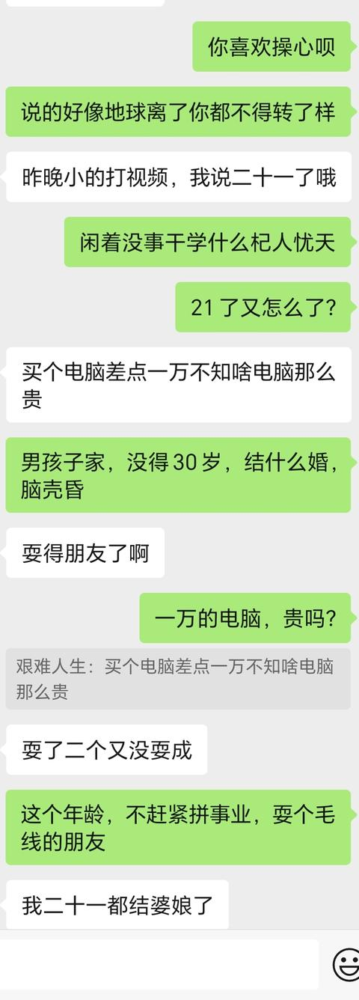
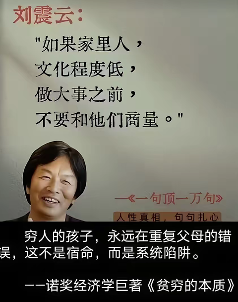
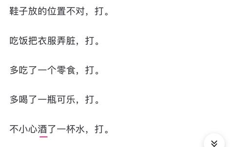

[toc]

# 问题

提问者：**<a href="https://www.zhihu.com/people/80hou-da-shu-73-10">80后农村大叔</a>**
提问时间: 2023-6-24 6:19:14
总回答数: 2651
总访问量: 23854515

修改为农村孩子为什么很难在职场成功？

# 回答

回答者： **<a href="https://www.zhihu.com/people/da-xiang-11-30-34">大象</a>**
回答时间: 2025-5-17 17:39:58
点赞总数: 5014
评论总数: 277
收藏总数: 1560
喜欢总数：1373

前段时间我们公司有个洗手台坏了，行政找来个维修水电的小哥，家是农村的。

这个洗手台离我的工位很近，装的是那种感应式的水龙头。经常坏不说，还贼不好用， **每次用它就跟TM讨饭一样。** 

捧着手求半天才下水。

所以这小哥过来后，我就专门跑去跟他讲一定要彻底修好啊，得嘎嘎出水的那种，要实在搞不定就干脆换一个开关式的算了。

小哥说放心吧，凡是跟水有关系的东西，到了他手里，三两下的功夫就能整好。

我很奇怪，为啥？

小哥说自己出生的时候，村里的算命先生说他五行缺水，名字里一定要带水，这样今后方可遇水化吉。

 **他爸琢磨了半天，最后给他起名叫：\*泵。** 

 **老先生不是说缺水嘛，那咱孩子就一直抽。** 

（姓我马赛克了一下，他的单名就是泵，后面为方便就叫他小泵了啊）

我说可以啊小泵，一听这名字就感觉你们家挺有文凭的。

小泵嘿嘿直乐。

该说不说，这小伙子还真的是遇水化吉，跟我聊天也不耽误干活，眼快手也快，前后不过十来分钟吧，水龙头就修好了。

我直夸他可以可以。小泵倒也不客气，还拽了句文： **无他，唯手熟尔。** 

这话听的我是啧啧直咂嘴，文言文都整出来了，有点意思。

说着我就伸手要试试出水量咋样。

小泵疾呼别碰别碰。

晚了。

我们所有的洗手台都装了冷热水管，平时出的都是温水。但是小泵刚才修水龙头的时候把这个水台的两个管子都关了，现在才刚打开热水管，冷的还没来得及开。

这家伙把我手烫的。

小泵赶紧把热的关上，冷的打开，让我在凉水下多冲一会手。

大哥，感觉咋样，没啥事吧？小泵问。

我这会还疼呢，龇牙咧嘴的回了他一句： **无他，唯手熟尔。** 

小泵说哥实在不好意思，热水管在尽里头，所以他盘完线一顺手就给打开了，然后刚想去开冷水管...

我说没事没事，看你干起活来还是挺老练的，搞这行很久了吧。多大了？

小泵说30多。

我惊呼不可能，有一说一，这哥们看起来跟个高中生差不多，皮肤贼好，脸上甚至还带着一点稚气。

你是咋保养的啊，居然看起来这么年轻。有啥窍门？

小泵有点不好意思，窍门倒也简单，把年龄多报几岁就行了。

我一时无语。

小泵说自己实际才19，出来打工怕别人欺负自己年纪小，所以就经常这么夏季吧乱报年龄。这回还算客气的，之前都说自己快奔五了，为了自家小孙子才不得已出来打的工。

这倒也是，出了门不比在家，有时候胡说八道是能减少很多不必要的麻烦。

我说你年纪这么小，还要长身子哪，不比那些壮劳力，别老是这么玩命干活赚钱。

前段时间看新闻，说是有个姓胡的小伙子，不大也才20岁出头，干工地生生被累死了。

小泵先是一惊，然后很快释然，他说幸好自己不姓胡。

我说要不怎么说你运气好，不然叫个胡泵也不好听啊。

小泵说哥你就别提运气这俩字了，我活了19年，倒霉了19年，啥好事都没碰上，这十几年走过最大的运就是春运。

这我就不太认可了，做人主要靠自己，运气这个东西最多只能算是个锦上添花。

哪能把生活里的不如意都甩锅给运气不好啊！

我跟小泵讲，不要整天想这有的没的，你就踏踏实实搞你这个水电工，这是个技术活，有门槛还不怕失业。攒几年钱，再找个女朋友，生活不就美滋滋起来了吗。

小泵说他家人估计不同意他在外面找女朋友。

我说这都啥年代了，咋还不让自由恋爱了，你说，谁不愿意，是你爸还是你妈？

 **小泵支支吾吾的半天，忽然蹦出了一句，是自己老婆不同意。** 

我擦。

你TM才19岁啊，哪来的老婆，违法了知道不。

小泵赶紧疯狂摆手，没领证呢，只是办了酒席。

他老婆比他大5岁，俩人现在连孩子都有了。

生娃的时候小泵还正在上高三。

小泵说他这辈子都忘不了，自己冲进班主任办公室要请陪产假时，班主任一脸懵逼的表情。

后来持续有半年多，他班主任的网上签名都是：总有一种事，男人听了会沉默，女人听了会流泪，依萍听了会跳河，川普听了会发推特...

这事搞得小泵爸妈很高兴，这小子整挺好，上学有个卵用，花这么钱浪费这么多时间，最后不还是老老实实回家说个媳妇吗。

但小泵自己后来却很后悔，他那会成绩还不错，如果一直学下去坚持到高考，很有可能考上大学。

小泵说自己当时最厉害的就是英语，那家伙，跟老外直接交流都没问题。

刚好，聊到这儿的时候，我们部门的产品经理路过这边。

一个澳洲人，负责面向海外市场的产品，每年得在我们这边待几个月。

我说你去打个招呼试试，我倒要看看你有没有吹牛。

小泵也不含糊，蹭一下就跑了过去。

他大声说，Hi。

澳洲哥们挺开朗的，虽然不认识眼前这个小伙子，但还是很友好的回了一句，Hi。

然后小泵就卡壳了。

我在后面催他，你倒是接着说啊。

小泵绞尽了半天脑汁，然后对着澳洲哥们来了一句： **What's your problem？** 

当时澳洲哥们的表情是这样的：

我勒个去。

我赶紧冲过去一边把小泵拉回来，一边跟澳洲哥们解释： **Sorry about that, he's Japanese and his brain is on permanent vacation.** 

澳洲哥们笑笑表示没关系。

小泵还不明所以，不停的问我，怎么样怎么样，没跟你吹牛吧。

我说你小子这英语，听得我真是one楞one楞的，说实话退学不光对你有好处，对咱们国家的外交关系也有很大的帮助。

小泵搓着手笑个不停。

他说在他们村，高中上半拉不上了的多的是。自己发小就是，高一没读完就回家了，每天啥P事没有，就在村里晃来晃去。

去年小泵他爸还打电话过来说，出门遇到孩子发小了，正在附近捡瓶子。

当时他爸看的心里很不是滋味，没想到昔日自己孩子的朋友，今天竟然变成了自己的竞争对手。

小泵很不喜欢他爸。

从小只会棍棒教育，整天除了打就是打。

鞋子放的位置不对，打。

吃饭把衣服弄脏，打。

多吃了一个零食，打。

多喝了一瓶可乐，打。

不小心酒了一杯水，打。

等小泵上了学，他的老师看到小泵身上到处都是日积月累被打的伤，顿时非常愤怒。

为这事，老师还专程做了家访，要求小泵爸爸尽可能的不打或者少打孩子。

能不能做得到？

小泵爸爸说一定一定，老师的话就是圣旨，俺肯定能做得到。

嗯，这话听的还行。

那后来真的听老师话了吗？

小泵说听是听了，但是听的太全乎了，不打和少打之间，他爸选择了不少打。

所以即使是现在自己有了媳妇有了娃，还是经常被这个暴躁老爸在线打骂。

我说那你自己就挣口气，好好在外面混出点人样，以后把老婆孩子接出来单过，听到没有？

嗯！那必须的！

小泵很用力的点头。

我说光点头有个P用，这有啥不好意思的，有志向就要大声说出来。

小泵有点犹豫。

我催了催他，愣着干啥，说啊。

 **小泵大声说：出来。** 

好吧，这孩子，I'm sure his brain is on permanent vacation.

那天我跟小泵聊了好久。

后来送走他之后我就琢磨一个问题，小泵老说自己运气不好，命不好，他19岁就出来打工养家，是真的因为命不好吗？

说实话我是不太信命的。

以前看过一段话：

 **如果你站在童年的位置展望未来，你会说你前途末卜，你会说你前途无量；但要是你站在终点看你生命的轨迹，你看到的只有一条路，你就只能看到一条命定之路。而这条路的每一个路口，都会有你的父母在为你指引。** 

人生最大的分水岭真的就是羊水。

不要说那种大富大贵的家庭，就是很普通的中产，哪个父母不会给自己小孩的生命轨迹提前很久做规划啊。

你能想象到一个医生教师公务员的家庭，他家小孩在17、8岁时辍学，去结个什么P婚？

父母才是孩子成才的最关键因素。没有之一。

还有棍棒教育。

我从小到大从来没挨过一次打，最严重的不过是被老妈轻轻扭过耳朵。

这让我大了之后还假装抱怨过他们。

要是读书时对我严格点，指不定早就是清华北大了。

我爸说，在还没有你之前，我们就约定好要以后尽量对孩子好一些，让孩子在小的时候尽量快乐。

因为长大以后孩子会遇到很多痛苦，那时候，小时候的快乐就会成为孩子最美好的回忆和安慰。

父母存在的意义并不只是给予孩子舒适和富裕的生活，更多的是当你想到你的父母时，你内心就会充满力量，会感受到温暖从而拥有克服困难的勇气和能力，以此获得人生真正的乐趣和自信。

 **父母之恩，不在于生养，而在于托举。** 

这就是出身贫寒的农村人，很难成才的终极原因。

毕竟，如果他们父母教自己走的路都是对的话，他们就不会穷到如今这个地步。

  

原文地址：[(大象)农村的孩子为什么就难成才？](https://www.zhihu.com/question/608208584/answer/1907128210497467501) 

# 评论

1. <a href="https://www.zhihu.com/people/wu-ming-63-60-65">问题小奋斗</a> (<small title="广东">2025-5-17 20:49:18</small>): 我是公务员家庭，但是我小孩可能十七八岁就要辍学了，因为她根本无心学习，我已经不想鸡娃了，还是保自己的命重要
   - <a href="https://www.zhihu.com/people/chen-lun-62-66">沉沦</a> (<small title="河南">2025-5-17 21:1:26</small>): 也不至于吧老哥，如果你们愿意的话，跟老师说一下，然后让他正常上下学或上晚自习，老师应该也不会什么意见的［捂脸］  
 
，最少上完高中，接由一些基础的教育，在学校对还是比较快的，如果给自己加工作量的话
   - <a href="https://www.zhihu.com/people/anything-99-78">anything</a> (<small title="北京">2025-5-18 10:21:47</small>): 女孩子，所以不想管她了，是吗
   - <a href="https://www.zhihu.com/people/liu-jia-17-55">问天</a> (<small title="回复于 2025-5-18 10:27:43/广东"> ✉️:anything</small>): 广东人可以收租
   - <a href="https://www.zhihu.com/people/wu-ming-63-60-65">问题小奋斗</a> (<small title="回复于 2025-5-18 10:31:34/广东"> ✉️:anything</small>): 是啊，如果是男孩子可以使劲打，女孩子说重了就开始抹眼泪。想着以后让她当个少年宫的代课老师算了
   - <a href="https://www.zhihu.com/people/wu-ming-63-60-65">问题小奋斗</a> (<small title="回复于 2025-5-18 10:32:45/广东"> ✉️:沉沦</small>): 有人给我建议是上私立高中，但我又不舍得她成年前去住校，到时候可能找个可以走读的私立高中上
   - <a href="https://www.zhihu.com/people/chen-lun-62-66">沉沦</a> (<small title="回复于 2025-5-18 11:20:32/河南"> ✉️:问题小奋斗</small>): 那也不错 还能上个校风好的学校什么的，虽然对就业没用［捂脸］
   - <a href="https://www.zhihu.com/people/wu-ming-63-60-65">问题小奋斗</a> (<small title="回复于 2025-5-19 11:51:32/广东"> ✉️:问天</small>): 以后房子越来越不值钱的吧？可能也收不了多少租
   - <a href="https://www.zhihu.com/people/zhi-liao-35">知了</a> (<small title="广东">2025-5-19 18:16:14</small>): 我小孩可能连初中都读不完［大哭］
   - <a href="https://www.zhihu.com/people/64-9-92-48">不如睡觉</a> (<small title="回复于 2025-5-20 8:34:36/河南"> ✉️:问题小奋斗</small>): 难道你就看见"农村孩子"这几个字，然后一对照说自己是"公务员家庭"，你就没点想法吗？［捂脸］［捂脸］
   - <a href="https://www.zhihu.com/people/20-9-1-82-80">嘻嘻克哦想你</a> (<small title="浙江">2025-5-20 13:17:6</small>): 找个职高或者大专混日子呗，这世上学问很多，也不一定非要读书
   - <a href="https://www.zhihu.com/people/shenli-benren-1982">沈理</a> (<small title="回复于 2025-5-20 18:22:2/上海"> ✉️:嘻嘻克哦想你</small>): 我出生在小城镇里，但是我总是忍不住想种蔬菜，小时候我在绿化带里开辟了试验田，蔬菜长势很好，可惜被人偷了。上了那么多年的班，感觉那个充满白色粉尘的空调办公室是那么遥远，而我童年的那可爱的菜畦是那么近，假如现在风调雨顺，我说不定就把上海常住的小区的绿化树砍了，种那么几天菜，多好啊！现在的小朋友太可气了，为什么不爱种田呢？土地是生命的温床，你在土地里可以看到物理、生物、化学、医学、农学，那是一个灿烂的世界。
   - <a href="https://www.zhihu.com/people/ou-yang-zi-ming-68">欧阳子茗</a> (<small title="回复于 2025-5-20 22:39:17/四川"> ✉️:沈理</small>): 我一直觉得有些人认为土壤很脏很奇怪，土壤可是生命源泉啊
   - <a href="https://www.zhihu.com/people/wu-ming-63-60-65">问题小奋斗</a> (<small title="回复于 2025-5-22 8:52:40/广东"> ✉️:不如睡觉</small>): 是为了对应答主所说的公务员家庭不会让小孩十七八岁辍学
   - <a href="https://www.zhihu.com/people/shenli-benren-1982">沈理</a> (<small title="回复于 2025-5-22 9:29:22/上海"> ✉️:欧阳子茗</small>): 大城市的土壤真的很脏，没什么生命力，长年积累下来的除草剂、杀虫剂、废油、废水，种植物特别容易枯萎（好多小区是建设在老工业区的地基上，看土壤的生命力就知道污染层在哪里），故乡小区的土壤活力足一些（以前是湿地和农田），感觉小时候很容易种活植物，到了大城市，养花变得极其艰难。
   - <a href="https://www.zhihu.com/people/yang-yang-de-yi-76-33">栩栩</a> (<small title="回复于 2025-5-26 19:10:30/云南"> ✉️:沈理</small>): 你的天赋是种植 该去考农业大学去农科院的 坐办公室真是浪费啊
   - <a href="https://www.zhihu.com/people/bu-que-ni">扶柳</a> (<small title="回复于 2025-5-28 11:5:2/山东"> ✉️:沉沦</small>): 那个日本人给我整笑了，哈哈［感谢］
   - <a href="https://www.zhihu.com/people/bei-chen-75-31">不傻的憨憨</a> (<small title="江苏">2025-5-28 17:49:50</small>): 每个人都有自己的命，谁都不可能直接干预，干预太多两个人必然折损一个。
   - <a href="https://www.zhihu.com/people/wang-da-zhuang-97-30">王大壮</a> (<small title="回复于 2025-5-29 5:37:2/河南"> ✉️:anything</small>): 应激了
   - <a href="https://www.zhihu.com/people/tao-tao-bu-jue-de-ya-ba">爱与星辰</a> (<small title="山东">2025-5-29 6:11:46</small>): 啊？？？我闺女也是［捂脸］
   - <a href="https://www.zhihu.com/people/xiao-ma-ben-teng-87-5">我的高中语文课</a> (<small title="回复于 2025-5-29 6:48:39/山东"> ✉️:问题小奋斗</small>): 如果孩子抹眼泪，你就不说了。那么在孩子心里，他就会认为结束一切的终点是抹眼泪，那么她的天赋和外在条件就会被一汪眼泪所淹没。除非你能和张雪峰一样，攒下足够多的钱，然后说他女儿就不用考研，不用奋斗了。否则你就狠下心来，不要耽误了孩子的前途。我再说的明白点，这种孩子往往就是惯的，这种家长往往就是惯孩子，但是又没有张雪峰那种强大的托举能力，最终只能害了孩子。
   - <a href="https://www.zhihu.com/people/rao-you-xing-zhi-14">饶有兴致</a> (<small title="新疆">2025-5-29 9:28:2</small>): 她在天上选了好久才选了你家，结果你居然不能保她一世富贵［生气］
   - <a href="https://www.zhihu.com/people/wu-ming-63-60-65">问题小奋斗</a> (<small title="回复于 2025-5-29 10:25:27/广东"> ✉️:我的高中语文课</small>): ［赞］您说得对，受教了，今天就开始改变
   - <a href="https://www.zhihu.com/people/wu-ming-63-60-65">问题小奋斗</a> (<small title="回复于 2025-5-29 10:25:58/广东"> ✉️:饶有兴致</small>): 哈哈哈，我喜欢您的幽默
   - <a href="https://www.zhihu.com/people/a-li-you-tao-zi-28">阿狸有桃子</a> (<small title="陕西">2025-6-5 11:31:37</small>): 成不了才，成个人也可以
   - <a href="https://www.zhihu.com/people/wu-ming-63-60-65">问题小奋斗</a> (<small title="回复于 2025-6-5 16:25:56/广东"> ✉️:阿狸有桃子</small>): 有被安慰到［红心］
   - <a href="https://www.zhihu.com/people/hao-qing-12-41">键盘车侠</a> (<small title="山东">2025-6-9 17:29:8</small>): 让她学门手艺吧，美容美发厨师塔吊都饿不着
   - <a href="https://www.zhihu.com/people/bo-fen-42">铁锤公主</a> (<small title="江西">2025-7-21 6:20:11</small>): 先哄着读完高中，再哄着读个大专
   - <a href="https://www.zhihu.com/people/72-20-56-71">宛宛类卿</a> (<small title="回复于 2025-7-21 8:50:36/广东"> ✉️:欧阳子茗</small>): 田野里的土壤最干净了，尤其是夏天下雨过后的气息，生机勃勃
   - <a href="https://www.zhihu.com/people/meng-8-18">inori</a> (<small title="浙江">2025-7-21 14:54:46</small>): 可能在这个年纪，并不想呆在家里，多去看她几次，孩子也能体会住校生活，还能感觉父母爱她。
   - <a href="https://www.zhihu.com/people/wu-ya-8-62">知乎用户Rwtru1</a> (<small title="天津">2025-7-24 10:37:41</small>): 说明不是你自己考上的公务员［doge］不然遗传不会这么差
   - <a href="https://www.zhihu.com/people/wu-ming-63-60-65">问题小奋斗</a> (<small title="回复于 2025-7-25 8:24:18/广东"> ✉️:知乎用户Rwtru1</small>): 我只能说天津的公务员确实难考，广州相对简单
   - <a href="https://www.zhihu.com/people/wu-ming-63-60-65">问题小奋斗</a> (<small title="回复于 2025-7-25 8:24:49/广东"> ✉️:铁锤公主</small>): 现在有中本贯通［赞］
   - <a href="https://www.zhihu.com/people/wu-ming-63-60-65">问题小奋斗</a> (<small title="回复于 2025-7-25 8:25:0/广东"> ✉️:键盘车侠</small>): 还有中本贯通
   - <a href="https://www.zhihu.com/people/fan-lin-59-35">FAN LIN</a> (<small title="江苏">2025-7-30 13:46:27</small>): 我姨妈家表妹也是这个情况，小时候也没缺过啥，家教辅导甚至她妈妈就是我姨妈该特意抽空去学了心理学了解孩子心理加强沟通技巧，但就是学习上不开窍高中后完全跟不上……后面去当钢琴家教了她本人还和同学撺掇着要开美甲店，反正她家里也能供得起就随她了［白眼］
   - <a href="https://www.zhihu.com/people/wu-wei-77-85-99">无为</a> (<small title="回复于 2025-8-5 16:1:35/广东"> ✉️:沈理</small>): 有人选择种田，有人选择星辰大海，爱好不同，选择不同罢了。而且小孩子，哪有什么自主权啊
   - <a href="https://www.zhihu.com/people/shi-zhe-ru-si-fu-60-91">逝者如斯夫</a> (<small title="回复于 2025-8-18 2:21:0/重庆"> ✉️:问题小奋斗</small>): 公办中学都会被撤并以后哪儿还有少年宫的生意哦
   - <a href="https://www.zhihu.com/people/wu-ming-63-60-65">问题小奋斗</a> (<small title="回复于 2025-8-18 14:0:42/广东"> ✉️:逝者如斯夫</small>): 啊，我更抑郁了
   - <a href="https://www.zhihu.com/people/ewmy">ewmy</a> (<small title="浙江">2025-11-22 10:50:11</small>): 就我的经验来说，孩子这样多半家庭有问题［大笑］
   - <a href="https://www.zhihu.com/people/chen-hao-46-33-61">Samera</a> (<small title="山西">2025-12-7 3:16:11</small>): 最后一句话笑死我了
   - <a href="https://www.zhihu.com/people/wang-yishui-66">种菜人家</a> (<small title="回复于 2026-1-29 7:31:47/江苏"> ✉️:沈理</small>): ［握手］［握手］
   - <a href="https://www.zhihu.com/people/wang-yishui-66">种菜人家</a> (<small title="回复于 2026-1-29 7:32:36/江苏"> ✉️:沈理</small>): 绿化带真不建议种菜吃，种着玩可以
2. <a href="https://www.zhihu.com/people/wen-ai-29-84">子规</a> (<small title="河北">2025-5-21 15:46:29</small>): 你总说父母是孩子成才的关键，却没有想到他们已经比上一代好的多，他们已经把能给到你的最好的都给了你。
 
工作没有高低之分，只有分工不同。你文章中描述的小泵，修好了水管还是让你描述成，I'm sure his brain is on permanent vacation.有文化会外语并不说明你可以羞辱歧视那些干着体力工作的劳苦大众。试问，当你作为一个水管工修好了公司的水龙头，而其他人在享用你的服务的同时还说那个水管工脑子有问题，你自己是什么感受？很开心吗？
 
说人家脑子有问题之前，请先学会尊重，同时也请你注意，上知乎的不只是坐办公室里看报纸的，也有很多干体力工作的同志，所以，讲话前也请你 Please use your brain a little more.
   - <a href="https://www.zhihu.com/people/you-zi-cha-4-91-69">柚子茶</a> (<small title="陕西">2025-6-14 15:40:31</small>): 哈哈哈哈哈
   - <a href="https://www.zhihu.com/people/anwzl">anwzl</a> (<small title="湖南">2025-7-20 17:28:34</small>): 会讲［爱］
   - <a href="https://www.zhihu.com/people/huang-miao-nv">蔓生</a> (<small title="云南">2025-7-21 12:20:4</small>): 能给的最好的就是不停的打骂孩子、让孩子辍学结婚吗？能理解这个父亲有他的认知局限性，这点不能完全怪他，他没办法做到和高知家庭、富裕家庭一样的托举，但同样知识水平、经济水平的家庭也不全是这样对待孩子的。而且这和答主的观点也不矛盾啊，客观上父母就是影响了孩子一生选择的道路，无论父母是否有他的苦衷。
   - <a href="https://www.zhihu.com/people/17789612219">我不是黄蓉</a> (<small title="回复于 2025-8-3 16:30:44/甘肃"> ✉️:蔓生</small>): 至少和他的父母相比，他学会了维修水电，能有能力和机会到大城市打拼，这也是父母的托举啊
   - <a href="https://www.zhihu.com/people/liang-jing-45-36">Matt</a> (<small title="回复于 2025-8-4 1:25:32/河南"> ✉️:我不是黄蓉</small>): 这是社会的托举的，不是他父母
   - <a href="https://www.zhihu.com/people/96-49-33-36-32">知乎用户onNAxO</a> (<small title="山东">2025-8-4 20:45:42</small>): 说的好
   - <a href="https://www.zhihu.com/people/qiao-qiao-37-5">Raven</a> (<small title="北京">2025-11-24 8:48:17</small>): 说的好，不过这段估计是他自己编的段子哈哈，确实编得不合适了
   - <a href="https://www.zhihu.com/people/da-pang-hui-88">大胖灰</a> (<small title="北京">2025-11-26 12:9:28</small>): 张嘴一句what's your problem，还不得找个场子回来［捂脸］
   - <a href="https://www.zhihu.com/people/yu-er-68-37-78">三二二二三</a> (<small title="回复于 2025-11-30 14:4:46/北京"> ✉️:Matt</small>): 哪看出来是社会了？？？
   - <a href="https://www.zhihu.com/people/shan-xi-tian-jiao-sheng-wu-ke-ji">momo</a> (<small title="回复于 2025-12-5 20:6:1/美国"> ✉️:三二二二三</small>): 以前就吃不饱［酷］
   - <a href="https://www.zhihu.com/people/mo-xue-21-37">luke</a> (<small title="江西">2025-12-18 15:40:46</small>): 你自己相信工作没有高低之分，还有分工不同吗？换句话说，如果你的下一代可以有空闲坐办公室看报纸，你会让他去做水管工吗？
3. <a href="https://www.zhihu.com/people/liu-kan-shan-53">放蒋出笼</a> (<small title="河北">2025-5-19 21:17:58</small>): 现在农村都是高中上一半就不上了，真是进步了，我们当年都是初中上一半就不上了，初中毕业时班里能少小一半人。  
 
  
 
命运命运，分别是命与运，所谓命，就是随大流，跟着周围环境走，跟着时代走，这就是命，运才是运气，是机会。
   - <a href="https://www.zhihu.com/people/dai-chun-yin">王德彪</a> (<small title="北京">2025-6-8 19:53:10</small>): 80后的辍学高峰期是五年级，90后是初二，00后是高二［吃瓜］
   - <a href="https://www.zhihu.com/people/leng-yue-shi-hun-79">冯孝文</a> (<small title="回复于 2025-6-11 8:56:50/河南"> ✉️:王德彪</small>): 还真是，我95的，我们村和我差不多年纪的几乎都是初中毕业后去打工
   - <a href="https://www.zhihu.com/people/dai-chun-yin">王德彪</a> (<small title="回复于 2025-6-11 11:53:40/北京"> ✉️:冯孝文</small>): 是，冀鲁豫的农村都这样，县市中学还好，乡镇初中能坚持到初三毕业的连一半都没有［吃瓜］
   - <a href="https://www.zhihu.com/people/yu-luo-wu-sheng-45-21">雨落无声</a> (<small title="陕西">2025-7-20 11:7:9</small>): 我90后，四川人，大部分农村小孩初中毕业就出去打工了。能考上高中的都是聪明且比较自律的，能上中专的都是父母相对疼孩子的。
   - <a href="https://www.zhihu.com/people/liu-yan-qiang-98">抹灰</a> (<small title="回复于 2025-7-21 15:14:59/江苏"> ✉️:王德彪</small>): 还有个晋，我记得小时候初一三个班，一个班七八十号人，毕业时只有一个班
   - <a href="https://www.zhihu.com/people/dai-chun-yin">王德彪</a> (<small title="回复于 2025-7-21 16:33:7/北京"> ✉️:抹灰</small>): 差不多，我们当时初一六个班，初三两个班［吃瓜］
   - <a href="https://www.zhihu.com/people/xing-zou-de-sha">行走的沙</a> (<small title="回复于 2025-7-21 16:53:51/菲律宾"> ✉️:王德彪</small>): 为什么不等到毕业。。。
   - <a href="https://www.zhihu.com/people/dai-chun-yin">王德彪</a> (<small title="回复于 2025-7-21 17:44:54/北京"> ✉️:行走的沙</small>): 毕业的时候，他们都会回学校拿毕业证，毕竟九年义务教育。但是他们初一初二就都不上课了，有的在大街上当精神小伙，有的去蓝翔虎振读个技校，有的去城里找个饭店端盘子，反正就是不上课了。
4. <a href="https://www.zhihu.com/people/li-xian-yun-84-85">搬砖的牛马</a> (<small title="新疆">2025-5-18 16:9:27</small>): 我有一个朋友，他儿子今年21岁，从他儿子十七八岁就开始焦虑，儿子为什么还不谈恋爱，我实在不能理解这种家长到底是什么心态。
   - <a href="https://www.zhihu.com/people/42-9-74-59">掌握日月</a> (<small title="北京">2025-5-19 12:25:12</small>): 确实是，想骂他一顿，还有人30岁就去世了，难道大家都要跟着去世吗？
   - <a href="https://www.zhihu.com/people/su-zui-17-3">宿醉</a> (<small title="河南">2025-5-20 9:38:7</small>): 昨天才看到一句话，过度操心实际上是一种隐形控制。
   - <a href="https://www.zhihu.com/people/ni-ni-88-87-70">笑语欢颜suger</a> (<small title="回复于 2025-5-20 10:17:34/北京"> ✉️:掌握日月</small>): ［飙泪笑］［飙泪笑］
   - <a href="https://www.zhihu.com/people/yang-hai-ying-97">归海</a> (<small title="浙江">2025-5-21 18:55:50</small>): 什么心态，可能是繁殖心态吧，生个儿子不得赶紧找婆娘生孙子
   - <a href="https://www.zhihu.com/people/hei-ma-xiao-xi-feng-58">狂吃狂吃</a> (<small title="陕西">2025-6-10 11:53:21</small>): 我儿子才上高二，我公公天天在孩子面前说将来娶个媳妇生娃，刚开始我没吭气，后来说的多了我就说人又不是畜生，生下来就知道生娃，还是个孩子呢还有自己的未来还没体验人生生个屁娃。我还有一句没说你那么想生也没见你跟我婆婆生10个8个的。
   - <a href="https://www.zhihu.com/people/li-xian-yun-84-85">搬砖的牛马</a> (<small title="回复于 2025-6-10 19:3:7/新疆"> ✉️:狂吃狂吃</small>): 就是，怼得好［赞］［赞］
   - <a href="https://www.zhihu.com/people/34-89-66-96-10">饥饿的被子</a> (<small title="上海">2025-8-3 20:47:38</small>): 我弟从小学一年级，我妈就开始操心了［doge］
   - <a href="https://www.zhihu.com/people/fu-yun-qi-65-19">一只大胖橘</a> (<small title="回复于 2025-12-6 18:59:28/山西"> ✉️:宿醉</small>): 看到你这句话，我突然就明白了，为什么对于长辈对我的那种像关心弱智一样的关心，我会冒火了
5. <a href="https://www.zhihu.com/people/a-miao-7-1-53">Moon</a> (<small title="河南">2025-5-20 7:12:51</small>): 非常赞同，我和我老公就是农村的，我从懂事起，我奶奶就说希望我十八岁结婚，初中毕业差点就辍学打工了，中考差了两三分上高中，当时有几个同学没考上父母非常着急，带着去各个学校问可不可以掏钱上高中。其实是可以的，但是我肯定不用想了［捂脸］最后去了职高，读的大专，当时家里亲戚全在说我不是读书的料，去上学花钱浪费（因为都觉得我爷爷的钱被我花了不值，不如留给他们） ，我上了大专，我奶奶就改变主意了，希望我毕业结婚，我自然也是非常不愿意。我实习哪一年我爷爷去世对我打击很大，我突然就明白人真的会很突然的死掉，所以就妥协了，相亲结婚生孩子，万幸老公人不错，见过我的人都很震惊我看起来很小，但是孩子都四岁多了。
 
我老公小时候父母离婚又复婚，十六岁出来打工，那时候没发工资给父母借钱需要还，我婆婆常说养我老公都没怎么花钱，吃的是最差的，上的是义务教育，就是我老公逃课去网吧花的都是自己想办法赚的钱，俩人离婚没人管我老公，好几年都是东家吃一顿西家睡一晚，露宿街头也是有过的。我老公最讨厌他妈很自豪的说养儿子没花钱，现在还赚钱给他们养老。我也讨厌他们说孩子不要让学习太好，不然以后跑外地出国了就不养老了，一定要多生，给双筷子初中毕业就打工，早早的栓到身边，我一听我都爆炸。我们两个还是农村人，教育孩子跟城市人差很多，但至少我女儿这辈子不会再经历我们经历过的事，希望她长大了能比我们幸福吧。
   - <a href="https://www.zhihu.com/people/mu-mu-20-26-76">沐沐</a> (<small title="陕西">2025-5-28 16:56:49</small>): 这家长什么想法…我80后，上学时候父母都告诉我尽量30以前别结婚，不懂事不定性。实在不想读书大二以后可以谈恋爱但是想继续读书就别谈。实际上我是大四谈的到研究生毕业两年后结婚，还没30。我妈还不太满意，觉得我和我老公都是孩子呢，不懂事就要结婚［飙泪笑］
   - <a href="https://www.zhihu.com/people/e-e-e-88-58-74">鹅鹅鹅</a> (<small title="江苏">2025-5-30 8:29:52</small>): 还栓到身边，好恶心的发言
   - <a href="https://www.zhihu.com/people/a-miao-7-1-53">Moon</a> (<small title="回复于 2025-5-30 12:42:52/河南"> ✉️:沐沐</small>): 我很赞同你妈妈的想法，我自己经历过我太知道了，我22岁结婚，以前的经历让我性格有些拧巴，又蠢的天真，我老公就说我当时很不懂事，我回想起来也是很蠢，一直到25岁后慢慢的脑子转过圈来，我和我老公都属于父母没有怎么教过做人，全靠自己在社会上横冲直撞，我刚工作时候全靠师傅包容，唯一让我师傅欣慰的就是不怕苦不怕累，其他方面真给我师傅差点气吐血［捂脸］我现在也快三十岁了，我和我老公还时不时反省自己，想法有时候单纯幼稚太容易相信别人办事不过脑子等等， 人要在社会上经历很多之后才会慢慢成熟，这之前结婚确实不好，我当时完全不知道我需要面对什么，生下孩子没办法辞职了全职在家，月子里也是老公照顾的，别人都说小孩子好照顾，他每天都崩溃，到处问不是说很好照顾吗？［捂脸］一直到孩子四个多月才去上班，他压力很大但是又没有别得办法，但还好两个人相互扶持也走过来了。我就一直说如果孩子长大了不想结婚或者想丁克或者三四十结婚都随她吧，我们吃太多苦了，我们的经历只能说给她一个参考，也希望我女儿长大了不要像我一样依附他人。
   - <a href="https://www.zhihu.com/people/a-miao-7-1-53">Moon</a> (<small title="回复于 2025-5-30 12:50:8/河南"> ✉️:鹅鹅鹅</small>): 我身边很多这样的家长，不止我的家人我的公婆，太多太多这样想法的家长了，当时学校让去实习，同学都去上海或者在郑州，我爷爷奶奶早早就跟我打电话让我回去，不同意在外地，我家情况很复杂，我也不可能丢下他俩不管，一开始还挺遗憾一辈子就这样了，现在慢慢也想开了，也许我出去了也混不出名堂，本来就是普通人，至少现在照顾着奶奶，没有遗憾，不敢想我如果走了远嫁他乡，奶奶有多可怜。
 
我老公家附近一个姐姐，非常争气大学考到北京，现在在北京定居了，我们听了都很佩服，但是我婆婆却说很多人说她没良心，跑太远了之类的。我觉得这跟祖坟冒青烟没区别了，父母从来也是没有管过，全靠自己一个人能留在北京，多么牛啊，可是很多人都不理解，我能理解她们舍不得孩子在外面吃苦，可是理解不了她们要折断孩子前途，只为了自己养老。
   - <a href="https://www.zhihu.com/people/zhu-shuang-22-40">心有千千阙</a> (<small title="回复于 2025-6-4 13:33:38/广东"> ✉️:沐沐</small>): 那你父母挺开明，但是农村家庭的孩子20出头，父母就催着结婚
   - <a href="https://www.zhihu.com/people/mu-mu-20-26-76">沐沐</a> (<small title="回复于 2025-6-19 19:8:15/陕西"> ✉️:心有千千阙</small>): 只能说人和人思想差异比较大。
   - <a href="https://www.zhihu.com/people/grace-30-35-57">Grace</a> (<small title="回复于 2025-7-21 10:30:23/天津"> ✉️:沐沐</small>): 我28岁生孩子（我老公比我大两岁），打电话告诉我爸说我怀孕了的时候，我爸沉默了得有好几秒，然后说：是不是要孩子有点早了？等你们俩的工作再上升一点稳定一点再要孩子更好吧！我：(⊙﹏⊙)
   - <a href="https://www.zhihu.com/people/mu-mu-20-26-76">沐沐</a> (<small title="回复于 2025-7-21 11:11:21/陕西"> ✉️:Grace</small>): 我34生的孩子，早些年两人没玩够，各个方面都稳定了才要的孩子，对大人和孩子都负责。怀孕时候偶然有一次和外婆感叹是不是要的有点晚，那些没上学的小姑娘早早就有小朋友了。外婆和我说晚什么晚，正是年富力强的时候。那年她90岁了［飙泪笑］。外婆一生三个孩子，小舅舅出生那年她45岁。她常说“不怕孩子晚，就怕寿命短”［飙泪笑］。外婆92岁无疾而终。
   - <a href="https://www.zhihu.com/people/duz1">杜子</a> (<small title="广东">2025-11-28 15:5:14</small>): 加油，和你老公好好培养你们女儿，祝你们一家幸福！
6. <a href="https://www.zhihu.com/people/mdcs">无知网友</a> (<small title="广东">2025-5-21 17:32:36</small>): 虽然文风很调皮也有趣，但是能明显感受到作者的优越感，成功的定义不一样嘛，有的是固定工位，小泵是流动工位。
7. <a href="https://www.zhihu.com/people/30-96-14-21">时柒鸣人</a> (<small title="河北">2025-5-23 8:47:33</small>): 写一篇文章下来全是梗，本来以为是抱怨生活的，没想到是一篇脱头秀，去投稿吧！
   - <a href="https://www.zhihu.com/people/yu-zi-han-96-75">玉自寒</a> (<small title="广东">2025-5-28 10:27:21</small>): 脱头秀［惊喜］
8. <a href="https://www.zhihu.com/people/ai-chi-ning-meng-de-duo-yu">爱吃柠檬的多余</a> (<small title="浙江">2025-5-20 14:47:54</small>): 拉到最后面，居然没广告。
 
看到小哥皮肤好就以为有广告［打招呼］［捂脸］
9. <a href="https://www.zhihu.com/people/tao-tao-tao-96-19">微风</a> (<small title="广东">2025-5-19 10:34:8</small>): 喜欢这种文风，哈哈 梗转的猝不及防
10. <a href="https://www.zhihu.com/people/yan-qing-88-70">离离原上草</a> (<small title="中国香港">2025-5-19 17:48:36</small>): 答主深得王小波文学的精髓啊［赞］
11. <a href="https://www.zhihu.com/people/shenli-benren-1982">沈理</a> (<small title="上海">2025-5-20 18:10:8</small>): 其实每个人都不容易啊！用得着这么诋毁我吗？You will be permanent standby if you catch the royal flight which is designated for King Charles III.
 
Hopefully there are no more battles but there are so many emergent problems.
 
World peace should be respected and shall I sign a peace treaty with you? Or an armstice if you like?
    - <a href="https://www.zhihu.com/people/passwordloster">南瓜子女瓜子</a> (<small title="上海">2025-7-21 16:33:5</small>): 是哈里写的吗
12. <a href="https://www.zhihu.com/people/wang-lang-71-25">乐鱼学庞老师</a> (<small title="天津">2025-5-17 20:51:3</small>): 你是要考研啊
13. <a href="https://www.zhihu.com/people/mei-li-xin-qing-xwl">爱生活的美丽心情</a> (<small title="山东">2025-7-8 17:33:58</small>): 父母的托举非常重要，可以说父母的认知决定孩子的命运［酷］
14. <a href="https://www.zhihu.com/people/zheng-yi-dao-ren-50">神之手波特</a> (<small title="上海">2025-6-10 21:33:9</small>): 泵五行属水，但是意象是金，大意了啊
    - <a href="https://www.zhihu.com/people/72-39-15-2">An宁</a> (<small title="山东">2025-8-30 2:44:21</small>): 金生水啊
15. <a href="https://www.zhihu.com/people/xiao-er-lang-68">小儿郎</a> (<small title="福建">2025-5-20 16:18:19</small>): 还好还好，我也不姓胡。
16. <a href="https://www.zhihu.com/people/ahou-64">hy7352</a> (<small title="江苏">2025-5-18 10:42:29</small>): 所以最后水龙头修好没，是不是嘎嘎出水［为难］
    - <a href="https://www.zhihu.com/people/tu-shi-xu">奥卡姆剃刀刮胡子</a> (<small title="江苏">2025-7-21 22:14:44</small>): 肯定修好了，不然不会把手烫了［飙泪笑］。
    - <a href="https://www.zhihu.com/people/qi-qi-da-mo-wang-23">亓亓大魔王</a> (<small title="上海">2025-5-20 8:11:4</small>): 修好了
17. <a href="https://www.zhihu.com/people/liu-ji-13-71">刘洁</a> (<small title="上海">2025-8-11 15:0:26</small>): 你是说脱口秀的吧
18. <a href="https://www.zhihu.com/people/xiayula1975">竹杖芒鞋</a> (<small title="四川">2025-5-23 6:57:35</small>): 每个家庭情况不一样。
19. <a href="https://www.zhihu.com/people/42-9-74-59">掌握日月</a> (<small title="北京">2025-5-17 19:10:35</small>): 这是真实的吗？还是编的呀
20. <a href="https://www.zhihu.com/people/82-60-94-72">宰人航天</a> (<small title="河北">2026-3-3 8:23:14</small>): 水管工可不少挣啊，看小泵以后怎么发展了［doge］
21. <a href="https://www.zhihu.com/people/chen-ya-ling-45">天下为公我为母</a> (<small title="广东">2025-11-22 8:2:17</small>): 我以为你会和同事解释说他是个维修工，英语不太好，本意是想问你还有没有哪些问题需要他帮忙。结果你说，他是日本人……［doge］
22. <a href="https://www.zhihu.com/people/an-ran-42-52-64">安然</a> (<small title="安徽">2025-5-19 10:22:57</small>): 澳洲哥们反应笑死我了
23. <a href="https://www.zhihu.com/people/a-hong-42-37">啊哄</a> (<small title="浙江">2025-6-9 23:54:16</small>): 很喜欢三体里的一句话，意思并不同，不要回去那里不是家。对我来说，不必回去，家不是港湾。
24. <a href="https://www.zhihu.com/people/zhang-qiang-68-7">恶小为之</a> (<small title="浙江">2025-5-28 14:14:59</small>): “不打和少打之间，他爸选择了不少打。”［大笑］
25. <a href="https://www.zhihu.com/people/53-85-48-26-19">醉萌喵汪宠</a> (<small title="陕西">2025-12-31 7:32:12</small>): 出门在外，有时候胡说八道能解决很多麻烦。  
 
如果你站在童年的位置展望未来，你会说你前途末卜，你会说你前途无量；但要是你站在终点看你生命的轨迹，你看到的只有一条路，你就只能看到一条命定之路。而这条路的每一个路口，都会有你的父母在为你指引。  
 
父母存在的意义并不只是给予孩子舒适和富裕的生活，更多的是当你想到你的父母时，你内心就会充满力量，会感受到温暖从而拥有克服困难的勇气和能力，以此获得人生真正的乐趣和自信。  
 
父母之恩，不在于生养，而在于托举。  
 
人生最大的分水岭真的就是羊水。  
 
  
 
答主真是太会写了［赞同］
26. <a href="https://www.zhihu.com/people/daily-83-30">梗百科Daily</a> (<small title="河南">2026-2-1 17:25:48</small>): 农村的孩子难成才，核心不是孩子本身不行，而是成长路上的资源和眼界差得太多。从小接触的教育资源有限，乡村学校的师资、硬件比不上城市，很多基础的兴趣培养、学科拓展都没条件，起跑线就落了一截。成长环境里也少了城市孩子那种多元的见识，没见过更多可能性，对未来的规划往往局限，甚至连考学、选专业都没人能给靠谱的建议。  
 
  
 
再者，家庭的经济和认知支撑不足，父母大多为生计奔波，没精力辅导学习，也缺乏培养孩子综合素质的意识，遇到升学、择业的关键节点，孩子只能自己摸索。还有隐形的圈层壁垒，走出农村后，在社交、视野上的差距会慢慢显现，做事时的底气和人脉也远不如城市孩子，想往上走，就得比别人付出更多努力才能弥补这些差距。
27. <a href="https://www.zhihu.com/people/jian-die-26">鹣鲽</a> (<small title="甘肃">2026-1-31 0:4:44</small>): 前年有个网易拍的纪录片关于农民工的，里面有个50多岁的农民工带着他儿子一起打工，说他现在的主要经济压力是给儿子攒彩礼钱，然后记者发现他儿子只有16岁，而他孙子已经两岁了。也就是说他家其实根本不用考虑彩礼的问题，他儿子已经是人生赢家了，还结什么婚呢。
28. <a href="https://www.zhihu.com/people/--74-56-31-58">吐司泡泡</a> (<small title="广东">2025-12-11 11:36:37</small>): 喜欢这种文风，哈哈 梗转的猝不及防
29. <a href="https://www.zhihu.com/people/gza-55-69">知乎用户GZA</a> (<small title="甘肃">2025-8-16 8:26:47</small>): 作为一个农村的孩子，我认为最主要的原因是没有平台去提升自己，所以农村孩子很难成才。
30. <a href="https://www.zhihu.com/people/gu-ze-zhong-sheng">谷泽众生</a> (<small title="四川">2025-5-17 22:1:2</small>): 写的挺乐呵，哥不白看，哥给你点个赞
31. <a href="https://www.zhihu.com/people/gang-guan">钢管</a> (<small title="内蒙古">2025-5-17 19:32:24</small>): 老怕你突然整出个带货［机智］
    - <a href="https://www.zhihu.com/people/yang-mao-chi-bang">羊毛翅膀</a> (<small title="江苏">2025-5-18 0:17:43</small>): 带就带呗，只要写的好看［捂嘴］
32. <a href="https://www.zhihu.com/people/42-12-6-37">空白</a> (<small title="江苏">2025-5-17 21:43:20</small>): 一看文章这么恢谐，还特意翻上面看了下名字，果然是你。
    - <a href="https://www.zhihu.com/people/ta-po-hong-chen-xiao-tian-huang">alive</a> (<small title="江西">2025-7-20 1:49:59</small>): 专门写这种文章的［飙泪笑］［飙泪笑］
    - <a href="https://www.zhihu.com/people/bai-yan-hui-53">禀赋不足自我救赎</a> (<small title="广东">2025-7-20 13:20:9</small>): witty
33. <a href="https://www.zhihu.com/people/ge-la-hua-la">QQ弹弹好喝到咩噗</a> (<small title="内蒙古">2025-5-18 10:37:25</small>): 我父母都在体制内，所以他们希望我能考公考编［可怜］［可怜］
    - <a href="https://www.zhihu.com/people/70-84-2-80-11">知会</a> (<small title="河南">2025-5-30 12:22:2</small>): 我以前打工，不希望孩子打工，你想想
34. <a href="https://www.zhihu.com/people/qu-jian-mao-fu-she-lao-da">宋沉吟</a> (<small title="广东">2025-7-21 11:40:29</small>): 很像我爱的韩寒的风格
35. <a href="https://www.zhihu.com/people/l-28-88-7-23">明月l</a> (<small title="山东">2025-7-19 20:3:28</small>): 还托举，父母不逼着你非得听他的就烧高香了
36. <a href="https://www.zhihu.com/people/zhang-chao-42-77-54">凉衫薄薄薄的</a> (<small title="刚果民主共和国">2026-6-14 19:59:31</small>): 明明没熟，你说“手熟尔”［思考］
37. <a href="https://www.zhihu.com/people/su-fei-67-44">苏菲</a> (<small title="福建">2026-4-24 21:24:50</small>): 大象的文字充满了反转
38. <a href="https://www.zhihu.com/people/tong-hua-gu-de-chang-feng-mo-li">长风万里云</a> (<small title="陕西">2026-3-16 14:4:8</small>): 我八零后，男的，父母是农民，基本没上过学。也不是我吹牛，上学时，父母阻止我在家写作业，说是上学没出书，不如早点去工地打工。然后是各种咒骂，举例说，村里某人的孩子十几岁就找了一个免费的老婆，非常有出息。碰上这样的父母，真是一种悲哀
39. <a href="https://www.zhihu.com/people/xue-yuan-er-92">沅芫</a> (<small title="天津">2026-2-23 13:54:55</small>): 每次看到大象写关于教育的文章我都会觉得很委屈，然后也很愧疚。我委屈于我自己的成长过程，愧疚于自己孩子的教育过程。总是有一种我没有体验过那种充满爱的历程，我不知道怎么去爱自己的孩子。唉！不知道孩子长大以后会不会抱怨我，不知道怎么教育孩子你就别生我啊！
40. <a href="https://www.zhihu.com/people/dong-po-bu-chou">东坡不愁</a> (<small title="江苏">2026-2-4 14:59:48</small>): 但是看了你的描述，我都不能好好用感应龙头了［捂脸］
41. <a href="https://www.zhihu.com/people/wang-xiao-wen-51-69">羞羞的铁拳</a> (<small title="山东">2025-5-17 19:53:41</small>): 你可以搞一搞！！！
42. <a href="https://www.zhihu.com/people/caption-jack">无名的小卒</a> (<small title="安徽">2025-5-18 10:25:3</small>): 李总啊
43. <a href="https://www.zhihu.com/people/97-62-56-64">知乎用户Uc4yvb</a> (<small title="广东">2026-1-28 14:24:23</small>): 居然是这么古早的文推给我。［思考］
44. <a href="https://www.zhihu.com/people/xiao-sheng-bu-cai-24-1">小生不才</a> (<small title="内蒙古">2026-1-23 20:12:10</small>): 很幽默的文字，很久没有看到了……谢谢你。马年吉祥
45. <a href="https://www.zhihu.com/people/84-22-33-70-15">黎明</a> (<small title="河北">2025-12-30 7:55:11</small>): 父母之恩，不在于生养，而在于托举。真的是这样。农村的孩子想提高阶层，就得付出很大的代价，不是父母不愿意托举，而是父母没那个能力，望子成龙，望女成凤，每个孩子都是父母眼中的一道光，一道靓丽的风景。
46. <a href="https://www.zhihu.com/people/bei-tan-zhi-feng">悲叹之风</a> (<small title="浙江">2025-12-30 10:26:55</small>): 确实是这样
47. <a href="https://www.zhihu.com/people/liang-hua-feng-6-39">局场长老</a> (<small title="江苏">2025-12-29 21:9:29</small>): 喝水不能看
48. <a href="https://www.zhihu.com/people/li-shan-24-76">克拉拉与太阳</a> (<small title="北京">2025-12-19 19:59:13</small>): 起名叫泵不干这水电都对不起这名
49. <a href="https://www.zhihu.com/people/xue-ya-hu-de-wei-xiao">雪牙虎的微笑</a> (<small title="浙江">2025-12-8 15:9:8</small>): 五笔打字？
50. <a href="https://www.zhihu.com/people/jin-chong-7-46">只是不想用真名</a> (<small title="山东">2025-12-8 11:7:56</small>): 真想发个弹幕：象拔泵
51. <a href="https://www.zhihu.com/people/shan-xi-tian-jiao-sheng-wu-ke-ji">momo</a> (<small title="美国">2025-12-5 20:5:25</small>): 你的文章看得人嘎嘎乐
52. <a href="https://www.zhihu.com/people/BoCai">拾光</a> (<small title="上海">2025-11-30 10:32:16</small>): 拉到最后面，居然没广告。  
 
看到小哥皮肤好就以为有广告［打招呼］［捂脸］
53. <a href="https://www.zhihu.com/people/mi-fen-hao-hao-chi-72">米粉好好吃</a> (<small title="山西">2025-11-26 22:55:14</small>): 农村的孩子，就拿90后来说吧，我就是。  
 
首先小城市的农村，偏僻，事多，不和谐  
 
父母是没有文化的那一批，性格执拗，守着自己的那片思想，接受不了别人的建议，即便是自己错了，也不会承认，也算是大老粗，其次家里兄弟姐妹多，父母能力有限，大多是土里刨食的，供养不出子女，所以家里特别贫穷，父母不会教育子女，全靠自悟，孩子也没底气，自卑。唯一的是父母对孩子的爱是毫无保留的！但是会很注重传宗接代，所以给到的催婚生娃的压力很大，加上父母也没有人脉，自己也不争气，大专出来啥也不是，所以农村出来的孩子确实很困难，能够一飞冲天的，都是为了凤毛麟角，天之骄子，而大多数人，也只是普普通通，像大多数人一样，普通，机械式的重复每天工作，难有出头之日［思考］
54. <a href="https://www.zhihu.com/people/you-jia-93-37">有嘉</a> (<small title="江西">2025-11-25 11:25:43</small>): 我个人认为“托举”这词不行。这个词结合传统父母的“铺路”概念。让我想起的画面是古代当铺典当行高高在上，需要典当的人需要托举着物品给典当行看。亦或是美军撤离阿富汗越南的直升机下，父母举着孩子希望直升机上的美国人接受他们的孩子。当然这纯属个人感受
55. <a href="https://www.zhihu.com/people/zhang-lei-66-30-80">红巾君</a> (<small title="北京">2025-11-25 9:31:16</small>): 有前些年的文风味了［语塞］［语塞］
56. <a href="https://www.zhihu.com/people/yun-jian-45-47">云间</a> (<small title="重庆">2025-11-23 11:43:47</small>): 没有学坏甚至沦为社会的弃儿，有一门能谋生的手艺收入应该尚可，父母健在，娶妻生子，比起父辈也有进步，凭啥嘲笑人家？念过大学会英语能跟洋人交流就高人一等了？哪怕自己不从事体力劳动，对于底层民众也该抱有起码的尊重。
57. <a href="https://www.zhihu.com/people/purple-boy">Purple Boy</a> (<small title="浙江">2025-11-23 16:18:33</small>): 这诙谐的文笔，关（注）了吧［doge］
58. <a href="https://www.zhihu.com/people/he-he-he-72-5">吃多少苦减多少肉</a> (<small title="广东">2025-11-23 3:25:54</small>): 故事有趣，我很喜欢。但是对于这个题目，这个答案是不合格的。
59. <a href="https://www.zhihu.com/people/gong-zi-zhou-86">其子言</a> (<small title="山东">2025-11-22 17:11:37</small>): 运气好坏 要摆正心态
60. <a href="https://www.zhihu.com/people/xiao-tian-tang-24">小天堂</a> (<small title="广东">2025-11-22 11:10:22</small>): 班主任的网上签名很赞，小泵也是很多农村孩子初中高中就辍学的缩影。父辈们更是如此，那会儿一家至少有四五个孩子，男孩的多。还记得我爸家七个男孩，上学要走路去到十几里路远的地方，自己去学校蒸饭，什东西都要自带，一个挑柴，一个挑米，一个挑咸菜，家里拙荆见肘供不起，初中就辍学了，还学会了抽烟，也是到处打工，分家的时候分的最贵的东西就是一壶油了。环境使然，很多东西有心无力，也不能面面俱到，最多的方式就是棍棒底下接受。
61. <a href="https://www.zhihu.com/people/yan-qian-de-mo-bu-shi-mo">眼前的嘿不是嘿</a> (<small title="陕西">2025-11-22 16:45:6</small>): 我小学同学五行缺火，名字叫烟
62. <a href="https://www.zhihu.com/people/tianyitian">阿天爱喝酒</a> (<small title="河南">2025-11-21 15:33:52</small>): 这十几年走过最大的运就是春运［飙泪笑］
63. <a href="https://www.zhihu.com/people/key-doo">董也不懂</a> (<small title="辽宁">2025-11-21 16:10:6</small>): 你是写脱口秀的吗
64. <a href="https://www.zhihu.com/people/ye-sheng-25-66">木昔</a> (<small title="日本">2025-11-20 15:9:7</small>): 看到结尾，果然是大象老师［赞］
65. <a href="https://www.zhihu.com/people/polaris-79-68">Empty</a> (<small title="山西">2025-11-8 11:50:52</small>): 无他，唯手熟尔［捂嘴］［捂嘴］［捂嘴］［捂嘴］
66. <a href="https://www.zhihu.com/people/xiao-yao-er-43-1">小幺儿</a> (<small title="上海">2025-10-16 17:30:25</small>): 最后一句，父母之恩，不在于生养，而在于托举。真绝了！还有往上说的，只希望孩子能多开心快乐些，因为以后会面临生活中的很多苦。
67. <a href="https://www.zhihu.com/people/yu-jian-53-77">三哥爱瞎说</a> (<small title="广东">2025-10-9 16:17:42</small>): 文笔风趣幽默没什么问题，但就是这句“如果他们父母教自己走的路都是对的话，他们就不会穷到如今这个地步”，非常的刺眼，做为一个从农村出来的孩子来讲，也希望你们城里人不要眼高于顶站在自己的视角看待问题，是农村的父母不想走对路吗？是农村人不想上进吗？不是，是因为他们能接触到的信息，他们受教育的程度以及能接触到的人就只能让他们半辈子面朝黄土背朝天，半辈子去城里建筑工地打打零工，穷是因为他们懒吗？是他们不思进取吗？不是，是因为身边没有资源让他们跳出农村，包括现在的80 90 00这三代人也都是自己想办法到城市里打工来洗练自己跳出农村这个牢笼，当然也不乏一部分靠知识改变命运的，所以收起你那高高在上蔑视农村人的嘴脸吧
68. <a href="https://www.zhihu.com/people/he-xue-84-34">Ann1121</a> (<small title="上海">2025-5-17 21:1:4</small>): 哈哈［笑哭］
69. <a href="https://www.zhihu.com/people/wei-he-gao-su-ni">为何告诉你</a> (<small title="辽宁">2025-5-18 14:45:31</small>): Hi，What's your problem?［飙泪笑］［飙泪笑］［飙泪笑］
70. <a href="https://www.zhihu.com/people/sui-yuan-zhi-92">五味烟火</a> (<small title="江苏">2025-8-11 13:5:48</small>): 父母之恩，不在于生养而在于托举。这话可不能随便说啊。
    - <a href="https://www.zhihu.com/people/72-39-15-2">An宁</a> (<small title="山东">2025-8-30 2:45:59</small>): 仔细品品 其实是对的 很多父母，不配为人，孩子只是纵欲的产物。
71. <a href="https://www.zhihu.com/people/qiu-zhi-1-68-61">求知</a> (<small title="辽宁">2025-8-11 16:2:46</small>): 农村的孩子想成才确实很难，因为农村孩子的社会资源很少，农村孩子从出生到开始上学，能获取的社会资源少之又少他们不像大城市的孩子，有少年宫啊，文化馆呐，各种培养技能的公共场所。农村孩子的农村学校的师资力量又不如大城市，所以农村孩子想生才的确很难
72. <a href="https://www.zhihu.com/people/26-17-27-46">仰望星空</a> (<small title="河北">2025-8-11 12:11:53</small>): 确实是
73. <a href="https://www.zhihu.com/people/shu-shang-de-nan-jiao">树上的南角</a> (<small title="北京">2025-8-11 17:56:54</small>): 这么好的故事不开盐选可惜了
74. <a href="https://www.zhihu.com/people/amy-28-42">星辰卷卷</a> (<small title="黑龙江">2025-8-5 11:4:8</small>): 每个人都有自己要走的路
75. <a href="https://www.zhihu.com/people/ren-dao-zhong-nian-bu-de-yi-57">人到中年不得已</a> (<small title="河南">2025-8-4 0:27:22</small>): 你说这些都没用，小泵主要问题在名义上，他五行缺水起个名叫“泵”，水在石下，啥时候也难出头啊；建议立即改名叫“沯”，清泉石上流，想不发达都难！［滑稽］
76. <a href="https://www.zhihu.com/people/huang-qiu-quan-1-37">身后一许流星</a> (<small title="广东">2025-8-3 23:26:7</small>): 大家中年危机的时候［飙泪笑］他小孩已经出来赚钱了  
 
先啃老，再啃小
77. <a href="https://www.zhihu.com/people/sspbvg">搞事业</a> (<small title="河北">2025-8-4 2:21:36</small>): 人生的分水岭是羊水，说不清楚谁混的好混的不好，都那样
78. <a href="https://www.zhihu.com/people/zhao-chi-7-21">朝阳</a> (<small title="吉林">2025-8-3 17:30:28</small>): old are you 大象 太有趣了
79. <a href="https://www.zhihu.com/people/yun-hui-dian-zi">泰爽</a> (<small title="上海">2025-8-3 14:11:15</small>): 说实话你文章的最后的小象实在是可爱极了 让人喜欢不已
80. <a href="https://www.zhihu.com/people/111-33-9">没事早点睡</a> (<small title="山东">2025-8-3 12:54:5</small>): 好家伙。你是脱口秀写手吧
81. <a href="https://www.zhihu.com/people/qin-zhi-dao-25">秦之道</a> (<small title="河北">2025-8-3 8:4:59</small>): 
82. <a href="https://www.zhihu.com/people/44-9-85-84-87">仔仔</a> (<small title="山西">2025-8-3 7:55:7</small>): 现在农村都是高中上一半就不上了，真是进步了，我们当年都是初中上一半就不上了，初中毕业时班里能少小一半人。  
 
  
 
命运命运，分别是命与运，所谓命，就是随大流，跟着周围环境走，跟着时代走，这就是命，运才是运气，是机会。
83. <a href="https://www.zhihu.com/people/yu-fei-96-89">余霏</a> (<small title="北京">2025-5-18 17:10:26</small>): 我还是关心这个水龙头，它后边又坏过没
84. <a href="https://www.zhihu.com/people/40-65-32-82">小辣椒</a> (<small title="湖南">2025-7-27 10:54:16</small>): 家庭原因会影响到孩子吧，而且一些农村地区的观念还停留在不管能不能读书，只要出社会能够赚钱就行了，而且一些孩子也比较叛逆，家长不能正确地引导，给予正确的指导就会越来越偏。  
 
当然孩子自己也有好大的压力，也有很大的原因。
85. <a href="https://www.zhihu.com/people/chen-hao-56-56-21">蓝齐御</a> (<small title="江苏">2025-7-23 8:27:3</small>): 时也命也。尽人事听天命。天时地利人和。我想说的是，你一定要努力，但是最终还是运气来把持结果。尤其是你最看中的某些事。  
 
求而不得，无可奈何。我现在尽量劝自己，平常心对待，一切都需要重头再来的勇气。
86. <a href="https://www.zhihu.com/people/14-1-38-48">肜肜锦墨</a> (<small title="浙江">2025-7-22 15:29:14</small>): 一命二运三风水四积阴德五读书
87. <a href="https://www.zhihu.com/people/niu-ming-jun-87">我只是想改个名字</a> (<small title="上海">2025-7-22 10:51:0</small>): 有没有听说过，有些人嘴里一句实话都没有。小泵就是典型的这种人。你质疑了其中一句，他马上来一句新的，其实新的还是假的，他就是在逗你玩
    - <a href="https://www.zhihu.com/people/zizhu-44">zizhu</a> (<small title="浙江">2025-8-4 7:36:56</small>): 包括这个故事
88. <a href="https://www.zhihu.com/people/bu-gao-xing-37-94-74">拉布布布布布</a> (<small title="四川">2025-7-22 12:9:20</small>): 文末加个抽水泵的广告的话我将给这篇文章101分［飙泪笑］
89. <a href="https://www.zhihu.com/people/valerian-56">那夜床塌了</a> (<small title="江苏">2025-7-21 19:21:56</small>): 对，又不全对。  
 
不过一般条件不差的家庭，会避掉一些明显的大坑。  
 
爱并不会让人无往不利，正确的做法是尊重孩子天性，去做一个身体健康，自食其力，明辨是非的人。莫问前程，人生中变数太多。
90. <a href="https://www.zhihu.com/people/you-ren-10-3-5">游人</a> (<small title="江苏">2025-7-21 21:29:48</small>): 我当时，初一开始约400号人，到初三参加中考就18人。［为难］［为难］
91. <a href="https://www.zhihu.com/people/shi-huo-14-58">hello world</a> (<small title="上海">2025-7-21 11:51:39</small>): 倒也不用全怪在爸妈身上，我是不信他爸妈会扒了他裤子拿着塞进去的。
92. <a href="https://www.zhihu.com/people/eog0pf">墓夏</a> (<small title="福建">2026-7-7 1:3:25</small>): 这个号真的是同一个人吗［思考］怎么感觉其他的还好但是这篇有点歧视农村人的感觉
93. <a href="https://www.zhihu.com/people/ni-wo-jie-fan-ren-54-51">你我皆凡人</a> (<small title="四川">2025-7-21 14:55:10</small>): 虽然故事写得幽默，但后面的总结深以为然，已摘录入《如何做好合格的父母》［酷］
94. <a href="https://www.zhihu.com/people/long-tian-qin">龙之千柘</a> (<small title="湖北">2025-7-21 15:29:46</small>): “如果他们父母教自己走的路都是对的话，他们就不会穷到如今这个地步”
 
正是因为起点低，很多时候是没有指引的，人生的道路并不是单机，而是联网，底层孩子走错了路浪费了时间，浪费了点卡，浪费了网费，所以更多的是稳妥的玩法，新手村打一打新手怪，什么挖矿啊不好意思，等级太低无法采集；高层的直接打电话给后台数据调一下，玩错了没关系，回档再玩一次，什么网费点卡，无所谓。
 
中层的呢？通过高层走过的轨迹来总结、模仿，运气好学的是比较适合的，也能亦步亦趋；运气背学的是死坑，接下去法师也只能拿法杖敲怪，除非去洗点。
 
努力是积累的，只是附加了一层希望，让精神层面不那么难受，因为万一哪个节点对了呢？
95. <a href="https://www.zhihu.com/people/ting-hao-63-29">挺好</a> (<small title="贵州">2025-7-21 11:50:12</small>): 果断关注，写得好
96. <a href="https://www.zhihu.com/people/xiao-dui-ren-sheng-35-76">笑对人生</a> (<small title="河南">2025-7-21 16:24:41</small>): 托举？拖后腿还差不多
97. <a href="https://www.zhihu.com/people/wu-yong-tian-lan">无用天蓝</a> (<small title="浙江">2025-7-21 10:53:20</small>): 文笔很好啊 ，和王小波的风格一样
98. <a href="https://www.zhihu.com/people/tong-xin-76-6">不如跳舞</a> (<small title="山东">2025-7-20 23:45:2</small>): 我以前很恋家，有时候我都是一个很矛盾的人，恋家，但是报了离家很远的大学。有一年国庆都决定不回家了可是过了没一天就反悔了，没有车票，冒着秋天冰冷的大雨，一个人冲到火车站，被检票员拦住哇哇大哭说我要回家，吓得车站人员赶紧把我送上车补票回家了，那一次，我坐了整整24小时的硬座，只为了回家待几天又匆匆返回。可是回家了也没什么事做啊，妈妈还得每天打工上班，我一个人在家无所事事。后来经历了层层挫折，自己复盘自己的人生，开始觉得无论是当初的恋家还是现在的有家难回，其实都是一种情感的匮乏。从小到大来自家庭的滋养太匮乏了，以至于我们自己走出去要独自面对这个世界的时候会觉得胆怯，没有底气，大概就是文章说的每每回想原生家庭，想到父母，从没有感到过来自他们的鼓舞和勇气以及支撑的力量，所以面对外面的世界我们本能的退缩畏惧，想回家想逃避，想藏起自己。也是自卑的吧，所以我挺认同那句话，托举的力量，很重要。做了母亲才懂，原来，爱自己的孩子是这样的，不只有生养，还有托举，为之计深远，为之抵风寒。
99. <a href="https://www.zhihu.com/people/xue-xi-rang-wo-kuai-le-48">青椒炒肉没有肉</a> (<small title="四川">2025-7-21 11:8:54</small>): what's yuor problem笑死我了
100. <a href="https://www.zhihu.com/people/shui-dao-zi-ran-xing-96-20">睡到自然醒</a> (<small title="辽宁">2025-7-21 8:34:28</small>): 提问：把大象关冰箱里拢共分几步呢？
101. <a href="https://www.zhihu.com/people/qqq-91-74-6">平平无奇小天才</a> (<small title="湖北">2025-7-20 22:58:53</small>): 这里边梗太密了
102. <a href="https://www.zhihu.com/people/cctv-71-23">groksuper</a> (<small title="山东">2025-7-20 13:7:45</small>): 您的文笔真欢乐
103. <a href="https://www.zhihu.com/people/yu-chui-xue-70">羽吹雪</a> (<small title="上海">2025-7-20 16:9:41</small>): 会给孩子指路是最近二十年的事了。。。七零后八零后，即使父母工作，地位之类还可以，也没什么指路，就是自己稀里糊涂闯大多数，因为我们父母一代也没人指路。。。是七零后八零后做了父母，才开始有意识给孩子规划人生。
104. <a href="https://www.zhihu.com/people/kou-jiao-da-yi-5-25">自闭症患者</a> (<small title="广西">2025-7-19 16:25:18</small>): 嘿嘿，有趣！［赞同］［蹲］
105. <a href="https://www.zhihu.com/people/fang-xue-gei-wo-deng-zhao-a">放学给我等着啊</a> (<small title="山东">2025-7-19 16:44:23</small>): 答主以世俗主流价值观来回答，其实是不客观的人的一生很长，每个阶段在意的东西也是不一样的，从来都没有绝对公平，只有相对公平，有些你不在意的东西，其实恰恰是别人最珍贵最需要的，看你怎么去面对人生罢了，要是去攀比的话，是永远没有尽头的，总有人拥有你不从拥有的“东西”，知足常乐吧
106. <a href="https://www.zhihu.com/people/xin-yue-ay">悦悦酱奥ao</a> (<small title="广东">2025-7-19 22:14:8</small>): 环境很重要。托举也很重要，但如果环境和托举都没有，那真的是——完辣
107. <a href="https://www.zhihu.com/people/60-30-68-56">小甜心</a> (<small title="河南">2026-7-4 18:15:55</small>):   
 
  
 
  
 
农村孩子成才难是环境差距造成的，师资薄弱、缺少引导、见识有限。可寒门从不缺奋进之人，坚持读书，就能打破原生环境的局限。
108. <a href="https://www.zhihu.com/people/18148557510">气泡海滩呵呵哒</a> (<small title="广东">2025-7-17 15:12:25</small>): 不是吧 我感觉现在成功人士都是农村出身的 城里孩子成才的反倒少
109. <a href="https://www.zhihu.com/people/he-qin-si-1">赫钦斯</a> (<small title="河南">2025-7-14 18:12:26</small>): 开心的看完
110. <a href="https://www.zhihu.com/people/yuan-dao-dao-80">圆刀刀</a> (<small title="北京">2025-7-13 18:15:11</small>): 对的。孩子最大的天花板有时候真的是父母。我是很知道这一点，所以经常自我反省。不要禁锢孩子的思想。
111. <a href="https://www.zhihu.com/people/ge-bi-cun-cui-hua-98">季夲</a> (<small title="甘肃">2025-7-10 13:22:4</small>): 这是真事还是故事啊都分不清了［微笑］
112. <a href="https://www.zhihu.com/people/chen-che-6-73">沈澈</a> (<small title="安徽">2025-7-3 12:27:1</small>): 这文章读起来有种平静的疯感
113. <a href="https://www.zhihu.com/people/qing-kong-zhi-qian-80">青空栀浅</a> (<small title="浙江">2025-6-30 18:20:6</small>): ［感谢］［感谢］［感谢］［感谢］
114. <a href="https://www.zhihu.com/people/xiao-ren-wu-93-49">小人物</a> (<small title="北京">2025-6-19 12:26:3</small>): 你也许学业有成，但你未必有穷困人拼搏;
 
你也许工作顺利，但你未必有穷困人战胜的困难多;
 
你也许有父母的托举，但你未必有别人看透命运后的仍旧的坚持;
 
父母知之恩不在托举，在于把你当亲人对待即可。
 
穷人父母的父母大概率也是穷人，也没有托举他们。
 
大部分普通人能一路走过来，相当不容易，你人生的深度未必有别人的深。
115. <a href="https://www.zhihu.com/people/wenky-sun">木子文</a> (<small title="江苏">2025-6-16 12:26:53</small>): 果然幽默的内核是悲剧
116. <a href="https://www.zhihu.com/people/13-41-46-3">魏赫城</a> (<small title="北京">2025-6-16 12:24:15</small>): 读到一半笑了，熟悉的感觉就知道是大象写的
117. <a href="https://www.zhihu.com/people/lin-quan-xiu-zhu">一蓑烟雨任平生</a> (<small title="陕西">2025-6-15 1:5:41</small>): 人永远挣不了自己意识之外的钱，小泵也是，他父母的教育决定了他的人生。
118. <a href="https://www.zhihu.com/people/liu-xu-er-fei-24">柳絮儿飞</a> (<small title="江苏">2025-6-14 18:31:26</small>): 我儿子成绩不好，但是我还是给他上了五年制大专，最起码20多再走上社会，并且我建议他20岁之前最好是不要谈恋爱，啥都不懂害人害己的
119. <a href="https://www.zhihu.com/people/70-41-37-67">郭子</a> (<small title="河南">2025-6-11 21:51:20</small>): 这就是农村的教育思维和城市教育思维的区别。直接就影响了下一代的生活轨迹！
120. <a href="https://www.zhihu.com/people/00-12-48">知乎00</a> (<small title="湖南">2025-6-11 1:56:1</small>): is Japan得。。
121. <a href="https://www.zhihu.com/people/dan-shen-shi-mo-nian">隐身用户</a> (<small title="山东">2025-6-10 14:52:22</small>): “不小心酒了一杯水，打。”
122. <a href="https://www.zhihu.com/people/lao-liang-96-22">老梁</a> (<small title="辽宁">2025-6-10 9:22:49</small>): 命运真的神奇，我是农村出生，但是四体不勤五谷不分，懒得要命，倔得奇葩，可能老天爷怕我饿死，磕磕绊绊让我上了大学。如果在农村，我不仅属于差不多能饿死自己的，还容易找不到对象。所以我爸妈偶尔和我说我结婚的时候没给我陪嫁，我都和他们说，别介意，钱不重要，重要的是你们供我读书了，让我有机会自食其力，这就是我的嫁妆！
123. <a href="https://www.zhihu.com/people/ni-feng-27-61">逆风</a> (<small title="辽宁">2025-6-10 8:48:19</small>): 喜欢这种风格的文章，好有意思［感谢］
124. <a href="https://www.zhihu.com/people/wei-jiang-zhao-7">卫江朝</a> (<small title="山西">2025-6-8 21:33:35</small>): 给你十个农村孩子，由你来指导他们的人生选择，都愿意听你的话，但是没有经济支撑，你能让他们取得什么样的成就？
125. <a href="https://www.zhihu.com/people/liu-yu-17-44">早午饭</a> (<small title="江苏">2025-6-8 12:56:16</small>): 17岁结婚生孩子我觉得倒也没什么不好，就是学还得继续上
126. <a href="https://www.zhihu.com/people/Lujango">泥菩萨</a> (<small title="四川">2025-6-7 15:27:58</small>): what's your problem
127. <a href="https://www.zhihu.com/people/chuck-zhang-88">风的印记</a> (<small title="上海">2025-6-6 10:24:11</small>): 你咋这么话痨，跟谁都能聊上半天［大笑］
128. <a href="https://www.zhihu.com/people/sheng-huo-zhi-hui-yue-lai-yue-hao">生活还是简单点好</a> (<small title="山东">2025-6-4 19:27:4</small>): 最后这张是自拍吗？
129. <a href="https://www.zhihu.com/people/zhu-shuang-22-40">心有千千阙</a> (<small title="广东">2025-6-4 13:34:38</small>): 答主挺能侃的［大笑］
130. <a href="https://www.zhihu.com/people/liu-wei-11-40">刘伶醉</a> (<small title="广东">2025-6-2 12:9:29</small>): 你听过孙子编筐的故事吗？
131. <a href="https://www.zhihu.com/people/hero-25-57-62">hero</a> (<small title="河南">2025-5-31 9:5:46</small>): 所以还是要多看名人传记，尤其是现在自媒体泛滥阶段。原生家庭成了背锅侠了。
132. <a href="https://www.zhihu.com/people/70-84-2-80-11">知会</a> (<small title="河南">2025-5-30 11:53:21</small>): 幽默风趣
133. <a href="https://www.zhihu.com/people/xiao-you-61-61-67">小优</a> (<small title="山西">2025-5-29 22:53:35</small>): 首先，榜样的力量很重要。我们村从80年代开始上学的奋斗的都不错，把持村里的干部们也算是一身正气。整个村子的风气都特别好，爸妈努力奋斗供养孩子们上大学。反之搞歪门邪道的在我们村都混的一般。  
 
其次教育的连续性和质量很重要，我是87年的，3年级之前，我们村的教师队伍都是正经师范毕业的。虽然那时候早上6点早自习。晚上9点下晚自习。整体成绩是非常优秀的。变故发生在我读4年级的时候，当时县里财政紧张，新领导对教育不受重视。县里唯一的高中，教师队伍严重出现了青黄不接。招聘新老师又没钱。不知哪位领导灵机一动，把初中的老师的提拔起来教高中。初中没老师了，就把小学的老师提上来教初中。小学没老师了怎么办？村里自己解决，找个不干农活的瞎糊弄就行了。我妹妹就刚好赶上糊弄的那一批，你能想象加减乘除带括号的混合运算，都是从左往右算吗？数学全班第一都考不及格。田忌赛马的反面教材，都是下等马参赛。毁了多少人。我是亲历者，我妹妹的后来很多届学生，即使大学扩招考上本科的都没有老一辈多。  
 
现在我们这些改革亲历者成年了，孩子们也都上学了。能去县里去县里，能去市里去市里。还留在老家的是没办法或者孩子成绩实在是差。记得老大刚上一年级的时候，镇里还有老师打电话家访。问为什么让孩子去外面读书，不在镇里？我该怎么回答？教育是有代差的，虽然过去这么多年。我作为一代教育落魄的亲历者，我敢赌吗？  
 
我读小学是一个老师教的，4年级的时候老师调去初中了。等我上了初中还是那个老师带我，还是我的班主任。等我上了高中，县里十多年了第一次校招了一大批老师。我的班主任只比我大3岁。  
 
我高中同学复读跟我一个班。数学老师是他初中班主任。我们是失落的一代人，这件事唯一高兴的是老师们。好多人都抓住机会升了。
134. <a href="https://www.zhihu.com/people/zhi-dao-la-63-92">西风</a> (<small title="广东">2025-5-29 11:17:8</small>): 段子串起来的故事
135. <a href="https://www.zhihu.com/people/xiao-wu-ge-64">电信二号楼烧水滴</a> (<small title="云南">2025-5-29 17:23:27</small>): 一句你有啥毛病把我笑岔气了，出院后也没力气接着看了，这也太长了，你们单位这摸鱼风气得整治整治了。有这工夫小泵能给娃多挣一箱方便面了。
136. <a href="https://www.zhihu.com/people/xiao-you-61-61-67">小优</a> (<small title="山西">2025-5-29 8:50:9</small>): 首先，榜样的力量很重要。我们村从80年代开始上学的奋斗的都不错，把持村里的干部们也算是一身正气。整个村子的风气都特别好，爸妈努力奋斗供养孩子们上大学。反之搞歪门邪道的在我们村都混的一般。  
 
其次教育的连续性和质量很重要，我是87年的，3年级之前，我们村的教师队伍都是正经师范毕业的。虽然那时候早上6点早自习。晚上9点下晚自习。整体成绩是非常优秀的。变故发生在我读4年级的时候，当时县里财政紧张，新领导对教育不受重视。县里唯一的高中，教师队伍严重出现了青黄不接。招聘新老师又没钱。不知哪位领导灵机一动，把初中的老师的提拔起来教高中。初中没老师了，就把小学的老师提上来教初中。小学没老师了怎么办？村里自己解决，找个不干农活的瞎糊弄就行了。我妹妹就刚好赶上糊弄的那一批，你能想象加减乘除带括号的混合运算，都是从左往右算吗？数学全班第一都考不及格。田忌赛马的反面教材，都是下等马参赛。毁了多少人。我是亲历者，我妹妹的后来很多届学生，即使大学扩招考上本科的都没有老一辈多。  
 
现在我们这些改革亲历者成年了，孩子们也都上学了。能去县里去县里，能去市里去市里。还留在老家的是没办法或者孩子成绩实在是差。记得老大刚上一年级的时候，镇里还有老师打电话家访。问为什么让孩子去外面读书，不在镇里？我该怎么回答？教育是有代差的，虽然过去这么多年。我作为一代教育落魄的亲历者，我敢赌吗？  
 
我TM读小学是一个老师教的，4年级的时候老师调去初中了。等我上了初中还是那个老师带我，还是我的班主任。等我上了高中，县里十多年了第一次校招了一批老师。我的班主任只比我大3岁。［捂脸］没办法谁让咱复读的多呢。我爸妈用棍子敲打的我复读了好多年，每次打我都说，要不是你小学的时候一直考双百，觉得你还不算蠢。不然早就让你出去打工了。
137. <a href="https://www.zhihu.com/people/tao-tao-bu-jue-de-ya-ba">爱与星辰</a> (<small title="山东">2025-5-29 6:11:20</small>): 听得我是茅塞顿开，我知道以后该怎么当爹了，后悔没早点看到
138. <a href="https://www.zhihu.com/people/liffbill">以德服人</a> (<small title="北京">2025-5-29 7:35:54</small>): 作者：唯手熟尔。笑喷。脑子转太快了。佩服！
139. <a href="https://www.zhihu.com/people/tempus-fugit-89">Tempus fugit</a> (<small title="福建">2025-5-28 22:10:5</small>): 这个是“酒”吧？ ［捂脸］ 
140. <a href="https://www.zhihu.com/people/63-5-8-4">优优</a> (<small title="山东">2025-5-19 14:13:22</small>): ［赞］［赞同］
141. <a href="https://www.zhihu.com/people/nei-mu-99">我家有一辆柯基</a> (<small title="江西">2025-5-28 16:0:53</small>): 不知道的以为你在讲脱口秀呢
142. <a href="https://www.zhihu.com/people/da-chui-zi-52-19">迷途老书童</a> (<small title="广东">2025-5-26 22:54:23</small>): 俺农村的，俺家里爷爷奶奶都知道得送娃去上学，只要愿意读书，供到博士都没问题
143. <a href="https://www.zhihu.com/people/yamolx">天月日</a> (<small title="广东">2025-5-22 14:56:45</small>): 家庭就是门槛。
144. <a href="https://www.zhihu.com/people/xiao-er-lang-21-2">小二郎</a> (<small title="四川">2025-5-22 8:28:57</small>): 笔者很幽默达观，对这么一个看似沉重的话题却能举重若轻
145. <a href="https://www.zhihu.com/people/mou-mian-ju-hua-duo">某面具话多</a> (<small title="上海">2025-5-21 17:15:34</small>): 大哥写段子也是一把好手［飙泪笑］
146. <a href="https://www.zhihu.com/people/bu-guo-er-er-89-10">写意</a> (<small title="河南">2025-5-19 8:59:6</small>): 跟澳大利亚人说他是日本人
147. <a href="https://www.zhihu.com/people/yang-xian-wang">星辰下的家常</a> (<small title="广东">2025-5-21 11:18:15</small>): 知乎 王小波
148. <a href="https://www.zhihu.com/people/isnowman">熊猫骑士Felix</a> (<small title="山东">2025-5-21 4:59:32</small>): 热水管在尽里头，看了下IP，徐州的伙计？
149. <a href="https://www.zhihu.com/people/cao-rui-jian">曹rj</a> (<small title="陕西">2025-5-21 0:1:32</small>): What's your problem？我也很友好的笑着说过一回，也没有友邦惊诧，人家明白的
150. <a href="https://www.zhihu.com/people/lu-bu-qi-lu-zhan-san-ying">风荷举</a> (<small title="山东">2025-5-21 9:25:56</small>): 此言差异，我认为父母之恩还是养育。
151. <a href="https://www.zhihu.com/people/yurim-14">何忏</a> (<small title="浙江">2025-5-19 11:19:18</small>): “这我就不太认可了，做人主要靠自己，运气这个东西最多只能算是个锦上添花。”  
 
所以你是医生［生气］
152. <a href="https://www.zhihu.com/people/jin-zi-han-98">金子涵</a> (<small title="天津">2025-5-21 1:5:52</small>): 你俩跟卫生间说相声呢［doge］
153. <a href="https://www.zhihu.com/people/he-he-bao-dan">好奇对任何事物</a> (<small title="河南">2025-5-20 7:14:16</small>): 看到文章就想到了表弟［大笑］
154. <a href="https://www.zhihu.com/people/psxiao-zhan-zhan">女装大占子</a> (<small title="湖北">2025-5-20 12:28:4</small>): 看到一半的时候，我以为要来个驻颜有术的配方的，后面找了半天没找到［思考］［思考］
     - <a href="https://www.zhihu.com/people/hoy-18-93">一只脚滑弧梨</a> (<small title="安徽">2025-5-30 10:0:54</small>): 有的！说了多报年龄［机智］
155. <a href="https://www.zhihu.com/people/JustLikeADream">可可可乐</a> (<small title="广东">2025-5-20 2:50:19</small>): 满纸荒唐言，一把辛酸泪
156. <a href="https://www.zhihu.com/people/yin-xiao-yao-78">逍遥</a> (<small title="河北">2025-5-20 9:15:1</small>): 好可爱的小象
157. <a href="https://www.zhihu.com/people/guo-san-qun">阳光草地</a> (<small title="广东">2025-5-20 8:51:16</small>): 毕竟，如果他们父母教自己走的路都是对的话，他们就不会穷到如今这个地步。
158. <a href="https://www.zhihu.com/people/fan-jing-ling-74">范范</a> (<small title="山东">2025-5-20 0:4:5</small>): 怎么才能去控制住不打孩子呢
159. <a href="https://www.zhihu.com/people/zhangYidu">老狼</a> (<small title="湖北">2025-5-19 14:14:2</small>): he's Japanese ［捂脸］［捂脸］［捂脸］［捂脸］［捂脸］
160. <a href="https://www.zhihu.com/people/shu-xiao-ya-48-44">舒小雅</a> (<small title="湖南">2025-5-19 16:22:25</small>): 你好能聊天哈哈哈哈
161. <a href="https://www.zhihu.com/people/jiu-wen-45-69">宇宙在熵增</a> (<small title="河南">2025-5-19 11:28:28</small>): 确实，有的人几乎没有远见
162. <a href="https://www.zhihu.com/people/nai-ni-ru-he">奈你如何</a> (<small title="江苏">2025-5-19 16:55:34</small>): 托举…你能比得上董小姐父母吗？
 
没人家有实力，也配叫托举？［微笑］
163. <a href="https://www.zhihu.com/people/yao-yao-64-59-33">妖妖</a> (<small title="山西">2025-5-18 8:40:14</small>): 这人满嘴跑火车，没个定性，投机取巧的，怎么可能是学习的料！性格决定命运！所谓的父母，环境，都是他扯出来推卸责任的。整个一不可信任
     - <a href="https://www.zhihu.com/people/anything-99-78">anything</a> (<small title="北京">2025-5-18 10:22:30</small>): 天性不是个好料，但是放在城里中产，二本还是能上的
     - <a href="https://www.zhihu.com/people/yao-yao-64-59-33">妖妖</a> (<small title="回复于 2025-5-18 10:29:54/山西"> ✉️:anything</small>): 那就是鸡娃，大学毕业出来高不成低不就，又该抱怨社会
     - <a href="https://www.zhihu.com/people/jiac-69-84">jiac</a> (<small title="北京">2025-5-18 18:25:34</small>): 这种人不是学习的料，但是如果出身在江浙，广东福建之类的，倒是当小老板的好料子。［捂脸］
     - <a href="https://www.zhihu.com/people/zby-25-50">zby</a> (<small title="浙江">2025-5-20 2:47:54</small>): 随便读读混个本科也不难啊
     - <a href="https://www.zhihu.com/people/yao-yao-64-59-33">妖妖</a> (<small title="回复于 2025-5-20 7:40:0/山西"> ✉️:zby</small>): 即便读了本科，你愿意跟这样的做同事，搭档？
     - <a href="https://www.zhihu.com/people/fan-jun-13-89">艳阳</a> (<small title="回复于 2025-5-20 10:55:45/湖北"> ✉️:妖妖</small>): 我若是有这样幽默风趣的同事，肯定会喜欢上班的
     - <a href="https://www.zhihu.com/people/yao-yao-64-59-33">妖妖</a> (<small title="回复于 2025-5-20 14:12:47/山西"> ✉️:艳阳</small>): 我只看到了不靠谱，满嘴跑火车，聊天搭子，不敢信任
     - <a href="https://www.zhihu.com/people/ou-yang-zi-ming-68">欧阳子茗</a> (<small title="回复于 2025-5-20 22:48:29/四川"> ✉️:妖妖</small>): 同事而已，还需要信任吗？又不是一起上战场
164. <a href="https://www.zhihu.com/people/bie-jiao-wo-da-shu-42">别叫我大叔</a> (<small title="四川">2025-5-21 11:45:47</small>): 真当日本人整啊
165. <a href="https://www.zhihu.com/people/si-lie-ren-jian">屠龙的老铁</a> (<small title="安徽">2025-7-19 9:10:7</small>): 中国式老一辈父母，教育真的离谱，生下来就是天恩，棍棒底下出孝子，脑子里就这两句核心教育思想
166. <a href="https://www.zhihu.com/people/wvse3s">周芷若</a> (<small title="山西">2025-7-31 8:57:2</small>): 一开始还没什么，  
 
中间感觉你已严重溜号了，  
 
后来他妈怎么就又给绕回来了？［打招呼］
167. <a href="https://www.zhihu.com/people/36-62-1-4">世界是个草台班子</a> (<small title="江西">2025-8-24 13:54:56</small>): 我不敢笑，我怀疑我儿子以后就是考不上高中也讨不到老婆的那一挂人
168. <a href="https://www.zhihu.com/people/94-79-7-64">知乎用户覔</a> (<small title="北京">2025-9-1 14:4:3</small>): 点进来没注意答主，刚一下划看到图就往上划，嘿，他娘的还真是大象这个天才［爱］
169. <a href="https://www.zhihu.com/people/18680333980">时裕辰禄生鑫</a> (<small title="河南">2026-1-29 15:57:4</small>): 那些看着枯燥的知识点，其实都是你未来披荆斩棘的底气，别停下，一直往前走就好。但是农村人要活的好，早早就放弃了学习，投入到社会的大染缸里的！有多鲁迅笔下的润土能自由自在的生活？
170. <a href="https://www.zhihu.com/people/chen-yi-32-99-44">陈一</a> (<small title="澳大利亚">2025-12-12 11:39:18</small>): 像是故事会的文笔
171. <a href="https://www.zhihu.com/people/hei-guang-1">黑光</a> (<small title="江苏">2025-5-18 21:24:55</small>): 满嘴顺口溜，恁想考研啊
172. <a href="https://www.zhihu.com/people/ye-zhu-tian-yi">夜丶天依</a> (<small title="甘肃">2025-7-31 17:33:29</small>): 现在的知乎啊，整篇文章看得我提心吊胆的。你说感应水龙头不好用让给你装一个并引出小泵，我以为你要推销某某水龙头或者卫浴设备嘎嘎好用了，然而你没有；你说小泵19岁的脸30岁的年龄，我以为你话锋一转要推销某洁面乳或者护肤品了，然而你没有；你说到澳洲负责人并给出小泵蹩脚英语，同时拽了一手流利的英语，我以为你要推销某英语学习资料或者实时翻译设备了，然而你没有；看到最后升华到父母教育了，我以为你要开始卖书或者卖课了，然而你还是特么的没有！到底是我不合适还是这个软件不合适啊［生气］每一步我都有预期，每一步都出乎我的意料之外［生气］
173. <a href="https://www.zhihu.com/people/mei-you-hao-xiang-fa">没有好想法</a> (<small title="浙江">2025-7-24 2:51:54</small>): 命不好的人在这，又丑又穷又傻力气又小 三十四岁还没谈过恋爱的光棍
174. <a href="https://www.zhihu.com/people/82-51-78-33-14">温度有点低</a> (<small title="江苏">2025-7-21 14:39:23</small>): 一股意林味
175. <a href="https://www.zhihu.com/people/shen-feng-te">10十</a> (<small title="广东">2025-7-20 13:29:0</small>): 知乎，分享你新编的故事［惊喜］
176. <a href="https://www.zhihu.com/people/wang-wo-de-75">Bush tang</a> (<small title="河南">2025-6-6 16:57:19</small>): 这个水电工没一句实话啊。该他爹揍他。［飙泪笑］
177. <a href="https://www.zhihu.com/people/hong-hong-14-8">吾见打</a> (<small title="河南">2025-5-28 20:57:54</small>): 满满的偏见，处处的刻意，这样硬凑硬拼出来的文章，读起来实在难受，像看一个人一直在假笑，好累。
178. <a href="https://www.zhihu.com/people/wu-man-ping-15">想要飞的鱼</a> (<small title="天津">2025-5-20 21:4:59</small>): 这水泵满嘴跑火车，没一句实话，你跟我一样实在，人家说什么信什么
179. <a href="https://www.zhihu.com/people/tai-lan-de-de-ji-yi-69-42">泰兰德的记忆</a> (<small title="河北">2025-5-18 17:54:32</small>): 罗里吧嗦一大堆

=[评论](./attachments/comments.json)

