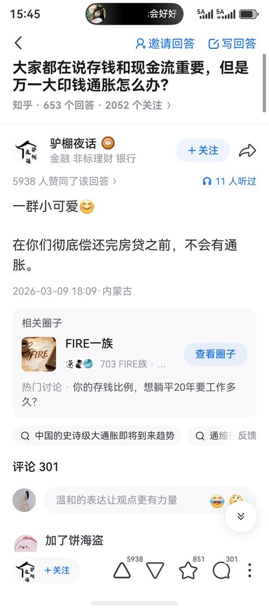
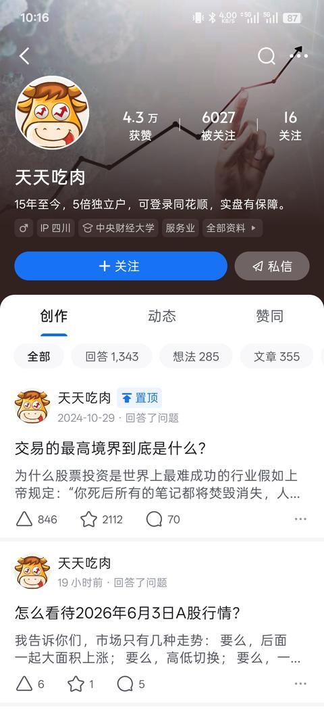

[toc]

# 问题

提问者：**<a href="https://www.zhihu.com/people/pai-gu-mian">道系男儿</a>**
提问时间: 2024-10-13 20:27:55
总回答数: 2449
总访问量: 43587049

各个AMC也好，城投也好，他们的生意，无非低价收集破产公司，等价格回升，再卖出?

# 回答

回答者： **<a href="https://www.zhihu.com/people/tian-tian-chi-rou-94-7">天天吃肉</a>**
回答时间: 2025-10-28 9:18:24
点赞总数: 8311
评论总数: 717
收藏总数: 10043
喜欢总数：453

村里印钱了，结果全村人都变穷了，只有三个人变富了。

有一个村子，100人，一共1万块钱，人均100。村长家开了一个面馆，一块钱一斤面，大家都相安无事。突然有一天，村长偷偷印了1万块钱，但是他很聪明，没有直接发，而是先找到了他的表弟和妹夫，借给他们每人3000块钱去做生意，利息很低，妹夫拿了钱买了村里所有的盐，表弟拿了钱买了村里所有的好地。

一个月之后，村民发现了一个奇怪的事儿，面涨到了两块，盐涨到了三块，地价翻了5个倍。大家都在骂万恶的资本、万恶的通货膨胀。

但是你仔细看这场通胀里面谁挣了钱？

村长印了一万块钱，先花先收益，妹夫囤盐垄断涨价，表弟买资产升值，其他97个人工资没有涨，购买力减半。

这就是通胀的第一个秘密：

通胀是一场财富再分配，从穷人流向富人（或权力得益者），从后知后觉流向先知先觉。

但故事还没有完，村民们很生气，要求村长加工资，村长说好，所有人的工资全部翻倍，村民高兴了一整天，发现面粉涨到了4块，为啥呢？因为人工成本上升，面粉必须涨价，这就叫做工资推动性膨胀。

这个时候，隔壁老王。就很聪明，他借了1000块钱，10个点利息买了一头牛，一年之后，这头牛涨到了2000块钱，他还款1100，净赚900。老王发现了：

通胀的第二个秘密：

就是债务在通胀当中会大幅度缩水，借钱买资产是最大的赢家。

但隔壁的李大爷就惨了，他攒了一辈子1000块钱的养老钱在床底下，通胀之后只能买250斤面粉了，以前能买1000斤，他的资产购买力被偷走了75%。李大爷的教训是：

通胀的第三个秘密：

现金是通胀的最大受害者，存钱等于慢性自杀。

这个时候村里来了一个经济学家，说适度通胀是好事儿，村民都想打他，经济学家却说，你们想一下，如果说没有通胀，甚至是通缩，就是东西越来越便宜了，会怎么样？那就是大家都不买东西了，等明天更便宜，村长也不做面粉了，反正明天更不值钱，隔壁老王也不养牛了，反正也不升值，整个村子的经济就停滞了。这个做通缩螺旋，这也是：

通胀的第四个秘密：

2%~3%的温和通胀是经济的润滑剂，鼓励消费和投资，零通胀是停滞，负通胀是灾难。

但村民就会问，那恶性通胀呢？经济学家就讲了一个真事哈，1923年德国开动印钞机疯狂印钞，早上买一个面包要100马克，下午就要1000马克。工人发工资要老婆在工厂门口等着，拿到钱立马跑去买东西，晚一个小时就不值钱了。最疯狂的时候，人们烧钞票来取暖，因为钞票比木材还要便宜，这就是恶性通胀。

那怎么判断通胀程度呢？

村里有个老人说了一个土方法嘛，看三样东西，理发、房租和猪肉。理发涨价就等于人工成本上升，就等于真通胀。房租涨价就等于资产价格上涨，等于真通胀。猪肉涨价可能是猪瘟，不一定是通胀。但如果说三样东西都涨了，确定是通胀，如果只涨一两样，那可能是结构性涨价。

故事的最后，村民们都学聪明了：

第一，张建国借了钱买了10亩地，五年之后成为了地主。

第二，赵老板把现金换成了设备，扩大生产。

第三，周寡妇买了村里唯一的水井，并且收租金。

只有这个时候蒋大妈还在存钱，五年之后，购买力只剩下30%了。

这就是通胀教会我们的终极智慧，在通胀时代要做张建国借钱买资产，不要做蒋大妈存钱等贬值要做生产者涨价，受益者不做纯消费者，涨价的受害者。

记住，通胀是一场没有硝烟的战争，武器是认知，战利品是财富。你是掠夺者还是被掠夺者，取决于你是否理解游戏的规则。

政府为什么喜欢通胀？因为可以稀释国债，欠100万亿，通胀50%，实际只用还66万亿。富人为什么不怕通胀？因为他们首先负债率高，同时有定价权，成本涨10%，售价涨15%，利润更高，只有工薪阶层是最受伤的，工资涨幅永远跑不赢通胀，这就是为什么你感觉钱越来越不够花。

最后一个秘密：

就是通胀是不可逆的。历史上没有哪个国家货币长期升值，都是长期贬值的。

100年前的1美元，现在的购买力也只剩下3美分了。学会与通胀共舞，而不是对抗通胀，利用通胀的人成了富人，对抗通胀的人却成了穷人，这就是这个世界的游戏规则。

  

原文地址：[(天天吃肉)这次化债是不是意味未来大通胀?](https://www.zhihu.com/question/859037339/answer/1966433598006597308) 

# 评论

1. <a href="https://www.zhihu.com/people/wang-98-57-54">Wang</a> (<small title="湖北">2025-10-29 8:7:33</small>): 谁掌握了生产资料，谁就决定财富分配的规则，掌握了话语权
   - <a href="https://www.zhihu.com/people/qu-jian-99-28">屈简</a> (<small title="广东">2025-10-29 11:4:4</small>): 说到撑握生产资料，农民有地，但粮食定价权不在农民
   - <a href="https://www.zhihu.com/people/xiao-xiao-ju-mao-16">小小橘猫</a> (<small title="回复于 2025-10-29 11:39:37/辽宁"> ✉️:屈简</small>): 你是不是对生产资料有什么误解？
   - <a href="https://www.zhihu.com/people/bailao">虚室生白</a> (<small title="回复于 2025-10-29 11:44:34/新疆"> ✉️:屈简</small>): 农民没有地，农民的地是租的国家的
   - <a href="https://www.zhihu.com/people/mike-5-16-61">逗你玩儿呢</a> (<small title="江苏">2025-10-29 12:47:2</small>): 谁有喷子谁说了算。
   - <a href="https://www.zhihu.com/people/wei-de-25-69">韦德</a> (<small title="回复于 2025-10-29 17:27:38/河北"> ✉️:屈简</small>): 你对生产资料理解不对吧，就像别人说水能载舟亦能覆舟，你说我有一杯水［捂脸］
   - <a href="https://www.zhihu.com/people/jun-lian-4">甲秀里7号</a> (<small title="江苏">2025-10-30 6:24:34</small>): 是谁有铸币权
   - <a href="https://www.zhihu.com/people/zhao-da-ye-87-97">赵大爷</a> (<small title="回复于 2025-10-30 10:16:3/北京"> ✉️:屈简</small>): 农民才是别人的生产资料，土地不是
   - <a href="https://www.zhihu.com/people/di-tuo-24">帝沱</a> (<small title="广东">2025-10-30 14:30:0</small>): 中国？
   - <a href="https://www.zhihu.com/people/bai-xue-82-59-64">8201</a> (<small title="回复于 2025-10-30 14:38:58/北京"> ✉️:小小橘猫</small>): 农民自己就是生产资料［捂脸］
   - <a href="https://www.zhihu.com/people/lian-bu-yao-liao-49">陈练</a> (<small title="广东">2025-10-30 14:40:59</small>): 谁掌握了抢杆子，就有话语权
   - <a href="https://www.zhihu.com/people/80-10-30-90-45">机器卫兵扫大街</a> (<small title="上海">2025-10-30 14:48:48</small>): 大概是各领域实权和垄断产业［思考］
   - <a href="https://www.zhihu.com/people/32-18-44-85">窝润吉</a> (<small title="广东">2025-10-31 10:14:16</small>): 这届镇府的生产资料就是人口红利，就是十三亿劳动者
   - <a href="https://www.zhihu.com/people/jin-he-hao-55">绝无神雄霸</a> (<small title="安徽">2025-10-31 14:44:12</small>): 美国韩国日本大资本家掌权
   - <a href="https://www.zhihu.com/people/xiao-feng-ye-yu-47">萧风夜雨</a> (<small title="回复于 2025-10-31 21:32:13/浙江"> ✉️:屈简</small>): 枪杆子里面出话语权
   - <a href="https://www.zhihu.com/people/e-ba-93-52">羊羊羊</a> (<small title="北京">2025-11-4 10:21:20</small>): 谁掌握了定价权谁就掌握了话语权
   - <a href="https://www.zhihu.com/people/zhangl-21">zhangl</a> (<small title="浙江">2025-11-5 11:56:44</small>): 小朋友我问你，军事资料和生产资料哪个重要
   - <a href="https://www.zhihu.com/people/bu-guo-gu-ji-6">不过估计</a> (<small title="回复于 2025-11-7 8:32:1/江苏"> ✉️:屈简</small>): ［捂脸］你，就是姥爷们的生产资料。
   - <a href="https://www.zhihu.com/people/mei-ying-qi-shi-i">魅影骑士i</a> (<small title="回复于 2025-11-7 9:40:27/浙江"> ✉️:屈简</small>): 毛主席说过 枪杆子里出政权［知乎益蜂］
   - <a href="https://www.zhihu.com/people/chun-sheng-9">春风吹又生</a> (<small title="回复于 2025-11-8 21:53:25/四川"> ✉️:屈简</small>): 农民是土地上的长工，不仅没有农产品定价权，连地里种什么都没有选择权，更不用说在地里盖楼建厂了。
   - <a href="https://www.zhihu.com/people/sui-xin-1-25-96">江洋大盗</a> (<small title="河南">2025-11-13 13:49:10</small>): 谁是消费者谁就能拿捏生产资料，做工厂生产东西，原材料，工人工资，设备，运输，银行贷款利息，都是成本，如果工厂生产的东西卖不出去就无法回笼资金还银行贷款，给员工发工资，就会破产倒闭工人失业债务暴雷，经济萧条，当工人工资买不起工厂生产的东西经济就会萧条
   - <a href="https://www.zhihu.com/people/816cx">816cx</a> (<small title="山东">2025-11-24 13:2:52</small>): 是生产资料，还是权利
   - <a href="https://www.zhihu.com/people/doosho">doosho</a> (<small title="山东">2025-11-24 15:9:22</small>): 不，谁可以使用税款，谁牛逼
   - <a href="https://www.zhihu.com/people/ying-cang-98">Forever</a> (<small title="浙江">2025-11-24 15:45:35</small>): 权利本就是一体两面［大笑］［大笑］，有权就有利，有利就会有权。
   - <a href="https://www.zhihu.com/people/bao-feng-xue-65-26">暴风雪</a> (<small title="回复于 2025-11-24 17:12:32/江西"> ✉️:屈简</small>): 农民真的有地吗？
   - <a href="https://www.zhihu.com/people/qaq-52-35-40">勤能补拙</a> (<small title="回复于 2025-12-2 19:20:33/安徽"> ✉️:屈简</small>): 土地现在算生产设备吧。生产资料应该是农药，化肥，种子等。毕竟这些曾加产量的东西没有掌握在农民手里。
   - <a href="https://www.zhihu.com/people/zhang-yong-32-66-63">traveller</a> (<small title="陕西">2025-12-4 10:20:59</small>): 权力是最优质的生产资料
   - <a href="https://www.zhihu.com/people/74-55-56-34-61">未起名</a> (<small title="浙江">2025-12-16 14:42:29</small>): 生产资料一文不值，分配权才是重点
   - <a href="https://www.zhihu.com/people/xiang-xiang-68-34">相相</a> (<small title="回复于 2025-12-28 19:56:55/广东"> ✉️:doosho</small>): 言之有理呀！言之有理
   - <a href="https://www.zhihu.com/people/hhh-14-93-31">弄死文武</a> (<small title="重庆">2025-12-29 20:27:13</small>): 不对，是生产关系
   - <a href="https://www.zhihu.com/people/wang-yin-89-45">王引</a> (<small title="回复于 2025-12-29 20:55:42/天津"> ✉️:屈简</small>): 农民本身才是生产资料
   - <a href="https://www.zhihu.com/people/47-39-27-17">日月木金</a> (<small title="澳大利亚">2026-1-1 2:43:31</small>): 呵
   - <a href="https://www.zhihu.com/people/ting-quan-79">听泉</a> (<small title="江苏">2026-1-5 23:17:44</small>): 生产制度决定生产力
   - <a href="https://www.zhihu.com/people/muyefp">强制改名</a> (<small title="重庆">2026-1-29 12:33:39</small>): 这是铸币权［吃瓜］
   - <a href="https://www.zhihu.com/people/wang-peng-79-29-77">大眼睛的深海鱼</a> (<small title="浙江">2026-2-4 21:4:50</small>): 问题是，什么是生产资料？
   - <a href="https://www.zhihu.com/people/bei-chi-chi-dao-ni-guang-er-xing-98">背离赤道 逆光而行</a> (<small title="回复于 2026-4-15 13:37:41/湖南"> ✉️:屈简</small>): 但是粮食的定价权不在老农这里，所以应该说老农与地是国有资本的生产资料
   - <a href="https://www.zhihu.com/people/tang-cu-xiao-yu-94">糖醋小鱼</a> (<small title="重庆">2026-5-5 8:44:1</small>): 权力：生产资料？什么生产资料。
   - <a href="https://www.zhihu.com/people/90-11-74-13-61">鸿雁</a> (<small title="北京">2026-5-6 9:56:21</small>): 是资本掌握着生产资料本……可是资本又怕什么呢？
   - <a href="https://www.zhihu.com/people/30-2-95-5">闪电</a> (<small title="回复于 2026-5-21 14:49:11/浙江"> ✉️:屈简</small>): 很简单，因为地是国家给的，只是给你用了而已，农民的地只能用来生产粮食，不信你去盖个厂试试。
   - <a href="https://www.zhihu.com/people/30-2-95-5">闪电</a> (<small title="浙江">2026-5-21 14:49:51</small>): 生产资料国有制，真香
   - <a href="https://www.zhihu.com/people/shen-feng-75-28">神风</a> (<small title="广东">2026-6-10 10:24:8</small>): 权利也是生产资料，因为它可以操控一切资料
   - <a href="https://www.zhihu.com/people/zhiyf9089">zhiYF9089</a> (<small title="回复于 2026-8-8 15:43:42/贵州"> ✉️:屈简</small>): 生产资料不是简单的有块地就说自己拥有了生产资料的，农民那一亩三分地真就够自己一家几口人吃的，收成不好的时候把粮食拿去交易了就没得吃，所以真要碰到个天灾人祸粮食不够的时候，农民更不可能靠粮食赚到钱，能赚钱的是垄断了农业产品的资本家这些人才是真正掌握了生产资料的
2. <a href="https://www.zhihu.com/people/chang-feng-xin-007">长风心007</a> (<small title="湖北">2025-10-28 13:59:54</small>): 2021买的房子，价格跌去快一半了，难道是钱发得不够多么？
   - <a href="https://www.zhihu.com/people/pang-guan-zhe-27-61">旁观者</a> (<small title="江西">2025-10-28 21:41:47</small>): 因为一半是泡沫啊
   - <a href="https://www.zhihu.com/people/zheng-ze-40-20">正则</a> (<small title="回复于 2025-10-29 8:2:44/重庆"> ✉️:旁观者</small>): 可以称之为结构性通胀么？
   - <a href="https://www.zhihu.com/people/feng-cong-bei-fang-lai-94">自由的风</a> (<small title="北京">2025-10-29 8:49:6</small>): 不作为刚需时，单纯就是个工具，现在的工具违法的币
   - <a href="https://www.zhihu.com/people/71-40-72-44-97">灿灿</a> (<small title="回复于 2025-10-29 9:0:37/广东"> ✉️:自由的风</small>): 只能有税这个东西，普通人无论怎样搞，都慢慢被收割，这类文章和二十年前意文差不多，让百姓消费投资。更是危恶，没条件强消强，风险要大半辈子去抗
   - <a href="https://www.zhihu.com/people/xiao-yun-58-41">烛光</a> (<small title="回复于 2025-10-29 9:37:22/浙江"> ✉️:灿灿</small>): 其实也不能这么说。
 
文章的本意，是让你明白不要只知道存钱，把钱换成更保值的其它东西。
 
投资与消费，并不是一个概念。
 
我家就会买金条，玉石与基金。固定存款有，但也保持几十万以防意外，不多存。
   - <a href="https://www.zhihu.com/people/yang-lei-62-99">杨磊</a> (<small title="回复于 2025-10-29 9:49:27/海南"> ✉️:烛光</small>): 金条和基金我可以理解。
   - <a href="https://www.zhihu.com/people/jiu-yue-hua-89">阿玖不行了</a> (<small title="湖南">2025-10-29 10:9:21</small>): 哥们儿，你也得看他的实际价值啊，你把它的金融属性去掉再看，跌了吗？
   - <a href="https://www.zhihu.com/people/chu-dao-79-91">初道</a> (<small title="辽宁">2025-10-29 10:31:10</small>): 债务在通胀中会稀释，显然，当大多数人手中都有债务的时候国家是不可能让你们的债务稀释的。
   - <a href="https://www.zhihu.com/people/zonda-88">2256GA-07</a> (<small title="上海">2025-10-29 10:46:24</small>): 根据通胀长期持有肯定是涨的参考20年前工资50年后大家工资从3k变3w起步是然后小县城房价就可以涨到5w一平。房价涨了但购买了没了，这也是养老金不够的解决方案
   - <a href="https://www.zhihu.com/people/cai-dao-cheng-42">踩点东</a> (<small title="湖南">2025-10-29 11:13:28</small>): 买的泡沫啊，现在再跌现在它任然值那个价，价值是不会大变的
   - <a href="https://www.zhihu.com/people/bie-shuo-hua-63-73">别说话</a> (<small title="北京">2025-10-29 11:21:22</small>): 在通胀时代要做张建国借钱买资产，不要做蒋大妈存钱等贬值要做生产者涨价
 
  
 
说的很清楚啊，可问题是21年之后开始了通宿［发呆］；所以印钱多没用，得流通的钱多才行
   - <a href="https://www.zhihu.com/people/jue-jing-de-mao">绝境的猫</a> (<small title="浙江">2025-10-29 11:27:35</small>): 因为我们社会 城市里的房子本质上是税，而不是资产
   - <a href="https://www.zhihu.com/people/yuan-nian-ping">六子</a> (<small title="江苏">2025-10-29 11:29:23</small>): 人家可以说是🌀
   - <a href="https://www.zhihu.com/people/jianghanpp">神秘用户</a> (<small title="北京">2025-10-29 11:40:59</small>): 跌的不够狠，我卖房子还赚了些，我1千2块一平买的学区房，挨着我们市里的初中高中，还有市医院距离都在几百米那种，24年的时候涨到了将近4千一平，出手了，还赚了几十万，除非我们市里学区房能跌倒几百块块一平，卖掉那个24年，迁居到北京，在北京花了差不多2万一平，80平，不到150万，在北京理工大学（房山校区）附近买的房子，这块也是学校超级多，属于大学城，这块我也考察很久从21年就开始考察，这片的房价掉的太慢，21年到25年房价基本都没变，甚至都超过2万来块，平均2万5到2万8左右，其实还是资产比较实在一直比通货膨胀涨得快，大多数买超了基本都是买的那种纯为了赚钱的房子炒出来的，有些二线城市房价居然能上万，我也是醉了，这种都能有人买，最多4,5千块不挨着学校都不能买，那种买了肯定亏。
   - <a href="https://www.zhihu.com/people/ly-73-33-96-21">LY咏歌</a> (<small title="江苏">2025-10-29 11:47:12</small>): 钱没到你手里
   - <a href="https://www.zhihu.com/people/rural-potato">Rural Potato</a> (<small title="广东">2025-10-29 12:28:35</small>): 再买一套，这样一套房价就只跌了25%［捂脸］
   - <a href="https://www.zhihu.com/people/bu-ji-dao-zao-chen">布吉岛早晨</a> (<small title="湖南">2025-10-29 12:34:22</small>): 房价降了，猪肉降了，只有理发涨了。结论：结构性通胀
   - <a href="https://www.zhihu.com/people/xia-san-geng">夏三庚</a> (<small title="浙江">2025-10-29 12:51:29</small>): 是软着陆，你是其中的一层海绵体。你不早点买，都要软着陆了你去接盘
   - <a href="https://www.zhihu.com/people/water-119">water-119</a> (<small title="回复于 2025-10-29 13:28:49/天津"> ✉️:杨磊</small>): 基金保值吗［doge］
   - <a href="https://www.zhihu.com/people/lu-w-82">大地</a> (<small title="浙江">2025-10-29 13:36:30</small>): 金融资产价格不是永远上涨的，但是会长期上涨，股市里有涨有跌，房市里也一样，如果没有价值的金融资产有可能泡沫破灭的时候一文不值，比如：荷兰的郁金香泡沫的破灭，今天的比特币因为拥有洗黑钱的特性才有价值，真的有一天全世界监管黑钱或新的更可靠的自由流通工具出现，比特币就是荷兰的郁金香。
   - <a href="https://www.zhihu.com/people/llllllll-46-12">阿篱同学</a> (<small title="回复于 2025-10-29 14:10:21/山西"> ✉️:烛光</small>): 金条基金可以，玉石就算了
   - <a href="https://www.zhihu.com/people/ling-121-28">哈哈哈121</a> (<small title="浙江">2025-10-29 14:17:42</small>): 肯定不够多，提前透支未来几十年的钱，而不是现在的钱，要是发到人人月薪1万，房价还会涨
   - <a href="https://www.zhihu.com/people/xiao-cao-69-89-28">小草</a> (<small title="回复于 2025-10-29 14:38:19/浙江"> ✉️:烛光</small>): 没有人因为通胀而破产，都是为了跑赢所谓的通胀去瞎做所谓的投资理财而破产
   - <a href="https://www.zhihu.com/people/caifx">caifx</a> (<small title="贵州">2025-10-29 14:40:25</small>): 确实是的［doge］准确点说是钱印得不够多！
   - <a href="https://www.zhihu.com/people/xiao-yun-58-41">烛光</a> (<small title="回复于 2025-10-29 15:21:33/浙江"> ✉️:小草</small>): 我家资产，大概500万，但我的月薪才几千。
 
我真的把钱变成存款我手里，那我不吃不喝，赚的钱，都抵不过通胀而蒸发的资产。
 
我难道不知道投资有风险吗？
   - <a href="https://www.zhihu.com/people/xiao-yun-58-41">烛光</a> (<small title="回复于 2025-10-29 15:22:39/浙江"> ✉️:阿篱同学</small>): 玉石是多年前，我妈个人喜欢才买的。
 
现在已经不作为投资的方向了。
   - <a href="https://www.zhihu.com/people/fansc-35">Paris-sud</a> (<small title="回复于 2025-10-29 15:33:6/广东"> ✉️:烛光</small>): 玉石？这玩意有成型的二级市场么？［捂脸］
   - <a href="https://www.zhihu.com/people/xiao-yun-58-41">烛光</a> (<small title="回复于 2025-10-29 16:1:24/浙江"> ✉️:Paris-sud</small>): 你别说，翡翠的价格涨得挺离谱的。
 
不过主要还是母亲喜欢，家里主要投资还是金条，基金，股票等。
   - <a href="https://www.zhihu.com/people/fansc-35">Paris-sud</a> (<small title="回复于 2025-10-29 16:34:35/广东"> ✉️:烛光</small>): 我说的是你变现的价格，和二手房一样，别有价无市……
   - <a href="https://www.zhihu.com/people/liu-yan-chen-69">一轮明月照九州</a> (<small title="四川">2025-10-29 19:49:18</small>): 最近在通缩
   - <a href="https://www.zhihu.com/people/71-40-72-44-97">灿灿</a> (<small title="回复于 2025-10-30 0:17:58/广东"> ✉️:烛光</small>): 你玩基金就懂，你挣的多少点，应很清楚。  
 
文中说从始发点上车，高位下车。  
 
现实中的人根本没有第一桶金，没有机会和条件上始发站，  
 
都是半路上的车，有高有低，很多人根本抗不过那个周期。  
 
文章讲的故事本质是始发站上车的人的故事，让普通人幻想，我也可以的感觉。  
 
更可怕的是背后的庄家，每次都吃上车的人的点。
   - <a href="https://www.zhihu.com/people/xiao-yun-58-41">烛光</a> (<small title="回复于 2025-10-30 8:12:37/浙江"> ✉️:灿灿</small>): 现在投资确实很难做，普通人玩投资，确实很容易亏钱。
 
存款会编制，投资会亏钱。
 
普通人想要保住资产，真的很困难。
   - <a href="https://www.zhihu.com/people/mo-91-59">知乎用户MO</a> (<small title="回复于 2025-10-30 8:13:8/河南"> ✉️:2256GA-07</small>): 国女也65退休，你再看看养老金
   - <a href="https://www.zhihu.com/people/an-yang-54-64">安洋</a> (<small title="广东">2025-11-16 0:36:47</small>): 房子起码能住，解决居住问题，你说这个黄金就是个金属解决不了实际问题，哪一天说一文不值就不值了
   - <a href="https://www.zhihu.com/people/a-hao-30-43-17">啊豪</a> (<small title="回复于 2025-12-24 9:28:5/广东"> ✉️:初道</small>): 对普通人无效 因为 钱的数量不够［大笑］［大笑］
   - <a href="https://www.zhihu.com/people/a-hao-30-43-17">啊豪</a> (<small title="回复于 2025-12-24 9:29:2/广东"> ✉️:别说话</small>): 对不同人没得用 钱就这点 ［思考］［思考］也不会向以前房地产一样 夸张的起飞［思考］［思考］
   - <a href="https://www.zhihu.com/people/a-hao-30-43-17">啊豪</a> (<small title="回复于 2025-12-24 9:32:23/广东"> ✉️:小草</small>): 太对了 普通人去投资不是在回本 就是在挣扎 还不如存钱 等 涨的时候 再出击 整点小钱 ［思考］［思考］ 老想跑赢通胀 会吊坑里
   - <a href="https://www.zhihu.com/people/a-hao-30-43-17">啊豪</a> (<small title="回复于 2025-12-24 9:52:15/广东"> ✉️:灿灿</small>): 中途上车 风险很大的 没几人收得住 ［大笑］［大笑］这才是 隐藏最大风险
   - <a href="https://www.zhihu.com/people/jun-ge-ge-32">呵呵哒</a> (<small title="安徽">2025-12-28 19:56:15</small>): 我21年买的博实黄金etf，赚翻了。谁让你买房子呢
   - <a href="https://www.zhihu.com/people/mrzhang-62-19">MR.zhang</a> (<small title="回复于 2025-12-29 1:53:59/山东"> ✉️:别说话</small>): 你等流通起来不就晚了吗？
   - <a href="https://www.zhihu.com/people/tiao-wang-73-86">被水淹死的鱼</a> (<small title="回复于 2025-12-29 9:2:10/未知"> ✉️:灿灿</small>): 去借钱 抗通胀
   - <a href="https://www.zhihu.com/people/12-24-64-48">闪闪的红芯</a> (<small title="山东">2025-12-29 11:46:30</small>): 怎么不说2017房价翻了不止一倍呢。当时通胀难道翻倍了？
   - <a href="https://www.zhihu.com/people/26-28-57">帅到没人爱</a> (<small title="回复于 2025-12-29 12:14:44/湖南"> ✉️:正则</small>): 这肯定不算啊，通胀是流通中的货币大于实际需要，这纯粹是泡沫被戳破，资产贬值罢了。简单点说，泡泡玛特盲盒今年很火，58元现价能炒到5800，但明年热度下来了，它就跌到3800，这就是资产贬值
   - <a href="https://www.zhihu.com/people/shan-shan-shan-42-96">闪珊珊</a> (<small title="浙江">2025-12-29 16:19:12</small>): 大概率，说这种话的人，是没有房子滴［酷］
   - <a href="https://www.zhihu.com/people/16-59-65-37-62">故里</a> (<small title="回复于 2025-12-29 17:2:51/河南"> ✉️:初道</small>): 是的 经济学家不会让大多数人能稀释的
   - <a href="https://www.zhihu.com/people/16-59-65-37-62">故里</a> (<small title="河南">2025-12-29 17:7:52</small>): 借钱抗通胀不行，但是借钱不还当老赖肯定可行
   - <a href="https://www.zhihu.com/people/lu-sheng-11-27">陆生</a> (<small title="江苏">2026-1-4 13:59:31</small>): 因为你这房价主体是土地出让金，是税
   - <a href="https://www.zhihu.com/people/molis-94">molis</a> (<small title="回复于 2026-1-6 12:15:3/河南"> ✉️:2256GA-07</small>): 你以为经济是一直上行的啊
   - <a href="https://www.zhihu.com/people/molis-94">molis</a> (<small title="回复于 2026-1-6 12:20:36/河南"> ✉️:闪珊珊</small>): 醒醒，房价跌多少了
   - <a href="https://www.zhihu.com/people/xiao-niao-34-97">小鸟</a> (<small title="浙江">2026-1-6 17:3:16</small>): 现在看着是通缩，啥都在降价，包括工资
   - <a href="https://www.zhihu.com/people/gyls-13">GYLS</a> (<small title="回复于 2026-1-7 15:26:16/浙江"> ✉️:小鸟</small>): 物价没降
   - <a href="https://www.zhihu.com/people/feyouka">春暖花开</a> (<small title="回复于 2026-1-19 13:9:50/浙江"> ✉️:初道</small>): 推行lpr利率，是不是就是这个道理
   - <a href="https://www.zhihu.com/people/guo-zhuang-wei">懒得像名了</a> (<small title="山东">2026-1-29 21:3:26</small>): 这么说吧，你通货膨胀你可以这么理解：（流）通（的）货（币）膨胀（也就是变多了）  
 
关键不在货币，而在流通  
 
你手里有钱，那不叫流通，银行里有钱，那也不叫流通  
 
那什么叫流通呢？你把钱花出去的那一刻，才叫流通  
 
现在的问题不是印钱不够多，而是敢花钱，有钱花的太少了
   - <a href="https://www.zhihu.com/people/mai-tian-li-de-shou-wang-zhe-2-17">麦田里的守望者</a> (<small title="回复于 2026-2-4 14:37:43/黑龙江"> ✉️:烛光</small>): 你这个也是泡沫啊
   - <a href="https://www.zhihu.com/people/xiao-liang-ge-94-30">小凉哥</a> (<small title="浙江">2026-2-4 18:31:8</small>): 再大的泡沫都可以用发展（通涨）来烫平［酷］［酷］［酷］如果没有，再烫几年［酷］［酷］［酷］
   - <a href="https://www.zhihu.com/people/xi-wang-xiu-xi">希望休息</a> (<small title="回复于 2026-2-8 13:35:23/河北"> ✉️:别说话</small>): 难道不是应该通缩尾声开始借钱，等通胀的时候就晚了，只是这个点不好判断
   - <a href="https://www.zhihu.com/people/da-da-54-80-83">热心市民赵某某</a> (<small title="回复于 2026-2-9 22:17:23/山西"> ✉️:初道</small>): 地方政府有很多隐形债啊
   - <a href="https://www.zhihu.com/people/lan-yang-yang-40-23">海上月</a> (<small title="回复于 2026-2-21 7:22:54/山东"> ✉️:烛光</small>): 你家的金条卖了吗［捂嘴］
   - <a href="https://www.zhihu.com/people/jiayp12356ok">jiayp12356ok</a> (<small title="回复于 2026-2-21 18:17:26/湖北"> ✉️:神秘用户</small>): 好多二线城市都是几万，一线就是北上广深，其他省会城市好多是二线，你看多少都超过了，好多是几万，北京房山就是郊县，比不上省会城市。你能到2万，省会城市怎么不能到2万。听说过“宁可做鸡头不做凤尾”的格言吗？［酷］
   - <a href="https://www.zhihu.com/people/xuan-zang-kong-liao">玄奘空了</a> (<small title="山西">2026-2-22 9:7:58</small>): 喝过啤酒吧，往酒杯里倒酒的时候会有泡沫，倒的快的话还会溢出，所以为了防止溢出，有时会倒的慢点，泡沫破裂的速度要大于倒酒的速度，这样就不会溢出。你买的时候差不多是喊出房住不炒五年以上了。怎么说也该是让泡沫破一部分的时候了吧，你怎么还搞不清？
   - <a href="https://www.zhihu.com/people/jianghanpp">神秘用户</a> (<small title="回复于 2026-2-22 20:38:58/北京"> ✉️:jiayp12356ok</small>): 这个要选择，我在北京盘踞了10年了一直等房子掉价，学区房，临地铁的一毛都没掉，实际情况，房价还一直逐步攀升，掉的都是那种炒作房（老破小，离地铁超过1.5公里，周边3公里没学校），我个人经济实力问题，所以只能选房山长阳这块，我开车上班通勤40来分钟，到天安门也是40来分钟，现在选的也是大学城，紧邻商场这种，没得办法最优选择只能是这样，一个人在外面打工是又难又累，赚钱太难，不想贷款，并且要保证手里面有可以随时使用的流动金50万，手里的钱想全款买房，就够买这，丰台这块我也观察很久了，我直接搬到这块住了很久，我刚关注的时候300万左右也还能买起，4万来一平，我看网上说房价会掉开始等，网上都说对半砍，我琢磨着掉到3万，我就赶紧下手，现在都掉到快6万一平了，就七里庄这块，这块交通很方便，通勤十几分钟，我也在等房价掉，掉的越狠，就能多买几套放手里租着，这东西是刚需，只要位置方便上班很好租，我老家市里名下还有两套房，都用来出租的，我也巴不得他抄底，然后我在屯一些，之前不掉价都没机会屯。
   - <a href="https://www.zhihu.com/people/lifan-92">暖夜</a> (<small title="江苏">2026-3-18 17:52:52</small>): 这个叫人民币潮汐［吃瓜］［吃瓜］
   - <a href="https://www.zhihu.com/people/91-16-97-23-59">夜微凉风绕梁</a> (<small title="回复于 2026-3-26 12:58:41/安徽"> ✉️:小凉哥</small>): 房地产就别想了，除非人口暴涨不过显然是不可能的［捂嘴］
   - <a href="https://www.zhihu.com/people/91-16-97-23-59">夜微凉风绕梁</a> (<small title="回复于 2026-3-26 13:3:53/安徽"> ✉️:神秘用户</small>): 人员集中有钱赚，等没钱赚的时候市场大于需求都一样！
   - <a href="https://www.zhihu.com/people/liu-zhi-zhi-59-25">刘知知</a> (<small title="回复于 2026-4-16 13:2:5/福建"> ✉️:神秘用户</small>): 高层住宅和自带土地的房子，价值是不一样的。房地产和房产是两回事
   - <a href="https://www.zhihu.com/people/qi-ming-49-61">旗明</a> (<small title="海南">2026-5-1 7:29:4</small>): 现在是通缩
   - <a href="https://www.zhihu.com/people/xiabing1988">隔山打牛</a> (<small title="浙江">2026-5-6 8:58:28</small>): 不让你们接盘，难道让银行接盘？［捂脸］
   - <a href="https://www.zhihu.com/people/liu-qing-chen-63-61">柳轻尘</a> (<small title="陕西">2026-5-10 16:49:27</small>): 因为那玩意哪怕再跌十倍也还是远远超出成本价格啊
   - <a href="https://www.zhihu.com/people/xiao-zhang-yu-52">小章鱼</a> (<small title="广东">2026-5-20 21:24:26</small>): 21年房价算是一个高点吧？想涨更高得下一轮大通胀才有希望脱手吧？
   - <a href="https://www.zhihu.com/people/hosty-22">hosty</a> (<small title="上海">2026-5-27 12:54:51</small>): 记住一句话:赚钱永远是少数人的，每个人都赚钱，那就不是真的赚钱
3. <a href="https://www.zhihu.com/people/jian-feng-44-48">天都水月</a> (<small title="河北">2025-10-29 8:37:59</small>): 这个年景儿聊通胀~啧啧啧，大家要意识到，这篇文章所有观点和建议要反过来看
   - <a href="https://www.zhihu.com/people/rong-jie-71">界云jerry</a> (<small title="四川">2025-10-29 11:35:5</small>): 通胀是为了博学，通缩是怕剥削的基础没了
   - <a href="https://www.zhihu.com/people/kong-xiang-80-82">空想普拉斯</a> (<small title="中国香港">2025-10-30 14:39:25</small>): 确实 现在这个时间点讲通胀没啥意义了 二十年前还差不多
   - <a href="https://www.zhihu.com/people/ye-xiao-zi-9-62">夜枭子</a> (<small title="广东">2025-11-15 16:19:5</small>): 局中局
   - <a href="https://www.zhihu.com/people/xiong-da-98-32">大熊</a> (<small title="四川">2025-11-25 16:13:35</small>): 对的，在全民负债的情况下，通胀就相当于给大家免债。
   - <a href="https://www.zhihu.com/people/yang-le-34-5">养乐</a> (<small title="广东">2025-11-29 2:55:51</small>): 有输入型通胀，美联储qe就会这样，08年就是
   - <a href="https://www.zhihu.com/people/poesche-37">止戈</a> (<small title="回复于 2025-12-5 20:44:43/四川"> ✉️:大熊</small>): 工资涨了吗
   - <a href="https://www.zhihu.com/people/xiong-da-98-32">大熊</a> (<small title="回复于 2025-12-5 21:10:28/四川"> ✉️:止戈</small>): 通胀真的来了的话，工资肯定会涨的。
   - <a href="https://www.zhihu.com/people/daniel-18-65-55">盐选狗都不看</a> (<small title="美国">2025-12-12 5:36:30</small>): 滞胀
   - <a href="https://www.zhihu.com/people/xiang-xiang-68-34">相相</a> (<small title="广东">2025-12-28 20:1:50</small>): 对，这几年都是现金为王，否则投什么亏什么
   - <a href="https://www.zhihu.com/people/wzasmnl">wzasmnl</a> (<small title="广东">2025-12-30 1:45:31</small>): 太好笑了，还不要存钱
   - <a href="https://www.zhihu.com/people/momo-67-42-15">momo</a> (<small title="回复于 2026-1-29 11:34:36/湖北"> ✉️:wzasmnl</small>): ［doge］什么人干什么事，如果别人是文旅局、计生办、理财基金、游泳健身的呢？不把钱套出来花了，别人的KPI怎么达标？
   - <a href="https://www.zhihu.com/people/jackz-22">默提</a> (<small title="回复于 2026-2-5 15:32:11/广东"> ✉️:大熊</small>): 这年头免债才是最佳选择吧,不然等出现系统性债务违约更惨
   - <a href="https://www.zhihu.com/people/73-14-96-64-70">血刃</a> (<small title="回复于 2026-3-1 0:17:59/天津"> ✉️:大熊</small>): 10年前底层无产阶级的工资是3000，现在还是3000你去哪涨呢？
   - <a href="https://www.zhihu.com/people/xiong-da-98-32">大熊</a> (<small title="回复于 2026-3-1 10:33:7/四川"> ✉️:血刃</small>): 所以说通胀还没来呀
   - <a href="https://www.zhihu.com/people/73-14-96-64-70">血刃</a> (<small title="回复于 2026-3-3 13:56:28/天津"> ✉️:大熊</small>): ［飙泪笑］［飙泪笑］［飙泪笑］
   - <a href="https://www.zhihu.com/people/31-70-70-44">知乎用户B4degY</a> (<small title="回复于 2026-3-3 16:11:29/吉林"> ✉️:默提</small>): 你这相当于把自己也当土匪去掠夺劳动有积蓄的人
   - <a href="https://www.zhihu.com/people/mo-ran-14-8-14">黑底红边</a> (<small title="云南">2026-5-6 11:52:4</small>): 快了，等债务转型完成，正式开始化债，那就必须通胀了，在大一统里你能看到的都是你能看的。
   - <a href="https://www.zhihu.com/people/omyfuckingod">OMyFucKinGoD</a> (<small title="回复于 2026-6-13 9:47:11/辽宁"> ✉️:血刃</small>): 你怎么还敢笑别人的？别人讲道理，你在那输出情绪，还觉得自己最聪明了。这个社会作为一个男人，要是想挣钱，你告诉干什么工作才只能挣到3000？
   - <a href="https://www.zhihu.com/people/zhu-si-ming-26">灬刻骨</a> (<small title="回复于 2026-6-18 8:23:8/四川"> ✉️:大熊</small>): 为什么说全民负债呢，这个有点不太理解
   - <a href="https://www.zhihu.com/people/xiong-da-98-32">大熊</a> (<small title="回复于 2026-6-18 9:29:39/四川"> ✉️:灬刻骨</small>): 贷款买房，买车。。。
   - <a href="https://www.zhihu.com/people/zhang-wei-75-93-47">张维</a> (<small title="回复于 2026-8-4 9:53:11/北京"> ✉️:灬刻骨</small>): 地方政府的债 国有企业的债 都是全民的债
4. <a href="https://www.zhihu.com/people/guo-qiang-80-67-26">海与老人</a> (<small title="湖南">2025-10-29 3:27:50</small>): 太复杂了，做人太难了，所以，累，下辈子再也不来玩了，让你们去算计吧。
   - <a href="https://www.zhihu.com/people/hua-er-yi-yang-98">善水愛治</a> (<small title="福建">2025-10-29 7:10:3</small>): 不能哦，除非你自己能做主［酷］
   - <a href="https://www.zhihu.com/people/hai-da-yu-da-hai">海大鱼大海</a> (<small title="上海">2025-10-29 10:5:21</small>): 其实做人简单点好，人生很长有时候顺有时候不顺，时代有时候在推着你走有时候不让你走，我们都无法左右什么，只要好好过好每一天日子就好了，放轻松点兄弟。
   - <a href="https://www.zhihu.com/people/ou-yang-le-le-92">Inner peace</a> (<small title="浙江">2025-10-29 11:6:47</small>): 这和算计没关系，基本常识啊
   - <a href="https://www.zhihu.com/people/kv7nb6">精神病院李叫兽</a> (<small title="回复于 2025-10-29 11:19:17/山东"> ✉️:Inner peace</small>): 这套制度设计的时候就在算计了
   - <a href="https://www.zhihu.com/people/pursuitMG">史政百思</a> (<small title="内蒙古">2025-10-29 12:34:7</small>): 人到中年就会明白。做人不难。做穷人才难，想穷变富的人更是难上难。先富的人必定会堵上自己致富的路。做皇帝的人必定会完善来时路。就像老赵黄袍加身，赵皇帝就杯酒释兵权。不知道给他披黄袍的将士会不会后悔
   - <a href="https://www.zhihu.com/people/lu-w-82">大地</a> (<small title="浙江">2025-10-29 13:40:17</small>): 这个是简化版本，实际上要比这个更复杂，毕竟世界上存在很多国家，有穷有富有强大有弱小，也存在不同的货币，外部因素带来的影响可能比想象的大的多，中国这几年的房地产市场破灭性下跌，外部市场的影响十分巨大，或者说因为外部市场，导致的政策导向，从而产生的市场后果。
   - <a href="https://www.zhihu.com/people/xu-ye-14-10">ninesun233</a> (<small title="江苏">2025-10-31 15:18:54</small>): 人间即地狱
   - <a href="https://www.zhihu.com/people/okk-17-33">鱼鱼鱼</a> (<small title="四川">2025-11-7 22:56:56</small>): 做人比做任何动物都更容易些，因为人这物种处于食物链顶端。多了解一下野生动物们的实际生存状况，你就会知道这是事实
   - <a href="https://www.zhihu.com/people/ai-wo-qu-72">汪仔</a> (<small title="辽宁">2025-12-29 9:31:59</small>): 和玩脑子的人玩斧子就行了
   - <a href="https://www.zhihu.com/people/hua-ling-18-13">华灵</a> (<small title="回复于 2025-12-29 16:22:6/上海"> ✉️:精神病院李叫兽</small>): 资本体系下的制度什么时候不算计了？工业革命300年，都是吃人的时代，以前是物理性吃人，现在是各种持有资本的人靠通胀收割。
   - <a href="https://www.zhihu.com/people/liu-jun-fei-21-52">邪了个门子</a> (<small title="回复于 2026-3-29 4:42:57/山东"> ✉️:鱼鱼鱼</small>): 吃战斧牛排的马克，王思聪的可可，一半的人比不了［捂脸］
5. <a href="https://www.zhihu.com/people/sunshine-73-79-33">Sunshine</a> (<small title="山东">2025-10-29 7:21:57</small>): 对，借钱不还就行
   - <a href="https://www.zhihu.com/people/yu-long-48-26-13">誉龙</a> (<small title="山西">2025-10-29 7:36:6</small>): 这个破局最快，
   - <a href="https://www.zhihu.com/people/helloworld-25-87">helloworld</a> (<small title="回复于 2025-10-29 9:53:15/陕西"> ✉️:誉龙</small>): 被拉黑（借的少）或者进去的（借的很多）也快［酷］
   - <a href="https://www.zhihu.com/people/3ban-ban-chang">我是小粉红</a> (<small title="广西">2025-10-29 12:9:1</small>): 轮不到，很多有钱人就是欠债不还的
   - <a href="https://www.zhihu.com/people/mattinata-38">mattinata</a> (<small title="回复于 2025-10-29 13:28:36/广东"> ✉️:helloworld</small>): 进去不至于，现在一堆背债的
   - <a href="https://www.zhihu.com/people/eddie-19-17">Eddie</a> (<small title="广西">2025-10-29 14:30:7</small>): 所以直接發人均的錢， 是可解決問題。
   - <a href="https://www.zhihu.com/people/oeli3780">oeli</a> (<small title="回复于 2025-10-30 8:35:22/四川"> ✉️:helloworld</small>): 借的不够多
   - <a href="https://www.zhihu.com/people/gong-yong-an">达摩克利斯之盾</a> (<small title="天津">2025-11-5 14:52:25</small>): 假药停借钱不还，还能在美国大豪斯里逍遥。普通人借钱不还，手筋断了［飙泪笑］
   - <a href="https://www.zhihu.com/people/chun-ping-99-58">春平</a> (<small title="湖南">2025-12-28 21:27:47</small>): 现在银行的钱急着找人去贷。快去。
   - <a href="https://www.zhihu.com/people/zyl-51-64">我是废物</a> (<small title="回复于 2025-12-29 6:36:47/四川"> ✉️:helloworld</small>): 大部分普通人只欠钱基本上不可能进去的［飙泪笑］顶多失信而已
   - <a href="https://www.zhihu.com/people/weir-46-24">Weir</a> (<small title="回复于 2025-12-30 10:28:20/广东"> ✉️:helloworld</small>): n你看谁欠下40-60W谁进去了
   - <a href="https://www.zhihu.com/people/zhiyf9089">zhiYF9089</a> (<small title="贵州">2026-8-8 15:47:26</small>): 农民百姓超前消费更惨，有个大病一场空
6. <a href="https://www.zhihu.com/people/bao-zi-cheng-37">俗适</a> (<small title="四川">2025-10-29 9:47:57</small>): 你说的很对，只不过现在看上去让老百姓借钱买的资产，比老百姓自己存钱贬值的风险更大。
   - <a href="https://www.zhihu.com/people/15016744952">正正的负</a> (<small title="陕西">2025-10-30 8:7:13</small>): 都说黄金稳，但是你只能买假黄金那还稳不
   - <a href="https://www.zhihu.com/people/huang-ming-jing">ring42</a> (<small title="回复于 2025-11-4 12:43:40/四川"> ✉️:正正的负</small>): 哈哈哈哈哈
   - <a href="https://www.zhihu.com/people/bao-zi-cheng-37">俗适</a> (<small title="回复于 2025-11-6 13:55:59/日本"> ✉️:正正的负</small>): 我有一个观点，特别适合现在的我。就我的圈层而言（企业牛马，父母都是普通百姓），但凡我感觉啥能赚钱，而且周边三四个人都在觉得这个东西能赚钱，我就知道这事情赚不了钱了。就像您说的黄金一样，看到黄金涨价，但是金店却又倒闭的情况，然后在看看现在的结婚率（基本上普通百姓而言，一生中也就结婚、生子 的时候会采购金饰了），我就感觉这事情里面肯定有问题，这个时间点不会让老百姓从黄金上赚到钱了，但是我不知道会怎么操作。果不其然，马上就出现了金条下架，老百姓卖金条没人收！然后又出了黄金税［酷］
   - <a href="https://www.zhihu.com/people/wei-rong-63-2">魏榕</a> (<small title="回复于 2025-11-14 8:53:26/辽宁"> ✉️:俗适</small>): 老百姓兜里这仨瓜俩枣，八百个人惦记，还是捂紧口袋的好。记住了，凡是鼓吹的都是有坑的。
   - <a href="https://www.zhihu.com/people/bao-zi-cheng-37">俗适</a> (<small title="回复于 2025-11-14 10:46:6/日本"> ✉️:魏榕</small>): 呼吁鼓励的，不需要排队的，老百姓好处可捞的，一定要记住以上三个条件不可能同时满足。
   - <a href="https://www.zhihu.com/people/an-yang-54-64">安洋</a> (<small title="广东">2025-11-16 0:22:3</small>): 就是换了个载体把中产的钱圈出来，每个人都觉得自己不是最后一个，然后发现根本不给你时间。
   - <a href="https://www.zhihu.com/people/wu-h-5-5">跑啊跑的兔子</a> (<small title="江苏">2025-11-25 7:11:4</small>): 那是因为有失业风险存在［大哭］
   - <a href="https://www.zhihu.com/people/liu-quan-xi-xue">流泉溪雪</a> (<small title="河南">2025-11-30 20:43:6</small>): 老百姓认知不够，什么时候都是韭菜的命
   - <a href="https://www.zhihu.com/people/you-you-5-81-67">坚守初心</a> (<small title="回复于 2025-12-6 22:41:59/河南"> ✉️:俗适</small>): 你这一说我想起来了，家附近一个存在好几年的金银专卖店撤柜了，就在两三个月前吧。
   - <a href="https://www.zhihu.com/people/bao-zi-cheng-37">俗适</a> (<small title="回复于 2025-12-8 8:36:14/山东"> ✉️:坚守初心</small>): 是吧，金价上涨了，金店却关门了。相比金店卖金子赚那点，真正让老百姓难受的还是上涨的金价。
   - <a href="https://www.zhihu.com/people/you-you-5-81-67">坚守初心</a> (<small title="回复于 2025-12-8 13:8:21/河南"> ✉️:俗适</small>): 总感觉有操纵的，就是不知道里面的道道
   - <a href="https://www.zhihu.com/people/bao-zi-cheng-37">俗适</a> (<small title="回复于 2025-12-9 8:14:17/山东"> ✉️:坚守初心</small>): 肯定有。基本上就四个字：保持贫穷。因为富人最大的资产是穷人。
   - <a href="https://www.zhihu.com/people/a-hao-30-43-17">啊豪</a> (<small title="回复于 2025-12-24 11:2:38/广东"> ✉️:安洋</small>): ［大笑］通胀对普通人的 打击 比全身投入存款的风险小
7. <a href="https://www.zhihu.com/people/zi-mei-ti-zi-zhu-dian-shang-gong-ju">点石乐钓</a> (<small title="湖北">2025-10-29 6:58:15</small>): 无权无势是无产之源
   - <a href="https://www.zhihu.com/people/guo-qiang-80-67-26">海与老人</a> (<small title="湖南">2025-10-29 9:26:45</small>): 是无源之水。
   - <a href="https://www.zhihu.com/people/li-li-tie-jun">铁汉佳佳</a> (<small title="北京">2025-11-2 5:51:59</small>): 不付出劳动的产得到了也不懂珍惜，要将生产资料盘活。
   - <a href="https://www.zhihu.com/people/a-qi-ge-jiang-dian-ying-6">阿七哥讲电影</a> (<small title="浙江">2025-11-2 8:41:15</small>): 所以现在你还听见提无产阶级吗
   - <a href="https://www.zhihu.com/people/xing-fu-zai-wo-xin-li">芒芒露露</a> (<small title="回复于 2026-3-11 14:46:54/山东"> ✉️:阿七哥讲电影</small>): 教材也该更新了
8. <a href="https://www.zhihu.com/people/1984-67-8">1984</a> (<small title="浙江">2025-10-29 10:21:6</small>): 这从一开始就是一场精心策划的他杀，尤其是在大数据时代。
 
存款固然是慢性自杀，但如果你敢配置资产，那村长首先是大幅拉高你想配置的资产，让你配置成本增加，并且背上负债。
 
既赚你资产的钱，也赚你利息的钱。等到村里这种资产都到你手里，村长看都不看一眼，你就等着自生自灭，泡沫破裂吧。
 
或者村长假装好心的，追求软着陆，让村民张三、李四一起分担点你的垃圾资产。
   - <a href="https://www.zhihu.com/people/an-yang-54-64">安洋</a> (<small title="广东">2025-11-16 0:31:0</small>): 你说的经典
   - <a href="https://www.zhihu.com/people/an-yang-54-64">安洋</a> (<small title="广东">2025-11-16 0:31:46</small>): 感觉我们把西方那套资本收割玩的对自己人比老外玩的溜，而且一点不手软
   - <a href="https://www.zhihu.com/people/qiu-yu-fei-fei-32">秋雨菲菲</a> (<small title="湖南">2025-11-19 9:59:43</small>): 尊守规则的人被制定规制的人收割是必然。 然而别人有枪杆子 而你我没有。 时代变了 振臂一挥也不可能了。 以后的人只会越来越苦
   - <a href="https://www.zhihu.com/people/lin-de-li-92">林得利</a> (<small title="广东">2025-11-24 17:39:9</small>): 我也想到这个问题，钱存着贬值，但如果你去搞投资，死的更惨，最好的办法还是兑外币
   - <a href="https://www.zhihu.com/people/ni-ba-ba-52-5-1">CalmDown</a> (<small title="回复于 2025-12-20 7:33:38/四川"> ✉️:林得利</small>): 真心求解，从一个池子进另一个池子真的就不一样了吗？
   - <a href="https://www.zhihu.com/people/60-58-11-28-49">猫猫呜</a> (<small title="江苏">2026-1-9 17:10:54</small>): 穷人就是因为有点存款应急才不会变成流浪汉
   - <a href="https://www.zhihu.com/people/yun-hua-tian-96">知乎用户</a> (<small title="广东">2026-2-22 0:25:28</small>): 精辟
   - <a href="https://www.zhihu.com/people/xing-hua-67-93">前尘醉梦</a> (<small title="回复于 2026-3-10 11:34:7/湖南"> ✉️:CalmDown</small>): 利率差［吃瓜］  
 
只要本币贬值和外币贬值速度差存在，就存在各种文章可以做，但是现在有严格的管制［吃瓜］
   - <a href="https://www.zhihu.com/people/rs2tlm">锦衣夜行</a> (<small title="回复于 2026-7-2 10:37:24/山东"> ✉️:CalmDown</small>): 池子和池子的规则不同，虽然本质都是为了收割，但是规则差距很大，在不同领域收割力度也不同
   - <a href="https://www.zhihu.com/people/sheng-si-81-19">生死</a> (<small title="回复于 2026-7-22 14:8:46/山东"> ✉️:前尘醉梦</small>): 对之前看经济方面的书的时候看过，日本的一个写的什么日本30年泡沫啥啥啥的提到过这个，，说是之前外国借日本的钱，然后日元贬值了又还了回来，然后利率差了很多，赚了一大笔，， 但是您现在说的严格的管制是指什么，真心求教， 是说个人又外币兑换限制吗？？？还是什么
9. <a href="https://www.zhihu.com/people/qiu-shan-1024">丘山1024</a> (<small title="陕西">2025-10-29 6:21:45</small>): 对抗通胀的人成了穷人是果。恶心的一点是只要你在这，还呼吸着，你就会被动被卷入。更可恶的是要问因，最无语的恐怕是这些人/普罗大众本就是被吉祥村村领导么一次次临大危抱佛脚突围做的局。另如果大通胀在现代经济中不可避免，大通胀对普通人是否都是不利其实还是取决于他们是否打算给普通人让利，或者反过来说蛋糕分的好就不会轻易走到要大通胀的局。
   - <a href="https://www.zhihu.com/people/yiqie-du-liu-zai-feng-zhong-ba">光蕴</a> (<small title="湖北">2025-10-29 7:23:41</small>): ［捂脸］人性不可能改的，让你割肉你愿意么。只要存在心之壁就一定有这些问题
   - <a href="https://www.zhihu.com/people/qu-qi-68-31">曲奇</a> (<small title="黑龙江">2025-10-29 11:28:24</small>): 连这几段话都没耐心看完了啊
10. <a href="https://www.zhihu.com/people/60-95-63-42">求双休的洗碗工作</a> (<small title="上海">2025-10-29 5:44:2</small>): §1. 通胀的第一个秘密  
 
  
 
\*\*先富带后穷\*\*，  
 
  
 
↑这条看起来很公理。有人想反驳吗？欢迎证伪，  
 
  
 
  
 
第一秘密的运用：可以作为判则，当工资、房价、猪肉和理发钱都上涨了，立即判定→村长在偷偷印钱ing  
 
  
 
印钱ing /先知 /先觉，  
 
财富 /就像是坐上 /一台喷射机  
 
  
 
  
 
  
 
§2. 通胀的第二三个秘密  
 
  
 
  
 
\*\*负债与现金双贬值\*\*，  
 
\*\*只有资产在升值\*\*，  
 
  
 
  
 
↑这条就非常烧脑了，  
 
  
 
问：什么是现金？为什么会出现现金？  
 
答：  
 
黄金是交易等价物，偷偷印黄金成本太高是要亏本饿死的。  
 
  
 
偷偷印的钱和原来的钱无法区分。  
 
  
 
电子货币/加密币/川普币，生产成本几乎可以忽略，可以神不知鬼不觉的大量印。  
 
  
 
  
 
问：如何区分资产与负债？  
 
答：  
 
资产=负债，所以资产就是负债，一体2面，资产是无法区别负债的：说罗永浩负债6个亿，说罗永浩资产6个亿，有区别吗？  
 
  
 
所以，第二个秘密几乎无法运用和实操，按道理看过作者发布的本文以后，每个幸运的读者余生一定都会发财，但我们知道，这样的事情几乎不可能发生，卡bug就卡在了第二条秘密。  
 
  
 
  
 
说借来的钱是负债，通胀导致负债贬值，负债贬值等于赚到了，所以通胀时期越是借钱越是赚？  
 
  
 
  
 
说自己的现金，在通胀时期会贬值  
 
  
 
那么请问，借来的钱和自己的现金放在一起，如何区分其中哪些是赚到了？哪些是贬值了？  
 
  
 
通胀时期用现金换牛，牛就一定是资产？一定保值升值？  
 
  
 
我的看法是不一定：一个人吃3斤牛足够了，超过3斤，储藏加工成本，腐烂成本，被偷被抢0元购成本，安保成本都会让你亏本甚至亏命的，，，  
 
  
 
  
 
  
 
§3. 通胀的第4个秘密  
 
  
 
4秘包括了通缩，有点复杂  
 
  
 
这里只讨论一下下：0通胀  
 
  
 
  
 
问：为什么0通胀就是不健康的？  
 
  
 
  
 
村里永远1万块钱，面馆永远1块钱一斤面，大家永远太太平平相安无事，不好吗？  
 
  
 
  
 
各位观众，你们来回答一下吧
    - <a href="https://www.zhihu.com/people/47-5-35-94">特奥多琳德</a> (<small title="黑龙江">2025-10-29 10:18:21</small>): 信贷是拉动消费的主要工具，而且易被创造。由于一个人的支出就是另一个人的收入，当信贷大量产生时，人们的消费和收入随之增长，多数资产价格上涨，几乎人人乐见其成。因此，各国政府和央行往往更倾向于扩大信贷规模。然而，信贷也会形成债务，而债务最终需要偿还——这就会产生相反的效应：当偿债压力上升时，消费减少、收入下降、资产价格回落，而这样的局面显然无人乐见。
    - <a href="https://www.zhihu.com/people/47-5-35-94">特奥多琳德</a> (<small title="黑龙江">2025-10-29 10:19:27</small>): 因为现实中我们不是独立的封闭的不发展的小农经济集体
    - <a href="https://www.zhihu.com/people/ai-chi-yu-de-mao-47-2">爱吃瑜的猫</a> (<small title="回复于 2025-10-29 12:6:29/上海"> ✉️:特奥多琳德</small>): 现在的问题是放水放不下去，很多资金在空转，这是很可怕的，就像水库已经满了,上游还在放水，但是下游缺水不？也缺水，但是没人敢喝啊
    - <a href="https://www.zhihu.com/people/47-5-35-94">特奥多琳德</a> (<small title="回复于 2025-10-29 12:18:39/黑龙江"> ✉️:爱吃瑜的猫</small>): 所以CPI一直低的可怕，M2却一直很高，债务太多了，所以债务一直在转，钱到不了商品流通系统，导致CPI还是负的
    - <a href="https://www.zhihu.com/people/3axnzp">知乎用户3axnzP</a> (<small title="河南">2025-10-29 12:38:34</small>): 加密货币你也要细分，像比特币这种发行量有限的是无法“印钞”的
    - <a href="https://www.zhihu.com/people/ai-chi-yu-de-mao-47-2">爱吃瑜的猫</a> (<small title="回复于 2025-10-29 13:26:51/上海"> ✉️:特奥多琳德</small>): 两头堵，总归是一头要吃下去，你觉得是人还是天？
    - <a href="https://www.zhihu.com/people/ai-chi-yu-de-mao-47-2">爱吃瑜的猫</a> (<small title="回复于 2025-10-29 13:27:43/上海"> ✉️:知乎用户3axnzP</small>): 其实我很好奇，美国是怎么没收去中心化的加密货币比特币的。不是嘲讽啊，技术小白单纯好奇。
    - <a href="https://www.zhihu.com/people/666-12-61">l666</a> (<small title="回复于 2025-10-29 14:11:26/日本"> ✉️:爱吃瑜的猫</small>): 因为技术上不可能，你都知道是去中心化。你这个问题等同于 美国 为什么不通过黑科技破解全世界的银行卡密码
    - <a href="https://www.zhihu.com/people/47-5-35-94">特奥多琳德</a> (<small title="回复于 2025-10-29 17:19:26/黑龙江"> ✉️:爱吃瑜的猫</small>): 肯定是人了，还是最下层的了，超发的货币一直在债券，股市里转，最后流向的肯定是上层，普通人会越来越不敢消费，跟日本失去的三十年很像
    - <a href="https://www.zhihu.com/people/60-95-63-42">求双休的洗碗工作</a> (<small title="回复于 2025-10-29 17:49:31/上海"> ✉️:知乎用户3axnzP</small>): 根据网络消息，截至2025年7月，市面上流通的比特币总数约为19,698,806枚。  
 
  
 
  
 
传说中比特币的最大量为2100万上限。  
 
  
 
智能合约规定：挖矿生产比特币的数量，4年一个半衰期。比特币和黄金一样越挖越少。  
 
  
 
  
 
\===  
 
  
 
然而，  
 
  
 
黄金矿量，由大自然监管  
 
  
 
  
 
比特币矿量，由合约或算法规定。规定不是说比特币的产量达到2100万就是极限了，而是由比特币程序猿随便决定一个最大值。  
 
  
 
比特币的储量，不是由大自然监管的，  
 
  
 
谁能保证黑客不会入侵篡改产量？谁能保证比特币程序猿不会监守自盗偷偷印比特币？
    - <a href="https://www.zhihu.com/people/60-95-63-42">求双休的洗碗工作</a> (<small title="回复于 2025-10-29 18:3:32/上海"> ✉️:特奥多琳德</small>): 这里请讨论通胀，好吗，  
 
  
 
谁请你走自己的路，另起一路，讨论信贷的，，  
 
  
 
拜托，聚焦通胀，  
 
  
 
  
 
要不请你讲讲，信贷和通胀有什么关系？  
 
  
 
  
 
信贷和信托才是一家吧，，，一笔写不出2个信
    - <a href="https://www.zhihu.com/people/60-95-63-42">求双休的洗碗工作</a> (<small title="回复于 2025-10-29 18:11:5/上海"> ✉️:特奥多琳德</small>): 我们不是独立，封闭的小农经济，这个回答有点意思，不错不错。  
 
  
 
镜头转到朝鲜，  
 
  
 
金大将军制下的南朝鲜，是独立，封闭的吗？是什么经济？  
 
  
 
0通胀是否可在韩国健康生存呢？
    - <a href="https://www.zhihu.com/people/47-5-35-94">特奥多琳德</a> (<small title="回复于 2025-10-30 8:33:9/黑龙江"> ✉️:求双休的洗碗工作</small>): 在现代经济运行中，信贷是通货膨胀的主要发动机之一。  
 
当银行向企业或个人发放贷款时，这笔钱会进入市场流通——用于买房、建厂、发工资、消费等经济活动。  
 
这些新增的贷款实质上派生出新的存款，增加了货币总量（M2）。  
 
因此，信贷扩张本质上是一种“间接印钞”行为。  
 
  
 
而信托则不同，它更类似于基金，是一种将投资者资金汇集起来、委托专业机构进行投资的金融产品，与信贷的货币派生功能不同。  
 
  
 
当前中国CPI长期处于低位，一个重要原因在于：  
 
货币虽然被大量投放，但并未进入真实的消费和生产环节，而是在债务体系中空转。  
 
尤其是地方政府和国企的高杠杆信贷，使得资金沉淀在基建、债务置换和土地融资中，未形成面向居民的有效需求。  
 
  
 
换言之，货币超发并没有带来购买力的扩张，而是困在债务循环里。  
 
这正是当下“钱多但通胀低”的中国式悖论。  
 
所以我谈到信贷的原因在于此，钱大部分困在信贷里面，不仅仅是个人层面的房贷，也是地方政府和国企的高杠杆信贷。
    - <a href="https://www.zhihu.com/people/47-5-35-94">特奥多琳德</a> (<small title="回复于 2025-10-30 8:36:39/黑龙江"> ✉️:求双休的洗碗工作</small>): 信贷和信托几乎没有关系
    - <a href="https://www.zhihu.com/people/yan-tai-nan-wang">燕台南望</a> (<small title="回复于 2025-10-30 11:51:2/天津"> ✉️:爱吃瑜的猫</small>): 因为比特币可以去中心化，无实体；人类不能去中心化
    - <a href="https://www.zhihu.com/people/3axnzp">知乎用户3axnzP</a> (<small title="回复于 2025-10-30 14:49:4/河南"> ✉️:求双休的洗碗工作</small>): 一经发行便无法修改，什么是区块链？就是分布式账本，每个人都有一个账本记录着所有人的交易，你说的程序员偷偷修改和黑客篡改是根本不存在的，除非他能控制这条链上的百分之51的算力。
    - <a href="https://www.zhihu.com/people/3axnzp">知乎用户3axnzP</a> (<small title="回复于 2025-10-30 14:52:45/河南"> ✉️:爱吃瑜的猫</small>): 是通过0day的Windows漏洞拿到密钥信息还有命令中心化交易所转移资产以及陈志的钱包的加密算法本身不安全，是早该被淘汰的算法，他个人未更换，这才导致被美国没收，所以说没收虚拟资产是一个十分费力的事情，而现实的货币要做到冻结资金和账户都是分分钟的事情
    - <a href="https://www.zhihu.com/people/60-95-63-42">求双休的洗碗工作</a> (<small title="回复于 2025-10-30 15:32:23/上海"> ✉️:知乎用户3axnzP</small>): 你也说了，通过控制某条链路51%以上的算力。  
 
  
 
别说控制算力不可能哦，根据网络消息：  
 
  
 
\> 从1946年计算机诞生以来，大约每隔五年运算速度提高10倍，可靠性提高10倍，成本降低为1/10，体积缩小为1/10。  
 
  
 
发展迅猛的规律被称为：摩尔定律  
 
  
 
  
 
也就是说，资本可以轻而易举控制算力。  
 
  
 
  
 
\===  
 
  
 
§. 破口2  
 
  
 
  
 
分布式·账本 记录和备份全球交易，  
 
  
 
  
 
跟前网络消息：  
 
  
 
\> 根据数据显示，目前比特币每日全球交易量为72,686,126,432美元。根据CoinMarketCap等平台的数据，比特币的日均交易量通常在数十亿美元至数百亿美元之间波动。这包括在全球各大加密货币交易所上的交易活动。  
 
  
 
\> 比特币每日全球交易量‌是指在一天内全球所有交易平台上进行的比特币交易总量，通常以比特币或美元等法币为计量单位。这一数据反映了比特币的市场活跃度、流动性以及投资者对比特币的需求情况‌。  
 
  
 
也就是说真正有能力同步记账的是各大交易平台的主机，  
 
  
 
而不是单个用户的个人单机  
 
  
 
  
 
黑客可以黑入单机，伪造自己是交易平台。  
 
  
 
\===  
 
  
 
§， 破口3  
 
  
 
就算比特币的总量定死，定的死死的。  
 
  
 
但架不住后来者，技术模拟，cosplay 另起炉灶开一个  
 
  
 
根据知乎本站2年前的消息：  
 
  
 
世界十大加密币：  
 
  
 
\-- 1.比特币 Bitcoin(BTC)  
 
  
 
\--2.以太币 Ethereum(ETH)  
 
  
 
\--3.泰达币 Tether(USDT)  
 
  
 
\--4.币安币 Binance Coin(BNB)  
 
  
 
\--5. 美元币 U.S. Dollar Coin(USDC)  
 
  
 
\--6. 瑞波币 XRP (XRP)  
 
  
 
\--7. 币安美元稳定币 Binance USD(BUSD)  
 
  
 
\--8. 艾达币 Cardano(ADA)  
 
  
 
\--9. 狗狗币 Dogecoin(DOGE)  
 
  
 
\--10. 索拉纳币 Solana(SOL)  
 
  
 
  
 
有那么多牛人都真正掌握了区块链技术了吗？  
 
  
 
有没有可能所有这些币，都是村长一个家族加印的，，，嘿嘿  
 
  
 
  
 
\===  
 
  
 
根据网络消息：  
 
  
 
  
 
TRUMP是特朗普(别名川普)发行的一种加密货币，是基于Solana区块链发行的Meme代币，总供应量为10亿枚，其中2亿枚在创世初期流通，剩余8亿枚将于未来三年逐步解锁。根据官方网站的说明，TRUMP支持Apple Pay、Visa、Mastercard、USDC等多种支付方式，链上也已公开合约地址。
    - <a href="https://www.zhihu.com/people/3axnzp">知乎用户3axnzP</a> (<small title="回复于 2025-10-30 18:14:23/河南"> ✉️:求双休的洗碗工作</small>): 首先，摩尔定律已经失效，其次，你控制百分之五十一的算力去修改链上数据，有没有可能你的支出大于收入，再其次，区块链技术不难掌握，谁都可以在链上发行货币，从你的回答中，可以看出你不是计算机科班出身，你对区块链技术也没有深入学习，最后，谁告诉你比特币只能在中心化交易平台上交易？还有个人主机不算算力？区块链中有算力的都去挖矿去了，中心化交易平台有这算力他不去挖矿？
    - <a href="https://www.zhihu.com/people/60-95-63-42">求双休的洗碗工作</a> (<small title="回复于 2025-10-30 20:38:29/上海"> ✉️:知乎用户3axnzP</small>): 不是中心交易平台，而是权威的去中心交易平台，主流去中心交易平台。  
 
  
 
中心化的去中心交易平台，  
 
  
 
这听起来有点绕口，  
 
  
 
  
 
以臭名昭著的暗网为例：去中心的暗网总是有一个领军人物，史前，去中心是有总部的  
 
  
 
去中心的总部曾经在美国，中国，日本，加拿大，，，暗网去中心的中心一直被各国政府围追堵截，不断转移总部地址，在世界各国流浪，  
 
  
 
后来听说去了曼谷。  
 
  
 
  
 
\===  
 
  
 
我对it了解不多，也根本不懂区块链技术，  
 
  
 
不过还是那句话，  
 
  
 
再高深的技术，也可以用小学生可以明白的话语，说清楚它的底层逻辑。  
 
  
 
我不懂原子弹，但我大概可以知道原子弹的原理是核裂变，需要铀元素。  
 
  
 
  
 
\===  
 
  
 
去中心依然需要一个中心，  
 
  
 
这是由人类的信任机制决定的，人们只会相信权威，只会相信专家，  
 
  
 
只会相信有名气的去中心交易中心，  
 
  
 
特朗普需要搞加密币，就一定要赦免赵长鹏，因为他是专家，是去中心的中心  
 
  
 
  
 
\===  
 
  
 
再来说黑客问题  
 
  
 
2025年，英国上架了纪录片《代码即法律》  
 
  
 
\> 这部专题纪录片探讨了去中心化金融领域前所未有的犯罪狂潮，黑客只需按一下按钮就能窃取数亿美元。影片揭露了犯罪分子肆无忌惮地实施网络盗窃的历史性浪潮，其中包括臭名昭著的青少年数学天才安第斯·梅杰多维奇——他窃取了6400万美元，，，  
 
  
 
以下来自网络消息↓  
 
  
 
该片于10月21日在Apple TV+、Amazon Prime Video和YouTube Movies首映，讲述了两个既独立又相关的加密黑客故事：涉事人员与作案者的精神信条。  
 
  
 
  
 
2014年Mt.Gox黑客事件是《代码即法律》中探讨的首个黑客案例，而DAO黑客事件或许是加密历史上最著名的一起。DAO是第一个去中心化自治组织（DAO），并因此成为该领域的代名词。2016年，在以太坊尚处于初期阶段时，这是首批获得关注的去中心化应用之一。  
 
  
 
  
 
2020年代初黑客攻击去中心 再次上演，影片还分析了一起鲜为人知的Indexed Finance黑客事件。据称，该漏洞由名为Umbril Upsilon和Zeta Zeros的攻击者实施，最终被确认是少年Andean Medjedovic。  
 
  
 
  
 
  
 
\===  
 
  
 
分布式，去中心，区块链，智能合约，所有这些的达成  
 
  
 
都只能通过人类程序猿写代码来完成  
 
  
 
去中心的初心来自，代码即法律  
 
  
 
所有把去中心当成信仰的程序猿，都坚守→代码是法律  
 
  
 
然而只有是人类写出来的代码，怎么可能没有bug，总是有漏洞  
 
  
 
  
 
面对非常聪明的黑帽黑客，(全世界不会超过5个，但是出现一个就是致命的，) 去中心的管理者们束手无措，只能求助于中心化的法律与权力
    - <a href="https://www.zhihu.com/people/zhen-ji-er-hao-ren">跃马乾坤</a> (<small title="新疆">2025-12-11 22:8:25</small>): 你忽略了负债和通胀的时间差，假如通胀前你负债了十套房子，那通胀后可能留下两三套房子，我是说可能［大笑］
    - <a href="https://www.zhihu.com/people/60-95-63-42">求双休的洗碗工作</a> (<small title="回复于 2025-12-12 5:45:32/上海"> ✉️:跃马乾坤</small>): 我只是在探索和总结，本文的观点。  
 
  
 
指出其中的精髓是：  
 
  
 
负债与资产的容易混淆，很难区分，时过境迁，与时俱进，互相转化，  
 
  
 
  
 
比如你的这段表达可以有2种不同的角度来分析，产生完全不同的2种歧义：  
 
  
 
1. 10套房子变成3套房子，通胀导致，亏大了  
 
  
 
2. 10套负债，变成3套负债，通胀导致赚大了
    - <a href="https://www.zhihu.com/people/a-hao-30-43-17">啊豪</a> (<small title="回复于 2025-12-24 11:40:4/广东"> ✉️:爱吃瑜的猫</small>): 没人愿意发债 狂冲自己的生产 跟以前那次 房产猛涨 就缺这个条件
    - <a href="https://www.zhihu.com/people/qiu-shu-6-90-66">余剑</a> (<small title="山东">2026-1-24 21:59:38</small>): 即使是强制管控下也不会稳定0通胀的，变量太多总会出现一些不可控因素打破这种平衡，0通胀的问题不是健不健康，而是可不可实现。
11. <a href="https://www.zhihu.com/people/luan-xu-jin-feng-wu">乱絮尽风舞</a> (<small title="河北">2025-10-29 10:45:44</small>): 还有一种情况，金字塔上部通胀，低部通缩，叫滞胀，宏观表现就是静态陷阱
    - <a href="https://www.zhihu.com/people/59-58-75-91-26">夏日</a> (<small title="陕西">2025-10-31 12:43:14</small>): 这种现象又是怎么形成的［发呆］
    - <a href="https://www.zhihu.com/people/luan-xu-jin-feng-wu">乱絮尽风舞</a> (<small title="回复于 2025-11-2 20:48:34/河北"> ✉️:夏日</small>): 核心还是分配问题，顶部资源聚集，底部生产收益买不起自己生产的产品，就是消费不足，这也是为什么其他国家发钱的原因，我们就厉害了，大量发行货币放水，稀释顶部财富，结果水放不下去就这样了
    - <a href="https://www.zhihu.com/people/d-31-80-45">知乎用户D</a> (<small title="回复于 2025-11-12 7:40:32/广东"> ✉️:乱絮尽风舞</small>): 难怪经济越差和银行合作的信贷企业招人越活跃。特别是上海那块好像有一片区域都是这种企业，规模还很大。前几年鼓吹的创业，应该也是这道理。局好早就开始了。
    - <a href="https://www.zhihu.com/people/84-76-74-81-9">知乎你姥窦</a> (<small title="回复于 2026-1-30 5:37:46/广东"> ✉️:乱絮尽风舞</small>): 一点实操都没有，大量放水，你想想是谁先接触到钱，怎样确定那个才是需要放水的对象?以为一放水，每个人的账户就直接里面有钱出来的？最后怕不是像老美那样底层物价通胀，然后长期下不去。现在不大放水的原因是因为，没有好的方法针对底层直接合法放水［大笑］
12. <a href="https://www.zhihu.com/people/hale-chan-17">拾悦乎</a> (<small title="湖南">2025-11-24 17:53:11</small>): 无产阶级是真无产，真惨
13. <a href="https://www.zhihu.com/people/hang-shi-de-tu">夯实的土</a> (<small title="辽宁">2025-10-29 9:18:7</small>): 国企央企就是那两个老表吧？
    - <a href="https://www.zhihu.com/people/ge-de-25-86">momo</a> (<small title="福建">2025-10-31 11:19:3</small>): 不，而是实实在在的亲戚关系上的老表［飙泪笑］
14. <a href="https://www.zhihu.com/people/feng-qi-liao-94-18">风起了</a> (<small title="山东">2025-10-29 12:47:59</small>): 我觉得还是通缩好，一起完蛋好过你赢我输
    - <a href="https://www.zhihu.com/people/zhiyf9089">zhiYF9089</a> (<small title="贵州">2026-8-8 15:51:52</small>): 我觉得无论哪种极端都挺好，最痛苦的是到死不活的时候，真走了两种极端了货币就是废纸大家用以物易物交易最简单也公平也不用担心通胀通缩问题
15. <a href="https://www.zhihu.com/people/chi-sha-98-74">周圣和不是粥剩盒</a> (<small title="吉林">2025-10-30 9:41:34</small>): 笑了。  
 
李大爷学着借钱买资产，他的一千块养老金就会光速通过还贷亏进去，甚至会欠一屁股债，别说看不到250斤面粉了，最后只能自挂东南枝。  
 
因为他根本找不到工作，甚至只能被迫失业。他想割肉脱身发现没人接盘被套牢了。  
 
想去早市摆摊，发现挤满了失业的人。  
 
想去夜市摆摊，遇到了买了水井还失业的周寡妇。甚至周寡妇悄悄问他要不要服务，10块就行。  
 
李大爷自挂东南枝时候，隔壁树就是买了设备但雇不起工人、交不起工人社保，甲方们结账慢了4倍最后硬生生拖到资金链断裂的赵老板。  
 
最后李大爷和赵老板，被家里人埋在了，买了10亩地的张建国的苞米地的一个角落里，成了两个小坟包。  
 
  
 
赵建国能活着是因为他有个在国营粮食加工厂管收粮的老舅。而且他买地的钱是家里几个人合伙一起买的，产出的粮食有稳定去向，风险有人共担。
    - <a href="https://www.zhihu.com/people/feng-kuang-de-pu-gong-ying-21">疯狂的蒲公英</a> (<small title="广西">2025-10-31 13:40:50</small>): 这里的甲方们是不是就这这一切的根源？
    - <a href="https://www.zhihu.com/people/chi-sha-98-74">周圣和不是粥剩盒</a> (<small title="回复于 2025-10-31 16:35:49/吉林"> ✉️:疯狂的蒲公英</small>): 分配已经出问题了。现在穷人非常穷，富人是非常的富裕。就是说财富差距已经非常非常大了。  
 
现在普通老百姓举债的家庭还不少呢。那就毫无抗风险能力，生病躺几个月就能摧垮一个人的财务。  
 
疫情前有负债的中产阶层，现在很多都已经沦落成炉渣了，负荷的燃烧自己还债。顶不住就崩溃，割肉退场几十年就白干了。  
 
切记不要负债。
    - <a href="https://www.zhihu.com/people/chi-sha-98-74">周圣和不是粥剩盒</a> (<small title="回复于 2025-10-31 16:37:34/吉林"> ✉️:疯狂的蒲公英</small>): 现在一线，新一线的几个城市跟普通地级市的简直就像两个世界一样。
    - <a href="https://www.zhihu.com/people/li-ai-min-1">大鱼</a> (<small title="回复于 2025-11-18 17:18:22/河南"> ✉️:周圣和不是粥剩盒</small>): 感谢您的评论，看了受益。您觉得这种情况会持续多久？
    - <a href="https://www.zhihu.com/people/chi-sha-98-74">周圣和不是粥剩盒</a> (<small title="回复于 2025-11-18 18:2:13/吉林"> ✉️:大鱼</small>): 国内重点问题我只能提目前一直在抓税收，这个其实影响会很大的。就是25年到26年，整体的财政肯定是积极的政策。但积极的财政政策他也是需要真金白银的。问题就是钱从哪来？抓税收。  
 
这个问题。也会影响很多中小微企业和中产阶层，高收入白领、金领之类的人， 他们的压力会增大。  
 
这些人是消费的主力群体，他们受影响，也会影响更多的人。  
 
粮价，物价这种最低生活保障还是会稳得住，这点不用担心。  
 
有些科技行业风口行业肯定还是会挺好的，但总体来讲会趋于保守，企业对于个人从业者的能力要求的更高了。  
 
除了这些行业之外，其他的传统行业和普通人要想多挣点钱就难了。这些行业的家庭除了必要开支以外还能支配的余钱会更少一些。  
 
因为他们想挣钱需要投入很多时间和精力，但是也只是维持生活居多。  
 
我个人建议就勒紧裤腰带。多挣钱，少支出。消减没有必要的开支。  
 
嗯，我的能力有限，我只能看到这些了。  
 
这些判断是基于不开热战的情况下。  
 
老美的政策就是分食别人，看谁上他们的餐桌了。他们是特别希望咱们和别人打仗的。咱们陷入战争泥潭，而且会有一些资本外流，对于他们是喜闻乐见的。  
 
  
 
总结来看，未来一两年是挑战，但也是倒逼我们提升核心竞争力、回归理性消费的时机。对国家来说是调结构的关键期，对个人来说，则是修内功、攒本钱的阶段。
    - <a href="https://www.zhihu.com/people/li-ai-min-1">大鱼</a> (<small title="回复于 2025-11-18 19:14:35/河南"> ✉️:周圣和不是粥剩盒</small>): 非常感谢您的耐心解答，受益匪浅［握手］，祝福您生活愉快万事如意。
    - <a href="https://www.zhihu.com/people/li-ai-min-1">大鱼</a> (<small title="回复于 2025-11-18 19:15:59/河南"> ✉️:周圣和不是粥剩盒</small>): 我个人感觉这种底层都挣钱难这方面会持续较长时间，短则二三十年。长则更长。
    - <a href="https://www.zhihu.com/people/chi-sha-98-74">周圣和不是粥剩盒</a> (<small title="回复于 2025-11-18 19:48:23/吉林"> ✉️:大鱼</small>): 不敢当，不敢当，非常感谢。我是吹牛批博主，你看着乐就行。［飙泪笑］
    - <a href="https://www.zhihu.com/people/wu-liu-qi-37-78">伍六柒</a> (<small title="湖北">2025-12-3 23:12:4</small>): 你这才是接地气的大实话
    - <a href="https://www.zhihu.com/people/cai-tian-34-76">蔡甜</a> (<small title="回复于 2025-12-15 7:12:31/湖南"> ✉️:大鱼</small>): 是的。惨啊，哀民生之艰难。
    - <a href="https://www.zhihu.com/people/xue-fu-wu-qian-che">崔东正</a> (<small title="回复于 2025-12-20 4:7:27/广西"> ✉️:周圣和不是粥剩盒</small>): 您觉得作为当下24岁左右年轻人，作为他也想有那么一点未来的方向发展，该如何做呢，真诚的寻求建议，在你所说的周寡妇失业，李老头失业夜市都是失业的人，最后只能捡垃圾的环境里，嗯，就是一点点前途就可以
    - <a href="https://www.zhihu.com/people/chi-sha-98-74">周圣和不是粥剩盒</a> (<small title="回复于 2025-12-20 5:15:52/黑龙江"> ✉️:崔东正</small>): 这世界是没有一劳永逸的解法的。  
 
都是阶段性的目标，也要看时代发展。  
 
当年强如诺基亚，没跟上时代，被淘汰。日本车企辉煌了几十年也被电车甩下去了。  
 
而且很多有发展行业门槛高，对专业和学历有要求。比如自动化人工智能码头，AI小模型跑物流，感觉很厉害。但我也进不去啊，专业不对口。  
 
没门槛的行业，人太多，低价值。  
 
有门槛的行业，除了专业限制，就是需要有人带。  
 
第一个阶段目标，就是先盘算，从自己家亲戚开始盘算起，看看亲戚那有没有合适的岗位，能带你入行。  
 
比如我，我小舅是厨子，给他打下手慢慢可以学厨艺。入门了觉得能干，可以再去找个师傅拜师或者培训机构进修一下。  
 
我表哥是干肉串的，我姐是理发的，还有烤蛋糕的、通下水的这些都能去学。  
 
后来我通过我大舅知道一个远房亲戚是给人做假牙的，开了个小公司，我去看了看。我如果不去做我这行跟他去学做假牙也是可以的。  
 
优先学能给人解决问题的行业，手艺和技术类能解决老板、解决顾客、解决甲方的问题，这干好了就有饭吃。  
 
其次这行业你能不能干得看你有没有兴趣。  
 
厨子、做假牙、理发我有兴趣，烤蛋糕我就没兴趣。有兴趣的行业好入门，没兴趣的行业就是日复一日熬日子，做不好还浪费时间。  
 
再看辛苦程度，干烤串熬夜、干蛋糕起早贪黑。理发和假牙也一天12小时起步，没有太容易的。  
 
所以盘算完了能不能吃辛苦，也是看个人。  
 
第三才看行业前景，餐饮理发遍地都是，是不是竞争太激烈了。那厨子和理发就得往后排。通下水门槛也不高，但现在很多城市管道已经开始老化了，虽然脏累，但也有饭吃。但通下水门槛低，竞争激烈，只能备选。假牙未来老龄化老人多，是不是还有一点用处？也有一定门槛，我也不讨厌。  
 
最后就综合考虑，我不干我这行可以去学假牙。  
 
亲戚中没有，就盘算同学，好同学的哥哥姐姐，叔叔舅舅等。  
 
平民家庭没有容错率，有手艺和技术傍身，就算中间吃亏摔跟头，赔本了只要背负债也能东山再起。  
 
最重要的千万记住不要负债，不要借钱，不要用信用卡、花呗。  
 
挣10块花9块是幸福，花11是不幸。  
 
不管谁用话套你，变着法让你背负债你都得拒绝，这是这个时代最大的坑，亲爹亲妈都不行。  
 
挣钱难，是填不上负债的窟窿的。窟窿只会越来越大。
    - <a href="https://www.zhihu.com/people/xue-fu-wu-qian-che">崔东正</a> (<small title="回复于 2025-12-20 18:2:39/广西"> ✉️:周圣和不是粥剩盒</small>): 认真看了你的回答，我知道这些，我也了解这些情况，我是想说你对于回复作者那条回复很精彩，也很了解当下的经济情况，我想听听你的看法，根据那条回答的答案，你对当下的了解，觉得在这种资源垄断而中下层缺少各行各业内卷抢占仅有的市场里，您觉得未来什么样的行业发展比较有前途，不用受内卷之苦
    - <a href="https://www.zhihu.com/people/chi-sha-98-74">周圣和不是粥剩盒</a> (<small title="回复于 2025-12-21 4:33:34/黑龙江"> ✉️:崔东正</small>): 一，分配问题就是大问题，有啥办法。不是咱们能操心的。  
 
二，内卷表面是人和人卷，背后是人和机器卷。大量的普通民众进不去工业领域，都挤在了别的行业。  
 
像汽车、码头这种劳动密集型产业，现在咱就不提了，自动化占比非常高。  
 
很多加工业现在也都是自动化，连优质工人的门槛都提高了。不需要那么多低端手工工人，需要的是操纵设备、维护设备的中等工人。  
 
我去袜子厂拍摄，前几年就30%都是自动化了，手工操作的逐渐在淘汰了。现在得达到一半以上。  
 
肉质加工、海鲜加工，很多也都自动化了。拍视频表面上给你放手工加工的画面，那背后全都是自动加工。光靠手工一天才能扣几个海鲜。  
 
很多对外贸易的工厂、公司他都接受全部或者部分USDT稳定币、加密货币结算，都不往国内进账。  
 
这俩玩意儿在外国该买啥买啥，一点都不耽误，人家那边是认可的呀。不在国内消费，别的行业怎么创收？  
 
那你就这么一看，以后普通线以上水平的理科生就能获得不错的工作。文科生想要获得好工作，那就得达到精英水平，完全不是一个门槛。水平差的文科生产出的内容还不如AI来的厉害。  
 
搞设计的艺术生都比普通文科生好就业。比如袜子厂设计部都是艺术生。问题是现在AI把艺术生的就业门槛也提高了。  
 
说的再直白点，就是大量刚毕业的年轻人在和四五十岁的人再竞争。  
 
因为人都挤在一起了，劳动密集型产业在逐渐变化。
    - <a href="https://www.zhihu.com/people/qing-gan-bai-chi-37-71">RonRivia</a> (<small title="安徽">2025-12-29 13:54:19</small>): 说的好，上面的话里话外就是让大家投资消费
    - <a href="https://www.zhihu.com/people/de-yi-de-yu-fu">百里战歌</a> (<small title="回复于 2026-1-8 22:27:15/陕西"> ✉️:周圣和不是粥剩盒</small>): 感恩感谢!［拜托］
    - <a href="https://www.zhihu.com/people/39-73-68-2-63">知乎用户rxkukC</a> (<small title="广东">2026-1-30 23:26:41</small>): ［大笑］
    - <a href="https://www.zhihu.com/people/zhicprrz">zhicPrRz</a> (<small title="黑龙江">2026-4-1 11:35:6</small>): 这是正确说法
16. <a href="https://www.zhihu.com/people/chen-mian-mian-59-36">面是只猫</a> (<small title="浙江">2025-10-29 14:0:27</small>): 其实都是人在搞鬼
17. <a href="https://www.zhihu.com/people/90-2-89-20-68">笑颜不再</a> (<small title="浙江">2025-10-29 15:12:40</small>): 说的好像有道理，但是实际上现在很多贷款借银行的都欠了一屁股债，还是存银行的人日子安稳一些。通胀说白了就是通过掠过普通人的劳动来获取经济价值的。现在的情况是普通人贷款欠银行钱，企业贷款欠银行钱，银行通过收割普通人的储蓄借银行，中间膨胀的部分都让大众吸收的，牛马做一辈子都不消停，工作变成了一个无意义的事情。做一辈子的工也还是牛马，做一辈子老板到头来变成了老赖。众生兼苦。
    - <a href="https://www.zhihu.com/people/90-2-89-20-68">笑颜不再</a> (<small title="回复于 2025-10-30 16:35:30/浙江"> ✉️:崔东正</small>): 目前来看就是二八定律吧，钱都是2%的人手里，普罗大众难了。
    - <a href="https://www.zhihu.com/people/xue-fu-wu-qian-che">崔东正</a> (<small title="广西">2025-10-30 16:32:56</small>): 谁活好了？总会有活好的
18. <a href="https://www.zhihu.com/people/cheng-bei-liu-sheng">城北柳生</a> (<small title="江苏">2025-11-4 11:37:0</small>): 张建国买地，结果市场低迷，资不抵债，
 
赵老板买设备，扩大生产，消费端不振，狂打价格战
 
周寡妇买了村里水井，被收归村有［生气］
19. <a href="https://www.zhihu.com/people/roc-1-69">Roc</a> (<small title="加拿大">2025-10-30 3:23:11</small>): ［赞同］［思考］你倒是无意间透露了个关键细节，但通胀超出民众能承受的最低底限时就是大范围暴乱或者全面战争的辐射
    - <a href="https://www.zhihu.com/people/yi-li-chen-ai-91-78">一粒尘埃</a> (<small title="湖北">2025-10-30 8:57:26</small>): 大众不陪玩跟跑了，都换成隔壁的钱或者都死存钱［酷］［酷］［酷］
20. <a href="https://www.zhihu.com/people/huzhenting">David看周期</a> (<small title="上海">2025-11-25 8:22:20</small>): 相多了，化債与通缩是同时发生，主要是居民的債没人帮着化債
 
以往只有债务转移，没有化債
 
比如英国的化債就是转移到香港与东南亚了
    - <a href="https://www.zhihu.com/people/gai-rui-86">不喝水的骆驼</a> (<small title="广东">2026-1-24 20:52:30</small>): 穷人的债没人化［思考］
21. <a href="https://www.zhihu.com/people/wei-qi-1-19-44">紫惑心语</a> (<small title="四川">2025-11-24 23:13:58</small>): 讲文明，树新风的新社会，这样显得人们斯文多了！
22. <a href="https://www.zhihu.com/people/jue-bu-fang-qi-31-48">大将军到此</a> (<small title="北京">2025-11-24 18:50:3</small>): 你先把钱是怎么流动起来的说清楚吧
23. <a href="https://www.zhihu.com/people/liyonggame">liyonggame</a> (<small title="河北">2025-10-31 9:11:36</small>): 你猜是张大妈能买到资产，还是村长又印点钱把资产买了？
24. <a href="https://www.zhihu.com/people/51-58-19-55-13">天下喵喵是我师</a> (<small title="河南">2025-11-24 19:21:25</small>): 那是什么支持美分还在流通？
25. <a href="https://www.zhihu.com/people/50-91-54-52">诚信期待合作</a> (<small title="广西">2025-10-30 8:43:40</small>): 作为绝大多数的普通人，看穿印钱规则了又能怎么样？还不是只能望着物价上涨?
    - <a href="https://www.zhihu.com/people/zhong-xiao-kang-30">知乎用户pm7W2s</a> (<small title="安徽">2025-11-4 10:19:32</small>): 不和他们打，人家凭什么给你利益，欧美打了几百年，才有点分配制度，你妄想天上掉馅饼怎么可能
26. <a href="https://www.zhihu.com/people/ni-chen-chao-90">NgaiShen</a> (<small title="浙江">2025-11-24 22:51:46</small>): 所以穷人应该贷款买房还是贷款炒股啊
    - <a href="https://www.zhihu.com/people/shang-si-70-98">殇灬</a> (<small title="湖南">2026-1-29 9:45:49</small>): 只贷款，不买房也不炒股，贷款的钱给其它人，然后当老赖
    - <a href="https://www.zhihu.com/people/hstz-20">hstz</a> (<small title="河南">2026-4-4 20:13:29</small>): 都是急着死罢了，慢性死亡说什么都比直接暴毙强。
    - <a href="https://www.zhihu.com/people/fcu78uq9">反反复复的掉牙人</a> (<small title="浙江">2026-5-19 16:53:57</small>): 富人贷款是利率低，穷人拿不到低成本贷款。你去贷款的时候就被收割了。所以穷人还是存钱，赚点钱 买点自己喜欢的资产（黄金、房子）算了。
27. <a href="https://www.zhihu.com/people/james-54-32-37">真假无知</a> (<small title="重庆">2025-11-25 8:44:36</small>): 应付的最好方式就是躺平，不生小孩、不买房，不工作，吃救济就行了
    - <a href="https://www.zhihu.com/people/you-you-5-81-67">坚守初心</a> (<small title="河南">2025-12-6 22:49:55</small>): 天真了，这不是美国。你有劳动能力是不会让你吃白食的
    - <a href="https://www.zhihu.com/people/guang-li-46-6">光利</a> (<small title="江苏">2026-4-16 9:49:15</small>): 救济，够吃饭吗
    - <a href="https://www.zhihu.com/people/james-54-32-37">真假无知</a> (<small title="回复于 2026-4-16 14:8:7/重庆"> ✉️:光利</small>): 够了！廉租房+基本生活，老了无小孩，租房几块钱，每个月还发一千多，当个保安，安逸得版！小病就医，大病等死
    - <a href="https://www.zhihu.com/people/guang-li-46-6">光利</a> (<small title="回复于 2026-4-17 23:44:22/江苏"> ✉️:真假无知</small>): 保安那肯定能吃喝住，活着就行
    - <a href="https://www.zhihu.com/people/ni-hao-4-88-92">你好</a> (<small title="回复于 2026-6-20 20:46:39/湖南"> ✉️:坚守初心</small>): 美国流浪汉还少吗［飙泪笑］
28. <a href="https://www.zhihu.com/people/qingyang-80">生煎馒头</a> (<small title="上海">2025-11-24 22:9:13</small>): 经济学家所谓通缩慢性自杀是有问题的，比如手机行业每款手机都是出了就开始贬值，不妨碍苹果公司发大财，电子产品，游戏，甚至很多轻工业产品都是，贬值的速度远快于货币贬值。所谓早买早享受晚买享折扣，大家都是接受的。
29. <a href="https://www.zhihu.com/people/87-61-28-59-49">一颗匆</a> (<small title="河北">2025-12-29 12:41:29</small>): “通胀是一场没有硝烟的战争，武器是认知，战利品是财富。你是掠夺者还是被掠夺者，取决于你是否理解游戏的规则。”［赞］精辟！
30. <a href="https://www.zhihu.com/people/nidie-16-27">xuleo</a> (<small title="湖南">2025-10-29 7:55:58</small>): 故事的最后一二三不都是需要大量普通人结合给这几个人创造财富吗？这不是财富的富集吗？这不是和社会主义背道而驰吗？通缩大家不花钱，通胀不也是大把的不舍得消费只舍得投资吗？表面是对大家好，实际是对少数有话语权的人更好吧。
31. <a href="https://www.zhihu.com/people/50-12-37-89">重来</a> (<small title="吉林">2025-11-24 13:19:38</small>): 就我体感而言 通胀好像没有 通缩反尔有点吧
32. <a href="https://www.zhihu.com/people/bo-qian-16-98">巫力</a> (<small title="福建">2025-11-5 22:15:46</small>): 这是不是很奇怪？是不是有点像一场“没有感觉的纳税”游戏？比如我们在超市消费时其实已经交了税，但你有没有感觉？你知道交了多少吗？又有没有发现，个税才是最让人有“真金白银”流失感的税？
33. <a href="https://www.zhihu.com/people/wang-xian-sheng-70-79-71">灵感大王</a> (<small title="江苏">2025-10-29 13:1:8</small>): 还有一个秘密想说，就是房子是不值钱的，也不算资产。土地才算。
    - <a href="https://www.zhihu.com/people/daitomio">大都MIO</a> (<small title="重庆">2025-10-29 13:34:12</small>): 然而在我国土地是国有资产，个人无权获得［doge］  
 
所以，老老实实上班吧（对我自己说的）…
    - <a href="https://www.zhihu.com/people/yi-li-chen-ai-91-78">一粒尘埃</a> (<small title="回复于 2025-10-30 8:58:44/湖北"> ✉️:大都MIO</small>): 买矿山啊，拿开采权啊［酷］［酷］［酷］
    - <a href="https://www.zhihu.com/people/you-you-5-81-67">坚守初心</a> (<small title="回复于 2025-12-6 22:56:2/河南"> ✉️:一粒尘埃</small>): 我们这里有矿，不是谁想拿就拿的
34. <a href="https://www.zhihu.com/people/tang-shan-5-47">唐山</a> (<small title="广东">2025-11-1 19:13:42</small>): 《公司法》明明白白告诉百姓，投资分配才是最大收益，至于投入的是虚假验资还是银行借来，只要你有本事借就可以，法定代表人随便找个替罪的老实人即可，当股东分红即可，风险法人承担，资不抵债，破产即可。
35. <a href="https://www.zhihu.com/people/gai-chang-shan-26">盖长山</a> (<small title="黑龙江">2025-10-29 7:2:3</small>): 破产的很多，这种情况出现的时候，工厂黄摊，店铺关门，外资撤走，房子也不值钱，无工可打找不到工作，拿什么吃饭？农作物和农产品养殖业也不行，因为就是农业这块全面开放，你看这个政策做的，把最底层最弱势群体给卖了，日本韩国保护本国农业，无论种植业养殖业都保护，所以当地农产品很贵，进口的也不准便宜卖，但是大国不一样，还有很多山区还是原始耕种方法，一下子和国际接轨了。
    - <a href="https://www.zhihu.com/people/nan-shan-sheng-huo-2920">悠然小天</a> (<small title="安徽">2025-10-31 12:17:37</small>): 日本都不允许农民自己种粮食，都是资本粮商控制粮食价格，所以日本民众必须吃贵米，相反，我们国家粮食价格便宜，大家都吃得起。
    - <a href="https://www.zhihu.com/people/gai-chang-shan-26">盖长山</a> (<small title="回复于 2025-10-31 12:42:26/黑龙江"> ✉️:悠然小天</small>): 根本不是那么回事，日本保护当地农民利益，一样的大米，比如说2元人民币一斤，到日本必须卖五元人民币，最少和当地大米价格持平或高出一些，前两天一个在日本十多年的中国人，她在那有工作是医生，那边粮食价格很贵，水果也挺贵，吃西瓜回国才自由的，那边就是汽车便宜，但是检车费用很高，新车过三年检车，大概一万人民币
    - <a href="https://www.zhihu.com/people/d-31-80-45">知乎用户D</a> (<small title="回复于 2025-11-12 7:48:30/广东"> ✉️:悠然小天</small>): 农村土地也慢慢被收了，集中化生产，到时候定价未必这么便宜
    - <a href="https://www.zhihu.com/people/84-76-74-81-9">知乎你姥窦</a> (<small title="广东">2026-1-30 5:42:55</small>): 养猪都希望猪肉可以涨价，这个是可以理解［大笑］
36. <a href="https://www.zhihu.com/people/rewrgf">还是不注名好</a> (<small title="北京">2025-12-29 11:39:51</small>): 强制借贷罢了，最后就是有点意外就还不上贷款被斩杀。
37. <a href="https://www.zhihu.com/people/20-52-1-2">疯咬竹鹰</a> (<small title="山东">2025-10-29 11:26:16</small>): 道理谁都明白，但是无解。因为你买房，房价在跌，很多心慌的人都去买黄金，最后造成黄金大涨，也可能会崩盘
38. <a href="https://www.zhihu.com/people/wu-ming-shi-72-67">张后龙</a> (<small title="广东">2025-10-29 12:25:22</small>): 还搁这通胀，印钞≠立刻变活钱［飙泪笑］
39. <a href="https://www.zhihu.com/people/xiao-tian-cai-73">朝鲜冷面剑客</a> (<small title="天津">2025-10-31 9:46:18</small>): 要都是通胀还好，里面提到了两个，人工成本上涨和资产上涨。  
 
现在的问题是，物价很高，房价也不低，但是老百姓能接触到的资产事不会再涨价了。就拿疯狂的房地产来说，借钱买房子有两种，第一种，买完后，房子升值，覆盖完利息后，还有剩余，因此会借钱买房。第二，就算房子没有升值，但是你的工资年年涨，也是极好的。  
 
但现在的问题是，房子价格只会跌，不会涨，你的工资只会降，不会涨，甚至随时可能被裁员。但是现在生活方方面面成本极高。所以，现在到底是通胀还是通缩？
    - <a href="https://www.zhihu.com/people/ai-zuo-zao-can-de-shi-tou-xiao-jie-54">爱做早餐的石头小姐</a> (<small title="安徽">2026-4-16 10:25:31</small>): 按理来讲现在是通胀，因为钱的购买力下降了，只能讲市场上流动的钱变少了
    - <a href="https://www.zhihu.com/people/zhiyf9089">zhiYF9089</a> (<small title="贵州">2026-8-8 16:16:6</small>): 房子跌是因为泡沫太大，要么主动戳破让房价平稳着地，要么不管这个泡沫最后房地产暴雷引发银行倒闭大家一夜回到解放前，所以国家出台政策给房地产定调只住不炒，要稳房价不能涨也不能大跌
40. <a href="https://www.zhihu.com/people/83-13-32-75">随风来</a> (<small title="山东">2025-11-25 12:55:19</small>): 现在通缩，说通胀的处理有啥用
    - <a href="https://www.zhihu.com/people/xiao-fei-zi-86-26">小飞子</a> (<small title="广东">2025-12-14 19:9:59</small>): 评论区终于有明白人了，这个文章在二十年前属于超前的。。现在已经滞后了
41. <a href="https://www.zhihu.com/people/ai-shang-ren-11">嗳伤人</a> (<small title="广东">2025-10-29 11:46:37</small>): 消除通胀简单得很，某些特定产业的东西的抽成涨涨就行。社会财富立马缩水。
42. <a href="https://www.zhihu.com/people/li-ying-jun-36-3">李英俊</a> (<small title="陕西">2025-10-29 11:59:16</small>): 要我说啊，中国哪来的资本家啊，全都是人民企业家，就一个马云想当资本家没干成来着［捂脸］［捂脸］［捂脸］
43. <a href="https://www.zhihu.com/people/75-86-74-1">山中守艺</a> (<small title="河南">2025-10-30 23:24:38</small>): 又是美国老太太贷款买房［飙泪笑］
44. <a href="https://www.zhihu.com/people/zhang-feng-xi-56">张知</a> (<small title="湖北">2025-12-29 7:16:32</small>): 通过大白话来讲明白通货膨胀的来龙去脉以及不同应对措施的应对结果。
45. <a href="https://www.zhihu.com/people/wei-xin-yong-hu-55-61-21-5">龙兴观察</a> (<small title="上海">2025-11-4 20:32:39</small>): 似乎很有道理，我也没有能力反驳。但是感觉不靠谱，至少没啥意思。
46. <a href="https://www.zhihu.com/people/23jian-6">睡睡别醒了</a> (<small title="湖南">2025-12-29 13:36:49</small>): 像我等不掌握生产资料的普通人该怎么办呢？负债形式的消费吗？又不是0息不用还［打招呼］好像还是只有存钱一条路
    - <a href="https://www.zhihu.com/people/zhiyf9089">zhiYF9089</a> (<small title="贵州">2026-8-8 16:18:42</small>): 穷人不存钱就是赌博，有点闲钱的中产才是浑水摸鱼的最佳入场时机就算押错了也不会伤筋动骨
47. <a href="https://www.zhihu.com/people/21-1-5-45-26">锦溪</a> (<small title="上海">2025-11-26 10:6:31</small>): 讲的太透彻了，现金不值钱资产才值钱，拥有资产就拥有对抗风险的能力。
48. <a href="https://www.zhihu.com/people/gao-kao-zhao-kao-wo-lai-shuo">高考招考我来说</a> (<small title="江苏">2025-11-24 9:43:1</small>): 杠杆调节是人类社会以来重新分配社会财富的手段之一。
49. <a href="https://www.zhihu.com/people/52hertz-46-99">52Hertz</a> (<small title="重庆">2025-12-29 11:30:15</small>): 以前就听过这个故事了，不过是大爷卖的是牛。  
 
也是经典故事了。
50. <a href="https://www.zhihu.com/people/zzp-78-1">戴克的独角兽</a> (<small title="山东">2025-12-29 13:47:10</small>): 房租涨价理发肯定会跟着涨啊
51. <a href="https://www.zhihu.com/people/xiong-er-he-wang-san">熊二和王三</a> (<small title="北京">2026-6-16 9:14:6</small>): 内容没问题，但是你在一个通缩预期环境下说这些是什么意思［捂脸］
52. <a href="https://www.zhihu.com/people/yue-er-53-20">云朵聊影视</a> (<small title="四川">2025-12-29 13:35:38</small>): 通胀是不可逆的。历史上没有哪个国家货币长期升值，都是长期贬值的。［握手］
53. <a href="https://www.zhihu.com/people/lin-ye-wen-83">尚能饭否</a> (<small title="广东">2025-12-21 11:46:38</small>): 别想那么多，都想着通胀，但是，当下就是通缩，未来啥的宏观叙事不影响当下要啃馒头
54. <a href="https://www.zhihu.com/people/71-18-49-97">钱来</a> (<small title="安徽">2025-12-29 10:46:36</small>): 告诉你们一个秘密：撸网贷，（）。［大笑］［大笑］［大笑］
55. <a href="https://www.zhihu.com/people/anxoryZWJ">麻油安</a> (<small title="江西">2025-11-4 11:33:46</small>): 为什么政府不能宣布所有的债它背了大家奋斗给政府还债
    - <a href="https://www.zhihu.com/people/an-yang-54-64">安洋</a> (<small title="广东">2025-11-16 0:38:19</small>): 经典
56. <a href="https://www.zhihu.com/people/liujintop">刘进</a> (<small title="广东">2025-12-28 11:11:29</small>): 负债呢 欠银行的钱会变少？
57. <a href="https://www.zhihu.com/people/redhaha">redhaha</a> (<small title="重庆">2026-7-17 11:16:46</small>): 说的都没错。但有个问题刻意回避了，结论需全面。
 
“当现金流断裂的时候，你所有的资产都没有定价的资格！而未消失的负债将让你尝到窒息的痛苦。”
 
所以，持有资产+负债，从长远看是抵抗通胀的最优解，但你要在经济周期中不倒下。君不见，跳楼的大亨和玩票的一抓一大把，被通胀和经济周期收割的平民窘迫却坚韧的存活了下去。
58. <a href="https://www.zhihu.com/people/feng_kai_xiang">未名人</a> (<small title="湖北">2025-10-30 14:14:2</small>): 现在是通缩阶段
59. <a href="https://www.zhihu.com/people/fei-hua-5-84">煊煜</a> (<small title="江苏">2025-10-29 11:58:38</small>): 现在是通缩啊
60. <a href="https://www.zhihu.com/people/z0r70z">哲学地带</a> (<small title="上海">2025-12-28 8:9:49</small>): 是的，增发货币的流通是有时间差的，首先拿到的那些人在花的时候还没有通胀起来，等到越往后获得货币的人们可能还没流到自己手里，就已经通胀明显了。
61. <a href="https://www.zhihu.com/people/70-21-46-4">逗号</a> (<small title="黑龙江">2025-10-29 7:51:38</small>): 所有人都一分钱没有，都欠贷款会怎么样，这个秘密讲讲
    - <a href="https://www.zhihu.com/people/fei-xiang-de-yu-83-49-18">飞翔的鱼</a> (<small title="安徽">2025-10-29 8:5:19</small>): 国家破产
62. <a href="https://www.zhihu.com/people/zhi-hu-23-2">ipeii</a> (<small title="广东">2026-7-2 15:56:34</small>): 巧了不是，理发、猪肉、房租，都在降。结论：通缩。
63. <a href="https://www.zhihu.com/people/lao-chen-51-40">叽叽喳喳</a> (<small title="北京">2025-10-29 12:55:12</small>): 懂了，马上上杠杆，买房
    - <a href="https://www.zhihu.com/people/luo-tong-xue-48-76">R sir</a> (<small title="陕西">2025-10-29 15:34:53</small>): 房子不是严格意义上的资产哦，即使是狭义，也不是优质资产，得买大家都认可的硬通货，或者能创造新价值的资产
    - <a href="https://www.zhihu.com/people/zhou-cheng-yun-56">Jason Zhou</a> (<small title="回复于 2025-10-30 3:30:32/美国"> ✉️:R sir</small>): 他忘加狗头了老实人
    - <a href="https://www.zhihu.com/people/chu-chu-wen-ti-niao-78">处处闻啼鸟</a> (<small title="回复于 2025-10-31 7:42:40/福建"> ✉️:R sir</small>): 那是什么
64. <a href="https://www.zhihu.com/people/iksar">Iksar</a> (<small title="河北">2026-7-9 17:32:56</small>): 我刚看了这个，也是一个思路啊［捂脸］
 

65. <a href="https://www.zhihu.com/people/andy-76-13-31">柠檬诗之鸟</a> (<small title="上海">2025-10-29 8:52:56</small>): 道理都知道，就是老百姓没钱
66. <a href="https://www.zhihu.com/people/sam-31-57">用魔法打败魔法</a> (<small title="湖南">2025-12-29 12:19:40</small>): 我愿意把我的钱上交国家，只要让我为人民服务一段时间
67. <a href="https://www.zhihu.com/people/chen-chen-13-34-53">nobody</a> (<small title="广东">2025-12-20 16:34:49</small>): 普通人不理财还好，一理财本金都没了［捂脸］
68. <a href="https://www.zhihu.com/people/han-de-dan-teng-90">神奇的海螺</a> (<small title="陕西">2025-12-2 8:34:4</small>): 现在是螺旋通缩时代，因为房子偷走了太多人的资产
69. <a href="https://www.zhihu.com/people/qu-jian-99-28">屈简</a> (<small title="广东">2025-11-9 14:8:37</small>): 全世界的农民团结起来，所有种的粮食全部不卖，只要3-5年，所有的阶级全部会瓦解。
    - <a href="https://www.zhihu.com/people/yu-jian-yu-5">暗星云</a> (<small title="辽宁">2026-4-12 10:21:6</small>): 哪有全世界的农民，除了中国的土地属于国家的，其他所有土地都是地主的，美国的大地主们本身就是资产阶级
    - <a href="https://www.zhihu.com/people/pu-luo-hao-miao">普罗浩渺</a> (<small title="湖南">2026-2-19 1:13:36</small>): 问题是现在的老登 宁可缺水 缺粮 缺土 缺德 也要干
70. <a href="https://www.zhihu.com/people/huang-yeyou-qing">荒YE友情</a> (<small title="上海">2025-10-31 11:42:58</small>): 所以说，月光甚至负债的女人在通涨中普遍跑赢攒钱的男人［耶］
    - <a href="https://www.zhihu.com/people/721673396">希夷</a> (<small title="河北">2025-12-30 10:56:9</small>): 为啥［流泪］
    - <a href="https://www.zhihu.com/people/clearlove8-40-31">张艾宇</a> (<small title="回复于 2026-1-29 10:25:23/上海"> ✉️:希夷</small>): 可能是因为有生产资料
    - <a href="https://www.zhihu.com/people/pu-luo-hao-miao">普罗浩渺</a> (<small title="回复于 2026-2-19 1:8:13/湖南"> ✉️:希夷</small>): 人口再生产
71. <a href="https://www.zhihu.com/people/kong-yu-70-59">木子</a> (<small title="浙江">2025-10-29 10:50:15</small>): 那我问你，理发涨了，房租摇摆不定，猪肉便宜了，是通胀还通缩？
    - <a href="https://www.zhihu.com/people/mike-5-16-61">逗你玩儿呢</a> (<small title="江苏">2025-10-29 12:48:36</small>): 整体通缩。
72. <a href="https://www.zhihu.com/people/63-1-42-37">峰迴路转</a> (<small title="山西">2025-10-29 20:4:19</small>): 低层的人只能给富人打工，创什么业？结果失败了损失的老本都没了，再挣能挣到吗？穷人不敢折腾啊。必须把有限的那点钱存银行。  
 
你直身说话腰不疼
73. <a href="https://www.zhihu.com/people/xiao-kan-feng-yun-17-37">笑看风云</a> (<small title="广东">2025-10-29 14:22:9</small>): 政治为权利服务的，有权的决定了财富走向资源分配
74. <a href="https://www.zhihu.com/people/batsing">主不在乎</a> (<small title="广东">2026-2-20 21:13:20</small>): 很难理解2025年还在幻想通胀［滑稽］
75. <a href="https://www.zhihu.com/people/34-1-98-17">知乎用户无</a> (<small title="山东">2025-12-28 16:34:27</small>): 但你没说风险啊，贷款收益怎么来？必需品国家统一定价，消费品贷款没人买，第二年老板直接破产当老赖。真有这么好事，现在信息传播可没有限制，第二天全国大部分人都知道。归根结底人才是一切的根本，货币只是润滑剂便于兑换相应物品，人创造才是价值。问题是不挣钱，大家都不消费，都不创造价值，那么东西怎么来，你又卖给谁？成本怎么收回，贷款怎么还？
    - <a href="https://www.zhihu.com/people/bu-xu-ren-jian-zhu-jian-bai-tou">不许人间丶见白头</a> (<small title="广东">2025-12-29 11:39:34</small>): 人家是专业配资10年的人，不这样说，怎么有人去配资［吃瓜］［吃瓜］
76. <a href="https://www.zhihu.com/people/wang-yan-92-84-80">一身藏</a> (<small title="浙江">2025-12-29 11:39:32</small>): 所以黄金那么牛逼
77. <a href="https://www.zhihu.com/people/nwqqsv">知乎用户123455</a> (<small title="内蒙古">2025-12-5 14:47:27</small>): 有个bug，村民发现生活越来越难，很多选择不结婚不生娃了，再怎么稀释债务，没了增量，蛋糕就做不大了。
78. <a href="https://www.zhihu.com/people/21-29-26-43-21">撩球有术</a> (<small title="广东">2025-12-29 23:6:49</small>): 这里有个问题，市场生产大于印钱 就会通缩，印钱大于生产就会通胀，但是消费是有限的，老王借钱去生产也不一定能把产品卖出去，人们的消费并没有跟着通胀无限成长 借钱的就无法还得起钱，接下来印钱就是纯通胀不制造经济
79. <a href="https://www.zhihu.com/people/david-28-10-50">david</a> (<small title="河南">2025-12-28 21:48:24</small>): 直升机发钱效率最高，不让中间商赚差价。
80. <a href="https://www.zhihu.com/people/yongyuanyang">yongyuanyang</a> (<small title="陕西">2025-12-11 12:13:59</small>): 负债的该怎么做
81. <a href="https://www.zhihu.com/people/tomclancy-31">Tomclancy</a> (<small title="广东">2025-12-19 11:12:36</small>): 优质资产时时刻刻在变，你敢打包票你现在的优质资产明天还是吗？比如股票它就是一种资产。
82. <a href="https://www.zhihu.com/people/dian-yi-si-du-kuo">点意思都阔</a> (<small title="浙江">2025-11-2 9:6:51</small>): 只要日常食物不涨。存在银行的养老钱就不算贬值太厉害。 除了食物。别的都不算是刚需。
83. <a href="https://www.zhihu.com/people/16-66-77-91">火猫</a> (<small title="四川">2025-10-30 8:39:1</small>): 看的又开始焦虑了［飙泪笑］
84. <a href="https://www.zhihu.com/people/xymb-10">知乎用户qOUghp</a> (<small title="湖北">2025-11-11 22:13:43</small>): 说明了一点。你不是村长家亲戚就赚辛苦钱。赚钱还要有脑子和运气
85. <a href="https://www.zhihu.com/people/xiao-zheng-97-45">小郑</a> (<small title="四川">2025-11-9 8:35:12</small>): 对，全部借钱买房做生意去。［滑稽］
86. <a href="https://www.zhihu.com/people/yue-er-77-29-57">月儿</a> (<small title="辽宁">2025-12-29 10:8:5</small>): 不懂，第二个，债务在通胀当中会大幅度缩水，借钱买资产是最大的赢家。是说近几年贷款买房的那批人是赢家？如果不是那现在就是通缩喽？！如果是通缩那前面印钱的结果不应是会引起通胀吗？所以现现到底是通胀还是通缩？到底应该存钱还是借贷买资产？
87. <a href="https://www.zhihu.com/people/73-44-61-4">范英娥</a> (<small title="新疆">2025-12-5 23:11:45</small>): 这就是存钱的人穷，借钱的都是富人
88. <a href="https://www.zhihu.com/people/bin-bin-bin-26-97">刘星星老同学</a> (<small title="广东">2025-11-8 12:55:3</small>): 村长（政府）没钱了可以偷偷印，你就说这样的政府爽不爽［可怜］
89. <a href="https://www.zhihu.com/people/ge-bo-you-dian-cu">momo</a> (<small title="浙江">2025-11-24 17:9:56</small>): 可惜, 最近几十年, 上涨的只有房租
90. <a href="https://www.zhihu.com/people/shuang-fang-zi-he">霜放从何</a> (<small title="辽宁">2025-12-5 10:17:32</small>): 普通人不要听信这些屁话想着去跑赢通胀，你一没信息来源，二没投资渠道，拿着钱可能还能剩下一半购买力的棺材本，胡乱投资借贷死无葬身之地。除非国破党亡，稳定工作加存钱就是普通人唯一的生存保证。
91. <a href="https://www.zhihu.com/people/bao-bao-bao-bao-bao-zi-73">豹豹豹豹豹子</a> (<small title="山东">2025-11-24 15:15:1</small>): 化债7000亿，领导们就敢再发一万亿新债
92. <a href="https://www.zhihu.com/people/shi-lin-5-81-44">stone</a> (<small title="河北">2026-5-19 14:5:18</small>): 小便掌握了通胀的秘密后，继续在这里写爽文
93. <a href="https://www.zhihu.com/people/yu-wen-ying-78">宇文嬴</a> (<small title="韩国">2025-12-29 19:27:36</small>): 但是实际上绝大多数人买的东西还是会贬值，贬值速度甚至要超过通胀速度
94. <a href="https://www.zhihu.com/people/xu-xu-42-32-6">徐徐</a> (<small title="宁夏">2025-12-28 16:2:27</small>): 这个我得给你点赞。这次化真的是让本来就不富裕的普通人要雪上加霜
95. <a href="https://www.zhihu.com/people/tiao-wang-73-86">被水淹死的鱼</a> (<small title="广东">2025-12-29 9:1:37</small>): 干货啊 说的太到位了 通胀就是 穷人的资产流向富人的过程
96. <a href="https://www.zhihu.com/people/yin-bing-37-15">殷冰</a> (<small title="河南">2025-12-4 7:36:47</small>): 原来就是卖地啊
97. <a href="https://www.zhihu.com/people/wu-wei-hua-22-13">吴炜华</a> (<small title="广东">2026-7-21 22:20:15</small>): 我认为题主的观点是错的。通胀能否长期存在，在于消费和生产。而不仅仅是资产的价格，我已经接近十年没长过工资，但是我没有发现自己的生活下降了，因为有些东西可能贵了，但有些维持原价，有些还降价了。我一直都没有投资房产，所以我的总资产可能不及有不动产的人，但是我没有风险，存的钱我几乎不需要用，那更像是我的一个保护伞。而有其他资产的人，价值是浮动的，既可能升值，也可能贬值。因为通胀是社会性的，不会因为一个人的投资取向不同，而变得非常有差异化。假如你投资房产，其实有非常多的不确定性，一般人其实要想随时变现，并不容易。目前的社会，银行降息应该是肯定的，因为整个社会的价值感，是差别不大。但不等于说，存银行是错误的。而是因为这个社会已经不缺钱，很多人又并不想多花钱，所以认为通胀是必然是没有根据的。特别是我们的国家，现在内卷这么严重，你要是敢加价，别人就敢不消费你的产品。最近茅台加价了，我觉得如果有钱认还依然疯了一样去囤酒就是傻子。那么贵的酒，穷人可能会消费吗？那有钱人自己玩的游戏……有什么意思呢？就好像几万元一个的包包，出了可以出风头，还有什么作用，不就是一个包么？
98. <a href="https://www.zhihu.com/people/alsace-55">Alsace</a> (<small title="江苏">2025-11-8 10:6:8</small>): 这个时代需要一个张居正。
99. <a href="https://www.zhihu.com/people/mei-cuo-jiu-shi-wo-57-84">没错就是我</a> (<small title="湖南">2025-11-3 19:24:2</small>): 当你债务缠身时，你还有面粉吗？就算你有面粉，涨价了，那是资产升值了，也不是稀释债务吧？
100. <a href="https://www.zhihu.com/people/shui-ye-49-1">水爷</a> (<small title="福建">2025-10-29 13:3:4</small>): 知乎遗风
101. <a href="https://www.zhihu.com/people/ai-chi-yu-de-mao-47-2">爱吃瑜的猫</a> (<small title="上海">2025-10-29 12:3:22</small>): 黄金能抗通胀吗？我估计也悬，还是文中说得对，能产生收益的资产才能抗通胀，最好这些资产是你借钱买的。
     - <a href="https://www.zhihu.com/people/makulu-96">Makulu</a> (<small title="北京">2025-10-29 12:32:10</small>): 已经晚了，以前的直属领导（清华核物理专业毕业的）16年叫我换美元，买黄金
     - <a href="https://www.zhihu.com/people/xue-fu-wu-qian-che">崔东正</a> (<small title="回复于 2025-10-30 16:56:25/广西"> ✉️:Makulu</small>): 买黄金是对的，存美元美元也不是贬值的厉害？
     - <a href="https://www.zhihu.com/people/makulu-96">Makulu</a> (<small title="回复于 2025-10-30 18:55:46/北京"> ✉️:崔东正</small>): 开上帝视角你都吃不到四个菜  
 
1篮子不能放在一个鸡蛋里  
 
2房地产，股票，实业，倒b是不能干的  
 
3除了黄金，还有稍微靠谱点的吗
     - <a href="https://www.zhihu.com/people/san-san-de-lan">散散的懒</a> (<small title="广东">2025-10-31 8:44:4</small>): 价值高的东西并不能真正抗通胀的，维持稀缺性才能真正抗通胀
102. <a href="https://www.zhihu.com/people/zhuan-xing-xue-mei-zhu-de-mo-wu-shuang">转行学美术的陌无双</a> (<small title="河南">2025-10-28 9:28:21</small>): 好文章！
103. <a href="https://www.zhihu.com/people/hei-niu-20-67">黑牛</a> (<small title="安徽">2025-10-29 9:5:47</small>): 懂了，学印钱技术。
104. <a href="https://www.zhihu.com/people/13760218585">johnson2023</a> (<small title="湖北">2025-10-29 4:33:47</small>): 付利息借钱就是扯淡。你付的利息永远是大于通账的速度的。
     - <a href="https://www.zhihu.com/people/zi-shen-ba-le">自身罢了</a> (<small title="福建">2025-10-29 8:35:36</small>): 有低利息的，但是你拿不到。
     - <a href="https://www.zhihu.com/people/ye-sir-96-58">ye sir</a> (<small title="回复于 2025-10-29 10:48:13/江苏"> ✉️:自身罢了</small>): 那不就是贪污啰
     - <a href="https://www.zhihu.com/people/jian-dan-de-dian-nao-98">简单的电脑</a> (<small title="回复于 2025-10-29 11:24:56/上海"> ✉️:自身罢了</small>): 低利息需要高信用做支撑
     - <a href="https://www.zhihu.com/people/chen-jun-zi-25">飞刀君</a> (<small title="江苏">2025-10-29 12:28:7</small>): 凭本事借的钱，谈什么利息本金的
     - <a href="https://www.zhihu.com/people/luo-tong-xue-48-76">R sir</a> (<small title="回复于 2025-10-29 14:22:12/陕西"> ✉️:ye sir</small>): 政策性银行可以给私企贷15至30年的贷款，若认定为科技型中小企业，贴息后可以达到1.5%的低息，而目前各大银行报的结构性存款（保本理财）最高利率在2%左右
     - <a href="https://www.zhihu.com/people/konohana-32">konohana</a> (<small title="湖北">2025-10-30 10:9:24</small>): 次级贷款和普通贷款利息是不一样的
     - <a href="https://www.zhihu.com/people/guishenbiyi">Guishenbiyi</a> (<small title="云南">2025-10-30 12:59:54</small>): 但是房地产增值时候可是赚大钱。资产增值大于利息大于通胀
     - <a href="https://www.zhihu.com/people/13760218585">johnson2023</a> (<small title="回复于 2025-10-30 13:38:33/湖北"> ✉️:Guishenbiyi</small>): 那就等同于炒作税收，赌来的税收会涨，等于是先行支付税收，等未来税收涨价了之后，再转手。哪有争相去缴税，炒作税收来保值增值的？
     - <a href="https://www.zhihu.com/people/jiang-er-21-49">姜二</a> (<small title="河南">2025-10-31 16:40:29</small>): 错。最近的例子就是房子。借钱买房子，付的利息没有房子涨的多。所以借钱买房并卖出去的都赚了钱。
     - <a href="https://www.zhihu.com/people/suo-luo-9">桫椤</a> (<small title="广东">2025-11-2 18:24:41</small>): 有房贷的是希望通胀的
     - <a href="https://www.zhihu.com/people/dou-dou-58-52-67">豆豆</a> (<small title="回复于 2025-11-3 9:23:59/湖北"> ✉️:Guishenbiyi</small>): 房地产增值是子孙后代来买单，如果没有子孙后代房地产就不存在增值的可能性。澳大利亚加拿大美国的房地产市场增长是因为中国东南亚中东拉美等国的新兴产业资本转移带来的效果。中国国内靠的是五线四线三线转移二线，二线转移一线，一线转移澳大利亚加拿大美国日本英国等国。现在除非吸引国外资本否则中国房地产市场只会是死水一滩。
     - <a href="https://www.zhihu.com/people/zhi-hu-yong-hu-63316-24">jolly</a> (<small title="广西">2025-11-3 19:44:50</small>): 年金现值系数［思考］
     - <a href="https://www.zhihu.com/people/xu-guo-rong-5-51">橡皮泥</a> (<small title="上海">2025-11-4 8:3:17</small>): 那是因为这条路别人也给你赌死了［打招呼］［捂脸］
     - <a href="https://www.zhihu.com/people/liang-cheng-gu-ren-61">阿拉迪多多</a> (<small title="湖南">2025-11-4 11:27:59</small>): 借钱借回来是要用起来的，放在十几年前就是借钱买房子。借回来放银行存着吃利息，那当然比不过贷款利息了，不是这种玩法。如果识别不了机会，那就没必要借钱，借回来也没用
     - <a href="https://www.zhihu.com/people/feng-feng-feng-65-5">风风风</a> (<small title="山东">2025-11-10 19:1:57</small>): 你二十年前买房子才多少钱？？当时贷款买房的话赚死了好吧
     - <a href="https://www.zhihu.com/people/terron">Terron</a> (<small title="湖南">2025-12-5 8:6:4</small>): 许家印：对对对
     - <a href="https://www.zhihu.com/people/jie-guang-fa-liang">十七页</a> (<small title="河北">2025-12-6 9:7:47</small>): 看你干什么吧，你想想08奥运那时候通胀是不是大于利率了？
     - <a href="https://www.zhihu.com/people/mu-wen-73-18">木文</a> (<small title="陕西">2025-12-20 15:47:14</small>): 别张嘴就说，现在银行的利率到3了，你不会以为现在的通胀率低于3吧，如果你这么认为，那你说啥都对［赞］
     - <a href="https://www.zhihu.com/people/sos-89-91">哦我寂寞SOS名字</a> (<small title="回复于 2025-12-28 13:54:48/上海"> ✉️:简单的电脑</small>): 太对了，这就是为什么贷款行业会有转介绍这个模式。
     - <a href="https://www.zhihu.com/people/yangguangdoudou">阳光兜豆豆</a> (<small title="山东">2025-12-29 8:3:55</small>): ［飙泪笑］经常有免息低息贷款，一般人拿不到罢了，去年就遇到了，指向性太强，要房地产还要一堆要求条件，你说这里面没py交易我是不信的
     - <a href="https://www.zhihu.com/people/13760218585">johnson2023</a> (<small title="回复于 2025-12-29 8:23:0/湖北"> ✉️:阳光兜豆豆</small>): 房地产的个人消费贷款，他有别的盈利目的，他从开发商那里已经拿到足够的利息利润了，银行要做的就是尽快别让开发商违约，让开发商尽可能的销售出去。银行在房地产上已经赚得盆满钵满，几千块钱一平的房子卖到几十万，银行在里面是也有分一杯羹的。举个例子：我的产品卖10块钱已经利润很好了，我现在能够卖到100元，在这种情况下，我给你提供无息贷款也是可以的。
     - <a href="https://www.zhihu.com/people/meng-xing-zhe-jian-sheng">清墨羽</a> (<small title="山东">2026-1-3 15:8:59</small>): 那是因为利息高［飙泪笑］［飙泪笑］［飙泪笑］
     - <a href="https://www.zhihu.com/people/zhang-shao-yan-52-96">张少言</a> (<small title="贵州">2026-1-4 14:7:52</small>): 你离出水口越远，水费越高
     - <a href="https://www.zhihu.com/people/su-li-shi-63-46">苏黎世</a> (<small title="广东">2026-1-31 22:41:51</small>): 借钱肯定是要投资的，不然光借钱就能赚，那全民借钱，左脚踩右脚升天得了
     - <a href="https://www.zhihu.com/people/48-42-30-65">中中</a> (<small title="贵州">2026-2-11 12:28:36</small>): 看借谁的，大不了就不还呗
     - <a href="https://www.zhihu.com/people/zha-tian-ge-37">炸天哥</a> (<small title="广东">2026-2-25 15:52:34</small>): 利息小于通胀，银行就该噶了
     - <a href="https://www.zhihu.com/people/wu-qing-zang-yue-97">曹城小李</a> (<small title="上海">2026-3-1 18:16:19</small>): 接亲戚的
     - <a href="https://www.zhihu.com/people/dian-jing-wu-yan-zu-t">阿迪王大侠</a> (<small title="广东">2026-3-26 22:55:9</small>): 我存10万块钱，十年后购买力降到7万也值了，因为我家里要是有急事用到钱也拿得出来，乱投资反而会全部亏完
     - <a href="https://www.zhihu.com/people/13760218585">johnson2023</a> (<small title="回复于 2026-5-6 11:18:29/湖南"> ✉️:自身罢了</small>): 即便是最低的利息，也比通胀要高。
     - <a href="https://www.zhihu.com/people/sha-gua-67-46">傻瓜</a> (<small title="北京">2026-8-10 3:19:15</small>): 那应该咋的？白给？
105. <a href="https://www.zhihu.com/people/tian-sheng-wo-cai-35-45">田生我材</a> (<small title="北京">2025-10-29 5:36:32</small>): 就是通胀是不可逆的。历史上没有哪个国家货币长期升值，都是长期贬值的。  
 
这种说法是错误的，我三岁的时候，有一种酒售价五毛二，我二十五岁的时候还是五毛二。
     - <a href="https://www.zhihu.com/people/ma-fan-fang-shou-fa-shi-78">麻烦放收发室</a> (<small title="河北">2025-10-29 6:11:25</small>): 二锅头还是当年的牛栏山吗？ 原先没有勾兑酒，现在你喝的还是粮食酒吗？
     - <a href="https://www.zhihu.com/people/jing-chong-zhi">今日奇迹先生</a> (<small title="浙江">2025-10-29 7:39:11</small>): 做过实体生产的都知道，同样的价格，还是不是同样的东西就不好说了。
     - <a href="https://www.zhihu.com/people/tan-long-teng">鲁特</a> (<small title="回复于 2025-10-29 8:22:33/广西"> ✉️:麻烦放收发室</small>): 1元一个的打火机，不下20年了吧，价格就没变过。现在已经是通缩了，理发价格降下来了，猪肉维持在10块出头一斤也有十多年了，租房价格从疫情开始也降下来了后来也没见涨。
     - <a href="https://www.zhihu.com/people/wu-suo-wei-11-93-9">描边大师</a> (<small title="回复于 2025-10-29 8:36:54/河南"> ✉️:鲁特</small>): 打火机是因为生产力上来了，猪肉近十年没有一直维持十块出头，之前我这里不是
     - <a href="https://www.zhihu.com/people/40-69-63-36-84">世间无事人</a> (<small title="广西">2025-10-29 8:50:50</small>): 你说得对［为难］
     - <a href="https://www.zhihu.com/people/wo-shi-chuan-qi-21-27">我是传奇</a> (<small title="河南">2025-10-29 9:25:12</small>): 你这个不成立，如果货币挂钩你这个酒，那么你的结论才没问题，否则就是，仅仅这个酒变相便宜了而已［捂脸］
     - <a href="https://www.zhihu.com/people/12-73-3-15-49">我真的不是你鹅爹</a> (<small title="回复于 2025-10-29 10:25:29/河南"> ✉️:鲁特</small>): 打火机之类的不可以作为通胀参考依据的原因就是因为它以前是劳动密集型，现在是自动化越来越高，人工成本低了，价格自然能维持原价格，同样的口罩，衣服之类自动化占比越来越高。但是理发不一样，成本除了房租就几乎是人工。
     - <a href="https://www.zhihu.com/people/youmou-ren">AA大昌抓鬼人小杨</a> (<small title="福建">2025-10-29 10:48:38</small>): 你有没有想过是因为这个酒也跟着贬值了
     - <a href="https://www.zhihu.com/people/wo-shi-bi-ge-wo-si-a">我是比格沃斯啊</a> (<small title="广东">2025-10-29 10:58:49</small>): 你说的对，你说的都对，完全不考虑生产成本，生产效率，只看我觉得
     - <a href="https://www.zhihu.com/people/ai-chi-yu-de-mao-47-2">爱吃瑜的猫</a> (<small title="上海">2025-10-29 12:13:20</small>): 这只是生产力提升了而已，你可以类比不可生产的物资，比如黄金。
     - <a href="https://www.zhihu.com/people/lu-w-82">大地</a> (<small title="浙江">2025-10-29 13:45:8</small>): 通胀是社会性，全国性的概念，某一个酒是一个个例，除了你说的酒外，汽车价格其实是下跌的，很多家用电器的价格也是，但是因此来说通货不存在，可逆的，货币不是长期贬值的，逻辑上是不成立的。比方说某女性是妓女，难道能说所有女性都是妓女？或者说某人是好人，所以所有人都是好人？
     - <a href="https://www.zhihu.com/people/fang-chan-zhong-jie-du-shi-pian-ren-de">光荣的东北人</a> (<small title="回复于 2025-10-29 13:46:32/吉林"> ✉️:今日奇迹先生</small>): 对呗，老人常说过去奶油面包可好吃了，现在不是那个味了。过去味道的奶油面包依然可以买到，不过很贵。油 奶油 鸡蛋都变了。
     - <a href="https://www.zhihu.com/people/tian-sheng-wo-cai-35-45">田生我材</a> (<small title="北京">2025-10-29 14:11:44</small>): 你难道没听说过当年因为鸡蛋涨了一分钱，周总理亲自打电话过问的事吗？
     - <a href="https://www.zhihu.com/people/zhan-gao-yi-dian-20">站高一点</a> (<small title="广东">2025-11-25 10:35:55</small>): 是改开前吧！那时猪肉7毛五一斤（凭票），六几年到八几年差不多都是这个价。
106. <a href="https://www.zhihu.com/people/he-de-69-94">人生的枷锁</a> (<small title="贵州">2026-6-3 10:17:7</small>): 必须要鼓动大家投资啊，不然就钱就不值钱了，哦不对是他就没法挣钱了哈哈哈哈［大笑］
107. <a href="https://www.zhihu.com/people/15272851558">这个江湖有点乱</a> (<small title="河南">2026-7-16 0:52:30</small>): 说白了，这个世界上，没有天上掉馅饼的好事。很多人被骗其实就是知识储备和能力不足，结果被人带了节奏。
108. <a href="https://www.zhihu.com/people/mei-gui-1998">玫瑰1998</a> (<small title="上海">2026-8-10 22:57:18</small>): 真像德国那种通胀，答主没有提一个后果［捂脸］
109. <a href="https://www.zhihu.com/people/zhu-zu-feng-59">创峰电脑数码</a> (<small title="浙江">2026-8-9 20:35:57</small>): 那通胀对村民的负债是好是坏
110. <a href="https://www.zhihu.com/people/yong-bu-ting-xi-69-35">永不停息</a> (<small title="贵州">2026-8-6 10:51:28</small>): 大哥，为什么是化债，不是还债，大慨20-85%，多叛50-70
111. <a href="https://www.zhihu.com/people/a-tong-ge-92">阿通哥</a> (<small title="重庆">2026-8-4 16:37:45</small>): 我就想知道现在应该借钱买啥［害羞］
112. <a href="https://www.zhihu.com/people/zhang-wei-75-93-47">张维</a> (<small title="北京">2026-8-4 9:50:43</small>): 说的不错 不过你干啥都得被割
113. <a href="https://www.zhihu.com/people/w--b--x">洒脱追风</a> (<small title="上海">2026-8-3 7:43:8</small>): 人性不可能改的，让你割肉你愿意么。只要存在心之壁就一定有这些问题。大家说对吗
114. <a href="https://www.zhihu.com/people/yan-nian-94">延年</a> (<small title="广东">2026-7-29 21:27:8</small>): 换成美元，港元
115. <a href="https://www.zhihu.com/people/51-92-17-19">猫尾挂钥匙</a> (<small title="北京">2026-7-26 8:55:57</small>): 所以只是在说通胀，和化债是什么关系？
116. <a href="https://www.zhihu.com/people/8xmpl">六翅天蚕</a> (<small title="吉林">2026-7-26 19:44:8</small>): 错！掌握“真理”
117. <a href="https://www.zhihu.com/people/81-56-27-13-65">古市孤石</a> (<small title="河南">2026-7-25 19:5:20</small>): 把问题的题目改一下。  
 
这次化债不代表未来大通胀，代表着未来会一直通胀。  
 
通胀的水平，或者说长期平均下来的数值最佳数字应该是2％。  
 
在维持当下存款利率水平，甚至继续走低的态势下，20年之后，拿到手的一百多万其实购买力相当于现在的90万。  
 
所以，再追问一下，你的钱去哪里了？
118. <a href="https://www.zhihu.com/people/ji-wan-qian-chong-ai-yu-yishen">后absence</a> (<small title="四川">2026-7-17 21:3:48</small>): 2005年早上在学校门口吃一碗粉1.5元，现在10元一碗［流泪］
119. <a href="https://www.zhihu.com/people/94-86-26-69-88">理理财</a> (<small title="浙江">2026-7-18 12:1:48</small>): 化债是风险缓释而非货币放水，无大通胀基础；不良债务处置是风险出清，不是低价囤货炒作。
120. <a href="https://www.zhihu.com/people/21-48-64-35">青衫揽月</a> (<small title="山东">2026-7-16 16:21:44</small>): 抓住经济规律
121. <a href="https://www.zhihu.com/people/76-44-94-37">二木</a> (<small title="湖北">2026-5-24 20:18:28</small>): 化债发明这词的人真牛逼
122. <a href="https://www.zhihu.com/people/chenhuiqqw">chenhuiqqw</a> (<small title="广东">2026-7-10 12:10:54</small>): 所以维持物价的稳定是政府的第一要务，就像美国，2百多年了，一份一角都还在广泛流通。
123. <a href="https://www.zhihu.com/people/ganyipiao">温柔永不过时</a> (<small title="安徽">2026-7-5 11:5:28</small>): 通缩的时候你讲通胀［酷］
124. <a href="https://www.zhihu.com/people/zhi-zhi-xing-zhi-52">知之行之</a> (<small title="重庆">2026-7-2 11:18:48</small>): 空话。
 
用上帝视角去看过去的事，现在资讯这么发达，谁不会啊？
 
房价涨的时候要买房子，不要存钱，谁不知道啊。
 
现在，房子不值钱了，你说，买啥子嘛？
 
说不出来吧。
 
千万不要说黄金、股票。
 
但凡你能说出来的，现在去买都只有被割韭菜的份。
 
清晰认清自身是韭菜的角色，非常重要。
 
选一个不会把你割死的吧，那样你还能传宗接代。
125. <a href="https://www.zhihu.com/people/dian-zhan-37">牧云天边</a> (<small title="上海">2026-6-30 8:34:33</small>): 但是你要明白不止政府有债务，民间也有债务。他现在要让自己的债务变少，又不想让民间的债务减少，你自己看着办吧。
126. <a href="https://www.zhihu.com/people/yan-avery">爱学习的颜五花</a> (<small title="广东">2026-6-29 20:23:50</small>): 所以一定要有能跑赢利息的投资，不然还不如存钱，至少少亏
127. <a href="https://www.zhihu.com/people/31-82-41-2-62">阿白</a> (<small title="山东">2026-6-28 7:28:28</small>): 我们没有通胀
128. <a href="https://www.zhihu.com/people/dou-bi-yun">七玄门董大夫</a> (<small title="浙江">2026-6-27 20:57:55</small>): 问题是通胀持续，就会导致资产负债一直进行，负债总是要还的，所以就会有周期。通胀就是政府的可卡因，是会上瘾的
129. <a href="https://www.zhihu.com/people/wang-si-cong-12-21">王思明</a> (<small title="浙江">2026-6-20 19:14:43</small>): 普通人，钱放手里缩水，买成房子，嘿拦腰砍［吃瓜］
130. <a href="https://www.zhihu.com/people/an-yue-54-92">暗月</a> (<small title="新疆">2026-6-16 19:56:59</small>): 资产持有期间的费用，你跑的过通胀？说的简单，就不会有那么多人上天台了。被割肉躲不开，还是需要健康现金流。储蓄割肉再多也是百分比固定伤害，持有资产属于暴击伤害，
131. <a href="https://www.zhihu.com/people/su-xin-41-72">素心</a> (<small title="河南">2026-6-14 8:16:9</small>): 理发猪肉房租全部下降
132. <a href="https://www.zhihu.com/people/da-xiang-xiao-zhu">项工聊充电</a> (<small title="江苏">2026-6-9 16:34:12</small>): 第二赵老板买设备，扩大生产，然后产品卖不掉，怎么办？
133. <a href="https://www.zhihu.com/people/70-10-64-33-41">百世之利</a> (<small title="河北">2026-6-7 16:58:59</small>): 举例说明，看的更清晰，更明白，  
 
通俗易懂。
134. <a href="https://www.zhihu.com/people/hx250">嘿 前行</a> (<small title="广西">2026-6-6 14:5:28</small>): 你没有回答提问的化债会不会带来通胀，只是回答了一些通胀的知识而已。
135. <a href="https://www.zhihu.com/people/songqb-6">songqb</a> (<small title="河南">2026-8-17 10:12:45</small>): 本质就是资本家不肯为普通民众让利［为难］
136. <a href="https://www.zhihu.com/people/meng-xing-68-66">梦醒</a> (<small title="上海">2026-6-2 9:53:54</small>): 现在是大化债时代。 各地的城投 欠的钱加一起能把国家买下来。
137. <a href="https://www.zhihu.com/people/15-44-90-88-83">愚翁</a> (<small title="河南">2026-6-2 6:41:37</small>): 权力是把双刃剑。它是一切问题后门开启的金钥匙。开关由心，可公可私，可国可家可民可己，可大众可小群。利害由他感受由己。
138. <a href="https://www.zhihu.com/people/chou-chou-99-18">一路向南</a> (<small title="广东">2026-5-28 16:57:10</small>): 现在国内是通货紧缩，去看看CPI
139. <a href="https://www.zhihu.com/people/fu-lan-ke-lin-pang">富兰克林.庞</a> (<small title="广东">2026-5-28 17:38:45</small>): 的确简单易懂
140. <a href="https://www.zhihu.com/people/gua-niu-qi-gui-72">蜗牛骑龟</a> (<small title="陕西">2026-8-12 17:39:40</small>): 那万一是通缩呢？很多东西的价格都跌了！
141. <a href="https://www.zhihu.com/people/u25lwi">ICOM</a> (<small title="北京">2026-5-18 10:56:49</small>): 不完全赞同，随便写的，目前未来只自住房。听房中介所说，新房反正都是躺平，价格再如何也是躺平了，价格不变了，这样所有房子就能稳住价格。仅供参考请合理指正
142. <a href="https://www.zhihu.com/people/huang-xiao-feng-86-20">黄小峰</a> (<small title="北京">2026-5-19 11:54:58</small>): 按这个逻辑，怎么看待日本停滞的三十年!,
143. <a href="https://www.zhihu.com/people/rdyexfc">快乐笑哈哈</a> (<small title="江苏">2026-5-19 19:37:33</small>): 深入浅出，通俗易懂。真实学问
144. <a href="https://www.zhihu.com/people/tian-kong-na-yao-dan-cai">天空那抹淡彩</a> (<small title="河南">2026-5-19 13:52:30</small>): 所以现在是买房子的好时期吗
145. <a href="https://www.zhihu.com/people/da-kai-2-71">大凯</a> (<small title="上海">2026-5-19 10:26:34</small>): 2%~3%的温和通胀是经济的润滑剂，鼓励消费和投资，零通胀是停滞，负通胀是灾难。
146. <a href="https://www.zhihu.com/people/xxxcc-15">xxxcc</a> (<small title="贵州">2026-5-19 21:14:56</small>): 没有欠款也没有存款，也贷不了款怎么办？
147. <a href="https://www.zhihu.com/people/da-kai-2-71">大凯</a> (<small title="上海">2026-5-19 10:27:26</small>): 最近几年有在通胀吗？理发店，房租，猪肉都没涨
148. <a href="https://www.zhihu.com/people/eiiqf">建中</a> (<small title="江苏">2026-5-23 9:42:14</small>): 我儿子十年前房价最贵的时候买了房，我付了30几万首付，他现在每月还月供，现在房价跌了，我首付白瞎，儿子也白还了。现在房价和要还的债差不多，你说这个是什么事？
149. <a href="https://www.zhihu.com/people/65-55-56-42-84">学一会悟一辈</a> (<small title="河南">2026-5-13 16:35:23</small>): 权力和垄断
150. <a href="https://www.zhihu.com/people/li-ke-81-43">鱼鱼</a> (<small title="湖北">2026-5-13 8:12:27</small>): 村里老王发现，10多年前1万块钱，压根不用考虑通胀通缩，什么投资都不用做（一旦投资各种镰刀都等着割韭菜），这1万块钱买的东西比10年前东西还要多
151. <a href="https://www.zhihu.com/people/er-cen-84-69">我有两只猫</a> (<small title="安徽">2026-5-27 11:33:58</small>): 我只知道工资一直不涨，10年前月薪3000，10年后月薪居然还是3000.
152. <a href="https://www.zhihu.com/people/HeroicRichard">Mr.Panda</a> (<small title="湖北">2026-5-11 9:29:41</small>): 利率上升，说明通胀厉害，说明钱贬值得厉害，这个时候需要借钱，因为存钱意味着被收割。反之，利率下跌，说明通缩了，钱更值钱了，这个时候就不要借钱了。  
 
所以，利率反映着货币的贬值程度。
153. <a href="https://www.zhihu.com/people/weng-weng-zuo-xiang-25">看到</a> (<small title="四川">2026-5-11 0:25:5</small>): 穷人是因为对抗通胀？
154. <a href="https://www.zhihu.com/people/gdwyu">立足当下未来可期</a> (<small title="天津">2026-5-9 20:19:23</small>): 那如果村民挣了钱，然后都还了贷款呢，没有通货膨胀，会怎样？
155. <a href="https://www.zhihu.com/people/sang-yong-qing-37">桑永清</a> (<small title="河南">2026-5-10 8:26:26</small>): 法币换成比特币  
 
  
 
一切迎刃而解
156. <a href="https://www.zhihu.com/people/60-62-22-35">阿呆</a> (<small title="山东">2026-4-16 15:9:33</small>): 我在想，如果我是国企企业负责人，我想我敢贷款，扩大规模，拓展产品，成了名利双收，败了用的是企业的资产，信誉。
157. <a href="https://www.zhihu.com/people/da-shi-xiong-43-48-80">大诗兄</a> (<small title="云南">2026-5-8 7:54:58</small>): 看的太浅，29年美国大萧条，难道资本家不会印钱？
158. <a href="https://www.zhihu.com/people/ppqq999999">逍遥游</a> (<small title="辽宁">2026-5-7 20:13:15</small>): 所有印的纸都要有相应的资产背书，否则就是纸骗子！
159. <a href="https://www.zhihu.com/people/zhang-li-65-65-54">严谨而正直的木匠</a> (<small title="陕西">2026-5-6 18:36:31</small>): 现在呢？
160. <a href="https://www.zhihu.com/people/cw6812">cw6812</a> (<small title="辽宁">2026-5-6 11:21:51</small>): pian［赞］［赞］［赞］
161. <a href="https://www.zhihu.com/people/shao-bo-31-69">丈八蛇矛-张飞</a> (<small title="北京">2026-5-6 10:58:35</small>): 张村一个张千万，  
 
其余九个穷光蛋。  
 
按照统计一核算，  
 
各个都是张百万。
162. <a href="https://www.zhihu.com/people/you-zai-you-zai-9-31">悠哉悠哉</a> (<small title="河南">2026-5-6 8:52:6</small>): 但是欠的房贷车贷都还清了
163. <a href="https://www.zhihu.com/people/nan-fei-guo-kai-pu-dun">鬼马岛之鬼</a> (<small title="吉林">2026-5-5 16:14:7</small>): 大通胀不能存钱了，我这就全花掉
164. <a href="https://www.zhihu.com/people/land93">陆地</a> (<small title="陕西">2026-5-5 13:28:58</small>): 如果那些生产资料无意义怎么办？
165. <a href="https://www.zhihu.com/people/su-deng-gang-12">反串维特根</a> (<small title="上海">2026-5-3 21:13:15</small>): 普通人对抗通胀的唯一办法，就是集体除了吃喝穿，其他的都不买，让富人的资产成为负担。
 
因为他们不敢涨吃喝的价格，那样就不是通货膨胀的问题。
166. <a href="https://www.zhihu.com/people/xuan-kong-66">悬空</a> (<small title="海南">2026-5-3 22:11:12</small>): 这个帖子很久很久以前我在天涯论坛看过［大笑］［大笑］［大笑］
167. <a href="https://www.zhihu.com/people/li-li-4-45-51">莉莉</a> (<small title="云南">2026-4-29 23:41:44</small>): 清债咋会通涨呢？明明欠钱才会（有债）去了一些债是为了（不穷）
168. <a href="https://www.zhihu.com/people/xyz-12-3">哦哦睋哦</a> (<small title="北京">2026-4-29 8:1:9</small>): 对于所谓的印多印钱，怎么多印钱啊？多印的多了钱，你是需要第一，你是需要有我们美元背书的。对吧？即使我们再怎么再怎么再怎么的这个贸易入超，也就是一年。一年存在美国这个30,000亿了，对吧？你多印的钱是没办法去去去让他去让它锁住的，以前房地产可以锁住。对吧？房地产只要房子涨价，这个房子是没有人卖的，对吧？？锁住，后面房地产不行了，用汽车锁，汽车10年8年不用动，也能锁，但现在拿什么锁呢？对吧？所以你多印的钱是解决不了新问题的，第一你没有那么多美元来做背书。第二，你没办法锁住。当它出现在市场上如洪水猛兽，通货膨胀，什么都什么物价都会涨，所以最好的方式是通过化债方式解决。房就是股市。是把钱收回来，啊，地方政府的钱债务解决了，这个这个多印的钱还收回来了，这是最好的解决方式，所以国家会拉股市。普通人的钱可能就没了，这没办法，化债嘛，总得解决一个债务问题，谁的债务问题？政府的债务问题，谁来解决？全民全民来解决。怎么解决？用人民的钱还政府的债，就这么解决。什么方式？最好的方式，股市。对吧？所以从所以当你不掌握一定方法，没有水平，千万别进股市，要不然你的债你的钱就被债务了，就被划债了，你还什么都说不出来
169. <a href="https://www.zhihu.com/people/xu-tu-jing-jin">戒定慧财</a> (<small title="北京">2026-4-22 20:55:51</small>): 写的好
170. <a href="https://www.zhihu.com/people/wen-tian-44">小橙子</a> (<small title="湖北">2026-4-22 6:48:26</small>): 关键现在投资啥啊？都是套啊。比如黄金，都这个价位啦，明摆着就是个套啊。
171. <a href="https://www.zhihu.com/people/13-93-93-89">化厚学</a> (<small title="浙江">2026-4-20 9:29:24</small>): 此文结论逻辑成立的前提条件，就是当下经济形势，人口不能减少、产能不能过剩以及和消费不能萎缩。否则不成立~
172. <a href="https://www.zhihu.com/people/james-54-32-37">真假无知</a> (<small title="重庆">2026-4-18 8:21:39</small>): 985把博士，副高都弄去搞保安，都是为社会主义的螺丝钉，没什么丢人的（据说保安工资还比副教授高），哈哈！社会分工不同
173. <a href="https://www.zhihu.com/people/wu-wo-xiao-zhou">小周</a> (<small title="四川">2026-4-16 11:41:18</small>): 拥有资产，通胀就有利。另外外债通胀是化不了的
174. <a href="https://www.zhihu.com/people/ren-shi-jian-37-96">人世间</a> (<small title="江西">2026-4-17 7:38:35</small>): 主要是现实也不符合描述的通胀表现［大笑］
175. <a href="https://www.zhihu.com/people/8-3-97-76-24">幻想</a> (<small title="北京">2026-4-17 2:34:8</small>): 当我手里有一百万的闲钱时候，才会考虑贬值，但是我不可能有一百万的闲钱，所以这就是自作多情，想多了吧
176. <a href="https://www.zhihu.com/people/17679306581">娱乐至死</a> (<small title="江西">2026-5-10 12:24:5</small>): 懂了现在就去撸贷款，当老赖等他稀释了再说还款的事［doge］

=[评论](./attachments/comments.json)

