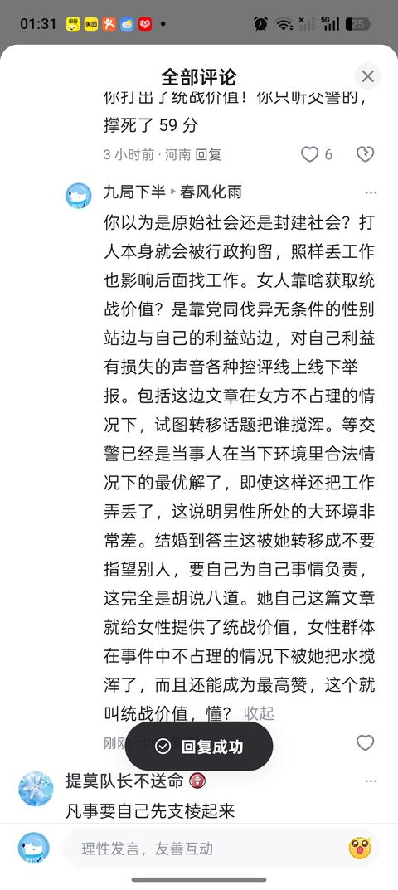
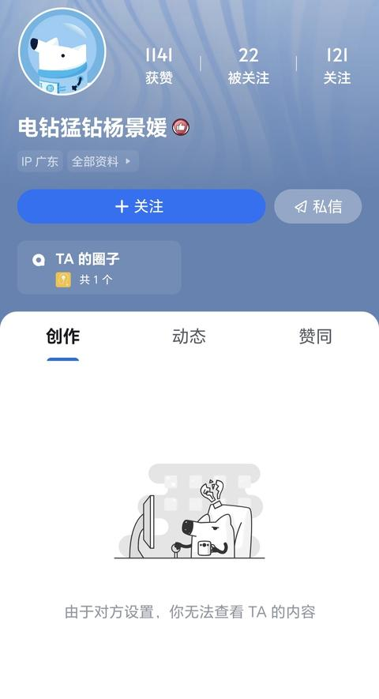
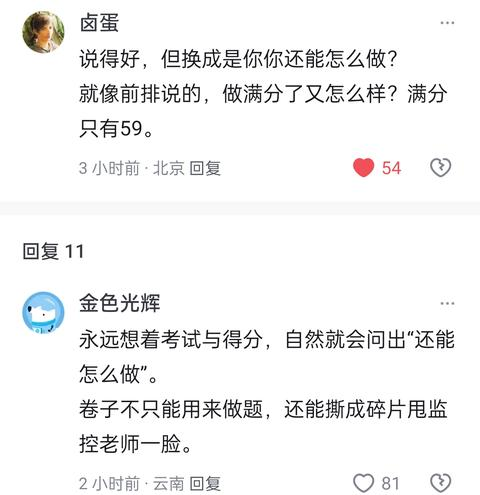
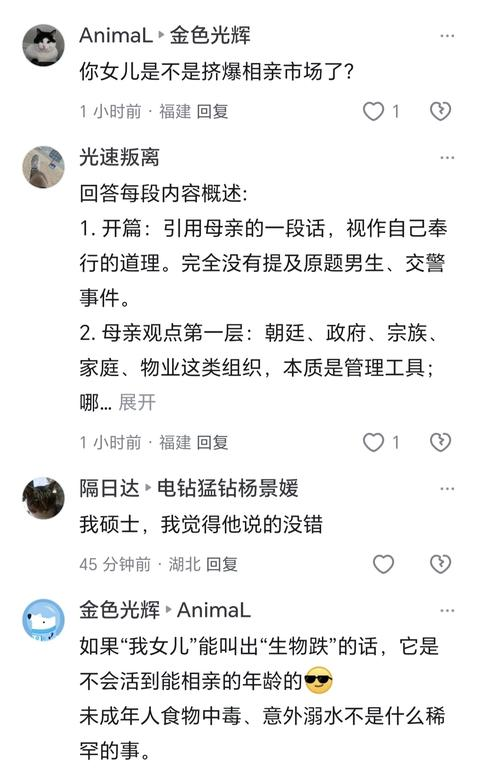
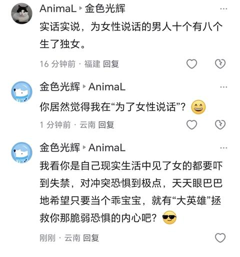
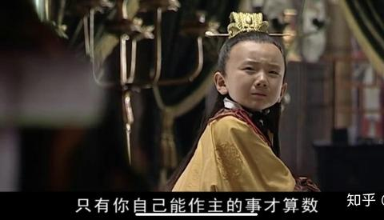

[toc]

# 问题

提问者：**<a href="https://www.zhihu.com/people/uw8kghs">知乎用户呜哇哇哇</a>**
提问时间: 2026-8-13 21:4:53
总回答数: 245
总访问量: 2565266

为什么那位说出“我听交警的”男生会被强制丢掉工作？

# 回答

回答者： **<a href="https://www.zhihu.com/people/80-81-89-71-91">娜可露露</a>**
回答时间: 2026-8-15 9:46:51
点赞总数: 6596
评论总数: 208
收藏总数: 4484
喜欢总数：396

我的母亲曾经跟我说过这样一句话我现在都奉为圭臬。

朝廷也好，政府也好，或者什么宗族，家族，物业等等。他们不是老百姓求财得财，求子得子的菩萨。其本质都是统治老百姓的工具。包括我和你爸，如果你把终身大事的选择权交给我们让我们选，我们只会看这个人的家室如何，对我们有没有帮助。你嫁过去对方又能给多少好处，至于你。反正要嫁过去的人是你，以后要和你老公睡在一起的人也是你，我们又不用和姑爷睡一个屋。

你跟他过的开不开心，两个人是否合得来，他会不会欺负你，这段婚姻是不是对你来说和吞针持矢一样难受，这不在我们的考虑范围之内。

小婕你要记住，自己的权益都不敢去争取别人只会把你当做代价弃子牺牲掉。你的事，你自己不上心，没道理别人替你上心，哪怕你是我的亲生女儿，你没这个态度，我也会糊弄你！我知道这对你很残酷，但你自己落水了都不愿意去拼命挣扎，那谁都帮不了你。

而我的父亲教过我，看一个人或者群体有没有被美化，很重要的一点就是，他的家族势力还在不在。只要他的家族势力还如日中天，任何的吹捧你都悠着点信。不能对基本的人性避而不见，过分美化和强调个人的道德和信仰。把自己的未来寄托于他人的仁慈和一系列美好的假设上。

  

原文地址：[(娜可露露)为什么那位说出“我听交警的”男生会被强制丢掉工作？](https://www.zhihu.com/question/2071341482632647835/answer/2071895625554194683) 

# 评论

1. **娜可露露** (<small title="福建">2026-8-15 18:56:25</small>): 统一回复一下，我的意思是就算是自己的亲生父母考虑你的婚事的时候第一个想到的也不是你的感受和想法而是自己的利益，更何况没有血缘关系和利益往来的其他人和政府部门人员。  
 
只是有的父母还会有一两分想着儿女。有的父母就只想着他自己了，父母尚且如此更何况当官的。  
 
不要把未来寄托在他人的仁慈和一系列美好的假设，那是对自己人生的不负责任和犯罪。
   - <a href="https://www.zhihu.com/people/du-yan-yan-yan">杜焱焱焱</a> (<small title="广东">2026-8-15 19:1:26</small>): 是的，但问题是在于，这位男生所做的应对，已经是大家想象中最好的应对方法。  
 
  
 
之前刚出这个事情时，大家都这样夸。  
 
  
 
只是没想到环境会恶劣到如此地步罢了。
   - **娜可露露** (<small title="回复于 2026-8-15 19:9:3/福建"> ✉️:杜焱焱焱</small>): 不过棋盘中最好的解法罢了，但现实中还有一招叫掀桌子砸场子。说到底所有的手段和计谋目的只有一个，打垮对方的意志让他服从你的意志。
   - <a href="https://www.zhihu.com/people/du-yan-yan-yan">杜焱焱焱</a> (<small title="回复于 2026-8-15 19:27:51/广东"> ✉️:娜可露露</small>): 是，但其实还是那句话，以前大众没有想到环境已经恶劣到如此地步
   - **娜可露露** (<small title="回复于 2026-8-15 19:46:25/福建"> ✉️:杜焱焱焱</small>): 是啊［捂脸］［捂脸］［捂脸］［捂脸］
   - <a href="https://www.zhihu.com/people/lu-bing-ren-92">王叔叔</a> (<small title="广西">2026-8-15 19:50:3</small>): 没事别乱用统一回复好吗
   - <a href="https://www.zhihu.com/people/73-37-98-70-83">小风冰凌</a> (<small title="山东">2026-8-15 20:41:36</small>): 娜娜你说得对，但是像你这么有智慧的不多，这不多的里面包括我一个，［滑稽］
   - <a href="https://www.zhihu.com/people/yi-tai-galaxy">针啊线的主任</a> (<small title="吉林">2026-8-15 22:43:32</small>): 所以我劝了很多人不要结婚，损失真的大于获得
   - <a href="https://www.zhihu.com/people/yun-shang-fei-yu-45">银河小卒</a> (<small title="回复于 2026-8-16 8:0:17/四川"> ✉️:娜可露露</small>): 你完美回答了：
 
[为什么家长为我们物色的相亲对象都这么丑？](https://www.zhihu.com/question/328997057)
   - <a href="https://www.zhihu.com/people/san-san-18-56">傘三</a> (<small title="安徽">2026-8-16 8:1:46</small>): 你父母就是年纪大的精致利己主义者。
   - <a href="https://www.zhihu.com/people/cang-hai-yi-su-10-79">沧海一粟</a> (<small title="河北">2026-8-16 10:17:42</small>): 你不用回复，我也理解你的意思。我也为人父母，我只想我儿女的婚姻幸福，他们幸福就是我最大的幸福！从来没有想过在儿女的婚姻中，考虑什么自己的利益，也理解不了父母要在儿女的婚姻中获取什么利益。
   - <a href="https://www.zhihu.com/people/ha-ha-ha-ha-24-57-64">哈哈哈哈</a> (<small title="回复于 2026-8-16 12:53:14/陕西"> ✉️:杜焱焱焱</small>): 确实，规则之内的最好解法。但是目前他都是这样的结果，后半辈子已经被毁了，然而凶手没有受到任何惩罚，那我觉得，下一次就该双输了［doge］［doge］
   - <a href="https://www.zhihu.com/people/tonghu26">大竹牙</a> (<small title="回复于 2026-8-16 14:7:37/浙江"> ✉️:杜焱焱焱</small>): 目前的公论是，这不是最优解。因为，按规矩办事，最好最好的结果，也就是平权，通过繁复的冗长的程序后，制度判定你无罪。至于这个过程里你所遭受的成本啊被网暴啊什么的，只能是你自己默默承认了。而坏人毫无成本。
 
  
 
目前的最优解，似乎是双输：当场暴起，暴打她一顿。然后等110来后判定为互殴，赔偿个1000块，到此结案，再也没有后续了。［发呆］
 
  
 
[怎样看17岁女生诬告江西财大男生并与之互殴？](https://www.zhihu.com/question/2072104485774794767/answer/2072233424585225098)
   - <a href="https://www.zhihu.com/people/tonghu26">大竹牙</a> (<small title="回复于 2026-8-16 14:9:3/浙江"> ✉️:王叔叔</small>): 哈哈哈，所以没事不要在别人评论区里随便留言，否则答主突然兴起统一回复，你就会被迫接受到了
   - <a href="https://www.zhihu.com/people/biao-di-hen-mang-49">表弟很忙</a> (<small title="安徽">2026-8-16 14:36:59</small>): 这段话以前好像看过
   - <a href="https://www.zhihu.com/people/huang-jia-er-shao-3">黄家二少</a> (<small title="回复于 2026-8-16 14:57:35/广东"> ✉️:沧海一粟</small>): 经济是国家的命脉，也是许多家庭的命脉。  
 
你个人不能代表群体。
   - <a href="https://www.zhihu.com/people/cang-hai-yi-su-10-79">沧海一粟</a> (<small title="回复于 2026-8-16 17:38:44/河北"> ✉️:黄家二少</small>): ？在子女婚姻获利的才是大多数？
   - <a href="https://www.zhihu.com/people/feng-juan-qi-yidi-chen-ai">更西风</a> (<small title="湖北">2026-8-16 19:42:9</small>): ［为难］请参考知乎生育话题高赞回答。  
 
人家生孩子就是为了另一种程度延续自己的生命，传承自己的思想，填补自己的空缺。  
 
我个人是偏向称为“夺舍”的。  
 
显而易见，有类人认为这种行为天经地义。  
 
世界、人那就是需要被改造的。  
 
那“我”为什么不能改造呢？  
 
“孩子”这种白纸就更好了。
   - <a href="https://www.zhihu.com/people/yi-shi-de-ai-63">陌归镜花缘</a> (<small title="回复于 2026-8-16 21:53:56/山西"> ✉️:沧海一粟</small>): 你还是没有完全理解答主的意思！你希望儿女们婚姻幸福，那婚姻幸福的标准是什么？这个标准就是你的利益！
   - <a href="https://www.zhihu.com/people/73-37-98-70-83">小风冰凌</a> (<small title="回复于 2026-8-16 21:57:36/山东"> ✉️:沧海一粟</small>): 说的太对了，老百姓还不想子女被孙小果祸害呢，孙小果想祸害就祸害，还听你老百姓的，只要你生孩子就有被孙小果祸害的可能
   - <a href="https://www.zhihu.com/people/pan-shu-wen-47">武林郡飞龙</a> (<small title="浙江">2026-8-16 22:48:29</small>): 然而并不是所有的父母都是这样的。换言之，这个是不正常的。
   - <a href="https://www.zhihu.com/people/huang-jia-er-shao-3">黄家二少</a> (<small title="回复于 2026-8-16 23:41:17/广东"> ✉️:沧海一粟</small>): 不是获利，是家庭抚养关系的反馈，保障。所以，国家没有政策取消彩礼，打击彩礼。因为女孩子出嫁，成立了新家庭，远离了原家庭。对父母老人的赡养关系关系，必然存在天然缺失，所以部分彩礼几乎等同于给父母的赡养关系保障。  
 
虽然现代交通发达，但是仍然不能解决女孩出嫁后时时刻刻回来尽到对父母的赡养关系义务，虽然法律关系有子女对父母赡养关系的要求。  
 
还有就是也有部分利用法律漏洞专门收彩礼骗婚的，国家也是少量打击，这就形成犯罪成本对于收益相对低，导致屡禁不止的骗婚。  
 
还有，也有很少部分家庭，不收彩礼，反而给女孩大量嫁妆，扶持新家庭的父母，但是这绝对是少部分的，因为经济分布，有钱人就是占少数的，类似你这种，但是你要看社会规则。
2. <a href="https://www.zhihu.com/people/oceanlin">OceanLin</a> (<small title="福建">2026-8-15 12:28:25</small>): 任何人答应你的事都不算数，只有你自己能做主的事才算数！
   - <a href="https://www.zhihu.com/people/que-yue-wu-tong-61">树新蜂</a> (<small title="上海">2026-8-15 14:44:29</small>): 这样说是不是太伤他了？
   - <a href="https://www.zhihu.com/people/qi-qia-58-22">契卡</a> (<small title="江苏">2026-8-15 14:47:50</small>): 普通人一辈子能做主的事 有多少呢［捂脸］
   - <a href="https://www.zhihu.com/people/zhi-yu-chu-jian-74">芷与初见</a> (<small title="回复于 2026-8-15 15:6:37/浙江"> ✉️:契卡</small>): 那可太多了，比如每隔几秒钟呼吸一次［机智］
   - <a href="https://www.zhihu.com/people/a-sen-na-lou">阿森纳楼</a> (<small title="上海">2026-8-15 15:20:41</small>): 我做主晚上奖励自己一次，结果被拉去通宵加班怎么算［飙泪笑］
   - <a href="https://www.zhihu.com/people/yuan-shao-89-65">远少</a> (<small title="福建">2026-8-15 18:50:2</small>): ［doge］我不懂这个女的，是什么让她或者她的家族觉得把一个男的的整到丢工作，整到社会性死亡是好事？是能让这个男的害怕了？该怕的人怎么都不应该是我吧［飙泪笑］［飙泪笑］［飙泪笑］
   - <a href="https://www.zhihu.com/people/oceanlin">OceanLin</a> (<small title="福建">2026-8-16 13:15:57</small>): 后台看到好多回复被系统删了［惊喜］
   - <a href="https://www.zhihu.com/people/shan-jun-87-39">月寒日暖</a> (<small title="湖南">2026-8-16 13:46:42</small>): 黄河水浊长江水清，不可偏废［生气］
   - <a href="https://www.zhihu.com/people/tonghu26">大竹牙</a> (<small title="回复于 2026-8-16 14:11:18/浙江"> ✉️:树新蜂</small>): sunny mud toe
   - <a href="https://www.zhihu.com/people/hu-bin-2-95-10">就爱钓鱼</a> (<small title="浙江">2026-8-16 14:25:45</small>): 然后继续练得身形似鹤形
   - <a href="https://www.zhihu.com/people/zhu-xian-zhen-er-hao">诛仙阵二号</a> (<small title="湖北">2026-8-16 15:29:50</small>): 这样说会不会太伤他了
   - <a href="https://www.zhihu.com/people/momo-57-74-28-34">momo</a> (<small title="广东">2026-8-16 17:55:17</small>): 三花聚顶本是幻，脚下腾元亦非真。
   - <a href="https://www.zhihu.com/people/zhe-yi-7-57">momo</a> (<small title="四川">2026-8-16 20:14:49</small>): 不愧是经典，我也联想到这句话
   - <a href="https://www.zhihu.com/people/o1qz1vxs">春竹君</a> (<small title="广东">2026-8-16 20:49:50</small>): 对的［捂脸］
   - <a href="https://www.zhihu.com/people/xing-zhi-35-67">行之</a> (<small title="浙江">2026-8-16 22:31:28</small>): 道长，是你吗？［蹲］
3. <a href="https://www.zhihu.com/people/thisyear">this year</a> (<small title="上海">2026-8-15 12:7:16</small>): 这就是真正的“公民教育”。
   - <a href="https://www.zhihu.com/people/joy-55-39-77">卡皮布拉</a> (<small title="四川">2026-8-15 14:0:41</small>): 乖，听咱妈的，别多想
   - <a href="https://www.zhihu.com/people/animal-58-43">AnimaL</a> (<small title="福建">2026-8-15 14:32:3</small>): 回答每段内容概述:  
 
1. 开篇：引用母亲的一段话，视作自己奉行的道理。完全没有提及原题男生、交警事件。  
 
2. 母亲观点第一层：朝廷、政府、宗族、家庭、物业这类组织，本质是管理工具；哪怕亲生父母安排子女婚恋，优先考量也是利益、好处，并不优先顾及女儿本人幸福感受。  
 
3. 母亲观点第二层：子女婚姻过得好不好、会不会受欺负，不在长辈利益权衡的考虑范围内。  
 
4. 母亲观点第三层：人必须主动争取自身权益；自己不上心自己的事，哪怕至亲也不会为你负责，落水不挣扎别人救不了你。  
 
5. 转述父亲的观点：评判人或群体，要看现实家族势力，不要轻信吹捧；不要过度美化道德信仰，不要把命运寄托在别人的仁慈之上。  
 
  
 
全文事实  
 
整篇回答自始至终，完全没有讨论题干事件：没有讲那个男生，没有讲“我听交警的”梗，也没有解释丢工作的前因后果。  
 
  
 
定性：属于严重跑题、转移话题
   - <a href="https://www.zhihu.com/people/tonghu26">大竹牙</a> (<small title="回复于 2026-8-16 14:12:0/浙江"> ✉️:AnimaL</small>): 反应了作者强烈的思乡之情 ［发呆］
   - <a href="https://www.zhihu.com/people/18166143133">看山客</a> (<small title="浙江">2026-8-16 15:41:59</small>): 最后两段，真的受教了
4. <a href="https://www.zhihu.com/people/a-wan-ge-61">撼风</a> (<small title="湖南">2026-8-15 9:54:17</small>): 你母亲是有大智慧的人［赞］
   - <a href="https://www.zhihu.com/people/animal-58-43">AnimaL</a> (<small title="福建">2026-8-15 14:56:5</small>): 确实有智慧，谁还记得这是一个讨论男性受害的话题。
   - <a href="https://www.zhihu.com/people/9-45-25-31">傻乎乎</a> (<small title="回复于 2026-8-15 18:47:51/日本"> ✉️:AnimaL</small>): 男性不能等着大跌的慈爱，那是婴孩，与性别无关
   - <a href="https://www.zhihu.com/people/wang-guo-yu-65-64">子羽</a> (<small title="内蒙古">2026-8-16 1:39:14</small>): 同意，我最近才弄清楚世界本质是需求的交换，答主母亲已经点破
   - <a href="https://www.zhihu.com/people/animal-58-43">AnimaL</a> (<small title="回复于 2026-8-16 2:43:52/福建"> ✉️:傻乎乎</small>): 这是慈爱的问题吗？这是千方百计撒谎的问题。
   - <a href="https://www.zhihu.com/people/cun-zai-35-6">存在</a> (<small title="回复于 2026-8-16 8:21:5/河南"> ✉️:AnimaL</small>): 只要受害者是男性，就有人在下面转移话题［捂嘴］
   - <a href="https://www.zhihu.com/people/36-65-75-5-48">楚羽凰</a> (<small title="回复于 2026-8-16 17:17:43/辽宁"> ✉️:子羽</small>): 一切问题都是经济学问题。  
 
所有人的所有行为，其实都是想买点或卖点什么。。。
   - <a href="https://www.zhihu.com/people/pan-shu-wen-47">武林郡飞龙</a> (<small title="浙江">2026-8-16 22:49:18</small>): 有什么大智慧？教会题主尔虞我诈？
   - <a href="https://www.zhihu.com/people/wang-guo-yu-65-64">子羽</a> (<small title="回复于 2026-8-17 2:41:39/内蒙古"> ✉️:楚羽凰</small>): 不全面吧，父母对于子女抚养，不涉及利益，但也有情感的需求，但本质上，任何事都是这件事到底能带给我什么罢了，所以世间的事就是需求的交换
5. <a href="https://www.zhihu.com/people/piao-ling-shu-jian">九局下半</a> (<small title="北京">2026-8-16 11:58:45</small>): 这个帖子是个完全偏题的回答，当下的环境他能做到的最优解就是59分，而不是他没有争取自己的利益导致了这个结果，而且在当下的环境里普通男性争取自己的利益是难如登天的，你甚至连这个机会都没有［大笑］，这个回答是规避现实环境又试图规避女性之恶，同时又彰显女性之恶。
   - <a href="https://www.zhihu.com/people/chun-feng-hua-yu-6">春风化雨</a> (<small title="河南">2026-8-16 22:26:56</small>): 你若挥拳了，你保底是 60 分。因为你打出了统战价值！你只听交警的，撑死了 59 分
   - <a href="https://www.zhihu.com/people/piao-ling-shu-jian">九局下半</a> (<small title="回复于 2026-8-17 1:32:10/北京"> ✉️:春风化雨</small>): 就是不给发，那就截图
6. <a href="https://www.zhihu.com/people/timoduizhang">提莫队长不送命</a> (<small title="广东">2026-8-15 9:59:5</small>): 凡事要自己先支棱起来
7. <a href="https://www.zhihu.com/people/xue-yi-zhe-34">萧饮泽</a> (<small title="广西">2026-8-15 12:33:38</small>): 你母亲这句话说的挺长
8. <a href="https://www.zhihu.com/people/73-37-98-70-83">小风冰凌</a> (<small title="山东">2026-8-15 11:26:47</small>): 小婕我丈母娘说的对，咱俩要一起好好孝敬她老人家
   - <a href="https://www.zhihu.com/people/shuo-sha-hao-ni-98">说啥好呢</a> (<small title="河北">2026-8-15 13:48:10</small>): 她有老公了［doge］
   - <a href="https://www.zhihu.com/people/tou-zi-xue-yuan-li">铃海枫</a> (<small title="回复于 2026-8-15 14:8:11/江西"> ✉️:说啥好呢</small>): 不可以有两个老公吗？
   - <a href="https://www.zhihu.com/people/animal-58-43">AnimaL</a> (<small title="回复于 2026-8-15 14:16:34/福建"> ✉️:说啥好呢</small>): 那咋了，三孩非亲生又能怎样［吃瓜］
9. <a href="https://www.zhihu.com/people/ka-ka-49-56-31">咔咔</a> (<small title="陕西">2026-8-15 12:44:16</small>): 你妈把你货物换彩礼，不代表所有的母亲都是这样，现在绝大部分父母还是会看女婿对女儿的态度
   - <a href="https://www.zhihu.com/people/ni-bu-zai-wo-ye-bu-zai">一一二二</a> (<small title="河南">2026-8-15 12:53:29</small>): 你的思路太狭隘了。人自己的两只眼睛看东西角度都有区别，更何况两个独立个体的想法。
   - <a href="https://www.zhihu.com/people/zhong-xia-zhi-ye-75-87">仲夏之夜</a> (<small title="四川">2026-8-15 12:58:37</small>): 这是控制变量的假想实验而已，假设其余因素都不存在，只考虑当下收益最大化的博弈。实际上我们抽象化思考，综合变量后，也就是你说的情况了：父母会同时考虑金钱利益、人际圈下的道德约束、世俗评价、亲子关系以及家族传承等，兼顾长短期利益（金钱只是利益的一种，这里我们可以把利益升化为自我满足）［感谢］
   - <a href="https://www.zhihu.com/people/89-13-28-42">知足常乐</a> (<small title="黑龙江">2026-8-15 13:6:53</small>): 不可控的东西就是不可信任的，我又不能撬开一个人的脑袋看TA在想什么，TA的想法本身就不可信任
   - <a href="https://www.zhihu.com/people/wei-yuan-ci-sheng-chang-an">孤月难眠</a> (<small title="山西">2026-8-16 17:15:43</small>): 这个东西你站在旁观者，聚光灯下的角度很难看得清，父母的角度下自然能看到自己想看的，因为女婿的角度下他会拼命表现出来自身优秀的一面。终归还是关上门回到家里你自己去看这个人，去相处了解。
   - <a href="https://www.zhihu.com/people/han-han-ni-zai-ma">涵涵你在吗</a> (<small title="北京">2026-8-16 17:55:17</small>): 要彩礼吗
   - <a href="https://www.zhihu.com/people/chun-feng-hua-yu-6">春风化雨</a> (<small title="河南">2026-8-16 22:27:57</small>): 公婆也看女人全家的态度。但现在绝大多数女人全家的态度都不行［飙泪笑］
10. <a href="https://www.zhihu.com/people/fen-dou-rong-guang">金色光辉</a> (<small title="云南">2026-8-15 13:1:41</small>): 我觉得论“人才”，还是您厉害［酷］
    - <a href="https://www.zhihu.com/people/animal-58-43">AnimaL</a> (<small title="福建">2026-8-15 14:15:16</small>): 
    - <a href="https://www.zhihu.com/people/fen-dou-rong-guang">金色光辉</a> (<small title="回复于 2026-8-15 15:38:51/云南"> ✉️:AnimaL</small>): 你可以学祥林嫂，一辈子抱怨出题人多么不公，自己有多么不幸［酷］
    - <a href="https://www.zhihu.com/people/animal-58-43">AnimaL</a> (<small title="回复于 2026-8-15 16:3:53/福建"> ✉️:金色光辉</small>): 具体说说
    - <a href="https://www.zhihu.com/people/fen-dou-rong-guang">金色光辉</a> (<small title="回复于 2026-8-15 16:11:14/云南"> ✉️:AnimaL</small>): 翻译翻译，什么叫“你女儿”？
    - <a href="https://www.zhihu.com/people/animal-58-43">AnimaL</a> (<small title="回复于 2026-8-16 2:50:28/福建"> ✉️:金色光辉</small>): 实话实说，为女性说话的男人十个有八个生了独女。
    - <a href="https://www.zhihu.com/people/fen-dou-rong-guang">金色光辉</a> (<small title="回复于 2026-8-16 3:5:47/云南"> ✉️:AnimaL</small>): 你居然觉得我在“为了女性说话”？［大笑］
    - <a href="https://www.zhihu.com/people/fen-dou-rong-guang">金色光辉</a> (<small title="回复于 2026-8-16 3:9:19/云南"> ✉️:AnimaL</small>): 免得再看不见.重复一遍
    - <a href="https://www.zhihu.com/people/animal-58-43">AnimaL</a> (<small title="回复于 2026-8-16 3:19:2/福建"> ✉️:金色光辉</small>): ok，那我们观点一致
    - <a href="https://www.zhihu.com/people/o1qz1vxs">春竹君</a> (<small title="广东">2026-8-16 20:50:15</small>): 哈哈
11. <a href="https://www.zhihu.com/people/jie-you-5-38">解忧</a> (<small title="湖北">2026-8-15 15:0:6</small>): 跑题了？
12. <a href="https://www.zhihu.com/people/b4kl">百事可乐</a> (<small title="北京">2026-8-15 13:28:56</small>): 很开心以这样的方式认识你，小婕你好
13. **娜可露露** (<small title="福建">2026-8-16 20:27:13</small>): 别人就算想帮你，你也要做点什么表示自己出事了愿意担责表示自己共进退的决心吧［捂脸］［捂脸］［捂脸］［捂脸］
    - <a href="https://www.zhihu.com/people/song-ban-sha-tang-72">松坂砂糖</a> (<small title="陕西">2026-8-17 9:32:28</small>): 驴头不对马嘴，怎么跑到回复我的里面来的？
14. <a href="https://www.zhihu.com/people/63-93-20-50-40">超影2601</a> (<small title="河南">2026-8-15 15:0:31</small>): 何意味
15. <a href="https://www.zhihu.com/people/dong-xi-nan-bei-70-17">沧澜</a> (<small title="广东">2026-8-15 14:25:11</small>): 当你的选择不符合他们的利益，那你的选择也没有任何意义！你的拼命挣扎也没能有好结果！
    - <a href="https://www.zhihu.com/people/xiao-ju-hua-66-1">阿司匹林</a> (<small title="江苏">2026-8-15 14:32:4</small>): 挣扎怎么没用，双输好过独赢，吃不着饭就掀桌子，没有好处就翻脸，懂不？
16. <a href="https://www.zhihu.com/people/yuan-fen-31-75-27">缘分</a> (<small title="甘肃">2026-8-16 22:9:19</small>): 就是，自己的利益都不去争取，别人凭什么要维护你的利益。
17. <a href="https://www.zhihu.com/people/jiu-tong-ninetonefen-si">九筒ninetone粉丝</a> (<small title="福建">2026-8-15 12:55:46</small>): 请问可以转载吗［小情绪］
18. <a href="https://www.zhihu.com/people/mai-la-jiao-ye-yong-juan-36">饭闲</a> (<small title="浙江">2026-8-16 13:6:42</small>): 话说这内容好像去年就看过，这是你写的吗？
19. <a href="https://www.zhihu.com/people/xin-xin-de-xin-nian">浩瀚如烟</a> (<small title="辽宁">2026-8-15 14:1:14</small>): 母亲是鲁迅？
    - <a href="https://www.zhihu.com/people/63-17-24-57">关关难过</a> (<small title="陕西">2026-8-15 14:7:6</small>): 挖迅
20. <a href="https://www.zhihu.com/people/hy-ww-92">hy ww</a> (<small title="贵州">2026-8-15 13:59:31</small>): 自己的权利必须自己掌握，除了自己，任何别人都无法保障你的利益
21. <a href="https://www.zhihu.com/people/16-57-95-46-64">反弹</a> (<small title="广东">2026-8-15 14:46:16</small>): 那人的操作堪称是现行制度下的完美应对
22. <a href="https://www.zhihu.com/people/yuan-13-12-52">Yuan</a> (<small title="河南">2026-8-15 15:22:20</small>): 社会、政府没有阻止你利己，利己也不违法也不可耻，但一般来说是不要损人的，但对损人的惩罚还是比较滞后的
23. <a href="https://www.zhihu.com/people/wen-long-19-47">aeiouuoieaaeiou</a> (<small title="江苏">2026-8-15 15:22:57</small>): 好父母啊。这是真爱子女的。 垃圾父母，整天把 爱子女 挂在嘴上，实际上人事不干。光是把垃圾父母的事用语言组织一遍，就足以让人元气散尽。
24. <a href="https://www.zhihu.com/people/charles-70-22-50">Charles</a> (<small title="湖北">2026-8-17 2:33:5</small>): 这和问题有什么关系？这个男生不自救吗？这个问题的核心是，他已经尽力了，但还是损失惨重
25. <a href="https://www.zhihu.com/people/chen-yuan-jie-16">陈元杰</a> (<small title="河南">2026-8-15 13:5:56</small>): 听着很有道理，但是忽略一点，男生追女生时候是会伪装的，甚至可以根据你的喜好进行伪装，到手之后谁管你了。而家长筛选的至少家庭背景先过去，后续人你自己进行选择，反而风险是比较小的。
    - <a href="https://www.zhihu.com/people/ji-ni-911">基尼911</a> (<small title="河南">2026-8-15 13:25:55</small>): 女生就不会伪装了？［惊喜］
    - <a href="https://www.zhihu.com/people/jun-21-28">Jun</a> (<small title="回复于 2026-8-15 13:38:11/湖北"> ✉️:基尼911</small>): 那能一样吗
    - <a href="https://www.zhihu.com/people/3665-59">3665</a> (<small title="回复于 2026-8-15 13:58:5/江西"> ✉️:基尼911</small>): 你想违背女性意愿［生气］
    - <a href="https://www.zhihu.com/people/animal-58-43">AnimaL</a> (<small title="福建">2026-8-15 14:4:53</small>): 让你开放外娶一别两宽，你怎么不要了？说白了真有得选，男的也不选你们。
    - <a href="https://www.zhihu.com/people/lu-zhi-jue-33">略略略</a> (<small title="广东">2026-8-16 19:9:41</small>): ？问题不是谈的受害者吗？你转移话题骂男人干什么？
26. <a href="https://www.zhihu.com/people/guang-su-pan-chi">光速叛离</a> (<small title="福建">2026-8-15 14:29:40</small>): 提问原题：为什么那位说出“我听交警的”男生会被强制丢掉工作？  
 
  
 
回答每段内容概述  
 
  
 
1. 开篇：引用母亲的一段话，视作自己奉行的道理。完全没有提及原题男生、交警事件。  
 
​  
 
2. 母亲观点第一层：朝廷、政府、宗族、家庭、物业这类组织，本质是管理工具；哪怕亲生父母安排子女婚恋，优先考量也是利益、好处，并不优先顾及女儿本人幸福感受。  
 
​  
 
3. 母亲观点第二层：子女婚姻过得好不好、会不会受欺负，不在长辈利益权衡的考虑范围内。  
 
​  
 
4. 母亲观点第三层：人必须主动争取自身权益；自己不上心自己的事，哪怕至亲也不会为你负责，落水不挣扎别人救不了你。  
 
​  
 
5. 转述父亲的观点：评判人或群体，要看现实家族势力，不要轻信吹捧；不要过度美化道德信仰，不要把命运寄托在别人的仁慈之上。  
 
  
 
全文事实  
 
  
 
整篇回答自始至终，完全没有讨论题干事件：没有讲那个男生，没有讲“我听交警的”梗，也没有解释丢工作的前因后果。  
 
  
 
定性：属于严重跑题、转移话题
    - <a href="https://www.zhihu.com/people/9-26-91-73">看起来有点尴尬</a> (<small title="重庆">2026-8-15 14:43:26</small>): 回答高水平，但是没有分
    - <a href="https://www.zhihu.com/people/ming-zi-wei-xiang-hao-68">名字未想好</a> (<small title="江苏">2026-8-15 22:18:43</small>): 所以那个男生到底该怎么办，说这么多道理最后还是要能解决问题啊［捂脸］
    - <a href="https://www.zhihu.com/people/gaga-70-31-9">gaga</a> (<small title="浙江">2026-8-16 15:35:21</small>): 这篇抄袭的，很早以前就看到过了。
    - <a href="https://www.zhihu.com/people/yu-lan-zhong-jing-mu">与兰重镜墓</a> (<small title="浙江">2026-8-16 20:37:34</small>): 现在知乎都是一样，随便一个问题 下面大家就开始讲自己的故事，直接回答问题的是少数
27. <a href="https://www.zhihu.com/people/ni-ming-69-65">纠结的米其林</a> (<small title="上海">2026-8-15 13:32:25</small>): 真的是高认知家庭
28. <a href="https://www.zhihu.com/people/wei-fang-ai-zhong-xuan-lang-yin">刘独邈</a> (<small title="山西">2026-8-15 14:15:50</small>): 你们的母亲教育人的话居然都能一模一样
29. <a href="https://www.zhihu.com/people/dou-bi-nan-bo-wan-20-26">逗比南波万</a> (<small title="湖北">2026-8-15 12:19:59</small>): 虽然但是，落水了不要挣扎，约挣扎约沉，要冷静下来，身体放松，自然就会浮起来
    - <a href="https://www.zhihu.com/people/yan-yu-ta-ge-xing-21">零息细微</a> (<small title="河南">2026-8-15 12:32:0</small>): 虽然但是，这个是被人推下水了。所以应该拉着推自己下水的人，让ta也下水。
30. <a href="https://www.zhihu.com/people/a-xin-men-zhu">阿信门主</a> (<small title="福建">2026-8-15 15:21:23</small>): 智慧
31. <a href="https://www.zhihu.com/people/er-shi-ba-84-30">三十</a> (<small title="广东">2026-8-16 15:27:39</small>): 前几年刚懂的道理，钱在你手里，是你的，不在你手里，即便是借出去的，也不是你的。
32. <a href="https://www.zhihu.com/people/123456-23-89-19">123456</a> (<small title="广东">2026-8-16 15:25:1</small>): 啊？你们看完了？我看到她母亲说她根本不看女婿对女儿好不好，我就不看了。如此自私都母亲就是教她自私，其实两个字就解决问题，不用打那么多字。
33. <a href="https://www.zhihu.com/people/cang-hai-yi-su-10-79">沧海一粟</a> (<small title="河北">2026-8-15 14:38:57</small>): 还有这样的父母？
34. <a href="https://www.zhihu.com/people/liang-kuai-qian-mai-bu-liao-chi-yu">剑炉</a> (<small title="浙江">2026-8-17 9:2:5</small>): 你爹妈这是看过《大明王朝1566》 
35. <a href="https://www.zhihu.com/people/luo-li-qun-48">屁股君君</a> (<small title="广东">2026-8-16 23:14:9</small>): 小婕你记住，你别管什么，你就记住。
36. <a href="https://www.zhihu.com/people/42-10-18-72-98">宇宇</a> (<small title="辽宁">2026-8-15 17:19:36</small>): 好的小婕［酷］
37. <a href="https://www.zhihu.com/people/aaaa-97-13-68">aaaa</a> (<small title="上海">2026-8-16 22:42:20</small>): 我会考虑子女的感受 因为如果他们过的不开心 我也不会开心 搞不好还要收拾烂摊子
38. <a href="https://www.zhihu.com/people/36-85-84-97-34">宋树强</a> (<small title="湖北">2026-8-17 9:9:44</small>): 不认同 有好多真心希望孩子嫁（娶）得好的父母 希望孩子找到爱情 同时有好的婚姻的父母
39. <a href="https://www.zhihu.com/people/da-xiang-jiao-95-26">冯诺依曼人</a> (<small title="辽宁">2026-8-16 20:33:55</small>): 天救自救之人［思考］
40. <a href="https://www.zhihu.com/people/bao-tu-2borne">宝图2borne</a> (<small title="湖南">2026-8-16 20:16:52</small>): 我三十多岁了，依然没有学会怎么为自己争，这个可能和性格相关，但我认为父母也是要教的。
41. <a href="https://www.zhihu.com/people/song-ban-sha-tang-72">松坂砂糖</a> (<small title="陕西">2026-8-16 19:14:28</small>): 劣币驱逐良币罢了
42. <a href="https://www.zhihu.com/people/he-ming-yang-53">心是孤独的猎手</a> (<small title="四川">2026-8-15 14:1:23</small>): 能说出这些的父母是真见过世面，很多事情会给你事前提醒，不会强行控制子女的行为，这样家庭下的女孩子，男性闭眼娶就完事了
    - <a href="https://www.zhihu.com/people/animal-58-43">AnimaL</a> (<small title="福建">2026-8-15 14:6:18</small>): 没事cue男的干什么？
    - <a href="https://www.zhihu.com/people/guang-su-pan-chi">光速叛离</a> (<small title="回复于 2026-8-15 14:19:8/福建"> ✉️:AnimaL</small>): 挤爆相亲市场了呗。
43. <a href="https://www.zhihu.com/people/xiao-wang-xian-sheng-30">我爱数码啊</a> (<small title="河南">2026-8-17 7:50:19</small>): 我不知道现在，我那时候高考结束都是吃一个散伙饭拉到，旅行啥的都是自己去或者和几个关系好的去，全班一起去的真没见过
44. <a href="https://www.zhihu.com/people/cao-li-yuan-60">精气神</a> (<small title="黑龙江">2026-8-15 15:10:38</small>): 牛逼的父母
45. <a href="https://www.zhihu.com/people/rui-yun-yier-xing">momo</a> (<small title="广东">2026-8-17 9:26:44</small>): ［飙泪笑］令尊最后一段是不是在说客仔客家帮？
46. <a href="https://www.zhihu.com/people/dang-xin-65-75">当心</a> (<small title="江苏">2026-8-16 20:26:6</small>): 很酷,很棒
47. <a href="https://www.zhihu.com/people/chong-bai-xin-xue">月是故乡明</a> (<small title="湖北">2026-8-16 21:54:45</small>): 受教了［抱抱］
48. <a href="https://www.zhihu.com/people/22-69-40-36">俊采星驰</a> (<small title="广东">2026-8-17 1:15:36</small>): 虽然吧，你说的也没有错，但跟问题有什么关系？
49. <a href="https://www.zhihu.com/people/ub20ol">司寇杏5x</a> (<small title="安徽">2026-8-16 21:38:31</small>): 这才是家传真学。不是学校教的伪学。
50. <a href="https://www.zhihu.com/people/f8f8">五猫头</a> (<small title="福建">2026-8-16 20:7:2</small>): 跟这题目有啥关系？
    - **娜可露露** (<small title="福建">2026-8-16 20:27:52</small>): 别人就算想帮你，你也要做点什么表示自己共进退的决心吧［捂脸］［捂脸］［捂脸］［捂脸］
51. <a href="https://www.zhihu.com/people/wo-xiang-cheng-wei-ta-de-lao-po">阿荷里荷</a> (<small title="广东">2026-8-16 18:29:14</small>): 精致利己主义
52. <a href="https://www.zhihu.com/people/56-4-52-49">冰封世界</a> (<small title="江苏">2026-8-16 14:52:34</small>): 你不关心政治，政治就来关心你
53. <a href="https://www.zhihu.com/people/tian-shen-kai-sheng">直男旅长</a> (<small title="河北">2026-8-17 7:47:26</small>): 就是中国历史上为什么会重男轻女的原因，女性父母基本上嫁闺女时，考虑的都是能换来多少的彩礼，反过来很少有男性家长会这么考虑的！这位母亲说的话算不上什么至理名言，她只不过把很多女儿家庭，父母心里不敢说的话说出来了而已
54. <a href="https://www.zhihu.com/people/luo-hua-wu-yan-84-73">落花风前舞</a> (<small title="广东">2026-8-15 13:51:21</small>): 小婕啊，你妈懂这么通透，应该是高官吧？
    - <a href="https://www.zhihu.com/people/chen-peng-yang-44">孤独行者</a> (<small title="安徽">2026-8-15 22:35:5</small>): 大概率做生意的，体制内要脸，不会这么教的［捂脸］
55. <a href="https://www.zhihu.com/people/yang-yang-77-29-53">杨洋</a> (<small title="重庆">2026-8-16 15:25:50</small>): 对表象的世界祛魅  
 
对自我的前景把控
56. <a href="https://www.zhihu.com/people/yi-ge-90-46-21">染红霞</a> (<small title="浙江">2026-8-16 17:44:57</small>): 每个人都只会考虑自己的好处
57. <a href="https://www.zhihu.com/people/tom-3-76-15">TOM</a> (<small title="广东">2026-8-16 15:38:32</small>): 我之前看过一个回答，这个不就是遇到校霸欺负人的时候，一直说着我要告诉老师的情况什么区别吗？
58. <a href="https://www.zhihu.com/people/hu-wei-lin-74">兵临城下</a> (<small title="广东">2026-8-16 21:24:22</small>): 对的，如果你自己都不在乎自己的利益，那就没人在乎你的利益，任何权利和利益都是靠自己去争取的，而不是奢望别人无偿给你，这也是华人和印度人在海外处境非常明显的对比
59. <a href="https://www.zhihu.com/people/guo-yong-chang-46">梦终人不醒</a> (<small title="山东">2026-8-16 17:34:0</small>): 小婕，我支持你的观点
60. <a href="https://www.zhihu.com/people/lunsu">伦苏</a> (<small title="浙江">2026-8-16 16:46:1</small>): 如果每个人都这么想，那么又会回到明末那种，谁也不信任，双输好过赢的局面了［思考］
    - <a href="https://www.zhihu.com/people/tang-xian-sheng-93-35">唐先生995</a> (<small title="广东">2026-8-17 9:21:41</small>): 你风险就好
61. <a href="https://www.zhihu.com/people/leng-ruo-10">冷爇</a> (<small title="湖北">2026-8-15 15:51:57</small>): 就是这样，最爱自己的人永远是自己。如果自己不争取权益，那么别人就更不会在意。
62. <a href="https://www.zhihu.com/people/--54-42-4-85">分寸zhi</a> (<small title="江苏">2026-8-17 0:9:36</small>): 我不知道现在，我那时候高考结束都是吃一个散伙饭拉到，旅行啥的都是自己去或者和几个关系好的去，全班一起去的真没见过
63. <a href="https://www.zhihu.com/people/chris-16-50-57">waiting</a> (<small title="江苏">2026-8-16 17:54:39</small>): 你和你父母的觉悟值得这么多点赞
64. <a href="https://www.zhihu.com/people/kdxjlm">kdxj</a> (<small title="福建">2026-8-16 17:54:16</small>): 坦白从宽下一句是什么
    - <a href="https://www.zhihu.com/people/aaron-z-84">Aaron Z</a> (<small title="广东">2026-8-16 19:15:5</small>): 牢底坐穿。
65. <a href="https://www.zhihu.com/people/21-66-72-41">学习使我快乐</a> (<small title="广东">2026-8-16 21:35:42</small>): 与城北徐公孰美？
66. <a href="https://www.zhihu.com/people/ifiknow">IfIknow</a> (<small title="广西">2026-8-16 19:15:41</small>): 说的挺好，但是和题目好像没啥关系
    - **娜可露露** (<small title="福建">2026-8-16 19:33:40</small>): 我总不能说一些不利于团结的话吧，只能什么都说了又什么都没说。
67. <a href="https://www.zhihu.com/people/giraffe233">长颈鹿不赶路</a> (<small title="云南">2026-8-15 20:52:4</small>): 父母生孩子或者不生孩子，本质上都是为了自己好。子女成年以后也要把对自己好放在心里，先爱自己再爱别人。
68. <a href="https://www.zhihu.com/people/n11001">卢瑟夫</a> (<small title="山东">2026-8-16 13:20:20</small>): 是这样的，任何时候我们都不能放弃维护自己的合法权利。  
 
不过也不能因此而认为自己的权利只能靠自己维护，没有能力维护自己的权利就活该被别人践踏。  
 
不要忘了，替我们维护我们的合法权利是国家应尽的义务。  
 
我们在努力维护自己的合法权利的同时，也不能忘了要努力要求国家帮我们维护我们的合法权利。
69. <a href="https://www.zhihu.com/people/xzs3sal">momo</a> (<small title="广东">2026-8-16 17:47:59</small>): 啥？
70. <a href="https://www.zhihu.com/people/mi-zhi-wei-xiao-45-20">蜜汁微笑</a> (<small title="湖南">2026-8-15 13:47:57</small>): 别人答应你的都不算，只有自己能做主的才算
71. <a href="https://www.zhihu.com/people/bu-yao-shuo-hua-73-32">抬头走路</a> (<small title="广东">2026-8-16 15:22:20</small>): 自己的利益自己争取，有用。
72. <a href="https://www.zhihu.com/people/4-57-28-73">小亮</a> (<small title="上海">2026-8-16 15:14:55</small>): 对方的家族势力强不是好事嘛？
73. <a href="https://www.zhihu.com/people/run-wei-62">run wei</a> (<small title="广东">2026-8-16 20:7:46</small>): 小婕啊，写的很好
74. <a href="https://www.zhihu.com/people/39-33-82-11">爽爽人</a> (<small title="福建">2026-8-15 16:41:33</small>): 这就是家风优良，羡慕了
75. <a href="https://www.zhihu.com/people/wo-lao-shuai-liao-54">我老帅了</a> (<small title="陕西">2026-8-16 18:7:41</small>): 这是对的，我朋友也叫xx婕，哈哈
76. <a href="https://www.zhihu.com/people/ls-he-ming-sl">ls鹤鸣sl</a> (<small title="河北">2026-8-15 18:26:35</small>): 见到家学了［拜托］
77. <a href="https://www.zhihu.com/people/lariaay">lariaay</a> (<small title="广东">2026-8-16 17:7:33</small>): 我现在对我妈有防备心［思考］  
 
因为我没别的办法保证我能保住就几天前收复或者说这辈子第一次夺取到的 一点点的心理和精神上的自由和主体性  
 
之前从出生开始经历了什么不说了  
 
另外我是男的
78. <a href="https://www.zhihu.com/people/lai-yin-he-pan-de-tan-xi">Ginnnnn</a> (<small title="广东">2026-8-16 9:6:39</small>): 说得很对。所以男孩子被逼婚了，要多想想是不是父母为了自身利益来控制你，他们是不是把你放在第一位。当女朋友提彩礼的时候，也多想想这个问题。
79. <a href="https://www.zhihu.com/people/lu-ying-chao">重生</a> (<small title="北京">2026-8-15 15:7:57</small>): 实实在在，实事求是。离那些骗子远一点。
80. <a href="https://www.zhihu.com/people/coder_you">月未圆</a> (<small title="福建">2026-8-16 9:10:56</small>): 好羡慕你有这么清醒的父母
81. <a href="https://www.zhihu.com/people/chen-jun-59-46">陈俊</a> (<small title="广东">2026-8-15 15:50:52</small>): 搞不好男方被女方欺负，被女方送进监狱，你妈妈对你说的话也只是适应于你
82. <a href="https://www.zhihu.com/people/jiang-han-55">蒋涵</a> (<small title="北京">2026-8-15 14:53:40</small>): 不，我要相信咱妈
83. <a href="https://www.zhihu.com/people/27-35-38-27">能够发挥</a> (<small title="福建">2026-8-15 14:6:37</small>): 简单的换位思考。很多人没有
84. <a href="https://www.zhihu.com/people/bai-yan-yimo">顶级乐子人</a> (<small title="浙江">2026-8-15 15:53:59</small>): 这不都是高中政治书的内容吗？你没好好学？还得听长辈说？
85. <a href="https://www.zhihu.com/people/whubqr">知乎用户WHuBqR</a> (<small title="河北">2026-8-15 12:55:9</small>): 打王者不
86. <a href="https://www.zhihu.com/people/neng-tian-shi-9">能天使</a> (<small title="四川">2026-8-15 18:51:47</small>): 很多父母不仅不会给孩子传授这样的思想财富，反而还会制造大量思想枷锁阻碍孩子觉悟
87. <a href="https://www.zhihu.com/people/wu-yin-liang-ren-67">恭喜你被选中啦</a> (<small title="江苏">2026-8-17 7:52:28</small>): 此认知，吊锤同龄中国人一条街，还讲给你，坦诚度吊锤同龄中国人十条街
88. <a href="https://www.zhihu.com/people/zhifdfmaxt">zhiFdFmaXt</a> (<small title="山东">2026-8-15 13:45:57</small>): 非常不错的想法，所以可以推知，把你生出来应该也是你爸妈利益最大化的选择
89. <a href="https://www.zhihu.com/people/yuan-shao-89-65">远少</a> (<small title="福建">2026-8-15 18:50:13</small>): ［doge］我不懂这个女的，是什么让她或者她的家族觉得把一个男的的整到丢工作，整到社会性死亡是好事？是能让这个男的害怕了？该怕的人怎么都不应该是我吧［飙泪笑］［飙泪笑］［飙泪笑］
90. <a href="https://www.zhihu.com/people/1-14-43-16">月落雪花</a> (<small title="广东">2026-8-15 15:22:5</small>): 这“父母”是不是你自己［尴尬］
91. <a href="https://www.zhihu.com/people/sdfews-5">sdfews</a> (<small title="湖北">2026-8-16 16:7:5</small>): 编的不行，绝大部分正常父母还是在乎子女婚后过得好不好的
92. <a href="https://www.zhihu.com/people/yi-er-san-75-81-96">我是谁</a> (<small title="浙江">2026-8-16 14:5:12</small>): 跟问题毫无关系
93. <a href="https://www.zhihu.com/people/sb-11-9">高手中的高手</a> (<small title="福建">2026-8-16 15:56:18</small>): ［魔性笑］不爱你你还挺乐呵
94. <a href="https://www.zhihu.com/people/fuck-49-36">朝如青丝暮成雪</a> (<small title="河北">2026-8-16 17:46:23</small>): 我就奇了怪了，我问你吃饭了没？你说你刚拉完屎，
95. <a href="https://www.zhihu.com/people/zhang-jun-16">瓜牛达文西</a> (<small title="湖北">2026-8-16 11:45:8</small>): 你还是好好共振吧，真没必要对你自己这么残忍，执着于展示你自己的缺陷来试图获取快感
96. <a href="https://www.zhihu.com/people/axiong">郑师兄</a> (<small title="河南">2026-8-16 10:13:57</small>): 你母亲没教你怎么不跑题么
97. <a href="https://www.zhihu.com/people/crap6">CRAP</a> (<small title="上海">2026-8-16 6:50:6</small>): ？？？莫名其妙。自我感动
98. <a href="https://www.zhihu.com/people/fuck-49-36">朝如青丝暮成雪</a> (<small title="河北">2026-8-16 17:46:8</small>): 我就奇了怪了，我问你吃饭了没？你说你刚拉完屎，牛头不对马嘴？
99. <a href="https://www.zhihu.com/people/50-66-27-5-5">naive</a> (<small title="广东">2026-8-15 14:0:57</small>): 虽然你的鸡汤也对，但他丢工作是因为上新闻被拳师盯上了，然后由他们地区社工里的女拳扒出他的个人信息，再组织一群人去给他们公司打电话造谣诬陷，最终导致公司规避风险把他开除了，他无论争取还是不争取，上新闻的那一刻结局就注定了
    - <a href="https://www.zhihu.com/people/animal-58-43">AnimaL</a> (<small title="福建">2026-8-15 14:31:13</small>): 从始至终她都没有回答问题，一顿转移话题之后全是“天呐现在的女孩子好懂事”的夸奖［飙泪笑］
    - <a href="https://www.zhihu.com/people/luo-kai-te-jun-gong">罗凯特军工</a> (<small title="回复于 2026-8-15 21:22:12/北京"> ✉️:AnimaL</small>): 毕竟人不会做背叛自己利益群体的事情

=[评论](./attachments/comments.json)

