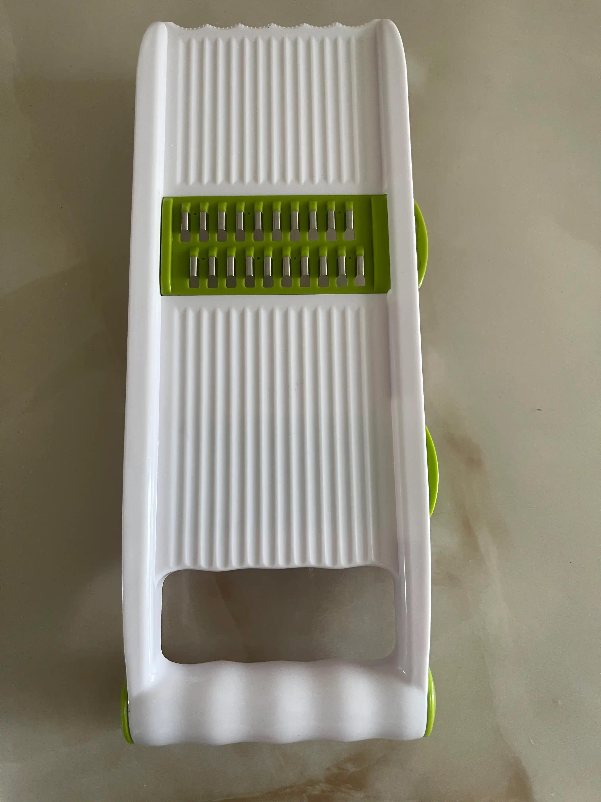
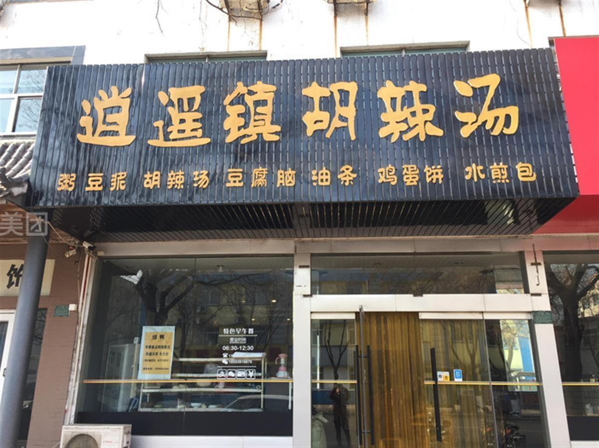
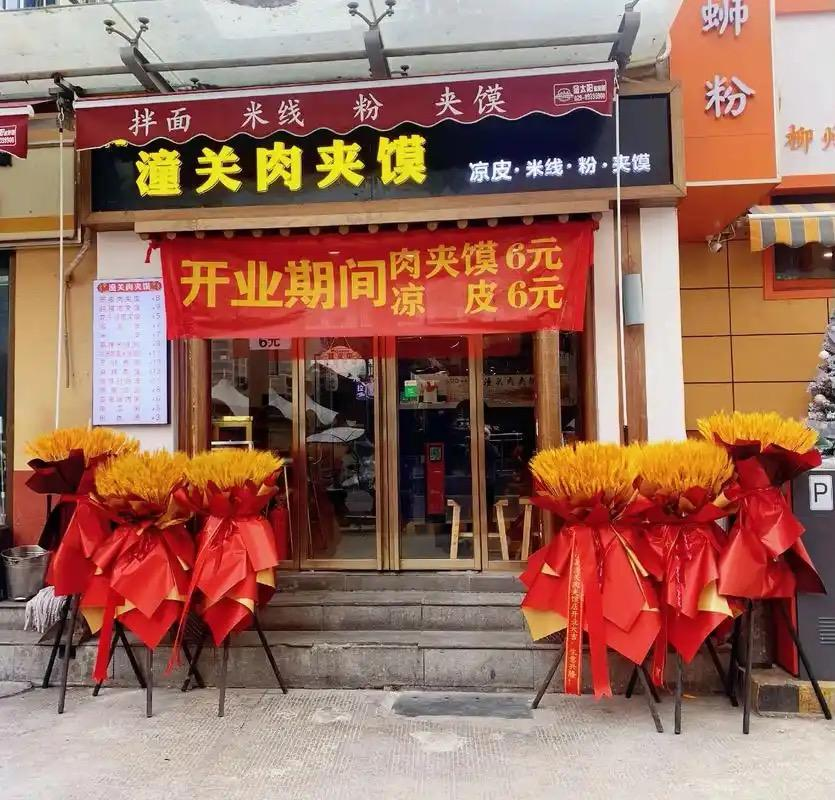
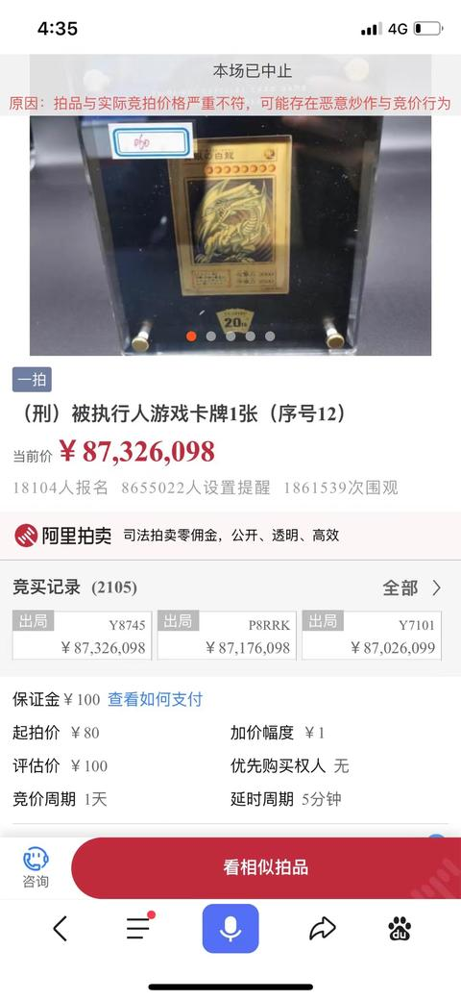
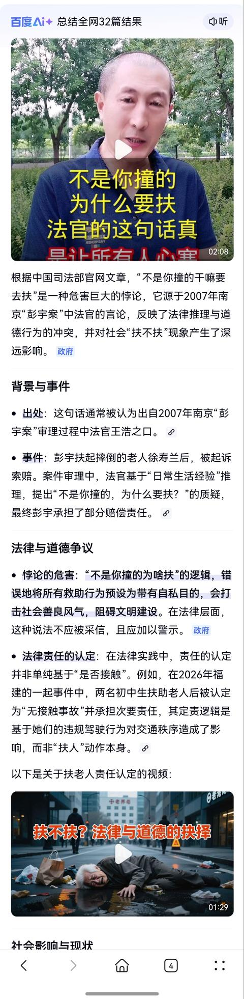

[toc]

# 问题

提问者：**<a href="https://www.zhihu.com/people/46-5-72-60-44">羽微</a>**
提问时间: 2026-2-3 8:54:39
总回答数: 2515
总访问量: 5271632

为什么很多人看到“忠臣孝子/奸夫淫妇”会从各种角度质疑其判断标准，但对于“人人平等”却只需要念念经就能接受，而不用看它到底有没有被实施到位？

至少在我看来，我在打官司和申请仲裁的过程中因为人脉、权势、政治正确的干预而得不到真正平等的裁决，比起我在道德议题的争辩中被把持话语权的家伙无辜定性成奸夫淫妇，前者的概率要大多了。

# 回答

回答者： **<a href="https://www.zhihu.com/people/jiao-chuan-jia">寒沙</a>**
回答时间: 2026-2-9 18:12:1
点赞总数: 8754
评论总数: 1335
收藏总数: 4467
喜欢总数：1368

“人人平等”本身就会造成极大的不公平。

你20出头血气方刚，走在野外，看到田埂上走来一个性感美女。刚好你懂法，一想，三年啊！

你刚好是个游手好闲的街混子，三年算个球，在外面混三年和在里面待三年没什么区别。

于是你干了。然后美女报警，警察抓人，检察院起诉，法院判。你也按法律要求，足额支付了三年，不欠社会的。各公权力机构完成了KPI，皆大欢喜。

再来一次，这回你不是街混子了。你是个刚考上公务员前途无量的青年才俊，虽然那一刻你老弟抬起了头，但是你还是忍住没干。三年对你来说太宝贵了，你支付不起。

法律为一种罪行规定了处罚方式，不是为了要你那三年时间，而是为了吓住你，让你别干那件事。

【打补丁：我们中国的法律是这样的。不知道美国是什么情况。听说，听说而已，我并没有亲见，那边开监狱能赚钱，那客源问题貌似……哎呀，不猜了。】

但是对于街混子和青年才俊来说，街混子能支付得起，青年才俊支付不起，所以同样的刑罚对二者的威慑力力是不一样的。

威慑不了街混子，但是可以威慑好人。

这还公平吗？如果这样不公平，要不街混子判死刑，公务员判3年？这好像也不公平啊？

所以法律不是“做不到绝对公平”，而是连相对公平也做不到。

只靠法律是不行的。

这只是初级版本，三年时间虽然街混子不在乎，但是毕竟也要实实在在剥夺三年时间。下面来个中级版本，看看道德的重要性。

罚款版：

公园的枇杷，那是观赏用的，不让摘。枇杷在那，谁都能看，受益的是所有人。

但是如果真有人摘了，那也只不过就是摘个公园枇杷，也不是什么大错，总不能给枪毙了。

所以公园管理部门在枇杷树下立了一块牌子：摘枇杷，罚款50。

正好你是个穷逼，50块把你吓退了，你想了想，没摘，咽了口唾沫，上旁边水果店卖了一盒，10块钱，节约40，省钱就是赚钱嘛。

呐，再来，这回又不一样了，你不是穷逼了，你是一个道德高尚的人，有廉耻之心的人。不罚款你也不会摘的。你知道啊，罚款不是目的，公园不是卖枇杷的，不是为了要那50块钱，是为了不让道德低下的人摘枇杷。

但是！这回又不一样了！王传君来了，还带着女儿，kuchakucha就摘枇杷。

他虽然没有公共道德，但是他有钱啊，50块能吓住他？开玩笑呢？大明星掏出50块给了保安，行了，钱给你了，我可以随便摘了吧？

不够我再给你50？我知道旁边水果店10块钱一盒，但是我就是不想走这几步路，我就是要摘树上的观赏枇杷，50块买我家小公举开心，划算！

这个50块，可以说对于王传君来说，跟没罚款没有任何区别。

当然只看钱的话，你也出得起这个数，问题是你有羞耻感啊！就算不罚款，被批评教育也会嫌丢人是不是？

也就是说，一个没道德感，还有钱的人，他几乎可以贴着法律的边界做任何事。

“法无禁止皆自由”嘛，无论这事多缺德，他干起来都如丝般顺滑。

高级版本我不敢说了，你们结合这几天的热点自己脑补吧。

我的结论是：法律很重要，但是法律是必要的，不是充分的。只靠法律是不够的，在法律之外还需要有道德进行补充。

如果再不加强道德建设，我们这里将会沦为美国那样的，什么事都靠法律，极大拉高社会治理成本，举国零和博弈，形成国家级内耗。

在全民没有道德的社会里，有钱真的可以为所欲为的，他们可以雇佣一个团队，专门研究怎么钻法律漏洞，坑死所有人来满足私欲。

几年前，连着几个新闻上了热搜。

其一：3000多家杂货铺集中被起诉，因为他们卖的“刮丝器”，侵犯了原告的专利权。

证据做得非常扎实，原告在起诉之前还找人去店里买一个，并录了像。

其二：大量“逍遥镇胡辣汤”被起诉，侵犯了原告的商标权。

其三：大量“潼关肉夹馍”被起诉，侵犯了原告的商标权。

这些小吃二十年前就叫这个名字，现在搞商标权纯属无赖，但是他合法。

刮丝器那个是精心布局，诉的是外观专利，因为发明和实用新型他申请不下来。

他们用自己的外观专利生产刮丝器，然后去那些杂货店推销，老板一看，货还行，也不贵，你放这呗，这玩意又不会过期。

还以为他们真的是正经做生意的厂家，就是赚这个产品的钱。

过了一两年，这货再派人去买刮丝器，录像，起诉。

杂货店老板都懵了，我就赚个辛苦钱，怎么还犯法了呢？这个东西也是别人送来的，我哪知道他有没有买过授权？

原告说了，你说别人送来的，什么时候送来的？那人在哪呢？有证据吗？

这特么？送货的就是你们一伙儿的呗。

法官心里明镜一样，但是证据不支持被告啊，他能怎么办呢？

原告说，我要的又不多，就三千而已，要不你给了钱息事宁人吧？我们是专业干这个的，你们还要做生意，跟我们你可耗不起。

刚开始的几场，他们真的讹诈成功了，法官依法判案，只能判原告胜诉。

后来闹大了，上面出了行政手段，把这股妖风给掐灭了。

毕竟是有道德的地方，不能干这么缺德的事。要是这都能让你们大面积讹诈成功，那就没有公序良俗可言了。

然鹅，他们合法！虽然缺德，但是合法！

既然讹人是他的合法权益，那么行政干预就是损害了他的合法权益。哦呦，政府违法了！

哈哈哈哈哈哈，搞笑吧？

这是典型的“用行政手段干预司法”的案例，是法治婊要大批特批的行为。当然他们不会明目张胆地支持这种讹诈行为，而是要痛批中国的“法制不健全”，居然需要用行政手段干预。所以他们的口号是要在中国建立一个健全的法制社会。

怎么才能健全呢？他们说要学习美国的先进制度，让所有的杂货店老板，每个月拿出三千，请专业的律师团队把关，提前规避所有法律风险。

这么一来，杂货店老板就再也没有违法的风险了。

他们说这就是法治社会。白花花的银子怎么能给那些无赖，应该给我们律师啊！

所以，你现在知道那些整天喊着要推动中国建立法治社会的人都憋的什么屁了吧？

我们官方说的一直是：建设社会主义法治社会。

经他们故意扭曲之后，就成了全盘学习美国那一套，律师要当刹帝利，掌握社会权利，攫取财富，形成门阀垄断。

mlgb的，国家派理科生出去交流，是让他们学习先进的科学技术知识，回来科技兴国，理科生干成了。

国家派文科生出去交流，是让他们到化外之地宣慰化外野人，让他们知廉耻，帮他们建立道德观。结果这帮人去吃了几年汉堡，回来学会拉屎不擦屁股了。

\===更新一下===

评论区已经有人使出了经典战法：反证法。

在数学领域，你搞出一个什么定理，无论你正向正明的时候有多严谨，只要有人抛出一个反例，你这个定理就不成立，四两拨千斤嘛，很爽的感觉。

【就像《自相矛盾》寓言里那个提出“以子之矛 攻子之盾”的傻缺，靠精准卡住bug，就能用一张嘴把一个做实业的干得“涨红了脸”落荒而逃。而他又给这个世界贡献了什么呢？】

总有人举道德方面的反例，说有个谁谁谁，他很没道德，所以道德建设没有用。

我真是服了这种逻辑，那还有人违法犯罪呢，判刑的有，逃脱制裁的也有，所以法律没有用？

【遇见这种谁逃脱了制裁新闻，评论就会变成杀杀杀的死刑起步模式。果然不打算要法律了】

反证法这个东西只能用在严谨的自然科学领域啊，在社会科学上你因为可能存在bug就否定其巨大的正面作用，这都是什么眼界啊？

这种人可能是沉浸技术的人员，程序员，绘图员，工艺师什么的，在他们的世界里，对bug是零容忍的，一旦存在不可避免的bug就得推翻整个技术方案。

所以，术业有专攻，你带着技术员思维是干不了居委会的工作的。

虽然网络是开放平台，不会因为大家的身份而限制讨论特定的问题，但是也请在发言之前斟酌一下，你的说法会不会闹笑话。

\===第二次更新===

我草，我什么时候说法律不重要了？

我什么时候否认法律的作用了？

我什么时候说只要道德就够了？

或许是他们真的认为道德不重要，道德没有用，只要法律就够了吧？

这些人不要以己度人哈，我和你们不一样。

西方社会也不是只有法律啊，人家以前有宗教约束，现在美国总统就职还得按着圣经发誓呢，你们瞎吗？

后来自然科学兴起了，社会世俗化了，宗教约束力几乎没了，欧洲还有点惯性，美国基本没了。这就形成了巨大的真空地带。

全得补上啊，于是美国人疯狂生产法律，要用法律填补这部分真空，这也是美国的法律为什么这么厚的原因。

美国人口占世界的5%，但是美国有全世界50%的律师。

也就是美国，底子真厚啊，要知道律师是不从事生产的，他们吃喝拉撒全靠其他国民生产。

而且他们吃得还比较好。

这就导致社会管理成本太高了，只能抓大放小，出了950美元线，要逆天啊这是。

美国的前车之鉴告诉我们，只靠法律是不行的。

因为道德约束/宗教约束，可以发生在行为之前，而且可以自我约束。

但是法律制裁是发生在行为之后的，还需要人执行。

执行会牵扯太多的人，受害者为了告你，要花时间，也影响生产啊。社会还要养一大批律师，警察，法官。这些人都是不从事生产的啊。

全是管理成本。

再说宗教约束。

欧洲也世俗化了，宗教约束比美国好点，但是也好不到哪去，他们失去宗教约束后也出现了生态位缺失，有了真空地带。

所以他们异化出了一些其他东西，比如：白左。

其实最早的白左并没有现在这么招人恨，他们吃饱喝足了，开始同情弱者，关心穷人，爱护环境，这不是很好的品质吗？

但是很快他们被资本利用了，动保、环保，各种以赚钱为目的的机构出现了。

他们打着爱与和平的旗号敛财，基础手段就是，要求别人奉献出爱和钱。

也不知道哪个傻比把这种行为翻译成“道德绑架”，这事关道德什么事？欧洲又没有道德这个东西。

但是由于道德绑架这个事太招人恨，也是因为中国的傻逼太多，他们貌似把道德和道德绑架划上等号了，你麻痹啊……

也不知道从什么时候起，中国兴起了一股妖风，就是想方设法瓦解中国的道德体系。

南京“不是你撞的你为什么要扶”，没有，没有人说过这话。而且当事人承认是自己撞的。

但是，真相已经不重要了。这件事对中国的道德体系打击极大。

以及后来的，各种女子落水无人敢救，各种奸出妇人口，以及打拳行为。

争议焦点往往在于：诬陷成本低，成了收益巨大，败了零成本。

这就是法律和道德的交汇所在。诬陷别人，既是法律问题也是道德问题。

从道德上来说，她道德有亏，应该被道德审判，但是法律偏偏要保护她的隐私，让她免于道德审判。

这貌似不合理，但是为什么要这么做呢？

因为今时不同往日，现在信息传播太发达，道德审判的强度难以控制，她虽然道德有亏，如果放任对她的道德审判，很难说她会不会会不会网暴致死。

罪不至死吧？

旧的方法不怎么好用了，新的方法还在摸索。

但是起码可以确定，像美国那种全靠法律的搞法是错误的道路。

评论区有网友提到，现在已经有法学生展现出对法律、法治这个东西产生了宗教一样的情感。

而且他这种宗教是自带欧洲宗教的排他性的，就是：我只信这个，不信别的，别的都是异端邪说，应该扑灭。而且你也得和我信的一样，你要信别的，那你就是异教徒，我得想办法烧死你。

我一说要加强道德建设，他就理解为我不要法律只要道德，然后一顿证明：只靠道德不行。

这就是狭隘嘛，以己度人，以为我会像他信仰法律神教那样信仰道德。

中国的历朝历代都有法律，但是在实操中，法律一直是用来解决问题的备用手段，是在最后解决不了的时候才打官司，而不是屁大点事就去告状。

坑蒙拐骗干一次，可能这一次也没人制裁你，但是你的信誉就破产了，以后就没人跟你玩了。

这是道德惩罚。

比如川大张女，她及时道歉了，算是刹住车了，后面影响还能控制。

而武大杨女，至今仍然在硬挺，但是她其实并没有违法，或者她钻了法律的空子，使得法官无法依法判她，这就是法律无能为力的时候啊。

这个时候她就被道德惩罚了，个人信誉破产了，有政审的工作干不了，私人企业没人会雇佣她。

这不是很好的道德补充法律的案例吗？

但是法治婊不这么认为，他们会说：

1、杨女没被法律制裁，说明她是对的。

2、即便她错了，也应该完善法律，增加条款，然后制裁以后的类似行为，而不能对她用道德惩罚。

反正就是不满意！

要是屁民都用道德来办了法律的事，律师费从哪来呢？

\===更新一下===

评论区有位网友提到，那几个商标侵权的案子就不该存在，为什么他们可以注册成功？

这个问题其实非常典型，这是中国人才能提出的问题。

我们先讨论一个问题：是道德标准更硬，还是法律标准更硬？

一般人的反应都是法律标准更硬，因为“国法无情”嘛。

然而，在实操上，道德标准是硬的，法律标准因为法条太复杂，而变得十分灵活，甚至只要律师足够牛逼，世界上可以没有一个罪犯。

但是在道德层面，你很难颠倒黑白。

中国人有一个特点，就是心里自带一杆秤，一副道德标准，而且这个标准全国都差不多，比如同情弱小，看到恃强凌弱的会愤怒；言而有信，对于食言而肥的人会鄙夷。实事求是，看到指鹿为马的会发出woc声。

我们管这个叫朴素的正义感，大多数中国人中国人都是这样：具备朴素的正义感，但是没学过法律。

所以他们看到这种合法而又缺德的行为就会产生这种疑问：为什么他能成功？

因为你不了解法律呗，法律和道德不一样。

法律是需要人去执行的，这个过程很长，涉及的人也很多，加上繁琐的法律条文，操作的空间大到难以想象，无中生有，颠倒是非不在话下。

甚至都不用操作，纸面上都能存在：你可以带枪，但是不能带双节棍这种事。

这是无数次维护屎山代码的结果。

就不能从原点出发，直击本质吗？

答：不能。你直击本质了，我还怎么操弄法律呢？谁不知道枪比双节棍杀伤力更大，要你来告诉我！

但是道德不需要执行。比如我看到一个人落水，我量力而行，把他救起来。无论这个人是否感激我，是否酬谢我，甚至是否怪我多管闲事。我自己有自己的判断：这是对的。

而我又处在这样一个有共同道德标准的人群里，主流的声音会告诉我：这是对的。

所以无论你如何巧舌如簧舌灿莲花，都无法操弄我心中的道德标准。

就像个回答，评论区有人曲解，有人骂，但是这不是还有4000多赞吗？评论主流声音也依然是支持。

所以道德体系的建立不是一朝一夕，想破坏也没那么容易。

诸君共勉！

\===有人看就接着更===

评论区提到某字体的事，他设计了几款字体，放到网上，给你免费下载使用。

等你用了他的字体，搞出了好的作品，出名了，赚钱了。他来起诉你，找你要钱。

你说这不是免费字体吗？

他duang，拿出一个证据，什么什么协议，这上面说了，这不是免费字体，当时你点了同意。

证据扎实到连法官都帮不了你。

还有视觉中国这种（是这个名字吧？）他搞个平台，让摄影爱好者在上面发布作品，相当于白嫖投稿人的作品。

然后等着你用这些素材，他们还搞了一个算法，专门全网找，看谁用了他的素材。

一旦被咬上，你掏钱吧。后来离谱到自己拍的照片上传，自己再下载使用，他都找你要钱。

（知网也干过，教授下载自己的论文需要花钱买）

不给就起诉，材料当然是一如既往地扎实。

你以为我只是要吐槽一下他们吗？当然不是。

这个事被美国一个白人大佬评价过，是经济学还是什么学的来着？

大佬评价为：当一个公司赚钱是靠垄断而不是提供服务，那么他就活不长久。

这还是大佬呢，他的见识就到此为止了，他总结出了一个客观规律，就这？

他们合法，合规，合乎程序正义，为什么会被行政手段锤？

你个事让一个普通的中国人来看，能看出什么来？

因为他们出发点就是坑人啊！动机就是坏的啊！

但是白人不追究动机，他们会刻意忽略动机，只管现象，只管程序。

但是中国人就很注重动机。

【我这里不是要吹捧注重动机，只是对比双方的思维方式】

忘了在哪里看到的，三言两拍还是哪里来着？

说有一个男的，骚扰村里一个寡妇。他爬上了寡妇家的房顶，把人家的瓦掀开几片，掏了个洞，从那个洞里露出阳物给寡妇看。

寡妇报官了，县令审案，判了这个男的通奸罪。

这个男的就喊冤啊，说通奸起码是两个人吧，我一个人怎么通奸呢？

县令说你爬上人家屋顶揭瓦，费这么大力气，就是为了去通奸，没通成只是因为寡妇不配合，而不是你不想通奸。

这个就很有代表性，中国古代的断案是很在乎动机的。

我这里还有一个亲身经历，有点搞笑。

就是有一次我们上中国马克思主义与当代，老师站在台上半天没说话，憋了半天，说：前三排一个人都没有，这说明你们根本就不想来上这个课啊…….

然后就有几个懂事的赶紧跑前面去了，接着大家都纷纷往前挪位置。

但是他仍然很是郁闷。

他郁闷的原音是大家坐在哪里吗？不是，是学生的学习热情。

所以，这个问题到底应该怎么解决？

按照美国人的尿性，出台一个法律：上课不准坐后面，这个问题就解决了。以后你坐后排就是违法，告到你破产。

但是中国人会追究根本原因，还是得把课好，课讲好了，学生自然就往前凑。

董小姐4+4那阵子，他们甩出的理由就是：我们合规，每一步都合规。

程序很正义，结果很离谱。

这就是法治婊们信仰的程序正义。

\===再更===

这帮法治吹给人画了一个大饼：法治社会一旦建成，天子犯法与庶民同罪。

屁民们一听，这可以啊，支持支持！

而美国的前车之鉴告诉我们：万事靠法律的结果就是万事皆靠人治。律师越来越多，法条越来越复杂，操弄空间越来越大，一套操作下来，每一步都合法，一路下来能合法地指鹿为马。

最终的最终，是掌握了立法权和释法权人在治理。

所以你现在看到罗教授老争释法权就懂了，从美国学来滴。

法治的尽头居然是人治，权力的诱惑太大了。而且搞成这样的初衷居然是为了避免人治。

按照他们画的饼，法律越完善应该标准越明确，人就越没有参与的必要。最先是律师退出，因为你犯什么罪，该怎么判，都是写在纸上的，律师的作用越来越少才对。

法官依法判案就行了呗。

再进一步，法官都没必要了，直接电脑判案，这回没人能贿赂法官了。

完善制度不就是为了提高效率吗？

但是美式法治不是，他的法治越来越完善，需要越来越多的人去从事法律工作，评判标准越来越复杂，越来越需要，人，去进行司法解释，因为你不解释就没法判了。

因为他们没有道德体系，没有人心那杆秤，掌握立法权和释法权的人成了最终的独裁者。

所谓物极必反，法治的尽头居然是人治；规则追求尽善尽美却带来了混乱；民主的尽头需要一个独裁的角色来结束公也有理婆也有理的蛋疼局面。

而这一汪浑水中，一波罗教授，以正义之名，悄悄地向权力的手柄伸出了小手手。

\===更===

律师阶层正在争夺社会治理权，这可是一个国家最根本的权力之一。

但是他们很会遮掩，只说是要搞“程序正义”这种政治正确的口号，让你无法明着反对。

他们说程序正义是为了保障结果正义。

然后大力宣传那几个几十年前的冤案，聂树斌，呼格，聂海芬，再来一招蟑螂原理。暗戳戳引导你往“中国到处是冤案”这个方向上脑补。

他们说，你看，这就是为什么要搞程序正义。

这招也确实好使，毕竟一个普通人即使啥也没干也有可能被冤枉，谁不怕啊？

这把并不存在的达摩克利斯之剑就这样悬在了每个人的头上。

这些律师现在干的事是不是坏事？

并不是，他们为冤死的人发声，当然是好人，当然是正义的。

但是，个案的冤屈不能否认整个司法系统，也不能因为这几个冤案就把社会治理权交给程序正义的律师们。

外卖平台的补贴很香，你是不知道他们现在补贴是为了将来垄断吗？

你现在还能找到聂海芬，等他们的程序正义成长为美国那样的司法系统，你就能体会到叫天天不应了。

我想起一个故事，不知真假，拿出来晒晒。

有个人在火车站等火车的时候，被人推下站台，被驶来的火车撞死了。

推他的人也没跑，就等着被抓，因为他是无辜的，他当时在站台上跑动，踩到了香蕉皮，自己摔跤的同时撞飞了死者。

那么为什么他会踩到香蕉皮呢？因为刚刚好一个人吃完香蕉顺手把皮扔站台上了。

这种情况怎么搞？意外吧？“法不强人所难”啊，他踩到香蕉皮摔倒了，放你身上你也摔，你能判他有罪吗？

扔香蕉皮那个又能定什么罪？

所以这就是意外，倒霉呗。

然而，后来档案揭秘了，死者是个叛变的谍报人员，撞他的和扔香蕉皮的是他的同事。

也就是这个事是一次精密策划过的，处决行动。

当然这个事不是司法领域的“程序正义”。

它只用来说明：一旦程序步骤多了，操弄空间会变得很大，每一步都是无罪的，最后却可以实现有罪的目的。

作为最后承担后果的人，你找谁啊？

这件事你也许还能找找幕后的策划者，嘿嘿，想让你找不着人还不容易？

你看看斩杀线下的那些人，他们被斩杀的每一步都是合法的。

税务局，银行，保险公司，都做得滴水不漏，他们也许只有一条路：造反，把美国所有的系统全打烂，重建。

然鹅，他们没那种脑子，即使有，也被毒品腐蚀坏了。

搞笑的是，毒品也是合法的，为什么毒品能合法？因为通过法案的过程合乎程序正义啊！

这会真是闭环了。

\===更===

我本来想举一个当官的搞了一个红绿灯的专利，然后他辖区里的红绿灯全换成了他的专利产品。都是合法收入，对于这种明摆着的以权谋私行为法律只能干瞪眼。

但是这个例子普通人没法操作。

正好这几天出了邢台骗婚案，这个案例就nice了。

女方收了高额彩礼，酒也办了，证也领了，就是不让碰，在男方家住两三天就要回娘家。

南方起诉离婚退彩礼，法院依法判决：驳回！

这个看上去没有告男方强奸，比大同案要好一些，但是实际上她做得更周密。

因为告强奸的话，有诬告的风险，万一被认定为男方没有强奸行为，这事就会对女方很不利。

翟欣欣那个骗婚里面还有诈骗和敲诈勒索的的情节。风险也很大。

还有的是收钱，但不领证的，男方一告，法院判那是以结婚为条件的赠与，不结婚就得退还。目的达不到白忙活。

但是邢台这个就厉害了，把所有的补丁都打上了。

她自始至终都是合法的，相亲，收彩礼，领证，你抓不到她的错处。

不给碰又不犯法，回娘家住又不犯法。

我就不信法官看不出这女的是在讹钱。

这个女的拿到判决书后应该很得意吧？

你看，我就明着讹你，我还合法，你看不惯我却也干不掉我。最终还是你妥协，最少能落一半的彩礼。

甚至按某些地方的规矩，女方主动退婚，彩礼返还。男方主动退婚，彩礼一份不退。这算是为了保女方的名誉，毕竟被男的甩了不好听。

所有人都知道她在耍孬孙，但她就是合法。别人不这么搞，就是因为别人都要点脸。

她只要不再要脸，就可以合法讹钱。

而且，她这是第二次了。

请法治婊们来洗洗把，她程序正义，她没有违法。

  

原文地址：[(寒沙)“人人平等”实施起来真的比“忠臣孝子比奸夫淫妇高贵”更优吗？](https://www.zhihu.com/question/2001941631948064008/answer/2004256226326910019) 

# 评论

1. <a href="https://www.zhihu.com/people/bo-si-qi-qiu-xiao-xie">波斯气球小谢</a> (<small title="江苏">2026-2-10 5:19:6</small>): 你这个帖子，看起来很简单，但是我真的服了，太有道理了。
   - <a href="https://www.zhihu.com/people/zhang-you-79">苏友</a> (<small title="浙江">2026-2-10 9:29:27</small>): 这叫例子挑选的艺术。第一个你改成吃外卖老乡鸡一样的结果。一个混混和青年才俊吃老乡鸡（或者酒驾）被按头7天，那才叫正儿八经的一个毫无影响，一个终生抱憾。
   - <a href="https://www.zhihu.com/people/62-18-46-23-60">子宋</a> (<small title="山东">2026-2-10 10:45:49</small>): 少有的说明白的。
   - <a href="https://www.zhihu.com/people/tian-tian-ni-zai-na">天天你在哪</a> (<small title="回复于 2026-2-10 11:10:17/天津"> ✉️:苏友</small>): 没错，现在的法律对于相对体面有道德的人过于严苛，但是对于没有体面没有道德的人过于无力，对于体面的人来说记入档案是一辈子洗不掉的污点，但是对于不体面的人来说，他们根本没影响
   - <a href="https://www.zhihu.com/people/zhang-you-79">苏友</a> (<small title="回复于 2026-2-10 11:19:34/浙江"> ✉️:天天你在哪</small>): ［捂嘴］对混混也不无力啊，把人家这辈子按在泥里的能力还是很强的，让人家这辈子就只能当混混，根本无法从良。比如胖东来要招聘劳改犯都被喷，何况别的。
   - <a href="https://www.zhihu.com/people/mao-lei-34-29">老猫</a> (<small title="回复于 2026-2-11 7:1:53/安徽"> ✉️:苏友</small>): 你对混混有什么误解？说低档的混混，人家觉得混社会很牛逼，可以随心所欲不当牛马，冯小刚的老炮儿算一种，你觉得他可怜是你觉得，他自己可不觉得。高档的混混，那可太多了，游走灰色地带的疯狂捞钱，比如上面提的老乡鸡，做鸡头的赚的盆满钵满，只要会打点，过的滋润一匹，就算被抓了，出来一样干，不能活了？底层？人家笑你牛马不能挣钱呢
   - <a href="https://www.zhihu.com/people/wo-de-ming-80-38">七七</a> (<small title="回复于 2026-2-11 12:48:11/山东"> ✉️:天天你在哪</small>): 都是3年还过于严苛？严苛吗［笑哭］
   - <a href="https://www.zhihu.com/people/bo-si-qi-qiu-xiao-xie">波斯气球小谢</a> (<small title="江苏">2026-2-11 13:16:56</small>): 我觉得你觉得他不恰当跑到我回复下回复我这个行为很不恰当，请回去反思一下。
   - <a href="https://www.zhihu.com/people/wenking-68">午夜的风</a> (<small title="回复于 2026-2-11 13:39:14/河南"> ✉️:波斯气球小谢</small>): 不好意思，我以为你发到公共空间的言论是可以共同讨论的，没想到你只是希望别人附和称赞，打扰了
   - <a href="https://www.zhihu.com/people/lei-nuo-bu-en-di-ya-shang-xiao">雷诺布恩迪亚上校</a> (<small title="重庆">2026-2-12 8:49:36</small>): 批判的是市场经济，贫富分化，和法律设置而非人人平等，我看见你的评论我才服了，买保健品吗
   - <a href="https://www.zhihu.com/people/linlin-38-43">linlin</a> (<small title="福建">2026-2-13 23:27:22</small>): 太搞笑了，哪个街混子愿意进去三年？让你重念三年高中，估计都没几个人愿意。
   - <a href="https://www.zhihu.com/people/bo-si-qi-qiu-xiao-xie">波斯气球小谢</a> (<small title="回复于 2026-2-14 4:57:13/江苏"> ✉️:linlin</small>): 嗯，中文阅读理解有人还是不擅长也正常。
   - <a href="https://www.zhihu.com/people/linlin-38-43">linlin</a> (<small title="回复于 2026-2-14 13:7:43/福建"> ✉️:波斯气球小谢</small>): 看来，你喜欢进监狱，无所谓啦，  
 
但是，进去了怎么犯罪？  
 
所以，刑法是有效的保护人民的。  
 
无法无天的，再狡辩也没用。
   - <a href="https://www.zhihu.com/people/bo-si-qi-qiu-xiao-xie">波斯气球小谢</a> (<small title="回复于 2026-2-14 19:51:25/江苏"> ✉️:linlin</small>): 哈哈啊哈哈哈，笑出眼泪。
   - <a href="https://www.zhihu.com/people/82-17-48-74">函数</a> (<small title="回复于 2026-5-7 12:8:34/山东"> ✉️:linlin</small>): 要是爽一次，就进去三年，他们可太愿意了
   - <a href="https://www.zhihu.com/people/2-62-4-4">寤笙</a> (<small title="回复于 2026-6-19 15:34:11/广东"> ✉️:苏友</small>): 老乡鸡是啥啊［思考］
2. <a href="https://www.zhihu.com/people/wan-peng-84">滑板鞋</a> (<small title="上海">2026-2-10 9:6:15</small>): 我觉得你在偷换概念，好人判三年和坏人判三年，其实付出的代价是一样的，也是公平的，这是唯物主义。而你觉得坏人不在乎三年，好人在乎所以不公平，其实是通过每个人个体的感受来判断是否公平，这就唯心主义了。法律不是通过让被罚者有一模一样的痛苦感受来维持公平的。只要所有人付出的代价客观上是一样的，我们就认为是公平的。
   - <a href="https://www.zhihu.com/people/sumnow">Sachima</a> (<small title="湖南">2026-2-10 9:15:52</small>): 所以光要法律不行啊，要提高道德要求，懂了吗，客观上代价一样，实际上呢，道德感低的人更加肆无忌惮，社会会乱套的
   - **寒沙** (<small title="湖北">2026-2-10 9:25:39</small>): 所以你的评判标准不行啊，承受能力强的人可以肆无忌惮地违法犯罪，承受能力弱的如履薄冰，你管这叫公平？  
 
现在他们在推废死，一旦成功，有钱的承受能力强，就可以搞死别人，赔100万给家属，再花200万安排立功减刑，甚至花钱雇人坐牢。没钱的只能自己去坐牢，说不定还会不明不白死在里面。所以不敢搞死别人。  
 
这公平吗？
   - <a href="https://www.zhihu.com/people/si-kao-de-yu-di">思考的雨滴</a> (<small title="回复于 2026-2-10 9:54:23/广东"> ✉️:寒沙</small>): 你是怎么分辨别人是好人还是坏人的，又是怎么分辨别人是富人还是穷人的？如果分辨不出来，那你就是把错误的刑罚用在错误的人身上，你承受不了这个冤枉好人的代价！  
 
再来，假如混混强奸了美女之后，忽然极低概率彻底醒悟了，变成了好人，那你打算怎么判？就算你按照他过往的行为来定性，那你这不就是要以道德代替法律么？伪君子比你真混混更懂得如何操控道德，那你究竟该如何把这种唯心的判罚标准给它照应进唯物的客观世界？道德简直就是最靠不住的东西，不仅没有执行标准，甚至能把官僚系统自己给干崩了，到时候还谈什么法治，笑死。
   - **寒沙** (<small title="回复于 2026-2-10 10:3:30/湖北"> ✉️:思考的雨滴</small>): 1、什么事都要明确的标准，没法定明确的标准就要推翻整个方案。  
 
2、花了大量精力讨论小概率可能发生的事件，担心可能出现的bug。  
 
你这个属于工程思维，去做技术工作吧，社会管理这个领域，你真的不适合涉猎。
   - <a href="https://www.zhihu.com/people/bing-yin-46-30">冰銀</a> (<small title="回复于 2026-2-10 10:11:18/天津"> ✉️:寒沙</small>): 在辩论里，特例就是很抓人心［doge］好多法律修改都是因为发生了特定的事情，可能是个小概率事件，但就是特别抓人的心理，甚至是某个特定时期的群众心理，改之前和改之后到底哪个更好？其实人们并不知道，只是满足了当时人们对于这种小概率抓人心的事情不要再发生的心理，那后续出现了其他特例怎么办？群众又不满意啦！接着改呗［酷］至于向哪个方向发展，那不就看精英们怎么引导舆论了嘛［doge］  
 
这种事孰优孰劣真的很难有统一的结论
   - <a href="https://www.zhihu.com/people/31-80-5-28">鲲之大</a> (<small title="江苏">2026-2-10 10:41:48</small>): 不不不，你不要过度关注同样刑法对不同人的伤害不同，重点在于它是否制止了犯罪！是否促进人民安居乐业！过度的要求公平会导致成本上升到无法接受的地步
   - <a href="https://www.zhihu.com/people/68-71-49-45-77">户晚风</a> (<small title="回复于 2026-2-10 10:47:2/浙江"> ✉️:寒沙</small>): 你凭什么觉得街溜子不在乎三年，纯纯的主观意识，还有承受能力强弱更是扯淡，你怎么知道别人承受能力的强弱？在实际判罚中，你怎么判定别人承受能力强弱？靠当事人的嘴巴说吗？如果承受能力强的人要多受惩罚，那么别人肯定会口口声声的说自己承受能力弱，需要减刑啊，所谓人心隔肚皮，你纯纯用一堆主观感受来判断，不觉得可笑吗？假如你抢劫东西犯罪了，按照法律规定一年刑期，但是法官觉得你的承压能力强，给你额外加1年刑期，你愿不愿意啊。
   - <a href="https://www.zhihu.com/people/qiu-sui-ru-ge">天斧斫卯未</a> (<small title="回复于 2026-2-10 10:51:6/广西"> ✉️:寒沙</small>): 他们就是想每样都制定一个天平，然后自己成为那个天平而得利。根本没有想用那个心中的道德天平。
   - <a href="https://www.zhihu.com/people/sui-xin-suo-yu-72-35">随心所欲</a> (<small title="回复于 2026-2-10 10:58:27/广东"> ✉️:寒沙</small>): 法治是最大的公约数公平了。你说的那个公平，不是法治，是人治。
   - <a href="https://www.zhihu.com/people/74-92-74-42">周冠宇</a> (<small title="回复于 2026-2-10 10:59:13/浙江"> ✉️:寒沙</small>): 这就是公平
   - <a href="https://www.zhihu.com/people/7-10-64-17">听雪</a> (<small title="美国">2026-2-10 10:59:44</small>): 对，就是要通过每个个体的感受来判断才是对头的。如果单纯只是为了惩罚罪恶，那为啥不彻底放弃法律流于以暴制暴的私刑？法律更多的起到的是一个规范和吓阻的作用，他希望这么标了之后人们相对应的区分开重罪轻罪，知道什么是绝对不能做的（很多时候非重刑主义的精神就在于万一轻罪重刑那我不如把重罪也犯了）。既然谈到吓阻力了，那为啥不应该谈主观？让一个虔诚的基督徒强制佩戴倒十字架十年和让普通人强制佩戴这吓阻力一样吗？
   - <a href="https://www.zhihu.com/people/hayzh-13">hayzh</a> (<small title="天津">2026-2-10 11:7:43</small>): 记得以前有个故事，就是说盖茨在过去多少年的资产累积到了多少，算下来每秒钟累积了好几百美元。所以结论是如果地上有100美元，盖茨都没有必要弯腰去捡。因为对他来说，那一秒钟的弯腰就是浪费。
 
从来不存在绝对的公平，有人确实可以拿钱砸死你。
   - <a href="https://www.zhihu.com/people/chi-wang-wu">王武池</a> (<small title="广东">2026-2-10 11:11:59</small>): 其一，追求你定义的公平，是否有积极作用？司法立法和刑法的意义是什么？如果不是为了阻止犯罪行为的发生，那它们存在的意义是什么？  
 
  
 
其二，法治向你定义的方向发展，是否要重新修缮一遍法律体系，比如坏人刑满后要增加更多的劝善时间，类似于社会服务令。  
 
  
 
其三，如果按照你这个说法，那么，唯物主义概念上的绝对公平对于促进社会稳定、对于劝人向善、对于震慑犯罪行为，将显得苍白无力。
 
  
 
另外，我认为我们讨论如何裁定他是好人还是坏人，并不是问题的重点，这是我们讨论该问题的前置条件
   - <a href="https://www.zhihu.com/people/hyugo">hyugo</a> (<small title="回复于 2026-2-10 11:18:31/江苏"> ✉️:寒沙</small>): 是的，目前为止，死亡这件事对于每个人都是公正的。但未来会怎么样就不知道了。
   - <a href="https://www.zhihu.com/people/gui-xing-tuan-98">鬼星团</a> (<small title="回复于 2026-2-10 11:21:28/浙江"> ✉️:寒沙</small>): 假设有一个法律，刑罚二选一，一个每天工地搬砖一年，每天资料整理一年，这时候判了学霸搬砖，他说，好不公平啊，搬砖多累，资料整理多轻松，  
 
判了力气大的资料整理，他也说还不公平啊，搬砖也多好，资料整理头都大了。不同的刑法不同人就是有主管判断的啊，你怎么办？你发明个让所有人都觉得公平的刑罚出来？
   - <a href="https://www.zhihu.com/people/sheepg-11-56">种花家的月夜兔</a> (<small title="福建">2026-2-10 11:24:44</small>): 付出的代价肯定不一样啊，有些人在外面的生活不一定比在里面舒坦，所以判三年不就是没代价吗？
   - <a href="https://www.zhihu.com/people/gan-pei-qiang">辛腾</a> (<small title="回复于 2026-2-10 11:29:4/广西"> ✉️:寒沙</small>): 按你说的那种公平，好人杀一个人，就应该轻判？坏人杀一个人，就必须死刑？  
 
美国佬轻判黑人的理由，其实出发点跟你没什么区别，因为黑人过去和现在受压迫，所以应该多一点机会［飙泪笑］
   - <a href="https://www.zhihu.com/people/sun-jian-wei-23-91">57神针</a> (<small title="上海">2026-2-10 11:29:30</small>): 我记得波士顿圆脸某期视频提到过一个类似的观点，就是美国在制度上对穷人进行打压。他举一个例子：如果美国政府现在宣布“以后穷人和富人都不允许睡到桥下”这样的法令，这是真的对所有人都公平吗？
   - <a href="https://www.zhihu.com/people/gui-xing-tuan-98">鬼星团</a> (<small title="回复于 2026-2-10 11:31:21/浙江"> ✉️:寒沙</small>): 而且你以承受能力来评判，那如果有一个人是骂一句就要去自杀跳楼的心理承受能力，所以法律就不用罚了是吗
   - <a href="https://www.zhihu.com/people/tian-yu-liu-fang-26">天雨流芳</a> (<small title="山东">2026-2-10 11:32:1</small>): 所以还是要按照杀人偿命欠债还钱来办，让那个混混或者有为青年感受受害人一样的痛苦、经历一样的遭遇就好了。这最符合唯物和辩证法了［捂嘴］
   - <a href="https://www.zhihu.com/people/zhang-yong-chao-55">sandman</a> (<small title="安徽">2026-2-10 11:35:29</small>): 代价可不一样，一个有稳定工作幸福家庭的人，三年出狱后，家庭散了工作没了。一个混混出狱后，基本没影响，所以之前有段时间，混混以坐过牢为荣，没有坐牢经历都不好意思当老大。
   - <a href="https://www.zhihu.com/people/4-95-90-91">阿白</a> (<small title="湖南">2026-2-10 11:40:55</small>): 那既然如此，为什么到了税收的时候就要讲根据财产比例收税了？
   - <a href="https://www.zhihu.com/people/59-55-22-24">霍冬</a> (<small title="江苏">2026-2-10 11:42:56</small>): 好多人在扯惩罚，法律是为了杜绝犯罪，而不是让你们讨论犯罪后的惩罚对不同的人是否公平。而是这个法律的惩罚力度或者惩罚条件能否公平地对所有人带来同等的约束力。
   - <a href="https://www.zhihu.com/people/qiang-yu-44-18">童年往事</a> (<small title="回复于 2026-2-10 11:45:1/上海"> ✉️:寒沙</small>): "承受能力强的人可以肆无忌惮地违法犯罪"，想犯罪的人就是可以犯罪，承担代价就是了；“承受能力弱的如履薄冰”，正常人也没有如履薄冰吧，不要想当然［思考］
   - <a href="https://www.zhihu.com/people/hahah-94">好神奇</a> (<small title="回复于 2026-2-10 11:47:5/浙江"> ✉️:寒沙</small>): 你不是最穷的，也不是最富的。如果你是相对的富人呢？同样闯了红灯，别人扣分你拘留，这公平吗？  
 
按照你说的，富人重罚，穷人轻罚，那这个世界上就没有富人了，大家一起回到改革开放以前吃大锅饭吧。  
 
什么是公平，每个人因为自己所处的环境都有不同的观点。没有绝对的公平。无知之幕了解一下吧
   - <a href="https://www.zhihu.com/people/59-55-22-24">霍冬</a> (<small title="回复于 2026-2-10 11:48:19/江苏"> ✉️:户晚风</small>): 因为现实就是这样，同样是判3年，街溜子的犯案率比其他人就是高。而抢劫如果判一年，对承受能力强的人，就是威慑力小。所以不是判几年的问题，而是对杜绝犯罪的效果不公平。法律的目的不单是惩罚，更重要的是杜绝。威慑力是不同的。时间只是先对更公平一些，而罚款就会造成更大的不公平。因为有的有钱人人是真的不在乎固定值的一个钱。
   - <a href="https://www.zhihu.com/people/59-55-22-24">霍冬</a> (<small title="江苏">2026-2-10 11:50:17</small>): 客观上一致就是不公平的。因为没有一个东西对所有人来讲是公平的，比如钱，比如体罚，比如活动自由。所以要不断探索完善。
   - <a href="https://www.zhihu.com/people/kun-zhi-mian-xing-28">困知勉行</a> (<small title="回复于 2026-2-10 11:57:27/陕西"> ✉️:寒沙</small>): 你还有功夫跟这个 思考的XX 讲这些？
   - <a href="https://www.zhihu.com/people/anders-han">忽然有空</a> (<small title="回复于 2026-2-10 12:13:36/辽宁"> ✉️:寒沙</small>): 承受能力强弱你又是怎么判断的呢？如果我的判断和你的不一样怎么办？同样是两个“街头混子”或者两个“青年才俊“的“承受能力”就相同吗？
 
法律是底线，底线就是要清晰可视，这样才知道什么情况是碰了底线。底线确实是有漏洞，有些道德水准低下的人会利用这些漏洞牟利，所以政府会用行政手段干预，法律原则中也要参考“公序良俗”作出判决。但是不能因此就把底线整体模糊化。
   - <a href="https://www.zhihu.com/people/guai-ren-wang-da-she-87">怪人王大蛇</a> (<small title="回复于 2026-2-10 12:15:54/黑龙江"> ✉️:寒沙</small>): 但是你第一个例子里就是光脚的承受能力强啊
   - <a href="https://www.zhihu.com/people/Anakin7">摩羯Anakin</a> (<small title="回复于 2026-2-10 12:18:40/浙江"> ✉️:寒沙</small>): 第一条就是属于不可实现的
   - <a href="https://www.zhihu.com/people/lao-fz123">lao_fz123</a> (<small title="广东">2026-2-10 12:31:31</small>): 这哪里是个体感受唯心主义。。。这是阶层感受好不好，为什么几乎所有的互联网大厂都会侵权，因为赔的少啊？为什么会有3Q大战，因为互相侵权都知道对方败诉只不过赔几十万，但是自己的核心业务会垮
   - <a href="https://www.zhihu.com/people/lao-fz123">lao_fz123</a> (<small title="回复于 2026-2-10 12:32:57/广东"> ✉️:思考的雨滴</small>): 混混忽然醒悟了，所以就不判罚？什么鬼
   - <a href="https://www.zhihu.com/people/lao-fz123">lao_fz123</a> (<small title="回复于 2026-2-10 12:36:25/广东"> ✉️:户晚风</small>): 大数法则啊，所有人的人性又不是同质化的，基本服从正态分布，道德奖赏人性中等以上的人，法律惩罚人性中等以下的人，而老美刚好是反过来，做到了法律奖赏人性恶劣的人，道德惩罚人性善良的人
   - <a href="https://www.zhihu.com/people/lao-fz123">lao_fz123</a> (<small title="回复于 2026-2-10 12:37:16/广东"> ✉️:王武池</small>): 大数法则啊，所有人的人性又不是同质化的，基本服从正态分布，道德奖赏人性中等以上的人，法律惩罚人性中等以下的人，而老美刚好是反过来，做到了法律奖赏人性恶劣的人，道德惩罚人性善良的人
   - <a href="https://www.zhihu.com/people/lao-fz123">lao_fz123</a> (<small title="回复于 2026-2-10 12:42:17/广东"> ✉️:霍冬</small>): 最后一句话恰是关键节点。人不是同质化的，正态分布。所以任何法律都只能对大多数人产生约束力，对一小部分人没有约束力，这就算是为什么要提倡道德和社会公德
   - <a href="https://www.zhihu.com/people/lao-fz123">lao_fz123</a> (<small title="回复于 2026-2-10 12:46:15/广东"> ✉️:好神奇</small>): 无知之幕只是个逻辑游戏，这个逻辑游戏要求进行这种思考的人必须有换位思考能力和长远利益格局，你去小红书看看，好多女生会说：如果我是男生一定会很大方，一定舍得给女生出彩礼，换位思考了么？思想换了，但是利益没有换啊
   - <a href="https://www.zhihu.com/people/xue-xi-ke-xue">学习科学</a> (<small title="上海">2026-2-10 12:50:29</small>): 这个和唯心主义有什么关系？因为有心里感受（其实是脑部感受）就是唯心主义？脑部感受是一系列电信号的处理结果，标准的唯物主义。结果是做还是不做，是否指挥肢体去动作，其实就如同做个二元的判断题。判断结果是“正”还是“负”。原因有多种多样，最简单的一个影响因素是接收器阈值不同。  
 
说你望文生义，犯教条主义应该不会错吧
   - <a href="https://www.zhihu.com/people/tang-yang-wei-56">鹰旗</a> (<small title="湖北">2026-2-10 13:2:34</small>): 所以绝对不能废除死刑，因为每个人都只有一条命…在这一点上目前是公平的
   - <a href="https://www.zhihu.com/people/xu-qiang-14-14">Hong LH徐强</a> (<small title="四川">2026-2-10 13:44:32</small>): 果然是魔都。思想就是不一样。
   - <a href="https://www.zhihu.com/people/87-95-3-62-70">全空霸主</a> (<small title="回复于 2026-2-10 15:48:54/广东"> ✉️:户晚风</small>): 你知道这个是有多诡辩吗？本身这三年的代价是确定的，所以才引申出同样三年，对于gwy和街溜子的代价是不一样，因为街溜子可以不在乎案底和时间，但gwy就是自毁前程，然而你说额外加一年，那是为什么要加一年？增加的惩罚是另一个问题了
   - <a href="https://www.zhihu.com/people/si-kao-de-yu-di">思考的雨滴</a> (<small title="回复于 2026-2-10 17:59:28/广东"> ✉️:困知勉行</small>): 有时候真的分不清你们是不是故意的...  
 
你凭什么假定混混是一个只会做坏事的人？又或者说，你凭什么假定混混就是混混？说来说去，不还是要靠行为分析吗？  
 
当你内心通过毫无痕迹是刻板印象来假定混混没有资格获得信任与幸福时，你才是最需要被惩罚的那个人吧？
   - <a href="https://www.zhihu.com/people/si-kao-de-yu-di">思考的雨滴</a> (<small title="回复于 2026-2-10 18:3:11/广东"> ✉️:lao_fz123</small>): 我觉得你误解了我的前提
   - <a href="https://www.zhihu.com/people/tian-wang-gai-di-hu-80-96">天王盖地虎</a> (<small title="湖南">2026-2-11 10:32:27</small>): 我建议全部死刑，毕竟死亡面前人人平等。
   - <a href="https://www.zhihu.com/people/luo-shui-88-7">洛水</a> (<small title="回复于 2026-2-11 10:37:14/江苏"> ✉️:sandman</small>): 从整体上来看是一样的。不要局限于这三年。看看他们往后的60年。 混混也就只是混混了。 青年才俊还有更多的机会。（而如果今年才俊不犯这个罪的话，他的机会就更多了。）
   - <a href="https://www.zhihu.com/people/luo-shui-88-7">洛水</a> (<small title="回复于 2026-2-11 10:37:42/江苏"> ✉️:霍冬</small>): 所以已经是最大公约数的公平就很好了呀。
   - <a href="https://www.zhihu.com/people/003366-24">003366</a> (<small title="回复于 2026-2-11 10:42:53/山东"> ✉️:寒沙</small>): 因为难以判断谁是好人 所以才搞平等判罚。法律判罚的执行是法律的实践 所以可实践性是第一位。从来不追求绝对公平。更不是神圣的。  
 
按你的对个人影响大小来决定：  
 
如果是被迷奸 别人用实锤证据报警 她醒了才知道 表示自己对过程没有感受所以无所谓此时  
 
或者对方是老太婆 丈夫已死 对她名誉没什么伤害  
 
难道就能轻判或者不判了？
   - <a href="https://www.zhihu.com/people/zhu-li-62-46">跳探戈的树影</a> (<small title="湖南">2026-2-11 10:48:47</small>): 什么叫客观上一样？哪怕是同一个人的三年时间二十几岁和六十几岁能一样吗？［为难］
   - <a href="https://www.zhihu.com/people/ding-yi-73">丁一</a> (<small title="浙江">2026-2-11 10:56:59</small>): 这里有很重要一点是，法律的出发点和最终目的是什么，是惩处违法行为还是吓阻违法行为？基于这个点，不同人对于同一个法律条目的反应是不同的，这是客观的。
   - <a href="https://www.zhihu.com/people/neko-42-72">Neko</a> (<small title="回复于 2026-2-11 10:57:26/辽宁"> ✉️:寒沙</small>): 他连工程都干不了，最多就是个制定工程标准的人，搞工程都知道，真要是完全按照施工标准做，工程就不用做了。
   - <a href="https://www.zhihu.com/people/su-shuai-peng">修身养性</a> (<small title="回复于 2026-2-11 13:32:44/云南"> ✉️:户晚风</small>): 不在乎3年的可太多了，我在派出所就看见了，当着警察的面《不就轻伤害么？我不给钱，我认蹲，出来我还砍他》［飙泪笑］
   - <a href="https://www.zhihu.com/people/nebula-28-25">nebula</a> (<small title="回复于 2026-2-11 13:40:51/甘肃"> ✉️:思考的雨滴</small>): 你说的道德最靠不住是因为只有少数人在不在乎他人看法的情况下任然拥有道德，绝大多数人对自己有利才讲道德，少数人完全不在乎道德。那么请问除了你自己，你希望别人都不讲不道德吗？
   - <a href="https://www.zhihu.com/people/zhang-yong-chao-55">sandman</a> (<small title="回复于 2026-2-11 14:22:8/安徽"> ✉️:洛水</small>): 所以更不一样了
   - <a href="https://www.zhihu.com/people/si-kao-de-yu-di">思考的雨滴</a> (<small title="回复于 2026-2-11 16:57:55/广东"> ✉️:nebula</small>): 道德永远是圣人标准而不是凡人标准，而且你如果开始讲个人与集体之间的利益关系，那你就绕不过统治阶级，因为国家是阶级矛盾不可调和的产物，你代入统治阶级之后才有立场去判断别人的个人行为值不值得判刑，从个人立场就是永远只能一片迷雾，啥都看不见。道德只能帮助你找到自我实现的方向，或者拿来绑架那些心有愧疚的自我感动者，除此之外没别的作用。
   - <a href="https://www.zhihu.com/people/nicklien">nick</a> (<small title="广东">2026-2-11 16:57:57</small>): 怎么会是公平呢？哪里有公平，初中政治就有教了，价格一样价值可以不一样。
   - <a href="https://www.zhihu.com/people/wu-huan-45-9">无欢</a> (<small title="北京">2026-2-11 16:58:21</small>): 所以你的法律只能威慑好人，震慑不了坏人
   - <a href="https://www.zhihu.com/people/si-kao-de-yu-di">思考的雨滴</a> (<small title="回复于 2026-2-11 17:3:23/广东"> ✉️:nebula</small>): 你去街上找混混讲道德，任你说的天花乱坠，他只会回复你两句，“混饭吃！”，“犯法啊？”。你也无话可说
   - <a href="https://www.zhihu.com/people/nebula-28-25">nebula</a> (<small title="回复于 2026-2-11 18:42:40/甘肃"> ✉️:思考的雨滴</small>): 你说了这了这么多，和我说的哪里有矛盾吗？
   - <a href="https://www.zhihu.com/people/47-62-59-44-11">老冷了</a> (<small title="广西">2026-2-12 9:8:52</small>): 这不叫偷换概念，好人的三年和坏人的三年付出的代价是不一样的！成本不成正比，混混本来就没有前途，所以他的三年时间不值钱也无所谓，但是好人不一样，他的时间成本高，名利成本加起来远远超过混混的时间成本，换句话说，你跟那些顶级大佬的一秒的公平仅仅只是过了一秒，但是过去的那一秒带来价值天差地别
   - <a href="https://www.zhihu.com/people/47-62-59-44-11">老冷了</a> (<small title="广西">2026-2-12 9:12:5</small>): 所以法律的力度大多震慑的是好人，好人犯罪的成本高，坏人的成本低
   - <a href="https://www.zhihu.com/people/q709s">q709s</a> (<small title="江苏">2026-2-12 9:24:40</small>): 惩治不了犯罪，那就连法律的存在也失去意义了！平等就是来源于道德，法律的平等本身遵守的就是道德。
   - <a href="https://www.zhihu.com/people/q709s">q709s</a> (<small title="江苏">2026-2-12 9:32:29</small>): “行人全责撞死白撞”“司机全责撞死抵命”—这样规定是否属于平等呢？  
 
此题可以看出“资产平等”们的嘴脸（如上规定，则责任各半下司机可以一命换两命）。
   - <a href="https://www.zhihu.com/people/4goclv">昵称不合法</a> (<small title="回复于 2026-2-12 10:3:58/陕西"> ✉️:寒沙</small>): ［尴尬］你要有300万也能这么搞。没人规定品德高尚就不能有300万吧。
   - <a href="https://www.zhihu.com/people/4goclv">昵称不合法</a> (<small title="回复于 2026-2-12 10:4:51/陕西"> ✉️:鬼星团</small>): ［捂脸］直接枪毙就都公平了，至少被枪毙了觉得不公平，他也没法申诉不是？
   - <a href="https://www.zhihu.com/people/4goclv">昵称不合法</a> (<small title="回复于 2026-2-12 10:5:49/陕西"> ✉️:57神针</small>): ［捂脸］如果你一辈子都是穷人自然认为不公平，但是你心安理得一辈子当穷人，睡桥下？
   - <a href="https://www.zhihu.com/people/4goclv">昵称不合法</a> (<small title="回复于 2026-2-12 10:6:37/陕西"> ✉️:sandman</small>): 所以累犯要加刑，所以法官有自由裁量权。［尴尬］
   - <a href="https://www.zhihu.com/people/vuder">Vuder</a> (<small title="广东">2026-2-12 10:25:8</small>): 机会成本你不考虑么，惩罚一个亿万富翁200块乱停车和惩罚一个年收入5万的200块乱停车的惩罚你觉得一样么？其实完全不一样
   - <a href="https://www.zhihu.com/people/yike-song-guo-72">一颗松果</a> (<small title="回复于 2026-2-12 12:10:19/上海"> ✉️:寒沙</small>): 那你拿出来一个公平的可量化的评判标准啊？混子是不在乎自己的垃圾时间，但他过的也是垃圾日子，生活质量和公务员有可比性吗？所以客观在生活上他就已经付出代价了，至于他日后如果犯下更重的罪，那自然有更重的刑法等着他，出狱后的日子过得更垃圾，这也是他应得的结果，这不就是一种公平？你非说他无论日子多垃圾他都开心，他都不在乎，那也没有一点办法，你如何去控制人心呢？
   - <a href="https://www.zhihu.com/people/pang-pang-31-75-92">小钱钱真心甜啊</a> (<small title="回复于 2026-2-12 20:0:44/河北"> ✉️:随心所欲</small>): 法是人定的，也是人执行。
   - <a href="https://www.zhihu.com/people/zhui-yun-55-36">追云</a> (<small title="浙江">2026-2-12 22:52:56</small>): 你这是没看仔细，答主核心的意思是同样一个惩罚，对于不同的人造成的伤害是不一样的。打个比方，如果狗咬你一口，判决的结果是你可以咬狗一口，你觉得还公平嘛？
   - <a href="https://www.zhihu.com/people/zi-guang-20">罗洛骆</a> (<small title="回复于 2026-2-13 8:19:40/山西"> ✉️:好神奇</small>): “富人重罚，穷人轻罚，那这个世界上就没有富人了”，是让穷人和富人在犯法时感受到相同程度痛苦的惩罚，你守法享福没人管，富人变富的动力难道是为了可以犯更多的罪？现在不让犯了所以不愿意努力致富了？变富以后如果还是守法公民，哪怕和普通人一样偶尔闯红灯，罚款也只是觉得肉疼，不会让富人滑落阶级。
   - <a href="https://www.zhihu.com/people/hahah-94">好神奇</a> (<small title="回复于 2026-2-13 8:52:8/河南"> ✉️:罗洛骆</small>): 你怎么定义【相同】，你觉得相同，别人不觉得相同。全部按照你的意志来，你不就是帝国主义复辟的独裁者吗？
   - <a href="https://www.zhihu.com/people/weiyanshi">知易行难</a> (<small title="回复于 2026-2-14 12:30:59/福建"> ✉️:寒沙</small>): 承受能力是你自己的想法。是主观的东西。社会公平讲的是客观的东西。所以他的意见是对的。你的是错的。  
 
举个例子。你不能因为一个人不怕死，另外一个人怕死，于是就让不怕死的人去为怕死的人牺牲。
   - <a href="https://www.zhihu.com/people/56-56-42-13">大兔子</a> (<small title="回复于 2026-2-14 14:19:15/辽宁"> ✉️:思考的雨滴</small>): 没办法，没有完全的公平，只能尽量的公平，不管是道德还是法律，少了哪个都不行
   - <a href="https://www.zhihu.com/people/56-56-42-13">大兔子</a> (<small title="回复于 2026-2-14 14:23:48/辽宁"> ✉️:户晚风</small>): 有的，我家这就有个例子，总偷东西，被抓了好多次，现在结婚了岁数也大了不折腾了，还有借贷不还的，黑户20多年了到现在也没身份证，就靠他妈养活
   - <a href="https://www.zhihu.com/people/bei-ju-cuddles">悲剧Cuddles</a> (<small title="河北">2026-2-15 6:58:14</small>): 新浪微博因为操纵舆论不良引导虚假新闻等问题，每年被约谈上百次，罚款几千万元。  
 
你让搞自媒体的老百姓来一次约谈罚款，ID就无了。
   - <a href="https://www.zhihu.com/people/si-kao-de-yu-di">思考的雨滴</a> (<small title="回复于 2026-2-15 9:59:56/广东"> ✉️:大兔子</small>): 从先秦开始就已经是这样了，动荡地区就强调法律统治，暂时没有分配不均衡的地区就强调道德治理，之后每个朝代的帝王都要经历内圣外王的考验，到了近现代社会，革命家就深刻理解了土地兼并的问题，于是才提出了共产主义的口号，根源是要解决生产力发展不足和分配不均的问题。
   - <a href="https://www.zhihu.com/people/liu-le-88-1">迷雾</a> (<small title="湖南">2026-2-15 10:58:31</small>): 你根本就没读懂作者的用意，作者的这个公平，是宏观上的结果。一个社会如果没有道德观，里面侍三年+爽一次>在外面混三年的 这个公式成立就是美国犯罪率高的结果，
   - <a href="https://www.zhihu.com/people/chen-yi-1-48">晨一</a> (<small title="回复于 2026-2-15 23:2:29/陕西"> ✉️:随心所欲</small>): 萝莉岛曝光后，处理了谁？西方那套法治，是从古希腊罗马、中世纪教会法、启蒙运动一路长出来的。背后是种姓结构的变形版——不是明着分等级，是用钱、用资源、用程序，把人分成能调用法律的和用不起法律的。
   - <a href="https://www.zhihu.com/people/dan-ran-70-67-81">淡然</a> (<small title="回复于 2026-2-16 11:23:8/湖北"> ✉️:寒沙</small>): 再好的法律你也要有可行性。不然是一纸空文
   - <a href="https://www.zhihu.com/people/gao-bu-cheng-83">高不成</a> (<small title="天津">2026-2-16 23:19:26</small>): 你假设了一个前提:触犯法律越过雷池的可能是好人，被刑罚威慑而住底线的可能是坏人。那当务之急不是讨论好人坏人是否平等，而是先看看这个雷池底线是不是没问题
   - <a href="https://www.zhihu.com/people/si-kao-de-yu-di">思考的雨滴</a> (<small title="回复于 2026-2-18 14:8:18/广东"> ✉️:迷雾</small>): 美国有很多私有监狱，犯人要付费坐牢，没现金就贷款，负债还不起就直接丢出去不管了，目的就是恐吓普通人，如果不想被斩杀，那就乖乖交出罚金。而且恶性犯罪的犯人，其实在监狱里没什么人权，因为监狱有两股秩序，一是比惨，谁最无辜可怜谁就能占据话语权；二是暴力，谁拳头大谁就占据决定权，这方面狱警也干预不了多少，只能做最低限度的规制；于是，那些愉快犯其实融入不了监狱秩序，他只会被别人当傻子，有这种从良条件却拿来犯罪，相当于用自己的未来幸福嘲笑在座的其他被迫犯罪的正常罪犯，最是矛盾拧巴。
   - <a href="https://www.zhihu.com/people/meng-xiang-qi-hang-79-75">梦想起杭</a> (<small title="回复于 2026-2-20 9:27:39/福建"> ✉️:户晚风</small>): 甜甜圈在米国犯点事进去了，被人花钱保释了，按理说进牢是坏事，花钱保释他的应该是恩人，他怎么那么不情愿呢［滑稽］［滑稽］［滑稽］
   - <a href="https://www.zhihu.com/people/meng-xiang-qi-hang-79-75">梦想起杭</a> (<small title="回复于 2026-2-20 9:35:32/福建"> ✉️:辛腾</small>): 得看原因呀，故意还是过失，在什么情况下动的手，是主动还是被动，杀的是好人、普通人还是坏人［捂脸］  
 
一个好人，见义勇为的情况下，杀了一个歹徒，判轻，甚至无罪释放有何不可呢［捂脸］
   - <a href="https://www.zhihu.com/people/meng-xiang-qi-hang-79-75">梦想起杭</a> (<small title="回复于 2026-2-20 9:36:38/福建"> ✉️:sandman</small>): 常威去监狱深造吗［滑稽］
   - <a href="https://www.zhihu.com/people/meng-xiang-qi-hang-79-75">梦想起杭</a> (<small title="回复于 2026-2-20 9:39:12/福建"> ✉️:好神奇</small>): 所以法律和道德同时在发挥作用［捂脸］
   - <a href="https://www.zhihu.com/people/gan-pei-qiang">辛腾</a> (<small title="回复于 2026-2-20 9:49:28/广西"> ✉️:梦想起杭</small>): 以什么标准认定？有没有想过，你认为的好人在别人眼里是坏人，反过来的情况也有。好人致好人死亡，坏人致坏人死亡又怎么算？不少违法犯罪都是临时起意，所以因为是好人就可以轻判甚至无罪？［惊喜］
   - <a href="https://www.zhihu.com/people/meng-xiang-qi-hang-79-75">梦想起杭</a> (<small title="回复于 2026-2-20 10:32:0/福建"> ✉️:辛腾</small>): 肯定是按具体做了什么事而定的呀，不以偏概全［思考］
   - <a href="https://www.zhihu.com/people/82-93-44-15">韶铃</a> (<small title="回复于 2026-2-20 19:56:9/广东"> ✉️:思考的雨滴</small>): 你没看懂人家在说什么吧
   - <a href="https://www.zhihu.com/people/wu-zhi-jun-92-74">武志军</a> (<small title="回复于 2026-2-21 11:10:30/江苏"> ✉️:寒沙</small>): 人嘴两张皮，事情皆两面。一个规定不可能所有人满意，即便所有人满意也架不住一两个杠精。所以，用特例来辩驳的都是杠精加坏人，把他们放个屁放了吧。
   - <a href="https://www.zhihu.com/people/38-70-91-43-57">迩江山</a> (<small title="回复于 2026-2-21 17:44:0/江西"> ✉️:听雪</small>): 别yy行吗？你这就是小民思维。问题就是个体感受无法被量化，靠当事人口述吗？治理成本大到无法想象
   - <a href="https://www.zhihu.com/people/xiao-kan-ren-sheng-79-47-96">不二Oo</a> (<small title="回复于 2026-2-23 8:27:57/湖南"> ✉️:户晚风</small>): 看吧，你没否认道德，只是否认执行，怕法律一样被一个阶层利用
   - <a href="https://www.zhihu.com/people/6-46-20-10">霁曦</a> (<small title="福建">2026-2-23 12:49:36</small>): 还要解释多少遍，唯物主义≠不关心人本身，唯心主义也≠以人为本
   - <a href="https://www.zhihu.com/people/bobzde">BobZde</a> (<small title="江苏">2026-2-24 21:2:48</small>): 你这只看到了客观的惩罚都是一致的，都是三年，却没看到相同的惩罚起到的威慑与引导的作用是不一样的，混混不在意这三年，所以威慑与引导作用就弱，他可以肆无忌惮的违法，而另一个人违法成本高，他就不愿意违法。因此，从威慑与引导作用来看，与惩罚的标准规范不同，这三年对不同群体而言是不公平的。举个更极端的例子，一个青春期有10000年的“人”与只有10年的人，犯了同样的罪，都被判了三年，起到的惩罚威慑的效果公平吗？
   - <a href="https://www.zhihu.com/people/li-jian-xin-61">李建鑫</a> (<small title="上海">2026-2-25 13:16:5</small>): 所有的事情，把自己代入进去不就好了。  
 
我放狗把你咬死了，然后我把这咬人的狗打死，一命赔一命，是不是很公平呢？  
 
我觉得挺公平的［思考］
   - <a href="https://www.zhihu.com/people/79-76-3-92-64">账号已关闭</a> (<small title="江苏">2026-2-25 14:16:19</small>): 只要所有人付出的代价在客观上是一样的，就认为是公平？你就是作者文中写的摘枇杷的王传君，没有道德感呗。你逻辑能力也差劲，在乎三年的人自然不会犯罪，犯罪的肯定是不在乎三年，为了射一次在牢里待三年？脑子有病？
   - <a href="https://www.zhihu.com/people/vidy-65">vidy</a> (<small title="回复于 2026-2-27 9:53:11/北京"> ✉️:寒沙</small>): 一个系统或者规则就是需要针对这种小概率事件兜底，不然系统崩溃的比你想得要快
   - **寒沙** (<small title="回复于 2026-2-27 10:9:31/湖北"> ✉️:vidy</small>): 中国有兜底的啊，又不是要废除法律，那么紧张干嘛？不是有寻衅滋事罪吗？结果被他们追着骂。
   - <a href="https://www.zhihu.com/people/you-xiao-long-58">MR.尤</a> (<small title="回复于 2026-2-27 17:50:51/贵州"> ✉️:寒沙</small>): 什么叫承受能力强，唯物主义层面如果是一样的，那就可以判定为相对公平啊
   - **寒沙** (<small title="回复于 2026-2-27 17:59:44/湖北"> ✉️:MR.尤</small>): 王传君有几百万，承受50块那是九牛一毛，这就叫承受能力强。你只有几百块，承受50块就伤筋动骨，这叫承受能力弱。  
 
所以罚款50，能约束你，约束不了王传君。  
 
这规定只约束一部分人，放任另一部分人，怎么公平了？
   - <a href="https://www.zhihu.com/people/iris-li-14">靓仔无需多言</a> (<small title="回复于 2026-2-28 2:55:27/英国"> ✉️:寒沙</small>): 太主观了，如果你用“混混被判三年小于公务员被判三年”这种标准来执行公平，那反过来说，器官移植的时候是不是也该优先学历更高或者任何可以评判贡献的指标更高的那一方？因为更高的一方的时间和生命都更有意义，所以我们订立的标准也该倾向于保护他们来达成公平
   - <a href="https://www.zhihu.com/people/mo-ran-24-89-27">墨染</a> (<small title="江西">2026-2-28 18:51:9</small>): 我觉得你把它过于抽象化了。我举一个比较极端的例子。公务员强奸和该溜子强奸是同一个概念吗？不用说都能想象到双方谁会更惨吧。。那不这么极端，假如是良家子强奸，那该溜子本来名声就臭了，人家周围都是一群烂人，良家子这么干，身边的社会关系就会全部断掉。没人再乐意和他交往。你觉得这还相同吗？
   - <a href="https://www.zhihu.com/people/jerry-33-82">jerry</a> (<small title="陕西">2026-3-3 7:35:56</small>): 你这是没看懂啊
   - <a href="https://www.zhihu.com/people/jue-liao-20-76">绝了</a> (<small title="回复于 2026-3-3 8:56:28/湖北"> ✉️:寒沙</small>): 法律本来就是相对公平，因为处罚力度是相同的，你连这层逻辑都是混乱的。  
 
没人说光靠法律就行，而是你在讲些大家都知道的问题，不起啥作用。  
 
反而你这种偷换概念的说法，虽然显得你好像说出了什么不得了的议论点，但其实一点意义都没有，世上又没有神，靠什么去唯心评判能公平的？
   - **寒沙** (<small title="回复于 2026-3-3 9:26:16/湖北"> ✉️:绝了</small>): 绝了，虽然你打了几行字，来看看你说了个啥。  
 
1、你认为处罚力度相同就是（相对）公平。这点我已经说过：法律的出发点并不是给人处罚，而是让人不要干坏事。而因为每个人的承受能力不同导致相同的处罚只能威慑一部分人，放任那些承受能力强的人，有钱的无所谓，没钱的才会守法，导致失去了立法本意。  
 
2、你说“没人说光靠法律就行”，这点实事错误。在罗教授这帮人的带领下，中国有大批的法学生就是认为光靠法律就行的，法条在他们心中就是唯一的信仰。  
 
但是由于这句话是说的，那说明你也是认同光靠法律不行的。这点你明明是认同我的，为什么你要对我展示攻击状态呢？口嫌体正直？  
 
3、你说世界上没有神，没法唯心地做出公平的判决。然后戛然而止了。你的结论呢？结论你没法写了，因为下一句就是“所以还得靠法律”。  
 
那么靠法律也有两种情况，是只靠法律呢？还是既靠法律又靠道德呢？  
 
你本心是认为只靠法律不行的，但是既靠法律又靠道德呢？那不是又和我的观点一样了吗？  
 
所以你急刹车闭嘴了。  
 
综上：其实你的观点和我高度一致。但是你又在在攻击中认同，在批判中吸收。  
 
结论就是，你嫉妒我，能把把这个观点表达得这么好，你生气是因为这么好的文章为什么不是你写的。
   - **寒沙** (<small title="湖北">2026-3-3 10:9:32</small>): 我说的是行为发生之前的事，有道德的人不干坏事，没道德的人想干，但是看了看法律，觉得一旦干了要被处罚，也不敢干了。  
 
但是如果没有道德，所有人直面法律的时候，因为承受能力不同，法律无法约束所有人，导致有人会计算违法成本，根据成本决定这个坏事干不干。  
 
  
 
你为什么一直纠缠行为发生之后啊？行为发生之后处罚不能分人，要公平。  
 
我都说了，这一步是公平的，但是这一步的公平会导致纵容承受能力强的人无视法律。  
 
  
 
我不但提出了问题，还提出了解决办法：加强道德建设，协同法律，共同规范社会行为。  
 
  
 
你还在这一直念经，处罚是公平的，处罚要公平，至于这一步的公平导致的问题怎么办，你也没办法，又强调“相对”公平，挽尊呢？又说没有神仙。合着就是啥都不干，适应这种“相对”公平呗。
   - <a href="https://www.zhihu.com/people/jue-liao-20-76">绝了</a> (<small title="回复于 2026-3-3 12:8:40/湖北"> ✉️:寒沙</small>): 法律和道德本身就不是冲突关系，法律就是道德最低约束线。  
 
不知道你读过书没有，在这说些毫无意义的话。
   - <a href="https://www.zhihu.com/people/yi-ye-63-96">一夜</a> (<small title="回复于 2026-3-8 17:59:14/广东"> ✉️:寒沙</small>): 3-7啊，自己去看看吧
   - <a href="https://www.zhihu.com/people/zong-yu-yikuang">慎独</a> (<small title="上海">2026-3-10 20:0:40</small>): 我也是这么认为的，如果好人犯法，那么他就不是好人，法律是为了警醒他不要犯法，而对坏人来说，法律就是惩罚，至少保证了这个坏人在三年内不会对社会造成危害，至于三年后，只要他犯法就会有新的刑期。目前所诟病的是某些春风法官，在量刑时太过任性。
   - <a href="https://www.zhihu.com/people/an-di-97-67">安迪</a> (<small title="回复于 2026-3-11 8:30:43/广东"> ✉️:Sachima</small>): 提高道德要求，对于你们这群没有道德的人来说，有什么作用？所以降低道德要求，才是真正的公平
   - <a href="https://www.zhihu.com/people/sumnow">Sachima</a> (<small title="回复于 2026-3-11 10:59:11/湖南"> ✉️:安迪</small>): 你有道德吗
   - <a href="https://www.zhihu.com/people/fxxthql">信天翁</a> (<small title="重庆">2026-3-12 9:7:5</small>): 不，累犯也就是当地公认的流氓混混，在传统习惯中是要重罚的。因此古人恶人也喜欢买个好名声，因为真的有用
   - <a href="https://www.zhihu.com/people/hui-feng-31">灰风</a> (<small title="回复于 2026-3-16 11:49:15/上海"> ✉️:寒沙</small>): 目前没有一种办法绝对公平，如果有，请提出。因为社会资源不允许无限消耗。另外法律不追求公平，追求的稳定。公平只是附属产物。
   - **寒沙** (<small title="回复于 2026-3-16 12:35:14/湖北"> ✉️:灰风</small>): 我没有要绝对公平啊，所以，我不提出。  
 
另外，法律是不是追求公平，和法律管辖之下的人有关。  
 
如果所有人都追求稳定，那么法律就会被制定成稳定优先；如果所有人都追求公平，那么法律就会被制定成公平优先。  
 
所以，A国的法律拿到C国没法用。因为A国人民和C国人民对法律的期望不同，制定出的法律自然也不同。  
 
而罗教授在A国吃了汉堡之后认为应该把A国的法律搬到C国用。  
 
这是他被骂的根本原因。  
 
你在网上看到了有人说法律只是为了秩序，为了稳定，而不是为了公平。这只是A国人对法律的期望，而不是世间真理，也不是C国人对法律的期望。  
 
尽信书等于无书，何况是网呢？  
 
bro，你需要独立思考啊［感谢］
   - <a href="https://www.zhihu.com/people/ggbeng-24">monimalegebimo</a> (<small title="上海">2026-3-17 9:14:15</small>): 对的，说什么对不同人威慑力是不同的，纯纯主观感受，就是诡辩
   - <a href="https://www.zhihu.com/people/niko-77-37">niko</a> (<small title="四川">2026-3-22 14:13:53</small>): 实际上他的想法混合了另一个问题。  
 
他观点的支点是，混子的3年，可能只值3w块钱，公务员的三年可能价值500w（对前途影响也在内）。而公司老板的3年可能是5000w。  
 
混子这个词自带贬义和隐含条件，应该是换成社会底层。  
 
这问题核心还是在于，为什么社会高层的人价值高。而社会底层的人价值很低。
   - <a href="https://www.zhihu.com/people/xie-shu-qing-3">叶树卿</a> (<small title="回复于 2026-3-22 17:26:27/广东"> ✉️:Sachima</small>): 道德怎么要求？罚款还是判刑？你这样跟法律有什么区别了？而且你道德只能约束有道德的人，没道德的人你跟他讲道德也没用
   - <a href="https://www.zhihu.com/people/xie-shu-qing-3">叶树卿</a> (<small title="回复于 2026-3-22 17:27:24/广东"> ✉️:寒沙</small>): 没标准那听谁的？听你的还是听我的？还是听道德警察的？
   - <a href="https://www.zhihu.com/people/wo-shi-ceng-zi-yu">曾泽川</a> (<small title="安徽">2026-3-23 9:2:58</small>): 社会规则、社会舆论、其他附带结果对于混混判三年和普通人判三年来说是完全不在一个水平，所以对他们来说同样的刑罚确实不一样的代价，这才是唯物的。你界定这个唯物是单方面的机械的认为刑罚只是那个有期徒刑的期限，你这才是唯心的。
   - <a href="https://www.zhihu.com/people/pang-xu-55-45">摇滚爵士</a> (<small title="广西">2026-3-23 13:44:50</small>): 你的前提假设有问题，你确定唯心主义一定是错的吗？
   - <a href="https://www.zhihu.com/people/zhe-ge-hua-feng-you-dian-meng">这个画风有点懵</a> (<small title="回复于 2026-3-28 18:26:19/湖南"> ✉️:寒沙</small>): 你这个例子就完全唯心了，为什么混混的三年不是三年了？就因为一句“我觉得”或者“我认为”吗？
   - **寒沙** (<small title="回复于 2026-3-28 23:49:32/湖北"> ✉️:这个画风有点懵</small>): 这边的说的事不是你能理解的，到别处看看吧。
   - <a href="https://www.zhihu.com/people/du-ya-da-gun">Mikaella</a> (<small title="广西">2026-4-2 11:1:12</small>): 重点难道不是法律的约束力不同吗
   - <a href="https://www.zhihu.com/people/39-27-33-74-89">FengMing</a> (<small title="河南">2026-4-2 11:45:34</small>): 是你在唯心，你一味地相信人和人之间是没有差距的，无视了人与人之间条件的差异，如果这不是时间是钱呢？罚款二百对于月入两千的和月入百万的哪一个惩罚力度大你心里没数？
   - <a href="https://www.zhihu.com/people/an-arrogant-pers">雌起</a> (<small title="山东">2026-4-2 13:7:57</small>): 要么一直唯物，要么一直唯心啊。  
 
人混混一无所有，这客观上没错吧？  
 
公务员有身份，有地位，这客观上没错吧？  
 
同样的三年，会在这两人身上体现不同的价值，客观上没错吧？  
 
由此可得，公务员创造的价值远比混混要创造的要多的多，客观上这没错吧？  
 
于是最终得出结论，同样的三年，对于不同身份不同阶级的人来说威慑力不同，客观上这没错吧？
   - <a href="https://www.zhihu.com/people/26-58-98-25">一天不上班等于没</a> (<small title="回复于 2026-4-8 8:59:54/江苏"> ✉️:Sachima</small>): 你怎么知道小混混道德感就低呢 一边杀人放火 一边行侠仗义 这两个又不冲突
   - <a href="https://www.zhihu.com/people/26-58-98-25">一天不上班等于没</a> (<small title="回复于 2026-4-8 9:5:46/江苏"> ✉️:寒沙</small>): 你说的承受能力是什么 违法犯罪怎么就扯到承受能力了 那些贪了千八百万的企业高管 不也愿赌服输吗
   - **寒沙** (<small title="回复于 2026-4-8 10:11:1/湖北"> ✉️:一天不上班等于没</small>): 正是因为现在经济犯罪不再给死刑，在法律层面上强行抬高了【有本事贪钱那部分人】的承受能力，才让他们肆无忌惮贪上千八百万。  
 
贪完及时转移藏匿赃款，即使将来事发，大不了蹲几年。  
 
愿赌服输？生活不是电视剧，演到坏人进监狱就剧终。  
 
他们出来后拿出赃款，依然可以逍遥快活。
   - <a href="https://www.zhihu.com/people/26-58-98-25">一天不上班等于没</a> (<small title="回复于 2026-4-8 10:32:39/江苏"> ✉️:寒沙</small>): 抬高了谁的承受能力？是道德高的人 还是道德低的人 是忠臣孝子的承受能力 还是地痞流氓的承受能力 那其他犯罪也没用死刑 是不是也抬高了承受能力 一个人贪污受贿去做慈善 那他是不是一个道德高的人 是不是法律就不应该对他生效
   - **寒沙** (<small title="回复于 2026-4-8 13:9:53/湖北"> ✉️:一天不上班等于没</small>): 抬高了所有人的承受能力。  
 
但是普通人没有贪污的机会，所以还是抬高了有机会贪污的那部分人的承受能力。  
 
这已经造成不公平了。  
 
其他犯罪是什么犯罪，说到明处。  
 
贪污了钱去做慈善是什么鬼？慈善是门生意，和道德有啥关系？  
 
你到底想表达个啥啊？语无伦次的。
   - <a href="https://www.zhihu.com/people/26-58-98-25">一天不上班等于没</a> (<small title="回复于 2026-4-8 13:49:8/安徽"> ✉️:寒沙</small>): 不是你说 承受能力弱的人和承受能力强的人 受一样的刑罚不公平吗 我问你说的承受能力是什么？你是从什么方面衡量承受能力 一个道德水平低的混混坐三年牢出去妻离子散 一个道德水平高的忠臣孝子贪污做十年牢 出去继续花天酒地 你是不是也说一句不公平
   - **寒沙** (<small title="回复于 2026-4-8 19:41:52/湖北"> ✉️:一天不上班等于没</small>): 法律惩罚他是因为他违法了法律，和他道德高低有什么关系？  
 
加强道德建设是为了他不做坏事，而不是在他犯法之后把他的道德标准纳入处罚力度的考量范围。  
 
你在这搅什么呢？
   - <a href="https://www.zhihu.com/people/26-58-98-25">一天不上班等于没</a> (<small title="回复于 2026-4-8 19:51:56/江苏"> ✉️:寒沙</small>): 什么是坏事？为了报仇灭人满门是不是坏事？为了生计偷东西是不是坏事？为了救家人挪用了公款是不是坏事？
   - <a href="https://www.zhihu.com/people/26-58-98-25">一天不上班等于没</a> (<small title="江苏">2026-4-8 20:13:41</small>): 这案例怎么就极端了？你去问老赖为什么不还钱 老赖也是为了家庭为了孩子啊 你去问聚众斗殴的混混 人家也说自己是为了感恩朋友 为了感恩兄弟
   - **寒沙** (<small title="回复于 2026-4-8 21:0:15/湖北"> ✉️:一天不上班等于没</small>): 法律的归法律，道德的归道德。  
 
你在这搅什么？  
 
而且你也真怂，刚刚还说为了报仇灭人满门呢，一说你极端，你赶紧改成聚众斗殴感恩兄弟。  
 
为了毫无意义的赢，还值得花心思去灵活调整？  
 
聚众斗殴会被法律制裁，而且制裁的时候也不会问他是不是为了感恩兄弟。  
 
但是他感恩兄弟，他的兄弟会给他的坟头上炷香，这是对他仗义的回馈。  
 
两不耽误，互不冲突。  
 
所以，你在这搅什么？
   - <a href="https://www.zhihu.com/people/41-9-22-88">自然选择号</a> (<small title="山东">2026-4-10 13:8:53</small>): 我认为唯心主义这个词不合适，用主观和客观是不是更好呢？
   - <a href="https://www.zhihu.com/people/hong-qi-piao-yang-26">红旗飘扬</a> (<small title="回复于 2026-4-11 22:24:22/广东"> ✉️:思考的雨滴</small>): 那你们这些人问的问题都一样的，上来就怎么分辨是好人坏人？跟法院判案一样呗，法院怎么知道那个人是不是罪犯呢？找证据啊，判断你是不是好人，坏人也要找证据啊。亲朋好友生活记录
   - <a href="https://www.zhihu.com/people/ba-bai-li-zhui-feng-hui-yue">八百里追风挥月</a> (<small title="回复于 2026-4-12 20:28:26/辽宁"> ✉️:思考的雨滴</small>): 你凭什么假定一坨屎是臭的？  
 
又或者说，你凭什么假定一坨屎不能吃？  
 
屎就是屎，混混就是混混，现实不是影视
   - <a href="https://www.zhihu.com/people/si-kao-de-yu-di">思考的雨滴</a> (<small title="回复于 2026-4-12 21:59:19/广东"> ✉️:八百里追风挥月</small>): 因为你不是全知全能者，你只能基于行为去判断一个人是否友善，而不能先行假定他是坏人。如果你看不到史也闻不到史，那你就真的判断不出来它是史。
   - <a href="https://www.zhihu.com/people/xing-chen-wei-guang">星辰微光</a> (<small title="回复于 2026-4-15 20:38:26/四川"> ✉️:随心所欲</small>): 可立法与释法可不是最大的公约数公平，而程序正义更不是公平……
   - <a href="https://www.zhihu.com/people/sui-xin-suo-yu-72-35">随心所欲</a> (<small title="回复于 2026-4-16 1:36:52/广东"> ✉️:星辰微光</small>): 这是另外一个问题。再说，就没有绝对的公平，绝对的公平本身就很不公平。
   - <a href="https://www.zhihu.com/people/zhkzhk320">沧月海</a> (<small title="江苏">2026-4-29 12:43:9</small>): 判刑比较重，换个说法，拘留，你觉得你拘留7天和一个多次进宫的拘留7天，代价一样么？这个也是为什么很多人是治安累犯，而大部分人从不犯法
   - <a href="https://www.zhihu.com/people/zhkzhk320">沧月海</a> (<small title="回复于 2026-4-29 12:45:5/江苏"> ✉️:户晚风</small>): 三年比较重，换成拘留，你愿意被拘留么［思考］但我知道很多人真不在乎被拘留（只要有利益），比如很多人真的愿意为几千块钱被拘留7天，换你你愿意么［大笑］
   - <a href="https://www.zhihu.com/people/mo-yi-lan-shan-58">墨意阑珊</a> (<small title="回复于 2026-5-5 18:1:7/江苏"> ✉️:寒沙</small>): 恕我直言你更不适合社会管理，要是按你文章里的治理逻辑，打个比方拿随地吐痰来说，富人得按他的资产比例罚款，穷人罚50就行［捂脸］［捂脸］我觉得搞人民公社那会儿比较适合你［捂脸］
   - <a href="https://www.zhihu.com/people/xue-yuan-gu-xing">雪原孤星</a> (<small title="北京">2026-5-10 17:39:56</small>): 附加惩罚完全不一样，体制内一个15天就可以毁了，而自由职业者15天就是15天。
   - <a href="https://www.zhihu.com/people/yan-xu-dong-13">闫旭东</a> (<small title="宁夏">2026-5-29 13:33:54</small>): 惩罚最令他痛苦的，有钱人就让他失去自由。穷人就要巨额罚款。未成年人就要鞭刑，官员就要贬成奴隶。信教的就要让他改信。强奸犯就要阉割。贪污受贿的就要让他无休止的无偿劳动。读书人就让他一辈子看不见一个字。文盲就让他天天背课文。身体健壮的只能爬，肢体残疾的必须跑。以此类推［大笑］
   - <a href="https://www.zhihu.com/people/yi-ge-dan-shen-gou-64">红尘</a> (<small title="陕西">2026-6-7 17:42:5</small>): 这是一个事实，我赞同这一点，那高考也不会因为有人是阅读障碍就不给他考语文吧。  
 
如果是赞同什么好人可以判的少，坏人可以判的多，操作空间不就大的多了吗？
   - <a href="https://www.zhihu.com/people/l0kkxsg">泡沫斩</a> (<small title="河南">2026-7-15 16:13:8</small>): 我不太懂唯心主义和唯物主义，但你对刑期这种比较死板的看法我不赞同。对于一个生活不怎么好的人和一个有很好前途的人，三年的时间的意义是不一样的。毕竟刑罚的作用之一在于震慑犯罪，你必须考虑惩罚是否对他有心理作用
   - <a href="https://www.zhihu.com/people/5ladd8k">知乎用户5Ladd8K</a> (<small title="回复于 2026-8-2 16:27:22/北京"> ✉️:寒沙</small>): 你把人分好人坏人时你就不公平了却还要打着公平的幌子，什么分混混才俊就已经标价把人分等级了这哪里公平啊，
   - **寒沙** (<small title="回复于 2026-8-2 18:38:20/湖北"> ✉️:知乎用户5Ladd8K</small>): 你别给我玩政治正确那一套。  
 
混混有机会成为才俊，但是他选择了当混混，那么就是混混。  
 
等级一直存在，是人选择进入不同的等级，才有了不同的待遇。  
 
如果你身为一个混混却想得到和才俊相同的待遇，对才俊过往的选择和努力就公平吗？
   - <a href="https://www.zhihu.com/people/fan-xing-72-77-4">繁星</a> (<small title="回复于 2026-8-7 10:34:47/山西"> ✉️:寒沙</small>): 个人感觉主观性太强，真应了人民那句话法律解释条文在我这，
   - <a href="https://www.zhihu.com/people/ts5nfe">善变的小瘪三</a> (<small title="山西">2026-8-10 14:15:9</small>): 这样的公平不可笑吗
   - <a href="https://www.zhihu.com/people/lei-craft">Lei Craft</a> (<small title="回复于 2026-8-10 22:51:2/陕西"> ✉️:思考的雨滴</small>): 对于有道德的人来说，道德就靠得住；对于没道德的人来说，这世上压根儿就没有道德
   - <a href="https://www.zhihu.com/people/md32">md32</a> (<small title="安徽">2026-8-12 10:11:12</small>): 街混子蹲三年对他的“事业”也并非有利，他也要拿出更多的精力去争夺。
   - <a href="https://www.zhihu.com/people/jun-mo-wen-69-39">圭土十二</a> (<small title="回复于 2026-8-12 10:45:54/福建"> ✉️:寒沙</small>): 有钱还可以买发明专利之类的，搞成自己的成果，申报减刑。三减两减就出来了。
   - <a href="https://www.zhihu.com/people/e-ming-74-48">E-Ming</a> (<small title="云南">2026-8-12 16:38:5</small>): 你才是在偷换概念，你把才俊等同于好人，街溜子等同于坏人，这个是你第一次偷换概念；作者说的很明白，才俊判三年一切都毁了成本高，所以才俊不愿意去犯法，法律的作用显现的大；街溜子判三年出来影响小成本小，法律的作用显现的小。作者并不是让才俊少判街溜子多判，而是想让大家都不要被判，充足的惩戒作用（道德+法律）在前可预防违法犯罪行为，同时在违法犯罪行为发生后对于在惩戒作用不明显的情况下作为补充。而你刻意只强调公平而忽视作用，只是为了数值上的公平，认为只要数值公平了其他的问题都迎刃而解了，这是你第二次偷换概念。最后，如果为了只追求公平而丧失了惩前毖后的作用，我只想说一句，既然这样法律又不是解决问题的唯一途径了［doge］［doge］
   - <a href="https://www.zhihu.com/people/cai-chuang-xin-57">某菜</a> (<small title="安徽">2026-8-14 17:53:25</small>): 法律是滞后的。制定时，量刑三年，对应的是当时的社会共识。现在时移世易了，所以立法工作要与时俱进，需要考虑方方面面。不能简单认为只要统一标准就是公平。在这一点上，确实有些事是唯心的。你法律惩戒的目的是什么？是要当事人认识到错误！不是让他人觉得公平！
   - <a href="https://www.zhihu.com/people/huang-xiang-38-71">久久黄</a> (<small title="安徽">2026-8-21 18:4:45</small>): 这就是国内国外理解的差距了，比如同样是罚款10万 富人无所谓，穷人天塌了
 
不同人的承受能力是不同的，用同样的标准要求不同的人也是一种不公平
   - <a href="https://www.zhihu.com/people/ji-ni-911">基尼911</a> (<small title="河南">2026-8-22 12:0:21</small>): 当好人和当坏人的代价也一样吗？［惊喜］
   - <a href="https://www.zhihu.com/people/qian-huang-99-61">千煌</a> (<small title="浙江">2026-8-24 11:41:7</small>): 欧吼，公平的释义权来了［飙泪笑］
   - <a href="https://www.zhihu.com/people/hu-la-la-3-14">月下旅人</a> (<small title="山东">2026-8-25 10:23:52</small>): 但是实际就是不一样，不要说好人坏人，就按照答主说的小混混和公务员，小混混蹲三年，公务员蹲三年加丢工作，代价就是不一样。
   - <a href="https://www.zhihu.com/people/zhang-meng-sheng-31">张梦生</a> (<small title="浙江">2026-8-25 20:55:57</small>): 现在讼棍们摩拳擦掌，天天帮资本家当走狗。
3. <a href="https://www.zhihu.com/people/tang-yang-wei-56">鹰旗</a> (<small title="湖北">2026-2-10 9:53:56</small>): 其实西大对于法律的理解远比东大透彻，“法律”不是禁令，而是标价，不能理解这一点，就无法理解基于“犹太教伦理”的西方法系
   - <a href="https://www.zhihu.com/people/jiang-yi-qi-44">平衡树</a> (<small title="河南">2026-2-11 11:59:6</small>): 只能说中国的法律和国外的法律底层立意就不一样，外国的是标价，中国的法律是道德的兜底
   - <a href="https://www.zhihu.com/people/la-la-la-77-12-16">写写话话</a> (<small title="回复于 2026-2-12 6:52:55/广西"> ✉️:平衡树</small>): 初中政治课就说了，法律是道德的底线
   - <a href="https://www.zhihu.com/people/zhang-jing-kang-83-21">炸鸡块思密达</a> (<small title="回复于 2026-2-12 23:41:38/江西"> ✉️:写写话话</small>): 但西方的传统是由法律决定道德底线，中国的传统是由道德底线决定法律
   - <a href="https://www.zhihu.com/people/37-7-69-81">逆天唯我</a> (<small title="广东">2026-2-16 8:45:4</small>): 这个帖子开始精彩，后面典型的爱国喷子模式［飙泪笑］，应该是抄袭的再写自己想法想，前边理智后边屌丝喷美国，中国网友都臭名远扬了，还用道德借口拒绝法律［飙泪笑］，
   - <a href="https://www.zhihu.com/people/bi9bln">亦初</a> (<small title="回复于 2026-2-17 20:14:46/陕西"> ✉️:逆天唯我</small>): 我也感觉出来了
   - <a href="https://www.zhihu.com/people/qiu-yi-42-54-26">求一</a> (<small title="辽宁">2026-2-19 17:22:34</small>): 想到那个偷自行车的笑话了。
   - <a href="https://www.zhihu.com/people/niche-yu">渔啊渔啊渔</a> (<small title="回复于 2026-4-6 21:33:10/江苏"> ✉️:逆天唯我</small>): 应该是
   - <a href="https://www.zhihu.com/people/cys-54-62-30">cys</a> (<small title="浙江">2026-8-12 10:36:12</small>): 所以如果中国不出基于自身价值观的课程教学体系，像什么法律、金融、哲学等等学科，就别想这些出身的人，屁股能站在中国这一边
4. <a href="https://www.zhihu.com/people/yige-ren-50-17">一个人</a> (<small title="江苏">2026-2-10 5:18:30</small>): 我也早就有了这种想法，但是没有作者那么有才华，说的明明白白的。［赞同］［赞同］［赞同］［赞同］［赞同］［赞同］
   - <a href="https://www.zhihu.com/people/li-jun-25-48">狸君</a> (<small title="浙江">2026-2-12 12:40:40</small>): 法律是固定伤害，要加上道德的百分比伤害。法律可以约束穷人，道德用来约束富人。［捂脸］就像修仙小说中，高阶修仙者靠名声约束
   - <a href="https://www.zhihu.com/people/liu-li-xing-ren">琉璃星人</a> (<small title="回复于 2026-2-13 10:12:58/江西"> ✉️:狸君</small>): 奇怪，为什么你会有法律用来约束穷人，而道德不能用来约束穷人的想法？［思考］［思考］［思考］如果有钱人能让证据从错变成对，那不能花钱把自己塑造成忠臣孝子吗？
   - <a href="https://www.zhihu.com/people/a22749500">a22749500</a> (<small title="湖南">2026-3-10 22:31:10</small>): 牢A开了这个话题真的是天才
   - <a href="https://www.zhihu.com/people/84-54-33-78-51">某红袍机油佬</a> (<small title="回复于 2026-3-22 15:1:13/山东"> ✉️:琉璃星人</small>): 无恒产而有恒心者
   - <a href="https://www.zhihu.com/people/86-78-34-81">小山</a> (<small title="云南">2026-8-23 13:5:18</small>): 作者倒是挺会饶舌，但人人平等不会变［吃瓜］
5. <a href="https://www.zhihu.com/people/chuan-pdong">大老A</a> (<small title="北京">2026-2-11 22:55:1</small>): 公务员和混子3年那个例子有着巨大的逻辑问题：  
 
  
 
1. 偷换“公平”的衡量标准  
 
论述将法律的 “公平” 偷换为 “对每个人的实际威慑效果相同”。  
 
  
 
法律自身的逻辑：法律的公平首要体现为规则适用上的平等（同罪同罚）。无论身份如何，实施相同罪行就面临相同的法定刑期，这正是“法律面前人人平等”的体现。  
 
  
 
论述者的逻辑：他暗中将公平定义为“刑罚的痛苦成本对每个人都相等”。但任何惩罚对不同个体的主观感受和机会成本必然不同（富人交罚款不痛不痒，穷人则可能倾家荡产）。若以“主观感受均等”作为公平标准，则没有任何一套客观规则能做到“公平”。论述者先用主观标准否定了客观标准，然后宣称“连相对公平也做不到”，这是因果倒置。  
 
  
 
2. 忽视刑罚的多重目的，将“威慑”视为唯一功能  
 
论述将刑罚简化为 “恐吓工具” ，并认为如果没吓住就“失效”了。这忽略了刑法至少另外两个基本功能：  
 
  
 
报应与惩罚：无论犯罪者是否在乎，社会通过刑罚表达对其行为的否定评价，使其付出代价。街混子虽然“支付得起”，但三年的自由被强制剥夺本身就是一种惩罚和代价，不是他“支付”了就等于没发生。  
 
  
 
剥夺犯罪能力：街混子在狱中的三年，客观上被暂时剥夺了在社会上继续犯罪的可能，保护了潜在受害者。这本身就是重要的社会效益。  
 
  
 
3. 不恰当地类比“时间”与“货币”  
 
论述将刑期类比为商品价格，认为街混子“支付得起”所以会购买（犯罪）。这是一个危险的类比谬误。  
 
  
 
服刑不是自愿交易，而是强制剥夺。街混子并非“花三年买了一个强奸的机会”，他是被迫失去了三年自由。这个类比抹去了惩罚的痛苦性和强制性，将犯罪行为合理化。  
 
  
 
4. 忽略犯罪的“隐性成本”  
 
论述只计算了显性成本（三年时间），但刻意忽略了犯罪的隐性成本。对于所谓“街混子”，犯罪同样有巨大代价：  
 
  
 
案底导致未来更难回归正常社会。  
 
  
 
在监狱环境中面临的人身安全风险、尊严剥夺。  
 
  
 
即使“不在乎三年”，也极少有人会因此将强奸视为“无成本”的选择。论述者为证明论点，假设了一个对任何惩罚都完全无感的极端理性犯罪人，这脱离了真实人性。  
 
  
 
5. 以偏概全，用极端个案否定整体体系  
 
论述通过构造 “街混子”与“才俊” 的极端对比，试图推导出“法律只威慑好人”的普遍结论。  
 
  
 
这是个案思维。绝大多数人既非完全无感的惯犯，也非极端惜时的精英。对于广大普通劳动者、学生、职员而言，三年牢狱是毁灭性的巨大代价，法律对他们形成了有效的普遍威慑。  
 
  
 
法律的有效性不取决于能否100%吓住所有人，而取决于能否将犯罪率维持在社会可接受的较低水平。用极端边缘案例来否定法律对主流人群的约束力，是逻辑上的滑坡谬误。  
 
  
 
6. 非此即彼的虚假解决方案  
 
论述最后提出的“要不街混子判死刑，公务员判3年”是一种虚假两难。它暗示解决不平等只能走向身份歧视，但忽略了法律可以通过精细化量刑（如根据情节、后果、前科等）来追求相对公正，而不是直接根据犯罪前的社会身份来定罪。  
 
  
 
总结来说，这段论述巧妙地利用了 “形式平等”与“实质平等” 的矛盾，通过偷换公平的定义、简化法律的功能、极端化个案，最终推导出一个看似深刻、实则片面的结论。  
 
  
 
法律确实不完美，它无法消除个体对刑罚感受力的差异。但法律的进步，正是通过不断将 “街混子”和“公务员”在适用同一标准时，考虑其犯罪的具体情节、悔罪表现等，来寻求更精准的公正，而不是放弃统一标准，直接按身份定价。
   - <a href="https://www.zhihu.com/people/jiu-zhe-yang-ba-13-37-57">就这样吧</a> (<small title="湖南">2026-2-12 13:6:0</small>): 我觉得你更有道理［思考］
   - <a href="https://www.zhihu.com/people/luo-zi-jie-93">宁静致远</a> (<small title="回复于 2026-2-13 12:41:26/湖南"> ✉️:就这样吧</small>): ai写的
   - <a href="https://www.zhihu.com/people/chuan-pdong">大老A</a> (<small title="回复于 2026-2-13 18:19:6/北京"> ✉️:宁静致远</small>): 是 AI 写的。因为我能看出来这里有逻辑漏洞，但我说得没那么全面，所以就让 AI 写的。  
 
  
 
我觉得核心还是看它说得有没有道理。AI 说得确实非常有道理，这里面确实存在巨大的逻辑漏洞，AI 指出的这些漏洞也都是非常合乎逻辑的。
   - <a href="https://www.zhihu.com/people/luo-zi-jie-93">宁静致远</a> (<small title="回复于 2026-2-13 18:40:17/湖南"> ✉️:大老A</small>): 嗯，我是指出是Ai写的，写的没问题。
   - <a href="https://www.zhihu.com/people/wang-dong-15-27-83">王东</a> (<small title="山东">2026-2-14 9:53:41</small>): 按这个逻辑，把街混子全抓起来不更好吗，杜绝潜在犯罪
   - <a href="https://www.zhihu.com/people/zhang-wen-rui-17">无喟</a> (<small title="河北">2026-2-14 9:58:44</small>): 公平并不是一个客观词汇，答主的主要观点其实就是法律导致的结果成本公平，但是机会成本并不公平，这是很常见的。对于“机会成本低者”，更多情况下是强者，法律或者规则上惩罚并不是他们的束缚，而是变本加厉榨取公共利益的资源。事实上回公务员的约束本身就不仅仅是国法，还有党纪，本身就是一种身份歧视。
   - <a href="https://www.zhihu.com/people/ai-chong-lang-de-shi-di-fen">精准礼仪</a> (<small title="辽宁">2026-2-24 12:58:29</small>): 实际上，这也符合答主后面写的。法律并不是惩罚而是为一种标价。你能承受这种标价，就可以选择去做，当然大多数人承受不了，但总有人能承受，这套系统下，国家必须尽量减少能承受的人数，所以要脱贫，同时防止无敌之人的出现。
   - <a href="https://www.zhihu.com/people/xu-cun-ren">果壳中的巨仁</a> (<small title="浙江">2026-2-26 16:39:7</small>): 平等的搞笑在于我只见过普通人能跟有良知的公务员讲平等，从没见过普通人跟混子要求平等的，也没见过跟黑警贪官讲平等。［大笑］［大笑］
   - <a href="https://www.zhihu.com/people/chuan-pdong">大老A</a> (<small title="回复于 2026-2-27 11:1:56/北京"> ✉️:果壳中的巨仁</small>): 那普通人跟没良心的公务员呢？那这个要不要平等啊？  
 
  
 
你觉得公务员中有多少有良心的，有多少没良心的呀？普通人中有多少有良心的，有多少没良心的呀？
   - <a href="https://www.zhihu.com/people/chuan-pdong">大老A</a> (<small title="回复于 2026-2-27 11:2:36/北京"> ✉️:王东</small>): 那为什么不把公务员都抓起来，杜绝贪污腐败呀？
   - <a href="https://www.zhihu.com/people/reseted1565991612483">苍蝇战士</a> (<small title="回复于 2026-3-23 15:23:48/广东"> ✉️:宁静致远</small>): 有漏洞
   - <a href="https://www.zhihu.com/people/you-ya-bao-wei">优雅保卫</a> (<small title="浙江">2026-4-3 15:33:59</small>): ［doge］ai还是不聪明，所谓的主观感受根本不重要，重要的是，没有道德的情况下，只要能负责法律后果，人有足够的动机去做，典型的就是经济类犯罪。在道德体系解体，道德审判失效的情况下，就会出现，违法是交易罢了，甚至违法代价可以代偿［doge］接下来，就是会出现通过钻法律漏洞来套利，因为法律是具体的，是量化的，可以计算的。但是道德不是。偷窃不同额度，在法律上是不同惩罚，在道德上不是，偷一文也是偷［调皮］很多事情违法成本不可能定高，但是道德可以。大敌当前，当叛徒不违法，但是违背道德。从团体考虑，没有道德是很难有高凝聚力的，因为法律是冷冰冰的交易，道德不是，道德是告诉你为人的标准，不是可以讨价还价的。两套系统都会有混乱的地方，但是从目前的实践看，［doge］道德缺位的弊端很严重，法律对此太无能了
   - <a href="https://www.zhihu.com/people/paul-36-83-2">Paul</a> (<small title="广东">2026-5-11 15:20:10</small>): 这些都是基于主观的猜测，比如说外国人天然道德水准比中国人低下，比如说公务员和混子对时间的感受不一样，等等  
 
  
 
法律不能考虑主观的猜测，要不然没法确立
   - <a href="https://www.zhihu.com/people/gao-yi-hao-95">精神科主任</a> (<small title="回复于 2026-5-26 15:27:19/湖南"> ✉️:大老A</small>): 你确实是找到了他表述里的逻辑漏洞，但是明显这篇回答并不是在全面否定法律的积极意义。
 
你如果说你看不出来这个作者内容的本意，我还能理解。
 
如果说你能看出作者的本意，还要在这里抠字眼里的逻辑漏洞，我只能说你的行为跟他文中举的刨丝器、视觉中国那种行为是差不多的，就是所谓的“法无禁止皆可为”的拥护者。
   - <a href="https://www.zhihu.com/people/chang-an-mou-62-50">长安某</a> (<small title="江西">2026-8-1 14:46:23</small>): 把ai关了吧
   - <a href="https://www.zhihu.com/people/zha-jian-xin-huan-33">乍见心欢</a> (<small title="回复于 2026-8-13 18:17:5/湖南"> ✉️:王东</small>): 问题来了，一个没犯罪但可能犯罪的人凭什么被抓起来？法律看的不是他想不想犯罪，而是他有没有犯罪。该溜子没犯罪没犯法你难道能说他犯罪犯法的概率比别人大就把人家抓起来吗？
   - <a href="https://www.zhihu.com/people/zuo-tian-46-24">昨天的梦</a> (<small title="山东">2026-8-15 8:44:33</small>): 人家答主都说了，根本原因是动机。  
 
韩国那个强奸犯出狱，举国害怕，这就是例子。  
 
  
 
再有，中国的国情是，国家治理的好，原子人能生存，大家都好。  
 
  
 
要是环境恶劣到西大那样，中国人的同乡，朋友就会抱团，类似水浒传。  
 
  
 
这样的环境，中国人见得多了，重新洗牌也不是不行
   - <a href="https://www.zhihu.com/people/ming-hu-xu-1995">明湖徐1995</a> (<small title="山东">2026-8-21 18:28:31</small>): 西方人是理解不了“刑不上士大夫，礼不下庶人”的精妙的。你那套“公平”理念，只考虑情绪价值，却不考虑司法成本和社会结果。西方之所以礼坏乐崩、社会失序，就是这套看起来美好的“公平”理念带来的结果。
   - <a href="https://www.zhihu.com/people/88-43-46-16">逸小伍</a> (<small title="陕西">2026-8-26 14:28:40</small>): 法律不是为了实施惩罚，是为了通过惩罚实现震慑，从而规避违法的事发生，进而实现社会治理。这点来说道德的作用一样，甚至约束作用更强。你是一个有道德的人，心理就认为这件事不对而不去做，不单单是畏惧道德谴责  
 
而从惩罚的震慑作用失效这个角度来说，混混和公务员的例子挺恰当的
   - <a href="https://www.zhihu.com/people/kong-ming-2-74">空明</a> (<small title="回复于 2026-8-26 18:6:6/陕西"> ✉️:王东</small>): 少数派报告？［思考］
6. <a href="https://www.zhihu.com/people/shi-xi-ming-xi">Aire</a> (<small title="北京">2026-2-10 10:33:9</small>): 1. 法治和道德没有根本性的矛盾，法律尽管滞后于道德建设，但仍作为公众认可的最低道德准绳。把“要加强道德”说成“法律不行”，是伪命题。  
 
2. 实践证明了法治一定先进于人治，法治社会优异于人情社会。比起法治社会你所谓的权力集中，人情社会更容易出现贪腐、权力滥用和裙带关系等不良风气。  
 
3. 法律存在问题/漏洞，需要不断改进。那些商标/专利碰瓷案恰恰是法治建设的内容，不是法治失败的证据。不是有漏洞就要推翻法治。
   - <a href="https://www.zhihu.com/people/chang-lian-xi-13">全都是泡沫</a> (<small title="山东">2026-2-10 11:54:7</small>): 如果法治跟道德没有根本性矛盾，那“法无禁止既可为”是什么意思？
   - <a href="https://www.zhihu.com/people/49-98-41-93">西沉的海洋</a> (<small title="回复于 2026-2-11 10:13:15/湖南"> ✉️:全都是泡沫</small>): 这句话难道不是“法无授权不可为”吗［思考］
   - <a href="https://www.zhihu.com/people/gai-chong-bu-chong">学以致用</a> (<small title="回复于 2026-2-11 10:21:23/四川"> ✉️:西沉的海洋</small>): 这是对公权力的，私权力就是法无禁止皆可为
   - <a href="https://www.zhihu.com/people/luo-shui-88-7">洛水</a> (<small title="回复于 2026-2-11 10:39:5/江苏"> ✉️:全都是泡沫</small>): 法无禁止就可为就是说普通人的话，如果做的事情没有明确的法律禁止，那么就可以做这件事情。 这个怎么又说得上什么法治和道德的矛盾呢？我不知道矛盾在哪里。
   - <a href="https://www.zhihu.com/people/hushi-89">HUSHI</a> (<small title="回复于 2026-2-11 12:1:16/河北"> ✉️:全都是泡沫</small>): 就是说你一个老百姓只要不是法律禁止的你愿意干啥干啥，你想去旅游不要官凭路引，你想考大学参加高考就行，你想吃鱼香肉丝去饭店点就行。是负面清单准入，法律禁止的不行其他都行，难道要法律规定你能干啥吗？没规定的都要打报告，批准了才行。
 
法无授权不可为，是给公权力适用的，清单准入制度，只有法律规定了公权力才能干，没有规定或者不按规定执行，行政、司法行为就可能是无效的。这是保护老百姓，这样黑衣皂吏不会坐在你家炕头上问你哎你要不要打“官司”，你今天呼吸税是不是没交啊
   - <a href="https://www.zhihu.com/people/ta-gai-bian-le-zhong-guo">Isabel</a> (<small title="回复于 2026-2-11 13:51:32/河北"> ✉️:全都是泡沫</small>): “法无禁止即可为”的意思是，政府无权惩罚没有违法的公民，这属于罪行法定原则。
   - <a href="https://www.zhihu.com/people/la-la-la-77-12-16">写写话话</a> (<small title="广西">2026-2-12 6:55:32</small>): 美国政治献金把贪腐合法化你怎么解释？？
   - <a href="https://www.zhihu.com/people/bxzyy-32">阿瑟内维尔刁伯伦</a> (<small title="回复于 2026-2-17 4:23:24/陕西"> ✉️:写写话话</small>): 这说明美国法律存在漏洞，需要改进。改不了的原因主要是议员还指望着这个制度［捂脸］
   - <a href="https://www.zhihu.com/people/hei-feng-xiao-wan-xiong">黑风小浣熊</a> (<small title="江苏">2026-2-20 11:27:5</small>): 法律永远不可能精确准确，也不可能永远打补丁。所以中国是法律框架加道德约束加自由裁量加行政干涉加最高指导。没有完美的东西，只能通过优化信息传递多重冗余来尽量保持公平正义。
   - <a href="https://www.zhihu.com/people/hei-feng-xiao-wan-xiong">黑风小浣熊</a> (<small title="回复于 2026-2-20 11:29:4/江苏"> ✉️:全都是泡沫</small>): 法无禁止即可为是被诉棍玩坏的。本来是为保护普通人的
   - <a href="https://www.zhihu.com/people/yi-qie-sui-yuan-36-59">一切随缘</a> (<small title="回复于 2026-2-23 14:11:48/山西"> ✉️:学以致用</small>): 错，对公对私两句话都适用
   - <a href="https://www.zhihu.com/people/gai-chong-bu-chong">学以致用</a> (<small title="回复于 2026-2-24 13:43:18/四川"> ✉️:一切随缘</small>): ？？？请问有法律规定你吃饭可以用筷子吗？？有法律规定你喝水可以用保温杯吗？？有法律规定你睡觉可以盖被子吗？？有法律规定你进门可以迈左脚吗？？如果没有法律许可，你有什么权利做以上的事情？？
   - <a href="https://www.zhihu.com/people/21-33-90-14-88">食肉魔块</a> (<small title="回复于 2026-3-9 9:37:39/浙江"> ✉️:全都是泡沫</small>): 法无禁止即可为（之于民），和法不授权不可为（之于官）是相关联的，这句话其实是在讲官与民的关系吧
   - <a href="https://www.zhihu.com/people/fkqdp9">闲话多聊</a> (<small title="湖南">2026-5-11 7:29:42</small>): 笑死，作者把人情社会内部消化认为是德制，偷换概念罢了
7. <a href="https://www.zhihu.com/people/emily-73-4-95">EMILY江南</a> (<small title="山东">2026-2-10 7:49:14</small>): 第一个的混混，他学了法，知道是3年，所以他遇到美女不会只干一回。所以对受害者而言，遇到懂法的混混，受到的伤害、痛苦是倍增的。那就很难说法律保护的究竟是受害者还是加害人了
   - <a href="https://www.zhihu.com/people/gao-yu-gao-12">我是落生</a> (<small title="北京">2026-2-10 8:4:54</small>): 有点歪了，多次可以累刑的
   - <a href="https://www.zhihu.com/people/gong-zhi-qiang-63">龚志强</a> (<small title="四川">2026-2-10 8:22:22</small>): 情节恶劣加重，你是半个字不提啊。
   - <a href="https://www.zhihu.com/people/emily-73-4-95">EMILY江南</a> (<small title="回复于 2026-2-10 8:23:59/山东"> ✉️:龚志强</small>): 不严谨了［握手］［握手］
   - <a href="https://www.zhihu.com/people/emily-73-4-95">EMILY江南</a> (<small title="回复于 2026-2-10 8:34:22/山东"> ✉️:我是落生</small>): 编写完回答之后，才发现应该加上“即使累刑该混混也能接受”之类措辞使其更严谨的［握手］［握手］［握手］。在您这层里权当补充了
   - <a href="https://www.zhihu.com/people/chan-roger">牧牧杉疯</a> (<small title="上海">2026-2-10 8:34:28</small>): 三年是起步
   - <a href="https://www.zhihu.com/people/emily-73-4-95">EMILY江南</a> (<small title="回复于 2026-2-10 8:35:43/山东"> ✉️:牧牧杉疯</small>): 是的，表达没完全，不严谨了。感谢教导［握手］［握手］［握手］
   - <a href="https://www.zhihu.com/people/li-e-e-10">里哦哦</a> (<small title="回复于 2026-2-10 8:42:25/浙江"> ✉️:EMILY江南</small>): 坐牢之后，出来在这个美女的身边宣传他是强奸犯，强奸了这个美女，破坏了这个美女的名声。然后让媒婆上门提亲。这个美女家人或者自己本身被要挟的原因，也有这样的案例的。他说的是事实，不是造谣。这样也算合法而不道德。
   - <a href="https://www.zhihu.com/people/48-88-89-30">自旋回波</a> (<small title="回复于 2026-2-10 8:52:36/江苏"> ✉️:里哦哦</small>): ［好奇］［好奇］
   - <a href="https://www.zhihu.com/people/iF-zhangtao">进击的美食家</a> (<small title="上海">2026-2-10 9:12:57</small>): 既然老实人本来就不会干，那对违法的统一执行死刑又有啥不公呢，不用混混死刑老实人 3 年啊［思考］
   - <a href="https://www.zhihu.com/people/yao-jian-32-87">凡事发生皆利于我</a> (<small title="回复于 2026-2-10 9:19:27/浙江"> ✉️:进击的美食家</small>): 严刑峻法要不得，你没闯过红灯，没逆行，过马路必走斑马线？  
 
既然都是死刑，干脆先奸后杀，然后开车随机撞人。  
 
法律的目的是震慑人们，减少犯罪，而不是把罪犯统统搞死。  
 
人无完人，知错能改善莫大焉。
   - <a href="https://www.zhihu.com/people/gang-gang-96-1-37">刚刚</a> (<small title="回复于 2026-2-10 9:48:7/湖北"> ✉️:EMILY江南</small>): 咋可能，一个人有几个三年［捂脸］［捂脸］
   - <a href="https://www.zhihu.com/people/wo-shi-jian-feng">我是剑锋</a> (<small title="美国">2026-2-10 10:0:20</small>): 法律是人性的底线，而华夏道德观才是真的美德！
   - <a href="https://www.zhihu.com/people/HuNiXie">单机侠</a> (<small title="广西">2026-2-10 10:11:23</small>): 换个例子，跟你抬杠的会少点。
 
未成年保护法。(未成年罪犯保护法)
   - <a href="https://www.zhihu.com/people/yu-yue-30-97">沐棠</a> (<small title="回复于 2026-2-10 10:37:56/江苏"> ✉️:刚刚</small>): 混混的时间又不值钱
   - <a href="https://www.zhihu.com/people/4-63-67-94-78">穆可儿</a> (<small title="湖北">2026-2-10 10:39:59</small>): 法律的底层逻辑是秩序，不是公平，秩序能保证公平的下限。其简化版应该就是多数人共同约定，能保证大部分人的利益。
   - <a href="https://www.zhihu.com/people/sheng-ming-yong-bu-tuo-xie">Albert Tian</a> (<small title="回复于 2026-2-10 10:50:1/河南"> ✉️:进击的美食家</small>): 因为只值三年［赞同］
   - <a href="https://www.zhihu.com/people/hyugo">hyugo</a> (<small title="回复于 2026-2-10 11:15:36/江苏"> ✉️:沐棠</small>): 是啊，最现实的，交通肇事罪。要想缓刑就必须取得谅解书，要去的谅解书就必须给赔偿金，一旦赔偿金远远超过了本人的几年正常收入，那去你的吧，坐牢去，没赔钱就当这几年坐牢赚了。所以，一个社会如果真的只是要求守法，不奢求也不朝着道德的方向发展，最终这个社会能存活多少时间也是不可知的。某些东西看起来丢掉了当时看起来没有产生很大的影响，但是这些基础代码属于一个润物细无声啊，几年一过，再也回不去了，或者要付出十倍百倍的努力才能回到过去。
   - <a href="https://www.zhihu.com/people/sailiss">sailiss</a> (<small title="福建">2026-2-10 11:16:28</small>): 如果法律沦为犯罪者的工具，可以自己斟酌使用，那就是法律落后落伍了，需要革新了，
   - <a href="https://www.zhihu.com/people/qiu-mu-zhi-ju-long">秋暮之巨龙</a> (<small title="安徽">2026-2-10 11:18:23</small>): 可以“直至死刑”的
   - <a href="https://www.zhihu.com/people/xiao-bai-7-23-41">小白</a> (<small title="回复于 2026-2-10 11:26:1/江苏"> ✉️:EMILY江南</small>): “即使累刑该混混也能接受”——那说明累刑强度不够，如果累刑到凌迟也能接受，那就是纯极端的反社会人格，这种社会不稳定因素应该尽早物理消灭才对
   - <a href="https://www.zhihu.com/people/a-bo-47-80">阿博</a> (<small title="回复于 2026-2-10 11:40:29/河南"> ✉️:进击的美食家</small>): 既然犯法都要死刑，那犯法后基本杀人灭口，反正都是死，杀一个够本，杀两个赚一个！
   - <a href="https://www.zhihu.com/people/33-19-43-87-89">甘小博</a> (<small title="回复于 2026-2-10 11:56:35/重庆"> ✉️:进击的美食家</small>): 这个违法也是要分轻重缓急的，能达到死刑的犯罪是很少的，犯不上一点小罪就死刑［吃瓜］另外，法律的目的是为了社会稳定，不是为了制造恐慌，如果随便干点啥坏事都要被处死，那么最终结果并不是你想象中的没人犯罪，反而是更疯狂更压抑的犯罪，因为难免有人一时冲动犯点小错，本来关两天就能让他冷静的，现在好了他知道自己必死了那干脆就干票大的，人什么时候最心狠，答案就是他最绝望的时候，如果他没有一丝退路了，那他离丧心病狂也就不远了［吃瓜］
   - <a href="https://www.zhihu.com/people/san-wu-liu-qi">三五六七</a> (<small title="加拿大">2026-2-10 12:11:53</small>): 能沉下心学法的成不了混混
   - <a href="https://www.zhihu.com/people/emily-73-4-95">EMILY江南</a> (<small title="回复于 2026-2-10 12:22:6/山东"> ✉️:三五六七</small>): 哈哈，这倒是
   - <a href="https://www.zhihu.com/people/lao-fz123">lao_fz123</a> (<small title="回复于 2026-2-10 12:27:33/广东"> ✉️:三五六七</small>): 这个还用沉下心学？混混看看身边其他混混怎么做的，照着来
   - <a href="https://www.zhihu.com/people/lao-fz123">lao_fz123</a> (<small title="回复于 2026-2-10 12:28:28/广东"> ✉️:EMILY江南</small>): 混混不需要沉下心学，只要身边有个混混是被这么判的，一眼学会
   - <a href="https://www.zhihu.com/people/111-2-99-54">闲着也是闲着</a> (<small title="福建">2026-2-10 17:5:41</small>): 三年以上十年以下有期徒刑，情节恶劣最高死刑的。不是固定坐牢3年就没啥事的
   - <a href="https://www.zhihu.com/people/88-3-97-89">方知我是我</a> (<small title="江苏">2026-2-10 18:17:59</small>): 他都懂法了，做个法律顾问不好么［捂脸］而且国家也需要这种帮忙找法律漏洞的人
   - <a href="https://www.zhihu.com/people/emily-73-4-95">EMILY江南</a> (<small title="回复于 2026-2-10 18:34:34/山东"> ✉️:方知我是我</small>): 哈哈哈，对
   - <a href="https://www.zhihu.com/people/reseted1785323636604">阿文</a> (<small title="福建">2026-2-10 19:36:52</small>): 情节严重，听说过吗？
   - <a href="https://www.zhihu.com/people/luo-shui-88-7">洛水</a> (<small title="江苏">2026-2-11 10:34:30</small>): 混混还是少数。大多数是正常人。
   - <a href="https://www.zhihu.com/people/yu-yi-zhi-zhu">羽翼之主</a> (<small title="回复于 2026-2-11 11:9:17/广东"> ✉️:龚志强</small>): 不原谅不给钱这个默认规则你不提啊
   - <a href="https://www.zhihu.com/people/18-21-68-79">南有乔木</a> (<small title="回复于 2026-2-11 11:15:29/广东"> ✉️:凡事发生皆利于我</small>): 得了吧，多少强奸都是熟人做案，按严刑这种就能杜绝了。至于陌生人，很多都是夹带暴力的，像直接敲晕之类的，再说了，这种人本来就是病态有大病，根本不会正常思维思考这事能不能干
   - <a href="https://www.zhihu.com/people/henghzju">henghzju</a> (<small title="吉林">2026-2-11 12:4:55</small>): 我理解法律不保护任何人。法律只保证社会运行成本可控。
   - <a href="https://www.zhihu.com/people/lu-tu-zhong-de-xi-gua">路途中的西瓜</a> (<small title="回复于 2026-2-11 12:43:48/北京"> ✉️:沐棠</small>): 混混时间不值钱，但是进监狱后的生活，绝对不是他想再次体验的。不要说个例，个例永远存在，只说大多数
   - <a href="https://www.zhihu.com/people/meng-li-de-yun-gong-zi-54">梦璃的云公子</a> (<small title="回复于 2026-2-11 14:31:37/河南"> ✉️:我是落生</small>): 一次三年，多次十年，那四次以上就不亏
   - <a href="https://www.zhihu.com/people/gao-yu-gao-12">我是落生</a> (<small title="回复于 2026-2-11 14:52:21/北京"> ✉️:梦璃的云公子</small>): 迟早被携带女性力量的姐妹把小点子收缴了
   - <a href="https://www.zhihu.com/people/13791862773">八叔-5487</a> (<small title="山东">2026-2-11 16:5:9</small>): 打个比方，全程一个小时。  
 
但是小混混早shit，身体也是好，成功射门五次。  
 
那算一回还是五回?［捂脸］
   - <a href="https://www.zhihu.com/people/emily-73-4-95">EMILY江南</a> (<small title="回复于 2026-2-11 16:13:28/山东"> ✉️:八叔-5487</small>): 哈哈哈，就你get到了。有个系列就是这样的
   - <a href="https://www.zhihu.com/people/li-guan-yu-81-6">希望运气很</a> (<small title="回复于 2026-2-11 20:0:43/江苏"> ✉️:方知我是我</small>): 小混混或者说我国的中高考能把大量聪明但又不够聪明的人淘汰下来
   - <a href="https://www.zhihu.com/people/chong-er-fei-68">虫儿飞</a> (<small title="回复于 2026-2-12 9:11:23/广西"> ✉️:里哦哦</small>): 你想当然了，这种行为不合法好不？寻隙滋事，扰乱社会秩序，侵犯隐私权之类的罪名是可以盖上去的，然后拘留个几天，再累犯，可以上升刑事。
   - <a href="https://www.zhihu.com/people/4goclv">昵称不合法</a> (<small title="陕西">2026-2-12 9:58:26</small>): 多次的话可以加重，就不一定是3年了。
   - <a href="https://www.zhihu.com/people/qing-he-gong-chang">清河弓长</a> (<small title="湖北">2026-2-12 10:59:6</small>): 法律做到这里就可以了，法律无法完成所有的公平，只能做到部分公平。维护公平是需要各方面一起发挥作用才行，法律只是其中的一个方面。
   - <a href="https://www.zhihu.com/people/qi-yi-yi-ling">齐乙亿灵</a> (<small title="回复于 2026-2-12 13:31:50/广东"> ✉️:里哦哦</small>): 兄弟你以为监狱好蹲吗？你以为进去住宿的吗？
   - <a href="https://www.zhihu.com/people/64-17-26-13">高山</a> (<small title="回复于 2026-2-12 14:4:14/贵州"> ✉️:三五六七</small>): 有个词叫“讼棍”了解下［捂脸］
   - <a href="https://www.zhihu.com/people/san-wu-liu-qi">三五六七</a> (<small title="回复于 2026-2-12 14:16:42/加拿大"> ✉️:高山</small>): 讼棍是有能力没道德
 
混混是没能力也没道德
 
但凡有能力不至于成为混混，就像虽然希特勒道德败坏但是不是人人只要道德败坏都能成为希特勒的
   - <a href="https://www.zhihu.com/people/hong-xie-lian-ying">红叶</a> (<small title="浙江">2026-2-12 15:20:50</small>): 其实青年才俊可以采用把对方娶回家的方式。当然这里面的代价也是有的，但并不是不可承受
   - <a href="https://www.zhihu.com/people/wen-yi-hu-yue-guang-xia-jiu-19-88">温一壶月光下酒</a> (<small title="浙江">2026-2-12 17:7:24</small>): 三年只是起步，不是上限。但这里也不是抬杠，因为QJ本身很可能毁了一个女性一辈子的人生，但QJ犯只要没杀人，基本不会被判死刑，初犯的甚至还能减刑提早出来，并且会再犯，从而祸害不止一人。某种程度上，确实不是很公平。  
 
只是这几年某些法官对“QJ”行为的草率判定坑了不少老实人，反倒让人对此存疑了
   - <a href="https://www.zhihu.com/people/9-2-43-65-8">北冥没鱼</a> (<small title="山东">2026-2-12 19:47:34</small>): 听懂了，你反对发质，公然唱反调［感谢］
   - <a href="https://www.zhihu.com/people/tang-tang-43-62">唐唐</a> (<small title="江苏">2026-2-12 20:24:31</small>): 混混动手前，先填饱肚子，再撸一管，又吃了一粒伟哥，还灌了半瓶冰啤酒，半小时后开干，懂法的混混觉得，这波真不亏［捂脸］
   - <a href="https://www.zhihu.com/people/hei-tai-lao-gui">欧狼Ohwolf</a> (<small title="回复于 2026-2-12 21:5:33/浙江"> ✉️:进击的美食家</small>): 秦朝的时候有个叫刘邦的，他押送的刑徒逃跑了，按法律要死刑，他想到反正造反也是死，把剩下的人送到骊山也是死，不如反了，还能多活两年  
 
如果大错小错都用一样的惩罚，那就有人会为了逃避小错的惩罚故意犯下大错
   - <a href="https://www.zhihu.com/people/hei-tai-lao-gui">欧狼Ohwolf</a> (<small title="回复于 2026-2-12 21:11:8/浙江"> ✉️:进击的美食家</small>): 举个例子，交通肇事致人死亡，判三年以下，如果逃逸就是三到七年，如果人没死逃逸了然后人死了就是七年以上，如果上述三种情况全都判七年，那司机撞了人必逃逸，还能赌一把警察抓不到我，因为逃逸就会大大浪费警力资源和增加交通事故死亡率
   - <a href="https://www.zhihu.com/people/emily-73-4-95">EMILY江南</a> (<small title="回复于 2026-2-12 22:31:59/山东"> ✉️:唐唐</small>): 哈哈，真享受
   - <a href="https://www.zhihu.com/people/mu-mo-yang">羊圈里的羴</a> (<small title="回复于 2026-2-13 9:0:29/上海"> ✉️:三五六七</small>): 没听说过就怕流氓有文化么？
   - <a href="https://www.zhihu.com/people/wu-du-18-80">近光速纸飞机</a> (<small title="云南">2026-2-13 9:6:59</small>): 加重情节可以死刑的
   - <a href="https://www.zhihu.com/people/liu-li-xing-ren">琉璃星人</a> (<small title="江西">2026-2-13 10:10:32</small>): 一个有钱的混混，他用钱把自己塑造成“忠臣孝子”，他弄了美女，什么后果都没有，不要说会不会只干一回，他直接把无权无势者打造成“荡妇”就行了  
 
你讲执行层面的事，我想不通，为什么在法律执行过程中会遇到的问题，在所谓道德执行中不会遇到？
   - <a href="https://www.zhihu.com/people/emily-73-4-95">EMILY江南</a> (<small title="回复于 2026-2-13 10:13:30/山东"> ✉️:琉璃星人</small>): 我也想不通啊
   - <a href="https://www.zhihu.com/people/iF-zhangtao">进击的美食家</a> (<small title="回复于 2026-2-13 10:38:0/上海"> ✉️:欧狼Ohwolf</small>): 你举得这个例子，老实人也会碰到，是意外而非主观恶意实施。
 
我不是说所有违法都判个死刑，我只是顺着文章的意思，觉得对于老实人不会主动干的事，直接判到底不就得了，受害者当然会死，但是这些都停留在纸面讨论，又没实施过，为什么就不能是，违法人数真的大幅降低呢
   - <a href="https://www.zhihu.com/people/wang-dong-15-27-83">王东</a> (<small title="回复于 2026-2-14 9:46:6/山东"> ✉️:小白</small>): 累刑到凌迟的话，女生还能活吗？死的得多痛苦？司法机关怎么保证第一时间抓住他，明知必死，在被抓住之前又有几个受害者？
   - <a href="https://www.zhihu.com/people/san-wu-liu-qi">三五六七</a> (<small title="回复于 2026-2-14 11:53:8/加拿大"> ✉️:羊圈里的羴</small>): 那是先有文化再成的流氓，不是先是流氓再有的文化
   - <a href="https://www.zhihu.com/people/xiao-bai-7-23-41">小白</a> (<small title="回复于 2026-2-14 15:19:45/江苏"> ✉️:王东</small>): 我信奉的是人性本恶，需要法律的约束。
 
“累刑到凌迟的话，女生还能活吗？死的得多痛苦？”
 
——那反过来想，如果罪大恶极的人都不会被物理消灭，那我岂不是可以毫无顾虑随便图了？毕竟也死不了，那我岂不是可以随便整？［尴尬］
   - <a href="https://www.zhihu.com/people/57-93-90-2-73">卞乃SV</a> (<small title="回复于 2026-2-14 20:24:57/湖南"> ✉️:三五六七</small>): 但能成恶棍，比混混害处更大
   - <a href="https://www.zhihu.com/people/san-wu-liu-qi">三五六七</a> (<small title="回复于 2026-2-15 3:11:27/加拿大"> ✉️:卞乃SV</small>): 没说危害不大，只是说不用担心混混随便学三年法就可以变成那样的恶棍，没那么容易
   - <a href="https://www.zhihu.com/people/li-kai-76-24">李白白</a> (<small title="美国">2026-2-15 17:8:59</small>): 这例子唐完了，法律不是什么护盾，不能提前保护你
   - <a href="https://www.zhihu.com/people/bin-oo">斌oo</a> (<small title="回复于 2026-2-16 9:25:57/陕西"> ✉️:进击的美食家</small>): 婚内强奸案你是忘记了吗［思考］
   - <a href="https://www.zhihu.com/people/wang-yue-62-52-7">王越</a> (<small title="回复于 2026-2-17 10:4:15/福建"> ✉️:单机侠</small>): 你这例子其实不对。未成年人保护法其实确实是保护未成年人。保护未成年罪犯的条款其实基本上都在刑法里［思考］ 。
   - <a href="https://www.zhihu.com/people/98-26-4-81-2">苞米</a> (<small title="回复于 2026-2-17 21:30:59/中国台湾"> ✉️:进击的美食家</small>): 这回答是老实人也想调戏良家妇女。
   - <a href="https://www.zhihu.com/people/zhi-hu-zhe-ye-de-zhi-58">之乎者也的知</a> (<small title="回复于 2026-2-22 10:35:57/新疆"> ✉️:进击的美食家</small>): 那以后只会催生极端犯罪，要么不做，要么做绝。
 
强奸死刑，强奸致死也是死刑，那罪犯还不如先奸后杀再抛尸，让受害人没法报案，还有一定利率躲过制裁。因为但凡留受害者一命，罪犯必死，这不是反而绝了弱势群体的生路吗？
   - <a href="https://www.zhihu.com/people/iF-zhangtao">进击的美食家</a> (<small title="回复于 2026-2-22 16:0:12/上海"> ✉️:之乎者也的知</small>): 这种论断 我耳朵听得都出老茧了…这么多人愿意哪怕死也要强奸的吗
   - <a href="https://www.zhihu.com/people/iF-zhangtao">进击的美食家</a> (<small title="回复于 2026-2-22 16:3:40/上海"> ✉️:欧狼Ohwolf</small>): 分级判罪没问题  
 
但我认为 犯罪要把主观和意外分开来算，车祸这种大多都是意外  
 
但强奸可就不一样了，主观犯罪的 我认为就应该用严苛的刑罚
   - <a href="https://www.zhihu.com/people/sunaookami-40">Sunaookami</a> (<small title="回复于 2026-2-23 21:24:34/辽宁"> ✉️:龚志强</small>): 法律总要有个判等的过程吧，如果这个懂法的混混为了最大收益的爽特意研究过这个的红线呢［思考］
   - <a href="https://www.zhihu.com/people/hou-ling-bo-18">悠哉的吾王</a> (<small title="河南">2026-2-24 12:0:28</small>): 那假如撞死一个人的惩罚是100万赔偿金获得家属谅解可以改判死刑。
 
有的人只能以命赔命，有的人可以撞死好几个。
 
倘若一个富人撞死5个人，他有能力有意愿一个赔偿1千万。
 
还有的烂命一条撞一个是死，撞100个也是死。
 
还有的被撞死的人家里富，看不上钱。
 
那你说这条规则，对每个人的威慑力一样吗？
 
对每个人保护力度一样吗？
   - <a href="https://www.zhihu.com/people/bin-bin-ge-14">涵江</a> (<small title="湖北">2026-2-24 12:18:18</small>): 三四年不给转正的公司缺不缺德
   - <a href="https://www.zhihu.com/people/li-bai-30-34">李白</a> (<small title="回复于 2026-2-25 16:27:24/湖北"> ✉️:进击的美食家</small>): 那你遇到诬告怎么办呢
   - <a href="https://www.zhihu.com/people/iF-zhangtao">进击的美食家</a> (<small title="回复于 2026-2-25 21:33:0/上海"> ✉️:李白</small>): 主告与被告必须死一个，诬告多了，大家就知道维护自己的权益了，诬告者也就知道诬告的风险了
   - <a href="https://www.zhihu.com/people/zhi-hu-zhe-ye-de-zhi-58">之乎者也的知</a> (<small title="回复于 2026-2-26 4:50:41/新疆"> ✉️:进击的美食家</small>): 听了那么多都没听明白？那你耳朵不是白起茧子了，在现在这套法律框架下，，大部分罪犯就是在某个阶段犯了某种错误的普通人，法律会惩罚他犯下的罪，也给他留了改过自新的机会，罪犯是有回头路可以走的
 
如果按照你的想法，只要犯强奸罪就让他必死，那要是诬告呢？仙人跳告强奸，事后撤回同意告个强奸，婚内告强奸，听说过这种事吧？都杀了吗？黑天大老爷？要是你女朋友/老婆/事后因为各种原因撤回同意，告你一手呢？你拿什么打赢官司，你能活下来吗？这个角度有听过吗？如果你没听过没想过这种场景就支持强奸死刑，那你就考虑不周，如果你听过也想过还支持强奸死刑，那说明你肯定有解决办法，我很乐意听
 
退一步讲，不考虑诬告，就是主观强奸，直接判死刑，也不过是让罪不至死的人直接变成回不了头的死刑犯，我感觉反而对社会的危害更大。就像同样死刑的du贩子一样，他反正活不了，他就无所顾忌，反而把缉毒警查干成高危职业了，对付强奸犯，没必要搞到这个地步
   - <a href="https://www.zhihu.com/people/iF-zhangtao">进击的美食家</a> (<small title="回复于 2026-2-26 9:2:32/上海"> ✉️:之乎者也的知</small>): 1 诬告的情况，其他回复中我提到了，主告与被告必须死一个。每个人都必须知道自己行为的代价，诬告也是要死的。缺点是有权者强奸没人敢告，除非证据确凿。但是否证据确凿，有权者自己也得掂量掂量冒死的风险。
 
2 主观强奸是否“罪不至死”，我不知道，真不知道。但我认为被强奸的人以及其亲属，大概率希望这是死刑。
 
3 我之所以说听出老茧，是因为不喜欢纸上谈兵，这些受害者会被杀害、被诬告怎么办等论点看似都站得住脚，但没考虑其震慑作用在统计学角度，是否在更大范围内能实现积极作用。当然，这需要实践。哪怕搞个省，做法律试点也行。
 
4 我只是顺着本文的思路，提出一个场景的公平定义。既然目前强奸的后果是三年不亏，混混无所谓，那就把法律定到有所谓。罚不顶罪，是鼓励犯罪。
   - <a href="https://www.zhihu.com/people/76-59-93-48-12">Reltih Floda</a> (<small title="海南">2026-2-27 19:20:4</small>): 那如果没法律呢？混混也讲道德的么？
   - <a href="https://www.zhihu.com/people/snake-14-65">Snake</a> (<small title="回复于 2026-3-8 11:21:29/湖北"> ✉️:Reltih Floda</small>): 法律显然是必须的，但是法律一方面是底线，另一反面如果道德能做到的，所需的成本显然比法律低得多。
   - <a href="https://www.zhihu.com/people/yi-ye-63-96">一夜</a> (<small title="广东">2026-3-8 18:8:45</small>): 3年起步到7年啊，造成严重后果的上不封顶啊，而不是只会三年啊
   - <a href="https://www.zhihu.com/people/qiu-yu-84-16">我爱吃汉堡</a> (<small title="四川">2026-3-9 9:18:50</small>): 一个懂法的混混，正常情况下强奸完美女还要毁尸灭迹，只要没有尸体，证据链永远不完善。
   - <a href="https://www.zhihu.com/people/90-44-81-13">用户名</a> (<small title="回复于 2026-3-9 10:24:21/安徽"> ✉️:凡事发生皆利于我</small>): 这时候凌迟等酷刑就有用了［doge］。很简单的一个道理，故意杀人一命换一命不亏，但要是死前还要受非人折磨就不敢了［doge］
   - <a href="https://www.zhihu.com/people/zhe-shi-shi-yao">这是什么</a> (<small title="回复于 2026-3-10 14:4:25/北京"> ✉️:龚志强</small>): 主观裁定才是万恶之源啊［飙泪笑］
   - <a href="https://www.zhihu.com/people/an-di-97-67">安迪</a> (<small title="广东">2026-3-11 8:29:17</small>): 啧啧啧，明明200块就可以，偏偏要3年。你们的混子思维很严重啊。现在基本不存在混子三年，都老公，男朋友三年了
   - <a href="https://www.zhihu.com/people/ba-ba-82-21-66">孤言默语</a> (<small title="江苏">2026-3-15 17:57:14</small>): 如果社会上没有任何法律，只凭人类意气用事，那么强奸犯会更加肆无忌惮，他们连学法都不用上去就直接强奸，杀人犯就更别提了，只要自己不爽，路面上直接捅人，仁义道德？，别扯了没用，如果道德变成具有约束力的规矩，那么所有的恶人都会戴上道德的面具，然后再利用道德的缺点去坑害弱者，最典型的案例就是古代的贞洁牌坊，它坑害了多少无辜的女性？，可贞洁牌坊出现的初始只是为了表彰那些忠贞烈女品质高尚的女性，可一旦它具有的约束力呢，它就成为了一个迫害女性的工具。
   - <a href="https://www.zhihu.com/people/yan-luo-98-73">星火</a> (<small title="浙江">2026-3-16 14:58:29</small>): 现实中一些混混打人一般进派出所15填，正常人打人坐牢，原因在于混混懂得打人的分寸，正常人不会。
   - <a href="https://www.zhihu.com/people/xiao-jian-62-20">momo</a> (<small title="浙江">2026-3-17 8:50:48</small>): 单次三年起步可到十年，多次十年以上。立法的人不会比你笨
   - <a href="https://www.zhihu.com/people/wang-dong-15-27-83">王东</a> (<small title="回复于 2026-4-2 17:39:6/山东"> ✉️:进击的美食家</small>): 可是诬告仙人跳，是专业的，可以把证据做全。普通人是没有这个专业知识的，准备齐全，诬告的成功率太高了，而且，谁会拿自己的命和清白说谎呢［思考］
   - <a href="https://www.zhihu.com/people/41-9-22-88">自然选择号</a> (<small title="山东">2026-4-10 13:8:7</small>): 你是把遇到的是懂法的混混还是不懂法的混混比，然后说很难说法律保护的是被害人还是加害人，但是要得出结论不应该是有法和没法来对比吗？还有，懂法的混混做出的行为告诉我们如果他不懂法就会收敛吗？
   - <a href="https://www.zhihu.com/people/xxlin-70-88">xxlin</a> (<small title="回复于 2026-8-10 15:33:19/浙江"> ✉️:EMILY江南</small>): 大学刑法课？
   - <a href="https://www.zhihu.com/people/bi-hu-40-25">我屮艸芔茻</a> (<small title="河北">2026-8-20 11:17:8</small>): 你还要囚禁起来干她一百次？那就起步无期，死刑都有可能了
   - <a href="https://www.zhihu.com/people/wu-sheng-52-97-51">吴生</a> (<small title="重庆">2026-8-26 12:28:5</small>): 怕的是不懂法的先见后杀…
8. <a href="https://www.zhihu.com/people/hkai-65">hkai</a> (<small title="浙江">2026-2-10 9:31:25</small>): 首先假设人人平等，  
 
然后假设混混和青年才俊的三年价值不平等，  
 
最后得出人人平等不可能。  
 
  
 
这种论证过程可以说是完全没有逻辑。  
 
  
 
  
 
如果混混和青年才俊的三年价值不同，  
 
那么这个假设的社会本身就不是人人平等。  
 
你怎么用一个不是人人平等的社会的假设，来否定人人平等的社会存在的可能性呢？  
 
  
 
你的例子只是在说“如果这是一个不是人人平等的社会，那这个社会是不可能人人平等的”。  
 
等于举了一个自以为很有道理其实逻辑谬误的例子，然后说了一段正确的废话而已。  
 
说到底，只是你的想象力不够让你假设出一个合理的人人平等的社会而已。
   - <a href="https://www.zhihu.com/people/crazyjie-36">crazyjie</a> (<small title="广东">2026-2-11 13:41:1</small>): 一语中的的
   - <a href="https://www.zhihu.com/people/qin-jing-song">三缺狼</a> (<small title="湖南">2026-2-12 4:14:2</small>): 人家说的不是人人平等，而是法律对个人行为的限制不一样。一个良性社会要有共识的能维护良性秩序的道德体系。法律是比道德底线更低一个层级的约束。
   - <a href="https://www.zhihu.com/people/hkai-65">hkai</a> (<small title="回复于 2026-2-12 8:1:20/浙江"> ✉️:三缺狼</small>): 答主对法律和道德的观点说实话我兴趣不大，泛泛而谈罢了。  
 
  
 
我只指出他开头那段例子中的逻辑谬误。  
 
他的而且确，说的是人人平等，并且想要通过逻辑谬误的论证过程来证明人人平等的社会不可能存在。  
 
  
 
我对人人平等的社会可不可能存在，说实话都不太感兴趣，空谈我就不感兴趣。  
 
  
 
问题是他论证过程中有逻辑谬误，我只是指出这一点而已。
   - <a href="https://www.zhihu.com/people/hkai-65">hkai</a> (<small title="回复于 2026-2-12 8:3:20/浙江"> ✉️:三缺狼</small>): 另外，在这个提问下，说的都应该是人人平等。  
 
不是则偏题。
   - <a href="https://www.zhihu.com/people/li-yong-gan-59">请叫我熊猫兄</a> (<small title="湖北">2026-2-14 8:58:59</small>): 有三个人甲乙丙，身高分别是1.8/1.6/1.4，你有三块0.2高的砖头，现在你要行使公平，你有三种公平：1.给每人一块砖头；2.给丙两块，乙一块砖头；3.不给砖头。法律是第一种平等。第一个人人平等就是法律上的平等，混混和才俊的不平等是个人价值观带来的个体差异，个体差异与平等无关，你的三段论述是错误的
   - <a href="https://www.zhihu.com/people/hkai-65">hkai</a> (<small title="回复于 2026-2-14 9:42:22/浙江"> ✉️:请叫我熊猫兄</small>): 啥我的三段论述？［捂脸］你知不知道在说什么。  
 
  
 
你这个例子到底想说啥？每个人身体素质不同所以砖头数量上无法平等？  
 
多用用你的想象力，很简单啊，至少有几十种办法解决你的问题：  
 
比如未来的社会物质大丰富，砖头工具全免费，给十块砖给一块砖都一样免费，不就平等了？  
 
比如未来大家都有外机械骨骼都开同样大小的高达，不就平等了？  
 
比如未来大家都会飞。  
 
比如未来基因技术飞跃，每个人可以选择自己想要的身体素质。  
 
比如未来营养剂技术飞跃，能显著提升身高。  
 
这种方式不要太多。  
 
  
 
而且本质上，身高差距算什么不平等？个体差异而已。谁跟你说人人平等就是要抹平个体差异追求绝对的平等了？你不如说出生在赤道上光照比出生在北半球多，太不平等了。  
 
先把人人平等的概念搞清楚，再高谈阔论不迟。
   - <a href="https://www.zhihu.com/people/bulelorddog">BuleLordDog</a> (<small title="北京">2026-3-10 12:6:11</small>): 你是只谈逻辑，然后自己假设出一个“人人平等”的乌托邦，然后再把这个乌托邦的图景代入答主的回答，问题是，你说的这个有任何现实意义吗？人家批判的平等是英美法系所定义的，在现实世界里已经出现的，有局限有问题的“人人平等”，开头例子也是基于英美已有的这种观念说它的漏洞，结果你来玩文字游戏，说你的人人平等才是人人平等，现在他们宣扬的不是。要说，你和现实中提出这个概念的人去说。另外，要实现你眼中物质和生产力进步到取之不尽的社会，去谈人人平等，那按需分配的时候有人取了10份，有人只取了1份，那唯物的说是不是不平等？你想象力强，那人人都需要住的地方，住在南极的和住在赤道的平不平等？要是大家都要完全平等，干脆全部挤在一起算了，问题是还有泡利不相容原理，大家连完全处于同一个空间位置都做不到。你把意识上传，那数据存的地址也不一样，电流流经还有先后顺序呢，怎么做到你的“人人平等”的社会？
   - <a href="https://www.zhihu.com/people/hkai-65">hkai</a> (<small title="回复于 2026-3-10 13:31:28/浙江"> ✉️:BuleLordDog</small>): 不谈逻辑谈什么？谈谁小作文写得好吗？就因为你喜欢没有逻辑的小作文？  
 
  
 
你认为“更美好的人人平等”不存在，那么就给出不存在的理由。  
 
答主认为“更美好的人人平等”不存在，举了一个“有问题的人人平等”的例子，想要证明“更美好的人人平等”是有问题的？  
 
我说他犯了基本的逻辑谬误，证明a却用了b来做例子，这我也有问题？这算我在咬文嚼字？［捂脸］“只谈逻辑”，我当然只谈逻辑，不然我跟你们谈感情吗？  
 
你说了一长串，想说我举的例子太完美太乌托邦，不存在这么好的世界—————且不管你到底是消极思想还是缺乏想象力的问题，你能不能先看看问题是什么，答主回答是什么？实际上存不存在完美世界，跟答主的回答犯了基本逻辑谬误，这两者有什么关系呢［捂脸］［捂脸］？哪怕不存在“更美好的人人平等”，你也不能像答主一样找个“有问题的人人平等”的世界，然后说你看有这么多问题呢，然后就想证明“更美好的人人平等”不存在吧？  
 
  
 
请问，仅仅拿“有问题的人人平等”的世界里存在的很多问题，怎么证明“更美好的人人平等”的世界不存在呢？你能拿加沙人民有多苦，来证明华尔街的富人们不存在吗？  
 
  
 
  
 
而你，无视我评论内容，把我的评论轻飘飘的归结为“只谈逻辑”“文字游戏”，一句什么“英美法系”定义了，就想证明“更美好的世界不存在”，所以答主就对了？  
 
你找个乌克兰人来说，你看我们乌克兰定义的美好生活就是战争状态，所以在洛丽岛的华尔街亿万富翁都是假的，所以答主的逻辑是对的，加沙人民证明了华尔街不存在呢。  
 
你觉得小作文这么写能行吗？  
 
到底是谁在玩文字游戏？
9. <a href="https://www.zhihu.com/people/dao-sheng-shuo">道生说</a> (<small title="四川">2026-2-10 10:50:16</small>): 我也来举个例子，商人们都在用的套路（特别是日用品快消品）。新品上市，价廉物美。等口碑上去后骚操作来了，先偷偷调整售价……一般不直接调价格毕竟太敏感，改规格变相提价。然后是换原材料，从售后反馈探客户的心理承受搞挪移。同时找代工厂爆产量加速口碑变现（出现质量问题也方便背锅）。纠纷多了，就加大法务和公关的支出，维持形象不崩。  
 
如此一轮操作下来，远比老老实实为人民服务賺的钱要多得多。  
 
被曝光了也没啥。都在这么干，你不找我也是换一家继续被坑。只要注意吃相，不触碰法律底线，你也顶多就是谴责我一下，钱我是实实在在賺到了。
   - <a href="https://www.zhihu.com/people/28-6-6-46-40">福至心灵</a> (<small title="辽宁">2026-2-24 15:29:22</small>): 这个因果不好说。可不可以这么说？一开始是确实想生产物美价廉的产品。后来房价上涨、人工上涨、原材料上涨。才不得不出现你说的这个情况。某些深层次原因还是要思考的。
   - <a href="https://www.zhihu.com/people/52-21-97-57">陆唐</a> (<small title="山东">2026-8-27 22:50:13</small>): 那群集中在混混那个话题的法学生们怎么不回你［doge］
10. <a href="https://www.zhihu.com/people/yxian-sheng-26-92">Y先生</a> (<small title="河北">2026-2-10 9:30:25</small>): 这里特别赞成牢A的一句话，道德高的人和道德低的人，价值就是不一样，他对社会的价值就是不一样。比如说同样是做了一件错事，道德高的人就应该得到或者免去或者打折以后的处罚，因为他有道德，道德低的人就应该加重处罚。从严处理，因为他没有道德。不要想着死后能下地狱还是上天堂，那玩意骗鬼都不信。就要现世报，要当即报。让他们在做这些坏事的时候，首先要想一想，后果可能比其他人更严重，才能有威慑力。  
 
  
 
反过来说，你伤害了一个道德高的人和伤害了一个道德低的人，在法律上就不应该一样，就不能人人平等。一个道德高的人对社会的用处要比道德低的人对社会用处大得多，就要保护道德高的人。你伤害了道德高的人，就应该从重处罚，因为他们价值就是不一样！［不抬杠］
    - <a href="https://www.zhihu.com/people/bing-yin-46-30">冰銀</a> (<small title="天津">2026-2-10 10:2:45</small>): 主要是道德无法量化，就会造成大量误判  
 
  
 
以往举孝廉不就是道德至上，举上去的都是些什么人？都有道德嘛？都孝都廉嘛？不都是绝大部分权贵互相举，真正读圣贤书的寒门反而很难举得上去，平民就更别提了
    - <a href="https://www.zhihu.com/people/yxian-sheng-26-92">Y先生</a> (<small title="河北">2026-2-10 10:16:27</small>): 道德的确很难量化，但是道德可以参考。比如说社区邻居对一家人的判断，比如说同事对一个人的判断。比如说淘宝的退换货购买记录。比如说小区摄像头。现在的大数据完全可以做到，或者说近似地推断出这个人的道德是偏高，是正常还是较低。这也完全可以给法官提供判决上的证据。本身法官在判决的时候也不是一是一二是二，1+2=3。也会有一个倾向性的判断。现在法律底层逻辑设计是人人平等，不管你是杀人犯，你还是道德标兵。都人人平等，但是这是不对的，就应该修正法律，提高道德水准在其中的重要性，才能给法官从法条上提供支持。中国总是在喊口号，精神文明与物质文明两手都要抓，两手都要硬。但是现在来看，精神文明远未达到硬的程度，更多的时候是看大家的自觉。举个最简单的例子，假如在摄像头下发现了一个人撞了别人，但是讹别人。那么能说简单就把这个人放过吗？当然不行。这个人道德低，就应该从严从重处理，一次搞到他切肤之痛，才能警示世人，才能维护道德标准，而不是轻飘飘的道个歉，和和稀泥，这事就过去了。
    - <a href="https://www.zhihu.com/people/--27-75-14">多次拒绝吴彦祖.</a> (<small title="回复于 2026-2-10 12:9:22/广东"> ✉️:冰銀</small>): 芝麻分［思考］
    - <a href="https://www.zhihu.com/people/bei-feng-xiao-wang-zi">此号已被封</a> (<small title="浙江">2026-2-10 12:17:29</small>): 难点在于怎么判断道德，谁来定义
    - <a href="https://www.zhihu.com/people/lao-fz123">lao_fz123</a> (<small title="回复于 2026-2-10 12:50:6/广东"> ✉️:冰銀</small>): 陪审团制度，不就是跟着道德走吗。。。
    - <a href="https://www.zhihu.com/people/3-73-24-80-49">向着星辰与深渊</a> (<small title="回复于 2026-2-10 14:23:48/广东"> ✉️:此号已被封</small>): 公众道德呗，总有那些一眼看过去就正确的东西。不然，还讲个屁的道德。
    - <a href="https://www.zhihu.com/people/59-3-86-32">崔某</a> (<small title="四川">2026-2-10 20:51:6</small>): 按你那么说资本家为国家贡献大量税收，所以资本家的命优于普通人的命
    - <a href="https://www.zhihu.com/people/hu-zi-shuai-87">胡子帅</a> (<small title="北京">2026-2-11 11:1:11</small>): 道德高低怎么评判，比如评论区的各位分别是多少道德值？
    - <a href="https://www.zhihu.com/people/yxian-sheng-26-92">Y先生</a> (<small title="回复于 2026-2-11 11:12:48/河北"> ✉️:胡子帅</small>): 古代道德值怎么评论的？要看街坊四邻的评价的。这不就是古代的大数据么？难道说今人还不如古人懂大数据么。
    - <a href="https://www.zhihu.com/people/yxian-sheng-26-92">Y先生</a> (<small title="回复于 2026-2-11 11:15:27/河北"> ✉️:崔某</small>): 现在不就是么？普通人犯法，直接进去蹲着去，企业家人大代表犯法，先内部处分。但是目前这个维度太单一，没有把道德考量加进去。就是应该增加大数据对此人的道德评价，综合衡量。
    - <a href="https://www.zhihu.com/people/Felix-7">大摆锤</a> (<small title="回复于 2026-2-11 11:28:12/福建"> ✉️:Y先生</small>): 别在这纸上谈兵了好吗？真实行起来有钱有权的人道德可比普通人高多了［尴尬］
    - <a href="https://www.zhihu.com/people/yxian-sheng-26-92">Y先生</a> (<small title="回复于 2026-2-11 12:2:25/河北"> ✉️:大摆锤</small>): 连‘纸上谈兵’和‘理论构建’都分不清，还谈什么反驳？我提出的‘用大数据辅助司法判决’、‘区分道德层级量刑’，这是一整套社会治理的逻辑推演。而你除了会喊一句‘纸上谈兵’，并没有提出了哪怕一条具体的、有建设性的反对意见，只是一味的抱怨，用情绪掩盖逻辑空白。
    - <a href="https://www.zhihu.com/people/Felix-7">大摆锤</a> (<small title="回复于 2026-2-11 12:36:53/福建"> ✉️:Y先生</small>): 因为你一套没半点可行性。你就回答一下怎么解决我上面说的这个问题，不会是靠你的大数据吧［尴尬］
    - <a href="https://www.zhihu.com/people/59-3-86-32">崔某</a> (<small title="回复于 2026-2-11 13:57:26/四川"> ✉️:Y先生</small>): 还是价值，一个婴儿刚出生没有造成任何价值，所以我可以杀死婴儿而不用承担杀人的后果？
    - <a href="https://www.zhihu.com/people/59-3-86-32">崔某</a> (<small title="回复于 2026-2-11 14:2:53/四川"> ✉️:Y先生</small>): 一个人一生不可能只做好事不做坏事，如果大数据告诉你他做了不道德的事和道德的事那该如何评定他是到底是道德的还是不道德的？此外有些事有些人认为道德有些人认为不道德，比如去父留子，有些人认为这是个人选择，有些人认为这不道德，这个时候应该如何评定这种在道德边界的行为是道德还是不道德？
    - <a href="https://www.zhihu.com/people/yxian-sheng-26-92">Y先生</a> (<small title="回复于 2026-2-11 21:15:55/河北"> ✉️:崔某</small>): 我说的是比较，而不是绝对，你搞错了出发点。杀人就是犯法，到什么时候也是犯法。但杀一个无辜的婴儿，和杀一个罪大恶极抢劫你的杀人犯，你觉得能一样么？你是在偷换概念。
    - <a href="https://www.zhihu.com/people/yxian-sheng-26-92">Y先生</a> (<small title="回复于 2026-2-11 21:24:9/河北"> ✉️:大摆锤</small>): 第一：“道德和财富、权力是两套完全不同的评价体系。一个人有钱有权，可能是因为他能力强、机遇好，但这不代表他的个人品德就一定高尚。  
 
  
 
反过来，很多普通人在面对诱惑时，坚守底线的难度可能比那些已经衣食无忧的人更大。所以，不能因为一个人拥有了社会资源，就默认他在道德上也是‘优等生’。  
 
第二：如何防范有权有势的人出现道德问题，我随便说一点：“阳光是最好的防腐剂”  
 
强制推行权力运行的“全流程公开”。不仅仅是结果公开，而是过程公开。比如，官员的财产申报、亲属从业情况、重大事项报告等，应通过官方平台向社会实时更新，接受公众“围观”和“大数据审计”。全过程上区块链，无法修改，无法灭失，并且“倒查”与“终身追责”  
 
建立“离任审计+终身追责”机制。无论职位如何变动，只要在任期内发生的问题，一旦查实，终身追责。这能有效打破“退休即安全落地”的幻想，增加违法成本。  
 
我能提出问题，也希望大家集思广益，而你，朋友，只会跟别人抬杠。这样很没意思。
    - <a href="https://www.zhihu.com/people/yxian-sheng-26-92">Y先生</a> (<small title="回复于 2026-2-11 21:33:19/河北"> ✉️:崔某</small>):   
 
你的逻辑存在问题：  
 
非黑即白： 评价体系不是审判台，不需要你是圣人。大数据看的是综合评分，就像征信一样，有好有坏才真实，大数据的本质不是给一个人盖棺定论说“他是好人”或“他是坏人”，而是生成一个动态的信用/道德画像。比如：诚信度90分，公德心70分，守法度100分。这种多维度的评分，恰恰能解决“既做过好事又做过坏事”的复杂人性问题。正因为人是复杂的，才更需要大数据来量化这种复杂性，而不是装瞎。  
 
  
 
以偏概全： 用‘去父留子’这种极端个案来否定整个体系，是典型的‘因噎废食’。评价体系关注的是对公共利益的损害，而不是你的个人私德偏好。如果一个人为了个人私利损害了社会公共利益或他人权益，无论你把它包装成‘个人选择’还是‘追求自由’，在大数据的维度里，这就是负面行为记录。评价体系不需要成为哲学家去辩论‘去父留子’的哲学意义，只需要记录行为后果。
    - <a href="https://www.zhihu.com/people/Felix-7">大摆锤</a> (<small title="回复于 2026-2-12 9:22:40/福建"> ✉️:Y先生</small>): 所有的建议都停留在技术层面，你难道不知道真正的难点从来不在于这点技巧，而是对推行的必要性、推行后下面实际执行情况的风险和收益考量？多少年前就有类似的建议了，你不会觉得自己发现了新大陆吧？  
 
另外正常人都明白我前面的问题是以权谋私，谁会天真的觉得他们道德高啊［尴尬］
    - <a href="https://www.zhihu.com/people/59-3-86-32">崔某</a> (<small title="回复于 2026-2-12 17:52:1/四川"> ✉️:Y先生</small>): 这里是我表叔不清，我的意思是婴儿没有为社会创造实际的价值，而成年人为社会创造了价值，按照价值判断资本家的价值高于普通人所以资本家犯法会被优待，那么同样，没有创造任何价值的婴儿被杀害后是不是也意味我被判的会比杀成年人轻。
    - <a href="https://www.zhihu.com/people/liu-li-xing-ren">琉璃星人</a> (<small title="江西">2026-2-13 10:17:4</small>): 嗯，案牢a自己的判断，他作为奸夫淫妇，价值就挺低的
    - <a href="https://www.zhihu.com/people/liu-li-xing-ren">琉璃星人</a> (<small title="回复于 2026-2-13 10:17:39/江西"> ✉️:Y先生</small>): 所以封建的古代才会那么压迫和吃人呀！
    - <a href="https://www.zhihu.com/people/liu-li-xing-ren">琉璃星人</a> (<small title="回复于 2026-2-13 10:18:30/江西"> ✉️:Y先生</small>): 用大数据辅助判决我同意，你这个用道德水平来进行量刑是什么鬼？我拜托你，但凡去看一眼1984呢？
    - <a href="https://www.zhihu.com/people/bxzyy-32">阿瑟内维尔刁伯伦</a> (<small title="回复于 2026-2-17 4:42:58/陕西"> ✉️:Y先生</small>): 你怎么知道这个人平常干好事，是真的道德高尚，还是道德低下的人故意营造出一种道德很高尚的印象［捂脸］
    - <a href="https://www.zhihu.com/people/9mari">飞鸟球</a> (<small title="回复于 2026-2-25 11:0:35/辽宁"> ✉️:阿瑟内维尔刁伯伦</small>): ［捂脸］牢A粉丝喜欢讲论迹不论心，所以有钱人可以通过各种手段快速刷道德值，到时候你起诉他，他道德值比你高，就算你胜诉了他也不会被处罚。［大笑］
    - <a href="https://www.zhihu.com/people/miao-miao-miao-44-40-70">喵喵喵</a> (<small title="回复于 2026-2-28 0:21:27/葡萄牙"> ✉️:Y先生</small>): 人家有钱人拿出两百万扶贫，肯定比一般人有道德多了［捂嘴］
    - <a href="https://www.zhihu.com/people/da-xi-e-65">达西e</a> (<small title="回复于 2026-3-6 7:54:8/广东"> ✉️:Y先生</small>): 道德值用什么评分，芝麻信用分吗，银行贷款一样
    - <a href="https://www.zhihu.com/people/yi-ye-63-96">一夜</a> (<small title="广东">2026-3-8 18:4:8</small>): 谁来定义一个人是道德高还是低呢？以前的乡绅是道德高还是低？以前的宗族族长是道德高还是低？定义的权利在谁那呢？
    - <a href="https://www.zhihu.com/people/yi-ye-63-96">一夜</a> (<small title="回复于 2026-3-8 18:5:52/广东"> ✉️:Y先生</small>): 哈哈，有道德的人现在能做生意发财？能有机遇？？
    - <a href="https://www.zhihu.com/people/wryyyyyyyyy-92">Wryyyyyyyyy</a> (<small title="回复于 2026-3-11 10:31:42/未知"> ✉️:琉璃星人</small>): 判决一定要符合最广大人民群众的思想感情，就像西门庆杀武大郎和武松杀西门庆，同样都是谋杀，而且看起来武松更恶劣一点，因为武松是当街杀人，公开藐视王法，西门庆还偷偷摸摸的呢。但是在人民群众心里，肯定无法接受西门庆和武松被判同样的罪行，你扪心自问一下，你能不能接受西门庆和武松被同样对待？
    - <a href="https://www.zhihu.com/people/demons-70-37">Demons</a> (<small title="河南">2026-3-17 8:47:36</small>): 多看看书吧，推荐看加缪的局外人
    - <a href="https://www.zhihu.com/people/zhang-jie-38-53-91">杰sir</a> (<small title="山西">2026-4-11 21:33:31</small>): 如何判断一个人的道德高还是低？现在的人很多说希特勒道德低，但当时的德国人很多说希特勒道德高，那么他道德是高还是低？是听前者的还是听后者的？如果后者把前者消灭完了，希特勒就是一个道德高尚的人了？
11. <a href="https://www.zhihu.com/people/asphalt9">齐本安之怒</a> (<small title="北京">2026-2-10 6:43:59</small>): 另外说一句，受贿5.5亿的贪官，你打算怎么办？人家德行可以做的比你好，按你说法，应该轻判［思考］。因为他真能德行比你好，毕竟德行无法衡量，但是权力真可以。现实中，这样的官员真的要被终身监禁。
    - <a href="https://www.zhihu.com/people/94-84-45-1">欢迎台湾同胞回归</a> (<small title="澳大利亚">2026-2-10 6:51:43</small>): 不拿群众一针一线是党纪，群众的德行比这可还要高呢，群众的道德水平是比党纪的要求高的。党纪只是比法律底线高而已。而你说的这类人德行低于党纪的要求，他们德行哪里高了？
    - <a href="https://www.zhihu.com/people/a-wei-81-32">阿伟</a> (<small title="陕西">2026-2-10 6:53:51</small>): 人类是唯一一种一边本能地玩着弱肉强食的游戏，一边又忍不住给游戏疯狂打补丁、写攻略、甚至修改底层代码的动物。补丁常漏洞百出，攻略常双标，代码常崩溃……但这个过程本身，反而成了人类社会的核心戏码。［捂嘴］
    - <a href="https://www.zhihu.com/people/2-25-76-54">光年</a> (<small title="山东">2026-2-10 6:55:56</small>): 你不用问他怎么办，如果你是法律制定者，你自己想想怎么办？我不信你没有那个脑子去想出几种方案。如果你不愿意去动脑子想，那就别问
    - <a href="https://www.zhihu.com/people/xin-de-gao-yuan">心的高原</a> (<small title="广东">2026-2-10 7:13:40</small>): 你是怎么把贪污5.5亿的贪官和德行好划上等号的？按你的逻辑曲婉婷她妈妈贪污的金额好像还没有5.5亿。那她也是德行好的贪官？知道她为了贪污那点钱把东北多少家庭逼入绝境？别说困难时期的那些被糖衣炮弹腐蚀前期可谓战功赫赫的革命先辈。就是现在很多被捉的一般都没有贪污过亿。能贪污5.5亿的你说他德行好？
    - **寒沙** (<small title="湖北">2026-2-10 7:38:31</small>): 你也知道他贪了5.5亿是无德的是吧？怎么还德行方面做得好呢？  
 
道德的评判标准在人心，不在白底黑字。
    - <a href="https://www.zhihu.com/people/asphalt9">齐本安之怒</a> (<small title="回复于 2026-2-10 7:53:19/北京"> ✉️:寒沙</small>): 德行好不好我不知道，但我知道，有些人有的是办法让他德行好［思考］。
    - <a href="https://www.zhihu.com/people/asphalt9">齐本安之怒</a> (<small title="回复于 2026-2-10 7:55:29/北京"> ✉️:寒沙</small>): 嗯，说得好，然后这个贪官就各种原因，德行好了，被放出来了。但现实中，恰恰是没有德行考量，只有冷冰冰的条文，才让他终身监禁，望周知［思考］。
    - <a href="https://www.zhihu.com/people/asphalt9">齐本安之怒</a> (<small title="回复于 2026-2-10 7:57:32/北京"> ✉️:心的高原</small>): 受贿5.5亿贪官现实里早就被终身监禁了［思考］，但你只要敢德行论，这样的贪官早就被放出来了。比起德行，我更相信大陆法那个冷酷的条文，因为条文真能让受贿5.5亿的贪官牢底坐穿。但德行不能，德行只会让位给权力，懂么？
    - <a href="https://www.zhihu.com/people/kobe-bryant-43">Facets</a> (<small title="山西">2026-2-10 7:58:6</small>): 我去，你这触手都从嘴里伸出来了，什么叫受贿5.5亿的贪官德行比我好？
    - <a href="https://www.zhihu.com/people/asphalt9">齐本安之怒</a> (<small title="回复于 2026-2-10 8:9:5/北京"> ✉️:Facets</small>): 5.5亿受贿，现实中这个案例，被判终身监禁。因为中国是大陆法系，不是德治体系。真搞德治，他有的是办法轻判，但冷冰冰的条文，让他必须认罪认罚。哦对了，这个贪官原型受审的时候，他还给旁听的人鞠了一躬［思考］。你要真搞德治，人家真有脱罪可能。真以为古代没有官官相护是么？
    - <a href="https://www.zhihu.com/people/yi-ge-zhu-zhu-21">一个蛛蛛</a> (<small title="回复于 2026-2-10 8:32:6/山东"> ✉️:欢迎台湾同胞回归</small>): 党纪比普通群众的道德要求高啊，党要求为了群众利益可以牺牲自己，普通群众可没人这么要求。
    - <a href="https://www.zhihu.com/people/gao-yu-xuan-8">冷王无双</a> (<small title="回复于 2026-2-10 12:10:29/内蒙古"> ✉️:齐本安之怒</small>): 减刑和判刑是两个概念。并不是说你道德好给你减刑，而是表现好会给你减刑。德治是在判刑领域，完全可以不修改减刑相关规定
    - <a href="https://www.zhihu.com/people/asphalt9">齐本安之怒</a> (<small title="回复于 2026-2-10 13:32:42/北京"> ✉️:光年</small>): 想多了，那就是成文法了［思考］。这就是目前国内法律框架体系基础［思考］
    - <a href="https://www.zhihu.com/people/xu-qiang-14-14">Hong LH徐强</a> (<small title="四川">2026-2-10 13:47:25</small>): 德行好是怎么和受贿联系在一起的？既然都受贿了，那么德行就不可能好。
    - <a href="https://www.zhihu.com/people/asphalt9">齐本安之怒</a> (<small title="回复于 2026-2-10 15:41:20/北京"> ✉️:Hong LH徐强</small>): 朴素情感来说，确实如此，但权力可以改变一切。德行很主观，别忘了，但权力很客观。
    - <a href="https://www.zhihu.com/people/asphalt9">齐本安之怒</a> (<small title="回复于 2026-2-10 15:46:51/北京"> ✉️:Hong LH徐强</small>): 我还是说这个例子，要是德治，那要轻判，完全可以这么说:这位受贿5.5亿的官员，其收的钱大部分来自当地一个重要的企业，这个企业在亚洲排的上号。  
 
而这个老板，曾经在市场上与外国资本对抗，成功讨得便宜。因此，这位大老虎，保护的是一位伟大的民族企业家［思考］。你敢说啥？你能说啥？  
 
但是，至少法制起码一点不一样，你特么拿没拿钱？拿了多少钱？这个企业家一些行为是不是有问题，该不该处理？你不处理，你收了钱，那你就是受贿罪。  
 
既然受贿事实成立，我就该让你牢底坐穿（现实中，这个贪官真的被终身监禁了），就这么简单粗暴的事。
    - <a href="https://www.zhihu.com/people/asphalt9">齐本安之怒</a> (<small title="回复于 2026-2-10 15:50:53/北京"> ✉️:Hong LH徐强</small>): 如果再结合当地的就业情况，你就看着吧，当地要求保这个官员的人，会一股脑冒出来。你还怎么办案？
    - <a href="https://www.zhihu.com/people/87-95-3-62-70">全空霸主</a> (<small title="回复于 2026-2-10 15:57:25/广东"> ✉️:齐本安之怒</small>): 你都知道有人有能力让他德行好，那怎么就不知道有人能帮他辩成好官？法律在专精条款的讼棍面前不就是老乡鸡吗？
    - <a href="https://www.zhihu.com/people/asphalt9">齐本安之怒</a> (<small title="回复于 2026-2-10 16:1:32/北京"> ✉️:全空霸主</small>): 不好意思，恰恰是德治，才更容易出现你说这种事，冷冰冰条文，谁都不能赦免［思考］。
    - <a href="https://www.zhihu.com/people/fei-qi-lai-liao-60">飞起来了</a> (<small title="湖北">2026-2-10 16:34:46</small>): 5年贪20w的局长被搬了（大清官），实际是2w，3k［衰］
    - <a href="https://www.zhihu.com/people/xu-qiang-14-14">Hong LH徐强</a> (<small title="回复于 2026-2-10 16:51:46/四川"> ✉️:齐本安之怒</small>): 有德行就不可能受贿。受贿了就不可能有德行。
    - <a href="https://www.zhihu.com/people/asphalt9">齐本安之怒</a> (<small title="回复于 2026-2-10 16:54:7/北京"> ✉️:Hong LH徐强</small>): 跟权力你讲这个［思考］，笑话
    - <a href="https://www.zhihu.com/people/gao-yu-xuan-8">冷王无双</a> (<small title="内蒙古">2026-2-10 20:18:17</small>): ？  
 
你到底是想说什么，是想说量刑的问题还是减刑的问题，还是想说贪官滥用公权力的问题，这是不一样的。
    - <a href="https://www.zhihu.com/people/asphalt9">齐本安之怒</a> (<small title="回复于 2026-2-10 21:45:25/北京"> ✉️:冷王无双</small>): 我说的这个贪官，现实原型是辽宁副省长王大伟，他受贿总计金额折合人民币超过5.5亿，现实是判了终身监禁。这里面一半来自忠旺集团刘忠田。  
 
好了，这个贪官，受审的时候，如果你想以德治来考虑问题，那我可以告诉你，这事很可能根本没法审判他。  
 
因为他保下来的刘忠田，是辽宁最大的铝材加工公司老板。你说这俩人德行不好，对不起，忠旺集团对于辽阳乃至辽宁来说，可没有德行不好这一选项。  
 
因为利益，必然让辽宁方拼死保护，不然忠旺集团就要丢给外省企业了。而辽宁企业丢给外省这个事情，是非常触东北人民逆鳞的事。东北对于本土企业利益让渡给外省这个事情非常敏感。你只要敢德治，分分钟可以逼着你法院无罪审判。能把他赶下台都算是好的了，别说审判他终身监禁了。
    - <a href="https://www.zhihu.com/people/asphalt9">齐本安之怒</a> (<small title="回复于 2026-2-10 21:52:23/北京"> ✉️:冷王无双</small>): 德行这些东西都是扯淡，权力和利益才是真实的。
    - <a href="https://www.zhihu.com/people/gao-yu-xuan-8">冷王无双</a> (<small title="回复于 2026-2-11 10:34:4/内蒙古"> ✉️:齐本安之怒</small>): 你是不是搞错了什么，德治不是说看一个人的道德好坏、品行高低来作为判罚依据，而是指根据公序良俗作为判罚依据。典型就是武松杀了西门庆潘金莲却只是流放、而为了一己私欲教唆杀人的王婆判了一个剐。
    - <a href="https://www.zhihu.com/people/gao-yu-xuan-8">冷王无双</a> (<small title="回复于 2026-2-11 10:37:0/内蒙古"> ✉️:齐本安之怒</small>): 而贪污这种事很明显放在历朝历代古今中外都是不符合公序良俗的。。。哦外国不一定
    - <a href="https://www.zhihu.com/people/asphalt9">齐本安之怒</a> (<small title="回复于 2026-2-11 19:20:34/北京"> ✉️:冷王无双</small>): 知道为啥我写这个话么？因为你无法用德治来定性他的行为，首先，辽宁高官有义务为辽宁企业服务（只要这个企业不是坑害辽宁百姓的），这是老百姓的潜意识的道德观。  
 
王大伟受贿罪是为了忠旺集团，这个辽宁重要的企业。而忠旺集团坑的，是外商和港股购买机构。至少刘忠田的忠旺集团，没有坑东北人民。好了，你打算怎么评估？  
 
首先，王大伟作为辽宁的副省长，他职责是保证本土企业能最大力度的生存。其次，王大伟客观上延缓忠旺集团暴雷，至少对辽宁来说，他是合格的辽宁官员。因为一旦忠旺集团暴雷，后果辽宁人民难以承受。  
 
从客观上，王大伟是延缓了社会环境恶化的进程。如果这么看，他这几个亿完全可以给他大幅度减刑，真搞不好，刑期会大打折扣，因为他没有违背一个最基本原则～辽宁官员忠于辽宁，而相反他是忠于辽宁。  
 
而这些年，长三角官员被诟病最多就是到东三省根本不忠于东三省。无论知乎，还是什么，很多东北人对于外省官员有着极为厌恶的一点就是，他们认为这些外省官员极度不忠诚于东北。特别是很多官员是被东北老百姓认为让利给外省，侵蚀东北企业利益。  
 
但王大伟至少这点，他没有犯错。这就意味着，他有德治下一个重要的减刑点～我虽然收钱贪了点，但是我是真的忠于辽宁啊。
    - <a href="https://www.zhihu.com/people/asphalt9">齐本安之怒</a> (<small title="回复于 2026-2-11 19:29:14/北京"> ✉️:冷王无双</small>): 但法治就很简单了，你收钱没？收了，收了多少？5.5亿，干嘛了？让一个暴雷企业渡过难关，没处理他。好了，受贿罪证据链条完整，您给我牢底坐穿吧［思考］。现实中，就是这么判的案。
    - <a href="https://www.zhihu.com/people/gao-yu-xuan-8">冷王无双</a> (<small title="回复于 2026-2-14 11:51:23/内蒙古"> ✉️:齐本安之怒</small>): 我觉得我们理解的德治不是同一个东西。  
 
另外党的干部就应该做这些，既然国家给你发工资了，那就不该贪污。
    - <a href="https://www.zhihu.com/people/asphalt9">齐本安之怒</a> (<small title="回复于 2026-2-14 19:58:19/北京"> ✉️:冷王无双</small>): 错了，因为这件事情伤害更多是港股美股投资人，但忠旺集团倒了，辽宁本地人要倒霉了。王大伟因为受贿，当然要下台，但德治意味着未必会被追究。别忘了，东北人对外来官员最大的问题是，被认为外来官员出卖东北。尤其是江浙沪的官员，王大伟至少在这批官员里面，他没出卖东北企业。  
 
好了，问题来了，到底能不能让他牢底坐穿，王大伟收了5.5亿。德治结论是，不能，能判10年8年，都算是抬举了。因为他客观上是在保辽宁企业，按理说他完全可以坐视辽宁企业崩塌。  
 
你要按照你说法，他坐视辽宁企业卖给长三角华东资本是么？
    - <a href="https://www.zhihu.com/people/asphalt9">齐本安之怒</a> (<small title="回复于 2026-2-14 19:58:54/北京"> ✉️:冷王无双</small>): 所以，我可以认为，你啥也不知道［思考］
    - <a href="https://www.zhihu.com/people/gao-yu-xuan-8">冷王无双</a> (<small title="回复于 2026-2-15 15:36:48/内蒙古"> ✉️:齐本安之怒</small>): 不是，你到底想讨论的是过去的事，还是之后的事？我觉得你一直在和我们讨论两个话题，我们在说应该采取比现在的法律约束更高的道德准则级的法律约束，而你一直在举贪污腐败的事。  
 
最后，我确实不是辽宁人，对你说的这件事一无所知。
    - <a href="https://www.zhihu.com/people/Alex-Sadiku">Blank Image</a> (<small title="回复于 2026-2-16 3:46:55/北京"> ✉️:寒沙</small>): 那你为什么把青年才俊和强奸犯划等号？
    - **寒沙** (<small title="回复于 2026-2-16 4:32:20/河南"> ✉️:Blank Image</small>): 我没法让您明白我在说什么，要不您到别处看看？
    - <a href="https://www.zhihu.com/people/dan-ran-70-67-81">淡然</a> (<small title="回复于 2026-2-16 11:24:57/湖北"> ✉️:寒沙</small>): 人心是最难以丈量的东西
    - <a href="https://www.zhihu.com/people/bing-zhu-87-24">冰丶</a> (<small title="回复于 2026-2-16 13:28:45/广西"> ✉️:Facets</small>): 人家贪是贪了，但也做了好事比如，发展城市化，发展乡村振兴啊，你做了什么？［惊喜］
    - <a href="https://www.zhihu.com/people/wen-yi-hu-yue-guang-xia-jiu-12-24">温一壶月光下酒</a> (<small title="山西">2026-2-27 10:45:38</small>): 你觉得古代那些被杀头的贪官是怎么被杀的？如果德行这个东西不是社会公认而是由个别人操控得出的，那不就是现在律师一直随意操控的法律吗？你一直在纠结表面名称实在没什么意思。  
 
而且有功必赏，有过必罚的原则到你这里怎么成了功过可以相抵的呢？这跟德治还是法治都没什么关系，这是基本原则上的问题。
    - <a href="https://www.zhihu.com/people/asphalt9">齐本安之怒</a> (<small title="回复于 2026-2-27 12:8:38/北京"> ✉️:温一壶月光下酒</small>): 来，别人不说，我说的这个终身监禁的贪官，纪检发现，当初他受贿主要来源是一个辽宁大型企业（这个企业在亚洲也排的上号）。因为企业在期货这边搞了不少骚操作，美国人都对他恨之入骨。这一里一外，你搞德治，好，首先，该贪官虽然收了这个企业家不少钱，但本质上，他保护了辽宁本土企业。  
 
顺道说一句，你知道东北人最恨什么吗？不好意思，不是吃拿卡要的贪官，是那些坐在东北地区高位，却总是想着全国一盘棋，名为大局观，实际把东北企业卖的渣都不剩的那群新来的官员（感兴趣可以去看看几个关于东北治理的回答，有喷让利长三角的回答）。而该官员，反而是另类，因为他至少没有害东北企业流失到江浙沪，反而是保护本土企业免于受灾。  
 
这大帽子只要一扣，你再说，你就是想让东北官员出卖东北。你可以试试看，这帽子东北人民恨不恨你。真以为曲婉婷她妈是因为收钱才被东北人恨的？那是因为她出卖东北人民的利益，懂么？
    - <a href="https://www.zhihu.com/people/asphalt9">齐本安之怒</a> (<small title="回复于 2026-2-27 12:17:23/北京"> ✉️:温一壶月光下酒</small>): 顺道说一句，受贿之所以被人所恨，不是因为官员收了钱。而是因为收钱后，办的事会得罪人。所以，才有受贿罪，受贿缺德，是犯罪的朴素情感论，是收钱后办的事破坏社会公平。但是，这个官员收钱，却是顺应了东北人民情感（东北人民最恨的就是把东北企业，东北市场卖给外省人）。你德治再谈收钱本身不行，那还是法治那一套。
    - <a href="https://www.zhihu.com/people/wen-yi-hu-yue-guang-xia-jiu-12-24">温一壶月光下酒</a> (<small title="回复于 2026-2-27 17:56:44/山西"> ✉️:齐本安之怒</small>): 你又要搞功过相抵了吗？你告诉我该官员受贿以后有没有损失当地百姓和政府的利益？
    - <a href="https://www.zhihu.com/people/wen-yi-hu-yue-guang-xia-jiu-12-24">温一壶月光下酒</a> (<small title="回复于 2026-2-27 18:1:4/山西"> ✉️:齐本安之怒</small>): 收钱会不办事吗？办事本身就已经损失人民的合法利益了
    - <a href="https://www.zhihu.com/people/asphalt9">齐本安之怒</a> (<small title="回复于 2026-2-27 20:22:3/北京"> ✉️:温一壶月光下酒</small>): 我可没说功过相抵，而是量刑轻重以及处罚力度。这不是功过相抵，这是出于什么目的而做的行为。如果你连这都搞不清，你不适合谈治理与奖惩。惩罚核心逻辑是，你的目的和你造成的结果是什么样，结合看。本案中官员出于想收钱为目的，结果是，保住了辽宁的企业，至少努力保了一保。这就很可能在德治体系下，轻判。
    - <a href="https://www.zhihu.com/people/miao-miao-miao-44-40-70">喵喵喵</a> (<small title="回复于 2026-2-28 0:31:6/葡萄牙"> ✉️:温一壶月光下酒</small>): 如果官员受贿后反而给当地百姓和政府带来利益了呢？比如地方保护
    - <a href="https://www.zhihu.com/people/xu-qiang-14-14">Hong LH徐强</a> (<small title="回复于 2026-4-3 18:20:50/四川"> ✉️:喵喵喵</small>): 要不你再配上独立武装割据一方算了。
12. <a href="https://www.zhihu.com/people/shen-mo-gui-11">鼠鼠我鸭</a> (<small title="广东">2026-2-10 13:6:9</small>): 当所谓的“忠臣孝子”比“奸夫淫妇”更高贵在法律层面实施，那就真的你法我笑了。届时只有“奸夫淫妇”才能当“忠臣孝子”，“忠臣孝子”只有当“妇夫淫妇”的份［飙泪笑］。
13. <a href="https://www.zhihu.com/people/42-6-6-54">来了</a> (<small title="河南">2026-2-9 18:33:33</small>): 从司法考试限制考生必须本科法学专业就开始了
    - <a href="https://www.zhihu.com/people/cliu-yue-shi-wu">c六月十五</a> (<small title="浙江">2026-2-10 9:15:15</small>): 文科生：限制就代表机会。
    - <a href="https://www.zhihu.com/people/niaochuang-gao-shou-88">niao床高手</a> (<small title="河北">2026-2-10 9:18:23</small>): 相对学历还是道德更加重要
    - <a href="https://www.zhihu.com/people/yao-jian-32-87">凡事发生皆利于我</a> (<small title="回复于 2026-2-10 9:20:5/浙江"> ✉️:niao床高手</small>): 问题是道德无法量化。
    - <a href="https://www.zhihu.com/people/hong-yi-7-80">长河</a> (<small title="广东">2026-2-10 9:21:13</small>): 提高门槛
    - <a href="https://www.zhihu.com/people/maydolly">美多多学缠论</a> (<small title="回复于 2026-2-10 9:23:20/河南"> ✉️:凡事发生皆利于我</small>): 法律就是道德的体现，也是底线。商周时期，吃人是合法的， 现在道德水平高了，就有了“猥亵尸体罪”。
    - <a href="https://www.zhihu.com/people/green-84-39">GREEN</a> (<small title="回复于 2026-2-10 15:49:44/河南"> ✉️:凡事发生皆利于我</small>): 这不能成为耍流氓的理由
    - <a href="https://www.zhihu.com/people/lin-wei-24-87">Frogelw</a> (<small title="回复于 2026-2-10 16:19:53/上海"> ✉️:凡事发生皆利于我</small>): 1、量化的前提是建立标准。然而标准的建立同样面临量化困难问题，而只能依赖无法量化的感性认识。所以道德无法量化并非道德不管用的理由，而正说明了道德是社会治理的起点。道德同样不是绝对的独立不变的存在，而是依赖于社会现状。归根结底，道德需要为人类社会的更好地全面发展而服务，否则这样的道德同样也无法持续。如果非要说标准，这就是道德的金标准。  
 
  
 
2、哥德尔不完备性定理说，在有限条公理建立的公理体系中，必然存在在该公理体系下既无法证明也无法证伪的命题。对应到社会治理，有限的标准同样无法处理所有的情况，这种情况下，道德是兜底的底线。  
 
  
 
当然这并不是说有形的法律条文不重要，甚至说将其全面否定。原则上说，善法是社会共识的某种体现，是符合道德的，在处理具体矛盾时可具体操作的操作手册。所以法律通常是需要遵守的，但不应舍本逐末，把“合法”作为最终的目的本身，而忘记作为法律源头的道德。
    - <a href="https://www.zhihu.com/people/mo-zhong-11-10">中书小吏</a> (<small title="回复于 2026-2-11 16:33:10/黑龙江"> ✉️:美多多学缠论</small>): 商朝时期，只有君主有资格食人，而且是在最高级别祭祀仪式后，象征性享用，并不常态化。到了周朝，食人被彻底摒弃，被道德打入对立面，更遑论合法了。［思考］
14. <a href="https://www.zhihu.com/people/yangyu503">丫丫azw</a> (<small title="福建">2026-2-10 11:56:52</small>): 总比老爸是李刚的干了就白干了，你干了要三年好吧？人人平等是一个折中与妥协，作者明显狡辩了，避而不谈权贵。如果不人人平等，会有很多人钻空子，人人平等，也会有人钻空子，但是空子比较小，所以是一个折中和妥协。当不是人人平等，权力这条猛兽就会冲出牢笼，后果更加残酷，这才是那些野心家希望的！
15. <a href="https://www.zhihu.com/people/tt-51-46">大兔tt</a> (<small title="浙江">2026-2-15 20:14:37</small>): 这说的啥呀这是……  
 
平等，指法定权利平等。生而为人，权利都一样，不应有谁天生低人一等，也不应有谁有特权。
    - **寒沙** (<small title="河南">2026-2-15 20:28:44</small>): 不能让您明白我要表达什么，是我的错，不是您的错。要不您再到别处看看？
    - <a href="https://www.zhihu.com/people/tt-51-46">大兔tt</a> (<small title="回复于 2026-2-15 20:30:19/浙江"> ✉️:寒沙</small>): 你说的和平等有什么关系？压根就是两条平行的铁轨，没有交汇的地方……
    - **寒沙** (<small title="回复于 2026-2-15 20:42:45/河南"> ✉️:大兔tt</small>): 要不，您到别处再看看？
    - <a href="https://www.zhihu.com/people/tt-51-46">大兔tt</a> (<small title="回复于 2026-2-15 20:43:33/浙江"> ✉️:寒沙</small>): 已经去别处了……
16. <a href="https://www.zhihu.com/people/guai-ren-wang-da-she-87">怪人王大蛇</a> (<small title="黑龙江">2026-2-10 12:14:22</small>): 那你觉得青年才俊少判几年才合适？ ［大笑］
    - <a href="https://www.zhihu.com/people/zhang-cheng-74-40">香蕉看起来好大</a> (<small title="广西">2026-2-10 17:37:32</small>): 他觉得应该把混混直接毙了
    - <a href="https://www.zhihu.com/people/15-9-88-89">咕嘎咕嘎</a> (<small title="北京">2026-3-9 13:51:0</small>): 他不是说青年才俊因为这种事划不来不会去做吗？
    - <a href="https://www.zhihu.com/people/yi-yi-rong-64-6">睡觉睡觉</a> (<small title="回复于 2026-3-23 11:25:16/江苏"> ✉️:咕嘎咕嘎</small>): 按答主的意思，有人敢犯罪，量刑得一直提到犯人觉得不划算为止。
    - <a href="https://www.zhihu.com/people/yi-yi-rong-64-6">睡觉睡觉</a> (<small title="回复于 2026-3-23 11:29:41/江苏"> ✉️:咕嘎咕嘎</small>): 但是从现实中我们可以知道。犯罪划算的事情本就少之又少。  
 
所以答主想象中的法律只会有一个刑法，那就是死刑。ps：假设死刑就是最严重的刑罚，毕竟有些人连死都不怕。答主恐怕得把十八层地狱搬出来才能划算。
    - <a href="https://www.zhihu.com/people/88-43-46-16">逸小伍</a> (<small title="陕西">2026-8-26 14:33:14</small>): 他都青年才俊了为啥会做这种事，他做了这种事为啥还会被归为青年才俊
17. <a href="https://www.zhihu.com/people/94-84-45-1">欢迎台湾同胞回归</a> (<small title="澳大利亚">2026-2-10 6:46:12</small>): 手动点赞，这种文章要多写。
18. <a href="https://www.zhihu.com/people/xiao-wu-shang">随风消逝的季节</a> (<small title="福建">2026-2-10 9:35:11</small>): 老兄，你的想法很美好，但现实中没什么可行性——道德是软要求，不是硬约束，换句话说，你可以希望大家都考100，但不能强制所有人都考100。他不考100、就要当个道德擦边球、下限横跳器，你能把他怎么样呢？更何况，道德本身也很难去精确定义——见死不救固然不道德，但见死只救一个、只救两个、只救三个还是救了全部人，难道就能够简单粗暴地说救所有人的人比只救一个人的人道德水平高吗？法治之所以大行其道，关键在于它有明确的标准和可行性。
    - **寒沙** (<small title="湖北">2026-2-10 9:49:36</small>): 老兄，社会科学不是自然科学，不追求绝对白色。再好的社会风气下也会有缺德带冒烟儿的人，再严酷的法律环境下也违法犯罪行为。  
 
如果举个反例就能证明道德建设无用，那么举几个违法犯罪的是不是也能证明法律无用呢？
    - <a href="https://www.zhihu.com/people/xiao-wu-shang">随风消逝的季节</a> (<small title="回复于 2026-2-10 10:43:14/福建"> ✉️:寒沙</small>): 你误解了，不是说无用，而是它的作用跟法律是互补的。换句话说，法律本来就是保底线的（法律严惩害人的人），道德是拉上限的（道德鼓励救人的人），二者是相辅相成的。现在的问题，是法律这个兜底兜得到处漏，而不是去纠结上限
    - <a href="https://www.zhihu.com/people/60-89-7-9-13">不好</a> (<small title="回复于 2026-2-16 0:20:32/江西"> ✉️:寒沙</small>): 你这个左右脑互博太严重了，小时候不吃几顿化肥是说不出这种排列组合的
    - <a href="https://www.zhihu.com/people/60-89-7-9-13">不好</a> (<small title="回复于 2026-2-16 7:6:52/江西"> ✉️:寒沙</small>): 打错字了，不是几顿，是几吨，别误解了，感觉有点贬低化肥，但是也没什么太好的办法来解释你左右脑互博的可行性了
19. <a href="https://www.zhihu.com/people/xuan-xuan-75-92">普通人</a> (<small title="吉林">2026-2-10 11:27:59</small>): 可以引入古代的八议，议第一学历：凡涉及刑事或行政拘留的，清北的减罪三等，985减罪二等，211减罪1等，普通一本由高一级法院审理。谋反，谋杀尊亲，报复社会等罪在不赦。  
 
如果觉得不公平，也可以议高考分，未复读者，700分以上减罪二等，600分以上减罪一等。复读三次以内者，700分以上减罪一等，600分以上由高一级法院审理。
    - <a href="https://www.zhihu.com/people/88-43-46-16">逸小伍</a> (<small title="陕西">2026-8-26 14:35:18</small>): 最后还是回到了一个量化标准［飙泪笑］这个话题不适合你
20. <a href="https://www.zhihu.com/people/han-rui-feng-39">将行</a> (<small title="山东">2026-2-10 11:4:38</small>): 混子的违法成本低那是因为他们合法收益低［捂脸］。  
 
才俊的违法成本高是因为他们合法收益高。  
 
  
 
你不能从违法成本方面批判法律不公平，这是不讲道理的，你怎么不从收益角度讲呢？下面一段你又讲了“合法讹诈”，这就是“合法收益”。  
 
  
 
所以说法律一直都是相对公平的它只区分守法者和违法者，它本来就不区分什么才俊什么混混的。［捂嘴］你非要主动站队到才俊那一方来思考问题，那当然没有公平可言了。  
 
  
 
还有第二段你还是拿支付成本来批判公平，你认为不公平那是因为你自动代入穷人的视角了，还是那句话，穷人违法成本高那是因为他合法收益低，而不是法不公平。富人违法成本低不差50块钱，那是因为他的合法收益高。  
 
  
 
事实上，富人素质更高，穷乡僻壤才出刁民。  
 
  
 
富人因为不怕罚款去摘枇杷的概率远远低于穷人因为要省钱去摘枇杷的概率。  
 
  
 
你拿小概率事件来论证？？
    - <a href="https://www.zhihu.com/people/wang-hu-74-53">无语随风</a> (<small title="广东">2026-2-10 11:58:1</small>): 就是小概率事件才让道德底线越来越低
    - <a href="https://www.zhihu.com/people/han-rui-feng-39">将行</a> (<small title="回复于 2026-2-11 12:48:10/山东"> ✉️:无语随风</small>): 法律对混蛋也得公平！  
 
不然哪个混蛋会遵守？  
 
好人光凭自觉都够了还用得着立法？
21. <a href="https://www.zhihu.com/people/an181920">an181920</a> (<small title="江苏">2026-2-10 10:2:57</small>): 我一直认为 守法还成问题的社会，过度要求道德标准，是对有道德的人的二次伤害。
22. <a href="https://www.zhihu.com/people/wang-si-cong-12-21">王思明</a> (<small title="浙江">2026-2-10 8:30:27</small>): 给作者和反面教材王传君点个赞，你俩55分吧［吃瓜］
23. <a href="https://www.zhihu.com/people/137nwnha">137nwnha</a> (<small title="山东">2026-2-10 9:33:13</small>): 失去公平，失去很多；失去道德，失去一切［思考］  
 
三体名句最活用的一集
    - <a href="https://www.zhihu.com/people/wei-e-87">巍峨</a> (<small title="浙江">2026-2-10 11:28:19</small>): 三体说，失去兽性失去一切。在生存目前，没有道德、法律什么事。
    - <a href="https://www.zhihu.com/people/305shi">305shi</a> (<small title="回复于 2026-3-28 22:35:56/北京"> ✉️:巍峨</small>): 本源就是道家说的：天地不仁，以万物为刍狗。
24. <a href="https://www.zhihu.com/people/ding-dong-74-19">叮咚</a> (<small title="江苏">2026-2-10 11:39:9</small>): 谁来定义忠臣孝子？
    - <a href="https://www.zhihu.com/people/wang-qian-zou-bie-hui-tou">往前走别回头</a> (<small title="山东">2026-2-12 8:17:12</small>): 根本不需要定义，人人心中都有一杆秤，因为道德不需要像法律一样，需要一个具体的机构来执行，道德是靠舆论和廉耻心来约束人的行为的。某个人是忠臣孝子又如何，是奸夫淫妇又如何，这个社会根本没有道德警察，只要没有廉耻心，就可以在法律的边缘来回横跳。这也是答主意思，只有法律没有道德的社会是不行的
    - <a href="https://www.zhihu.com/people/miao-miao-miao-44-40-70">喵喵喵</a> (<small title="回复于 2026-2-28 0:36:24/葡萄牙"> ✉️:往前走别回头</small>): 那一个人如果即使忠臣孝子又是奸夫淫妇怎么办？这种事也并不少见，人本身就是复杂的
    - <a href="https://www.zhihu.com/people/wang-qian-zou-bie-hui-tou">往前走别回头</a> (<small title="回复于 2026-2-28 11:38:41/山东"> ✉️:喵喵喵</small>): 细究指代词的本意也是醉了，谁说原句里的“奸夫淫妇”仅仅是奸夫淫妇了，难道不是“指代”道德败坏的人吗？赛博抬杠选手总是因为自己能“直指要害”而自鸣得意，实际上只是为了抬杠而下意识曲解并且本人还不自知。
    - <a href="https://www.zhihu.com/people/miao-miao-miao-44-40-70">喵喵喵</a> (<small title="回复于 2026-2-28 20:22:49/葡萄牙"> ✉️:往前走别回头</small>): 此时道德败坏的人也有可能在其他时候是道德高尚的，屠杀中国老百姓的日军在他自己家也是好丈夫、好父亲、好儿子
    - <a href="https://www.zhihu.com/people/wang-qian-zou-bie-hui-tou">往前走别回头</a> (<small title="回复于 2026-3-1 2:31:39/山东"> ✉️:喵喵喵</small>): 又揣着明白装糊涂，不管对人还是对事物的评价都是基于立场的，恰恰不存在评价的矛盾。抛开立场不谈，作为一个人类是有普世道德存在的，战争中作为军人，杀死对方军人是正义的，虐杀俘虏虐杀平民都是被普世道德所批判的，什么好丈夫好儿子也没用，都是要被评价为道德败坏的恶人。
    - <a href="https://www.zhihu.com/people/miao-miao-miao-44-40-70">喵喵喵</a> (<small title="回复于 2026-3-1 21:43:41/葡萄牙"> ✉️:往前走别回头</small>): 怎么没用，日本战犯再被各国评为道德败坏不还是能进靖国神社吗。你说的对，人对事物评价基于立场，那对于只要在自己家那边评价好就可以了啊，就说各个贪腐官员，对当地有很大贡献的那也多了去了，如果没有法治社会，当地人为了自己的就业就要保他你能怎么办？
    - <a href="https://www.zhihu.com/people/wang-qian-zou-bie-hui-tou">往前走别回头</a> (<small title="回复于 2026-3-1 23:20:50/山东"> ✉️:喵喵喵</small>): 所以，你到底想说什么，是想反驳牢a的观点？还是想反驳答主的观点？还是仅仅是想跟我抬个杠。  
 
一会儿同时是奸夫淫妇和忠臣孝子，又一会儿道德高尚的屠杀者。我在那说普世的道德，你非要说在日本人那里能进神厕，至于日本人对屠杀者评价好，什么都说明不了，只能说明他们统统都应该被普世的道德所批判。
    - <a href="https://www.zhihu.com/people/miao-miao-miao-44-40-70">喵喵喵</a> (<small title="回复于 2026-3-2 1:19:6/葡萄牙"> ✉️:往前走别回头</small>): 反驳答主的观点，当然也反驳你的，道德本来就是在所在地才管用的，你作为中国人批判日本战犯道德败坏不管用
    - <a href="https://www.zhihu.com/people/wang-qian-zou-bie-hui-tou">往前走别回头</a> (<small title="回复于 2026-3-2 8:42:56/山东"> ✉️:喵喵喵</small>): 基于道德的批判，跟什么地区都没关系，本身就是基于批判者本人及所在族群的道德观，是主动主观的行为。批判者没必要，也不可能基于对方的道德观来评价。如果某人觉得xx人的评价是复杂的，在评价某人的时候来回横跳，大概率这个人自己身份认同有问题，说着写着母语，但不知道自己是谁了。
    - <a href="https://www.zhihu.com/people/miao-miao-miao-44-40-70">喵喵喵</a> (<small title="回复于 2026-3-2 19:36:4/葡萄牙"> ✉️:往前走别回头</small>): 对啊，那对不在自己地区的人进行道德批判是没有意义的，因为对方不会为此进行道德惩罚，人家有自己的立场。中国这么大，人们和跟其他地区的人并不是一个立场，如果是普通人那和官员也不是一个立场，不同民族的立场也不一样……
    - <a href="https://www.zhihu.com/people/wang-qian-zou-bie-hui-tou">往前走别回头</a> (<small title="回复于 2026-3-2 23:7:56/山东"> ✉️:喵喵喵</small>): 说来说去又回到了道德到底是怎么起作用的，道德本身没有强制作用，道德只对自己有实质性的约束，对别人当然没用，因为没有道德警察。一个人对不符合自己道德观的人和事情不满是很正常的，表达不满又有什么问题，看你不爽，我不能喊道德警察把你抓起来，连口头批判都不行吗，不要说你的道德对别人没用，人的语言也是有力量的，说不定那些支持日本战犯的普通民众就有几个幡然悔悟了呢。
    - <a href="https://www.zhihu.com/people/96-36-44-95-37">不愧是我</a> (<small title="河南">2026-3-31 12:45:32</small>): 那又有谁来人人平等？
    - <a href="https://www.zhihu.com/people/lie-huo-zhuang-jia">烈火装甲</a> (<small title="回复于 2026-8-20 20:37:58/湖北"> ✉️:喵喵喵</small>): 日本二战的战犯犯的是反人类罪，日本至今供奉战犯只能说明日本这个国家没有道德，日本人不把自己当做人类一份子，拿这当例子也是没谁了
    - <a href="https://www.zhihu.com/people/miao-miao-miao-44-40-70">喵喵喵</a> (<small title="回复于 2026-8-21 17:5:41/葡萄牙"> ✉️:烈火装甲</small>): 但是犯下反人类罪的人反对的并不是人类，本质上还是战争罪和屠杀罪
25. <a href="https://www.zhihu.com/people/chrischen-54-12">略略略</a> (<small title="上海">2026-2-10 11:54:35</small>): 结果正义要高于程序正义，法制才有意义
    - <a href="https://www.zhihu.com/people/bxzyy-32">阿瑟内维尔刁伯伦</a> (<small title="陕西">2026-2-17 4:59:45</small>): 你怎么确保结果正义？你是耶稣？还是靠你那聪明的小脑瓜？
    - <a href="https://www.zhihu.com/people/bi9bln">亦初</a> (<small title="陕西">2026-2-17 20:18:13</small>): 缺失了程序正义的结果正义毫无意义
26. <a href="https://www.zhihu.com/people/shatter-time">闲谈锐评</a> (<small title="四川">2026-2-10 11:52:14</small>): 德治就是人治.法治的基础上酌情辅以德治才是正道.多学点历史吧，朋友
27. <a href="https://www.zhihu.com/people/31-89-47-25-61">游离</a> (<small title="陕西">2026-2-11 11:7:55</small>): 纸张评论，你不管严点，比国外还乱信不信，经历过九十年代那会儿吗，人贩子小偷流氓多猖獗，你是不知道吗
    - **寒沙** (<small title="湖北">2026-2-11 11:16:7</small>): 我单靠法律不行，道德建设也要跟上。  
 
你说90年代管得不严，有很多人贩子小偷。  
 
你在说啥？你到底在说啥？纸张你还自豪上了是吧？
28. <a href="https://www.zhihu.com/people/wang-du-xiu-83">禾乃</a> (<small title="山东">2026-2-10 11:30:23</small>): 你如果觉得法律不好，你就去建设它，而不是拿着道德宣判
    - <a href="https://www.zhihu.com/people/wang-hu-74-53">无语随风</a> (<small title="广东">2026-2-10 12:4:39</small>): 批判的是你们西方式法律，我们还建立自己的法律道德体系，不要全部用西方那套
    - <a href="https://www.zhihu.com/people/bxzyy-32">阿瑟内维尔刁伯伦</a> (<small title="回复于 2026-2-17 5:8:3/陕西"> ✉️:无语随风</small>): hyw
29. <a href="https://www.zhihu.com/people/wenking-68">午夜的风</a> (<small title="河南">2026-2-10 11:54:42</small>): 我觉得他举这个例子很不恰当，人人平等的涵义真的是回答所述这样的“平等”吗？一句高度概括的话，实施起来有很多具体的措施，不同立场的人有就会有不同的解释
30. <a href="https://www.zhihu.com/people/27-9-23-51-5">T0勇者大人lover</a> (<small title="上海">2026-6-3 17:34:20</small>): 兄弟日酸奶日出幻觉了
    - **寒沙** (<small title="湖北">2026-6-3 19:38:31</small>): 你小子！什么兄弟，叫叔叔！  
 
令堂小名叫酸奶吗？这个她倒是没跟我说过。
31. <a href="https://www.zhihu.com/people/prelude-94">海阔天空高老师</a> (<small title="河北">2026-2-13 18:9:11</small>): 标准的后现代小保。
 
你可以攻击现在的制度有各种问题，没问题。
 
但是解决方案绝不是回滚到已经被扔进垃圾桶里的版本。
    - **寒沙** (<small title="河南">2026-2-13 18:56:36</small>): 你头上扣着个垃圾桶当然是看什么都在垃圾桶里。
32. <a href="https://www.zhihu.com/people/wu-sen-sen-71">业界小白</a> (<small title="安徽">2026-2-11 17:46:52</small>): 擦丝器胡辣汤那几个，根本不是起诉合法的问题，按照正常商标法，胡辣汤啥的根本就不应该通过商标
    - **寒沙** (<small title="湖北">2026-2-11 18:45:54</small>): emmm，我不单独回复你了，晚点更新到正文里面，来解释这个。
33. <a href="https://www.zhihu.com/people/lifan-92">暖夜</a> (<small title="江苏">2026-3-23 17:21:40</small>): 这不纯纯偷换概念么。你这个混子和公务员都判3年，那代价不是一样的么？你这说法就跟我毁坏了一个1000块钱的公共物品，穷人赔1000，富人也赔1000，所以不公平一样么？请问哪里不公平了，因为富人不在乎1000块，所以可以经常随意的毁坏，而穷人很心疼1000块钱，所以不公平？
    - **寒沙** (<small title="湖北">2026-3-23 22:54:58</small>): 立法的目的是为了罚款？还是为了禁止行为？  
 
如果是为了罚款，那谁来都罚1000就公平。  
 
如果是为了禁止行为，1000块，有的人禁得住，有的人禁不住。  
 
这不是明着放水吗？明着搞特权，为了让一部分人通过，而禁止另一部分人通过。  
 
你要么就把线画得极高，谁都过不去，要么就把线画得极低，谁都可以过。你偏偏卡在中间某个高度，让有人能过有人不能过，你管这个叫公平？
34. <a href="https://www.zhihu.com/people/xiaopao">东吴大帝曹玄德</a> (<small title="安徽">2026-2-10 10:51:59</small>): 刮丝器那个例子，在很多行业依然存在。特别是互联网行业。一个软件人家故意当初绿色破解版免费给你用。两年后，起诉书就寄到你公司来了。此时你已经没了当年的任何证据
35. <a href="https://www.zhihu.com/people/liu-gen-11-99">六根</a> (<small title="山东">2026-2-10 8:28:20</small>): 《未成年罪犯保护法》
36. <a href="https://www.zhihu.com/people/zhao-jing-tong-37-1">赵璟彤</a> (<small title="北京">2026-2-10 8:36:33</small>): 那就不得不提当年沸沸扬扬的青眼白龙8700万事件了，如果不是法院叫停，一群乐子人都不知道要赔多少钱了
    - <a href="https://www.zhihu.com/people/zhu-min-xia-36">知非</a> (<small title="山东">2026-2-10 9:18:10</small>): 这是什么事情呢？可以说下吗？
    - <a href="https://www.zhihu.com/people/si-kong-41-26">司空</a> (<small title="回复于 2026-2-10 9:31:16/湖南"> ✉️:知非</small>): 法拍一张青眼白龙的游戏卡，一群乐子人恶意竞价把这个卡推到了8700万
    - <a href="https://www.zhihu.com/people/hzm60014">清风浮云</a> (<small title="回复于 2026-2-10 10:26:9/广东"> ✉️:知非</small>): 如果法院不叫停，落锤成交后最后那名乐子人是要赔一大笔钱 
    - <a href="https://www.zhihu.com/people/zhu-min-xia-36">知非</a> (<small title="回复于 2026-2-10 11:42:52/山东"> ✉️:司空</small>): 谢谢你了，感谢解惑
    - <a href="https://www.zhihu.com/people/ren-wei-60">任卫</a> (<small title="回复于 2026-2-10 11:56:34/天津"> ✉️:清风浮云</small>): 保证金也不算少啊
    - <a href="https://www.zhihu.com/people/liu-yu-62-46">法蕾妲</a> (<small title="回复于 2026-2-15 8:1:12/山东"> ✉️:任卫</small>): 上面的截图不是100元吗
37. <a href="https://www.zhihu.com/people/zhihdq5oq">momo大军是无敌的</a> (<small title="上海">2026-4-7 16:18:15</small>): 实际操作上，公务员犯罪罪加一等
38. <a href="https://www.zhihu.com/people/hmby2010">堕落河山</a> (<small title="河南">2026-3-1 14:4:53</small>): 人人平等不等于公平！平等啥时候实行？实行的时候就公平吗？不过是另一个不公平而已！
39. <a href="https://www.zhihu.com/people/73-60-73-92-66">你说的都很对</a> (<small title="北京">2026-4-30 12:33:29</small>): 刮丝器案例，店主善意取得，所以法院判的不对，根本不用赔。潼关肉夹馍案例，只要证明你开店比对方注册的早，也不算侵犯商标权
40. <a href="https://www.zhihu.com/people/48-58-14-58">被错过的黄金五</a> (<small title="河北">2026-7-16 9:30:38</small>): 法律就滞后性这个特点，再就是修改起来时间非常漫长，并且程序繁琐，就说明了很多问题。道德标准是几千年流传下来的，是公序良俗，是人们心中的一杆秤，他们是相互依存的，相辅相成，不能只靠单一法治。
41. <a href="https://www.zhihu.com/people/dong-ya-juan-wang">东亚卷王</a> (<small title="湖北">2026-2-26 12:47:50</small>): 罗尔斯：无语，典型的平均主义思想［大笑］［大笑］
42. <a href="https://www.zhihu.com/people/dui-chong">对冲</a> (<small title="上海">2026-2-10 8:34:36</small>): 还有碰瓷，一开始一碰一个准
43. <a href="https://www.zhihu.com/people/w0wgik">momo</a> (<small title="山东">2026-4-9 22:10:41</small>): 以前人口不怎么流动，道德就显得尤为重要。
 
地方就这么大，人就这么多，你人品坏了，寸步难行。
 
除非你能拉起黑恶势力。
 
后来人口到处流动了，道德的存在就几乎没有什么意义了，你这里混臭了，换个地方继续混。
 
案底有的查，道德败坏没得查，换个地方就是重新开始，道德失去了惩罚能力，那道德就失去了最基本的约束力。
 
  
 
除非重构道德上的惩罚手段，否则道德以后也都只是个名词而已。
44. <a href="https://www.zhihu.com/people/liu-xiao-lin-38">山海</a> (<small title="山东">2026-3-29 9:27:45</small>): 你说的所谓的逍遥镇胡辣汤和潼关肉夹馍的例子，别只看故事不看后续啊，国家知识产权局都判定两个协会都无权利用商标垄断地名，你怎么不说？
    - **寒沙** (<small title="湖北">2026-3-29 11:50:20</small>): 你要不要看看你在说啥［飙泪笑］
    - <a href="https://www.zhihu.com/people/liu-xiao-lin-38">山海</a> (<small title="回复于 2026-3-29 21:7:56/山东"> ✉️:寒沙</small>): 你看看你在举的什么例子？
    - **寒沙** (<small title="回复于 2026-3-29 22:34:4/湖北"> ✉️:山海</small>): 我举例：一伙钻空子讹人的人，他们很缺德，但是后来没成功。  
 
你说：他们被国家知识产权局判定无权利用商标垄断地名。问我为什么不说后续他们被国知局收拾了。  
 
你想表达什么呢？
    - <a href="https://www.zhihu.com/people/liu-xiao-lin-38">山海</a> (<small title="回复于 2026-3-30 16:42:22/山东"> ✉️:寒沙</small>): 你从哪来的后续被国知局收拾了的消息，现在两协会的“维权”全都被叫停，潼关肉夹馍的法院都判了，商标有效，但不得再向潼关外收加盟费、不得禁止潼关内正当使用地名。
45. <a href="https://www.zhihu.com/people/ni-ke-77-86">尼克</a> (<small title="河南">2026-2-10 11:15:52</small>): 我看过牢A的切片，美国大多数是私人监狱，目的是盈利，挣得是每个入狱犯人的政府补贴，一个犯人住一年和住十年都只有一份补贴，所以得讲究一个翻台率，不能让犯人住太久［酷］
46. <a href="https://www.zhihu.com/people/xie-shu-qing-3">叶树卿</a> (<small title="广东">2026-3-22 17:31:12</small>): 道德怎么评判？怎么执行？听谁的？你的还是我的？还是道德警察的？那道德警察谁来评判？［大笑］［大笑］［大笑］没有标准就没有约束
47. <a href="https://www.zhihu.com/people/lu-hui-27-42">荆棘与康乃馨</a> (<small title="北京">2026-2-10 8:36:50</small>): 绝对的人人平等是只存在于真空中的球型鸡，社会实际运转不可能按绝对的人人平等来实施，不然运行成本会高到无法承受。
48. <a href="https://www.zhihu.com/people/hong-ji-hui-zhe">触即毁折</a> (<small title="浙江">2026-2-23 23:42:13</small>): 我的回答（供你参考）  
 
  
 
你提的问题其实触及了一个根本矛盾：当法律的根扎在别人的土壤里，它就永远拧巴。  
 
  
 
我从“独立自主”这个角度，给你拆三层。  
 
  
 
\---  
 
  
 
第一层：法律和道德，都是“方”，但来源不同  
 
  
 
· 道德是一个社会长出来的“方”。它是看不见的共识：什么该做、什么不该做、什么人值得敬、什么人该被唾弃。它不需要写下来，但人人心里有数。  
 
· 法律是把一部分道德“物化”的结果。它写成条文、设了罚则、派了法官。  
 
  
 
用方物论的话：道德是方，法律是物。好的法律，是本土道德的自然显化。  
 
  
 
所以“忠臣孝子的命比奸夫淫妇的命贵”，在某些社会的底层道德里，它就是真的——不是写在纸上，是写在人心里的。你想反驳它，不是用另一套法律条文去压，而是要看：这套道德本身，是不是那个社会长出来的。  
 
  
 
\---  
 
  
 
第二层：为什么海归派照搬外国法律会出问题？  
 
  
 
因为外国的法律，是外国的“道德之方”长出来的物。  
 
  
 
举例：  
 
  
 
· 西方很多法律条文，根子上是基督教道德：原罪、契约、个人权利优先。这本身没问题，因为它长在那里几百年了。  
 
· 但你把这条法律直接搬到一个以宗族伦理、人情社会、集体优先为底层道德的地方，它就水土不服。  
 
  
 
就像你把一棵长在地中海的橄榄树，拔起来栽到东北。树没死，但结的果子又小又涩，大家都别扭。  
 
  
 
你问“谁违法谁没违法就没有漏洞吗？”当然有。因为法律条文（物）和道德共识（方）对不上，就会产生大量的“合法但缺德”和“合理但违法”。这不是法律本身的问题，是法律没从本土的道德里长出来。  
 
  
 
\---  
 
  
 
第三层：法治和道德为什么不能并用？——当然能，前提是它们同源  
 
  
 
你敏锐地发现了：很多人一讨论道德，就默认“这是不要法治”。这是典型的二元对立思维。  
 
  
 
其实最好的社会是：法治管底线，道德管高处。两者各司其职，互不拆台。  
 
  
 
· 法治保证“不管你是谁，不能杀人放火”  
 
· 道德激励“如果你是忠臣孝子，大家敬你三分”  
 
  
 
两者可以并存，前提是：法律是从本土道德里长出来的，而不是从外面硬塞进来的。  
 
  
 
一个社会如果自己长出了“忠臣孝子”的道德共识，它自然会有配套的法律去保护这种共识。但如果法律是外来的，道德是本地的，那两者永远打架——你想用道德去评价，他说你违法；你想用法律去保护，他说你管不着。  
 
  
 
\---  
 
  
 
第四层：独立自主，才是解药  
 
  
 
你问题里其实藏着一个更深的东西：谁有定义权，谁就有统治权。  
 
  
 
· 道德定义权，是一个社会自我认同的根本。它不能外包。  
 
· 法律定义权，是主权的一部分。它也不能外包。  
 
  
 
如果一个国家的法律，不是从自己的道德共识里长出来的，而是被海归派照搬别人的——那就等于把定义权交了出去。  
 
  
 
独立自主，不只是经济自主、军事自主，更是立法精神自主。只有法律和道德同根同源，社会才能自洽运转，不用天天吵“忠臣孝子”该不该被尊重。  
 
  
 
\---  
 
  
 
给你几个形象比喻  
 
  
 
1. 树和土：法律是树，道德是土。树长在土里才能活。把外国的树搬来，要不活不了，要不长歪。  
 
2. 鞋和脚：法律是鞋，道德是脚。鞋要按脚做，不能把别人的鞋硬套自己脚上。  
 
3. 语言和文字：道德是口语（活着长出来的），法律是书面语（规范化的口语）。书面语脱离了口语，就成了死语言。  
 
  
 
\---  
 
  
 
最后一句点题  
 
  
 
你问“为什么总有人只讲法治不讲道德？”  
 
因为他们默认法律是唯一的尺子——这本身就是一种道德立场，只是他们不承认。  
 
  
 
而真正独立自主的社会，敢说：法律管得了的事，法律管；法律管不了的事，良心管。  
 
  
 
\---  
 
  
 
这个回答，你可以直接用，也可以改。核心是：法律和道德不是对立的，它们应该同根同源。独立自主，就是让法律从自己的道德里长出来。
    - <a href="https://www.zhihu.com/people/hong-ji-hui-zhe">触即毁折</a> (<small title="浙江">2026-2-23 23:44:2</small>): 注：  
 
  
 
  
 
以上训练下AI，用它生成的。
    - **寒沙** (<small title="河南">2026-2-24 9:5:33</small>): 对的。  
 
先有当地的，“约定俗成”的规则（这边叫道德）；后有当地的，有实际惩罚能力的法律。  
 
实际上法律是为约定俗成的规则服务的。  
 
但是罗教授他们认为太平洋对面的法律更“高级”，原因是那边的经济、科技、金融什么的，都很发达。  
 
为了学习高级的规则，想用对面的规则来约束这边的人。他自己打算当这个扛大旗的人。  
 
大佬也是人，逃不了的无非名利二字。
49. <a href="https://www.zhihu.com/people/51018-84">芦中人</a> (<small title="北京">2026-3-23 10:24:39</small>): 照你这么举例，要是有个连死都不当回事的歹徒，那岂不是没法判罚了，恰恰是你在用低概率推翻大模型［大笑］
    - <a href="https://www.zhihu.com/people/di-bo-53">睇波</a> (<small title="河北">2026-8-12 8:16:8</small>): 你连这篇文章的基本观点都没搞清楚。  
 
从根源上说，法律是为了遏制违法犯罪的行为，他对不同的客体以公平的惩罚实质上违背了它应该对不同的客体以公平的遏制能力的初衷。
50. <a href="https://www.zhihu.com/people/86-79-30-41-56">甜甜美少女王大宝</a> (<small title="陕西">2026-2-11 10:39:48</small>): 是的，忠臣孝子的命，就是比奸夫淫夫的命更高贵。农业教授庄炳昌的命，就是比两个拦路抢劫杀人的小混混的命更高贵。
51. <a href="https://www.zhihu.com/people/da-bo-luo-11-57">一个大芒果</a> (<small title="四川">2026-2-10 10:24:25</small>): 有道理
52. <a href="https://www.zhihu.com/people/zhong-qing-bu-chi-qing">钟情不痴情</a> (<small title="山东">2026-2-14 11:46:44</small>): "法无禁止即可为"——一定会产生一大批讼棍以此谋生，一定会有一大批，以钻法律空子而自豪的"大律"。所谓某某地是有法律的地方，其实就是变相告诉别人，某某地方是不讲道德的，比如某港。道德这种东西没法量化，过分德治，一定会伪君子横行，因为道德是可以伪装的，过分法治也一定会出现人间魔国。现在问题，就是德和法的中间位置，我们还没找到。
53. <a href="https://www.zhihu.com/people/cao-shu-xin-60">球球爱自然</a> (<small title="山东">2026-2-10 8:27:18</small>): 法律就滞后性这个特点，再就是修改起来时间非常漫长，并且程序繁琐，就说明了很多问题。道德标准是几千年流传下来的，是公序良俗，是人们心中的一杆秤，他们是相互依存的，相辅相成，不能只靠单一法治。
    - <a href="https://www.zhihu.com/people/laincloverlain-59">laincloverlain</a> (<small title="浙江">2026-2-10 11:37:18</small>): 我国古代一直讲究“春秋决狱”不是没道理的，捏合一个庞大的共同体的法律准则必须依赖于道德~~
    - <a href="https://www.zhihu.com/people/cccgi">CCCGi</a> (<small title="浙江">2026-2-13 9:20:12</small>): 你倒是把［公序良俗］明文写出来啊，司法标准应有明确性。
    - <a href="https://www.zhihu.com/people/liu-li-xing-ren">琉璃星人</a> (<small title="江西">2026-2-13 10:11:33</small>): 你说的没错，不能抛开道德和法律，把单独一样拿出来用
    - <a href="https://www.zhihu.com/people/liu-li-xing-ren">琉璃星人</a> (<small title="回复于 2026-2-13 10:12:4/江西"> ✉️:laincloverlain</small>): 从来也没有人说法律和道德不相关呀［捂脸］我们反对的是把道德直接当法律现在的作用来用
    - <a href="https://www.zhihu.com/people/linlin-38-43">linlin</a> (<small title="福建">2026-2-13 23:27:14</small>): 太搞笑了，哪个街混子愿意进去三年？让你重念三年高中，估计都没几个人愿意。
    - <a href="https://www.zhihu.com/people/wo-tou-hong-shao-rou">窝头红烧肉</a> (<small title="回复于 2026-2-14 8:25:21/北京"> ✉️:CCCGi</small>): 公序良俗，是用于民事案件的，与刑事案件无关
    - <a href="https://www.zhihu.com/people/liu-wa-50-14">六娃</a> (<small title="福建">2026-2-14 8:26:16</small>): 要是只有法律而没有道德。那太可怕了。十几亿人寸步难行，底层人民直接无了
    - <a href="https://www.zhihu.com/people/cccgi">CCCGi</a> (<small title="回复于 2026-2-15 18:25:22/浙江"> ✉️:窝头红烧肉</small>): 我前面的观点不区分民事刑事
    - <a href="https://www.zhihu.com/people/wei-mo-40-17-88">未末</a> (<small title="湖北">2026-2-18 7:42:53</small>): 道德其实也是滞后的，这一点是五十步笑百步了。不过嘛五十步到底比百步更少，笑笑也无妨。
    - <a href="https://www.zhihu.com/people/vmdh3y">中忆开0</a> (<small title="河南">2026-2-24 21:55:49</small>): 但至少我认为一条新法律的制定比一个新的道德标准的形成要更容易。你也说了，道德标准是几千年流传下来的，我们现在的道德标准是靠这几千年的时间所形成的，而非一时一刻。道德标准的形成同样需要时间，同样具有滞后性。在很多情况下，两者都是为了避免已经发生的恶劣事情再次发生。
    - <a href="https://www.zhihu.com/people/qian-li-kuai-zai-feng-42-77">千里快哉风</a> (<small title="回复于 2026-3-10 8:29:16/安徽"> ✉️:CCCGi</small>): 虽然我也不完全认同作者观点，但你这个说法就是作者明确指出的所谓“健全法治体系”，也即所有标准都能做到明文规定。然而想法很美好，现实很骨感。就算从现实来说，如果你完全不释法，保证程序绝对严谨，那么就会导致你的法条膨胀到不可思议的地步（理论来说你需要为每个人做的每件事专门立法）这是不可能的，也是不符合执行成本的。而如果你寻求一个general的法律体系，那么你就必然会遇到解释法律适应具体情况的问题。但现实状况千奇百怪，立法的时候也没人敢保证能穷尽吧，要不然很多刑事犯罪都包含一条“其他符合某某的行为”。而且立法权该如何解释呢？建立法律本质还是社会在依靠既定的判断将其严谨化制度化，这个既定判断本身在立法前没有合适的法律去符合，不然为啥要立法？那么在没立法但是有共识的时候不就是形成了法律的真空吗？  
 
法律不是万能的，不难理解。
    - <a href="https://www.zhihu.com/people/cccgi">CCCGi</a> (<small title="回复于 2026-3-10 9:59:9/浙江"> ✉️:千里快哉风</small>): 不明确的条款不适合直接拿来作为侵权裁判的依据！比较有名的过度扩张解释是《道路交通安全法》第二十二条第一款，适用时应结合《机动车驾驶人安全文明操作规范》。
    - <a href="https://www.zhihu.com/people/qian-li-kuai-zai-feng-42-77">千里快哉风</a> (<small title="回复于 2026-3-10 11:19:52/安徽"> ✉️:CCCGi</small>): 有道理，司法实践上是可以尝试的，谢谢你［爱］
    - <a href="https://www.zhihu.com/people/man-xin-huan-xi-32-81-21">林大森</a> (<small title="回复于 2026-3-17 9:59:12/贵州"> ✉️:CCCGi</small>): 社会公投，社会道德裁量权。［思考］
    - <a href="https://www.zhihu.com/people/zhang-ha-ha-72-12">张哈哈</a> (<small title="回复于 2026-3-28 17:39:2/北京"> ✉️:未末</small>): 其实是道德比法律要滞后。  
 
很多事情可能已经有20%的群体发生改变后，就不得不立法来处理；但只有60%的人观念改变后道德才会变化。
    - <a href="https://www.zhihu.com/people/luo-ming-zhi-35">被办法思考</a> (<small title="回复于 2026-4-1 18:48:18/江西"> ✉️:CCCGi</small>): ［大笑］公序良俗就是写不出来的东西
54. <a href="https://www.zhihu.com/people/ba-ba-82-21-66">孤言默语</a> (<small title="江苏">2026-3-15 17:53:50</small>): 道德只能是用来引导人类向善的根本，不能牵扯到任何和利益相关的，不然道德会变质，如果有一天孝子贤孙成为衡量人优劣的标准并给予奖赏，那么不管是好人还是坏人都会去当，好人出于本心不一定能看得出来，可坏人故意演戏却比好人更像好人，我宁愿世界充满真小人，也不愿世界上充满满口仁义道德，甚至利用仁义道德当武器的伪君子，真善美真始终要排第一位善良者只能排第二，所以道德不能左右法律更不能替换法律只能成为一种引导人向善的社会规则，它不能沾染任何世俗上的利益，而法律因为牵扯到利益太多，所以法律做的最正义的事情就只能是公平，无论好人坏人只要犯法一律按规处罚，道德是人类社会的根本，而法律是守护人类文明的底线的规则，法律不能完全的维护正义它只能完全的维护公平，而公平大多数都是和正义站在一起的，更能保护大多数普通人，人心隔肚皮，在一个并不是非黑即白，而是灰色现实世界里，绝对的公平往往代表着大多数的正义，而一旦所谓的正义被明码标价就会有恶人去戴上正义的假面具利用正义去坑害弱小，可公平不会，因为没有任何人可以利用公平这两个字，因为这个两个字不会带来任何利益，它只会给双方带来平等，不管是赫赫有名位高权重的名人还是极其低贱的普通底层人在公平面前都是平等的，所以法律只能维护公平只有这样才能保证真正的正义被维护。
55. <a href="https://www.zhihu.com/people/33-der">无名</a> (<small title="湖北">2026-3-16 12:21:30</small>): 我觉得你部分描述还是有点问题。
 
1.自相矛盾这块，那是个商人，卖货的，你非要说成是干实业的，打铁的怎么看？其次，按原文属于这个商家自己虚假宣传才被人抓住了bug什么都能捅穿的矛，什么都捅不进来的盾，你卖货就卖货，非要自己整噱头提高价格和利润，这篇文章本意是指责无良商家虚假宣传，到你这变成了围观群众无端指责良心商家了。
 
2.说个人观测的社会科学bug就否定巨大正向作用的可能是xx群体，因为这些群体一个bug就会导致推翻整个技术方案，说的好像社科这块出bug就不会一样？其次，人程序员建好了咖啡店，非要在这买一杯锟斤拷的也是你们这帮人，大部分bug是人挑出来的，不按预定设想使用才出现的。
    - **寒沙** (<small title="湖北">2026-3-16 12:38:10</small>): 不好意思哈，我说自相矛盾这个事，动了你的底层代码了［捂脸］
56. <a href="https://www.zhihu.com/people/wu-ming-6-94-88">客问长安</a> (<small title="江苏">2026-2-10 15:31:16</small>): 那按照你的第一个例子，我们就以每个人人命不相等来假设吧  
 
一个有钱人，路上看到一个美女，兽性大发把她强暴了，这时候依照法律，要判有钱人三年有期徒刑  
 
结果经过查证，这个有钱人不仅依法纳税，工厂还养着几百号残疾人，此外还捐了一大半身价给慈善机构，是妥妥的忠臣孝子  
 
最后经过裁定，有钱人判缓刑一年，罚款十万。  
 
这就是你想要的社会吗
    - **寒沙** (<small title="湖北">2026-2-10 16:37:32</small>): 我自问，无法令你明白我在说什么，这是我的错，不是你的错。  
 
天高海阔，请你到适合你的地方去玩吧。
    - <a href="https://www.zhihu.com/people/youjinC">釉瑾</a> (<small title="回复于 2026-2-11 13:46:50/江西"> ✉️:寒沙</small>): 好面子是这样的
    - <a href="https://www.zhihu.com/people/yang-shen-66-56">单纯小洋</a> (<small title="河南">2026-2-11 19:7:42</small>): 你这种假设有成立的可能性吗［白眼］其一，依法纳税，有基础的法律常识，知道强暴违法。其二，几百号人的工厂有盈利，有正常的思考能力，有比普通打工人更强的组织管理能力。这种人 一个你假设的忠臣孝子 怎么可能在路上会看见一个所谓美女就小头控制大头［大笑］。
    - <a href="https://www.zhihu.com/people/79-2-56-2">一只荧光耗子</a> (<small title="四川">2026-2-11 19:52:54</small>): 答主的中心论点是：“德治与法治应该齐头并进地发展，而不是将人类社会变成完全法治的机器”。  
 
而你反驳的论点是:“应该给有道德的人减刑。”  
 
你们两个人的论证侧重点不同，鸡同鸭讲，又怎么能够达成统一的意志呢？  
 
我们可以这样认为：应该给那个你的例子中的有钱人(不管他是不是资产阶级)判3年，这是因为他没有守住道德的底线的惩罚。  
 
但与此同时，对于普通的底薪无产阶级，我们也要加强知法守法的教育以增强法律的底线作用。（其实对于资产阶级也一样）因为法律规定的3年有期徒刑对于有的人来说只是一个犯法需要支付的费用。  
 
但是请注意，你为什么要设置法律？你建立法律的目的本来是要约束他人不犯法，结果却是法律成为了对违法犯罪行为的明码标价！在这里，法律的目的与实际出现了偏差，那么请问，我们该如何去消除这种偏差让法律成为人们行为的底线而不是知法犯法的费用标签呢？
    - <a href="https://www.zhihu.com/people/wu-ming-6-94-88">客问长安</a> (<small title="回复于 2026-2-11 22:38:8/江苏"> ✉️:单纯小洋</small>): 那就换一种比喻呗，萝莉岛上那些权贵，按照现在的法律，他们都有罪  
 
但如果按照你们那套好人坏人理论，这些权贵都是对社会有用的忠臣孝子，那这些人是不是要从轻判罚？
    - <a href="https://www.zhihu.com/people/wu-ming-6-94-88">客问长安</a> (<small title="回复于 2026-2-11 22:42:10/江苏"> ✉️:一只荧光耗子</small>): 道德永远不能施加在法律条文上面，我们可以通过道德教化别人，但绝对不能用道德高低来决定一个人在法律上的地位明白吗？  
 
不管是什么人，他犯了错就该判除相应的刑期，法律所衡量的是这个人所造成的社会危害，再给予他相应的处罚  
 
而你们想要弱化他们所犯的罪，而重点强调这个人的身份，这合理吗
    - <a href="https://www.zhihu.com/people/yang-shen-66-56">单纯小洋</a> (<small title="回复于 2026-2-11 23:53:43/河南"> ✉️:客问长安</small>): 他们是好人谁同意了［哇］按照西方的法律要是他们真有罪的话，怎么还没被罚［思考］
    - <a href="https://www.zhihu.com/people/yang-shen-66-56">单纯小洋</a> (<small title="回复于 2026-2-11 23:56:11/河南"> ✉️:一只荧光耗子</small>): 感觉很难找到适用所有人的一个准则［小情绪］
    - <a href="https://www.zhihu.com/people/wu-ming-6-94-88">客问长安</a> (<small title="回复于 2026-2-11 23:57:47/江苏"> ✉️:单纯小洋</small>): 他们捐款、做慈善，招收残疾人员工，他们做的好事比世界上99%的人都多，是不是符合忠臣孝子的定义？  
 
此外，这些人没有得到惩罚，是政治因素，并不是法律本身的漏洞  
 
可如果按照你们的想法，这些人从根本上就规避了法律风险
    - <a href="https://www.zhihu.com/people/ni-chou-sha-11-9">勿以赢小而不麻</a> (<small title="回复于 2026-2-12 5:9:49/陕西"> ✉️:寒沙</small>): 你是什么学历？
    - <a href="https://www.zhihu.com/people/pao-qi-shi-jian-de-ren-43">被时间抛弃的人</a> (<small title="回复于 2026-2-12 7:51:57/江西"> ✉️:勿以赢小而不麻</small>): 你又是什么学历？
    - <a href="https://www.zhihu.com/people/yi-lan-ting-hai-37">倚栏听海</a> (<small title="回复于 2026-2-12 8:23:4/北京"> ✉️:一只荧光耗子</small>): 很多人理解不了答主的思想，也不理解你这个评论的意思。真是让人看着头大。这反而证明了语文阅读理解的重要性。
    - <a href="https://www.zhihu.com/people/jsjiangp">看的更远些</a> (<small title="回复于 2026-2-12 8:26:21/江苏"> ✉️:客问长安</small>): 你从一个坑跳到另外一个坑。基于大众朴素的道德观念，你说的那些人在萝莉岛上做的事情能称的上是一个体面人嘛？
    - <a href="https://www.zhihu.com/people/4goclv">昵称不合法</a> (<small title="回复于 2026-2-12 10:8:37/陕西"> ✉️:单纯小洋</small>): ［捂脸］如果干一炮只交10万罚款，说不定人家还真无所谓
    - <a href="https://www.zhihu.com/people/vuder">Vuder</a> (<small title="广东">2026-2-12 10:28:6</small>): 我们再来个例子［doge］乱停车罚200，富人可以随便停。年收入5万的群众不敢乱停，请问最后是不是变成了富人有特权乱停车了。
    - <a href="https://www.zhihu.com/people/yang-shen-66-56">单纯小洋</a> (<small title="回复于 2026-2-12 13:12:13/河南"> ✉️:昵称不合法</small>): 嫖资［捂脸］
    - <a href="https://www.zhihu.com/people/4goclv">昵称不合法</a> (<small title="回复于 2026-2-12 17:14:25/陕西"> ✉️:单纯小洋</small>): ［捂脸］［捂脸］［捂脸］
    - <a href="https://www.zhihu.com/people/4goclv">昵称不合法</a> (<small title="回复于 2026-2-12 17:16:29/陕西"> ✉️:Vuder</small>): 没有特权，他还得交200。但是如果你要强调忠臣孝子论的话，这帮人会花钱给自己弄个贞节牌坊，然后真连200都不交了
    - <a href="https://www.zhihu.com/people/li-yong-gan-59">请叫我熊猫兄</a> (<small title="回复于 2026-2-14 9:1:9/湖北"> ✉️:客问长安</small>): 肯定其贡献，惩罚其过错，功不抵过，过不消功，赏罚分明
    - <a href="https://www.zhihu.com/people/bin-lan-ge-yue">滨澜歌月</a> (<small title="湖北">2026-2-22 17:14:33</small>): ［思考］一个养几百号残疾人又广散家财的人，会突然强暴一个女人？你要不要看看自己在说什么？你这只是在强行糅合两个角色，就像虚空造一个同时违法和不违法的人一样可笑［大笑］你可能是想说利益交换驱动那种，刻意培养道德优势以求法治豁免，那你这种情况下的利益交换也完全不对等，当然，你可以打个补丁继续完善，即假设对于这个有钱人来说，在美女身上爽一发就是比钱更大的收益，那么这又涉及到主客观价值了，而我可以告诉你，道德规范下的社会主义核心价值观下，这个补丁——“在美女身上爽一发值得花钱培养道德名声”，这个补丁存在本身就已经违反了价值观，按照道德观他仍然是要被唾弃的
    - <a href="https://www.zhihu.com/people/zhang-ice">夏至</a> (<small title="回复于 2026-6-7 1:13:42/辽宁"> ✉️:滨澜歌月</small>): 你说到点子上了，都强奸了 你还要分个好人混混，区别对待
57. <a href="https://www.zhihu.com/people/da-xi-e-65">达西e</a> (<small title="广东">2026-3-6 7:47:13</small>): 每个人的道德都不一样，拿道德来赏罚人们，更乱套。
    - **寒沙** (<small title="湖北">2026-3-6 7:53:28</small>): 所以要加强道德建设啊，让每个人都认为在图书馆拍人裤裆一小时是错误的。遇见这种人，所有人都不理他，不录取她，不给她工作机会，不给她合作，不给她做生意。但是到的不是法律，不能把她抓起来。这不是很好吗？
    - <a href="https://www.zhihu.com/people/fkqdp9">闲话多聊</a> (<small title="湖南">2026-5-11 7:58:54</small>): 作者试图建立一个理想社会，那里人人思想标准都一样，道德观念也相同，只要违背了就会被立即拖出来惩罚［大笑］
58. <a href="https://www.zhihu.com/people/69-19-16-49-70">第三季</a> (<small title="广西">2026-3-8 16:52:37</small>): 偷换什么概念，按这个说法，一斤米平等同样三块钱卖给富豪和穷人会造成不公平，还有几千赞，神经病这么多吗？  
 
按答主的例子，睡范冰冰和一个丑女同样判三年，也是不合理吧，而且范冰冰大概率不会报警。
59. <a href="https://www.zhihu.com/people/wu-wang-56-33">Kyler</a> (<small title="河北">2026-2-12 22:23:35</small>): 人力资源管理领域有篇经典文章，就叫“论狗屁工作”，文章作者认为律师就是一种典型的狗屁工作，现在看来还真对。
60. <a href="https://www.zhihu.com/people/ni-zhi-dao-wo-zhi-dao-ta-zhi-dao-ma">藕花深处</a> (<small title="湖北">2026-3-18 15:47:40</small>): 就一个最简单的，你在没能找出更好的方案去推翻现有方案时，目前的方案就依然是最接近真理的方案，这是最符合社会科学的基本条例。你可以说法治的漏洞，但你没能找出更好的方法去替代前，那么现有法治就依然是最佳道路
    - **寒沙** (<small title="湖北">2026-3-18 16:2:54</small>): 你这也是技术工人的换件思维，东西坏了就换一个。  
 
社会治理哪这么简单？还更好的方法替换？  
 
社会形态的每一次剧变都伴随着人口锐减，不知道得死多少人。即便是缓缓推行，也涉及无数人的利益，阻力重重。
    - <a href="https://www.zhihu.com/people/ni-zhi-dao-wo-zhi-dao-ta-zhi-dao-ma">藕花深处</a> (<small title="回复于 2026-3-18 16:22:23/湖北"> ✉️:寒沙</small>): 顾左右而言它，直面我的提问，有没有更好的，能不能把我的回答否认掉，不能，那你就解决不了任何问题，解决问题才是社会科学是否成立的标准一直批斗别人是理工科的思维，我真的绷不住了，这是我们党课的原话，也是我爷爷从小教我的理论，我爷爷是副市长［大笑］，也是技术工人思维是吧，［捂嘴］ 反正你也就不停抱怨，我看你讲的一些回答，你百分百首先没有在公立单位任过高级职称，第二，你百分百没有管理过大量人，因为你讲的这些完全是反目前管理学逻辑的，第三，你的核心精神全是抱怨和指出不爽的地方，又给不了任何解决方案，第四，你在分化人民群众，给不同的人民群众扣帽子，还技术思维，理工思维，每个人的思维都是复杂而个性的，你扣帽子，你什么水平给群主扣帽子？第五，你依旧夸大道德的重要性，依旧削弱法治的重要性，唯心主义的认为法治惩罚和威胁分量对于客观的人来讲是凭主观思维来裁定，客观的1年对于癌症晚期和少年小伙是一致的，这是基本的社会科学法治观点，你明显不是学法的，也明显不是体制，那么你的经验全部是空想派经验，没有实际经验没有实践举证，不停的标榜自己是多不一样的思维来分化人民群众，给人民群众扣帽子，你这种情况就是给国家管理添乱，给社会舆论搅混，小则叫愚，大则叫佞
    - **寒沙** (<small title="回复于 2026-3-18 17:12:44/湖北"> ✉️:藕花深处</small>): ［飙泪笑］［飙泪笑］［飙泪笑］
61. <a href="https://www.zhihu.com/people/jian-mo-58-19">观潮</a> (<small title="吉林">2026-3-2 13:1:31</small>): ［赞］［赞］［赞］支持，道德高于法律。庞大社会要长久正常运转是建立在一个全民默认的基本道德标准之下的，法律则应作为对违反道德造成社会危害行为的惩罚。当人们不在信任社会运行的默认道德基准了，法律到达极限后社会迟早崩溃，因为人心已经散了。
    - **寒沙** (<small title="湖北">2026-3-2 13:58:22</small>): ［感谢］
62. <a href="https://www.zhihu.com/people/yang-chi-gua">羊吃瓜</a> (<small title="上海">2026-2-10 7:32:46</small>): 伪君子还不够多吗
    - **寒沙** (<small title="湖北">2026-2-10 7:35:31</small>): 伪君子受到的是鄙夷，又不是推崇。所以你在说啥？
    - <a href="https://www.zhihu.com/people/xu-wen-han-59">葵菜汤</a> (<small title="上海">2026-2-10 7:46:19</small>): 伪君子假行向善，至少分的清是非，有羞耻心。  
 
不是真君子，却鄙视伪君子的人，不敢想象得是什么样的人。
    - <a href="https://www.zhihu.com/people/yang-chi-gua">羊吃瓜</a> (<small title="回复于 2026-2-10 8:0:54/上海"> ✉️:寒沙</small>): 伪君子的危害恰恰是伪装性，比如最近曝光出来的大老虎，哪个不是嘴上冠冕堂皇，背地里阴暗一堆，对国家和人民造成了多大的危害，社会各行各业的伪君子那个不是在侵蚀社会的善良，这种人格是专门欺骗善良的人，涉世未深才会说出去这种话。
    - <a href="https://www.zhihu.com/people/yang-chi-gua">羊吃瓜</a> (<small title="回复于 2026-2-10 8:1:18/上海"> ✉️:葵菜汤</small>): 伪君子的危害恰恰是伪装性，比如最近曝光出来的大老虎，哪个不是嘴上冠冕堂皇，背地里阴暗一堆，对国家和人民造成了多大的危害，社会各行各业的伪君子那个不是在侵蚀社会的善良，这种人格是专门欺骗善良的人，涉世未深才会说出去这种话。［酷］
    - <a href="https://www.zhihu.com/people/yang-chi-gua">羊吃瓜</a> (<small title="回复于 2026-2-10 8:2:35/上海"> ✉️:葵菜汤</small>): 是非不分，没有正直的价值观，多多学习吧，不要走歪路。
    - <a href="https://www.zhihu.com/people/xu-wen-han-59">葵菜汤</a> (<small title="回复于 2026-2-10 9:42:30/江苏"> ✉️:羊吃瓜</small>): 学而不思则罔，不思辨，不讲逻辑，你也就这样了
    - <a href="https://www.zhihu.com/people/782954">782954</a> (<small title="回复于 2026-2-10 9:44:27/安徽"> ✉️:葵菜汤</small>): 难怪最近文科负面评价极多，你这是现身说法了［捂脸］
    - <a href="https://www.zhihu.com/people/yang-chi-gua">羊吃瓜</a> (<small title="回复于 2026-2-10 11:22:15/上海"> ✉️:葵菜汤</small>): 伪君子向善？这是正常人可以说出来的话？两面人，人前一套，背后捅刀子，你希望周围都是这样的人？是谁是非不分？不同逻辑，是你啊
    - <a href="https://www.zhihu.com/people/wang-hu-74-53">无语随风</a> (<small title="广东">2026-2-10 11:38:13</small>): 他敢暴露吗？敢明目张胆吗，不敢？这就够了
    - **寒沙** (<small title="回复于 2026-2-10 13:27:40/湖北"> ✉️:羊吃瓜</small>): 你是想用一个没有道德的人来证明道德体系没用？  
 
那你为什么不举个犯罪分子的例子证明法律没用？
    - <a href="https://www.zhihu.com/people/yang-chi-gua">羊吃瓜</a> (<small title="回复于 2026-2-10 14:18:27/上海"> ✉️:寒沙</small>): 我真的懒得和你这类人辩论。
 
封建时间太久，迈进现代化路漫漫其修远兮，土壤如此。
 
道德从来是要求自己的，道德去要求别人都是耍流氓，
 
而且道德是一个模糊的东西，千人千面，几千年了，余波太长，只能靠时间了。
    - <a href="https://www.zhihu.com/people/hahah-94">好神奇</a> (<small title="回复于 2026-3-3 17:53:21/浙江"> ✉️:寒沙</small>): 伪君子头上没有写着伪君子，反而头上写着圣人。农夫山泉忘了吗？
    - **寒沙** (<small title="回复于 2026-3-3 21:40:43/湖北"> ✉️:好神奇</small>): 这不是恰好证明道德高尚者是被肯定的，伪君子是要被鄙视的吗？
    - <a href="https://www.zhihu.com/people/hahah-94">好神奇</a> (<small title="回复于 2026-3-4 9:43:17/浙江"> ✉️:寒沙</small>): 对，但是你无法判断谁是道德高尚的人，没有公开公正公平透明的标准。所以只能在不可量化的道德层面比较而不能在需要定量分析的法律层面引入不能量化的道德。
63. <a href="https://www.zhihu.com/people/qiang-yu-44-18">童年往事</a> (<small title="上海">2026-2-10 13:36:34</small>): 所以写论文之前要做文献调研啊（所以他读了个社区大学［开心］），你想到一个idea没人写，大概率是因为没有价值而不是别人没想到。犄角旮旯翻出来的糟粕还当成宝了，法学这么多年的实践不如你空想？［开心］
64. <a href="https://www.zhihu.com/people/zhi-qiu-chan-27">知秋禅</a> (<small title="湖北">2026-2-11 12:26:28</small>): 兄弟，你这些正确的理论真该给现在的法学界看看
65. <a href="https://www.zhihu.com/people/gong-zuo-shi-de-mao-2019">梦到长安</a> (<small title="广东">2026-2-11 7:34:31</small>): 我看答主骂的对。
66. <a href="https://www.zhihu.com/people/sun-min-61">孙小波</a> (<small title="加拿大">2026-2-11 6:32:7</small>): 答主这篇完全是一个劲夸大道德的作用，贬低法律，说到底是在玩文字逻辑游戏，只不过答主利用了很多人对当前社会发展不公平的情绪因此很多人顺手给他点了赞而忽略很多重要的东西：道德的本质是自律而非他律，一味夸大道德的作用最后只会导致极其荒谬的结果，难道近几年各种道德绑架的事件与各种荒谬的舆情反转大家见得还少么？在那些舆情反转中，各方都试图通过操控舆论来占领道德制高点，最后通过谁声音大（其本质也就是谁能闹或者谁有钱买水军）来影响本该独立运作的司法审判...这就是你们想要的道德带来的公平？ 法律当然做不到绝对公平，但怎么可能连相对公平都做不到？大家不能只盯着当前人类社会法律的缺陷不放而忽略法律其本身的客观历史发展规律，毕竟以前人类还靠占卜和决斗来决定一个人是否有罪呢？难道你们都想回到那些时代去？说白了，真的是国家把有些人保护的太好了。
 
  
 
另外我们中国是社会主义法系偏向大陆法系，美国是英美法系，连法律体系都不同，怎么建设社会主义法治社会到了答主那里变成像美国学习了? 我好奇究竟是那些留学生在鼓吹资本主义还是答主在这里试图混淆是非？一个道德和法律的简单问题竟然还扯上文科生理科生了？答主为啥不干脆把男女对立再加进来？问问杨景媛同学对社会主义法治社会性骚扰的看法？问问当初所有支持杨景媛网暴肖同学试图干预司法公正的人现在心里是怎么想的？还加强道德建设，你加强一个杨景媛同学的道德建设试试？就不怕她把你先建设了？
 
  
 
最后难道我们建设自己的法治社会就一定要像美国学习而没有自己的发展路线？其实国家官方说得很清楚只不过大部分人根本不关心而已，大部分人连自己生活的屁事都搞不定还有心关心国家大事？话说知网上有关我国法治建设和改革的当前进程和其中遇到的难点等相关的论文你们有看过？其实和校园霸凌一样，我想说很多人上网其实就是装B和情绪发泄，现实中的问题他们不会也根本不想去关心。
    - <a href="https://www.zhihu.com/people/wang-qian-zou-bie-hui-tou">往前走别回头</a> (<small title="山东">2026-2-12 8:21:36</small>): 写了这么长一篇，看懂答主的主旨了么，他什么时候夸大道德作用了，他通篇的意思是说一个社会只靠法律是不行的，还需要道德来补充。中间只是用欧美国家做了个例子，你就忍不住了？没有讼棍就活不下去的社会真的是正常的吗
    - <a href="https://www.zhihu.com/people/qiang-yu-44-18">童年往事</a> (<small title="回复于 2026-2-12 8:31:29/上海"> ✉️:往前走别回头</small>): “一个社会只靠法律是不行的，还需要道德来补充”这也不需要拎出来说吧，任何时期任何国家都是这样的［思考］
    - <a href="https://www.zhihu.com/people/wang-qian-zou-bie-hui-tou">往前走别回头</a> (<small title="回复于 2026-2-12 8:38:11/山东"> ✉️:童年往事</small>): 总结成这一句话，是不是想起课本内容了，是不是不仅觉得对，还觉得“任何时期任何国家”都“应该”是这个样子。可是你再想想社会现状，想想答主开始举的两个例子，在这个地球上有哪个政治实体真的做到了吗？还觉得不需要“拎出来说“吗？
    - <a href="https://www.zhihu.com/people/qiang-yu-44-18">童年往事</a> (<small title="回复于 2026-2-13 21:2:32/河南"> ✉️:往前走别回头</small>): 写的长 + 各种一带而过的例子恰恰暴露了他的观点说服力不足，开头两个虚构的例子什么也说明不了，同样的强奸罪，当然不需要考虑违反法律的人是街溜子还是公务员，按法律定刑就是了［思考］
    - <a href="https://www.zhihu.com/people/qiang-yu-44-18">童年往事</a> (<small title="回复于 2026-2-13 21:7:10/河南"> ✉️:往前走别回头</small>): 王传君的例子我认为有利于降低社会治理成本，社会治理是有成本的，明码标价（几倍的价格以示惩罚）是比暗箱操作更好的，如果他不是明星只是一个普通人，那他的行为还会显得恶劣吗？
    - <a href="https://www.zhihu.com/people/qiang-yu-44-18">童年往事</a> (<small title="回复于 2026-2-13 21:11:39/河南"> ✉️:往前走别回头</small>): 现在没做好那么要做的就是从法律的制定、调整、执行着手查漏补缺，而不是借题发挥开倒车，白纸黑字的法律永远比灵活的道德更可靠
    - <a href="https://www.zhihu.com/people/wang-qian-zou-bie-hui-tou">往前走别回头</a> (<small title="回复于 2026-2-14 10:36:11/山东"> ✉️:童年往事</small>): 你回复我之前把答主的回答看完了吗，逻辑理顺了吗，针对你的观点，我给你逐条捋。  
 
首先是“不管街溜子还是公务员”一律按法律定罪，答主开篇说了那么多，主旨就是不同的人对同样的惩罚承受能力不同，一律按法律判决会造成实质性的不公；  
 
然后是“明码标价”，这种行为不管是中西方法律界都是完全否定的，其实是“金钱赎罪”的复辟，回到王的例子，实际上就根据不同人的财力分配了不同的“犯罪配额”，另外明知故犯行为也是非常恶劣的，不管是用亲情还是什么别的东西来包装；  
 
再然后是社会治理成本，这个更是无可辩驳的，道德对人的规范是社会治理成本最低的，远低于法律。  
 
  
 
最后建议，如果想讨论问题请逐条回复。
    - <a href="https://www.zhihu.com/people/37-7-69-81">逆天唯我</a> (<small title="广东">2026-2-16 8:44:49</small>): 这个帖子开始精彩，后面典型的爱国喷子模式［飙泪笑］，应该是抄袭的再写自己想法想，前边理智后边屌丝喷美国，中国网友都臭名远扬了，还用道德借口拒绝法律［飙泪笑］，
    - <a href="https://www.zhihu.com/people/98-26-4-81-2">苞米</a> (<small title="中国台湾">2026-2-17 21:32:46</small>): 有道伐无道，无德让有德。
    - <a href="https://www.zhihu.com/people/98-26-4-81-2">苞米</a> (<small title="中国台湾">2026-2-17 21:35:25</small>): “好人”也想调戏良家妇女不知道是哪门子好人。［飙泪笑］
    - <a href="https://www.zhihu.com/people/wei-mo-40-17-88">未末</a> (<small title="湖北">2026-2-18 7:52:31</small>): 道德不是自律啊，道德的限制力来自社会关系压力和舆论压力。
    - <a href="https://www.zhihu.com/people/rulergrin">RulerGrin</a> (<small title="回复于 2026-2-19 11:20:32/广东"> ✉️:逆天唯我</small>): 哪拒绝法律了［捂脸］
    - <a href="https://www.zhihu.com/people/meng-xiang-qi-hang-79-75">梦想起杭</a> (<small title="回复于 2026-2-20 9:53:37/福建"> ✉️:苞米</small>): 非要抠字眼儿吗，有句话叫论迹不论心，一个人经常帮助他人，但心里产生了点邪念，就不能叫好人了吗？［捂脸］
    - <a href="https://www.zhihu.com/people/meng-xiang-qi-hang-79-75">梦想起杭</a> (<small title="回复于 2026-2-20 9:55:2/福建"> ✉️:苞米</small>): 这样的话，世界上就没一个好人了，我就不行有哪个人一辈子不产生点邪念的
    - <a href="https://www.zhihu.com/people/wu-zhi-jun-92-74">武志军</a> (<small title="江苏">2026-2-21 11:13:40</small>): 前言不搭后语，AI帮你写的？你听过中国社会的朴素道德认知这个概念不？只要是在中国社会教育成长而形成价值观、世界观的人，均会有的认知。
    - <a href="https://www.zhihu.com/people/sun-min-61">孙小波</a> (<small title="回复于 2026-2-23 16:10:55/加拿大"> ✉️:武志军</small>): 我当然听说过朴素道德社会道德这些概念 但我否认这些概念的正当性 一个概念中有道德这个词就代表它是道德的了么？要知道叫玛丽亚的不一定是圣母 还可能是小泽…你知道中国现在还有地区有新娘结婚要被宾客和公公强吻的这种朴素道德呢？普通人真遇到这种情况能保护你的不是那些通过所谓的社会关系舆论压力来道德绑架你的七大姨八大姑网络键盘侠 而是国家的法律 马克思和教员好不容易把我们带离那种人吃人的社会 现在竟然还有人想回去…服了
    - <a href="https://www.zhihu.com/people/siriuszhi-jian">Sirius之剣</a> (<small title="回复于 2026-2-26 9:44:46/江西"> ✉️:苞米</small>): 伪君子如果能一直伪装，他就是君子
    - <a href="https://www.zhihu.com/people/shan-shui-shi-xin">我是水军</a> (<small title="回复于 2026-2-26 14:28:3/广东"> ✉️:苞米</small>): 那叫普通人，不是好人，是你在定义答主说的人是好人
    - <a href="https://www.zhihu.com/people/qiang-yu-44-18">童年往事</a> (<small title="回复于 2026-3-9 16:27:4/上海"> ✉️:往前走别回头</small>): 我并没有看完，因为他开头举的例子已经说明了他自己的逻辑都不通顺，根本没有必要把他的情绪输出读完。  
 
”不同的人对同样的惩罚承受能力不同“是客观事实，你换其他惩罚方式也改变不了这一点。”一律按法律判决会造成实质性的不公“，这只是你觉得，时间对所有人都是客观平等的，三年就是三年，十年就是十年［思考］
    - <a href="https://www.zhihu.com/people/qiang-yu-44-18">童年往事</a> (<small title="回复于 2026-3-9 16:38:43/上海"> ✉️:往前走别回头</small>): 对于王传君的例子，现阶段对普通人的类似行为（摘果子、摘花）只能劝导或者视而不见，所以”愿意花钱“起码比现状更好，让人意识到成本的存在［思考］
 
”实际上就根据不同人的财力分配了不同的“犯罪配额”“，不公平一直存在，通过“明码标价”放到台面上让更多人讨论也是好的
    - <a href="https://www.zhihu.com/people/90-76-10-47">善信</a> (<small title="辽宁">2026-3-17 9:2:11</small>): 首先这个人的意思是法律和道德要结合，然后你举了一堆没有道德的例子［滑稽］，最后我告诉你一下，没有法律只有道德的情况下，你说的那些道德绑架的人会死，而不是像现在这样愈发猖狂
    - <a href="https://www.zhihu.com/people/wu-xian-31-70-89">无仙</a> (<small title="湖北">2026-4-15 14:37:24</small>): 加麻大你先回来［大哭］
    - <a href="https://www.zhihu.com/people/93-52-10-82-29">辉夜</a> (<small title="回复于 2026-7-7 1:10:5/广西"> ✉️:未末</small>): 那更地狱了
    - <a href="https://www.zhihu.com/people/qi-jiu-72-16">实名用户</a> (<small title="河南">2026-8-8 18:59:46</small>): 道德现在没法他律不等于道德就是自律，过去你的道德评价是实实在在影响你的社会关系与利益的。
    - <a href="https://www.zhihu.com/people/xin-yu-54-66-98">心雨</a> (<small title="安徽">2026-8-11 17:25:0</small>): 法律是底线，道德才是标准。
67. <a href="https://www.zhihu.com/people/a-wei-81-32">阿伟</a> (<small title="陕西">2026-2-10 6:46:36</small>): 人从本质上讲是动物，弱肉强食才是基本法则，所谓的平等只是弱者一厢情愿的幻想，也是强者编织的谎言，只是为了方便维持统治秩序罢了，只是发展到现在，人类的社会性更强而已。要是实在不理解一些事情，就给自己猛灌《动物世界》，赵老师解说的可牛逼了。［大笑］
    - <a href="https://www.zhihu.com/people/sth-p">夜色寂然</a> (<small title="安徽">2026-2-10 9:33:46</small>): 不过是为所欲为的借口罢了，西方最喜欢的逻辑，可以不文明，但不可否认文明的存在，因为文明，道德和礼法，是人类在发展过程中，各阶级妥协的产物，礼法崩坏，弱肉强食，只会导致社会秩序的崩塌，正是因为一个个文明人的存在，才有了人类发展的土壤，才有让他人弱肉强食的机会，但也诞生了更多其他的东西，科技，教育，医疗，家庭，玩具，美食……太多太多了，弱肉强食也只不过是人类社会中的一部分而已，每一个都不是牛羊，都有自己的思想，自己的情感，都有着比地球上所有其他动物更广阔的可能性，不要因为一时的阴云，而否认那片璀璨的星空
    - <a href="https://www.zhihu.com/people/chou-jiu-du-dian-shu">一直在路上</a> (<small title="浙江">2026-2-10 10:1:14</small>): 既然这么说，那么就不需要法律了。街头小混混抢劫、杀人、强奸也是应该的，因为杀人、抢劫、qj是自然界强者的特权。
    - <a href="https://www.zhihu.com/people/a-wei-81-32">阿伟</a> (<small title="回复于 2026-2-10 10:5:23/陕西"> ✉️:一直在路上</small>): 人性是底层逻辑，直到有了秩序的诉求，才从部落发展到部族，直至国家，才有了约定和律法。［大笑］
    - <a href="https://www.zhihu.com/people/a-wei-81-32">阿伟</a> (<small title="回复于 2026-2-10 10:17:43/陕西"> ✉️:夜色寂然</small>): 平等，不仅是统治工具，也是人类对正义的本能向往，尽管这种向往在实践中常被扭曲或利用，不过到我这年纪，我也不知道自己怎么倒有犬儒的倾向了……
    - <a href="https://www.zhihu.com/people/hayzh-13">hayzh</a> (<small title="回复于 2026-2-10 11:11:15/天津"> ✉️:夜色寂然</small>): 想起来头两年以色列开始进入到加沙地带的时候，知乎好多人在说这就是文明的胜利。
68. <a href="https://www.zhihu.com/people/ye-ya-26-18">夜牙</a> (<small title="河北">2026-2-13 10:28:31</small>): 纯粹偷换概念，居然还有一堆人点赞。  
 
第一，你提到的代价问题首先是法律并不足够完善以及执法力度的问题。  
 
比如所谓的强美女，这事，在法律上可以给予更高的惩罚或者更完善得社会制度来改变。  
 
方法：  
 
提高惩罚力度如年份提高。  
 
相关类型犯罪者出狱后被要求在周围社区高知自己曾经犯过此类罪行。  
 
第二，即使承认你所说的是正确的，也就是某些情况下混混可能更容易混的好。  
 
但这也是目前可执行层面对所有人最好的方式了。  
 
因为如果将评价体系改为道德，你会发现混混比你更加道德。  
 
很多被抓起来的贪官污吏在之间哪个不是所谓的优秀模范?  
 
你可以去看看那些履历是否足够光鲜。你呢?你凭什么觉得在道德评价体系中别人一张嘴的事，你能更好。
69. <a href="https://www.zhihu.com/people/he-bo-te-88-77">迷茫2020</a> (<small title="河北">2026-2-10 12:5:25</small>): 然后呢？你想给每个人单独定一套法律？他盗窃判10年，抢劫1年，受贿无期；她受贿判一年，抢劫10年，盗窃缓刑？  
 
可是，凭什么呀？标准是什么？
    - <a href="https://www.zhihu.com/people/gao-yi-hao-95">精神科主任</a> (<small title="湖南">2026-5-26 15:29:5</small>): 只能说你根本就没看懂作者要表达的意思
    - <a href="https://www.zhihu.com/people/zhang-ice">夏至</a> (<small title="回复于 2026-6-7 1:11:7/辽宁"> ✉️:精神科主任</small>): 作者的意思是好人强奸只判一个月意思下得了［飙泪笑］［飙泪笑］［飙泪笑］  
 
一群人还在这捧臭脚
    - <a href="https://www.zhihu.com/people/2-62-4-4">寤笙</a> (<small title="回复于 2026-6-19 15:32:37/广东"> ✉️:夏至</small>): ？作者有说这个吗，而且好人根本不会干这事。  
 
作者应该是想说法律和道德相辅相成，一样都很重要吧
70. <a href="https://www.zhihu.com/people/wan-lin-deng">万林登</a> (<small title="山东">2026-2-9 18:27:55</small>): 实际上，即使是多年前基本定型的刑法，好人也和坏人不一样啊。重大立功可以减刑，情节恶劣量刑从严，有因社会公序良俗有关情节酌情轻判。但架不住执行的人往歪唱
    - **寒沙** (<small title="湖北">2026-2-9 18:31:11</small>): 所以，还是要往德治方向强化，他们为了推美式法治，在破坏中国的道德体系这件事上不遗余力，以证明德治无用，花钱请律师有用。
    - <a href="https://www.zhihu.com/people/wan-lin-deng">万林登</a> (<small title="回复于 2026-2-9 18:33:41/山东"> ✉️:寒沙</small>): 文化建设
    - <a href="https://www.zhihu.com/people/aomozoo">云从风</a> (<small title="天津">2026-2-9 18:39:31</small>): 法条为什么不可以写的详细一些，非得法官酌情处理！我不明白！几十万（大多是负责的）VS14亿，优势在我！
    - <a href="https://www.zhihu.com/people/ming-yi-zhi-yu">冥翼之羽</a> (<small title="回复于 2026-2-9 18:45:50/江苏"> ✉️:云从风</small>): 这部分是判例的指导范围［吃瓜］不过这部分也在乱搞［语塞］
    - <a href="https://www.zhihu.com/people/fei-qi-lai-liao-60">飞起来了</a> (<small title="回复于 2026-2-10 3:0:15/湖北"> ✉️:云从风</small>): 没办法写详细，道德永在，法条是根据道德和现实情况制定出来的，永远都可能有漏洞。
    - <a href="https://www.zhihu.com/people/asphalt9">齐本安之怒</a> (<small title="回复于 2026-2-10 6:40:36/北京"> ✉️:寒沙</small>): 哦呦，你要敢搞德治，你信不信，明天贪官污吏分分钟减刑［思考］。
    - <a href="https://www.zhihu.com/people/poli-29">poli</a> (<small title="天津">2026-2-10 8:36:11</small>): 仁义礼智信不是那些人渣说的是糟粕，而是他们真正害怕的东西。但是呢大家都不学古文，啥也不知道，反正一群人带节奏就去批呗。  
 
华夏民族从来都是讲道德讲礼的。这才是我们区别于蛮夷区别于禽兽的根本原因。
    - <a href="https://www.zhihu.com/people/19-34-68-56-84">苹果C美式</a> (<small title="江苏">2026-2-10 8:50:41</small>): 所以过去把律师叫做“讼棍”不是没有道理的［吃瓜］
    - <a href="https://www.zhihu.com/people/84-16-79-4">山那边</a> (<small title="回复于 2026-2-10 9:21:0/山东"> ✉️:寒沙</small>): 但是他们做到太过火了，现在的律师大家也不看好，完全是法院和检察院的说了算。
    - <a href="https://www.zhihu.com/people/s-g-25">三爷</a> (<small title="回复于 2026-2-10 10:5:38/上海"> ✉️:山那边</small>): 至少法院和检查院是政府部门，虽然春风法官很坑爹，但受政府部门约束，而律师不是。两权相害取其轻，所以更不能让讼棍出头。
    - <a href="https://www.zhihu.com/people/17-63-32-41-12">清风浮云</a> (<small title="回复于 2026-2-10 10:20:0/广东"> ✉️:寒沙</small>): 法律是道德的底线，当所有人都以法律底线来要求自己的时候。这个社会一定是不美好的.
    - <a href="https://www.zhihu.com/people/87-37-91-84-66">喜欢高壮妹</a> (<small title="回复于 2026-2-10 10:56:16/福建"> ✉️:山那边</small>): 律师是中间商，总不能让当事人直接去找检察官输送利益吧。
    - <a href="https://www.zhihu.com/people/nan-ming-gu-gui">修帆</a> (<small title="回复于 2026-2-10 10:59:36/山西"> ✉️:寒沙</small>): 不仅是德治，而是个别案例用朴素的价值观人之常情来法治！别人通过法律漏洞再厉害，抵不住人民朴素的对错论，就那个瓜丝器都清楚就是耍无赖就应该惩治彻底让别人也清楚法律不是唯一依据也就不钻法律漏洞了
    - <a href="https://www.zhihu.com/people/84-16-79-4">山那边</a> (<small title="回复于 2026-2-10 13:41:13/山东"> ✉️:三爷</small>): 法院不受政府部门约束，谢谢。
    - <a href="https://www.zhihu.com/people/amor_cat">猫咪师傅</a> (<small title="北京">2026-2-11 8:12:31</small>): 我去年辩护的一个嫌疑人，因为穷困潦倒，好不容易找到一家开在社区的小洗浴中心做门卫和保洁，结果该中心涉黄，我的嫌疑人被抓，被控协助组织卖淫。。而我的嫌疑人，前些年还勇斗歹徒上报纸被区长慰问，我庭上提出，但最终只能促成了缓刑，我就想骂娘，这不是欺负老实人嘛
    - <a href="https://www.zhihu.com/people/s-g-25">三爷</a> (<small title="回复于 2026-2-11 8:54:12/上海"> ✉️:猫咪师傅</small>): 少算一个人头，打击犯罪的kpi如何完成？
    - <a href="https://www.zhihu.com/people/shi-hao-20-84">啊吗呀</a> (<small title="回复于 2026-2-11 13:37:55/北京"> ✉️:poli</small>): 根本不存在，都在装b
    - <a href="https://www.zhihu.com/people/liu-li-xing-ren">琉璃星人</a> (<small title="江西">2026-2-13 10:10:47</small>): 对啊，那我用道德审判的时候，为什么不会唱歪？
    - <a href="https://www.zhihu.com/people/linlin-38-43">linlin</a> (<small title="福建">2026-2-13 23:27:0</small>): 太搞笑了，哪个街混子愿意进去三年？让你重念三年高中，估计都没几个人愿意。
    - <a href="https://www.zhihu.com/people/57-93-90-2-73">卞乃SV</a> (<small title="湖南">2026-2-14 20:29:29</small>): 必须是法制托底，道德拔高
    - <a href="https://www.zhihu.com/people/yang-ling-61-23">保持乐观</a> (<small title="回复于 2026-2-16 8:11:55/福建"> ✉️:linlin</small>): 但是经常都有街溜子干这事啊
    - <a href="https://www.zhihu.com/people/linlin-38-43">linlin</a> (<small title="回复于 2026-2-16 11:3:55/福建"> ✉️:保持乐观</small>): 那是因为他们控制不住自己。就算伊斯兰世界要判死刑，也无法阻止他们不犯罪。
    - <a href="https://www.zhihu.com/people/gui-mang-44-36">归芒</a> (<small title="回复于 2026-3-9 16:56:41/北京"> ✉️:云从风</small>): 因为如果想照你说的话，那么估计刑法或者各种法案需要频繁更新，这几乎是做不到的也是不能做的，因为其繁琐的立法或者改法程序本身就是对法律威权和纯净的维护
    - <a href="https://www.zhihu.com/people/aomozoo">云从风</a> (<small title="回复于 2026-3-16 1:30:21/天津"> ✉️:归芒</small>): 也是，可以司法说明打补丁。（我是门外汉，评论仅供批判）
71. <a href="https://www.zhihu.com/people/magicyang-7">Magicyang</a> (<small title="陕西">2026-2-11 15:45:13</small>): 写的好，评论区支持一下
72. <a href="https://www.zhihu.com/people/wu-yue-liu-nian">五月流年</a> (<small title="广东">2026-2-10 7:57:46</small>): 骂得太好了。
73. <a href="https://www.zhihu.com/people/liu-mang-tian">流氓田</a> (<small title="海南">2026-2-11 8:32:12</small>): 看了你这个帖子，通篇下来讲的都是“不能光有法治建设，还需要更注重道德建设，否则法律会成为权贵阶层和走狗律师的利刃”，他们是怎么理解成只要道德不要法律的？
    - <a href="https://www.zhihu.com/people/yan-yong-qin-zi-87">岩永琴子</a> (<small title="山东">2026-2-11 10:31:19</small>): 因为他们反对的是牢a的奸夫淫妇忠臣孝子生命价值不对等论，而通常谈道德他们脑子里只有一个孔子的人伦纲常，在他们眼里这些是封建的，是要被批的，没有明文规定，所以可操作空间大。  
 
但我更认为是因为，石砸狗叫［doge］
    - <a href="https://www.zhihu.com/people/liu-mang-tian">流氓田</a> (<small title="回复于 2026-2-11 17:4:45/海南"> ✉️:岩永琴子</small>): 这帮人不认可社会主义核心价值观和社会主义道德体系，挡了他们当达利特领班的财路
74. <a href="https://www.zhihu.com/people/fei-qi-lai-liao-60">飞起来了</a> (<small title="湖北">2026-2-10 2:59:10</small>): 看看我空间里面的文章：由欧美圣经想到24字真言，我不如你会类比。
 
我成天在自己厂子里转，可能生活经验没你丰富吧
 
还是我们湖北人给力！！！
 
修齐治平，横渠四句！！！
75. <a href="https://www.zhihu.com/people/wang-yan-liang-75">心飞翔</a> (<small title="山东">2026-2-10 11:53:17</small>): 别闹了，你想想你自己的例子靠所谓“道德教育”能搞定吗？
76. <a href="https://www.zhihu.com/people/jin-jun-jie-87">momo</a> (<small title="河北">2026-2-13 22:17:0</small>): 1、千万别觉得自己有道德，别人没道德，别人需要拯救  
 
2、通往地狱的道路往往是由“善意”铺就的  
 
3、要对人类朴素的道德情感保持信心  
 
4、能用来审判的只能是法律，千万别用道德，历史惨案够多了
77. <a href="https://www.zhihu.com/people/xian-hun-hou-tang">湘邵小青年</a> (<small title="湖南">2026-2-11 11:19:2</small>): 家人们给他点点小红花［感谢］
78. <a href="https://www.zhihu.com/people/qu-wu-zhou-lang-79">姐妹用的什么履带</a> (<small title="浙江">2026-2-10 16:55:32</small>): 德治与法治相结合才是真正站在最广大人民这一边
79. <a href="https://www.zhihu.com/people/asphalt9">齐本安之怒</a> (<small title="北京">2026-2-10 6:39:51</small>): 你说这个，在北欧有些国家，是有对应案例的。芬兰还是瑞典，好像是根据收入对应罚单的金额。如果闯红灯，年入900万欧的人，可以罚到21万欧元。  
 
另外，少谈意识形态的内容，文科生没有义务宣传意识形态。他们是给当年你建设城市搞钱的那帮人，不然你IT行业，城建怎么融资？
    - <a href="https://www.zhihu.com/people/cao-ru-wen">云隐</a> (<small title="四川">2026-2-10 6:55:47</small>): 好一个文科生没有义务宣传意识形态，怪不得现在唱衰文科，中国的教育体系全程都是国家在贴钱，然后养出相背的文科意式形态，这样的文科，谁要谁倒霉。
    - <a href="https://www.zhihu.com/people/zhang-kun-peng-19">张鲲鹏</a> (<small title="河南">2026-2-10 7:8:42</small>): 文科生没有这个义务？？？你在说什么？
    - <a href="https://www.zhihu.com/people/yinglaotou">宛若新衣</a> (<small title="四川">2026-2-10 7:28:13</small>): 人口不足千万的小国家，不能够成为人口十亿的大国的样本，特别是治理样本。
 
望周知。
    - <a href="https://www.zhihu.com/people/glgjssy-19">塞壬人鱼的狗</a> (<small title="湖南">2026-2-10 7:38:3</small>): 对文科生的刻板印象又加深了一些［飙泪笑］
    - <a href="https://www.zhihu.com/people/shang-hai-hai-ping-xian">上海海平线</a> (<small title="浙江">2026-2-10 7:42:54</small>): 你是个文科生吗？
    - <a href="https://www.zhihu.com/people/asphalt9">齐本安之怒</a> (<small title="回复于 2026-2-10 7:52:16/北京"> ✉️:宛若新衣</small>): 你说得对，只是单纯给这个作者一点小小的普及，并没有任何宣传必要。
    - <a href="https://www.zhihu.com/people/zhang-kun-peng-19">张鲲鹏</a> (<small title="回复于 2026-2-10 7:57:59/河南"> ✉️:齐本安之怒</small>): 你这也得能宣传啊，这不就是给法律打补丁么
    - <a href="https://www.zhihu.com/people/asphalt9">齐本安之怒</a> (<small title="回复于 2026-2-10 8:2:54/北京"> ✉️:张鲲鹏</small>): 典型例子，财务管理，你宣传个p的意识形态，你特么就是记账，算账，年底老板看了，哦，今年赚钱了。法务，你告诉你的客户，你特么这么做会被人告。懂么？搞投融资的，你要告诉你的老板，这个东西投资有这个那个有利不利的点，投资时应当注意。还要再说下去么？
    - <a href="https://www.zhihu.com/people/asphalt9">齐本安之怒</a> (<small title="回复于 2026-2-10 8:12:2/北京"> ✉️:张鲲鹏</small>): 这个事情，并不是法治有关，它是组织行为学里面的一个案例。当时讲的是，组织治理的价值认识。并不是任何批判，你又搞错了。我要说的是，这个观点，西方部分国家也有这么看的。
    - <a href="https://www.zhihu.com/people/he-he-he-ge-79">呵呵呵咯</a> (<small title="回复于 2026-2-10 8:26:21/天津"> ✉️:齐本安之怒</small>): 西方社会西方社会［doge］
    - <a href="https://www.zhihu.com/people/shen-yang-31-85">阳光</a> (<small title="广东">2026-2-10 9:16:57</small>): 那要你文科生有何用？
    - <a href="https://www.zhihu.com/people/liu-sheng-chen-52">流天尊</a> (<small title="天津">2026-2-10 9:25:4</small>): 《文科生没有义务宣传意识形态》。。。  
 
我们还只是说现在的文科教育不行，您这直接往文科生的根儿上刨啊，要说狠还是您狠［飙泪笑］［飙泪笑］［飙泪笑］
    - <a href="https://www.zhihu.com/people/yao-jian-32-87">凡事发生皆利于我</a> (<small title="回复于 2026-2-10 9:25:8/浙江"> ✉️:阳光</small>): 它不懂文科生分很多类别，金融，法律，宣传混为一谈［吃瓜］
    - <a href="https://www.zhihu.com/people/lin-miu-93">谬先生Voler</a> (<small title="浙江">2026-2-10 9:37:19</small>): 意识形态都不宣传那文科真可以不要了，这样，你们文科生投个票，要意识形态还是要学历作废
    - <a href="https://www.zhihu.com/people/lin-miu-93">谬先生Voler</a> (<small title="回复于 2026-2-10 9:38:15/浙江"> ✉️:凡事发生皆利于我</small>): 金融是商科，文理兼报的
    - <a href="https://www.zhihu.com/people/bin-guo-4-61">宾果</a> (<small title="山东">2026-2-10 9:43:58</small>): 那北欧杀人怎么判［思考］
    - <a href="https://www.zhihu.com/people/ni-ke-song-er-ji">尼克松耳机</a> (<small title="江苏">2026-2-10 9:50:11</small>): 文科生没有义务，那要文科生做什么？
    - <a href="https://www.zhihu.com/people/ling-xiao-se">凌萧瑟</a> (<small title="新疆">2026-2-10 9:57:1</small>): 文科生有这个义务，有政治这个必选学科［吃瓜］
    - <a href="https://www.zhihu.com/people/62-60-8-56">朱识道</a> (<small title="上海">2026-2-10 11:43:44</small>): 你信不信通过会计操作 富人可以做成年收入亏损 到时他闯红灯了 是不是还要倒贴他钱？
    - <a href="https://www.zhihu.com/people/zhang-kun-peng-19">张鲲鹏</a> (<small title="回复于 2026-2-10 22:17:15/河南"> ✉️:齐本安之怒</small>): 财务和投资都是偏向理科的啊
    - <a href="https://www.zhihu.com/people/zhang-kun-peng-19">张鲲鹏</a> (<small title="回复于 2026-2-11 8:22:50/河南"> ✉️:齐本安之怒</small>): 你那么相信西方的自由，投票，是因为理科生写了大篇得文章么？
    - <a href="https://www.zhihu.com/people/bo-li-lian-bang-qiu">Manchot</a> (<small title="回复于 2026-2-12 19:49:25/新加坡"> ✉️:张鲲鹏</small>): 萨哈罗夫是文科生还是理科生？
    - <a href="https://www.zhihu.com/people/zhang-kun-peng-19">张鲲鹏</a> (<small title="回复于 2026-2-12 22:17:53/河南"> ✉️:Manchot</small>): ？？？
    - <a href="https://www.zhihu.com/people/zhang-kun-peng-19">张鲲鹏</a> (<small title="回复于 2026-2-12 22:19:26/河南"> ✉️:Manchot</small>): 我觉得主要是他没有经历苏联解体，不然回跟亚历山大·索尔仁尼琴一样
    - <a href="https://www.zhihu.com/people/zhang-kun-peng-19">张鲲鹏</a> (<small title="回复于 2026-2-12 22:19:37/河南"> ✉️:Manchot</small>): 后来都不宣传了
80. <a href="https://www.zhihu.com/people/81-43-6-35-94">小威</a> (<small title="新西兰">2026-2-10 8:31:15</small>): 不用夹带私货 在我印象里王传君是会做那种摘了柿子然后主动交罚款来证明法无禁忌即可为或者说只要我能承受代价 那世间一切皆无禁忌的行为艺术奇葩 但搜了才知道他是和管理人员沟通良久在获得同意并先交了罚款之后 才让女儿摘的柿子 你问问其他人这和你举的例子相比如何
    - <a href="https://www.zhihu.com/people/chou-jiu-du-dian-shu">一直在路上</a> (<small title="浙江">2026-2-10 10:4:3</small>): 结果一样。
 
传递的思想就是只要你有钱，很多规则是可以无视的，这些规则只能束缚“穷人”。
 
如果那个柿子罚款是500万呢？5000万呢？王传君还会搞这个？他之所以搞这个行为艺术，只是因为这个罚款只是50而已［笑哭］
    - <a href="https://www.zhihu.com/people/chang-lian-xi-13">全都是泡沫</a> (<small title="山东">2026-2-10 12:31:20</small>): ［飙泪笑］可以可以，原来跟管理员沟通好了，就可以犯法了
    - <a href="https://www.zhihu.com/people/81-43-6-35-94">小威</a> (<small title="回复于 2026-2-10 13:7:6/新西兰"> ✉️:一直在路上</small>): 我个人是认同楼主的总体信息传递的 也是大致认可牢a论点的 但一码归一码 就王传君那事儿 我觉得不用乱上价值上纲上线
    - <a href="https://www.zhihu.com/people/81-43-6-35-94">小威</a> (<small title="回复于 2026-2-10 13:15:1/新西兰"> ✉️:全都是泡沫</small>): 犯罪 违法 违规 三者有明显的成年人都能分辨的区别 望周知
    - <a href="https://www.zhihu.com/people/zhang-bin-ming">冰魂不灭</a> (<small title="福建">2026-2-10 21:2:10</small>): 我也觉得怪怪的，为啥突然举了王传君当例子，他/她是谁？是因为干了类似的事吗？
    - <a href="https://www.zhihu.com/people/chou-jiu-du-dian-shu">一直在路上</a> (<small title="回复于 2026-2-11 9:55:0/浙江"> ✉️:小威</small>): 我哦没有上纲上线，现实就是很多法律对于有钱来说就是随便违反的，而且违反的代价十分低廉。
 
我们说个最基本的。拖欠工资，拖欠工资违法？违法？但是有处罚？可能法律上有过边角料记载。但是现实就是拖欠工资没有任何处罚，最多赔一点银行利息，但是这不是劳动者应当的？
 
但是劳动者讨要薪资全是违法行为，而且基本上肯定触犯行政处罚法。甚至触犯刑法。比如你打横幅、堵大门涉及寻衅滋事、扰乱企业运营，这些最低都够你进去行政拘留3、5天的了。你去劳动大队、法院起诉，那就排队，快的2、3个月，慢的几年。如果对方再耍无赖，判决不执行，拖你几十年都可以。有任何处罚？
    - <a href="https://www.zhihu.com/people/wang-min-38-44">三横一竖</a> (<small title="回复于 2026-2-11 15:4:20/湖北"> ✉️:一直在路上</small>): 你们浙江拖欠工资，不去找劳动局出头，非要堵门拉横幅甚至寻衅滋事？
    - <a href="https://www.zhihu.com/people/chou-jiu-du-dian-shu">一直在路上</a> (<small title="回复于 2026-2-11 15:11:59/浙江"> ✉️:三横一竖</small>): 啊对对对，就喜欢你这样的，拖个几年毫无问题。就算法院判决又如何，资产转移当老赖，你慢慢等着吧。放心我承认我欠你钱，只是“暂时没钱还”。
81. <a href="https://www.zhihu.com/people/you-you-28-41-19">悠悠</a> (<small title="四川">2026-2-10 7:44:58</small>): 罗圣就是不满足了，所以整那么多花活。
82. <a href="https://www.zhihu.com/people/bjzq">青青子衿</a> (<small title="北京">2026-3-15 13:39:1</small>): 汝之蜜糖为彼之砒霜，无数人有无数的道德标准，但是只有一个下限就是法律，所以道德是用来律己的尺子，不是用来敲打别人的棍子。
83. <a href="https://www.zhihu.com/people/zheng-zhuang-gong-68">郑庄公</a> (<small title="江苏">2026-3-17 8:37:26</small>): 概念不清，地裂天崩。人人平等，主要指的是经济平等，全民的生活水平都差不多，没有贫富差距，没有剥削者和被剥削者，没有致富带头人和被带动人。其次才是法律面前人人平等。而且只有经济平等，才能法律面前人人平等。否则，有富有穷，富人和穷人，在法律面前不可能平等。
84. <a href="https://www.zhihu.com/people/47-72-5-71">不明白</a> (<small title="江西">2026-3-12 12:9:5</small>): 我只觉得还是根本道路和利益上的冲突，若法律真的无上若神，何来是非对错我已无心分辨？若道德至高，岂不是另一种法？我只看到楼主讲的不可偏废，但何其难哉，中庸二字也就不会理想啦
85. <a href="https://www.zhihu.com/people/fxxthql">信天翁</a> (<small title="重庆">2026-3-12 9:3:53</small>): 中国古代法家的目的是是非黑白有个标准，而现代西洋法学的目的是维护阶级利益。古代权贵尽力避免对簿公堂，因为审驸马吃瓜群众都可以去衙门围观，这很容易问出不合时宜的事儿。这与西方贵族特别是新贵喜欢与人打官司大不相同，因为法无禁止与证据确凿才是核心虽然听起来反直觉，但一个贵族，有钱商人消灭证据，修改习惯法，选择陪审团，驱逐旁听席。以上四条在古代中国权贵只有第一条有操作空间。
86. <a href="https://www.zhihu.com/people/wei-xin-yong-hu-30-47-39">小洛可可</a> (<small title="北京">2026-3-15 10:57:43</small>): 按你说的最后几段更会遇到一个大问题。
 
  
 
比如A和B结婚了，A说B从来不让我XX不让我碰，还天天不和我说话，B说你胡说，我前天就和你XX了，还和你软玉温香的。
 
  
 
这情况你按道德咋来？怎么检测一下B有没有和A一起XX？
87. <a href="https://www.zhihu.com/people/yuan-yi-jing-9">源义经</a> (<small title="北京">2026-8-27 11:11:34</small>): 把法治建设和道德建设认为彼此对立非此即彼的只是少数吧？主流观点还是以法治为基础道德为补充吧？另外程序正义的是为了最大程度通往结果正义的途径，人人都想追求结果正义，但没有人是神，能站在上帝视角知晓事情全过程，才采用了程序正义这套相对“繁琐”的过程，程序当然不是完美的，但目前总比其他方式更好一些。
    - **寒沙** (<small title="湖北">2026-8-27 13:0:37</small>): 你看看这些评论区的神人们，是不是在脑补我在说“法律没用，以德治国”？
88. <a href="https://www.zhihu.com/people/li-zhen-da-9">zshdl终觉浅</a> (<small title="山东">2026-8-26 12:35:8</small>): 你这纯粹是脱离实际，只在文学层面探讨问题了。法律要做的是惩戒而非代价高低，如果田野上一位正常心理的美女被一个混子看上想要强上，那也得看这个混子有几斤几两，这位美女他是否得罪的起。  
 
  
 
如果像你说的老二一起来就付诸行动，那世界上除了公务员，自由职业者一半都得违法，世界早乱了。
    - **寒沙** (<small title="湖北">2026-8-26 13:24:36</small>): 哎呀我去，我发个吹水贴，可不就得脱离实际嘛！  
 
什么都考虑就别说话了，你难道没脱离实际？
89. <a href="https://www.zhihu.com/people/hu-la-la-3-14">月下旅人</a> (<small title="山东">2026-8-25 10:22:24</small>): 个人观（huan）点（xiang）：未来科技足够发达的时候，人类步入宇宙开发，一个星球甚至多个星球是一个国家，每个星球上的法律是统一的，所有人出生都有在脑后植入芯片，由一个统一的“智脑”监控所有人，当你有违法的想法的时候（比如你在街上看到一个美女脑子里幻想对她嘿嘿嘿），你的视野边缘会变红（没有疼痛之类的不好的感觉）提醒你这样做是不对的，甚至会自动给你科普为什么不对，违反了哪条法律。所有的交通工具和人走的路也是分开的，除了固定场地的赛车以外，其他所有交通工具都是不需要人操控的，私家车上车输入目的地，就自己开，没有红绿灯和限速，所有车辆都在智脑的统一规划下。芯片在你不违法犯罪的时候对你不会有任何影响，而且可以通过芯片参考一些知识，但是当有人犯罪的时候，芯片会直接中止犯罪嫌疑人，让他瘫倒在地（有人问那如果他瘫倒了对方起来打他怎么办，那对方就违法犯罪了，对方也会瘫倒），并且附近的机器警察会来将其带走处罚。智脑遵循的法律脱胎于多部旧法律，但是不会涉及宗教因素，会在大量计算的情况下完善细节，普通人不需要学法律，社会也不需要拿出资源来普法，执法者也不需要耗费精力来讲法，因为你有违法的想法或者做法的时候芯片会有提示，这样就不存在“我不知道啊”“我不懂啊”“我以为”。
90. <a href="https://www.zhihu.com/people/31-16-14-53">呼呼</a> (<small title="陕西">2026-8-24 15:42:35</small>): 关于你讲的案件，补充一点吧。一般来说，第一次起诉离婚都不会同意，但是上诉的话都会同意。这算是个隐性规则，并不一定绝对
91. <a href="https://www.zhihu.com/people/29-60-10-7">夕阳下的风景</a> (<small title="广东">2026-8-24 19:34:51</small>): 说的很好，但没用，现在你一说道德，就会有人说你道德绑架。关键是你都没道德了，绑架的了你吗？我也只是站在我的道德立场上批评你几句罢了。
    - **寒沙** (<small title="湖北">2026-8-24 20:6:59</small>): 现在的老铁们已经已经分不清道德、绑架、和道德绑架了［捂脸］。
92. <a href="https://www.zhihu.com/people/bigghan">白云苍狗</a> (<small title="北京">2026-8-24 10:35:55</small>): 楼主说的对。说出了我长久以来说不出来的那味儿。前些年，流行qq约友，我一个小老弟，那时候年轻，每周末都出去溜达，广撒网。领着就去城中村短租房，那时候不规范，直接被他们称为“豹房”，其实就是炮房。从来没怕过。后来他年龄上来了，有了社会地位，再也不约了。
93. <a href="https://www.zhihu.com/people/ming-hu-xu-1995">明湖徐1995</a> (<small title="山东">2026-8-21 18:32:24</small>): 西方人是理解不了“刑不上士大夫，礼不下庶人”的精妙的。西方那套“公平”理念，只考虑情绪价值，却不考虑司法成本和社会结果。西方之所以礼坏乐崩、社会失序，就是这套看起来美好的“公平”理念带来的结果。
    - <a href="https://www.zhihu.com/people/you-zhi-meng-68">木枫</a> (<small title="浙江">2026-8-22 12:27:48</small>): 老保蹦出来了［捂嘴］
94. <a href="https://www.zhihu.com/people/huang-xiang-38-71">久久黄</a> (<small title="安徽">2026-8-21 17:54:50</small>): 一、国外法律体系：契约自由 + 人道主义“安全阀”  
 
常态运行层面：遵循契约自由与程序正义。违约即赔偿，责任边界清晰，情感因素被剥离。这源于资本主义自由市场理念——每个人都是理性经济人，为自己的选择负责。  
 
极端矫正层面：当严格适用合同会导致明显不公时，法律系统内部设有多重制衡工具：  
 
衡平法（英美法系特有）：允许法官基于“良心”与“公平”突破合同字面含义。  
 
公共政策原则：以“违反社会公共利益”为由，宣告显失公平的条款（如过高利息、过严竞业限制）无效。  
 
惩罚性赔偿：在产品责任、反歧视等领域，施加远超违约金的赔偿，震慑不道德商业行为。  
 
个人破产制度：保障债务人基本生存尊严，给予“新生”机会，而非无限追索。  
 
  
 
总结国外模式：人道主义是法律系统的“安全阀”——平时不开启，极端不公出现时才被动介入，且需专业律师启动。  
 
  
 
二、国内法律体系：道德渗透 + 实质正义“底色”  
 
基本原则层面：人道与道德从一开始就渗透进法律运行。《民法典》的“公序良俗”“诚实信用”原则赋予法官较大的自由裁量权，可将道德直觉直接转化为裁判依据。  
 
大众预期层面：公众天然期待法律应当“惩恶扬善”。即便某人完全按合同支付违约金，若其行为导致他人陷入严重困境、违背人情常理，舆论仍会指责其“钻法律空子”。  
 
司法实践层面：法院在审理案件时，常主动援引公序良俗、公平原则来平衡纯粹合同逻辑带来的不公，甚至在极端案例中“情理”会压倒“法理”。  
 
  
 
总结国内模式：人道主义是法律运行的“底色”——贯穿始终，直接影响日常裁判与大众认知。
    - <a href="https://www.zhihu.com/people/ming-hu-xu-1995">明湖徐1995</a> (<small title="山东">2026-8-23 8:56:26</small>): 老欧洲搞你说的这套法律体系，经济都快撑不下去了，听起来“美好”的东西，实际效果随时打脸。［大笑］
95. <a href="https://www.zhihu.com/people/wei-xin-yong-hu-30-47-39">小洛可可</a> (<small title="北京">2026-3-15 10:53:28</small>): 我寻思写的有点问题
 
1.对该溜子威慑相对较轻，不代表判刑不合理和没用，比如枪必的威慑够大了，但是依旧有一堆去砂仁的，他们很多也是权衡了以后还是去做的。因为判两年威慑力度不够，所以规定偷东西要4刑，你觉得这合理吗，无论是否造成威慑，都应该以这件事实际危害来定
 
2.往德治方面更会遇到你这样的问题，老一辈认为看日子的小h动漫就算道德极差，我们认为不是呢？老一辈认为开地狱笑话就是品行差，我们认为做成视频传播都没问题，老一辈认为剖猫略狗拍视频屁道德差，我们有一部分认为不是，以谁说的为准？还是每次都投票？怎么明确界定？一次剖猫多少是略莎？是道德问题？我在学校门口略猫满地狼藉吓坏一堆小朋友肯定是道德差，我在大学门口呢？在喜欢这个的人面前公开呢？在自己家门口然后被邻居看见了呢？有人觉得取内脏算是略，有人觉得打骨折算略，有人觉得踢一脚也算，这怎么界定呢？
96. <a href="https://www.zhihu.com/people/48-17-45-50-68">怒放的生命</a> (<small title="湖北">2026-8-21 12:38:28</small>): 你的第一句，充满了邪恶。
    - **寒沙** (<small title="湖北">2026-8-21 13:31:43</small>): 小朋友不要学大人上知乎。
    - <a href="https://www.zhihu.com/people/48-17-45-50-68">怒放的生命</a> (<small title="回复于 2026-8-21 18:25:35/湖北"> ✉️:寒沙</small>): 人
    - <a href="https://www.zhihu.com/people/48-17-45-50-68">怒放的生命</a> (<small title="回复于 2026-8-21 19:19:43/湖北"> ✉️:寒沙</small>): 有娘养，无娘教。
97. <a href="https://www.zhihu.com/people/zhang-jing-chun-23-91">张景淳</a> (<small title="北京">2026-8-21 8:20:55</small>): 世界就是不公平的，但不公平才是生活，什么都平等什么都要公平，人活着会更累！鸡毛蒜皮也有公不公平之分啊
    - <a href="https://www.zhihu.com/people/zhang-jing-chun-23-91">张景淳</a> (<small title="回复于 2026-8-22 8:55:16/北京"> ✉️:寒沙</small>): ［感谢］
    - **寒沙** (<small title="湖北">2026-8-21 8:32:5</small>): 公不公平是现实问题。  
 
追不追求公平是人心的事。  
 
难道反正上大学有走后门的，做不到公平，就干脆别举行高考，大家都凭关系上大学算了？
98. <a href="https://www.zhihu.com/people/mo-zhua-fei-long">磨爪飞龙</a> (<small title="浙江">2026-8-20 16:49:58</small>): 前面看的都还蛮有道理的，看到南京案，劝退了
99. <a href="https://www.zhihu.com/people/fu-shen-18-16">福神</a> (<small title="北京">2026-8-21 8:15:57</small>): 现实就是这样，永远不可能有真正的平等，出生就不在一个层次，家教，学识，眼界都不一样，谈何平等？
100. <a href="https://www.zhihu.com/people/fei-yue-a-li">大越</a> (<small title="辽宁">2026-8-20 4:54:29</small>): 按这个逻辑，穷人撞豪车应该和撞三蹦子赔一样多的钱，因为穷人支付不起
     - **寒沙** (<small title="河南">2026-8-20 7:54:7</small>): 那你有没有想过，之所以有这个问题是因为“法律”这个东西的先天缺陷导致的？  
 
法律解决不了问题就想想不用法律能不能解决，你老是想通过修改法律去解决法律法律解决不了的问题，这是什么茧房？
101. <a href="https://www.zhihu.com/people/zhao-yu-ming-1-57">这是什么情况</a> (<small title="江苏">2026-8-20 8:8:4</small>): 偷换概念，我如果有抑郁症，你多骂我一句我就受不了，那我做什么都只需要骂我就行了。  
 
  
 
你怎么知道我是不是装的呢？  
 
  
 
唯心主义世界观不新鲜，新鲜的是写这么多字。
     - **寒沙** (<small title="河南">2026-8-20 9:14:46</small>): 一脸懵逼。  
 
你脑补了些啥啊都［捂脸］
102. <a href="https://www.zhihu.com/people/huan-le-ma-32-45">欢乐马</a> (<small title="湖北">2026-8-19 15:23:31</small>): 法律的公平是唯物的，该怎么罚大家都一样，你不能说你的3年和他的3年时间长度不一样，你的50和他的50块钱价值不一样。至于你说的有人在乎有人不在乎，那就是唯心了，法律管不到人心…
     - <a href="https://www.zhihu.com/people/huan-le-ma-32-45">欢乐马</a> (<small title="回复于 2026-8-20 7:59:14/湖北"> ✉️:寒沙</small>): 小学一年级就开始学道德与法治了，你还要怎么增强？14亿人，摘枇杷的必定是少数，还能怎么的？
     - **寒沙** (<small title="河南">2026-8-19 16:5:41</small>): 正是因为法律不够用了，所以我说应该增强道德建设，让人意识到摘公园的枇杷是一种无耻的行为，让更多的人能管住自己的手。
103. <a href="https://www.zhihu.com/people/chang-xuan-71-87">常諠</a> (<small title="湖北">2026-8-19 17:14:36</small>): 按照答主的逻辑，任何犯罪，一律枪毙，是最公平的。
104. <a href="https://www.zhihu.com/people/leo-64-57-65">锷未残</a> (<small title="河南">2026-8-19 10:42:31</small>): 法律并不是天然完美的，所以有漏洞，有漏洞就需要法律之外的力量修补漏洞
     - **寒沙** (<small title="河南">2026-8-19 12:41:34</small>): 先有约定俗成的规矩，为了降低学习成本和试错成本，把规矩打包成便于学习和传播的压缩包，就是道德。但是有的人不守规矩，也不怕道德谴责，就老干坏事。为了让他们别干坏事，才有了法律。
105. <a href="https://www.zhihu.com/people/33-der">无名</a> (<small title="湖北">2026-3-16 12:53:40</small>): 你能在法律层面反对罗，我很支持，因为他说法律应该想女性适当倾斜，而现状是什么，大家都很清楚。
 
其他方面，我觉得还不如不提。
 
  
 

106. <a href="https://www.zhihu.com/people/feng-mao-chuan-jia-dan">风帽穿甲弹</a> (<small title="广西">2026-8-15 19:49:56</small>): 我就是学工科的执法人员，你这个我听懂了。但是强奸罪那个比喻不合适，应该这么说。好人被行政拘留会留下案底，公务员更是会被辞退处分，但是流氓被拘留就跟回家一样。所以流氓会肆无忌惮挑衅，好人不敢还手。更贴切。
107. <a href="https://www.zhihu.com/people/vn8vew1x">坦克杀手</a> (<small title="上海">2026-8-15 15:35:41</small>): 法律追求的不是绝对的公平正义，而是当前条件下的社会稳定。。。
     - <a href="https://www.zhihu.com/people/vn8vew1x">坦克杀手</a> (<small title="上海">2026-8-15 15:47:33</small>): 所以追求社会秩序稳定，老百姓饿死都不造反，就是美国这种法律复杂到爆炸的讼棍国家。。但是谋求社会发展，社会公平，人民生活幸福，除了法制建设之外，也要重视文化，道德建设。。。法律总是有滞后性的。。。而且这个滞后性以十年记的。。某地出现了新问题，要立法解决，地方性法规起码要3到4年，运行5 6年推广到全国已经算是快的了。。。
108. <a href="https://www.zhihu.com/people/duo-ming-ni-ke">猫瘟</a> (<small title="北京">2026-8-14 11:20:12</small>): 我有一法可解，所有违规违法的惩罚都设为极刑［赞同］［赞同］［赞同］
     - **寒沙** (<small title="湖北">2026-8-14 12:4:25</small>): 你这一法，就证明了什么都靠法律是不可行的。
109. <a href="https://www.zhihu.com/people/wang-qing-dong-17">东哥教育说</a> (<small title="北京">2026-8-14 14:17:0</small>): 说一千道一万，法官无良等同惯犯
110. <a href="https://www.zhihu.com/people/ping-an-93-5-33">平安</a> (<small title="江苏">2026-8-14 13:41:20</small>): 人人平等是道家思想，忠臣孝子是儒家
     - **寒沙** (<small title="湖北">2026-8-14 13:50:17</small>): 哪家好用用哪家，部分好用就部分采纳
111. <a href="https://www.zhihu.com/people/feng-qian-ying-22">风前影</a> (<small title="江西">2026-8-14 8:59:36</small>): 学医救不了中国人
112. <a href="https://www.zhihu.com/people/mai-ke-luo-fu-te">迈克洛夫特</a> (<small title="福建">2026-8-13 17:31:13</small>): 怎么不公平？青年才俊什么收入，街头混子什么收入？青年才俊多少退休金，街头混子多少退休金？两种人生给你选，你想当青年才俊还是街头混子？［思考］
     - **寒沙** (<small title="湖北">2026-8-13 18:14:18</small>): 考公务员多难啊，当街混子多容易啊。  
 
是能随便让你选的？
     - <a href="https://www.zhihu.com/people/mai-ke-luo-fu-te">迈克洛夫特</a> (<small title="回复于 2026-8-13 19:11:38/福建"> ✉️:寒沙</small>): 公务员可以自由选择要不要当街混子，街混子却不能自由选择当不当公务员，究竟谁被社会不公平对待了［思考］？
     - <a href="https://www.zhihu.com/people/mai-ke-luo-fu-te">迈克洛夫特</a> (<small title="回复于 2026-8-13 19:15:5/福建"> ✉️:寒沙</small>): 那要是那么羡慕街混子可以付得起法律代价你可以辞了公职，当个付得起代价，被法律偏袒的人嘛［捂嘴］
     - **寒沙** (<small title="回复于 2026-8-13 22:21:43/湖北"> ✉️:迈克洛夫特</small>): 街混子曾经也可以考公，是他选择了当街混子。  
 
而且在他选择之前区别就存在，这里的不公并不是针对他的，
     - <a href="https://www.zhihu.com/people/mai-ke-luo-fu-te">迈克洛夫特</a> (<small title="回复于 2026-8-14 7:42:42/福建"> ✉️:寒沙</small>): 考上公务员只是通过入职选拔，又不是公务员对社会的贡献，公务员能有好待遇高保障本身就包含了对更高的自律奉公要求的补偿，纳税人拿那么多钱供养你们，结果就换来一个和街混子那样道德和自律水平的家伙？你好意思？觉得自己辛苦考公，然后考上了就应该获得更好待遇做奖赏？你这是贪官苗子啊［机智］
     - <a href="https://www.zhihu.com/people/mai-ke-luo-fu-te">迈克洛夫特</a> (<small title="回复于 2026-8-14 7:53:22/福建"> ✉️:寒沙</small>): 你错了，没考上公务员的人没资格选当街混子（低约束+低待遇）还是当公务员（高约束+高待遇）你自己说的，考上公务员只是给了你选择的资格，不是说给你高待遇的特权，拿了高待遇还要求法律不对你监管更严，想啥呢［尴尬］
     - **寒沙** (<small title="回复于 2026-8-14 7:55:22/湖北"> ✉️:迈克洛夫特</small>): 你不要脑补我的意思。我没有要求法律不监管公务员。
     - <a href="https://www.zhihu.com/people/mai-ke-luo-fu-te">迈克洛夫特</a> (<small title="回复于 2026-8-14 8:19:30/福建"> ✉️:寒沙</small>): 那你喊啥公务员法律代价更高不公平？你拿那么好待遇，对你高标准严要求有啥不公平的？
     - **寒沙** (<small title="回复于 2026-8-14 8:38:34/湖北"> ✉️:迈克洛夫特</small>): 那只是你认为法律一定得是公平的，公平又是必须的。  
 
如果不公平，你想个理由也得解释为：这就是公平的。  
 
我没这么说，也没这么想。  
 
别用你那没出过门的见识去丈量全世界。
     - <a href="https://www.zhihu.com/people/mai-ke-luo-fu-te">迈克洛夫特</a> (<small title="回复于 2026-8-14 8:40:35/福建"> ✉️:寒沙</small>): 那你说公务员拿高待遇，法律因此对他严要求，不公平在哪儿？［思考］
     - <a href="https://www.zhihu.com/people/mai-ke-luo-fu-te">迈克洛夫特</a> (<small title="回复于 2026-8-14 8:47:10/福建"> ✉️:寒沙</small>): 法律其他地方公不公平你得拿具体问题讨论，但是在公务员违法代价高这点上，绝对没有不公平。
     - **寒沙** (<small title="回复于 2026-8-14 9:28:50/湖北"> ✉️:迈克洛夫特</small>): 看你这么热血，好歹是为了公平，行吧。  
 
你别老呆在第一层，公平是不是终点？只要公平就万事大吉吗？你老盯着公务员和街混子是公平的，有没有想过那个被放倒的美女呢？有人判了，有人赔偿了，对她就公平了吗？  
 
到第二层看看，法律的目的是为了让人不犯罪。虽然公平了，但是无法制止犯罪，这样的法律再公平有什么用呢？何况又不公平。
     - <a href="https://www.zhihu.com/people/mai-ke-luo-fu-te">迈克洛夫特</a> (<small title="回复于 2026-8-14 9:48:56/福建"> ✉️:寒沙</small>): 没有任何手段可以做到事前就阻止犯罪吧？除非机缘巧合。比如贩毒罚的够重吧？论克判死刑，但是有用吗？毒贩还不是年年能抓到？这是人本身能力局限造成的，拿这个指责法律不公平未免吹毛求疵，而且似乎也不是公平问题而是能力问题，不是法律不好，而是执行能力摆在那里，但是执行能力终究是在不断改善，被放倒的美女也会随着监控普及越来越少。
     - <a href="https://www.zhihu.com/people/mai-ke-luo-fu-te">迈克洛夫特</a> (<small title="回复于 2026-8-14 9:53:36/福建"> ✉️:寒沙</small>): 医院的目的是救死扶伤，但是哪个人能不死呢？你能因此说医院没有用吗？［思考］
     - **寒沙** (<small title="回复于 2026-8-14 10:5:57/湖北"> ✉️:迈克洛夫特</small>): 我正文明确说了，法律有用，但是只靠法律不够用。  
 
你现在又给我套上“法律无用论”。  
 
我说哥们儿，你别为了赢这口气儿就撒泼转进啊，我没有以任何形式表达过法律无用。
     - **寒沙** (<small title="回复于 2026-8-14 10:15:9/湖北"> ✉️:迈克洛夫特</small>): 怎么还在讨论公平的问题？  
 
向下兼容好累啊，  
 
不说了哈，你的认知不足，我难以给你讨论。  
 
而且你总把我放到对立面上，太拧巴了。
113. <a href="https://www.zhihu.com/people/wei-ping-12-56">卫屏</a> (<small title="湖南">2026-8-13 14:53:43</small>): 老一辈领导人早就指出过，搞法律，不能唯法律论，就像打仗不能唯军事论，一定要讲政治！
114. <a href="https://www.zhihu.com/people/ren-yun-fei-31-37">李白入梦</a> (<small title="广东">2026-8-12 8:43:2</small>): 法律本来就是最后的底线，还有法律面前人人平等而不是公平，请搞清楚，不要把这两个概念混淆来扯一大堆
     - **寒沙** (<small title="河南">2026-8-12 9:30:17</small>): 我在说问题的本质，你来玩起了文字游戏。  
 
为什么法律面前得平等？不就是为了维护公平正义吗？  
 
如果法律面前人人平等却导致社会不公，这样的法律是用来干嘛的？它面前的人人平等又有什么意义？
     - <a href="https://www.zhihu.com/people/ren-yun-fei-31-37">李白入梦</a> (<small title="回复于 2026-8-12 9:41:38/广东"> ✉️:寒沙</small>): 公平本来就在平等之上，而且极具主观性，平等都难以实现了还妄谈什么公平？你这逻辑还不配谈本质
115. <a href="https://www.zhihu.com/people/wan-ju-pai-dui-hong-pa-guan">焦先生的百草园</a> (<small title="云南">2026-8-12 11:18:6</small>): 这不又回到外儒内法了吗［思考］
116. <a href="https://www.zhihu.com/people/jachaelme">宗向</a> (<small title="四川">2026-8-12 10:8:25</small>): 就像张捷说的：
 
法无禁止皆可为，变成法无禁止皆可胡作非为。
 
道德低了，搞白马非马那套是炉火纯青的。
117. <a href="https://www.zhihu.com/people/ren-yun-fei-31-37">李白入梦</a> (<small title="广东">2026-8-12 9:4:1</small>): 无论什么体系都会有漏洞，法律不说了你一大堆例子，道德就容易靠立人设来骗取钱财，现在都还有信徒说释永信是冤枉的，人家佛法高僧六根清净怎么会有私生子呢。同理还有乐善施粥修路的大财主，有为立牌坊被迫守寡甚至殉情的贞妇，更别说宗教的极端信徒了。我们同样推崇道德，感动中国人物光荣之家比比皆是，连同志悼词都有不同，跟以前的谥号效果差不多。
118. <a href="https://www.zhihu.com/people/xin-yu-54-66-98">心雨</a> (<small title="安徽">2026-8-11 17:23:43</small>): 写的真好［赞］
     - **寒沙** (<small title="湖北">2026-8-11 17:38:1</small>): ［感谢］
119. <a href="https://www.zhihu.com/people/49-32-46-62-87">昨夜星辰昨夜风</a> (<small title="江苏">2026-7-27 18:51:48</small>): 可问题是你的平等是假的。假平等远远不如真等级。
120. <a href="https://www.zhihu.com/people/xia-yi-xiong-96">夏一熊</a> (<small title="浙江">2026-7-22 12:13:10</small>): 我看完了，觉得你真的说的很对，很久没看到关于法治和道德这方面能让我感觉说的这么明白的内容了，我是个没什么文化的人，但看完大概能理解了这个社会的法治和道德需要怎么进步。不过也像我说的，我通过你的内容有了一定的眼界，但我没法通过眼界去改变世界，我自己只是个平头老百姓，普通人，螺丝钉，我想知道当我真的被骗婚骗的倾家荡产了，或者因为做好事扶了人然后被讹的倾家荡产了，我该怎么办？我在乎社会发展，可我也想活着，我遵守道德，遵守法律，这种情况有没有办法拿回我的钱和名誉？我不是要拿个例去否认你说的大局利益，我就是站在我个人的角度想问一问我该怎么面对这些合法合规的结局，毕竟惩不惩罚对方都是另说了，法律做不了还有经典力学，但问题是我有没有办法能拿回我的东西？就是钱和名誉？
     - <a href="https://www.zhihu.com/people/xia-yi-xiong-96">夏一熊</a> (<small title="回复于 2026-7-23 4:42:6/浙江"> ✉️:寒沙</small>): 我明白了，你只是表达针对大局的一些观点，但不能负责给出个人困境的解决方案。这个我也能理解，但是目前而言，作为老百姓如果遇到这样的事情，我还是看不到什么出路，想来想去还是只能降低自己的道德水平才能保护自己。就算它是一股妖风，可我太没用了，既不是什么高端知识分子，也没有可以依靠的背景，实在没办法做个好人的同时又能保护好自己［流泪］对于司法的现状我也完全给不了任何信任，只能说相信，或者说希望它能越来越好以此来安慰自己。
     - **寒沙** (<small title="广东">2026-7-22 13:5:8</small>): 你可能理解得有偏差。  
 
我写这么多不是要控诉什么，也不是要改变什么。  
 
而是要表达：美国法治那一套玩法是行不通的，比如，法条成为信仰，老虎屁股一样不能碰；程序高于一切，只要每一步都合规，哪怕结果是鹿=马你也得认。  
 
为什么我要表达这个观点，因为有一群中国法律人想把这套照搬过来。因为美国先进嘛，美国不会错嘛，跟着美国走就能成为发达国家嘛。自己不用动脑子，不用试错。拿人家现成的，自己还能在这个过程里当先驱者，捞到好处。  
 
我并没有焦虑我们将要面对什么样的司法环境，也不担心他们真有本事在中国建立一套美国司法系统，他们没那个本事。  
 
请相信中国人的智慧，相信中国能处理好自己的问题，走出一条适合自己的道路。
121. <a href="https://www.zhihu.com/people/10-48-35-72">啊啊啊</a> (<small title="辽宁">2026-7-19 18:12:53</small>): 我淘宝店就被人这样讹诈了。他还告赢了，还给我冻结了，恶心死。而且现在很流行这么干。
122. <a href="https://www.zhihu.com/people/10-9-34-38-33">相说人间</a> (<small title="内蒙古">2026-7-7 17:39:3</small>): 你这个分析，没有大的毛病，挺在理的。［捂脸］
123. <a href="https://www.zhihu.com/people/ye-yin-61">学生</a> (<small title="湖南">2026-6-20 19:38:34</small>): 别傻了，赔没赔钱，有无前科劣迹，甚至你的职业都会导致不一样的判罚。同样的盗窃，惯偷被判半年以上，在校大学生直接不起诉。这种量刑区别一直是存在的。
124. <a href="https://www.zhihu.com/people/johnlocke-84">JohnLocke</a> (<small title="中国香港">2026-6-16 17:4:16</small>): 说实话我是同意法律是必要的但不等于充分的，需要道德作为补充。但是答主这个回答真是越来越“离奇”了，答主是怎么得出“中国人有一个特点，就是心里自带一杆秤，一副道德标准，而且这个标准全国都差不多”的？我认为人的道德标准并不是一样的，即使是一样的也不等于会主导人的行动，答主倒是在帖子里大言不惭说要跳水救人，很多人都认同这是道德上高尚的但实际真的会这么做吗？假设答主有权有钱了，又会使用行政权力来维护社会公义吗（不同位置的人对社会公义的定义或者说看这个问题的角度会是一样的吗）？答主对人的信任实在是叹为观止，甚至提出道德比法律更硬这样的论点。不过答主既然都能看到律师因为要靠打官司赚钱所以他们的道德是无法被信任的（答主说的种种钻法律的空子的行为），那么以掌握公权力为职业的人又该当如何？
125. <a href="https://www.zhihu.com/people/a-wo-yi-ci-wo-wo-zhe-ji">逻辑之外有光</a> (<small title="甘肃">2026-6-13 14:27:18</small>): 问题是谁来定性忠孝，谁来掌握裁量权
126. <a href="https://www.zhihu.com/people/yi-zhi-da-fei-mao-96">一只大肥猫</a> (<small title="河南">2026-6-7 10:27:0</small>): ……不想看了，反正就是一个意思，法律是限制老实人的
127. <a href="https://www.zhihu.com/people/xiao-hu-li-83-24">淮水忆竹亭</a> (<small title="广东">2026-5-29 12:30:15</small>): 博主说的，太有深度了。我受益颇深！
     - **寒沙** (<small title="湖北">2026-5-29 12:36:52</small>): 也没少被骂［飙泪笑］
     - <a href="https://www.zhihu.com/people/xiao-hu-li-83-24">淮水忆竹亭</a> (<small title="回复于 2026-5-29 12:55:27/广东"> ✉️:寒沙</small>): 很多人一根筋，二极管思维。只看自己想看到的且符合自身利益的东西。
     - **寒沙** (<small title="回复于 2026-5-29 13:21:31/湖北"> ✉️:淮水忆竹亭</small>): ［感谢］
128. <a href="https://www.zhihu.com/people/du-du-53-49-16">医大精神科王医生</a> (<small title="福建">2026-5-25 7:52:27</small>): 作者说的都对，哪有什么真正的好坏！哪有什么真正的对错！法律的唯一作用就是维护下层社会的稳定。和公平公正真的没多大关系。再司法公正也会有特权阶层存在。某些人叫嚣美国法治社会，萝莉岛事件处理后续呢？司法约束的是别人，道德约束的是自身。
129. <a href="https://www.zhihu.com/people/wei-wei-4-23-19">魏某</a> (<small title="上海">2026-5-25 17:8:10</small>): 所以真正坏的是资本！
     - **寒沙** (<small title="湖北">2026-5-25 17:49:35</small>): 资本是中性的。  
 
主义也是中性的。  
 
但是资本主义就坏进骨子里了。  
 
比如东印度公司卖黑奴，他不想卖都不行，一旦停止卖黑奴，他的利润就会下跌。股东就会抛售他的股票。  
 
股东是谁？普通市民啊，面包师，皮匠，铁匠，教师、园丁。  
 
股东卖掉不赚钱公司的股票有错吗？
130. <a href="https://www.zhihu.com/people/wgafz8t">小看山WgAFZ8t</a> (<small title="四川">2026-5-24 11:29:22</small>): 妙啊。精妙绝伦。
131. <a href="https://www.zhihu.com/people/luxuan-006">宅居秀才</a> (<small title="天津">2026-5-24 6:41:11</small>): 谁告诉你法律是为了维持公平的？法律的作用是惩前毖后，维护社会秩序的。而平等是体现在人格地位上的，也就是说所有人在触犯了同样的犯罪行为时所面临的惩罚是一样的，天子犯法与庶民同罪就是这个道理。  
 
你这可倒好，把个人价值、前途、能力都平等，那还努力毛呀！你这不叫平等，叫缺弦。
     - **寒沙** (<small title="湖北">2026-5-24 13:35:15</small>): 我是不是原文写的就是法律不能维护公平？  
 
你后面的表演是给谁看的？缺弦。
     - <a href="https://www.zhihu.com/people/luxuan-006">宅居秀才</a> (<small title="回复于 2026-5-24 13:54:27/天津"> ✉️:寒沙</small>): 哈，你写了一堆与公平无关的破事儿去证明法律平等才是最大的不公，你的主旨不是在阐述法律应该区别对待吗？我写的一堆是告诉你什么是“法律面前人人平等”。
132. <a href="https://www.zhihu.com/people/yi-long-31-41-2">翼龙</a> (<small title="上海">2026-5-20 8:18:11</small>): 外国看到中国人做好事心里接受不了
133. <a href="https://www.zhihu.com/people/wu-sheng-wu-xi-79-2">无声无息</a> (<small title="山东">2026-5-16 17:30:59</small>): 三年时间对每个人来说都是一样的，混子也不一定觉得三年好熬，如果觉得不公平，可以加码，强奸死刑，以前不是没执行过，威慑效果是一样的。  
 
这个世界上只有生老病死时间是公平的。  
 
法律最不公平的地方在于有些时候可以用钱买刑期，买和解。这是我不能理解的
134. <a href="https://www.zhihu.com/people/feng-ying-yu-ying">风赢雨影</a> (<small title="山西">2026-5-11 12:59:55</small>): 你第一个比方已经把无业人员和公务员摆在不平等了，要是都平等的社会地位，生活条件，那无业人员也不想进去三年吧
135. <a href="https://www.zhihu.com/people/paul-36-83-2">Paul</a> (<small title="广东">2026-5-11 15:13:27</small>): 法律对这种基于猜测的前提不大考虑
     - **寒沙** (<small title="湖北">2026-5-11 15:20:21</small>): 所以需要道德啊。  
 
事前约束靠道德，事后处罚靠法律。  
 
为什么一讲道德都一副尿不净的表情
     - <a href="https://www.zhihu.com/people/paul-36-83-2">Paul</a> (<small title="回复于 2026-5-11 16:5:27/广东"> ✉️:寒沙</small>): 法律是道德的最底线。
 
道德是很模糊的概念，一个人的道德体系可能和他邻居不一样，夫妻俩都会因为标准不同而吵架，大家都会天然认为应该以自己的为准。
 
而法律追求的是最大公约数。
 
小时候见过，有一个人在争夺资源的村斗中，把邻村的人打死了被枪毙了，但在他们村是英雄还建了碑，有个小学生写了作文纪念他，老师举报了。这事就反映了人各有各的标准。但有一点是确定的，他犯了杀人罪，而且伏法了。
136. <a href="https://www.zhihu.com/people/fkqdp9">闲话多聊</a> (<small title="湖南">2026-5-11 7:19:36</small>): 现在社会法制和德治，并不是说我们讲人人平等，就没有道德了
     - **寒沙** (<small title="湖北">2026-5-11 7:47:25</small>): ［感谢］
137. <a href="https://www.zhihu.com/people/lfy5">离非遇</a> (<small title="北京">2026-5-10 22:36:37</small>): 其实本质上就是这种情况要承担的后果自己能不能接受。［思考］
     - **寒沙** (<small title="湖北">2026-5-10 22:44:10</small>): 有道德的时候就会考虑这么干给他人带来什么样的影响
138. <a href="https://www.zhihu.com/people/fu-wang-80-14">青梅煮酒</a> (<small title="广西">2026-5-10 21:47:32</small>): ［感谢］人人平等是有条件的！  
 
美女占c位，丑女不能，这不平等！
139. <a href="https://www.zhihu.com/people/yuhaian">六一儿童</a> (<small title="美国">2026-5-8 13:39:52</small>): 以法为专业的人会为自己行业挣钱的，这是他们把蛋糕做大的一种方法。收到美国政府的一封信，要我提供“国土安全部的文档”。否则60天后，我的驾照作废。用了AI，问了学习法的朋友，才知道，“国土安全部的文档”就是护照，身份证！这同老中医写的处方只有自己能看得懂的道理是一样的。要你回到我们家来，让我们再服务你一下。
140. <a href="https://www.zhihu.com/people/ktced">王文传</a> (<small title="河北">2026-5-7 18:3:2</small>): 其实，把法律当成宗教 ，律师看做僧侣就好理解了
     - **寒沙** (<small title="湖北">2026-5-7 23:36:34</small>): 就是这个思路
141. <a href="https://www.zhihu.com/people/yi-xie-17-66-2">知乎用户qstcBW</a> (<small title="山东">2026-4-30 7:56:51</small>): 谁是混混，谁定义混混？
142. <a href="https://www.zhihu.com/people/zhkzhk320">沧月海</a> (<small title="江苏">2026-4-29 12:40:46</small>): 说个事，法律上合法，但实际有点不对的。农村老人房屋拆迁，农村房屋并不属于老人，而是属于建房时的家庭成员，尤其建房时已成年但未结婚的子女，这个房屋他有一份。尤其老人过世的，只有部分房屋属于遗产。这个时候就有点不对了，诚然建房的时候成年子女可能出力了，但你结婚的时候，娶妻或者嫁妆怎么来的？仅仅因为盖房时正好成年，房子就是你的，而早结婚或者晚成年的，就要少一份家产，这个我估计没哪个老人想的到吧？现在独生子女多，非独的，父母在子女工作后分户前买的房，不是父母财产，而是和成年子女共有的，小一点的就吃亏［思考］这类事往往在过去几十年，父母过世后爆发，因为这个时候没了证据证明谁出的钱，然后倒推年龄，必然是家庭共有，但显然，这个并不符合中国的传统观念。
143. <a href="https://www.zhihu.com/people/yzxdc">yzxdc</a> (<small title="上海">2026-4-28 15:2:35</small>): 如果法律面前真的人人平等，就不该有律师这个职业啊。律师这个职业就说明他们有特权能改变法庭的判决，并且他们拿这个特权卖钱。这就是说法律面前律师比其他人更平等
144. <a href="https://www.zhihu.com/people/liu-zhuo-ren">刘灼人</a> (<small title="广东">2026-4-26 15:10:53</small>): 法律更多只是维护社会的稳定，大于真正让社会公平。
145. <a href="https://www.zhihu.com/people/89-89-15-95">雷强</a> (<small title="四川">2026-4-24 17:1:18</small>): 西方自己那套法律之上都快玩不下去了，咱们不能走别人踩过的坑不是。国家投入那么多资源培养法律人士，不是为了培养一台复读机。
146. <a href="https://www.zhihu.com/people/ni-da-ye-87-47">倪达业</a> (<small title="四川">2026-3-16 15:11:11</small>): 这个公式要深入研究细化下，尹志平也知道要判三年啊
147. <a href="https://www.zhihu.com/people/cang-cang-43-78">藏藏</a> (<small title="广东">2026-4-20 11:8:58</small>): 说得好
148. <a href="https://www.zhihu.com/people/38-33-27-87">痞子牛</a> (<small title="天津">2026-4-18 14:49:48</small>): 大锅饭好还是包产到户好？这个世界上不可能有绝对的公平
149. <a href="https://www.zhihu.com/people/gladiator-3-91">gladiator</a> (<small title="陕西">2026-4-17 7:55:7</small>): 确实诬告成本太低。听说啊！有人举报要履新的某院长，内容不实，但要写很多材料，解释一大堆。院长上任后，绩效考核，这人没有任何业绩，要退到人事处。然后这人一顿哭闹，就单独给她个岗位指标，最高级别的。之后，这人就在院大会上指着院长鼻子骂，我就告你了，你能咋滴？
150. <a href="https://www.zhihu.com/people/ai-chi-huo-guo-de-luo-luo-29">爱吃火锅的洛洛</a> (<small title="新疆">2026-4-11 10:5:40</small>): 我觉得你说的法律需要道德是不对的，因为道德需要的是人要有廉耻之心。而你说的无论是商标和骗婚，主张的应该是法律需要的是法官民事纠纷上的自由裁量权和豁免权。道德是我知道坑人是错的，所以我不去坑人。而后者是大家都知道你是在利用法律的漏洞来坑我，那法官能不能代表法律不对我进行处罚，不让坏人得逞。
151. <a href="https://www.zhihu.com/people/gocraft">贺六浑家</a> (<small title="陕西">2026-4-11 11:11:16</small>): [@马前卒official](http://www.zhihu.com/people/22adc602755babbe0e486806a83967e8)
152. <a href="https://www.zhihu.com/people/17-4-78-88">坏坏</a> (<small title="沙特阿拉伯">2026-4-9 15:44:26</small>): 法律条文太多，不要说普通人，就是干法律的也不一定能知道，所以才分各种律师，可是道德所有人都知道，那就会出现一个问题，执行标准太死板了，不利于有能力的人士。所以就把制定的特别繁琐，可是有的条文又含糊不清的。就是中国古代说的，法不可知。
153. <a href="https://www.zhihu.com/people/fang-bin-90-84">方斌</a> (<small title="河北">2026-3-16 19:36:28</small>): 好文章。
154. <a href="https://www.zhihu.com/people/shen-yin-72-43">神隐</a> (<small title="山西">2026-4-6 8:10:2</small>): 失去自由的惩罚如果还能让这种人觉得无所谓，那真想不到有什么东西能改变了，所以，教育的重要性某些程度上远大于法律
     - **寒沙** (<small title="湖北">2026-4-6 10:56:31</small>): ［感谢］
155. <a href="https://www.zhihu.com/people/zhang-hong-3-30">五音不全是音欠</a> (<small title="广东">2026-3-30 8:25:43</small>): 你现在的观点大概就是，如果是罚钱，对有钱人来说不痛不痒，威慑不足；如果是坐牢，那么遵纪守法的人和社会混混惩罚不一  
 
  
 
换成道德来讨论，你觉得有什么区别吗？  
 
1.同样面对道德风波，如果是一个有钱人，删评、控评、封口甚至灭口（鸿茅药酒案），他仍然比普通人得到的惩罚效果要低得多  
 
2.换成道德惩罚，那我要你说，一个本来遵纪守法有正经职业的人，被人唾弃，找工作被歧视，众叛亲离，和一个混混被人唾弃被人歧视或者被亲友讨厌，你觉得谁更难接受？不还是好人吗
     - **寒沙** (<small title="湖北">2026-3-30 13:51:7</small>): 为啥你们一讨论道德与法治问题就立马会想到惩罚呢？  
 
道德是用来约束的，不是用来惩罚的，起作用的时间是行为发生之前。  
 
甚至法律都不是为事后而生的，立法本意依然是约束行为，而不是为了惩罚罪过。  
 
惩罚是事后才有的。而且惩罚的意义也不仅仅是亡羊补牢，而是警示那些潜在的犯罪行为，让它们不要发生。  
 
为毛你们在思考这个问题的时候会切换进做生意模式，犯了什么罪，得到什么样的惩罚，只要足额支付你就舒服了。  
 
可是犯罪行为造成的危害已经成为事实你就不管了？  
 
街溜子爽完支付三年皆大欢喜，那个受害者没人在乎了？都判他坐牢了你还想怎样？  
 
有没有想过，这件事不发生才是最好的？
     - <a href="https://www.zhihu.com/people/zhang-hong-3-30">五音不全是音欠</a> (<small title="回复于 2026-4-5 7:2:31/江西"> ✉️:寒沙</small>): 因为你的文章举例论证的就是这个方向啊。“如果只靠法律约束，没有道德的人就可以沿着法律边缘做任何事”，后面你反例举的是民众舆论+司法干预，那不也是靠道德层面的事后惩罚吗。  
 
  
 
至于你这个评论说的道德建设，你的意思是对这些罪犯做道德建设，可以降低案件的发生率。我认为有用蛋用处不大。不说qj砂仁放火这种大案，就说捡了东西不还，欠钱不还，闯红灯这些小事，干这些的有几个是发自内心的觉得自己是对的，大多都是明知自己是错的也要去做。  
 
  
 
道德再怎么建设，只会告诉你做什么是好的，做什么是坏的，你管不了他们不做坏事。那不是道德，那是思想钢印
     - <a href="https://www.zhihu.com/people/26-58-98-25">一天不上班等于没</a> (<small title="回复于 2026-4-8 8:54:5/江苏"> ✉️:寒沙</small>): 那照你这么说死刑也不能存在了 毕竟人犯罪 有死刑会破罐子破摔 没有死刑还能约束一下自己 给被害者一个机会
156. <a href="https://www.zhihu.com/people/lmxz-68">DTravel16</a> (<small title="云南">2026-3-29 4:8:28</small>): 舍友和外面小混混打架，打完了对方拉着他去自首。因为小混混不在乎被拘留十五天，反正也不是第一次了，但舍友却有可能因此被开除。自爆卡车玩法了属于是
157. <a href="https://www.zhihu.com/people/island-80-88">公子</a> (<small title="湖北">2026-3-29 10:38:43</small>): 南京的案子，真的有人说过那句话。
158. <a href="https://www.zhihu.com/people/ma-li-15-56-20">麻里</a> (<small title="江西">2026-3-28 11:17:40</small>): 给基本盘普及一个法律知识，在美国，如果女方要彩礼，你可以去告他，这属于敲诈和人口买卖
     - **寒沙** (<small title="湖北">2026-3-28 23:48:19</small>): 边角料跑到美国变成了美国的边角料。
159. <a href="https://www.zhihu.com/people/cjmrshen">CJMrShen</a> (<small title="湖南">2026-3-25 14:33:35</small>): 所以法律也不要搞复杂了，小罪劳教、大罪死刑，轻快明了，简简单单多好
160. <a href="https://www.zhihu.com/people/60-20-46-45">秦镇米皮</a> (<small title="广东">2026-3-25 17:15:44</small>): 个人认为法律和道德是不应该有对立关系的，法律是下放道德标准建立起来的暴力依据，两者相辅相成，共同促进，不能一出现问题就踩一捧一，让其中一方完全接管。  
 
繁杂的法律条文增加操作空间往往也不是为了对抗道德，而是向道德妥协。道德追求先验性的“应然”原则，指向生命意义和价值信仰，不服从经验事实，不为结果负责。个人对生命意义和价值信仰的认识不同，所以道德是千变万化、无法统一标准的，“无法撼动我心中的价值标准”只是帖主的主观结果论。  
 
道德对法律的指导应限制在“论迹不论心”这条红线上，“道德高的人理应在法律上受优待”是个伪命题，不仅因为道德无法量化统一标准，在逻辑上也行不通，一个人犯了罪，如果本身道德高尚，立场上应该反对减免惩罚，只看判罚事实是否合理，接受了超越法律的减免，反而证明其本身道德有水分。用法律不够道德来贬低法律，甚至尝试取代法律，这其实不是客观道德，而是主体道德，用在法制上就是封建礼教，真别复辟了吧🙏🏻
161. <a href="https://www.zhihu.com/people/xysnvf0p">赤色黎明</a> (<small title="浙江">2026-3-24 11:38:28</small>): 没用的，只会变糟，因为资本化在不断
162. <a href="https://www.zhihu.com/people/qian-li-34-39-22">千里</a> (<small title="浙江">2026-3-23 8:52:55</small>): 法律只是底线，混混和公务员享受的社会待遇一样么，想解决问题是让它不要发生，让混混失去生存的土壤
     - **寒沙** (<small title="湖北">2026-3-23 9:1:5</small>): ［感谢］
163. <a href="https://www.zhihu.com/people/wang-kaka-43">wang_kaka</a> (<small title="河南">2026-3-23 7:42:55</small>): 任何时候都会有人钻法律的空子，法律是人制定的就一定会有局限性，这个没办法解决的。只能从群众道德观这里提高。所以会说法律是防君子不防小人。  
 
你说的摘枇杷，这个也没办法。你制订了任何的规章制度，就得接受人家利用这个制度。比如造纸厂交的污染处理费，或者房地产商违规建筑交的罚款，默认的是交完这个罚款就可以正大光明地违规了，因为罚款跟利润比起来差太远了。就像学校里如果规定迟到一次罚款10块，那一定会有学生拿出300块说：我包个月。
     - **寒沙** (<small title="湖北">2026-3-23 7:52:57</small>): ［感谢］
164. <a href="https://www.zhihu.com/people/liguanhong">liguanhong</a> (<small title="广西">2026-3-23 13:44:27</small>): 是非观。
165. <a href="https://www.zhihu.com/people/zui-hou-de-qing-yu-hei-se-you-mo-58">情绪</a> (<small title="山东">2026-3-22 18:52:33</small>): 加时间不就行了，强奸判20年。就是惩罚力度不够才会显得不公平
166. <a href="https://www.zhihu.com/people/zhilusvrk">zhilUSVrK</a> (<small title="浙江">2026-3-21 21:38:24</small>): 有没有可能，公务员相比街混子违法付出代价看起来更大是因为公务员在遵守法律的时候能比街混子获得更多的好处？你40分的人打小抄是0分，90分的人打小抄难不成要判50分才算公平？
     - **寒沙** (<small title="湖北">2026-3-22 6:59:12</small>): 你在用一种否定我的语气来肯定我，我都懵了。
167. <a href="https://www.zhihu.com/people/xiao-ming-v5">小明知乎专用</a> (<small title="上海">2026-3-22 12:58:21</small>): ［吃瓜］ 刑法只是一本价目表，只要你愿意支付代价你就能干任何你能干到的事。
168. <a href="https://www.zhihu.com/people/21-82-6-29-42">第六章</a> (<small title="山东">2026-3-18 21:41:25</small>): 不要偷换概念，比如两人同中一注200W彩票，一人一半公平合理，但是其中一个人不乐意了，我十年累计花费100W+才中了200W大奖怎么能和你花两块钱中的平分呢？这还有天理么？这叫公平么？公平就是我付出的代价大理应多分一些…
169. <a href="https://www.zhihu.com/people/42-56-94-35-19">不实名的热心网友</a> (<small title="江苏">2026-3-18 12:49:58</small>): 法律道德的问题，和文科理科无关［感谢］
170. <a href="https://www.zhihu.com/people/wu-lin-xian">流深</a> (<small title="广东">2026-3-18 8:17:15</small>): 大部分的观点都挺有道理，但是特地去批评程序正义其实是因为矫枉必须要过正吗？因为正常的法律程序是必要的，只不过如今被妖魔化了
     - **寒沙** (<small title="湖北">2026-3-18 8:29:32</small>): 人都是有情绪的，网上发帖吹水，力道难以精准控制［思考］
     - <a href="https://www.zhihu.com/people/wu-lin-xian">流深</a> (<small title="回复于 2026-3-18 8:30:27/广东"> ✉️:寒沙</small>): 人之常情［思考］
171. <a href="https://www.zhihu.com/people/man-xin-huan-xi-32-81-21">林大森</a> (<small title="贵州">2026-3-17 9:57:12</small>): 法律要给道德站台，法律对人要有道德要求，而且不能太低。
172. <a href="https://www.zhihu.com/people/dong-xiao-jie-nan-shi">董小姐男士</a> (<small title="山东">2026-3-17 9:7:53</small>): 这样的文章怎么能多给民众普及普及呢？抖音？
173. <a href="https://www.zhihu.com/people/jing-zhui-bu-hao-de-xiang-ri-kui">蜉蝣</a> (<small title="上海">2026-3-16 20:15:32</small>): 本质是公平和平等的区别，人人平等是理想，但公平是切实可行的标尺
174. <a href="https://www.zhihu.com/people/li-ye-ming-62-81">基多拉</a> (<small title="辽宁">2026-3-17 12:27:16</small>): 道德和法律都只是人为制定的工具，可以制约人们的行为，也可以被人所利用做出害人的事情，工具你不能说好坏，好坏的只有人，提高所有人的道德水平，增大公开力度，让不道德和违法的成本加大，让更多的人参与评判有可能会好一点
175. <a href="https://www.zhihu.com/people/xu-yun-yan-41">买买提</a> (<small title="广东">2026-4-7 12:44:40</small>): 所以说买买提说的对的，对于这样的就应该用沙里亚狠狠制裁一波
176. <a href="https://www.zhihu.com/people/xiang-hong-bo-8">飞鱼</a> (<small title="湖南">2026-4-20 15:59:2</small>): 从来就没有人人平等，你们一门心思的钻空子，还搞道德绑架
177. <a href="https://www.zhihu.com/people/12-90-6-69-85">人在山上</a> (<small title="浙江">2026-2-10 8:4:0</small>): 最基本的定位就错了。人口是资源，法律是用来调控资源的，资源需要什么公平吗？你会跟你家水龙头里的水讲公平吗？还不是需要如何用就如何用？对成为资源的个体而言，怎么让自己不被用，不容易被使用，不受控制才是天道。
     - <a href="https://www.zhihu.com/people/hua-ying-46">花楹</a> (<small title="山东">2026-2-10 10:6:50</small>): 你说的对，但你说话时屁股坐歪了，说出“人口是资源”这句话来的，不是精英主义是啥？
     - <a href="https://www.zhihu.com/people/chai-xiao-xuan-75">柴筱瑄</a> (<small title="河北">2026-2-10 10:11:16</small>): 昵称完美匹配认知［惊喜］
     - <a href="https://www.zhihu.com/people/hua-ying-46">花楹</a> (<small title="山东">2026-2-10 10:12:4</small>): 人民群众在精英主义的框架下叙事找解决方案，可行吗？最后就跟圆脸一样变成精英主义代言人了
178. <a href="https://www.zhihu.com/people/miao-miao-miao-miao-12-10">喵喵喵喵</a> (<small title="辽宁">2026-8-17 11:32:18</small>): 偷换概念，为什么三好青年公务员觉得惩罚太大了，因为他们的工作好，他们的未来收益高，社会在持续对他的良好行为进行奖励，三好青年只要进行过一次犯罪这种奖励就会被收回，混混的工作很差对未来没什么期望，如果没犯罪还有机会，但是犯罪了未来的期望更是趋近于0这就是负面惩罚
 
还有为什么你会默认所有人看见美女都会有强上的念头，很明显你就是奸夫淫妇啊，你会觉得所有人都跟你一样只不过出于各种原因没有实施，按照你的理论，你说话不可信啊
179. <a href="https://www.zhihu.com/people/sha-ying-94-96">沙鹰</a> (<small title="河北">2026-2-10 7:5:2</small>): 金钱至上，金钱万能的潘多拉魔盒一旦打开，什么礼义廉耻全都滚扔一边去了。笑贫不笑娼，没本事的才会恪守道德底线，这就是当下的社会风气。
180. <a href="https://www.zhihu.com/people/dong-nan-87-7">冬男</a> (<small title="广东">2026-8-21 12:54:0</small>): 所以一个人要说谎了，就是不道德的人就是不应该被平等对待的人就是犯罪者就是不在乎刑法怎么判他。所以立马要判死刑立即执行。
     - **寒沙** (<small title="湖北">2026-8-21 13:31:13</small>): 你所述情况就是法律遇见了法律解决不了的问题。  
 
你又强调了一下法律果然解决不了这个问题，然后突然结束了。  
 
你想表达什么？
181. <a href="https://www.zhihu.com/people/helena-of-troy">Helena_of_Troy</a> (<small title="英国">2026-2-10 17:48:1</small>): 别扯淡了，人人平等如果会造成不平等，那人人不平等只会更糟糕。哪家阔少看上你老婆孩子，改天让你去找他，等你到地方了都能把你给办了。
     - **寒沙** (<small title="湖北">2026-2-10 18:9:11</small>): 我自问，无法令你明白我在说什么，这是我的错，不是你的错。  
 
天高海阔，请你到适合你的地方去玩吧。
182. <a href="https://www.zhihu.com/people/prosant">奈文摩尔</a> (<small title="北京">2026-2-11 10:53:33</small>): 太多了，我总结一下你们看对不对。白人缺德，我们只学技术，别学他们的文化
183. <a href="https://www.zhihu.com/people/qcer-17">qcer</a> (<small title="江苏">2026-2-11 13:38:57</small>): 好骂，果断关注了。
     - <a href="https://www.zhihu.com/people/qcer-17">qcer</a> (<small title="江苏">2026-2-11 13:40:48</small>): 另：别在乎那些虫豸的胡搅蛮缠，咱们要创造议题，别被那些虫豸缠进去。
184. <a href="https://www.zhihu.com/people/liu-mou-ren-66-45">刘某人</a> (<small title="北京">2026-3-11 17:13:43</small>): 某人标榜自己遵纪守法，那它很可能是个人渣［doge］

=[评论](./attachments/comments.json)

