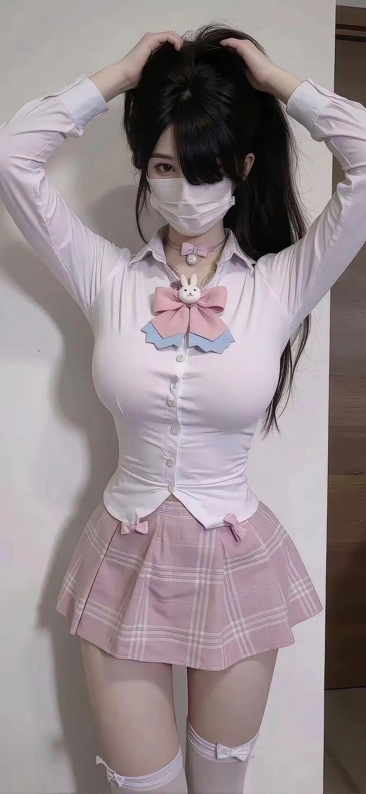
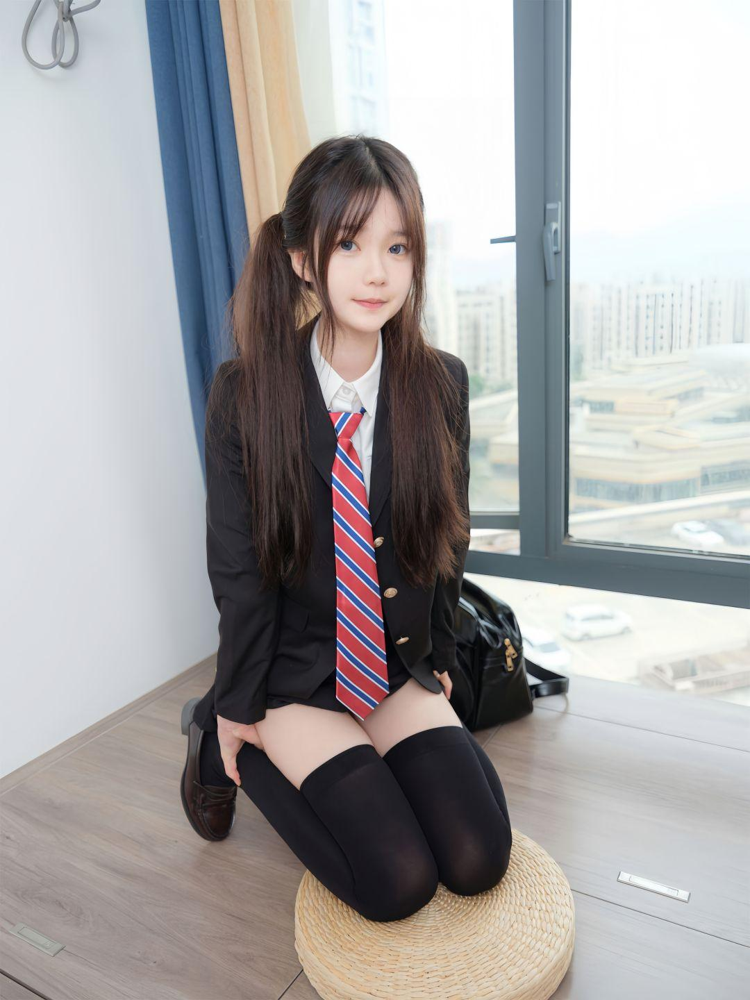

[toc]

# 问题

提问者：**<a href="https://www.zhihu.com/people/41-17-15-92-71">天清扬</a>**
提问时间: 2025-8-24 12:20:40
总回答数: 164
总访问量: 496955

身材好的美女，是不是都喜欢展示自己，都喜欢把自己打扮的漂漂亮亮的。

# 回答

回答者： **<a href="https://www.zhihu.com/people/oqsxtrk">小噜噜宝宝</a>**
回答时间: 2026-9-8 13:8:52
点赞总数: 49
评论总数: 1
收藏总数: 86
喜欢总数：9

因为穿上紧身衣服会显得身材比例更好呀，更好地勾勒身材曲线。

后续持续分享美图：[https://blogs.951u.cn/](https://blogs.951u.cn/)

  

  

  

  

原文地址：[(小噜噜宝宝)为什么身材好的美女喜欢穿紧身的衣服?](https://www.zhihu.com/question/1942924254661293368/answer/2080643776196896435) 

# 评论

1. <a href="https://www.zhihu.com/people/zhu-zhu-liang-27">山楂树</a> (<small title="江苏">2026-9-9 0:43:17</small>): 紧身衣显身材的前提是要有个好身材。

=[评论](./attachments/comments.json)

