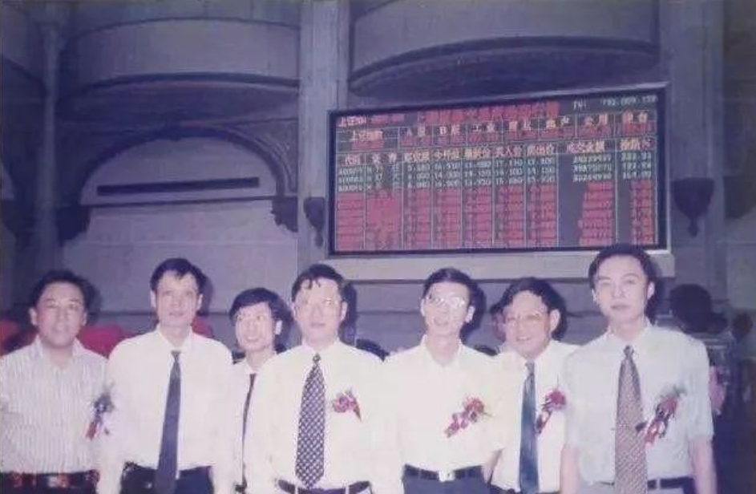
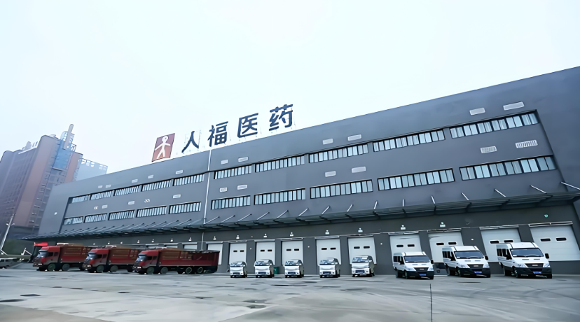

[toc]

# 问题

提问者：**<a href="https://www.zhihu.com/people/bret-90">Bret</a>**
提问时间: 2026-8-7 13:28:13
总回答数: 24
总访问量: 403329

8 月 4 日，一则消息在资本圈传开：湖北前首富、武汉当代集团董事长艾路明，已被武汉市公安局以涉嫌非法吸收公众存款罪刑事拘留，羁押于武汉市第二看守所。

从武汉大学哲学系博士、师从董辅礽的高材生，到坐拥千亿资产的湖北首富，再到铁窗内的犯罪嫌疑人——艾路明用三十多年搭建的资本帝国，在他 68 岁这一年轰然倒塌。

而他的故事，远比 " 首富落马 " 这四个字复杂得多。

从 2000 元到 800 亿

艾路明的履历，放在中国商界算得上独特。1957 年生于武汉，外公参加过武昌起义，他自己是武汉大学哲学系本硕、经济学博士，师从著名经济学家董辅礽。一个学哲学的人，后来成了湖北最大的民营资本集团的掌舵人。

1990 年代，艾路明以 2000 元起家，从校办工厂起步，逐步搭建起横跨生物医药、房地产、金融、文化等多领域的 " 当代系 "。巅峰时期，当代集团参股天风证券，通过股权链条间接控股天乾资管，参控股数百家企业，资产规模逼近千亿，入选民企 500 强。他被称为 " 哲商 " ——既有哲学家的思辨，又有商人的精明。但思辨和精明，都没能帮他躲过这场资本寒冬。

债务爆雷、股东违规、子公司巨亏

  

当代集团的崩塌，是三条线同时断裂的结果。

第一条线：非法集资。 当代科技旗下天盈投资、天乾资管等平台，向公众发售未经备案的高息理财与定向融资产品。债务爆雷后，投资人报案，最终以 " 非法吸收公众存款罪 " 立案。这是艾路明被刑拘的直接原因。

第二条线：违规占用上市公司资金。 2020 年至 2022 年，当代集团作为天风证券第一大股东，长期滥用股东权利，向天风证券多次提出资金需求，违规获取大额融资。三年间，天风证券通过自有资金、客户资产、私募产品、债券逆回购等多种途径，累计为当代集团输血 55.02 亿元，尚有 2.49 亿元未收回。今年 7 月，艾路明被罚款 500 万元，终身证券市场禁入。

第三条线：子公司天乾资管巨亏。 作为当代集团金融板块的核心，天乾资管 2025 年累计逾期债务达 35.05 亿元。2025 年全年营业收入仅 173.65 万元，同比下滑 98.56%；归母净利润巨亏 58.73 亿元。一家资产管理公司，营收不到 200 万，亏损 58 亿——资产质量已经彻底崩盘。

三条线同时断裂，再大的帝国也撑不住。2024 年 9 月，当代集团被申请破产重整，涉及债务超 800 亿元、债权人 1100 余家，其中普通债权规模高达 711.54 亿元。

招商创科 118 亿接盘，信达参与纾困

当代集团倒下后，接盘者陆续入场。2025 年 4 月，招商创科投入 118 亿元作为重整投资人入局，普通债权组以 70.95% 的债权占比惊险通过。中国信达也通过旗下平台参与纾困，收购人福医药股权后完成权益划转，助力宜昌产投巩固控制权。

表面上看，这是一场 " 国企接盘、AMC 纾困 " 的胜利。但仔细想想，问题没那么简单。招商创科花 118 亿拿下的，是一个债务超 800 亿、核心资产大幅缩水的烂摊子。中国信达参与纾困，意味着它也要承担当代集团风险出清的成本。

更值得关注的是天乾资管——一家地方 AMC，自己成了不良资产。当代集团倒下的同时，天乾资管的深层风险彻底暴露。一家本该帮别人化解风险的机构，自己先爆了雷。

当代集团的崩塌，留下的教训不只是 " 别搞非法集资 " 或 " 别违规占用上市公司资金 "。更深层的教训是：当一家企业的扩张完全依赖杠杆和关联交易时，一旦资金链断裂，整个体系就会像多米诺骨牌一样倒下。 艾路明从 2000 元起家到千亿帝国，用了三十年；从债务爆雷到身陷囹圄，只用了不到三年。

当代集团的故事讲完了，但艾路明在铁窗内的日子才刚刚开始。

而那些被当代集团拖垮的 1100 多家债权人、以及购买了天盈投资和天乾资管理财产品的普通投资人，他们的账，还没算完。

[突发！湖北前首富被刑拘](https://www.163.com/dy/article/L3JBHPMN05568W0A.html)

# 回答

回答者： **<a href="https://www.zhihu.com/people/chen6072118">小旋风财进</a>**
回答时间: 2026-8-12 11:11:5
点赞总数: 397
评论总数: 35
收藏总数: 232
喜欢总数：16

艾路明是个传奇人物，中国避孕套之父，长江漂流第一人，在厕所收尿赚的第一桶金，人福医药和杰士邦的前老板

A股几个资本运作高手都陨落了，中植系大佬已经4岁了，昨天系的大种马快出来了，德隆系也崩塌了，这个艾路明是当代系的话事人，曾经控股了几家知名公司，比如做避孕套的杰士邦，做麻醉药的人福医药，小券商天风证券。

江山代有才人出，一代人有一代人的镰刀，这群老登的玩法早就被时代淘汰了，现在科技新贵都是用算法合法收割，捎带搞出个爆款大模型，最骚90后资产已经超过王健林

艾路明1957年出生在武汉，外公是唐生智，著名的金陵守护神，民国一级上将，建国后官居从一品，导师是董辅礽，社科院经济所所长，能影响东大决策的学者。

但他也不是纨绔子弟，恢复高考前他当过搬运工，16岁插队，扛过麻袋，有着上层的人脉，还有底层干脏活的经历，同时有这两样东西，不成功都难。

1978年，恢复高考第二年，21岁的艾路明考入武汉大学哲学系。

80年代初武大哲学系大佬不少，陶德麟那一代还在，艾路明本硕连读，当过研究生会主席，后来跟董辅礽读经济学博士，还评了武大哲学学院博导。

读研期间，他从长江源头沱沱河出发，单人单艇漂流到武汉，花了两个半月。他说能活下来是个奇迹，对自然心生敬畏。

毕业后放弃湖北省委党校的铁饭碗，拉着六个武大校友，凑了2000块，创立武汉市洪山当代生化技术研究所

七个人里四个学生物的，所以选的赛道是生化，从尿里提尿激酶，可以做溶血栓原料药，卖给日本。

之前联合创始人张晓东在复旦做实验，碰见一个做尿激酶项目的博士，这玩意从男性小便提取，可以做成针剂治心梗、肺栓塞、脑梗溶栓。

别小看这个赛道，是有技术壁垒的，提纯工艺有讲究，日本当时缺原料，出口赚外汇，成本低现金流好，这种脏活没人愿意干，所以竞争不激烈

2000块半个月烧光，艾路明到洪山科技信用社贷了3.5万，信贷员上门考察，满屋子只有几只装尿的大缸，他说缸容易碎不能抵押，但看到七个研究生在认真的搅尿，还是放了款。

80年代末国内尿源差不多零成本，两人每天蹬个三轮，挨个公厕把装满尿的桶扛上车，运回机场河倒进大缸，加酸碱、盐析、沉淀，到凌晨抽滤冻干，得到黄褐色粗品，装瓶出口，武汉的公厕被这帮武大研究生包圆了。

尿激酶是他们的现金奶牛业务，开始拓展新业务

比如植物生长激素赤霉素，工业辅料原子灰油漆底层腻子，拿了国家火炬计划500万项目贷款扩产。

到1993年初，当代所资产数百万，三条腿走路。

以当代所为骨干，联合中国人福新技术开发中心，发起设立武汉当代高科技产业股份有限公司，从研究所变股份公司，人福医药的前身。

当时《公司法》还没出，靠的是东湖高新区武汉中关村的政策红利，赶上开发区改制窗口

1996年当代科技兼并武汉扬子江生物化学制药厂，拿下尿激酶临床针剂生产批号，开始搞婴儿诊断试剂。

跟计生委系统搭上线，孵化出避孕药和避孕套

1997年，当代科技在上交所挂牌，发行时简称当代科技，四个月后改名人福科技，后来又改成人福医药，从创业到上市，花了九年时间，人福医药是湖北第一家民营高科技上市公司

当代系从此多了一个融资平台

人福上市是一个分水岭，在此之前艾路明是搞实业的，之后他开始觉得自己是做资本的。企业家的务实精神从这一刻起被慢慢稀释，这也是A股很多老板的通病。

上市头几年人福开始搞多元化，原子灰、赤霉素、环保、房地产、计生用药，精细化工四面开花。

后来艾路明注销广州人合，剥离系统工程分公司，退出精细化工，把方向锁定在医药和环保，这部战略转型非常关键

90年代末很多药企在仿制药红海里卷价格，他挑了麻醉药这个小众赛道，需要有管制牌照定点生产，不进集采，但属于医院的刚需，毛利很高是个好生意。

用民营化改制吃下快破产的湖北宜药集团，1999年底改组成宜昌人福，当时宜药亏上千万银行断贷，存量200多个批文里团队挑中麻醉药方向，放弃VC原料药和房地产业务，押宝芬太尼

他赌对了

1999年麻醉药销量567万支，扭亏为盈，2000年还清欠债

去年宜昌人福营收88.10亿，净利润27.48亿，中枢神经板块毛利率86.32%，国内麻醉药整体市占率60%

后面招商局接盘，看中的也是这块牌照

杰士邦是从人福孵化出来的，国内第一个公开打广告的安全套品牌，广告语无忧无虑的爱，力压杜蕾斯

2006年人福现金流吃紧，多元化摊薄了利润，艾路明辞任董事长，交棒王学海，把杰士邦70%股权以1.37亿元卖给澳洲安思尔，给出的理由是突出医药主业，实际上是抗不住了，只能过冬回血。

安思尔接手后做的不错，杰士邦估值涨了7倍，净资产翻了3倍

2017年安思尔战略调整，出售两性健康业务，艾路明联合中信资本接盘，41亿人民币把安思尔两性健康资产打包进新加坡乐福思集团。

1.37亿卖出，41亿买回，被股民骂大韭菜

因为艾路明曾因资金紧张把杰士邦卖了，希望有一天能收回，对自家创立的品牌有初恋情结

但是乐福思净利润只三四千万，毛利率60%，但净利率很低，安全套市场饱和，上游乳胶涨价，杜蕾斯都在收缩业务，杰士邦不值这个价

人福2018年因为减值亏损23.72亿

收购三年后又后悔了，2020年人福把乐福思40%股权作价2亿美元卖给高瓴、博裕和松柏，乐福思出表

艾路明手里的当代系已经从人福一家药企膨胀成一张网。

到2020年，他总资产破1000亿，参控股400多家公司，胡润榜上有名，在阿拉善SEE当会长

当代系的核心资产包括人福医药、三特索道、当代明诚、天风证券

艾路明2015年放手让年轻人管，周汉生、余磊、陈海淳轮番接班，他自己去阿拉善种树。

艾路明退场，分封诸侯，是当代系由盛转衰的拐点

版图铺开要有钱，艾路明的融资手段挺多

人福、三特、明诚三家A股平台，股权质押给券商信托，反复滚动，质押率很高

当代集团发中票、公司债、私募债

天风证券作为关联方，通过自有资金、客户资产、私募产品、债券逆回购给当代集团输血

天乾资管、天盈投资在金交所挂未经备案的高息定融，承诺保本刚兑，近4000名自然人认购，几十亿规模

吸上市公司血是最脏的一招，人福医药2020至2022年3月，当代集团非经营性占用资金累计127.85亿元，光是2021年一年就占用81.79亿，占当年净资产62.97%

通过合作单位借款、代垫税费、买关联方16.45亿房产等手段走账，年报虚假记载。

三特索道2019到2022年关联方占用资金累计约42.02亿元，日最高余额5.05亿，2020年报重大遗漏。

天风证券违规拆借55.02亿元，加上私募通道全口径超85亿

天乾、天盈定融逾期57亿，投资人报案

靠三条上市公司通道和影子银行池，四年抽走220亿，宜昌人福一年赚27亿，全填进去都不够利息，这是把A股当取款机

杠杆游戏能玩下去，前提是借新能还旧，资产能涨价，2021年地产收紧，资管新规落地，信用债取消刚性兑付，当代系短债长投的期限错配裸奔出场

2022年，19汉当科MTN001的5亿本金实质违约，触发交叉违约，旗下理财产品全面逾期

武汉中院受理当代集团破产重整，确认债权806亿，债权人1127家

2025年招商局旗下招商创科118亿入局，人福医药股权过户，实控人变成招商局

武汉警方以涉嫌非法吸收公众存款罪刑事拘留艾路明，‌非吸有四个要件，包括未经批准、公开宣传、承诺保本付息、向不特定公众吸收资金。

掏空上市公司，骗散户钱，割韭菜还是有代价的

  

原文地址：[(小旋风财进)如何看待湖北前首富艾路明被抓，他为何走到这一步？](https://www.zhihu.com/question/2069052234424215547/answer/2070829659990783815) 

# 评论

1. <a href="https://www.zhihu.com/people/zhao-yong-57-34">赵勇</a> (<small title="湖北">2026-8-12 12:34:21</small>): 90年代末大学校园宿舍楼厕所里摆的尿桶原来是他的
   - <a href="https://www.zhihu.com/people/tang-xi-hu-13">糖稀糊</a> (<small title="四川">2026-8-12 14:20:25</small>): 社会公厕也到处是。坐标成都。
   - <a href="https://www.zhihu.com/people/nu-tao-56-25">駑濤</a> (<small title="广东">2026-8-12 14:36:19</small>): 90年代末还有搞这个的？
   - <a href="https://www.zhihu.com/people/sha-du-bu-dong-64">啥都不懂</a> (<small title="湖南">2026-8-12 14:55:55</small>): 那时候他早不做这种低端的了
   - <a href="https://www.zhihu.com/people/93-86-75-50">老拜登</a> (<small title="浙江">2026-8-12 17:33:17</small>): 那是别人在做吧。
2. <a href="https://www.zhihu.com/people/lao-ying-13-81">老鹰</a> (<small title="浙江">2026-8-12 12:25:12</small>): 搞实体的确厉害，由实转虚就变成金融游戏了
3. <a href="https://www.zhihu.com/people/ni-shi-dou-bi-ma-76">你是逗比吗</a> (<small title="湖南">2026-8-12 12:36:54</small>): 真的有人收尿，之前在高速服务区看到禁止收集尿液的牌子我还觉得搞笑
   - <a href="https://www.zhihu.com/people/6-57-73-90">被强制改名3次</a> (<small title="河南">2026-8-12 14:11:31</small>): 我就说我知道的，尿激酶，人尿激肽原酶，乌司他丁，这些针剂原料全是人尿，不过早不收集了，用的是更高效的手段，只吸附尿液中有用成分
   - <a href="https://www.zhihu.com/people/wenyimang">文一氓</a> (<small title="河南">2026-8-12 15:27:47</small>): 现在农村都有人收
   - <a href="https://www.zhihu.com/people/xiang-xiang-68-34">相相</a> (<small title="回复于 2026-8-12 15:33:23/河南"> ✉️:文一氓</small>): 没是吧
4. <a href="https://www.zhihu.com/people/aaron-90-88-56">错觉</a> (<small title="湖北">2026-8-12 12:14:35</small>): 肖建华他老婆不是红三吗？是怎么允许他生那么多孩子的？［大笑］
   - **小旋风财进** (<small title="浙江">2026-8-12 12:43:35</small>): 翅膀硬了
   - <a href="https://www.zhihu.com/people/xiao-huo-50-62">小火</a> (<small title="山东">2026-8-12 12:46:14</small>): 肖发家就在内蒙
   - <a href="https://www.zhihu.com/people/lin-bin-53-68">虎纠牌万金油</a> (<small title="福建">2026-8-12 17:14:37</small>): 多少孩子
5. <a href="https://www.zhihu.com/people/taozilaoshi">陶子教授经营管理</a> (<small title="上海">2026-8-12 15:37:27</small>): 写得好。上市那一年开始，就忘了企业家初心了，开始所谓更高级的资本运作，最终坠入泥潭！买一盒杰士邦，支持一下民企吧！
6. <a href="https://www.zhihu.com/people/shan-da-wang-54">山大王</a> (<small title="重庆">2026-8-12 16:31:4</small>): 靠，我一直以为杰士邦是国外品牌，竟然是国产的！
   - <a href="https://www.zhihu.com/people/jinhsu">夜空晴</a> (<small title="重庆">2026-8-12 18:27:38</small>): 帮，杰士帮［看看你］
7. <a href="https://www.zhihu.com/people/60-81-73-24-29">捏您</a> (<small title="湖北">2026-8-12 17:0:52</small>): 南京大屠杀就是因唐生智弃城逃跑造成的……
   - <a href="https://www.zhihu.com/people/mei-shi-xia-wan">没事瞎玩</a> (<small title="北京">2026-8-12 17:50:30</small>): 唐生智一个人哪能背的动那么大一口锅［吃瓜］
   - <a href="https://www.zhihu.com/people/xiao-bing-btx">小兵btx</a> (<small title="上海">2026-8-12 18:0:7</small>): 所以还得活着啊！  
 
再大的问题，等哪天后代发达了就可以洗干净了［捂嘴］  
 
也可以这么说:  
 
洪承畴\_著名的松山城守护神
   - <a href="https://www.zhihu.com/people/he-min-57-8">麻婆豆腐</a> (<small title="回复于 2026-8-12 18:35:31/福建"> ✉️:没事瞎玩</small>): 他背30%以上的锅没问题
   - <a href="https://www.zhihu.com/people/Xiongzheng">嘻呀嘻哈哈</a> (<small title="湖北">2026-8-12 18:36:23</small>): 他还没到可以背这个锅的级别
8. <a href="https://www.zhihu.com/people/gao-da-quan-32">高大全</a> (<small title="江苏">2026-8-12 14:24:39</small>): 难怪924天风证券是妖股［捂脸］
9. <a href="https://www.zhihu.com/people/yi-bu-li-si-80">伊布里斯</a> (<small title="浙江">2026-8-12 15:6:35</small>): 哎，纵横商场半个世纪，一代豪杰落幕了。
10. <a href="https://www.zhihu.com/people/sishiduhei">四十度黑</a> (<small title="山东">2026-8-12 16:59:1</small>): 搞实业也确实下功夫了
11. <a href="https://www.zhihu.com/people/ni-fang-liu">倪方六</a> (<small title="河南">2026-8-12 13:17:29</small>): 李达不是1966就去世了吗
12. <a href="https://www.zhihu.com/people/qu-xiao-yu-28">名字很重要么</a> (<small title="浙江">2026-8-12 17:51:12</small>): 芬太尼大佬啊
13. <a href="https://www.zhihu.com/people/ba-di-2-12">巴蒂</a> (<small title="北京">2026-8-12 17:18:57</small>): 外公唐生智，这个确实牛逼
14. <a href="https://www.zhihu.com/people/yu-qiang-51-27">沙发土豆</a> (<small title="上海">2026-8-12 14:55:23</small>): ［赞同］［赞同］［赞同］
15. <a href="https://www.zhihu.com/people/wind-31-13-82">cloud</a> (<small title="湖北">2026-8-12 17:9:0</small>): 人福医药摘帽后股价能上20么，想现在上车［思考］
16. <a href="https://www.zhihu.com/people/69-82-56-17">当日点赞已达上限</a> (<small title="广东">2026-8-12 18:53:44</small>): 原来是唐生智的后代
17. <a href="https://www.zhihu.com/people/hellomoto-96">hellomoto</a> (<small title="山东">2026-8-12 14:46:23</small>): 肖的老婆周是什么背景啊，和云 布有关系？
18. <a href="https://www.zhihu.com/people/4-73-66-40">高高</a> (<small title="湖北">2026-8-12 17:30:20</small>): 我这个村前一两年人福医药刚投产
19. <a href="https://www.zhihu.com/people/nu-tao-56-25">駑濤</a> (<small title="广东">2026-8-12 14:35:16</small>): 败仗将军唐生智［大笑］
    - <a href="https://www.zhihu.com/people/zhie14l1kh4">福特汽车</a> (<small title="四川">2026-8-12 16:39:3</small>): 杀人放火金腰带

=[评论](./attachments/comments.json)

