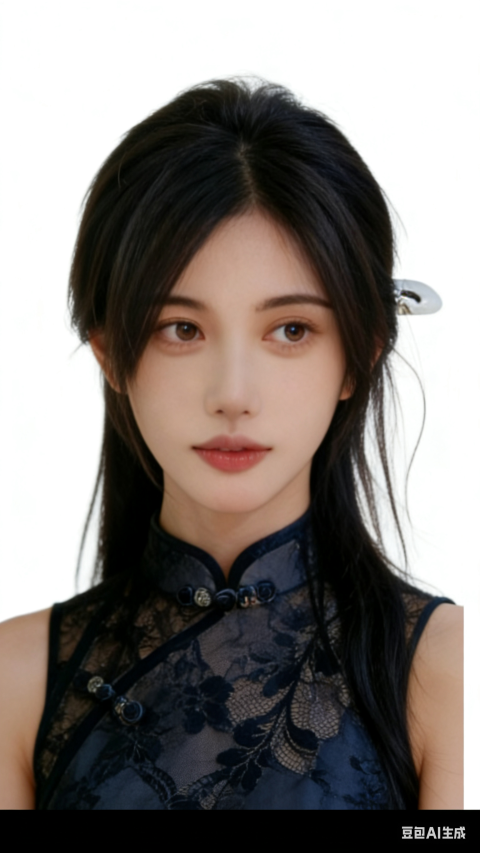
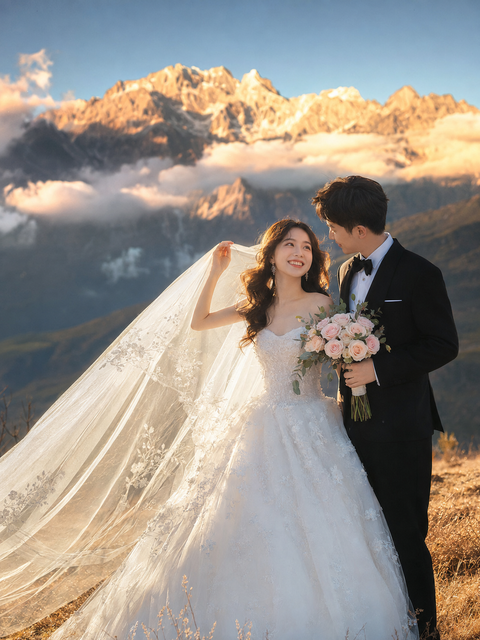

[toc]

# 问题

提问者：**<a href="https://www.zhihu.com/people/tn2049">T2049</a>**
提问时间: 2023-6-13 18:48:38
总回答数: 162
总访问量: 1755348

每人限答一张

# 回答

回答者： **<a href="https://www.zhihu.com/people/zheng-yu-86-37">小行星坠落</a>**
回答时间: 2026-8-6 2:8:22
点赞总数: 45
评论总数: 3
收藏总数: 97
喜欢总数：7

找一张你跟你对象的合影，没对象就用刘亦菲或者彭于晏代替。

发给AI，然后输入提示词：

主体与造型：人物：25-30岁的中国年轻情侣，新娘妆容精致、留着波浪卷发，新郎发型可保持原图-服装：新娘为无肩带白色蕾丝蓬蓬婚纱，搭配长款刺绣头纱；新郎为黑色定制西装、白色衬衫，系黑色领结 -道具：15朵浅粉色玫瑰搭配绿叶组成的手捧花

2.场景与背景地点：中国云南大理苍山 - 氛围：日出“金山”效果（山峰笼罩在温暖的金色晨光 中），山间云雾缭绕，天空澄澈湛蓝 - 前景：枯黄的草坡（自然户外地形）

3.动作与互动 姿势：自然亲昵的互动姿态：① 新娘单手轻撩头纱，笑容灿烂；② 新郎手持手捧花，温柔凝望新娘；③ 头纱随风飘动（具动态感）-表情：真实幸福的神态，眼神轻柔交汇

4. 摄影专业参数

设备：佳能EOS R5全画幅相机，85mm f/1.8定焦镜

\-光线：日出黄金时段光线，柔和逆光（轮廓光勾勒情侣身形），5500K暖色调色温，阴影柔和

\-构图：三分法构图（情侣置于画面右侧1/3区域），竖版构图

\-画质：8K分辨率、超高清细节，带35mm胶片颗粒质感，情侣主体对焦清晰，背景呈虚化散景效果，人物比例3:4

帮我生成八张不同角度的照片

  

原文地址：[(小行星坠落)你见过AI生成最美的妹子是啥样的？](https://www.zhihu.com/question/606421644/answer/2068518753697116333) 

# 评论

1. <a href="https://www.zhihu.com/people/sopp2000">搭配芙芙食用</a> (<small title="上海">2026-8-6 18:57:33</small>): 
2. <a href="https://www.zhihu.com/people/ha-ha-ha-ha-26-97-90">哈哈哈哈</a> (<small title="北京">2026-8-7 15:26:34</small>): 
3. <a href="https://www.zhihu.com/people/qi-shui-bing">汽水冰</a> (<small title="上海">2026-8-7 10:47:44</small>): 可以啊，焚诀收藏了

=[评论](./attachments/comments.json)

