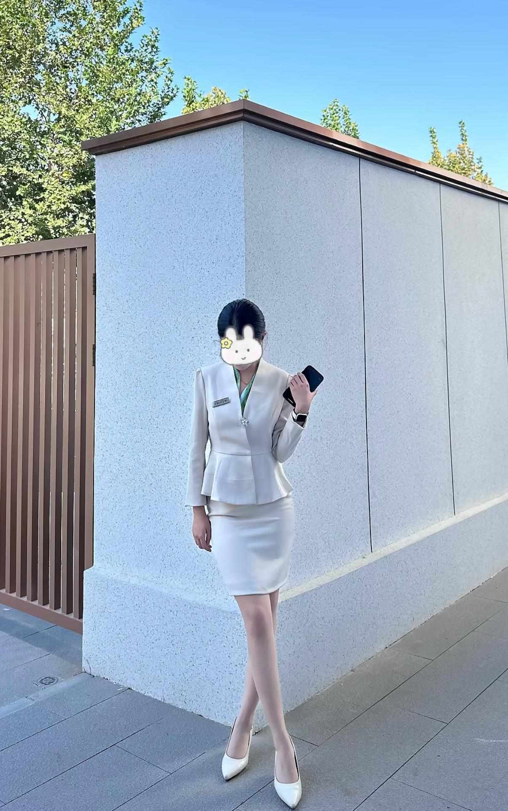

[toc]

# 问题

提问者：**<a href="https://www.zhihu.com/people/">匿名用户</a>**
提问时间: 2018-3-6 20:29:27
总回答数: 997
总访问量: 54584452

韩国女团比较出名的都是腿型很美的，那怎样的腿才是完美的呢？可参考自己或女团腿型做分析

# 回答

回答者： **<a href="https://www.zhihu.com/people/laitmw-31">小贝今天开心吗</a>**
回答时间: 2026-7-26 20:15:17
点赞总数: 126
评论总数: 8
收藏总数: 109
喜欢总数：9

就是长细直吧，我们这的女孩子大部分腿都很好看，穿上高跟鞋就显得腿更修长了，视觉效果腿长一米八，我觉得大腿肉一点小腿细一点会更好

  

原文地址：[(小贝今天开心吗)什么样的腿才是完美腿型？](https://www.zhihu.com/question/268305510/answer/2064806019625235551) 

# 评论

1. <a href="https://www.zhihu.com/people/yu-zhong-man-bu-84-81">若一</a> (<small title="河南">2026-7-26 22:54:16</small>): 这么高没，，1.75以上吗？
2. <a href="https://www.zhihu.com/people/bie-zuo-tian">别昨天</a> (<small title="湖北">2026-7-27 7:23:3</small>): 哪里 我找时间来看看
3. <a href="https://www.zhihu.com/people/gu-dao-xuan-meng">孤岛春梦</a> (<small title="海南">2026-7-30 17:21:18</small>): 脚比头大这么多的，一律视为修图
4. <a href="https://www.zhihu.com/people/hu-hao-26-76">一晌贪欢de梦客</a> (<small title="贵州">2026-7-29 12:45:30</small>): 如果没修图的话，你这个下身比例和腿长确实比较逆天［吃瓜］
5. <a href="https://www.zhihu.com/people/zi-you-93-48">自游</a> (<small title="浙江">2026-7-28 15:8:12</small>): 祝大麦
6. <a href="https://www.zhihu.com/people/pi-dan-17-76">活不起的小毛</a> (<small title="浙江">2026-7-27 23:15:32</small>): 确实比较直
7. <a href="https://www.zhihu.com/people/cwdjb">Cwdjb</a> (<small title="江苏">2026-7-27 21:16:26</small>): ［吃瓜］ 
8. <a href="https://www.zhihu.com/people/xss31415926">AIAYN</a> (<small title="上海">2026-7-27 18:17:23</small>): 师傅，你是做什么工作的

=[评论](./attachments/comments.json)

