[toc]

# 问题

提问者：**<a href="https://www.zhihu.com/people/xu-wu-yan-99">失眠的熊猫</a>**
提问时间: 2024-5-31 18:41:47
总回答数: 0
总访问量: 0

如题所示

# 回答

回答者： **<a href="https://www.zhihu.com/people/18-44-50-19">巧克力豆</a>**
回答时间: 2026-7-18 19:45:17
点赞总数: 2107
评论总数: 346
收藏总数: 174
喜欢总数：43

我告诉大家一个残酷的真相，在座的各位，包括各位的孩子，99%一辈子每个月平均下来就是一个月几千块的工资勉强度日，临到退休也不会混上哪怕一个小组长的位置，你们的一辈子跟事业两个字毫无关系，小时候过快乐教育还是中式教育，对你们的一辈子生活质量来说，并没有什么太大关系。

  

原文地址：[(巧克力豆)你愿意让你的孩子接受美国那种所谓的“快乐教育”吗？](https://www.zhihu.com/question/657776730/answer/2061899366655342064) 

# 评论

1. <a href="https://www.zhihu.com/people/zong-you-yi-si-16">总有一死</a> (<small title="甘肃">2026-7-18 22:3:7</small>): 这样的实话大部分人不喜欢听［捂脸］
   - <a href="https://www.zhihu.com/people/arche-43-98">Arche</a> (<small title="上海">2026-7-19 12:48:44</small>): 实话在哪?［大笑］99%的人不会成为小组长，意味着一个小组长平均管99个人，你觉得符合自己的日常生活经验吗？实际上每十个孩子未来就能出一个通常意义上混得不错的人了。
   - **巧克力豆** (<small title="回复于 2026-7-19 13:53:43/广东"> ✉️:Arche</small>): 想多了，大部分人就是灵活就业，外卖快递出租车加上小摊小店。
   - <a href="https://www.zhihu.com/people/36-17-83-62">我在荒岛迎接黎明</a> (<small title="回复于 2026-7-19 14:31:1/广东"> ✉️:Arche</small>): 你哪怕自己去搜一灵活就业的人口比例呢［尴尬］
   - <a href="https://www.zhihu.com/people/dddterminal">朱自清</a> (<small title="回复于 2026-7-19 14:53:7/浙江"> ✉️:Arche</small>): 中国就业人口8亿，灵活就业3.2亿，剩下的80%是小微企业，户均员工4个不到，你要不再算算实际公司里面能有小组长的就业人口数量？
   - <a href="https://www.zhihu.com/people/jiang-zhen-hua-64-69">图变</a> (<small title="广东">2026-7-19 16:28:5</small>): 实话听不得 大部分人喜欢活在空中楼阁里［捂脸］
   - <a href="https://www.zhihu.com/people/check-42-66">Check</a> (<small title="回复于 2026-7-19 19:24:53/山东"> ✉️:Arche</small>): 你在混淆概念，谁告诉你所有人都属于小组里了？
   - <a href="https://www.zhihu.com/people/65-86-51-93">浅墨</a> (<small title="重庆">2026-7-19 21:34:13</small>): 既然读不读书都一样，那请问为什么名牌大学出来的，就是比初高中，中转出来的混得好呢？
 
同一所学校，学霸和学渣混得一样，是吗？
   - <a href="https://www.zhihu.com/people/zong-you-yi-si-16">总有一死</a> (<small title="回复于 2026-7-19 21:37:19/北京"> ✉️:浅墨</small>): 名牌大学生长生不死对吗？  
 
大学生也长生不死对吗
   - <a href="https://www.zhihu.com/people/65-86-51-93">浅墨</a> (<small title="回复于 2026-7-19 21:46:0/重庆"> ✉️:总有一死</small>): 对对对，人都是要死的，所以学习干嘛呢，奋斗干嘛呢。
 
  
 
从小快乐就对了，长大了还可以吸嗨继续快乐，等身体彻底扛不住了，那死就死呗，反正这一辈子是快乐过了。
 
  
 
这就是你们想追求的人生吗？难怪你们向往西方呢，照这么看，西方的确是天堂啊。
   - <a href="https://www.zhihu.com/people/shui-wu-yue-zhi-hai">水无月之海</a> (<small title="回复于 2026-7-19 23:4:50/上海"> ✉️:浅墨</small>): 吸嗨会快乐但身体也会扛不住，衡水式教育不会快乐但身体照样扛不住
   - <a href="https://www.zhihu.com/people/wei-guo-67-28">夜幕之下</a> (<small title="广东">2026-7-19 23:11:51</small>): 无论是卷出来的，还是快乐出来的，只要家庭没有掌握核心的生产资料或巨额财富，绝大多数人最终都会不可避免地迎来“均值回归”——成为一个拿着平均薪水、为生计奔波的普通人。
   - <a href="https://www.zhihu.com/people/65-86-51-93">浅墨</a> (<small title="回复于 2026-7-19 23:12:0/重庆"> ✉️:水无月之海</small>): 你不喜欢衡水模式，你完全可以躺平啊，谁阻止你们了。
 
  
 
但你们的问题是，即想要快乐教育的快乐，又想要衡水模式的效果，这就很难了。
   - <a href="https://www.zhihu.com/people/ling-qiang-93-18">倭王</a> (<small title="回复于 2026-7-20 0:21:16/广东"> ✉️:巧克力豆</small>): 我发现你是真的错 我小时候的生活就是种地 种地 再种地 一辈子估计都是面朝黄土背朝天 这不是工业化来了 直接飞升成工业人了
   - <a href="https://www.zhihu.com/people/sephirotic-ai">Sephirotic AI</a> (<small title="回复于 2026-7-20 3:22:25/北京"> ✉️:Arche</small>): 多大了？［捂嘴］
   - <a href="https://www.zhihu.com/people/ku-xiang-82">枯巷</a> (<small title="回复于 2026-7-20 5:0:10/天津"> ✉️:浅墨</small>): 首先绝大多数人是考不上名牌大学的，而且时代也变了跟以前不一样，以前还包分配呢，读书改变命运现在也还是会有，但也越来越少了，大部分人的一生就是普普通通的，变化不大
   - <a href="https://www.zhihu.com/people/li-qiu-ju-15966425730">李秋菊</a> (<small title="回复于 2026-7-20 7:40:33/山东"> ✉️:Arche</small>): 我觉得是每个人都会在自己所在的层级停留，这个层级就是你是前20%，你换一个城市或者行业你也在那个城市的前20%，而你所停留的层级也很大一部分取决你的先天因素，智力和情商，靠家长鸡上去的早晚会掉到'自己原本所在的层级，家庭条件极好的不算，自己卷上去的只要一直卷，也可以。自驱不够靠外驱，外驱一旦停止容易走下坡路
   - <a href="https://www.zhihu.com/people/zong-you-yi-si-16">总有一死</a> (<small title="回复于 2026-7-20 8:18:23/北京"> ✉️:夜幕之下</small>): 是的
   - <a href="https://www.zhihu.com/people/shu-xie-wei-12">白水鉴心</a> (<small title="回复于 2026-7-20 8:32:13/浙江"> ✉️:浅墨</small>): 你自己努力上名牌学校，或者掌握了一定的生产资料，给孩子带来更好的生活才是正解，比鸡娃有用多了［为难］
   - <a href="https://www.zhihu.com/people/zhi-xiong-79-87">灵犀一恨</a> (<small title="回复于 2026-7-20 9:28:13/福建"> ✉️:Arche</small>): 你就是属于大部分人的一员，首先就业有100%吗，这么会抬杠
   - <a href="https://www.zhihu.com/people/ha-shi-qi-98-17">撒泼sarkara</a> (<small title="回复于 2026-7-20 9:32:3/湖北"> ✉️:Arche</small>): 你认为大多数人都能进企业工作吗。我得提醒你，大部分地区中考分流掉的是50%，意思就是现在的年轻人里面大约50%只有初中学历。高考还会有一部分考大专都考不上，考上大专的又在考上大学的人数里面占大比例。正经大学生里面又是3本学院和2本大学占大多数。你现在还觉得大部分年轻人都能进企业做白领工作吗。
2. <a href="https://www.zhihu.com/people/frozen-85-60">1900</a> (<small title="山西">2026-7-19 2:10:20</small>): 大把的人年轻时不把自己的时间 自己的身体当作成本，省出来的那点积蓄最终贬值到连看病都不够，最后还是一无所有。  
 
绝大多数人要的并不是真相与事实，只是希望别人同意自己的一厢情愿罢了
   - <a href="https://www.zhihu.com/people/stian-ying-31">stian ying</a> (<small title="日本">2026-7-19 16:53:59</small>): 省出来的那点积蓄最终贬值到连看病都不够 那是制度的问题不是年轻人的问题［尴尬］
   - <a href="https://www.zhihu.com/people/cheng-kang-san-re-feng-shan-zhou-liu-feng-ji">展昭</a> (<small title="河南">2026-7-19 18:37:56</small>): 人生不满百，常怀千岁忧  
 
当下还没过好，就别担心明天了
   - <a href="https://www.zhihu.com/people/fang-ming-guang">无忧专利</a> (<small title="北京">2026-7-19 19:15:53</small>): 不是不想，是不能。
3. <a href="https://www.zhihu.com/people/BrianCorrigan05">Brian C</a> (<small title="美国">2026-7-19 2:29:17</small>): 正解，绝大部分的小孩，无论鸡娃不鸡娃，结果就是父母的所处阶层罢了。
   - <a href="https://www.zhihu.com/people/paulodybala-26">加油哈</a> (<small title="上海">2026-7-19 18:28:29</small>): 而且其实穷只是一方面，穷导致的思维方式还有习惯会实打实影响小孩子
   - <a href="https://www.zhihu.com/people/yang-yue-shan-14">濡需</a> (<small title="回复于 2026-7-19 20:9:23/广东"> ✉️:加油哈</small>): 所谓思维习惯也就唬唬穷人的，那些败家的富二代能有啥思维习惯，混吃等死反而是为家族作贡献
   - <a href="https://www.zhihu.com/people/garfield-3-70">727199</a> (<small title="北京">2026-7-19 20:59:54</small>): 全放养肯定不行，底线是要教育孩子逻辑学和基础的自然科学和历史。别搞内卷就行了。要不然活着老被别人坑
4. <a href="https://www.zhihu.com/people/zheng-tian-nan-50">justwe</a> (<small title="安徽">2026-7-19 14:2:32</small>): 惩罚型社会，上大学没好处，不上大学有坏处
   - <a href="https://www.zhihu.com/people/75-56-65-12">天朝柱石</a> (<small title="安徽">2026-7-19 22:12:32</small>): 对呀，那就算不上大学坏处更大，对普通人来说，这问题基本无解
   - <a href="https://www.zhihu.com/people/si-lan-bo-tu-si">灬蓝波兔灬</a> (<small title="回复于 2026-7-20 8:40:4/河北"> ✉️:天朝柱石</small>): 三本这种 只要不是真的 智商有问题 稍微花点心思都能考上 再不济还有专升本 但是读了专还能不能学好是个问题
   - <a href="https://www.zhihu.com/people/guan-jun-jie-82">知足常乐</a> (<small title="河南">2026-7-20 8:56:33</small>): 惩罚性社会，骂别人没好处，不骂别人显不出来自己独立思考
   - <a href="https://www.zhihu.com/people/wo-shi-yige-tian-cai-dou-bi">杨草</a> (<small title="山东">2026-7-20 9:21:3</small>): 你这种观点就是卷的原因，为什么上大学就是应该被奖励的？上不上大学本身不应该有主观色彩， 大学的常规资源应该由适合学习，适合科研的孩子去全职读，大学的其他资源应该用合适的方式全面开放，那些不适合学习，不适合科研的孩子在任何需要的时候都可以去大学找寻答案。大学本身应该发挥其知识资源仓库的功能，而不是区分人的高低贵贱。
5. <a href="https://www.zhihu.com/people/monogatari-15">monogatari</a> (<small title="河南">2026-7-19 6:38:48</small>): 妄想靠繁殖抽奖的父母一定会反对。等毕了业发现小孩一个月挣的不够人家资产活期利息就没脾气了
   - <a href="https://www.zhihu.com/people/guo-hang-chen-51">谈天说地</a> (<small title="广东">2026-7-19 17:10:34</small>): 一个小孩是一生的事情，几十年过去了，人生也走到头了，而且越老越固执，更加不可能说之前选择是错的
   - <a href="https://www.zhihu.com/people/--49-41-21-11"> 小天</a> (<small title="江苏">2026-7-19 19:13:33</small>): 靠繁殖抽奖的话，最应该做的不是鸡娃，而是多生小孩多抽奖
   - <a href="https://www.zhihu.com/people/kungfumao">痴鱼的猫</a> (<small title="广东">2026-7-20 8:45:31</small>): 不要小看抽奖，因为你会发现，就算是独生子，该没出息还是没出息。
6. <a href="https://www.zhihu.com/people/pa-la-ding-shu-shu">帕拉丁叔叔</a> (<small title="上海">2026-7-19 14:53:58</small>): 小时候快乐了，长大了吃苦。小时候吃苦，长大了一样吃苦，所以还是小时候能玩的时候好好玩吧
   - <a href="https://www.zhihu.com/people/92-72-32-72">大唐</a> (<small title="北京">2026-7-20 6:58:40</small>): 对，先苦不一定后甜，先甜才是真的甜。
7. <a href="https://www.zhihu.com/people/yi-ren-15-56">伊人</a> (<small title="江苏">2026-7-19 23:59:20</small>): 取决于你是坐在空调房里吧这几千块钱挣了，还是在车间里大汗淋漓的把这几千块挣了。  
 
我觉得跟生活质量的关系可太大了。  
 
上周我们这台风刚过，那几天三十多度，我去车间走一趟都一身汗，觉得呼吸都费劲。  
 
车间经常用到云母，玻璃丝带这玩意，我去车间自己上手的时候，不注意碰到那些玩意，晚上回到家手是又疼又痒。我问车间的他们平时不停接触这玩意，咋解决的，他们轻描淡写的来了句，习惯了。
   - <a href="https://www.zhihu.com/people/10-22-70-32-85">不忍心</a> (<small title="广东">2026-7-20 8:58:26</small>): 你没出过社会吧？在空调房里面挣几千块钱。轮得到你啊。你不下车间大汗淋漓，你连工作都不会有。
   - <a href="https://www.zhihu.com/people/yao-yuan-de-qing-cha">远方</a> (<small title="回复于 2026-7-20 9:18:20/山东"> ✉️:不忍心</small>): 所以读书是有用的 ［大笑］
   - <a href="https://www.zhihu.com/people/81-27-42-28-36">点个水</a> (<small title="江苏">2026-7-20 9:32:42</small>): 就算都读到大学，不还是有人要在车间里大汗淋漓嘛［捂脸］除非你把劳动保障做做好
8. <a href="https://www.zhihu.com/people/yang-xiao-jun-81-58">秋石</a> (<small title="福建">2026-7-18 23:56:28</small>): 我之前看说是，到最后大部分人一个月工资过不了1.5w
   - <a href="https://www.zhihu.com/people/yiminxinxilan">黑白双丝</a> (<small title="江苏">2026-7-19 3:43:48</small>): 哎，我在快摸到这个门槛时，非洲猪瘟+新冠的二连击，公司一直在降薪，这辈子估计无望了
   - <a href="https://www.zhihu.com/people/mtczou-a-zou">mtc走啊走</a> (<small title="河北">2026-7-19 5:10:41</small>): 五千都不少了［捂脸］
   - <a href="https://www.zhihu.com/people/qiaomuzz">谁记得住呢</a> (<small title="回复于 2026-7-19 9:52:13/天津"> ✉️:黑白双丝</small>): 我最高时到过1w3，以为到1w5就是个时间问题，然后covid了…［尴尬］
   - <a href="https://www.zhihu.com/people/bu-zhi-dao-13-24-76">不知道</a> (<small title="湖北">2026-7-19 11:11:40</small>): 说对了，大部分都是螺丝钉，说失业就失业［doge］
   - <a href="https://www.zhihu.com/people/sdsaddsa-20">momo</a> (<small title="上海">2026-7-19 12:3:44</small>): ［doge］上海的中位数应该是7千多。所以你说的是对的
   - <a href="https://www.zhihu.com/people/wu-shi-81-67">匿名拥有者</a> (<small title="广东">2026-7-19 14:46:55</small>): 四五线的工作基本就是四五千
   - <a href="https://www.zhihu.com/people/GoldfishStreet">绝命导师</a> (<small title="回复于 2026-7-19 16:2:48/四川"> ✉️:匿名拥有者</small>): 4 5千都没 我这都是2 3千的普遍
   - <a href="https://www.zhihu.com/people/skyam44">skyam44</a> (<small title="北京">2026-7-19 17:18:38</small>): 你这标准也太高了
   - <a href="https://www.zhihu.com/people/tu-bo-shu-45-58">土拨鼠</a> (<small title="广东">2026-7-19 17:49:16</small>): 月薪5000就是全国工资中位数了。
   - <a href="https://www.zhihu.com/people/liu-ha-14">刘哈</a> (<small title="湖南">2026-7-19 18:32:51</small>): 你这是上行期it类专业的标准
   - <a href="https://www.zhihu.com/people/youho-47">youho</a> (<small title="回复于 2026-7-19 19:3:0/日本"> ✉️:绝命导师</small>): 我去年回老家辽宁5线小城市看了看工作，也是2500-3000，就放弃了［捂脸］
   - <a href="https://www.zhihu.com/people/GoldfishStreet">绝命导师</a> (<small title="回复于 2026-7-19 19:44:48/四川"> ✉️:youho</small>): 辽宁？？上次认识个网友说那里还有1000多的 正经工作只有编制 太可怕了
   - <a href="https://www.zhihu.com/people/yang-xiao-jun-81-58">秋石</a> (<small title="回复于 2026-7-19 19:51:0/福建"> ✉️:刘哈</small>): 没有说清楚。大部分人工作一辈子，即使有加薪，到最后，年收入大概最后也就落在10-20万。一篇调查文章，好几年前了
   - <a href="https://www.zhihu.com/people/youho-47">youho</a> (<small title="回复于 2026-7-19 19:55:36/日本"> ✉️:绝命导师</small>): 是真的［捂脸］我弟媳妇就是一个月1500，社区工作，有双休，不是编制是合同工，但是待遇一样，也给交保险
   - <a href="https://www.zhihu.com/people/GoldfishStreet">绝命导师</a> (<small title="回复于 2026-7-19 20:0:35/四川"> ✉️:youho</small>): 应该物价低吧
   - <a href="https://www.zhihu.com/people/youho-47">youho</a> (<small title="回复于 2026-7-19 20:5:34/日本"> ✉️:绝命导师</small>): 那也并不。。
   - <a href="https://www.zhihu.com/people/jie-pan-xia-29">割鹿</a> (<small title="回复于 2026-7-19 20:41:57/广东"> ✉️:mtc走啊走</small>): 最低社保基数都接近五千了，社保基数是平均工资的六成，五千还是算低工资
   - <a href="https://www.zhihu.com/people/xin-zheng-tu-75-57">新征途</a> (<small title="河北">2026-7-20 7:42:52</small>): 看来你是太年轻了，完全不知道什么叫通货膨胀  
 
我小时候的梦想是每月能挣2000块钱工资（那时候普遍工资才四五百），这个梦想工作没几年就实现了，可依然没有感到成功
   - <a href="https://www.zhihu.com/people/yang-xi-9-67">杨曦</a> (<small title="浙江">2026-7-20 8:22:39</small>): 过万都很难，我卡在八九千五六年了。就是没法过万
   - <a href="https://www.zhihu.com/people/bu-zhi-67-71-50">码码</a> (<small title="广西">2026-7-20 8:49:23</small>): 天天调侃月薪三千，实际上连三千都没有［大哭］
   - <a href="https://www.zhihu.com/people/57-73-94-1-14">丰氚祥子</a> (<small title="重庆">2026-7-20 9:14:45</small>): 过了30岁其实99%的人地位就到头了，以后能不能生上去和买彩票差不多
9. <a href="https://www.zhihu.com/people/yan-wen-da-50">本名在网上是危险</a> (<small title="云南">2026-7-19 15:2:13</small>): 问题是哪怕是你嘴里的这种日子 不弄中式教育你都过不上  
 
因为过于残酷。。。。一时间我都不知道该如何说［捂脸］
   - <a href="https://www.zhihu.com/people/yuwutingyuan">雨雾</a> (<small title="浙江">2026-7-20 4:50:45</small>): ［大笑］有那么残酷吗？拆迁户初中毕业都比你过得好
   - <a href="https://www.zhihu.com/people/zhu-hao-ran-72-59">朱傲天</a> (<small title="北京">2026-7-20 9:22:51</small>): 额，他是按照比例的根本不需要学，比如清洁工这个最底层工作，未来全是本科了，那必然有本科做清洁工
10. <a href="https://www.zhihu.com/people/19-87-3-85-11">豪猪</a> (<small title="江苏">2026-7-19 17:39:2</small>): 怎么可能没影响 一辈子也就六十年 这个快乐教育的时间占了五分之一 你的人生里有25%的时间快不快乐 不重要？［好奇］
    - <a href="https://www.zhihu.com/people/shen-mi-wang">大枫紫</a> (<small title="北京">2026-7-20 9:18:31</small>): 答主这个逻辑应该是，后面五分之四也不快乐，所以这五分之一快不快乐的也无所谓
    - <a href="https://www.zhihu.com/people/19-87-3-85-11">豪猪</a> (<small title="回复于 2026-7-20 9:22:11/江苏"> ✉️:大枫紫</small>): 难道不是那五分之四已经注定不快乐了 这五分之一能不能快乐就更重要了？［大哭］
11. <a href="https://www.zhihu.com/people/fang-ming-guang">无忧专利</a> (<small title="北京">2026-7-19 19:15:16</small>): 在知乎，月入5000的工资真的很少。在座的各位的工资都比5000高。如果你说全国范围内，月平均工资是5000左右，那我信。因为个人申请人的专利费用减缓的标准是月收入5000元（年6万元）以下，这也是个税的起征点。所以说，这个数值在全国范围的统计结果，还是挺靠谱的。知乎大部分人的收入都在万元以上。
    - <a href="https://www.zhihu.com/people/tian-liang-hao-ge-qiu-60-11">风采</a> (<small title="重庆">2026-7-20 3:45:42</small>): 知乎大部分人的收入在万元以下，月入过万占比不超过三分之一。
12. <a href="https://www.zhihu.com/people/mo-yuan-yuan-29">晏之</a> (<small title="江苏">2026-7-19 19:12:35</small>): 有区别的，你从小就开始吃苦耐劳和没有自由，活下来的都是适合上班的好苗子［doge］不然一上班直接抑郁了
    - <a href="https://www.zhihu.com/people/er-ji-35-52">少食</a> (<small title="黑龙江">2026-7-19 22:47:24</small>): 强行上12年学，大概率有精神疾病就上不了班了。
    - <a href="https://www.zhihu.com/people/mo-yuan-yuan-29">晏之</a> (<small title="回复于 2026-7-19 23:54:19/江苏"> ✉️:少食</small>): 那现在的大学生有多少上不了呢［思考］甚至是想上没岗位
    - <a href="https://www.zhihu.com/people/er-ji-35-52">少食</a> (<small title="回复于 2026-7-20 1:14:44/黑龙江"> ✉️:晏之</small>): 大哥你说什么呢。想上没岗位，换句话不就是因为上学身体和精神出问题，竞争不过没上学的人吗？
    - <a href="https://www.zhihu.com/people/mo-yuan-yuan-29">晏之</a> (<small title="回复于 2026-7-20 8:17:53/江苏"> ✉️:少食</small>): 你要搞上学无用论是吧，那你自己践行［doge］人家竞争的是靠脑子的工作，没上过学的人竞争靠体力的工作，赛道不同。
13. <a href="https://www.zhihu.com/people/1-42-81-28">苏南风</a> (<small title="广东">2026-7-19 23:9:31</small>): 不管未来的结局怎样，名牌大学的孩子有更多选择的空间。
14. <a href="https://www.zhihu.com/people/hua-pen-li-de-ren">于也航</a> (<small title="辽宁">2026-7-19 8:21:10</small>): 不是吧。我觉得学习不仅仅是为了考试和赚钱的。学习让我有独立思考的能力，心态更平和，性格更宽容，不至于别人说什么都信，不容易被带节奏，不会变成一个傻子。  
 
人生的乐趣就在于思考，  
 
思考有时候让人痛苦，  
 
但是学习会让我想开。  
 
就是在感受到痛苦后，又去接纳生活的不顺利和无奈。  
 
没有思考的人生是不完整的人生。  
 
而没有经历过学习的思考，是（）  
 
是什么呢？  
 
大家觉得呢。
    - <a href="https://www.zhihu.com/people/shi-tou-49-14-78">爱国星辰兔</a> (<small title="广西">2026-7-19 9:41:7</small>): 你说的这些，快乐教育更容易获得
    - <a href="https://www.zhihu.com/people/shan-guang-jie-ni-gui-64">闪光杰尼龟</a> (<small title="新加坡">2026-7-19 9:49:0</small>): ［思考］上过班吗
    - <a href="https://www.zhihu.com/people/qin-he-78-43">秦禾</a> (<small title="北京">2026-7-19 10:8:22</small>): 所以你思考出来啥了？
    - <a href="https://www.zhihu.com/people/cos-19-18">cos</a> (<small title="上海">2026-7-19 10:13:13</small>): 你说的没错，但是应试教育是你说的这些东西的最大敌人
    - <a href="https://www.zhihu.com/people/wei-lian-69-23">无奈的黑眼圈</a> (<small title="广东">2026-7-19 12:9:51</small>): 目前这种学习方式对大部分人来说并不能获取你说的独立思考能力，因为现在的教育并不是培养，而是选拔。。。
    - <a href="https://www.zhihu.com/people/chen-chen-34-84-55">陈开心</a> (<small title="浙江">2026-7-19 13:9:33</small>): 我觉得你说得对
    - <a href="https://www.zhihu.com/people/19-30-22-86-43">达米摩菲斯</a> (<small title="广东">2026-7-19 13:51:7</small>): 快乐教育就是这样啊，鼓励学生自己去发掘兴趣，培养能力和寻找意义。［吃瓜］当学生整天沉迷打篮球或者玩摇滚时，老师不会指责他们在不务正业。
    - <a href="https://www.zhihu.com/people/31-56-30-68-39">七彩阳光秘密主</a> (<small title="广东">2026-7-19 15:24:55</small>): 一般这样的孩子只有快乐教育才能产生
    - <a href="https://www.zhihu.com/people/53-63-26-68-41">超级做题曲</a> (<small title="广东">2026-7-19 16:9:31</small>): 参加过高考的都知道应试教育本质就是训练条件反射，跟思考没有半毛钱关系。那些不使用条件反射来参与高考的，他们的学习生活跟应试教育更是没多大关系
    - <a href="https://www.zhihu.com/people/ben-chu-he-jie">连殳</a> (<small title="广东">2026-7-19 16:58:38</small>): 你独立思考就思考了个这？
    - <a href="https://www.zhihu.com/people/lu-lu-14-99">名字真的很难起</a> (<small title="日本">2026-7-19 18:18:36</small>): ［飙泪笑］现在的选拔能思考出了的除了社达还能有什么？
    - <a href="https://www.zhihu.com/people/ljw-8-91">卤煮科菲耶夫</a> (<small title="日本">2026-7-19 18:51:12</small>): 独立思考？应试教育出来的独立思考？
    - <a href="https://www.zhihu.com/people/da-qin-34-39">达亲</a> (<small title="广东">2026-7-19 18:59:24</small>): 你自己说的都自相矛盾，要不要听听看你在讲什么［为难］
    - <a href="https://www.zhihu.com/people/jing-mai-zhu-she-fan-qie-jiang">纸糊的纸</a> (<small title="北京">2026-7-19 22:15:57</small>): 人生难得糊涂，至少对相当一部分人是这样的
    - <a href="https://www.zhihu.com/people/chen-wei-93-46-56">陈伟</a> (<small title="回复于 2026-7-20 9:33:44/上海"> ✉️:秦禾</small>): 他思考不如不思考好。
15. <a href="https://www.zhihu.com/people/guo-chun-lei-61">明悟此生</a> (<small title="黑龙江">2026-7-18 20:2:9</small>): 对底层来说快乐教育不就是不教育么，不教育你连说明书、操作手册都看不懂，连个几千块钱的工作都找不着。
    - <a href="https://www.zhihu.com/people/14-70-33-53">吸不到血的吸血鬼</a> (<small title="云南">2026-7-19 4:29:59</small>): 快乐教育又变成不教育了？东北还是有点说法［好奇］
    - <a href="https://www.zhihu.com/people/fanp-18">FANP</a> (<small title="加拿大">2026-7-19 7:14:18</small>): 美国的快乐教育是你高中毕业可以选择蓝领路线，学技术，，另外你三四十岁你完全可以再次进入大学去学习一门完全不同的课程
    - <a href="https://www.zhihu.com/people/guo-chun-lei-61">明悟此生</a> (<small title="回复于 2026-7-19 7:40:42/黑龙江"> ✉️:FANP</small>): 中国教育体制耽误你再次进入大学受教育啦？？？
    - <a href="https://www.zhihu.com/people/67-72-14-49-98">无聊人</a> (<small title="回复于 2026-7-19 8:1:57/中国香港"> ✉️:明悟此生</small>): 中国教育制度确实不耽误你进入大学再教育，但是中国社会压力让你根本没办法，也没时间重新进入大学接受教育［捂嘴］，2025周工作时长可是48.6小时，世界断层第一
    - <a href="https://www.zhihu.com/people/yue-hua-cheng-ying">月华承影</a> (<small title="回复于 2026-7-19 8:16:8/江苏"> ✉️:明悟此生</small>): 蚌埠住了［尴尬］
    - <a href="https://www.zhihu.com/people/fanp-18">FANP</a> (<small title="回复于 2026-7-19 8:19:45/加拿大"> ✉️:明悟此生</small>): 你自己扪心自问，过了30还能上大学吗？
    - <a href="https://www.zhihu.com/people/guo-chun-lei-61">明悟此生</a> (<small title="回复于 2026-7-19 8:43:39/黑龙江"> ✉️:FANP</small>): 2001年就取消高考年龄限制啦！成人高考更没年龄限制呀，你这个30岁，是哪来的？
    - <a href="https://www.zhihu.com/people/fanp-18">FANP</a> (<small title="回复于 2026-7-19 8:51:15/加拿大"> ✉️:明悟此生</small>): 别自欺欺人了好吧
    - <a href="https://www.zhihu.com/people/hu-yi-yu-92">奥特曼</a> (<small title="回复于 2026-7-19 9:47:17/福建"> ✉️:FANP</small>): 是你才自欺欺人。研究生录取年龄超过30的例子太多，有脱产没脱产的就不提了。
 
高考复读年龄超过30的都有唐尚珺
    - <a href="https://www.zhihu.com/people/fanp-18">FANP</a> (<small title="回复于 2026-7-19 10:55:51/加拿大"> ✉️:奥特曼</small>): 你和我说的根本就不是一回事
    - <a href="https://www.zhihu.com/people/39-88-81-64-55">嘻嘻</a> (<small title="回复于 2026-7-19 11:27:7/江苏"> ✉️:无聊人</small>): 乖乖，这又是哪个世界
    - <a href="https://www.zhihu.com/people/39-88-81-64-55">嘻嘻</a> (<small title="回复于 2026-7-19 11:30:0/江苏"> ✉️:FANP</small>): 我今年准备再休一门法律学士学位，正好30，我工作两年了辞职读了全日制研究生，我们院有一个40多的来读全日制研究生的，现在非全硕士考试也卷的要命，我不知道为啥不能再上大学
    - <a href="https://www.zhihu.com/people/zhu1989yz">白头佬</a> (<small title="回复于 2026-7-19 11:50:40/江苏"> ✉️:嘻嘻</small>): 你工作两年辞职读全日制本科生，那是因为有父母亲亲人给你保底，没有生存困境，没有买房养儿育女的压力，绝大多数人毕业后都要养家糊口的，你要明白三十岁敢辞职读全职研究生的是绝少数，绝大多数人一个月五六千块钱，上有老下有小，每天眼睛一睁就有固定开销，几张口等着吃饭，一天10个小时的班，你让他们辞职读全日制研究生？
    - <a href="https://www.zhihu.com/people/39-88-81-64-55">嘻嘻</a> (<small title="回复于 2026-7-19 11:55:29/江苏"> ✉️:白头佬</small>): 懂不懂什么叫学士学位？懂不懂什么叫读“了”全日制研究生？懂不懂什么叫非全？
    - <a href="https://www.zhihu.com/people/zhu1989yz">白头佬</a> (<small title="回复于 2026-7-19 11:55:32/江苏"> ✉️:嘻嘻</small>): 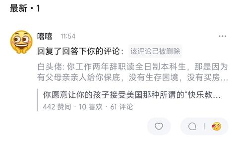
    - <a href="https://www.zhihu.com/people/zhu1989yz">白头佬</a> (<small title="回复于 2026-7-19 11:56:53/江苏"> ✉️:嘻嘻</small>): 全日制研究生不辞职你怎么读？啊？非全，那些普通打工人考非全做什么？非全是用来评职称和职务晋升用的？到底谁不懂啊？啊？
    - <a href="https://www.zhihu.com/people/zhu1989yz">白头佬</a> (<small title="回复于 2026-7-19 11:59:24/江苏"> ✉️:嘻嘻</small>): 别来犟嘴了，我工作十几年，看多了你这样的大学生，每年单位招聘过来的大学生都跟你一样天真。
    - <a href="https://www.zhihu.com/people/zhu1989yz">白头佬</a> (<small title="回复于 2026-7-19 12:2:31/江苏"> ✉️:嘻嘻</small>): 我姐夫花了二十几万读的南大MBA硕士，你猜是为了干啥？你说非全，我都感到好笑，就好像非全是正儿八经学习知识的。。。
    - <a href="https://www.zhihu.com/people/39-88-81-64-55">嘻嘻</a> (<small title="回复于 2026-7-19 12:3:41/江苏"> ✉️:白头佬</small>): 我20年本科毕业，21修了一个非全学士学位，22年上的全日制研究生，去年毕业，今年准备再休一个非全，单线程🧠是这样的［飙泪笑］
    - <a href="https://www.zhihu.com/people/zhu1989yz">白头佬</a> (<small title="回复于 2026-7-19 12:3:46/江苏"> ✉️:嘻嘻</small>): 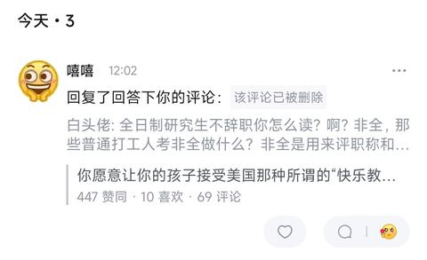
    - <a href="https://www.zhihu.com/people/39-88-81-64-55">嘻嘻</a> (<small title="回复于 2026-7-19 12:4:56/江苏"> ✉️:白头佬</small>): 我20年本科毕业，21修了一个非全学士学位，22年上的全日制研究生，去年毕业，今年准备再休一个非全，单线程是这样的
    - <a href="https://www.zhihu.com/people/zhu1989yz">白头佬</a> (<small title="回复于 2026-7-19 12:6:2/江苏"> ✉️:嘻嘻</small>): 是“修”不是“休”，连字都打不好。。。
    - <a href="https://www.zhihu.com/people/39-88-81-64-55">嘻嘻</a> (<small title="回复于 2026-7-19 12:6:49/江苏"> ✉️:白头佬</small>): 你也就这了［飙泪笑］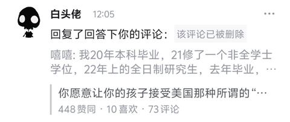
    - <a href="https://www.zhihu.com/people/zhu1989yz">白头佬</a> (<small title="回复于 2026-7-19 12:8:46/江苏"> ✉️:嘻嘻</small>): 毕业没工作，然后去修非全，牛的，我只能说你后面福报满满［飙泪笑］。。。哥们，咱就说一句，你不上班，你修非全作甚？啊？为啥不修个全日制研究生？还有，你修那么多研究生有啥用，现在研究生都泛滥了，我们单位招聘有北大博士过来抢饭碗，你多修几门研究生有什么用处？啊？
    - <a href="https://www.zhihu.com/people/39-88-81-64-55">嘻嘻</a> (<small title="回复于 2026-7-19 12:9:51/江苏"> ✉️:白头佬</small>): 我20年毕业，21修非全叫毕业没工作［飙泪笑］  
 
你真是［赞］
    - <a href="https://www.zhihu.com/people/39-88-81-64-55">嘻嘻</a> (<small title="回复于 2026-7-19 12:11:15/江苏"> ✉️:白头佬</small>): 我就一个研究生学位，你跟我说修那么多研究生［飙泪笑］你知道什么是学士学位吗［飙泪笑］
    - <a href="https://www.zhihu.com/people/zhu1989yz">白头佬</a> (<small title="回复于 2026-7-19 12:11:20/江苏"> ✉️:嘻嘻</small>): 你现在有工作吗？啊？再者说了，非全是用来干嘛的你都没弄清楚，你就修？
    - <a href="https://www.zhihu.com/people/zhu1989yz">白头佬</a> (<small title="回复于 2026-7-19 12:12:3/江苏"> ✉️:嘻嘻</small>): 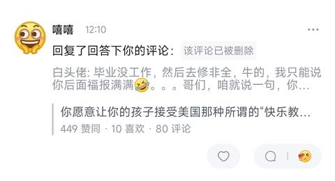
    - <a href="https://www.zhihu.com/people/zhu1989yz">白头佬</a> (<small title="回复于 2026-7-19 12:13:4/江苏"> ✉️:嘻嘻</small>): 不是，哥们你上学只读书了？有全日制研究生，你去读非全？不是，你告诉对于你来说非全有什么作用？啊？
    - <a href="https://www.zhihu.com/people/zhu1989yz">白头佬</a> (<small title="回复于 2026-7-19 12:15:10/江苏"> ✉️:嘻嘻</small>): 你就告诉我，你读非全的意义在哪里？［飙泪笑］太讷了。。。
    - <a href="https://www.zhihu.com/people/zhu1989yz">白头佬</a> (<small title="回复于 2026-7-19 12:17:28/江苏"> ✉️:嘻嘻</small>): 你们院40多岁的读非全，人家是为了晋升为了职称为了工作，你本身有个全日制研究生的身份，你读非全是为了干啥？学习知识？？？
    - <a href="https://www.zhihu.com/people/zhu1989yz">白头佬</a> (<small title="回复于 2026-7-19 12:22:53/江苏"> ✉️:嘻嘻</small>): 你这种发言，我都怀疑你是不是研究生，甚至都不一定是本科生，毕竟，很难想象一个研究生会有这种言论，都搞不清非全的作用。。。有研究生的学位还去考非全。。。
    - <a href="https://www.zhihu.com/people/zhu1989yz">白头佬</a> (<small title="回复于 2026-7-19 12:23:20/江苏"> ✉️:嘻嘻</small>): 你有本科学历吗？学信网看看？
    - <a href="https://www.zhihu.com/people/zhu1989yz">白头佬</a> (<small title="回复于 2026-7-19 12:27:49/江苏"> ✉️:嘻嘻</small>): 牛的，20本科毕业，21年修了个非全学士学位。。。我一时间竟无言以对，你学信网看一下？。。。你不会是专升本吧？啊？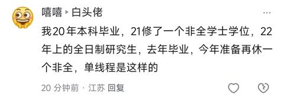
    - <a href="https://www.zhihu.com/people/zhu1989yz">白头佬</a> (<small title="回复于 2026-7-19 12:29:23/江苏"> ✉️:嘻嘻</small>): 告诉我，你本科毕业，学校没给你发学历和学位吗？你这个本科没学历学位认证？难道你读了个假大学？［飙泪笑］。。。太讷了。。。
    - <a href="https://www.zhihu.com/people/zhu1989yz">白头佬</a> (<small title="回复于 2026-7-19 12:32:43/江苏"> ✉️:嘻嘻</small>): 哥们不会以为学士学位是研究生发的吧？那我读的本科可太牛了，毕业就发学历和学士学位，哦，对了，我们正经本科毕业的不会叫自己的学位叫学士学位，我们都是按照自己的专业来说的，比如我就是工学学士［飙泪笑］。。。
    - <a href="https://www.zhihu.com/people/zhu1989yz">白头佬</a> (<small title="回复于 2026-7-19 12:36:32/江苏"> ✉️:FANP</small>): 你下面那货，自称20年本科毕业，然后21年去读了个非全的本科，把我看懵了［飙泪笑］
    - <a href="https://www.zhihu.com/people/39-88-81-64-55">嘻嘻</a> (<small title="回复于 2026-7-19 12:39:44/江苏"> ✉️:白头佬</small>): 赌点啥［感谢］
    - <a href="https://www.zhihu.com/people/zhu1989yz">白头佬</a> (<small title="回复于 2026-7-19 12:40:21/江苏"> ✉️:嘻嘻</small>): ［飙泪笑］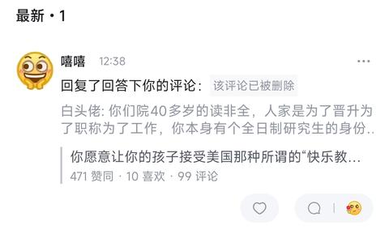
    - <a href="https://www.zhihu.com/people/zhu1989yz">白头佬</a> (<small title="回复于 2026-7-19 12:41:19/江苏"> ✉️:嘻嘻</small>): 为啥跟你赌呢？我不需要啊，就你这样的发言，是不是本科已经无足轻重了［飙泪笑］。。。
    - <a href="https://www.zhihu.com/people/zhu1989yz">白头佬</a> (<small title="回复于 2026-7-19 12:42:5/江苏"> ✉️:嘻嘻</small>): 你先解释解释，你一个本科毕业生读非全本科和非全研究生的意义在哪里？［飙泪笑］
    - <a href="https://www.zhihu.com/people/39-88-81-64-55">嘻嘻</a> (<small title="回复于 2026-7-19 12:43:49/江苏"> ✉️:白头佬</small>): 我可以解释，而且我的简历跟我心路历程相符［感谢］  
 
你赌点啥［感谢］
    - <a href="https://www.zhihu.com/people/39-88-81-64-55">嘻嘻</a> (<small title="回复于 2026-7-19 12:43:59/江苏"> ✉️:白头佬</small>): 因为你不敢［感谢］
    - <a href="https://www.zhihu.com/people/zhu1989yz">白头佬</a> (<small title="回复于 2026-7-19 12:44:7/江苏"> ✉️:嘻嘻</small>): 就这样的发言，怎么让人相信这是正儿八经的本科生和研究生说出来的，所以，赌不赌都不影响我对你的判断：你既不是研究生也不是本科生，至少不是正经的［飙泪笑］。。。
    - <a href="https://www.zhihu.com/people/zhu1989yz">白头佬</a> (<small title="回复于 2026-7-19 12:44:57/江苏"> ✉️:嘻嘻</small>): 那你就解释，我不需要赌，为啥跟你赌？你不解释，那我就选择不信呗。。。
    - <a href="https://www.zhihu.com/people/39-88-81-64-55">嘻嘻</a> (<small title="回复于 2026-7-19 12:45:38/江苏"> ✉️:白头佬</small>): 你爱信不信［飙泪笑］我为啥要陷入自证陷阱［飙泪笑］
    - <a href="https://www.zhihu.com/people/39-88-81-64-55">嘻嘻</a> (<small title="回复于 2026-7-19 12:46:8/江苏"> ✉️:白头佬</small>): 我为啥要让你信，你不是挺确定我不是研究生吗［飙泪笑］这点勇气都没有？
    - <a href="https://www.zhihu.com/people/zhu1989yz">白头佬</a> (<small title="回复于 2026-7-19 12:46:13/江苏"> ✉️:嘻嘻</small>): 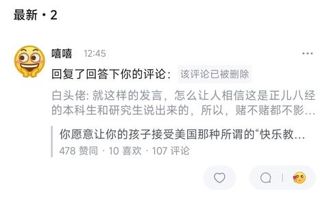
    - <a href="https://www.zhihu.com/people/zhu1989yz">白头佬</a> (<small title="回复于 2026-7-19 12:46:54/江苏"> ✉️:嘻嘻</small>): 对啊，我也没让你必须解释啊，你不解释，反正我认为你不是本科生和研究生啊，不妨碍结论啊。。。没毛病［飙泪笑］
    - <a href="https://www.zhihu.com/people/zhu1989yz">白头佬</a> (<small title="回复于 2026-7-19 12:48:33/江苏"> ✉️:嘻嘻</small>): 我确定啊你不是本科生也不是研究生，我确定这一点，但是我不一定非要跟你赌啊，为啥跟你赌？有啥意义吗？你自己的事情而已，又不是我。。。你可以认为我没勇气，同时，不妨碍你不是本科生和研究生这个事实。
    - <a href="https://www.zhihu.com/people/zhu1989yz">白头佬</a> (<small title="回复于 2026-7-19 12:50:43/江苏"> ✉️:嘻嘻</small>): 你不会以为说一句你敢赌吗？就能摆脱对你的结论了吧？经典互联网套路，赌不赌，不影响你不是本科生和研究生的结论
    - <a href="https://www.zhihu.com/people/67-72-14-49-98">无聊人</a> (<small title="回复于 2026-7-19 12:55:13/广东"> ✉️:嘻嘻</small>): 你是哪个世界，2025年周工作时长是官方给的数据，不是你做梦的数据［捂嘴］
    - <a href="https://www.zhihu.com/people/zhu1989yz">白头佬</a> (<small title="回复于 2026-7-19 12:56:19/江苏"> ✉️:嘻嘻</small>): 你还不如老老实实的承认我是预科呢，对吧？
    - <a href="https://www.zhihu.com/people/zhu1989yz">白头佬</a> (<small title="回复于 2026-7-19 12:57:34/江苏"> ✉️:无聊人</small>): 关键这哥们自称读过本科，然后毕业后考了个非全本科，然后自称全日制研究生，后面又准备读了个非全研究生［飙泪笑］。。。
    - <a href="https://www.zhihu.com/people/39-88-81-64-55">嘻嘻</a> (<small title="回复于 2026-7-19 13:0:55/江苏"> ✉️:无聊人</small>): 断档第一你发一下［飙泪笑］
    - <a href="https://www.zhihu.com/people/39-88-81-64-55">嘻嘻</a> (<small title="回复于 2026-7-19 13:2:7/江苏"> ✉️:白头佬</small>): 那来赌点啊，让你挣点［飙泪笑］
    - <a href="https://www.zhihu.com/people/zhu1989yz">白头佬</a> (<small title="回复于 2026-7-19 13:3:25/江苏"> ✉️:嘻嘻</small>): 告诉我，跟你赌的必要性是什么？没必要为啥跟你赌，你先解释解释你一个本科生读非全本科的作用，和一个全日制研究生读非全研究生的作用吧［飙泪笑］。
    - <a href="https://www.zhihu.com/people/zhu1989yz">白头佬</a> (<small title="回复于 2026-7-19 13:3:50/江苏"> ✉️:嘻嘻</small>): 不需要赌，因为赌不赌影响不了你结论［飙泪笑］
    - <a href="https://www.zhihu.com/people/zhu1989yz">白头佬</a> (<small title="回复于 2026-7-19 13:4:45/江苏"> ✉️:嘻嘻</small>): 你还不如大大方方的承认我是预科生出身，那还至少合理一点［飙泪笑］。。。
    - <a href="https://www.zhihu.com/people/39-88-81-64-55">嘻嘻</a> (<small title="回复于 2026-7-19 13:10:8/江苏"> ✉️:白头佬</small>): 什么预科生，你在说啥［飙泪笑］
    - <a href="https://www.zhihu.com/people/39-88-81-64-55">嘻嘻</a> (<small title="回复于 2026-7-19 13:13:56/江苏"> ✉️:白头佬</small>): 等会儿，我在吃饭［感谢］
    - <a href="https://www.zhihu.com/people/zhu1989yz">白头佬</a> (<small title="回复于 2026-7-19 13:15:17/江苏"> ✉️:嘻嘻</small>): 不用等，等了你也不是本科生，不影响事实［飙泪笑］
    - <a href="https://www.zhihu.com/people/zhu1989yz">白头佬</a> (<small title="回复于 2026-7-19 13:15:45/江苏"> ✉️:嘻嘻</small>): 886，哈哈
    - <a href="https://www.zhihu.com/people/zjamz7">嘿嘿</a> (<small title="回复于 2026-7-19 13:34:31/江苏"> ✉️:白头佬</small>): 怎么跑了［飙泪笑］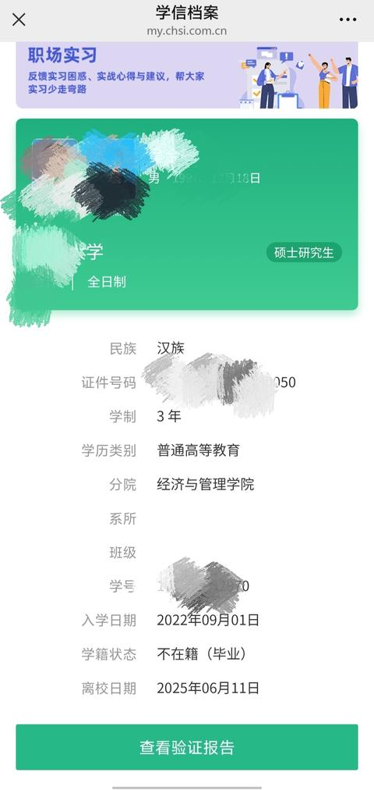
    - <a href="https://www.zhihu.com/people/zjamz7">嘿嘿</a> (<small title="回复于 2026-7-19 13:34:39/江苏"> ✉️:白头佬</small>): 是不是要转进了？［飙泪笑］
    - <a href="https://www.zhihu.com/people/zjamz7">嘿嘿</a> (<small title="回复于 2026-7-19 13:35:5/江苏"> ✉️:白头佬</small>): 怎么又“从心”又爱玩儿啊［飙泪笑］
    - <a href="https://www.zhihu.com/people/zjamz7">嘿嘿</a> (<small title="回复于 2026-7-19 13:36:29/江苏"> ✉️:白头佬</small>): 不是没工作吗［飙泪笑］帮我看看是不是p的［感谢］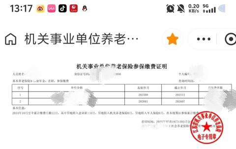
    - <a href="https://www.zhihu.com/people/zjamz7">嘿嘿</a> (<small title="回复于 2026-7-19 13:37:3/江苏"> ✉️:白头佬</small>): 急着拉嘿干啥［飙泪笑］不是挺能说的吗［感谢］
    - <a href="https://www.zhihu.com/people/zhu1989yz">白头佬</a> (<small title="回复于 2026-7-19 13:39:7/江苏"> ✉️:嘿嘿</small>): 哥们，你知道啥叫质疑吗？我是在质疑你啊，你有没有跟我有啥关系呢，你发这两个，然后呢？
    - <a href="https://www.zhihu.com/people/zhu1989yz">白头佬</a> (<small title="回复于 2026-7-19 13:39:29/江苏"> ✉️:嘿嘿</small>): 不需要转进，因为我本来就说的质疑，要转进作甚呢？
    - <a href="https://www.zhihu.com/people/zjamz7">嘿嘿</a> (<small title="回复于 2026-7-19 13:40:13/江苏"> ✉️:白头佬</small>): 质疑啊［感谢］
    - <a href="https://www.zhihu.com/people/zjamz7">嘿嘿</a> (<small title="回复于 2026-7-19 13:40:18/江苏"> ✉️:白头佬</small>): 哈哈哈哈哈哈哈
    - <a href="https://www.zhihu.com/people/zhu1989yz">白头佬</a> (<small title="回复于 2026-7-19 13:40:31/江苏"> ✉️:嘿嘿</small>): 没工作是你自己说的，又不是我说的［飙泪笑］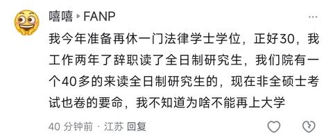
    - <a href="https://www.zhihu.com/people/zjamz7">嘿嘿</a> (<small title="回复于 2026-7-19 13:40:41/江苏"> ✉️:白头佬</small>): 不是让我发学信网吗［飙泪笑］  
 
发了然后呢［感谢］
    - <a href="https://www.zhihu.com/people/zhu1989yz">白头佬</a> (<small title="回复于 2026-7-19 13:40:48/江苏"> ✉️:嘿嘿</small>): 哥们，你知道啥叫质疑吗？［飙泪笑］
    - <a href="https://www.zhihu.com/people/zjamz7">嘿嘿</a> (<small title="回复于 2026-7-19 13:41:18/江苏"> ✉️:白头佬</small>): 工作了两年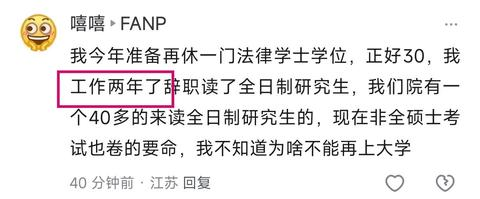
    - <a href="https://www.zhihu.com/people/zhu1989yz">白头佬</a> (<small title="回复于 2026-7-19 13:41:23/江苏"> ✉️:嘿嘿</small>): 你自己说辞职的啊没工作是我说的吗？不是你自己说辞职了吗？跟我有什么关系呢？［飙泪笑］
    - <a href="https://www.zhihu.com/people/zjamz7">嘿嘿</a> (<small title="回复于 2026-7-19 13:41:24/江苏"> ✉️:白头佬</small>): 能不能看懂［感谢］
    - <a href="https://www.zhihu.com/people/zhu1989yz">白头佬</a> (<small title="回复于 2026-7-19 13:42:15/江苏"> ✉️:嘿嘿</small>): 我寻思我没说错啊，你读研究生期间确实没工作啊，咋啦？有问题吗？［飙泪笑］告诉我
    - <a href="https://www.zhihu.com/people/zhu1989yz">白头佬</a> (<small title="回复于 2026-7-19 13:42:39/江苏"> ✉️:嘿嘿</small>): 你能不能看懂呢。。。然后也证明不了你全日制本科啊［飙泪笑］
    - <a href="https://www.zhihu.com/people/zjamz7">嘿嘿</a> (<small title="回复于 2026-7-19 13:42:44/江苏"> ✉️:白头佬</small>): 不是说本科都不是吗［感谢］
    - <a href="https://www.zhihu.com/people/zjamz7">嘿嘿</a> (<small title="回复于 2026-7-19 13:42:52/江苏"> ✉️:白头佬</small>): 怎么还在转进［感谢］
    - <a href="https://www.zhihu.com/people/zjamz7">嘿嘿</a> (<small title="回复于 2026-7-19 13:43:15/江苏"> ✉️:白头佬</small>): 那我发全日制本科你咋说［感谢］继续转进［感谢］
    - <a href="https://www.zhihu.com/people/zhu1989yz">白头佬</a> (<small title="回复于 2026-7-19 13:43:23/江苏"> ✉️:嘿嘿</small>): 然后呢？你读研究生的时候是不是没工作？那么，请问说错了吗？［飙泪笑］
    - <a href="https://www.zhihu.com/people/zhu1989yz">白头佬</a> (<small title="回复于 2026-7-19 13:43:29/江苏"> ✉️:嘿嘿</small>): 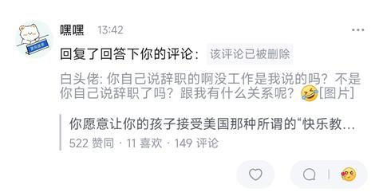
    - <a href="https://www.zhihu.com/people/zhu1989yz">白头佬</a> (<small title="回复于 2026-7-19 13:43:43/江苏"> ✉️:嘿嘿</small>): 你管这个叫转进？
    - <a href="https://www.zhihu.com/people/zjamz7">嘿嘿</a> (<small title="回复于 2026-7-19 13:43:49/江苏"> ✉️:白头佬</small>): 你知道什么叫第二学位吗［飙泪笑］
    - <a href="https://www.zhihu.com/people/zjamz7">嘿嘿</a> (<small title="回复于 2026-7-19 13:44:6/江苏"> ✉️:白头佬</small>): 夸你呢［感谢］
    - <a href="https://www.zhihu.com/people/zjamz7">嘿嘿</a> (<small title="回复于 2026-7-19 13:44:23/江苏"> ✉️:白头佬</small>): 我要是全日制本科咋说呀［感谢］
    - <a href="https://www.zhihu.com/people/zjamz7">嘿嘿</a> (<small title="回复于 2026-7-19 13:44:30/江苏"> ✉️:白头佬</small>): 什么叫转进［感谢］
    - <a href="https://www.zhihu.com/people/zhu1989yz">白头佬</a> (<small title="回复于 2026-7-19 13:44:38/江苏"> ✉️:嘿嘿</small>): 别着急啊［飙泪笑］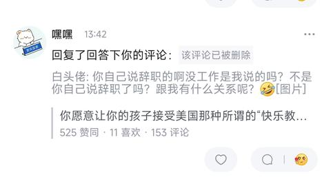
    - <a href="https://www.zhihu.com/people/zjamz7">嘿嘿</a> (<small title="回复于 2026-7-19 13:45:3/江苏"> ✉️:白头佬</small>): ［飙泪笑］［飙泪笑］［飙泪笑］［飙泪笑］［飙泪笑］［飙泪笑］［飙泪笑］［飙泪笑］［飙泪笑］［飙泪笑］［飙泪笑］［飙泪笑］［飙泪笑］［飙泪笑］［飙泪笑］
    - <a href="https://www.zhihu.com/people/zhu1989yz">白头佬</a> (<small title="回复于 2026-7-19 13:45:12/江苏"> ✉️:嘿嘿</small>): 我不是还在继续跟你讨论这个话题吗？你管这个叫转进？［飙泪笑］
    - <a href="https://www.zhihu.com/people/zjamz7">嘿嘿</a> (<small title="回复于 2026-7-19 13:45:30/江苏"> ✉️:白头佬</small>): 你也有被删了［飙泪笑］我懒得发而已
    - <a href="https://www.zhihu.com/people/zhu1989yz">白头佬</a> (<small title="回复于 2026-7-19 13:45:31/江苏"> ✉️:嘿嘿</small>): 对的，我也在夸你呢，真太聪明了［飙泪笑］
    - <a href="https://www.zhihu.com/people/zhu1989yz">白头佬</a> (<small title="回复于 2026-7-19 13:45:47/江苏"> ✉️:嘿嘿</small>): 你发呗，你觉得我会在意吗［飙泪笑］？
    - <a href="https://www.zhihu.com/people/zhu1989yz">白头佬</a> (<small title="回复于 2026-7-19 13:45:56/江苏"> ✉️:嘿嘿</small>): 我也是在夸你呢［飙泪笑］
    - <a href="https://www.zhihu.com/people/zjamz7">嘿嘿</a> (<small title="回复于 2026-7-19 13:45:58/江苏"> ✉️:白头佬</small>): 哈哈哈哈哈哈哈哈，转进如风［感谢］
    - <a href="https://www.zhihu.com/people/fort-minor-36">Fort Minor</a> (<small title="回复于 2026-7-19 13:48:36/江苏"> ✉️:嘿嘿</small>): 没你转进得那么快，哈哈哈
    - <a href="https://www.zhihu.com/people/fort-minor-36">Fort Minor</a> (<small title="回复于 2026-7-19 13:49:4/江苏"> ✉️:嘿嘿</small>): 第二学历自考非全，嗯，你真聪明。［飙泪笑］
    - <a href="https://www.zhihu.com/people/39-88-81-64-55">嘻嘻</a> (<small title="回复于 2026-7-19 13:57:55/江苏"> ✉️:无聊人</small>): 断档第一呢，我想看看你那个世界的断档第一［感谢］
    - <a href="https://www.zhihu.com/people/jiang-zhen-hua-64-69">图变</a> (<small title="广东">2026-7-19 16:29:11</small>): 又不教育了?人家的优势你看不到而已
    - <a href="https://www.zhihu.com/people/jean-huang-66">jean huang</a> (<small title="法国">2026-7-19 18:15:32</small>): 这就是应试教育出来的人的发言
    - <a href="https://www.zhihu.com/people/guo-chun-lei-61">明悟此生</a> (<small title="回复于 2026-7-19 18:17:49/黑龙江"> ✉️:jean huang</small>): 比你们强太多啦！你们胳膊肘都分不清里外，还批评应试教育？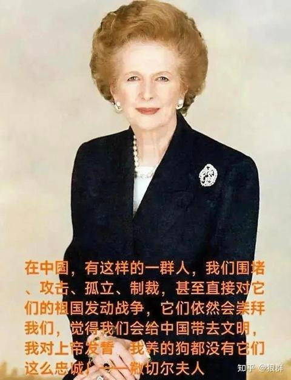
    - <a href="https://www.zhihu.com/people/guo-chun-lei-61">明悟此生</a> (<small title="回复于 2026-7-19 18:19:3/黑龙江"> ✉️:图变</small>): 看到啦，远程畜牧业发达到我们自愧不如。
    - <a href="https://www.zhihu.com/people/jiang-zhen-hua-64-69">图变</a> (<small title="回复于 2026-7-19 18:26:51/广东"> ✉️:明悟此生</small>): 还远程 也许快乐教育很烂 但我不管人家怎么样 一个正常人 有责任心的人 看到孩子七八岁孩子带个眼镜就应该愤怒 就应该寻求改变 我说包子有毒 你说隔壁包子店包子也有毒 你是个正常人的三观吗？？？
    - <a href="https://www.zhihu.com/people/youho-47">youho</a> (<small title="日本">2026-7-19 19:6:0</small>): 快乐教育不等于文盲吧……
    - <a href="https://www.zhihu.com/people/guo-chun-lei-61">明悟此生</a> (<small title="回复于 2026-7-19 21:22:52/黑龙江"> ✉️:youho</small>): 新冠的时候，让你喝消毒水的算不算文盲呢？
16. <a href="https://www.zhihu.com/people/xwulbi">小看山XWulBI</a> (<small title="四川">2026-7-18 20:2:27</small>): 话别这么说，起码中式教育教出来肯定会写字吧
    - <a href="https://www.zhihu.com/people/wang-xu-liang-14-24">一条飘扬的红领巾</a> (<small title="日本">2026-7-18 23:6:26</small>): 几百万中式教育进技校的肯定尊老爱幼尊师重道能把字写得规规矩矩吧。
    - <a href="https://www.zhihu.com/people/hungup">Viztor</a> (<small title="浙江">2026-7-18 23:45:0</small>): 我在挪威看到一个小姑娘算数都不会算，人家照样在机场国营商店舒舒服服的工作。［飙泪笑］
    - <a href="https://www.zhihu.com/people/xuan-ming-29">海兽</a> (<small title="江苏">2026-7-19 0:44:2</small>): 本科毕业5000不到的大把［尴尬］还没人家一个不识字的服务员过得好，你真骄傲
    - <a href="https://www.zhihu.com/people/xuan-ming-29">海兽</a> (<small title="江苏">2026-7-19 0:45:42</small>): 说起快乐，谁有中国大学生快乐，打思念游戏混个毕业证
    - <a href="https://www.zhihu.com/people/late-withdraw">Late withdraw</a> (<small title="加拿大">2026-7-19 3:25:9</small>): 你猜进厂为啥要自己填表，考几道简单的常识题，包括默写26个英文字母么？因为有部分接受完九年义务教育的人无法完成上述几项……任何教育都有这种人存在。
    - <a href="https://www.zhihu.com/people/mo-ying-long-45">用户</a> (<small title="湖北">2026-7-19 4:7:21</small>): 到了工作后基本都使用电脑，写字的需求很少
    - <a href="https://www.zhihu.com/people/yang-guang-53-77">阳光</a> (<small title="浙江">2026-7-19 7:15:31</small>): 四川［飙泪笑］
    - <a href="https://www.zhihu.com/people/20-10-48-75">熵减</a> (<small title="回复于 2026-7-19 7:50:39/山东"> ✉️:一条飘扬的红领巾</small>): “今乐亦废，卷亦废；等废，乐活可乎？”
    - <a href="https://www.zhihu.com/people/jian-chi-beng-kui-yi-bai-nian">夜影</a> (<small title="上海">2026-7-19 8:41:21</small>): 你会茴字四种写法，结果不如别人的文盲过得好，骄傲完了
    - <a href="https://www.zhihu.com/people/z-94-83">老Z是只细狗</a> (<small title="回复于 2026-7-19 12:26:14/浙江"> ✉️:Viztor</small>): 有计算器我为什么要自己算？21世纪了生活中我买东西也不用自己结账
    - <a href="https://www.zhihu.com/people/g917719">grap</a> (<small title="美国">2026-7-19 12:26:25</small>): 能写的过我1美元一百万token的模型吗。
    - <a href="https://www.zhihu.com/people/hhwu-55">非物</a> (<small title="广东">2026-7-19 13:10:27</small>): 中式教育出来的小孩，连发绿变质的鹅腿都看不出来［飙泪笑］
    - <a href="https://www.zhihu.com/people/19-30-22-86-43">达米摩菲斯</a> (<small title="广东">2026-7-19 13:46:40</small>): ［吃瓜］出校门了很少写字，天天看手机电脑，真容易提笔忘字。
    - <a href="https://www.zhihu.com/people/jean-huang-66">jean huang</a> (<small title="法国">2026-7-19 18:13:31</small>): bbc的记者采访王思聪，这个女记者高中学历［捂脸］
    - <a href="https://www.zhihu.com/people/jean-huang-66">jean huang</a> (<small title="法国">2026-7-19 18:13:32</small>): bbc的记者采访王思聪，这个女记者高中学历［捂脸］
    - <a href="https://www.zhihu.com/people/11-80-94-48">喜悦</a> (<small title="安徽">2026-7-19 18:20:52</small>): 会写字不是一个国家的基本国策？
    - <a href="https://www.zhihu.com/people/79-97-67-3">猪饲料</a> (<small title="陕西">2026-7-20 6:40:47</small>): 0.4×0.5等于多少？  
 
3.11和3.8哪个大？
17. <a href="https://www.zhihu.com/people/11-80-94-48">喜悦</a> (<small title="安徽">2026-7-19 18:20:23</small>): 是的，社会环境太差了，光靠自己那就要家底子好…可大部分人家底子都太弱了！又不甘心…
18. <a href="https://www.zhihu.com/people/sdsaddsa-20">momo</a> (<small title="上海">2026-7-19 12:2:17</small>): 纪录片《人生七年》，证明了龙生龙，凤生凤，老鼠的儿子会打洞。确实有法外狂徒，但你我他大概率不是。
19. <a href="https://www.zhihu.com/people/huang-zi-hua-34-67">信义布鲁诺</a> (<small title="中国香港">2026-7-20 9:7:44</small>): 实际上，“小时候过快乐教育还是中式教育”，对人的一辈子可能影响重大。6-18岁这12年占据了人生大概1/5 - 1/6的时间，而因为小时候时间过得更慢，实际上人生里有1/4的可感知时间是花在小时候接受教育上的。而童年和少年时期的经历，将直接影响一个人的三观、性格，童年的创伤、童年未曾实现的念想，也需要一个人花费一生经历去治愈。因此，我们有更充分的理由去抵制反人性的教育。
20. <a href="https://www.zhihu.com/people/jiang-dong-shi-zi">江东士子</a> (<small title="广东">2026-7-20 8:22:59</small>): 所以还是快乐一点
21. <a href="https://www.zhihu.com/people/cui-rong-79">易小冉</a> (<small title="湖南">2026-7-20 7:54:49</small>): 这就像反正人都要死还不如一天到晚吃那些垃圾食品把自己早早吃死算了
22. <a href="https://www.zhihu.com/people/weng-dong-dong-31">翁东东</a> (<small title="河南">2026-7-20 9:22:41</small>): 先中式精英教育，如果不是读书的料，实行快乐教育，教育重点在不要染上不良嗜好，避免纹身抽烟，学个技术，再攒钱给孩子买一间小铺面让孩子留在身边开个小卖铺什么的，没有房租总归能经营下去。
23. <a href="https://www.zhihu.com/people/shi-si-fei-33">是灬非</a> (<small title="福建">2026-7-20 8:54:18</small>): 中等年薪，找个大公司，摸摸鱼，喝喝茶，然后感慨下，天下英雄如过江之鲫，卷不如躺。一部分人送外卖，送滴滴，躺都没得躺。这就是区别。
24. <a href="https://www.zhihu.com/people/cha-li-tang-81">查理唐</a> (<small title="云南">2026-7-20 8:52:11</small>): 一个是底线，一个是上线，有什么好比的。这话说出来，算是剥削他人的傲慢了吧？
25. <a href="https://www.zhihu.com/people/ha-luo-96-9">哈罗</a> (<small title="江苏">2026-7-20 9:33:24</small>): 问题是不卷，普通人都成不了［飙泪笑］，工作、结婚、生子
26. <a href="https://www.zhihu.com/people/liu-xiao-bai-5-78">刘小白</a> (<small title="山东">2026-7-20 9:23:14</small>): 当然有区别，同样是领几千块钱，坐办公室无业绩压力双休的公务员，和坐办公室996的职员，和跑外卖，和打零工，这些都是不一样的。  
 
阶层改不了，也得往本阶层的天花板爬爬不是。
27. <a href="https://www.zhihu.com/people/sa-ha-la-de-xue-32">撒哈拉的雪</a> (<small title="湖北">2026-7-20 0:45:27</small>): 赚的差不多。上了大学有机会办公室，不上大学流水线。
28. <a href="https://www.zhihu.com/people/yao-yuan-de-qing-cha">远方</a> (<small title="山东">2026-7-20 9:17:25</small>): 还是有区别的 区别是你在烈日下挥汗如雨的挣几千 和坐在干净明亮的办公楼里吹着空调挣几千
29. <a href="https://www.zhihu.com/people/geng-hua-jie-33">束甲</a> (<small title="河南">2026-7-20 8:11:43</small>): 差别大了去了，我认识大批本科毕业和初高中辍学的同学、发小，本科的下限几乎是辍学的上限
30. <a href="https://www.zhihu.com/people/da-shi-dai-mei-you-cha-qu">大时代没有插曲</a> (<small title="湖北">2026-7-19 21:57:59</small>): 北方某985就业去向［感谢］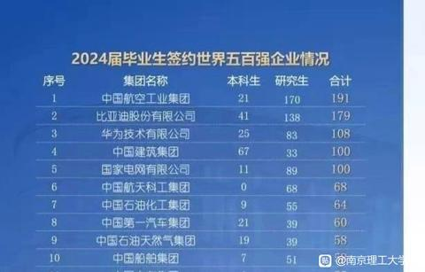
    - <a href="https://www.zhihu.com/people/owener-4">owener</a> (<small title="辽宁">2026-7-20 7:45:38</small>): 《985》
31. <a href="https://www.zhihu.com/people/qiao-chu-tian-86">啦啦啦</a> (<small title="日本">2026-7-20 7:26:20</small>): 小组长还是有希望的［大哭］
32. <a href="https://www.zhihu.com/people/jiao-cai-ba-zi-quan-da-can-er-shi">专乔罗宾的乔巴</a> (<small title="辽宁">2026-7-20 7:17:40</small>): 有区别，干我们这行的从小快乐是会死的
33. <a href="https://www.zhihu.com/people/tian-qi-hao-re-75-30">天气好热</a> (<small title="湖北">2026-7-20 6:42:37</small>): 能这么想也不错，起码内心不会有对比的难过
34. <a href="https://www.zhihu.com/people/fisher-12-41">Fisher</a> (<small title="河北">2026-7-19 23:58:24</small>): 从我自己和我身边所有父母同事的同龄人孩子（父母全都是高中教师）来说，还是关系很大的，当然答主会觉得我们这帮高中老师的孩子们小时候不努力长大之后照样跟父母阶级差不多，没看到真实的世界是什么样子罢了
35. <a href="https://www.zhihu.com/people/chen-ran-24-58">知乎霰弹枪</a> (<small title="黑龙江">2026-7-20 8:38:12</small>): 2000也是几千，9000也是几千。  
 
差别很大的。
36. <a href="https://www.zhihu.com/people/ember-14-65">EMBER</a> (<small title="河南">2026-7-20 1:36:50</small>): 确实，人家是快乐教育，但老师发现孩子某方面天赋也会上报，也会提供相应的进修渠道。你得孩子快乐教育的内容都学不太明白，那还是洗洗睡别折腾了。
37. <a href="https://www.zhihu.com/people/yu-zhen-xing-18">四叠半</a> (<small title="福建">2026-7-19 19:39:42</small>): 很多人出生就完蛋了，非要折腾到30多岁才搞得好像恍然大悟一样，能快乐一天算一天吧
38. <a href="https://www.zhihu.com/people/hu-yi-san-64-50">胡汉三</a> (<small title="上海">2026-7-20 8:48:44</small>): 有关系
39. <a href="https://www.zhihu.com/people/zhi-qiang-97-98">默林</a> (<small title="北京">2026-7-20 8:45:41</small>): 所以？？？
40. <a href="https://www.zhihu.com/people/rambo-55">Rambo</a> (<small title="河北">2026-7-20 7:54:29</small>): 问题是，一个月几千元的工资，也是需要竞争上岗的。
41. <a href="https://www.zhihu.com/people/admin-70-98">admin</a> (<small title="福建">2026-7-20 4:39:36</small>): 你都知道打引号了，  
 
教育就没有使人快乐的，  
 
所谓的快乐教育只不过是压力小的教育。
42. <a href="https://www.zhihu.com/people/wo-shi-bu-xu-xiao">机甲钢拳第八武神</a> (<small title="河北">2026-7-20 1:10:23</small>): 你和这个评论区没看过，那些和一些连线主播，快乐教育的外国人吗？  
 
我的评价是，至少初中和高中，及格吧。你要是没有学习的天赋，你初中和高中及格至少得做到吧。做不到的话，  
 
一半科目得及格吧。
43. <a href="https://www.zhihu.com/people/tou-bao-xia-jiu-35">头孢下酒</a> (<small title="未知">2026-7-20 9:8:52</small>): 重庆的兄弟，千万不要让孩子卷了，这个社会，除了学习还有太多的出路，不管是冒着40+的温度去送外卖，还是车间打螺丝，这些没有啥门槛并收入还可以的工作，一样会让你孩子活得很快乐［doge］
44. <a href="https://www.zhihu.com/people/luo-ben-de-luo-ben-91">裸奔的罗本</a> (<small title="江苏">2026-7-19 15:39:42</small>): 看了你的帖子，我发现我已经超过99%的人了。谢谢你。［doge］
45. <a href="https://www.zhihu.com/people/cnysteen">Cosmos</a> (<small title="天津">2026-7-19 22:27:57</small>): 我也希望别人家孩子都快乐教育，我家孩子本来能上211的也混个985［尴尬］
46. <a href="https://www.zhihu.com/people/66-49-47-1">六系欧丁</a> (<small title="黑龙江">2026-7-19 19:10:45</small>): 我最焦虑的时候，靠一个医生的视频缓解了很多。那个医生躺在病床上录视频，说自己抢救过那么多人，今天第一次被抢救。“我在医院二十几年，见过很多人，绝大多数人这辈子都没什么成就，甚至想平凡安稳度过一生都很难，大家不过是庸庸碌碌，所以过好每一天最重要。”
47. <a href="https://www.zhihu.com/people/pxd2050">pxd2050</a> (<small title="福建">2026-7-19 15:19:25</small>): 快乐教育，首先得父母快乐才能快乐教育。
    - <a href="https://www.zhihu.com/people/sarry4">散我心中</a> (<small title="江苏">2026-7-19 22:32:40</small>): 何止父母，是教育过程的所有参与者，老师的KPI比父母更紧迫。
48. <a href="https://www.zhihu.com/people/2000jin-bi">空白</a> (<small title="广东">2026-7-20 9:13:13</small>): 这个数据不会伤人，却会让人安心，毕竟99%是同类
49. <a href="https://www.zhihu.com/people/an-ye-de-shou-ren">VONB</a> (<small title="湖北">2026-7-20 8:32:20</small>): 有关系的。一定要当组长才能过得舒服吗？这不就是自我PUA，有这样不配得感的组员当然只有组长舒服。
50. <a href="https://www.zhihu.com/people/dou-ke-77-71">豆壳</a> (<small title="四川">2026-7-19 15:55:32</small>): 扎心了
51. <a href="https://www.zhihu.com/people/croft-70">CROFT</a> (<small title="浙江">2026-7-20 9:32:46</small>): 但这并不妨碍他们推崇苦难教育，并且言必称西方精英也是从小吃苦的［捂脸］
52. <a href="https://www.zhihu.com/people/wenlongabc">Weber</a> (<small title="广东">2026-7-19 21:37:10</small>): 是啊，我没见过任何国家任何时候都做快乐教育的，卷的人一样卷，但只是少数有天赋的立志靠知识才华谋生的人在卷，大多数人卷也没用。智商的正态分布和社会能提供的有限的智力岗位都不需要所有学生去卷。任何国家只要有少数比例的学生去卷去努力就足够提供这个国家发展的的智力资源了。大多数人真没必要这样。
53. <a href="https://www.zhihu.com/people/51-32-26-32-7">小王还不错</a> (<small title="吉林">2026-7-20 8:19:44</small>): 错了，50%混不到退休，就更别说组长了
54. <a href="https://www.zhihu.com/people/ruan-jian-feng-64">大尾巴狼</a> (<small title="浙江">2026-7-19 15:15:38</small>): 所以你是选择快乐教育喽
55. <a href="https://www.zhihu.com/people/ClutchBear">伩姓小镇做题家</a> (<small title="北京">2026-7-19 1:12:36</small>): 我70后的，那时候中式教育还是有用的。
 
2001年末流985山东大学毕业，同学绝大多数混得不错。
    - <a href="https://www.zhihu.com/people/jean-huang-66">jean huang</a> (<small title="法国">2026-7-19 18:19:55</small>): 和什么教育没关系，大学生少的的时候，大专生就能分配工作了。这个是时代给的
56. <a href="https://www.zhihu.com/people/tensors">Tensor</a> (<small title="贵州">2026-7-20 9:4:53</small>): 还是有区别的，孩子拿不到几千块的工资勉强度日，整个家庭的生活质量就要再下滑
57. <a href="https://www.zhihu.com/people/omcm4a">魔鬼筋肉人肉嘟嘟</a> (<small title="四川">2026-7-20 7:33:1</small>): 就是［捂嘴］［捂嘴］［捂嘴］［捂嘴］［捂嘴］［捂嘴］
58. <a href="https://www.zhihu.com/people/qing-qing-zi-jin-64-70">原来如此</a> (<small title="四川">2026-7-20 0:27:3</small>): 能快乐一点就快乐一点，长大以后痛苦的地方多了去了，最大的痛苦就是被平凡的我们带来了这个世界，没有拒绝的权利
59. <a href="https://www.zhihu.com/people/lee-19-75-75">lee</a> (<small title="上海">2026-7-19 18:34:2</small>): 是的，小时候快乐还是痛苦对以后的生活没帮助，还不如快乐童年
60. <a href="https://www.zhihu.com/people/kayle-57-58">Kayle</a> (<small title="澳大利亚">2026-7-20 9:21:29</small>): 快乐教育月薪5k美金 辛苦教育月薪5k人民币 为啥不快乐点呢？
61. <a href="https://www.zhihu.com/people/11-72-95-13-85">蓝莓芝士煎饼</a> (<small title="安徽">2026-7-19 17:41:2</small>): 99%夸张了，不过说个难绷的，就上次老米的视频，人家还说很多事情别上头，日常生活很重要，因为只有5%不到的人是可以去拼事业的，等上升期结束进入停滞期，你看嘴硬的人还剩多少［doge］
62. <a href="https://www.zhihu.com/people/77-98-33-42-37-41">鹅蛋添付</a> (<small title="北京">2026-7-19 10:28:54</small>): ［doge］［doge］［doge］
63. <a href="https://www.zhihu.com/people/18-42-56-77-24">笑看四海</a> (<small title="陕西">2026-7-20 9:11:22</small>): 99有点多了90还是有可能的
64. <a href="https://www.zhihu.com/people/kula-72">Kula</a> (<small title="陕西">2026-7-20 8:59:48</small>): 最起码有个快乐的童年
65. <a href="https://www.zhihu.com/people/an-men-bu-yue">俺们不约</a> (<small title="河北">2026-7-20 8:43:48</small>): 早知道了，活着就那样。功成名就 又能怎样，还不是si。 还不是宇宙尘埃中的尘埃。 只要你把时间 空间维度拉长，人就变得虚无，无意义
66. <a href="https://www.zhihu.com/people/da-hua-zi-zai-tian">大化自在天</a> (<small title="江苏">2026-7-20 7:11:2</small>): 我都没不婚不育了无所谓啦［耶］［耶］
67. <a href="https://www.zhihu.com/people/ta-men-du-jiao-wo-lao-shi-ren">他们都叫我老实人</a> (<small title="广东">2026-7-19 22:53:12</small>): 你说的是真的，但是呢承认自己是个普通人，要有自知之明，是很难的。
68. <a href="https://www.zhihu.com/people/wang-jun-jie-83-16">雅赛萝拉·刃下心</a> (<small title="江苏">2026-7-19 15:40:20</small>): 不至于，我工作6年，在三家公司都混到了小组长，可是就是还是几千块的工资。
    - <a href="https://www.zhihu.com/people/qin-shi-ming-yue-41-29">秦时明月</a> (<small title="湖南">2026-7-19 17:38:15</small>): 那就换一个说法，99%的人一辈子月收入达不到10000
69. <a href="https://www.zhihu.com/people/cheng-yi-46-43">程奕</a> (<small title="北京">2026-7-20 8:44:57</small>): 有很大关系，比如多少度近视、颈椎腰椎肠胃健康度、有没有体育运动习惯和经历都很影响生活质量
70. <a href="https://www.zhihu.com/people/ba-a-a-42-60">把啊啊</a> (<small title="广东">2026-7-20 1:34:12</small>): 出国一念起， 顿觉天地宽。
71. <a href="https://www.zhihu.com/people/lao-shu-sha-shou">老鼠杀手</a> (<small title="山东">2026-7-19 16:20:59</small>): 那也要爱学习啊
72. <a href="https://www.zhihu.com/people/wo-xi-huan-yi-zhu-xiao">异虫制</a> (<small title="加拿大">2026-7-19 18:39:43</small>): 最悲哀的事情莫过于精英教育的强度，过普通人的日子
73. <a href="https://www.zhihu.com/people/45-44-50-10">感恩的心</a> (<small title="浙江">2026-7-19 17:27:1</small>): 你想什么呢？1960年出生的日本人躺着都赚钱，1970年出生的日本人卷生卷死也就是临时工
74. <a href="https://www.zhihu.com/people/hu-tao-jia-zi-87">momo</a> (<small title="宁夏">2026-7-19 12:21:31</small>): 有质量，小时候快乐教育，把身体养好，眼睛不近视，至少能降低猝死和抑郁风险
75. <a href="https://www.zhihu.com/people/17-31-82-58-21">鸣鸣鸣</a> (<small title="河北">2026-7-19 22:25:6</small>): 要是他能混到我这个工作，我就阿弥陀佛了！
76. <a href="https://www.zhihu.com/people/gai-shi-fei-yu">盖世飞鱼</a> (<small title="安徽">2026-7-19 18:18:50</small>): 关系大了去了［思考］  
 
有基本的知识储备和啥也没有是有质的区别［思考］  
 
  
 
识字率79%，这社会，识字与否对生活质量影响极大［思考］
77. <a href="https://www.zhihu.com/people/biu-74-50">BIU</a> (<small title="浙江">2026-7-19 11:43:54</small>): 今年知乎主流声音就是。
 
做题家比如我，能改变命运混到不错的岗位。
 
努力是一方面。
 
但是更大的因素是我国的高速发展，出现很多容纳我们做题家们的岗位和上升空间。
    - <a href="https://www.zhihu.com/people/nzufue">土豆土豆</a> (<small title="北京">2026-7-19 12:28:6</small>): 问同一批进去的做题家，不说升职多高了，有几个能当项目组组长的？就算是国企的子公司，找研发或者行政都是要本地一本以上，外地211/985。这帮人3-4个人里有一个能当上组长就不错了，更何况国企组长也没多多少钱。怎么也得部门副部长薪资才有飞跃吧。
78. <a href="https://www.zhihu.com/people/re-ai-xue-xi-13-43">Thor114514</a> (<small title="德国">2026-7-20 7:40:34</small>): 答主，不是只有成为人上人，才是有意义的人生。快乐不一定要来自于薪水和社会地位，也可以来自社会连接，情感连接，个人空间，兴趣爱好，这些东西不需要成为小组长才能拥有。
79. <a href="https://www.zhihu.com/people/ren-yi-zheng-shi">仞衣正是</a> (<small title="广东">2026-7-20 7:26:18</small>): 别的地方刷到不是人均过万吗？这里又一辈子几千了？
    - <a href="https://www.zhihu.com/people/zzh-18-61">少说两句防摊事</a> (<small title="河北">2026-7-20 8:31:9</small>): 人均过万的同时，大部分人一辈子几千。
80. <a href="https://www.zhihu.com/people/gianna-41-1">Smash</a> (<small title="美国">2026-7-20 5:24:39</small>): 长大后的事业跟教育类型无关，但小时候快乐教育，少年时代更多开心，对人这一辈子的心理健康有很大帮助。
81. <a href="https://www.zhihu.com/people/fei-yu-87-41">淼淼</a> (<small title="江苏">2026-7-19 11:46:38</small>): 我对快乐教育无感，但我肯定反对不符合家庭条件的强迫性的高消费教育［飙泪笑］
82. <a href="https://www.zhihu.com/people/easytalk">easytalk</a> (<small title="广东">2026-7-19 9:48:24</small>): 完成九年义务教育以后，
 
是否继续接受学校教育就是个人和家庭的决定了。
 
快乐教育和应试教育的争论本质是：
 
我想轻松获得好的教育资源，
 
既不用拼爹，也不用拼分数。
 
亦或者，
 
对现实不满，
 
找个发泄口，
 
我是被应试教育耽误的……
    - <a href="https://www.zhihu.com/people/liu-ha-14">刘哈</a> (<small title="湖南">2026-7-19 18:35:32</small>): 错了，拿文聘是为了就业。某些地方卷生卷死都只能月入5000，还不如快乐教育完了3000刀
    - <a href="https://www.zhihu.com/people/36-72-19-45">未起名</a> (<small title="广东">2026-7-19 11:54:34</small>): 全错。
 
争论的一直都是有没有对应的岗位，应试教育和快乐教育如果结果都是送外卖，我疯了才卷教育。
83. <a href="https://www.zhihu.com/people/yin-shen-deng-lu-65">隐身登陆</a> (<small title="吉林">2026-7-19 23:3:30</small>): 让我们把视线转向美国［滑稽］
84. <a href="https://www.zhihu.com/people/49-4-12-74-57">木子</a> (<small title="广东">2026-7-19 21:19:51</small>): 哈哈，小时候不快乐长大了也不快乐？［大笑］
85. <a href="https://www.zhihu.com/people/nzufue">土豆土豆</a> (<small title="北京">2026-7-19 12:32:4</small>): 很多逼孩子学习的都是没啥学历的，或者在体制内比较封闭的岗位工作的。他们根本不知道现在92本毕业以后实际的去向，眼睛只盯着他们之中最优秀的那批，比如选调生，大型国央企员工，大厂员工看。但是他们不知道这些是985里优秀的人才能进得去的。而且学历越高神人越神［思考］
86. <a href="https://www.zhihu.com/people/yuan-li-zhe-8">展现我的风采</a> (<small title="河北">2026-7-19 18:52:1</small>): 不如快乐教育，让孩子的身体和内心更好一些
87. <a href="https://www.zhihu.com/people/wang-zhe-5-61">荔枝</a> (<small title="江苏">2026-7-19 10:41:36</small>): 人人都觉得自己的孩子是那个百分之一，甚至是千分之一
88. <a href="https://www.zhihu.com/people/fei-zei-67">唱赞歌捧杀你</a> (<small title="辽宁">2026-7-19 17:27:19</small>): 赞同，所以我看清了这一点，索性让我的孩子从当下就开始快乐。
89. <a href="https://www.zhihu.com/people/fu-qiang-53-25">猫叔</a> (<small title="北京">2026-7-19 12:46:38</small>): 绝大多数中国人一辈子最美好的时光就截止到12岁。
90. <a href="https://www.zhihu.com/people/zhu-yan-71-43-75">吃饭了吗</a> (<small title="江苏">2026-7-19 11:59:54</small>): 你想多了 知乎群众还是可以的
91. <a href="https://www.zhihu.com/people/xiao-xiao-er-yi-97-6">笑笑而已</a> (<small title="辽宁">2026-7-19 19:22:53</small>): 说反了，大部分高于父母职业的，都不是躺平的人，而低于父母职业的，倒是标准的躺平的人
92. <a href="https://www.zhihu.com/people/momo-81-9-42">拳mo</a> (<small title="福建">2026-7-19 17:32:21</small>): 答主说了也没用，那部分人还是会自欺欺人的
93. <a href="https://www.zhihu.com/people/le-fu-84-49">乐甫</a> (<small title="云南">2026-7-19 13:9:2</small>): 关系还是很大的，不戴近视眼镜送外卖会方便很多。
94. <a href="https://www.zhihu.com/people/fang-feng-da-huo-ji-85">防风打火机</a> (<small title="山东">2026-7-19 10:31:22</small>): 总以为鸡窝里能出凤凰。
 
现实是 凤凰窝里才能出凤凰。
95. <a href="https://www.zhihu.com/people/ishigamijia-yu">苹果熊</a> (<small title="江苏">2026-7-19 17:55:38</small>): 不行啊，快乐了以后上不了大学，都没机会当社畜，本来一个月一万多，打螺丝就几千了
96. <a href="https://www.zhihu.com/people/huang-wei-yan-30">黄彦臻</a> (<small title="湖北">2026-7-19 14:45:22</small>): 人都差不多，在学习了这么多科目之后，主要是找到自己真正感兴趣的方向并且让自己快乐的能力，钱多钱少，有没有事业，无所谓。
 
金钱、事业、权力、地位，其实也只是人类内卷的产物。
97. <a href="https://www.zhihu.com/people/79-80-16-62">momo</a> (<small title="河南">2026-7-19 13:56:8</small>): 还是有区别的，天天摸鱼混日子挣几千和累死累活挣几千不一样的，我如果不读书只能选后者
    - <a href="https://www.zhihu.com/people/tomwio">Tom Wio</a> (<small title="回复于 2026-7-19 18:9:21/上海"> ✉️:巧克力豆</small>): “背后的人”就是卷出来的。  
 
上升通道畅通的时候，卷有作用；上升通道慢慢关闭时，卷就慢慢失去作用。
    - **巧克力豆** (<small title="广东">2026-7-19 14:0:47</small>): 你工作了就明白了，每个单位两种人都存在，但跟你读不读书没关系，跟背后有没有人更有关系。
98. <a href="https://www.zhihu.com/people/da-yu-ji-tuan">慕容垂</a> (<small title="上海">2026-7-19 9:27:51</small>): 至少快乐教育能给人一个心理健康的十几年。
99. <a href="https://www.zhihu.com/people/13-77-87-82-12">简单喜欢</a> (<small title="新疆">2026-7-19 17:52:19</small>): 不生孩子行不行
100. <a href="https://www.zhihu.com/people/bu-zhi-dao-13-24-76">不知道</a> (<small title="湖北">2026-7-19 11:11:48</small>): 说对了，大部分都是螺丝钉，说失业就失业［doge］
101. <a href="https://www.zhihu.com/people/qing-shui-bai-cai-45">清水白菜</a> (<small title="河北">2026-7-19 10:42:31</small>): 我认同你这个观点,但是你别再抖音上发,我有一次发了一个类似的观点在抖音上,被喷惨了！！！
102. <a href="https://www.zhihu.com/people/ccc-36-88-75">ccc</a> (<small title="湖南">2026-7-19 18:21:31</small>): 最多管过5个人，差点没给我整死。  
 
没受过这方面的教育，超过两人就乱
103. <a href="https://www.zhihu.com/people/ji-chun-sheng-51-10">布列斯</a> (<small title="河南">2026-7-19 15:21:18</small>): 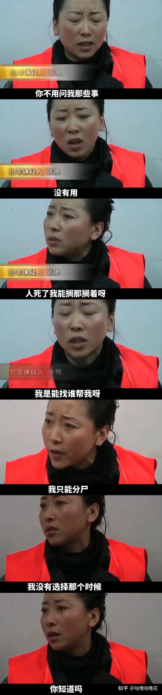
104. <a href="https://www.zhihu.com/people/58-15-70-74">半斤五两</a> (<small title="山东">2026-7-19 14:47:52</small>): 所以我儿子是快乐教育呀。不上辅导班，对成绩没什么要求，该打篮球打篮球该打游戏打游戏，朋友一大堆。去年高考完自己去大理丽江香格里拉玩了十几天，今年暑假自己去骑川藏线（骑完回家了），明年我就鼓励他穷游国外啦。  
 
他的初中班主任可烦我了，说我推崇西式教育，配不上他的应试教育，我管他。
105. <a href="https://www.zhihu.com/people/michael-69-41-97">Michael</a> (<small title="江苏">2026-7-19 9:34:26</small>): 学历贬值不代表文盲升值哈，不学习不一定发财但是会被骗
     - <a href="https://www.zhihu.com/people/36-72-19-45">未起名</a> (<small title="广东">2026-7-19 11:59:8</small>): 学历和骗不被骗没关系，学历是学科知识，骗不骗是社会经验
     - <a href="https://www.zhihu.com/people/michael-69-41-97">Michael</a> (<small title="回复于 2026-7-19 12:33:40/江苏"> ✉️:</small>): 现在只靠社会经验没用！我看过太多做了一辈子生意的土老板被做局骗了，因为不懂法律，不懂社会运行规则。
     - <a href="https://www.zhihu.com/people/36-72-19-45">未起名</a> (<small title="回复于 2026-7-19 12:37:37/广东"> ✉️:Michael</small>): 懂法律能防止被骗？法律是追偿，又不是提前制止，想骗人总有一款适合的局。
     - <a href="https://www.zhihu.com/people/michael-69-41-97">Michael</a> (<small title="回复于 2026-7-19 12:53:19/江苏"> ✉️:</small>): 你是没见过，我见太多了
106. <a href="https://www.zhihu.com/people/paulyim-93">愛國者</a> (<small title="中国香港">2026-7-19 12:28:7</small>): 我不是呀
107. <a href="https://www.zhihu.com/people/whohezi">努力生活的大河</a> (<small title="云南">2026-7-19 9:3:52</small>): 我村里读的小学，镇上读的初中。  
 
真正快乐教育的人，现在在送快递 开挖机。
108. <a href="https://www.zhihu.com/people/liu-yang-40-30">真.不谢顶</a> (<small title="辽宁">2026-7-19 13:52:51</small>): 想得美
109. <a href="https://www.zhihu.com/people/la-luna-37">momo</a> (<small title="中国台湾">2026-7-19 10:18:58</small>): 瞎说什么大实话
110. <a href="https://www.zhihu.com/people/liang-nian-84-69">两年</a> (<small title="四川">2026-7-19 1:16:3</small>): 非要这么说吗［酷］
111. <a href="https://www.zhihu.com/people/viakiki">viakiki</a> (<small title="北京">2026-7-20 9:5:59</small>): 仿佛听到了老郭的声音
112. <a href="https://www.zhihu.com/people/xi-qia-luo-86">DDDDC</a> (<small title="江苏">2026-7-19 11:13:56</small>): 快乐教育至少不让90%人戴眼镜，还有一堆脊柱侧弯，发育期缺乏运动导致四肢小，肩膀窄，大肚子
113. <a href="https://www.zhihu.com/people/zhen-gui-fu-huo">真鬼复活</a> (<small title="上海">2026-7-20 9:10:3</small>): 扯啥淡呢，我就不提农村靠读书改变命运的例子。你好好读书大学出来，不学无术工厂打工的，跑快递的，开滴滴的。好像大家工资都差不读，几千到1万的，可你们的休息时间，工作强度，工作环境这些能相提并论吗？你看的穿，让你家小孩小时候去玩，长大送快递，做苦工呗。又没人拦着你摆烂。
114. <a href="https://www.zhihu.com/people/tang-ji-qian-93">机长</a> (<small title="云南">2026-7-20 9:28:28</small>): 他们会一边撺掇学生来骂你一边攻击所有用例子来赞同你的人
115. <a href="https://www.zhihu.com/people/ruo-xiao-de-fei-zhai">弱小的肥宅</a> (<small title="江苏">2026-7-19 15:37:38</small>): 没想到2026年还能看到这种神贴，欢迎楼里大伙把孩子送去美国读公立学校，我就留着中国就行了［吃瓜］
116. <a href="https://www.zhihu.com/people/shen-bai-ren">公瑾</a> (<small title="吉林">2026-7-20 9:16:52</small>): 怎么没太大关系，起码中式教育累到了啊，提前适应劳累的生活方便你以后当牛马。
117. <a href="https://www.zhihu.com/people/si-tu-jie-54">司徒桀</a> (<small title="广东">2026-7-19 18:46:44</small>): 不是吧，你们就这样咒自己的后代的，可别带人别人，自己祝福自己就好了啊。多转发到家族群里宣传哈
118. <a href="https://www.zhihu.com/people/chi-xin-mu-chuan-ren">赤心木传人</a> (<small title="北京">2026-7-20 8:25:35</small>): 这是大城市病，你在村儿里住两天就知道不学习是地狱。。你说的生活已经是天堂了
119. <a href="https://www.zhihu.com/people/king-al">king</a> (<small title="四川">2026-7-19 14:34:4</small>): 你这见识，就算在村里都算是短浅的
     - **巧克力豆** (<small title="广东">2026-7-19 15:24:18</small>): 见识不分短长，不用的见识在不同的时代整错完全相反，一些还在用前三十年的见识去套用后三十年的人，接下来的日子会非常痛苦。

=[评论](./attachments/comments.json)

