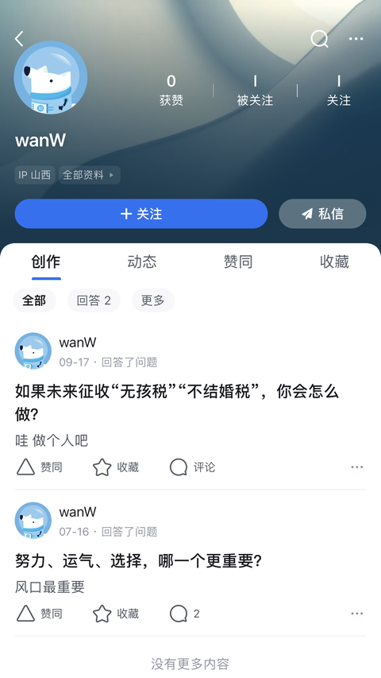
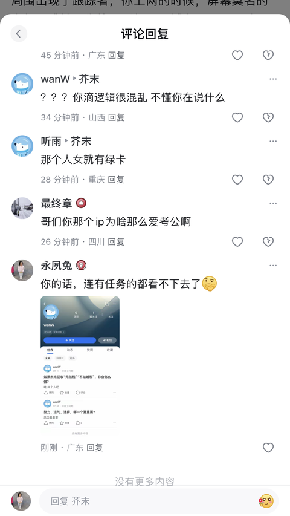

[toc]

# 问题

提问者：**<a href="https://www.zhihu.com/people/ni-da-xia-95">泥大侠</a>**
提问时间: 2026-6-16 3:45:48
总回答数: 2428
总访问量: 6193992

中国历史上叛徒、汉奸有不少，有的甚至会直接导致灭国，对于这些大家怎么看呢？

# 回答

回答者： **<a href="https://www.zhihu.com/people/yi-zhu-xiao-4-82">己住宵</a>**
回答时间: 2026-9-28 19:33:10
点赞总数: 1369
评论总数: 151
收藏总数: 345
喜欢总数：88

你来自农村，你内向、贫穷、老实。

父母当年辛辛苦苦考上好学校被顶替名额了。

他们辛辛苦苦供你上好学校，公费留学名额被空降了，你想报名都没资格。想选导师，可导师们都不想选你。

散伙饭有几个人没去，其中就有你，唯一的好同学也是好朋友要随父母去南方了，把旧苹果手机送给你玩。

被老师、导员、同学刻意孤立的你，在校招上仓促慌张，被故意针对、侮辱、耻笑。

你去社招，到处投简历，石沉大海。

路上提醒高中暑假工，别上“找工作交体检费”这种当，在小巷口被扔玻璃瓶。

晕倒醒来还未反应过来，又被城管以收容人员处理，搜身，扣押东西。

你凭记忆报出导员的手机号，被他带人过来拍照、采访、打造人设。

学校公众号里女权要开除你学籍，嫌你丢人。

你终于低下头，求导员帮忙去取回自己的东西，导员翘着腿，手指夹着笔当做烟，狠狠的斜视、撇嘴几下，同意了。

那天，远隔万里之外，一个不经常在中国也不像中国人的女人因为违反美国法律被控制了，所以你的五成新的旧苹果手机，在你脚旁变身十成新零碎。

你能且只能默默地提醒、告诉自己两件事，1，你对不起唯一的朋友。2，祖辈父辈经历过的gai命、运动、形势，又要来了。装聋作哑，装个痴呆，或者……死人吧。

一分钱难死英雄汉，也难死普通人。

你进厂打螺丝了，一两个月后，你的工资却不知道向谁要，它们都说不归它们管，再问就开除你。你回忆起在流水线上产品的品牌、标志、型号。你上网找到了品牌公司的联系方式，你用你曾经熬夜背单词考四六级的英语水平，把自己打工的遭遇情况发电子邮件过去。两三天后，公司突然来了外国人，产线停了，你被邀约会面，得到道歉和赔偿。几天后，外国人走了，你的新手机开始不停的响，各种口音的辱骂、威胁。你的周围出现了跟踪者，你上网的时候，屏幕莫名的卡顿、跳转。你换了手机号、城市，辱骂、威胁、跟踪、监视依旧。

你最终躲到鹤岗，安静了一段时间，想联系唯一的朋友，消息发过去几分钟后却被拉黑了。陌生号码发过来一条短信，“要怪就怪叔叔阿姨，别怪他，他还小，他的路还很长。”

你尝试搜索一下自己，网络上你是汉人中的奸细，简称汉奸。

你尝试搜索一下当初顶替父母名额上学的人，他们现在一个是全家绿卡的公共奴仆，一个是全家绿卡的人民艺术家。

你尝试搜了一下当初顶替你公费留学的人，接连转校后又接连转单位成了红顶青年科学家。

所以，只能是你，是汉奸。汉奸也只能是你！

  

原文地址：[(己住宵)为什么在我们中国总会有要做汉奸的人？](https://www.zhihu.com/question/2050061492804923683/answer/2087988245611257881) 

# 评论

1. <a href="https://www.zhihu.com/people/lan-ling-xiao-xiao-sheng-72">兰陵笑笑生</a> (<small title="北京">2026-9-29 17:1:53</small>): 其实大部分时候，老百姓都没资格当汉奸，没资格卖国，因为没啥可以卖的。号召全民反间谍，简直就是在搞笑
   - <a href="https://www.zhihu.com/people/54-31-47-71">钱塘江上</a> (<small title="湖北">2026-9-29 18:46:43</small>): 普通人凭什么卖国，有什么资格卖国，什么都不知道，怎么可能卖国［捂脸］［捂脸］［捂脸］去个镇政府还得开导航［捂脸］［捂脸］［捂脸］
   - <a href="https://www.zhihu.com/people/aki1900">无名野犬</a> (<small title="上海">2026-9-29 20:7:7</small>): 大家都能卖的东西没有稀缺性［doge］
   - <a href="https://www.zhihu.com/people/mao-wei-ba-58">褐脚</a> (<small title="河南">2026-9-29 20:44:38</small>): 在公交车上投放反腐倡廉公益广告
   - <a href="https://www.zhihu.com/people/li-ang-7-63">变异鱼</a> (<small title="黑龙江">2026-9-29 23:9:58</small>): 转移视线搅浑水
   - <a href="https://www.zhihu.com/people/mao-ge-ge-2-75">荒野大镖客</a> (<small title="浙江">2026-9-30 9:36:23</small>): 你说说让你当汉奸，你能卖啥？
   - <a href="https://www.zhihu.com/people/8s7etta">momo</a> (<small title="回复于 2026-9-30 10:25:13/广西"> ✉️:钱塘江上</small>): 问题是普通人哪有什么机密啊［捂脸］
   - <a href="https://www.zhihu.com/people/qing-ge-25-66">青歌</a> (<small title="回复于 2026-9-30 11:8:56/四川"> ✉️:荒野大镖客</small>): 只能说一句 sir this way［大笑］
   - <a href="https://www.zhihu.com/people/wilbert-lee">Wilbert Lee</a> (<small title="浙江">2026-9-30 11:28:42</small>): 既然没有，难道不是全民反诈吗？
   - <a href="https://www.zhihu.com/people/57-84-69-19-78-46">柴进</a> (<small title="浙江">2026-9-30 11:55:33</small>): 但是可以是伪军和皇军补给包
   - <a href="https://www.zhihu.com/people/wei-ruan-32-83">了无遗憾</a> (<small title="广西">2026-9-30 12:40:12</small>): 前段时间报道说保洁阿姨贩卖国家机密文件，简直笑死人［大笑］
   - <a href="https://www.zhihu.com/people/miao-bi-qian-shan-6">缘分妙不可言</a> (<small title="回复于 2026-9-30 12:48:9/广东"> ✉️:Wilbert Lee</small>): 那反诈效果想必很有效果对吧
   - <a href="https://www.zhihu.com/people/lao-si-ji-dai-dai-wo-3-12">希丽卡</a> (<small title="河南">2026-9-30 12:52:40</small>): 你说的是行为，但大部分都是临时工背锅［飙泪笑］［飙泪笑］［飙泪笑］
   - <a href="https://www.zhihu.com/people/tang-tang-liang-tai-lang">Star Platinum</a> (<small title="广东">2026-9-30 13:49:46</small>): 但止不住，我们这些外国人被说卖啊。［doge］
   - <a href="https://www.zhihu.com/people/lan-yan-pie-bu-zhi-ji">蓝颜丿不知己</a> (<small title="陕西">2026-9-30 14:45:3</small>): 正解
   - <a href="https://www.zhihu.com/people/xiao-yun-58-41">烛光</a> (<small title="浙江">2026-9-30 14:47:4</small>): 这是大实话。
2. <a href="https://www.zhihu.com/people/10-58-41-75-16">知乎用户不存在</a> (<small title="新疆">2026-9-29 18:34:25</small>): 公费留学空降兵亲眼看过一次，再也不相信了
3. <a href="https://www.zhihu.com/people/yi-liao-bing-62-99">医疗兵</a> (<small title="广东">2026-9-29 18:22:19</small>): 不要去打螺丝，只会被榨干，没任何意义。
   - <a href="https://www.zhihu.com/people/qi-qiao-dian-zi-tang-sheng">关时殊</a> (<small title="浙江">2026-9-30 11:45:17</small>): 我见过很多打螺丝的，到了晚上十点十一点还在厂里打螺丝，而孩子就跟在身边，有读书的，有还没到读书年龄的。
   - <a href="https://www.zhihu.com/people/xin-yang-zhi-guang-19">曹达华</a> (<small title="江苏">2026-9-30 11:48:56</small>): 说的轻松，不打螺丝吃喝拉撒怎么办？
   - <a href="https://www.zhihu.com/people/qi-qiao-dian-zi-tang-sheng">关时殊</a> (<small title="回复于 2026-9-30 13:14:22/浙江"> ✉️:曹达华</small>): 确定如此，不打螺丝，没法活，其实打螺丝也可以是泛指，一些人是很难找到五天八小时小时工作的，有也是工资很低的。时间拉长后，家庭，尤其是孩子又办法照顾到，贫穷像遗传病一样，大概率是能遗传到下一代的。
4. <a href="https://www.zhihu.com/people/bkaun5o8">葱烩鸡汁的二红sa</a> (<small title="河南">2026-9-29 21:39:24</small>): 买笔都卖不出去，还卖果？［doge］
   - <a href="https://www.zhihu.com/people/chen-kang-ming-55">momo</a> (<small title="广东">2026-9-30 10:2:47</small>): ［赞］［赞］［赞］
   - <a href="https://www.zhihu.com/people/43-10-28-29-64">一帆风顺</a> (<small title="广西">2026-9-30 11:32:31</small>): 养活自己及家人！
5. <a href="https://www.zhihu.com/people/52-97-10-20-65">人生若如初相见</a> (<small title="广东">2026-9-30 0:40:37</small>): 你说的这种人连当汉奸的资格都没有。  
 
当汉奸起码要么是身居要职要么就是有枪杆子，普通人连利用价值都没有。
   - <a href="https://www.zhihu.com/people/dan-lan-70-8">momo</a> (<small title="广东">2026-9-30 12:1:40</small>): 但盘盘们就只敢说这些人是罕见
6. <a href="https://www.zhihu.com/people/jie-mo-81-47">芥末</a> (<small title="山东">2026-9-28 19:44:5</small>): 哥们你在中国生活过吗
   - <a href="https://www.zhihu.com/people/lxh6y12r">莫扎</a> (<small title="重庆">2026-9-29 10:13:0</small>): 哥们你在中国生活过吗
   - <a href="https://www.zhihu.com/people/ha-luo-96-9">哈罗</a> (<small title="江苏">2026-9-29 10:32:55</small>): 哥们你在中国生活过吗
   - <a href="https://www.zhihu.com/people/xeedmy">知乎用户xeEdMy</a> (<small title="山西">2026-9-29 14:14:55</small>): 你是00后吗?
   - <a href="https://www.zhihu.com/people/jie-mo-81-47">芥末</a> (<small title="回复于 2026-9-29 14:35:27/山东"> ✉️:知乎用户xeEdMy</small>): 95后
   - <a href="https://www.zhihu.com/people/wanw-49">wanW</a> (<small title="回复于 2026-9-29 15:16:22/山西"> ✉️:芥末</small>): ［捂脸］［捂脸］［捂脸］这破事儿想了解能有一堆 不要在这何不食肉糜了
   - <a href="https://www.zhihu.com/people/jie-mo-81-47">芥末</a> (<small title="回复于 2026-9-29 16:5:16/山东"> ✉️:wanW</small>): 想了解的确有一堆，因为任何小概率事件乘以13亿的基数都约等于百分之百，但是不能说因为小概率事件发生了就不是小概率事件。就回答中说的，上学被冒名顶替，被迫打黑工，活不下去这种几率有多大？
 
或者换个问法，你真实遇到的（不包括传闻）又有多少？有人的地方就有江湖，总会有阴暗面，但是不能尬黑吧。
   - <a href="https://www.zhihu.com/people/jie-mo-81-47">芥末</a> (<small title="回复于 2026-9-29 16:6:59/山东"> ✉️:wanW</small>): 而且现在你找几个人民公仆有绿卡的来看看？纯躺床上臆想？
   - <a href="https://www.zhihu.com/people/xeedmy">知乎用户xeEdMy</a> (<small title="回复于 2026-9-29 16:12:21/山西"> ✉️:芥末</small>): 你们大学毕业那时候形式很好，而到了我们毕业即失业，绩点再高不如早生几年
   - <a href="https://www.zhihu.com/people/uflfse">知乎用户uFlfSE</a> (<small title="浙江">2026-9-29 16:16:11</small>): 哥们你在中国生活过吗
   - <a href="https://www.zhihu.com/people/jie-mo-81-47">芥末</a> (<small title="回复于 2026-9-29 16:16:31/山东"> ✉️:知乎用户xeEdMy</small>): 你咋不问问我学的啥呢，我学的土木工程［大哭］，你能理解30岁的时候行业突然死了是啥感觉吗？就是费劲千辛万苦，学会了七十二变，然后灵山没了
   - <a href="https://www.zhihu.com/people/jie-mo-81-47">芥末</a> (<small title="回复于 2026-9-29 16:39:18/山东"> ✉️:知乎用户uFlfSE</small>): 可以看我在这个评论下的另一个回答
   - <a href="https://www.zhihu.com/people/jing-lan-82-78">箐灆</a> (<small title="回复于 2026-9-29 16:48:37/广东"> ✉️:芥末</small>): 我设计一样 好不容易混到高级了 行业被ai干掉了
   - <a href="https://www.zhihu.com/people/wanw-49">wanW</a> (<small title="回复于 2026-9-29 16:59:45/山西"> ✉️:芥末</small>): ？？？你滴逻辑很混乱 不懂你在说什么
   - <a href="https://www.zhihu.com/people/8-8-55-14-22">听雨</a> (<small title="回复于 2026-9-29 17:6:0/重庆"> ✉️:芥末</small>): 那个人女就有绿卡
   - <a href="https://www.zhihu.com/people/shi-xiao-84-44">最终章</a> (<small title="四川">2026-9-29 17:8:13</small>): 哥们你那个ip为啥那么爱考公啊
   - <a href="https://www.zhihu.com/people/xiao-wei-42-94-16">永夙兔</a> (<small title="广东">2026-9-29 17:34:11</small>): 你的话，连有任务的都看不下去了［思考］ 
   - <a href="https://www.zhihu.com/people/xiao-wei-42-94-16">永夙兔</a> (<small title="广东">2026-9-29 17:34:38</small>): 
   - <a href="https://www.zhihu.com/people/leo-23-96-17">至尊宝</a> (<small title="重庆">2026-9-29 18:22:1</small>): 还是山东人有说法
   - <a href="https://www.zhihu.com/people/jiao-zhe-42">今天又违反了哪条</a> (<small title="天津">2026-9-29 18:53:52</small>): 哥们你这个山东特别山东，又山东到不像是中国那个山东。
   - <a href="https://www.zhihu.com/people/fei-zhou-xiao-bai-lian-15-20">U.law.my.laugh</a> (<small title="回复于 2026-9-29 19:12:30/河北"> ✉️:芥末</small>): 不是概率有多大，这种事情就不应该发生懂吗？
   - <a href="https://www.zhihu.com/people/ren-lei-zhi-zheng-yi">人类之正义</a> (<small title="浙江">2026-9-29 19:22:17</small>): 所以为什么总是你？
   - <a href="https://www.zhihu.com/people/jie-mo-81-47">芥末</a> (<small title="回复于 2026-9-29 19:37:17/山东"> ✉️:U.law.my.laugh</small>): 不应该发生的事情有很多，但是抱歉，人性如此，规则如此，世界上没有圣人，也没有完美的规则，更没有所谓的大同社会，所以只能是魔高一尺，道高一丈，然后魔高两丈，道高十丈，循环往复，循环的过程就是历史的车轮
   - <a href="https://www.zhihu.com/people/zxpc-82-87">zxpc</a> (<small title="湖北">2026-9-29 19:40:44</small>): 俊。［大笑］
   - <a href="https://www.zhihu.com/people/trick-9-89">精神病科崔主任</a> (<small title="北京">2026-9-29 20:18:10</small>): 俊福
   - <a href="https://www.zhihu.com/people/wuanma">wuanma</a> (<small title="回复于 2026-9-29 21:31:55/四川"> ✉️:芥末</small>): 每一个靠关系挤进某个行业的人 都会顶替掉一个本可以靠能力进去的人 被顶替的人大概率是不知道自己其实是被顶替掉的 所以你看看身边 有多少裙带就有多少被顶替的 从几十年前明目张胆的国企顶班到现在的萝卜坑
   - <a href="https://www.zhihu.com/people/michaelyuan">michaelyuan</a> (<small title="陕西">2026-9-29 21:37:18</small>): 哥们你在中国生活过吗
   - <a href="https://www.zhihu.com/people/fei-dao-38-45">非道</a> (<small title="回复于 2026-9-29 22:7:47/浙江"> ✉️:芥末</small>): 概率有多大，你自欺欺人当然可以说自由平等文明法治，可事实么，你口口声声问别人有多大概率，却一直在问完全不看别人说的话
   - <a href="https://www.zhihu.com/people/kafka-87">kafka</a> (<small title="回复于 2026-9-29 22:27:47/北京"> ✉️:芥末</small>): 95后的山东小伙，难怪
   - <a href="https://www.zhihu.com/people/ni-wu-ge-93">你武哥</a> (<small title="湖南">2026-9-29 22:59:20</small>): 多去研究鱼头酒得了
   - <a href="https://www.zhihu.com/people/ssl-69-62">IBrahimovic</a> (<small title="湖北">2026-9-29 23:11:16</small>): 哥们你在中国生活过吗
   - <a href="https://www.zhihu.com/people/83-47-24-21-62">四谷见子</a> (<small title="美国">2026-9-29 23:57:59</small>): 唉
   - <a href="https://www.zhihu.com/people/yu-si-tian-64">雨思天</a> (<small title="山东">2026-9-30 0:40:26</small>): 你在中国生活过嘛？
   - <a href="https://www.zhihu.com/people/yi-zhu-jia-36-75">抬弯渻长</a> (<small title="湖北">2026-9-30 1:41:25</small>): 哥们你在中国生活过吗
   - <a href="https://www.zhihu.com/people/da-hai-de-shen-chen-46">大海的深沉</a> (<small title="江西">2026-9-30 1:41:48</small>): 你山东的，没 体会吗，山河四省啊
   - <a href="https://www.zhihu.com/people/jie-mo-81-47">芥末</a> (<small title="回复于 2026-9-30 7:54:19/山东"> ✉️:大海的深沉</small>): 的确有不公存在，但是像答主回答里这么惨的，我没见过，我身边的人也没见过，我没听说过，我身边的人也没听说过
   - <a href="https://www.zhihu.com/people/jie-mo-81-47">芥末</a> (<small title="回复于 2026-9-30 7:58:56/山东"> ✉️:非道</small>): 要不你看看我说的话呢［感谢］［感谢］
   - <a href="https://www.zhihu.com/people/fei-dao-38-45">非道</a> (<small title="回复于 2026-9-30 8:11:15/浙江"> ✉️:芥末</small>): 你只会车轱辘话没见过没见过，有多少不知道［飙泪笑］这也叫话？
   - <a href="https://www.zhihu.com/people/zi-ming-qing-gao-99">晚生</a> (<small title="山东">2026-9-30 9:41:24</small>): 俊福
   - <a href="https://www.zhihu.com/people/jie-mo-81-47">芥末</a> (<small title="回复于 2026-9-30 9:49:44/山东"> ✉️:非道</small>): 你说的这么真，你见过吗？你坐标浙江，概率不要求太高，达到百万分之一就算我说的不对，浙江人口6500万，你能找到浙江一年内65件本科，研究生，留学被冒名顶替的案件，不要求都在一个人身上，也不要求都是你身边的，只要你能找到，就算我是汉奸，你要是找不到，你就是道听途说，人云亦云的汉奸，这算公平吧。
   - <a href="https://www.zhihu.com/people/feng-mi-ning-meng-shui-57">蜂蜜柠檬水</a> (<small title="江苏">2026-9-30 10:8:34</small>): 经典ip
   - <a href="https://www.zhihu.com/people/fang-cun-gan-kun-zhuan">焚天</a> (<small title="云南">2026-9-30 10:28:46</small>): 艾皮正确
   - <a href="https://www.zhihu.com/people/heng-heng-ji-ji-47-55">水煮大肉包</a> (<small title="回复于 2026-9-30 10:37:27/浙江"> ✉️:芥末</small>): 明面上有绿卡的公仆都会被开除了党籍，没有党籍的绿卡不叫公仆；暗地里有绿卡的公仆普通人也看不到，所以你口中的“人民公仆”怎么可能有绿卡［为难］
   - <a href="https://www.zhihu.com/people/han-wen-95-59">翰文</a> (<small title="天津">2026-9-30 11:49:0</small>): 哥们你在中国生活过吗
   - <a href="https://www.zhihu.com/people/8-75-18-12-92">树懒</a> (<small title="回复于 2026-9-30 11:58:14/江苏"> ✉️:芥末</small>): 你去底下看看呢…  
 
都不要求你去中西部的农村看看，你就去你所在地级市底下随便挑一个县城转转，你再问这个问题
   - <a href="https://www.zhihu.com/people/twist-97">十三香大王</a> (<small title="江苏">2026-9-30 11:58:27</small>): 山东这IP多少有点说法
   - <a href="https://www.zhihu.com/people/jie-mo-81-47">芥末</a> (<small title="回复于 2026-9-30 12:35:59/山东"> ✉️:树懒</small>): 我就来自山里啊，贫困县的山里
   - <a href="https://www.zhihu.com/people/jie-mo-81-47">芥末</a> (<small title="回复于 2026-9-30 12:37:52/山东"> ✉️:水煮大肉包</small>): 所以你的意思是没党籍的公仆有绿卡，那么问题来了，没党籍的公仆是什么公仆？合同工？劳务派遣？还是辅警？
   - <a href="https://www.zhihu.com/people/m8truea">小看山M8tRueA</a> (<small title="上海">2026-9-30 12:43:48</small>): 可能山东和中国不一样
   - <a href="https://www.zhihu.com/people/jie-mo-81-47">芥末</a> (<small title="回复于 2026-9-30 12:46:33/山东"> ✉️:wuanma</small>): 你说的没错，我被裁员的原因就是没有后台，所以被裁了，工程行业如此，其他行业也是，但是能怎么办呢，这不是规则的问题，这是人性的问题，不光我国有这个问题，人类历史几千年，人类一代代地更迭制度，还是阻挡不住人性，无论是比烂也好，或者是借口也罢，全世界有人的地方就有这种情况，这不能成为当汉奸的理由。
   - <a href="https://www.zhihu.com/people/bao-zao-lao-ge-69-38">暴躁老哥</a> (<small title="广东">2026-9-30 13:6:49</small>): 又是山东［飙泪笑］
   - <a href="https://www.zhihu.com/people/wuanma">wuanma</a> (<small title="回复于 2026-9-30 13:42:45/四川"> ✉️:芥末</small>): 我只是针对你说的被顶替的情况身边并非比比皆是这个意思做的回答 不涉及其他 另外我觉得那些顶替别人的无能却有关系者 应该算是汉奸 占着茅坑拉不出屎 还让被顶替者满腹怨气 岂不是耽误了国家的进步 耽误了祖国的复兴大业 至于你所说的向来如此 我借用鲁迅的话 向来如此 那便对吗 回答你 鲁迅真说过的［滑稽］
   - <a href="https://www.zhihu.com/people/ju-zi-29-41">橘子</a> (<small title="回复于 2026-9-30 13:43:41/广东"> ✉️:莫扎</small>): 哥们，你过得真惨，但是我不同情你
   - <a href="https://www.zhihu.com/people/mao-ting-wan-ye-si-liao-54">猫听完也死了</a> (<small title="山东">2026-9-30 14:10:54</small>): 那问题来了，提问的本来就是小概率事件，你身边难道汉奸比中国人还多？那提问了小概率事件，用小概率事件回复有什么问题？
 
“鸡蛋为什么臭了？”
 
“因为这个蛋生下来的时候碰到石头磕碎了”
 
“磕碎了是小概率事件，全中国肉鸡150亿只，任何鸡蛋乘以150亿都是小概率事件，磕碎了只是小概率事件！”
 
［为难］你不觉得你才是荒唐的那个吗？［为难］
7. <a href="https://www.zhihu.com/people/36-63-73-13">摆烂崽</a> (<small title="四川">2026-9-29 23:55:9</small>): 简单的来说就是 人与人 人与团体之间都充满不同矛盾 民族矛盾只是其中一种  
 
而阶级矛盾也非常尖锐 当你整体条件在阶级鄙视链的低端 那么就会有人萌生出别样的情愫
8. <a href="https://www.zhihu.com/people/73-63-78-96">龍龖龘</a> (<small title="广东">2026-9-29 19:51:11</small>): 我滴乖乖，写实小能手啊［赞］
9. <a href="https://www.zhihu.com/people/1111-69-24-86">五院精神科冯大夫</a> (<small title="山东">2026-9-30 9:46:41</small>): 这种人当不了汉奸，没有价值。  
 
能当汉奸的，至少是在当地有一定名望的，比如以前的族长，保长之类。
   - <a href="https://www.zhihu.com/people/xi-lai-fu-22">all in 半导体</a> (<small title="上海">2026-9-30 14:23:5</small>): 白鹿原，有没有描写山东那段时期的好的小说，我想读一下？
10. <a href="https://www.zhihu.com/people/pu-yu-57-20">北极星</a> (<small title="四川">2026-9-29 20:56:34</small>): 很遗憾现实里的外国人连大清都取代不了，看来他们并没有你笔下写的那么文明呐
    - <a href="https://www.zhihu.com/people/44-34-25-42-77">绝对不能让它知道</a> (<small title="河北">2026-9-29 22:37:16</small>): 但是为了几千块钱的工资，花上几万，十几万跨省把一个人真实致死，他们绝对能干得出来
    - <a href="https://www.zhihu.com/people/yuan-bai-tu-abc">圆白兔ABC</a> (<small title="湖北">2026-9-30 3:45:28</small>): 所以说阶级矛盾是不可调和的，同一民族不代表利益是否一致，完全是无关变量。
    - <a href="https://www.zhihu.com/people/jia-yin-86-35">珈音</a> (<small title="回复于 2026-9-30 12:55:32/江苏"> ✉️:绝对不能让它知道</small>): ［为难］［为难］［为难］［为难］
11. <a href="https://www.zhihu.com/people/ping-jing-de-kuang-zao-zhe">平静的狂躁者</a> (<small title="四川">2026-9-30 11:24:23</small>): 你为什么对底层人有这么大的恶意。完全是个人臆断，什么数据支撑都没有。事实恰恰与你的言论相反，那些汉奸和润人是集中在社会中高层。
12. <a href="https://www.zhihu.com/people/32-35-1-15">波塞冬</a> (<small title="山东">2026-9-30 13:0:42</small>): 国企招三人，专业对口笔试第一，被三个体育、、美术专业外行断崖领先成第四了，人家没有一个避讳的，明着告诉你，你就是来陪考的
13. <a href="https://www.zhihu.com/people/nei-xiang-34">保持愤怒</a> (<small title="广西">2026-9-29 15:58:48</small>): 记录在案！
14. <a href="https://www.zhihu.com/people/cat-73-85-30">Cat</a> (<small title="山西">2026-9-30 11:55:18</small>): 因为没有民族国家认同啊
15. <a href="https://www.zhihu.com/people/csz--25">Csz </a> (<small title="日本">2026-9-30 8:52:36</small>): 以上说的都是小概率事件，但炉石传说大概率出现小概率事件
16. <a href="https://www.zhihu.com/people/zhaleta">zhaleta</a> (<small title="山西">2026-9-30 9:31:55</small>): 绝世好文
17. <a href="https://www.zhihu.com/people/57-44-3-57">好吃猫</a> (<small title="重庆">2026-9-29 22:47:12</small>): 请问能否私信告知一下真实案例
    - <a href="https://www.zhihu.com/people/chen-xi-22-43-6">晨曦</a> (<small title="广东">2026-9-30 11:10:57</small>): 巧了每个单独拿出来都有成堆的案例，还都是新闻报道过的，怎么会看知乎不会看新闻么？
    - <a href="https://www.zhihu.com/people/chen-jia-hao-67-95">风华</a> (<small title="江西">2026-9-30 11:58:46</small>): 眼睛瞎了很可怕，心瞎了更可怕
    - <a href="https://www.zhihu.com/people/dan-lan-70-8">momo</a> (<small title="广东">2026-9-30 12:2:5</small>): 少玩原神
    - <a href="https://www.zhihu.com/people/servo-30">momo</a> (<small title="浙江">2026-9-30 12:38:1</small>): 这种事到处都是
    - <a href="https://www.zhihu.com/people/buoy-base">酒狐</a> (<small title="上海">2026-9-30 13:1:3</small>): 存在，但没人这么倒霉能所有事件都遇上一遍
    - <a href="https://www.zhihu.com/people/sheng-yong-cao">胜永曹</a> (<small title="广东">2026-9-30 13:21:34</small>): 最近那个湖南老朱不是很明显的例子嘛，一个博士村里吃低保，别人拿他成果当院士
18. <a href="https://www.zhihu.com/people/44-34-25-42-77">绝对不能让它知道</a> (<small title="河北">2026-9-29 22:37:45</small>): “为了几千块钱的工资，花上几万，十几万跨省把一个人真实致死”，这个绝对是真的。  
 
当然之前的也绝对是真的。
    - <a href="https://www.zhihu.com/people/wang-xin-heng-85">战斗力崩坏的勃勃</a> (<small title="河南">2026-9-30 0:28:20</small>): ？哈哈哈
    - <a href="https://www.zhihu.com/people/gui-niao-72">归鸟</a> (<small title="江苏">2026-9-30 13:39:26</small>): 这个有什么真实案例吗？
    - <a href="https://www.zhihu.com/people/44-34-25-42-77">绝对不能让它知道</a> (<small title="回复于 2026-9-30 14:29:7/河北"> ✉️:归鸟</small>): 真实的怎么上新闻呢？只能有零星的受害者在知乎等网站陈述自己被害的具体经历，都是莫名其妙，没有任何理由就被害了。
19. <a href="https://www.zhihu.com/people/lan-yan-pie-bu-zhi-ji">蓝颜丿不知己</a> (<small title="陕西">2026-9-30 14:45:29</small>): 四层楼那么高［酷］
20. <a href="https://www.zhihu.com/people/27-77-53-33-34">最后一人</a> (<small title="辽宁">2026-9-30 14:8:2</small>): 有点更现实版的中专鼠鼠的味道了（原作纯属收集战败cg），但这个在逻辑上是有可能发生的，虽然在统计学上概率极小
21. <a href="https://www.zhihu.com/people/tian-la-lu-53-58">一路向北</a> (<small title="江苏">2026-9-30 13:55:52</small>): 前两天有个广西的教授，翻越广西抗战时候的汉奸，并查了一下他们后代的情况，结论是，当时的大汉奸身份集中于地主，中学校长，某某局局长等，这部分人抗战胜利后枪毙了，他们的后代大部分又以华侨身份混迹于国内外商场［机智］。
22. <a href="https://www.zhihu.com/people/ai-deng-pi-er-si-81">洛嘉·奥瑞利安</a> (<small title="江苏">2026-9-30 14:0:42</small>): 倒霉熊不是停播了吗？
23. <a href="https://www.zhihu.com/people/matt-clause">温油至死</a> (<small title="河南">2026-9-30 13:15:0</small>): 贫穷、内向、老实，感觉这六个字已经能概括一大堆小镇做题家的性格了
24. <a href="https://www.zhihu.com/people/gui-yang-mu-zhe">鬼羊牧者</a> (<small title="上海">2026-9-30 1:41:0</small>): 这是独属于我们知乎的中专鼠鼠，请大家多捧场［感谢］
25. <a href="https://www.zhihu.com/people/uftyhyh">uftyhyh</a> (<small title="美国">2026-9-30 4:10:4</small>): ［doge］出书吧
26. <a href="https://www.zhihu.com/people/mo-lu-73-72">默路</a> (<small title="河南">2026-9-30 9:24:23</small>): 普通人也没啥资格当啊，他有也只有自己这一亩三分地了
    - <a href="https://www.zhihu.com/people/57-84-69-19-78-46">柴进</a> (<small title="浙江">2026-9-30 11:58:22</small>): 楼主的意思不是当汉奸，而是被当作汉奸
27. <a href="https://www.zhihu.com/people/1-33-25-76-65">点点点</a> (<small title="四川">2026-9-30 12:43:9</small>): 曾经清朝的时候，清朝发生了很多动摇国本的大事。有钱有资源的润到了外国，几代过后。带着在海外学到的技术和当年从清朝拿走的金钱回来。就成了英雄
28. <a href="https://www.zhihu.com/people/ri-yue-gong-ming-43">日月共明</a> (<small title="广东">2026-9-30 0:49:36</small>): 我不太相信这种［好奇］
    - <a href="https://www.zhihu.com/people/rui-yun-yier-xing">momo</a> (<small title="广东">2026-9-30 9:39:25</small>): 每个独立事件真实，发生在一个人身上小概率
    - <a href="https://www.zhihu.com/people/wu-feng-de-xin-62">无风的心</a> (<small title="湖北">2026-9-30 9:47:59</small>): 不相信对你自己来说是好事，因为这说明你的生活很幸福，没有这种杂七杂八的事情的影响，当你开始对这种事情深信不疑的时候，最起码就说明你边上的环境很恶劣，或者你自己就在遭受这种事情
29. <a href="https://www.zhihu.com/people/52-97-10-20-65">人生若如初相见</a> (<small title="广东">2026-9-30 0:41:17</small>): 累死在流水线前的幻想罢了
30. <a href="https://www.zhihu.com/people/xin-yuan-115">电玩狂人F</a> (<small title="江西">2026-9-30 12:4:2</small>): 最后一句应该改成：所以，我拒绝躺平［酷］
31. <a href="https://www.zhihu.com/people/patrick-65-94-36">Patrick</a> (<small title="北京">2026-9-30 11:24:25</small>): 你是乔治奥威尔？
32. <a href="https://www.zhihu.com/people/jue-xing-de-xing-xing">爱你本比格</a> (<small title="河南">2026-9-30 11:52:4</small>): 为什么专挑这些报道［生气］，你要像国家爱你一样爱国家
33. <a href="https://www.zhihu.com/people/wangjun-59-75">John</a> (<small title="上海">2026-9-30 12:7:34</small>): ［赞同］
34. <a href="https://www.zhihu.com/people/21-22-65-94-95">不予垃圾以金言</a> (<small title="江苏">2026-9-30 14:18:10</small>): 将军丢了城，只要活着，可能还是将军。换个阵营就行。正例参考唐生智，反例参考张灵甫。  
 
士兵丢了阵地，死了也不一定是烈士，也可能是反动派顽抗分子。活着，那么就是逃兵，逮到还是个死。这个没有参考，真想参考，就参考台湾的忠烈祠吧。万人一箱记着呢。［大笑］  
 
所有的战争，都不过是一帮穷人孩子去打另一帮穷人孩子。
35. <a href="https://www.zhihu.com/people/yan-shu-77-7">妍姝</a> (<small title="河南">2026-9-30 14:34:0</small>): 立本最缺的就是爱
36. <a href="https://www.zhihu.com/people/lao-qi-3-95-89">老七</a> (<small title="山西">2026-9-29 23:50:23</small>): 这还没被屏蔽
37. <a href="https://www.zhihu.com/people/bei-ming-you-yu-22-10">北冥有鱼</a> (<small title="安徽">2026-9-30 11:54:39</small>): 大概率，这类人会起义，敢叫日月换新篇，最次也是1换1。
 
而侵占他人权益的人，为了利益会当汉奸。这是个人底色决定的。
 
  
 
答主这明显是要给汉奸洗白啊。不是反应了真实存在的社会现实，就代表这个论据可以论证汉奸的产生原因。这叫偷换概念。
 
  
 
抗日战争时期的汉奸身份大多是：地方豪强、伪政府职务、伪军编制。
 
当前网络上的“汉奸”：身份高度隐蔽，多以普通网民、公知、行业精英身份出现，常以“客观中立”“理性批评”为伪装。
 
  
 
答主你说的“汉奸”，他有这个“认知”么？
    - <a href="https://www.zhihu.com/people/li-qiao-lin-75">天河</a> (<small title="广东">2026-9-30 14:23:33</small>): 起义也要口才好。
38. <a href="https://www.zhihu.com/people/Happy--exp-z">开心expz</a> (<small title="北京">2026-9-30 0:56:22</small>): 没看懂，这是被栽赃陷害了吗
    - <a href="https://www.zhihu.com/people/44-34-25-42-77">绝对不能让它知道</a> (<small title="河北">2026-9-30 4:32:2</small>): 对的，就是如此
    - <a href="https://www.zhihu.com/people/53-21-70-90-1">就你叫乐基啊</a> (<small title="辽宁">2026-9-30 5:37:41</small>): 网文段子整合罢了。［doge］
39. <a href="https://www.zhihu.com/people/46-67-92-86-94">我的微博</a> (<small title="山东">2026-9-29 23:53:58</small>): 描写的很生动［感谢］［感谢］
40. <a href="https://www.zhihu.com/people/yuan-lai-91-62">缘来</a> (<small title="湖北">2026-9-30 13:24:55</small>): 普通人连卖国都没资格，你只有自己一条不值钱的命，没人要的，你没有人脉资源，人家选汉奸都不选你
41. <a href="https://www.zhihu.com/people/jiu-yue-82-83">九月</a> (<small title="四川">2026-9-30 5:39:0</small>): 炒股的人有当汉奸潜力，哈哈，被坑太多了
42. <a href="https://www.zhihu.com/people/wang-wei-ren-shi-sun-cheng-zong">老吴啊</a> (<small title="广东">2026-9-30 10:4:53</small>): 说实话这些事现实中遇到一两件都算倒了大霉了，这哥们居然全遇上了，这已经不是哪国人的问题，纯粹是命运满满的恶意，这运气跑去阿美瑞卡也是父母因为失业被斩杀，自己十几岁就遇到校园枪击嗝屁的水平
    - <a href="https://www.zhihu.com/people/li-da-zhao-40-34">地堡P</a> (<small title="北京">2026-9-30 12:57:47</small>): 依旧甩锅给海量个例
43. <a href="https://www.zhihu.com/people/sa-de-men-tu-15">天命玄鸟</a> (<small title="天津">2026-9-28 19:50:21</small>): 所以抗日战争时都是穷苦老百姓当汉奸，是吗？
    - <a href="https://www.zhihu.com/people/uflfse">知乎用户uFlfSE</a> (<small title="浙江">2026-9-29 16:16:46</small>): 几百万伪军不是跟你开玩笑的
    - <a href="https://www.zhihu.com/people/gao-yang-45-76-99">不想起床的树袋熊</a> (<small title="回复于 2026-9-29 16:18:7/上海"> ✉️:知乎用户uFlfSE</small>): 听说伪军比鬼子还多，不知道是不是真的？
    - <a href="https://www.zhihu.com/people/wang-chen-48">我爱大聪明</a> (<small title="回复于 2026-9-29 16:27:5/四川"> ✉️:不想起床的树袋熊</small>): 那段历史可不是指环王，几万到几百万的幽灵军队不能被凭空变出来。［吃瓜］
    - <a href="https://www.zhihu.com/people/uflfse">知乎用户uFlfSE</a> (<small title="回复于 2026-9-29 18:9:8/浙江"> ✉️:不想起床的树袋熊</small>): 对啊，而且伪军为了表忠心往往行事比日军还要残暴，以前很多山村山沟沟里的地方日军找不到，都是伪军带路的
    - <a href="https://www.zhihu.com/people/zniqgns5">知乎用户DEYX</a> (<small title="上海">2026-9-29 18:58:9</small>): 捻军，太平天国：难道我们是太有钱了，才起来谋反干大清寻求刺激？
    - <a href="https://www.zhihu.com/people/93-97-82-14-58">诸葛南瓜</a> (<small title="山西">2026-9-29 21:17:34</small>): 能当伪军的，日本投降了还可以当国军，当然他们当了国军也还会继续投降，他们始终是赢家，那汉奸不是穷苦老百姓还能是这些赢家吗？
44. <a href="https://www.zhihu.com/people/zhuo-hua-60-31">Aphrodite</a> (<small title="浙江">2026-9-30 12:7:43</small>): 谁把这文章塞我手机里了［大哭］我真的一个字都没看，我们家祖祖辈辈都是文盲，不识字［酷］
    - <a href="https://www.zhihu.com/people/he-chao-yang-1">圣三一</a> (<small title="广东">2026-9-30 13:11:11</small>): 我证明，你是语音输入的［赞同］
45. <a href="https://www.zhihu.com/people/ttbu-gem">TT布咁</a> (<small title="广西">2026-9-30 10:38:24</small>): 啊？开始了，受害者叙事，来解释我没问题，都是社会的问题，本质巨婴
    - <a href="https://www.zhihu.com/people/62-94-4-8">梦呓</a> (<small title="河南">2026-9-30 10:56:12</small>): 来了来了 依旧代入加害者视角 社会没问题 都是我有问题 ［飙泪笑］
    - <a href="https://www.zhihu.com/people/bao-zao-lao-ge-69-38">暴躁老哥</a> (<small title="广东">2026-9-30 13:15:37</small>): 确实，广c发展不行，广c人要自己找找原因
46. <a href="https://www.zhihu.com/people/e-e-e-76-62-12">鹅鹅鹅</a> (<small title="广东">2026-9-29 21:42:44</small>): 谈卖国自不量力，谈爱国自作多情
47. <a href="https://www.zhihu.com/people/k--53-63-13">老K-这个名字太短</a> (<small title="英国">2026-9-30 2:32:23</small>): 做汉奸也是先轮到他们

=[评论](./attachments/comments.json)

