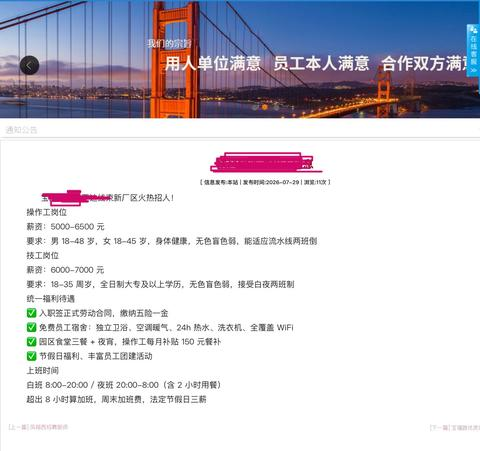

[toc]

# 问题

提问者：**<a href="https://www.zhihu.com/people/cui-wei-79-71">睡眼惺忪</a>**
提问时间: 2026-8-4 6:58:49
总回答数: 131
总访问量: 230661

为什么工人们宁愿联合起来就为了多加班多干活，也不愿意联合起来要求涨工资呢？

# 回答

回答者： **<a href="https://www.zhihu.com/people/66-78-96-52-48">广州大叔</a>**
回答时间: 2026-8-5 15:31:18
点赞总数: 1824
评论总数: 264
收藏总数: 358
喜欢总数：226

干过的，没成功，抓走了十几个人，又开除了二十几个人，工资一分没加，恢复平静。

我以前上班的单位，2010年发生过一次大罢工，停产五天，上街游行一次。

大家都知道2008年美国次贷危机引爆全球经济危机，我公司没能幸免，业务量减少一半，公司由两班倒改为三班倒，没了加班费。

其他福利都被砍掉，办公室人员降薪15%。

订单减少是事实，员工都理解，和公司共渡难关。

我公司是一家大型制造业，员工接近8000人，工资低，新招员工按广州市最低工资标准招进，每年有一次加薪机会，50%的员工能加薪，多少不等，少的加10元，多的加100元。

当时广州市最低工资标准记得是1750元，大部分员工基本工资2000元左右。

加班全部按劳动法规定计算，加班费比基本工资高，没降薪前每个月能拿到4000多元，有夜班补助2元/小时、工龄补助50元/年。

降薪以后每个月拿基本工资2000多元，大家都没有怨言，公司遇到了困难，自己收入减少，节省着花，总能应付，只要公司不倒闭，有上班的地方就行。

那次经济危机没有持续多久，原因不在本文讨论，2009年下半年恢复正常，我公司订单比危机前还增加一些，因为有些小公司倒闭了。

员工恢复两班倒，每天上12小时，周末不休息，比以前更忙更累。

按理说被砍掉的福利应该恢复，公司迟迟没动静，员工向领导提出来，层层上报，中层干部在会议上传达了员工的要求。

为此公司下发一份文件，说明危机期间公司亏损严重，希望大家理解，但没有说明会不会恢复、什么时候恢复。

员工好说话，公司有说明就行，亏损严重是事实，已经恢复两班倒，收入翻倍。

此事又翻篇过去。

2010年下半年，员工再次提出恢复被砍掉的福利，恢复正常生产快一年，危机时间也只有一年，亏损部分应该填补好了。

公司上层这次误判、做出错误决定，他们以为第一次降薪员工没有意见，第二次拒绝恢复福利员工接受了，说明大家对目前待遇满意，不恢复没有问题。

又发文说明，我记得大致内容如下：

> 公司目前给大家提供的待遇在同行业里是好的；  
> 大家的工资都高于当地最低工资标准，公司没有违法；  
> 没有法律规定一定要支付工龄补助，公司决定从今以后取消这项福利；  
> 接受大家的要求，支付夜班补贴，每天零点到五点，按2元/小时支付；  
> 办公室人员下降的15%工资不恢复，每年一次加薪时调济；  
> 希望大家珍惜工作机会！

这次员工不接受，首先由工会主席出面和公司交谈，公司安排人事经理和工会主席对接。

这是应付，没有结果的。

我公司工会主席不脱产，也不是员工选出来的，老板直接任命的，总经理办公室主任兼任。

总经办主任和人事经理谈判，相当于老板的左手和右手理论，全由大脑控制。

工会主席假惺惺地做大家的工作，无非是大家待遇可以了，不要太贪，珍惜工作机会等。

员工不干，开始消极怠工，产量和产品质量开始下降，老板很火，决定成立巡查队，由人事经理牵头，老板几个亲信组成，保安跟着，24小时在车间巡查，发现偷懒的员工立即开除。

老板想杀鸡儆猴，震慑住大家，恢复正常生产。

第一天开除了六个员工。

第二天全体员工罢工，纯是自发的，没有人组织。

几个巡查队员被员工揍了一顿。

大家从岗位上撤离到篮球场、食堂里坐着。

不生产订单交不了，面临赔偿，老板才着急起来。

但他绝对不松口，只要求大家先回岗位生产，选几个代表出来和公司谈判。

员工要求谈好了再工作，又僵持住。

这次老板让步，让员工选三个代表出来，立即谈。

第二天三个员工代表和公司面对面谈，公司谈判代表是人事经理和另两名亲信。

公司代表什么都不表态，只是记录员工代表提出的要求，答应向老板汇报后公布结果，但他们代表老板要求员工立即复工。

该要求员工不接受，一开始大家已决定谈好了再复工。

第二天晚上，三名员工代表失踪，员工火气一下被点着，有人大呼：我们去政府讨说法。

就这样，几千个人组成的游行队伍去区政府请愿，要求放人，区维稳办接待的，他们答应调查、协调、处理，但大家必须立即回公司，不能造成社会影响。

既然答应处理，大家回到公司，继续静坐。

下午三名员工代表回来了，据他们介绍，零晨突然被抓走的，没有任何人找他们谈话，在那里关了十几个小时。

回来前有位领导和他们说明情况：抓他们是个人行为，不是组织安排的，会对相关人员给予处罚。

第四天又坐了一天，双方没有接触。

第五天风向突变，大家坐在篮球场和员工食堂里，突然开进来几辆车，从车上下来几十个穿制服的人，手拿棍棒。

有一个人站出来，用喇叭喊话：

> 所有人立即回岗位工作，半个小时后这里清场。

非常严厉，不容商量。

没有人动，那个人继续喊话，重复命令大家回岗位。

有些胆子小的开始动摇，回岗位去。

只要有第一个，就会有第二个，陆陆续续走了一大半。

留下来的都是胆子大、不信邪的，依然坐在那里岿然不动。

半个小时一过，穿制服的人员开始行动，棍棒挥舞，前面的人被打得鬼哭狼嚎，后面的人见势不妙，马上跑回车间。

坐在前面的是罢工积极分子，被打后有的跑开了，没来得及跑的被抓走，总共抓走13人。

清场了，大家回到岗位，开始干活。

本以为这事就这么过去了，没想到第二天又有24个人被公司开除。

从此以后，再也没人敢提工龄补贴的事，办公室人员15%的工资没了，谁也不敢说。

我是 [@广州大叔](https://www.zhihu.com/people/0f67533862b240b1c3a5bb87de6809da)

[@知乎职场](https://www.zhihu.com/people/7da508b3129cef2b0105fc704dd7249d)

  

原文地址：[(广州大叔)为什么工人们宁愿联合起来就为了多加班多干活，也不愿意联合起来要求涨工资呢？](https://www.zhihu.com/question/2067867073200575910/answer/2068358430247723959) 

# 评论

1. <a href="https://www.zhihu.com/people/lxh6y12r">莫扎</a> (<small title="重庆">2026-8-6 9:39:39</small>): 之前广东哪儿了不是骑手集体罢工，然后美团直接从隔壁市调骑手过来
   - <a href="https://www.zhihu.com/people/phynics">phynics</a> (<small title="上海">2026-8-6 13:12:36</small>): 汕头吧，美团宁可给别的地方加钱调人过来也不涨当地待遇。
   - <a href="https://www.zhihu.com/people/ji-su-gua-niu-21-66">极速蜗牛</a> (<small title="回复于 2026-8-6 13:30:17/江苏"> ✉️:phynics</small>): 他们怕开了这个头以后会动不动就罢工吧。
   - <a href="https://www.zhihu.com/people/xiang-jia-jun-89">向佳俊</a> (<small title="浙江">2026-8-6 13:50:59</small>): 说白了还是骑手不团结
   - <a href="https://www.zhihu.com/people/tian-dao-chou-qin-zhi-dong-fang-bu-bai">怼你没商量</a> (<small title="回复于 2026-8-6 13:58:5/北京"> ✉️:向佳俊</small>): 都觉得是你不干有的人干，
   - <a href="https://www.zhihu.com/people/hu-yi-du-47">小白兔白又白</a> (<small title="回复于 2026-8-6 15:16:12/广东"> ✉️:向佳俊</small>): 因为这事本来就不完全靠团结，1万个人，你怎么保证其他人不当工贼？只有武力胁迫，背叛组织的要进行处罚
   - <a href="https://www.zhihu.com/people/yin-xiao-c-49">瘾小C</a> (<small title="浙江">2026-8-6 15:17:54</small>): 美团跟当地黑恶势力一比简直就是活菩萨
   - <a href="https://www.zhihu.com/people/zhang-hao-60-71-57">赫兹</a> (<small title="回复于 2026-8-6 15:24:44/广东"> ✉️:phynics</small>): 汕尾啊，汕头那地方的外卖小哥做不到，真猛还是看我东叔地盘［飙泪笑］可惜东叔也没用啊
   - <a href="https://www.zhihu.com/people/ma-shuo-33-62">不灭的朝阳</a> (<small title="福建">2026-8-6 15:26:38</small>): 我想到的也是这个哈哈哈
   - <a href="https://www.zhihu.com/people/61-86-32-50">欢乐海角社区</a> (<small title="回复于 2026-8-6 16:36:1/广西"> ✉️:向佳俊</small>): ［吃瓜］是联合外部势力联合绞杀
   - <a href="https://www.zhihu.com/people/accp-77-31">accp</a> (<small title="回复于 2026-8-6 16:36:47/广东"> ✉️:小白兔白又白</small>): 当初我党的纠察队就是负责这个
   - <a href="https://www.zhihu.com/people/xiang-jia-jun-89">向佳俊</a> (<small title="回复于 2026-8-6 16:55:4/浙江"> ✉️:欢乐海角社区</small>): "无产阶级只有解放全人类才能最后解放自己"本质还是统一战线的，不能算外部势力
   - <a href="https://www.zhihu.com/people/yao-chi-39-44">药匙</a> (<small title="山西">2026-8-6 19:27:16</small>): 不过听有的人说旁边来了也不怎么干活
   - <a href="https://www.zhihu.com/people/lin-wen-jie-21-11">丝丝爱我</a> (<small title="广东">2026-8-6 19:35:38</small>): 汕尾
   - <a href="https://www.zhihu.com/people/wo-yao-shui-zhu-niu-rou">不在乎</a> (<small title="四川">2026-8-6 20:50:15</small>): 这事记得很清楚
   - <a href="https://www.zhihu.com/people/sun-wu-shui">孙悟睡</a> (<small title="回复于 2026-8-6 22:13:7/北京"> ✉️:向佳俊</small>): 团结的都进去了［尴尬］
   - <a href="https://www.zhihu.com/people/you-ben-shi-ni-lai-da-wo-a">今日绫波明日香</a> (<small title="回复于 2026-8-6 22:23:47/上海"> ✉️:小白兔白又白</small>): 这时候就需要有公会了啊，工会不保障公贼的利益就好了
   - <a href="https://www.zhihu.com/people/liu-pan-jun-66">流盼君</a> (<small title="上海">2026-8-6 23:5:56</small>): 吓哭了
   - <a href="https://www.zhihu.com/people/liu-tian-ren-5">刘天任</a> (<small title="回复于 2026-8-7 4:8:4/北京"> ✉️:向佳俊</small>): 和团结没关系。当年美国罢工的时候，直接组织纠察队，谁上工揍谁。
   - <a href="https://www.zhihu.com/people/56-69-54-61">北城暮南</a> (<small title="回复于 2026-8-7 4:59:44/重庆"> ✉️:今日绫波明日香</small>): 没有哪个公会能联合全国，漏几个省就失败，我国可是比一整个欧洲都大，一整个欧洲就没有一起同时罢工的，各个省发展水平不一样，你不干其他人去，无解
   - <a href="https://www.zhihu.com/people/xiang-jia-jun-89">向佳俊</a> (<small title="回复于 2026-8-7 8:50:28/浙江"> ✉️:北城暮南</small>): "无产阶级只有解放全人类，才能最后解放自己"
   - <a href="https://www.zhihu.com/people/xiang-jia-jun-89">向佳俊</a> (<small title="回复于 2026-8-7 8:50:58/浙江"> ✉️:孙悟睡</small>): 还真是，恢复基本没了大半［捂脸］
   - <a href="https://www.zhihu.com/people/edmond-21-14-68">资管人Edmond</a> (<small title="中国香港">2026-8-7 8:55:17</small>): 饱和式救援！
   - <a href="https://www.zhihu.com/people/li-ming-qian-de-shu-guang-40">落叶辞柯</a> (<small title="回复于 2026-8-7 9:32:58/广东"> ✉️:向佳俊</small>): 不给你组织起来的机会，你怎么团结
   - <a href="https://www.zhihu.com/people/qi-zi-68-13">琦仔</a> (<small title="黑龙江">2026-8-7 11:3:25</small>): ［为难］我所在的东北十八线小城市也出现过一次，大概是三四年前，朋友是骑手跟我说的。距离我们几十公里外的一个县，大概是因为降配送费或补助的问题，那个县的骑手不接单搞罢工，要求恢复原来的标准。然后我朋友所在的站点就派人过去，超时啊差评啊投诉啊全免，包吃住，单价是当地的两倍还要多（不然谁跑那么远去干活），我朋友也就干了一两天吧就回来了，然后就没有然后了。
2. <a href="https://www.zhihu.com/people/wan-ju-pai-dui-hong-pa-guan">焦先生的百草园</a> (<small title="云南">2026-8-6 11:46:8</small>): 所以后来基本上没有这种硬性的罢工了，现在年轻人也看出来了，都是采用的摆烂躺平的办法，推一推动一动，反正就是挣个糊口的钱，在以后也别提什么奋斗了，那是创业者干的事情，打工人只能这样做了
   - <a href="https://www.zhihu.com/people/gua-niu-33-46-92">蜗牛</a> (<small title="陕西">2026-8-6 12:43:25</small>): 就是，老板降单价，我们就躺着
   - <a href="https://www.zhihu.com/people/lin-wan-jie-12">水火之花</a> (<small title="广东">2026-8-6 13:41:47</small>): 只是后面经济变好了，你看现在的美国老哥们直接烧厂，不想加工资是吧，直接全部损失掉了［捂脸］
   - <a href="https://www.zhihu.com/people/xaeon">青雪红炉</a> (<small title="回复于 2026-8-6 15:52:44/河北"> ✉️:水火之花</small>): 烧了自有保险公司赔。
   - <a href="https://www.zhihu.com/people/wan-ze-si">唐宋元明清</a> (<small title="回复于 2026-8-6 16:17:51/广东"> ✉️:青雪红炉</small>): 公司员工矛盾造成的人为事故应该不赔吧［害羞］
   - <a href="https://www.zhihu.com/people/xaeon">青雪红炉</a> (<small title="回复于 2026-8-6 16:21:20/河北"> ✉️:唐宋元明清</small>): 人为纵火烧了还不赔？［酷］
   - <a href="https://www.zhihu.com/people/Civanov">Nonk</a> (<small title="回复于 2026-8-6 16:59:9/湖北"> ✉️:青雪红炉</small>): ［酷］只管赔啊，下次保单涨价别问嗷
   - <a href="https://www.zhihu.com/people/general-70-70">General</a> (<small title="回复于 2026-8-6 18:51:57/上海"> ✉️:青雪红炉</small>): 还真不赔［doge］。想赔啊，打官司去吧，一审二审打去吧
   - <a href="https://www.zhihu.com/people/xaeon">青雪红炉</a> (<small title="回复于 2026-8-6 19:5:20/河北"> ✉️:General</small>): 打呗。
 
  
 
反正也得把纵火犯送进去。［酷］
   - <a href="https://www.zhihu.com/people/xaeon">青雪红炉</a> (<small title="回复于 2026-8-6 19:7:14/河北"> ✉️:Nonk</small>): 涨呗，入乡随俗。
 
  
 
开门做生意的，正当费用总能摊销。
 
  
 
你以为为什么所有法律都严惩纵火犯？因为它们拉高了整个社会成本。［酷］
   - <a href="https://www.zhihu.com/people/35-61-79-37-78">喜鹊登梅</a> (<small title="江苏">2026-8-6 19:25:31</small>): 这是甘地的“非暴力抵抗”？
   - <a href="https://www.zhihu.com/people/56-69-54-61">北城暮南</a> (<small title="回复于 2026-8-7 5:2:5/重庆"> ✉️:喜鹊登梅</small>): 现在不像以前，有个吃的就不闹事，直接躺
   - <a href="https://www.zhihu.com/people/56-69-54-61">北城暮南</a> (<small title="重庆">2026-8-7 5:2:45</small>): 还是躺的太少不成气候，我加的躺平群真正躺的都不多
   - <a href="https://www.zhihu.com/people/gu-shi-yuan-qu-ji-hua-li-99">故事远去几华里</a> (<small title="回复于 2026-8-7 7:22:36/河南"> ✉️:北城暮南</small>): 手停口停 想躺也躺不下啊
   - <a href="https://www.zhihu.com/people/bu-guo-shi-da-meng-yi-chang-kong-76-30">理想与清风</a> (<small title="回复于 2026-8-7 7:59:28/浙江"> ✉️:青雪红炉</small>): 撑死赔40%，人为因素一毛不赔，保险公司也要赚钱的。
   - <a href="https://www.zhihu.com/people/958217">人机958217</a> (<small title="福建">2026-8-7 9:13:4</small>): 摆烂在国内也不好用，你不干有的是人干
   - <a href="https://www.zhihu.com/people/43-34-19-68">不爱吃紫蛋</a> (<small title="回复于 2026-8-7 9:56:13/安徽"> ✉️:青雪红炉</small>): 送进去呗，你就指望只有一个这样的人［大笑］
   - <a href="https://www.zhihu.com/people/general-70-70">General</a> (<small title="回复于 2026-8-7 10:7:41/浙江"> ✉️:青雪红炉</small>): 那就进去呗。他都这样了，他还怕进去啊。判刑要是能吓住所有人，就没有罪犯了［doge］。反正他一把火下去了，他也不赔钱，你老板要处理的事就多了，跟保险打官司去吧。等着挨政府消防应急干吧［doge］
   - <a href="https://www.zhihu.com/people/general-70-70">General</a> (<small title="回复于 2026-8-7 10:11:41/浙江"> ✉️:青雪红炉</small>): 幽默，还拿送进去吓唬人呢［doge］。那几个因为欠薪被销户的老板也这么想？死了就死了，一定把他送进去是吧，逗比［doge］
   - <a href="https://www.zhihu.com/people/cao-ni-ma-55-32">猴利泄·王德发</a> (<small title="回复于 2026-8-7 11:0:40/重庆"> ✉️:水火之花</small>): 烧了好啊，一了百了
3. <a href="https://www.zhihu.com/people/kan-ke-68-42">看客</a> (<small title="江苏">2026-8-6 9:54:13</small>): 应该继续消极怠工，对老板来说，怠工的损失可比罢工大。
   - <a href="https://www.zhihu.com/people/chang-sha-wan">地图巡洋舰</a> (<small title="上海">2026-8-6 11:32:28</small>): 那你多少还得干，总比不干强。
   - <a href="https://www.zhihu.com/people/zhu-jia-ze-70">zer泽</a> (<small title="浙江">2026-8-6 12:4:50</small>): 说白了就是人太多，卷。很多人对这么低的工资是满意的（肯定想多要，但就业环境就是那么差），初次罢工能这么表面团结，只是想浑水摸鱼，内心工人并没有团结在一起。
   - <a href="https://www.zhihu.com/people/chen-tao-40-83">青菜牛肉</a> (<small title="回复于 2026-8-6 12:37:20/贵州"> ✉️:zer泽</small>): 说白了，白说了。
   - <a href="https://www.zhihu.com/people/57-86-14-11-50">简爱</a> (<small title="回复于 2026-8-6 12:37:25/广东"> ✉️:zer泽</small>): 总拿人多说事。是人多的问题吗？［尴尬］
   - <a href="https://www.zhihu.com/people/taekyu-52">TaiBalala</a> (<small title="回复于 2026-8-6 13:5:26/韩国"> ✉️:zer泽</small>): 主要还是人不行，跟多少没关系。
   - <a href="https://www.zhihu.com/people/lgs-80">SF-34</a> (<small title="河南">2026-8-6 13:28:58</small>): ［酷］我希望别消极怠工，至少你不能手无寸铁地消极怠工
   - <a href="https://www.zhihu.com/people/kan-ke-68-42">看客</a> (<small title="回复于 2026-8-6 14:11:47/江苏"> ✉️:地图巡洋舰</small>): 我说的怠工是“做废件”，不是“慢慢做”。
   - <a href="https://www.zhihu.com/people/mi-xian-sheng-50">米先生</a> (<small title="江苏">2026-8-6 14:14:8</small>): 政府不支持
   - <a href="https://www.zhihu.com/people/wxe839faf5e2b4cf79">从吾所好</a> (<small title="回复于 2026-8-6 14:33:1/湖南"> ✉️:zer泽</small>): 和人太多有什么关系？那里面有几个算人的？
   - <a href="https://www.zhihu.com/people/zhi-zhi-wei-zhi-zhi-22-49-75">胡雕扯</a> (<small title="回复于 2026-8-6 16:14:2/浙江"> ✉️:看客</small>): 所以老板开除了几十个人。
   - <a href="https://www.zhihu.com/people/kan-ke-68-42">看客</a> (<small title="回复于 2026-8-6 16:29:10/江苏"> ✉️:胡雕扯</small>): 左右都不在他那干了，留点“纪念品”给他不是更好。
   - <a href="https://www.zhihu.com/people/yao-chi-39-44">药匙</a> (<small title="回复于 2026-8-6 19:29:35/山西"> ✉️:zer泽</small>): 肯定是不满意的，满意这词能用到这儿么？是能忍受
   - <a href="https://www.zhihu.com/people/chang-sha-wan">地图巡洋舰</a> (<small title="回复于 2026-8-6 21:22:29/上海"> ✉️:看客</small>): 做废件没有惩罚吗？把你开了。你告劳动局都没用。看报废的原因。严重了，把你送进去都有可能。
   - <a href="https://www.zhihu.com/people/54-77-69-55-21">东京幽灵</a> (<small title="回复于 2026-8-6 23:21:9/广东"> ✉️:地图巡洋舰</small>): 消极怠工的重要内容是破坏机器
   - <a href="https://www.zhihu.com/people/whv8yw">文策尔</a> (<small title="回复于 2026-8-6 23:37:56/广西"> ✉️:地图巡洋舰</small>): 强是吧，我总有办法让你比干强，不做起码不错，我想失误一下还是很简单的
   - <a href="https://www.zhihu.com/people/wang-xi-xiang-40">友人A</a> (<small title="山东">2026-8-7 9:11:24</small>): 各种考核早把怠工的口子堵住了
   - <a href="https://www.zhihu.com/people/li-qing-shan-ggg">李青山ggg</a> (<small title="回复于 2026-8-7 9:12:30/陕西"> ✉️:地图巡洋舰</small>): 往错了干［酷］
   - <a href="https://www.zhihu.com/people/qx-shen">qxqxqx</a> (<small title="回复于 2026-8-7 10:19:59/上海"> ✉️:简爱</small>): 你不干有的是人干呗，否则你闹什么罢工，一起辞职跳槽不就行了
4. <a href="https://www.zhihu.com/people/lyv819">知乎知否</a> (<small title="山东">2026-8-6 11:26:25</small>): 工人是领导阶级，目前【工人】这个名词很少出现，被【打 工人】代替，［捂脸］
   - <a href="https://www.zhihu.com/people/moonma-45">moonMA</a> (<small title="河北">2026-8-6 11:48:31</small>): 骗你的，还当真［生气］
   - <a href="https://www.zhihu.com/people/yu-long-48-26-13">誉龙</a> (<small title="山西">2026-8-6 12:55:41</small>): 农民工
   - <a href="https://www.zhihu.com/people/tao-qi-de-shou-qi-bao">Crush</a> (<small title="浙江">2026-8-6 14:8:5</small>): 放以前就是农民工，属于农民，
   - <a href="https://www.zhihu.com/people/moonma-45">moonMA</a> (<small title="河北">2026-8-6 17:13:59</small>): 任何时候都没有当真过，只是欺骗程度差异而已。
   - <a href="https://www.zhihu.com/people/ytttxk">知乎用户yTtTxK</a> (<small title="四川">2026-8-6 17:45:25</small>): 以前的工人生态环境参考现在的国企员工
   - <a href="https://www.zhihu.com/people/xue-zhong-han-dao-xing-85">橘甜梅香</a> (<small title="山东">2026-8-6 20:47:37</small>): 不是，你真信啊［看看你］
   - <a href="https://www.zhihu.com/people/yi-ge-24-80">一个</a> (<small title="江苏">2026-8-7 8:31:37</small>): 任何时候都不可能是真的
   - <a href="https://www.zhihu.com/people/jing-yin-qiu-91">静吟秋</a> (<small title="江苏">2026-8-7 10:50:14</small>): 不同时期统战地位的不同，特定时期高了点但是也不是领导阶级
5. <a href="https://www.zhihu.com/people/cai-33-29">肖锦瑜</a> (<small title="河南">2026-8-6 11:56:14</small>): 现在大家一定要记得，双输好过单赢
   - <a href="https://www.zhihu.com/people/94-29-29-88">输是什么滋味</a> (<small title="江西">2026-8-6 13:49:13</small>): 我們中國人都是愛國的，不吃國外那一套！
   - <a href="https://www.zhihu.com/people/convex-48">Convex</a> (<small title="回复于 2026-8-6 21:23:56/湖北"> ✉️:输是什么滋味</small>): 这位台湾网友你收一收味儿［飙泪笑］
   - <a href="https://www.zhihu.com/people/bi-hu-ren-jun-gu-shi-da-wang">论神兔的二位一体</a> (<small title="回复于 2026-8-6 23:37:7/上海"> ✉️:输是什么滋味</small>): 我们中国人都用简体字
   - <a href="https://www.zhihu.com/people/zhang-yi-cheng-61-89">Joseph</a> (<small title="北京">2026-8-7 9:57:18</small>): 双输你先输。
6. <a href="https://www.zhihu.com/people/wangyong-69">路边一帅哥</a> (<small title="江西">2026-8-6 11:4:51</small>): 还想联合，人一多就会有官方介入，一有问题大概率就抓带头人
   - <a href="https://www.zhihu.com/people/tao-qi-de-shou-qi-bao">Crush</a> (<small title="浙江">2026-8-6 14:15:34</small>): 肯定的，除非官方组织（一般是对付外企）
   - <a href="https://www.zhihu.com/people/xuerengui">薛仁贵</a> (<small title="回复于 2026-8-6 18:26:34/湖北"> ✉️:Crush</small>): 没有啊，都是网友自己说不要去家乐福、乐天。
7. <a href="https://www.zhihu.com/people/wang-andy-15-5">十八路猪猴</a> (<small title="广东">2026-8-6 10:49:12</small>): 虽然失败了，但是也曾战斗过。
   - <a href="https://www.zhihu.com/people/zhao-yu-xing-20-52">桑柘木</a> (<small title="江苏">2026-8-6 17:57:13</small>): 为什么不报警呢？［飙泪笑］
   - <a href="https://www.zhihu.com/people/li-you-45-99">胡子</a> (<small title="回复于 2026-8-6 20:15:21/美国"> ✉️:桑柘木</small>): 老板报了啊
   - <a href="https://www.zhihu.com/people/zou-yao-76">林德</a> (<small title="回复于 2026-8-7 9:24:16/湖南"> ✉️:桑柘木</small>): 你真是够单纯的
   - <a href="https://www.zhihu.com/people/zhao-yu-xing-20-52">桑柘木</a> (<small title="回复于 2026-8-7 9:42:3/贵州"> ✉️:胡子</small>): ［赞］
   - <a href="https://www.zhihu.com/people/deng-long-82-94">灯笼</a> (<small title="回复于 2026-8-7 10:22:10/四川"> ✉️:林德</small>): 人家明明在嘲讽
8. <a href="https://www.zhihu.com/people/JunfanZhou">无中生有</a> (<small title="江苏">2026-8-6 9:11:16</small>): 不结婚不生子没有软肋的重要性。
9. <a href="https://www.zhihu.com/people/ju-ge-li-zi-31-64">举个栗子</a> (<small title="上海">2026-8-6 10:24:43</small>): 战场上打不下来，谈判桌上是不可能得到的
10. <a href="https://www.zhihu.com/people/ji-mo-de-mo">渊陌</a> (<small title="福建">2026-8-5 16:11:29</small>): 2010年的社会舆论还在鼓励奋斗，很多人连劳动法是什么都还不知道，那时候没人会在意这种社会性新闻，没啥热点
    - <a href="https://www.zhihu.com/people/ting-yu-su-ta-58">何斯堂</a> (<small title="广东">2026-8-5 16:13:4</small>): ［捂脸］我们的劳动法是为了加入世贸，才弄出来的，知道这一点的人不多。
    - **广州大叔** (<small title="广东">2026-8-5 17:23:25</small>): 是的，没有任何报道。
    - <a href="https://www.zhihu.com/people/ji-mo-de-mo">渊陌</a> (<small title="回复于 2026-8-5 17:43:4/福建"> ✉️:广州大叔</small>): 现在不行了，社会舆论一有关劳工问题都会被放大，短视频发达，地方盖都盖不住，典型的就是我们这边的鞋厂火灾，地方舆论压根来不及反应就爆了
    - **广州大叔** (<small title="回复于 2026-8-5 18:47:44/广东"> ✉️:渊陌</small>): 那时没有自媒体。
    - <a href="https://www.zhihu.com/people/zi-shen-tui-fei-ban-zhuan-gong-cheng-shi">岭北蓑衣</a> (<small title="陕西">2026-8-5 20:24:31</small>): ［doge］这是2026年某知名企业工厂的招工要求。 
    - <a href="https://www.zhihu.com/people/meng-an-zhe">孟安哲</a> (<small title="回复于 2026-8-6 7:29:50/山东"> ✉️:岭北蓑衣</small>): 已经超越山东99%的工厂，这么高的工资，竟然有加班，三薪和公积金［飙泪笑］
    - <a href="https://www.zhihu.com/people/2-85-41-28-32">午后一杯茶</a> (<small title="回复于 2026-8-6 8:19:20/安徽"> ✉️:孟安哲</small>): 你不加班试试看能不能拿到这么多？
    - <a href="https://www.zhihu.com/people/chen-chen-95-61-74">陈晨</a> (<small title="回复于 2026-8-6 8:19:48/山东"> ✉️:孟安哲</small>): 你误会了，挂出的工资是已经算上了每天4h加班、周末加班、节假日三薪之后的实际应发。这种12h制没有休班的，好点的是上12休24，全年无休，甚至有的是上12休12，只有白夜班对调的时候可能歇工一两个班次
    - <a href="https://www.zhihu.com/people/c4gqak">阿盛</a> (<small title="回复于 2026-8-6 8:51:48/福建"> ✉️:陈晨</small>): ［大哭］［大哭］那么好啊，节假日都帮忙算好了
    - <a href="https://www.zhihu.com/people/he-he-he-he-53-1">momo</a> (<small title="回复于 2026-8-6 9:27:21/广东"> ✉️:广州大叔</small>): 那时候会网上发帖，但是没有用个人力量太小传播慢
    - <a href="https://www.zhihu.com/people/sui-xin-osui-xing-osui-yuan">随心O随性O随缘</a> (<small title="回复于 2026-8-6 9:51:38/江苏"> ✉️:孟安哲</small>): 我好友来无锡面试，早八晚九半，不包吃住，中晚各40分钟吃饭时间，有五险一金，税前6000RMB❗  
 
来苏州面试，早八晚九，包住（6人间），中晚各40分钟吃饭时间，没有五险一金，税前7000RMB❗  
 
最后去苏州了❗［思考］
    - <a href="https://www.zhihu.com/people/fu-sheng-59-29">珞珈</a> (<small title="回复于 2026-8-6 10:41:31/浙江"> ✉️:岭北蓑衣</small>): 怎么不是到45岁啊，难道因为年轻人不干工厂就放低要求吗？［吃瓜］
    - <a href="https://www.zhihu.com/people/zhirdedk">zhirDedk</a> (<small title="回复于 2026-8-6 11:34:41/浙江"> ✉️:随心O随性O随缘</small>): 16年刚毕业58上找工作被无锡的黑中介骗去过，还给了2-300无尘工作服押金，然后被卖给了上海那边的电子厂［捂脸］(中介还能收人头费)
    - <a href="https://www.zhihu.com/people/wxe839faf5e2b4cf79">从吾所好</a> (<small title="湖南">2026-8-6 14:33:50</small>): 现在出现这种事情，会有报道吗？
    - <a href="https://www.zhihu.com/people/chen-chen-95-61-74">陈晨</a> (<small title="回复于 2026-8-6 14:42:26/山东"> ✉️:阿盛</small>): 生活所迫，能接受这种工作的，都接受了从此没有节假日只有倒班周期的现实［大笑］
    - <a href="https://www.zhihu.com/people/ji-mo-de-mo">渊陌</a> (<small title="回复于 2026-8-6 15:0:38/福建"> ✉️:从吾所好</small>): 能成地方性事件的话肯定会有报道，小打小闹，报了你也不会去关注，自媒体也是看菜下碟，有流量的才会跟，跟的多了各地官媒才会意思跟一下，本地肯定会盖的，热度高压根盖不住
    - <a href="https://www.zhihu.com/people/ming-wan-26-22">明晚</a> (<small title="回复于 2026-8-6 16:48:34/山东"> ✉️:广州大叔</small>): 也就以前的人有责任意识，都这样了居然还回车间干活，现在一看苗头不对都直接提桶跑路了
    - <a href="https://www.zhihu.com/people/ming-wan-26-22">明晚</a> (<small title="回复于 2026-8-6 16:49:36/山东"> ✉️:广州大叔</small>): 还有一个是08年4000算是高工资了，2000多算是普通水平，所以还是有人愿意干
    - **广州大叔** (<small title="回复于 2026-8-6 17:45:30/广东"> ✉️:明晚</small>): 全月无休，每天上12小时，很辛苦。  
 
老板和你一样，认为拿4000+该满足了，不愿意恢复工龄补助。
    - <a href="https://www.zhihu.com/people/97-7-72-25">李糊涂肃肃兔</a> (<small title="回复于 2026-8-7 3:12:48/广东"> ✉️:广州大叔</small>): 虽然没有报道但是下面的供应商已经传开了，就那次后每个供应商厂都加工资了
    - <a href="https://www.zhihu.com/people/allen-14-4-38">Allen</a> (<small title="上海">2026-8-7 4:24:4</small>): 这个也不违反劳动法啊，本来就可以降薪，公司也给了加班费和夜班补贴，按劳动法也就要点辞退补偿
    - <a href="https://www.zhihu.com/people/ji-mo-de-mo">渊陌</a> (<small title="回复于 2026-8-7 8:42:39/福建"> ✉️:Allen</small>): 好像是公司单方面降薪就违法，辞退补偿，老员工的赔偿金可不止一点，很多公司都会想法让员工自己走人
    - <a href="https://www.zhihu.com/people/ceng-you-ke">曾游客</a> (<small title="回复于 2026-8-7 9:41:18/福建"> ✉️:渊陌</small>): 一个简单的问题。。。然后呢？
 
不会以为后果是打工人得利了吧？［飙泪笑］
    - <a href="https://www.zhihu.com/people/chen-ping-wang-45">卿佳人SAMA</a> (<small title="回复于 2026-8-7 9:49:6/江西"> ✉️:渊陌</small>): 自媒体时代，还有反贼的力量
    - <a href="https://www.zhihu.com/people/sjhs-39">sjhs</a> (<small title="回复于 2026-8-7 10:18:58/江苏"> ✉️:李糊涂肃肃兔</small>): 现在很多工人选择去干日结就是这个道理，每日就能到手，而且每日到手实际比月结的每日到手更高，虽然没五险一金
    - <a href="https://www.zhihu.com/people/ji-mo-de-mo">渊陌</a> (<small title="回复于 2026-8-7 11:9:31/福建"> ✉️:曾游客</small>): 有进步就好，总好过止步不前，有没有发现，现在关于重视劳动法的呼声越来越高了，连官媒都会拿出来说了，以前怎么可能
11. <a href="https://www.zhihu.com/people/guo-ke-ke-35">郭珂珂</a> (<small title="广东">2026-8-6 9:10:4</small>): 有个点你可能没说，如果这些工人辞职，不是找不到更好工作的问题，而是可能找不到其他的工作。
    - <a href="https://www.zhihu.com/people/gscsd-20">gscsd</a> (<small title="浙江">2026-8-6 9:37:31</small>): 那时是2010年，本田厂，这些人辞职后工作并不难找。罢工时本田就在外地同步招工了，但是最终没能通过招工替换掉罢工工人，当时是经济危机后的复苏期，GDP增速2位数，各行各业都在蓬勃发展，罢工的根本原因是经济危机时的薪资待遇，在经济复苏阶段跟不上经济回暖、通胀侵蚀所带来的实际购买力下降，薪资待遇长期适配不了市场发展节奏。
    - <a href="https://www.zhihu.com/people/zhi-zhi-wei-zhi-zhi-22-49-75">胡雕扯</a> (<small title="浙江">2026-8-6 16:14:49</small>): 辞职就代表在这个厂的工龄归零
    - <a href="https://www.zhihu.com/people/95-17-81-14-12">人生苦长</a> (<small title="回复于 2026-8-6 20:25:10/河南"> ✉️:胡雕扯</small>): 工龄补贴都取消了，要工龄何用？［大笑］
    - <a href="https://www.zhihu.com/people/hei-feng-94">黑锋</a> (<small title="广东">2026-8-7 8:56:35</small>): 你这因素在民国的罢工里 一样存在吧
    - <a href="https://www.zhihu.com/people/xaeon">青雪红炉</a> (<small title="回复于 2026-8-7 9:51:52/河北"> ✉️:黑锋</small>): 所以，民国的罢工也一样没成功。
12. <a href="https://www.zhihu.com/people/ren-ye-ren-51">忍野忍</a> (<small title="江苏">2026-8-6 8:35:25</small>): 直接全体自离不就行了
    - <a href="https://www.zhihu.com/people/c4gqak">阿盛</a> (<small title="福建">2026-8-6 8:52:55</small>): 有的有家庭，没办法，要养家，现在大部分三无青年再这样就真跑路了
    - <a href="https://www.zhihu.com/people/he-he-he-he-53-1">momo</a> (<small title="广东">2026-8-6 9:29:14</small>): 你想多了，10个人都难以组织，何况8000人，你不缺钱大把人缺钱用，尤其那个时代，工作可不是那么好找的
    - <a href="https://www.zhihu.com/people/chen-long-98-65">陈星星</a> (<small title="回复于 2026-8-6 9:29:16/江苏"> ✉️:阿盛</small>): 所以 如果不结婚 不养家 甚至不想活的人 裁人的企业要面对什么？
    - <a href="https://www.zhihu.com/people/EXTRA">紫屋魔恋</a> (<small title="广东">2026-8-6 10:45:29</small>): 工会谈判也不是全体离职为要挟的，当然是正常工会不是工会风味
    - <a href="https://www.zhihu.com/people/zai-jiu-zhong-liu">载酒中流</a> (<small title="山西">2026-8-6 11:44:0</small>): 中国什么都缺
    - <a href="https://www.zhihu.com/people/xiao-yu-xiu-xiu-60">小雨羞羞</a> (<small title="湖南">2026-8-6 12:11:4</small>): 离职了其他厂也是一样 再找工作可能还要差
    - <a href="https://www.zhihu.com/people/tian-dao-chou-qin-zhi-dong-fang-bu-bai">怼你没商量</a> (<small title="回复于 2026-8-6 13:58:44/北京"> ✉️:momo</small>): 这就是说，你不干有的人干
    - <a href="https://www.zhihu.com/people/tian-dao-chou-qin-zhi-dong-fang-bu-bai">怼你没商量</a> (<small title="回复于 2026-8-6 13:59:33/北京"> ✉️:小雨羞羞</small>): 所以就别抱怨了，都这样
    - <a href="https://www.zhihu.com/people/rocket117">rocket117</a> (<small title="回复于 2026-8-6 14:4:39/浙江"> ✉️:怼你没商量</small>): 这里是一块绝地
    - <a href="https://www.zhihu.com/people/kong-chun-zhu-78">散人</a> (<small title="河北">2026-8-6 15:13:44</small>): 第一次我就会走
    - <a href="https://www.zhihu.com/people/liuzheng-84">liuliu</a> (<small title="浙江">2026-8-6 18:11:50</small>): 工人纠察队的意义就在这里
    - <a href="https://www.zhihu.com/people/xzy568">xzy568</a> (<small title="福建">2026-8-7 9:59:32</small>): 老美都是请病假，是的，全厂90%的员工请病假［捂嘴］
13. <a href="https://www.zhihu.com/people/hu-yi-du-47">小白兔白又白</a> (<small title="广东">2026-8-6 15:15:13</small>): 总有人当工贼，趁着大家把工他去上工，比如汕头美团骑手罢工，就有其他地方的愿意去那里送外卖。所以一般是要把工的团体组织专门团队，武装组织其他人上工的。放在现代你很难再实现了
14. <a href="https://www.zhihu.com/people/lan-jia-jia-60">蓝佳佳</a> (<small title="河北">2026-8-6 12:22:56</small>): 罢工，可不是单纯的不干活就能达到目的的
15. <a href="https://www.zhihu.com/people/dong-ni-xi-bian">东尼西边</a> (<small title="广东">2026-8-6 8:55:2</small>): 最低工资标准合法［大笑］［捂脸］［doge］
16. <a href="https://www.zhihu.com/people/wo-xiang-fang-jia-85-28">我想放假</a> (<small title="浙江">2026-8-6 10:35:40</small>): 几十人干跑了上千人？
    - <a href="https://www.zhihu.com/people/ming-xiao-feng-65">冥晓枫</a> (<small title="山东">2026-8-6 10:43:7</small>): 因为墙头草太多了，毕竟没有统一组织，每个人的情况也不一样，大部分都是随大流的
    - <a href="https://www.zhihu.com/people/yu-long-48-26-13">誉龙</a> (<small title="山西">2026-8-6 12:56:59</small>): 都是凑热闹的，没人组织，
    - <a href="https://www.zhihu.com/people/chi-ku-shi-fu-48">吃苦是福</a> (<small title="浙江">2026-8-6 14:32:49</small>): 几个保安就能管住整个小区
    - <a href="https://www.zhihu.com/people/wang-zi-yang-94-81">安德沃克</a> (<small title="湖北">2026-8-6 16:13:39</small>): 只是想恢复工资，又不是玩命，离开是很理智的，而且本身双方又不是对立。
    - <a href="https://www.zhihu.com/people/wo-xiang-fang-jia-85-28">我想放假</a> (<small title="回复于 2026-8-6 16:31:27/浙江"> ✉️:安德沃克</small>): 怎么不是对立？就是只考虑个人得失而已。
    - <a href="https://www.zhihu.com/people/chu-jiu-6-94">见痴</a> (<small title="河南">2026-8-6 16:54:7</small>): 你没看见“穿制服的”？该不会以为是保安服吧
    - <a href="https://www.zhihu.com/people/zhihu670544">之乎者six柒零肆</a> (<small title="回复于 2026-8-6 22:6:38/江西"> ✉️:见痴</small>): 蜀黍
    - <a href="https://www.zhihu.com/people/life-is-short-60">迷失的天空</a> (<small title="回复于 2026-8-7 1:19:4/广东"> ✉️:之乎者six柒零肆</small>): 那可不是帽子叔叔，那是武警［大笑］
    - <a href="https://www.zhihu.com/people/shi-ni-ke-6">牛马</a> (<small title="辽宁">2026-8-7 9:49:7</small>): 你不跑，可就不是几十人了［飙泪笑］
    - <a href="https://www.zhihu.com/people/xaeon">青雪红炉</a> (<small title="回复于 2026-8-7 9:52:27/河北"> ✉️:见痴</small>): 你以为是啥？
17. <a href="https://www.zhihu.com/people/shanshan-12-2">青山见我见山</a> (<small title="重庆">2026-8-6 9:28:10</small>): 哎！手机没Q就算了吧！又不敢破坏生产工具。。“和平”怎么可能是谈出来的。当然不否认你们当时是勇士。
    - <a href="https://www.zhihu.com/people/zhang-hu-hu-85">张乎乎</a> (<small title="山西">2026-8-7 0:33:21</small>): 说得轻巧
    - <a href="https://www.zhihu.com/people/duan-wen-jie-64">李子了</a> (<small title="湖南">2026-8-7 10:8:19</small>): 几百块工资拿命还是拿坐牢来换？
18. <a href="https://www.zhihu.com/people/tian-gao-jiu-ri">冷静</a> (<small title="浙江">2026-8-6 12:23:31</small>): 这么不团结是怎么做到集体罢工的？几千人被几十人给震住了。  
 
按理说能集体罢工，肯定有带头的，并且带头的这个人应该挺有威信，人缘应该不错，这样的话肯定能带大家一起反抗啊。
    - <a href="https://www.zhihu.com/people/ren-mian-69">额勒芬德</a> (<small title="山西">2026-8-6 17:29:47</small>): 枪打出头鸟啊，除非你组织度足够高，大家把起头的几个护住
    - <a href="https://www.zhihu.com/people/tian-gao-jiu-ri">冷静</a> (<small title="回复于 2026-8-6 20:41:49/浙江"> ✉️:额勒芬德</small>): 就是说啊，带头的这个不就是出头鸟吗？并且组织度肯定高啊，不然也不能发动几千人的罢工啊。
    - <a href="https://www.zhihu.com/people/chen-yue-xiong-70">kedbahy</a> (<small title="广东">2026-8-7 9:18:23</small>): 带头那3个工人代表不是被抓了吗，要不是他们还有点团结意识，那3个人都放不出来
    - <a href="https://www.zhihu.com/people/xzy568">xzy568</a> (<small title="回复于 2026-8-7 10:11:15/福建"> ✉️:额勒芬德</small>): 所以老美的工会领导都是全脱产的律师，每人每月要交3%薪水的会费，西方国家的工会领导是有钱有势的人，一般政府组织根本不敢得罪，毕竟要参选领导人，还指望工会组织投票给他，让工会给政治捐款，帮忙拉票  
 
我记得有人说去法国参观政府组织时，当介绍人介绍我方有排在后面的一个人是工会主席时，所有法方人员全部站起来，欢迎他，大家就知道在法国的工会主席有多牛逼［捂脸］
19. <a href="https://www.zhihu.com/people/zhou-peng-57-6">别整别整</a> (<small title="湖南">2026-8-6 14:41:49</small>): 这就是没有公会的结果
    - <a href="https://www.zhihu.com/people/lao-tie-bu-tie-45">无尽星空</a> (<small title="浙江">2026-8-6 18:37:22</small>): 叫工会也好，叫其他什么也好，得掌握议价和分配权
    - <a href="https://www.zhihu.com/people/gong-niu-xian-sheng-62">鸭先知</a> (<small title="安徽">2026-8-7 7:45:53</small>): 你没看过文章里有公会主席出场吗
20. <a href="https://www.zhihu.com/people/bi-yan-kan-xu-wei-76">伯蜀</a> (<small title="山东">2026-8-6 21:52:35</small>): 写得很真实，收藏了
    - **广州大叔** (<small title="广东">2026-8-6 23:9:16</small>): 谢谢支持！［握手］［握手］［握手］
21. <a href="https://www.zhihu.com/people/frogzjq">蛙尔蛙</a> (<small title="日本">2026-8-6 12:56:26</small>): 根本原因还是组织度不够啊……
22. <a href="https://www.zhihu.com/people/feng-wu-61">风物</a> (<small title="广东">2026-8-6 12:22:34</small>): 斗争不彻底等于彻底不斗争，光罢工的威胁太小了
23. <a href="https://www.zhihu.com/people/bu-yao-zhuang-an-de-ding">不要撞俺的腚</a> (<small title="福建">2026-8-6 13:37:13</small>): 缺乏斗争经验。
24. <a href="https://www.zhihu.com/people/43-77-73-65-30">投子山</a> (<small title="江西">2026-8-6 16:25:47</small>): 躺平就是最有效果的罢工［捂脸］不违法不违规，群体+无声，效果拔群，
    - <a href="https://www.zhihu.com/people/li-jian-24-65">青出于蓝</a> (<small title="江苏">2026-8-7 8:4:30</small>): 非暴力不合作
25. <a href="https://www.zhihu.com/people/kong-gao-zheng-huan-zhe-70">恐高症患者</a> (<small title="江苏">2026-8-6 22:50:53</small>): 这不是典型的黑恶势力勾连吗？
26. <a href="https://www.zhihu.com/people/leng-yan-kan-she-hui-89">冷眼看社会</a> (<small title="四川">2026-8-7 3:14:34</small>): 穿制服如果是保安，他没权力打人。  
 
是警察也没权力打人，这个他们没违法，既使违法也只是抓人。
27. <a href="https://www.zhihu.com/people/zhang-xl-gai-hao">ageek2019wec</a> (<small title="福建">2026-8-6 12:36:0</small>): 哪里的事情？
28. <a href="https://www.zhihu.com/people/42-55-56-57-63">知乎者也</a> (<small title="江西">2026-8-6 11:47:38</small>): 经济基础决定上层建筑。  
 
公有制应该培养自己的愿意承担社会责任的企业家。  
 
不能什么都指望资本家。  
 
之前折腾了几十年，各种方法都用尽了，结果是愿意承担社会责任的没什么经营企业的能力，有能力经营企业发展生产力的又大多不愿承担社会责任。  
 
既能经营企业发展生产力又愿意承担社会责任的人是凤毛麟角。  
 
结果不得不回头补市场经济的课。  
 
如果教育不能选拔出愿意承担社会责任的人，然后教给他们经营企业的能力，什么都指望资本家，那就没办法了。只能尽量依靠《劳动法》保住底线，别搞出经济危机扰乱社会正常的秩序。
    - <a href="https://www.zhihu.com/people/rhk2018">rhk2018</a> (<small title="河南">2026-8-6 12:51:30</small>): 你这要回到问题本身，他们公司的总体待遇是不是比市场高，为什么出现这个状况？？
29. <a href="https://www.zhihu.com/people/i8ylik">小看山i8YlIk</a> (<small title="重庆">2026-8-6 18:31:21</small>): 所以我呼吁没能力的男女都不应该结婚生娃被拿捏 我换了几份工作最拼的都是有房贷车贷有二胎的［打招呼］［打招呼］
30. <a href="https://www.zhihu.com/people/liul520">川川南西</a> (<small title="四川">2026-8-6 12:51:17</small>): 千万不能怠工尸位素餐 也不能破坏生产资料
31. <a href="https://www.zhihu.com/people/xue-hai-wu-ya-34">不明真相群众</a> (<small title="河北">2026-8-6 16:31:0</small>): 和历史书上一百多年前美国工人罢工与资本家斗争差不多。后来美国承认罢工合法，允许工人自行组建工会。罢工的时候不再偏袒资本家。
32. <a href="https://www.zhihu.com/people/chen-cheng-22-49">筑心成城</a> (<small title="陕西">2026-8-6 12:17:9</small>): 所以我从来不支持多生 少生 不生 或者直接不婚 就是最好的反抗
33. <a href="https://www.zhihu.com/people/su-xiang-yun-67">云海不知处</a> (<small title="河南">2026-8-6 10:28:25</small>): 那不就是国外工会干的事吗？ 工会给那些国家霍霍的还不够吗？
    - <a href="https://www.zhihu.com/people/ren-mian-69">额勒芬德</a> (<small title="山西">2026-8-6 14:42:43</small>): 没有公会争取福利和减小贫富差距，国外早就爆发更大的经济危机了，没准第三次世界大战都打起来了
    - <a href="https://www.zhihu.com/people/bai-tian-51-3">狮老饕</a> (<small title="广东">2026-8-6 16:14:42</small>): 没有嚯嚯的能力，你就上不了谈判桌！
    - <a href="https://www.zhihu.com/people/su-xiang-yun-67">云海不知处</a> (<small title="回复于 2026-8-6 17:18:55/河南"> ✉️:额勒芬德</small>): 那国外的贫富差距，一定小于国内吧？［doge］
 
经济危机，国外少吗？［doge］
 
三战就算了吧，国外没有革命的传统。游行倒是天天有，屁用都没。
    - <a href="https://www.zhihu.com/people/wang-xin-heng-85">战斗力崩坏的勃勃</a> (<small title="回复于 2026-8-6 21:59:6/河南"> ✉️:云海不知处</small>): 哈哈哈
    - <a href="https://www.zhihu.com/people/Visitant">肋骨精</a> (<small title="回复于 2026-8-6 22:35:17/北京"> ✉️:云海不知处</small>): ip 配得上发言
    - <a href="https://www.zhihu.com/people/kuai-di-mai-ren-na-du-tong">快递埋人哪都通</a> (<small title="回复于 2026-8-7 10:11:51/安徽"> ✉️:额勒芬德</small>): 国外工会那是工会吗，半个黑帮，每个月交十分之一到三分之一工资，不然就被踢出工会，然后这个钱还不是谁都能交，不交钱还上工的就是工贼。被老板剥削是剥削，被工会领导剥削就不是剥削了［大笑］？而且你要是想退会还得剥层皮，起码当地其他企业是完全不会收你的
    - <a href="https://www.zhihu.com/people/charles_dream">Charles</a> (<small title="回复于 2026-8-7 10:34:22/江苏"> ✉️:快递埋人哪都通</small>): 你从哪听到要交十分之一到三分之一的？
34. <a href="https://www.zhihu.com/people/ye-ying-de-ou-xie">夜莺的呕血</a> (<small title="天津">2026-8-6 17:53:31</small>): 这时候就能看到文化的威力了，骨子里血性的消失不是一朝一夕的事。
35. <a href="https://www.zhihu.com/people/qnwang-68">qnwang</a> (<small title="北京">2026-8-6 9:43:57</small>): 你们没有掌握相关的精髓，你要知道非暴力不合作那套在国内是不好使的。当然了，对别人使用暴力那更加不行，所以只能对自己狠一点了
36. <a href="https://www.zhihu.com/people/yu-a-yu-ai">鱼啊鱼唉</a> (<small title="广东">2026-8-6 11:36:25</small>): 还能自发组织罢工，闻所未闻。现在大家都默认公司克扣福利是正常的，通知一发布几个人骂两句大家又接着干活，完全麻木了。
    - <a href="https://www.zhihu.com/people/qiong-xi-xi-de-gogo">SenateetaneS</a> (<small title="江西">2026-8-6 17:25:35</small>): 只能骂和自己走，其他搞了就算寻衅滋事🤣
    - <a href="https://www.zhihu.com/people/gua-niu-33-46-92">蜗牛</a> (<small title="陕西">2026-8-6 12:44:55</small>): 不全对，
37. <a href="https://www.zhihu.com/people/ye-huo-11-68">烨火</a> (<small title="浙江">2026-8-7 9:28:44</small>): 好家伙，韩剧段子没想到中国曾经也有。
38. <a href="https://www.zhihu.com/people/liu-yu-19-23">会飞的蚂蚁</a> (<small title="广东">2026-8-7 11:6:10</small>): 笑死，根本没这个必要，你往他产品里随便加点料，够他喝一壶了
39. <a href="https://www.zhihu.com/people/83-95-37-38">不会飞的高达</a> (<small title="辽宁">2026-8-7 11:13:13</small>): 上上一家公司两个地方分公司闹过，一家成功了因为都是外地人都团结，我呆的这家没成功，因为招的有一部分是本地人农村妇女，生产部男同胞们都搞起来了，本地妇女觉得有事做就行多一点少一点无所谓，呆家还没有这些收入，然后虽然闹起来了，但还能运转下去，最后找几个带头的谈谈基本上就化解了［飙泪笑］
40. <a href="https://www.zhihu.com/people/liu-kun-69-33">吉翁残兵</a> (<small title="浙江">2026-8-7 0:46:55</small>): 胜利不是一蹴而就的
41. <a href="https://www.zhihu.com/people/mu-ren-shi-xin-12-22">魔法披风</a> (<small title="四川">2026-8-7 7:58:2</small>): 所以穿制服的是什么人？［好奇］
42. <a href="https://www.zhihu.com/people/qian-liang-47-60-23">实名用户</a> (<small title="浙江">2026-8-7 9:18:17</small>): 打工人这一块［惊喜］
43. <a href="https://www.zhihu.com/people/92-82-32-75-32">专门battle</a> (<small title="山西">2026-8-6 20:49:46</small>): 私企？
    - **广州大叔** (<small title="广东">2026-8-6 23:14:59</small>): 不是
44. <a href="https://www.zhihu.com/people/hai-yang-88-72">尊贵的盐选会员</a> (<small title="湖南">2026-8-7 1:47:21</small>): 这篇文章多久会荒原
45. <a href="https://www.zhihu.com/people/mepwfq">知乎用户MepwFQ</a> (<small title="山西">2026-8-7 1:1:52</small>): 打工人
46. <a href="https://www.zhihu.com/people/chao-chang-dai-ji-85">绝不好涩的课代表</a> (<small title="河南">2026-8-6 18:6:26</small>): 停工不停产等于白干
47. <a href="https://www.zhihu.com/people/ke-pan-dong-duo-te">科潘冬多特</a> (<small title="北京">2026-8-7 10:48:11</small>): 居然能发出来？
48. <a href="https://www.zhihu.com/people/li-qing-shan-ggg">李青山ggg</a> (<small title="陕西">2026-8-7 9:12:0</small>): 。。。吓人［捂脸］
49. <a href="https://www.zhihu.com/people/cheng-chen-97-26">程辰</a> (<small title="海南">2026-8-6 19:42:39</small>): 是不是和历史课本上以前欧美发生过的事一模一样？
50. <a href="https://www.zhihu.com/people/shackerlong">无名用户</a> (<small title="安徽">2026-8-7 10:16:34</small>): 抽签就行
51. <a href="https://www.zhihu.com/people/jiu-wei-ren-sheng-22">九味人生</a> (<small title="湖南">2026-8-7 8:21:1</small>): 这个时候就知道法制的重要性了吧，
52. <a href="https://www.zhihu.com/people/xiaojing-jin-61">xiaojing jin</a> (<small title="上海">2026-8-6 15:17:39</small>): 可以会岗位呆着，但不工作
53. <a href="https://www.zhihu.com/people/13-41-40-81-36">奋斗</a> (<small title="广东">2026-8-6 21:25:21</small>): 不敢破釜沉舟
54. <a href="https://www.zhihu.com/people/25-56-64-26">苏打水2.0</a> (<small title="湖北">2026-8-6 19:52:45</small>): 有人失败，也有人成功，无非是这个话题媒体不报道
55. <a href="https://www.zhihu.com/people/74-11-76-87">五茅</a> (<small title="广西">2026-8-6 22:24:37</small>): 大家都不生育好了。
56. <a href="https://www.zhihu.com/people/quan-bang-liu">诸葛神风</a> (<small title="湖南">2026-8-7 10:45:39</small>): 这工作镶金的吗？大不了就辞职呀
57. <a href="https://www.zhihu.com/people/9-8-16-74-35">这破名儿没人选吧</a> (<small title="安徽">2026-8-6 16:46:12</small>): ［思考］抗争不到底，不如别抗争
58. <a href="https://www.zhihu.com/people/xi-zhi-78-65">细志</a> (<small title="广东">2026-8-6 15:8:4</small>): CHAM？本田变速箱吗
59. <a href="https://www.zhihu.com/people/xuewiner">ddtlove</a> (<small title="贵州">2026-8-7 11:1:40</small>): 没事的,想想当年法国为什么是工人运动激烈,那是因为资本家真不当人啊.
 
所以有工资发,还高于最低工资,才到哪儿啊,失败是必然的.
 
工人最惨的时候,女工每天给工资不够吃饭还需要卖淫才能生存,这才是极限.
 
才到哪儿啊.［感谢］［感谢］
60. <a href="https://www.zhihu.com/people/ma-shuo-33-62">不灭的朝阳</a> (<small title="福建">2026-8-6 23:36:0</small>): 你发的啥被删了
61. <a href="https://www.zhihu.com/people/tian-bian-de-yi-duo-yun-cai">天边的一朵云彩</a> (<small title="云南">2026-8-7 9:22:40</small>): 个人单打独斗白扯啊
62. <a href="https://www.zhihu.com/people/yi-zhu-jia-36-75">抬弯渻长</a> (<small title="湖北">2026-8-6 22:14:39</small>): 穿制服的是什么人？
63. <a href="https://www.zhihu.com/people/73-24-34-35">大师叶</a> (<small title="江苏">2026-8-7 10:11:24</small>): 消极怠工就可以了
64. <a href="https://www.zhihu.com/people/ha-ha-15-19-59">小骨头</a> (<small title="四川">2026-8-7 7:34:49</small>): 口号口号
65. <a href="https://www.zhihu.com/people/xiao-xia-96-73-64">小侠</a> (<small title="匈牙利">2026-8-7 1:14:59</small>): 太好了
66. <a href="https://www.zhihu.com/people/lapointe">铂金时代暖风机</a> (<small title="浙江">2026-8-6 15:4:29</small>): 海南本田是吧...［飙泪笑］［飙泪笑］［飙泪笑］
 
在地方政府、总工会介入调解下劳资谈判，工人薪资获得较大幅度上调，事件和平收尾；该案后来被当作工资集体协商的典型案例，推动广东企业集体协商制度建设。［吃瓜］［吃瓜］［吃瓜］
 
那一回，工会站你们咯，小贪贪。
 
当然后续的事情，工会就挺忙的，一下没顾及上嘛，你们要理解嘛。
67. <a href="https://www.zhihu.com/people/lululao-ye">lulu老爷</a> (<small title="浙江">2026-8-6 10:55:45</small>): 你不干有的是人干啊
68. <a href="https://www.zhihu.com/people/you-qu-de-lao-jie">十五二十</a> (<small title="江苏">2026-8-6 21:36:39</small>): 帽子也就这个时候有用
69. <a href="https://www.zhihu.com/people/fu-liu-nian-78">流年</a> (<small title="山东">2026-8-6 14:14:58</small>): 工会必须在党组织领导下开展工作
70. <a href="https://www.zhihu.com/people/25-56-64-26">苏打水2.0</a> (<small title="湖北">2026-8-6 19:45:14</small>): 按现在的生育率，多等几年再看呗。
71. <a href="https://www.zhihu.com/people/jia-yun-zhe-84">驾云者</a> (<small title="山西">2026-8-6 21:53:37</small>): 罢工在我国是违法行为
72. <a href="https://www.zhihu.com/people/ugly-24-97">好像不值得</a> (<small title="上海">2026-8-6 15:38:31</small>): 后面衍生出类似非暴力不合作的躺平
73. <a href="https://www.zhihu.com/people/shou-wang-zhe-pian-shi-le-yuan">苏禾</a> (<small title="北京">2026-8-6 14:58:47</small>): 在中国，罢工是一种大概率牺牲自己，也很难成全他人的行为，小概率牺牲自己可以成全他人，零概率牺牲自己还能成全自己，如果大家都意识到这个道理，那罢工是永远不会发生，只会有私仇。
74. <a href="https://www.zhihu.com/people/12-10-87-84">林蛋大</a> (<small title="浙江">2026-8-6 17:35:43</small>): 没有工会，任何地方任何工种都组织不起来的
75. <a href="https://www.zhihu.com/people/xiao-pang-xie-62-87">心中有朵雨做的云</a> (<small title="北京">2026-8-6 12:10:24</small>): 罢工非法
76. <a href="https://www.zhihu.com/people/momo-20-80-64">momo</a> (<small title="湖北">2026-8-6 11:21:19</small>): 可敬
77. <a href="https://www.zhihu.com/people/4-57-28-73">小亮</a> (<small title="上海">2026-8-6 17:19:35</small>): 官人和商人结合就没办法了
78. <a href="https://www.zhihu.com/people/si-gua-17-47">司瓜</a> (<small title="江苏">2026-8-6 11:23:27</small>): 不团结就是这样
79. <a href="https://www.zhihu.com/people/wen-wu-shuang-quan-54-55">虎头鱼豆腐汤</a> (<small title="湖北">2026-8-6 12:22:12</small>): 哎，团结或许有出路，不团结那就只能受欺负了。
80. <a href="https://www.zhihu.com/people/ma-shuo-33-62">不灭的朝阳</a> (<small title="福建">2026-8-6 15:28:55</small>): 现在不能这样找打手打人了，现在是法治社会。
 
如果是2026年遇到员工这样罢工，哪怕花高成本，从别的地方调一批员工来，也不能给罢工的人加工资。［酷］
81. <a href="https://www.zhihu.com/people/xun-ke-ma-nao-78">逊克玛瑙</a> (<small title="天津">2026-8-6 16:8:11</small>): 体力不支意外直接报废机器不就行了［doge］
82. <a href="https://www.zhihu.com/people/bei-dao-de-sheng-yin">缪崂</a> (<small title="江西">2026-8-6 14:44:44</small>): 哟西，中国有句古话说得好，“识时务者为俊杰”
83. <a href="https://www.zhihu.com/people/kui-zhi-xiang-ri">心有藤蔓乘风凉</a> (<small title="江苏">2026-8-6 13:35:33</small>): 我他娘的发现我的金钱鼠尾，蜈蚣扣还在［思考］
84. <a href="https://www.zhihu.com/people/li-hai-liao-wo-de-guo-95-63">火星执行人</a> (<small title="陕西">2026-8-6 8:50:12</small>): 卖队友总是一流的，我吃过几次亏后就再也不出头了
    - <a href="https://www.zhihu.com/people/he-he-he-he-53-1">momo</a> (<small title="广东">2026-8-6 9:31:30</small>): 不能说是卖队友，而是每个人的处境不一样，你丢了工作容易再找，别人可不一定，你不缺钱但是别人可能缺钱
    - <a href="https://www.zhihu.com/people/an-ye-sui-feng-94">暗夜随风</a> (<small title="回复于 2026-8-6 9:48:55/广东"> ✉️:momo</small>): 确实，特别是那时候基本都是一人打工，媳妇在家务农照顾老小，真的是手停口停，要是孩子上了大学就更加缺钱了
    - <a href="https://www.zhihu.com/people/peng-xin-yu-22">吃啥啥不剩</a> (<small title="回复于 2026-8-6 9:49:1/四川"> ✉️:momo</small>): 那就只能受着了［思考］
    - <a href="https://www.zhihu.com/people/feng-juan-qi-yidi-chen-ai">更西风</a> (<small title="回复于 2026-8-6 10:39:55/湖北"> ✉️:momo</small>): 代价别人出。  
 
好处我也吃。  
 
好事给想完了。  
 
所以受苦受难都是自有应得。
    - <a href="https://www.zhihu.com/people/terry-81">Terry</a> (<small title="浙江">2026-8-6 11:0:25</small>): 我不结婚不生孩子，卷死他们。
    - <a href="https://www.zhihu.com/people/li-hai-liao-wo-de-guo-95-63">火星执行人</a> (<small title="回复于 2026-8-6 11:18:46/陕西"> ✉️:Terry</small>): 哈哈，活到100岁，在他们坟头蹦迪
    - <a href="https://www.zhihu.com/people/an-ye-sui-feng-94">暗夜随风</a> (<small title="回复于 2026-8-6 12:36:38/广东"> ✉️:更西风</small>): 所以工会是有价值的，让工人无后顾之忧，当然只是正经的工会

=[评论](./attachments/comments.json)

