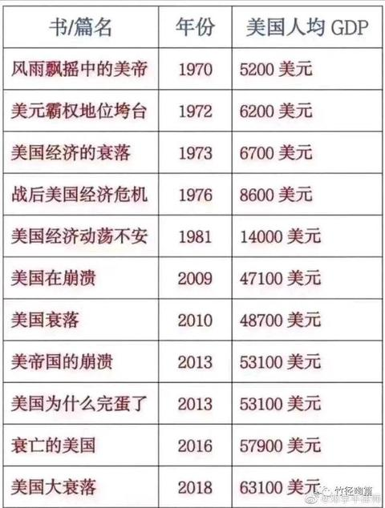
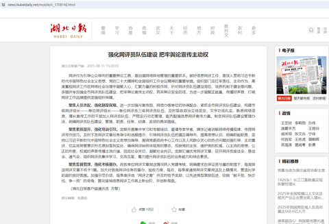
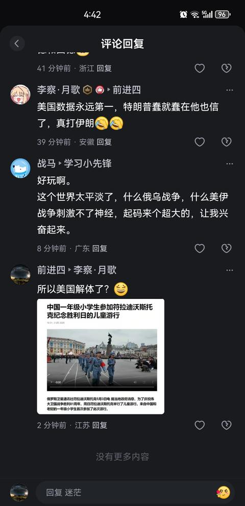
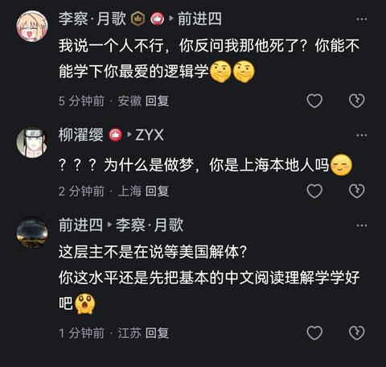
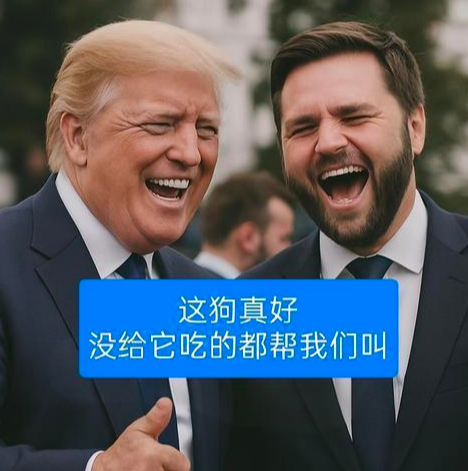
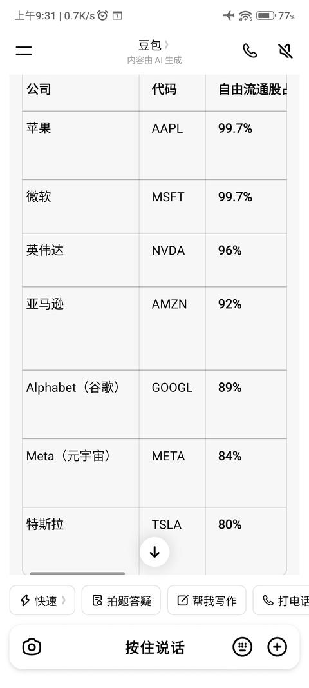

[toc]

# 问题

提问者：**<a href="https://www.zhihu.com/people/zhifu-32-65">zhifu</a>**
提问时间: 2026-8-1 21:45:15
总回答数: 305
总访问量: 1543252

美国国债正式突破40万亿美元，为历史首次！

这一庞大数字标志着美国财政负债进入了前所未有的新阶段，也引发了全球金融市场对美国债务可持续性与利息压力的广泛警觉。

美国债务压力不仅体现在绝对规模上，债务占经济总量的比例也不断上升。目前，美国债务与GDP之比已经达到约123.15%，远超国际公认的60%安全警戒线。

要知道，现在美国30年期国债收益率已飙到5.27%，19年来最高！就算按当前3.75%利率测算，美国年度债务利息支出高达1.5万亿美元。这意味着美国每收取5美元税收，就有1美元直接用来偿还利息。若后续加息25个基点，年度利息将再增加千亿级别，美债死亡螺旋彻底成型：为了支付这笔新增的巨额利息，美国财政部只能继续发行新债。这会形成高付息 → 财政赤字扩大 → 增发美债 → 收益率进一步走高，恶性循环无解！

市场普遍恐慌美债崩盘，不过，有华尔街机构的核心观点完全不同：美债从来不是单纯债务，是美元向全球输出流动性的唯一道场。全球美元结算、外汇储备、跨境流通，全部依托美债体系运转，这套负债模式是美元霸权的必然产物、也是必需代价，短期不可能崩塌。

但如今债务雪球彻底失控，常规货币工具已然失效。

纵观所有方案，特朗普全球贸易税模式，是美国唯一破局出路，通过向全球征收贸易税费，对冲巨额利息支出、修复财政窟窿，化解债务死循环。

当下美元虽已完成布局，收编黄金、收编加密货币，掌控黄金央行与加密货币央行话语权，但依旧无法覆盖美元长期出超缺口、抵消40万亿债务的巨额付息压力。

这也印证之前的核心判断：无中生有的巨额美债债务，终将稀释信用、吞噬全球纸币资产。债务螺旋不可逆、降息成为必然趋势，可进一步关注黄金、股市机会。

  

  

[是全球金融历史性的一天，美国国债正式突破40万亿美元，为历史首次！](https://baijiahao.baidu.com/s?id=1872395629574610761&wfr=spider&for=pc)

# 回答

回答者： **<a href="https://www.zhihu.com/people/yizhi-da-lao-hu-88">微风不燥正当时</a>**
回答时间: 2026-8-5 3:45:7
点赞总数: 1115
评论总数: 316
收藏总数: 309
喜欢总数：66

我承认还是美债涨得快

前几天，我引用数据还是39.5万亿，8月2日已经干到40万亿美元了。

2024年1月还是34万亿美元，2年7个月增加了6万亿美元，前几天30年期美债利息摸到5.25%

（1）特朗普2029年1月20日卸任。我预测未来30个月美债要到达50万亿美元（我怀疑还是保守预估）

第一，假设利率维持不变的话，30个月至少增加约6万亿。但是利率升的太快了，这速度奔着6%就去了。同时目前很多用高利率来置换以前的低利率，利息支出大幅度增加。置换下来的利息，羊毛出在羊身上。还是靠美债支付

第二，2027年的国防预算报上去了1.5万亿美元，俄乌没停，和伊朗这边短期内也不停。刚刚国防部长赫格塞斯刚刚在国会争取了876亿美元军费，650亿去应付中东开支的。到了2029年我觉得军方能报到2万亿美元国防预算。

（2）短期内压垮美债的最后一根稻草。

我预测就是由ai诱发的美股危机。然后美联储大撒币救市，一波下去，美债瞬间突破50万亿，甚至奔着55-60万亿就去了。

第一，1929-1933年，众所周知的华尔街引发经济危机，某种意义上引发了第二次世界大战。此时此刻，犹如彼时彼刻。

你细想，现在的世界局势，地缘政治，逆全球化，贸易保护，局部战争。苗头早就出现了，世界格局需要调整。

第二，ai泡沫。大量的资本投入开支进入，到目前现金流都是负数，迟迟不能盈利。老中这边又是开源，又是拉低成本，性能还迟迟紧追不舍。看看御三家的估值，动辄上万亿，饼画的又大又圆。

马斯克Spacex目前最新市值1.5万亿，上市估值1.75万亿，峰值2.6万亿。目前已经跌破发行价了。已经有人公开讲，真实价值只有发行价的30%（就这我觉得都高了）

后面就是openai和anthoupic的故事，两家都是逼近万亿的估值，到时候两家从股市抽完水，我看看跌回原形是什么样。

第三，翟东升教授针对美股的泡沫也表明了观点

《1》ai迟迟无法盈利，转化为真正的生产力

《2》御三家抽水超过2600亿美金，钱从哪里来，从其他股票来，其他股票就会跌

《3》美国股市最近几年为什么红火，因为他们这些大公司都是只释放少量股票流通，比如SpaceX只释放5%，后续大公司再不断回购，推高单股股价。这个游戏玩了很长时间了，积累的泡沫很大。后面两家也是这么玩。并且快速的进入纳斯达克指数，让全球资本被动买单

《4》由于中东美伊战争的影响，大量海湾国家的炼油，淡水处理厂，军用，民用设施被轰炸，摧毁。王爷们需要钱进行修缮，建设，保障国内民生。

王爷们卖了石油的钱，要么买了美债，美股或者基金或者华尔街的金融衍生品。

需要钱，就要赎回。口子一开，钱就从美股流出，各种形式。没人抬轿子，股票就会跌。因为水流出来了。

还有其他多个大佬也预测，今年下半年或者明年上半年预测美股ai泡沫会破裂。

我也有这种预感，具体时间不好说，但是越来越近了。

（4）日本为了保汇率抛售美债。

第一，今年日元承受的压力不是一般大，前几天干到164了，连续破了155，160，162心理关口。目前是40年来历史最低。上半年也是抛售美债，买入日元，但是无济于事。事后还被美国训斥。

第二，前几天美国和日本一起出手，维持日元汇率。目前短暂维持住了，现在157.8。

新闻闹得挺大。贝森特被记者拍到去白宫的小纸条上写着买入50-100亿美元的日元。

你看看，这种秘密都能被拍到（就是故意的）

美国就是表明姿态，要保一下日元。

但是，保得了一时，保得了一世吗？

后续，日元承压这是有根源性矛盾的（此处不展开，不然又是几千字）

到时候，日本救不救汇率？手里可是有大把美债的（等到那一天，背叛的时候，盟友最狠，小日子绝对下狠手）

（5）今年黄金超过美债正式成为世界第一大储备资产。黄金占比27%，美债占比22%。

到时候持有美债的国家都会出手，其实目前已经在暗中出手了。（谁出的慢谁最后砸手里）

第一，为啥黄金这么涨，就是世界各国央行在买。真以为靠散户？大家用脚投票

第二，世界局势这变动太大，甚至天下大变不是没可能。黄金是究极避险工具。

第三，大家对美国不信任加剧。当年戴高乐带头开着军舰往法国运黄金。现在也有国家想运回去，但是美国不让。比如德国

第四，美债现在40万亿，30年美债收益率5.25%。我们都能明白的问题，全世界看不到吗？再过一段时间，美债可就是一张纸了

不能兑现的美债，就是厕纸一张

第五，美国佬提出了软性违约，已经放出了风声。就是本金不还，利息按照2%计算，超出部分不还。要不是有东大（老美打不过或者不敢打），全世界有谁敢吭声吗？

曾经英国发的国债可是违约过的，当年的布雷顿森林体系解体还不是一句话的事。

前车之鉴啊

它盎格鲁撒克逊人，有什么诚信可言？

第六，还记得海湖庄园协议吗？就是‌：提议将外国持有的短期美国国债置换为‌100 年期不可交易的零息债券‌（世纪债券），以减轻美国利息支付压力 。

这可是2025年特朗普团队拟实行的计划。

真以为他们干不出来吗？

……

又是2000字

一言以蔽之

短期内我觉得就是ai泡沫诱发的美股危机

参考2008年美股次贷危机，美联储通过扩表注入流动性2.3万亿，美债增加了3.1万亿美元。

问题是当时的美债从9万亿增加到了12.1万亿

今天，现在，Now

美债总额40万亿，要是按照比例增加

不可想象，原地爆炸

  

原文地址：[(微风不燥正当时)如何看待2026年8月美债正式突破40万亿美元大关？压垮美债的最后一根稻草会是什么...](https://www.zhihu.com/question/2067002987545884316/answer/2068180715531940361) 

# 评论

1. <a href="https://www.zhihu.com/people/pi-fu-wen-ti-run-fu-yi-bu">半条命3</a> (<small title="山东">2026-8-5 7:10:47</small>): 美国是千不该万不该去碰伊朗，现在是骑虎难下，打伊朗，那么美债估计会继续快速升高，而且赢不赢还得打一个很大的问号，不打伊朗，那么美国基本可以放弃霸主地位，所以，老美啊，咋办呢［doge］
   - <a href="https://www.zhihu.com/people/18965166579">这年代咋弄</a> (<small title="福建">2026-8-5 8:32:49</small>): 现在美国这些统治者哪有国家理念，全是自己的生意！特别是是特朗普完全是明目张胆的搞钱
   - <a href="https://www.zhihu.com/people/huangshude">黄老师不会老</a> (<small title="内蒙古">2026-8-5 8:50:1</small>): 按照特朗普预想的结果，现在伊朗的石油收入已经进美国口袋了。只是现实结果……哈哈哈哈
   - <a href="https://www.zhihu.com/people/zhang-ren-long-37">Tedward</a> (<small title="广东">2026-8-5 9:18:33</small>): 不碰伊朗，它信用爆炸也只会延缓半年到一年
   - <a href="https://www.zhihu.com/people/wang-wei-wei-92-15">王威威</a> (<small title="浙江">2026-8-5 9:44:35</small>): 打伊朗把军事底裤给漏了，卡塔尔已经给伊朗交“服务费”了，意思是美国保不住他那些“盟友”
   - <a href="https://www.zhihu.com/people/pi-fu-wen-ti-run-fu-yi-bu">半条命3</a> (<small title="回复于 2026-8-5 9:57:11/山东"> ✉️:Tedward</small>): 是的，不碰伊朗，伊朗真撑不了多久了。
   - <a href="https://www.zhihu.com/people/ling-hu-ying-ying">令狐盈盈</a> (<small title="上海">2026-8-5 10:24:41</small>): 推升世界石油价格，本身美国又不缺石油［酷］
   - <a href="https://www.zhihu.com/people/wang-wei-wei-92-15">王威威</a> (<small title="回复于 2026-8-5 10:41:56/浙江"> ✉️:令狐盈盈</small>): 美国也是石油进口大国
   - <a href="https://www.zhihu.com/people/zhang-ren-long-37">Tedward</a> (<small title="回复于 2026-8-5 10:46:28/广东"> ✉️:半条命3</small>): 热知识，现实世界念经念不死你不喜欢的政治集团。IRI固然各种问题，但它的社会基本面还是比较稳定的。
   - <a href="https://www.zhihu.com/people/zheang-64">风之方向</a> (<small title="广东">2026-8-5 11:24:58</small>): 委内瑞拉给了懂王勇气
   - <a href="https://www.zhihu.com/people/bao-zi-21-86">儒墨道法兵</a> (<small title="回复于 2026-8-5 11:25:53/广东"> ✉️:令狐盈盈</small>): 美国缺可以低成本开采的石油，要是不计成本，那我国也不缺石油
   - <a href="https://www.zhihu.com/people/34-12-62-11">天下大同</a> (<small title="回复于 2026-8-5 11:39:21/河北"> ✉️:Tedward</small>): 不需要念经，只要按兵不动，特朗普会自己整活
   - <a href="https://www.zhihu.com/people/zhang-ren-long-37">Tedward</a> (<small title="回复于 2026-8-5 11:41:13/广东"> ✉️:天下大同</small>): ［看看你］川皇自己就会念经
   - <a href="https://www.zhihu.com/people/8370778405">用户8370778405</a> (<small title="广东">2026-8-5 12:23:7</small>): 帝国下行期，做什么都是错的
   - <a href="https://www.zhihu.com/people/potassium-bitart">potassium bitart</a> (<small title="北京">2026-8-5 12:35:40</small>): 是的，这绝对是老美霸权终结的一步臭棋
   - <a href="https://www.zhihu.com/people/guan-yun-duan-52">沉思的鱼</a> (<small title="广东">2026-8-5 12:56:9</small>): 我有一计，打不下来伊朗可以打日本啊，日本有驻日美军好打，资源虽然没有但是资产多，借口都是现成的，日本违反二战战后协议发展进攻型武器
   - <a href="https://www.zhihu.com/people/liu-lang-qi-shi-76">流浪骑士</a> (<small title="回复于 2026-8-5 13:5:23/广东"> ✉️:黄老师不会老</small>): 把伊朗当委内瑞拉了［飙泪笑］
   - <a href="https://www.zhihu.com/people/xiao-mu-tou-57-20">小木头</a> (<small title="回复于 2026-8-5 13:17:35/山东"> ✉️:令狐盈盈</small>): 但是美国是世界上最大的贸易逆差国。
 
  
 
石油涨价，会反应到物价上，翻几倍反馈到美国身上
   - <a href="https://www.zhihu.com/people/xiao-mu-tou-57-20">小木头</a> (<small title="回复于 2026-8-5 13:18:4/山东"> ✉️:potassium bitart</small>): 当年局座的精准预测
   - <a href="https://www.zhihu.com/people/xiao-mu-tou-57-20">小木头</a> (<small title="回复于 2026-8-5 13:18:25/山东"> ✉️:这年代咋弄</small>): 没办法，局座发动了因果律武器
   - <a href="https://www.zhihu.com/people/xiao-mu-tou-57-20">小木头</a> (<small title="山东">2026-8-5 13:18:39</small>): 没办法，局座发动了因果律武器
   - <a href="https://www.zhihu.com/people/zhu-yu-98-97">天空之城</a> (<small title="广东">2026-8-5 13:54:36</small>): 我今天早上看中央台的新闻说美伊达成停火协议了［捂脸］
   - <a href="https://www.zhihu.com/people/forerunner343">标准烛光</a> (<small title="回复于 2026-8-5 14:9:26/北京"> ✉️:天空之城</small>): 多少次了。。一个月估计能有两次放出消息说谈好了
   - <a href="https://www.zhihu.com/people/p-l-55-31">山雨欲来</a> (<small title="浙江">2026-8-5 14:11:40</small>): K线都能手画，你觉得这种玩意的领导人像是会在乎国家前途的样子吗［飙泪笑］
   - <a href="https://www.zhihu.com/people/oshino-shinobu-50">Oshino Shinobu</a> (<small title="回复于 2026-8-5 15:51:44/上海"> ✉️:天空之城</small>): 今天停火明天导弹又打出去了，我是真好奇懂王到底被内塔尼亚胡抓住了什么［大笑］
   - <a href="https://www.zhihu.com/people/qi-da-da-92-98">瞎逛</a> (<small title="回复于 2026-8-5 16:19:15/山东"> ✉️:半条命3</small>): 你咋得出结论的？没有战争伊朗也能撑住，虽然经济不好能带来动荡，但是不至于垮台
   - <a href="https://www.zhihu.com/people/qi-da-da-92-98">瞎逛</a> (<small title="回复于 2026-8-5 16:20:12/山东"> ✉️:半条命3</small>): 我们62年粮食危机了，不照样挺过来了，伊朗才哪到哪？现代国家没这么脆弱
   - <a href="https://www.zhihu.com/people/zyx-98-8-96">ZYX</a> (<small title="上海">2026-8-5 16:45:28</small>): 不打伊朗哈梅内伊怎么上天堂，老哈第一个不答应［大笑］
   - <a href="https://www.zhihu.com/people/xiao-hua-fang-shu-jia">小花放暑假</a> (<small title="中国香港">2026-8-5 16:50:57</small>): 美国没有任何理由不去打以色列！时不我待~
   - <a href="https://www.zhihu.com/people/pi-fu-wen-ti-run-fu-yi-bu">半条命3</a> (<small title="回复于 2026-8-5 17:23:26/山东"> ✉️:小花放暑假</small>): 我觉得也是，打以色列也比打伊朗强啊［doge］
   - <a href="https://www.zhihu.com/people/pi-fu-wen-ti-run-fu-yi-bu">半条命3</a> (<small title="回复于 2026-8-5 17:25:38/山东"> ✉️:天空之城</small>): 嗯，跟老年人尿尿似的，一阵有一阵没有的［doge］
   - <a href="https://www.zhihu.com/people/esuuxso">我是新用户</a> (<small title="北京">2026-8-5 17:28:3</small>): 这个是真看不懂懂王的操作［发呆］
   - <a href="https://www.zhihu.com/people/liu-lian-liu-lian-liu-lian-47">曾酒醉鞭名马</a> (<small title="回复于 2026-8-6 7:54:8/广东"> ✉️:我是新用户</small>): 有木有这样一张可能:川建国自己都搞不明白自己要干什么［滑稽］［捂脸］
2. <a href="https://www.zhihu.com/people/33-66-37-82">知者未知</a> (<small title="浙江">2026-8-5 10:1:7</small>): 美债突破40万亿，一年利息1.5万亿，财政收入的30%要还利息了。
   - <a href="https://www.zhihu.com/people/miao-xun-yu">momo</a> (<small title="浙江">2026-8-5 12:32:46</small>): 错了 财政收入都是拿来干正常事情的，已经赤字了，利息都是靠新发国债了 不过新债发的出就没事 反正本金不用还
   - <a href="https://www.zhihu.com/people/savior-zero2001">林少</a> (<small title="上海">2026-8-5 12:39:21</small>): 它就印钞还钱，美元再贬贬值呗
   - <a href="https://www.zhihu.com/people/zhangpfly">清风流水</a> (<small title="回复于 2026-8-5 13:14:42/河南"> ✉️:林少</small>): 左右踩右脚，螺旋升天［大笑］
   - <a href="https://www.zhihu.com/people/huang-yan-bi-ding-bei-shi-jian-cuo-po">精神病1医院院长</a> (<small title="江西">2026-8-5 14:0:8</small>): 美国现在用股市在化债，目前来看效果很好，随便一家科技公司就把债务解决了［大笑］
   - <a href="https://www.zhihu.com/people/maxpeny">Maxpeny</a> (<small title="浙江">2026-8-5 15:52:59</small>): 只能苦一苦美国人民了
   - <a href="https://www.zhihu.com/people/35-98-31-83-25">虎尾春冰</a> (<small title="江苏">2026-8-5 19:13:22</small>): 问题是，利息我不想付，钱我又想要怎么办
   - <a href="https://www.zhihu.com/people/li-lao-8-4">史密斯专员</a> (<small title="回复于 2026-8-6 0:10:41/湖南"> ✉️:精神病1医院院长</small>): 
   - <a href="https://www.zhihu.com/people/gu-ji-48-85">顾忌</a> (<small title="江苏">2026-8-6 7:30:19</small>): 与之对比，东大每年财政收入的25%投入到教育行业。我要死美国人我也睡不着［大哭］
3. <a href="https://www.zhihu.com/people/song-song-47-32">宋宋</a> (<small title="安徽">2026-8-5 10:32:2</small>): 我觉得把所有美债直接原地置换成200年期不可赎回零利率债券最好，每隔10年所有美债都置换一次，可保大阿美莉卡万寿无疆［酷］
   - **微风不燥正当时** (<small title="湖南">2026-8-5 12:27:7</small>): 这不就是海湖庄园协议吗？
   - <a href="https://www.zhihu.com/people/guo-lu-75-64">过路</a> (<small title="陕西">2026-8-5 15:31:50</small>): 这就是明抢啊［大笑］
   - <a href="https://www.zhihu.com/people/catrkmhh">小看山CatrKMHh</a> (<small title="安徽">2026-8-5 19:27:37</small>): 小雨收回远嶂青，晚来秋气满中庭。  
 
明朝纵有晴光到，亦带清凉入翠屏。  
 
༺࿈庄子《水镜秋》࿈༻
   - <a href="https://www.zhihu.com/people/wang-zhu-44-90">旭东大仙法力无边</a> (<small title="回复于 2026-8-5 21:27:44/江苏"> ✉️:微风不燥正当时</small>): 百足之虫，死而不僵。在中国具有能够跨越太平洋进行兵力投送前，不可能取代美国目前的世界地位。直到下一场世界大战结束，全球格局完全重构前，美国依然是全球有且仅有的唯一的超级大国。没有老二是能不经过武力斗争，就上位当老大的［doge］
   - <a href="https://www.zhihu.com/people/frodo-56">frodo</a> (<small title="回复于 2026-8-6 9:11:31/江苏"> ✉️:旭东大仙法力无边</small>): 武力斗争美不一定是中国亲自出手，代理人战争，那也是战争  
 
欧洲方向有俄罗斯，中东印度洋方向有伊朗
4. <a href="https://www.zhihu.com/people/chen-peng-4-48">脱脂熊猫</a> (<small title="福建">2026-8-5 11:29:53</small>): 世纪债券，那不就是不想还了吗
   - **微风不燥正当时** (<small title="湖南">2026-8-5 12:19:59</small>): 人家真的是这么想的，要不然有看中在前面顶着，王爷们早就得签署城下之盟了。这不就是海湖庄园协议吗？
   - <a href="https://www.zhihu.com/people/8370778405">用户8370778405</a> (<small title="广东">2026-8-5 12:28:29</small>): 就是强盗抢劫，不同意就打，没有中国，这对美国来说都是小事
   - <a href="https://www.zhihu.com/people/79-60-52-90">王路飞</a> (<small title="山东">2026-8-5 12:30:0</small>): 肯定是要违约的
   - <a href="https://www.zhihu.com/people/su-fan-yi-92">扫地的丶</a> (<small title="广东">2026-8-5 16:50:23</small>): 以前英国就是这样干的，还不止一次。一战以后大家都是债务违约，赖账大时代。
   - <a href="https://www.zhihu.com/people/lei-xing-ling-9">真吾</a> (<small title="海南">2026-8-5 17:30:4</small>): 不还，太好了，对中国来说
   - <a href="https://www.zhihu.com/people/chen-peng-4-48">脱脂熊猫</a> (<small title="回复于 2026-8-5 17:51:31/福建"> ✉️:真吾</small>): 我们已经抛了部分了，应该还有六千多亿
   - <a href="https://www.zhihu.com/people/chen-peng-4-48">脱脂熊猫</a> (<small title="回复于 2026-8-5 17:52:10/福建"> ✉️:微风不燥正当时</small>): 虽然见过那么多不要脸的，但真没见过这么不要脸的。
   - <a href="https://www.zhihu.com/people/hpzz-48">HPZZ</a> (<small title="回复于 2026-8-5 22:42:33/北京"> ✉️:扫地的丶</small>): 英国一战时期的债券后来暂停偿还，一直到2014年卡梅伦政府才宣布继续偿还
   - <a href="https://www.zhihu.com/people/panybin">panybin</a> (<small title="广西">2026-8-6 8:25:15</small>): 本来就是这个意思，靠着军舰大炮，但是它突然发现，太平洋西岸出现了不可控力量［飙泪笑］
5. <a href="https://www.zhihu.com/people/li-hong-sheng-15-50">山城恋</a> (<small title="云南">2026-8-5 16:10:10</small>): 不知道答主知不知道，7月全球科技股同步暴跌。  
 
韩股一度跌幅达40%，a股创业板年内涨幅全跌完了。  
 
费城半导体指数同样大跌。  
 
但纳指，跌最多的时候只有10%，远低于其他股市，标普只跌了2%左右。  
 
7月为什么大跌？原因跟你说的一模一样，投资者质疑资本支出那么高，能不能收回本？  
 
按你的逻辑ai泡沫7月就该爆了。  
 
但你知道吗，标普刚刚历史新高了。
   - **微风不燥正当时** (<small title="湖南">2026-8-5 16:20:21</small>): 那你继续持有，继续买入，继续加杠杆。山崩水泄的时候，看你能跑的掉吗？无非就是最后的狂欢
   - <a href="https://www.zhihu.com/people/xiao-hua-fang-shu-jia">小花放暑假</a> (<small title="上海">2026-8-5 16:53:2</small>): 你俩说的都有道理，我先插个眼，让子弹飞一会儿，过两年再来挖！
   - <a href="https://www.zhihu.com/people/hao-jie-63-2">浩杰</a> (<small title="回复于 2026-8-5 16:58:48/安徽"> ✉️:小花放暑假</small>): 可能一个月就能炸给你看了。
   - <a href="https://www.zhihu.com/people/bdwj">王杰</a> (<small title="回复于 2026-8-5 17:16:4/河北"> ✉️:微风不燥正当时</small>): 美元崩溃，不是股市下跌，而是货币贬值，市场说不定还创新高。
   - <a href="https://www.zhihu.com/people/esuuxso">我是新用户</a> (<small title="北京">2026-8-5 17:44:38</small>): 支持你梭哈纳指，反正我等一次金融危机
   - <a href="https://www.zhihu.com/people/dan-ding-4-58-20">淡定</a> (<small title="回复于 2026-8-5 18:3:42/广东"> ✉️:微风不燥正当时</small>): 永远可以预测，反正以后也没人来找你［飙泪笑］
   - **微风不燥正当时** (<small title="回复于 2026-8-5 18:10:19/湖南"> ✉️:淡定</small>): 远程畜牧业，是吧
   - <a href="https://www.zhihu.com/people/dan-ding-4-58-20">淡定</a> (<small title="回复于 2026-8-5 18:15:18/广东"> ✉️:微风不燥正当时</small>): 说股票就好好讨论股票，说畜牧业话题歪哪去了。［飙泪笑］  
 
AI 泡沫论属于是近期全世界科技股日经话题，你这点讨论深度实在是上不了桌。
   - <a href="https://www.zhihu.com/people/dan-ding-4-58-20">淡定</a> (<small title="回复于 2026-8-5 18:23:30/广东"> ✉️:微风不燥正当时</small>): 不好意思捏，我也看了下你的主页。  
 
搞半天你不是讨论股票的，你只是想用股票说明美国💊，那你爱咋说咋说吧。单纯不关注股市的人，讨论股市的异味而已。  
 
我只关心股票，并不关心美国。［爱］
   - **微风不燥正当时** (<small title="回复于 2026-8-5 18:34:53/湖南"> ✉️:淡定</small>): 你看看，兔子尾巴露出来了。人家提问问的美债，我的回复讨论美债，美股是诱因。到你这里，你只关心美股
   - <a href="https://www.zhihu.com/people/ijia-jia-47">i加加</a> (<small title="回复于 2026-8-5 18:41:38/浙江"> ✉️:微风不燥正当时</small>): 抱歉哈 下跌我就加仓了 还买的TQQQ 3倍杠杆［爱］ 每年都有说美国要崩 每年都说这次不一样［大笑］
   - <a href="https://www.zhihu.com/people/lu-kai-55-78">剪辑师有颗逗比心</a> (<small title="回复于 2026-8-5 18:50:36/上海"> ✉️:微风不燥正当时</small>): 这么笃定会崩的话现在应该做空。我支持看涨的买进看空的做空，大家都用脚投票［调皮］
   - **微风不燥正当时** (<small title="回复于 2026-8-5 19:1:34/湖南"> ✉️:剪辑师有颗逗比心</small>): 别人做了没做，未必都得通知你？
   - <a href="https://www.zhihu.com/people/lu-kai-55-78">剪辑师有颗逗比心</a> (<small title="回复于 2026-8-5 19:10:14/上海"> ✉️:微风不燥正当时</small>): 你既然看空，你也可以做，祝你大赚特赚
   - <a href="https://www.zhihu.com/people/he-li-jiong">低调的天线超人</a> (<small title="回复于 2026-8-6 9:36:11/浙江"> ✉️:剪辑师有颗逗比心</small>): 正常人见好就收，不会去赌崩溃前的狂欢。因为没人能预测哪一刻崩溃。你相信科技股，相信ai，那是你的一厢情愿。事实是，懂王一个画线操作，或者国内ai出几个重大突破，风风钟美股就有波动。炒股玩的是信息差，傻子才赌。
   - <a href="https://www.zhihu.com/people/76-82-67-51-93">悠然</a> (<small title="回复于 2026-8-6 9:55:0/广东"> ✉️:i加加</small>): 赶紧码一下看戏
   - <a href="https://www.zhihu.com/people/89-35-38-43-20">鸢飞入梦</a> (<small title="福建">2026-8-6 10:10:50</small>): 我十分确信美股要炸了，因为我六月底买了科技，七月底买了老登，现在我重仓纳斯达克了［飙泪笑］
6. <a href="https://www.zhihu.com/people/liu-huo-35-17">流火</a> (<small title="广东">2026-8-5 12:59:59</small>): ［尴尬］你说空叉有泡沫就算了。御三家普遍三十到四十的市盈率。正常水平也就25-35倍市盈率。顶多就估值偏高。达不到泡沫的程度。随便一跌就跌回正常水平了。
   - **微风不燥正当时** (<small title="湖南">2026-8-5 13:29:50</small>): 到时候它三家都得下调
   - <a href="https://www.zhihu.com/people/mao-si-lang">古屋古</a> (<small title="福建">2026-8-5 16:12:6</small>): 问题是，未来利润率还能这么高吗？
   - <a href="https://www.zhihu.com/people/liu-huo-35-17">流火</a> (<small title="回复于 2026-8-5 18:38:37/广东"> ✉️:古屋古</small>): ［飙泪笑］你要是预测未来就可大可小了。预测未来AI大爆发。各个巨头赚得盘满钵满，那估值再涨个两三倍都不成问题。毕竟下个技术革命就是AI啊。你要是预测未来AI泡沫巨大，现在投入的算力基建全都是废铁。那估值砍个50%都算是小的。所以预测对于现有的估值合理性本来就是愚蠢的。你不看现在估值是否合理。那还谈什么？把预测算进去，空叉的估值还低了呢。预测未来走向星际文明，空叉是唯一的希望。那估值能买下整个美国估计都是小的。
   - <a href="https://www.zhihu.com/people/liu-huo-35-17">流火</a> (<small title="回复于 2026-8-5 18:39:56/广东"> ✉️:微风不燥正当时</small>): 上调下调都是合理的。市场是唯一正确的。我们现在谈估值，肯定说的是现在，我们能做的是判断它现阶段是否合理。而不是去预测未来。
   - **微风不燥正当时** (<small title="回复于 2026-8-5 19:2:28/湖南"> ✉️:流火</small>): 大哥，不预测未来，凭什么给它这个估值啊
   - <a href="https://www.zhihu.com/people/liu-huo-35-17">流火</a> (<small title="回复于 2026-8-5 19:26:47/广东"> ✉️:微风不燥正当时</small>): 你说哪个？御三家不预测，就现在的业绩和估值是合理的，空叉有泡沫。怎么合理不合理都需要预测未来的了？我说的合理是否对得起现在的价格。而不是靠着未来的业绩去判断。
   - <a href="https://www.zhihu.com/people/liu-huo-35-17">流火</a> (<small title="回复于 2026-8-5 19:27:43/广东"> ✉️:微风不燥正当时</small>): ［飙泪笑］预测未来的话，那我修改我的回答了。纳指的估值都是合理的。这是基于市场的答案。而不是能否赚钱给的答案。
   - <a href="https://www.zhihu.com/people/san-xing-73-40">h0647</a> (<small title="山东">2026-8-5 20:49:59</small>): 左脚踩右脚，利润随便造。我就不信从10年开始纳指翻10倍，经济下行美股绝大部分科技公司利润也能翻10倍
   - <a href="https://www.zhihu.com/people/feng-ye-25-72">封夜</a> (<small title="回复于 2026-8-6 7:29:50/四川"> ✉️:流火</small>): ai是不是还两说，前几年下一个技术革命还是元宇宙呢，结果炸了一地鸡毛，然后各大公司为了继续画饼又弄出来ai，谁知道能不能成功还是又炸了？
7. <a href="https://www.zhihu.com/people/ajie-79-37">ajie</a> (<small title="广东">2026-8-5 10:26:24</small>): 从小布什开始的美国总统，没有一任是光好事的，一直在发债，到40万亿，真的离违约和白纸不过多了，这个利息，不可能长久支撑，等AI的泡沫破了，原地升天！我们的房市给老美拉爆了，这几年不好过，他们的泡沫破了，更不好过，小日本的汇市也得升天陪葬。
   - <a href="https://www.zhihu.com/people/ying-huo-chong-77-21">萤火虫</a> (<small title="广西">2026-8-5 13:1:9</small>): 这并不是一件好事情。
 
美国目前还是全球第一经济体，军事第一强国（理论上），军事基地遍布各大洲，美国经济体崩塌的后果，一是疯狂吸血日欧，引起全球性经济危机，二是跟我们开启冷战甚至摩擦转移矛盾，三是要么全球扩张要么退守美洲甚至北美洲。不论哪一种，后果都不是我们普通人能承受的住，失业、收入降低、社会低迷等等。
 
  
 
对我们来说，美国维持现状就很好，等我们过了经济转型的阵痛期，等J35大规模入列和六代机成型，等第五艘航母下水，等新能源汽车行业竞争红海结束，距离这些还需要5-8年，如果美国撑不住，我们还是会用条件置换的形式购买美债支撑他走到那一天。
   - <a href="https://www.zhihu.com/people/xian-nu-xing-ju-chang">仙女星局长</a> (<small title="回复于 2026-8-5 14:58:10/内蒙古"> ✉️:萤火虫</small>): 美国维持不了现状 2030年之前肯定至少有一场类似 朝战级别的战争
   - <a href="https://www.zhihu.com/people/he-pan-de-dou-dou">河畔的塔霍</a> (<small title="回复于 2026-8-5 15:22:14/湖北"> ✉️:仙女星局长</small>): 不可能，美国现在的海外军事力量的投送能力和打击能力相比03年打伊拉克时已经差了太多。
 
首先，美军在中东前线修葺的永备军事设施、囤积的物资和部署的雷达系统，这些东西伊朗看到一个炸一个。美军现在的防空弹药储备连伊朗这种中低等烈度远程袭击都应付不过来，你指望在高烈度的朝战中，美军引以为傲的萨德、爱国者和宙斯盾+标准这几套体系能扛得住中俄朝那种级别的火力打击密度？
 
  
 
其次，美军的远程打击弹药储备更是每天都在拉警报，真要是开启下一场朝战，美国海空军为了维持打击强度，不到半个月就能把库存打空你信不信？届时美军飞行员就可以挂着航弹去cos阿根廷空军的A4了。
 
如果不信，参考CPS高超两个月才能搓出来一发，耗资5700万美元；美国军工体系的空心化程度已经到了糜烂的地步，现在靠着吃老本还能维持一阵子，高烈度战况打几轮的消耗可不是波音、雷神、洛马个把月搓几枚导弹能补的上的。
 
  
 
第三，防不住，打不掉，这两点说完了，再说说负责防和打的载具，美国假设要开启下一场朝战，现役10个航母打击群势必出动至少4个，1个部署在琉球群岛附近威慑兔子东部战区海空力量，一个部署在山东半岛以南、黄海北部以威慑北部战区海空力量，一个部署在鄂霍茨克海南部边缘威慑毛子远东军区的海空力量，最后一个部署在对马海峡负责关键航道安全。以美军现役那堆航母的战备妥善率，能在确保不超期执勤的情况下一次性拉出三艘，就算他烧高香。
 
另外，如果美帝要开启朝战级别的战争，北约内部就能吵翻天，西班牙、土耳其甚至韩国这些近年来不咋听话的主，立马就会和其他四大常任理事国互通有无。
   - <a href="https://www.zhihu.com/people/ying-huo-chong-77-21">萤火虫</a> (<small title="回复于 2026-8-5 17:27:53/广西"> ✉️:河畔的塔霍</small>): 我赞同你的观点，美国现在并没有充足的准备跟大国打一仗，这种战争至少要准备3-5年，哪怕现在收回台湾，欧美也没有相应的手段阻止，现在不回收只不过是跟香港一样温水煮青蛙。
 
再回头看，特朗普已经做出了选择，如果走到那一天，北上加拿大、南侵墨西哥，控住巴拿马运河，抢夺英法属地，把南美、北非划入势力范围，放弃亚太、与印度洋范畴，逼迫印度、欧洲中东国家与我们争抢，放弃日韩新加坡，遥控澳大利亚断流矿石，用锁链困住我们，虽然不再是地球霸主，但依旧能够维持地球一哥位置。
   - <a href="https://www.zhihu.com/people/90-39-76-98-23">楚白</a> (<small title="回复于 2026-8-5 18:47:15/北京"> ✉️:仙女星局长</small>): 美国不会再陷入另一个泥潭里了, 而且, 就伊朗这出还不知道什么时候能结束呢, 肉眼可见的时间内看不到真正的和平
   - <a href="https://www.zhihu.com/people/luo-ni-55-36">罗尼</a> (<small title="河北">2026-8-6 6:41:15</small>): 房市应该是提前几年主动爆破的，长远来看也算好事了。
8. <a href="https://www.zhihu.com/people/53-61-39-63">Momo</a> (<small title="湖南">2026-8-5 9:8:47</small>): 又想骗我买黄金😭
   - <a href="https://www.zhihu.com/people/xue-xi-xiao-xian-feng">学习小先锋</a> (<small title="四川">2026-8-5 11:47:35</small>): 央行黄金占比提高，你其实还是在被动持有黄金，但是对你生活没影响就是了
   - **微风不燥正当时** (<small title="湖南">2026-8-5 12:34:38</small>): 只是就是论事，不构成任何投资建议
   - <a href="https://www.zhihu.com/people/shi-ni-de-chen-ya-12">香橙南瓜</a> (<small title="中国香港">2026-8-5 14:52:3</small>): 如果不会投资理财的话，黄金还真可以买，不过长期来看也就是和通胀持平，但凡会理财的就没必要买了
   - <a href="https://www.zhihu.com/people/ju-wai-ren-72-13-46">局外人陈</a> (<small title="湖北">2026-8-5 15:29:53</small>): ［doge］黄金开始涨了
   - <a href="https://www.zhihu.com/people/guo-lu-75-64">过路</a> (<small title="陕西">2026-8-5 15:31:8</small>): 拉长时间看，还没有能媲美的货币。
 
如果你理财水平高于定期存款另当别论
9. <a href="https://www.zhihu.com/people/liu-hai-bo-57">南柯长梦</a> (<small title="广东">2026-8-5 13:42:28</small>): 美债就没想还，先还利息，利息还不起就还利息的利息，利息的利息还不起，就还利息的利息的利息……
 
谁都知道这样下去迟早是个炸，但只要还没到那一天，照样歌舞升平，尤其那些买美股的，你跟他们说美股要炸，你看他们笑不笑话你。
   - **微风不燥正当时** (<small title="湖南">2026-8-5 13:46:7</small>): 他们也是在击鼓传花，都觉得自己不是最后一个，都觉得自己跑的掉
   - <a href="https://www.zhihu.com/people/li-er-ran">lierr</a> (<small title="回复于 2026-8-5 15:55:23/广东"> ✉️:微风不燥正当时</small>): 按这样玩什么东西不是击鼓传花? 🇺🇸只要撑到第三次世界大战就行了，或者撑不住就自己发起啊，何尝不是一种美国崩溃论 ［飙泪笑］
   - **微风不燥正当时** (<small title="回复于 2026-8-5 16:23:27/湖南"> ✉️:lierr</small>): 问题确实是在帝国末期了啊，没啥不好承认
10. <a href="https://www.zhihu.com/people/mou-xiao-shan-87">言控</a> (<small title="河南">2026-8-5 15:31:2</small>): 万一美元对人民币跌破1比1可咋整。
    - **微风不燥正当时** (<small title="湖南">2026-8-5 15:36:6</small>): 你别说，未来不是没可能，现实就是谁牛批，谁的货币就硬。譬如日不落时期英镑，美利坚顶峰的美金
11. <a href="https://www.zhihu.com/people/xiao-wang-wo-lai-xun-shan-le">小王我来巡山了</a> (<small title="安徽">2026-8-5 13:46:49</small>): 如果，川子任期内把美债顶到60万亿，他是不是就能干第三任期了［好奇］
    - <a href="https://www.zhihu.com/people/23-47-31-28">提桶章北海</a> (<small title="福建">2026-8-5 15:53:9</small>): 也难说是不是最后一任
12. <a href="https://www.zhihu.com/people/river-m">river.m</a> (<small title="浙江">2026-8-5 15:21:37</small>): 想象一下，如果美债能在四大行买到，普通老百姓没有门槛的那种，多久会售罄？
    - <a href="https://www.zhihu.com/people/vincent-94-90-39">Vincent</a> (<small title="安徽">2026-8-5 15:59:19</small>): 人越多蠢货越多。那又能说明什么呢？
13. <a href="https://www.zhihu.com/people/mi-mang-44-94-22">迷茫</a> (<small title="甘肃">2026-8-5 10:9:54</small>): 美国没救了，这些国防预算，有多少是真正的落入到了实处，你前线打仗和我贵族有什么关系，我先把我的这部分落袋为安再说［飙泪笑］，所以看起来这些钱很多，我估计一半左右都被贪了，我90后，我绝对能等到美国解体的那一天
    - <a href="https://www.zhihu.com/people/zyx-98-8-96">ZYX</a> (<small title="上海">2026-8-5 10:47:47</small>): 美国解体？还做梦呢［大笑］
    - <a href="https://www.zhihu.com/people/xue-xi-xiao-xian-feng">学习小先锋</a> (<small title="四川">2026-8-5 11:49:4</small>): 一半保守了，美国解体对所有人都不是好事
    - <a href="https://www.zhihu.com/people/sun-ye-qing-5">前进四</a> (<small title="江苏">2026-8-5 11:56:35</small>): 
    - <a href="https://www.zhihu.com/people/0-0-57-87">0.0</a> (<small title="回复于 2026-8-5 11:59:53/广东"> ✉️:前进四</small>): 发到X上鼓励美帝
    - <a href="https://www.zhihu.com/people/8370778405">用户8370778405</a> (<small title="回复于 2026-8-5 12:25:30/广东"> ✉️:前进四</small>): 100年起势，100年稳定，100年的衰退，没毛病的
    - <a href="https://www.zhihu.com/people/hao-duo-da-sha-yu">好多大鲨鱼</a> (<small title="回复于 2026-8-5 12:26:41/四川"> ✉️:ZYX</small>): 美国跟国足一样，不踢比赛就是第一
    - <a href="https://www.zhihu.com/people/hao-duo-da-sha-yu">好多大鲨鱼</a> (<small title="回复于 2026-8-5 12:27:15/四川"> ✉️:前进四</small>): 有多少是实际增长，有多少是通货膨胀
    - <a href="https://www.zhihu.com/people/hao-duo-da-sha-yu">好多大鲨鱼</a> (<small title="回复于 2026-8-5 12:27:40/四川"> ✉️:ZYX</small>): 贪污腐败入骨的美国，真有可能
    - <a href="https://www.zhihu.com/people/po-zhen-zi">哔哔哔哔k</a> (<small title="湖南">2026-8-5 12:43:26</small>): 快40岁的人了还这么幼稚
    - <a href="https://www.zhihu.com/people/sun-ye-qing-5">前进四</a> (<small title="回复于 2026-8-5 12:50:45/江苏"> ✉️:好多大鲨鱼</small>): 不是美国要崩溃解体么［惊喜］
    - <a href="https://www.zhihu.com/people/hao-duo-da-sha-yu">好多大鲨鱼</a> (<small title="回复于 2026-8-5 12:51:45/四川"> ✉️:前进四</small>): 你回答我的问题，多少是实际增长
    - <a href="https://www.zhihu.com/people/han-shu-qu-jian">战斗力旺盛的教皇</a> (<small title="回复于 2026-8-5 13:10:9/北京"> ✉️:哔哔哔哔k</small>): 你到达幼儿园毕业年龄了吗
    - <a href="https://www.zhihu.com/people/xiao-mu-tou-57-20">小木头</a> (<small title="回复于 2026-8-5 13:20:16/山东"> ✉️:ZYX</small>): 当年说苏联会解体的，也是做梦。
    - <a href="https://www.zhihu.com/people/hao-duo-da-sha-yu">好多大鲨鱼</a> (<small title="四川">2026-8-5 13:43:9</small>): 苏联解体等到了吗
    - <a href="https://www.zhihu.com/people/sun-ye-qing-5">前进四</a> (<small title="回复于 2026-8-5 13:48:39/江苏"> ✉️:好多大鲨鱼</small>): 你怎么不先回答我的问题，不是说要解体崩溃么？［惊喜］
    - <a href="https://www.zhihu.com/people/yong-hu-5872024699">败家.闲人</a> (<small title="回复于 2026-8-5 13:49:13/湖北"> ✉️:前进四</small>): 数字有什么意义呢？你比美国人还懂美国？美国真蒸蒸日上，还需要“再次”伟大？事实是现在普通美国人过得还不如四十年前，这些自嗨的数字再翻一倍也一样
    - <a href="https://www.zhihu.com/people/sun-ye-qing-5">前进四</a> (<small title="回复于 2026-8-5 13:51:54/江苏"> ✉️:败家.闲人</small>): 主页一看就懂，能不能换个有点新意的说法［大笑］
    - <a href="https://www.zhihu.com/people/zyx-98-8-96">ZYX</a> (<small title="回复于 2026-8-5 14:33:32/上海"> ✉️:好多大鲨鱼</small>): 确实，国足踢比赛也是第一，输了都是国际足联故意黑［大笑］
    - <a href="https://www.zhihu.com/people/3-9-28-73">刮大风</a> (<small title="回复于 2026-8-5 15:37:3/天津"> ✉️:好多大鲨鱼</small>): 苏联存在了多久？
    - <a href="https://www.zhihu.com/people/3-9-28-73">刮大风</a> (<small title="天津">2026-8-5 15:38:29</small>): 哈哈
    - <a href="https://www.zhihu.com/people/na-ben-xin-li-li-can">李子阳</a> (<small title="回复于 2026-8-5 15:47:15/湖南"> ✉️:ZYX</small>): 那祝愿美国天天赢
    - <a href="https://www.zhihu.com/people/rong-i-83">融i</a> (<small title="浙江">2026-8-5 16:1:16</small>): 帮大家回顾下，近百年因国家破产而解体的国家有这些: 苏联、南斯拉夫、捷克斯洛伐克、东德和西德［doge］
    - <a href="https://www.zhihu.com/people/76-33-35-65">李察·月歌</a> (<small title="回复于 2026-8-5 16:2:40/安徽"> ✉️:前进四</small>): 美国数据永远第一，特朗普蠢就蠢在他也信了，真打伊朗［捂脸］［捂脸］
    - <a href="https://www.zhihu.com/people/zhan-ma-47-71-66">战马</a> (<small title="回复于 2026-8-5 16:33:44/广东"> ✉️:学习小先锋</small>): 好玩啊。  
 
这个世界太平淡了，什么俄乌战争，什么美伊战争刺激不了神经，起码来个超大的，让我兴奋起来。
    - <a href="https://www.zhihu.com/people/sun-ye-qing-5">前进四</a> (<small title="回复于 2026-8-5 16:42:46/江苏"> ✉️:李察·月歌</small>): 
    - <a href="https://www.zhihu.com/people/76-33-35-65">李察·月歌</a> (<small title="回复于 2026-8-5 16:52:14/安徽"> ✉️:前进四</small>): 我说一个人不行，你反问我那他死了？你能不能学下你最爱的逻辑学［思考］［思考］
    - <a href="https://www.zhihu.com/people/shineZz">柳濯缨</a> (<small title="回复于 2026-8-5 16:55:3/上海"> ✉️:ZYX</small>): ？？？为什么是做梦，你是上海本地人吗［害羞］
    - <a href="https://www.zhihu.com/people/sun-ye-qing-5">前进四</a> (<small title="回复于 2026-8-5 16:57:54/江苏"> ✉️:李察·月歌</small>): 
    - <a href="https://www.zhihu.com/people/sa-ha-la-yu-fu-81">摩兹古斯</a> (<small title="回复于 2026-8-5 17:13:28/山东"> ✉️:ZYX</small>): 看把你吓滴，信仰崩塌就崩溃了呗
    - <a href="https://www.zhihu.com/people/mo-mo-mo-33-52-62">嘿嘿嘿</a> (<small title="安徽">2026-8-5 18:24:20</small>): 这个月健保费交了没
    - <a href="https://www.zhihu.com/people/sun-ye-qing-5">前进四</a> (<small title="回复于 2026-8-5 18:57:11/江苏"> ✉️:嘿嘿嘿</small>): 盘盘交社保了没，我爸妈上万的退休金还等你供养呢［大笑］
    - <a href="https://www.zhihu.com/people/sun-ye-qing-96">陌上花开</a> (<small title="江苏">2026-8-5 19:0:7</small>): 
    - <a href="https://www.zhihu.com/people/eva-2-61-72">EVA</a> (<small title="回复于 2026-8-5 19:12:23/四川"> ✉️:前进四</small>): 你要看制造业占比
    - <a href="https://www.zhihu.com/people/zhigykaowih">zhigYKAoWih</a> (<small title="回复于 2026-8-5 19:31:1/湖北"> ✉️:前进四</small>): 现在的普通美国人的生活水平，应该比1981年的美国人生活水平高5倍吧［大笑］［大笑］［大笑］
    - <a href="https://www.zhihu.com/people/85-26-90-1-4">一把抓住机会</a> (<small title="回复于 2026-8-5 20:49:18/广东"> ✉️:前进四</small>): 
    - <a href="https://www.zhihu.com/people/xue-xi-xiao-xian-feng">学习小先锋</a> (<small title="回复于 2026-8-5 21:16:43/四川"> ✉️:战马</small>): 自己体验一天断水断电断网的生活，看你兴奋得起来不［飙泪笑］？
    - <a href="https://www.zhihu.com/people/muo-32">往虎门火车站方向</a> (<small title="广东">2026-8-5 22:59:45</small>): 无非从联邦回到邦联，解体不至于
    - <a href="https://www.zhihu.com/people/hao-duo-da-sha-yu">好多大鲨鱼</a> (<small title="回复于 2026-8-6 7:42:33/四川"> ✉️:学习小先锋</small>): 对全世界都是好事
    - <a href="https://www.zhihu.com/people/mo-mo-mo-33-52-62">嘿嘿嘿</a> (<small title="回复于 2026-8-6 9:8:23/安徽"> ✉️:前进四</small>): 交了啊，非基辈的退休金在哪里呀？哈哈哈
    - <a href="https://www.zhihu.com/people/xue-xi-xiao-xian-feng">学习小先锋</a> (<small title="回复于 2026-8-6 9:17:4/四川"> ✉️:好多大鲨鱼</small>): 错误，世界需要一个秩序而不是混乱，在新的秩序出来之前，旧秩序就有存在的必要
    - <a href="https://www.zhihu.com/people/mei-tian-du-yao-he-niu-nai-66">每天都要喝牛奶</a> (<small title="回复于 2026-8-6 9:24:22/湖北"> ✉️:前进四</small>): 感谢你父母对新中国建设的付出
14. <a href="https://www.zhihu.com/people/wu-ze-hao-77-43">拾光</a> (<small title="河南">2026-8-5 16:13:44</small>): 很难想象2026年还在讲这一套，黄金都从5500干到4000了
    - **微风不燥正当时** (<small title="湖南">2026-8-5 16:21:27</small>): 你也就看见一个黄金，我怀疑你看文章没有
15. <a href="https://www.zhihu.com/people/ge-wu-suo">歌无所</a> (<small title="上海">2026-8-5 8:37:24</small>): 你要多久才明白，美债不是债是商品［飙泪笑］。卖出去的商品贬值和正主有什么关系［捂嘴］。
    - <a href="https://www.zhihu.com/people/ThorkingLx">王老厮儿</a> (<small title="北京">2026-8-5 8:56:13</small>): 美债是商品的保证是美国按时还本付息的承诺，如果美国赖账了你猜是大规模买入还是大规模抛售？
    - <a href="https://www.zhihu.com/people/sheng-han-69-17">胜寒</a> (<small title="浙江">2026-8-5 9:10:54</small>): 市场信用在的时候是商品，失去市场信心的时候不也就是依托垃圾债，同理美元也是商品。
    - <a href="https://www.zhihu.com/people/huan-li-yue">幻瓅月</a> (<small title="浙江">2026-8-5 10:25:18</small>): ［捂嘴］你再说是商品它也是债，是债就要还本付利息［飙泪笑］
    - <a href="https://www.zhihu.com/people/mu-ye-han-feng">牧野寒风</a> (<small title="广东">2026-8-5 10:27:37</small>): 你是不明白什么叫信用货币么，现在全世界的货币都是和贵金属脱钩的，全靠信用托举，别人相信你的货币值钱，你的货币才值钱，你搞一出美债是商品，按商品的价格逻辑来评价美元，那你看看美元这张纸还花不花得出去
    - <a href="https://www.zhihu.com/people/ychouss">普信民工</a> (<small title="北京">2026-8-5 10:36:27</small>): 对对对，没关系，以后卖不出了，你再看有没有关系
    - <a href="https://www.zhihu.com/people/xiao-mu-tou-57-20">小木头</a> (<small title="山东">2026-8-5 11:46:58</small>): 卖出去的商品贬值，那就没人买了。
 
  
 
美债没人买了，那美国可不就津巴布韦化嘛！
 
  
 
以后别叫美国了，叫没国好了！［飙泪笑］［飙泪笑］
    - <a href="https://www.zhihu.com/people/bu-neng-mei-you-ming-zi-66">不能没有名字</a> (<small title="广东">2026-8-5 11:54:57</small>): 说得对，恒大债也是商品［惊喜］
    - <a href="https://www.zhihu.com/people/hao-duo-da-sha-yu">好多大鲨鱼</a> (<small title="四川">2026-8-5 12:28:16</small>): 前提是你还得起
    - <a href="https://www.zhihu.com/people/miao-xun-yu">momo</a> (<small title="浙江">2026-8-5 12:33:50</small>): 亲爱的 美债的主要持有人是美国人，中国和其他外国那点债券才占比多少
    - <a href="https://www.zhihu.com/people/hua-fu-52-14">华复</a> (<small title="湖北">2026-8-5 13:22:54</small>): 你这话跟“凭本事借的钱，为什么要还”是一个意思
    - <a href="https://www.zhihu.com/people/zhang-yiyi-40-28">张一一</a> (<small title="回复于 2026-8-5 13:42:14/湖北"> ✉️:胜寒</small>): 现在是市场不敢没有信心，这么大的雷必须要有信心啊［飙泪笑］
    - <a href="https://www.zhihu.com/people/ligrker">不是猫的猫</a> (<small title="广西">2026-8-5 13:48:52</small>): 先不说美元信用的问题，美国政府运行需要持续的发行债券，债券信用没了债券贬值了意味着政府不能通过发债拿到钱了，停摆的概率就会大大增加，1.77万亿的财政赤字（2025），2026预计扩大到1.9万亿，美军军费也就8950亿美元（2025），信用没了这些钱谁付
    - <a href="https://www.zhihu.com/people/jqyi-qi-kan-shi-jie">SeeWorldTogether</a> (<small title="广东">2026-8-5 14:2:37</small>): 是商品，但是你也要用这个 商品进行国际贸易，你贬值你就会支出增加
    - <a href="https://www.zhihu.com/people/wang-jun-yi-70-19">君子王</a> (<small title="回复于 2026-8-5 14:33:46/湖北"> ✉️:momo</small>): 但是全世界基于美债“刚性兑付”而撬动的金融衍生品是846万亿美元［思考］［思考］［思考］
    - <a href="https://www.zhihu.com/people/aristotle-60">Aristotle</a> (<small title="广东">2026-8-5 14:51:56</small>): 看到你这我真是没绷住［飙泪笑］［飙泪笑］［飙泪笑］
    - <a href="https://www.zhihu.com/people/4-29-38-56-33">星期六</a> (<small title="重庆">2026-8-5 15:9:1</small>): 你家卖出去的商品需要你每月付费（付息），再承诺到期后回购（还本）吗。
    - <a href="https://www.zhihu.com/people/miao-xun-yu">momo</a> (<small title="回复于 2026-8-5 18:17:16/浙江"> ✉️:君子王</small>): 那又如何 真赖账 绝大部分头疼的是美国人和美国自己的养老金
    - <a href="https://www.zhihu.com/people/markvlee">围观群众路人甲</a> (<small title="回复于 2026-8-5 19:37:38/广东"> ✉️:momo</small>): 我要看霉帝401K蒸发，全民回到大镖客时代。［飙泪笑］
16. <a href="https://www.zhihu.com/people/ye-de-hui-yi">浙江小熊</a> (<small title="浙江">2026-8-5 13:49:19</small>): 从小就听到美债要违约，美股要崩盘，最近才了解，后悔的拍大腿，这么好的投资项目，错过这么久，好不容易回撤10%了，仓都没加满，又特么涨回去了 服了
    - **微风不燥正当时** (<small title="湖南">2026-8-5 14:5:40</small>): 从小没听过，中国崩溃论？
    - <a href="https://www.zhihu.com/people/atri-70-90">ATRI</a> (<small title="回复于 2026-8-5 16:13:40/河南"> ✉️:微风不燥正当时</small>): 这真没听说过［捂脸］
    - <a href="https://www.zhihu.com/people/mai-de-yin-chai-na">买的因拆那</a> (<small title="回复于 2026-8-5 16:57:56/浙江"> ✉️:ATRI</small>): 看来北美战忽局 章局座的工作还不够到位啊［大笑］
    - <a href="https://www.zhihu.com/people/esuuxso">我是新用户</a> (<small title="回复于 2026-8-5 17:45:20/北京"> ✉️:ATRI</small>): 说明你还是偏远了一些
    - <a href="https://www.zhihu.com/people/zhigykaowih">zhigYKAoWih</a> (<small title="回复于 2026-8-5 19:42:39/湖北"> ✉️:ATRI</small>): 知乎谁人不知章家敦的大名啊［大笑］
    - <a href="https://www.zhihu.com/people/zozo-62-97">ZOZO</a> (<small title="山东">2026-8-5 20:16:1</small>): 美债确实没有违约过，但美股上一次崩盘是2008年，你还未成年，所以没听过？
    - <a href="https://www.zhihu.com/people/bing-zhang-32">雨伞</a> (<small title="浙江">2026-8-5 21:21:4</small>): 上一次事实上崩盘是19年还是哪年来着，几次熔断。  
 
  
 
有些人当时真的要准备跳楼了。  
 
  
 
也就是后来无限放水救市。问题是，这种事情能干几次，不是没有代价的。  
 
  
 
不要选择性遗忘。  
 
美股涨呗，猛猛涨。你以为这事对于美国是利好？
    - <a href="https://www.zhihu.com/people/54-56-22-28">环玦</a> (<small title="回复于 2026-8-5 21:42:1/山东"> ✉️:ATRI</small>): 知乎还是刷少了
    - <a href="https://www.zhihu.com/people/wo-tai-hao-xin-huan-shi-tai-sha">知之为知之</a> (<small title="回复于 2026-8-6 7:32:21/上海"> ✉️:ATRI</small>): 啊？刚接入互联网的吧［大笑］
    - <a href="https://www.zhihu.com/people/panybin">panybin</a> (<small title="广西">2026-8-6 8:26:59</small>): 没有真实生产力的股票天天涨，越涨人越心慌啊，估计马斯克就是如此的心态，呵呵
    - <a href="https://www.zhihu.com/people/dong-yao-57-82">洞妖</a> (<small title="回复于 2026-8-6 8:59:25/湖南"> ✉️:ATRI</small>): 20后？
17. <a href="https://www.zhihu.com/people/gu-du-de-qi-na">孤独的奇拿</a> (<small title="广东">2026-8-6 8:9:2</small>): 内债不算债，霉国的美债虽然卖全球，但它其实还是内债，随时可以超发货币来稀释，金圆券，银元券而已
18. <a href="https://www.zhihu.com/people/guo-jun-da-53">倔强的驴</a> (<small title="辽宁">2026-8-6 0:37:6</small>): 大哥我不懂，真的一点不懂，但是我认为美债不是事，就是100万亿能咋的，还是快快乐乐的，就是一个数字而已
    - **微风不燥正当时** (<small title="湖南">2026-8-6 2:11:21</small>): 问题是有人买吗？自己印钞，自己买美债。那么贬值下去，有六七成是美国人民和机构买的，这么大的通胀。老百姓顶不住的，还记得50万马克的德国面包吗
19. <a href="https://www.zhihu.com/people/panybin">panybin</a> (<small title="广西">2026-8-6 8:23:23</small>): 相信西方所谓的“契约”精神，我看还不如直接跳楼来得爽快［思考］
20. <a href="https://www.zhihu.com/people/shu-xia-62-59">树下</a> (<small title="北京">2026-8-5 19:19:24</small>): 唱空多少年了美股，赶快崩了吧
21. <a href="https://www.zhihu.com/people/yaaryn">YAaryn</a> (<small title="浙江">2026-8-5 18:38:35</small>): 美股AI泡沫很严重吗？美债又破新高了［思考］
22. <a href="https://www.zhihu.com/people/liu-ji-yun-84-70">andrew</a> (<small title="山东">2026-8-6 8:45:23</small>): 随着基数增加，边际利息越来越高。甚至不出几年，就达到100万亿美元了。［飙泪笑］
23. <a href="https://www.zhihu.com/people/guo-xian-sheng-76-8-10">期开得胜</a> (<small title="河北">2026-8-6 0:27:32</small>): 美国：要相信后人的智慧。
24. <a href="https://www.zhihu.com/people/57-98-63-21">知乎用户</a> (<small title="山东">2026-8-5 21:21:6</small>): 摊牌了，我不还了
25. <a href="https://www.zhihu.com/people/ocean-31-22-16">ocean</a> (<small title="浙江">2026-8-5 20:8:59</small>): 要么不信，要么早信，现在应该是半山腰
    - **微风不燥正当时** (<small title="湖南">2026-8-5 20:13:42</small>): 快到山顶了
26. <a href="https://www.zhihu.com/people/shu-xia-62-59">树下</a> (<small title="北京">2026-8-5 19:23:9</small>): 如果认为美债爆炸，为什么不去做空，财富自由就在此刻［害羞］
    - **微风不燥正当时** (<small title="湖南">2026-8-5 19:25:8</small>): 你怎知别人不买呢？哈哈
    - <a href="https://www.zhihu.com/people/shu-xia-62-59">树下</a> (<small title="回复于 2026-8-5 19:29:9/北京"> ✉️:微风不燥正当时</small>): 没事，唱空总有一次蒙对的时候，但蒙错的时候已经覆灭了
27. <a href="https://www.zhihu.com/people/babyron">大明哥</a> (<small title="北京">2026-8-5 18:13:19</small>): 这些债本来就不会还，本质就是数字而已，发债还债，只能说有风险，但是风险会不会变成事故，另一码事。
28. <a href="https://www.zhihu.com/people/hunzi-99">HunZi</a> (<small title="江苏">2026-8-5 17:11:18</small>): 中国国债多少万亿
29. <a href="https://www.zhihu.com/people/bdwj">王杰</a> (<small title="河北">2026-8-5 17:13:16</small>): 美债可就是一张纸了，不能兑现的美债，就是厕纸一张？？？--------------------------------------------------------------------------这种说法是错的，美债永远不可能赖账，不会违约，是安全的，他们会开动印钞机还给你，但是，美元不值钱了，美元贬值了，美股大涨，美国物价大涨，通货膨胀，美国失去世界货币的地位，这才是最终的结果！！！！！！！！！
    - <a href="https://www.zhihu.com/people/liu-xing-yu-de-shou-wang">斯贝斯</a> (<small title="广东">2026-8-5 20:43:43</small>): 通胀之后不就是成厕纸了。这个教训太多了，远一点的我大萌朝的纸币，近一点的40年代老蒋发行的金圆券。美债这个雷，任何办法都躲不掉的，无解的必死之局。债务问题也是要了太多帝国命的大问题，这就是没法吸取的历史教训。  
 
  
 
美债继续滚雪球，收益率越来越高，后面利息都还不起。那必然违约。违约什么后果？资本可没有国界，必然用脚投票。如果本金都拿不回来，谁特么指望你那几个点的利息？那不就是P2P？哪怕不抛售，也没人买了。那收益率就继续拉，最后还是爆。借新还旧？利息也是越来越高，还是会陷入还不起利息的死循环。  
 
  
 
继续印钱是目前的唯一解。但是印钱走的就是老蒋当年的老路了。通货膨胀，美元大幅度贬值。贬值之后，货币信用越来越不行。那美债也更没人买。最后激起民愤，国内出问题。或者华尔街看到美元大幅度贬值转移阵地，直接放弃美元，那也完蛋。  
 
  
 
所以，这是一条无解的死路，美国的精英们知道，华尔街知道。其实大家都知道。现在爆拉美股，更大可能是一场全球性深层次经济危机的前夜，主力逐渐撤退前的狂欢
    - **微风不燥正当时** (<small title="湖南">2026-8-5 17:22:58</small>): 50万马克的面包，犹如昨日
30. <a href="https://www.zhihu.com/people/gao-peng-90-57">太苍</a> (<small title="广东">2026-8-5 16:30:13</small>): 能不能讲讲美债爆了对世界的影响，普通人应该做哪些准备［感谢］［感谢］
    - **微风不燥正当时** (<small title="湖南">2026-8-5 17:17:40</small>): 过于宏大，预测也是南辕北辙。有机会可以试一下
31. <a href="https://www.zhihu.com/people/you-ran-45-94">悠然</a> (<small title="黑龙江">2026-8-6 8:57:28</small>): 不会救美股。现在里面很多都是外部资金，巴不得焖里面呢。
32. <a href="https://www.zhihu.com/people/qing-shui-bai-cai-45">清水白菜</a> (<small title="河北">2026-8-5 16:49:58</small>): 打伊朗就是为了强美元,美元强了,美债还是什么问题吗？印钱就是！
    - **微风不燥正当时** (<small title="湖南">2026-8-5 17:18:37</small>): 问题是借着打委内瑞拉的余威，以为打伊朗也是吹枯拉朽，瞬间就投，没想到，伊朗头这么铁
33. <a href="https://www.zhihu.com/people/iai-57">iai</a> (<small title="江苏">2026-8-5 16:46:57</small>): AI可以，但是我不相信美国能撑到那个时候
    - **微风不燥正当时** (<small title="湖南">2026-8-5 17:19:5</small>): 所见基本相同，时间换空间，怕是时间不够
34. <a href="https://www.zhihu.com/people/liu-wen-rui-95-99">不爱读书的用户</a> (<small title="广东">2026-8-5 19:46:40</small>): 可以卖拥核权吗［好奇］
35. <a href="https://www.zhihu.com/people/xing-xing-4-4">打铁的</a> (<small title="江苏">2026-8-5 18:7:38</small>): 我倒觉得美债没那么快完，他继续印钱就是了，最多就世界各国物价上涨，因为目前人民币还没表现出替代美元的能力和倾向。苦苦世界人民就是了［doge］
    - **微风不燥正当时** (<small title="湖南">2026-8-5 18:9:56</small>): 短期还不行，长期趋势很明显
    - <a href="https://www.zhihu.com/people/xing-xing-4-4">打铁的</a> (<small title="回复于 2026-8-5 19:54:13/江苏"> ✉️:微风不燥正当时</small>): 这个我赞同，不过美国已经骑虎难下［doge］
36. <a href="https://www.zhihu.com/people/da-shuai-76-28">聪颖</a> (<small title="河北">2026-8-5 20:48:11</small>): 世界各国都在抛售美债 换黄金 美元的信用可想而知 美联储都是印钞机 美国利息都超过了军费 美元会越来越不值钱 美国连利息都快还不起了 美元会持续贬值明跌
37. <a href="https://www.zhihu.com/people/yuan-yuan-miao-de-ju">本人有些英俊</a> (<small title="河南">2026-8-5 17:45:54</small>): 那为啥中国还持有那么多美债
    - **微风不燥正当时** (<small title="湖南">2026-8-5 18:3:27</small>): 已经在大量减持了，还大量买入黄金
38. <a href="https://www.zhihu.com/people/70-86-13-57-34">贵聘千智卿</a> (<small title="广东">2026-8-5 17:40:53</small>): 会不会影响我国债市？
    - **微风不燥正当时** (<small title="湖南">2026-8-5 17:44:47</small>): 短期内不影响，长期肯定有重大影响。目前熊猫债还是很畅销，规模肯定比不了美债
39. <a href="https://www.zhihu.com/people/curry-hj">疯狂发文章</a> (<small title="广东">2026-8-5 14:10:6</small>): 我想问一下中债多少钱了
    - **微风不燥正当时** (<small title="湖南">2026-8-5 14:30:38</small>): 就在等你呢
    - <a href="https://www.zhihu.com/people/vn9eg">陈书言</a> (<small title="湖北">2026-8-5 14:45:1</small>): 国内就算是地方债也有大量资产背书，司水楼改成酒店都开始挣钱了，美债是纯信用债
    - <a href="https://www.zhihu.com/people/58-74-89-14-32">南方大鱼</a> (<small title="回复于 2026-8-5 15:16:8/辽宁"> ✉️:微风不燥正当时</small>): 中债涨势喜人吧［捂嘴］
    - <a href="https://www.zhihu.com/people/54-69-47-93">你好呀</a> (<small title="回复于 2026-8-5 15:18:42/上海"> ✉️:陈书言</small>): 这个对比不一样吧。美债是印美元就算债，按这个逻辑……
    - **微风不燥正当时** (<small title="回复于 2026-8-5 15:21:28/湖南"> ✉️:南方大鱼</small>): 今天没有月薪3000，996，感到不适应
    - <a href="https://www.zhihu.com/people/curry-hj">疯狂发文章</a> (<small title="回复于 2026-8-6 9:26:56/广东"> ✉️:陈书言</small>): 司水楼开始挣钱有点搞笑了，一年挣的钱够还一周利息吗［好奇］［好奇］
40. <a href="https://www.zhihu.com/people/yiban-48-52">晓说心羽-林悦心</a> (<small title="广东">2026-8-5 13:35:17</small>): 这就All in 大A，All in 黄金，赌输了我就去答主家蹭吃蹭喝 ［doge］
    - **微风不燥正当时** (<small title="湖南">2026-8-5 13:37:28</small>): 一句没提到大A，你也真是
41. <a href="https://www.zhihu.com/people/hou-wang-188">侯王188</a> (<small title="广东">2026-8-5 11:18:54</small>): 看了那么久美债的消息，我目前感觉就是美债多少对美国没太大影响，我记得去年六月还是什么时候就说要爆了，但是目前没太大消息传出来，这是咋回事，金融太复杂了
    - **微风不燥正当时** (<small title="湖南">2026-8-5 12:25:41</small>): 帝国末期，即使真到了50-60万亿美元，也不会全面爆炸，只是全世界都会见到狮王的虚弱。那么敢挑战狮王权威的就多了。美股先爆，再说美债，最后美元，最最后是美国
    - <a href="https://www.zhihu.com/people/hao-duo-da-sha-yu">好多大鲨鱼</a> (<small title="四川">2026-8-5 12:30:18</small>): 之前大部分是低息债，现在都转为高息了，滚雪球
    - **微风不燥正当时** (<small title="回复于 2026-8-5 12:44:15/湖南"> ✉️:好多大鲨鱼</small>): 咱的城投债和老美一比，小巫见大巫，自愧不如
    - <a href="https://www.zhihu.com/people/hao-duo-da-sha-yu">好多大鲨鱼</a> (<small title="回复于 2026-8-5 12:51:23/四川"> ✉️:微风不燥正当时</small>): 咱们债务没那么多，而且都用在了建设上，美国直接打入私人账户
    - **微风不燥正当时** (<small title="回复于 2026-8-5 13:30:17/湖南"> ✉️:好多大鲨鱼</small>): 虽然咱也有浪费，好歹大头都是实打实的建设
42. <a href="https://www.zhihu.com/people/chuan-yue-chang-cheng">techfans</a> (<small title="云南">2026-8-5 20:8:50</small>): ［大笑］其实中国的债务也不低，加上地方政府城投公司的债务也差不多130多万亿了
    - **微风不燥正当时** (<small title="湖南">2026-8-5 20:14:20</small>): 讨论美债，就论美债，总喜欢换话题，有讨论国内的帖子，直接去冲就行
43. <a href="https://www.zhihu.com/people/shi-ta-ke-56-13">史塔克</a> (<small title="上海">2026-8-5 15:57:50</small>): 美联储继续放消息加息［大笑］
    - **微风不燥正当时** (<small title="湖南">2026-8-5 17:20:27</small>): 沃什老哥带着使命上任的
44. <a href="https://www.zhihu.com/people/an-de-gu">西木王</a> (<small title="陕西">2026-8-5 14:27:20</small>): 我咋觉得这个只是个数字了，每天都在涨，每次都有热度，到什么位置才会爆？似乎看不到头了，美国这么有韧性嘛！
    - **微风不燥正当时** (<small title="湖南">2026-8-5 17:21:41</small>): 你可以理解为理财或者民间集资，目前总额越来越大，利息越来越高。你只要在暴雷之前跑出来，都是你牛。问题是逼近临界值，你跑的出来吗？
45. <a href="https://www.zhihu.com/people/xiao-ji-yu-bu-shi-yu">小鲤鱼不是我</a> (<small title="上海">2026-8-5 16:5:21</small>): 我超威 40万亿=40,000,000,000,000。4后面13个0，比电话号码位数还多［发呆］
46. <a href="https://www.zhihu.com/people/huang-yu-80-22">反者道之动</a> (<small title="广西">2026-8-5 16:2:17</small>): 先生,借问一句:对当下各个地区形势将产生怎么样的影响呢？尤其日本和台湾地区影响，是否能加速台湾统一进程？
    - **微风不燥正当时** (<small title="湖南">2026-8-5 16:22:43</small>): 其实本质就是世界各大国实力发生了变化，话语权需要调整，分配权和规则制定权同步重塑
47. <a href="https://www.zhihu.com/people/zhangyi-20-2">Zhangyi</a> (<small title="四川">2026-8-5 14:9:14</small>): 不用保守估计了，未来美债破50用不了几年，说的难听点的共和党和maga的新贵们难道不花大钱找几个大项目养着［吃瓜］［吃瓜］，至于财政平衡减少赤字之类的数据上表演一下就行了，反正民主党也是这么干的［吃瓜］［吃瓜］
    - **微风不燥正当时** (<small title="湖南">2026-8-5 14:10:37</small>): 有权不用，过期作废
48. <a href="https://www.zhihu.com/people/lu-liang-61-7">不不</a> (<small title="上海">2026-8-5 18:37:38</small>): 转成100年不可交易无息债，这就解决了呀。没人会反对吧。
    - **微风不燥正当时** (<small title="湖南">2026-8-5 19:2:53</small>): 海湖庄园协议，就是这个内容
49. <a href="https://www.zhihu.com/people/31-74-25-98">弘二</a> (<small title="江苏">2026-8-5 18:19:26</small>): 还房贷去杠杆，为未来的不确定性减少债务［捂脸］［捂脸］
50. <a href="https://www.zhihu.com/people/wang-jin-tao-17-75">王东阳</a> (<small title="江苏">2026-8-5 15:51:27</small>): 说的对，我也感觉国际经济要进入一场浩劫了
    - **微风不燥正当时** (<small title="湖南">2026-8-5 16:24:15</small>): 经济上解决不了，政治对话不管用，民意滔天，内部矛盾激化，那就只能干一场了
51. <a href="https://www.zhihu.com/people/hypocrite-58-17">hypocrite</a> (<small title="重庆">2026-8-5 15:23:47</small>): 赢了就好
52. <a href="https://www.zhihu.com/people/xu-ke-9-44-94">许可</a> (<small title="湖北">2026-8-5 10:40:7</small>): 经济危机、战争危机和生态危机这三大危机正在不断威胁着世界安全和稳定，牢美已经破罐破摔，也不会做什么补救措施，他们知道一切都徒劳无功，就等着危机爆发之后动手开抢了，到时邻居屯粮我屯枪
    - **微风不燥正当时** (<small title="湖南">2026-8-5 12:26:42</small>): 回想一下100年前的今天，有没有一种历史重演的错觉？
53. <a href="https://www.zhihu.com/people/zhu-jia-wei-22-56">林夕航</a> (<small title="广东">2026-8-5 10:11:38</small>): 我倒是有个疑惑，如果美债违约，其他国家的债券是不是也能参考，开始大面积违约？违约的火苗一旦燃起，世界还有哪里是安全的呢？
    - <a href="https://www.zhihu.com/people/ling-hu-ying-ying">令狐盈盈</a> (<small title="上海">2026-8-5 10:26:6</small>): 信用破产，大家就打仗呗，谁赢了归谁［大笑］
    - <a href="https://www.zhihu.com/people/song-song-47-32">宋宋</a> (<small title="安徽">2026-8-5 10:33:6</small>): 这个时候就看谁能坚持信用了，扛起全球储备货币的大旗，如果没人能抗，那就全球开打
    - **微风不燥正当时** (<small title="湖南">2026-8-5 12:31:10</small>): 拉美国家又不是没有违约过，只是因为是中小国家翻不起浪花。最后拿国家资源去还得，还不起真的有军队打上门的。只是老美目前虽然是帝国末期，也没有小国敢去招惹，它才能继续开盘口
54. <a href="https://www.zhihu.com/people/1248994066">1248994066</a> (<small title="内蒙古">2026-8-5 19:44:42</small>): 美国又完啦［飙泪笑］［飙泪笑］［飙泪笑］
55. <a href="https://www.zhihu.com/people/season-92-89">season</a> (<small title="福建">2026-8-5 19:24:17</small>): 美债的“收尾”大概率不是一次性的清算，而是一场长期的金融博弈。美国将利用美元霸权，通过短期债务滚动、长期通胀稀释、金融抑制以及美联储的流动性兜底来维持债务的可持续性。但这一过程将不可避免地导致美元购买力的下降，并加剧全球金融市场的动荡与资产重估。
56. <a href="https://www.zhihu.com/people/why_">Buffet</a> (<small title="北京">2026-8-5 19:19:7</small>): 《时间不好说，但是越来越近了》 ，我也知道是越来越近的，因为时间不会倒流 ［笑哭］
57. <a href="https://www.zhihu.com/people/wu-mo-9-48">半称心</a> (<small title="江苏">2026-8-5 17:48:40</small>): 不能赖掉吗
    - **微风不燥正当时** (<small title="湖南">2026-8-5 18:3:4</small>): 原则上可以，问题是最大的债主是美国人和美国机构。外国的债主以前提不动刀，现在有人可以
    - <a href="https://www.zhihu.com/people/wu-mo-9-48">半称心</a> (<small title="回复于 2026-8-5 18:8:19/江苏"> ✉️:微风不燥正当时</small>): 那只能像美国小朋友说的，杀掉中国人就行了。［语塞］
58. <a href="https://www.zhihu.com/people/ai-xin-jue-luo-dui">渣渣大官人</a> (<small title="上海">2026-8-5 15:4:44</small>): 传小纸条买日元这事，恐怕是为了掩盖美元下跌吧，日元到157，一半原因是干预汇率，一半原因是美元贬值。
    - **微风不燥正当时** (<small title="湖南">2026-8-5 15:6:12</small>): 就是告诉大家，老美要为日元站台了，生怕我们不知道
59. <a href="https://www.zhihu.com/people/yun-shang-jiang-nan">云上江南</a> (<small title="日本">2026-8-5 13:15:58</small>): 美债每年新增2.3万亿美元左右 中国政府债券新增2.1万亿美元左右
    - **微风不燥正当时** (<small title="湖南">2026-8-5 13:29:15</small>): 第一，看看存量  
 
第二，看看真实购买力  
 
第三，看看趋势，谁是上升，谁是下降  
 
第四，最简单看看谁最急
    - <a href="https://www.zhihu.com/people/yun-shang-jiang-nan">云上江南</a> (<small title="回复于 2026-8-5 13:38:14/日本"> ✉️:微风不燥正当时</small>): 中国政府债券15%的增长率 现有规模超过100万亿人民币 差不多14.8万亿美元 美国现在是40万亿美元
    - **微风不燥正当时** (<small title="回复于 2026-8-5 13:43:54/湖南"> ✉️:云上江南</small>): 那你看看收益率，最能说明问题了，包括你所在的日本
    - <a href="https://www.zhihu.com/people/yun-shang-jiang-nan">云上江南</a> (<small title="回复于 2026-8-5 13:52:40/日本"> ✉️:微风不燥正当时</small>): 收益率怎么了 一个资本项目不自由的市场有可比性嘛
    - **微风不燥正当时** (<small title="回复于 2026-8-5 14:5:8/湖南"> ✉️:云上江南</small>): 这话术变的。第一安全性，第二流动性，第三风险性。高风险对应高收益。美债和日债流动性都很好，现在利率走高。为什么走高？因为低了卖不出去。为什么低了卖不出去？因为大家认为风险偏高
    - <a href="https://www.zhihu.com/people/yun-shang-jiang-nan">云上江南</a> (<small title="回复于 2026-8-5 14:21:15/上海"> ✉️:微风不燥正当时</small>): 你的意思是13 14年新发行的国债利率高于5%是不安全流动性不好 没人要？
    - **微风不燥正当时** (<small title="回复于 2026-8-5 14:30:28/湖南"> ✉️:云上江南</small>): 偶然现象和常规现象，你是真不清楚，历史上还有更高的时候。到时候这一堆美债收益率突破6%，甚至8%。你看看有多少人买就行，东大现在的理财，信托。敢卖这么高，基本就是暴雷之日
    - <a href="https://www.zhihu.com/people/yun-shang-jiang-nan">云上江南</a> (<small title="回复于 2026-8-5 14:40:29/上海"> ✉️:微风不燥正当时</small>): 什么叫偶然？00年初还更高呢 难道你更喜欢通缩的经济体？
    - <a href="https://www.zhihu.com/people/yun-shang-jiang-nan">云上江南</a> (<small title="上海">2026-8-5 15:15:37</small>): 只是事实数据而已 从来不相信宏大叙事
60. <a href="https://www.zhihu.com/people/feng-de-70-6">风的</a> (<small title="浙江">2026-8-5 12:15:40</small>): 我觉得不可能软性违约，不是美国做不出来，是没必要，直接印国债就好了，温水煮青蛙，影响更小。
    - **微风不燥正当时** (<small title="湖南">2026-8-5 12:18:52</small>): 布雷顿森林体系解体的时候，告诉你了吗？那时候美元与黄金直接挂钩，那是真美金。现在软性违约，和布雷顿森林体系解体哪个影响更大？无非那时候，帝国强盛而已
    - <a href="https://www.zhihu.com/people/feng-de-70-6">风的</a> (<small title="回复于 2026-8-5 14:44:48/浙江"> ✉️:微风不燥正当时</small>): 强盛才有软违约的资本啊
    - **微风不燥正当时** (<small title="回复于 2026-8-5 14:52:49/湖南"> ✉️:风的</small>): 说到点了，现在也不能说老美不强，主要多了老中一个，有点碍眼
    - <a href="https://www.zhihu.com/people/feng-de-70-6">风的</a> (<small title="回复于 2026-8-5 15:53:42/浙江"> ✉️:微风不燥正当时</small>): 看这进度，5年美债就崩不住了，美伊战争持续给给美元体系放血。战争经费贵，但其他影响损失更大。其实国会和特朗普早不想打了，但不得不打。美国可以开启战争，但无法结束战争。
61. <a href="https://www.zhihu.com/people/mou-ya-58">文希斐</a> (<small title="广东">2026-8-5 10:12:26</small>): 还本付息不就是印钞机的事情？还能违约？大不了通胀起来。问题是那边通胀起来，不会传导嘛
    - <a href="https://www.zhihu.com/people/song-song-47-32">宋宋</a> (<small title="安徽">2026-8-5 10:34:2</small>): 美元作为全球储备货币就是这点好，超发不影响汇率，所以才能这么玩
    - **微风不燥正当时** (<small title="湖南">2026-8-5 12:29:30</small>): 最大的问题，目前收益率5.25%，有人买。收益率8%你买不买？国内的理财收益都没有8%，因为那些信托理财都暴雷了。美联储可以继续印（只有后台改数字就行），问题是收益率越来越高，后面大家就不买了。你图利息，人家要你本金
    - <a href="https://www.zhihu.com/people/da-yu-78-37-47">大余</a> (<small title="江苏">2026-8-5 13:33:11</small>): 越印钱通涨越快，利率越高，你以为美国不想降息？在继续降低真成废纸了。
62. <a href="https://www.zhihu.com/people/jin-yi-zhe-15">金汉哲</a> (<small title="广西">2026-8-5 8:51:11</small>): 百分之百不是还了［捂脸］［捂脸］［捂脸］
    - **微风不燥正当时** (<small title="湖南">2026-8-5 12:36:11</small>): 也没打算还，又不是没赖过账。布雷顿森林体系，说解体，就解体。你能奈我何？
63. <a href="https://www.zhihu.com/people/ji-zhi-ru-ta">机智如他</a> (<small title="河北">2026-8-5 11:14:0</small>): 在特朗普任上美债肯定不会崩
    - **微风不燥正当时** (<small title="湖南">2026-8-5 12:26:8</small>): 大概率不会崩，只是继续债台高筑，高的吓人而已
64. <a href="https://www.zhihu.com/people/da-fei-ji-xian-sheng-7">芜湖</a> (<small title="浙江">2026-8-5 12:34:58</small>): 等美股炸了，黄金还得被动跌一波，到时候猛抄底［爱］
65. <a href="https://www.zhihu.com/people/hui-tuo-21">猪咪</a> (<small title="浙江">2026-8-5 15:34:35</small>): 黄金今年啥样了……
66. <a href="https://www.zhihu.com/people/wei-sheng-51-61">知乎用户小知</a> (<small title="湖北">2026-8-5 9:10:40</small>): 明白了，等明年泡沫破了，然后现在开始看准时机买黄金，同时留弹药抄底美股
    - **微风不燥正当时** (<small title="湖南">2026-8-5 12:34:21</small>): 巴菲特也是这么想的，手拿巨额现金。人家完整度过了几个周期
67. <a href="https://www.zhihu.com/people/ng-xiao-teng">快雪时晴</a> (<small title="河北">2026-8-5 13:21:50</small>): 美国又药丸［飙泪笑］
68. <a href="https://www.zhihu.com/people/linxi007">林夕</a> (<small title="浙江">2026-8-5 12:3:0</small>): 这个世界都冲着利益，美国要是顶不住了，哪边伤害轻就往哪边倒，没有什么是干不出来的
69. <a href="https://www.zhihu.com/people/3-9-28-73">刮大风</a> (<small title="天津">2026-8-5 13:21:13</small>): 你爆了 美债都爆不了
    - **微风不燥正当时** (<small title="湖南">2026-8-5 13:28:10</small>): 拭目以待喽
70. <a href="https://www.zhihu.com/people/shweicong">梦林夕</a> (<small title="浙江">2026-8-5 11:34:15</small>): 5.2是收益率，不是国债利息。
71. <a href="https://www.zhihu.com/people/shentaiming1">睡觉鲸</a> (<small title="广西">2026-8-5 10:31:38</small>): 那一言为定
72. <a href="https://www.zhihu.com/people/xuexmg">xuexmg</a> (<small title="辽宁">2026-8-5 10:3:6</small>): 等不到那根稻草的。这根稻草会以其他面目出现。
    - **微风不燥正当时** (<small title="湖南">2026-8-5 12:32:58</small>): 有道理，对于瘦弱的老牛，什么名字的稻草不重要，反正不能再加了
73. <a href="https://www.zhihu.com/people/xiao-xun-44-63">一天</a> (<small title="陕西">2026-8-5 9:0:59</small>): 必须打，不打霸权就没了，美债没人买
    - **微风不燥正当时** (<small title="湖南">2026-8-5 12:35:31</small>): 第一，打谁呢？  
 
第二，打个伊朗都这么费劲  
 
第三，真准备挑战东大吗？一战定乾坤，问题是行吗？
74. <a href="https://www.zhihu.com/people/xie-xie-xie-99-71">烟头</a> (<small title="福建">2026-8-5 9:33:14</small>): 奇怪了，美国七雄的自由流通股占比还是很高，是不是豆包数据出错了？
    - <a href="https://www.zhihu.com/people/dan-ding-4-58-20">淡定</a> (<small title="广东">2026-8-5 19:50:52</small>): 例子只举了一个，当然是因为举不出来啦［doge］  
 
对美股有了解的都会知道，美股流通股占比极高，空 x 这种才是奇葩
    - <a href="https://www.zhihu.com/people/miao-xun-yu">momo</a> (<small title="浙江">2026-8-5 12:35:43</small>): 本来就高 不过很多是长线外资锁定的 因为美国强大，钱放着安全
75. <a href="https://www.zhihu.com/people/wanghaojiang">东瘟疫大蛆</a> (<small title="江苏">2026-8-5 22:50:43</small>): 你这文章是AI写的吧？分层过于复杂，根本没法看啊。［飙泪笑］
76. <a href="https://www.zhihu.com/people/dan-ding-4-58-20">淡定</a> (<small title="广东">2026-8-5 18:0:38</small>): 写的越多，错的越多
    - **微风不燥正当时** (<small title="湖南">2026-8-5 18:2:9</small>): 要不你写一个出来，我们围览大作？
    - <a href="https://www.zhihu.com/people/dan-ding-4-58-20">淡定</a> (<small title="回复于 2026-8-5 18:5:11/广东"> ✉️:微风不燥正当时</small>): 所以错这么多就一定要写吗？才疏学浅就少说两句［飙泪笑］
    - **微风不燥正当时** (<small title="回复于 2026-8-5 18:9:37/湖南"> ✉️:淡定</small>): 贻笑大方。可以继续搞畜牧业。毕竟这个擅长，不会是远程养殖的吧
77. <a href="https://www.zhihu.com/people/wang-xiao-yang-37-58-40">王同学</a> (<small title="美国">2026-8-5 16:22:48</small>): 泡沫归泡沫，ai还不算生产力工具啊？ 到底要怎么样才算？
    - **微风不燥正当时** (<small title="湖南">2026-8-5 16:24:55</small>): 对比动辄上万亿美元的估值，这点子生产力算？
    - <a href="https://www.zhihu.com/people/wang-xiao-yang-37-58-40">王同学</a> (<small title="回复于 2026-8-5 16:28:49/美国"> ✉️:微风不燥正当时</small>): 那上万亿美元估值要多大生产力，你能给个数？ 这两个的关系早就要拆解了。 美股前几哪个没泡沫。
    - **微风不燥正当时** (<small title="回复于 2026-8-5 17:3:43/湖南"> ✉️:王同学</small>): 原来大家心里都有数啊，凭什么支撑巨大泡沫？
    - <a href="https://www.zhihu.com/people/555558-7">555558</a> (<small title="回复于 2026-8-5 18:21:50/浙江"> ✉️:王同学</small>): ai可以造军舰和导弹吗？？
78. <a href="https://www.zhihu.com/people/98-94-10-5-95">风生水起</a> (<small title="江苏">2026-8-5 11:19:1</small>): 霉狄敢欠钱不还，就让牠拿领土来赔

=[评论](./attachments/comments.json)

